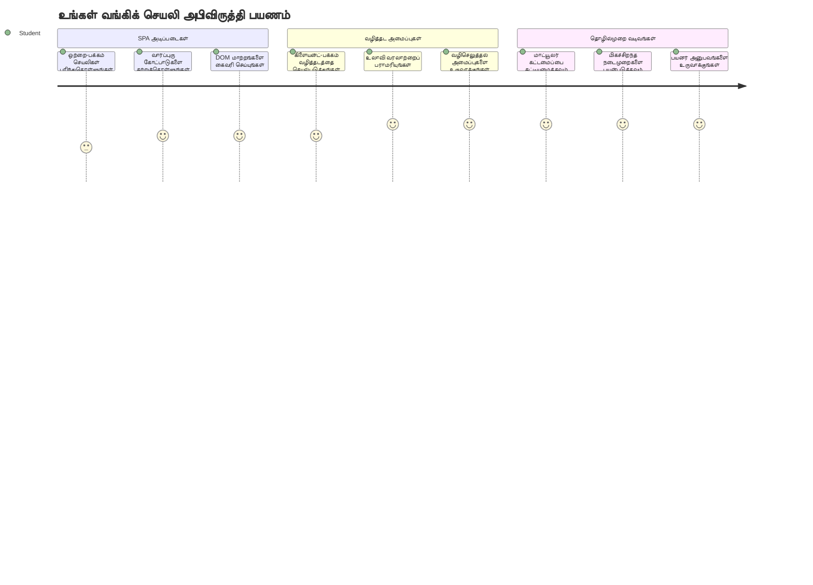
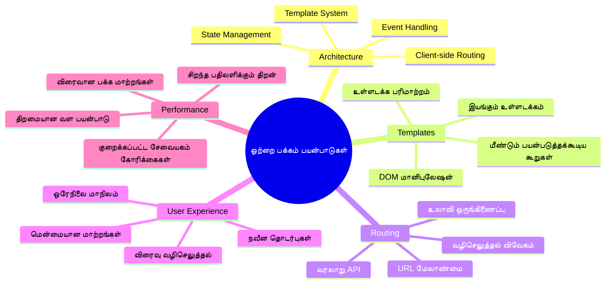
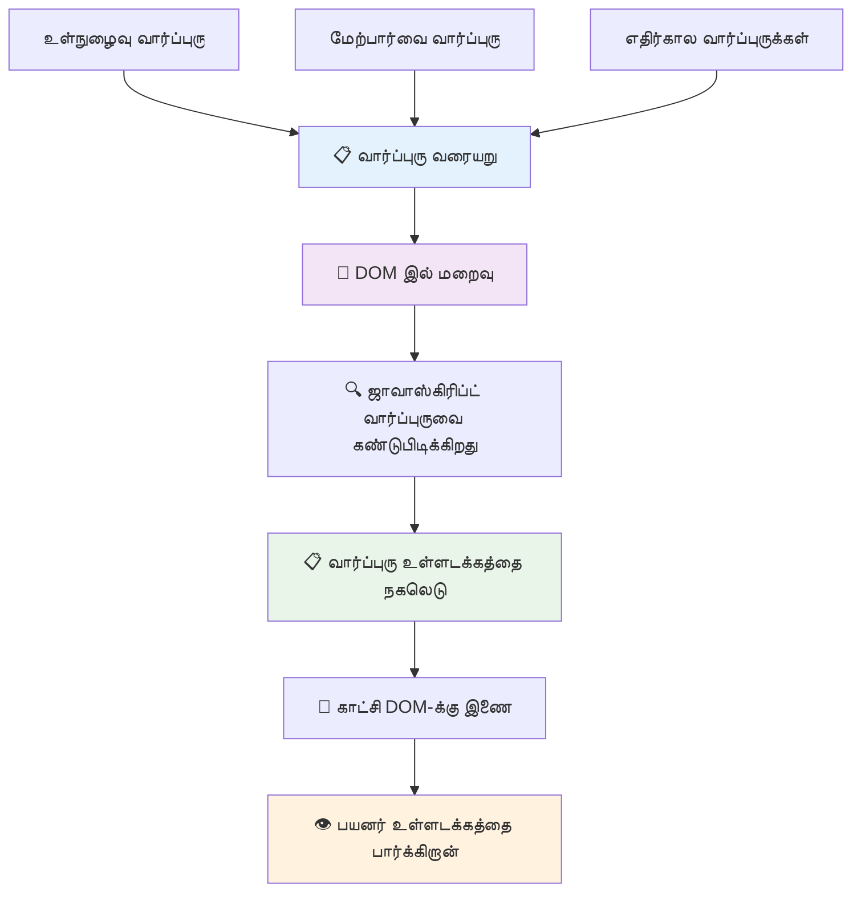
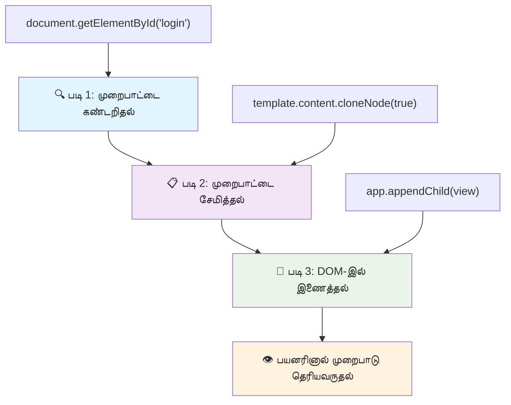
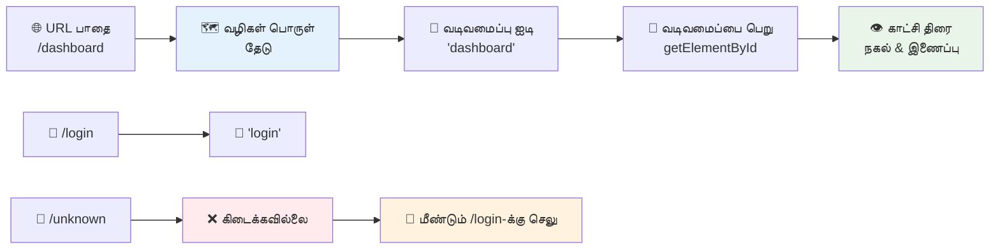
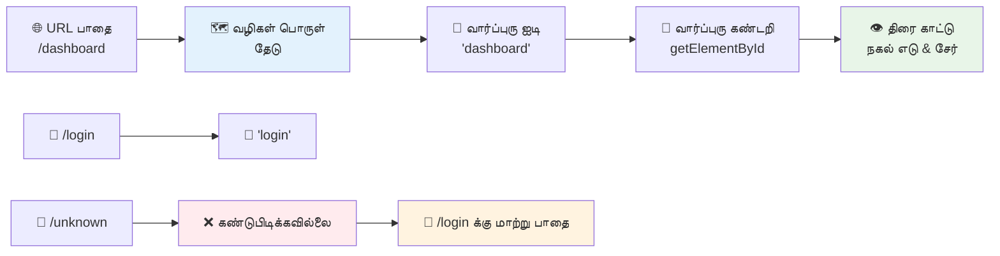
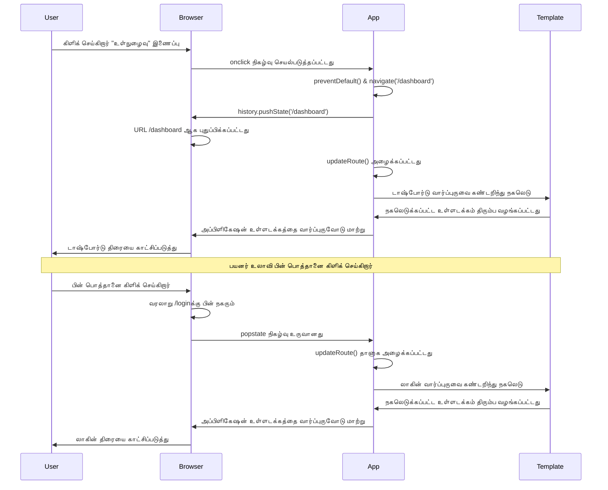
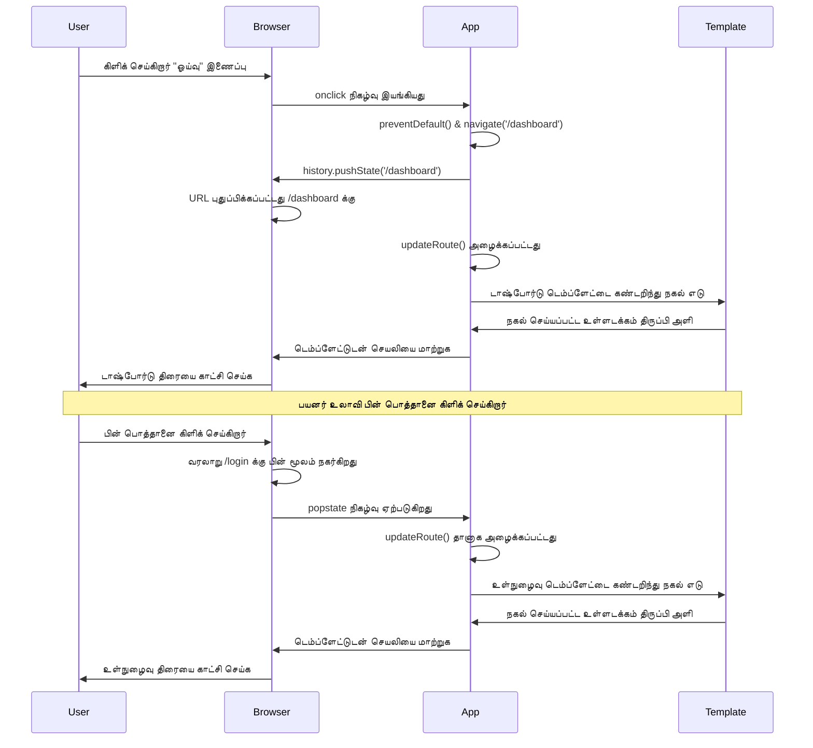
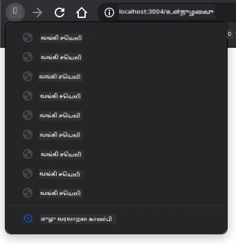
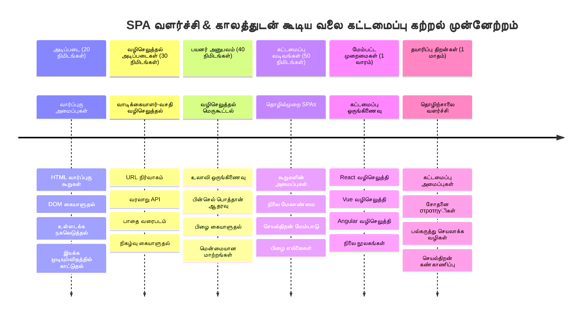

# வங்கித் தொடர்பான செயலியை உருவாக்கல் பகுதிக்கு 1: வெப் செயலியில் HTML வார்ப்புருக்கள் மற்றும் வழிமுறைகள்


1969-ல் Apollo 11 இன் வழிகாட்டும் கணினி சந்தைக்கு செல்லும்போது, முழு கணினியை மீண்டும் துவங்காமல் வெவ்வேறு செயலிகள் இடையில் மாறத் எண்ணியது. நவீன வலை செயலிகள் இதே போன்ற செயல்பாடுகளைப் பயன்படுத்துகின்றன – எல்லாவற்றையும் மீண்டும் ஏற்றாமல் நீங்கள் பார்க்கும் உள்ளடகத்தை மாற்றுகின்றன. இதனால் இன்று பயனர்கள் எதிர்பார்க்கும் மென்மையான, வேகமான அனுபவம் உருவாகிறது.

எல்லா தொடர்புகளுக்கும் முழு பக்கத்தையும் மீண்டும் ஏற்றும் பாரம்பரிய இணையதளங்கள் தவிர, நவீன வெப் செயலிகள் மாற்ற வேண்டிய பகுதியை மட்டும் புதுப்பிக்கின்றன. இந்த அணுகுமுறை, வானவரிசை கட்டுப்பாடு வேரியப்பட்ட திரைகள் இடையில் மாறும் பொழுது நிலையில் தொடர்ந்துத்தான் தொடர்பில் இருப்பது போல, ஒரு உயர்தர மற்றும் மென்மையான அனுபவத்தை உருவாக்குகிறது.

இங்கே வித்தியாசமான அம்சங்கள்:

| பாரம்பரிய பல பக்க செயலிகள் | நவீன ஒரே பக்க செயலிகள் |
|----------------------------|-------------------------|
| **நெவிகேஷன்** | ஒவ்வொரு திரைக்கும் முழுமையான பக்கம் மீண்டும் ஏற்றம் | உடனடி உள்ளடக்க மாற்றம் |
| **செயல்திறன்** | முழு HTML பதிவிறக்கம் காரணமாக மெதுவானது | பகுதி புதுப்பிப்புகளுடன் வேகமானது |
| **பயனர் அனுபவம்** | திடீர் பக்க மேம்பாடுகள் | மென்மையான, செயலி போன்ற இடமாற்றங்கள் |
| **தரவு பகிர்வு** | பக்கங்களுக்கு இடையே கடினம் | நிலை பராமரிப்பு எளிது |
| **ஆராய்ச்சி** | பல HTML கோப்புகளை பராமரிக்க வேண்டும் | ஒரே HTML மற்றும் தானியங்கி வார்ப்புருக்கள் |

**மாற்றத்தின் புரிதல்:**
- **பாரம்பரிய செயலிகள்** ஒவ்வொரு செயலியும் சர்வரை கேள்விகள் செய்யவேண்டும்
- **நவீன SPAs** ஒருமுறை ஏற்றிக்கொண்டு, ஜாவாஸ்கிரிப்ட் மூலம் உள்ளடடையை動ையாக புதுப்பிக்கின்றன
- **பயனர் எதிர்பார்ப்புகள்** இப்போது உடனடி, இடையில்லா தொடர்புகளை வலியுறுத்துகின்றன
- **செயல்திறன் நன்மைகள்** குறைந்த வலைப்பாதை செலவுடன் மற்றும் வேகமான பதில்கள்

இந்த பாடத்தில், நாங்கள் பல திரைகளைக் கொண்ட வங்கித் தொடர்பான செயலியை உருவாக்கப் போகிறோம், அவை இணக்கமான முறையில் இணைக்கப்படும். விஞ்ஞானிகள் பல்வேறு பரிசோதனைகளுக்கான மாற்றக்கூடிய கருவிகள் பயன்படுத்துவது போல, நாங்கள் HTML வார்ப்புருக்களை மீண்டும் பயன்படுத்தக்கூடிய கூறுகளாகப் பயன்படுத்துவோம், அவை தேவைக்கேற்ப காட்சியளிக்கப்படும்.

நீங்கள் HTML வார்ப்புருக்கள் (பலகையிடக்கூடியவும் பல்வேறு திரைகளுக்கான திட்டங்கள்), ஜாவாஸ்கிரிப்ட் வழிச் சர்க்குலேஷன் (திரைகள் இடையே மாறுதல் செய்பவர்), மற்றும் உலாவியின் வரலாற்று API (மீண்டும் பின் செல்லும் பொத்தானை இயங்கவைக்கும்) ஆகியவற்றுடன் வேலை செய்யப் போகிறீர்கள். இவை React, Vue, Angular போன்ற கூறுத் தளங்கள் பயன்படுத்தும் அடிப்படை தொழில்நுட்பங்களே.

கடைசியில், நீங்கள் தொழில்முறை ஒரே பக்க பயன்பாட்டின் கோட்பாடுகளை காட்சிப்படுத்தும் செயலி ஒன்றை உருவாக்கி காட்டுவீர்கள்.


## முன் வகுப்பு வினாதரை

[முன் வகுப்பு வினாதரை](https://ff-quizzes.netlify.app/web/quiz/41)

### நீங்கள் தேவையாயிருக்கும்வை

வங்கித் தொடர்பான செயலியை சோதிக்க உள்ளூர் வலைப்பservedone server வேண்டும – கவலைப்பட வேண்டாம், இது காட்டினதும் எளிது! நீங்கள் ஏற்கனவே ஒன்றை செட் செய்யவில்லை என்றால், [Node.js](https://nodejs.org) ஐ நிறுவி உங்கள் திட்ட அடைவிலிருந்து `npx lite-server` ஐ இயக்கவும். இந்த கட்டளை ஒரு உள்ளூர் சேவையகத்தை துவக்கிய பிறகு உங்களது செயலியை உலாவியில் தானாகத் திறக்கும்.

### தயாரிப்பு

உங்கள் கணினியில் `bank` என்ற அடைவை உருவாக்கி, அதில் `index.html` என்ற கோப்பை பதியுங்கள். நாம் ஆரம்பிப்போம் இந்த HTML [பாயிலர்பிளேட்](https://en.wikipedia.org/wiki/Boilerplate_code) உடன்:

```html
<!DOCTYPE html>
<html lang="en">
  <head>
    <meta charset="UTF-8">
    <meta name="viewport" content="width=device-width, initial-scale=1.0">
    <title>Bank App</title>
  </head>
  <body>
    <!-- This is where you'll work -->
  </body>
</html>
```

**இந்த பாயிலர்பிளேட் வழங்குவது:**
- **HTML5 ஆவண அமைப்பை** சரியான DOCTYPE அறிக்கை உடன் நிறுவுகிறது
- **UTF-8 எழுத்து குறியீட்டை** சர்வதேச எழுத்துக்களை ஆதரிக்க அமைக்கிறது
- **பார்வை இடைச்சொல் தேர்ந்தெடுக்கப்பட்டு** மொபைல் சாதன பொருந்தும் வகையில் செயற்படுத்துகிறது
- **உலாவித் தாவலில் தோன்றும்** விளக்கமான தலைப்பை அமைக்கிறது
- **தூய்மையான உடல் பகுதியை** உருவாக்குகிறது, இங்கே செயலியை உருவாக்குவோம்

> 📁 **திட்ட அமைப்பு முன்னோட்டம்**
> 
> **இந்த பாட முடிவில், உங்கள் திட்டத்தில் உள்ளவை:**
> ```
> bank/
> ├── index.html      <!-- Main HTML with templates -->
> ├── app.js          <!-- Routing and navigation logic -->
> └── style.css       <!-- (Optional for future lessons) -->
> ```
> 
> **கோப்ப ஓட்டங்கள்:**
> - **index.html**: அனைத்து வார்ப்புருக்களையும் கொண்டிருக்கும் மற்றும் செயலி அமைப்பை வழங்கும்
> - **app.js**: வழிச் சர்க்குலேஷன், நெவிகேஷன், வார்ப்புரு மேலாண்மை செய்யும்
> - **வார்ப்புருக்கள்**: நுழைவு, டாஷ்போர்டு மற்றும் பிற திரைகளுக்கான UI நிர்ணயிக்கும்

---

## HTML வார்ப்புருக்கள்

வார்ப்புருக்கள் வலை முன்னேற்றத்தில் அடிப்படையான பிரச்சனையைத் தீர்க்கின்றன. 1440களில் குட்டன் நகர்த்தக்கூடிய அச்சிடும் அகராதியை கண்டுபிடித்தபோது, முழுப் பக்கங்களை உறிஞ்சியவாறு தயாரிப்பதற்குப் பதிலாக மீண்டும் பயன்படுத்தக்கூடிய எழுத்துப் பகுதிகளை உருவாக்கி அவற்றை தேவைக்கேற்ப ஒழுங்குபடுத்த முடியும் என்று உணர்ந்தார். HTML வார்ப்புருக்கள் அதே கோட்பாடு – ஒவ்வொரு திரைக்கும் தனித்தனியான HTML கோப்புகளை உருவாக்கும் பதிலாக, தேவைத்தால் காட்சியளிக்கக்கூடிய பலமுறை பயன்படுத்தக்கூடிய அமைப்புகளை வரையறுக்கிறீர்கள்.


வார்ப்புருக்களை உங்கள் செயலியின் வெவ்வேறு பகுதிகளுக்கான திட்டங்களாக நினைத்துக்கொள்ளுங்கள். ஒரு கட்டிடக்கலைஞர் ஒரே திட்டத்தை உருவாக்கி அதே அறைகளை மறு முறையாக வரைந்து சென்னைபடாமல் பயன்படுத்தினாரா அதுபோலவே, நாங்கள் வார்ப்புருக்களை ஒருமுறை உருவாக்கி தேவைக்கேற்ப பயன்படுத்துகிறோம். உலாவி இந்த வார்ப்புருக்களை ஜாவாஸ்கிரிப்ட் செயல்படுத்தும் வரை மறைக்கிறது.

ஒரு வலைப்பக்கத்துக்கு பல திரைகள் உருவாக்க விரும்பினால், சிறந்த தீர்வு ஒவ்வொரு திரைக்கும் தனிப்பட்ட HTML கோப்புகளை உருவாக்குவது. ஆனால் இதற்கு சில தவறுகள் உள்ளன:

- திரையை மாற்றும்போது முழு HTMLஐ மீண்டும் ஏற்றவேண்டும், இது மெதுவாக இருக்கும்.
- வெவ்வேறு திரைகளுக்கு இடையேயான தரவு பகிர்வு கடினம்.

மற்றொரு வழி ஒரு HTML கோப்பில் பல [HTML வார்ப்புருக்களை](https://developer.mozilla.org/docs/Web/HTML/Element/template) `<template>` உறுப்பைப் பயன்படுத்தி வரையறுப்பது. வார்ப்புரு என்பது மறைக்கப்பட்ட HTML தொகுதி, உலாவி அதை காண்பிக்காது, மற்றும் இயக்க நேரத்தில் ஜாவாஸ்கிரிப்ட் மூலம் உருவாக்கவேண்டும்.

### இதைப் பின்பற்றுவோம்

நாம் இரண்டு முக்கிய திரைகளை கொண்ட வங்கி செயலியை உருவாக்கப்போகிறோம்: நுழைவு பக்கம் மற்றும் டாஷ்போர்டு. முதலில், HTML உடல் பகுதியில் ஒரு இட ஒதுக்கீட்டை சேர்ப்போம் – இங்கு நமது அனைத்து திரைகளும் காட்சியளிக்கப்படும்:

```html
<div id="app">Loading...</div>
```

**இந்த இடஒதுக்கீட்டை புரிந்துகொள்ளவும்:**
- அனைத்துத் திரைகளும் காட்சியளிக்கும் இடமாக "app" என்ற அடையாளம் கொண்ட ஒரு தொகுப்பை உருவாக்குகிறது
- ஜாவாஸ்கிரிப்ட் முதற்கட்ட திரையை துவங்கும் வரை ஏற்றுமதி செய்தல் செய்தி காட்டப்படுகிறது
- வாடிக்கையாளர்களுக்கான ஒரே மைய புள்ளியை குறிப்பதால், சாஃப்ட் உள்ளடக்கத்தை இங்கே ஏற்றி வைக்க முடியும்
- `document.getElementById()` மூலம் எளிதாக இலக்காக அமைக்க முடியும்

> 💡 **விபரம் குறிப்பு**: இவ்வான இடத்தின் உள்ளடக்கம் மாற்றப்படுவதால், செயலி ஏற்றிக் கொண்டிருக்கையில் காட்ட ஒரு ஏற்றுமதி செய்தி அல்லது குறியீட்டை இங்கு வைக்கலாம்.

இப்போது நுழைவு பக்கத்துக்கான HTML வார்ப்புருவை இதற்கு கீழே சேர்ப்போம். தற்போது அதில் ஒரு தலைப்பு மற்றும் நெவிகேஷன் செய்ய உபயோகப்படும் ஒரு இணைப்பு பகுதி மட்டும் வைத்துள்ளோம்.

```html
<template id="login">
  <h1>Bank App</h1>
  <section>
    <a href="/dashboard">Login</a>
  </section>
</template>
```

**இந்த நுழைவு வார்ப்புருவின் விளக்கம்:**
- ஜாவாஸ்கிரிப்டிற்கு இலக்காக பணியாற்றும் தனிச்ச் அடையாளம் "login" கொண்ட வார்ப்புரு வரையறுக்கிறது
- செயலியின் பிராண்ட் பெயரைச் சொல்லும் பிரதான தலைப்பை கொண்டுள்ளது
- சார்ந்த உள்ளடக்கங்களை கூடி அணுக்குழு செய்யும் `<section>` உறுப்பை கொண்டுள்ளது
- பயனர்களை டாஷ்போர்டுக்கு நகர்த்தும் வழிச் சேர்ந்த இணைப்பு உள்ளது

பின்பு டாஷ்போர்டு பக்கத்துக்கான மற்றொரு HTML வார்ப்புருவை சேர்ப்போம். இதில் பல பகுதிகள் இருக்கும்:

- தலைப்பில் தலைப்பு மற்றும் வெளியேறும் இணைப்பு
- தற்போதைய வங்கி கணக்கு இருப்பு
- பரிவர்த்தனைகள் பட்டியல், அட்டவணையில் காண்பித்தல்

```html
<template id="dashboard">
  <header>
    <h1>Bank App</h1>
    <a href="/login">Logout</a>
  </header>
  <section>
    Balance: 100$
  </section>
  <section>
    <h2>Transactions</h2>
    <table>
      <thead>
        <tr>
          <th>Date</th>
          <th>Object</th>
          <th>Amount</th>
        </tr>
      </thead>
      <tbody></tbody>
    </table>
  </section>
</template>
```

**இந்த டாஷ்போர்டின் ஒவ்வொரு பகுதிகளையும் புரிந்துகொள்வோம்:**
- வழிச் சேர்ந்துள்ளது `<header>` semantic உறுப்பை பயன்படுத்தி, நெவிகேஷனை கொண்டுள்ளது
- காட்சியளிக்கும் இடங்களில் செயலியின் தலைப்பை ஒப்பிருந்ததாக காட்டுகிறது
- வெளியேறும் இணைப்பை கொண்டுள்ளது, இது நுழைவு திரைக்கு நகர்த்தும்
- தற்போதைய கணக்கு இருப்பை தனித்த பகுதியில்தான் காட்டுகிறது
- பரிவர்த்தனை தரவை நன்கு அமைக்கப்பட்ட HTML அட்டவணை இயக்குகின்றது
- அட்டவணை தலைப்புகளில் தேதி, பொருள், மற்றும் தொகை ஆகியன வரையறுக்கப்பட்டுள்ளன
- அட்டவணையின் உட்பகுதி காலியாக உள்ளது, பின்னர் இயங்கும் உள்ளடக்கம் சேர்க்கப்படும்

> 💡 **விபரம் குறிப்பு**: HTML வார்ப்புருக்களை உருவாக்கும் போது, `<template>` மற்றும் `</template>` வரிகளை `<!-- -->` கமெண்ட் செய்து பார்க்கலாம், அதேபோல் அது எப்படி தோன்றும் என்பதை காணலாம்.

### 🔄 **கல்வி சரிபார்ப்பு**
**வார்ப்புரு முறை புரிதல்**: ஜாவாஸ்கிரிப்ட் நடைமுறைப்படுத்துவதற்கு முன் நீங்கள் கண்டிப்பாக தெரிந்துகொள்ள வேண்டும்:
- ✅ வார்ப்புருக்கள் சாதாரண HTML உறுப்புகளிலிருந்து எப்படி வேறுபடுகின்றன
- ✅ வார்ப்புருக்கள் ஜாவாஸ்கிரிப்ட் செயல்படுத்தும் வரை மறைக்கப்படும் காரணம்
- ✅ வார்ப்புருக்களில் semantic HTML அமைப்பின் முக்கியத்துவம்
- ✅ வார்ப்புருக்கள் மீண்டும் பயன்படுத்தக்கூடிய UI கூறுகளாக செயல்பட உதவுவது

**மிகுந்து விரைவான சோதனை**: உங்கள் HTMLக்கு சுற்றி உள்ள `<template>` குறிகளை நீக்கினால் என்ன ஆகும்?
*பதில்: உள்ளடக்கம் உடனடியாக காட்சியளிக்கும் மற்றும் வார்ப்புரு செயல்பாடு இழக்கும்*

**கட்டிட நன்மைகள்**: வார்ப்புருக்கள் வழங்குவது:
- **மீண்டும் பயன்படுத்தல்**: ஒரு வரையறை, பல இனம்
- **செயல்திறன்**: தேவையில்லாத HTML பகுப்பாய்வு இல்லாமல்
- **மேலாண்மை**: மையபடுத்தப்பட்ட UI அமைப்பு
- **மாற்றுத்திறன்**: தானாக உள்ளடக்க மாற்றங்கள்

✅ வார்ப்புருக்களில் ஏன் `id` பண்புகளை பயன்படுத்துகிறோம்? வகுப்புகள் போன்ற வேறுபாடுகளை பயன்படுத்த முடியாது?

## ஜாவாஸ்கிரிப்ட் மூலம் வார்ப்புருக்களை உயிருடன் கொண்டுவருதல்

இப்போது வார்ப்புருக்களை செயல்படக் கூடியதாக மாற்ற வேண்டும். மூன்று-அளவு அச்சுப்பொறியர் ஒரு டிஜிட்டல் திட்டத்தை உடல்தொகுதியாக உருவாக்கும் போன்று, ஜாவாஸ்கிரிப்ட் மறைக்கப்பட்ட வார்ப்புருக்களை எடுத்துக் கொண்டு அவற்றை காட்சியளிக்கும், தொடர்புபடுத்தக்கூடிய கூறுகளாக மாற்றுகிறது.

இந்த செயல்முறை நவீன வலை முன்னேற்றத்தின் மூன்று அடையாளமான படிகளைக் கொண்டுள்ளது. இதை புரிந்துகொண்டவுடன், நீங்கள் பல கூறுத் தளங்களிலும் இந்த முறையை எதிர்பார்க்க முடியும்.

உங்கள் தற்போதைய HTML கோப்பை உலாவியில் இயக்கினால், `Loading...` என்ற செய்தி தோன்றியவாறு அதிர்கிறது. ஏனெனில், விண்ணப்ப HTML வார்ப்புருக்களை உருவாக்குவதற்கான சில ஜாவாஸ்கிரிப்ட் குறியீடுகள் சேர்க்கப்படவில்லை.

ஒரு வார்ப்புருவை உருவாக்குவதற்கு பொதுவாக 3 படிகள் உள்ளன:

1. DOM இல் வார்ப்புரு உறுப்பை பெறுதல், உதாரணமாக [`document.getElementById`](https://developer.mozilla.org/docs/Web/API/Document/getElementById) பயன்படுத்த.
2. வார்ப்புருவை நகலெடுக்கல், [`cloneNode`](https://developer.mozilla.org/docs/Web/API/Node/cloneNode) பயன்படுத்தி.
3. அதை காட்சியளிக்கும் இடத்தில் சேர்ப்பது, உதாரணமாக [`appendChild`](https://developer.mozilla.org/docs/Web/API/Node/appendChild) பயன்படுத்தி.


**செயல்முறை காட்சி வடிவம்:**
- **படி 1** தவம்பட்ட வார்ப்புருவை DOM அமைப்பில் கண்டறியும்
- **படி 2** பாதுகாப்பாக மாற்றக்கூடிய வேலை நகலை உருவாக்கும்
- **படி 3** நகலை காட்சியளிக்கும் பக்கத்தின் பகுதியில் சேர்க்கும்
- **பலன்** பயனர்கள் தொடர்பு கொள்ளக்கூடிய செயல்படும் திரை உருவாகும்

✅ நாம் வார்ப்புருவை DOMக்கு ஒட்டுவதற்கு முன் ஏன் நகலெடுக்க வேண்டும்? இந்த படியை தவிர்த்தால் என்ன ஆகும் என்று நினைக்கிறீர்கள்?

### பண்பு

உங்கள் திட்ட அடைவில் `app.js` என்ற புதிய கோப்பை உருவாக்கி, அதை HTMLஇன் `<head>` பகுதியில் இறக்குமதி செய்க:

```html
<script src="app.js" defer></script>
```

**இந்த ஸ்கிரிப்ட் இறக்குமதி புரிதல்:**
- JavaScript கோப்பினை HTML ஆவணத்துடன் இணைக்கும்
- `defer` பண்பு மூலம் HTML பகுப்பாய்வு முடிந்த பிறகு ஸ்கிரிப்ட் இயங்குகிறது
- உள்ளடக்கும் DOM உறுப்புகளுக்கு முழுமையான அணுகல் கிடைக்கிறது, ஏனெனில் ஸ்கிரிப்ட் முன்னர் இயங்காது
- ஸ்கிரிப்ட் ஏற்றும் முறைகளிலும் செயல்திறனிலும் நவீன சிறந்த நடைமுறைகளை பின்பற்றுகிறது

இப்போது `app.js` ல், `updateRoute` எனும் புதிய செயல்பாட்டைப் படுக்கலாம்:

```js
function updateRoute(templateId) {
  const template = document.getElementById(templateId);
  const view = template.content.cloneNode(true);
  const app = document.getElementById('app');
  app.innerHTML = '';
  app.appendChild(view);
}
```

**படிச் சுவடுகள் என்றழைக்கப்படும் நிலையை அறிவோம்:**
- தனிச்சிறப்பு அடையாளம் கொண்டு வார்ப்புரு உறுப்பை கண்டறிகிறது
- `cloneNode(true)` பயன்படுத்தி வார்ப்புரு உள்ளடக்கத்தை ஆழ்ந்த நகலாக உருவாக்குகிறது
- உள்ளடக்கு காட்சியளிக்கப்படும் "app" பெட்டியை காண்கிறது
- உள்ளடக்கத்தை துடைக்கிறது
- நகலாக்கப்பட்ட வார்ப்புரு உள்ளடக்கத்தை DOMஇல் காட்சியளிக்கிறது

இப்போது இந்த செயல்பாட்டை ஒரு வார்ப்புருவோடு கூடி அழைத்து முடிவை பாருங்கள்.

```js
updateRoute('login');
```

**இந்த 함수 அழைப்பின் செயல்பாடுகள்:**
- "login" ஐ அடையாளமாகக் கொண்ட வார்ப்புருவை இயக்கு
- செயலியின் பல திரைகளுக்கு இடையே நிரலைக் கொண்டு மாறுவது எப்படி என்பதை காட்டுகிறது
- "Loading..." செய்தி இடத்தில் நுழைவு திரையை காட்சியளிக்கிறது

✅ இந்த குறியீட்டின் நோக்கம் என்ன `app.innerHTML = '';`? இதை இல்லாமல் செய்தால் என்ன ஆகும்?

## வழிமுறைகள் உருவாக்கல்

வழிச் சர்க்குலேஷன் என்றால் அடிப்படையில் URL களை சரியான உள்ளடக்கத்துடன் இணைத்தல். பழைய தொலைபேசி சார்ஜர்கள் போல் கலையொசை பயன்படுத்தி அழைப்புகளை இணைத்தபடி, இந்தச் சர்க்குலேஷனும் URL கோரிக்கையைப் பெற்று பொருத்த உள்ளடக்கத்திற்குக் கொண்டு செல்லிறது.


சாதாரணமாக, வலை சேவை வழங்கிகள் URL க்கான வேறுபட்ட HTML கோப்புகளை வழங்கி இதைக் கையாள்ந்தனர். நாங்கள் ஒரே பக்க செயலி உருவாக்குவதால், இந்த சர்க்குலேஷனை ஜாவாஸ்கிரிப்டில் நாம் தான் கையாள வேண்டும். இதனால் பயனர் அனுபவம் மற்றும் செயல்திறன் மேம்படும்.


**சர்க்குலேஷன் ஓட்டத்தின் புரிதல்:**
- URL மாற்றங்கள் நமது வழிகள் அமைப்பின் சரிபார்ப்பை தூண்டும்
- செல்லுபடியான வழிகள் குறிப்பிட்ட வார்ப்புரு அடையாளங்களோடு வரைபடப்படும்
- செல்லாத வழிகள் தவறான நிலைகளைத் தவிர்ப்பதற்கான கையாள்வு ನಡೆಸும்
- வார்ப்புரு காட்சி படி முன்னர் கற்ற 3 படிகள் வழிகாட்டும்

வலை செயலியைப் பேசும் போது *வழிச் சர்க்குலேஷன்* என்பது காட்ட வேண்டிய திரைகளுக்கு **URLகளை** ஒதுக்குதல் ஆகும். பல HTML கோப்புகள் கொண்ட இணையதளத்தில், இது கோப்புப்பாதை URL இல் பிரதிபலிக்கப்படுகிறது. உதாரணமாக, உங்கள் திட்ட அடைவில் இவ்வாறு கோப்புகள் இருந்தால்:

```
mywebsite/index.html
mywebsite/login.html
mywebsite/admin/index.html
```

`mywebsite` என்ற வேரில் உள்ள ஒரு வலை சேவையகத்தை உருவாக்கினால், URL வரைபடம்:

```
https://site.com            --> mywebsite/index.html
https://site.com/login.html --> mywebsite/login.html
https://site.com/admin/     --> mywebsite/admin/index.html
```

தயவுசெய்து நினைவில் வையுங்கள், நமது ஒரே HTML கோப்பில் அனைத்து திரைகளும் உள்ளதால், இயல்பான செயல் நமக்கு உதவும். நாம் இந்த வரைபடத்தை கையேடு முறையில் செய்து, ஜாவாஸ்கிரிப்ட் மூலம் காட்சியளிக்கும் வார்ப்புருவை புதுப்பிக்க வேண்டும்.

### பண்பு

நாம் ஒரு எளிய பொருளை [வரைபடமாக](https://en.wikipedia.org/wiki/Associative_array) பயன்படுத்தி URL பாதைகளுக்கும் நமது வார்ப்புருக்களுக்கும் இடையேயான இணைப்பை உருவாக்கப்போகிறோம். இதனை `app.js` கோப்பின் மேலிருப்பிற்கு சேர்க்கவும்.

```js
const routes = {
  '/login': { templateId: 'login' },
  '/dashboard': { templateId: 'dashboard' },
};
```

**இந்த வழிகள் அமைப்பின் புரிதல்:**
- URL பாதைகளுக்கும் வார்ப்புரு அடையாளங்களுக்கும் இடையேயான வரைபாட்டைக் குறிப்பிடுகிறது
- பொருள் நிரல் சுருக்க தலைப்புகள் URL பாதைகள், மதிப்புகள் வார்ப்புரு விவரங்களாக உள்ளன
- ஒரு URLக்கான வார்ப்புருவை எளிதில் தேட உதவும்
- எதிர்காலத்தில் புதிய வழிகளை சேர்க்க விரிவாக்கமுடியும்படி அமைப்பை வழங்குகிறது
இப்போது `updateRoute` செயல்பாட்டைப் சிறிது மாற்றுவோம். `templateId`-ஐ நேரடியாக வாதமாக மாற்றுவதற்குப் பதிலாக, முதலில் தற்போதைய URL ஐ பார்த்து எடுத்துக்கொண்டு, பின்னர் அந்த URL உடன் பொருந்தும் template ID மதிப்பை எடுக்க விரும்புகிறோம். URL இல் இருந்து பாதை பகுதியை மட்டும் பெற [`window.location.pathname`](https://developer.mozilla.org/docs/Web/API/Location/pathname) பயன்படுத்தலாம்.

```js
function updateRoute() {
  const path = window.location.pathname;
  const route = routes[path];

  const template = document.getElementById(route.templateId);
  const view = template.content.cloneNode(true);
  const app = document.getElementById('app');
  app.innerHTML = '';
  app.appendChild(view);
}
```

**இங்கே என்ன நடக்கிறது என்று உடைத்துப் பார்ப்போம்:**
- **திறக்குகிறது** உலாவியின் URL இல் இருந்து தற்போதைய பாதையை `window.location.pathname` மூலம்
- **தேடுகிறது** routes பொருளில் பொருந்தும் சுற்று தொகுப்பை
- **பெறுகிறது** சுற்று தொகுப்பில் இருந்து template ID-ஐ
- **தொடர்கிறது** முந்தைய மாதிரி புரிந்துகொள்ளும் செயல்முறையைப் போலவே
- **உருவாக்குகிறது** URL மாற்றங்களுக்கு பதிலளிக்கும் வினாடி வடிவமைப்பை

இங்கே நாம் அறிவித்துள்ள சுற்றுகளுக்கு பொருந்தும் template-ஐ இணைத்துள்ளோம். உலாவியில் URL-ஐ கையேடு முறையில் மாற்றி இது நன்கு வேலை செய்கிறதா என்பதைச் சோதிக்கலாம்.

✅ URL இல் தெரியாத பாதையை நுழைத்தால் என்ன நடக்கும்? இதை எப்படி தீர்க்கலாம்?

## வழிசெலுத்தலைச் சேர்க்குதல்

சுற்றுப்பாதைகளைக் நிறுவியவுடன், பயனர்கள் செயலியை வழிசெலுத்த ஒரு வழி வேண்டும். பாரம்பரிய இணையதளங்கள் இணைப்புகளை கிளிக் செய்தால் முழு பக்கங்களை மறுபடியும் ஏற்றிக் கொள்கின்றன, ஆனால் நாங்கள் URL மற்றும் உள்ளடக்கத்தையும் பக்கம் புதுப்பிப்பு இல்லாமல் புதுப்பிக்க விரும்புகிறோம். இது டெஸ்க்டாப்பு செயலிகள் போலவே, வேறு பார்வைகளுக்கு மாறும் ஒரு மென்மையான அனுபவத்தை உருவாக்குகிறது.

நாம் இரண்டு விஷயங்களை ஒருங்கிணைக்க வேண்டும்: பயனர்கள் பக்கங்களை புத்தகக் குறியீடாக வைத்துக் கொள்ளவும், இணைப்புகளை பகிரவும் URL ஐ புதுப்பிக்கும் போது, அப்புறம் பொருத்தமான உள்ளடக்கத்தைக் காண்பிக்கும். சரியாக நடைமுறைப்படுத்தப்பட்டால், இது நவீன செயலிகளின் எதிர்பார்க்கப்பெற்ற ஒருங்கிணைந்த வழிசெலுத்தலை உருவாக்கும்.


### 🔄 **கற்றல் ஒழுங்கு சரிபார்ப்பு**
**ஒற்றை-பக்கம் செயலி கட்டமைப்பு**: முழு அமைப்பை உங்கள் புரிதலை சரிபார்க்கவும்:
- ✅ கிளையன்ட்-பக்க சுற்றுப்பாதை பாரம்பரிய சர்வர்-பக்க சுற்றுப்பாதையிலிருந்து எப்படி வேறுபடுகிறது?
- ✅ சரியான SPA வழிசெலுத்தலுக்காக History API ஏன் அவசியம்?
- ✅ template-கள் பக்கத்தை மீண்டும் ஏற்றாமல் விதிவிலக்கான உள்ளடக்கத்தை எப்படி வழங்குகின்றன?
- ✅ வழிசெலுத்தலை இடையூறுகளைப் பெறுவதில் நிகழ்வு கையாள்வின் பங்கு என்ன?

**அமைப்பு ஒருங்கிணைப்பு**: உங்கள் SPA கீழ்காணுதலைத் தாங்குகிறது:
- **Template மேலாண்மை**: மாற்றம் கொள்ளக்கூடிய உள்ளடக்கத்துடன் புனர்வன்படுத்தக்கூடிய UI கூறுகள்
- **கிளையன்ட்-பக்க சுற்றுப்பாதை**: சர்வர் கோரிக்கைகள் இல்லாமல் URL மேலாண்மை
- **நிகழ்வு சார்ந்த கட்டமைப்பு**: துரிதமான வழிசெலுத்தல் மற்றும் பயனர் தொடர்புகள்
- **உலாவி ஒருங்கிணைப்பு**: சரியான வரலாறு மற்றும் பின்/முன்னிலை பொத்தான்கள் ஆதரவு
- **செயல்திறன் மேம்பாடு**: விரைவு மாற்றங்கள் மற்றும் குறைந்த சர்வர் சுமை

**தொழில் நுட்ப முறை**: நீங்கள் செயல்படுத்தியவைகள்:
- **மாதிரி-காட்சி பிரிப்பும்**: செயலியிலிருந்து template-கள் பிரிக்கப்பட்டுள்ளன
- **அமைப்பு மேலாண்மை**: URL நிலையை காட்டப்பட்ட உள்ளடக்கத்துடன் ஒத்திசைவு செய்தல்
- **பிரோகிரசிவ் மேம்பாடு**: JavaScript மூலம் அடிப்படை HTML செயல்பாடு மேம்படுத்தல்
- **பயனர் அனுபவம்**: பக்க புதுப்பிப்பு இல்லாமல் மென்மையான செயலி போன்ற வழிசெலுத்தல்

> � **கட்டமைப்பு நுணுக்கம்**: வழிசெலுத்தல் அமைப்பு கூறுகள்
>
> **நீங்கள் உருவாக்குவது:**
> - **🔄 URL மேலாண்மை**: பக்கம் புதுப்பிப்பு இல்லாமல் உலாவியின் முகவரி பட்டியை புதுப்பிக்கும்
> - **📋 Template அமைப்பு**: தற்போதைய சுற்றுபாதை அடிப்படையில் உள்ளடக்கத்தை மாற்றுதல்  
> - **📚 வரலாறு ஒருங்கிணைப்பு**: பின்/முன்னிலை பொத்தானின் செயல்பாடு நிலைநாட்டல்
> - **🛡️ பிழை கையாளல்**: தவறான அல்லது காணாத சுற்றுப்பாதைகளுக்கு பாதுகாப்பு
>
> **கூட்டு செயல்பாடு:**
> - **வினைகள்** மற்றும் வரலாறு மாற்றங்களுக்கு கேளுங்கள்
> - **History API**-யைப் பயன்படுத்தி URL புதுப்பிக்கவும்
> - **பொருந்தும் template-ஐ** வெளிப்படுத்தவும்
> - **அனைத்து செயல்பாடுகளிலும் சாதாரணமான பயனர் அனுபவம்** நிலைநாட்டவும்

எங்கள் செயலிக்கு அடுத்த படி URL கையேடு மூலம் மாற்றாமல் பக்கங்களுக்கு இடையேயான வழிசெலுத்தலைச் சேர்ப்பது ஆகும். இதற்குக் இரண்டு விஷயங்கள் தேவை:

  1. தற்போதைய URL ஐ புதுப்பித்தல்
  2. புதிய URL அடிப்படையில் காட்டப்படும் template-ஐ புதுப்பித்தல்

இரண்டாவது பகுதியை `updateRoute` செயல்பாட்டால் பார்த்துவிட்டோம், எனவே தற்போதைய URL-ஐ எப்படி புதுப்பிப்பதென்பதை அறிய வேண்டும்.

JavaScript மற்றும் குறிப்பாக [`history.pushState`](https://developer.mozilla.org/docs/Web/API/History/pushState) ஐப் பயன்படுத்த வேண்டும், இது URL ஐ புதுப்பித்து உலாவி வரலாற்றில் புதிய பதிவை உருவாக்குகிறது, HTML ஐ மீண்டும் ஏற்றாமல்.

> ⚠️ **தனிப்பட்ட குறிப்பு**: HTML ல் உள்ள இணைப்பு கூறு [`<a href>`](https://developer.mozilla.org/docs/Web/HTML/Element/a) தனக்கே URL களுக்கான ஹைப்பர்லிங்க்களை உருவாக்க முடியும், ஆனால் இது உலாவியை இடைஞ்சல் செய்யாமல் தானாக HTML-ஐ மீதமுள்ளாயாமல் ஏற்ற வைக்கும். எனவே, படி வழிசெலுத்தலில், `preventDefault()` மூலம் கிளிக் நிகழ்வின் இயல்பான நடத்தை தடுப்பது அவசியம்.

### பணி

நமது செயலியில் வழிசெலுத்தலுக்காகப் புதிய செயல்பாட்டை உருவாக்குவோம்:

```js
function navigate(path) {
  window.history.pushState({}, path, path);
  updateRoute();
}
```

**இந்த வழிசெலுத்தல் செயல்பாட்டை புரிந்து கொள்வோம்:**
- **புதிய பாதையைப் பயன்படுத்தி** உலாவியின் URL-ஐ `history.pushState`-இன் மூலம் புதுப்பிக்கிறது
- **பின்/முன்னிலை பொத்தான் ஆதரவுக்காக** வரலாறு பட்டியலில் புதிய பதிவு சேர்க்கிறது
- **`updateRoute()` செயல்பாட்டை அழைக்கிறது** பொருந்தும் template-ஐ காட்ட
- **பக்கமறுபதிப்புகள் இல்லாமல்** ஒரே பக்கம் செயலி அனுபவத்தை உருவாக்குகிறது

இந்த முறை முதலில் தரப்பட்ட பாதையின் அடிப்படையில் தற்போதைய URL ஐ புதுப்பித்து, பின்னர் தொகுப்பு தமிழை மாற்றும். `window.location.origin` பண்பு URL அடிப்படையைத் தந்துள்ளதால், பாதையின் அடிப்படையில் முழு URL-ஐ மீண்டும் உருவாக்கலாம்.

இப்போது இந்த செயல்பாட்டைக் கொண்டுள்ளதால், வழி பொருந்தவில்லை என்றால் fallback உதவியாக ஏதோ ஒரு சுற்றுக்கு திருப்பியிட `updateRoute` ஐ மாற்றுவோம்.

```js
function updateRoute() {
  const path = window.location.pathname;
  const route = routes[path];

  if (!route) {
    return navigate('/login');
  }

  const template = document.getElementById(route.templateId);
  const view = template.content.cloneNode(true);
  const app = document.getElementById('app');
  app.innerHTML = '';
  app.appendChild(view);
}
```

**முக்கிய குறிப்புகள்:**
- **தற்போதைய பாதைக்கு** சுற்று இருப்பதைக் சோதிக்கிறது
- **தவறான சுற்றை அணுகும் போது** login பக்கத்திற்கு மாற்றுகிறது
- **எதிர்பாராத வழிசெலுத்தலைத் தடுக்கும்** fallback அமைப்பை வழங்குகிறது
- **பயனர்கள் எப்போதும் செல்லுபடி திரையை** பார்க்குமாறு உறுதி செய்கிறது

சுற்று காணப்படாவிட்டால், இப்போது `login` பக்கத்திற்கு மாற்றுவோம்.

இப்போது இணைப்பை கிளிக் செய்தபோது URL பெறும் மற்றும் உலாவியின் இயல்பான இணைப்பு நடத்தை தடுக்கும் செயல்பாட்டை உருவாக்குவோம்:

```js
function onLinkClick(event) {
  event.preventDefault();
  navigate(event.target.href);
}
```

**இந்த கிளிக் கையாளுதலைப் புரிந்து கொள்வோம்:**
- **கிளிக் நிகழ்வில்** `preventDefault()` வழியாக உலாவியின் இயல்பான இணைப்பைப் பிழையின்றி தடுக்கிறது
- **கிளிக் செய்த இணைப்பிலிருந்து** நோக்கப்படக்கூடிய URL-ஐ எடுத்துக் கொள்கிறது
- **பக்கத்தை மீண்டும் ஏற்றாமல்** நமது வழிசெலுத்தல் செயல்பாட்டை அழைக்கிறது
- **ஒரே பக்கம் செயலி அனுபவம்** மென்மையாக தொடர்கிறது

```html
<a href="/dashboard" onclick="onLinkClick(event)">Login</a>
...
<a href="/login" onclick="onLinkClick(event)">Logout</a>
```

**இந்த `onclick` பிணைத்தல் செய்படும் வேலைகள்:**
- **ஒவ்வொரு இணைப்பையும்** நமது தனிப்பயன் வழிசெலுத்தல் அமைப்புடன் இணைக்கிறது
- **கிளிக் நிகழ்வின் செயலாக்கத்திற்கு** `onLinkClick` செயல்பாட்டை வழங்குகிறது
- **பக்கம் புதுப்பிப்பு இல்லாமல்** தூய்மை வழிசெலுத்தலை இயலுமைப்படுத்துகிறது
- **பயனர்கள் புத்தகக் குறியீடாக சேமிக்கவும் பகிரவும்** உரிய URL அமைப்பை நிலைநாட்டுகிறது

[`onclick`](https://developer.mozilla.org/docs/Web/API/GlobalEventHandlers/onclick) பண்பு `click` நிகழ்வை JavaScript உடன் இணைக்கிறது, இங்கு `navigate()` செயல்பாட்டை அழைக்கிறது.

இந்த இணைப்புகளை தட்டிப்பாருங்கள், உங்களின் செயலியில் உள்ள பல திரைகளுக்கு வழிசெலுத்த முடியும்.

✅ `history.pushState` முறை HTML5 தரத்தில் உள்ளது மற்றும் [அனைத்து நவீன உலாவிகளிலும்](https://caniuse.com/?search=pushState) நடைமுறைப்படுத்தப்பட்டுள்ளது. பழைய உலாவிகளுக்கு வலை செயலி உருவாக்குகிறீர்கள் என்றால், இந்த APIக்கு மாற்றாக பின்வருமாறு செய்யலாம்: பாதைக்கு முன்னிலையில் உள்ள [ஹாஷ்(`#`)](https://en.wikipedia.org/wiki/URI_fragment) பயன்படுத்தி வழிசெலுத்தல் செய்யலாம், இது பொதுவான இணைப்புக் கிளிக் வழிசெலுத்தலைப் பயன்படுத்தி, பக்கம் மறுதேற்றப்படாத வகையில் செயற்படும்.

## பின் மற்றும் முன் பொத்தான்கள் வேலை செய்யச்செய்யும்

பின் மற்றும் முன் பொத்தான்கள் வலை உலாவலில் அத்தியாவசியம், NASA விண்கலம் குழு பழைய நிலைகள் ஆய்வு செய்யும் போலவே. பயனர்கள் இந்த பொத்தான்கள் வேலை செய்ய வேண்டும் என்று எதிர்பார்க்கின்றனர், இல்லையானால் உலாவல் அனுபவம் உடைந்து விடும்.

ஒரே பக்கம் செயலிக்கு இதற்கான கூடுதல் அமைப்புகள் தேவை. உலாவி வரலாறு பட்டியலை கையாள்கிறது (`history.pushState`-ஐ பயன்படுத்தி நீண்டகாலமாக சேர்த்துள்ளோம்) ஆனால் பயனர்கள் வரலாற்றில் வழிசெலுத்தும் போது, செயலி அதற்குச் சரியான உள்ளடக்கத்தை மாற்றிக் காட்ட வேண்டும்.


**முக்கிய தொடர்பு புள்ளிகள்:**
- **பயனர் செயற்பாடுகள்**: கிளிக்குகள் மற்றும் உலாவி பொத்தான்களால் வழிசெலுத்தல் நடக்கிறது
- **செயலி இடையூறு செய்கிறது** இணைப்புத் தட்டுதல்களை தடுப்பதற்கு பக்கம் மறுபடியும் ஏற்றப்படாமலும்
- **History API**: URL மாற்றங்கள் மற்றும் வரலாறு பட்டியலைக் கையாள்கிறது
- **Template-கள்**: ஒவ்வொரு திரைக்கும் உள்ளடக்க அமைப்பை வழங்குகின்றன
- **நிகழ்வு கேட்பவர்கள்**: அனைத்து வழிசெலுத்தல் வகைகளுக்கும் செயலி பதிலளிக்க உறுதி செய்கின்றனர்

`history.pushState` உலாவி வரலாறு பட்டியலில் புதிய பதிவுகளை உருவாக்குகிறது. உலாவியின் *பின் பொத்தானைப்* சில நிலைகளுக்கு நீட்டிப்பதன் மூலம் நீங்கள் இதைச் சரிபார்க்கலாம், இதுபோல காண்பிக்கும்:



பின் பொத்தானை சில தடவைகள் கிளிக் செய்ய முயன்றால், தற்போதைய URL மாற்றப்பட்டாலும், வரலாறு புதுப்பிக்கப்பட்டாலும் அதே template காட்டப்படும்.

ஏனென்றால், செயலி வரலாறு மாற்றப்பட்டுள்ளதை அறிந்து, ஒவ்வாமுறை `updateRoute()`-ஐ அழைக்கவேண்டுமென தெரியவில்லை. [`history.pushState` ஆவணத்தில்](https://developer.mozilla.org/docs/Web/API/History/pushState) கண்டுபிடித்தால், நிலை மாற்றப்படும்போது - வேறொரு URL-க்கு நகரும்போது - [`popstate`](https://developer.mozilla.org/docs/Web/API/Window/popstate_event) நிகழ்வு நிகழும். அந்த நிகழ்வைப் பயன்படுத்தி இந்த பிரச்சனையை சரி செய்யலாம்.

### பணி

உலாவி வரலாறு மாற்றப்பட்டுகொண்டிருக்கும்போது காட்டப்படும் template புதுப்பிக்க, `updateRoute()`-ஐ அழைக்கும் புதிய செயல்பாட்டை இணைக்கவும். இது `app.js` கோப்பின் இறுதியில் சேர்க்க வேண்டும்:

```js
window.onpopstate = () => updateRoute();
updateRoute();
```

**இந்த வரலாறு ஒருங்கிணைப்பைப் புரிந்து கொள்வோம்:**
- பயனர்கள் உலாவி பொத்தான்களால் வழியமைக்கும்போது நிகழும் `popstate` நிகழ்வைத் தொடர்கிறது
- நிகழ்வு கையாளுவோருக்காக குறுகிய `arrow` செயல்பாட்டைப் பயன்படுத்துகிறது
- வரலாறின் நிலை மாறும் போதும் தானாகவே `updateRoute()`-ஐ அழைக்கிறது
- பக்கம் முதன்முறை ஏற்றும்போது செயலியை தொடங்க `updateRoute()`-ஐ அழைக்கிறது
- பயனர்கள் எவ்வாறு வழிசெலுத்தினாலும் சரியான template காட்டப்படுகிறது

> 💡 **திறமை குறிப்புரை**: குறுகிய `arrow` செயல்பாட்டைப் பயன்படுத்தியதால் குறுகிய நுட்பமாக popstate கையாளுதல் செயல்படுத்தப்பட்டுள்ளது, ஆனால் வழக்கமான செயல்பாடு அதேபோல் செயல்படும்.

`arrow` செயல்பாட்டைப் பற்றிய குறுகிய வீடியோ:

[](https://youtube.com/watch?v=OP6eEbOj2sc "Arrow Functions")

> 🎥 மேலுள்ள படத்தைச் சொடுக்கி arrow செயல்பாடுகள் பற்றிய வீடியோவை பார்க்கவும்.

இப்போது உலாவியின் பின் மற்றும் முன்னிலை பொத்தான்களைப் பயன்படுத்தி பாருங்கள், இப்பொழுது சரியாக காட்டப்படும் என்பதைச் சரிபார்க்கவும்.

### ⚡ **அடுத்த 5 நிமிடங்களில் நீங்கள் செய்யக்கூடியவை**
- [ ] உலாவியின் பின்/முன் பொத்தான்களைப் பயன்படுத்தி உங்கள் வங்கி செயலியின் வழிசெலுத்தலை சோதிக்கவும்
- [ ] முகவரி பட்டியில் வேறுபட்ட URL-ஐ கையேடாகப் பதிவு செய்து வழிகாட்டலை சோதிக்கவும்
- [ ] உலாவி DevTools ஐ திறந்து template-கள் DOM இல் எப்படி நகலெடுக்கப்படுகிறதென ஆய்வுசெய்யவும்
- [ ] வழிசெலுத்தல் ஓட்டத்தைப் பதிவுசெய்ய console.log-ஐ சேர்க்கவும்

### 🎯 **இந்த மணிநேரத்தில் நீங்கள் நிறைவு செய்யக்கூடியவை**
- [ ] பாடம் முடிவுக்குப் பிறகு கூடியுள்ள SPA கட்டமைப்பு கருத்துக்களை புரிந்துகொள்ளுங்கள்
- [ ] உங்கள் வங்கி செயலியின் template-களை தொழில்முறை CSS அலைபேசிகளுடன் அழகு செய்யவும்
- [ ] 404 பிழை பக்கத்தை சரியான பிழை கையாளுதலுடன் அமல்படுத்துங்கள்
- [ ] கூடுதல் சுற்றுப்பாதை செயல்பாடுகளுடன் நன்று செய்யத்தகுந்த கிரெடிட்ஸ் பக்கத்தை உருவாக்கவும்
- [ ] பதில் நிலைகளையும் template மாறுதல்களையும் உருவாக்கவும்

### 📅 **உங்கள் ஒரு வார SPA மேம்பாட்டு பயணம்**
- [ ] முழுமையான வங்கி செயலி படிவங்கள், தரவு மேலாண்மை மற்றும் நிலைத்தன்மையை உருவாக்கவும்
- [ ] சுற்றுப்பாதை அளவுருக்கள் மற்றும் உள்நுழையப்பட்ட சுற்றுப்பாதைகளில் முன்னேற்றங்களைச் சேர்த்து மேம்படுத்தவும்
- [ ] வழிசெலுத்தல் காப்பாளர்களையும் அங்கீகாரம் சார்ந்த சுற்றுப்பாதைகளையும் உருவாக்கவும்
- [ ] புனர்வன்படுத்தக்கூடிய template கூறுகள் மற்றும் கூறு நூலகத்தை உருவாக்கவும்
- [ ] நீரவு மாற்றங்கள் மற்றும் சிறந்த பயனர் அனுபவத்திற்கும் அனிமேசன்களையும் சேர்க்கவும்
- [ ] SPA-யை ஒரு ஹோஸ்டிங் தளத்திற்கு பதிவேற்றவும், சரியான சுற்றுப்பாதையை அமைக்கவும்

### 🌟 **உங்கள் மாதந்தோறும் முன்னணி கட்டமைப்பு தேர்ச்சி**
- [ ] React, Vue, Angular போன்ற முன்னணி கட்டமைப்புகளுடன் கூடிய சிக்கலான SPA-களை கட்டுங்கள்
- [ ] மேம்பட்ட நிலை மேலாண்மை முறைமைகள் மற்றும் நூலகங்களை கற்றுக்கொள்ளுங்கள்
- [ ] SPA மேம்பாட்டிற்கான கட்டமைப்பு கருவிகள் மற்றும் வேலைப்பாடுகளை அடையுங்கள்
- [ ] முன்னேற்றமான வலை செயலிகள் மற்றும் ஆஃப்லைன் செயல்பாட்டை அமல்படுத்துங்கள்
- [ ] பெரிய அளவிலான SPA-களுக்கான செயல்திறன் மேம்பாட்டுக் கொள்கைகளை ஆய்வு செய்யுங்கள்
- [ ] திறந்த மூல SPA திட்டங்களுக்கு பங்களிக்கவும் உங்கள் அறிவை பகிரவும்

## 🎯 உங்கள் ஒற்றை-பக்கம் செயலி தேர்ச்சி கால வரிசை


### 🛠️ உங்கள் SPA மேம்பாட்டு கருவிநூலக சுருக்கம்

இந்த பாடத்தை முடித்த பிறகு, நீங்கள் கையாள முடியும்:
- **Template கட்டமைப்பு**: மாற்றம் கொள்ளக்கூடிய உள்ளடக்கத்துடன் புனர்வன்படுத்தக்கூடிய HTML கூறுகள்
- **கிளையன்ட்-பக்க சுற்றுப்பாதை**: பக்கம் மறுபதிப்புகள் இல்லாமல் URL மேலாண்மை மற்றும் வழிசெலுத்தல்
- **உலாவி ஒருங்கிணைப்பு**: History API-ஐ பயன்படுத்துதல் மற்றும் பின்/முன்னிலை பொத்தான்களை ஆதரித்தல்
- **நிகழ்வு சார்ந்த அமைப்புகள்**: வழிசெலுத்தல் மற்றும் பயனர் தொடர்புகளை கையாள்தல்
- **DOM மாற்றங்கள்**: template-களை நகலெடுத்தல், உள்ளடக்க மாறுதல்கள், கூறு மேலாண்மை
- **பிழை கையாளல்**: தவறான சுற்றுப்பாதைகளுக்கு, காணாத உள்ளடக்கத்திற்கு தயாரான பாதுகாப்பு
- **செயல்திறன் முறைமைகள்**: திறமையான உள்ளடக்க ஏற்றுதல் மற்றும் வெளிப்படுத்தல்

**உண்மையான உலக பயன்பாடுகள்**: உங்கள் SPA மேம்பாட்டு திறன்கள் நேரடியாகப் பொருந்துகிறது:
- **நவீன வலை செயலிகள்**: React, Vue, Angular மற்றும் பிற கட்டமைப்புகளுடன்
- **பிரோகிரசிவ் வலை செயலிகள்**: ஆஃப்லைன் செயல்பாட்டுடன் செயலிகள் போன்ற அனுபவம்
- **உதவி மண்டலங்கள்**: பலவற்றை பார்வையிடும் சிக்கலான வணிக செயலிகள்
- **மின்னணு வணிக தளங்கள்**: பொருள் பட்டியல்கள், வண்டி மற்றும் வொர்க்அவுட் செயலிகள்
- **உள்ளடக்க மேலாண்மை**: மாற்றக கூடிய உள்ளடக்க உருவாக்கல் மற்றும் திருத்தம்
- **மொபைல் மேம்பாடு**: வலை தொழில்நுட்பங்களைப் பயன்படுத்தி ஹைபிரிட் செயலிகள்

**தொழில்முறை திறன்கள்**: இப்போது நீங்கள் செய்யக்கூடியவை:
- **கட்டமைப்பாளர்** தனிப்பட்ட பக்கம் பயன்பாடுகளை சரியான பிரித்தல் கொள்கையுடன் உருவாக்கவும்  
- **விஸ்தரிக்க** பயன்பாட்டின் சிக்கலுக்கு ஏற்ப கிளையன்ட் பக்கம் வழிசெலுத்தல் அமைப்புகளை செயல்படுத்தவும்  
- **பிழையைக் கண்டறியவும்** உலாவி மேம்பாட்டு கருவிகளைப் பயன்படுத்தி சிக்கலான நெவி்கேஷன் ஓடுகளை சரிபார்க்கவும்  
- **உயர்தரப்படுத்தவும்** திறமையான டெம்பிளேட் மேலாண்மையிலிருந்து பயன்பாட்டு செயல்திறனை மேம்படுத்தவும்  
- ** வடிவமைக்கவும்** இயல்புமிகு மற்றும் பதிலளிக்கும் பயனர் அனுபவங்களை  

**முன் பகுதி மேம்பாட்டு கருத்துகளில் தேர்ச்சி பெற்றது:**  
- **கூடைமைப்பின் கட்டமைப்பு**: மறுபயன்படுத்தக்கூடிய UI மாதிரிகள் மற்றும் டெம்பிளேட் அமைப்புகள்  
- **நிலை ஒத்திசைவு**: URL நிலை மேலாணிப்பு மற்றும் உலாவி வரலாறு  
- **நிகழ்வு சார்ந்த நிரலாக்கம்**: பயனர் தொடர்பு கையாளல் மற்றும் நெவிகேஷன்  
- **செயல்திறன் மேம்படுத்தல்**: திறமையான DOM கையாள்தல் மற்றும் உள்ளடக்க அபரிமாணம்  
- **பயனர் அனுபவ வடிவமைப்பு**: மென்மையான மாறுதல் மற்றும் அரிதான நெவிகேஷன்  

**அடுத்த நிலை**: நீங்கள் நவீன முன்னணி கட்டமைப்புகள், மேம்பட்ட நிலை மேலாண்மை அல்லது சிக்கலான நிறுவன பயன்பாடுகளை ஆராயத் தயாராக உள்ளீர்கள்!

🌟 **சாதனை திறக்கப்பட்டது**: நீங்கள் நவீன வலை கட்டமைப்பு மாதிரிகளுடன் தொழில்முறை தனிப்பட்ட பக்கம் பயன்பாடுகளின் அடிப்படையை உருவாக்கியுள்ளீர்கள்!

---

## GitHub Copilot முகவர் சவால் 🚀

கீழ்காணும் சவாலை நிறைவேற்ற முகவர் முறையைப் பயன்படுத்தவும்:

**விவரம்:** தவறான வழிகளுக்கான பிழை கையாள்தலை மற்றும் 404 பக்கம் டெம்பிளேட்டை நடைமுறைப்படுத்தி வங்கிக் பயன்பாட்டை மேம்படுத்தி, நிலை இல்லாத பக்கங்களுக்கு செல்லும் போது பயனர் அனுபவத்தை உயர்த்தவும்.

**வாய்ப்பு:** "not-found" என்ற கைதீர்மான நாணய HTML டெம்பிளேட்டை உருவாக்கு, அங்கு பயனர் நட்பு 404 பிழை பக்கம் அமைந்து அலங்கரிக்கப்படும். பிறகு தவறான URL களுக்கு பாயும் போது இந்த டெம்பிளேட் காட்சியளிக்கும் வகையில் ஜாவாஸ்கிரிப்ட் வழிசெலுத்தல் முறையை திருத்தி, ஒரு "Go Home" பொத்தானை சேர், இதனால் பயனர் உள்நுழைவு பக்கத்திற்கு திரும்பி செல்ல முடியும்.

[agent mode](https://code.visualstudio.com/blogs/2025/02/24/introducing-copilot-agent-mode) பற்றி மேலும் அறியவும்.

## 🚀 சவால்

இந்த செயலிக்கு மூன்றாவது பக்கத்துக்கான புதிய டெம்பிளேட்டை மற்றும் வழியைச் சேர்க்கவும், அதில் பயன்பாட்டின் கடன் விவரங்கள் காட்டப்பட வேண்டும்.

**சவால் குறிக்கோள்கள்:**  
- **உருவாக்கு** பொருத்தமான உள்ளடக்கக் கட்டமைப்புடன் புதிய HTML டெம்பிளேட்டை  
- **சேர்க்கவும்** புதிய வழியை உங்கள் வழி உள்ளமைவு பொருளில்  
- **ஒடுக்கவும்** கடன் பக்கத்துக்கான மற்றும் அதிலிருந்து செல்லும் வழிச் சிறுகண்களை  
- **சோதிக்கவும்** அனைத்து நெவி்கேஷன் உலாவி வரலாறுடன் சரியாக வேலை செய்கிறதா என்பதைக்  

## பாடநெறி பின் வினாத்தாள்

[பாடநெறி பின் வினாத்தாள்](https://ff-quizzes.netlify.app/web/quiz/42)

## ஆய்வும் மீள்பார்வையும்

வலை மேம்பாட்டில் வழிசெலுத்தல் ஒரு அதிர்ச்சியளிக்கும் சிக்கலான பகுதியாக உள்ளது, குறிப்பாக வலைப்பக்கத்தை புதுப்பிக்கும் பழைய நடைமுறைகள் இருந்து தனிப்பட்ட பக்கம் பயன்பாடுகளைப் புதுப்பிக்கும் முறைக்கு நகரும்போது. [Azure Static Web App சேவை வழிசெலுத்தலை எப்படி கையாள்கிறது](https://docs.microsoft.com/azure/static-web-apps/routes/?WT.mc_id=academic-77807-sagibbon) என்பதைக் கொஞ்சம் படிக்கவும். அப்படியான ஆவணத்தில் விவரிக்கப்பட்ட சில முடிவுகள் ஏன் அவசியம் என்பதை நீங்கள் விளக்க முடியுமா?  

**கூடுதல் கற்று கொள்ளும் வளங்கள்:**  
- **ஆராயவும்** React Router, Vue Router போன்ற பிரபலமான கட்டமைப்புகள் கிளையன்ட் பக்கம் வழிசெலுத்தலை எப்படிப் பயன்படுத்து என்பதைக்  
- **ஆராயவும்** ஹாஷ்-அடிப்படையிலான வழிசெலுத்தல் மற்றும் வரலாறு API வழிசெலுத்தலுக்கிடையேயான வேறுபாடுகளை  
- **கற்றுக்கொள்ளவும்** சேவையகம் பக்கம் ரெண்டரிங் (SSR) மற்றும் அது வழிசெலுத்து விதிகளுக்கு ஏற்படும் தாக்கத்தை  
- **படிக்கவும்** முன்னேற்றமான வலைப் பயன்பாடுகள் (PWAs) எப்படிப் பாதையை மற்றும் நெவிகேஷனை கையாளுகின்றன  

## பணியேற்பு

[வழிசெலுத்தலை மேம்படுத்தவும்](assignment.md)

---

<!-- CO-OP TRANSLATOR DISCLAIMER START -->
**பிரత్యேக குறிப்புரை**:  
இந்த ஆவணம் AI மொழிபெயர்ப்புச் சேவை [Co-op Translator](https://github.com/Azure/co-op-translator) பயன்படுத்தி மொழிமாற்றம் செய்யப்பட்டிருக்கிறது. நாங்கள் துல்லியத்திற்காக முயன்றாலும், தானியங்கி மொழிபெயர்ப்புகளில் தவறுகள் அல்லது குறைவுகள் இருக்கக்கூடும் என்பதை कृபயாய்த் துணிந்துகொள்ளவும். அசல் ஆவணம் அதன் சொந்த மொழியில் அங்கீகரிக்கப்பட்ட மூலமாக கருதப்பட வேண்டும். முக்கியமான தகவல்களுக்கு, தொழில்முறை மனித மொழிபெயர்ப்பை பரிந்துரைக்கiyoruz. இந்த மொழிபெயர்ப்பின் பயன்பாட்டால் ஏற்படும் எந்த தவறான புரிதல்கள் அல்லது தவறுநிலைகள் குறித்தும் நாங்கள் பொறுப்பேற்கமாட்டோம்.
<!-- CO-OP TRANSLATOR DISCLAIMER END -->