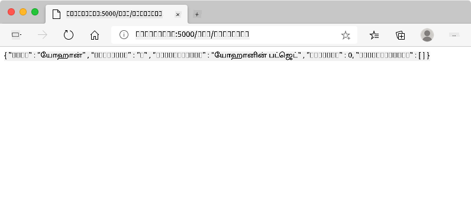
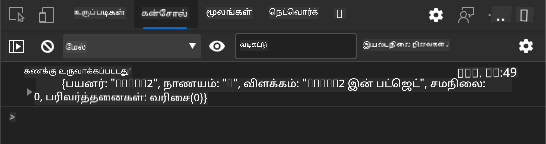
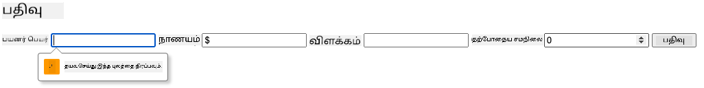
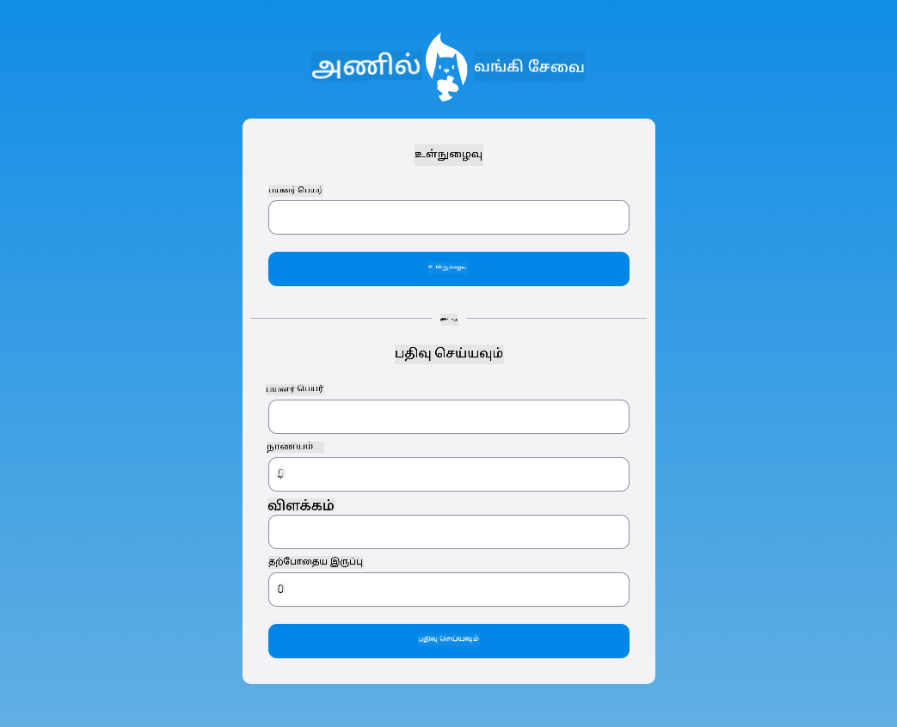

<!--
CO_OP_TRANSLATOR_METADATA:
{
  "original_hash": "8baca047d77a5f43fa4099c0578afa42",
  "translation_date": "2025-10-11T12:06:20+00:00",
  "source_file": "7-bank-project/2-forms/README.md",
  "language_code": "ta"
}
-->
# வங்கி பயன்பாட்டை உருவாக்குதல் பகுதி 2: உள்நுழைவு மற்றும் பதிவு படிவத்தை உருவாக்குதல்

## முன்-வகுப்பு வினாடி வினா

[முன்-வகுப்பு வினாடி வினா](https://ff-quizzes.netlify.app/web/quiz/43)

### அறிமுகம்

இன்றைய வெப்ஆப்களில் பெரும்பாலானவற்றில், தனிப்பட்ட இடத்தைப் பெற நீங்கள் கணக்கை உருவாக்கலாம். பல பயனர்கள் ஒரே நேரத்தில் ஒரு வெப்ஆப்பை அணுக முடியும் என்பதால், ஒவ்வொரு பயனரின் தனிப்பட்ட தரவையும் தனித்தனியாக சேமிக்கவும், எந்த தகவலை காட்ட வேண்டும் என்பதைத் தேர்ந்தெடுக்கவும் ஒரு முறைமை தேவைப்படும். [பயனர் அடையாளத்தை பாதுகாப்பாக நிர்வகிப்பது](https://en.wikipedia.org/wiki/Authentication) என்பது தனிப்பட்ட பெரிய தலைப்பாக இருப்பதால், அதை இங்கு கையாளமாட்டோம். ஆனால், ஒவ்வொரு பயனரும் எங்கள் பயன்பாட்டில் ஒரு (அல்லது பல) வங்கி கணக்கை உருவாக்க முடியும் என்பதை உறுதிப்படுத்துவோம்.

இந்த பகுதியில், HTML படிவங்களைப் பயன்படுத்தி எங்கள் வெப்ஆப்பில் உள்நுழைவு மற்றும் பதிவு வசதிகளைச் சேர்ப்போம். தரவுகளை சர்வர் API-க்கு நிரல்பூர்வமாக அனுப்புவது எப்படி என்பதைப் பார்ப்போம், மேலும் பயனர் உள்ளீடுகளுக்கான அடிப்படை சரிபார்ப்பு விதிகளை வரையறுப்பது எப்படி என்பதையும் காண்போம்.

### முன்-தரப்பு

இந்த பாடத்திற்கான [HTML டெம்ப்ளேட்கள் மற்றும் வழிமுறைகள்](../1-template-route/README.md) பாடத்தை முடித்திருக்க வேண்டும். மேலும் [Node.js](https://nodejs.org) நிறுவி, [சர்வர் API-யை](../api/README.md) உள்ளூரில் இயக்க வேண்டும், இதனால் நீங்கள் கணக்குகளை உருவாக்க தரவுகளை அனுப்ப முடியும்.

**குறிப்பு**
நீங்கள் ஒரே நேரத்தில் இரண்டு டெர்மினல்களை இயக்க வேண்டும்:
1. [HTML டெம்ப்ளேட்கள் மற்றும் வழிமுறைகள்](../1-template-route/README.md) பாடத்தில் உருவாக்கிய முக்கிய வங்கி பயன்பாட்டிற்காக.
2. மேலே அமைத்த [வங்கி பயன்பாட்டின் சர்வர் API](../api/README.md) க்காக.

இந்த இரண்டு சர்வர்களும் இயங்க வேண்டும், மேலும் அவை வெவ்வேறு போர்ட்களில் (போர்ட் `3000` மற்றும் போர்ட் `5000`) கேட்கும், எனவே அனைத்தும் சரியாக வேலை செய்ய வேண்டும்.

சர்வர் சரியாக இயங்குகிறதா என்பதை சோதிக்க, டெர்மினலில் இந்த கட்டளையை இயக்கவும்:

```sh
curl http://localhost:5000/api
# -> should return "Bank API v1.0.0" as a result
```

---

## படிவம் மற்றும் கட்டுப்பாடுகள்

`<form>` எலெமெண்ட் என்பது HTML ஆவணத்தின் ஒரு பகுதியைச் சுற்றி உள்ளடக்குகிறது, இதில் பயனர் தகவலை உள்ளீடு செய்து சமர்ப்பிக்க முடியும். படிவத்தில் பயன்படுத்தக்கூடிய பல்வேறு பயனர் இடைமுக (UI) கட்டுப்பாடுகள் உள்ளன, அதில் பொதுவானவை `<input>` மற்றும் `<button>` எலெமெண்ட்கள்.

`<input>`-க்கு பல்வேறு [வகைகள்](https://developer.mozilla.org/docs/Web/HTML/Element/input) உள்ளன. உதாரணமாக, பயனர் தனது பயனர்பெயரை உள்ளிட ஒரு புலத்தை உருவாக்க:

```html
<input id="username" name="username" type="text">
```

`name` அடைமொழி படிவ தரவுகளை அனுப்பும்போது சொத்து பெயராக பயன்படுத்தப்படும். `id` அடைமொழி `<label>`-ஐ படிவ கட்டுப்பாட்டுடன் தொடர்புபடுத்த பயன்படுத்தப்படுகிறது.

> [`<input>` வகைகளின் முழு பட்டியலை](https://developer.mozilla.org/docs/Web/HTML/Element/input) மற்றும் [மற்ற படிவ கட்டுப்பாடுகளை](https://developer.mozilla.org/docs/Learn/Forms/Other_form_controls) பாருங்கள், உங்கள் UI உருவாக்கும்போது நீங்கள் பயன்படுத்தக்கூடிய அனைத்து இயல்புநிலை UI எலெமெண்ட்களையும் அறிய.

✅ `<input>` என்பது [காலியாக உள்ள எலெமெண்ட்](https://developer.mozilla.org/docs/Glossary/Empty_element) என்பதால், அதற்கு பொருந்தும் மூடுபட்ட குறியீட்டை சேர்க்கக்கூடாது. இருப்பினும், சுயமூடுபட்ட `<input/>` குறியீட்டை பயன்படுத்தலாம், ஆனால் இது அவசியமில்லை.

`<button>` எலெமெண்ட் படிவத்தில் சிறப்பு வகையை கொண்டது. அதன் `type` அடைமொழியை குறிப்பிடாவிட்டால், அழுத்தப்படும் போது படிவ தரவுகளை சர்வருக்கு தானாகவே சமர்ப்பிக்கும். இதற்கான `type` மதிப்புகள்:

- `submit`: படிவத்தில் இயல்புநிலை, படிவ சமர்ப்பிப்பு செயல்பாட்டைத் தொடங்கும்.
- `reset`: படிவ கட்டுப்பாடுகளை அதன் ஆரம்ப மதிப்புகளுக்கு மீட்டமைக்கிறது.
- `button`: அழுத்தப்படும் போது இயல்புநிலை செயல்பாட்டை ஒதுக்காது. இதற்கு பிறகு JavaScript மூலம் தனிப்பயன் செயல்பாடுகளை ஒதுக்கலாம்.

### பணிகள்

முதலில் `login` டெம்ப்ளேட்டில் ஒரு படிவத்தைச் சேர்ப்போம். *பயனர்பெயர்* புலம் மற்றும் *Login* பொத்தானை தேவைப்படும்.

```html
<template id="login">
  <h1>Bank App</h1>
  <section>
    <h2>Login</h2>
    <form id="loginForm">
      <label for="username">Username</label>
      <input id="username" name="user" type="text">
      <button>Login</button>
    </form>
  </section>
</template>
```

நீங்கள் கவனமாகப் பாருங்கள், இங்கு `<label>` எலெமெண்ட் சேர்க்கப்பட்டுள்ளது. `<label>` எலெமெண்ட்கள் UI கட்டுப்பாடுகளுக்கு பெயரைச் சேர்க்க பயன்படுத்தப்படுகின்றன, எ.கா., பயனர்பெயர் புலத்திற்கு. லேபல்கள் உங்கள் படிவங்களின் வாசிப்புத்திறனை மேம்படுத்துவதுடன் கூடுதல் நன்மைகளையும் வழங்குகின்றன:

- ஒரு லேபலை படிவ கட்டுப்பாட்டுடன் தொடர்புபடுத்துவதால், உதவித் தொழில்நுட்பங்களை (எ.கா., ஸ்க்ரீன் ரீடர்) பயன்படுத்தும் பயனர்களுக்கு அவர்கள் வழங்க வேண்டிய தரவைப் புரிந்துகொள்ள உதவுகிறது.
- லேபலை கிளிக் செய்வதன் மூலம் தொடர்புடைய உள்ளீட்டில் நேரடியாக கவனம் செலுத்த முடியும், இது தொடுதிரை சாதனங்களில் அணுக எளிதாக இருக்கும்.

> [இணையத்தில் அணுகல்](https://developer.mozilla.org/docs/Learn/Accessibility/What_is_accessibility) என்பது முக்கியமான தலைப்பாகும், ஆனால் பெரும்பாலும் கவனிக்கப்படுவதில்லை. [செமாண்டிக் HTML எலெமெண்ட்கள்](https://developer.mozilla.org/docs/Learn/Accessibility/HTML) சரியாக பயன்படுத்தினால், அணுகக்கூடிய உள்ளடக்கத்தை உருவாக்குவது கடினமில்லை. [அணுகல் பற்றிய மேலும் வாசிக்க](https://developer.mozilla.org/docs/Web/Accessibility) பொதுவான தவறுகளைத் தவிர்க்கவும், பொறுப்பான டெவலப்பராக மாறவும்.

இப்போது, முந்தைய படிவத்தின் கீழே ஒரு இரண்டாவது படிவத்தைச் சேர்ப்போம்:

```html
<hr/>
<h2>Register</h2>
<form id="registerForm">
  <label for="user">Username</label>
  <input id="user" name="user" type="text">
  <label for="currency">Currency</label>
  <input id="currency" name="currency" type="text" value="$">
  <label for="description">Description</label>
  <input id="description" name="description" type="text">
  <label for="balance">Current balance</label>
  <input id="balance" name="balance" type="number" value="0">
  <button>Register</button>
</form>
```

`value` அடைமொழியைப் பயன்படுத்தி ஒரு குறிப்பிட்ட உள்ளீட்டிற்கு இயல்புநிலை மதிப்பை வரையறுக்கலாம்.
மேலும், `balance`-க்கு உள்ளீட்டில் `number` வகை உள்ளது. இது மற்ற உள்ளீடுகளுக்கு மாறுபட்டதாகத் தோன்றுகிறதா? இதைத் தொடர்பு கொண்டு சோதிக்கவும்.

✅ நீங்கள் கீபோர்டைப் பயன்படுத்தி படிவங்களை வழிசெலுத்தி தொடர்பு கொள்ள முடியுமா? அதை எப்படி செய்வீர்கள்?

## தரவுகளை சர்வருக்கு சமர்ப்பித்தல்

இப்போது நமக்கு செயல்படும் UI உள்ளது, அடுத்த படியாக தரவுகளை சர்வருக்கு அனுப்ப வேண்டும். தற்போதைய குறியீட்டை பயன்படுத்தி ஒரு விரைவான சோதனை செய்யலாம்: *Login* அல்லது *Register* பொத்தானை அழுத்தினால் என்ன நடக்கிறது?

உங்கள் உலாவியின் URL பகுதியில் மாற்றத்தை கவனித்தீர்களா?


ஒரு `<form>`-க்கு இயல்புநிலை செயல்பாடு தற்போதைய சர்வர் URL-க்கு [GET முறை](https://www.w3.org/Protocols/rfc2616/rfc2616-sec9.html#sec9.3) பயன்படுத்தி படிவத்தை சமர்ப்பிக்கிறது, மேலும் படிவ தரவுகளை URL-க்கு நேரடியாக இணைக்கிறது. ஆனால் இந்த முறைக்கு சில குறைகள் உள்ளன:

- அனுப்பப்படும் தரவின் அளவு மிகவும் வரையறுக்கப்பட்டுள்ளது (சுமார் 2000 எழுத்துக்கள்)
- தரவு URL-ல் நேரடியாக காணக்கூடியது (கடவுச்சொற்களுக்கு இது நல்லது அல்ல)
- இது கோப்பு பதிவேற்றங்களுடன் வேலை செய்யாது

அதனால், [POST முறை](https://www.w3.org/Protocols/rfc2616/rfc2616-sec9.html#sec9.5) பயன்படுத்தி, HTTP கோரிக்கையின் உடலில் படிவ தரவுகளை சர்வருக்கு அனுப்ப முடியும், மேலும் மேலே கூறிய வரையறைகளில் எதுவும் இல்லை.

> POST என்பது தரவுகளை அனுப்புவதற்கான பொதுவான முறை, ஆனால் [சில குறிப்பிட்ட சூழல்களில்](https://www.w3.org/2001/tag/doc/whenToUseGet.html) GET முறையைப் பயன்படுத்துவது சிறந்தது, உதாரணமாக தேடல் புலத்தை செயல்படுத்தும்போது.

### பணிகள்

பதிவு படிவத்திற்கு `action` மற்றும் `method` பண்புகளைச் சேர்க்கவும்:

```html
<form id="registerForm" action="//localhost:5000/api/accounts" method="POST">
```

இப்போது உங்கள் பெயருடன் புதிய கணக்கை பதிவு செய்ய முயற்சிக்கவும். *Register* பொத்தானை அழுத்திய பிறகு, நீங்கள் இதைப் பார்க்க வேண்டும்:



எல்லாம் சரியாக இருந்தால், சர்வர் உங்கள் கோரிக்கைக்கு பதிலளித்து, உருவாக்கப்பட்ட கணக்குத் தரவுடன் [JSON](https://www.json.org/json-en.html) பதிலளிக்க வேண்டும்.

✅ அதே பெயருடன் மீண்டும் பதிவு செய்ய முயற்சிக்கவும். என்ன நடக்கிறது?

## பக்கம் மீண்டும் ஏற்றாமல் தரவுகளை சமர்ப்பித்தல்

நாம் பயன்படுத்திய அணுகுமுறையில் ஒரு சிறிய பிரச்சனை உள்ளது: படிவத்தை சமர்ப்பிக்கும்போது, ​​நாம் எங்கள் பயன்பாட்டிலிருந்து வெளியேறுகிறோம், மேலும் உலாவி சர்வர் URL-க்கு மறுவழிமாற்றம் செய்கிறது. எங்கள் வெப்ஆப்பில் அனைத்து பக்கம் மீண்டும் ஏற்றுதல்களையும் தவிர்க்க முயற்சிக்கிறோம், ஏனெனில் நாம் [Single-page application (SPA)](https://en.wikipedia.org/wiki/Single-page_application) உருவாக்குகிறோம்.

படிவ தரவுகளை பக்கம் மீண்டும் ஏற்றாமல் சர்வருக்கு அனுப்ப, JavaScript குறியீட்டை பயன்படுத்த வேண்டும். `<form>` எலெமெண்டின் `action` பண்பில் URL ஐ வைக்காமல், `javascript:` சரம் மூலம் தொடங்கும் JavaScript குறியீட்டை பயன்படுத்தி தனிப்பயன் செயல்பாட்டைச் செய்யலாம். இதைப் பயன்படுத்துவதால், உலாவி தானாகச் செய்யும் சில பணிகளை நீங்கள் செயல்படுத்த வேண்டும்:

- படிவ தரவுகளைப் பெறுதல்
- படிவ தரவுகளை பொருத்தமான வடிவத்திற்கு மாற்றி குறியாக்குதல்
- HTTP கோரிக்கையை உருவாக்கி சர்வருக்கு அனுப்புதல்

### பணிகள்

பதிவு படிவத்தின் `action` ஐ மாற்றவும்:

```html
<form id="registerForm" action="javascript:register()">
```

`app.js`-ஐ திறந்து, `register` என்ற புதிய செயல்பாட்டைச் சேர்க்கவும்:

```js
function register() {
  const registerForm = document.getElementById('registerForm');
  const formData = new FormData(registerForm);
  const data = Object.fromEntries(formData);
  const jsonData = JSON.stringify(data);
}
```

இங்கு `getElementById()` மூலம் படிவ எலெமெண்டை பெறுகிறோம், மேலும் [`FormData`](https://developer.mozilla.org/docs/Web/API/FormData) உதவியைப் பயன்படுத்தி படிவ கட்டுப்பாடுகளிலிருந்து மதிப்புகளை முக்கிய/மதிப்பு ஜோடிகளாக எடுக்கிறோம். பின்னர் தரவுகளை சாதாரண பொருளாக மாற்ற [`Object.fromEntries()`](https://developer.mozilla.org/docs/Web/JavaScript/Reference/Global_Objects/Object/fromEntries) பயன்படுத்துகிறோம், மேலும் [JSON](https://www.json.org/json-en.html) வடிவத்தில் தரவுகளை சீரமைக்கிறோம், இது இணையத்தில் தரவுகளை பரிமாற்றுவதற்கான பொதுவான வடிவமாகும்.

தரவு சர்வருக்கு அனுப்ப தயாராக உள்ளது. `createAccount` என்ற புதிய செயல்பாட்டை உருவாக்கவும்:

```js
async function createAccount(account) {
  try {
    const response = await fetch('//localhost:5000/api/accounts', {
      method: 'POST',
      headers: { 'Content-Type': 'application/json' },
      body: account
    });
    return await response.json();
  } catch (error) {
    return { error: error.message || 'Unknown error' };
  }
}
```

இந்த செயல்பாடு என்ன செய்கிறது? முதலில், இங்கு `async` முக்கியச்சொல்லை கவனிக்கவும். இது செயல்பாட்டில் [**அசிங்கமாக**](https://developer.mozilla.org/docs/Web/JavaScript/Reference/Statements/async_function) செயல்படும் குறியீடு உள்ளதைக் குறிக்கிறது. `await` முக்கியச்சொல்லுடன் பயன்படுத்தும்போது, ​​அசிங்கமாக செயல்படும் குறியீடு நிறைவேறுவதற்காக - இங்கு சர்வர் பதிலை காத்திருக்க - காத்திருக்க அனுமதிக்கிறது.

`async/await` பயன்பாட்டைப் பற்றிய விரைவான வீடியோ:

[](https://youtube.com/watch?v=YwmlRkrxvkk "Async மற்றும் Await வாக்குறுதிகளை நிர்வகிக்க")

> 🎥 மேலே உள்ள படத்தை கிளிக் செய்து async/await பற்றிய வீடியோவைப் பாருங்கள்.

நாம் `fetch()` API-யை JSON தரவுகளை சர்வருக்கு அனுப்ப பயன்படுத்துகிறோம். இந்த முறை 2 அளவுருக்களை எடுத்துக்கொள்கிறது:

- சர்வரின் URL, எனவே இங்கு `//localhost:5000/api/accounts` ஐ மீண்டும் வைக்கிறோம்.
- கோரிக்கையின் அமைப்புகள். இங்கு முறை `POST` ஆக அமைக்கிறோம் மற்றும் கோரிக்கைக்கான `body` ஐ வழங்குகிறோம். JSON தரவுகளை சர்வருக்கு அனுப்புவதால், சர்வர் உள்ளடக்கத்தை எப்படி புரிந்துகொள்வது என்பதை அறிய `Content-Type` தலைப்பை `application/json` ஆக அமைக்க வேண்டும்.

சர்வர் கோரிக்கைக்கு JSON பதிலளிக்கும்போது, ​​`await response.json()` ஐப் பயன்படுத்தி JSON உள்ளடக்கத்தைப் பார்ச் செய்து, பெறப்பட்ட பொருளைத் திருப்ப முடியும். இந்த முறை அசிங்கமாக இருப்பதால், பார்ச் செய்யும் போது ஏற்படும் எந்தவொரு பிழைகளையும் பிடிக்க `await` முக்கியச்சொல்லை இங்கு பயன்படுத்துகிறோம்.

இப்போது `register` செயல்பாட்டில் `createAccount()` ஐ அழைக்கும் குறியீட்டைச் சேர்க்கவும்:

```js
const result = await createAccount(jsonData);
```

இங்கு `await` முக்கியச்சொல்லை பயன்படுத்துவதால், `register` செயல்பாட்டிற்கு முன் `async` முக்கியச்சொல்லைச் சேர்க்க வேண்டும்:

```js
async function register() {
```

இறுதியாக, முடிவைச் சரிபார்க்க சில பதிவு செய்திகளைச் சேர்க்கவும். இறுதி செயல்பாடு இவ்வாறு இருக்க வேண்டும்:

```js
async function register() {
  const registerForm = document.getElementById('registerForm');
  const formData = new FormData(registerForm);
  const jsonData = JSON.stringify(Object.fromEntries(formData));
  const result = await createAccount(jsonData);

  if (result.error) {
    return console.log('An error occurred:', result.error);
  }

  console.log('Account created!', result);
}
```

இது கொஞ்சம் நீண்டது, ஆனால் நாம் முடித்துவிட்டோம்! உங்கள் [உலாவி டெவலப்பர் கருவிகளை](https://developer.mozilla.org/docs/Learn/Common_questions/What_are_browser_developer_tools) திறந்து, புதிய கணக்கை பதிவு செய்ய முயற்சிக்கவும். வெப்பக்கம் எந்த மாற்றத்தையும் காணக்கூடாது, ஆனால் கான்சோலில் ஒரு செய்தி தோன்றும், அனைத்தும் வேலை செய்கிறது என்பதை உறுதிப்படுத்தும்.



✅ தரவு சர்வருக்கு பாதுகாப்பாக அனுப்பப்படுகிறதா என்று நீங்கள் நினைக்கிறீர்களா? ஒருவரால் கோரிக்கையை மடக்க முடிந்தால் என்ன? [HTTPS](https://en.wikipedia.org/wiki/HTTPS) பற்றி மேலும் அறிய பாதுகாப்பான தரவுத் தொடர்பு பற்றி வாசிக்கலாம்.

## தரவுச் சரிபார்ப்பு

பயனர்பெயரை முதலில் அமைக்காமல் புதிய கணக்கை பதிவு செய்ய முயற்சித்தால், சர்வர் [400 (Bad Request)](https://developer.mozilla.org/docs/Web/HTTP/Status/400#:~:text=The%20HyperText%20Transfer%20Protocol%20(HTTP,%2C%20or%20deceptive%20request%20routing).) என்ற நிலை குறியீடு பிழையைத் திருப்புகிறது.

தரவை சர்வருக்கு அனுப்புவதற்கு முன், [படிவ தரவுகளைச் சரிபார்ப்பது](https://developer.mozilla.org/docs/Learn/Forms/Form_validation) நல்ல நடைமுறையாகும், இது செல்லுபடியாகும் கோரிக்கையை அனுப்புவதற்காக. HTML5 படிவ கட்டுப்பாடுகள் பல்வேறு பண்புகளைப் பயன்படுத்தி உள்ளமைந்த சரிபார்ப்பை வழங்குகின்றன:

- `required`: புலம் நிரப்பப்பட வேண்டும், இல்லையெனில் படிவத்தை சமர்ப்பிக்க முடியாது.
- `minlength` மற்றும் `maxlength`: உரை புலங்களில் குறைந்தபட்ச மற்றும் அதிகபட்ச எழுத்துக்களின் எண்ணிக்கையை வரையறுக்கிறது.
- `min` மற்றும் `max`: எண் புலத்தின் குறைந்தபட்ச மற்றும் அதிகபட்ச மதிப்பை வரையறுக்கிறது.
- `type`: எதிர்பார்க்கப்படும் தரவின் வகையை வரையறுக்கிறது, எ.கா., `number`, `email`, `file` அல்லது [மற்ற உள்ளமைந்த வகைகள்](https://developer.mozilla.org/docs/Web/HTML/Element/input). இந்த பண்புகள் படிவ கட்டுப்பாட்டின் காட்சித் தோற்றத்தை மாற்றக்கூடும்.
- `pattern`: [வழக்கமான வெளிப்பாடு](https://developer.mozilla.org/docs/Web/JavaScript/Guide/Regular_Expressions) முறைமையை வரையறுக்க அனுமதிக்கிறது, உள்ளிடப்பட்ட தரவு செல்லுபடியாகும் அல்லது இல்லையா என்பதை சோதிக்க.
> குறிப்புகள்: உங்கள் படிவ கட்டுப்பாடுகளின் தோற்றத்தை அவை செல்லுபடியாகிறதா அல்லது செல்லுபடியாகாததா என்பதைப் பொறுத்து, `:valid` மற்றும் `:invalid` CSS ப்சூடோ-கிளாஸ்களைப் பயன்படுத்தி தனிப்பயனாக்கலாம்.

### பணிகள்

ஒரு புதிய கணக்கை உருவாக்குவதற்கு பயனர் பெயர் மற்றும் நாணயம் ஆகிய இரண்டு புலங்கள் அவசியம் தேவை, மற்ற புலங்கள் விருப்பமானவை. படிவத்தின் HTML-ஐ புதுப்பிக்கவும், `required` பண்புக்கூறையும் புலத்தின் லேபிளில் உரையையும் பயன்படுத்தி இதைச் செய்யவும்:

```html
<label for="user">Username (required)</label>
<input id="user" name="user" type="text" required>
...
<label for="currency">Currency (required)</label>
<input id="currency" name="currency" type="text" value="$" required>
```

இந்த குறிப்பிட்ட சர்வர் செயல்பாடு புலங்களின் அதிகபட்ச நீளத்தில் குறிப்பிட்ட வரம்புகளை விதிக்கவில்லை என்றாலும், எந்த பயனர் உரை உள்ளீட்டிற்கும் நியாயமான வரம்புகளை வரையறுப்பது எப்போதும் நல்ல நடைமுறையாகும்.

உரை புலங்களுக்கு `maxlength` பண்புக்கூறைச் சேர்க்கவும்:

```html
<input id="user" name="user" type="text" maxlength="20" required>
...
<input id="currency" name="currency" type="text" value="$" maxlength="5" required>
...
<input id="description" name="description" type="text" maxlength="100">
```

இப்போது நீங்கள் *பதிவு செய்யவும்* பொத்தானை அழுத்தினால், மற்றும் ஒரு புலம் நாங்கள் வரையறுத்த சரிபார்ப்பு விதியை மதிக்கவில்லை என்றால், நீங்கள் இதைப் போன்றதைப் பார்க்கலாம்:



இவ்வாறு எந்த தரவையும் சர்வருக்கு அனுப்புவதற்கு *முன்* செய்யப்படும் சரிபார்ப்பு **கிளையன்ட்-சைடு** சரிபார்ப்பு என்று அழைக்கப்படுகிறது. ஆனால் அனைத்து சரிபார்ப்புகளையும் தரவை அனுப்பாமல் செய்ய முடியாது என்பதை கவனிக்கவும். உதாரணமாக, ஒரே பயனர் பெயருடன் ஏற்கனவே ஒரு கணக்கு உள்ளதா என்பதை சரிபார்க்க, சர்வருக்கு கோரிக்கையை அனுப்பாமல் இங்கே சரிபார்க்க முடியாது. சர்வரில் செய்யப்படும் கூடுதல் சரிபார்ப்பு **சர்வர்-சைடு** சரிபார்ப்பு என்று அழைக்கப்படுகிறது.

பொதுவாக இரண்டையும் செயல்படுத்த வேண்டும், மேலும் கிளையன்ட்-சைடு சரிபார்ப்பை பயன்படுத்துவது பயனர் அனுபவத்தை உடனடி கருத்துக்களை வழங்குவதன் மூலம் மேம்படுத்துகிறது, ஆனால் நீங்கள் கையாளும் பயனர் தரவுகள் நம்பகமானவை மற்றும் பாதுகாப்பானவை என்பதை உறுதிப்படுத்த சர்வர்-சைடு சரிபார்ப்பு மிகவும் முக்கியமானது.

---

## 🚀 சவால்

பயனர் ஏற்கனவே உள்ளார் என்றால், HTML-இல் ஒரு பிழை செய்தியை காட்டவும்.

இது சில ஸ்டைலிங் செய்யப்பட்ட பிறகு இறுதி உள்நுழைவு பக்கம் எப்படி இருக்கும் என்பதற்கான ஒரு உதாரணம்:



## பாடத்திற்குப் பிந்தைய வினாடி வினா

[பாடத்திற்குப் பிந்தைய வினாடி வினா](https://ff-quizzes.netlify.app/web/quiz/44)

## மதிப்பாய்வு & சுயபயிற்சி

டெவலப்பர்கள் தங்கள் படிவ கட்டமைப்பு முயற்சிகளில் மிகவும் படைப்பாற்றலுடன் செயல்பட்டுள்ளனர், குறிப்பாக சரிபார்ப்பு உத்திகள் தொடர்பாக. [CodePen](https://codepen.com) மூலம் பார்வையிடுவதன் மூலம் வெவ்வேறு படிவ ஓட்டங்களைப் பற்றி அறியவும்; சில சுவாரஸ்யமான மற்றும் ஊக்கமளிக்கும் படிவங்களை நீங்கள் கண்டுபிடிக்க முடியுமா?

## பணிக்குறிப்பு

[உங்கள் வங்கி செயலியை ஸ்டைல் செய்யவும்](assignment.md)

---

**குறிப்பு**:  
இந்த ஆவணம் [Co-op Translator](https://github.com/Azure/co-op-translator) என்ற AI மொழிபெயர்ப்பு சேவையைப் பயன்படுத்தி மொழிபெயர்க்கப்பட்டுள்ளது. நாங்கள் துல்லியத்திற்காக முயற்சிக்கின்றோம், ஆனால் தானியங்கி மொழிபெயர்ப்புகளில் பிழைகள் அல்லது தவறான தகவல்கள் இருக்கக்கூடும் என்பதை தயவுசெய்து கவனத்தில் கொள்ளுங்கள். அதன் தாய்மொழியில் உள்ள மூல ஆவணம் அதிகாரப்பூர்வ ஆதாரமாக கருதப்பட வேண்டும். முக்கியமான தகவல்களுக்கு, தொழில்முறை மனித மொழிபெயர்ப்பு பரிந்துரைக்கப்படுகிறது. இந்த மொழிபெயர்ப்பைப் பயன்படுத்துவதால் ஏற்படும் எந்த தவறான புரிதல்கள் அல்லது தவறான விளக்கங்களுக்கு நாங்கள் பொறுப்பல்ல.