<!--
CO_OP_TRANSLATOR_METADATA:
{
  "original_hash": "7cbdbd132d39a2bb493e85bc2a9387cc",
  "translation_date": "2026-01-07T13:24:21+00:00",
  "source_file": "7-bank-project/2-forms/README.md",
  "language_code": "ta"
}
-->
# Build a Banking App Part 2: Build a Login and Registration Form

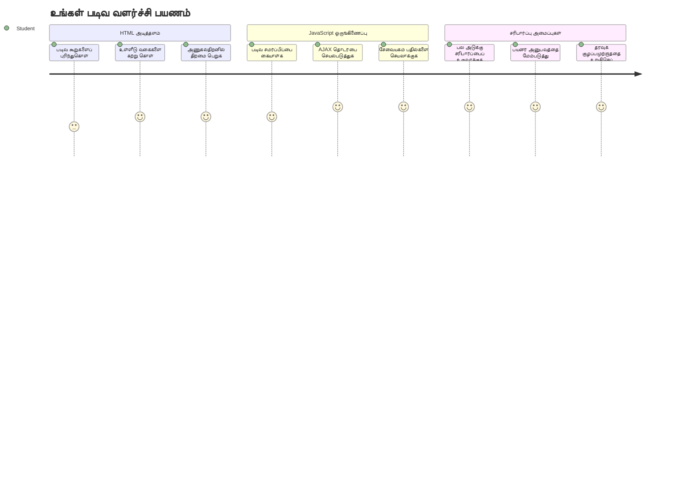
## Pre-Lecture Quiz

[Pre-lecture quiz](https://ff-quizzes.netlify.app/web/quiz/43)

நீங்கள் ஆன்லைனில் ஒரு படிவத்தை பூர்த்தி செய்த பிறகு, உங்கள் ஈமெயில் வடிவத்தை நிராகரித்ததா? அல்லது சமர்ப்பிக்கையில் உங்கள் அனைத்து தகவல்களும் நீங்கள் இழந்துவிடுவதுண்டா? இத்தகைய சலசலப்பு அனுபவங்களை எல்லாம் நாங்கள் எதிர்கொண்டுள்ளோம்.

படிவங்கள் உங்கள் பயனர்களுக்கும் உங்கள் செயலியின் செயல்பாடுகளுக்கும் இடையேயான பாலமாக இருக்கும். ஏர்டிராஃபிக் கட்டுப்பாட்டாளர்கள் விமானங்களை பாதுகாப்பாக இலக்கிட வழி நடத்த பயன்படும் கவனமான நெறிமுறைகளைப் போல, நன்மையான வடிவமைப்புகளுடன் கூடிய படிவங்கள் தெளிவான கருத்துக்களை வழங்கி, செலவாலை தவிர்க்க உதவுகின்றன. மோசமான படிவங்கள், மாறாக, ஒரு கூட்டமான விமான நிலையத்தில் தவறான தொடர்பு போல விரைவில் பயனர்களை தள்ளி விடும்.

இந்த பாடத்தில், உங்கள் நிலையான வங்கியியல் செயலியை ஒரு பங்களிக்கும் செயலியாக மாற்றுவோம். பயனர் உள்ளீட்டை சரிபார்க்கும், சேவையகங்களுடன் தொடர்பு கொள்ளும் மற்றும் உதவித்திட்ட கருத்துக்களை வழங்கும் படிவங்களை உருவாக்க கற்போம். இது உங்கள் செயலியின் அம்சங்களை பயனர்கள் வழிநடத்த உதவும் கட்டுப்பாட்டு இடைமுகத்தை உருவாக்குவதாக நினைக்கலாம்.

முடிவில், பயனர்களை சலசலப்பிற்கு பதிலாக வெற்றியடைய வழிகாட்டும் சரிபார்ப்புடன் கூடிய முழுமையான உள்நுழைவு மற்றும் பதிவு முறை அமைப்பை நீங்கள் பெற்றிருப்பீர்கள்.

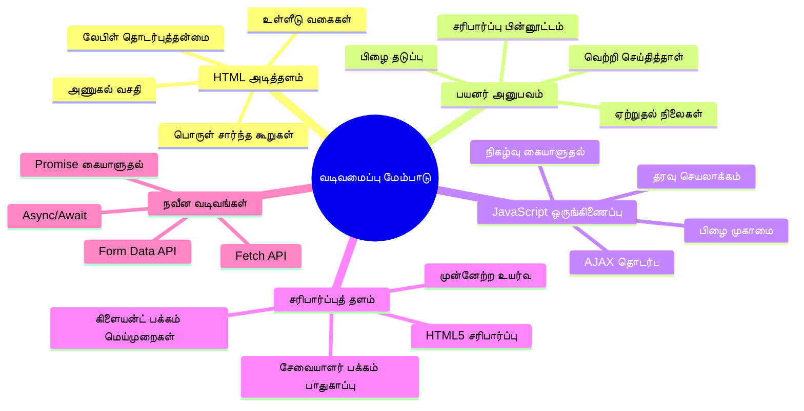
## Prerequisites

படிவங்களை உருவாக்க ஆரம்பிப்பதற்கு முன், நீங்கள் எல்லா தேவைகளும் சரியாக அமைந்துள்ளதா என உறுதி செய்யலாம். இந்த பாடம் முந்தைய பாடத்தில் இருந்து தொடர்கிறது, ஆகவே நீங்கள் முன்கூட்டியே சென்றிருந்தால் முந்தைய அடிப்படைகளை முதலில் சரிபார்க்க விரும்பலாம்.

### Required Setup

| கூறு | நிலை | விளக்கம் |
|-----------|--------|-------------|
| [HTML Templates](../1-template-route/README.md) | ✅ Required | உங்கள் அடிப்படை வங்கியியல் செயலி அமைப்பு |
| [Node.js](https://nodejs.org) | ✅ Required | சேவையகத்துக்கான ஜாவாஸ்கிரிப்ட் ரன்டைம் |
| [Bank API Server](../api/README.md) | ✅ Required | தரவுக் காப்பகத்துக்கான பின்னணி சேவை |

> 💡 **Development Tip**: நீங்கள் ஒரே நேரத்தில் இரண்டு தனித்தனி சேவையகங்களை இயக்குவீர்கள் – ஒருவர் முன்பக்கம் வங்கி செயலிக்காக, மற்றொன்று பின்னணி API க்காக. இது உண்மையான உலகத் தொகுப்பை ஒத்துள்ளதானது, அங்கே முன்பக்கம் மற்றும் பின்னணி சேவைகள் சுயமாக இயங்குகின்றன.

### Server Configuration

**உங்கள் மேம்பாட்டு சூழல் ஏற்றுமதி செய்யும்:**
- **Frontend server**: உங்கள் வங்கி செயலியை வழங்கும் (தொலைபேசி `3000` போர்ட்)
- **Backend API server**: தரவு சேமிப்பையும் மீட்டெடுப்பையும் கையாளும் (போர்ட் `5000`)
- **இரு சேவையகங்களும்** முரண்பாடின்றி ஒரே நேரத்தில் இயங்க முடியும்

**உங்கள் API இணைப்பை சோதிக்கும் முறைகள்:**
```bash
curl http://localhost:5000/api
# எதிர்பார்க்கப்படும் பதில்: "வங்கி API v1.0.0"
```

**நீங்கள் API பதிப்பு பதிலை பார்த்தால், முன்னேற தயாராக உள்ளீர்கள்!**

---

## Understanding HTML Forms and Controls

HTML படிவங்கள் உங்கள் வலை செயலியுடன் பயனர்கள் தொடர்பு கொள்ளும் வழி ஆகும். 19ஆம் நூற்றாண்டில் தொலைதகவல் அமைப்பாக இருந்த போல் – இவை பயனர் நோக்கம் மற்றும் செயலியின் பதிலுக்கு இடையேயான தொடர்பு நெறிமுறைகள். பரிசீலனையுடன் வடிவமைக்கப்பட்டவை தவறுகளை பிடித்து, உள்ளீட்டு வடிவமைப்புக்கு வழி நடத்தி மற்றும் உதவி குறிப்பு வழங்குகின்றன.

நவீன படிவங்கள் அடிப்படை எழுத்து உள்ளீடுகளுக்கு மேலாக மிகவும் நுணுக்கமானவையாக இருக்கின்றன. HTML5 மின்னஞ்சல் சரிபார்ப்பு, எண் வடிவமைப்பு மற்றும் தேதி தேர்வு போன்ற சிறப்பு உள்ளீடு வகைகளை அறிமுகப்படுத்தியது. இந்த மேம்பாடுகள் அணுகல் திறன் மற்றும் மொபைல் பயனர் அனுபவத்திற்கு உதவுகின்றன.

### Essential Form Elements

**ஒவ்வொரு படிவத்திற்கும் தேவைப்படும் கட்டுமானக்கற்கள்:**

```html
<!-- Basic form structure -->
<form id="userForm" method="POST">
  <label for="username">Username</label>
  <input id="username" name="username" type="text" required>
  
  <button type="submit">Submit</button>
</form>
```

**இந்த குறியீடு செய்கிறது:**
- **ஒரு** தனித்த அடையாளக் குறியீட்டுடன் படிவக் கன்டெய்னரை உருவாக்குகிறது
- **தரவு சமர்ப்பிக்க HTTP முறை** குறிப்பிடப்படுகிறது
- **அணுகல் விருப்பத்திற்கான லேபிள்கள்** உள்ளீடுகளுடன் இணைக்கப்படும்
- **படிவத்தை செயலாக்க** சமர்ப்பிக்கும் பொத்தானை வரையறுக்கிறது

### Modern Input Types and Attributes

| உள்ளீடு வகை | நோக்கம் | உதாரணம் |
|------------|---------|---------------|
| `text` | பொது எழுத்து உள்ளீடு | `<input type="text" name="username">` |
| `email` | மின்னஞ்சல் சரிபார்ப்பு | `<input type="email" name="email">` |
| `password` | மறைக்கப்பட்ட எழுத்து உள்ளீடு | `<input type="password" name="password">` |
| `number` | எண் உள்ளீடு | `<input type="number" name="balance" min="0">` |
| `tel` | தொலைபேசி எண்கள் | `<input type="tel" name="phone">` |

> 💡 **Modern HTML5 Advantage**: குறிப்பிட்ட உள்ளீடுகளைக் கொண்டு தானாகவே சரிபார்ப்பு, பொருத்தமான மொபைல் விசைப்பலகைகள் மற்றும் சிறந்த அணுகல் திறன் ஆதரவை ஜாவாஸ்கிரிப்ட் இல்லாமலும் பெறலாம்!

### Button Types and Behavior

```html
<!-- Different button behaviors -->
<button type="submit">Save Data</button>     <!-- Submits the form -->
<button type="reset">Clear Form</button>    <!-- Resets all fields -->
<button type="button">Custom Action</button> <!-- No default behavior -->
```

**ஒவ்வொரு பொத்தானின் செயல்:**
- **சமர்ப்பிக்கும் பொத்தான்கள்**: படிவம் சமர்ப்பித்தல் மற்றும் குறிப்பிடப்பட்ட இடத்திற்கு தரவு அனுப்புதல்
- **மீட்டமைக்கும் பொத்தான்கள்**: படிவத்தின் அனைத்து தளங்களை ஆரம்ப நிலைக்கு மீட்டமைத்தல்
- **பொதுவான பொத்தான்கள்**: இயல்பான செயல் ஒன்றும் இல்லை; தனிப்பயன் ஜாவாஸ்கிரிப்ட் தேவையிருக்கும்

> ⚠️ **Important Note**: `<input>` ஆகவே தனக்குத் தனியாக மூடும் பொருளாக உள்ளது. நவீன நடைமுறை slash இல்லாமல் `<input>` என எழுதுவது.

### Building Your Login Form

இப்போது நவீன HTML படிவ நடைமுறைகளை காட்ட ஒரு நடைமுறை உள்நுழைவு படிவத்தை உருவாக்குவோம். அடிப்படை அமைப்புடன் ஆரம்பித்து படிப்படியாக அணுகல் திறன் மற்றும் சரிபார்ப்பு மாற்றங்களுடன் மேம்படுத்துவோம்.

```html
<template id="login">
  <h1>Bank App</h1>
  <section>
    <h2>Login</h2>
    <form id="loginForm" novalidate>
      <div class="form-group">
        <label for="username">Username</label>
        <input id="username" name="user" type="text" required 
               autocomplete="username" placeholder="Enter your username">
      </div>
      <button type="submit">Login</button>
    </form>
  </section>
</template>
```

**இதில் நடக்கும் செயல்கள்:**
- **படிவத்தை semantic HTML5 கூறுக்களுடன் கட்டமைக்கிறது**
- **பொருந்தக்கூடிய கட்டளைகள் கொண்ட `div` கன்டெய்னர்களைப் பயன்படுத்தி இணைக்கிறது**
- **`for` மற்றும் `id` பண்புகளை உள்நுழைவு மற்றும் லேபிள் இணைப்பிற்கு பயன்படுத்துகிறது**
- **நவீன பண்புகள் `autocomplete`, `placeholder` போன்றவை UX மேம்பாட்டிற்கு சேர்க்கின்றன**
- **`novalidate` சேர்க்கப்பட்டுள்ளது, உலாவியின் இயல்புநிலை பார்வைகளை தவிர்த்து ஜாவாஸ்கிரிப்ட் மூலம் சரிபார்க்க**

### The Power of Proper Labels

**நவீன வலை வளர்ச்சிக்கான லேபிள்களின் முக்கியத்துவம்:**

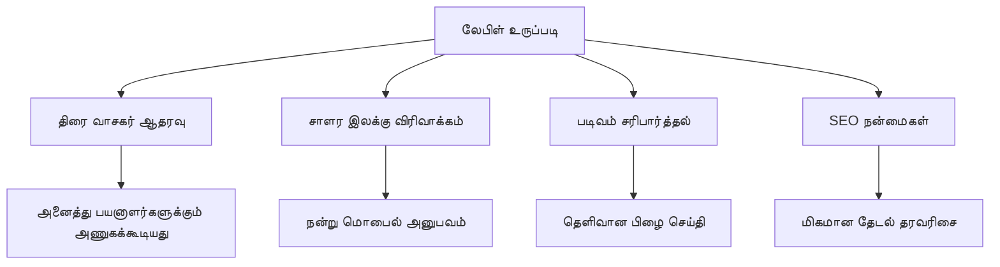
**சரியான லேபிள்கள் செய்யும் வேலை:**
- **ஸ்கிரீன் ரீடர்களுக்கு தெளிவாக படிவத்தளங்களை அறிவிப்பது**
- **கிளிக்கக்கூடிய பரப்பை விரிவாக்குவதை (லேபிள் கிளிக் செய்தால் உள்ளீடு கவனம் இடம் பெறும்)**
- **பெரிய தொடுதிருக்களுடன் மொபைல் பயன்பாட்டை எளிதாக்கும்**
- **படிவ சரிபார்ப்புக்கு அர்த்தமுள்ள பிழை செய்திகளை வழங்கும்**
- **SEO மேம்பாட்டிற்கு படிவ கூறுகளுக்கு அர்த்தவயமான தகவலை வழங்கும்**

> 🎯 **Accessibility Goal**: ஒவ்வொரு படிவ உள்ளீட்டுக்கும் அணைத்து லேபிள் இருக்க வேண்டும். இது அனைத்துலக பயனர்களுக்கும், குறிப்பாக மாற்றுத் திறனாளிகளுக்கும் உங்கள் படிவங்களை பயன்படத்தி அனுபவத்தை மேம்படுத்தும்.

### Creating the Registration Form

பதிவு படிவம் முழுமையான பயனர் கணக்கை உருவாக்க விரிவான தகவல்களை தேவைப்படுத்துகிறது. நவீன HTML5 அம்சங்களுடன் மற்றும் அதிகரிக்கப்பட்ட அணுகல் திறன் கொண்டதாக அதை உருவாக்குவோம்.

```html
<hr/>
<h2>Register</h2>
<form id="registerForm" novalidate>
  <div class="form-group">
    <label for="user">Username</label>
    <input id="user" name="user" type="text" required 
           autocomplete="username" placeholder="Choose a username">
  </div>
  
  <div class="form-group">
    <label for="currency">Currency</label>
    <input id="currency" name="currency" type="text" value="$" 
           required maxlength="3" placeholder="USD, EUR, etc.">
  </div>
  
  <div class="form-group">
    <label for="description">Account Description</label>
    <input id="description" name="description" type="text" 
           maxlength="100" placeholder="Personal savings, checking, etc.">
  </div>
  
  <div class="form-group">
    <label for="balance">Starting Balance</label>
    <input id="balance" name="balance" type="number" value="0" 
           min="0" step="0.01" placeholder="0.00">
  </div>
  
  <button type="submit">Create Account</button>
</form>
```

**மேலே, நாம்:**
- **ஒரு சிறந்த வடிவமைப்பு மற்றும் துணுக்காக்கம் கொண்டவாறு ஒவ்வொரு நிலைதளத்தையும் `div` படையல்களில் ஒழுங்குபடுத்தினோம்**
- **உலாவி தானாக நிரப்ப உதவும் `autocomplete` பண்புகளை சேர்த்தோம்**
- **பயனர் உள்ளீட்டை வழிநடத்த உதவும் உதவிக்குறிப்புகளை சேர்த்தோம்**
- **`value` பண்பை பயன்படுத்தி பொருத்தமான இயல்புகளை அமைத்தோம்**
- **`required`, `maxlength`, மற்றும் `min` போன்ற சரிபார்ப்பு பண்புகளைச் சேர்த்தோம்**
- **மொத்த பாகத்திற்கு எனக்கான `type="number"` உடன் நுணுக்கக் கணக்கீடுகளும் சேர்க்கப்பட்டுள்ளது**

### Exploring Input Types and Behavior

**நவீன உள்ளீட்டு வகைகள் அதிக செயல்திறனுடன் கூடியவை:**

| அம்சம் | பயன் | உதாரணம் |
|---------|---------|----------|
| `type="number"` | மொபைலில் எண்ணக விசைப்பலகை | கணக்கு உள்ளீடு எளிதாக்கம் |
| `step="0.01"` | தசம புள்ளி துல்லிய கட்டுப்பாடு | பணத்தில் சென்ட்கள் சேர்க்க உதவல் |
| `autocomplete` | உலாவி தானாக நிரப்புதல் | படிவம் விரைவாக நிரப்புதல் |
| `placeholder` | சூழல் குறிப்பு | பயனர் எதிர்பார்ப்புக்கு வழிகாட்டுதல் |

> 🎯 **Accessibility Challenge**: உங்கள் விசைப்பலகியை மட்டும் பயன்படுத்தி படிவங்களில் செல்ல முயற்சிக்கவும்! `Tab` மூலம் தளங்களுக்கு இடைமாற்றம் செய்க, `Space` கொண்டு செக் பாக்குகளை தேர்ந்தெடுக்கவும், `Enter` மூலம் சமர்ப்பிக்கவும். இது ஸ்கிரீன் ரீடர் பயனர்கள் எப்படி உங்கள் படிவங்களோடு தொடர்பு கொள்கிறார்கள் என்று புரிந்துகொள்ள உதவும்.

### 🔄 **Pedagogical Check-in**
**படிவ அடித்தள புரிதல்**: ஜாவாஸ்கிரிப்டை செய்முறைப்படுத்துவதற்கு முன், இதை புரிந்துகொள்ள வேண்டும்:
- ✅ எவ்வாறு semantic HTML அணுகல் வாயிலாக படிவ கட்டமைப்பை உருவாக்குகிறது
- ✅ ஏன் உள்ளீடு வகைகள் மொபைல் விசைப்பலகைகள் மற்றும் சரிபார்ப்புக்கு முக்கியம்
- ✅ லேபிள்கள் மற்றும் படிவக் கட்டுப்பாடுகளுக்கிடையேயான தொடர்பு
- ✅ படிவ பண்புகள் எப்படி உலாவி இயல்புநிலை செயல்பாடுகளை பாதிக்கின்றன

**விரைவு சுயசோதனை**: ஜாவாஸ்கிரிப்ட் இல்லாமல் நீங்கள் ஒரு படிவத்தை சமர்ப்பித்தால் என்ன நடக்கும்?
*பதில்: உலாவி இயல்புநிலை சமர்ப்பிப்பைச் செய்கிறது, பெரும்பாலும் ஒன்று URL க்கு மாற்றும்*

**HTML5 Form நன்மைகள்**: நவீன படிவங்கள் தருகின்றன:
- **உள்ளீடு சரிபார்ப்பு**: தானாக மின்னஞ்சல் மற்றும் எண் வடிவிலை சரிபார்க்கும்
- **மொபைல் சிறப்பாக்கம்**: உள்ளீடு வகைகளுக்கேற்ற விசைப்பலகைகளுடன்
- **அணுகல் திறன்**: ஸ்கிரீன் ரீடர் மற்றும் விசைப்பலகி வழிசெலுத்தல் ஆதரவு
- **மேம்படுத்தல்**: ஜாவாஸ்கிரிப்ட் இயலாமலும் செயல்படும்

## Understanding Form Submission Methods

யாராவது உங்கள் படிவத்தை பூர்த்தி செய்து சமர்ப்பித்தால் அந்தத் தரவு எங்காவது போகவேண்டும் – பொதுவாக சேவையகமாக சேமிக்கவேண்டும். இதற்கு பல்வேறு முறைகள் உள்ளன, எது எப்போது பயன்படுத்த வேண்டும் என்பது புரிந்துகொள்வது முக்கியம்.

ஒருவேளை சமர்ப்பிக்க பொத்தானை அழுத்தும் போது என்ன நடக்கிறது என்பதை பார்ப்போம்.

### Default Form Behavior

முதலில் அடிப்படை படிவ சமர்ப்பிப்பு எப்படி நடக்கிறது என்று பார்ப்போம்:

**உங்கள் நடப்பு படிவங்களை சோதிக்க:**
1. உங்கள் படிவத்தில் உள்ள *Register* பொத்தானை கிளிக் செய்யவும்
2. உலாவியின் முகவரி பட்டியில் மாற்றங்களை கவனிக்கவும்
3. பக்கத்தை மீள்-ஏற்றும் விதம் மற்றும் URL இல் தரவு தோன்றுவதை கவனியுங்கள்


### HTTP Methods Comparison

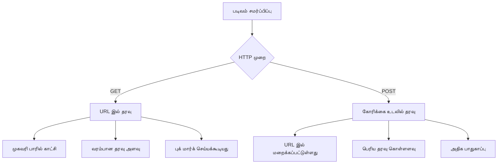
**வித்தியாசங்களை புரிந்துகொள்ள:**

| முறை | பயன்பாடு | தரவு இடம் | பாதுகாப்பு நிலை | அளவு வரம்பு |
|--------|----------|---------------|----------------|-------------|
| `GET` | தேடல் விசாரணைகள், அம்சங்கள் | URL அளவுருக்கள் | குறைந்தது (தொலைநோக்கு) | ~2000 எழுத்துக்கள் |
| `POST` | பயனர் கணக்குகள், பாதுகாப்பான தரவு | வேண்டுகோள் உடல் | மேல் (மறைக்கபட்ட) | நடைமுறையாக வரம்பில்லை |

**அடிப்படை வித்தியாசங்கள்:**
- **GET**: படிவத் தரவை URL இல் கோரி அளவுருக்கள் ஆக இணைக்கும் (தேடல் பயன்பாட்டுக்கு சரி)
- **POST**: தரவை வேண்டுகோள் உடலில் சேர்க்கிறது (பாதுகாப்பான தகவலுக்கு அவசியம்)
- **GET குறைகள்**: அளவுக்கோடுகள், வெளிப்படையான தகவல், உலாவி வரலாறானது
- **POST நன்மைகள்**: பெரிய தரவு திறன், தனியுரிமை பாதுகாப்பு, கோப்பு பதிவேற்றம் ஆதரவு

> 💡 **நன்றியெருக்கல்**: தேடு படிவங்கள் மற்றும் அம்சங்களுக்கு `GET` பயன்படுத்தவும், பயனர் பதிவு, உள்நுழைவு மற்றும் தரவு உருவாக்கத்திற்கு `POST` பயன்படுத்தவும்.

### Configuring Form Submission

உங்கள் பதிவு படிவத்தை பின்னணி API உடன் சரியாக தொடர்பு கொள்ள POST முறையை பயன்படுத்துமாறு அமைக்கலாம்:

```html
<form id="registerForm" action="//localhost:5000/api/accounts" 
      method="POST" novalidate>
```

**இந்த கட்டமைப்பு செய்கிறது:**
- படிவம் சமர்ப்பிப்பை உங்கள் API இடைமுக முகவரிக்கு நேரடியாக அனுப்புகிறது
- பாதுகாப்பான தரவு பரிமாற்றத்திற்கு POST முறையை பயன்படுத்துகிறது
- `novalidate` சேர்க்கப்பட்டு சரிபார்ப்பை ஜாவாஸ்கிரிப்ட் மூலம் செய்துகொள்கிறது

### Testing Form Submission

**உங்கள் படிவத்தை சோதிக்க கீழ்க்கண்ட படிகளை பின்பற்றவும்:**
1. பதிவு படிவத்தை உங்கள் தகவல்களுடன் பூர்த்தி செய்யவும்
2. "Create Account" பொத்தானை அழுத்தவும்
3. உலாவியில் சேவையக பதிலை கவனியுங்கள்

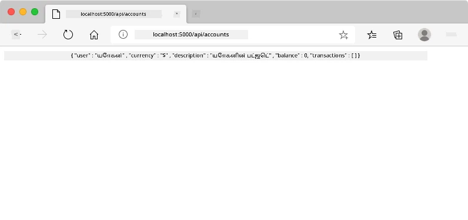

**நீங்கள் பார்க்கவேண்டியது:**
- உலாவி API முகவரிக்கு மாற்றப்படுகிறது
- புதிய உருவாக்கப்பட்ட கணக்கின் JSON பதில் காட்டப்படுகிறது
- கணக்கு வெற்றிகரமாக உருவாக்கப்பட்டதை சேவையகம் உறுதிப்படுத்துகிறது

> 🧪 **பயிற்சி நேரம்**: அதே பயனர்பெயருடன் மறுபடியும் பதிவு செய்ய முயற்சிக்கவும். என்ன பதில் வரும்? இதன் மூலம் சேவையகம் நகலெடுக்கப்பட்ட தரவு மற்றும் பிழை நிலைகளை எப்படி கையாள்கிறது என்பதைப் புரிந்துகொள்ள முடியும்.

### Understanding JSON Responses

**சேவையகம் உங்கள் படிவத்தைக் கையாளும்போது:**
```json
{
  "user": "john_doe",
  "currency": "$",
  "description": "Personal savings",
  "balance": 100,
  "id": "unique_account_id"
}
```

**இப்பதிவு உறுதிப்படுத்துகிறது:**
- **புதிய கணக்கை** உங்கள் தரவுடன் உருவாக்கிறது
- **எதிர்கால பயன்பாட்டிற்கான தனித்த அடையாளம்** வழங்குகிறது
- **அனைத்து கணக்கு தகவல்களையும்** உறுதிப்படுத்த திருப்பி அனுப்புகிறது
- **தரவுத்தள சேமிப்பு வெற்றியைக் குறிக்கிறது**

## Modern Form Handling with JavaScript

பாரம்பரிய படிவ சமர்ப்பிப்புகள் முழு பக்கம் மறுமீட்டலை ஏற்படுத்தும், ஆரம்ப கால விண்வெளி பயணங்களில் இயக்க அமைப்புகளை முழுமையாக மீட்டமைக்க வேண்டியிருப்பதைப் போல. இது பயனர் அனுபவத்தைத் தகர்க்கிறது மற்றும் செயலியின் நிலையை இழக்கிறது.

ஜாவாஸ்கிரிப்ட் படிவ கையாளும் முறையால், நவீன விண்வெளிக்கப்பயணிகளுக்கு உபயோகப்படுத்தப்படும் தொடர்ச்சியான வழிநடத்தல் அமைப்புக்களைப் போன்ற நிலையில் ரியல்-டைம் சீரமைப்புகள், உடனடி கருத்துக்களை வழங்கல், பிழைகளை அசாதாரணமாக கையாள்தல் மற்றும் சேவையக பதில்களின் அடிப்படையில் இடைமுகத்தை புதுப்பித்தல் என்பவற்றை கைமுறை விளைவுக்கு வரும் வாய்ப்பு இல்லாமல் செய்ய முடியும்.

### Why Avoid Page Reloads?

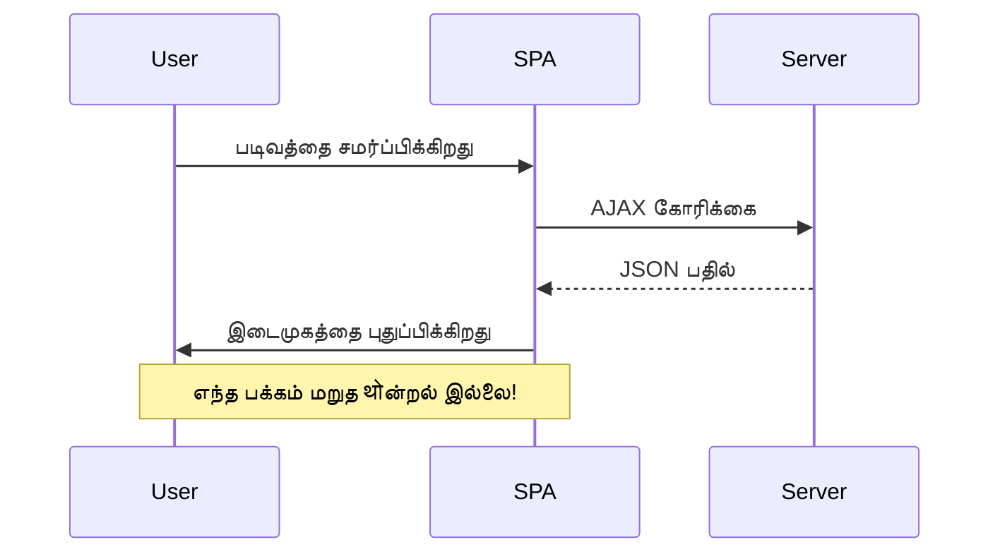
**ஜாவாஸ்கிரிப்ட் படிவக் கையாள்தலின் நன்மைகள்:**
- **செயலியின் நிலை மற்றும் பயனர் சூழலை பாதுகாப்பது**
- **உடனடி கருத்து மற்றும் ஏற்றும் குறிகள் வழங்குவது**
- **சேர்த்தல் பிழைகள் மற்றும் சரிபார்ப்புகளை இயக்குவதற்கு திறன்**
- **மிருதுவான, செயலி போன்ற பயனர் அனுபவத்தை உருவாக்குவது**
- **சேவையக பதில்களின் அடிப்படையில் நிபந்தனை சார்ந்த நடவடிக்கைகள்**

### Transitioning from Traditional to Modern Forms

**பாரம்பரிய முறையின் சவால்கள்:**
- பயனர்களை உங்கள் செயலியிலிருந்து வெளியே வைப்பது
- தற்போதைய செயலி நிலை மற்றும் சூழலை இழக்கல்
- எளிய செயல்களுக்குப் பக்கம் முழுமையாக மறுமீட்டல் தேவையாகும்
- பயனர் கருத்தில் கட்டுப்பாடு குறைவாக இருப்பது

**நவீன ஜாவாஸ்கிரிப்ட் முறையின் நன்மைகள்:**
- பயனர்களை செயலியின் உள்ளேயே வைத்திருத்தல்
- அனைத்து செயலி நிலைகள் மற்றும் தரவுகளையும் பேணுதல்
- நேரடி சரிபார்ப்பு மற்றும் கருத்து வழங்குதல்
- மேம்படுத்தல் மற்றும் அணுகல் திறனுக்கு ஆதரவாக இருக்குதல்

### Implementing JavaScript Form Handling

பாரம்பரிய படிவ சமர்ப்பிப்பை நவீன ஜாவாஸ்கிரிப்ட் நிகழ்வு கையாள்வுக்கு மாற்றுவோம்:

```html
<!-- Remove the action attribute and add event handling -->
<form id="registerForm" method="POST" novalidate>
```

**உங்கள் `app.js` கோப்பில் பதிவு செயல்முறையைச் சேர்த்துகொள்ளவும்:**

```javascript
// நவீன நிகழ்வினரசு படி படிவ நிர்வாகம்
function register() {
  const registerForm = document.getElementById('registerForm');
  const formData = new FormData(registerForm);
  const data = Object.fromEntries(formData);
  const jsonData = JSON.stringify(data);
  
  console.log('Form data prepared:', data);
}

// பக்கம் ஏற்றும்போது நிகழ்வுக் காக்கலர் இணைக்கும்
document.addEventListener('DOMContentLoaded', () => {
  const registerForm = document.getElementById('registerForm');
  registerForm.addEventListener('submit', (event) => {
    event.preventDefault(); // இயல்பான படிவச் சமர்ப்பிப்பை தடுக்கவும்
    register();
  });
});
```

**இங்கு நடக்கும் செயல்கள்:**
- `event.preventDefault()` மூலம் இயல்புநிலை படிவ சமர்ப்பிப்பைத் தடுக்கிறது
- நவீன DOM தேர்வைப் பயன்படுத்தி படிவ கூறை மீட்டெடுக்கிறது
- சக்திவாய்ந்த `FormData` API மூலம் படிவ தரவுகளை எடுக்கிறது
- `Object.fromEntries()` கொண்டு FormData ஐ எளிய பொருளாக்க மாற்றுகிறது
- சேவையக தொடர்புக்கு JSON வடிவத்திற்கு தரவை தொடக்கிறது
- பின்னட்ட பிழைத்திருத்தமும் சரிபார்ப்பும் என்பதற்காக வெளிப்படுத்துகிறது

### Understanding the FormData API

**FormData API சக்திவாய்ந்த படிவம் கையாளுதலை வழங்குகிறது:**

```javascript
// FormData எதைப் பதிவு செய்கிறது என்ற உதாரணம்
const formData = new FormData(registerForm);

// FormData தானாகவே பதிவு செய்கிறது:
// {
//   "user": "john_doe",
//   "currency": "$",
//   "description": "தனிப்பட்ட கணக்கு",
//   "balance": "100"
// }
```

**FormData API நன்மைகள்:**
- **தெளிவான சேகரிப்பு**: எழுத்துகள், கோப்புகள் மற்றும் சிக்கலான உள்ளீடுகளைக் கொண்ட அனைத்து படிவ கூறுகளையும் பிடிக்கும்
- **வகை விழிப்புணர்வு**: தனிப்பயன் குறியீடு இல்லாமல் பல்வேறு உள்ளீடு வகைகளைக் கையாள்கிறது
- **திறமைச் செயலாக்கம்**: ஒரே API அழைவுடன் கைமுறை புல சேகரிப்பை அகற்றுகிறது
- **சரிகை மாற்றத் தன்மை**: படிவ அமைப்பு முன்னேறும் போது செயல்பாடு நிலைத்திருக்கிறது

### சர்வர் தொடர்பு செயலியை உருவாக்குதல்

நாம் இப்போதே உங்கள் API சர்வருடன் தொடர்பு கொள்ள விரிவான ஒரு செயலியை நவீன ஜாவாஸ்கிரிப்ட் வடிவங்களில் உருவாக்குவோம்:

```javascript
async function createAccount(account) {
  try {
    const response = await fetch('//localhost:5000/api/accounts', {
      method: 'POST',
      headers: { 
        'Content-Type': 'application/json',
        'Accept': 'application/json'
      },
      body: account
    });
    
    // பதில் வெற்றி பெற்றதா என்று சரிபார்க்கவும்
    if (!response.ok) {
      throw new Error(`HTTP error! status: ${response.status}`);
    }
    
    return await response.json();
  } catch (error) {
    console.error('Account creation failed:', error);
    return { error: error.message || 'Network error occurred' };
  }
}
```

**அசிங்க்ரோனஸ் ஜாவாஸ்கிரிப்ட் புரிதல்:**

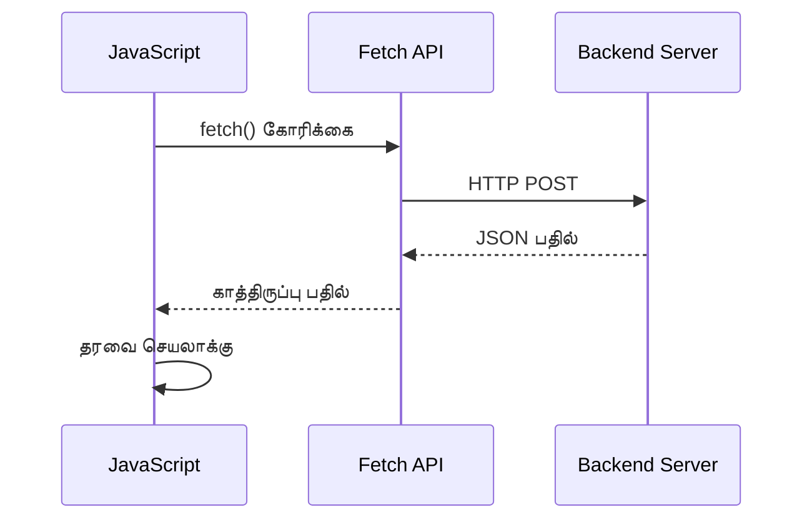
**இந்த நவீன செயலாக்கம் என்ன செய்கிறது:**
- **`async/await`-ஐ பயன்படுத்தி படிக்கக்கூடிய அசிங்க்ரோனஸ் குறியீடு உருவாக்குகிறது**
- **try/catch பகுதிகளுடன் சரியான பிழை கையாளுதலை சேர்க்கிறது**
- **தரவை செயலாக்கும் முன் பதில் நிலையை சரிபார்க்கிறது**
- **JSON தொடர்புக்கு ஏற்ற தலைப்புகளை அமைக்கிறது**
- **தவறுகளை பிழைத்திருத்தம் செய்ய விரிவான செய்திகளை வழங்குகிறது**
- **வெற்றி மற்றும் பிழை நிலைகளுக்கு ஒரே மாதிரியான தரவு கட்டமைப்பை திருப்பி விடுகிறது**

### நவீன Fetch API வல்லமை

**பழைய முறைகளைவிட Fetch API நன்மைகள்:**

| அம்சம் | நன்மை | அமல்படுத்தல் |
|---------|---------|----------------|
| வாக்குறுதி அடிப்படை | சுத்தமான அசிங்க்ரோனஸ் குறியீடு | `await fetch()` |
| கோரிக்கை தனிப்பயன் | முழுமையான HTTP கட்டுப்பாடு | தலைப்புகள், முறைகள், உடல் |
| பதில் கையாளுதல் | தளர்வான தரவு பகுப்பாய்வு | `.json()`, `.text()`, `.blob()` |
| பிழை கையாளுதல் | முழுமையான பிழை பிடித்தல் | try/catch பகுதிகள் |

> 🎥 **கூடுதல் கற்றல்**: [Async/Await Tutorial](https://youtube.com/watch?v=YwmlRkrxvkk) - நவீன வலை அபிவிருத்திக்கான அசிங்க்ரோனஸ் ஜாவாஸ்கிரிப்ட் வடிவங்களைப் புரிந்துகொள்ளுங்கள்.

**சர்வர் தொடர்புக்கான முக்கியக் கருத்துக்கள்:**
- **Async செயலிகள்** சர்வர் பதில்கள் வர இருக்கும் வரை நிறுத்த முடியும்படி செய்கிறது
- **Await சொல்** அசிங்க்ரோனஸ் குறியீட்டைக் ஒத்துழைக்கும் குறியீடு போல வாசிக்க செய்கிறது
- **Fetch API** நவீன, வாக்குறுதி அடிப்படையிலான HTTP கோரிக்கைகளை வழங்குகிறது
- **பிழை கையாளுதல்** நெட்வொர்க் பிரச்சனைகளில் உங்கள் அப்பிளிகேஷன் நல்ல முறையில் ஒன்று பின்otonுகள்

### பதிவு செயலியை முடித்தல்

நாம் அனைத்தையும் ஒன்றிணைத்து ஒரு முழுமையான, உற்பத்தி தயார் பதிவு செயலியை உருவாக்குவோம்:

```javascript
async function register() {
  const registerForm = document.getElementById('registerForm');
  const submitButton = registerForm.querySelector('button[type="submit"]');
  
  try {
    // ஏற்றும் நிலையை காட்டு
    submitButton.disabled = true;
    submitButton.textContent = 'Creating Account...';
    
    // வடிவமைப்பு தரவை செயலாக்கு
    const formData = new FormData(registerForm);
    const jsonData = JSON.stringify(Object.fromEntries(formData));
    
    // சேவையகத்துக்கு அனுப்பு
    const result = await createAccount(jsonData);
    
    if (result.error) {
      console.error('Registration failed:', result.error);
      alert(`Registration failed: ${result.error}`);
      return;
    }
    
    console.log('Account created successfully!', result);
    alert(`Welcome, ${result.user}! Your account has been created.`);
    
    // வெற்றிகரமான பதிவு செய்த பிறகு வடிவத்தை மீட்டமைக்கு
    registerForm.reset();
    
  } catch (error) {
    console.error('Unexpected error:', error);
    alert('An unexpected error occurred. Please try again.');
  } finally {
    // பொத்தானின் நிலையை மீட்டமைக்கு
    submitButton.disabled = false;
    submitButton.textContent = 'Create Account';
  }
}
```

**இந்த மேம்படுத்தப்பட்ட செயல்பாடு:**
- **படிவத்தை சமர்ப்பிக்கும் போது காட்சி பின்னூட்டம் அளிக்கிறது**
- **இருமுறை சமர்ப்பிப்புகளைத் தடுக்கும் வகையில் சமர்ப்பிப்பு பொத்தானை முடக்குகிறது**
- **எதிர்பார்த்த மற்றும் எதிர்பாராத பிழைகளையும் நன்றாக கையாள்கிறது**
- **பயனர் நட்பு வெற்றி மற்றும் பிழை செய்திகள் காட்டுகிறது**
- **வெற்றி பதிவுக்குப் பிறகு படிவத்தை மீட்டமைக்கிறது**
- **எதிர்ப்பார்க்காத முடிவுகளின் பிறகும் UI நிலையை மீட்டமைக்கிறது**

### உங்கள் செயலாக்கத்தைக் கைவிடல்

**உலகளாவிய உலாவி டெவலப்பர் கருவிகளை திறந்து பதிவுகளைச் சோதியுங்கள்:**

1. **உலாவி கன்சோலை திறக்கவும் (F12 → Console tab)**
2. **பதிவு படிவத்தை பூர்த்தி செய்யவும்**
3. **"Create Account" என்பதைக் கிளிக் செய்யவும்**
4. **கன்சோல் செய்திகளையும் பயனர் பின்னூட்டத்தையும் கவனிக்கவும்**

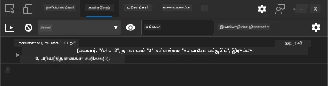

**நீங்கள் பார்க்கவேண்டியது:**
- **சமர்பிக்கும் பொத்தானில் எல்லா நிலையில் உள்ளதைக் காண்பிக்கும்**
- **கன்சோல் பதிவுகள் செயல்முறையின் விரிவான தகவலை காட்டும்**
- **கணக்கு உருவாக்கம் வெற்றி பெறும் போது வெற்றி செய்தி தோன்றும்**
- **வெற்றி சமர்ப்பிப்புக்குப் பிறகு படிவம் தானாக மீட்டமைக்கப்படும்**

> 🔒 **பாதுகாப்பு கருத்து**: தற்போது தரவு HTTP வழியாக பயணிக்கிறது, இது உற்பத்திக்கான பாதுகாப்பான வழி அல்ல. உண்மையான பயன்பாடுகளில், எப்போதும் தரவு கடத்தலை குறியாக்க HTTPS பயன்படுத்தவும். [HTTPS பாதுகாப்பு](https://en.wikipedia.org/wiki/HTTPS) குறித்த மேலதிக தகவலுக்கு, மற்றும் பயனர் தரவு பாதுகாப்பு ஏன் அவசியம் என்பதை அறியவும்.

### 🔄 **பயிற்சி சார்ந்த சரிபார்ப்பு**
**நவீன ஜாவாஸ்கிரிப்ட் ஒருங்கிணைப்பு**: அசிங்க்ரோனஸ் படிவ கையாளுதலைப் புரிந்து கொள்வதைச் சரிபார்க்கவும்:
- ✅ `event.preventDefault()` எப்படி இயல்புநிலை படிவ நடத்தையை மாற்றுகிறது?
- ✅ FormData API கைமுறை புல சேகரிப்பை விட எதனால் திறமையானது?
- ✅ async/await வடிவங்கள் குறியீட்டின் வாசிப்பை எப்படி மேம்படுத்துகின்றன?
- ✅ பிழை கையாளுதல் பயனர் அனுபவத்தில் என்ன பாத்திரம் வகிக்கிறது?

**கணினி அமைப்பு**: உங்கள் படிவ கையாளுதல் இதைப் பிரதிபலிக்கிறது:
- **நிகழ்வு நிம்னோக்கி நிரலாக்கம்**: படிவங்கள் பக்கத்தை மறுபதிவேற்றாமல் பயனர் செயல்களுக்கு பதிலளிக்கின்றன
- **அசிங்க்ரோனஸ் தொடர்பாற்றல்**: சர்வர் கோரிக்கைகள் பயனர் இடைமுகத்தை நிர்வகிக்கவில்லை
- **பிழை கையாளுதல்**: நெட்வொர்க் கோரிக்கைகள் தோல்வி அடைந்தால் நல்ல முறையில் பழுதுபார்க்கிறது
- **நிலை நிர்வாகம்**: UI புதுப்பிப்புகள் சர்வர் பதில்களைக் காட்டுகின்றன
- **முன்னேற்றித்த குறியீடு**: அடிப்படை செயல்பாடு வேலை செய்கிறது, ஜாவாஸ்கிரிப்ட் இதனை மேம்படுத்துகிறது

**தொழில்முறை வடிவங்கள்**: நீங்கள் நடைமுறைப்படுத்தியுள்ளீர்கள்:
- **ஒற்றை பொறுப்பு**: செயலிகள் தெளிவான, கவனிக்கப்பட்ட நோக்கங்களைக் கொண்டவை
- **பிழை எல்லைகள்**: try/catch பகுதிகள் பயன்பாடுகளை இடியாமலாக்க தடுக்கும்
- **பயனர் பின்னூட்டம்**: ஏற்றப்படும் நிலைகள் மற்றும் வெற்றி/பிழை செய்தித்தாள்
- **தரவு மாற்றம்**: FormData-யை JSON-ஆக மாற்றி சர்வர் தொடர்பு

## விரிவான படிவ சரிபார்ப்பு

படிவ சரிபார்ப்பு சமர்ப்பிக்க பிறகு பிழைகளை கண்டுபிடிக்கும் விரக்தி அனுபவத்தைத் தவிர்க்கிறது. சர்வதேச חלל நிலையத்தில் உள்ள பல உபகரண அமைப்புகளபோல், பயனுள்ள சரிபார்ப்பு பல பாதுகாப்பு அடுக்குகளை கொண்டிருக்கும்.

சரியான அணுகுமுறை உடனடி பின்னூட்டத்திற்கு உலாவி நிலை சரிபார்ப்பை, மேம்பட்ட பயனர் அனுபவத்திற்கு ஜாவாஸ்கிரிப்ட் சரிபார்ப்பை மற்றும் பாதுகாப்பு மற்றும் தரவுத்தன்மைக்கான சர்வர் பக்க சரிபார்ப்பை இணைக்கிறது. இந்த மீளுமொழி பயனர் திருப்தியையும் அமைப்பின் பாதுகாப்பையும் உறுதி செய்கிறது.

### சரிபார்ப்பு அடுக்குகளைப் புரிதல்

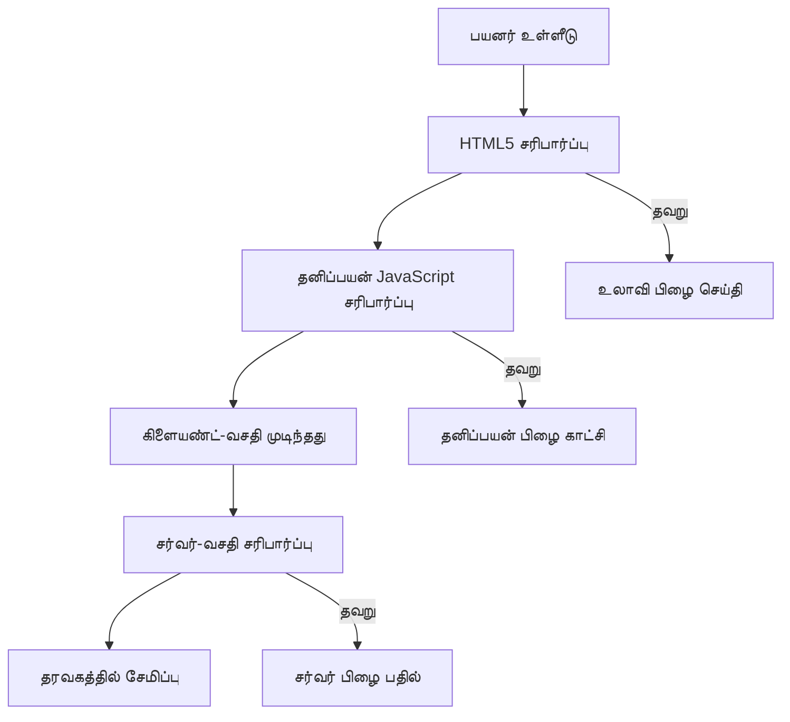
**பல அடுக்கு சரிபார்ப்பு முறைகள்:**
- **HTML5 சரிபார்ப்பு**: உடனடி உலாவி நிலை பரிசோதனைகள்
- **ஜாவாஸ்கிரிப்ட் சரிபார்ப்பு**: தனிப்பயன் விதிகள் மற்றும் பயனர் அனுபவம்
- **சர்வர் சரிபார்ப்பு**: இறுதி பாதுகாப்பு மற்றும் தரவு முழுமை சோதனைகள்
- **முன்னேற்றிய மேம்பாடு**: ஜாவாஸ்கிரிப்ட் செயலிழக்குமானாலும் வேலை செய்கிறது

### HTML5 சரிபார்ப்பு பண்புகள்

**நவீன சரிபார்ப்பு கருவிகள் உங்கள் கையில்:**

| பண்பு | நோக்கம் | எடுத்துக்காட்டு பயன்படுத்தல் | உலாவி நடத்தை |
|-----------|---------|---------------|------------------|
| `required` | கட்டாய புலங்கள் | `<input required>` | காலியான சமர்ப்பிப்பைத் தடுக்கும் |
| `minlength`/`maxlength` | எழுத்து நீள எல்லைகள் | `<input maxlength="20">` | எழுத்து வரம்புகளை கட்டுப்படுத்தும் |
| `min`/`max` | எண் வரம்புகள் | `<input min="0" max="1000">` | எண் எல்லைகளை சரிபார்க்கும் |
| `pattern` | தனிப்பயன் regex விதிகள் | `<input pattern="[A-Za-z]+">` | குறிப்பிட்ட வடிவங்களுடன் பொருந்துகிறது |
| `type` | தரவு வகை சரிபார்ப்பு | `<input type="email">` | வடிவமைப்பிற்கு அமையச் சரிபார்க்கும் |

### CSS சரிபார்ப்பு அலங்காரம்

**சரிபார்ப்பு நிலைகளுக்கு காட்சி பின்னூட்டம் உருவாக்கவும்:**

```css
/* Valid input styling */
input:valid {
  border-color: #28a745;
  background-color: #f8fff9;
}

/* Invalid input styling */
input:invalid {
  border-color: #dc3545;
  background-color: #fff5f5;
}

/* Focus states for better accessibility */
input:focus:valid {
  box-shadow: 0 0 0 0.2rem rgba(40, 167, 69, 0.25);
}

input:focus:invalid {
  box-shadow: 0 0 0 0.2rem rgba(220, 53, 69, 0.25);
}
```

**இந்தக் காட்சி அறிகுறிகள் செய்கின்றவை:**
- **பச்சை எல்லைகள்**: வெற்றிகரமான சரிபார்ப்பை காட்டுகின்றன, மிஷன் கட்டுப்பாட்டில் பச்சை விளக்குகளுபோல
- **சிவப்பு எல்லைகள்**: கவனத்தைத் தேவைப்படுத்தும் சரிபார்ப்பு பிழைகளை குறிக்கின்றன
- **கவனம் வைக்கும் வெளிச்சம்**: தற்போதைய உள்ளீடு இடத்தின் தெளிவு அளிக்கிறது
- **தொடர்ச்சியான அலங்காரம்**: பயனர்கள் கற்றுக்கொள்ளக்கூடிய முன்னிருக்கும் இடைமுக வடிவமைப்புகளை ஏற்படுத்துகிறது

> 💡 **திறமையான குறிப்பு**: பயனர்கள் தட்டும் போது உடனடி காட்சி பின்னூட்டத்தை வழங்க `:valid` மற்றும் `:invalid` CSS பியூட்டோ-வகுப்புக்களை பயன்படுத்தவும், பதிலளிக்கும் மற்றும் உதவும் இடைமுகம் உருவாக்க.

### விரிவான சரிபார்ப்பை செயல்படுத்தல்

உங்களுடைய பதிவு படிவத்துடன் திறம்பட செயல்படும் சரிபார்ப்பை மேம்படுத்துவோம், இது சிறந்த பயனர் அனுபவம் மற்றும் தரவு தரத்தை தரும்:

```html
<form id="registerForm" method="POST" novalidate>
  <div class="form-group">
    <label for="user">Username <span class="required">*</span></label>
    <input id="user" name="user" type="text" required 
           minlength="3" maxlength="20" 
           pattern="[a-zA-Z0-9_]+" 
           autocomplete="username"
           title="Username must be 3-20 characters, letters, numbers, and underscores only">
    <small class="form-text">Choose a unique username (3-20 characters)</small>
  </div>
  
  <div class="form-group">
    <label for="currency">Currency <span class="required">*</span></label>
    <input id="currency" name="currency" type="text" required 
           value="$" maxlength="3" 
           pattern="[A-Z$€£¥₹]+" 
           title="Enter a valid currency symbol or code">
    <small class="form-text">Currency symbol (e.g., $, €, £)</small>
  </div>
  
  <div class="form-group">
    <label for="description">Account Description</label>
    <input id="description" name="description" type="text" 
           maxlength="100" 
           placeholder="Personal savings, checking, etc.">
    <small class="form-text">Optional description (up to 100 characters)</small>
  </div>
  
  <div class="form-group">
    <label for="balance">Starting Balance</label>
    <input id="balance" name="balance" type="number" 
           value="0" min="0" step="0.01" 
           title="Enter a positive number for your starting balance">
    <small class="form-text">Initial account balance (minimum $0.00)</small>
  </div>
  
  <button type="submit">Create Account</button>
</form>
```

**மேம்படுத்தப்பட்ட சரிபார்ப்பைப் புரிதல்:**
- **கட்டாய புலக் குறிக்கோள்களுடன் உதவிக் குறிப்புகளை இணைக்கிறது**
- **வடிவ சரிபார்ப்புக்கான `pattern` பண்புகளை உள்ளடக்கியது**
- **அணுகலும் தெரிவும் பரிந்துரைகளுக்கான `title` பண்புகளை வழங்குகிறது**
- **பயனர் உள்ளீட்டிற்கு வழிகாட்டும் உதவிக் குறிப்பைக் கொடுக்கிறது**
- **சிறந்த அணுகலுக்கு செமாண்டிக் HTML கட்டமைப்பை பயன்படுத்துகிறது**

### மேம்பட்ட சரிபார்ப்பு விதிகள்

**ஒவ்வொரு சரிபார்ப்பு விதியும் என்ன செய்கிறது:**

| புலம் | சரிபார்ப்பு விதிகள் | பயனருக்கு நன்மை |
|-------|------------------|--------------|
| பயனர்பெயர் | `required`, `minlength="3"`, `maxlength="20"`, `pattern="[a-zA-Z0-9_]+"` | செல்லுபடியாகும், தனித்துவமான அடையாளங்களை உறுதி செய்கிறது |
| நாணயம் | `required`, `maxlength="3"`, `pattern="[A-Z$€£¥₹]+"` | பொதுவான நாணய சின்னங்களை ஏற்கிறது |
| இருப்பு | `min="0"`, `step="0.01"`, `type="number"` | எதிர்மறை இருப்புகளைத் தடுக்கும் |
| விளக்கம் | `maxlength="100"` | மெய்ப்பொருட்டான நீள எல்லைகள் |

### சரிபார்ப்பு நடத்தை சோதனை

**இந்தச் சரிபார்ப்புத் திட்டங்களை முயற்சி செய்யவும்:**
1. **கட்டாய புலங்கள் காலி விட்டு சமர்ப்பி**
2. **3 எழுத்துக்களிற்கும் குறைவான பயனர்பெயரை உள்ளிடவும்**
3. **பயனர்பெயர் புலத்தில் சிறப்பு எழுத்துக்களை முயற்சி செய்யவும்**
4. **எதிர்மறை இருப்பு மதிப்பை உள்ளிடவும்**

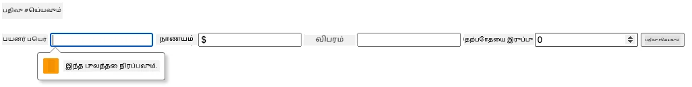

**நீங்கள் கவனிக்கப்போகும்:**
- **உலாவி வளமான சரிபார்ப்பு செய்திகளை காட்டும்**
- **`:valid` மற்றும் `:invalid` நிலைகளின் அடிப்படையில் அலங்காரம் மாறும்**
- **அனைத்து சரிபார்ப்புகள் கொண்டாலும் மட்டுமே படிவம் சமர்ப்பிக்கப்படும்**
- **முதலாவது தவறான புலத்திற்கு தானாக கவனம் மாறும்**

### கிளையன்ட்-சைட் மற்றும் சერვர்-சைட் சரிபார்ப்பு

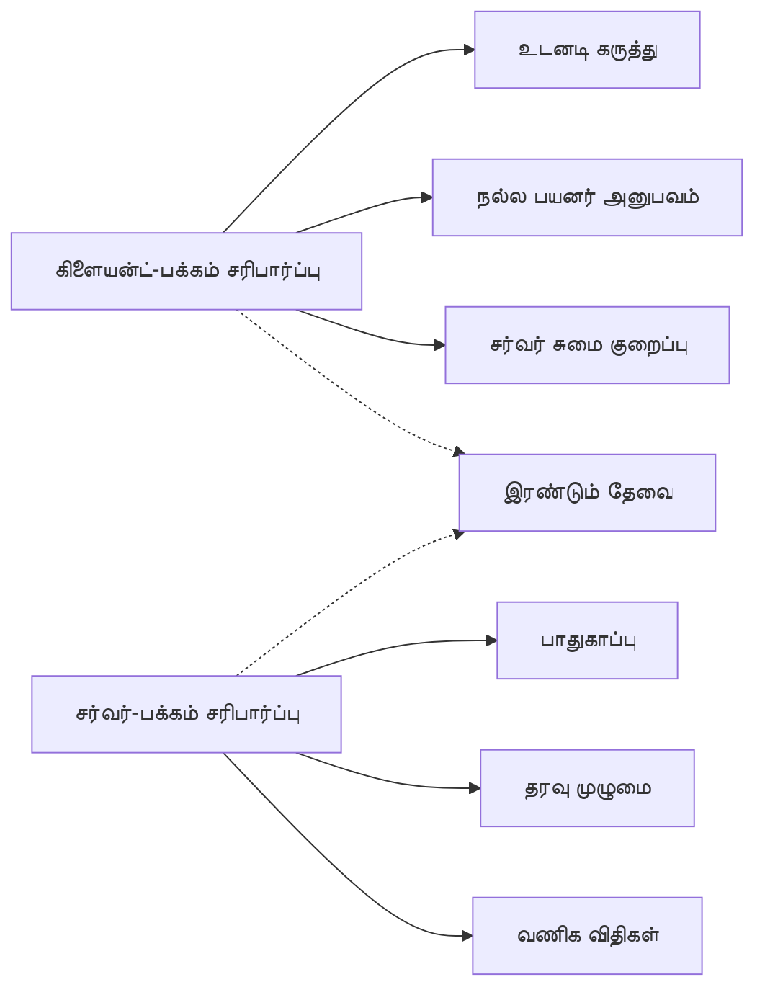
**இரு அடுக்குகளும் தேவையான காரணங்கள்:**
- **கிளையன்ட்-சைட் சரிபார்ப்பு**: உடனடி பின்னூட்டம் வழங்கி பயனர் அனுபவத்தை மேம்படுத்துகிறது
- **சர்வர்-சைட் சரிபார்ப்பு**: பாதுகாப்பையும் சிக்கலான வணிக விதிகளையும் கையாள்கிறது
- **இணைந்த அணுகுமுறை**: உறுதியான, பயனருக்கு சாதகமான மற்றும் பாதுகாப்பான செயலிகள் உருவாக்கப்படுகின்றன
- **முன்னேற்றிய மேம்பாடு**: ஜாவாஸ்கிரிப்ட் அணைக்கப்பட்டதும் கூட வேலை செய்கிறது

> 🛡️ **பாதுகாப்பு நினைவூட்டி**: கிளையன்ட்-சைட் சரிபார்ப்பில் மட்டும் நம்ப வேண்டாம்! தீய பயனர்கள் கிளையன்ட்-சைட் சோதனைகளைத் தவிர்த்து விட முடியும், எனவே பாதுகாப்பிற்கும் தரவுத்தன்மைக்குமான சர்வர்-சைட் சரிபார்ப்பு அவசியம்.

### ⚡ **அடுத்த 5 நிமிடங்களில் செய்யவேண்டியவை**
- [ ] தவறான தரவுடனான படிவத்தை சோதித்து சரிபார்ப்பு செய்திகளை பார்க்கவும்
- [ ] ஜாவாஸ்கிரிப்ட் அணைக்கப்பட்டபோது படிவத்தை சமர்ப்பித்து HTML5 சரிபார்ப்பைக் காணவும்
- [ ] உலாவி DevTools இல் திறந்து சர்வருக்குச் செல்லும் படிவ தரவுகளை சரிபார்க்கவும்
- [ ] வெவ்வேறு உள்ளீடு வகைகளை முயற்சி செய்து மொபைல் விசைப்பலகை மாற்றங்களை காணவும்

### 🎯 **இந்த மணிநேரத்தில் சாதிக்கக்கூடியவை**
- [ ] பாடம் முடிந்த பொழுது புதுப்பித்தல் கேள்வொருக்கத்தை முடித்து படிவ கையாளல் கருத்துகளை புரிந்து கொள்
- [ ] நேரடி பின்னூட்டம் உடன் விரிவான சரிபார்ப்பை நடைமுறைப்படுத்து
- [ ] CSS அலங்காரத்தைச் சேர்த்து தொழில்முறை தோற்ற படிவங்களை உருவாக்கு
- [ ] நகல் பயனர்பெயர்கள் மற்றும் சர்வர் பிழைகளுக்கு பிழை கையாளுதல்களை செய்
- [ ] கடவுச்சொல் உறுதிப்படுத்தல் புலங்கள் மற்றும் பொருந்தும் சரிபார்ப்புகளைச் சேர்க்கவும்

### 📅 **உங்கள் வார முழு படிவ திறமை பயணம்**
- [ ] மேம்பட்ட படிவ அம்சங்களுடன் முழுமையான வங்கி செயலியை முடிக்கவும்
- [ ] சுயவிவர படங்கள் அல்லது ஆவணங்களுக்கான கோப்பு பதிவேற்றம் திறன்களைச் சேர்க்கவும்
- [ ] முன்னேற்றக் குறியீடுகள் மற்றும் நிலை நிர்வாகத்துடன் பல படி படிவங்களை மேற்கொள்
- [ ] பயனர் தேர்வுகளின் அடிப்படையில் தானாகச் சரிகொள் படிவங்களை உருவாக்கு
- [ ] சிறந்த பயனர் அனுபவத்திற்காக படிவத்தை தானாக சேமித்து மீட்டெடுக்கவும்
- [ ] மின்னஞ்சல் உறுதிப்படுத்தல் மற்றும் தொலைபேசி எண் வடிவமைப்புபோன்ற மேம்பட்ட சரிபார்ப்புகளைச் செயல் படுத்தவும்

### 🌟 **உங்கள் மாதாந்திர முன்னணி வடிவமைப்பு திறமை**
- [ ] கூட்டு நிபந்தனைகளும் பணிச்சொறிகளும் கொண்ட சிக்கலான படிவ செயலிகளைக் கட்டமை
- [ ] வேகமான அபிவிருத்திக்கான படிவ நூலகங்களையும் கட்டமைப்புகளையும் கற்று கொள்
- [ ] அணுகல் வழிகாட்டு நெறிமுறைகள் மற்றும் அனைத்து பயனர்களுக்கும் பொருந்தும் வடிவமைப்புக்களை ஆக்கவும்
- [ ] உலகளாவிய படிவங்களுக்கு சர்வதேச மயமாக்கல் மற்றும் நிலைத்திருப்பை நடைமுறைப்படுத்தவும்
- [ ] மீண்டும் பயன்படுத்தக்கூடிய படிவ கூறு நூலகங்கள் மற்றும் வடிவமைப்பு அமைப்புகளை உருவாக்கு
- [ ] திறந்த மூல படிவ திட்டங்களுக்கு பங்களித்து சிறந்த நடைமுறைகளை பகிரவும்

## 🎯 உங்கள் படிவ மேம்பாட்டு திறன் காலவரிசை

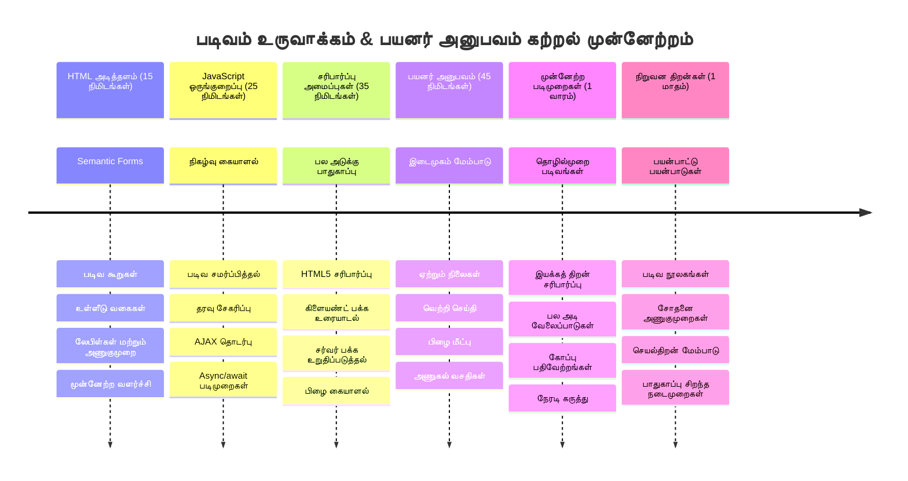
### 🛠️ உங்கள் படிவ மேம்பாட்டு கருவி சேகரிப்பு சுருக்கம்

இந்த பாடத்தை முடித்த பிறகு, நீங்கள் தற்போது அனுபவித்துள்ளீர்கள்:
- **HTML5 படிவங்கள்**: செமாண்டிக் கட்டமைப்பு, உள்ளீடு வகைகள் மற்றும் அணுகல் வசதிகள் 
- **ஜாவாஸ்கிரிப்ட் படிவ கையாளல்**: நிகழ்வு நிர்வாகம், தரவு சேகரிப்பு மற்றும் AJAX தொடர்பு
- **சரிபார்ப்புக் கட்டமைப்பு**: பாதுகாப்பு மற்றும் பயனர் அனுபவத்திற்கான பல அடுக்கு சரிபார்ப்பு
- **அசிங்க்ரோனஸ் நிரலாக்கம்**: நவீன fetch API மற்றும் async/await வடிவமைப்புகள்
- **பிழை மேலாண்மை**: முழுமையான பிழை கையாளுதல் மற்றும் பயனர் பின்னூட்ட அமைப்புகள்
- **பயனர் அனுபவ வடிவமைப்பு**: ஏற்றும் நிலைகள், வெற்றி செய்தி மற்றும் பிழை மீட்பு
- **முன்னேற்றிய மேம்பாடு**: அனைத்து உலாவிகளிலும் மற்றும் திறன்களிலும் செயல்படும் படிவங்கள்

**உண்மையான உலக பயன்பாடுகள்**: உங்கள் படிவ மேம்பாட்டு நுணுக்கங்கள் நேரடியாகப் பயன்படுத்தப்படுகின்றன:
- **மின் வணிக செயலிகள்**: காசோலை செயல்முறைகள், கணக்கு பதிவு மற்றும் கட்டணம் படிவங்கள்
- **நிறுவன மென்பொருள்**: தரவு நுழைவு அமைப்புகள், அறிக்கைகள் இடைமுகங்கள் மற்றும் பணிச்சொறி செயலிகள்
- **உள்ளடக்கம் மேலாண்மை**: வெளியீட்டு தளங்கள், பயனர் உருவாக்கிய உள்ளடக்கம் மற்றும் நிர்வாக இடைமுகங்கள்
- **நிதி செயலிகள்**: வங்கி உள்ளடக்கங்கள், முதலீட்டு தளங்கள் மற்றும் பரிவர்த்தனை அமைப்புகள்
- **சுகாதார அமைப்புகள்**: நோயாளி போர்ட்டல்கள், நேரடி அட்டவணை மற்றும் மருத்துவ பதிவு படிவங்கள்
- **கல்வி தளங்கள்**: பாடநெறி பதிவு, மதிப்பீட்டு கருவிகள் மற்றும் கல்வி நிர்வாகம்

**தொழில்முறை திறன்கள் பெறப்பட்டன**: நீங்கள் இப்போது:
- **திறன்பெற்ற படிவங்களை வடிவமைக்க முடியும்**, ஆக்ராமிகள் உட்பட அனைத்து பயனர்களுக்கும் பொருந்தும்
- **பாதுகாப்பு படிவ சரிபார்ப்பை நடைமுறைப்படுத்த கற்றுக்கொண்டீர்கள்**, தரவு முறுப்பாக்கம் மற்றும் பாதுகாப்பு பிரச்சனைகள் தவிர்த்து
- **தொடர்ச்சியான பயனர் இடைமுகங்களை உருவாக்க முடியும்**, தெளிவான பின்னூட்டம் மற்றும் வழிகாட்டி உதவிகளுடன்
- **உலகளாவிய உலாவி டெவலப்பர் கருவிகள் மற்றும் நெட்வொர்க் பகுப்பாய்வைக் கொண்டு சிக்கலான படிவ இடைமுகங்களை பிழைத்திருத்த முடியும்**
- **படிவ செயல்திறனைக் கூற்றான தரவை கையாளுதலும் சரிபார்ப்பும் மூலம் மேம்படுத்த முடியும்**

**முன்னணி மேம்பாட்டு கருத்துக்கள் கிடைத்தன**:
- **நிகழ்வு இயக்கப்பட்ட கட்டமைப்பு**: பயனர் தொடர்பு கையாளுதல் மற்றும் பதிலளிப்பு அமைப்புகள்
- **அசிங்க்ரோனஸ் நிரலாக்கம்**: தடையில்லாத சர்வர் தொடர்பாற்றல் மற்றும் பிழை கையாளுதல்
- **தரவு சரிபார்ப்பு**: கிளையன்ட்-சைட் மற்றும் சர்வர்-சைட் பாதுகாப்பு மற்றும் முழுமைச் சோதனைகள்
- **பயனர் அனுபவ வடிவமைப்பு**: பயனர்களை வெற்றிக்குக் வழிநடத்தும் அறிமுக இடைமுகங்கள்
- **அணுகல் பொறியியல்**: பல்வேறு பயனர் தேவைகளுக்கான கைவிடத்தக்க வடிவமைப்பு

**அடுத்த நிலை**: நீங்கள் நவீன படிவ நூலகங்களை ஆராயவும், சிக்கலான சரிபார்ப்புக் விதிகளை நடைமுறைப்படுத்தவும், அல்லது நிறுவன தரத்தின் தரவுச் சேகரிப்பு அமைப்புகளை கட்டமைக்க தயார்!

🌟 **பொருள் பெற்ற சாதனம்**: நீங்கள் தொழில்முறை சரிபார்ப்பு, பிழை கையாளுதல் மற்றும் பயனர் அனுபவ வடிவமைப்பு முறைகளுடன் முழுமையான படிவ கையாளல் அமைப்பை உருவாக்கியுள்ளீர்கள்!

---


---

## GitHub Copilot முகவரின் சவால் 🚀

Agent முறையைப் பயன்படுத்தி, கீழ்க்கண்ட சவாலை நிறைவேற்றவும்:

**விளக்கம்:** பதிவுத்தாளில் விரிவான கிளையன்ட்-சைட் சரிபார்ப்பும் பயனர் பின்னூட்டத்தையும் இணைத்து மேம்படுத்தவும். இந்த சவால் படிவ சரிபார்ப்பு, பிழை கையாளுதல் மற்றும் பயனர் அனுபவத்தை அதிகரிக்கும் தொடர்பான பயிற்சியை வழங்கும்.
**Prompt:** பதிவு படிவத்திற்கான முழுமையான வடிகட்டும் அமைப்பை உருவாக்கவும், இதில் அடங்க வேண்டும்: 1) பயனர் எழுத்துப்பதிவு செய்யும் போது ஒவ்வொருச்சேதத்திற்கும் நேரடி validation பின்னூட்டம், 2) ஒவ்வொரு உள்ளீட்டு புலத்திற்கும் கீழே தோன்றும் தனிப்பயன் validation செய்திகள், 3) கடவுச்சொல் உறுதிப்படுத்தும் புலம் மற்றும் பொருந்துதல் validation, 4) காட்சிப்படுத்தும் குறியீடுகள் (செல்லுபடியான புலங்களுக்கு பச்சை சரிபார்ப்பு குறியீடுகள் மற்றும் செல்லாத புலங்களுக்கு சிவப்பு எச்சரிக்கை), 5) எல்லா validation-களும் பாசாகும் போது மட்டுமே இயங்கக் கூடிய சமர்ப்பிப்பு பொத்தான். HTML5 validation பண்புகளை, validation நிலைக்கு CSS அழகுபடுத்தலை, மற்றும் இணையற்ற செயல்பாடுகளுக்கு JavaScript-ஐ பயன்படுத்தவும்.

[agent mode](https://code.visualstudio.com/blogs/2025/02/24/introducing-copilot-agent-mode) பற்றிய தகவலுக்கு இங்கே காண்க.

## 🚀 சவால்

பயனர் ஏற்கனவே இருந்தால் HTML இல் பிழை செய்தியை காட்டவும்.

சிறிது CSS அலங்காரத்துடன் இறுதி பதிவு பக்கம் போன்றதாக இருக்கும் உதாரணம் இதோ:

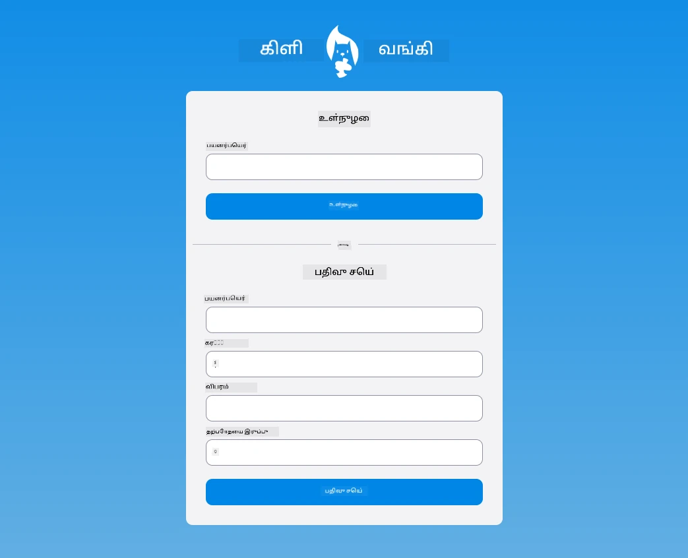

## படிப்பு முடிந்த பின் வினாத்தாள்

[Post-lecture quiz](https://ff-quizzes.netlify.app/web/quiz/44)

## மதிப்பாய்வு மற்றும் சுயபடிப்பு

விகிதாசாரர்களின் படிவ கட்டுமான முயற்சிகளில் மிகச்சிறந்த படைப்பாற்றலை வெளிப்படுத்தியுள்ளனர், குறிப்பாக validation தந்திரங்கள் தொடர்பாக. [CodePen](https://codepen.com) -ஐ நோக்கி விலகி பல்வேறு அருமையான படிவங்களை காணலாம், நீங்கள் சில புதுமையான மற்றும் ஊக்குவிக்கும் படிவங்களை கண்டுபிடிக்க விருப்பமுள்ளதாக இருக்கிறீர்களா?

## பணிச் செயல்பாடு

[உங்கள் வங்கிப் பயன்பாட்டிற்கு அழகுபடுத்துங்கள்](assignment.md)

---

<!-- CO-OP TRANSLATOR DISCLAIMER START -->
**வெளியுறுத்தல்**:  
இந்த ஆவணம் AI மொழிபெயர்ப்பு சேவை [Co-op Translator](https://github.com/Azure/co-op-translator) பயன்படுத்தி மொழிபெயர்க்கப்பட்டுள்ளது. நாங்கள் துல்லியத்திற்காக முயற்சித்தாலும், தானியங்கி மொழிபெயர்ப்புகளில் தவறுகள் அல்லது முரண்பாடுகள் இருக்கக்கூடும் என்பதை கருத்தில் கொள்ளவும். ஒரிஜினல் ஆவணம் அதன் இயல்புநிலை மொழியில் அதிகாரப்பூர்வ ஆதாரம் என்று கருதப்பட வேண்டும். முக்கியமான தகவல்களுக்கு, தொழில்முனைவோர்களால் செய்யப்படும் மனித மொழிபெயர்ப்பு பரிந்துரைக்கப்படுகிறது. இந்த மொழிபெயர்ப்பைப் பயன்படுத்துவதால் ஏற்பட்ட எந்த தவறான புரிதல்களுக்கும் அல்லது தவறான விளக்கங்களுக்கு கடமை ஏற்றுக்கொள்ளப்படாது.
<!-- CO-OP TRANSLATOR DISCLAIMER END -->