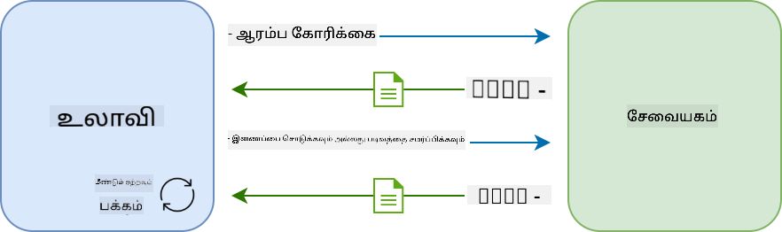
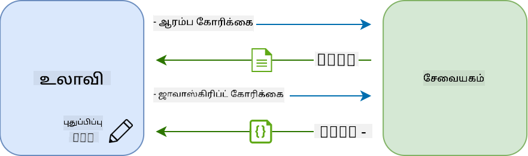

<!--
CO_OP_TRANSLATOR_METADATA:
{
  "original_hash": "89d0df9854ed020f155e94882ae88d4c",
  "translation_date": "2025-10-11T12:03:28+00:00",
  "source_file": "7-bank-project/3-data/README.md",
  "language_code": "ta"
}
-->
# வங்கி பயன்பாட்டை உருவாக்குதல் பகுதி 3: தரவுகளை பெறுதல் மற்றும் பயன்படுத்துதல்

## முன்-வகுப்பு வினாடி வினா

[முன்-வகுப்பு வினாடி வினா](https://ff-quizzes.netlify.app/web/quiz/45)

### அறிமுகம்

ஒவ்வொரு வலை பயன்பாட்டின் மையத்தில் *தரவு* உள்ளது. தரவுகள் பல வடிவங்களில் இருக்கலாம், ஆனால் அவற்றின் முக்கிய நோக்கம் பயனாளருக்கு தகவல்களை காட்டுவதாகும். வலை பயன்பாடுகள் அதிகமாக இடையூறு இல்லாமல் மற்றும் சிக்கலானதாக மாறுவதால், பயனர் தகவல்களை அணுகுவது மற்றும் தொடர்பு கொள்ளுவது தற்போது வலை வளர்ச்சியின் முக்கிய பகுதியாக உள்ளது.

இந்த பாடத்தில், சர்வரில் இருந்து தரவுகளை அசிங்கமாக பெறுவது மற்றும் HTML ஐ மீண்டும் ஏற்றாமல் வலைப்பக்கத்தில் தகவல்களை காட்ட இந்த தரவுகளை பயன்படுத்துவது எப்படி என்பதை காண்போம்.

### முன்-தரப்பு

இந்த பாடத்திற்காக நீங்கள் [உள்நுழைவு மற்றும் பதிவு படிவம்](../2-forms/README.md) பகுதியை உருவாக்கியிருக்க வேண்டும். மேலும், [Node.js](https://nodejs.org) ஐ நிறுவி [சர்வர் API ஐ இயக்க](../api/README.md) வேண்டும், இதனால் நீங்கள் கணக்கு தரவுகளை பெற முடியும்.

சர்வர் சரியாக இயங்குகிறதா என்பதை சரிபார்க்க, டெர்மினலில் இந்த கட்டளையை இயக்கவும்:

```sh
curl http://localhost:5000/api
# -> should return "Bank API v1.0.0" as a result
```

---

## AJAX மற்றும் தரவுகளை பெறுதல்

சாதாரண வலைத்தளங்கள், பயனர் ஒரு இணைப்பை தேர்ந்தெடுக்கும்போது அல்லது ஒரு படிவத்தை சமர்ப்பிக்கும்போது, முழு HTML பக்கத்தை மீண்டும் ஏற்றுவதன் மூலம் காட்டப்படும் உள்ளடக்கத்தை புதுப்பிக்கின்றன. புதிய தரவுகள் ஏற்றப்பட வேண்டிய ஒவ்வொரு முறையும், வலை சர்வர் ஒரு புதிய HTML பக்கத்தை திருப்பி அனுப்புகிறது, இது உலாவியில் செயல்படுத்தப்பட வேண்டும், தற்போதைய பயனர் செயல்பாட்டை தடை செய்கிறது மற்றும் ஏற்றுமதி நேரத்தில் தொடர்புகளை வரையறுக்கிறது. இந்த வேலைப்போக்கு *பல பக்க பயன்பாடு* அல்லது *MPA* என்று அழைக்கப்படுகிறது.



வலை பயன்பாடுகள் அதிகமாக சிக்கலான மற்றும் இடையூறு இல்லாததாக மாறியபோது, [AJAX (Asynchronous JavaScript and XML)](https://en.wikipedia.org/wiki/Ajax_(programming)) என்ற புதிய தொழில்நுட்பம் உருவானது. இந்த தொழில்நுட்பம், HTML பக்கத்தை மீண்டும் ஏற்றாமல், JavaScript ஐப் பயன்படுத்தி சர்வரில் இருந்து தரவுகளை அசிங்கமாக அனுப்பவும் பெறவும் அனுமதிக்கிறது, இது வேகமான புதுப்பிப்புகள் மற்றும் மென்மையான பயனர் தொடர்புகளை உருவாக்குகிறது. சர்வரில் இருந்து புதிய தரவுகள் பெறப்பட்டவுடன், தற்போதைய HTML பக்கம் [DOM](https://developer.mozilla.org/docs/Web/API/Document_Object_Model) API ஐப் பயன்படுத்தி JavaScript மூலம் புதுப்பிக்கப்படலாம். காலப்போக்கில், இந்த அணுகுமுறை [*ஒரு பக்க பயன்பாடு* அல்லது *SPA*](https://en.wikipedia.org/wiki/Single-page_application) என்று அழைக்கப்படும் முறையாக உருவாகியுள்ளது.



AJAX முதலில் அறிமுகப்படுத்தப்பட்ட போது, தரவுகளை அசிங்கமாக பெறுவதற்கான ஒரே API [`XMLHttpRequest`](https://developer.mozilla.org/docs/Web/API/XMLHttpRequest/Using_XMLHttpRequest) இருந்தது. ஆனால் நவீன உலாவிகள் [`Fetch` API](https://developer.mozilla.org/docs/Web/API/Fetch_API) ஐ செயல்படுத்துகின்றன, இது வாக்குறுதிகளைப் பயன்படுத்துகிறது மற்றும் JSON தரவுகளை மாற்றுவதற்கு சிறந்தது.

> அனைத்து நவீன உலாவிகளும் `Fetch API` ஐ ஆதரிக்கின்றன, ஆனால் உங்கள் வலை பயன்பாடு பழமையான அல்லது பழைய உலாவிகளில் வேலை செய்ய வேண்டும் என்றால், [caniuse.com இல் இணக்கத்தன்மை அட்டவணையை](https://caniuse.com/fetch) முதலில் சரிபார்ப்பது நல்லது.

### பணிகள்

[முந்தைய பாடத்தில்](../2-forms/README.md) கணக்கை உருவாக்க பதிவு படிவத்தை செயல்படுத்தினோம். இப்போது, ஒரு கணக்கைப் பயன்படுத்தி உள்நுழையவும், அதன் தரவுகளைப் பெறவும் குறியீட்டைச் சேர்ப்போம். `app.js` கோப்பைத் திறந்து புதிய `login` செயல்பாட்டைச் சேர்க்கவும்:

```js
async function login() {
  const loginForm = document.getElementById('loginForm')
  const user = loginForm.user.value;
}
```

இங்கு, `getElementById()` மூலம் படிவ உருப்படியை பெறுவதில் தொடங்குகிறோம், பின்னர் `loginForm.user.value` மூலம் உள்ளீட்டில் இருந்து பயனர் பெயரைப் பெறுகிறோம். ஒவ்வொரு படிவ கட்டுப்பாடும் அதன் பெயரால் (HTML இல் `name` பண்பை அமைத்தல்) படிவத்தின் ஒரு சொத்தாக அணுகப்படலாம்.

பதிவுக்கான செயல்பாட்டில் செய்ததைப் போலவே, கணக்கு தரவுகளைப் பெறுவதற்கான சர்வர் கோரிக்கையைச் செய்ய மற்றொரு செயல்பாட்டை உருவாக்குவோம்:

```js
async function getAccount(user) {
  try {
    const response = await fetch('//localhost:5000/api/accounts/' + encodeURIComponent(user));
    return await response.json();
  } catch (error) {
    return { error: error.message || 'Unknown error' };
  }
}
```

சர்வரில் இருந்து தரவுகளை அசிங்கமாக கோர `fetch` API ஐப் பயன்படுத்துகிறோம், ஆனால் இந்த முறை, நாம் தரவுகளை மட்டும் கேட்கிறோம் என்பதால், URL தவிர எந்த கூடுதல் அளவுருக்களும் தேவையில்லை. இயல்பாக, `fetch` ஒரு [`GET`](https://developer.mozilla.org/docs/Web/HTTP/Methods/GET) HTTP கோரிக்கையை உருவாக்குகிறது, இது இங்கு தேவைப்படும் ஒன்று.

✅ `encodeURIComponent()` என்பது URL க்கான சிறப்பு எழுத்துக்களை தப்பிக்கச் செய்யும் ஒரு செயல்பாடாகும். `user` மதிப்பை URL இல் நேரடியாக பயன்படுத்தி இந்த செயல்பாட்டை அழைக்காமல் இருந்தால் என்ன பிரச்சினைகள் ஏற்படலாம்?

இப்போது `login` செயல்பாட்டை `getAccount` ஐப் பயன்படுத்த புதுப்பிப்போம்:

```js
async function login() {
  const loginForm = document.getElementById('loginForm')
  const user = loginForm.user.value;
  const data = await getAccount(user);

  if (data.error) {
    return console.log('loginError', data.error);
  }

  account = data;
  navigate('/dashboard');
}
```

முதலில், `getAccount` என்பது ஒரு அசிங்கமான செயல்பாடாக இருப்பதால், சர்வர் முடிவுக்காக காத்திருக்க `await` விசைப்பொறியைப் பொருத்த வேண்டும். எந்த சர்வர் கோரிக்கையிலும், பிழை நிலைகளை கையாளவும் வேண்டும். தற்போது, பிழையை காட்ட ஒரு பதிவு செய்தியை மட்டும் சேர்ப்போம், பின்னர் அதில் திரும்புவோம்.

பின்னர், டாஷ்போர்டு தகவல்களை காட்டுவதற்கு பின்னர் பயன்படுத்த கணக்கு தரவுகளை எங்காவது சேமிக்க வேண்டும். `account` மாறி இன்னும் இல்லை என்பதால், கோப்பின் மேல் ஒரு உலகளாவிய மாறியை உருவாக்குவோம்:

```js
let account = null;
```

பயனர் தரவுகள் ஒரு மாறியில் சேமிக்கப்பட்ட பிறகு, *login* பக்கத்திலிருந்து *dashboard* க்கு `navigate()` செயல்பாட்டைப் பயன்படுத்தி செல்லலாம்.

இறுதியாக, login படிவம் சமர்ப்பிக்கப்பட்டால், `login` செயல்பாட்டை அழைக்க HTML ஐ மாற்ற வேண்டும்:

```html
<form id="loginForm" action="javascript:login()">
```

புதிய கணக்கை பதிவு செய்து அதே கணக்கைப் பயன்படுத்தி உள்நுழைய முயற்சிப்பதன் மூலம் அனைத்தும் சரியாக வேலை செய்கிறதா என்பதைச் சோதிக்கவும்.

அடுத்த பகுதிக்கு செல்லும் முன், `register` செயல்பாட்டை இந்தக் குறியீட்டை செயல்பாட்டின் கீழ் சேர்த்து முடிக்கலாம்:

```js
account = result;
navigate('/dashboard');
```

✅ இயல்பாக, நீங்கள் பார்வையிடும் வலைப்பக்கத்திலிருந்து *அதே டொமைன் மற்றும் போர்ட்* சர்வர் API களை மட்டுமே அழைக்க முடியும். இது உலாவிகள் கட்டாயமாக்கும் பாதுகாப்பு முறை. ஆனால், எங்கள் வலை பயன்பாடு `localhost:3000` இல் இயங்குகிறது, ஆனால் சர்வர் API `localhost:5000` இல் இயங்குகிறது, இது எப்படி வேலை செய்கிறது? [Cross-Origin Resource Sharing (CORS)](https://developer.mozilla.org/docs/Web/HTTP/CORS) என்ற தொழில்நுட்பத்தைப் பயன்படுத்துவதன் மூலம், சர்வர் பதிலுக்கு குறிப்பிட்ட டொமைன்களுக்கு விலக்குகளை அனுமதிக்கும் சிறப்பு தலைப்புகளைச் சேர்த்தால், குறுக்குவழி HTTP கோரிக்கைகளைச் செய்ய முடியும்.

> API களைப் பற்றி மேலும் அறிய இந்த [பாடத்தை](https://docs.microsoft.com/learn/modules/use-apis-discover-museum-art/?WT.mc_id=academic-77807-sagibbon) எடுத்துக்கொள்ளுங்கள்

## HTML ஐ புதுப்பித்து தரவுகளை காட்டுதல்

இப்போது நமக்கு பயனர் தரவுகள் உள்ளன, உள்ள HTML ஐ புதுப்பித்து அதை காட்ட வேண்டும். `document.getElementById()` போன்றவற்றைப் பயன்படுத்தி DOM இல் இருந்து ஒரு உருப்படியை எடுப்பது எப்படி என்பதை நாம் ஏற்கனவே அறிவோம். ஒரு அடிப்படை உருப்படியை எடுத்த பிறகு, அதை மாற்ற அல்லது குழந்தை உருப்படிகளைச் சேர்க்க சில API களைப் பயன்படுத்தலாம்:

- [`textContent`](https://developer.mozilla.org/docs/Web/API/Node/textContent) சொத்தைப் பயன்படுத்தி ஒரு உருப்படியின் உரையை மாற்றலாம். இந்த மதிப்பை மாற்றுவது, உருப்படியின் அனைத்து குழந்தைகளையும் (எதுவும் இருந்தால்) நீக்கி, வழங்கப்பட்ட உரையை மாற்றுகிறது. எனவே, ஒரு குறிப்பிட்ட உருப்படியின் அனைத்து குழந்தைகளையும் நீக்க ஒரு திறமையான முறையாகவும் இது செயல்படுகிறது.

- [`document.createElement()`](https://developer.mozilla.org/docs/Web/API/Document/createElement) மற்றும் [`append()`](https://developer.mozilla.org/docs/Web/API/ParentNode/append) முறையைப் பயன்படுத்தி புதிய குழந்தை உருப்படிகளை உருவாக்கி இணைக்கலாம்.

✅ ஒரு உருப்படியின் [`innerHTML`](https://developer.mozilla.org/docs/Web/API/Element/innerHTML) சொத்தைப் பயன்படுத்தி அதன் HTML உள்ளடக்கங்களை மாற்றவும் முடியும், ஆனால் இது [cross-site scripting (XSS)](https://developer.mozilla.org/docs/Glossary/Cross-site_scripting) தாக்குதல்களுக்கு பாதிக்கப்படக்கூடியது என்பதால் தவிர்க்கப்பட வேண்டும்.

### பணிகள்

டாஷ்போர்டு திரைக்கு செல்லும் முன், *login* பக்கத்தில் இன்னும் ஒரு விஷயத்தைச் செய்ய வேண்டும். தற்போது, நீங்கள் இல்லாத பயனர் பெயருடன் உள்நுழைய முயற்சித்தால், ஒரு செய்தி கன்சோலில் காட்டப்படுகிறது, ஆனால் ஒரு சாதாரண பயனாளருக்கு எதுவும் மாறவில்லை, என்ன நடக்கிறது என்று தெரியாது.

login `<button>` க்கு முன் ஒரு பிழை செய்தியைத் தேவைப்பட்டால் காட்ட ஒரு இடத்தைச் சேர்ப்போம்:

```html
...
<div id="loginError"></div>
<button>Login</button>
...
```

இந்த `<div>` உருப்படி காலியாக உள்ளது, அதாவது அதில் உள்ளடக்கம் சேர்க்கப்படும் வரை திரையில் எதுவும் காட்டப்படாது. இதற்கு `id` கொடுக்கிறோம், இதனால் JavaScript மூலம் எளிதாக பெற முடியும்.

`app.js` கோப்பிற்கு திரும்பி புதிய உதவியாளர் செயல்பாடு `updateElement` ஐ உருவாக்கவும்:

```js
function updateElement(id, text) {
  const element = document.getElementById(id);
  element.textContent = text;
}
```

இது மிகவும் நேர்மையானது: ஒரு உருப்படி *id* மற்றும் *text* கொடுக்கப்பட்டால், பொருந்தும் `id` கொண்ட DOM உருப்படியின் உரை உள்ளடக்கத்தை இது புதுப்பிக்கும். `login` செயல்பாட்டில் முந்தைய பிழை செய்தியின் இடத்தில் இந்த முறையைப் பயன்படுத்துவோம்:

```js
if (data.error) {
  return updateElement('loginError', data.error);
}
```

இப்போது நீங்கள் தவறான கணக்குடன் உள்நுழைய முயற்சித்தால், இதுபோன்ற ஒன்றைக் காணலாம்:


இப்போது பிழை உரை காட்சியாக காட்டப்படுகிறது, ஆனால் நீங்கள் அதை ஸ்கிரீன் ரீடரில் முயற்சித்தால், எதுவும் அறிவிக்கப்படவில்லை என்பதை கவனிக்கலாம். ஒரு பக்கத்தில் மாறுபடியாகச் சேர்க்கப்பட்ட உரை ஸ்கிரீன் ரீடர்களால் அறிவிக்கப்பட வேண்டும் என்றால், இது [Live Region](https://developer.mozilla.org/docs/Web/Accessibility/ARIA/ARIA_Live_Regions) எனப்படும் ஒன்றைப் பயன்படுத்த வேண்டும். இங்கு, ஒரு குறிப்பிட்ட வகை லைவ் ரீஜியன், ஒரு எச்சரிக்கை பயன்படுத்தப் போகிறோம்:

```html
<div id="loginError" role="alert"></div>
```

`register` செயல்பாட்டின் பிழைகளுக்கு இதே நடத்தை செயல்படுத்தவும் (HTML ஐ புதுப்பிக்க மறக்க வேண்டாம்).

## டாஷ்போர்டில் தகவல்களை காட்டுதல்

நாம் இப்போது பார்த்த அதே தொழில்நுட்பங்களைப் பயன்படுத்தி, டாஷ்போர்டு பக்கத்தில் கணக்கு தகவல்களை காட்டுவோம்.

சர்வரில் இருந்து பெறப்பட்ட ஒரு கணக்கு பொருள் இவ்வாறு இருக்கும்:

```json
{
  "user": "test",
  "currency": "$",
  "description": "Test account",
  "balance": 75,
  "transactions": [
    { "id": "1", "date": "2020-10-01", "object": "Pocket money", "amount": 50 },
    { "id": "2", "date": "2020-10-03", "object": "Book", "amount": -10 },
    { "id": "3", "date": "2020-10-04", "object": "Sandwich", "amount": -5 }
  ],
}
```

> குறிப்பு: உங்கள் வாழ்க்கையை எளிதாக்க, தரவுகளுடன் ஏற்கனவே நிரப்பப்பட்ட `test` கணக்கைப் பயன்படுத்தலாம்.

### பணிகள்

HTML இல் "Balance" பகுதியை மாற்றி இடதுசாரி உருப்படிகளைச் சேர்ப்பதிலிருந்து தொடங்குவோம்:

```html
<section>
  Balance: <span id="balance"></span><span id="currency"></span>
</section>
```

கணக்கு விளக்கத்தை காட்ட புதிய பகுதியை கீழே சேர்ப்போம்:

```html
<h2 id="description"></h2>
```

✅ கணக்கு விளக்கம் அதன் கீழே உள்ள உள்ளடக்கத்திற்கான தலைப்பாக செயல்படுவதால், இது semantically தலைப்பாக குறிக்கப்படுகிறது. [தலைப்பு அமைப்பு](https://www.nomensa.com/blog/2017/how-structure-headings-web-accessibility) எப்படி முக்கியமானது என்பதைப் பற்றி மேலும் அறியவும், பக்கத்தை விமர்சனமாகப் பாருங்கள், மற்றவை தலைப்பாக இருக்க வேண்டுமா என்பதைத் தீர்மானிக்கவும்.

அடுத்ததாக, `app.js` இல் புதிய செயல்பாட்டை உருவாக்கி இடதுசாரி நிரப்புவோம்:

```js
function updateDashboard() {
  if (!account) {
    return navigate('/login');
  }

  updateElement('description', account.description);
  updateElement('balance', account.balance.toFixed(2));
  updateElement('currency', account.currency);
}
```

முதலில், நமக்கு தேவையான கணக்கு தரவுகள் உள்ளதா என்பதைச் சரிபார்க்கிறோம். பின்னர், HTML ஐ புதுப்பிக்க, நாம் முன்பு உருவாக்கிய `updateElement()` செயல்பாட்டைப் பயன்படுத்துகிறோம்.

> சமநிலையை அழகாகக் காட்ட, 2 தசம புள்ளிகளுடன் மதிப்பைக் காட்ட [`toFixed(2)`](https://developer.mozilla.org/docs/Web/JavaScript/Reference/Global_Objects/Number/toFixed) முறையைப் பயன்படுத்துகிறோம்.

இப்போது, டாஷ்போர்டு ஏற்றப்படும் ஒவ்வொரு முறையும் `updateDashboard()` செயல்பாட்டை அழைக்க வேண்டும். நீங்கள் ஏற்கனவே [பாடம் 1 பணியை](../1-template-route/assignment.md) முடித்திருந்தால் இது நேர்மையானது, இல்லையெனில் கீழே உள்ள செயல்பாட்டைப் பயன்படுத்தலாம்.

`updateRoute()` செயல்பாட்டின் இறுதியில் இந்தக் குறியீட்டைச் சேர்க்கவும்:

```js
if (typeof route.init === 'function') {
  route.init();
}
```

மற்றும் வழிகள் வரையறையைப் புதுப்பிக்கவும்:

```js
const routes = {
  '/login': { templateId: 'login' },
  '/dashboard': { templateId: 'dashboard', init: updateDashboard }
};
```

இந்த மாற்றத்துடன், டாஷ்போர்டு பக்கம் காட்டப்படும் ஒவ்வொரு முறையும், `updateDashboard()` செயல்பாடு அழைக்கப்படும். உள்நுழைவு முடிந்த பிறகு, கணக்கு சமநிலை, நாணயம் மற்றும் விளக்கத்தைப் பார்க்க முடியும்.

## HTML டெம்ப்ளேட்களுடன் டேபிள் வரிசைகளை மாறுபடியாக உருவாக்குதல்

[முதல் பாடத்தில்](../1-template-route/README.md) நாங்கள் HTML டெம்ப்ளேட்களையும் [`appendChild()`](https://developer.mozilla.org/docs/Web/API/Node/appendChild) முறையையும் பயன்படுத்தி எங்கள் பயன்பாட்டில் வழிசெலுத்தலை செயல்படுத்தினோம். டெம்ப்ளேட்கள் சிறியதாகவும், ஒரு பக்கத்தின் மீண்டும் மீண்டும் வரும் பகுதிகளை மாறுபடையாக நிரப்ப பயன்படுத்தப்படலாம்.

HTML அட்டவணையில் பரிவர்த்தனைகளின் பட்டியலைக் காட்ட இதே அணுகுமுறையைப் பயன்படுத்துவோம்.

### பணிகள்

HTML `<body>` இல் புதிய டெம்ப்ளேட்டைச் சேர்க்கவும்:

```html
<template id="transaction">
  <tr>
    <td></td>
    <td></td>
    <td></td>
  </tr>
</template>
```

இந்த டெம்ப்ளேட் ஒரு தனி அட்டவணை வரிசையை பிரதிநிதித்துவப்படுத்துகிறது, இதில் 3 நெடுவரிசைகள் உள்ளன: பரிவர்த்தனையின் *தேதி*, *விஷயம்* மற்றும் *தொகை*.

பின்னர், JavaScript ஐப் பயன்படுத்தி கண்டுபிடிக்க எளிதாக, டாஷ்போர்டு டெம்ப்ளேட்டின் அட்டவணையின் `<tbody>` உருப்படிக்கு இந்த `id` சொத்தைப் சேர்க்கவும்:

```html
<tbody id="transactions"></tbody>
```

எங்கள் HTML தயாராக உள்ளது, JavaScript குறியீட்டிற்கு மாறி புதிய செயல்பாட்டை உருவாக்க `createTransactionRow`:

```js
function createTransactionRow(transaction) {
  const template = document.getElementById('transaction');
  const transactionRow = template.content.cloneNode(true);
  const tr = transactionRow.querySelector('tr');
  tr.children[0].textContent = transaction.date;
  tr.children[1].textContent = transaction.object;
  tr.children[2].textContent = transaction.amount.toFixed(2);
  return transactionRow;
}
```

இந்த செயல்பாடு அதன் பெயர் குறிப்பிடுவது போலவே செய்கிறது: நாம் முன்பு உருவாக்கிய டெம்ப்ளேட்டைப் பயன்படுத்தி, புதிய அட்டவணை வரிசையை உருவாக்கி, பரிவர்த்தனை தரவுகளைப் பயன்படுத்தி அதன் உள்ளடக்கங்களை நிரப்புகிறது. எங்கள் `updateDashboard()` செயல்பாட்டில் இதைப் பயன்படுத்தி அட்டவணையை நிரப்புவோம்:

```js
const transactionsRows = document.createDocumentFragment();
for (const transaction of account.transactions) {
  const transactionRow = createTransactionRow(transaction);
  transactionsRows.appendChild(transactionRow);
}
updateElement('transactions', transactionsRows);
```

இங்கு, [`document.createDocumentFragment()`](https://developer.mozilla.org/docs/Web/API/Document/createDocumentFragment) முறையைப் பயன்படுத்துகிறோம், இது புதிய DOM பகுதியை உருவாக்குகிறது, அதில் வேலை செய்ய முடியும், இறுதியில் அதை எங்கள் HTML அட்டவணைக்கு இணைக்க முடியும்.

இந்தக் குறியீடு வேலை செய்ய, `updateElement()` செயல்பாடு தற்போது உரை உள்ளடக்கத்தை மட்டுமே ஆதரிக்கிறது. அதன் குறியீட்டை கொஞ்சம் மாற்றுவோம்:

```js
function updateElement(id, textOrNode) {
  const element = document.getElementById(id);
  element.textContent = ''; // Removes all children
  element.append(textOrNode);
}
```

நாம் [`append()`](https://developer.mozilla.org/docs/Web/API/ParentNode/append) முறைமையை பயன்படுத்துகிறோம், ஏனெனில் இது ஒரு பெற்றோர் கூறுக்கு உரை அல்லது [DOM Nodes](https://developer.mozilla.org/docs/Web/API/Node) இரண்டையும் இணைக்க அனுமதிக்கிறது, இது எங்கள் அனைத்து பயன்பாடுகளுக்கும் சரியானது.

நீங்கள் `test` கணக்கைப் பயன்படுத்தி உள்நுழைய முயற்சித்தால், டாஷ்போர்டில் ஒரு பரிவர்த்தனை பட்டியலை இப்போது காணலாம் 🎉.

---

## 🚀 சவால்

டாஷ்போர்ட் பக்கத்தை ஒரு உண்மையான வங்கி பயன்பாட்டைப் போல தோற்றமளிக்கச் செய்ய குழுவாக வேலை செய்யுங்கள். உங்கள் பயன்பாட்டை ஏற்கனவே வடிவமைத்திருந்தால், [மீடியா கேரிகள்](https://developer.mozilla.org/docs/Web/CSS/Media_Queries) பயன்படுத்தி [பதிலளிக்கும் வடிவமைப்பை](https://developer.mozilla.org/docs/Web/Progressive_web_apps/Responsive/responsive_design_building_blocks) உருவாக்க முயற்சிக்கவும், இது டெஸ்க்டாப் மற்றும் மொபைல் சாதனங்களில் நன்றாக வேலை செய்யும்.

இங்கே ஒரு வடிவமைக்கப்பட்ட டாஷ்போர்ட் பக்கத்தின் உதாரணம்:


## பாடத்திற்குப் பிந்தைய வினாடி வினா

[பாடத்திற்குப் பிந்தைய வினாடி வினா](https://ff-quizzes.netlify.app/web/quiz/46)

## பணிக்குறிப்பு

[உங்கள் குறியீட்டை மறுசீரமைத்து கருத்துரையிடுங்கள்](assignment.md)

---

**குறிப்பு**:  
இந்த ஆவணம் [Co-op Translator](https://github.com/Azure/co-op-translator) என்ற AI மொழிபெயர்ப்பு சேவையை பயன்படுத்தி மொழிபெயர்க்கப்பட்டுள்ளது. எங்கள் தரச்செயல்முறையை உறுதிப்படுத்த முயற்சிக்கிறோம், ஆனால் தானியக்க மொழிபெயர்ப்புகளில் பிழைகள் அல்லது தவறுகள் இருக்கக்கூடும் என்பதை கவனத்தில் கொள்ளவும். அதன் தாய்மொழியில் உள்ள மூல ஆவணம் அதிகாரப்பூர்வ ஆதாரமாக கருதப்பட வேண்டும். முக்கியமான தகவல்களுக்கு, தொழில்முறை மனித மொழிபெயர்ப்பு பரிந்துரைக்கப்படுகிறது. இந்த மொழிபெயர்ப்பைப் பயன்படுத்துவதால் ஏற்படும் எந்த தவறான புரிதல்கள் அல்லது தவறான விளக்கங்களுக்கு நாங்கள் பொறுப்பல்ல.