<!--
CO_OP_TRANSLATOR_METADATA:
{
  "original_hash": "86ee5069f27ea3151389d8687c95fac9",
  "translation_date": "2026-01-07T13:30:38+00:00",
  "source_file": "7-bank-project/3-data/README.md",
  "language_code": "ta"
}
-->
# வங்கி செயலியை உருவாக்குவது பகுதி 3: தரவு பெறும் மற்றும் பயன்படுத்தும் முறைகள்

ஸ்டார் ட்ரெக்கில் என்டர்பிரைஸின் கணினியைப் பற்றி யோசிக்கவும் - கேப்டன் பিকার்ட் கப்பலின் நிலையை கேட்கும் போது, முழு இடைமுகம் நிறுத்தப்படாமல், தகவல் உடனுக்குடன் தோன்றுகிறது. அந்த தொடர்ச்சியான தகவல் ஓட்டம் தான் நாம் இங்கே டைனமிக் தரவு பெறும்முறை கொண்டு உருவாக்கப்போகும் விஷயம்.

இப்போதைக்கு, உங்கள் வங்கி செயலி அச்சிடப்பட்ட செய்தித்தாளைப் போன்றது - தகவல் அளிக்கிறது ஆனால் நிலைத்துவிட்டது. நாங்கள் இதை NASA-விலுள்ள மிஷன் கட்டுப்பாடு போன்ற ஒன்றாக மாற்றப்போகிறோம், அங்கு தரவு தொடர்ச்சியாக ஓடுகிறது மற்றும் பயனர் பணிச்சூழலைத் தடுக்கும் இல்லாமல் நேரடி புதுப்பிப்பாகும்.

நீங்கள் சர்வர்களுடன் அசிங்க்ரனஸ் முறையில் தொடர்பு கொள்ள, வெவ்வேறு நேரங்களில் வரும் தரவை கையாள, மற்றும் அர்த்தமுள்ளதாக்கும் முறையில் இயல்புநிலைத் தரவைக் மாற்ற விரும்புவீர்கள். இது ஒரு டெமோ மற்றும் தயாரிப்ப-ready மென்பொருளுக்கு இடையேயான வேறுபாடு.

## ⚡ அடுத்த 5 நிமிடங்களில் நீங்கள் செய்யக்கூடியவை

**பிசியுள்ள டெவலப்பர்களுக்கான விரைவான துவக்கம்**

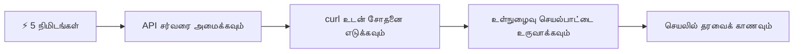
- **1-2 நிமிடங்கள்**: உங்கள் API சர்வரை (`cd api && npm start`) துவங்கி தொடர்பை சோதிக்கவும்
- **3வது நிமிடம்**: fetch பயன்படுத்தி அடிப்படை `getAccount()` செயல்பாட்டை உருவாக்கவும்
- **4வது நிமிடம்**: `action="javascript:login()"` கொண்டு உள்நுழைவு படிவத்துடன் இணைக்கவும்
- **5வது நிமிடம்**: உள்நுழைவு சோதனையை செய்து கணக்கு தரவு consola-இல் தோன்றுவதைப் பார்க்கவும்

**விரைவான சோதனைக் கட்டளைகள்**:
```bash
# API இயங்குகின்றதா என்பதை சரிபார்க்கவும்
curl http://localhost:5000/api

# கணக்கு தரவு பெற்று பார்க்கவும்
curl http://localhost:5000/api/accounts/test
```

**இது ஏன் முக்கியம்**: 5 நிமிடத்தில், நீங்கள் அத்தியாயமான asynchronous தரவு பெறும் மாயாஜாலத்தை காண்பீர்கள், இது இன்றைய வலை பயன்பாடுகளை இயக்குகிறது. இது செயலிகளின் பதிலளிப்பு மற்றும் உயிருடன் இருப்பதற்கான அடித்தளம்.

## 🗺️ தரவு சார்ந்த வலை செயலிகளில் உங்கள் கற்றல் பயணம்

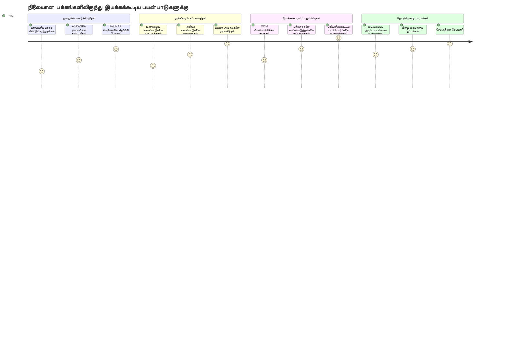
**உங்கள் பயண இலக்கு**: இந்த பாட முடிவில், நீங்கள் எப்படி இன்றைய வலை செயலிகள் தரவைப் பெறுகிறதன், பணியாற்றுகின்றதன் மற்றும் இயங்குதளமை மாற்றுகிறதன் வாழ்க்கையைப் புரிந்துகொள்ளலாம், இது தொழில்முறை செயலிகளிலிருந்து எதிர்பார்க்கப்படும் தெளிவான பயனர் அனுபவத்தை உருவாக்குகிறது.

## முன்னோட்டக் கேள்வித் தேர்வு

[Pre-lecture quiz](https://ff-quizzes.netlify.app/web/quiz/45)

### முன்னெச்சரிக்கை

தரவு பெறுதலில் மூழ்குவதற்கு முன், இந்த கூறுகளை தயார் செய்திருப்பதை உறுதி செய்யவும்:

- **பூர்வ பாடம்**: [உள்நுழைவு மற்றும் பதிவு படிவம்](../2-forms/README.md) முடித்திருங்கள் - இத்துடன் நாம் கட்டமைப்போம்
- **உள்ளூர் சர்வர்**: [Node.js](https://nodejs.org) நிறுவி [API சர்வரை இயக்கவும்](../api/README.md)
- **API இணைப்பு**: இந்த கட்டளையுடன் உங்கள் சர்வர் தொடர்பை சோதிக்கவும்:

```bash
curl http://localhost:5000/api
# எதிர்பார்க்கப்பட்ட பதில்: "பேங்க் API v1.0.0"
```

இந்த விரைவு சோதனை அனைத்து கூறுகளும் சரியாக தொடர்பு கொள்கின்றனவா என்பதைக் உறுதிப்படுத்துகிறது:
- உங்கள் கணினியில் Node.js சரியாக இயங்குகிறது என்பதை சரிபார்க்கிறது
- உங்கள் API சர்வர் செயல்பட்டுக் காத்திருக்கிறது என்பதை உறுதிப்படுத்துகிறது
- உங்கள் செயலி சர்வரை அணுக முடியும் என்பதை சரிபார்க்கிறது (ஒரு நிறுவன மிஷன் முன் ரேடியோ தொடர்பை சோதிப்பதைப் போல்)

## 🧠 தரவு மேலாண்மை சுற்றுச்சூழல் கண்ணோட்டம்

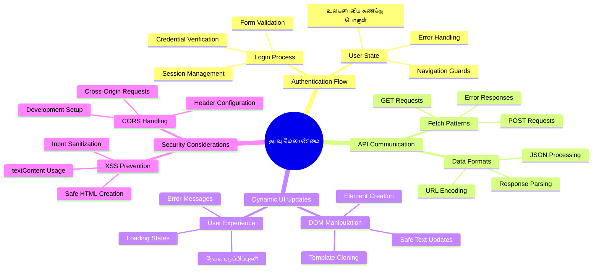
**முதன்மைக் கொள்கை**: இன்றைய வலை செயலிகள் தரவு ஒருங்கிணைப்புக் கட்டமைப்புகள் - பயனர் இடைமுகங்கள், சர்வர் API-கள், உலாவி பாதுகாப்பு மாடல்கள் இடையேயான ஒருங்கிணைப்பை செய்து, ஒரு தொடர்ச்சியான, பதிலளிக்கும் அனுபவங்களை உருவாக்குகின்றன.

---

## இன்றைய வலை செயலிகளில் தரவு பெறுதலை புரிந்துகொள்ளுதல்

கடைசியாக 20 ஆண்டுகளில் வலை செயலிகள் தரவை கையாளும் விதம் மிகவும் மாறியுள்ளது. இந்த வளர்ச்சியைப் புரிந்துகொள்வதால் AJAX மற்றும் Fetch API போன்ற நவீன உத்திகள் எதற்கு பலமாக உள்ளன, ஏன் அவை வலை டெவலப்பர்களுக்கு அவசியமான கருவிகள் ஆகியுள்ளன என்பதையும் புரிந்துகொள்ள உதவும்.

நீங்கள் பாரம்பரிய வலைத்தளங்கள் எப்படி வேலை செய்தன என்பதையும், இன்று நாம் உருவாக்கும் திட விளைவான, பதிலளிக்கும் செயலிகளோடு எவ்வாறு வேறுபடுகிறதோ அதைப் பார்க்கலாம்.

### பாரம்பரியப் பன்முக ஜாலத் செயலிகள் (MPA)

வட்டிக்காலங்களில், ஒவ்வொரு கிளிக் பழைய தொலைக்காட்சியில் சேனல் மாற்றம் போன்றதாக இருந்தது - திரை வெள்ளையாக மாறி, பிறகு மெதுவாக புதிய சாரத்தை பார்க்கத் தொடங்கியது. இது முன்னோடி வலை செயலிகள் நிலவரம், ஒவ்வொரு தொடர்பும் முழு பக்கத்தை மறுதயாரிப்பதைத் தரும்.

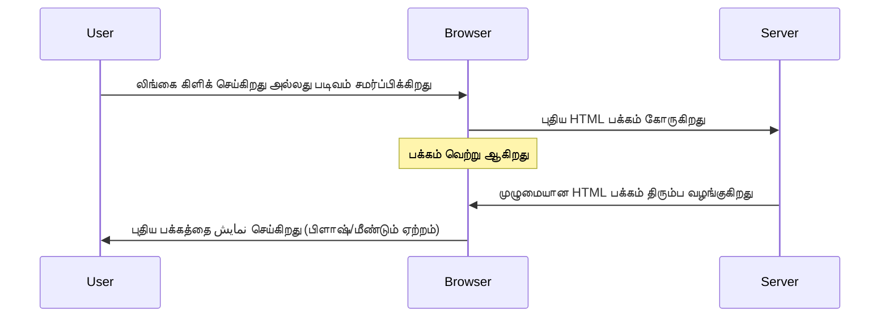
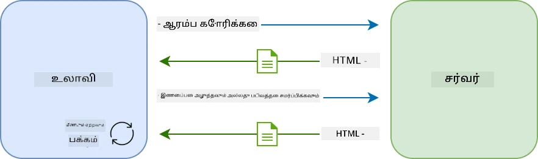

**இந்த முறையால் சிக்கல் ஏன் மறைவது:**
- ஒவ்வொரு கிளிக் நிரந்தரமாக முழு பக்கத்தை மறுதயார்த்து விடும்
- பயனர்கள் கருத்து நடுவில் கோலத்தை இழந்து பக்கங்கள் வெளியேறும்
- உங்கள் இணைய இணைப்பு அதே தலைப்பு மற்றும் அடிபகுதியைப் பத்திரப்படுத்த மீண்டும் மீண்டும் தரவிறக்கம் செய்தது
- செயலிகள் ஒரு கோப்பு அலுவலகத்தில் கிளிக்கெல்லாம் படம் பார் போன்றவையாக இருந்தன

### நவீன ஒரே பக்க செயலிகள் (SPA)

AJAX (Asynchronous JavaScript and XML) இந்த விளக்கத்தை முற்றிலும் மாற்றியது. சர்வதேச விண்வெளி நிலையத்தின் தொகுதிகள் போல, அங்கு விண்விண் வீரர்கள் ஒவ்வொரு கூறையும் முழுக்கு கட்டமைப்பை மாற்றாமல் மாற்றக்கூடுகிறது, AJAX-யும் ஒரே பக்கம் உள்ள குறிப்பிட்ட பகுதிகளை மறுபிரதிபலிக்க அனுமதிக்கிறது. பேர் XML-ஐ குறிப்பிடுகின்றபோது, பல் பயனாளர்களும் இன்று JSON-ஐ அதிகம் பயன்படுத்துகின்றனர், ஆனால் அடிப்படை கொள்கை மாறாது: தேவையானதை மட்டுமே புதுப்பிக்க.

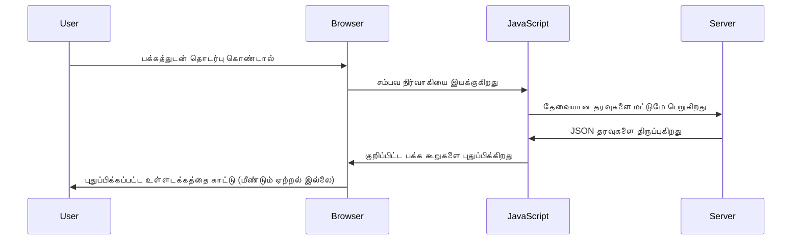
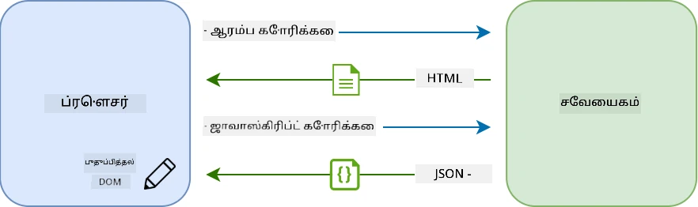

**SPAs இப்படி சிறப்பாக தோன்றுவது ஏன்:**
- மாற்றம் நேர்ந்த குறிப்பிடப்பட்ட பகுதிகள் மட்டுமே புதுப்பிக்கப்படுகின்றன (அருவருப்பற்றது, சரியா?)
- பயனர்கள் இடையூறுகள் இல்லாமல் பணி தொடர்கின்றனர்
- குறைந்த தரவு பரிமாற்றம் அதிவேக ஸ்த்ரோதி கொண்டு வருகிறது
- அனைத்தும் பதிலளிக்கும் மற்றும் ஏற்பட்ட பெரிய செயலிகள் போல் தோன்றுகின்றன

### நவீன Fetch API வரலாறு

நவீன உலாவிகள் [`Fetch` API](https://developer.mozilla.org/docs/Web/API/Fetch_API) வழங்குகின்றன, அது பழைய [`XMLHttpRequest`](https://developer.mozilla.org/docs/Web/API/XMLHttpRequest/Using_XMLHttpRequest) ஐ மாற்றுகிறது. தொலைபேசி கண்கார்ட்திலிருந்து மின்னஞ்சலுக்கு மாற்றம் போன்று, Fetch API வாக்குறுதிகளை பயன்படுத்தி சுத்தமான asynchronous குறியீட்டை வழங்குகிறது மற்றும் JSON-ஐ இயல்பாக கையாள்கிறது.

| அம்சம் | XMLHttpRequest | Fetch API |
|---------|----------------|----------|
| **சyntax** | சிக்கலான கால்-பேக் அடிப்படையுள்ள | சுத்தமான வாக்குறுதி அடிப்படையுள்ள |
| **JSON கையாளும்** | கையால் பிழைத்தல் தேவையுண்டு | உள்ளமைவு `.json()` முறை உள்ளது |
| **பிழை கையாளல்** | வரையறுக்கப்பட்ட பிழை விபரங்கள் | விரிவான பிழை விவரங்கள் |
| **நவீன ஆதரவு** | பழமைவாய்ந்த ஆதரவு | ES6+ வாக்குறுதிகள் மற்றும் async/await |

> 💡 **உலாவி இணக்கமுறை**: சிறந்த செய்தி - Fetch API அனைத்து நவீன உலாவிகளிலும் வேலை செய்கிறது! குறிப்பிட்ட பதிப்புகளைப் பற்றி ஆர்வமானால், [caniuse.com](https://caniuse.com/fetch) -இல் முழுமையான இணக்கப்படியான கதை உள்ளது.
> 
**படிவுரை:**
- Chrome, Firefox, Safari மற்றும் Edge-இல் சிறந்த வேலை செய்கிறது (பயனர்கள் இருப்பிடங்களில்)
- Internet Explorer மட்டும் கூடுதல் உதவி தேவை (உண்மையில், IE வை விட்டுவிடுவதற்குத் தயாராகுங்கள்)
- பின்னர் பயன்படுத்தும் அழகான async/await வடிவமைப்புகளுக்கு மையமாக உள்ளது

### பயனர் உள்நுழைவு மற்றும் தரவு பெறுதல் செயலாக்கம்

இப்போது உங்களின் வங்கி செயலியை நிலைத்த தோற்றத்திலிருந்து ஒருங்கிணைந்த செயலியாக மாற்றும் உள்நுழைவு முறைமை வடிவமைக்கலாம். பாதுகாப்பான இராணுவத்துறை போன்ற அங்கீகார நெறிமுறைகள் போல, பயனர் அங்கீகாரம் செய்து, அந்த பயனரின் தனி தொகுப்பு தரவை தருவோம்.

நாம் அடிப்படையான அங்கீகாரத்திலிருந்து தொடங்கி, பின்னர் தரவுப் பெறும் செயல்பாடுகளை சேர்ப்போம்.

#### படி 1: உள்நுழைவு செயல்பாடின் அடித்தளம் உருவாக்குதல்

`app.js` கோப்பை திறந்து புதிய `login` செயல்பாட்டைச் சேர்க்கவும். இது பயனர் அங்கீகாரத்தை கையாளும்:

```javascript
async function login() {
  const loginForm = document.getElementById('loginForm');
  const user = loginForm.user.value;
}
```

**இதனைப் பிரிப்போம்:**
- அந்த `async` சொல்லல்? ஜாவாச்கிரிப்ட் சொல்லுகிறது "இந்த செயல்பாடு காத்திருக்க வேண்டியிருக்கலாம்"
- நாங்கள் பக்கத்தில் இருந்து படிவத்தை (ID-ஆல்) எடுத்து கொண்டிருக்கிறோம்
- பின்னர் பயனர் எழுதிய பயனர் பெயரைப் பெறுகிறோம்
- இது ஒரு சிறந்த முறை: 'name' பண்புக்கு உரிய எந்த படிவ உள்ளீட்டையும் பெறலாம் - getElementById தொடர் அழைப்புகள் தேவை இல்லை!

> 💡 **படிவ அணுகல் முறை**: ஒவ்வொரு படிவக் கட்டுப்பாட்டையும் அதன் `name` பண்பின் மூலம் (HTML-ல் `name` பண்பாக அமைக்கப்பட்ட) படிவத் துணை பொருளாக அணுகலாம். இது படிவ தரவை எல்லாம் எளிதாக வாசிக்க உதவுகிறது.

#### படி 2: கணக்கு தரவு பெறும் செயல்பாடு உருவாக்குதல்

பின், சர்வரிலிருந்து கணக்கு தரவுகளை பெறுவதற்கு தனிப்பட்ட செயல்பாட்டை உருவாக்குவோம். இது உங்கள் பதிவு செயல்படும் வடிவமைப்பை பின்பற்றுமாறு இயங்கும்:

```javascript
async function getAccount(user) {
  try {
    const response = await fetch('//localhost:5000/api/accounts/' + encodeURIComponent(user));
    return await response.json();
  } catch (error) {
    return { error: error.message || 'Unknown error' };
  }
}
```

**இந்த குறியீடு செய்யும் விஷயங்கள்:**
- **நவீன fetch API** பயன்படுத்தி தரவு அசிங்க்ரனாக்கிறது
- பயனர் பெயர் களத்துடன் GET கோரிக்கை URL உருவாக்குகிறது
- URL-ல் சிறப்பு எழுத்துக்களை பாதுகாப்பாக கையாள `encodeURIComponent()` ஐ செயல்படுத்துகிறது
- பதிலை JSON வடிவத்துக்கு மாற்றுகிறது
- பிழைகள் ஏற்படும் பட்சத்தில் பிழை பொருளை திருப்பி அனுப்புகிறது

> ⚠️ **பாதுகாப்பு குறிப்பு**: `encodeURIComponent()` URL-ல் சிறப்பு எழுத்துக்களை சரியாக குறியாக்குகிறது. கடல்சார்பு தொடர்பு முறைகள் போல, இது செய்தி முறையாக தேவையானவாறு வந்துவிட உதவுகிறது, "#" மற்றும் "&" போன்ற எழுத்துக்கள் தவறாக புரியாமல் இருக்கிறது.
> 
**ஏன் இது முக்கியம்:**
- சிறப்பு எழுத்துக்களை URL உடன் பிரச்சனையில்லாமல் கையாள்கிறது
- URL மாற்றல் தாக்குதல்களைத் தடுக்கும்
- சரியான தரவை சர்வருக்கு அனுப்புகிறது
- பாதுகாப்பான குறியீட்டான முறையை பின்பற்றுகிறது

#### HTTP GET கோரிக்கைகளைப் புரிந்துகொள்ளுதல்

`fetch` பயன்படுத்தும் பொழுது கூடுதலாக விருப்பங்கள் குறிப்பிடவில்லை என்றால், அது தானாகவே [`GET`](https://developer.mozilla.org/docs/Web/HTTP/Methods/GET) கோரிக்கையை உருவாக்கும். இது நமக்கு சரியானது - சர்வரை "இந்த பயனரின் கணக்கு தரவை பார்க்கலாமா?" என்று கேட்க.

GET கோரிக்கைகள் நன்றாக கேள்வி எழுப்புவது போல என்பதை நிமிர்ந்தார் என்று நினைக்கவும் - உள்ளிருந்த ஒன்றை கண்காணிக்க கேட்பது. POST கோரிக்கைகள் (பதிவு செய்ய பயன்படுத்தப்பட்டது) புதியப் புத்தகத்தை நூலகத்தில் சேர்த்துக் கொள்வது போன்றது.

| GET கோரிக்கை | POST கோரிக்கை |
|-------------|---------------|
| **நோக்கம்** | உள்ள தரவை பெறுதல் | புதிய தரவை சர்வருக்கு அனுப்புதல் |
| **பராமரிப்புகள்** | URL வழியாக / கேள்வி சரம் | கோரிக்கை உட்கண்டியில் |
| **கேஷிங்** | உலாவிகள் கேஷ் செய்யலாம் | பொதுவாக கேஷ் ஆகாது |
| **பாதுகாப்பு** | URL/லாக்களில் தெரியும் | கோரிக்கை உட்கண்களில் மறைவு |

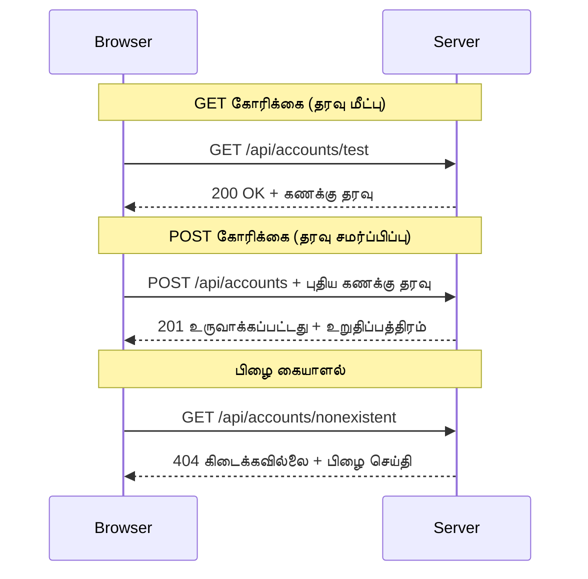
#### படி 3: அனைத்தையும் இணைத்தல்

இப்போது இதை விரும்புகிறீர்கள் - கணக்கு தரவு பெறும் செயல்பாட்டைப் உள்நுழைவுடன் இணைக்கலாம்:

```javascript
async function login() {
  const loginForm = document.getElementById('loginForm');
  const user = loginForm.user.value;
  const data = await getAccount(user);

  if (data.error) {
    return console.log('loginError', data.error);
  }

  account = data;
  navigate('/dashboard');
}
```

இந்த செயல்பாடு தெளிவான வரிசையை பின்பற்றுகிறது:
- படிவத்திலிருந்து பயனர் பெயரை எடுத்துக்கொள்கிறது
- சர்வரிலிருந்து பயனரின் கணக்கு தரவை கோருகிறது
- பிழைகளை கையாள்கிறது
- கணக்கு தரவை சேமித்து, வெற்றி பெற்றால் டாஷ்போர்டுக்கு செல்கிறது

> 🎯 **Async/Await முறை**: `getAccount` என்பது asynchronous செயல்பாடு ஆகும், அதனால் நாம் `await` சொல்லலைப் பயன்படுத்தி சர்வர் பதிலை வரும்போதுவரை காத்திருக்கிறோம். இதனால் குறியீடு வரையறையற்ற தரவுடன் தொடர்ந்து இயங்காமல் தடுக்கும்.

#### படி 4: உங்கள் தரவுக்கு இடம் உருவாக்குதல்

தரவு தரப்ப once it’s loaded, your app needs a place to keep it handy. இதை நினைவு என கருதலாம் - தற்போதைய பயனர் தொடர்பான தகவலை எப்போதும் அணுகக்கூடிய இடமாக. இதனை உங்கள் `app.js` கோப்பின் மேல் பகுதியில் சேர்க்கவும்:

```javascript
// இது தற்போதைய பயனரின் கணக்கு தரவுகளை வைத்திருக்கிறது
let account = null;
```

**இதன் காரணம்:**
- உங்கள் செயலியில் எங்கு வேண்டுமானாலும் கணக்கு தரவை அணுக உள்கட்டமைப்பாக உள்ளது
- `null` ஆகும் போது "யாரும் இன்னும் உள்நுழையவில்லை" என்று அடையாளம்
- யாரோ வெற்றிகரமாக உள்நுழைந்ததும் அல்லது பதிவு செய்ததும் புதுப்பிக்கப்படுகிறது
- ஒரே உண்மையின் ஆதாரம் போல செயல்படுகிறது - யார் உள்நுழைந்தது என்பதை பற்றிய குழப்பம் இல்லாமல்

#### படி 5: படிவத்தை இணைக்க

இப்போது உங்கள் புதிய உள்நுழைவு செயல்பாட்டை HTML படிவத்துடன் இணைக்கலாம். உங்கள் படிவ கட்டம் இப்படிச் செய்யவும்:

```html
<form id="loginForm" action="javascript:login()">
  <!-- Your existing form inputs -->
</form>
```

**இந்த மாற்றத்தின் விளைவுகள்:**
- படிவத்தின் இயல்பான முழுப் பக்க மறுதயாரிப்பு செயல்பாட்டை நிறுத்துகிறது
- உங்கள் தனிப்பயன் ஜாவாஸ்கிரிப்ட் செயல்பாட்டை அழைக்கிறது
- எல்லா செயல்களும் மென்மையாகவும் ஒரே பக்கம் செயலிகளாகவும் இருக்கும்
- பயனர்கள் 'உள்நுழைவு' அழுத்தும் போது அனைத்தையும் நீங்கள் முழுமையாக கட்டுப்படுத்தலாம்

#### படி 6: பதிவு செயல்பாட்டை மேம்படுத்தல்

ஒருமுகமான அனுபவத்திற்காக, உங்கள் `register` செயல்பாட்டையும் கணக்கு தரவை சேமித்து டாஷ்போர்டுக்கு செல்லுமாறு மேம்படுத்தவும்:

```javascript
// உங்கள் பதிவு செயல்பாட்டின் இறுதியில் இந்த வரிசைகளை சேர்க்கவும்
account = result;
navigate('/dashboard');
```

**இந்த மேம்பாடு அளிக்கும்:**
- பதிவிலிருந்து டாஷ்போர்டுக்கு மென்மையான பயணம்
- உள்நுழைவு மற்றும் பதிவு ஓட்டங்களில் ஒரே மனப்பான்மை
- வெற்றிகரமான பதிவு பிறகு உடனடி கணக்கு தரவு அணுகல்

#### உங்கள் செயல்பாட்டை சோதிக்கவும்

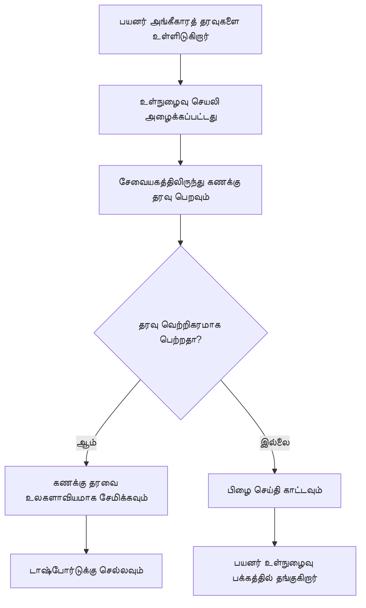
**சோதனை நேரம்:**
1. புதிய கணக்கை உருவாக்கி அனைத்தும் சரியாக இயங்குவதை உறுதி செய்க
2. அதே அங்கீகாரப் பொருத்தங்களுடன் உள்நுழைந்து பார்க்கவும்
3. உலாவி கண்டுபிடிப்பில் (F12) பிரச்சனைகள் இருந்தால் பாருங்கள்
4. வெற்றிகரமான உள்நுழைவுக்குப் பிறகு டாஷ்போர்டில் செல்லும் என்பதை உறுதி செய்யவும்

எதுவும் வேலை செய்யவில்லையெனில் பதற்று வேண்டாம்! பெரும்பாலான பிரச்சனைகள் தட்டச்சு பிழைகள் அல்லது API சர்வரை துவக்க மறந்திருப்பதைத்தான் சேர்ந்தவை.

#### குறுக்கு-தலைமை மந்திரம் பற்றி சின்ன விளக்கம்

"என் வலை செயலி வேறு போர்ட்களில் ஓடும் API சர்வருடன் எப்படி பேசுகிறது?" என்று உங்களுக்கு சந்தேகம் இருக்கலாம். சிறந்த கேள்வி! இது எல்லா வலை டெவலப்பர்களும் ஒருநாள் சந்திக்கும் விஷயம்.

> 🔒 **குறுக்கு-தலைமை பாதுகாப்பு**: உலாவிகள் "ஒரே-தலைமை கொள்கையை" கடைபிடிக்கின்றன, வேறு டொமைன்களிடையே அனுமதியின்றி தொடர்புகளைக் தடுக்கும். பேண்டகானில் உள்ள பரிசோதனை நிலையப் போல, தொடர்பு சரிபார்க்கப்படுகிறது, பிறகு மட்டும் தரவு பரிமாற்றம் செய்ய அனுமதிக்கிறது.
> 
**நம் அமைப்பில்:**
- உங்கள் வலை செயலி `localhost:3000` (வளர்ச்சி சர்வர்) ஓடும்
- API சர்வர் `localhost:5000` (பின்புற சர்வர்) ஓடும்
- API சர்வர் [CORS தலைப்புகளை](https://developer.mozilla.org/docs/Web/HTTP/CORS) கொண்டுள்ளது, இது உங்கள் வலை செயலியிலிருந்து தொடர்புக்கு அனுமதி தருகிறது

இந்த அமைப்பு உண்மையான உலகின் முன்னணி மற்றும் பின்புற செயலிகள் வேறுபட்ட சர்வர்களில் இயங்கும் முறையைப் பிரதிபலிக்கிறது.

> 📚 **மேலும் கற்றுக்கொள்ள**: இத்துடன் முழுமையான [Microsoft Learn API க்கள் கையாளுதல் பாடத்திட்டம்](https://docs.microsoft.com/learn/modules/use-apis-discover-museum-art/?WT.mc_id=academic-77807-sagibbon) மூலம் APIs மற்றும் தரவு பெறுதலை ஆழமாக கற்றுக்கொள்ளலாம்.

## HTML-இல் உங்கள் தரவை உயிர் கொடுப்பது

இப்போது நாம் பெறப்பட்ட தரவை பயனர்களுக்கு DOM மாற்றத்துடன் காட்சிப் படுத்துவோம். இருண்ட அறைக்குள் புகைப்படத்தை உருவாக்கும் செயல்முறையைப் போன்றதே, மறைக்கப்பட்ட தரவை எடுத்துக் கொண்டு பயனர்களுக்கே தெரியும் மற்றும் தொடர்புகொள்ளும் ஒன்றாக மாற்றுகிறோம்.
DOM மாற்றம் என்பது பயனர் தொடர்புகள் மற்றும் சேவையகம் תגובות அடிப்படையில் உள்ளடக்கத்தை புதுப்பிக்கும் துன்மையற்ற வலைப் பக்கங்களை இயக்கக்கூடிய செயலிகளாக மாற்றும் தொழில் முறையே.

### வேலையைச் செய்ய சரியான கருவியை தேர்ந்தெடுத்து கொள்ளுதல்

HTML ஐ JavaScript மூலம் புதுப்பிக்கும்போது, பல விருப்பங்கள் உண்டு. இவை போன்ற கருவிப்பெட்டியில் உள்ள பல கருவிகள் போல் - ஒவ்வொன்றும் குறிப்பிட்ட வேலைகளுக்கு சிறந்தது:

| முறை | இது சிறந்தது எதற்காக | எப்போது பயன்படுத்துவது | பாதுகாப்பு நிலை |
|--------|---------------------|----------------|--------------|
| `textContent` | பயனர் தரவுகளை பாதுகாப்பாக காட்ட க்கு | நீங்கள் எப்போது எழுத்துக்களை காட்சிப்படுத்துகிறீர்கள் | ✅ மிக நirondஆமியம் |
| `createElement()` + `append()` | சிக்கலான வடிவமைப்புகளை உருவாக்குதல் | புதிதாக பகுதிகள்/பட்டியல்கள் உருவாக்குகையில் | ✅ வெறும் பாதுகாப்பு |
| `innerHTML` | HTML உள்ளடக்கத்தை அமைத்தல் | ⚠️ இதைத் தவிர்க்க முயலுங்கள் | ❌ ஆபத்தானது |

#### எழுத்துக்களை பாதுகாப்பாக காட்டும் வழி: textContent

[`textContent`](https://developer.mozilla.org/docs/Web/API/Node/textContent) சொத்தில் உங்கள் சிறந்த தோழன் பயனர் தரவுகளை காட்சிப்படுத்தும் போது. இது உங்கள் வலைப்பக்கத்திற்கு ஒரு பாதுகாவலர் போல உள்ளது - இழிவானது எதுவும் கடக்காது:

```javascript
// உரையை புதுப்பிப்பதற்கான பாதுகாப்பான, நம்பகமான வழி
const balanceElement = document.getElementById('balance');
balanceElement.textContent = account.balance;
```
  
**textContent இன் நன்மைகள்:**  
- எல்லாவற்றையும் சரள எழுத்துகளாக கருகுகிறது (ஸ்கிரிப்ட் செயல்பாட்டை தடுக்கும்)  
- தற்காலிகமாக நிலவிய உள்ளடக்கத்தை அழிக்கும்  
- எளிய எழுத்து புதுப்பிப்புகளுக்கு திறம்பட உள்ளது  
- தீய உள்ளடக்கத்திலிருந்து பாதுகாப்பை வழங்குகிறது  

#### இயக்கக்கூடிய HTML கூறுகளை உருவாக்குதல்

மேலும் சிக்கலான உள்ளடக்கத்திற்காக, [`document.createElement()`](https://developer.mozilla.org/docs/Web/API/Document/createElement) மற்றும் [`append()`](https://developer.mozilla.org/docs/Web/API/ParentNode/append) முறைகளை இணைக்கவும்:

```javascript
// புதிய உருப்படிகளை உருவாக்கும் பாதுகாப்பான வழி
const transactionItem = document.createElement('div');
transactionItem.className = 'transaction-item';
transactionItem.textContent = `${transaction.date}: ${transaction.description}`;
container.append(transactionItem);
```
  
**இந்த அணுகுமுறையை புரிந்துகொள்ளுங்கள்:**  
- புதிய DOM கூறுகளை நிரலாக்க உதவுகிறது  
- கூறின் பண்புகள் மற்றும் உள்ளடக்கம் மீது முழு கட்டுப்பாட்டை வைக்கிறது  
- சிக்கலான மற்றும் அட்டவணை கூறு கட்டமைப்புகளை அனுமதிக்கிறது  
- அமைப்பு மற்றும் உள்ளடக்கத்தை பிரித்து பாதுகாப்பை பாதுகாக்கிறது  

> ⚠️ **பாதுகாப்பு கவனம்**: பல பாடங்களில் [`innerHTML`](https://developer.mozilla.org/docs/Web/API/Element/innerHTML) பயன்படுத்தப்படுகிறது, ஆனால் இது உள்ளடக்கமான ஸ்கிரிப்ட்களை இயக்கலாம். CERN இன் பாதுகாப்பு செயல்முறைகள் அவ்வாறு அனுமதிக்காமல் தடுக்கும். அதேபோல் `textContent` மற்றும் `createElement` செய்வது பாதுகாப்பான மாற்றுகள் உள்ளன.  
>  
**innerHTML இன் ஆபத்துகள்:**  
- பயனர் தரவில் உள்ள `<script>` குறியீடுகளை இயக்குகிறது  
- குறியீடு ஊடுருவலுக்கு அதிகப்படியான ஆபத்து இருக்கிறது  
- பாதுகாப்பு ரீதியாக பல பிரச்சனைகள் உருவாக்குகிறது  
- நாம் பயன்படுத்தும் பாதுகாப்பான மாற்றுகள் சமமான செயல்பாட்டை தருகின்றன  

### பிழை செய்திகள் பயனர்களுக்கு இறுதிக்காணவேண்டும்

தற்போது, உள்நுழைவு பிழைகள் உலாவி கான்சோலில் மட்டுமே தோன்றுகின்றன, இது பயனர்களுக்கு காணப்படாமல் இருக்கும். பைலட்டின் உள் கண்காணிப்பும் பயணிகளுக்கான தகவல் முறைமை வித்தியாசம் போல, அவசியமான தகவலை சரியான வாயிலாக பகிர வேண்டும்.

எதிர்பாராத பிழை செய்திகள் பயனர்களுக்கு உடனடி பதில் அளிக்க உதவுகின்றன அனைத்தையும் உள்ளது.

#### படி 1: பிழை செய்திகள் இடம் சேர்த்தல்

முதலில், உங்கள் HTML இல் பிழை செய்திகளுக்காக இடம் கொடுக்கவும். உள்நுழைவு பொத்தானுக்கு முன் இதை சேர்ப்பது, பயனர்கள் இயல்பாக அதை காண்பார்கள்:

```html
<!-- This is where error messages will appear -->
<div id="loginError" role="alert"></div>
<button>Login</button>
```
  
**இங்கே நடப்பது:**  
- தேவையானபோது மட்டும்தான் தோன்றும் ஒரு காலி குழாயை உருவாக்குகிறது  
- "உள்நுழைவு" அழுத்தியபின் பயனர்கள் சாதாரணமாக பார்வையிடும் இடத்தில் அமைக்கப்பட்டுள்ளது  
- `role="alert"` என்பது ஸ்கிரீன் ரீடர்கள் போன்ற உதவி தொழில்நுட்பத்துக்கான முக்கிய அறிவிப்பு அங்கீகாரம்  
- தனித்துவமான `id` உங்கள் JavaScript இற்கு வசதியான குறிக்கோள்  

#### படி 2: உதவி செய்ய ஒரு சிறிய செயல்படுமுறையை உருவாக்குதல்

ஏதேனும் கூறின் எழுத்துக்களை புதுப்பிக்கும் ஒரு பொது உதவி செயல்பாட்டை உருவாக்குவோம். இது ஒரு முறையே "ஒரு தடவை எழுது, எல்லா இடங்களிலும் பயன்படுத்து" வகையானது:

```javascript
function updateElement(id, text) {
  const element = document.getElementById(id);
  element.textContent = text;
}
```
  
**இந்த செயல்பாட்டின் நன்மைகள்:**  
- கூறின் ID மற்றும் எழுத்தை மட்டும் நுகர்கிறது  
- DOM கூறுகளை பாதுகாப்பாக கண்டுபிடித்து புதுப்பிக்கிறது  
- குறியீட்டு நகலை குறைப்பதால் மீண்டும் பயன்படுத்தக்கூடிய மாதிரியாகும்  
- செயலியில் ஒரே மாதிரி புதுப்பிப்பை நிலைநிறுத்துகிறது  

#### படி 3: பிழைகளை பயனர்கள் காணும் இடத்தில் காட்டுதல்

இப்போது மறைந்துள்ள கான்சோல் செய்தியை பயனர்கள் பார்க்கும் இடத்தில் மாற்றுவோம். உள்நுழைவு செயல்பாட்டை புதுப்பிக்கவும்:

```javascript
// தொகுப்பியில் பதிவு செய்வதற்குப் பதிலாக, பயனருக்கு என்ன தவறு என்று காட்டவும்
if (data.error) {
  return updateElement('loginError', data.error);
}
```
  
**இந்த சிறிய மாற்றம் பெரும் வித்தியாசம்:**  
- பிழை செய்திகள் பயனர்கள் பார்க்கும் இடத்தில் தோற்றுவிக்கின்றன  
- பயனர் அன்ருச்சுரியான அமைதியான தோல்விகள் இல்லை  
- உடனடி, செயலில் இடமாற்ற முடியும் தகவலை பயனர்கள் பெறுகின்றனர்  
- உங்கள் பயன்பாடு தொழில்துறை மற்றும் பரிசீலனைச்சீலமாக கருதப்படும்  

இப்போது தவறான கணக்குடன் சோதனையிடும்போது, பக்கத்தில் உதவியான பிழை செய்தி தோன்றும்!


#### படி 4: அணுகல் வசதிக்கு உள்ளுருவாக்குதல்

`role="alert"` என்ற நுண்ணறிவு மட்டுமல்ல, இது ஒரு [Live Region](https://developer.mozilla.org/docs/Web/Accessibility/ARIA/ARIA_Live_Regions) உருவாக்குகிறது. இது உடனடி மாற்றங்களை ஸ்கிரீன் ரீடர்களுக்கு அறிவிக்கிறது:

```html
<div id="loginError" role="alert"></div>
```
  
**இது முக்கியமானதற்கு காரணம்:**  
- ஸ்கிரீன் ரீடர் பயனர்கள் பிழை செய்தியை உடனடியாக கேட்கிறார்கள்  
- அனைத்து பயனர்களும் ஒரே முக்கிய தகவலை பெறுகிறார்கள்  
- உங்கள் பயன்பாடை மிக அதிகமானவருக்கு இயன்ற வகையில் செய்வது  
- இடம் பெற்றவராக கருதப்பட தனியாரின் சிறு முயற்சிகள்  

இத்தகைய சிறு முயற்சிகள் நல்ல டெவலப்பர்களை சிறந்தவர்களாகவும் திகழ வைக்கின்றன!

### 🎯 கற்றல் சோதனை: அங்கீகார வடிவங்கள்

**நிறுத்தி சிந்தியுங்கள்**: நீங்கள் இப்பொழுது முழுமையான அங்கீகார செயல்முறையை நடைமுறையில் கொண்டுவந்துள்ளீர்கள். இது வலை வளர்ச்சியில் அடிப்படையான வடிவமைப்பு.

**துரிதமான சுய மதிப்பீடு**:  
- API அழைப்புகளுக்கு async/awaitஐ ஏன் பயன்படுத்துகிறோம் என்று விளக்க முடியுமா?  
- `encodeURIComponent()` செயல்பாட்டை மறந்தால் என்ன நடக்கும்?  
- எவ்வாறு எங்கள் பிழை கையாள்தல் பயனர் அனுபவத்தை மேம்படுத்துகிறது?  

**உண்மை உலக இணைப்பு**: இந்தப் பாடங்களில் கற்றுள்ள (async தரவு மீட்டல், பிழை கையாள்தல், பயனர் பதிலளிப்பு) நயம்சிக்களும் சமூக ஊடகங்கள் மற்றும் வணிக தளங்களின் பெரும் பயன்பாடுகளுக்கும் பொதுவானவை. நீங்கள் தயாரிப்பு நிலை திறன்களை வளர்க்கிறீர்கள்!

**சவால் கேள்வி**: பல பயனர் வகைகள் (வாடிக்கையாளர், நிர்வாகி, டெல்லர்) கையாள இந்த அங்கீகார அமைப்பை எப்படி மாற்றுவீர்கள்? தரவு அமைப்பு மற்றும் UI மாற்றங்கள் எப்படி இருக்க முடியும் என்று யோசிக்கவும்.

#### படி 5: பதிவு படிவத்திலும் அதே மாதிரி நடைமுறைப்படுத்துதல்

ஒத்தmarchா நடைமுறையை பதிவு படிவத்திலும் செயல்படுத்தவும்:

1. பதிவு HTML இல் பிழை காட்சிப்படுத்தும் கூறை சேர்க்கவும்:  
```html
<div id="registerError" role="alert"></div>
```
  
2. பதிவு செயல்பாட்டை அதே பிழை காட்சிப்பாடு மாதிரியில் புதுப்பிக்கவும்:  
```javascript
if (data.error) {
  return updateElement('registerError', data.error);
}
```
  
**ஒத்தmarchா பிழை கையாள்தலின் நன்மைகள்:**  
- அனைத்து படிவங்களிலும் ஒரே மாதிரி பயனர் அனுபவம் வழங்குகிறது  
- பழகியுள்ள மாதிரிகளை பயன்படுத்துவதால் சிந்தனையதிசை குறைகிறது  
- மறுபயன்பாட்டுச் குறியீட்டுடன் பராமரிப்பு எளிதாக்கப்படுகிறது  
- செயலியில் அணுகல் வசதி தரநிலைகள் பின்பற்றப்படுகின்றன  

## உங்களின் இயக்கக்கூடிய டாஷ்போர்டை உருவாக்குதல்

இப்போது உங்கள் நிலையான டாஷ்போர்டை உண்மையான கணக்கு தரவை காட்டும் இயக்கக்கூடிய இடைமுகமாக மாற்றுவோம். வானூர்தி அங்காடி அட்டவணை மற்றும் அலைபேசி நிலையங்களில் நேரடி புறப்படும் அடையாள அட்டவணைகளுக்கு இடையேயான வித்தியாசம் போல, நாம் நிலையான தகவலிலிருந்து நேரடி, பதிலளிக்கும் காட்சிகளுக்கு நகர்கின்றோம்.

கற்ற DOM மாற்ற தொழில்நுட்பங்களை பயன்படுத்தி, தற்போதைய கணக்கு தகவலுடன் தானாக புதுப்பிக்கும் டாஷ்போர்டை உருவாக்குவோம்.

### உங்கள் தரவை அறிந்து கொள்வது

நாம் கட்டுமானம் தொடங்கும் முன், சேவையகம் அனுப்பும் தரவின் வகையை பார்ப்போம். ஒருவர் வெற்றிகரமாக உள்நுழைந்தால், பின்வரும் தகவல்கள் உங்களுக்கு வழங்கப்படும்:

```json
{
  "user": "test",
  "currency": "$",
  "description": "Test account",
  "balance": 75,
  "transactions": [
    { "id": "1", "date": "2020-10-01", "object": "Pocket money", "amount": 50 },
    { "id": "2", "date": "2020-10-03", "object": "Book", "amount": -10 },
    { "id": "3", "date": "2020-10-04", "object": "Sandwich", "amount": -5 }
  ]
}
```
  
**இந்த தரவு அமைப்பால் வழங்கப்படும்:**  
- **`user`**: தனிப்பயன் அனுபவத்துக்கு ("மீண்டும் வருக, சரா!")  
- **`currency`**: நாணய தொகையை சரியாக காட்சிப்படுத்த உறுதி செய்கிறது  
- **`description`**: கணக்கின் நட்பு பெயர்  
- **`balance`**: மிகவும் முக்கியமான தற்போதைய இருப்பு  
- **`transactions`**: முழுமையான பரிவர்த்தனை வரலாறு  

வணிகத் தரம் கொண்ட வங்கி டாஷ்போர்டை உருவாக்க தேவையான அனைத்தும்!

```mermaid
flowchart TD
    A[பயனர் உள்நுழைவு] --> B[கணக்கு தரவை பெறுக]
    B --> C{தரவு சரி தானா?}
    C -->|ஆம்| D[உலகளாவிய மாறியில் சேமிக்கவும்]
    C -->|இல்லை| E[பிழை செய்தியை காட்டு]
    D --> F[டாஷ்போர்டுக்கு செல்லவும்]
    F --> G[UI கூறுகளை புதுப்பிக்கவும்]
    G --> H[மீதமுள்ள தொகையை காட்டு]
    G --> I[விவரத்தை காட்டவும்]
    G --> J[பொருளாதார பரிமாற்றங்களை வரை**
    J --> K[அட்டவணை வரிசைகளை உருவாக்கு]
    K --> L[வென ஊழியத்தின் வடிவமைப்பு]
    L --> M[பயனர் நேரடி தரவை காண்கிறார்]
```  
> 💡 **திறமை குறிப்பு**: உங்கள் டாஷ்போர்டை உடனடி செயல்பாட்டில் பார்க்க விரும்பினால்? உள்நுழையும்போது `test` என்ற பயனர் பெயரை பயன்படுத்தவும் - இது முன்பே தரவுடன் ஏற்றப்பட்டிருக்கும், நீங்கள் பரிவர்த்தனைகளை முதலில் உருவாக்க வேண்டியதில்லை.  
>  
**Test கணக்கின் நன்மைகள்:**  
- நிஜமான மாதிரி தரவுடன் ஏற்கனவே உள்ளது  
- பரிவர்த்தனைகள் எவ்வாறு காட்சிப்படுத்தப்படும் என்பது தெளிவாகும்  
- உங்கள் டாஷ்போர்டின் அம்சங்களை சோதனை செய்ய மிகவும் சிறந்தது  
- கையால் உள்ளூடல் தரவு உருவாக்க தவிர்க்க உதவும்  

### டாஷ்போர்டு காட்சி கூறுகளை உருவாக்குதல்  

முதல் கட்டமாக கணக்கு சுருக்க தகவலை உபயோகித்து, பின்னர் பரிவர்த்தனை பட்டியல்கள் போன்ற சிக்கலான அம்சங்களுக்கு நகர்வோம்.

#### படி 1: HTML கட்டமைப்பை புதுப்பித்தல்  

முதலில், நிலையான "இருப்பு" பகுதியை உங்கள் JavaScript நிரப்பக்கூடிய இயக்கக்கூடிய இடமாற்றுப் கூறுகளால் மாற்றவும்:

```html
<section>
  Balance: <span id="balance"></span><span id="currency"></span>
</section>
```
  
பின்னர், கணக்கு விளக்கப்பிரிவுக்கும் ஒரு பகுதியை சேர்க்கவும். இது டாஷ்போர்டு உள்ளடக்கத்திற்கு தலைப்பாகும் என்பதால், அர்த்தமுள்ள HTML ஐ பயன்படுத்துங்கள்:

```html
<h2 id="description"></h2>
```
  
**HTML கட்டமைப்பை புரிந்து கொள்வது:**  
- இருப்பு மற்றும் நாணயத்திற்கான தனித்த <span> கூறுகளைப் பயன்படுத்துகிறது, தனித்தானாக கட்டுப்பாட்டுக்கு  
- பிரதான JavaScript இலக்கு சொற்குறி உள்ள தனித்துவ id களைப் பயன்படுத்துகிறது  
- கணக்கு விளக்கத்திற்கு `<h2>` என்பதைக் பயன்படுத்தி அர்த்தமுள்ள HTML கையாள்கிறது  
- ஸ்கிரீன் ரீடர் மற்றும் SEO க்கான தர்க்கபூர்வ அலகு கட்டமைப்பை உருவாக்குகிறது  

> ✅ **அணுகல் விசாரணை**: கணக்கு விளக்கம் டாஷ்போர்டு உள்ளடக்கத்திற்கான தலைப்பாக செயல்படுகிறது, ஆகவே தலைப்பாக அர்த்தப்பூர்வமாக குறிக்கப்பட்டுள்ளது. [தலைப்பியல் அமைப்பு](https://www.nomensa.com/blog/2017/how-structure-headings-web-accessibility) அணுகலை எப்படி பாதிக்கிறது என்பதை அறியவும். உங்கள் பக்கத்தில் தலைப்புச் சுட்டிகள் பயன்படுத்துவதால் ஆதரவை பெறும் மற்ற கூறுகளை கண்டுபிடிக்க முடியுமா?  

#### படி 2: டாஷ்போர்டு புதுப்பிக்கும் செயல்பாட்டை உருவாக்குதல்

இப்போது ஒரு செயல்பாட்டை உருவாக்கி, கணக்கு தரவு பொறுத்து உங்கள் டாஷ்போர்டை நிரப்புவோம்:

```javascript
function updateDashboard() {
  if (!account) {
    return navigate('/login');
  }

  updateElement('description', account.description);
  updateElement('balance', account.balance.toFixed(2));
  updateElement('currency', account.currency);
}
```
  
**படி படியாக இந்த செயல்பாடு செய்கிறது:**  
- கணக்கு தரவு இருப்பதை சரிபார்க்கிறது  
- அங்கீகாரம் இல்லாத பயனர்களை உள்நுழைவு பக்கத்திற்கு திருப்புகிறது  
- மறுபயன்படக்கூடிய `updateElement` செயல்பாட்டைப் பயன்படுத்தி கணக்கு விளக்கத்தை புதுப்பிக்கிறது  
- இரு தசம இடங்கள் தோற்றுவிக்க балансை வடிவமைக்கிறது  
- பொருத்தப்பட்ட நாணய சின்னத்தை காட்டுகிறது  

> 💰 **பண நாணய வடிவமைப்பு**: அந்த [`toFixed(2)`](https://developer.mozilla.org/docs/Web/JavaScript/Reference/Global_Objects/Number/toFixed) முறை வாழ்வை எளிமையாக்குகிறது! அது உங்கள் இருப்பு எப்போதும் உண்மையான பணப் படிவத்தில் ("75.00" "75" என்பதற்கு பதிலாக) தெரியும். உங்கள் பயனர்களுக்கு பரிச்சயமான நாணய வடிவத்தை காண்பது மகிழ்ச்சி தரும்.  

#### படி 3: உங்கள் டாஷ்போர்டு புதுப்பிக்கப்படுவதை உறுதி செய்தல்

ஒவ்வொரு முறையும் யாரோ டாஷ்போர்டுக்கு வந்ததும் தற்போதைய தரவுடன் தானாக புதுப்பிக்க, உங்கள் வழித்தட அமைப்புடன் இணைக்க வேண்டிய குறியீடு:

உங்கள் `updateRoute()` செயல்பாட்டின் முடிவில் இதைச் சேர்க்கவும்:

```javascript
if (typeof route.init === 'function') {
  route.init();
}
```
  
பின்பு உங்கள் வழித்தடத்தில் டாஷ்போர்டு தொடக்கம் சேர்க்கவும்:

```javascript
const routes = {
  '/login': { templateId: 'login' },
  '/dashboard': { templateId: 'dashboard', init: updateDashboard }
};
```
  
**இந்த அமைப்பின் சிறந்த அம்சங்கள்:**  
- ஒரு வழித்தடத்திற்கு சிறப்பு தொடக்கம் குறியீடு இருக்கிறதா என சரிபார்க்கிறது  
- அந்த குறியீட்டை வழித்தடம் ஏற்றும் போது தானாக இயக்குகிறது  
- உங்கள் டாஷ்போர்டு எப்போதும் சமீபத்திய, தற்போதைய தரவை காட்டுகிறது  
- உங்கள் வழித்தடத் தொல்_logic்கை சுத்தமாகவும் ஒழுங்காகவும் வைத்துப்போகிறது  

#### உங்கள் டாஷ்போர்டு சோதனை செய்யுதல்

இந்த மாற்றங்களை செய்த பிறகு, உங்கள் டாஷ்போர்டை சோதிக்கவும்:

1. பரிசோதனை கணக்குடன் உள்நுழையவும்  
2. டாஷ்போர்டுக்கு திருப்பப்பட்டுள்ளதா என்பதை உறுதி செய்யவும்  
3. கணக்கு விளக்கம், இருப்பு, மற்றும் நாணயம் சரியாக காட்சியளிக்கிறதா என்பதை சோதிக்கவும்  
4. வெளியேறி, மீண்டும் உள்நுழைய முயற்சித்து தரவு சரியாக புதுப்பிக்கப்படுகிறதா இல்லையா என்பதை உறுதி செய்யவும்  

உங்கள் டாஷ்போர்டு, உள்நுழைந்த பயனரின் தரவைப் பொறுத்து இயங்கும் பண்புகளை காட்சியளிக்கும் இயக்கக்கூடிய கணக் காட்டாக இருக்கும்!

## தானாக பரிவர்த்தனை பட்டியல்களை வடிவ templates ஐ கொண்டு உருவாக்குதல்

ஒவ்வொரு பரிவர்த்தனைக்கும் HTML கையை உருவாக்குவதற்கு பதிலாக, மாதிரிகள் (templates) மூலம் ஒரே மாதிரியில் எளிதாக வடிவமைப்பு செய்யலாம். விண்கலம் உற்பத்தியில் பயன்படுத்தப்படும் சீரான கூறுகள் போல, ஒவ்வொரு பரிவர்த்தனையும் ஒரே கட்டமைப்பு மற்றும் தோற்றத்தில் வழங்கப்படுவதை templates உறுதிப்படுத்துகின்றன.

இந்த செயல்முறை சில பரிவர்த்தனைகளிலிருந்து ஆயிரக்கணக்குக்கு விரிவடையும் போதிலும் செயல்திறனிலும் காட்சியிலும் நிலையாக்கம் கொண்டதாகும்.

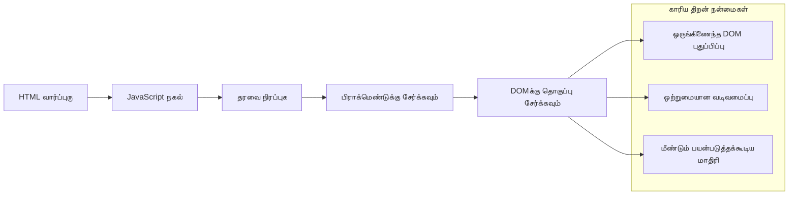
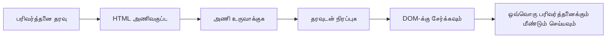
### படி 1: பரிவர்த்தனை மாதிரியை உருவாக்குதல்

முதலில், HTML `<body>` இல் பரிவர்த்தனை வரிகளுக்கான மறுபயன்பாடான மாதிரியை சேர்க்கவும்:

```html
<template id="transaction">
  <tr>
    <td></td>
    <td></td>
    <td></td>
  </tr>
</template>
```
  
**HTML மாதிரிகளை புரிந்து கொள்வது:**  
- ஒற்றைப் பட்டியலின் வரி கட்டமைப்பு வரையறுக்கப்பட்டுள்ளது  
- JavaScript மூலம் பிரதியொலி செய்யும்போது மட்டும் கண்காணிப்பு மாதிரியாக உள்ளது  
- தேதி, விளக்கம் மற்றும் தொகைக்கான மூன்று செல்ல்களை அடக்குகிறது  
- ஒரே மாதிரியில் சீரான வடிவமைப்பிற்கு மறுபயன்பாடு தருகிறது  

### படி 2: டேபிளைப் இயக்கக்கூடிய உள்ளடக்கத்திற்கு தயார் செய்யுதல்

பின்னர், tables body இல் id நாமத்தைச் சேர்த்து JavaScript இற்கு எளிதாய் இலக்குத்திருத்த அனுமதிக்கவும்:

```html
<tbody id="transactions"></tbody>
```
  
**இது செய்கிறது:**  
- பரிவர்த்தனை வரிகளை உள்ளிட தெளிவான இலக்கை உருவாக்குகிறது  
- டேபிள் கட்டமைப்பை இயக்கக்கூடிய உள்ளடக்கத்திலிருந்து பிரிக்கிறது  
- பரிவர்த்தனை தரவுகளை துடைத்து மீண்டும் நிரப்பும் வசதியை வழங்குகிறது  

### படி 3: பரிவர்த்தனை வரி தொழிற் செயல்பாட்டை உருவாக்குதல்

இப்போது ஒரு செயல்பாட்டை உருவாக்கி, பரிவர்த்தனை தரவை HTML கூறுகளாக மாற்றிடுவோம்:

```javascript
function createTransactionRow(transaction) {
  const template = document.getElementById('transaction');
  const transactionRow = template.content.cloneNode(true);
  const tr = transactionRow.querySelector('tr');
  tr.children[0].textContent = transaction.date;
  tr.children[1].textContent = transaction.object;
  tr.children[2].textContent = transaction.amount.toFixed(2);
  return transactionRow;
}
```
  
**இந்த தொழிற்சாலை செயல்பாட்டை தெளிவாக பார்க்கும் போது:**  
- ID மூலம் மாதிரி கூறை பெறுகிறது  
- மாதிரியின் உள்ளடக்கத்தை பாதுகாப்பாக நகலெடுக்கிறது  
- நகலெடுக்கப்பட்ட உள்ளடக்கத்தில் உள்ள பட்டியலின் வரியை தேர்வு செய்கிறது  
- ஒவ்வொரு செல்லையும் பரிவர்த்தனை தரவால் நிரப்புகிறது  
- தொகையை சரியான தசம இடాలతో வடிவமைக்கிறது  
- செல்வாக்கிற்காக வரிசையை திரும்ப வழங்குகிறது  

### படி 4: பல பரிவர்த்தனை வரிகளை திறம்பட உருவாக்குதல்

உங்கள் `updateDashboard()` செயல்பாட்டில் அனைத்து பரிவர்த்தனைகளையும் காட்சியளிக்க கீழ்க்காணும் குறியீட்டை சேர்க்கவும்:

```javascript
const transactionsRows = document.createDocumentFragment();
for (const transaction of account.transactions) {
  const transactionRow = createTransactionRow(transaction);
  transactionsRows.appendChild(transactionRow);
}
updateElement('transactions', transactionsRows);
```
  
**இந்த திறமையான அணுகுமுறையினைப் புரிந்து கொள்வது:**  
- பல DOM செயல்களை தொகுப்பதற்கான ஆவண துண்டை உருவாக்குகிறது  
- கணக்கு தரவிலுள்ள அனைத்து பரிவர்த்தனைகளையும் ஒவ்வொன்றும்迭கிறதை செய்கிறது  
- தொழிற்சாலை செயல்பாட்டைப் பயன்படுத்தி ஒவ்வொரு பரிவர்த்தனையும் ஒரு வரியாக உருவாக்குகிறது  
- அனைத்து வரிகளையும் துண்டில் சேகரித்து DOM இல் சேர்க்கிறது  
- பல தனிப்பட்ட சேர்க்கைகளுக்கு பதிலாக ஒரே நேரத்தில் DOM புதுப்பிப்பை செய்வது  


> ⚡ **செயல்திறன் மேம்படுத்தல்**: [`document.createDocumentFragment()`](https://developer.mozilla.org/docs/Web/API/Document/createDocumentFragment) போயிங் விமானக் கழகத்தின் அசெம்ப்லி செயல்முறையைப் போல் செயல்படுகிறது - கூறுகள் வெவ்வேறு இடங்களில் தயார் செய்யப்படுகின்றன, பிறகு ஒரு முழுமையான தொகுதியாக நிறுவப்படுகின்றன. இந்த தொகுப்பு முறையால் DOM மறுசுழற்சி குறுக்கப்படும், பல தனி நடவடிக்கைகள் செய்வதற்குப் பதிலாக ஒரே ஒருங்கிணைப்பைச் செய்கிறது.

### படி 5: கலவையான உள்ளடக்கத்திற்கான மேம்படுத்தல் செயற்கூற்று

உங்கள் `updateElement()` செயல்பாடு தற்போது केवल உரை உள்ளடக்கத்தைக் கையாள்கிறது. அதை உரை மற்றும் DOM முனைகள் இரண்டுக்கும் வேலை செய்யுமாறு மேம்படுத்தவும்:

```javascript
function updateElement(id, textOrNode) {
  const element = document.getElementById(id);
  element.textContent = ''; // அனைத்து குழந்தைகளையும் அகற்றுகிறது
  element.append(textOrNode);
}
```

**இந்த புதுப்பிப்பில் முக்கியமான மேம்பாடுகள்:**
- புதிய உள்ளடக்கம் சேர்க்கும் முன் உள்ளடக்கத்தை **தெளிப்பாக்குகின்றது**
- உரை தொடர்கள் அல்லது DOM முனைகள் இரண்டையும் **அங்கீகாரம் அளிக்கிறது**
- நெகிழ்வுத்தன்மைக்காக [`append()`](https://developer.mozilla.org/docs/Web/API/ParentNode/append) மேலாண்மை முறையை **பயன்படுத்துகிறது**
- தற்போதைய உரை அடிப்படையிலான பயன்பாட்டுடன் **பின்னணி பொருத்துதன்மையை பராமரிக்கிறது**

### உங்கள் டாஷ்மோர்டைப் பரிசோதனை செய்யும் நேரம்

உண்மை நேரம்! உங்கள் தன்னார்வமான டாஷ்மோர்டைப் பிரயோகத்தில் பார்ப்போம்:

1. `test` கணக்கைப் பயன்படுத்தி உள்நுழைக (இதில் தயாராக மாதிரித் தரவு உள்ளது)
2. உங்கள் டாஷ்மோர்டுக்கு செல்லவும்
3. பரிவர்த்தனை வரிசைகள் சரியான வடிவில் தோன்றுவதை சரிபார்க்கவும்
4. தேதிகள், விளக்கங்கள் மற்றும் தொகைகள் எல்லாம் நன்றாக இருக்கிறதா என உறுதி செய்யவும்

எல்லாம் சரியானதாக இருந்தால், உங்கள் டாஷ்மோர்டில் முழுமையான செயல்பாடுள்ள பரிவர்த்தனை பட்டியலை காணலாம்! 🎉

**நீங்கள் சாதித்துள்ளதை:**
- எந்த வகையான தரவுகளுக்கும் அளவிடக் கூடிய டாஷ்மோர்டை கட்டியமைத்தல்
- ஒத்துழைப்பு மற்றும் ஒரே மாதிரியாக வடிவமைக்கக்கூடிய மாதிரிகளை உருவாக்குதல்
- திறமையான DOM செயலாக்க முறைகளை இறைமையாக இணைத்தல்
- உற்பத்திப் பணிகளைப் போன்ற வங்கிச் செயலிகளில் வடிவமைப்பு செய்தல்

நீங்கள் நிலையான வலைப்பக்கத்தை இயக்கக்கூடிய வலை பயன்பாடாக மாற்றி வெற்றிகரமாக்கியுள்ளீர்கள்.

### 🎯 கல்விசார் சரிபார்த்தல்: கருத்துப்படையான உள்ளடக்க உருவாக்கம்

**வட்டார அறிவு**: நீங்கள் React, Vue, Angular போன்ற கடமைப்பட்ட அடிப்படை கட்டமைப்புகளில் பயன்படுத்தப்படுகிற கலைச்சொற்களைக் கையாளும் ஒரு நுணுக்கமான தரவு-முகப்பு குழாயை (data-to-UI pipeline) செயல்படுத்தியுள்ளீர்கள்.

**முக்கியக் கருத்துக்கள்**:
- **மாதிரி அடிப்படையிலான வடிவமைப்பு**: பன்முறை உபயோகிப்பதற்கு UI கூறுகளை உருவாக்குதல்
- **டாக்குமென்ட் சுருக்குகள்**: DOM செயல்திறனை மேம்படுத்துதல்
- **பாதுகாப்பான DOM செயலாக்கம்**: பாதுகாப்பு குறுக்கவியல் தடுப்பு
- **தரவு மாற்றம்**: சேவை வழங்கலோடு பயனரின் இடைமுகம் மாறுதல்

**தொழில் தொடர்பு**: இந்த தந்திரங்கள் தற்போது பரவலாக பயன்படுத்தப்படுகின்ற முன்னணி முன்னணி கட்டமைப்புகளுக்கு அடித்தளமாகவுள்ளன. React இன் மெய்நிகர் DOM, Vue இன் மாதிரி அமைப்பு மற்றும் Angular இன் கூறு கட்டமைப்பு இவை அனைத்தும் இந்த அடிப்படைக் கலைச்சொற்களினைப் பயன்படுத்துகின்றன.

**புலனாய்வு கேள்வி**: இந்த அமைப்பைக் கண்காணிப்பைப் பெறும் நாம் எப்படிச் செல்லலாம் (புதிய பரிவர்த்தனைகள் தானாகத் தோன்றுவது மாதிரி)? WebSockets அல்லது Server-Sent Events ஆகியவற்றைப் பரிசீலிக்கவும்.

---

## 📈 உங்கள் தரவு மேலாண்மை திறனின் நேரவரிசை

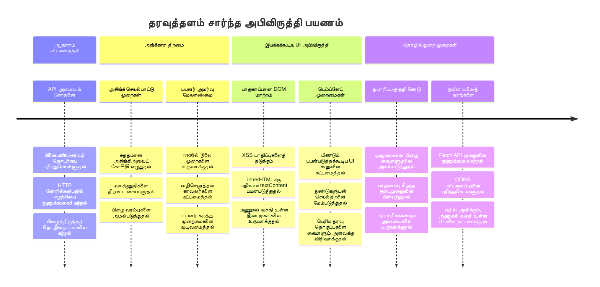
**🎓 பட்டமளிக்கும் படி**: நீங்கள் சமகால ஜாவாஸ்கிரிப்டு முறைகளைப் பயன்படுத்தி முழுமையான தரவு சார்ந்த வலை பயன்பாட்டைப் வெற்றிகரமாக கட்டியுள்ளீர்கள். இந்த திறன்கள் React, Vue அல்லது Angular போன்ற கட்டமைப்புகளுடன் நேரடியாக தொடர்பு கொண்டவை.

**🔄 அடுத்த நிலை திறன்கள்**:
- இந்தக் கருத்துக்களைப் பயன்படுத்தும் முன்னணி கட்டமைப்புக்களை ஆராயத் தயாராக இருத்தல்
- WebSockets உடன் நேரடி அம்சங்களை நடைமுறைப்படுத்தத் தயார்
- ஆஃப்லைன் செயல்திறன் கொண்ட முன்னேற்ற வலைப் பயன்பாடுகளை கட்டுவதற்கு திறன்
- மேம்பட்ட நிலை மேலாண்மை முறைகளை கற்றுக்கொள்ள அடித்தளத்தை அமைத்தல்

## GitHub Copilot முகவர் சவால் 🚀

கீழ்க்காணும் சவால்களை நிறைவேற்ற முகவர் முறையைப் பயன்படுத்தவும்:

**விளக்கம்:** வங்கி செயலியில் பரிவர்த்தனை தேடலும் வடிகட்டலும் வசதியினைச் சேர்த்து குறிக்கப்பட்ட தேதி வரம்பு, தொகை அல்லது விளக்கம் மூலம் பரிவர்த்தனைகளை தேட பயனர்களுக்கு உதவுதல்.

**உரையாடல்:** வங்கி செயலிக்கான தேடல் செயல்பாட்டை உருவாக்கவும்: 1) தேதி வரம்பு (முதல்/இறுதி), குறைந்தபட்ச/அதிகபட்ச தொகை மற்றும் பரிவர்த்தனை விளக்கம் குறிச்சொற்கள் உள்ள உள்ளாடல் படிவம், 2) தேடல் விதிகளுக்கு ஏற்ப account.transactions வரிசையைக் வடிகட்டும் `filterTransactions()` செயற்கூறு, 3) `updateDashboard()` செயல்பாட்டில் வடிகட்டப்பட்ட முடிவுகளைக் காட்டுதல், 4) காட்சியை மீட்டமைப்பதற்கான "வடிகட்டி நீக்கு" பட்டன் சேர்த்தல். அதிகபட்சமாக `filter()` போன்ற ஜாவாஸ்கிரிப்ட் வரிசை முறைமைகளைப் பயன்படுத்தி வெறும் தேடல் அளவுகோல்களுக்கு விளக்கங்களை கையாளவும்.

[agent mode](https://code.visualstudio.com/blogs/2025/02/24/introducing-copilot-agent-mode) பற்றி இங்கே அறியவும்.

## 🚀 சவால்

உங்கள் வங்கி செயலியை அடுத்த நிலைக்கு கொண்டு செல்ல தயாரா? திருப்திகரமாகப் பயன்படக்கூடியவை போல தோற்றமும் உணர்வையும் உருவாக்குவோம். உங்கள் படைப்பாற்றலை ஊக்குவிக்கும் சில யோசனைகள்:

**அழகாக மாற்றவும்**: CSS வடிவமைப்பைப் ப்ரயோகித்து செயல்படும் டாஷ்மோர்டை கண்ணுக்கு இனிமையானதாக மாற்றவும். சுத்தமான வரிகள், நல்ல இடைவெளிகள் மற்றும் மென்மையான அனிமேஷன் சிலவற்றையும் சேர்த்துக் கொள்ளலாம்.

**பிரதிக்கை செய்யக்கூடியதாக மாற்றவும்**: [மீடியா வினாக்கள்](https://developer.mozilla.org/docs/Web/CSS/Media_Queries) உபயோகித்து [பிரதிகூடிய வடிவமைப்பு](https://developer.mozilla.org/docs/Web/Progressive_web_apps/Responsive/responsive_design_building_blocks) உருவாக்கவும், இது தொலைபேசி, டாப்லெட் மற்றும் டெஸ்க்டாப் ஆகியவற்றுக்கு சிறப்பாக வேலை செய்யும். உங்கள் பயனர்கள் உங்களுக்குப் நன்றி கூறுவர்!

**சிறு சிறப்பு சேர்க்கவும்**: பரிவர்த்தனைகளுக்கு வண்ண வகைப்பாடு செய்யலாம் (வருமானத்திற்கு பச்சை, செலவுக்குச் சிவப்பு), ஐகான்கள் சேர்க்கலாம், அல்லது ஹோவரிங் விளைவுகளைக் கொண்டு இடைமுகத்தை நடனம் போலக் காட்சியளிக்கச் செய்யலாம்.

சான்றான ஒரு டாஷ்மோர்டின் தோற்றம் இதுவாக இருக்கலாம்:

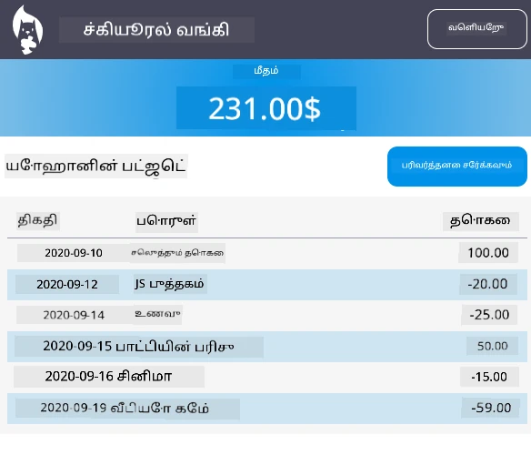

இதை முழுமையாகப் பின்பற்ற வேண்டியதில்லை — இது உத்தேசமாகக் கொண்டிருக்கும், உங்கள் சொந்த அழகையாக்கிக் கொள்ளுங்கள்!

## பாடத்திட்டம் முடிந்த பிறகு பரீட்சை

[பாடத்திட்டம் முடிந்த பிறகு பரீட்சை](https://ff-quizzes.netlify.app/web/quiz/46)

## பணிமுரை

[உங்கள் குறியீட்டை மறுசீரமைத்து கருத்துக்களைச் சேர்க்கவும்](assignment.md)

---

<!-- CO-OP TRANSLATOR DISCLAIMER START -->
**விபரிப்பு**:  
இந்த ஆவணம் [Co-op Translator](https://github.com/Azure/co-op-translator) என்ற AI மொழிபெயர்ப்புச் சேவையை பயன்படுத்தி மொழிபெயர்க்கப்பட்டுள்ளது. நாங்கள் துல்லியத்தை உறுதிப்படுத்த முயற்சித்தாலும், தானாக இயங்கும் மொழிபெயர்ப்புகளில் பிழைகள் அல்லது தவறிடல்கள் இருப்பதற்கான வாய்ப்பு உண்டு. இதன் சொந்த மொழியில் உள்ள அசல் ஆவணம் அதிகாரப்பூர்வ மூலமாக கருதப்பட வேண்டும். முக்கியமான தகவல்களுக்கு, நிபுணர் மனித மொழிபெயர்ப்பாளர் வழிகாட்டப்படுகிறார். இந்த மொழிபெயர்ப்பின் பயன்படுத்துவதனால் ஏற்படும் எந்த தவறான புரிதல்களுக்கும் அல்லது தவறான விளக்கங்களுக்கும் நாங்கள் பதில்விருத்த அதிகாரம் இல்லை.
<!-- CO-OP TRANSLATOR DISCLAIMER END -->