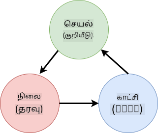
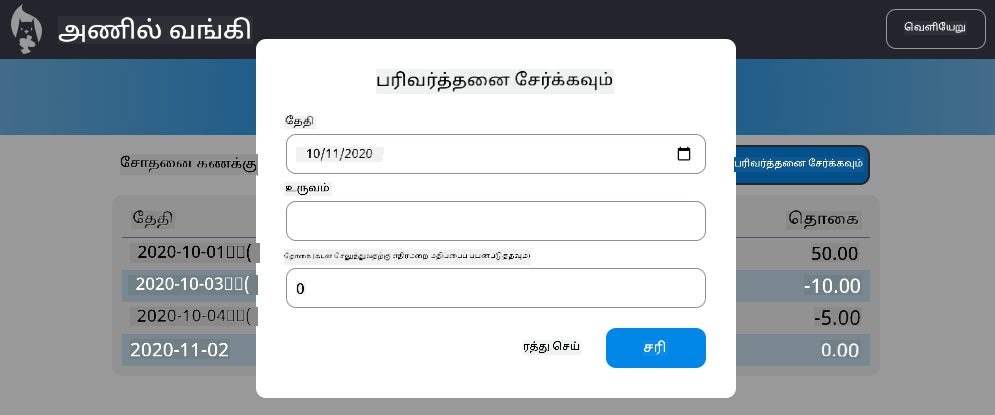

<!--
CO_OP_TRANSLATOR_METADATA:
{
  "original_hash": "b46acf79da8550d76445eed00b06c878",
  "translation_date": "2025-10-11T12:01:36+00:00",
  "source_file": "7-bank-project/4-state-management/README.md",
  "language_code": "ta"
}
-->
# வங்கி பயன்பாட்டை உருவாக்குதல் பகுதி 4: நிலை மேலாண்மை கருத்துக்கள்

## முன்-வகுப்பு வினாடி வினா

[முன்-வகுப்பு வினாடி வினா](https://ff-quizzes.netlify.app/web/quiz/47)

### அறிமுகம்

ஒரு வலை பயன்பாடு வளரும்போது, அனைத்து தரவோட்டங்களை கண்காணிப்பது சவாலாக மாறுகிறது. எந்த குறியீடு தரவுகளைப் பெறுகிறது, எந்த பக்கம் அதை பயன்படுத்துகிறது, எங்கு மற்றும் எப்போது அதை புதுப்பிக்க வேண்டும்... இது பராமரிக்க கடினமான குழப்பமான குறியீடாக மாறுவது எளிது. குறிப்பாக, உங்கள் பயன்பாட்டின் பல்வேறு பக்கங்களில் தரவுகளைப் பகிர்ந்து கொள்ள வேண்டிய போது, உதாரணமாக பயனர் தரவுகள். *நிலை மேலாண்மை* என்ற கருத்து அனைத்து வகையான நிரல்களில் எப்போதும் இருந்தது, ஆனால் வலை பயன்பாடுகள் சிக்கலானதாக வளர்ந்ததால், இது தற்போது வளர்ச்சியின் போது கவனிக்க வேண்டிய முக்கிய அம்சமாக மாறியுள்ளது.

இந்த இறுதி பகுதியில், நாம் உருவாக்கிய பயன்பாட்டை மீண்டும் பரிசீலித்து, நிலை மேலாண்மையை எப்படி மேம்படுத்துவது என்பதைப் பார்ப்போம், இது எந்த நேரத்திலும் உலாவி புதுப்பிக்க ஆதரவு அளிக்கவும், பயனர் அமர்வுகளுக்கு இடையே தரவுகளை நிலைத்திருக்கவும் உதவுகிறது.

### முன்-தரப்பு

இந்த பாடத்திற்கான [தரவு பெறுதல்](../3-data/README.md) பகுதியை நீங்கள் முடித்திருக்க வேண்டும். மேலும், [Node.js](https://nodejs.org) நிறுவி, [சர்வர் API](../api/README.md) ஐ உள்ளூர் இயக்க வேண்டும், இதனால் நீங்கள் கணக்கு தரவுகளை நிர்வகிக்க முடியும்.

சர்வர் சரியாக இயங்குகிறதா என்பதை நீங்கள் இந்த கட்டளையை ஒரு டெர்மினலில் இயக்கி சோதிக்கலாம்:

```sh
curl http://localhost:5000/api
# -> should return "Bank API v1.0.0" as a result
```

---

## நிலை மேலாண்மையை மீண்டும் பரிசீலிக்கவும்

[முந்தைய பாடத்தில்](../3-data/README.md), நாங்கள் `account` என்ற உலகளாவிய மாறியைப் பயன்படுத்தி, தற்போதைய உள்நுழைந்த பயனரின் வங்கி தரவுகளை உள்ளடக்கிய அடிப்படை நிலை கருத்தை அறிமுகப்படுத்தினோம். ஆனால், தற்போதைய செயல்பாட்டில் சில குறைகள் உள்ளன. டாஷ்போர்டில் இருக்கும் போது பக்கத்தை புதுப்பிக்க முயற்சிக்கவும். என்ன நடக்கிறது?

தற்போதைய குறியீட்டில் 3 பிரச்சினைகள் உள்ளன:

- நிலை நிலைத்திருக்கவில்லை, உலாவி புதுப்பிப்பு உங்களை மீண்டும் உள்நுழைவு பக்கத்திற்கு அழைத்துச் செல்கிறது.
- நிலையை மாற்றும் பல செயல்பாடுகள் உள்ளன. பயன்பாடு வளரும்போது, இது மாற்றங்களை கண்காணிக்க கடினமாக்கும், மேலும் ஒன்றை புதுப்பிக்க மறக்க எளிதாக இருக்கும்.
- நிலை சுத்தம் செய்யப்படவில்லை, எனவே நீங்கள் *Logout* கிளிக் செய்தால், உள்நுழைவு பக்கத்தில் இருந்தாலும் கணக்கு தரவுகள் இன்னும் அங்கே இருக்கும்.

இந்த பிரச்சினைகளை ஒன்றொன்றாக தீர்க்க குறியீட்டை புதுப்பிக்கலாம், ஆனால் இது குறியீட்டு மடிப்பை உருவாக்கும் மற்றும் பயன்பாட்டை பராமரிக்க கடினமாக்கும். அல்லது சில நிமிடங்கள் இடைவேளை எடுத்து, எங்கள் உத்தியை மீண்டும் பரிசீலிக்கலாம்.

> இங்கே நாம் உண்மையில் எந்த பிரச்சினைகளை தீர்க்க முயற்சிக்கிறோம்?

[நிலை மேலாண்மை](https://en.wikipedia.org/wiki/State_management) என்பது இந்த இரண்டு குறிப்பிட்ட பிரச்சினைகளை தீர்க்க ஒரு நல்ல அணுகுமுறையை கண்டுபிடிப்பது பற்றியது:

- பயன்பாட்டில் தரவோட்டங்களை புரிந்துகொள்ள எளிதாக எப்படி வைத்திருக்கலாம்?
- பயனர் இடைமுகத்துடன் நிலை தரவுகளை எப்போதும் ஒத்திசைக்க (மற்றும் மாறாக) எப்படி வைத்திருக்கலாம்?

இந்தவற்றை கவனித்துக்கொண்ட பிறகு, உங்களிடம் இருக்கும் பிற பிரச்சினைகள் ஏற்கனவே தீர்க்கப்பட்டிருக்கலாம் அல்லது தீர்க்க எளிதாக மாறியிருக்கலாம். இந்த பிரச்சினைகளை தீர்க்க பல்வேறு அணுகுமுறைகள் உள்ளன, ஆனால் **தரவை மற்றும் அதை மாற்றும் வழிகளை மையமாக்குதல்** என்ற பொதுவான தீர்வுடன் நாம் செல்லலாம். தரவோட்டங்கள் இவ்வாறு செல்லும்:



> தரவு தானாகவே பார்வை புதுப்பிப்பைத் தூண்டும் பகுதியை இங்கே நாம் கையாளமாட்டோம், ஏனெனில் இது [செயல்திறன் நிரலாக்கம்](https://en.wikipedia.org/wiki/Reactive_programming) என்ற மேம்பட்ட கருத்துகளுடன் தொடர்புடையது. நீங்கள் ஆழமான ஆய்வுக்கு தயாராக இருந்தால், இது ஒரு நல்ல தொடர்ச்சியான பொருள்.

✅ நிலை மேலாண்மைக்கு பல்வேறு அணுகுமுறைகளுடன் பல நூலகங்கள் உள்ளன, [Redux](https://redux.js.org) ஒரு பிரபலமான விருப்பமாகும். இது பெரும்பாலான வலை பயன்பாடுகளில் நீங்கள் எதிர்கொள்ளக்கூடிய சாத்தியமான பிரச்சினைகள் மற்றும் அதை எப்படி தீர்க்கலாம் என்பதைப் புரிந்துகொள்ள ஒரு நல்ல வழியாக இருக்கும்.

### பணிக்கூற்று

சிறிது மறுசீரமைப்புடன் தொடங்குவோம். `account` அறிவிப்பை மாற்றவும்:

```js
let account = null;
```

இதுடன்:

```js
let state = {
  account: null
};
```

இருப்பIdea என்பது அனைத்து பயன்பாட்டு தரவுகளையும் ஒரு நிலை பொருளில் மையமாக்குவது. தற்போதைக்கு நிலையில் `account` மட்டுமே உள்ளதால் இது அதிகம் மாறாது, ஆனால் இது வளர்ச்சிகளுக்கு பாதையை உருவாக்குகிறது.

இதைப் பயன்படுத்தும் செயல்பாடுகளையும் புதுப்பிக்க வேண்டும். `register()` மற்றும் `login()` செயல்பாடுகளில், `account = ...` ஐ `state.account = ...` என மாற்றவும்;

`updateDashboard()` செயல்பாட்டின் மேல் பகுதியில், இந்த வரியைச் சேர்க்கவும்:

```js
const account = state.account;
```

இந்த மறுசீரமைப்பு தனியாக அதிக மேம்பாடுகளை கொண்டு வரவில்லை, ஆனால் அடுத்த மாற்றங்களுக்கு அடித்தளத்தை அமைப்பதே நோக்கம்.

## தரவு மாற்றங்களை கண்காணிக்கவும்

நாம் `state` பொருளை எங்கள் தரவுகளை சேமிக்க பயன்படுத்திய பிறகு, அடுத்த படியாக புதுப்பிப்புகளை மையமாக்க வேண்டும். எந்த மாற்றங்கள் எப்போது நிகழ்கின்றன என்பதை கண்காணிக்க எளிதாக செய்ய வேண்டும்.

`state` பொருளில் மாற்றங்கள் செய்ய தவிர்க்க, அதை [*மாறாதது*](https://en.wikipedia.org/wiki/Immutable_object) எனக் கருதுவது நல்ல நடைமுறையாகும், அதாவது அதை முழுமையாக மாற்ற முடியாது. இதனால், நீங்கள் அதில் ஏதாவது மாற்ற விரும்பினால் புதிய state பொருளை உருவாக்க வேண்டும். இதைச் செய்வதன் மூலம், நீங்கள் எதிர்பாராத [பக்க விளைவுகள்](https://en.wikipedia.org/wiki/Side_effect_(computer_science)) பற்றிய பாதுகாப்பை உருவாக்குகிறீர்கள், மேலும் உங்கள் பயன்பாட்டில் undo/redo போன்ற புதிய அம்சங்களை செயல்படுத்துவதற்கான வாய்ப்புகளைத் திறக்கிறீர்கள், மேலும் பிழையை சரிசெய்ய எளிதாகவும் செய்கிறீர்கள். உதாரணமாக, நீங்கள் state இல் செய்யப்பட்ட ஒவ்வொரு மாற்றத்தையும் பதிவு செய்து, பிழையின் மூலத்தைப் புரிந்துகொள்ள மாற்றங்களின் வரலாற்றை வைத்திருக்கலாம்.

JavaScript இல், [`Object.freeze()`](https://developer.mozilla.org/docs/Web/JavaScript/Reference/Global_Objects/Object/freeze) ஐப் பயன்படுத்தி ஒரு மாறாத பதிப்பை உருவாக்கலாம். மாறாத பொருளில் மாற்றங்களைச் செய்ய முயற்சித்தால், ஒரு εξαίρεση எழுப்பப்படும்.

✅ *கூடுகூறாக* மற்றும் *ஆழமாக* மாறாத பொருளின் வித்தியாசம் என்ன என்பதை நீங்கள் அறிந்தீர்களா? [இங்கே](https://developer.mozilla.org/docs/Web/JavaScript/Reference/Global_Objects/Object/freeze#What_is_shallow_freeze) படிக்கலாம்.

### பணிக்கூற்று

புதிய `updateState()` செயல்பாட்டை உருவாக்குவோம்:

```js
function updateState(property, newData) {
  state = Object.freeze({
    ...state,
    [property]: newData
  });
}
```

இந்த செயல்பாட்டில், நாம் ஒரு புதிய state பொருளை உருவாக்கி, முந்தைய state இல் இருந்து தரவுகளை [*spread (`...`) operator*](https://developer.mozilla.org/docs/Web/JavaScript/Reference/Operators/Spread_syntax#Spread_in_object_literals) ஐப் பயன்படுத்தி நகலெடுக்கிறோம். பின்னர், state பொருளின் குறிப்பிட்ட சொத்தை புதிய தரவுடன் [bracket notation](https://developer.mozilla.org/docs/Web/JavaScript/Guide/Working_with_Objects#Objects_and_properties) `[property]` ஐப் பயன்படுத்தி மேம்படுத்துகிறோம். இறுதியாக, `Object.freeze()` ஐப் பயன்படுத்தி பொருளை மாற்றங்களைத் தடுக்க பூட்டுகிறோம். தற்போதைக்கு state இல் `account` சொத்து மட்டுமே சேமிக்கப்பட்டுள்ளது, ஆனால் இந்த அணுகுமுறையுடன் state இல் தேவையான சொத்துகளை நீங்கள் சேர்க்கலாம்.

நாங்கள் state ஆரம்பத்தையும் புதுப்பிக்க வேண்டும், ஆரம்ப நிலை உறுதியாக உறுதிப்படுத்தவும்:

```js
let state = Object.freeze({
  account: null
});
```

அதன் பிறகு, `register` செயல்பாட்டை `state.account = result;` ஒதுக்கீட்டை மாற்றி:

```js
updateState('account', result);
```

`login` செயல்பாட்டுடன் இதையே செய்யவும், `state.account = data;` ஐ மாற்றி:

```js
updateState('account', data);
```

இப்போது பயனர் *Logout* ஐ கிளிக் செய்தால் கணக்கு தரவுகள் அழிக்கப்படாத பிரச்சினையை சரிசெய்ய வாய்ப்பு கிடைத்துள்ளது.

புதிய `logout()` செயல்பாட்டை உருவாக்கவும்:

```js
function logout() {
  updateState('account', null);
  navigate('/login');
}
```

`updateDashboard()` இல், `return navigate('/login');` என்ற வழிமாற்றத்தை `return logout();` என மாற்றவும்;

புதிய கணக்கை பதிவு செய்து, வெளியேறி மீண்டும் உள்நுழைந்து, அனைத்தும் சரியாக வேலை செய்கிறதா என்பதைச் சரிபார்க்கவும்.

> குறிப்புரை: `updateState()` இன் கீழே `console.log(state)` ஐச் சேர்த்து, உலாவியின் மேம்பாட்டு கருவிகளில் உள்ள கன்சோலைத் திறக்கவும், அனைத்து state மாற்றங்களையும் பார்க்கலாம்.

## நிலையை நிலைத்திருக்கவும்

பெரும்பாலான வலை பயன்பாடுகள் சரியாக வேலை செய்ய தரவுகளை நிலைத்திருக்க வேண்டும். அனைத்து முக்கியமான தரவுகளும் பொதுவாக ஒரு தரவுத்தொகுப்பில் சேமிக்கப்படும் மற்றும் சர்வர் API மூலம் அணுகப்படும், எங்கள் வழக்கில் பயனர் கணக்கு தரவுகள் போன்றவை. ஆனால் சில நேரங்களில், உலாவியில் இயங்கும் கிளையன்ட் பயன்பாட்டில் சில தரவுகளை நிலைத்திருக்கவும், சிறந்த பயனர் அனுபவத்திற்காக அல்லது ஏற்றுதல் செயல்திறனை மேம்படுத்தவும் இது சுவாரஸ்யமாக இருக்கும்.

உங்கள் உலாவியில் தரவுகளை நிலைத்திருக்க விரும்பும்போது, சில முக்கியமான கேள்விகளை நீங்கள் உங்களிடம் கேட்க வேண்டும்:

- *தரவு நுண்ணறிவாக உள்ளதா?* பயனர் கடவுச்சொற்கள் போன்ற எந்த நுண்ணறிவு தரவையும் கிளையன்டில் சேமிக்க தவிர்க்க வேண்டும்.
- *இந்த தரவை எவ்வளவு காலத்திற்கு நீங்கள் வைத்திருக்க வேண்டும்?* இந்த தரவை தற்போதைய அமர்விற்காக மட்டுமே அணுக திட்டமிடுகிறீர்களா அல்லது அதை நிரந்தரமாகச் சேமிக்க விரும்புகிறீர்களா?

தகவல்களை ஒரு v
[பாடத்திற்குப் பின் வினாடி வினா](https://ff-quizzes.netlify.app/web/quiz/48)

## பணிக்கூற்று

["Add transaction" உரையாடலை செயல்படுத்தவும்](assignment.md)

பணிக்கூற்றை முடித்த பிறகு கிடைக்கும் உதாரண முடிவு இதோ:



---

**குறிப்பு**:  
இந்த ஆவணம் [Co-op Translator](https://github.com/Azure/co-op-translator) என்ற AI மொழிபெயர்ப்பு சேவையைப் பயன்படுத்தி மொழிபெயர்க்கப்பட்டுள்ளது. நாங்கள் துல்லியத்திற்காக முயற்சிக்கின்றோம், ஆனால் தானியங்கி மொழிபெயர்ப்புகளில் பிழைகள் அல்லது தவறான தகவல்கள் இருக்கக்கூடும் என்பதை கவனத்தில் கொள்ளவும். அதன் தாய்மொழியில் உள்ள மூல ஆவணம் அதிகாரப்பூர்வ ஆதாரமாக கருதப்பட வேண்டும். முக்கியமான தகவல்களுக்கு, தொழில்முறை மனித மொழிபெயர்ப்பு பரிந்துரைக்கப்படுகிறது. இந்த மொழிபெயர்ப்பைப் பயன்படுத்துவதால் ஏற்படும் எந்த தவறான புரிதல்கள் அல்லது தவறான விளக்கங்களுக்கு நாங்கள் பொறுப்பல்ல.