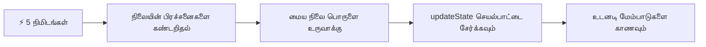
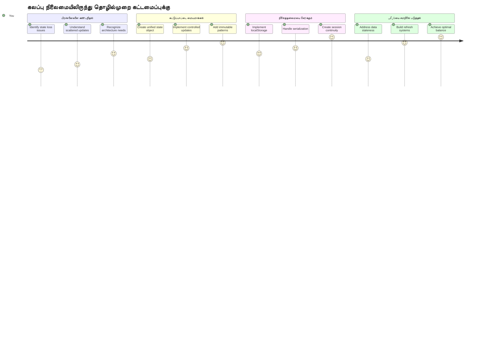
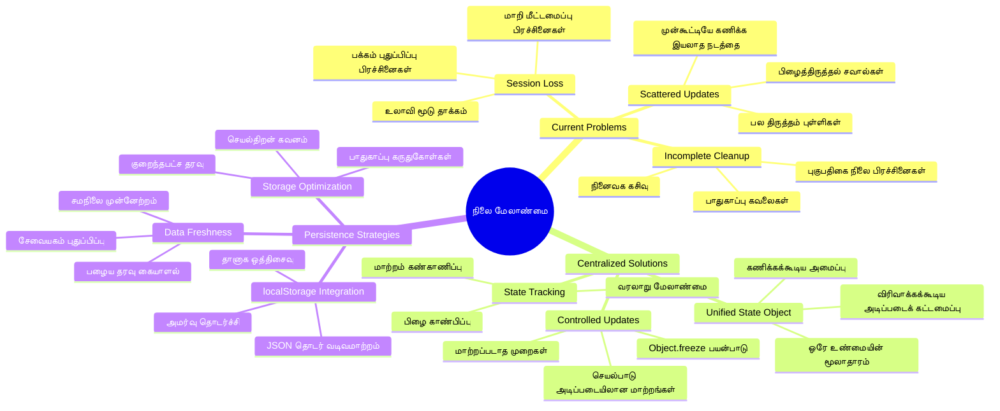
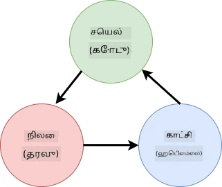
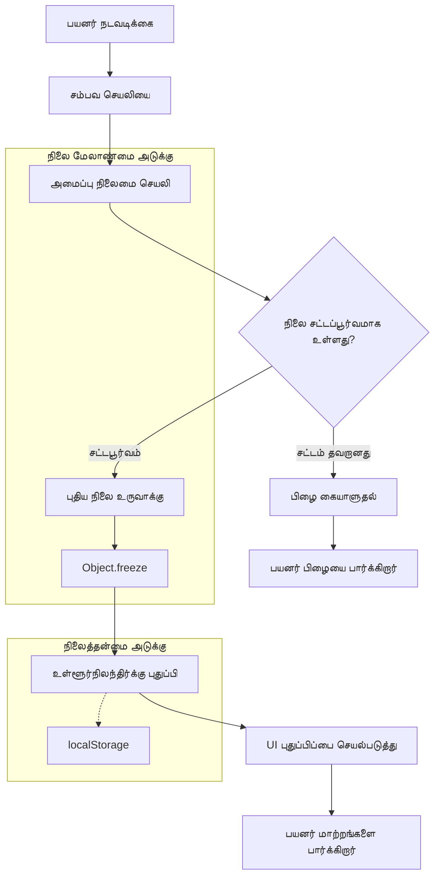
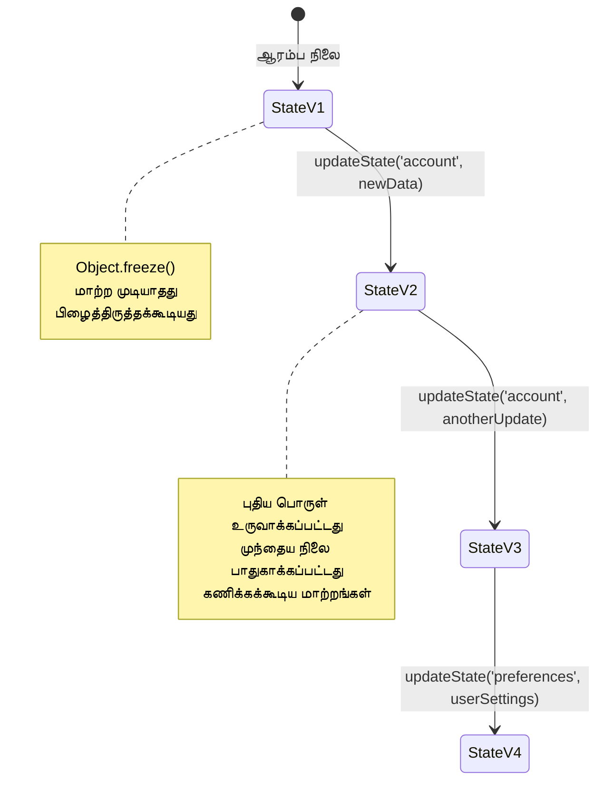
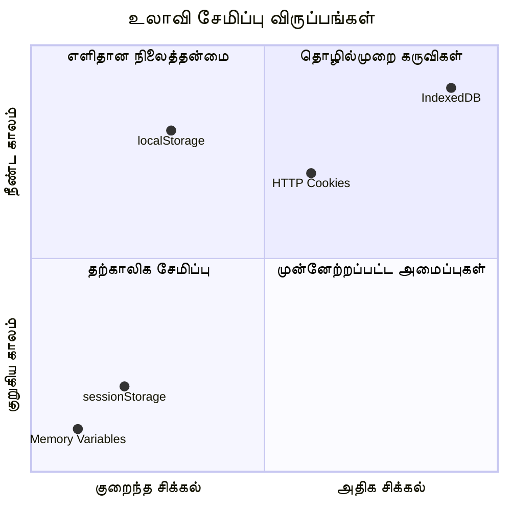
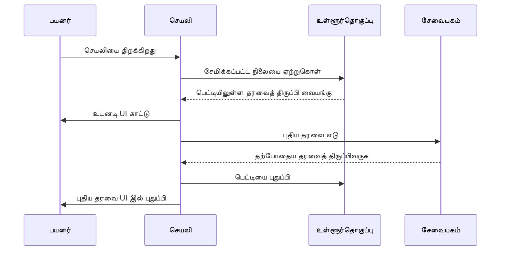
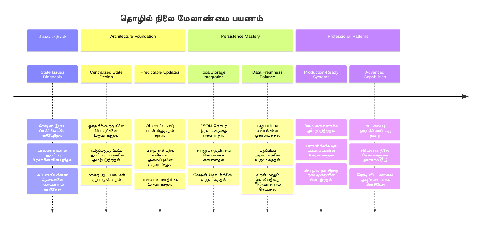
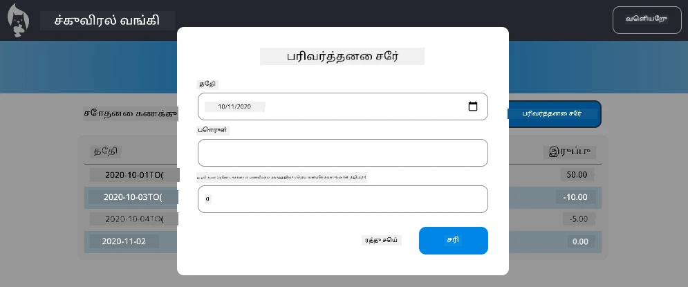

<!--
CO_OP_TRANSLATOR_METADATA:
{
  "original_hash": "b807b09df716dc48a2b750835bf8e933",
  "translation_date": "2026-01-07T13:34:22+00:00",
  "source_file": "7-bank-project/4-state-management/README.md",
  "language_code": "ta"
}
-->
# வங்கி செயலியை உருவாக்குதல் பகுதி 4: நிலை பராமரிப்புக் கருத்துக்கள்

## ⚡ அடுத்த 5 நிமிடங்களில் நீங்கள் செய்யக்கூடியவை

**பிஸியான மேம்படுத்துநர்களுக்கான விரைவு துவக்க பாதை**


- **நிமிடம் 1**: தற்போதைய நிலை பிரச்சனையை சோதிக்கவும் - உள்நுழையவும், பக்கத்தை புதுப்பிக்கவும், வெளியேறுவதை கவனிக்கவும்
- **நிமிடம் 2**: `let account = null` என்பதை `let state = { account: null }` உடன் மாற்றவும்
- **நிமிடம் 3**: கட்டுப்படுத்தப்பட்ட புதுப்பிப்புகளுக்கான எளிய `updateState()` செயல்பாட்டை உருவாக்கவும்
- **நிமிடம் 4**: ஒரு செயல்பாட்டை புதிய முறைக்கு புதுப்பிக்கவும்
- **நிமிடம் 5**: மேம்பட்ட கணிப்பாய்வு மற்றும் பிழைத்திருத்த செயல்திறனை சோதிக்கவும்

**விரைவு டயக்னோஸ்டிக் சோதனை**:
```javascript
// முன்பு: பரபரப்பான நிலை
let account = null; // புதுப்பிக்கும் போது தொலைந்தது!

// பிறகு: மையமிடப்பட்ட நிலை
let state = Object.freeze({ account: null }); // கட்டுப்படுத்தப்பட்டதும் கண்காணிக்கக்கூடியதும்!
```

**இது ஏன் முக்கியம்**: 5 நிமிடங்களில், குழப்பமான நிலை நிருவாகத்திலிருந்து கணிப்பாய்வான, பிழைத்திருத்தக்கூடிய வடிவங்களுக்கு மாற்றம் நிகழ்வதை நீங்கள் அனுபவிப்பீர்கள். இது சிக்கலான செயலிகளைக் காப்பாற்றும் அடித்தளமாகும்.

## 🗺️ நிலை பராமரிப்பு நிபுணத்துவத்தின் உங்கள் கற்றல் பயணம்


**உங்கள் பயண இலக்கு**: இந்த பாடம் முடிவில், நீங்கள் நிலைத்தன்மை, தரவு تازگی மற்றும் கணிப்பாய்வான புதுப்பிப்புகளை கையாளக்கூடிய தொழில்நுட்ப தரமான நிலை நிர்வாக அமைப்பை கட்டியெழுப்புவீர்கள் - தயாரிப்பு செயலிகளில் பயன்படுத்தப்படும் அதே முறைகள்.

## முன்-பாட பரிசோதனை

[Pre-lecture quiz](https://ff-quizzes.netlify.app/web/quiz/47)

## அறிமுகம்

நிலை நிர்வாகம் என்பது வோயேஜர் விண்வெளி கப்பல் ஓட்ட நிர்வாகத்தின்போல் – எல்லாம் நன்றாக இயங்கும் போது, அது அங்கே இருப்பதை நீங்கள் כמעט கவனிக்க மாட்டீர்கள். ஆனால் பிரச்சனைகள் வரும்போது, அது நட்சத்திர இடைவெளி சென்றடைவதற்கு இடையூறு ஆகும். வலை மேம்பாட்டில், நிலை என்பது உங்கள் செயலிக்கு நினைவில் வைக்க வேண்டிய அனைத்து விஷயங்களையும் குறிக்கும்: பயனர் உள்நுழைவு நிலை, படிவ தரவு, வழிசெலுத்தல் வரலாறு மற்றும் தற்காலிக இடைமுக நிலைகள்.

உங்கள் வங்கி செயலி எளிய உள்நுழைவு படிவத்திலிருந்து ஒரு மேல்அடுக்கு செயலியாக வளர்ச்சியடைந்தபோது, சில பொதுவான சவால்களை எதிர்கொண்டிருக்கலாம். பக்கத்தை புதுப்பித்தால் பயனர்கள் திடீரென்று வெளியேறுகிறார்கள். உலாவி மூடியால் அனைத்து முன்னேற்றமும் மறைந்து விடுகிறது. ஒரு பிழையை பிழைத்திருத்தும்போது, பல செயல்பாடுகள் ஒரே தரவின் வெவ்வேறு மாற்றங்களை செய்யவும் வேட்டைபிடிக்கவும் நீங்கள் போதிய நேரம் செலவிடுகிறீர்கள்.

இவை மோசமான கோடிங் குறியீடுகள் அல்ல – செயலிகள் ஒரு குறிப்பிட்ட சிக்கல்தன்மை எல்லையை எட்டும் போது நிகழ்கின்ற இயல்பான வளர்ச்சிப் பாட்டுக்கள். அனைத்து மேம்படுத்துநர்களும், அவற்றின் செயலிகள் "கருத்துக் குறிப்பில்" இருந்து "தயாரிப்பு தயாராக" மாறும்போது இந்த சவால்களை சந்திக்கின்றனர்.

இந்த பாடத்தில், உங்கள் வங்கி செயலியை நம்பகமான, தொழில்திறன் வாய்ந்த செயலியாக மாற்றும் மைய நிலை நிர்வாக அமைப்பை செயல்படுத்த போகிறோம். தரவு ஓட்டங்களை கணிப்பாய்வாக, பயனர் அமர்வுகளை தக்கவைத்துக்கொண்டு, நவீன வலை செயலிகளில் தேவையான மென்மையான பயனர் அனுபவத்தைக் உருவாக்க நீங்கள் கற்றுக்கொள்வீர்கள்.

## முன்னுரிமைகள்

நிலை நிர்வாகக் கருத்துக்களில் மூழ்குவதற்கு முன், உங்கள் மேம்பாட்டு சூழல் சரியாக அமைக்கப்பட்டிருப்பதையும் உங்கள் வங்கி செயலியின் அடித்தளம் தயார் இருப்பதையும் உறுதிப்படுத்திக் கொள்ளுங்கள். இந்த பாடம் தொடரின் முந்தைய பகுதிகளின் கொள்கைகளும் குறியீடுகளும் நேரடியாக அடிப்படையாக பயன் படுத்துகிறது.

தொடர்வதற்கு முன் கீழ்க்காணும் கூறுகள் தயார் என்பதை உறுதி செய்யவும்:

**தேவைப்படும் அமைப்பு:**
- [டேட்டா பெறும் பாடம்](../3-data/README.md) முடித்து உங்கள் செயலி கணக்கு தரவை வெற்றிகரமாக ஏற்றவும் மற்றும் காட்டு வேண்டும்
- உங்கள் கணினியில் [Node.js](https://nodejs.org) ஐ நிறுவவும், பின்னணி API ஐ இயக்குவதற்காக
- கணக்கு தரவு செயல்பாடுகளை கையாள [server API](../api/README.md) ஐ உள்ளூர் முறையில் துவக்கவும்

**உங்கள் சூழலை சோதனை செய்ய:**

கீழ்க்காணும் கட்டளையை டெர்மினலில் இயக்கி உங்கள் API சேவையகம் சரியாக இயங்குகிறதா எனப் பார்க்கவும்:

```sh
curl http://localhost:5000/api
# -> "Bank API v1.0.0" என்பதை ஒரு முடிவாக வழங்க வேண்டும்
```

**இந்த கட்டளை என்ன செய்கிறது:**
- உங்கள் உள்ளூர் API சேவையகத்திற்கு GET கோரிக்கை அனுப்புகிறது
- இணைப்பு சரியானதா என்று சோதிக்கவும் சேவையகம் பதிலளிக்கிறதா என்று உறுதிப்படுத்துகிறது
- எல்லாம் சரியாக இருந்தால் API பதிப்பு தகவலை திருப்பி அளிக்கிறது

## 🧠 நிலை நிர்வாக கட்டமைப்பின் சாராம்சம்


**மூலக் கொள்கை**: தொழில்திறனான நிலை நிர்வாகம் கணிப்பாய்வு, நிலைத்தன்மை மற்றும் செயல்திறனை சமநிலைப்படுத்தி எளிதாக நம்பகமான பயனர் அனுபவங்களை உருவாக்குகிறது, எளிய தொடர்புகளிலிருந்து சிக்கலான செயலி ஓட்டங்களுக்குப் பரவுகிறது.

---

## தற்போதைய நிலை பிரச்சனைகளை கண்டறிதல்

ஷெர்லக் ஹோம்ஸ் போல குற்றப்பகுதியை பரிசோதிப்பதுபோல், பயனர் அமர்வுகள் மறைந்துபோகும் மர்மத்தை தீர்க்க முதலிலேயே நாம் நிகழ்க்கும் நிலை நிர்வாக சிக்கல்களை சரியாக புரிந்து கொள்ளவேண்டும்.

நாம் உள்ளீடு நிலை நிர்வாக சிக்கல்களை வெளிப்படுத்தும் எளிய பரிசோதனையை நடத்துவோம்:

**🧪 இந்த டயக்னோஸ்டிக் சோதனையை முயற்சி செய்யவும்:**
1. உங்கள் வங்கி செயலியில் உள்நுழைந்து டாஷ்போர்டுக்கு சென்று
2. உலாவி பக்கத்தை புதுப்பிக்கவும்
3. உள்நுழைவு நிலைக்கு என்ன ஆகிறது என்பதைக் கவனிக்கவும்

நீங்கள் மீண்டும் உள்நுழைவு திரைக்கு திருப்பப்படுகிறீர்கள் என்றால், நீங்கள் பாரம்பரிய நிலைத்தன்மை பிரச்சனையை கண்டறிந்துள்ளீர்கள். இது நிகழும் காரணம், தற்போதைய நிறைவேற்றல் பயனர் தரவை ஜாவாஸ்கிரிப்ட் மாறிலிகள் இல் வைக்கிறது, அவை ஒவ்வொரு பக்க புதுப்பிப்பும் மீண்டும் இனி நிரலாகிறது.

**தற்போதைய நிறைவேற்றல் பிரச்சனைகள்:**

எமது [முந்தைய பாடம்](../3-data/README.md) இலிருந்து எடுக்கப்பட்ட எளிய `account` மாறி பயனர் அனுபவத்தையும் குறியீடு பராமரிப்பையும் பாதிக்கும் மூன்று முக்கிய சிக்கல்களை உருவாக்குகிறது:

| பிரச்சனை | தொழில்நுட்ப காரணம் | பயனர் தாக்கம் |
|---------|---------|----------------|
| **அமர்வு இழப்பு** | பக்கம் புதுப்பிப்பு ஜாவாஸ்கிரிப்ட் மாறிலிகளை அழிக்கிறது | பயனர்கள் அடிக்கடி மீண்டும் அடையாளப்படுத்த வேண்டும் |
| **பரவலாக புதுப்பிப்புகள்** | பல செயல்பாடுகள் நேரடியாக நிலையை மாற்றுகின்றன | பிழைத்திருத்தம் கடினமாகிறது |
| **முழுமையாக சுத்தம் செய்யப்படவில்லை** | வெளியேறுதல் அனைத்து நிலை வாசகங்களையும் அழிக்காது | பாதுகாப்பு மற்றும் தனியுரிமை பிரச்சனைகள் |

**கட்டமைப்பு சவால்:**

டைட்டானிக்கின் பிரிவுகளுக்கான வடிவமைப்பைப் போல, எதிகண்டியில் பல பிரிவுகள் கூட குறுகிய நேரத்தில் தண்ணீரால் நிரம்புவதைப்போல், தனித்தனியாக இந்த பிரச்சனைகளைக் குணமாக்குவது அடிப்படை கட்டமைப்பு சிக்கலை தீர்க்கமாட்டாது. ஒரு விரிவான நிலை நிர்வாக தீர்வை நாம் உருவாக்க வேண்டும்.

> 💡 **நாம் உண்மையில் என்ன செய்ய முயல்கிறோம்?**

[நிலை நிர்வாகம்](https://en.wikipedia.org/wiki/State_management) என்பது இரண்டு அடிப்படைக் புதிர்களை தீர்க்கும் பொருள்:

1. **என் தரவு எங்கே?**: எவற்றைப் பற்றி நாம் தெரிந்து கொள்ள வேண்டும் மற்றும் அவை எங்கிருந்து வருகிறது என்பது
2. **அனைவர் ஒரே பக்கத்தில் உள்ளவரா?**: பயனர்கள் காணும் விஷயங்கள் உண்மையில் நிகழ்வதுடன் பொருந்துகிறதா என்பதை உறுதிப்படுத்தல்

**எங்கள் செயல்திட்டம்:**

நாம் தலை சுற்றி ஓடுவதைவிட, ஒரு **மைய நிலை நிர்வாக** அமைப்பை உருவாக்கப்போகிறோம். முக்கியமான அனைத்து விஷயங்களையும் ஒருவரே ஒழுங்குபடுத்துவார் போல கற்பனை செய்யுங்கள்:




**இந்த தரவு ஓட்டத்தை புரிந்து கொள்வது:**
- அனைத்து செயலி நிலைகளை ஒரே இடத்தில் மையம் செய்கிறது
- அனைத்து நிலை மாற்றங்களும் கட்டுப்படுத்தப்பட்ட செயல்பாடுகள் வழியாகப் பரிமாறப்படுகிறது
- UI தற்போதைய நிலை உடன் ஒத்திசைவாக இருக்கிறது
- தரவு நிர்வாகத்திற்கு தெளிவான, கணிப்பாய்வான வார்ப்புருவை வழங்குகிறது

> 💡 **தொழில்முறை அறிவுரை**: இந்த பாடம் அடிப்படைக் கருத்துக்களை கவனமாகக் குறிப்பிடுகிறது. சிக்கலான செயலிகளுக்கு, [Redux](https://redux.js.org) போன்ற நூலகங்கள் கூடுதல் முன்னேற்றமான நிலை நிர்வாக அம்சங்களை வழங்குகின்றன. இந்த அடிப்படை கருத்துக்களைப் புரிந்துகொள்வது எந்த நிலை நிர்வாக நூலகத்தையும் கையாள்வதற்கு உதவும்.

> ⚠️ **மேம்பட்ட பொருள்**: நிலை மாற்றங்களால் தானாக UI புதுப்பிப்புகள் ஏற்படுவது [Reactive Programming](https://en.wikipedia.org/wiki/Reactive_programming) கருத்துக்களை உள்ளடக்கியதால், நாங்கள் இதைப் பேசவில்லை. இது உங்கள் கற்றல் பயணத்திற்கான அடுத்த சிறந்த படியாகக் கருதலாம்!

### பணிகள்: நிலை அமைப்பை மையமாக்குதல்

பரவலாக உள்ள நிலை நிர்வாகத்தை மையமாக்கப்பட்ட அமைப்பாக மாற்றுவதைத் தொடங்குவோம். முதல் படி, பின்னர் வரும் அனைத்து மேம்பாடுகளுக்கும் அடித்தளம் அமைக்கும்.

**படி 1: மைய நிலை பொருளை உருவாக்கவும்**

எளிய `account` அறிவிப்பை மாற்றவும்:

```js
let account = null;
```

மைது அமைப்புடைய நிலை பொருளுடன்:

```js
let state = {
  account: null
};
```

**இந்த மாற்றம் ஏன் முக்கியம்:**
- அனைத்து செயலி தரவுகளையும் ஒரே இடத்தில் மையமாக்குகிறது
- எதிர்காலத்தில் கூடுதல் நிலை சொத்துக்களைச் சேர்க்க கட்டமைப்பு தயார் செய்கிறது
- நிலை மற்றும் பிற மாறிலிகள் இடையே தெளிவான எல்லை உருவாக்குகிறது
- உங்கள் செயலி வளரும்போது பரவலாக கணிப்பாய்வான மாதிரியை உருவாக்குகிறது

**படி 2: நிலை அணுகும் முறைகளை புதுப்பிக்கவும்**

புதிய நிலை அமைப்பைப் பயன்படுத்த உங்கள் செயல்பாடுகளை புதுப்பியுங்கள்:

**`register()` மற்றும் `login()` செயல்பாடுகளில்**, கீழ்க்காணும் மாற்றத்தை செய்யவும்:
```js
account = ...
```

இதை மாற்றி:
```js
state.account = ...
```

**`updateDashboard()` செயல்பாட்டில்**, இதை மேலே சேர்க்கவும்:
```js
const account = state.account;
```

**இந்த மாற்றங்கள் என்ன செய்கின்றன:**
- உள்ளமைவினை மேம்படுத்தி முன்னதாக இருந்த செயல்பாடுகளை பராமரிக்கிறது
- உங்கள் குறியீட்டை மேம்பட்ட நிலை நிர்வாகத்திற்கு தயாராக்குகிறது
- நிலை தரவுகளுக்கு அணுகுவதற்கான ஒரே மாதிரியை உருவாக்குகிறது
- மைய நிலை புதுப்பிப்புகளுக்கான அடித்தளத்தை நிறுவுகிறது

> 💡 **குறிப்பு**: இந்த மறுசீரமைப்பு உடனே பிரச்சனைகளை தீர்க்காது, ஆனால் வரும் சக்திவாய்ந்த மேம்பாடுகளுக்கான அடிப்படையை உருவாக்குகிறது!

### 🎯 கல்வி சோதனை: மையப்படுத்தல் கொள்கைகள்

**பொறுப்புடன் சிந்தியுங்கள்**: நீங்கள் தற்போது மையப்படுத்தப்பட்ட நிலை நிர்வாகத்தின் அடித்தளத்தை உருவாக்கியுள்ளீர்கள். இது மிக முக்கியமான கட்டமைப்பு தீர்மானம்.

**மிக விரைவான சுய மதிப்பீடு**:
- நிலையை ஒரே பொருளில் மையமாக்குவது பரவலான மாறிலிகளைக் க்கு மேல் எப்படி சிறந்தது என்று விவரிக்க முடிகிறதா?
- நீங்கள் ஒரு செயல்பாட்டை `state.account` பயன்படுத்த மாற்ற மறந்தால் என்ன நடக்கும்?
- இந்த மாதிரி உங்கள் குறியீட்டை மேம்பட்ட அம்சங்களுக்கு எப்படி தயார் செய்கிறது?

**உண்மையான உலக தொடர்பு**: நீங்கள் கற்ற மையப்படுத்தல் மாதிரி Redux, Vuex, React Context போன்ற நவீன கட்டமைப்புகளின் அடித்தளம். நீங்கள் பெரிய செயலிகளில் பயன்படுத்தப்படும் அதே கட்டமைப்புக் கோலோசனையை உருவாக்கி வருகிறீர்கள்.

**சவால் கேள்வி**: பயனர் விருப்பங்களை (தீம், மொழி) சேர்க்க வேண்டியிருந்தால், அதை நிலை அமைப்பில் எங்கு சேர்ப்பீர்கள்? இது எப்படி பரவுகிறது?

## கட்டுப்படுத்தப்பட்ட நிலை புதுப்பிப்புகளை செயல்படுத்தல்

நமது நிலை மையமாக்கப்பட்ட நிலையில் இருப்பதால், அடுத்த படி தரவு மாற்றங்களுக்கான கட்டுப்படுத்தப்பட்ட முறைகளை ஏற்படுத்துவதாகும். இது கணிப்பாய்வான நிலை மாற்றங்களையும் எளிய பிழைத்திருத்தத்தையும் உறுதிசெய்கிறது.

இந்த அடிப்படைக் கொள்கை விமான போக்குவரத்து கண்காணிப்பைப் போன்றது: பல செயல்பாடுகள் தனித்தனியாக நிலையை மாற்ற அனுமதிப்பதற்குப் பதிலாக, அனைத்து மாற்றங்களும் ஒரே கட்டுப்படுத்தப்பட்ட செயல்பாட்டின் வழியாக செல்லும். இது எப்போது மற்றும் எப்படி மாற்றங்கள் நிகழ்ந்தன என்று தெளிவான கண்காணிப்பை வழங்குகிறது.

**இறுக்கமான நிலை நிர்வாகம்:**

நாம் `state` பொருளை [*மேலோட்ட*](https://en.wikipedia.org/wiki/Immutable_object) என்று கருதியிருப்போம், அதாவது நேரடியாக அதை மாற்ற மாட்டோம். ஒவ்வொரு மாற்றமும் புதிதாக ஒரு புதிய நிலை பொருளை உருவாக்கும்.

இந்த அணுகுமுறை நேரடியாக மாற்றங்களை விட ஆரம்பத்தில் சற்று செயல்திறன் இழப்பு போலும், அது பிழைத்திருத்தம், சோதனை, மற்றும் செயலி கணிப்பாய்வுக்கு மிகப் பெரிய நன்மைகளை வழங்கும்.

**இறுக்கமான நிலை நிர்வாகத்தின் நன்மைகள்:**

| நன்மை | விளக்கம் | தாக்கம் |
|---------|-------------|--------|
| **கணிப்பாய்வு** | மாற்றங்கள் கட்டுப்படுத்தப்பட்ட செயல்பாடுகளின் மூலம் மட்டுமே நிகழும் | பிழைத்திருத்தம் மற்றும் சோதனை எளிது |
| **வரலாறு கண்காணிப்பு** | ஒவ்வொரு மாற்றத்துக்கும் புதிய பொருள் உருவாகிறது | Undo/Redo செயல்பாடுகளை அனுமதிக்கும் |
| **புற விளைவுகளைக் தடுப்பு** | தவறுதலாக மாற்றங்கள் ஏற்படாது | மர்மமான பிழைகளை தடுக்கும் |
| **செயல்திறன் மேம்பாடு** | நிலை மாற்றம் உண்மையாக எப்போது ஏற்பட்டது என்பதை கண்டறிய எளிது | திறமையான UI புதுப்பிப்புகளைத் தருகிறது |

**`Object.freeze()` மூலம் JavaScript இல் இயங்கும் இறுக்கம்:**

JavaScript வழங்கும் [`Object.freeze()`](https://developer.mozilla.org/docs/Web/JavaScript/Reference/Global_Objects/Object/freeze) பின்வரும் பணி செய்கிறது:

```js
const immutableState = Object.freeze({ account: userData });
// immutableState ஐ மாற்ற எந்த முயலும் பிழையை ஏற்படுத்தும்
```

**இங்கே என்ன நடக்கிறது என்பதைப் பிரிக்கவும்:**
- நேரடி சொத்து குறியீடு அல்லது அகற்றல்களைத் தடுக்கும்
- மாற்ற முயற்சிகள் ஏற்பட்டால் தவறுகளைத் தூக்கும்
- நிலை மாற்றங்கள் கட்டுப்படுத்தப்பட்ட செயல்பாடுகளின் வழியே மட்டுமே நிகழ வேண்டும் என்பதை உறுதி செய்கிறது
- நிலையை புதுப்பிக்கும் விதத்தில் தெளிவான ஒப்பந்தத்தை உருவாக்குகிறது

> 💡 **விவரிப்புக் களம்**: [MDN ஆவணத்தில்](https://developer.mozilla.org/docs/Web/JavaScript/Reference/Global_Objects/Object/freeze#What_is_shallow_freeze) *மேலோட்ட* மற்றும் *ஆழமான* இறுக்கமான பொருட்களின் வேறுபாட்டை அறிக. சிக்கலான நிலை அமைப்புகளுக்கு இந்த வேறுபாடு மிக முக்கியம்.


### பணிகள்

புதிய `updateState()` செயல்பாட்டை உருவாக்குவோம்:

```js
function updateState(property, newData) {
  state = Object.freeze({
    ...state,
    [property]: newData
  });
}
```

இந்த செயல்பாட்டில், நமது கடந்த நிலை பொருளிலிருந்து தரவை நகல் செய்து புதிய நிலை பொருளை உருவாக்குகிறோம், [*பரவல் (`...`) இயக்கி*](https://developer.mozilla.org/docs/Web/JavaScript/Reference/Operators/Spread_syntax#Spread_in_object_literals) பயன்படுத்தி. பிறகு, `[property]` குறியீட்டைப் பயன்படுத்தி அந்த நிலை பொருளின் குறிப்பிட்ட சொத்தைக் புதிய தரவு மூலம் மாற்றுகிறோம். கடைசியில், `Object.freeze()` யைப் பயன்படுத்தி அந்த பொருளை மாற்றமுடியாததாக அடைக்கிறோம். நமது நிலையில் மட்டும் இப்போது `account` சொத்து உள்ளதோடு, இந்த முறையில் நீங்கள் தேவையான என்ன சொத்துக்களையும் சேர்க்க முடியும்.

நாம் மேலும் `state` தொடக்க நிலையை வளர்ச்சி உறுதி செய்ய நிரந்தரமாக மறுவிசேசம் செய்யப்போகிறோம்:

```js
let state = Object.freeze({
  account: null
});
```

பிறகு, `register` செயல்பாட்டில் `state.account = result;` பொறுத்துப்பொருள் பின்வரும் மாற்றவும்:

```js
updateState('account', result);
```

அதேபோல், `login` செயல்பாட்டிலும் `state.account = data;` என்பதை இப்படி மாற்றவும்:

```js
updateState('account', data);
```

பயனர் *வெளியேறு* பொத்தானை கிளிக் செய்தபோது கணக்கு தரவு அழிக்கப்படாத பிரச்சனையை இப்போது சரி செய்ய நேர்ந்துள்ளது.

புதிய `logout()` செயல்பாட்டை உருவாக்கவும்:

```js
function logout() {
  updateState('account', null);
  navigate('/login');
}
```

`updateDashboard()` இல், பரிமாற்றத்தை `return navigate('/login');` இருந்து `return logout();` ஆக மாற்றவும்;

புதிய கணக்கை பதிவு செய்து, வெளியேறி மீண்டும் உள்நுழையும் முயற்சியை செய்து எல்லாம் சரியாகச் செயல்படுகிறதா என்பதை உறுதிப்படுத்தவும்.

> குறிப்பு: `updateState()` இன் பக்கத்தில் `console.log(state)` சேர்க்கவும் உலாவியின் மேம்பாட்டு கருவிகளில் கன்சோலை திறந்து அனைத்து நிலை மாற்றங்களையும் பார்.

## தரவு நிலைத்தன்மை அமலாக்கம்

முந்தைய பரிசோதனையில் கண்டறிந்த அமர்வு இழப்பு பிரச்சனையை தீர்க்க சுற்றுச்சூழல் நிலைத்தன்மை வேண்டும், இது உலாவி அமர்வுகளில் பயனர் நிலையை பாதுகாத்து வைக்க உதவும். இது நமது செயலியை தற்காலிக அனுபவத்திலிருந்து நம்பகமான தொழில்திறன் வாய்ந்த கருவியாக மாற்றும்.

அக்டமிக் கடிகாரங்கள் மின் துண்டிப்பு நேரத்திலும் நேரத்தைக் கணக்கிடத் தொடர்ந்து நினைவகத்தில் தரவை சேமித்து வைத்திருக்கிறதுபோல், வலை செயலிகளும் முக்கிய பயனர் தரவுகளை உலாவி அமர்வுகளுக்கு மத்தியில் நீடித்த சேமிப்பு முறைகளை கொண்டிருக்க வேண்டியதுதான்.

**தரவுத்தள நிலைத்தன்மைக்கான தந்திரவியல் கேள்விகள்:**

நிலைத்தன்மையை செயல்படுத்துவதற்கு முன், இந்த முக்கிய அம்சங்களை கவனியுங்கள்:

| கேள்வி | வங்கி செயலி சூழல் | தீர்மானம் மீது தாக்கம் |
|----------|-------------------|----------------|
| **தரவு நுண்ணறிவானதா?** | கணக்கு இருப்பு, பரிமாற்ற வரலாறு | பாதுகாப்பான சேமிப்பு முறைகளைத் தேர்வு செய்க |
| **எவ்வளவு காலம் இருக்க வேண்டும்?** | புகுபதிகை நிலை மற்றும் தற்காலிக UI விருப்பங்கள் | பொருத்தமான சேமிப்பு காலத்தை தேர்வு செய்க |  
| **சேவையகம் இதனை தேவைப்படுகின்றதா?** | அங்கீகார டோக்கன்கள் மற்றும் UI அமைப்புகள் | பகிர்வு தேவைகளை தீர்மானிக்கவும் |

**உலாவி சேமிப்பு விருப்புகள்:**

நவீன உலாவிகள் பல்வேறு சேமிப்பு முறைகளை வழங்குகின்றன, ஒவ்வொன்றும் வேறு பயன்பாடுகளுக்காக வடிவமைக்கப்பட்டுள்ளது:

**முதன்மை சேமிப்பு APIகள்:**

1. **[`localStorage`](https://developer.mozilla.org/docs/Web/API/Window/localStorage)**: நிலையான [முக்கிய/மதிப்பு சேமிப்பு](https://en.wikipedia.org/wiki/Key%E2%80%93value_database)  
   - **திடமான** தரவை உலாவி அமர்வுகள் முழுவதும் நிரந்தரமாக வைத்திருக்கிறது  
   - உலாவி மறுதொடக்கம் மற்றும் கணினி ரீபூட்டுகளையும் **தாண்டி நிலைத்திருக்கிறது**  
   - குறிப்பிட்ட வலைத்தள டொமைனுக்கே **உரிமையளிக்கப்பட்டது**  
   - பயனர் விருப்பங்கள் மற்றும் புகுபதிகை நிலைகளுக்கு **சரியானது**  

2. **[`sessionStorage`](https://developer.mozilla.org/docs/Web/API/Window/sessionStorage)**: தற்காலிக அமர்வு சேமிப்பு  
   - செயல்பாட்டில் இருக்கும்போது localStorage போல **வேலை செய்கிறது**  
   - உலாவி தாவல் மூடப்பட்டபோது தானாக **சுத்தம் செய்யப்படுகிறது**  
   - நிலைத்திருக்கக் கூடாது என்ற தற்காலிக தரவுக்கு **சரி**  

3. **[HTTP குக்கீகள்](https://developer.mozilla.org/docs/Web/HTTP/Cookies)**: சேவையகம் பகிரும் சேமிப்பு  
   - ஒவ்வொரு சேவையகம் கோரிக்கையுடனும் தானாக **இறக்குமதி செய்யப்படுகிறது**  
   - [அங்கீகார](https://en.wikipedia.org/wiki/Authentication) டோக்கன்களுக்கு **இனியவை**  
   - அளவுக்கு கட்டுப்பாடுகள் உள்ளன மற்றும் செயல்திறன் பாதிக்கலாம்  

**தரவு தொடர் வடிவமைப்பு தேவைகள்:**

`localStorage` மற்றும் `sessionStorage` இரண்டிலும் [Strings](https://developer.mozilla.org/docs/Web/JavaScript/Reference/Global_Objects/String) மட்டுமே சேமிக்கப்படுகின்றன:

```js
// பொருட்களை சேமிப்பதற்காக JSON ஊற்றுக்களை மாற்றவும்
const accountData = { user: 'john', balance: 150 };
localStorage.setItem('account', JSON.stringify(accountData));

// மீட்டெடுக்கும் போது JSON ஊற்றுக்களை மீண்டும் பொருட்களாக பதிப்பிக்கவும்
const savedAccount = JSON.parse(localStorage.getItem('account'));
```
  
**தொடர்வாக்கு புரிதல்:**  
- ஜாவாஸ்கிரிப்ட் ஒப்ஜெக்ட்களை JSON வெள்ளிக்கோவுகளாக மாற்றுகிறது [`JSON.stringify()`](https://developer.mozilla.org/docs/Web/JavaScript/Reference/Global_Objects/JSON/stringify) மூலம்  
- JSONயிலிருந்து ஒப்ஜெக்ட்களை மீண்டும் உருவாக்குகிறது [`JSON.parse()`](https://developer.mozilla.org/docs/Web/JavaScript/Reference/Global_Objects/JSON/parse) மூலம்  
- சிக்கலான உள்ளடக்க கொண்ட ஒப்ஜெக்ட்கள் மற்றும் வரிசைகளை தானாக கையாள்கிறது  
- செயல்பாடுகள், வரையறையற்ற மதிப்புகள் மற்றும் சுற்றுச்சூழல் மேற்கோள்களில் தோல்வி பெறுகிறது  

> 💡 **மேம்பட்ட விருப்பம்**: பெரிய தரவு தொகுதிகளுடன் கூடிய சிக்கலான ஆஃப்லைன் செயலிகளுக்கு [`IndexedDB` API](https://developer.mozilla.org/docs/Web/API/IndexedDB_API) பரிந்துரைக்கப்படுகிறது. இது முழுமையான கிளையண்ட்-சைடு தரவுத்தொகுதியாகும், ஆனால் நடைமுறைக்கு சிக்கலானது.  


### பணி: localStorage நிலைத்தன்மையை செயல்படுத்துக  

பயனாளர்கள் வெளிநுழைவதற்கு முன் நிலைத்திருக்கும் சேமிப்பை செயல்படுத்துவோம். கணக்கு தகவலை உலாவி அமர்வுகள் முழுவதும் `localStorage` இல் சேமிப்போம்.  

**படி 1: சேமிப்பு கட்டமைப்பை வரையறுக்கவும்**  

```js
const storageKey = 'savedAccount';
```
  
**இந்த நிலையானது என்ன வழங்குகிறது:**  
- சேமிக்கப்பட்ட தரவுக்கு ஒருங்கிணைந்த அடையாளத்தை உருவாக்குகிறது  
- சேமிப்பு முக்கிய தொடுப்பில் எழுத்துப்பிழைகளைத் தவிர்க்கிறது  
- தேவையென்றால் சேமிப்பு தொடுப்பை எளிதாக மாற்ற முடிகிறது  
- பராமரிக்க எளிதான சிறந்த நடைமுறைகளை பின்பற்றுகிறது  

**படி 2: தானாக நிலைத்தன்மை சேர்க்கவும்**  

`updateState()` செயல்பாட்டின் இறுதியில் இந்த வரியை சேர்க்கவும்:  

```js
localStorage.setItem(storageKey, JSON.stringify(state.account));
```
  
**இங்கே நிகழ்வதை விவரித்தல்:**  
- கணக்கு ஒப்ஜெக்டை JSON வெள்ளிக்கோவாக மாற்றுகிறது சேமிப்புக்கு  
- ஒருங்கிணைந்த சேமிப்பு தொடுப்பைப் பயன்படுத்தி தரவை சேமிக்கிறது  
- நிலை மாற்றங்கள் நேர்ந்தவுடன் தானாக இயங்குகிறது  
- சேமிக்கப்பட்ட தரவு எப்போதும் தற்போதைய நிலைக்கு ஒத்திசைக்கப்படுகிறது  

> 💡 **கட்டமைப்பு பயன்பாடு**: அனைத்து நிலை புதுப்பிப்புகளும் `updateState()` மூலம் மையப்படுத்தப்பட்டதால், நிலைத்தன்மைச் சேர்க்க ஒரு வரியால் போதும். இது நல்ல கட்டமைப்பு தீர்வுகளின் வலுவை காண்பிக்கிறது!  

**படி 3: செயலியில் ஏற்றும்போது நிலையை மீட்டெடுக்கவும்**  

சேமிக்கப்பட்ட தரவை மீட்டெடுக்க ஆரம்ப செயல்பாட்டை உருவாக்குக:  

```js
function init() {
  const savedAccount = localStorage.getItem(storageKey);
  if (savedAccount) {
    updateState('account', JSON.parse(savedAccount));
  }

  // நமது முந்தைய துவக்க குறியீடு
  window.onpopstate = () => updateRoute();
  updateRoute();
}

init();
```
  
**ஆரம்ப செயல்முறையைப் புரிந்துகொள்ளல்:**  
- முந்தைய சேமிக்கப்பட்ட கணக்கு தரவை localStorage இலிருந்து பெறுகிறது  
- JSON வெள்ளிக்கோவை மீண்டும் ஜாவாஸ்கிரிப்ட் ஒப்ஜெக்டாக மாற்றுகிறது  
- கட்டுப்பாட்டுடன் நிலையை புதுப்பிக்கிறது  
- பக்க சேர் முன்னர் பயனர் அமர்வு தானாக மீட்டெடுக்கப்படுகிறது  
- தடம் புதுப்பிப்புகளுக்கு முன் செயல்படுகிறது  

**படி 4: இயல்புநிலை பாதையை மேம்படுத்தவும்**  

`updateRoute()` இல் இதைப் பதிலாக இடுக:  

```js
// மாற்று: return navigate('/login');
return navigate('/dashboard');
```
  
**இந்த மாற்றம் நியாயமான காரணங்கள்:**  
- புதிய நிலைத்துறை முறையைச் சிறப்பாகப் பயன்படுத்துகிறது  
- அங்கீகாரச் சோதனைகளை கையாளும் டாஷ்போர்டுக்கு வாய்ப்பு தருகிறது  
- சேமிக்கப்படாத அமர்வு இருந்தால் தானாக புகுபதிகைக்கு மாற்றுகிறது  
- பயனர் அனுபவத்தை மெல்லியதாக மாற்றுகிறது  

**உங்கள் செயல்பாட்டை சோதனை செய்ய:**  

1. உங்கள் வங்கி செயலியில் புகுபதிகை செய்யவும்  
2. உலாவி பக்கத்தை மீண்டும் துவக்கவும்  
3. நீங்கள் புகுபதிகை செய்யப்பட்டிருப்பது மற்றும் டாஷ்போர்டில் இருப்பதை உறுதிப்படுத்தவும்  
4. உலாவியை மூடி மீண்டும் திறக்கவும்  
5. செயலி ஓருபக்கம் செல்லவும் மற்றும் நீங்கள் இன்னும் உள்நுழைந்திருப்பதை உறுதிப்படுத்தவும்  

🎉 **வெற்றி பெற்றுள்ளீர்கள்**: நீங்கள் நிலையான நிலை மேலாண்மையை வெற்றிகரமாக செயல்படுத்தியுள்ளீர்கள்! உங்கள் செயலி ஒரு தொழில்முறை வலை செயலியைப் போல நடக்கிறது.  

### 🎯 கல்வி சரிபார்ப்பு: நிலைத்தன்மை கட்டமைப்பு  

**கட்டமைப்பு புரிதல்**: நீங்கள் பயனர் அனுபவத்தையும் தரவு நிர்வாக சிக்கலையும் சமமாக உருவாக்கும் நிலைத்துறை நிலையை செயல்படுத்தியுள்ளீர்கள்.  

**முக்கிய கருத்துக்கள் கற்றல்:**  
- **JSON தொடர் வடிவம்**: சிக்கலான ஒப்ஜெக்ட்களை சேமிக்கக்கூடிய சரங்கள் ஆக மாற்றுதல்  
- **தானாக ஒத்திசைவு**: நிலை மாற்றங்கள் நிலைத்துவரை துவக்குதல்  
- **அமர்வு மீட்பு**: இடையூறுகளுக்குப் பிறகு செயலிகள் பயனர் சூழலை மீட்டெடுக்க முடியும்  
- **மையப்படுத்தப்பட்ட நிலைத்தன்மை**: ஒரே புதுப்பிப்பு செயல்பாடு அனைத்து சேமிப்பையும் கையாள்கிறது  

**தொழில் தொடர்பு**: இந்த நிலைத்துறை முறை பரிந்துரைப்படுத்தப்பட்ட வலை செயலிகள் (PWA), ஆஃப்லைன் முதன்மையான செயலிகள் மற்றும் நவீன மொபைல் வலை அனுபவங்களுக்கு அடிப்படையாகப் பொதுவாக உள்ளது. நீங்கள் தயாரிப்புத் தரப்பட்ட திறன்களை கட்டி கொண்டிருக்கிறீர்கள்.  

**போக்கு கேள்வி**: ஒரே சாதனத்தில் பல பயனர் கணக்குகளைச் சமாளிக்க நீங்கள் இந்த முறையை எப்படி திருத்துவீர்கள்? தனியுரிமை மற்றும் பாதுகாப்பு பாதிப்புகளை கவனியுங்கள்.  

## நிலைத்தன்மையும் தரவு புதியதன்மையும் சமநிலை  

நமது நிலைத்துறை சிஸ்டம் பயனர் அமர்வுகளைத் தொடர்ந்து பராமரிக்கிறது, ஆனால் புதிய சிக்கலை உருவாக்குகிறது: தரவு பழுதுபாராமை. பல பயனர்கள் அல்லது செயலிகள் ஒரே சேவையகத் தரவை மாற்றும்போது உள்ளூர் கேச் செய்த தகவல் பழுதடைந்து விடும்.  

இந்த நிலை, வைகிங் வழிசெலுத்திகள் சேமித்துள்ள நட்சத்திர வரைபடங்களையும் தற்போதைய விண்மீன் பார்வைகளையும் இணைத்து பயன்படுத்தியதைப் போன்றது. வரைபடங்கள் திடமாக இருந்தாலும், வழிசெலுத்திகள் மாற்றங்களைக் கவனித்து புதுப்பித்த பார்வைகளை தேவைப்படுத்தினர். அதுபோல, நமது செயலிக்கு நிலையான பயனர் நிலை மற்றும் தற்போதைய சேவையகத் தரவுகள் இரண்டும் தேவை.  

**🧪 தரவு புதியதன்மை பிரச்சனை கண்டறிதல்:**  

1. `test` கணக்கில் டாஷ்போர்டில் உள்நுழைக  
2. வேறு மூலத்திலிருந்து பரிவர்த்தனை ஆகும் செயல்பாட்டைப் பின்வரும் டெர்மினல் கட்டளையை இயக்கவும்:  

```sh
curl --request POST \
     --header "Content-Type: application/json" \
     --data "{ \"date\": \"2020-07-24\", \"object\": \"Bought book\", \"amount\": -20 }" \
     http://localhost:5000/api/accounts/test/transactions
```
  
3. உலாவியில் உங்கள் டாஷ்போர்டைப் புதுப்பிக்கவும்  
4. புதிய பரிவர்த்தனைக் காண்பீர்களா என கவனிக்கவும்  

**இந்த சோதனை வழங்குவது:**  
- உள்ளூர் சேமிப்பில் "பழையது" ஆகிவிட்டதை காட்டுகிறது  
- உங்கள் செயலிக்கெல்லாம் வெளியில் தரவு மாற்றங்கள் இருப்பதை மாற்றுகிறது  
- நிலைத்தன்மை மற்றும் தரவுத் புதியதன்மை இடையேயான மோதலை வெளிப்படுத்துகிறது  

**தரவு பழுதுபாராமை பிரச்சனை:**  

| பிரச்சனை | காரணம் | பயனர் தாக்கம் |  
|---------|-------|-------------|  
| **பழைய தரவு** | localStorage தானாக காலாவதி ஆகாது | பயனர்கள் பழைய தகவலைக் காண்கிறார்கள் |  
| **சேவையக மாற்றங்கள்** | பிற செயலிகள்/பயனர்கள் ஒரே தரவை மாற்றுகின்றனர் | பல்வேறு தளங்களில் ஒரே தரவு மாறுபடும் |  
| **கேச் மற்றும் உண்மை** | உள்ளூர் கேச் சேவையக நிலைக்கு பொருத்தமில்லை | மோசமான பயனர் அனுபவம் மற்றும் குழப்பம் |  

**தீர்வு நெறிமுறை:**  

நாம் "பக்க ஏற்றும்போது புதுப்பி" னு ஒரு முறையை நடுவில் கொண்டு வருவோம், இது நிலைத்தன்மைக்கும் புதிய தரவைப் பெறுதலுக்கும் சமநிலை நிலை பற்றிய அணுகுமுறை ஆகும். இது விரிவான பயனர் அனுபவத்தையும் தரவு துல்லியத்தையும் உறுதிசெய்கிறது.  


### பணி: தரவு புதுப்பிப்பு சிஸ்டம் செயல்படுத்துக  

நமது நிலைத்துறை நிர்வாகத்தின் நன்மைகளைப் பேணி, சேவையகத்திலிருந்து புதிய தரவை தானாக பெறும் முறையை உருவாக்குவோம்.  

**படி 1: கணக்கு தரவு புதுப்பிப்பாளர் உருவாக்குக**  

```js
async function updateAccountData() {
  const account = state.account;
  if (!account) {
    return logout();
  }

  const data = await getAccount(account.user);
  if (data.error) {
    return logout();
  }

  updateState('account', data);
}
```
  
**இந்த செயல்பாட்டின் லாஜிக் புரிதல்:**  
- பயனர் தற்போது உள்நுழைந்துள்ளதா என்று (state.account உள்ளது) சரிபார்க்கிறது  
- செல்லாவிட்டால் வெளிநுழைவிற்கு மாற்றுகிறது  
- `getAccount()` என்ற உள்ளிருக்கும் செயல்பாட்டைப் பயன்படுத்தி சேவையகத்திலிருந்து புதிய கணக்கு தரவை பெறுகிறது  
- சேவை பிழைகள் ஏற்படினால், தவறான அமர்வுகளை வெளியேற்றுகிறது  
- நமது கட்டுப்பாடுள்ள புதுப்பிப்பு முறையில் நிலையை புதிய தரவுடன் புதுப்பிக்கிறது  
- `updateState()` மூலம் தானாக localStorage நிலைத்தன்மையை தூண்டும்  

**படி 2: டாஷ்போர்டு புதுப்பிப்பு கையாள்கை உருவாக்குக**  

```js
async function refresh() {
  await updateAccountData();
  updateDashboard();
}
```
  
**இந்த புதுப்பிப்பு செயல்பாடு செய்வதம்:**  
- தரவு புதுப்பிப்பு மற்றும் UI புதுப்பிப்பு செயல்முறைகளை ஒருங்கிணைக்கிறது  
- புதிய தரவு ஏற்றப்படுவதற்காக காத்திருந்து பின்னர் காட்சியமைப்பை மாற்றுகிறது  
- டாஷ்போர்டு தற்போதைய தகவலை பகிர்கிறதை உறுதிசெய்கிறது  
- தரவு நிர்வாகமும் UI புதுப்பிப்பும் தெளிவாக பிரிக்கப்பட்டுள்ளன  

**படி 3: பாதை அமைப்புடன் இணைப்பு**  

உங்கள் பாதை அமைப்பை புதுப்பித்து, தானாக இந்த புதுப்பிப்பை இயங்க வையுங்கள்:  

```js
const routes = {
  '/login': { templateId: 'login' },
  '/dashboard': { templateId: 'dashboard', init: refresh }
};
```
  
**இந்த இணைப்பின் செயல்விளக்கம்:**  
- டாஷ்போர்டு பாதை ஏற்றும்போது புதுப்பிப்பு செயல்பாட்டை இயக்குகிறது  
- பயனர் டாஷ்போர்டுக்கு செல்லும் போது எப்போதும் புதிய தரவு காட்டப்படுகிறது  
- முன்னைய பாதை அமைப்பும் தொடர்கிறது; தரவு புதியதன்மை சேர்க்கப்பட்டுள்ளது  
- பாதை குறிப்பிட்ட ஆரம்பப்படுத்தல் முறைக்கு ஒரே மாதிரி வழங்குகிறது  

**தரவு புதுப்பிப்பு முறையை சோதனை செய்ய:**  

1. உங்கள் வங்கி செயலியில் உள்நுழைக  
2. முன்பு கூறிய curl கட்டளையை இயக்கி புதிய பரிவர்த்தனையை உருவாக்கவும்  
3. உங்கள் டாஷ்போர்டு பக்கத்தை புதுப்பிக்கவும் அல்லது விட்டு மீண்டும் செல்லவும்  
4. புதிய பரிவர்த்தனை உடனடியாக தோன்றுகிறதா என்பதை உறுதிசெய்க  

🎉 **சரியான சமநிலை அடைந்தது**: உங்கள் செயலி நிலைத்துறை மென்மையான அனுபவத்தையும் புதிய சேவை தரவுகளின் துல்லியத்தையும் இணைத்துக் கொண்டுள்ளது!  

## 📈 உங்கள் நிலை நிர்வாக திறனின் முன்னேற்ற காலவரிசை  


**🎓 பட்டமளிக்கும் கட்டம்**: நீங்கள் ரெடக்ஸ், Vuex மற்றும் மற்ற தொழில்முறை நிலை நூலகங்களின் கொள்கைகளைப் பயன்படுத்தி ஒரு முழுமையான நிலை நிர்வாக அமைப்பை வெற்றிகரமாக உருவாக்கியுள்ளீர்கள். இந்த முறைகள் எளிய செயலிகளிலிருந்து நிறுவன செயலிகள் வரை பருமனமாக செயல்படுகின்றன.  

**🔄 அடுத்த நிலை திறன்கள்:**  
- நிலை நிர்வாக கட்டமைப்புகளை (Redux, Zustand, Pinia) கற்றுக்கொள்ள தயாராகவும்  
- WebSockets உடன் நேரடியான அம்சங்களை செயல்படுத்த தயாராகவும்  
- ஆஃப்லைன் முதன்மையான முன்னேற்றமான வலை செயலிகளைக் கட்டமைக்கவும்  
- நிலை இயந்திரங்கள் மற்றும் பின்வட்டாரிகளின் மேம்பட்ட கோட்பாடுகளுக்கான அடித்தளத்தை அமைக்கவும்  

## GitHub Copilot முகவர் சவால் 🚀  

முகவர் முறையைப் பயன்படுத்தி அடுத்த சவாலை நிறைவேற்றுக:  

**விளக்கம்:** வங்கிப் செயலிக்கு undo/redo செயல்பாடுகளுடன் கூடிய ஒரு முழுமையான நிலை நிர்வாக அமைப்பை உருவாக்குக. இந்த சவால் நிலை வரலாறு கண்காணிப்பு, மாற்றமற்ற புதுப்பிப்புகள் மற்றும் பயனர் இடைமுக ஒத்திசைவு ஆகிய மேம்பட்ட நிலை நிர்வாகக் கொள்கைகளைப் பயிற்சி செய்வதற்கு உதவும்.  

**உள்ளடக்கம்:**  
1) முந்தைய அனைத்து நிலைகளையும் கண்காணிக்கும் நிலை வரலாறு வரிசை,  
2) undo மற்றும் redo செயல்பாடுகள் முந்தைய நிலைகளுக்கு முடியுமான வளைத்தோடும்,  
3) undo/redo அம்சங்களுக்கு டாஷ்போர்டில் UI பொத்தான்கள்,  
4) நினைவக பிரச்சனைகளை தவிர்க்க அதிகபட்ச வரலாறு வரிசை 10,  
5) பயனர் வெளியேறுவோதே வரலாறு சுத்தப்படுத்தல். undo/redo பண்புகள் கணக்கு இருப்பு மாற்றங்களுடன் வேலை செய்ய மற்றும் உலாவி புதுப்பிப்புகளைக் கையாண்டு நிலைத்திருக்க வேண்டும்.  

[agent mode](https://code.visualstudio.com/blogs/2025/02/24/introducing-copilot-agent-mode) பற்றி மேலதிகமாக அறியும்.  

## 🚀 சவால்: சேமிப்பை மேம்படுத்தல்  

உங்கள் செயல்முறை இப்போது பயனர் அமர்வுகளை, தரவு புதுப்பிப்பை மற்றும் நிலை நிர்வாகத்தையும் திறம்பட கையாள்கிறது. இருப்பினும், நமது தற்போதைய அணுகுமுறை சேமிப்பு திறன் மற்றும் செயல்திறனுக்கு இடையே மிகச்சரியான சமநிலை உள்ளதா என்று பரிசீலனை செய்யவும்.  

சதுரங்க ஆடவர்களைப் போன்று, முக்கிய துண்டுகள் மற்றும் அகற்றக்கூடிய குதிரைகள் இடையேயான வேறுபாட்டை உணர்ந்து, சிறந்த நிலை நிர்வாகம் எந்த தரவு நிலையாக இருக்க வேண்டும் மற்றும் எந்த தரவு எப்போதும் சேவையகத்திலிருந்து புதியதாக வேண்டும் என்று கண்டறிவது அவசியம்.  

**திறப்பு பகுப்பாய்வு:**  

தற்போதைய localStorage செயல்பாட்டைப் மதிப்பீடு செய்து பின்வரும் கேள்விகளைச் சிந்திக்கவும்:  
- பயனர் அங்கீகாரத்தை பராமரிக்க தேவையான குறைந்தபட்சத் தகவல் என்ன?  
- எந்த தரவு அடிக்கடி மாறுகிறது எனவே உள்ளூர் கேசிங் பலனின்றி இருக்கும்?  
- சேமிப்பு மேம்படுத்தல் செயல்திறனை உடைத்துச் செலாமல் பயனர் அனுபவத்தை எப்படி மேம்படுத்த முடியும்?  

இத்தகைய கட்டமைப்பு ஆராய்ச்சி, பயனையும் திறனையும் கவனிக்கும் அனுபவமுள்ள மேம்பாடு செய்பவர்களைப் பிரிக்கிறது.  

**இடைநிலை திட்டம்:**  
- நிலையாக இருக்க வேண்டிய அத்தியாவசிய தரவை அடையாளம் காண்க (மிகவும் பயனர் அடையாளம் மட்டும் இருக்கலாம்)  
- உங்கள் localStorage செயல்பாட்டை முக்கிய அமர்வு தரவை மட்டும் சேமிப்பதற்காக மாற்றுக  
- டாஷ்போர்டு பயணங்களில் எப்போதும் சேவையகத்திலிருந்து புதிய தரவை ஏற்றுக  
- உங்கள் மேம்படுத்தப்பட்ட முறையால் பயனர் அனுபவம் கையாளப்படுவதை சோதிக்கவும்  

**மேம்பட்ட கருத்து:**  
- முழு கணக்கு தரவு மற்றும் அங்கீகார டோக்கன்கள் ஒருங்கிணைப்புகளுக்குள் உருவாகும் நன்மைகள் மற்றும் தீமைகள் தொடர்பான ஒப்பீடு  
- உங்கள் முடிவுகள் மற்றும் காரணங்களை அடுத்த குழுவினருக்கு ஆவணப்படுத்தவும்  

இந்த சவால் பயனர் அனுபவமும் செயலி திறனும் இரண்டையும் கவனிக்கும் தொழில்முறை மேம்பாட்டாளராக நீங்கள் சிந்திக்க உதவும். வெகுவாக விரும்பாமல் ஆராயவும்!  

## பாடக்குழு உதவி வினாடி வினா  

[பாடக்குழு உதவி வினாடி வினா](https://ff-quizzes.netlify.app/web/quiz/48)  

## பணிகள்  

["பரிவர்த்தனைச் சேர்" உரையாடலை செயல்படுத்துக](assignment.md)  

பணியை முடித்த பின் ஒரு உதாரண முடிவு:  



---

<!-- CO-OP TRANSLATOR DISCLAIMER START -->
**பிரதிபादन குறிச்சொல்**:  
இந்த ஆவணம் AI மொழிபெயர்ப்பு சேவை [Co-op Translator](https://github.com/Azure/co-op-translator) பயன்படுத்தி மொழிபெயர்க்கப்பட்டது. நாங்கள் துல்லியத்திற்காக முயற்சி செய்யும் போதும், தானியங்கி மொழிபெயர்ப்பில் பிழைகள் அல்லது தவறுகள் இருக்க வாய்ப்பு உள்ளது என்பதை தயவுசெய்து கவனியுங்கள். தனது மூலப் பண்டத்தில் உள்ள ஆவணம் அதிகாரப்பூர்வமான மூலமாகக் கருதப்பட வேண்டும். முக்கியமான தகவல்களுக்கான, தொழில்முறை மனித மொழிபெயர்ப்பு பரிந்துரைக்கப்படுகிறது. இந்த மொழிபெயர்ப்பின் பயன்பாட்டிலிருந்து எழும் எந்தவொரு தவறுபடுத்தல்கள் அல்லது தவறான புரிதல்களுக்கு நாங்கள் பொறுப்பாளர் அல்ல.
<!-- CO-OP TRANSLATOR DISCLAIMER END -->