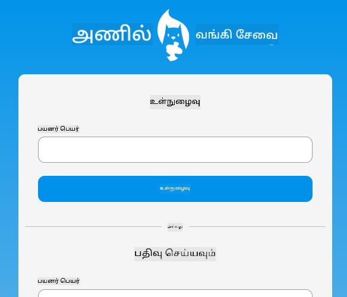
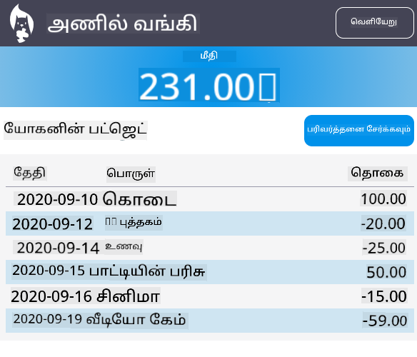

<!--
CO_OP_TRANSLATOR_METADATA:
{
  "original_hash": "830359535306594b448db6575ce5cdee",
  "translation_date": "2025-10-11T12:01:05+00:00",
  "source_file": "7-bank-project/README.md",
  "language_code": "ta"
}
-->
# :dollar: வங்கி உருவாக்கம்

இந்த திட்டத்தில், நீங்கள் ஒரு கற்பனை வங்கியை உருவாக்குவது எப்படி என்பதை கற்றுக்கொள்வீர்கள். இந்த பாடங்கள் ஒரு வலை பயன்பாட்டை அமைப்பது மற்றும் வழிகள் வழங்குவது, படிவங்களை உருவாக்குவது, நிலையை நிர்வகிப்பது, மற்றும் API-இல் இருந்து வங்கியின் தரவுகளை பெறுவது போன்ற வழிமுறைகளை உள்ளடக்கியது.

|  |  |
|--------------------------------|--------------------------------|

## பாடங்கள்

1. [HTML டெம்ப்ளேட்கள் மற்றும் வலை பயன்பாட்டில் வழிகள்](1-template-route/README.md)
2. [உள்நுழைவு மற்றும் பதிவு படிவத்தை உருவாக்குங்கள்](2-forms/README.md)
3. [தரவை பெறும் மற்றும் பயன்படுத்தும் முறைகள்](3-data/README.md)
4. [நிலை மேலாண்மை கருத்துக்கள்](4-state-management/README.md)

### நன்றிகள்

இந்த பாடங்கள் :hearts: உடன் [யோகன் லாசோர்சா](https://twitter.com/sinedied) மூலம் எழுதப்பட்டவை.

இந்த பாடங்களில் பயன்படுத்தப்படும் [சர்வர் API](/7-bank-project/api/README.md) உருவாக்குவது எப்படி என்பதை கற்றுக்கொள்ள நீங்கள் [இந்த வீடியோ தொடர்](https://aka.ms/NodeBeginner) (குறிப்பாக 17 முதல் 21 வரை的视频) பின்பற்றலாம்.

நீங்கள் [இந்த இன்டர்ஆக்டிவ் Learn டுடோரியல்](https://aka.ms/learn/express-api) ஐயும் பார்க்கலாம்.

---

**அறிவிப்பு**:  
இந்த ஆவணம் [Co-op Translator](https://github.com/Azure/co-op-translator) என்ற AI மொழிபெயர்ப்பு சேவையை பயன்படுத்தி மொழிபெயர்க்கப்பட்டுள்ளது. நாங்கள் துல்லியத்திற்காக முயற்சிக்கிறோம், ஆனால் தானியங்கி மொழிபெயர்ப்புகளில் பிழைகள் அல்லது தவறுகள் இருக்கக்கூடும் என்பதை கவனத்தில் கொள்ளவும். அதன் சொந்த மொழியில் உள்ள மூல ஆவணம் அதிகாரப்பூர்வ ஆதாரமாக கருதப்பட வேண்டும். முக்கியமான தகவல்களுக்கு, தொழில்முறை மனித மொழிபெயர்ப்பு பரிந்துரைக்கப்படுகிறது. இந்த மொழிபெயர்ப்பைப் பயன்படுத்துவதால் ஏற்படும் எந்த தவறான புரிதல்களுக்கும் அல்லது தவறான விளக்கங்களுக்கும் நாங்கள் பொறுப்பல்ல.