# குறியீட்டு நிரலாக்கி பயன்படுத்துவது: VSCode.dev க்கான சிறந்த பயிற்சி

*தி மாட்ரிக்ஸ்* திரைப்படத்தில் நீயோ ஒரு பெரிய கணினி முனையத்துடன் இணைக்கப்பட்டு டிஜிட்டல் உலகத்தை அணுகினதை நினைவிருக்கிறதா? இன்றைய வலை வளர்ச்சி கருவிகள் அது மாறான கதை – எங்கிருந்தும் அணுகக்கூடிய அற்புதமான திறன்கள். VSCode.dev என்பது உலாவியில் இயங்கும் குறியீட்டு நிரலாக்கி, இணைய இணைப்புடன் எந்த சாதனத்திலும் தொழில்முறை வளர்ச்சி கருவிகளை கொண்டுவரும்.

புத்தக அச்சிடும் எந்திரம் அவசியம் இல்லாமல் பொதுமக்களுக்கு புத்தகங்களை கொண்டு வந்ததைப்போல், VSCode.dev குறியீட்டினை பொது மக்களுக்கு உரிமையாக்குகிறது. நூலக கணினி, பள்ளி ஆய்வகம் அல்லது உலாவி கிடைக்கும் எங்கும் நீங்கள் பணியாற்ற முடியும். ஏதுமில்லை நிறுவற்புகளும், “எனக்கு எனது தனியுரிமை அமைப்பு வேண்டும்” என்ற வரம்புகளும்.

இந்த பாடத்தின் முடிவில், நீங்கள் VSCode.dev ஐ எவ்வாறு பாவிக்க செல்லுவது, உலாவியில் நேரடியாக GitHub சேமிப்பகங்களை திறந்து பணியாற்றுவது, மற்றும் பதிப்பு கட்டுப்பாட்டிற்கான Git பயன்பாட்டை புரிந்துகொள்வீர்கள் – இவை தொழில்முறை வளர்ப்பாளர்கள் தினசரி பயன்படுத்தும் திறன்கள்.

## ⚡ அடுத்த 5 நிமிடங்களில் நீங்கள் செய்யக்கூடியவை

**பிஸி வளர்ப்பாளர்களுக்கான விரைவு துவக்கம்**


- **நிமிடம் 1**: [vscode.dev](https://vscode.dev)க்கு செல் – நிறுவல் தேவையில்லை
- **நிமிடம் 2**: உங்கள் GitHub கணக்கில் உள்நுழைந்து சேமிப்பகங்களை இணை
- **நிமிடம் 3**: URL மோசடி முயற்சி செய்: எந்த repos URLயிலும் `github.com` ஐ `vscode.dev/github` ஆக மாற்று
- **நிமிடம் 4**: புதிய கோப்பை உருவாக்கு, உருவாக்கும் போது பாங்கு வண்ணமயமாகிறது
- **நிமிடம் 5**: மாற்றம் செய்யவும் Source Control பலகையில் இருந்து commit செய்

**விரைவு சோதனை URL**:
```
# Transform this:
github.com/microsoft/Web-Dev-For-Beginners

# Into this:
vscode.dev/github/microsoft/Web-Dev-For-Beginners
```

**ஏன் இது முக்கியம்**: 5 நிமிடத்தில் நீங்கள் எங்கிருந்து வேண்டுமானாலும் தொழில்முறை கருவிகளுடன் குறியீட்டை உருவாக்கும் சுதந்திரத்தை அனுபவிப்பீர்கள். இது வளர்ச்சியின் எதிர்காலத்தை குறிக்கும் – அணுகக்கூடியது, சக்திவாய்ந்தது, உடனடி.

## 🗺️ மேகம் அடித்த வளர்ச்சி பயணம்

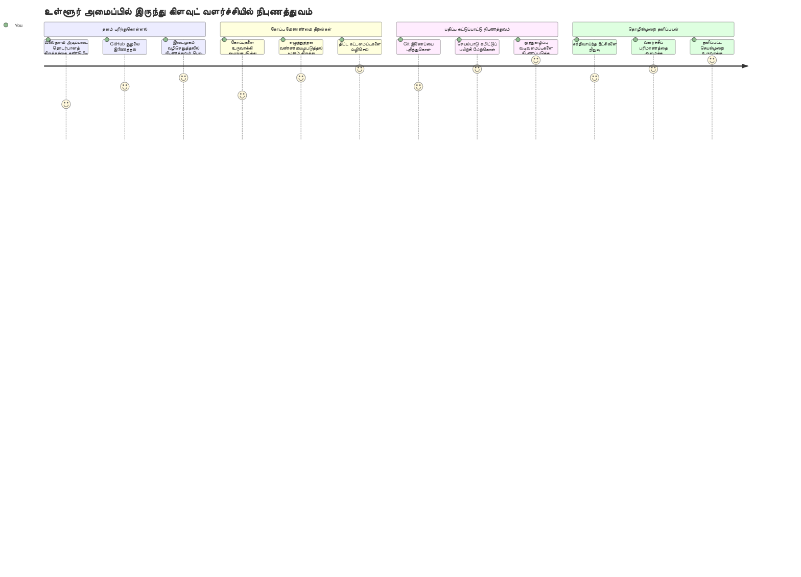
**உங்கள் பயண இலக்கு**: இந்த பாடத்தின் முடிவில், நீங்கள் தொழில்முறை மேகம் அடித்த வளர்ச்சி சூழலை முழுமையாக கையாளக்கூடியவர் ஆகி இருக்கும், அது எந்த சாதனத்திலும் வேலை செய்யும், பெரிய தொழில் நிறுவனங்களில் பயன்படுத்தப்படும் கருவிகளுடன் குறியீடு செய்வதற்கு உதவும்.

## நீங்கள் கற்றுக்கொண்டிட போகும் விஷயங்கள்

கூடுகாட்டி பின்பற்றுவதற்கு பிறகு, நீங்கள் முடியும்:

- VSCode.dev இல் இரண்டாம் வீட்டுப்போல் வழிசெல்ல – தேவைப்படும் அனைத்தையும் இழந்துவிடாமல் கண்டுபிடி
- எந்த GitHub சேமிப்பகத்தையும் உலாவியில் திறந்து உடனடியாக திருத்த ஆரம்பி (இது அதிசயகரமானது!)
- Git பயன்படுத்தி உங்கள் மாற்றங்களை கண்காணித்து முன்னேற்றத்தை பாதுகாப்பது
- விருப்ப விரிவாக்கங்களுடன் உங்கள் நிரலாக்கியை வேகமாகவும் மகிழ்ச்சியுடனும் மாற்று
- திட்ட கோப்புகளை நம்பிக்கையுடன் உருவாக்க மற்றும் அழகு செய்ய

## உங்களிடம் என்ன தேவை

தேவைகள் வெறும் சில:

- ஒரு இலவச [GitHub கணக்கு](https://github.com) (தேவையானால் உருவாக்க வழிகாட்டுவோம்)
- வலை உலாவிகளுக்கு அடிப்படை அறிவு
- GitHub அடிப்படைகள் பாடம் பயனுள்ளதாக இருக்கும், ஆனால் அவசியமில்லை

> 💡 **GitHub புதியவரா?** கணக்கு உருவாக்குவது இலவசம் மற்றும் சில நிமிடங்களில் முடியும். நூலக அட்டை போல உலகக் நூலகங்களில் புத்தகம் வாசிப்பதற்கு அனுமதி தருவது போல, GitHub கணக்கு இணையத்தின் முழுவதும் உள்ள குறியீட்டு சேமிப்பகங்களை அணுக உதவும்.

## 🧠 மேகம் அடித்த வளர்ச்சி சூழல் அறிமுகம்

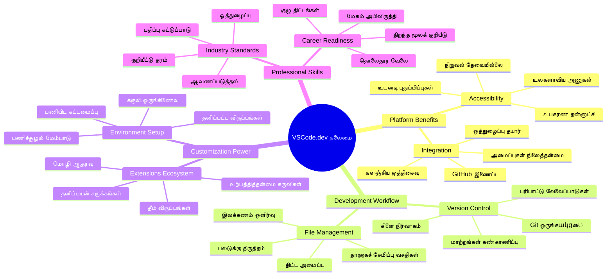
**முக்கியக் கொள்கை**: மேகம் அடித்த வளர்ச்சி சூழல்கள் குறியீட்டின் எதிர்காலம் – தொழில்முறை கருவிகள் அணுகக்கூடியவை, ஒத்துழைப்புடையவை, மற்றும் தளங்களின் அடிப்படையில் இல்லாதவை.

## இணைய அடிப்படை குறியீட்டு நிரலாக்கிகள் ஏன் அவசியம்

இணையம் இன்றி, பல பல்கலைக் கழக ஆய்வாளர்கள் எளிதில் ஆராய்ச்சி பகிரவில்லை. பின்னர் 1960களில் ARPANET தோன்றினது,தொலை விலான கணினிகளை இணைத்தது. இணைய அடிப்படையிலான குறியீட்டு நிரலாக்கிகள் அதே கொள்கையை பின்பற்றுகின்றன – சக்திவாய்ந்த கருவிகளை எந்த இடத்தில் நீங்கள் இருந்தாலும் கொண்டு வருவது.

ஒரு குறியீட்டு நிரலாக்கி, உங்கள் வளர்ச்சி பணிக்கிடையாக செயல்படுகிறது, இதில் குறியீட்டை நீங்கள் எழுத, திருத்த, மற்றும் கோப்புகளை ஒழுங்குபடுத்தலாம். எளிய உரை நிரலாக்கிகளுக்கு மாறாக, தொழில்முறை குறியீட்டு நிரலாக்கிகள் பாங்கு வண்ணமயக்கவும், பிழை கண்டறியும் மற்றும் திட்ட மேலாண்மை அம்சங்கள் வழங்குகின்றன.

VSCode.dev இந்த சக்திகளை உலாவியில் கொண்டு வருகிறது:

**இணைய அடிப்படை திருத்தம் மூல விளைவுகள்:**

| அம்சம் | விளக்கம் | நடைமுறை நன்மை |
|---------|-------------|----------|
| **தள பரிசுத்தன்மை** | உலாவியுள்ள எந்த சாதனத்திலும் இயங்கும் | வித்தியாசமான கணினிகளிலிருந்து சாதகமான வேலை |
| **நிறுவல் தேவையில்லை** | இணைய URL மூலம் அணுகும் | மென்பொருள் நிறுவலைத் தவிர்க்கும் |
| **தானியங்கி புதுப்பிப்புகள்** | எப்போதும் சமீபத்திய பதிப்பு இயங்கும் | புதிய அம்சங்களை கைமுறையாக புதுப்பிக்க வேண்டாம் |
| **சேமிப்பக ஒருங்கிணைப்பு** | நேரடி GitHub கூடை | உள்ளூர் கோப்புகள் இல்லாமல் குறியீடு திருத்தவும் |

**நடைமுறை விளைவுகள்:**
- வித்தியாசமான சூழல்களில் வேலை தொடர்ச்சி
- இயங்கு முறை இல்லாமல் ஒரே மைய இடைமுகம்
- உடனடி ஒத்துழைப்பு திறன்
- குறைவான உள்ளூர் சேமிப்பு தேவை

## VSCode.dev ஐ ஆராய்ச்சி

மேரி கியூரி ஆய்வகத்தில் சிக்கலான கருவிகள் இருந்தபோலும், VSCode.dev ஒரு உலாவி இடைமுகத்தில் தொழில்முறை வளர்ச்சி கருவிகளை அழுத்துகிறது. இந்த இணைய செயலி மேசை குறியீட்டு நிரலாக்கிகளின் அதே அடிப்படையான செயல்திறனை வழங்குகிறது.

உலாவியில் [vscode.dev](https://vscode.dev) ஐ திறந்து தொடங்கு. இடைமுகம் பதிவிறக்கம் அல்லது அமைப்பு இல்லாமல் ஏற்றப்படும் – மேகம் கணினி கொள்கையின் நேரடி அலகு.

### உங்கள் GitHub கணக்குடன் இணைப்பு

அலெக்சாண்டர் கிராஹாம் பெல்லின் தொலைபேசி தொலைதூரங்களை இணைத்த போல, உங்கள் GitHub கணக்கை இணைப்பது VSCode.dev மற்றும் உங்கள் குறியீட்டு சேமிப்பகங்களை இணைக்கும் பாலம் ஆகும். GitHub உடன் உள்நுழைவதற்கான அழைப்பை நீங்கள் ஏற்கவும் பரிந்துரைக்கப்படுகிறது.

**GitHub ஒருங்கிணைப்பு வழங்குகிறது:**
- நிரலாக்கியில் உங்கள் சேமிப்பகங்களுக்கு நேரடி அணுகல்
- சாதனங்களுக்கு தாண்டி ஒருங்கிணைந்த அமைப்புகள் மற்றும் விரிவாக்கங்கள்
- GitHubக்கு சேமிப்புத் திட்டத்தின் ஒருங்கிணைந்த வேலைநெறி
- தனிப்பட்ட வளர்ச்சி சூழல்

### உங்கள் புதிய பணிக்கிடையை அறிதல்

எல்லாம் ஏற்றப்பட்டதும், நீங்கள் அழகாக சுத்தமான ஒரு பணிக்கிடையை பார்வையிடுவீர்கள், இது உங்களை உங்கள் குறியீடுங்கு கவனம் செலுத்த எளிதாக்கும்!

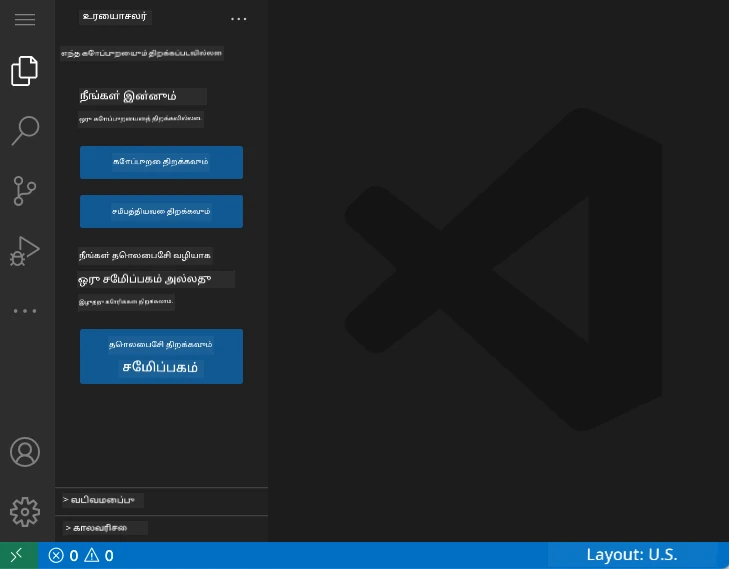

**கார்த்திடம் சுற்றியபடியே:**
- **செயற்பாட்டு பட்டை** (இடதுபுறம் பட்டை): முக்கியத் திசைநிலை, Explorer 📁, Search 🔍, Source Control 🌿, Extensions 🧩, மற்றும் Settings ⚙️ உள்ளது
- **பக்கவட்டம்** (அதனுடன் அடுத்த பக்கம்): நீங்கள் தேர்ந்தெடுத்துள்ளதை வைத்து தொடர்புடைய தகவலை காட்டும்
- **நிரலாக்க மண்டலம்** (நடுத்தர பகுதி): இங்கே மந்திரம் நடக்கும் – உங்கள் முக்கிய குறியீட்டு பகுதி

**சற்று நேரம் செலுத்து ஆராய:**
- செயற்பாட்டு பட்டை ஐகான்களை எட்டு கிளிக் செய்து செயல்பாட்டை பார்
- பக்கவட்டம் எண்ணற்ற தகவல்களை மாற்றிக் காட்டுவதை கவனித்துப் பார் – அருமை!
- Explorer பார்வை (📁) தான் நீங்கள் அதிக நேரம் செலவிடும் இடம், அதற்கு பழகிக் கொள்ளுங்கள்

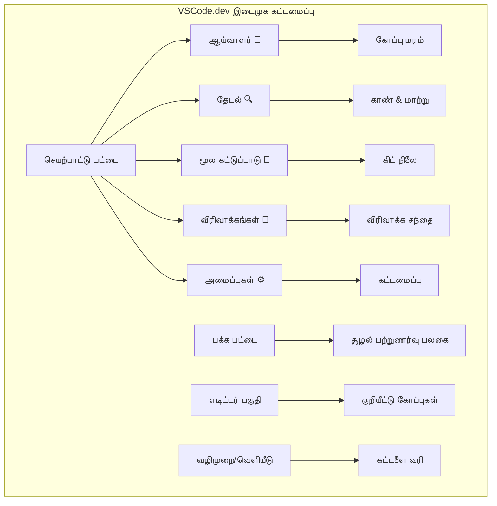
## GitHub சேமிப்பகங்களை திறக்குதல்

இணையம் இன்றி முன்பு ஆய்வாளர்கள் நூலகங்களுக்கு பயணம் செய்து ஆவணங்களை அணுகுங்கள். GitHub சேமிப்பகங்கள் அதே போல – தொலைத்தில் சேமிக்கப்பட்ட குறியீடு தொகுப்புகள். VSCode.dev அந்தப் பழைய பாரம்பரிய வழியை தவிர்க்கிறது, உள்ளூரில் பதிவிறக்காமே திருத்த அனுமதிக்கிறது.

இந்த திறன், எந்த பொது சேமிப்பகத்தையும் உடனடியாக பார்வை, திருத்தம் அல்லது பங்களிப்பதற்கு வழி செய்கிறது. சேமிப்பகங்களை திறக்கும் இரண்டு முறைகள்:

### முறை 1: கிளிக் செய்து திறக்கல்

VSCode.dev இல் புதியபடையாக இருந்து ஒரு குறிப்பிட்ட சேமிப்பகத்தை திறக்க இது சிறந்தது. எளிமையானதும் துவக்கத்திற்கானதும்:

**இங்கே செய்முறை:**

1. [vscode.dev](https://vscode.dev)ல் போவதற்கு
2. வரவேற்பு திரையில் "Open Remote Repository" பொத்தானை காணவும் கிளிக் செய்யவும்

   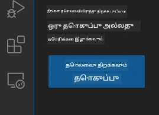

3. எந்த GitHub சேமிப்பக URLயை வேண்டுமானாலும் ஒட்டவும் (உதாரணம்: `https://github.com/microsoft/Web-Dev-For-Beginners`)
4. Enter அழுத்தி மாயத்தை பாருங்கள்!

**திறமையான குறிப்பு - கட்டளை பட்டி சுருக்கம்:**

ஒரு குறியீட்டு குருவாக உணர விரும்புகிறீர்களா? இக் கீபோர்டு சுருக்கத்தை முயற்சி: Ctrl+Shift+P (அல்லது Macஇல் Cmd+Shift+P) கட்டளை பட்டி திறக்கும்:

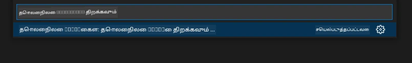

**கட்டளை பட்டி உங்கள் எல்லா செயல்களுக்கும் தேடுபொறி போல:**
- "open remote" என நுழைக்கும் போது தொடர்புடைய சேமிப்பகம் திறப்பு காட்டும்
- சமீபத்தில் திறந்த சேமிப்பகங்களை நினைவில் வைக்கின்றது (மிக உதவிகரமாக உள்ளது!)
- பயன்படுத்த பழகினால் இறைவேம்போல் குறியீடு எழுதும் உணர்வு
- இது VSCode.dev இன் "ஹே Siri, குறியீட்டிற்கு" பதிப்பு

### முறை 2: URL மாற்றுவது

HTTP மற்றும் HTTPS protocol மாறுவது போல், VSCode.dev URL வடிவம் GitHub முகவரியை பிரதிபலிக்கும். எந்த GitHub சேமிப்பகம் URLயும் VSCode.dev இல் நேரடியாக திறக்க மாற்ற முடியும்.

**URL மாற்ற மாதிரி:**

| சேமிப்பக வகை | GitHub URL | VSCode.dev URL |
|----------------|---------------------|----------------|
| **பொது சேமிப்பகம்** | `github.com/microsoft/Web-Dev-For-Beginners` | `vscode.dev/github/microsoft/Web-Dev-For-Beginners` |
| **தனிப்பட்ட திட்டம்** | `github.com/your-username/my-project` | `vscode.dev/github/your-username/my-project` |
| **எந்த தரவுக்கூடம்** | `github.com/their-username/awesome-repo` | `vscode.dev/github/their-username/awesome-repo` |

**விளக்கம்:**
- `github.com`  ஐ `vscode.dev/github` ஆக மாற்று
- மற்ற URL பகுதிகள் மாற்றாதே
- எந்த பொது சேமிப்பகத்திலும் வேலை செய்கிறது
- உடனடி திருத்த பயன்பாடு தருகிறது

> 💡 **உயிர் மாற்றும் சலுகை**: உங்கள் விருப்பமான சேமிப்பகங்களின் VSCode.dev பதிப்புகளை புத்தகமாக்குங்கள். என் புத்தகங்களில் "என் போர்ட்ஃபோலியோ திருத்து" மற்றும் " ஆவண திருத்து" போன்றவை உள்ளன, நேரடியாக திருத்துகளுக்கு போக!

**எந்த முறையை பயன்படுத்தலாம்?**
- **இடைமுகம் வழி**: நீங்கள் ஆராய்வதற்கோ அல்லது சரியான சேமிப்பக பெயர்கள் நினைவில்லாதபோது சிறந்தது
- **URL பாவனை**: எங்கே செல்லவென்று தெரிந்துவிட்டால் வேகமாக அனுக

### 🎯 கல்வி சோதனை: மேகம் அடிப்படையிலான அணுகல்

**சிந்தனை இடுங்கவும்**: நீங்கள் இணைய உலாவியில் குறியீட்டு சேமிப்பகங்களை திறக்கும் இரண்டு முறைகளை கற்றுக்கொண்டீர்கள். இது வளர்ச்சியில் இயல்பான மாற்றம்.

**விரைவான சரிபார்ப்பு:**
- இணைய அடிப்படை திருத்தம் "வளர்ச்சி சூழல் அமைப்பு" தேவையை எவ்வாறு அகற்றுகிறது?
- URL மாற்ற முறை உள்ளூர் git க்ளோனுக்கு காட்டிலும் என்ன நன்மையை வழங்குகிறது?
- இந்த அணுகல் திறந்த மூல திட்டங்களில் பங்களிப்பை எப்படி மாற்றும்?

**உண்மை உலக இணைப்பு**: GitHub, GitLab, Replit போன்ற நிறுவனங்கள் இந்த மேகம் முதன்மையிலான கொள்கைகளில் தங்கள் வளர்ச்சி தளங்களை கட்டியுள்ளன. இவை தொழில்முறை வளர்ச்சி அணிகளின் வேலைப்பாடுகளை நீங்கள் கற்று வருகிறீர்கள்.

**சவால் கேள்வி**: மேகம் அடித்த வளர்ச்சி பள்ளிகளில் குறியீடு கற்றலை எப்படி மாற்றலாம்? சாதன தேவைகள், மென்பொருள் மேலாண்மை மற்றும் ஒத்துழைப்பு வாய்ப்புகளை கவனியுங்கள்.

## கோப்புகள் மற்றும் திட்டங்களுடன் பணியாற்றுதல்

சேமிப்பகம் திறந்துவிட்டதுபோல், ஆரம்பிக்கலாம்! VSCode.dev உங்களுக்கு தேவையான அனைத்தையும் கொடுக்கிறது – குறியீட்டு கோப்புகளை உருவாக்க, திருத்த, ஒழுங்குபடுத்து. உங்கள் டிஜிட்டல் கனவு தொழிற்சாலையாக இது இருக்கிறது – தேவையான கருவிகள் எல்லாம் அருகில் இருக்கும்.

வாராந்திர பணிகளின் அடிப்படையான வேலைகளுக்கு ஆகையா நுழைக.

### புதிய கோப்புகளை உருவாக்குதல்

வடிவமைப்பாளரின் அலுவலகத்தில் வரைபடங்கள் கட்டமைப்பது போல, VSCode.dev இல் கோப்புகளை உருவாக்க கூர்மையான முறையில் நடந்து கொள்ளிறது. அனைத்து வழக்கமான வலை வளர்ச்சி கோப்புச் சுருக்கங்களையும் இது ஆதரிக்கிறது.

**கோப்பு உருவாக்கம் பணிகள்:**

1. Explorer பக்கவட்டத்தில் இலக்கு கோப்புறைக்கு செல்லவும்
2. கோப்புறையின் பெயருக்குத் தெறிக்கும் போது “புதிய கோப்பு” ஐகானை காணவும் (📄+)
3. கோப்பின் பெயர் மற்றும் சரியான நீட்சியை உள்ளீடு செய்க (`style.css`, `script.js`, `index.html`)
4. Enter அழுத்தி கோப்பை உருவாக்கவும்

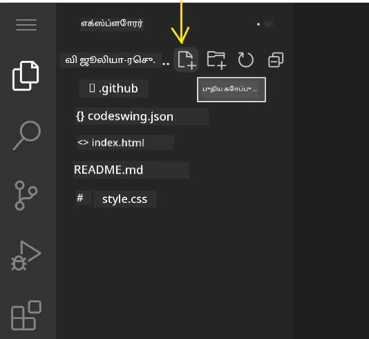

**பெயரிடல் நடைமுறைகள்:**
- கோப்பின் குறிக்கோளை வெளிப்படுத்தும் விளக்கமான பெயர்கள் வையுங்கள்
- சரியான பாங்கு வண்ண மயக்கும் நீட்சிகள் அடங்கும்
- முழு திட்டம் முழுவதும் ஒருங்கிணைந்த பெயரிடல்
- இடைவெளி பதிலாக சிறிய எழுத்துக்கள் மற்றும் - பாவனை

### கோப்புகளை திருத்தி சேமிக்கும்

இங்கே உண்மையான பொழுது தொடங்குகிறது! VSCode.dev தொகுப்பாளர் உதவிகளுடன் நுட்பமான மற்றும் நிவாரணமிக்க நிரலாக்க அனுபவத்தை வழங்குகிறது. இது உங்கள் குறியீட்டு உதவியாளராகிய ஒரு போல.

**திருத்த செய்யும் செயற்பாடு:**

1. Explorer இல் எந்த கோப்பும் கிளிக் செய்து முக்கிய பகுதியில் திற
2. எழுத ஆரம்பித்து நீ விசுப்படம், பரிந்துரைகள் மற்றும் பிழை கண்டறிதல் அனுபவிக்க
3. Ctrl+S (Windows/Linux) அல்லது Cmd+S (Mac) மூலம் ஏற்றவும் – தானாக சேமிப்பும் உள்ளது!

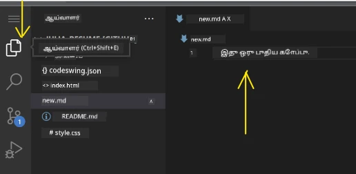

**நீ குறியீடு எழுதும் போது நடக்கும் அற்புதங்கள்:**
- குறியீடு அழகான நிறம் கொண்டது, வாசிக்க எளிது
- VSCode.dev எழுதும் போது முடிப்புகளை பரிந்துரைக்கும் (ஆட்டோ கரெக்ட் போல், ஆனால் நுண்ணறிவு)
- நீங்கள் சேமிக்க பொதவாக பிழைகள் மற்றும் துண்டுகளைக் கண்டறியும்
- பல கோப்புகளை உலாவித் தாவல்களில் திறந்து வைக்க முடியும்
- எல்லாம் பின்னணியில் தானாக சேமிக்கப்படுகிறது

> ⚠️ **விரைவான குறிப்பு**: தானாக சேமிப்பும் இருந்தாலும் Ctrl+S அல்லது Cmd+S அழுத்துவது நல்ல பழக்கம். அது உடனடி சேமிப்பையும் பிழை சரிபார்ப்பையும் செயல்படுத்துகிறது.

### Git உடன் பதிப்பு கட்டுப்பாடு

பண்டைய பிஷாப்புகள் ஆய்வு பரப்புகளின் விவரக் குறிப்புகளை உருவாக்கியபோல், Git உங்கள் குறியீடு மாற்றங்களை காலமாக கண்காணிக்க உதவுகிறது. இது திட்ட வரலாற்றை பாதுகாக்கும் மற்றும் தேவையான போது முன் பதிப்புகளுக்கு திரும்ப உதவும். VSCode.dev ஒருங்கிணைக்கப்பட்ட Git அம்சத்துடன் வருகிறது.

**Source Control இடைமுகம்:**

1. செயற்பாட்டு பட்டையில் உள்ள 🌿 ஐக்கானை கிளிக்கவும்
2. மாற்றிய கோப்புகள் "Changes" பகுதியில் காணப்படும்
3. நிறம் மூலம் மாற்றவகைகள் குறிக்கப்படும்: பசுமை சேர்க்கைகள், சிவப்பு அகற்றல்கள்

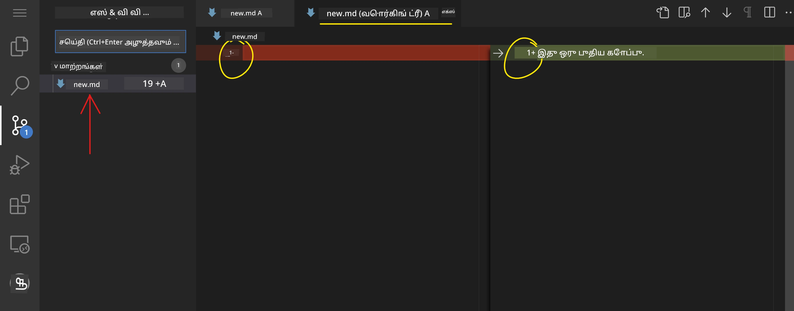

**உங்கள் பணியை சேமிக்கும் (commit பணிகளின் வேலைநெறி):**

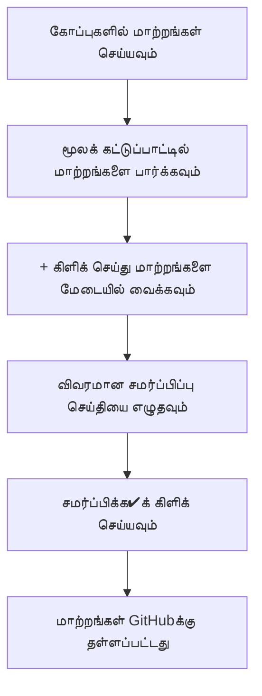
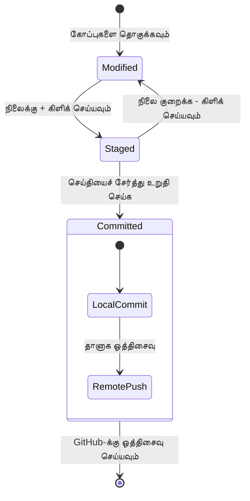
**உங்கள் படி படியாக செயல்முறை:**
- நீங்கள் சேமிக்க வேண்டிய கோப்புகளின் பக்கத்துள்ள "+" ஐக்கானை கிளிக் செய்க (இது "நிலைக்கு கொண்டுவருதல்" ஆகும்)
- நீங்கள் அனைத்து சேமிப்புக்கான மாற்றங்களையும் சரிபார்த்து மகிழ்ச்சியாயிருக்கிறீர்கள் என்பதை இருமுறை சரிபார்க்கவும்
- நீங்கள் என்ன செய்தீர்கள் என்று விளக்க ஒரு குறுகிய குறிப்பு எழுதுங்கள் (இது உங்கள் "கமிட் மெசேஜ்")
- அனைத்தையும் GitHub-க்கு சேமிக்க சரிபார்க்கும் பட்டனை கிளிக் செய்யவும்
- நீங்கள் ஏதாவது கருத்தை மாற்றினால், இடைநீக்கம் ஐகான் மாற்றங்களை நிராகரிக்க உதவும்

**சிறந்த கமிட் மெசேஜ்களை எழுதுவது (இது நீங்கள் நினைக்கும் அளவிற்கு கடினமல்ல!):**
- நீங்கள் என்ன செய்தீர்கள் என்பதை மட்டும் விவரிக்கவும், உதாரணமாக "Add contact form" அல்லது "Fix broken navigation"
- குறுகியதும் இனிமையானதும் ஆக்கவும் – ஒரு ட்வீட் அளவு, ஒரு கட்டுரை போல அல்ல
- "Add", "Fix", "Update", அல்லது "Remove" போன்ற செயல்பாட்டு சொல்ல்களால் தொடங்கவும்
- **நல்ல உதாரணங்கள்**: "Add responsive navigation menu", "Fix mobile layout issues", "Update colors for better accessibility"

> 💡 **விரைவான வழிசெலுத்தும் குறிப்பு**: உங்கள் GitHub சேமிப்பு வீட்டுக்கு திரும்பவும் உங்கள் கணினி சூழல் மற்றும் திட்ட இடத்தை இணைக்கும் வழி போல உள்ள ☐ ஹாம்பர்கர் மெனு (☰) மேலே இடது பக்கத்தில் உள்ளது!

## நீட்டிப்புகளுடன் செயல்பாட்டை மேம்படுத்தல்

ஓர் கைவினையாளர் பணியகம் பல்வேறு பணிகளுக்கான சிறப்பு கருவிகள் கொண்டதுபோல், VSCode.dev ஐ குறிப்பிட்ட திறன்களைச் சேர்க்கும் நீட்டிப்புகளுடன் தனிப்பயனாக்க முடியும். இந்த சமூகவளேற்றப்பட்ட பிளகின்கள் பொதுவான வளர்ச்சி தேவைகளை, உதாரணமாக கோட் வடிவமைப்பு, நேரடி முன்னிலைப்படுத்தல் மற்றும் மேம்பட்ட Git ஒருங்கிணைப்பை தீர்க்கின்றன.

நீட்டிப்பு சந்தை உலகெங்கும் உள்ள டெவலப்பர்களால் உருவாக்கப்பட்ட ஆயிரக்கணக்கான இலவச கருவிகளை தாங்குகிறது. ஒவ்வொரு நீட்டிப்பும் குறிப்பிட்ட வேலைப்பாட்டு சவால்களை தீர்க்கும், உங்களுக்கு தனிப்பயனாக்கப்பட்ட வளர்ச்சி சூழலை கட்டமைப்பதற்கு உதவுகிறது.

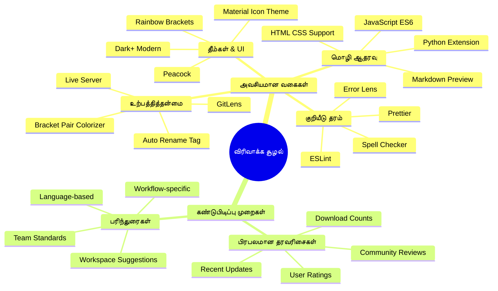
### உங்கள் சிறந்த நீட்டிப்புகளை கண்டறிதல்

நீட்டிப்பு சந்தை முற்போக்காக ஒழுங்குபடுத்தப்பட்டுள்ளதால், நீங்கள் தேவைப்படும் ஒன்றை தேடியீர்கள் என்றால் தவறாமல் அது எளிதாகக் காணலாம். இது குறிப்பிட்ட கருவிகள் மற்றும் நீங்கள் அறிந்திருக்க கூடாத குளிர்ந்த சின்னங்களை கண்டுபிடிக்க உதவுகிறது!

**சந்தைக்கு செல்லும் வழி:**

1. செயல்பாட்டு பட்டியில் உள்ள நீட்டிப்பு ஐகானை (🧩) கிளிக் செய்யவும்
2. சுற்றி பார்க்கவும் அல்லது ஏதாவது சிறப்பான ஒன்றை தேடவும்
3. ஆர்வமான ஒன்றை தேர்ந்தெடுக்கவும் அதன் விவரங்களை அறிய

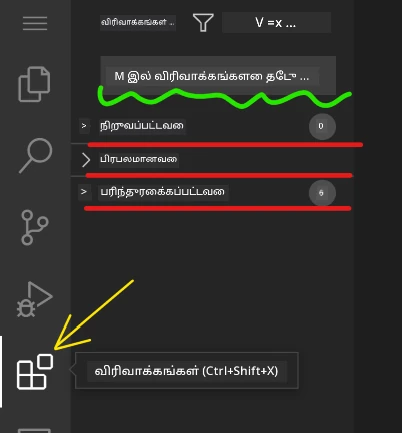

**அங்கு நீங்கள் காணப்போகும் விஷயங்கள்:**

| பகுதி | உள்ளடக்கம் | உதவிகரமானவை |
|----------|---------|----------|
| **நிறுவப்பட்டவை** | நீங்கள் ஏற்கனவே சேர்த்த நீட்டிப்புகள் | உங்கள் தனிப்பட்ட குறியீட்டு கருவி |
| **பிரபலமானவை** | பொதுமக்களின் விருப்பங்கள் | பெரும்பாலும் டெவலப்பர்கள் நம்பும் |
| **பரிந்துரைக்கபட்டவை** | உங்கள் திட்டத்துக்கு புத்திசாலி பரிந்துரைகள் | VSCode.dev வழங்கும் உதவிகள் |

**உலகளவில் எளிதாக்கம்:**
- ஒவ்வொரு நீட்டிப்பும் மதிப்பீடுகள், பதிவிறக்கம் எண்ணிக்கை, மற்றும் யாவற்றின் பயனர் விமர்சனங்களை காட்டும்
- ஒவ்வொருவருக்கும் படங்கள் மற்றும் தெளிவான விளக்கங்கள் கிடைக்கும்
- எல்லாம் பொருந்தக்கூடிய தகவல்களுடன் தெளிவாக குறிக்கப்பட்டுள்ளது
- ஒத்த நீட்டிப்புகள் பரிந்துரைக்கப்படுகின்றன, நீங்கள் விருப்பங்களை ஒப்பிடலாம்

### நீட்டிப்புகளை நிறுவுதல் (இது மிக எளிமையானது!)

உங்கள் தொகுப்பாளருக்கு புதிய திறன்களைச் சேர்ப்பது ஒரு பொத்தானை அழுத்துவதுதான். நீட்டிப்புகள் சில விநாடிகளில் நிறுவப்பட்டு உடனே செயல்பட்டு தொடங்குகின்றன – மீண்டும் துவக்கமோ காத்திருக்குமோ தேவையில்லை.

**செய்ய வேண்டியது:**

1. நீங்கள் விரும்பும் ஒன்றைத் தேடுங்கள் ("live server" அல்லது "prettier" என தேட முயற்சிக்கவும்)
2. ஆர்வமாக தோன்றும் ஒன்றை தேர்ந்தெடுத்து மேல் விவரங்களைப் பார்வையிடவும்
3. அது என்ன செய்கிறது என வாசித்து மதிப்பீடுகளை பார்வையிடவும்
4. நீலம் நிற "Install" பொத்தானை அழுத்தி முடித்துவிடவும்!


**பின்னணியில் நடக்கும் நிகழ்வுகள்:**
- நீட்டிப்பு தானாகத் தரவிறக்கப்பட்டு அமைக்கப்படுகிறது
- புதிய அம்சங்கள் உடனே உங்கள் முகப்பில் தோன்றும்
- உடனான செயல்பாட்டுடன் (மிக வேகமானது!)
- நீங்கள் உள்நுழைந்திருந்தால், நீட்டிப்பு அனைத்து சாதனங்களுடனும் ஒத்திசைவு செய்யும்

**நான் பரிந்துரைக்கும் சில நீட்டிப்புகள்:**
- **Live Server**: நீங்கள் கோடீடு செய்யும் போது உங்கள் தளம் நேரத்தில் புதுப்பிக்கிறது (இது ஜாதுக்களத்துக்குரியது!)
- **Prettier**: உங்கள் குறியீட்டை தானாக சுத்தமாக மற்றும் தொழில்முறை தோற்றமாக மாற்றுகிறது
- **Auto Rename Tag**: ஒரு HTML குறியீட்டை மாற்றினால் அதன் இணைப்பு தானாக மாற்றம் பெறும்
- **Bracket Pair Colorizer**: உங்கள் முடிச்சுகளுக்கு வண்ணம் பார்க்க வசதியாக்கிறது
- **GitLens**: உங்களுக்கு பிரத்யேகமான பல உதவி தகவல்களுடன் Git இயல்புகளை மேம்படுத்துகிறது

### உங்கள் நீட்டிப்புகளை தனிப்பயனாக்குதல்

பல நீட்டிப்புகள் நீங்கள் விரும்பும் முறையில் செயல்பட அமைப்புகளை கொண்டுள்ளன. இது கார் இருக்கை மற்றும் கண்ணாடிகளை சரிசெய்யும் சிந்தனையைப் போல் – ஒவ்வொருவருக்கும் தனிப்பட்ட விருப்பங்கள் உள்ளன!

**நீட்டிப்பு அமைப்புகளை மாற்றுக:**

1. நீட்டிப்புகள் போர்ட்டலில் உங்கள் நிறுவப்பட்ட நீட்டிப்பை கண்டுபிடிக்கவும்
2. அதன் பெயருக்கு அருகில் உள்ள சிறிய குழாய் ஐகானை (⚙️) தேடவும் மற்றும் கிளிக் செய்யவும்
3. "Extension Settings" ஐத் தேர்ந்தெடுக்கவும்
4. உங்கள் வேலைப்பாட்டுக்கு பொருந்தும் வரை மாற்றங்கள் செய்யவும்

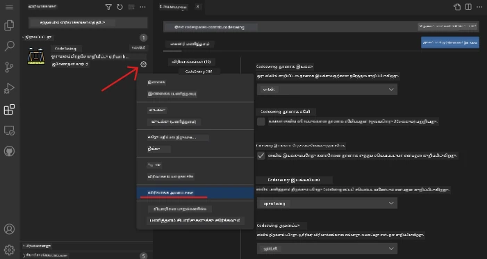

**மாதிரியான அமைப்புகள்:**
- உங்கள் குறியீடு எப்படி வடிவமைக்கப்படுகிறது (Tabs vs Spaces, வரி நீளம், மற்றும் போன்றவை)
- பட்டன்களை ஒருங்கிணைக்கும் விசைப் பண்புகள்
- நீட்டிப்பு எந்த கோப்புகள் வகைகளுடன் வேலை செய்ய வேண்டும்
- சுத்தமாக வைத்திருக்க சிறப்பு அம்சங்களை இயக்கல் அல்லது முடக்கு

### நீட்டிப்புகளை ஒழுங்குபடுத்தல்

மிகவும் குளிர்ந்த நீட்டிப்புகளை கண்டுபிடித்து, உங்கள் தொகுப்பை சீரான நிலையில் வைத்திருக்க விரும்புவீர்கள். VSCode.dev இதை மிக எளிதாக்கியுள்ளது.

**நீட்டிப்பு மேலாண்மை விருப்பங்கள்:**

| நீங்கள் செய்யக்கூடியது | எப்போது உதவிகரமாக இருக்கும் | சிறந்த யுக்தி |
|--------|---------|----------|
| **மூடல்** | ஒரு நீட்டிப்பு சிக்கலை உண்டாக்குகிறதா என்று சோதிக்க | நீக்கம் செய்யாமல் வைக்க சிறந்தது |
| **நீக்கம்** | தேவையில்லாத நீட்டிப்புகளை முற்றிலும் அகற்ற | உங்கள் சூழலை சுத்தமாகவும் வேகமாகவும் வைத்திருக்கும் |
| **புதுப்பித்தல்** | சமீபத்திய அம்சங்கள் மற்றும் பிழை திருத்தங்களைப் பெற | பொதுவாக தானாக நடைபெறும், ஆனாலும் சரிபார்க்கவும் |

**நான் நீட்டிப்புகளை நிர்வகிப்பது:**
- சில மாதங்களுக்கு ஒரு முறை இன்ஸ்டால் செய்தவற்றை பரிசீலித்து பயன்படாததை அகற்றுகிறேன்
- எல்லா நீட்டிப்புகளும் புதுப்பிக்கிறேன், புதிய அம்சங்கள் மற்றும் பாதுகாப்பு திருத்தங்கள் கிடைக்கும்
- எதையாவது மெதுவானதாக இருந்தால், அந்த நீட்டிப்பை தற்காலிகமாக முடக்கி சோதிப்பேன்
- பெரிய புதுப்பிப்புகளில் உள்ள மாற்றங்களையும் புதிய அம்சங்களையும் வாசிப்பேன்

> ⚠️ **செயல்திறன் குறிப்பு**: நீட்டிப்புகள் அருமை, ஆனால் பல அதிகமாக இருந்தால் மெதுவாக்கலாம். உங்களுக்கு நேர்மையான உதவியளிப்பவைகளைக் கவனியுங்கள், பயனற்றவற்றை நீக்க இருந்து பயப்பட வேண்டாம்.

### 🎯 கல்விப் பரிசீலனை: வளர்ச்சி சூழலின் தனிப்பயனாக்கல்

**முப்பாடு புரிதல்**: சமூகவழியாக உருவாக்கப்பட்ட நீட்டிப்புகளைப் பயன்படுத்தி தொழில்முறை வளர்ச்சி சூழலை தனிப்பயனாக்க கற்றுக்கொண்டீர்கள். இது நிறுவன வளர்ச்சி குழுக்களும் பயன்படுத்தும் சீரமைப்பு கருவித்தளங்களைக் காட்டுகிறது.

**முக்கிய கருத்துக்கள்:**
- **நீட்டிப்பு கண்டுபிடிப்பு**: குறிப்பிட்ட வளர்ச்சி சவால்களை தீர்க்கும் கருவிகளை கண்டறிதல்
- **சூழல் அமைப்பு**: தனிப்பட்ட அல்லது குழு விருப்பங்களுக்கு கருவிகளை ஏற்படுத்தல்
- **செயல்திறன் மேம்பாடு**: செயல்பாடு மற்றும் அமைப்பு செயல்திறனை சமநிலைப்படுத்தல்
- **சமூகவிழா கூட்டாண்மை**: உலகளாவிய டெவலப்பர் சமூகவால் உருவாக்கப்பட்ட கருவிகள்

**தொழில் தொடர்பு**: நீட்டிப்பு சூழல்கள் VS Code, Chrome DevTools, மற்றும் நவீன IDEகளுக்கு முக்கியமான வளர்ச்சி தளங்கள். நீட்டிப்புகளை மதிப்பீடு செய்து நிறுவுவதும் அமைப்பதும் தொழில்முறை வளர்ச்சி பணிச்சூழல்களுக்கு அவசியம்.

**பின்விளைவு கேள்வி**: 10 டெவலப்பர் குழுவிற்கு பொதுவான வளர்ச்சி சூழலை எப்படி அமைத்துக்கொள்ள விருப்பமாயிருக்கிறீர்கள்? ஒருங்கிணைப்பு, செயல்திறன் மற்றும் தனிப்பட்ட விருப்பங்களை கருத்தில் கொள்ளவும்.

## 📈 உங்கள் மேகம் அடிப்படையுடைய வளர்ச்சி நிபுணத்துவ காலவரிசை

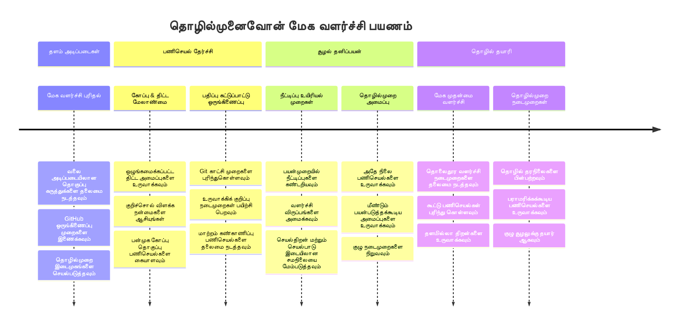
**🎓 பட்டம் பெறும் அங்கம்**: தொழில்முறை டெவலப்பர்கள் பயன்படுத்தும் இதே கருவிகள் மற்றும் பணிச்சூழல்களைப் பயன்படுத்தி மேகவழி வளர்ச்சியில் நீங்கள் சாதனை சூட்டியுள்ளீர்கள். இவை மென்பொருள் வளர்ச்சியின் எதிர்காலத்தை அங்கீகரிக்கும்.

**🔄 அடுத்த நிலை திறன்கள்**:
- மேம்பட்ட மேகவழி வளர்ச்சி தளங்களை (Codespaces, GitPod) ஆராய தயாராக இருக்கிறீர்கள்
- பரவலாகப் பகிரப்பட்ட வளர்ச்சி குழுக்களில் பணியாற்ற தயாராக இருக்கிறீர்கள்
- உலகளாவிய திறந்த மூல திட்டங்களுக்கு பங்களிக்கத் தயாராக இருக்கிறீர்கள்
- நவீன DevOps மற்றும் தொடர்ச்சியான ஒருங்கிணைவு நடைமுறைகளுக்கு அடித்தளத்தை வைத்துள்ளீர்கள்

## GitHub Copilot முகவர் சவாலை 🚀

NASA விண்வெளி அதிரட்டுகளை நிர்வகிப்பது போல அமைந்த முறையில், இந்த சவால் VSCode.dev திறன்களை முழுமையான பணிச்சூழலில் தொழில்திறன் காட்டுகிறது.

**நோக்கம்:** VSCode.dev-ஐ திறமையாக பயன்படுத்தி முழுமையான இணைய வளர்ச்சி பணிச்சூழலை நிறுவுதல்.

**திட்ட தேவைகள்:** முகவர் முறையைக் கொண்டு பின்வரும் பணிகளை செய்து முடிக்கவும்:
1. ஒருவழி இருக்கும் சேமிப்பிடத்தை கிளோன்செய் அல்லது புதியதாய்ச் சீரமைக்கவும்
2. HTML, CSS மற்றும் JavaScript கோப்புகளுடன் செயல்படும் திட்ட கட்டமைப்பை நிறுவவும்
3. வளர்ச்சியை மேம்படுத்தும் மூன்று நீட்டிப்புகளை நிறுவி அமைக்கவும்
4. விளக்கமான கமிட் செய்திகளுடன் பதிப்பு கட்டுப்பாட்டை பயிற்சி செய்யவும்
5. அம்ச கிளைகளையும் உருவாக்கி மாற்றங்களை செய்யவும்
6. README.md கோப்பில் செயல்முறை மற்றும் கற்றல்கள் எழுதவும்

இந்த பயிற்சி VSCode.dev கருத்துக்களை ஓர் நடைமுறை பணிச்சூழலில் ஒருங்கிணைக்கிறது.

மேலும் அறிய [agent mode](https://code.visualstudio.com/blogs/2025/02/24/introducing-copilot-agent-mode).

## பணிகளுக்கான தவணை

இந்த திறன்களை உண்மையான சூழலில் தேர்ச்சி பெறும் விதமாக பயன்படுத்துங்கள்! நான் ஒரு வேலை திட்டம் கொண்டுள்ளேன், அது நீங்கள் கற்ற உங்கள் அனைத்தையும் நடைமுறையில் செய்ய உதவும்: [VSCode.dev பயன்படுத்தி ஒரு தொழில்முறை ਰெஸ்யூம் இணையதளம் உருவாக்கவும்](./assignment.md)

இந்த பணியில் உங்கள் உலாவியில் முழுமையாக தொழில்முறை ரெஸ்யூம் இணையதளத்தை உருவாக்க படி நடக்கும். நீங்கள் அனைத்து VSCode.dev அம்சங்களையும் பயன்படுத்தப் போகிறீர்கள், இறுதியில் அழகானதான மற்றும் நம்பகமான இணையதளம் பெறுவீர்கள்.

## தொடர்ந்தும் ஆராய்ந்து உங்கள் திறன்களை வளர்த்துக்கொள்ளுங்கள்

நீங்கள் ஒரு வலுவான அடித்தளத்தை பெற்றுள்ளீர்கள், ஆனால் இன்னும் குளிர்ந்தவை நிறைய இருக்கின்றன! உங்கள் VSCode.dev திறன்களை அடுத்த கட்டத்திற்கு கொண்டு செல்ல சில வளங்களும் யோசனைகளும்:

**அதிகாரம் பெற்ற ஆவணங்கள்:**
- [VSCode வலை ஆவணங்கள்](https://code.visualstudio.com/docs/editor/vscode-web?WT.mc_id=academic-0000-alfredodeza) – உலாவியில் அடிப்படையிலான திருத்தத்துக்கு முழு கையேடு
- [GitHub Codespaces](https://docs.github.com/en/codespaces) – மேகத்தில் கூடுதலான சக்தி தேவையானபோது

**பின்பு முயற்சிக்க சிறந்த அம்சங்கள்:**
- **விசைக்குறிப்புகள்**: குறியீடு நிஞ்ஜாவாக உணர்த்தும் முக்கிய திறமைகள்
- **வேலைப்பாசறை அமைப்புகள்**: வெவ்வேறு வகை திட்டங்களுக்கு வேறுபட்ட சூழல்கள் அமைப்பது
- **பல ரூட் வேலைப்பாசறைகள்**: ஒரே நேரத்தில் பல சேமிப்பிடங்களில் பணியாற்றுதல் (மிகவும் பயனுள்ளது!)
- **டெர்மினல் ஒருங்கிணைப்பு**: உலாவியிலேயே கட்டளை வரிசை கருவிகள் அணுக

**பயிற்சி யோசனைகள்:**
- திறந்த மூல திட்டங்களில் பங்கேற்று VSCode.dev பயன்படுத்தி உதவுங்கள் – தரமான பங்களிப்பு!
- வெவ்வேறு நீட்டிப்புகளை முயற்சி செய்து உங்கள் சிறந்த அமைப்பை கண்டறியவும்
- நீங்கள் பெரும்பாலும் கட்டும் தளங்கள் மாதிரி திட்ட வார்ப்புருக்களை உருவாக்கவும்
- கிளைவு மற்றும் இணைப்பு போன்ற Git பணிச்சூழல் முறைகளை பயிற்சி செய்யவும் – குழு திட்டங்களில் இது தங்கம் போலவும்

---

**நீங்கள் உலாவி அடிப்படையிலான வளர்ச்சியில் தேர்ச்சி பெற்றுள்ளீர்கள்!** 🎉 போக்குவரத்து சாதனங்கள் கண்டுபிடிக்கப்பட்டதால் விஞ்ஞானிகள் தொலைவு இடங்களில் ஆய்வு செய்ததைப் போல, VSCode.dev இணைய இணைப்புடைய எந்த சாதனத்திலிருந்தும் தொழில்முறை குறியீட்டுத் திறனை வழங்குகிறது.

இந்த திறன்கள் தற்போதைய தொழில் நடைமுறைகளைக் காட்டுகின்றன – பல தொழில்முறை டெவலப்பர்கள் தந்திரக் கூடிய அணுகல் மற்றும் சுருக்கமான படைப்புத் திறனுக்காக மேகவழி வளர்ச்சி சூழல்களைப் பயன்படுத்துகின்றனர். நீங்கள் தனிப்பட்ட திட்டங்களிலிருந்து பெரிய குழு ஒத்துழைப்புக்கு வரைக்கும் பரப்பளவை கூடிய நடைமுறையை கற்றுக்கொண்டீர்கள்.

அடுத்த வளர்ச்சி திட்டத்தில் இந்த நுட்பங்களைப் பயன்படுத்துங்கள்! 🚀

---

<!-- CO-OP TRANSLATOR DISCLAIMER START -->
**நினைவூட்டல்**:  
இந்த ஆவணம் AI மொழி மாற்று சேவை [Co-op Translator](https://github.com/Azure/co-op-translator) மூலம் மொழி மாற்றப்பட்டுள்ளது. நாங்கள் துல்லியத்துக்காக முயற்சித்தாலும், தானாகவே செய்யப்பட்ட மொழி மாற்றங்களில் தவறுகள் அல்லது பிழைகள் ஏற்படலாம் என்பதை தயவுசெய்து கவனிக்கவும். உள்ளூர் மொழியில் உள்ள அடிப்படையான ஆவணம் அதிகாரபூர்வ ஆதாரமாக கருதப்பட வேண்டும். முக்கியமான தகவல்களுக்கு, தொழில்முறை மனித மொழிபெயர்ப்பு பரிந்துரைக்கப்படுகிறது. இந்த மொழி மாற்றத்தின் பயன்பாட்டினால் உண்டாகும் ஏதேனும் தவறான புரிதல்கள் அல்லது தவறுணர்வுகளுக்கு நாம் பொறுப்பேற்கவில்லை.
<!-- CO-OP TRANSLATOR DISCLAIMER END -->