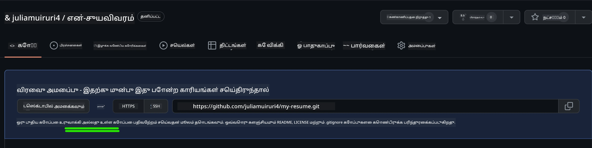
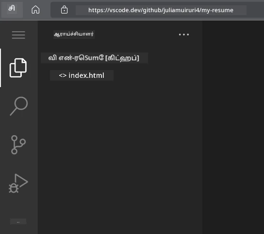
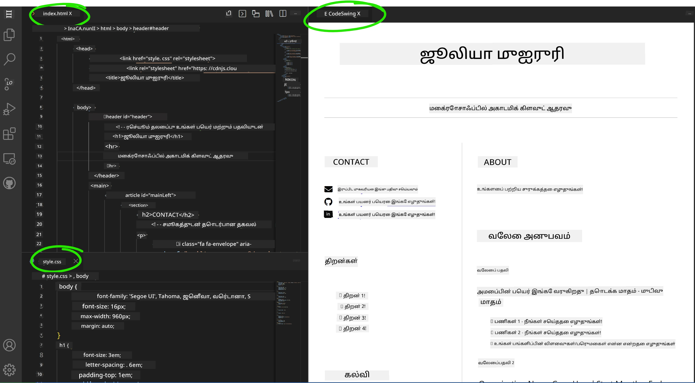

# VSCode.dev பயன்படுத்தி ஒரு ரெசுமே வலைத்தளத்தை உருவாக்கவும்

உங்கள் திறன்கள் மற்றும் அனுபவத்தை கோர்த்துக்காட்டும், பரிணாமம் மிகுந்த, நவீன வடிவில் ஒரு தொழில்முறை ரெசுமே வலைத்தளத்தை உருவாக்கி உங்கள் தொழில் வாய்ப்புகளை மாற்றி அமைக்கவும். பாரம்பரிய PDF கோப்புகளை அனுப்புவதற்கு பதிலாக, பணியமர்த்துநர்களுக்கு தகுதிகள் மற்றும் உங்கள் வலை மேம்பாட்டு திறன்களை காட்டும் சுருக்கு, பதிலளிக்கும் வலைத்தளத்தை வழங்குவதை கற்பனை செய்யவும்.

இந்த கைமுறைப் பணிக்கான பணிகள் உங்களுடைய VSCode.dev திறன்களை முழுமையாக பயன்படுத்த ஊக்குவிக்கிறது, மேலும் உங்கள் உலாவியில் உட்பட, சேமிப்பகம் உருவாக்குதல் முதல் வெளியீடு வரை முழுமையான வலை மேம்பாட்டு பணிமுறைபாட்டைப் பெறுவீர்கள்.

இந்த திட்டத்தை நிறைவு செய்தவுடன், உங்களுக்கு தொழில்முறை ஆன்லைன் உருவம் கிடைக்கும், அதை சாத்தியமான பணியாளர்களுடன் எளிதில் பகிரலாம், உங்கள் திறன்கள் வளர்ந்தால் புதுப்பிக்கலாம், நேர்த்தியான தனிப்பட்ட பிராண்ட்டுக்கு ஏற்ப அமைக்கலாம். இதுவே உண்மையான உலக வலை மேம்பாட்டு திறன்களை வெளிப்படுத்தும் நடைமுறைத் திட்டம்.

## கற்றல் இலக்குகள்

இந்த பணியை முடித்த பிறகு, நீங்கள் מסוגலாக முடியும்:

- **VSCode.dev** பயன்படுத்தி முழுமையான வலை மேம்பாட்டு திட்டத்தை உருவாக்கவும் மற்றும் பராமரிக்கவும்
- அரசியல் HTML உறுப்புகள் கொண்டு தொழில்முறை வலைத்தளத்தை **உருவாக்கவும்**
- நவீன CSS தொழில்நுட்பங்களுடன் பதிலளிக்கும் வடிவமைப்பினை **அழகு படுத்தவும்**
- அடிப்படை வலை தொழில்நுட்பங்களை பயன்படுத்தி பரிணாம அம்சங்களை **இயக்கு**
- பகிரக்கூடிய URL மூலம் அணுகக்கூடிய நேரடி வலைத்தளத்தை **வெளியிடவும்**
- மேம்பாட்டுப் பணியில் பதிப்புக் கட்டுப்பாட்டின் சிறந்த நடைமுறைகளை **திருவிழிக்கவும்**

## முன்னோடிகள்

இந்த பணியைத் தொடங்குவதற்கு முன், சோதனை செய்யவும்:

- GitHub கணக்கு (தயவு செய்து [github.com](https://github.com/) இல் கணக்கொன்றை உருவாக்கவும்)
- VSCode.dev பாட நெறியின் இடைமுகக் வழிசென்று அடிப்படைக் செயல்பாடுகள் முடித்தல்
- HTML கட்டமைப்பு மற்றும் CSS அழகுபடுத்தல் கருத்துக்களை அடிப்படையிலான புரிதல்

## திட்ட அமைப்பு மற்றும் சேமிப்பகம் உருவாக்கல்

உங்கள் திட்டத்தின் அடித்தளத்தை அமைக்க தொடங்குவோம். இந்த செயல்முறை எவ்வாறு திட்டங்கள் எளிய சேமிப்பகத் துவக்கம் மற்றும் கட்டுமான திட்டமிடுதலுடன் ஆரம்பிக்கப்படுகின்றன என்பதைக் காட்டுகிறது.

### படி 1: GitHub சேமிப்பகத்தை உருவாக்கவும்

ஒரு அர்ப்பணிக்கப்பட்ட சேமிப்பகம் அமைத்தல் உங்கள் திட்டம் சரியான வகையில் ஒழுங்குபடுத்தப்பட்டு பதிப்புக் கட்டுப்பாட்டுக்குள் இருப்பதை உறுதிசெய்கிறது.

1. **[GitHub.com](https://github.com) இல் உள்நுழைக**
2. மேல் வலப்புறம் காணப்படும் பச்சை "New" பொத்தானை அல்லது "+" ஐ கிளிக் செய்யவும்
3. உங்கள் சேமிப்பகத்திற்கு `my-resume` என்று பெயர்criptive்றுக (அல்லது உங்கள் விருப்பப்படி `john-smith-resume` போன்ற தனிப்பட்ட பெயர்)
4. சுருக்கமான விளக்கம் சேர்க்கவும்: "HTML மற்றும் CSS கொண்டு செய்யப்பட்ட தொழில்முறை ரெசுமே வலைத்தளம்"
5. "பொது" என்பதைக் தேர்வு செய்து உங்கள் ரெசுமே பணியாளர்களுக்கு அணுகக்கூடியதாக்கவும்
6. "README கோப்பை சேர்க்கு" என்பதை தேர்வுசெய்க
7. அமைப்பை நிறைவு செய்ய "Create repository" கிளிக் செய்யவும்

> 💡 **சேமிப்பகம் பெயரிடல் அறிவுரை**: திட்டத்தின் நோக்கத்தை தெளிவாக குறிக்கிற வீடியான மற்றும் தொழில்முறைமான பெயர்களைப் பயன்படுத்தவும். இது பணியாளர்களுடன் பகிரும்போது அல்லது போர்ட்போலியோ மதிப்பாய்வுகளில் உதவும்.

### படி 2: திட்ட கட்டுமானத்தை தொடங்கு

VSCode.dev நிறுவுதலில் குறைந்தது ஒரு கோப்பு தேவை என்பதால், முதலில் GitHub இல் உங்கள் முதன்மை HTML கோப்பை உருவாக்குவோம், பின்னர் வலைத் தொகுப்பிலே மாற்றுவோம்.

1. புதிய சேமிப்பகத்தில் "creating a new file" இணைப்பை கிளிக் செய்யவும்
2. கோப்புப் பெயராக `index.html` எனத் தட்டச்சு செய்யவும்
3. இந்த ஆரம்ப HTML கட்டுமானத்தைக் சேர்க்கவும்:

```html
<!DOCTYPE html>
<html lang="en">
<head>
    <meta charset="UTF-8">
    <meta name="viewport" content="width=device-width, initial-scale=1.0">
    <title>Your Name - Professional Resume</title>
</head>
<body>
    <h1>Your Name</h1>
    <p>Professional Resume Website</p>
</body>
</html>
```

4. "Add initial HTML structure" என கமிட் செய்தலை எழுது
5. "Commit new file" கிளிக் செய்து மாற்றங்களைச் சேமிக்கவும்



**இந்த ஆரம்ப அமைப்பு எதை நிறைவேற்றுகிறது:**
- உரிய HTML5 ஆவண கட்டமைப்பை அரசியல் உறுப்புகளுடன் **உருவாக்குகிறது**
- பதிலளிக்கும் வடிவமைப்புக்கான viewport meta தகுதியை உள்ளடக்குகிறது
- உலாவி டாப்களில் காணப்படும் விளக்கமான பக்கம் தலைப்பை அமைக்கிறது
- தொழில்முறை உள்ளடக்கம் ஏற்பாடு செய்ய அடித்தளத்தை உருவாக்குகிறது


## VSCode.dev இல் பணியாற்றுதல்

இப்போது உங்கள் சேமிப்பகம் அடித்தளம் தயாரும், முதன்மை மேம்பாட்டு பணிக்காக VSCode.dev இல் மாற்றுவோம். இந்த வலை அடிப்படையிலான தொகுப்பியில் தொழில்முறை வலை மேம்பாட்டிற்கு தேவையான அனைத்து கருவிகளும் உள்ளன.

### படி 3: VSCode.dev இல் உங்கள் திட்டத்தை திறக்கவும்

1. புதிய உலாவி தாவலில் [vscode.dev](https://vscode.dev) செல்லவும்
2. வரவேற்பு திரையில் "Open Remote Repository" கிளிக் செய்யவும்
3. GitHub இல் உங்கள் சேமிப்பக URLஐ நகலெடுத்து உள்ளீட்டுப் புலத்தில் ஒட்டவும்

   வடிவம்: `https://github.com/your-username/my-resume`
   
   *`your-username` என்பதற்கு உங்கள் GitHub பயனர் பெயரை மாற்றவும்*

4. Enter தட்டவும் மற்றும் உங்கள் திட்டத்தை ஏற்றவும்

✅ **வெற்றி குறியியல்**: உங்கள் திட்ட கோப்புகள் எக்ஸ்ப்ளோரரில் மற்றும் `index.html` முதன்மை தொகுப்பியில் திருத்தத்திற்கு கிடைக்கும்.



**இந்த இடைமுகத்தில் நீங்கள் பார்க்கும் விஷயங்கள்:**
- **எக்ஸ்ப்ளோரர் பக்கவுரு**: சேமிப்பகம் கோப்புகள் மற்றும் கோப்புறை அமைப்பை காட்சிப்படுத்தும்
- **தொகுப்பாய்வு பகுதி**: தேர்ந்தெடுக்கப்பட்ட கோப்புகளின் உள்ளடக்கத்தை திருத்தக் காட்டும்
- **செயற்பாட்டு பட்டை**: மூலக் கட்டுப்பாடு மற்றும் நீட்டிப்புக்கள் போன்ற அம்சங்களுக்கு அணுகல்
- **நிலைக் பட்டை**: இணைப்பு நிலை மற்றும் தற்போதைய கிளைப் பற்றிய தகவல்

### படி 4: உங்கள் ரெசுமே உள்ளடக்கத்தை உருவாக்கவும்

`index.html` இல் உள்ள இடமதிப்புகளை முழுமையான ரெசுமே கட்டமைப்பால் மாற்றவும். இந்த HTML உங்கள் தகுதிகளை தொழில்முறை முறையில் முன்னிறுத்தும் அடித்தளம்.

<details>
<summary><b>முழுமையான HTML ரெசுமே கட்டமைப்பு</b></summary>

```html
<!DOCTYPE html>
<html lang="en">
<head>
    <meta charset="UTF-8">
    <meta name="viewport" content="width=device-width, initial-scale=1.0">
    <link href="style.css" rel="stylesheet">
    <link rel="stylesheet" href="https://cdnjs.cloudflare.com/ajax/libs/font-awesome/5.15.4/css/all.min.css">
    <title>Your Name - Professional Resume</title>
</head>
<body>
    <header id="header">
        <h1>Your Full Name</h1>
        <hr>
        <p class="role">Your Professional Title</p>
        <hr>
    </header>
    
    <main>
        <article id="mainLeft">
            <section>
                <h2>CONTACT</h2>
                <p>
                    <i class="fa fa-envelope" aria-hidden="true"></i>
                    <a href="mailto:your.email@domain.com">your.email@domain.com</a>
                </p>
                <p>
                    <i class="fab fa-github" aria-hidden="true"></i>
                    <a href="https://github.com/your-username">github.com/your-username</a>
                </p>
                <p>
                    <i class="fab fa-linkedin" aria-hidden="true"></i>
                    <a href="https://linkedin.com/in/your-profile">linkedin.com/in/your-profile</a>
                </p>
            </section>
            
            <section>
                <h2>SKILLS</h2>
                <ul>
                    <li>HTML5 & CSS3</li>
                    <li>JavaScript (ES6+)</li>
                    <li>Responsive Web Design</li>
                    <li>Version Control (Git)</li>
                    <li>Problem Solving</li>
                </ul>
            </section>
            
            <section>
                <h2>EDUCATION</h2>
                <h3>Your Degree or Certification</h3>
                <p>Institution Name</p>
                <p>Start Date - End Date</p>
            </section>
        </article>
        
        <article id="mainRight">
            <section>
                <h2>ABOUT</h2>
                <p>Write a compelling summary that highlights your passion for web development, key achievements, and career goals. This section should give employers insight into your personality and professional approach.</p>
            </section>
            
            <section>
                <h2>WORK EXPERIENCE</h2>
                <div class="job">
                    <h3>Job Title</h3>
                    <p class="company">Company Name | Start Date – End Date</p>
                    <ul>
                        <li>Describe a key accomplishment or responsibility</li>
                        <li>Highlight specific skills or technologies used</li>
                        <li>Quantify impact where possible (e.g., "Improved efficiency by 25%")</li>
                    </ul>
                </div>
                
                <div class="job">
                    <h3>Previous Job Title</h3>
                    <p class="company">Previous Company | Start Date – End Date</p>
                    <ul>
                        <li>Focus on transferable skills and achievements</li>
                        <li>Demonstrate growth and learning progression</li>
                        <li>Include any leadership or collaboration experiences</li>
                    </ul>
                </div>
            </section>
            
            <section>
                <h2>PROJECTS</h2>
                <div class="project">
                    <h3>Project Name</h3>
                    <p>Brief description of what the project accomplishes and technologies used.</p>
                    <a href="#" target="_blank">View Project</a>
                </div>
            </section>
        </article>
    </main>
</body>
</html>
```
</details>

**தனிப்பயனாக்கும் வழிகாட்டல்கள்:**
- அனைத்து இடமதிப்பு உரைகளையும் உங்கள் உண்மையான தகவல்களால் மாற்றவும்
- உங்கள் அனுபவ நிலை மற்றும் தொழில் திசையில் பொருந்துமாறு பகுதிகள் மாற்றிக் கொள்ளவும்
- தேவையானவை சேர்க்கவும் அல்லது அகற்றவும் (உதாரணம்: சான்றிதழ்கள், தன்னமர்வோர் வேலை, மொழிகள்)
- உங்கள் உண்மையான சுயவிவர மற்றும் திட்டங்களுக்கான இணைப்புகளை சேர்க்கவும்

### படி 5: ஆதரவு கோப்புகளை உருவாக்கவும்

தொழில்முறை வலைத்தளங்களுக்கு ஒருங்கிணைந்த கோப்பு அமைப்புகள் தேவை. முழுமையான திட்டத்திற்கு தேவையான CSS ஸ்டைல்ஷீட் மற்றும் கட்டமைப்பு கோப்புகளை உருவாக்கவும்.

1. எக்ஸ்ப்ளோரர் பக்கவுரலில் உங்கள் திட்ட கோப்புறை பெயரின் மேல் சிய.hover செய்யவும்
2. காணும் "New File" ஐகானை (📄+) கிளிக் செய்யவும்
3. கீழ்காணும் கோப்புகளை தானாக உருவாக்கவும்:
   - `style.css` (அழகுபடுத்தல் மற்றும் வடிவமைப்பிற்காக)
   - `codeswing.json` (முன்காட்சிப்படுத்தல் நீட்டிப்பு கட்டமைப்பு)

**CSS கோப்பு உருவாக்கல் (`style.css`):**

<details>
<summary><b>தொழில்முறை CSS அழகுபடுத்தல்</b></summary>

```css
/* Modern Resume Styling */
body {
    font-family: 'Segoe UI', Tahoma, Geneva, Verdana, sans-serif;
    font-size: 16px;
    line-height: 1.6;
    max-width: 960px;
    margin: 0 auto;
    padding: 20px;
    color: #333;
    background-color: #f9f9f9;
}

/* Header Styling */
header {
    text-align: center;
    margin-bottom: 3em;
    padding: 2em;
    background: linear-gradient(135deg, #667eea 0%, #764ba2 100%);
    color: white;
    border-radius: 10px;
    box-shadow: 0 4px 6px rgba(0, 0, 0, 0.1);
}

h1 {
    font-size: 3em;
    letter-spacing: 0.1em;
    margin-bottom: 0.2em;
    font-weight: 300;
}

.role {
    font-size: 1.3em;
    font-weight: 300;
    margin: 1em 0;
}

/* Main Content Layout */
main {
    display: grid;
    grid-template-columns: 35% 65%;
    gap: 3em;
    margin-top: 3em;
    background: white;
    padding: 2em;
    border-radius: 10px;
    box-shadow: 0 2px 10px rgba(0, 0, 0, 0.1);
}

/* Typography */
h2 {
    font-size: 1.4em;
    font-weight: 600;
    margin-bottom: 1em;
    color: #667eea;
    border-bottom: 2px solid #667eea;
    padding-bottom: 0.3em;
}

h3 {
    font-size: 1.1em;
    font-weight: 600;
    margin-bottom: 0.5em;
    color: #444;
}

/* Section Styling */
section {
    margin-bottom: 2.5em;
}

#mainLeft {
    border-right: 1px solid #e0e0e0;
    padding-right: 2em;
}

/* Contact Links */
section a {
    color: #667eea;
    text-decoration: none;
    transition: color 0.3s ease;
}

section a:hover {
    color: #764ba2;
    text-decoration: underline;
}

/* Icons */
i {
    margin-right: 0.8em;
    width: 20px;
    text-align: center;
    color: #667eea;
}

/* Lists */
ul {
    list-style: none;
    padding-left: 0;
}

li {
    margin: 0.5em 0;
    padding: 0.3em 0;
    position: relative;
}

li:before {
    content: "▸";
    color: #667eea;
    margin-right: 0.5em;
}

/* Work Experience */
.job, .project {
    margin-bottom: 2em;
    padding-bottom: 1.5em;
    border-bottom: 1px solid #f0f0f0;
}

.company {
    font-style: italic;
    color: #666;
    margin-bottom: 0.5em;
}

/* Responsive Design */
@media (max-width: 768px) {
    main {
        grid-template-columns: 1fr;
        gap: 2em;
    }
    
    #mainLeft {
        border-right: none;
        border-bottom: 1px solid #e0e0e0;
        padding-right: 0;
        padding-bottom: 2em;
    }
    
    h1 {
        font-size: 2.2em;
    }
    
    body {
        padding: 10px;
    }
}

/* Print Styles */
@media print {
    body {
        background: white;
        color: black;
        font-size: 12pt;
    }
    
    header {
        background: none;
        color: black;
        box-shadow: none;
    }
    
    main {
        box-shadow: none;
    }
}
```
</details>

**கட்டமைப்பு கோப்பு உருவாக்கல் (`codeswing.json`):**

```json
{
    "scripts": [],
    "styles": []
}
```

**CSS அம்சங்களைப் புரிந்துகொள்வது:**
- பதிலளிக்கும், தொழில்முறை வடிவமைப்பு க்கான CSS கிரிட் பயன்பாடு
- கிரேடியன்ட் தலைப்புகளுடன் நவீன நிற திட்டங்கள்
- நேரடி விளைவுகள் மற்றும் மென்மையான மாற்றங்களைக்கொண்ட ஹோவர் விளைவுகள்
- அனைத்து சாதன அளவுகளுக்கும் வேலை செய்யும் பதிலளிக்கும் வடிவமைப்பு
- PDF உருவாக்கத்திற்கு அச்சிட சக்திவாய்ந்த அமைப்புகள்


### படி 6: நீட்டிப்புகள் நிறுவுதல் மற்றும் கட்டமைத்தல்

நீட்டிப்புகள் உங்கள் மேம்பாட்டு அனுபவத்தை நேரடி முன்னோட்ட வசதிகள் மற்றும் மேம்பட்ட பணிமுறை கருவிகளால் அதிகரிக்கின்றன. CodeSwing நீட்டிப்பு வலை தொழில்முறைத் திட்டங்களுக்கு மிகவும் பயனுள்ளதாகும்.

**CodeSwing நீட்டிப்பை நிறுவுதல்:**

1. செயல்பாட்டுப் பட்டியில் (🧩) நீட்டிப்புகள் ஐகானை கிளிக் செய்யவும்
2. சந்தைத் தேடல் பொட்டியில் "CodeSwing" என தேடவும்
3. தேடல் முடிவுகளில் CodeSwing நீட்டிப்பை தேர்ந்தெடுக்கவும்
4. நீல "Install" பொத்தானை கிளிக் செய்யவும்


**CodeSwing வழங்கும் வசதிகள்:**
- தொகுக்கும்போது உங்கள் வலைத்தளத்தின் நேரடி முன்னோட்டை இயக்குக
- கைமுறையான புதுப்பிப்பின்றி மாற்றங்களை நேரடியாக காட்சிப்படுத்துக
- HTML, CSS மற்றும் ஜாவாஸ்கிரிப்ட் உள்ளிட்ட பல கோப்பு வகைகளை ஆதரிக்கிறது
- ஒருங்கிணைக்கப்பட்ட மேம்பாட்டு சூழல் அனுபவத்தை வழங்குகிறது

**நிறுவின்பின் உடனடியான விளைவுகள்:**
CodeSwing நிறுவப்பட்டவுடன், தொகுப்பாளரிலேயே உங்கள் ரெசுமே வலைத்தளத்தின் நேரடி முன்னோட்டை காட்டும். மாற்றங்களைச் செய்தபோது உங்கள் தளம் எப்படி தோன்றுகிறது என்பது தெளிவாக பார்க்க முடியும்.



**வளர்ந்த இடைமுகத்தைப் புரிந்து கொள்ள:**
- **வெட்டு காட்சியமைப்பு**: ஒரு பக்கத்தில் நீங்கள் எழுதும் குறியீடு மற்றும் மற்ற பக்கத்தில் நேரடி முன்னோட்டை காட்சி
- **நேரடி புதுப்பிப்புகள்**: தட்டச்சு செய்தவுடன் உடனான ஆப்டேட்கள்
- **பரிணாம முன்னோட்டை**: இணைப்புகள் மற்றும் தொடர்புகளை சோதிக்க உகந்தது
- **மொபைல் சிமுலேஷன்**: பதிலளிக்கும் வடிவமைத்தை சோதிக்கும் திறன்

### படி 7: பதிப்புக் கட்டுப்பாடு மற்றும் வெளியீடு

உங்கள் ரெசுமே வலைத்தளம் முடிந்தவுடன், Git ஐபயன்படுத்தி உங்கள் பணியை சேமித்து ஆன்லைனில் வெளியிடுங்கள்.

**மாற்றங்களை கமிட் செய்வது:**

1. செயல்பாட்டுப் பட்டியில் (🌿) மூலக் கட்டுப்பாடு ஐகானை கிளிக் செய்யவும்
2. நீங்கள் உருவாக்கிய மற்றும் மாற்றிய கோப்புகளை "Changes" பகுதியில் பரிசீலிக்கவும்
3. ஒவ்வொரு கோப்பின் பக்கத்தில் உள்ள "+" ஐகானை கிளிக் செய்து மாற்றங்களை நிலைப்படுத்தவும்
4. விளக்கமான கமிட் செய்தலை எழுதவும், உதாரணம்:
   - "பதிலளிக்கும் வடிவமைப்புடன் முழுமையான ரெசுமே வலைத்தளத்தை சேர்த்து"
   - "தொழில்முறை ஸ்டைலிங் மற்றும் உள்ளடக்க கட்டமைப்பை அமற்றல்"
5. ✓ (சரிபார்ப்பு) ஐகானை கிளிக் செய்து உங்கள் மாற்றங்களை கமிட் செய்து புஷ் செய்யவும்

**சிறந்த கமிட் செய்தல் மாதிரிகள்:**
- "தொழில்முறை ரெசுமே உள்ளடக்கம் மற்றும் ஸ்டைலிங் சேர்க்கப்பட்டது"
- "மொபைல் பொருத்தத்துக்கான பதிலளிக்கும் வடிவமைப்பு செயல்படுத்தப்பட்டது"
- "தொடர்பு தகவல்கள் மற்றும் திட்ட இணைப்புகள் புதுப்பிக்கப்பட்டன"

> 💡 **தொழில்முறை அறிவுரை**: நல்ல கமிட் செய்தல்கள் உங்கள் திட்டத்தின் வளர்ச்சியை பின்தொடரவும், சிறிய விபரங்களில் கவனம் செலுத்துகிறீர்கள் என்பதை நிரூபிக்கும் - இது பணியாளர்களுக்கு விருப்பமானது.

**பதிப்பிடப்பட்ட தளத்தை அணுகுதல்:**
கமிட் செய்த பிறகு, மேல்திரையில் இடது மூலமுகத்தில் உள்ள ஹாம்பர்கர் மெனு (☰) மூலம் GitHub சேமிப்பகத்திற்கு திரும்பலாம். உங்கள் ரெசுமே வலைத்தளம் பதிப்புக் கட்டுப்பாடுடன் தயாராக வெளியிடமுடியும் அல்லது பகிரப்படலாம்.

## முடிவுகள் மற்றும் அடுத்த படிகள்

**வாழ்த்துக்கள்! 🎉** நீங்கள் வெற்றிகரமாக VSCode.dev கொண்டு ஒரு தொழில்முறை ரெசுமே வலைத்தளத்தை உருவாக்கி முடித்துள்ளீர்கள். உங்கள் திட்டம் இதையை நிரூபிக்கிறது:

**தொழில்நுட்ப திறன்கள்:**
- **சேமிப்பகம் மேலாண்மை**: முழுமையான திட்ட கட்டமைப்பை உருவாக்கி ஒழுங்குபடுத்தியது
- **வலை மேம்பாடு**: நவீன HTML5 மற்றும் CSS3 பயன்படுத்தி பதிலளிக்கும் வலைதளத்தை உருவாக்கியது
- **பதிப்புக் கட்டுப்பாடு**: பொருத்தமான Git பணிமுறையை அமற்படுத்தியது
- **கருவி திறன்**: VSCode.dev இடைமுகமும் நீட்டிப்பு அமைப்பும் சிறப்பாக பயன்படுத்தப்பட்டது

**தொழில்முறை பெறுமதிகள்:**
- **ஆன்லைன் உருவம்**: உங்கள் தகுதிகளைக் காட்டும் பகிரக்கூடிய URL
- **நவீன வடிவம்**: பாரம்பரிய PDF ரெசுமே க்கு பதிலாக பரிணாம மாற்று
- **பிரமாணப்படுத்தப்பட்ட திறன்கள்**: உங்கள் வலை மேம்பாட்டு திறன்களுக்கான தெளிவான சான்று
- **எளிய புதுப்பிப்புகள்**: தொடர்ச்சியாக மேம்படுத்தவும் செம்மைப்படுத்தவும் செய்யக்கூடிய அடித்தளம்

### வெளியீடு விருப்பங்கள்

உங்கள் ரெசுமே பணியாளர்களுக்கு அணுகக்கூடியதாக பின்வரும் ஹோஸ்டிங் விருப்பங்களை பரிசீலிக்கவும்:

**GitHub Pages (பரவலாய் பரிந்துரைக்கப்படுகிறது):**
1. GitHub இல் உங்கள் சேமிப்பகம் அமைப்புகளுக்கு செல்லவும்
2. "Pages" பகுதியை கீழே இடம் பார்த்து செல்
3. "Deploy from a branch" தேர்ந்தெடுத்து "main" கிளையை தேர்வு செய்யவும்
4. உங்கள் தளம் `https://your-username.github.io/my-resume` இல் கிடைக்கும்

**மாற்று தளங்கள்:**
- **Netlify**: தானியங்கி வெளியீடு மற்றும் தனிப்பயன் டொமைன்கள்
- **Vercel**: நவீன ஹோஸ்டிங் அம்சங்களுடன் வேகமான வெளியீடு
- **GitHub Codespaces**: இடைமுக முன்னோட்டத்துடன் மேம்பாட்டு சூழல்

### மேம்பாட்டு பரிந்துரைகள்

உங்கள் திறன்களை வளர்க்க, கீழ்க்காணும் அம்சங்களைச் சேர்க்க முயற்சிக்கவும்:

**தொழில்நுட்ப மேம்பாடுகள்:**
- **JavaScript தகவல் பரிணாமம்**: மென்மையான ஸ்க்ரோல்லிங் அல்லது பரிணாம கூறுகள் சேர்க்கவும்
- **இருண்ட / வெளிர் தீம் மாற்றி**: பயனர் விருப்பத்திற்கு தீம் மாற்றி அம்சம் உருவாக்கவும்
- **தொடர்பு படிவம்**: நேரடி தொடர்புக்கு படிவ சரிபார்ப்புடன் செயல்படுத்தவும்
- **திட்டங்கள் பகுதி**: ஹோவ் விளைவுகளும் மோடல் பாப்பப்புகளும் கொண்ட பகுதி உருவாக்கவும்
- **பிளாக் பகுதி**: உங்கள் கற்றல் பயணத்தை குறிக்கும் குறைந்தது 3 மாதிரி பதிவுகளுடன் சேர்க்கவும்
- **SEO மேம்பாடு**: பொருத்தமான மெட்டா டேக், கட்டமைக்கப்பட்ட தரவு மற்றும் செயல்திறன் மேம்பாடு
- **GitHub Pages அல்லது Netlify மூலம் மேம்படுத்தப்பட்ட தளத்தை வெளியிடு**
- **README.md இல் அனைத்து புதிய அம்சங்களையும் திரை படங்களுடன் விவரிக்கவும்**

உங்கள் மேம்படுத்தப்பட்ட வலைதளம் பதிலளிக்கும் வடிவமைப்பு, JavaScript பரிணாமம் மற்றும் தொழில்முறை வெளியீட்டு பணிமுறை ஆகியவற்றை அதிகாரப்பூர்வமாகக் காட்ட வேண்டும்.

## சவால் நீட்டிப்பு

உங்கள் திறன்களை இன்னும் விரிவுபடுத்த தயாரா? கீழ்க்காணும் சவால்களை முயற்சிக்கவும்:

**📱 மொபைல் முதன்மை மறுவரைவோடு:** CSS Grid மற்றும் Flexbox பயன்படுத்தி உங்கள் தளத்தை முற்றிலும் மறுவடிவமைக்கவும்

**🔍 SEO மேம்பாடு:** முழுமையான SEO உடன் மெட்டா டேக்க்கள், கட்டமைக்கப்பட்ட தரவு மற்றும் செயல்திறன் மேம்பாடு செயல்படுத்தவும்

**🌐 பல மொழி ஆதரவு:** பல மொழிகளுக்கு ஆதரவு கொண்ட சர்வதேசப்படுத்தல் அம்சங்கள் சேர்க்கவும்

**📊 பகுப்பாய்வு ஒருங்கிணைப்பு:** பயணியர் ஈடுபாட்டைப் பதிவு செய்ய கூகுள் அனலிடிக்ஸ் சேர்க்கவும் மற்றும் உள்ளடக்கத்தை மேம்படுத்தவும்

**🚀 செயல்திறன் மேம்பாடு:** அனைத்து பிரிவுகளிலும் *Lighthouse* செயல்திறன் மதிப்பெண்களில் சரியான மதிப்பெண்களை பெறும் நிலைக்கு கொண்டு செல்

## மதிப்பாய்வு மற்றும் தன்னிலை ஆய்வு

உங்கள் அறிவை விரிவுபடுத்த கீழ்காணும் வளங்களைப் பயன்படுத்தவும்:

**உயர் மட்ட VSCode.dev அம்சங்கள்:**
- [VSCode.dev கையேடு](https://code.visualstudio.com/docs/editor/vscode-web?WT.mc_id=academic-0000-alfredodeza) - வலைதள அடிப்படை தொகுப்பு முழுமையான வழிகாட்டி
- [GitHub Codespaces](https://docs.github.com/en/codespaces) - மேக மேம்பாட்டு சூழல்கள்

**வலை மேம்பாட்டு சிறந்த நடைமுறைகள்:**
- **பதிலளிக்கும் வடிவமைப்பு**: நவீன அமைப்பிற்கு CSS கிரிட் மற்றும் Flexbox ஆகியவற்றை படித்தறிந்து கொள்ளவும்
- **அணுகல்**: ஒருங்கிணைந்த வலை வடிவமைப்பிற்கான WCAG வழிகாட்டுதல்களை கற்கவும்  
- **செயல்்திறன்**: கணையம் மேம்பாட்டிற்காக Lighthouse போன்ற கருவிகள் பற்றிக் கற்றுக்கொள்ளவும்  
- **SEO**: தேடல் இயந்திர மேம்பாடு அடிப்படைகளை புரிந்து கொள்ளவும்  

**தொழில் வளர்ச்சி:**  
- **போர்ட்ஃபோலியோ கட்டமைத்தல்**: பல்வேறு திறன்களை காட்ட கூடுதல் திட்டங்களை உருவாக்கவும்  
- **திறந்த மூல**: இணைந்து பணிபுரிய பிராஜெக்ட்களில் பங்குபெறவும்  
- **நெட்வொர்க்கிங்**: உங்கள் ரெசியூமி வலைத்தளத்தை டெவலப்பர் சமூகங்களில் பகிர்ந்து கருத்துக்களை பெறவும்  
- **தொடர் கற்றல்**: வலை வளர்ச்சி போக்குகள் மற்றும் தொழில்நுட்பங்களில் புதுப்பிக்கப்பட்டிருங்கள்  

---

**உங்கள் அடுத்த படிகள்:** உங்கள் ரெசியூமி வலைத்தளத்தை நண்பர்கள், குடும்பம் அல்லது வழிகாட்டிகளுடன் பகிர்ந்து கருத்துக்களை பெறுங்கள். அவர்களின் பரிந்துரைகளை பயன்படுத்தி உங்கள் வடிவமைப்பை மேம்படுத்தி திருத்துங்கள். இது வெறும் ரெசியூமி அல்ல என்பதை நினைவில் வையுங்கள் – இது ஒரு வலை டெவலப்பராக உங்கள் வளர்ச்சியின் ஒரு அறிகுறி!

---

<!-- CO-OP TRANSLATOR DISCLAIMER START -->
**அறிவுறுத்தல்**:  
இந்த ஆவணம் AI மொழிபெயர்ப்பு சேவையான [Co-op Translator](https://github.com/Azure/co-op-translator) மூலம் மொழிபெயர்க்கப்பட்டுள்ளது. துல்லியத்தை நோக்கி முயலினாலும், தானியங்கி மொழிபெயர்ப்புகளில் பிழைகள் அல்லது தவறுகள் இருக்க வாய்ப்பு உள்ளது என்பதை தயவுசெய்து அறிந்து கொள்ளுங்கள். உள்ளூர் மொழியில் உள்ள அசல் ஆவணம் அதிகாரப்பூர்வ மூலமாகக் கருதப்பட வேண்டும். முக்கியமான தகவல்களுக்கான முறையாக, தொழில்முறை மனித மொழிபெயர்ப்பை பரிந்துரைக்கிறோம். இந்த மொழிபெயர்ப்பின் பயன்படுத்தலால் உருவாகக்கூடிய எந்த தவறான புரிதல்கள் அல்லது வழு விளக்கங்களுக்கு நாங்கள் பொறுப்பு ஏற்கவில்லை.
<!-- CO-OP TRANSLATOR DISCLAIMER END -->