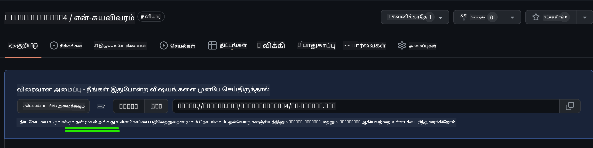
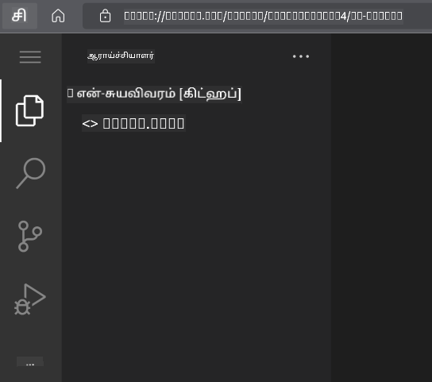
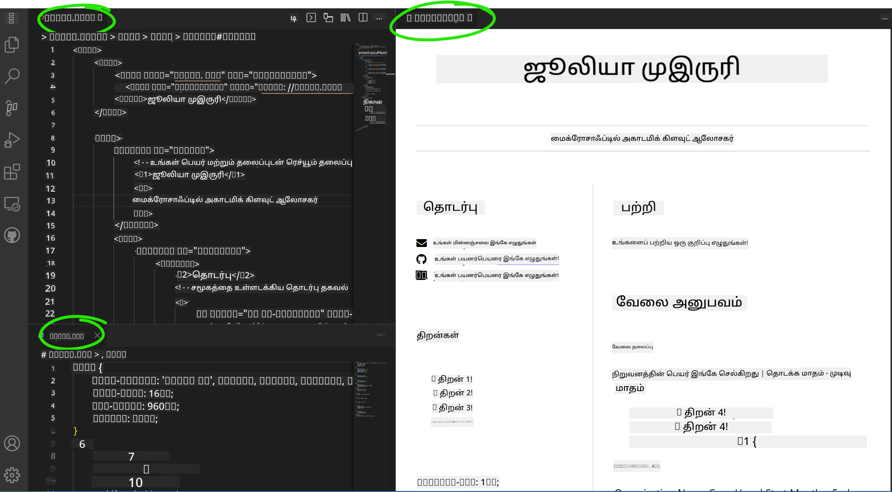

<!--
CO_OP_TRANSLATOR_METADATA:
{
  "original_hash": "bd3aa6d2b879c30ea496c43aec1c49ed",
  "translation_date": "2025-10-11T11:47:17+00:00",
  "source_file": "8-code-editor/1-using-a-code-editor/assignment.md",
  "language_code": "ta"
}
-->
# vscode.dev பயன்படுத்தி ஒரு ரெச்யூம்-வலைத்தளம் உருவாக்குங்கள்

_ஒரு வேலைவாய்ப்பு வழங்குநர் உங்கள் ரெச்யூமை கேட்கும்போது, நீங்கள் அவர்களுக்கு ஒரு URL அனுப்பினால் எவ்வளவு அருமையாக இருக்கும்?_ 😎

## நோக்கங்கள்

இந்த பணியை முடித்த பிறகு, நீங்கள் கற்றுக்கொள்வீர்கள்:

- உங்கள் ரெச்யூவை வெளிப்படுத்த ஒரு வலைத்தளத்தை உருவாக்குவது

### முன் தேவைகள்

1. ஒரு GitHub கணக்கு. [GitHub](https://github.com/) க்கு சென்று, உங்களிடம் கணக்கு இல்லையெனில், ஒரு கணக்கை உருவாக்கவும்.

## படிகள்

**படி 1:** ஒரு புதிய GitHub Repository உருவாக்கி, அதற்கு `my-resume` என்று பெயரிடுங்கள்.

**படி 2:** உங்கள் Repositoryயில் ஒரு `index.html` கோப்பை உருவாக்குங்கள். நாம் github.com இல் குறைந்தது ஒரு கோப்பை சேர்க்க வேண்டும், ஏனெனில் நீங்கள் vscode.dev இல் ஒரு காலியான Repositoryயை திறக்க முடியாது.

`creating a new file` இணைப்பை கிளிக் செய்து, `index.html` என்று பெயரை தட்டச்சு செய்து, `Commit new file` பொத்தானை தேர்வு செய்யவும்.



**படி 3:** [VSCode.dev](https://vscode.dev) ஐ திறந்து, `Open Remote Repository` பொத்தானை தேர்வு செய்யவும்.

நீங்கள் உங்கள் ரெச்யூம் தளத்திற்காக உருவாக்கிய Repositoryயின் URL ஐ நகலெடுத்து, உள்ளீட்டு பெட்டியில் ஒட்டவும்:

_`your-username` ஐ உங்கள் GitHub பயனர் பெயருடன் மாற்றவும்._

```
https://github.com/your-username/my-resume
```

✅ வெற்றிகரமாக இருந்தால், உங்கள் திட்டத்தையும், index.html கோப்பையும் உலாவியில் உள்ள உரை திருத்தியில் திறந்துவிடலாம்.



**படி 4:** `index.html` கோப்பை திறந்து, கீழே உள்ள குறியீட்டை உங்கள் குறியீட்டு பகுதியில் ஒட்டவும் மற்றும் சேமிக்கவும்.

<details>
    <summary><b>உங்கள் ரெச்யூம் வலைத்தளத்தின் உள்ளடக்கத்திற்கான HTML குறியீடு.</b></summary>
    
        <html>

            <head>
                <link href="style.css" rel="stylesheet">
                <link rel="stylesheet" href="https://cdnjs.cloudflare.com/ajax/libs/font-awesome/5.15.4/css/all.min.css">
                <title>உங்கள் பெயரை இங்கே எழுதுங்கள்!</title>
            </head>
            <body>
                <header id="header">
                    <!-- உங்கள் பெயரும் தலைப்பும் கொண்ட ரெச்யூம் தலைப்பு -->
                    <h1>உங்கள் பெயரை இங்கே எழுதுங்கள்!</h1>
                    <hr>
                    உங்கள் பங்கு!
                    <hr>
                </header>
                <main>
                    <article id="mainLeft">
                        <section>
                            <h2>தொடர்பு</h2>
                            <!-- சமூக ஊடகங்களை உள்ளடக்கிய தொடர்பு தகவல் -->
                            <p>
                                <i class="fa fa-envelope" aria-hidden="true"></i>
                                <a href="mailto:username@domain.top-level domain">உங்கள் மின்னஞ்சலை இங்கே எழுதுங்கள்</a>
                            </p>
                            <p>
                                <i class="fab fa-github" aria-hidden="true"></i>
                                <a href="github.com/yourGitHubUsername">உங்கள் பயனர் பெயரை இங்கே எழுதுங்கள்!</a>
                            </p>
                            <p>
                                <i class="fab fa-linkedin" aria-hidden="true"></i>
                                <a href="linkedin.com/yourLinkedInUsername">உங்கள் பயனர் பெயரை இங்கே எழுதுங்கள்!</a>
                            </p>
                        </section>
                        <section>
                            <h2>திறன்கள்</h2>
                            <!-- உங்கள் திறன்கள் -->
                            <ul>
                                <li>திறன் 1!</li>
                                <li>திறன் 2!</li>
                                <li>திறன் 3!</li>
                                <li>திறன் 4!</li>
                            </ul>
                        </section>
                        <section>
                            <h2>கல்வி</h2>
                            <!-- உங்கள் கல்வி -->
                            <h3>உங்கள் பாடத்திட்டத்தை இங்கே எழுதுங்கள்!</h3>
                            <p>
                                உங்கள் கல்வி நிறுவனத்தை இங்கே எழுதுங்கள்!
                            </p>
                            <p>
                                தொடக்கம் - முடிவு தேதி
                            </p>
                        </section>            
                    </article>
                    <article id="mainRight">
                        <section>
                            <h2>பற்றி</h2>
                            <!-- உங்களைப் பற்றி -->
                            <p>உங்களைப் பற்றிய ஒரு குறிப்பு எழுதுங்கள்!</p>
                        </section>
                        <section>
                            <h2>வேலை அனுபவம்</h2>
                            <!-- உங்கள் வேலை அனுபவம் -->
                            <h3>வேலை தலைப்பு</h3>
                            <p>
                                அமைப்பின் பெயரை இங்கே எழுதுங்கள் | தொடங்கும் மாதம் – முடியும் மாதம்
                            </p>
                            <ul>
                                    <li>பணி 1 - நீங்கள் என்ன செய்தீர்கள் என்பதை எழுதுங்கள்!</li>
                                    <li>பணி 2 - நீங்கள் என்ன செய்தீர்கள் என்பதை எழுதுங்கள்!</li>
                                    <li>உங்கள் பங்களிப்பின் விளைவுகள்/தாக்கங்களை எழுதுங்கள்</li>
                                    
                            </ul>
                            <h3>வேலை தலைப்பு 2</h3>
                            <p>
                                அமைப்பின் பெயரை இங்கே எழுதுங்கள் | தொடங்கும் மாதம் – முடியும் மாதம்
                            </p>
                            <ul>
                                    <li>பணி 1 - நீங்கள் என்ன செய்தீர்கள் என்பதை எழுதுங்கள்!</li>
                                    <li>பணி 2 - நீங்கள் என்ன செய்தீர்கள் என்பதை எழுதுங்கள்!</li>
                                    <li>உங்கள் பங்களிப்பின் விளைவுகள்/தாக்கங்களை எழுதுங்கள்</li>
                                    
                            </ul>
                        </section>
                    </article>
                </main>
            </body>
        </html>
</details>

உங்கள் ரெச்யூம் விவரங்களை HTML குறியீட்டில் உள்ள _placeholder text_ ஐ மாற்றி சேர்க்கவும்.

**படி 5:** My-Resume கோப்புறை மீது மிதக்க, `New File ...` ஐகானை கிளிக் செய்து, உங்கள் திட்டத்தில் 2 புதிய கோப்புகளை உருவாக்கவும்: `style.css` மற்றும் `codeswing.json` கோப்புகள்.

**படி 6:** `style.css` கோப்பை திறந்து, கீழே உள்ள குறியீட்டை ஒட்டவும் மற்றும் சேமிக்கவும்.

<details>
        <summary><b>தளத்தின் அமைப்பை வடிவமைக்க CSS குறியீடு.</b></summary>
            
            body {
                font-family: 'Segoe UI', Tahoma, Geneva, Verdana, sans-serif;
                font-size: 16px;
                max-width: 960px;
                margin: auto;
            }
            h1 {
                font-size: 3em;
                letter-spacing: .6em;
                padding-top: 1em;
                padding-bottom: 1em;
            }

            h2 {
                font-size: 1.5em;
                padding-bottom: 1em;
            }

            h3 {
                font-size: 1em;
                padding-bottom: 1em;
            }
            main { 
                display: grid;
                grid-template-columns: 40% 60%;
                margin-top: 3em;
            }
            header {
                text-align: center;
                margin: auto 2em;
            }

            section {
                margin: auto 1em 4em 2em;
            }

            i {
                margin-right: .5em;
            }

            p {
                margin: .2em auto
            }

            hr {
                border: none;
                background-color: lightgray;
                height: 1px;
            }

            h1, h2, h3 {
                font-weight: 100;
                margin-bottom: 0;
            }
            #mainLeft {
                border-right: 1px solid lightgray;
            }
            
</details>

**படி 6:** `codeswing.json` கோப்பை திறந்து, கீழே உள்ள குறியீட்டை ஒட்டவும் மற்றும் சேமிக்கவும்.

    {
    "scripts": [],
    "styles": []
    }

**படி 7:** `Codeswing extension` ஐ நிறுவி, குறியீட்டு பகுதியில் ரெச்யூம் வலைத்தளத்தை காண்பிக்கவும்.

_`Extensions`_ ஐகானை செயல்பாட்டு பட்டியில் கிளிக் செய்து, Codeswing என தட்டச்சு செய்யவும். விரிவாக்கப்பட்ட செயல்பாட்டு பட்டியில் _நீல நிற install button_ ஐ கிளிக் செய்து அல்லது விரிவாக்கத்தை தேர்வு செய்த பிறகு குறியீட்டு பகுதியில் தோன்றும் install button ஐ பயன்படுத்தி நிறுவவும். விரிவாக்கத்தை நிறுவியவுடன், உங்கள் திட்டத்தில் ஏற்பட்ட மாற்றங்களை கவனிக்கவும் 😃


விரிவாக்கத்தை நிறுவிய பிறகு, உங்கள் திரையில் இதை காணலாம்.



நீங்கள் செய்த மாற்றங்களில் திருப்தி அடைந்தால், `Changes` கோப்புறையில் மிதக்கவும், `+` பொத்தானை கிளிக் செய்து மாற்றங்களை நிலைப்படுத்தவும்.

ஒரு commit செய்தி _(நீங்கள் திட்டத்தில் செய்த மாற்றத்தின் விளக்கம்)_ தட்டச்சு செய்து, `check` ஐ கிளிக் செய்து உங்கள் மாற்றங்களை commit செய்யவும். உங்கள் திட்டத்தில் வேலை முடிந்தவுடன், மேலே இடது மூலையில் உள்ள ஹாம்பர்கர் மெனு ஐகானை தேர்வு செய்து GitHub இல் உள்ள Repositoryக்கு திரும்பவும்.

வாழ்த்துக்கள் 🎉 சில படிகளில் நீங்கள் vscode.dev ஐப் பயன்படுத்தி உங்கள் ரெச்யூம் வலைத்தளத்தை உருவாக்கி விட்டீர்கள்.

## 🚀 சவால்

நீங்கள் மாற்றங்களைச் செய்ய அனுமதி உள்ள ஒரு தொலைவிலுள்ள Repositoryயைத் திறந்து, சில கோப்புகளை புதுப்பிக்கவும். அடுத்ததாக, உங்கள் மாற்றங்களுடன் ஒரு புதிய கிளையை உருவாக்கி, ஒரு Pull Request ஐ உருவாக்க முயற்சிக்கவும்.

## மதிப்பீடு & சுயபயிற்சி

[VSCode.dev](https://code.visualstudio.com/docs/editor/vscode-web?WT.mc_id=academic-0000-alfredodeza) மற்றும் அதன் பிற அம்சங்கள் பற்றிய மேலும் படிக்கவும்.

---

**அறிவிப்பு**:  
இந்த ஆவணம் [Co-op Translator](https://github.com/Azure/co-op-translator) என்ற AI மொழிபெயர்ப்பு சேவையை பயன்படுத்தி மொழிபெயர்க்கப்பட்டுள்ளது. நாங்கள் துல்லியத்திற்காக முயற்சிக்கிறோம், ஆனால் தானியங்கி மொழிபெயர்ப்புகளில் பிழைகள் அல்லது தவறுகள் இருக்கக்கூடும் என்பதை தயவுசெய்து கவனத்தில் கொள்ளவும். அதன் சொந்த மொழியில் உள்ள மூல ஆவணம் அதிகாரப்பூர்வ ஆதாரமாக கருதப்பட வேண்டும். முக்கியமான தகவல்களுக்கு, தொழில்முறை மனித மொழிபெயர்ப்பு பரிந்துரைக்கப்படுகிறது. இந்த மொழிபெயர்ப்பைப் பயன்படுத்துவதால் ஏற்படும் எந்த தவறான புரிதல்களுக்கும் அல்லது தவறான விளக்கங்களுக்கும் நாங்கள் பொறுப்பல்ல.