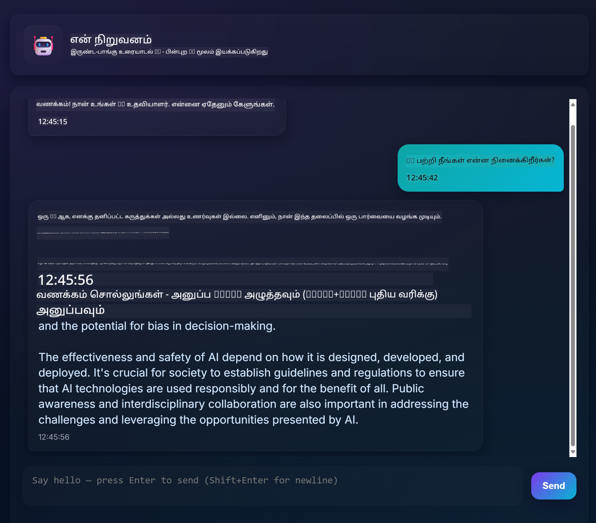
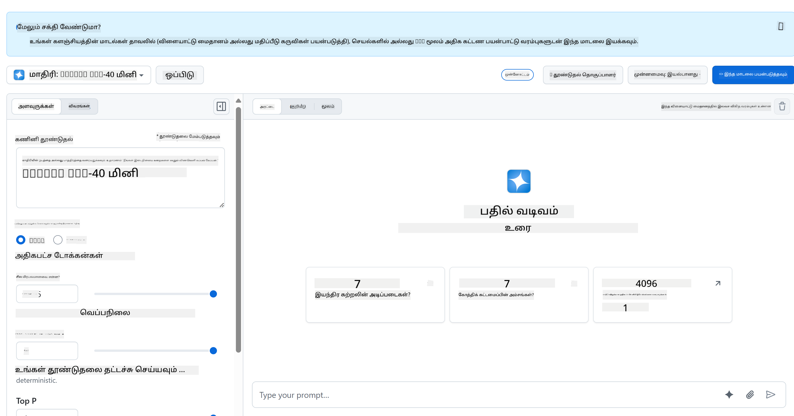
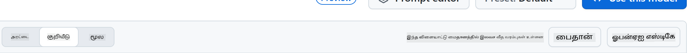
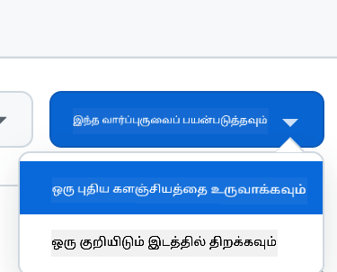
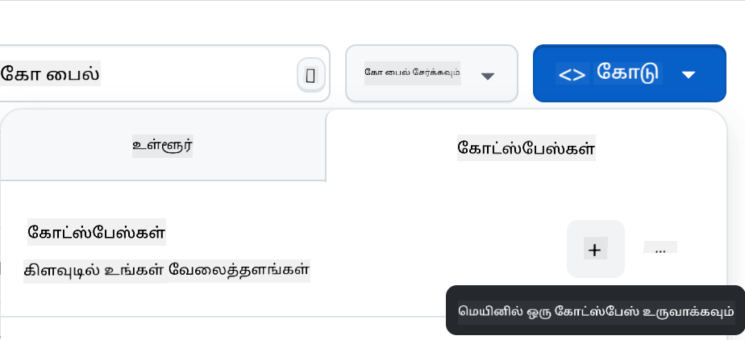

<!--
CO_OP_TRANSLATOR_METADATA:
{
  "original_hash": "11cf36165c243947b6cd85b88cf6faa6",
  "translation_date": "2025-10-11T11:54:00+00:00",
  "source_file": "9-chat-project/README.md",
  "language_code": "ta"
}
-->
# சந்தை திட்டம்

இந்த சந்தை திட்டம் GitHub Models பயன்படுத்தி ஒரு Chat Assistant உருவாக்குவது எப்படி என்பதை காட்டுகிறது.

இது முடிந்த திட்டம் எப்படி இருக்கும் என்பதை இங்கே காணலாம்:



சில பின்னணி தகவல்கள், Generative AI பயன்படுத்தி Chat Assistant உருவாக்குவது AI பற்றி கற்றுக்கொள்வதற்கான சிறந்த வழியாகும். இந்த பாடத்தில், Generative AI-யை ஒரு வலை பயன்பாட்டில் ஒருங்கிணைப்பது எப்படி என்பதை நீங்கள் கற்றுக்கொள்வீர்கள். தொடங்குவோம்.

## Generative AI-யுடன் இணைப்பு

பின்புறத்தில், GitHub Models-ஐ பயன்படுத்துகிறோம். இது AI-யை இலவசமாக பயன்படுத்த அனுமதிக்கும் சிறந்த சேவையாகும். அதன் Playground-க்கு சென்று, உங்கள் தேர்ந்தெடுத்த பின்புற மொழிக்கு பொருந்தும் குறியீட்டை எடுக்கவும். இது [GitHub Models Playground](https://github.com/marketplace/models/azure-openai/gpt-4o-mini/playground) இல் எப்படி இருக்கும்:



நாம் கூறியபடி, "Code" tab-ஐ தேர்ந்தெடுத்து உங்கள் runtime-ஐ தேர்ந்தெடுக்கவும்.



### Python பயன்படுத்துதல்

இந்தக் கட்டத்தில் Python-ஐ தேர்ந்தெடுக்கிறோம், இதனால் இந்தக் குறியீட்டை எடுக்கிறோம்:

```python
"""Run this model in Python

> pip install openai
"""
import os
from openai import OpenAI

# To authenticate with the model you will need to generate a personal access token (PAT) in your GitHub settings. 
# Create your PAT token by following instructions here: https://docs.github.com/en/authentication/keeping-your-account-and-data-secure/managing-your-personal-access-tokens
client = OpenAI(
    base_url="https://models.github.ai/inference",
    api_key=os.environ["GITHUB_TOKEN"],
)

response = client.chat.completions.create(
    messages=[
        {
            "role": "system",
            "content": "",
        },
        {
            "role": "user",
            "content": "What is the capital of France?",
        }
    ],
    model="openai/gpt-4o-mini",
    temperature=1,
    max_tokens=4096,
    top_p=1
)

print(response.choices[0].message.content)
```

இந்தக் குறியீட்டை சுத்தமாக்கி, மீண்டும் பயன்படுத்தக்கூடியதாக மாற்றுவோம்:

```python
def call_llm(prompt: str, system_message: str):
    response = client.chat.completions.create(
        messages=[
            {
                "role": "system",
                "content": system_message,
            },
            {
                "role": "user",
                "content": prompt,
            }
        ],
        model="openai/gpt-4o-mini",
        temperature=1,
        max_tokens=4096,
        top_p=1
    )

    return response.choices[0].message.content
```

இந்த `call_llm` செயல்பாட்டுடன், prompt மற்றும் system prompt-ஐ எடுத்துக்கொண்டு, செயல்பாடு முடிவில் முடிவைத் திருப்புகிறது.

### AI Assistant-ஐ தனிப்பயனாக்குதல்

AI Assistant-ஐ தனிப்பயனாக்க விரும்பினால், system prompt-ஐ இவ்வாறு நிரப்புவதன் மூலம் அதன் நடத்தை எப்படி இருக்க வேண்டும் என்பதை குறிப்பிடலாம்:

```python
call_llm("Tell me about you", "You're Albert Einstein, you only know of things in the time you were alive")
```

## அதை ஒரு Web API மூலம் வெளிப்படுத்துதல்

சிறந்தது, நாம் AI பகுதியை முடித்துவிட்டோம், அதை Web API-யுடன் ஒருங்கிணைப்பது எப்படி என்பதை பார்ப்போம். Web API-க்கு, Flask-ஐ பயன்படுத்துகிறோம், ஆனால் எந்தவொரு வலை framework-ஐ பயன்படுத்தலாம். இதற்கான குறியீட்டை பார்ப்போம்:

### Python பயன்படுத்துதல்

```python
# api.py
from flask import Flask, request, jsonify
from llm import call_llm
from flask_cors import CORS

app = Flask(__name__)
CORS(app)   # *   example.com

@app.route("/", methods=["GET"])
def index():
    return "Welcome to this API. Call POST /hello with 'message': 'my message' as JSON payload"


@app.route("/hello", methods=["POST"])
def hello():
    # get message from request body  { "message": "do this taks for me" }
    data = request.get_json()
    message = data.get("message", "")

    response = call_llm(message, "You are a helpful assistant.")
    return jsonify({
        "response": response
    })

if __name__ == "__main__":
    app.run(host="0.0.0.0", port=5000)
```

இங்கே, நாம் ஒரு Flask API உருவாக்கி, "/" மற்றும் "/chat" என்ற இயல்பான வழியை வரையறுக்கிறோம். பின்னணி கேள்விகளை frontend மூலம் அனுப்புவதற்காக "/chat" வழி பயன்படுத்தப்படுகிறது.

*llm.py* ஐ ஒருங்கிணைக்க, இதை செய்ய வேண்டும்:

- `call_llm` செயல்பாட்டை இறக்குமதி செய்யவும்:

   ```python
   from llm import call_llm
   from flask import Flask, request
   ```

- "/chat" வழியில் அதை அழைக்கவும்:

   ```python
   @app.route("/hello", methods=["POST"])
   def hello():
      # get message from request body  { "message": "do this taks for me" }
      data = request.get_json()
      message = data.get("message", "")

      response = call_llm(message, "You are a helpful assistant.")
      return jsonify({
         "response": response
      })
   ```

   இங்கே, JSON உடலிலிருந்து `message` சொத்தை பெறுவதற்காக வரும் கோரிக்கையை பகுப்பாய்வு செய்கிறோம். அதன் பிறகு, LLM-ஐ இந்த அழைப்புடன் அழைக்கிறோம்:

   ```python
   response = call_llm(message, "You are a helpful assistant")

   # return the response as JSON
   return jsonify({
      "response": response 
   })
   ```

சிறந்தது, நாம் தேவையானதை செய்துவிட்டோம்.

## Cors அமைத்தல்

நாம் CORS, cross-origin resource sharing போன்றவற்றை அமைத்துள்ளோம் என்பதை குறிப்பிட வேண்டும். இதன் பொருள், backend மற்றும் frontend வெவ்வேறு ports-ல் இயங்குவதால், frontend backend-ஐ அழைக்க அனுமதிக்க வேண்டும்.

### Python பயன்படுத்துதல்

*api.py* இல் இதை அமைக்கும் ஒரு குறியீடு உள்ளது:

```python
from flask_cors import CORS

app = Flask(__name__)
CORS(app)   # *   example.com
```

இப்போது "*" என்று அனைத்து origin-களையும் அனுமதிக்க அமைக்கப்பட்டுள்ளது, இது கொஞ்சம் பாதுகாப்பற்றது, அதை உற்பத்திக்கு செல்லும்போது கட்டுப்படுத்த வேண்டும்.

## உங்கள் திட்டத்தை இயக்கவும்

உங்கள் திட்டத்தை இயக்க, முதலில் backend-ஐ தொடங்க வேண்டும், பின்னர் frontend-ஐ தொடங்க வேண்டும்.

### Python பயன்படுத்துதல்

சரி, *llm.py* மற்றும் *api.py* உள்ளது, backend-இன் மூலம் இதை எப்படி வேலை செய்ய வைக்கலாம்? இரண்டு விஷயங்களை செய்ய வேண்டும்:

- Dependencies-ஐ நிறுவவும்:

   ```sh
   cd backend
   python -m venv venv
   source ./venv/bin/activate

   pip install openai flask flask-cors openai
   ```

- API-ஐ தொடங்கவும்:

   ```sh
   python api.py
   ```

   Codespaces-ல் இருந்தால், editor-இன் கீழ் Ports-க்கு செல்லவும், அதில் right-click செய்து "Port Visibility" ஐ கிளிக் செய்து "Public" ஐ தேர்ந்தெடுக்கவும்.

### ஒரு frontend-இல் வேலை செய்யவும்

API இயங்கும் நிலையில், frontend உருவாக்குவோம். இது bare minimum frontend ஆகும், அதை படிப்படியாக மேம்படுத்துவோம். *frontend* கோப்பகத்தில் இதை உருவாக்கவும்:

```text
backend/
frontend/
index.html
app.js
styles.css
```

**index.html**-இல் தொடங்குவோம்:

```html
<html>
    <head>
        <link rel="stylesheet" href="styles.css">
    </head>
    <body>
      <form>
        <textarea id="messages"></textarea>
        <input id="input" type="text" />
        <button type="submit" id="sendBtn">Send</button>  
      </form>  
      <script src="app.js" />
    </body>
</html>    
```

மேலே உள்ளது ஒரு chat window-ஐ ஆதரிக்க absolute minimum ஆகும், இது textarea, input மற்றும் ஒரு button கொண்டுள்ளது. *app.js* இல் JavaScript-ஐ பார்ப்போம்.

**app.js**

```js
// app.js

(function(){
  // 1. set up elements  
  const messages = document.getElementById("messages");
  const form = document.getElementById("form");
  const input = document.getElementById("input");

  const BASE_URL = "change this";
  const API_ENDPOINT = `${BASE_URL}/hello`;

  // 2. create a function that talks to our backend
  async function callApi(text) {
    const response = await fetch(API_ENDPOINT, {
      method: "POST",
      headers: { "Content-Type": "application/json" },
      body: JSON.stringify({ message: text })
    });
    let json = await response.json();
    return json.response;
  }

  // 3. add response to our textarea
  function appendMessage(text, role) {
    const el = document.createElement("div");
    el.className = `message ${role}`;
    el.innerHTML = text;
    messages.appendChild(el);
  }

  // 4. listen to submit events
  form.addEventListener("submit", async(e) => {
    e.preventDefault();
   // someone clicked the button in the form
   
   // get input
   const text = input.value.trim();

   appendMessage(text, "user")

   // reset it
   input.value = '';

   const reply = await callApi(text);

   // add to messages
   appendMessage(reply, "assistant");

  })
})();
```

குறியீட்டை பிரிவாகப் பார்ப்போம்:

- 1) இங்கே, நாம் பின்னர் குறியீட்டில் குறிப்பிடப்படும் அனைத்து கூறுகளுக்கும் reference பெறுகிறோம்.
- 2) இந்த பகுதியில், backend-ஐ அழைக்கும் `fetch` செயல்பாட்டை உருவாக்குகிறோம்.
- 3) `appendMessage` பதில்களை மற்றும் பயனர் type செய்ததை சேர்க்க உதவுகிறது.
- 4) இங்கே, submit நிகழ்வை கேட்கிறோம், பின்னர் input field-ஐ படிக்கிறோம், பயனர் செய்த செய்தியை textarea-இல் வைக்கிறோம், API-ஐ அழைக்கிறோம், பதிலை textarea-இல் காட்டுகிறோம்.

அடுத்ததாக, styling-ஐ பார்ப்போம். உங்கள் விருப்பத்திற்கு ஏற்ப crazy ஆக மாற்றலாம், ஆனால் சில பரிந்துரைகள் இங்கே:

**styles.css**

```
.message {
    background: #222;
    box-shadow: 0 0 0 10px orange;
    padding: 10px:
    margin: 5px;
}

.message.user {
    background: blue;
}

.message.assistant {
    background: grey;
} 
```

இந்த மூன்று வகுப்புகளுடன், assistant அல்லது பயனர் மூலம் வரும் செய்திகளை வெவ்வேறு முறையில் வடிவமைக்கலாம். உங்களுக்கு ஊக்கமளிக்க, `solution/frontend/styles.css` கோப்பகத்தைப் பாருங்கள்.

### Base Url மாற்றம்

இங்கே நாம் அமைக்காத ஒரு விஷயம் `BASE_URL` ஆகும், backend தொடங்கும் வரை இது தெரியாது. அதை அமைக்க:

- API-ஐ உள்ளூர் இயக்கினால், அது `http://localhost:5000` போன்றதாக இருக்க வேண்டும்.
- Codespaces-ல் இயக்கினால், அது "[name]app.github.dev" போன்றதாக இருக்கும்.

## பணிக்கட்டளை

உங்கள் சொந்த *project* கோப்பகத்தை உருவாக்கி, இதுபோல் உள்ளடக்கத்தை அமைக்கவும்:

```text
project/
  frontend/
    index.html
    app.js
    styles.css
  backend/
    ...
```

மேலே கூறியவற்றிலிருந்து உள்ளடக்கத்தை நகலெடுக்கவும், ஆனால் உங்கள் விருப்பத்திற்கு ஏற்ப தனிப்பயனாக்கவும்.

## தீர்வு

[தீர்வு](./solution/README.md)

## கூடுதல்

AI Assistant-இன் தன்மையை மாற்ற முயற்சிக்கவும்.

### Python-க்கு

*api.py* இல் `call_llm` ஐ அழைக்கும் போது, இரண்டாவது argument-ஐ உங்கள் விருப்பத்திற்கு மாற்றலாம், உதாரணமாக:

```python
call_llm(message, "You are Captain Picard")
```

### Frontend

CSS மற்றும் உரையை உங்கள் விருப்பத்திற்கு மாற்றவும், எனவே *index.html* மற்றும் *styles.css* இல் மாற்றங்களைச் செய்யவும்.

## சுருக்கம்

சிறந்தது, AI-யை பயன்படுத்தி ஒரு தனிப்பட்ட Assistant உருவாக்குவது எப்படி scratch-இல் இருந்து கற்றுக்கொண்டீர்கள். GitHub Models, Python backend மற்றும் HTML, CSS மற்றும் JavaScript frontend-ஐ பயன்படுத்தி இதை செய்தோம்.

## Codespaces-இல் அமைத்தல்

- செல்லவும்: [Web Dev For Beginners repo](https://github.com/microsoft/Web-Dev-For-Beginners)
- Template-இல் இருந்து உருவாக்கவும் (GitHub-ல் உள்நுழைந்திருப்பதை உறுதிசெய்க) மேல் வலது மூலையில்:

    

- உங்கள் repo-இல், Codespace உருவாக்கவும்:

    

    இது நீங்கள் வேலை செய்யக்கூடிய ஒரு சூழலை தொடங்க வேண்டும்.

---

**குறிப்பு**:  
இந்த ஆவணம் [Co-op Translator](https://github.com/Azure/co-op-translator) என்ற AI மொழிபெயர்ப்பு சேவையைப் பயன்படுத்தி மொழிபெயர்க்கப்பட்டுள்ளது. எங்கள் தரச்சிறப்பிற்காக முயற்சி செய்தாலும், தானியங்கி மொழிபெயர்ப்புகளில் பிழைகள் அல்லது தவறுகள் இருக்கக்கூடும் என்பதை தயவுசெய்து கவனத்தில் கொள்ளுங்கள். அதன் தாய்மொழியில் உள்ள மூல ஆவணம் அதிகாரப்பூர்வ ஆதாரமாக கருதப்பட வேண்டும். முக்கியமான தகவல்களுக்கு, தொழில்முறை மனித மொழிபெயர்ப்பு பரிந்துரைக்கப்படுகிறது. இந்த மொழிபெயர்ப்பைப் பயன்படுத்துவதால் ஏற்படும் எந்த தவறான புரிதல்கள் அல்லது தவறான விளக்கங்களுக்கு நாங்கள் பொறுப்பல்ல.