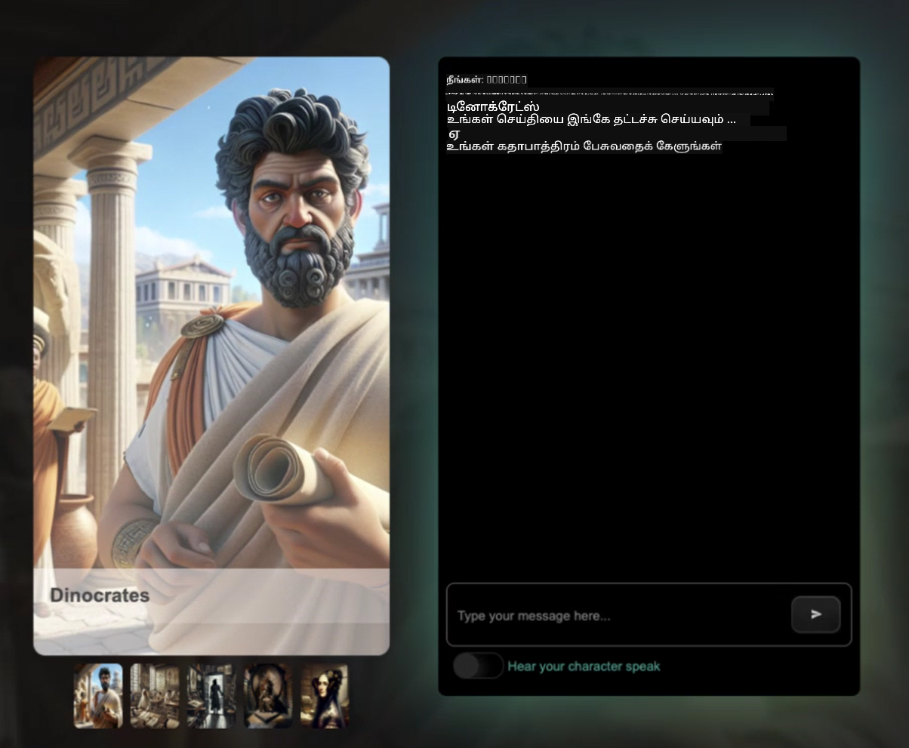
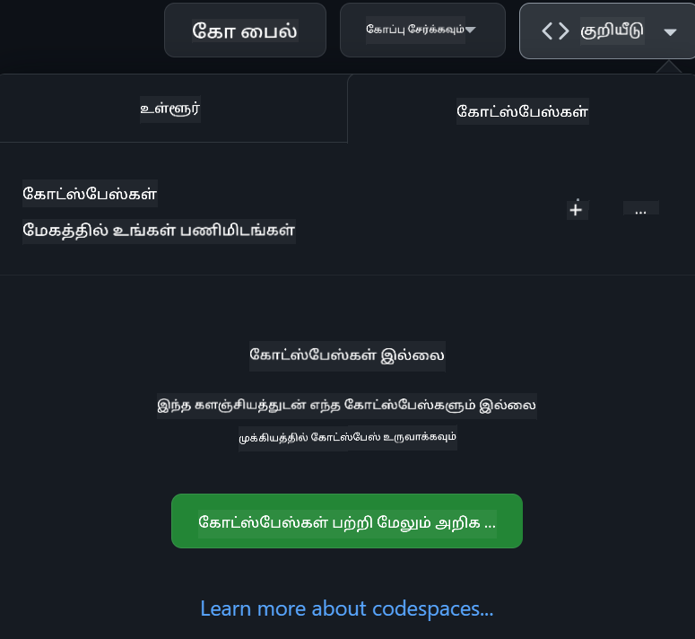

<!--
CO_OP_TRANSLATOR_METADATA:
{
  "original_hash": "caf2ca695e9d259153d24a5cf3e07ef5",
  "translation_date": "2025-10-11T11:37:48+00:00",
  "source_file": "README.md",
  "language_code": "ta"
}
-->
[](https://github.com/microsoft/Web-Dev-For-Beginners/blob/master/LICENSE)
[](https://GitHub.com/microsoft/Web-Dev-For-Beginners/graphs/contributors/)
[](https://GitHub.com/microsoft/Web-Dev-For-Beginners/issues/)
[](https://GitHub.com/microsoft/Web-Dev-For-Beginners/pulls/)
[](http://makeapullrequest.com)

[](https://GitHub.com/microsoft/Web-Dev-For-Beginners/watchers/)
[](https://GitHub.com/microsoft/Web-Dev-For-Beginners/network/)
[](https://GitHub.com/microsoft/Web-Dev-For-Beginners/stargazers/)

[](https://discord.gg/zxKYvhSnVp?WT.mc_id=academic-000002-leestott)

# தொடக்கத்திற்கான வலை மேம்பாடு - ஒரு பாடத்திட்டம்

மைக்ரோசாஃப்ட் கிளவுட் ஆதரவாளர்களால் உருவாக்கப்பட்ட 12 வார முழுமையான பாடத்திட்டத்தின் மூலம் வலை மேம்பாட்டின் அடிப்படைகளை கற்றுக்கொள்ளுங்கள். 24 பாடங்களில் ஒவ்வொன்றும் ஜாவாஸ்கிரிப்ட், CSS மற்றும் HTML ஆகியவற்றை டெராரியங்கள், உலாவி நீட்டிப்புகள் மற்றும் விண்வெளி விளையாட்டுகள் போன்ற நடைமுறை திட்டங்கள் மூலம் ஆராய்கிறது. வினாடி வினா, விவாதங்கள் மற்றும் நடைமுறை பணிகளைச் செய்யுங்கள். எங்கள் பயிற்சி அடிப்படையிலான கற்றல் முறையின் மூலம் உங்கள் திறன்களை மேம்படுத்தி, அறிவு நிலைத்தன்மையை அதிகரிக்கவும். இன்று உங்கள் குறியீட்டு பயணத்தைத் தொடங்குங்கள்!

Azure AI Foundry Discord சமூகத்தில் சேரவும்

[](https://discord.com/invite/ByRwuEEgH4)

இந்த வளங்களைப் பயன்படுத்தத் தொடங்குவதற்கான படிகள்:
1. **களஞ்சியத்தை Fork செய்யவும்**: [](https://GitHub.com/microsoft/Web-Dev-For-Beginners/fork) கிளிக் செய்யவும்
2. **களஞ்சியத்தை Clone செய்யவும்**:   `git clone https://github.com/microsoft/Web-Dev-For-Beginners.git`
3. [**Azure AI Foundry Discord-இல் சேர்ந்து நிபுணர்களையும் மற்ற டெவலப்பர்களையும் சந்திக்கவும்**](https://discord.com/invite/ByRwuEEgH4)

### 🌐 பல மொழி ஆதரவு

#### GitHub Action மூலம் ஆதரிக்கப்படுகிறது (தானியங்கி மற்றும் எப்போதும் புதுப்பிக்கப்பட்டது)

<!-- CO-OP TRANSLATOR LANGUAGES TABLE START -->
[Arabic](../ar/README.md) | [Bengali](../bn/README.md) | [Bulgarian](../bg/README.md) | [Burmese (Myanmar)](../my/README.md) | [Chinese (Simplified)](../zh/README.md) | [Chinese (Traditional, Hong Kong)](../hk/README.md) | [Chinese (Traditional, Macau)](../mo/README.md) | [Chinese (Traditional, Taiwan)](../tw/README.md) | [Croatian](../hr/README.md) | [Czech](../cs/README.md) | [Danish](../da/README.md) | [Dutch](../nl/README.md) | [Estonian](../et/README.md) | [Finnish](../fi/README.md) | [French](../fr/README.md) | [German](../de/README.md) | [Greek](../el/README.md) | [Hebrew](../he/README.md) | [Hindi](../hi/README.md) | [Hungarian](../hu/README.md) | [Indonesian](../id/README.md) | [Italian](../it/README.md) | [Japanese](../ja/README.md) | [Korean](../ko/README.md) | [Lithuanian](../lt/README.md) | [Malay](../ms/README.md) | [Marathi](../mr/README.md) | [Nepali](../ne/README.md) | [Norwegian](../no/README.md) | [Persian (Farsi)](../fa/README.md) | [Polish](../pl/README.md) | [Portuguese (Brazil)](../br/README.md) | [Portuguese (Portugal)](../pt/README.md) | [Punjabi (Gurmukhi)](../pa/README.md) | [Romanian](../ro/README.md) | [Russian](../ru/README.md) | [Serbian (Cyrillic)](../sr/README.md) | [Slovak](../sk/README.md) | [Slovenian](../sl/README.md) | [Spanish](../es/README.md) | [Swahili](../sw/README.md) | [Swedish](../sv/README.md) | [Tagalog (Filipino)](../tl/README.md) | [Tamil](./README.md) | [Thai](../th/README.md) | [Turkish](../tr/README.md) | [Ukrainian](../uk/README.md) | [Urdu](../ur/README.md) | [Vietnamese](../vi/README.md)
<!-- CO-OP TRANSLATOR LANGUAGES TABLE END -->

**கூடுதல் மொழிபெயர்ப்புகளை ஆதரிக்க விரும்பினால், [இங்கே](https://github.com/Azure/co-op-translator/blob/main/getting_started/supported-languages.md) பட்டியலிடப்பட்டுள்ள மொழிகளைப் பார்க்கவும்**

[](https://open.vscode.dev/microsoft/Web-Dev-For-Beginners)

#### 🧑‍🎓 _நீங்கள் ஒரு மாணவரா?_

[**மாணவர் Hub பக்கம்**](https://docs.microsoft.com/learn/student-hub/?WT.mc_id=academic-77807-sagibbon) பார்வையிடவும், அங்கு தொடக்க நிலை வளங்கள், மாணவர் தொகுப்புகள் மற்றும் இலவச சான்றிதழ் வவுச்சரைப் பெறுவதற்கான வழிகள் கிடைக்கும். இந்தப் பக்கத்தை புத்தகக்குறியாக்கி, மாதாந்திரமாக உள்ளடக்கத்தை மாற்றியமைக்கும் போது சரிபார்க்கவும்.

### 📣 அறிவிப்பு - _Generative AI பயன்படுத்த புதிய திட்டம்_

புதிய AI உதவியாளர் திட்டம் சேர்க்கப்பட்டுள்ளது, [திட்டத்தை](./09-chat-project/README.md) பார்வையிடவும்.

### 📣 அறிவிப்பு - _Generative AI பாடத்திட்டம்_ ஜாவாஸ்கிரிப்டுக்காக வெளியிடப்பட்டது

எங்கள் புதிய Generative AI பாடத்திட்டத்தை தவறவிடாதீர்கள்!

தொடங்க [https://aka.ms/genai-js-course](https://aka.ms/genai-js-course) பார்வையிடவும்!


- அடிப்படைகள் முதல் RAG வரை உள்ள பாடங்கள்.
- GenAI மற்றும் எங்கள் துணை செயலியைப் பயன்படுத்தி வரலாற்று கதாபாத்திரங்களுடன் தொடர்பு கொள்ளுங்கள்.
- சுவாரஸ்யமான மற்றும் ஈர்க்கக்கூடிய கதை, நீங்கள் காலப்பயணம் செய்யப் போகிறீர்கள்!



ஒவ்வொரு பாடமும் பின்வருவனவற்றை உள்ளடக்கியது:
- ஒரு பணியை முடிக்கவும்
- அறிவு சரிபார்ப்பு
- கற்றல் தலைப்புகளை வழிநடத்த ஒரு சவால்:
  - Prompting மற்றும் prompt engineering
  - உரை மற்றும் பட பயன்பாட்டு உருவாக்கம்
  - தேடல் பயன்பாடுகள்

தொடங்க [https://aka.ms/genai-js-course](../../[https:/aka.ms/genai-js-course) பார்வையிடவும்!

## 🌱 தொடங்குதல்

> **ஆசிரியர்கள்**, இந்த பாடத்திட்டத்தை எப்படி பயன்படுத்துவது என்பதற்கான [சில பரிந்துரைகளை](for-teachers.md) சேர்த்துள்ளோம். எங்கள் [விவாதக் களத்தில்](https://github.com/microsoft/Web-Dev-For-Beginners/discussions/categories/teacher-corner) உங்கள் கருத்துகளைப் பகிர விரும்புகிறோம்!

**[கற்றவர்கள்](https://aka.ms/student-page/?WT.mc_id=academic-77807-sagibbon)**, ஒவ்வொரு பாடத்திற்கும், முன்-வகுப்பு வினாடி வினாவுடன் தொடங்கவும், வகுப்பு பொருளை படித்து, பல்வேறு செயல்பாடுகளை முடித்து, வகுப்புக்குப் பின் வினாடி வினாவுடன் உங்கள் புரிதலைச் சரிபார்க்கவும்.

உங்கள் கற்றல் அனுபவத்தை மேம்படுத்த, உங்கள் சக மாணவர்களுடன் இணைந்து திட்டங்களில் பணியாற்றுங்கள்! விவாதங்கள் எங்கள் [விவாதக் களத்தில்](https://github.com/microsoft/Web-Dev-For-Beginners/discussions) ஊக்குவிக்கப்படுகின்றன, எங்கள் மாடரேட்டர்கள் குழு உங்கள் கேள்விகளுக்கு பதிலளிக்க தயாராக இருக்கும்.

உங்கள் கல்வியை மேலும் மேம்படுத்த, [Microsoft Learn](https://learn.microsoft.com/users/wirelesslife/collections/p1ddcy5jwy0jkm?WT.mc_id=academic-77807-sagibbon) ஐ ஆராய்வதை பரிந்துரைக்கிறோம், மேலும் கற்கும் பொருட்கள் கிடைக்கின்றன.

### 📋 உங்கள் சூழலை அமைத்தல்

இந்த பாடத்திட்டத்திற்கான மேம்பாட்டு சூழல் தயாராக உள்ளது! நீங்கள் தொடங்கும்போது, [Codespace](https://github.com/features/codespaces/) (_உலாவி அடிப்படையிலான, நிறுவல் தேவையற்ற சூழல்_) அல்லது உங்கள் கணினியில் உள்ள [Visual Studio Code](https://code.visualstudio.com/?WT.mc_id=academic-77807-sagibbon) போன்ற உரை திருத்தியைப் பயன்படுத்தி உள்ளூர் முறையில் பாடத்திட்டத்தை இயக்கத் தேர்வு செய்யலாம்.

#### உங்கள் களஞ்சியத்தை உருவாக்கவும்
உங்கள் பணிகளை எளிதாகச் சேமிக்க, இந்த களஞ்சியத்தின் உங்கள் சொந்த பிரதியை உருவாக்க பரிந்துரைக்கப்படுகிறது. இதைச் செய்ய, பக்கத்தின் மேல் உள்ள **Use this template** பொத்தானைக் கிளிக் செய்யவும். இது பாடத்திட்டத்துடன் உங்கள் GitHub கணக்கில் ஒரு புதிய களஞ்சியத்தை உருவாக்கும்.

இந்த படிகளைப் பின்பற்றவும்:
1. **களஞ்சியத்தை Fork செய்யவும்**: இந்த பக்கத்தின் மேல் வலது மூலையில் உள்ள "Fork" பொத்தானைக் கிளிக் செய்யவும்.
2. **களஞ்சியத்தை Clone செய்யவும்**:   `git clone https://github.com/microsoft/Web-Dev-For-Beginners.git`

#### Codespace-இல் பாடத்திட்டத்தை இயக்குதல்

நீங்கள் உருவாக்கிய இந்த களஞ்சியத்தின் உங்கள் பிரதியில், **Code** பொத்தானைக் கிளிக் செய்து **Open with Codespaces** ஐத் தேர்ந்தெடுக்கவும். இது உங்களுக்கான புதிய Codespace ஐ உருவாக்கும்.



#### உங்கள் கணினியில் உள்ளூர் முறையில் பாடத்திட்டத்தை இயக்குதல்

இந்த பாடத்திட்டத்தை உங்கள் கணினியில் உள்ளூர் முறையில் இயக்க, ஒரு உரை திருத்தி, ஒரு உலாவி மற்றும் ஒரு கட்டளை வரி கருவி தேவைப்படும். எங்கள் முதல் பாடம், [தொடக்கத்திற்கான நிரலாக்க மொழிகள் மற்றும் கருவிகள்](../../1-getting-started-lessons/1-intro-to-programming-languages), இந்த கருவிகளுக்கான பல்வேறு விருப்பங்களை உங்களுக்குத் தேர்ந்தெடுக்க வழிநடத்தும்.

எங்கள் பரிந்துரை [Visual Studio Code](https://code.visualstudio.com/?WT.mc_id=academic-77807-sagibbon) ஐ உங்கள் திருத்தியாகப் பயன்படுத்துவது, இது [Terminal](https://code.visualstudio.com/docs/terminal/basics/?WT.mc_id=academic-77807-sagibbon) ஐ உள்ளடக்கியது. Visual Studio Code ஐ [இங்கே](https://code.visualstudio.com/?WT.mc_id=academic-77807-sagibbon) பதிவிறக்கலாம்.

1. உங்கள் களஞ்சியத்தை உங்கள் கணினியில் Clone செய்யவும். இதைச் செய்ய, **Code** பொத்தானைக் கிளிக் செய்து URL ஐ நகலெடுக்கவும்:

    [CodeSpace](./images/createcodespace.png)

    பின்னர், [Visual Studio Code](https://code.visualstudio.com/?WT.mc_id=academic-77807-sagibbon) உள்ள [Terminal](https://code.visualstudio.com/docs/terminal/basics/?WT.mc_id=academic-77807-sagibbon) ஐ திறந்து, நீங்கள் நகலெடுத்த URL ஐ மாற்றி பின்வரும் கட்டளையை இயக்கவும்:

    ```bash 
    git clone <your-repository-url>
    ```

2. Visual Studio Code-இல் கோப்புறையைத் திறக்கவும். இதைச் செய்ய, **File** > **Open Folder** ஐ கிளிக் செய்து நீங்கள் Clone செய்த கோப்புறையைத் தேர்ந்தெடுக்கவும்.

> பரிந்துரைக்கப்பட்ட Visual Studio Code நீட்டிப்புகள்:
>
> * [Live Server](https://marketplace.visualstudio.com/items?itemName=ritwickdey.LiveServer&WT.mc_id=academic-77807-sagibbon) - Visual Studio Code-இல் HTML பக்கங்களை முன்னோட்டமாக பார்க்க
> * [Copilot](https://marketplace.visualstudio.com/items?itemName=GitHub.copilot&WT.mc_id=academic-77807-sagibbon) - குறியீட்டை விரைவாக எழுத உதவ

## 📂 ஒவ்வொரு பாடமும் உள்ளடக்கியது:

- விருப்பமான sketchnote
- விருப்பமான கூடுதல் வீடியோ
- பாடத்திற்கு முன் வினாடி வினா
- எழுதப்பட்ட பாடம்  
- திட்ட அடிப்படையிலான பாடங்களுக்கு, திட்டத்தை உருவாக்குவதற்கான படிப்படியாக வழிகாட்டிகள்  
- அறிவு சரிபார்ப்புகள்  
- ஒரு சவால்  
- கூடுதல் வாசிப்பு  
- பணிக்கட்டளை  
- [பாடத்திற்குப் பிந்தைய வினாடி வினா](https://ff-quizzes.netlify.app/web/)

> **வினாடி வினாக்கள் குறித்த ஒரு குறிப்பு**: அனைத்து வினாடி வினாக்களும் Quiz-app கோப்பகத்தில் உள்ளன, ஒவ்வொன்றும் மூன்று கேள்விகளுடன் மொத்தம் 48 வினாடி வினாக்கள் உள்ளன. அவை [இங்கே](https://ff-quizzes.netlify.app/web/) கிடைக்கின்றன. வினாடி வினா செயலியை உள்ளூர் கணினியில் இயக்கவோ அல்லது Azure-ல் வெளியிடவோ முடியும்; `quiz-app` கோப்பகத்தில் உள்ள வழிமுறைகளை பின்பற்றவும்.

## 🗃️ பாடங்கள்

|     |                       திட்டத்தின் பெயர்                       |                            கற்றல் கருத்துக்கள்                             | கற்றல் நோக்கங்கள்                                                                                                                 |                                                         இணைக்கப்பட்ட பாடம்                                                          |         ஆசிரியர்          |
| :-: | :------------------------------------------------------: | :--------------------------------------------------------------------: | ----------------------------------------------------------------------------------------------------------------------------------- | :----------------------------------------------------------------------------------------------------------------------------: | :---------------------: |
| 01  |                     தொடங்குதல்                      |           நிரலாக்கம் மற்றும் தொழில்முறை கருவிகள் பற்றிய அறிமுகம்           | பெரும்பாலான நிரலாக்க மொழிகளின் அடிப்படை அம்சங்கள் மற்றும் தொழில்முறை டெவலப்பர்கள் தங்கள் வேலையைச் செய்ய உதவும் மென்பொருள் பற்றி கற்றுக்கொள்ளுங்கள் | [நிரலாக்க மொழிகள் மற்றும் தொழில்முறை கருவிகள் பற்றிய அறிமுகம்](./1-getting-started-lessons/1-intro-to-programming-languages/README.md) |         ஜாஸ்மின்         |
| 02  |                     தொடங்குதல்                      |             GitHub அடிப்படைகள், குழுவுடன் வேலை செய்வது             | உங்கள் திட்டத்தில் GitHub-ஐ எப்படி பயன்படுத்துவது, ஒரு குறியீட்டு அடிப்படையில் பிறருடன் எப்படி ஒத்துழைக்க வேண்டும்                                                    |                            [GitHub அறிமுகம்](./1-getting-started-lessons/2-github-basics/README.md)                             |          பிளோர்          |
| 03  |                     தொடங்குதல்                      |                             அணுகல்                              | வலை அணுகல் அடிப்படைகளை கற்றுக்கொள்ளுங்கள்                                                                                               |                       [அணுகல் அடிப்படைகள்](./1-getting-started-lessons/3-accessibility/README.md)                       |       கிறிஸ்டோபர்       |
| 04  |                        ஜேஎஸ் அடிப்படைகள்                         |                         ஜாவாஸ்கிரிப்ட் தரவுத் வகைகள்                          | ஜாவாஸ்கிரிப்ட் தரவுத் வகைகளின் அடிப்படைகளை கற்றுக்கொள்ளுங்கள்                                                                                                 |                                       [தரவுத் வகைகள்](./2-js-basics/1-data-types/README.md)                                        |         ஜாஸ்மின்         |
| 05  |                        ஜேஎஸ் அடிப்படைகள்                         |                         செயல்பாடுகள் மற்றும் முறைகள்                          | செயல்பாடுகள் மற்றும் முறைகள் பற்றி கற்றுக்கொண்டு, ஒரு செயலியின் தர்க்க ஓட்டத்தை நிர்வகிக்கவும்                                                             |                              [செயல்பாடுகள் மற்றும் முறைகள்](./2-js-basics/2-functions-methods/README.md)                               | ஜாஸ்மின் மற்றும் கிறிஸ்டோபர் |
| 06  |                        ஜேஎஸ் அடிப்படைகள்                         |                        ஜேஎஸ் மூலம் முடிவுகளை எடுப்பது                        | முடிவெடுக்கும் முறைகளைப் பயன்படுத்தி உங்கள் குறியீட்டில் நிபந்தனைகளை உருவாக்குவது எப்படி                                                           |                                 [முடிவெடுக்கும் முறைகள்](./2-js-basics/3-making-decisions/README.md)                                  |         ஜாஸ்மின்         |
| 07  |                        ஜேஎஸ் அடிப்படைகள்                         |                            வரிசைகள் மற்றும் மடக்கங்கள்                            | ஜாவாஸ்கிரிப்டில் தரவுகளை வரிசைகள் மற்றும் மடக்கங்களைப் பயன்படுத்தி வேலை செய்யுங்கள்                                                                                 |                                   [வரிசைகள் மற்றும் மடக்கங்கள்](./2-js-basics/4-arrays-loops/README.md)                                    |         ஜாஸ்மின்         |
| 08  |       [டெரேரியம்](./3-terrarium/solution/README.md)       |                            HTML நடைமுறையில்                            | ஒரு ஆன்லைன் டெரேரியத்தை உருவாக்க HTML உருவாக்கவும், அமைப்பை உருவாக்குவதில் கவனம் செலுத்தவும்                                                         |                                 [HTML அறிமுகம்](./3-terrarium/1-intro-to-html/README.md)                                 |           ஜென்           |
| 09  |       [டெரேரியம்](./3-terrarium/solution/README.md)       |                            CSS நடைமுறையில்                             | ஆன்லைன் டெரேரியத்தை அலங்கரிக்க CSS உருவாக்கவும், CSS அடிப்படைகளில் கவனம் செலுத்தவும், பக்கம் பதிலளிக்கக்கூடியதாக இருக்க வேண்டும்                     |                                  [CSS அறிமுகம்](./3-terrarium/2-intro-to-css/README.md)                                  |           ஜென்           |
| 10  |            [டெரேரியம்](./3-terrarium/solution/README.md)            |                 ஜாவாஸ்கிரிப்ட் க்ளோஷர்கள், DOM மேலாண்மை                  | டெரேரியத்தை ஒரு இழுவை/விடு இடைமுகமாக செயல்படுத்த ஜாவாஸ்கிரிப்ட் உருவாக்கவும், க்ளோஷர்கள் மற்றும் DOM மேலாண்மையில் கவனம் செலுத்தவும்             |                  [ஜாவாஸ்கிரிப்ட் க்ளோஷர்கள், DOM மேலாண்மை](./3-terrarium/3-intro-to-DOM-and-closures/README.md)                   |           ஜென்           |
| 11  |          [டைப்பிங் விளையாட்டு](./4-typing-game/solution/README.md)          |                          டைப்பிங் விளையாட்டை உருவாக்குங்கள்                           | உங்கள் ஜாவாஸ்கிரிப்ட் செயலியின் தர்க்கத்தை இயக்க விசைப்பலகை நிகழ்வுகளை எப்படி பயன்படுத்துவது பற்றி கற்றுக்கொள்ளுங்கள்                                                          |                                [நிகழ்வு இயக்கப்பட்ட நிரலாக்கம்](./4-typing-game/typing-game/README.md)                                |       கிறிஸ்டோபர்       |
| 12  | [பச்சை உலாவி நீட்சிகள்](./5-browser-extension/solution/README.md) |                         உலாவிகளுடன் வேலை செய்ய                          | உலாவிகள் எப்படி வேலை செய்கின்றன, அவற்றின் வரலாறு மற்றும் உலாவி நீட்சியின் முதல் கூறுகளை எப்படி உருவாக்குவது என்பதை கற்றுக்கொள்ளுங்கள்                               |                               [உலாவிகள் பற்றி](./5-browser-extension/1-about-browsers/README.md)                                |           ஜென்           |
| 13  | [பச்சை உலாவி நீட்சிகள்](./5-browser-extension/solution/README.md) | படிவம் உருவாக்குதல், API அழைப்புகள் மற்றும் உள்ளூர் சேமிப்பகத்தில் மாறிகளை சேமித்தல் | உள்ளூர் சேமிப்பகத்தில் சேமிக்கப்பட்ட மாறிகளைப் பயன்படுத்தி API ஐ அழைக்க உலாவி நீட்சியின் ஜாவாஸ்கிரிப்ட் கூறுகளை உருவாக்குங்கள்                      |                [APIகள், படிவங்கள் மற்றும் உள்ளூர் சேமிப்பகம்](./5-browser-extension/2-forms-browsers-local-storage/README.md)                 |           ஜென்           |
| 14  | [பச்சை உலாவி நீட்சிகள்](./5-browser-extension/solution/README.md) |          உலாவியில் பின்னணி செயல்முறைகள், வலை செயல்திறன்          | உலாவியின் பின்னணி செயல்முறைகளை நீட்சியின் ஐகானை நிர்வகிக்க பயன்படுத்தவும்; வலை செயல்திறன் மற்றும் சில மேம்பாடுகள் பற்றி கற்றுக்கொள்ளுங்கள்   |             [பின்னணி பணிகள் மற்றும் செயல்திறன்](./5-browser-extension/3-background-tasks-and-performance/README.md)              |           ஜென்           |
| 15  |           [விண்வெளி விளையாட்டு](./6-space-game/solution/README.md)           |             ஜாவாஸ்கிரிப்ட் மூலம் மேம்பட்ட விளையாட்டு மேம்பாடு             | ஒரு விளையாட்டை உருவாக்குவதற்கு முன்னேற்பாடாக வகுப்புகள் மற்றும் கலவையின் மூலம் பரம்பரை மற்றும் பப்/சப் முறை பற்றி கற்றுக்கொள்ளுங்கள்              |                      [மேம்பட்ட விளையாட்டு மேம்பாட்டிற்கான அறிமுகம்](./6-space-game/1-introduction/README.md)                       |          கிறிஸ்          |
| 16  |           [விண்வெளி விளையாட்டு](./6-space-game/solution/README.md)           |                           கேன்வாஸ் வரைதல்                            | திரையில் கூறுகளை வரைய கேன்வாஸ் API பற்றி கற்றுக்கொள்ளுங்கள்                                                                       |                                [கேன்வாஸ் வரைதல்](./6-space-game/2-drawing-to-canvas/README.md)                                |          கிறிஸ்          |
| 17  |           [விண்வெளி விளையாட்டு](./6-space-game/solution/README.md)           |                   திரையில் கூறுகளை நகர்த்துதல்                    | கார்டிசியன் கோஆர்டினேட்ஸ் மற்றும் கேன்வாஸ் API ஐப் பயன்படுத்தி கூறுகள் எப்படி நகர்த்தப்படுகின்றன என்பதை கற்றுக்கொள்ளுங்கள்                                            |                           [கூறுகளை நகர்த்துதல்](./6-space-game/3-moving-elements-around/README.md)                           |          கிறிஸ்          |
| 18  |           [விண்வெளி விளையாட்டு](./6-space-game/solution/README.md)           |                          மோதல் கண்டறிதல்                           | கூறுகள் ஒன்றுடன் ஒன்று மோதுவதையும், அவை எப்படி எதிர்வினை அளிக்கின்றன என்பதையும் கற்றுக்கொள்ளுங்கள்; விளையாட்டின் செயல்திறனை உறுதிசெய்ய ஒரு குளிரூட்டல் செயல்பாட்டை வழங்கவும்    |                              [மோதல் கண்டறிதல்](./6-space-game/4-collision-detection/README.md)                              |          கிறிஸ்          |
| 19  |           [விண்வெளி விளையாட்டு](./6-space-game/solution/README.md)           |                             மதிப்பெண் கணக்கீடு                              | விளையாட்டின் நிலை மற்றும் செயல்திறனை அடிப்படையாகக் கொண்டு கணித கணக்கீடுகளைச் செய்யுங்கள்                                                                |                                    [மதிப்பெண் கணக்கீடு](./6-space-game/5-keeping-score/README.md)                                    |          கிறிஸ்          |
| 20  |           [விண்வெளி விளையாட்டு](./6-space-game/solution/README.md)           |                     விளையாட்டை முடித்தல் மற்றும் மீண்டும் தொடங்குதல்                     | சொத்துக்களை சுத்தம் செய்தல் மற்றும் மாறி மதிப்புகளை மீண்டும் அமைத்தல் உட்பட விளையாட்டை முடித்தல் மற்றும் மீண்டும் தொடங்குதல் பற்றி கற்றுக்கொள்ளுங்கள்                              |                                [முடிவு நிலை](./6-space-game/6-end-condition/README.md)                                 |          கிறிஸ்          |
| 21  |         [வங்கி செயலி](./7-bank-project/solution/README.md)          |                 ஒரு வலை செயலியில் HTML டெம்ப்ளேட்கள் மற்றும் வழிகள்                 | வழிமுறைகள் மற்றும் HTML டெம்ப்ளேட்களைப் பயன்படுத்தி ஒரு பல பக்க வலைத்தளத்தின் கட்டமைப்பை உருவாக்குவது எப்படி என்பதை கற்றுக்கொள்ளுங்கள்                             |                            [HTML டெம்ப்ளேட்கள் மற்றும் வழிகள்](./7-bank-project/1-template-route/README.md)                             |          யோஹன்          |
| 22  |         [வங்கி செயலி](./7-bank-project/solution/README.md)          |                  உள்நுழைவு மற்றும் பதிவு படிவத்தை உருவாக்குதல்                   | படிவங்களை உருவாக்குதல் மற்றும் சரிபார்ப்பு நடைமுறைகளை கையாள்வது பற்றி கற்றுக்கொள்ளுங்கள்                                                                          |                                           [படிவங்கள்](./7-bank-project/2-forms/README.md)                                           |          யோஹன்          |
| 23  |         [வங்கி செயலி](./7-bank-project/solution/README.md)          |                   தரவுகளை பெறுதல் மற்றும் பயன்படுத்தும் முறைகள்                   | உங்கள் செயலியில் தரவுகள் எப்படி உள்ளே மற்றும் வெளியே செல்கின்றன, அவற்றை எப்படி பெறுவது, சேமிக்க வேண்டும், மற்றும் கைவிட வேண்டும்                                                 |                                            [தரவு](./7-bank-project/3-data/README.md)                                            |          யோஹன்          |
| 24  |         [வங்கி செயலி](./7-bank-project/solution/README.md)          |                      நிலை மேலாண்மை கருத்துக்கள்                      | உங்கள் செயலி நிலையை எப்படி தக்கவைத்துக் கொள்கிறது மற்றும் அதை நிரலாக்க முறையில் எப்படி நிர்வகிக்க வேண்டும் என்பதை கற்றுக்கொள்ளுங்கள்                                                              |                                [நிலை மேலாண்மை](./7-bank-project/4-state-management/README.md)                                |          யோஹன்          |
| 25 | [உலாவி/விஎஸ் கோடு](../../8-code-editor) | VScode உடன் வேலை செய்ய | ஒரு குறியீட்டு தொகுப்பாளரை எப்படி பயன்படுத்துவது என்பதை கற்றுக்கொள்ளுங்கள் | [VScode குறியீட்டு தொகுப்பாளரைப் பயன்படுத்தவும்](./8-code-editor/1-using-a-code-editor/README.md) | கிறிஸ் |
| 26 | [ஏஐ உதவியாளர்கள்](./9-chat-project/README.md) | ஏஐ உடன் வேலை செய்ய | உங்கள் சொந்த ஏஐ உதவியாளரை உருவாக்குவது எப்படி கற்றுக்கொள்ளுங்கள் | [ஏஐ உதவியாளர் திட்டம்](./9-chat-project/README.md) | கிறிஸ் |

## 🏫 கல்வி முறை

எங்கள் பாடத்திட்டம் இரண்டு முக்கியமான கல்வி முறைகளை மனதில் வைத்து வடிவமைக்கப்பட்டுள்ளது:  
* திட்ட அடிப்படையிலான கற்றல்  
* அடிக்கடி வினாடி வினாக்கள்  

இந்த திட்டம் ஜாவாஸ்கிரிப்ட், HTML மற்றும் CSS ஆகியவற்றின் அடிப்படைகளை மட்டுமல்லாமல், இன்றைய வலை டெவலப்பர்கள் பயன்படுத்தும் சமீபத்திய கருவிகள் மற்றும் தொழில்நுட்பங்களையும் கற்பிக்கிறது. மாணவர்கள் டைப்பிங் விளையாட்டு, மெய்நிகர் டெரேரியம், சுற்றுச்சூழல் நட்பு உலாவி நீட்சிகள், விண்வெளி தாக்குதல் விளையாட்டு மற்றும் வணிகங்களுக்கான வங்கி செயலியை உருவாக்குவதன் மூலம் கைகூலி அனுபவத்தைப் பெற வாய்ப்பு கிடைக்கும். இந்த தொடர் முடிவடையும் போது, மாணவர்கள் வலை மேம்பாட்டின் ஒரு வலுவான புரிதலைப் பெறுவார்கள்.

> 🎓 இந்த பாடத்திட்டத்தின் முதல் சில பாடங்களை [Learn Path](https://docs.microsoft.com/learn/paths/web-development-101/?WT.mc_id=academic-77807-sagibbon) ஆக Microsoft Learn-ல் எடுத்துக்கொள்ளலாம்!

பாடங்கள் திட்டங்களுடன் இணைந்திருப்பதை உறுதிசெய்து, மாணவர்களுக்கு கற்றல் செயல்முறை மேலும் ஈர்க்கக்கூடியதாக மாறுகிறது மற்றும் கருத்துக்களின் நினைவாற்றல் அதிகரிக்கப்படும். மேலும், ஜாவாஸ்கிரிப்ட் அடிப்படைகளில் பல தொடக்க பாடங்களை எழுதினோம், அவை "[Beginners Series to: JavaScript](https://channel9.msdn.com/Series/Beginners-Series-to-JavaScript/?WT.mc_id=academic-77807-sagibbon)" என்ற வீடியோ தொடர் தொகுப்பில் உள்ள வீடியோவுடன் இணைக்கப்பட்டுள்ளன, இதன் சில ஆசிரியர்கள் இந்த பாடத்திட்டத்திற்கும் பங்களித்துள்ளனர்.

மேலும், ஒரு வகுப்புக்கு முன் குறைந்த அழுத்த வினாடி வினா ஒரு தலைப்பை கற்றுக்கொள்வதற்கான மாணவரின் நோக்கத்தை அமைக்கிறது, அதே நேரத்தில் வகுப்புக்குப் பிறகு ஒரு இரண்டாவது வினாடி வினா மேலும் நினைவாற்றலை உறுதிசெய்கிறது. இந்த பாடத்திட்டம் நெகிழ்வான மற்றும் மகிழ்ச்சியானதாக வடிவமைக்கப்பட்டுள்ளது மற்றும் முழுமையாக அல்லது பகுதியளவில் எடுத்துக்கொள்ளலாம். திட்டங்கள் சிறியதாக தொடங்கி, 12 வார சுழற்சியின் இறுதியில் அதிகமாக சிக்கலானதாக மாறுகின்றன.

நாங்கள் ஜாவாஸ்கிரிப்ட் ஃபிரேம்வொர்க்குகளை அறிமுகப்படுத்துவதை நோக்கமாகக் கொண்டுள்ளோம், ஒரு ஃபிரேம்வொர்க்கை ஏற்றுக்கொள்வதற்கு முன் ஒரு வலை டெவலப்பராக அடிப்படை திறன்களை கற்றுக்கொள்வது முக்கியம். இந்த பாடத்திட்டத்தை முடித்த பிறகு, மற்றொரு வீடியோ தொகுப்பின் மூலம் Node.js பற்றி கற்றுக்கொள்வது ஒரு நல்ல அடுத்த படியாக இருக்கும்: "[Beginner Series to: Node.js](https://channel9.msdn.com/Series/Beginners-Series-to-Nodejs/?WT.mc_id=academic-77807-sagibbon)".

> எங்கள் [நடத்தை விதிமுறைகள்](CODE_OF_CONDUCT.md) மற்றும் [பங்களிப்பு](CONTRIBUTING.md) வழிகாட்டுதல்களை பார்வையிடவும். உங்கள் கட்டுமானமான கருத்துக்களை வரவேற்கிறோம்!


## 🧭 இணையதளத்தை ஆஃப்லைனில் அணுகுதல்

இந்த ஆவணங்களை [Docsify](https://docsify.js.org/#/) பயன்படுத்தி ஆஃப்லைனில் இயக்கலாம். இந்த களஞ்சியத்தை Fork செய்யவும், உங்கள் உள்ளூர் கணினியில் [Docsify ஐ நிறுவவும்](https://docsify.js.org/#/quickstart), பின்னர் இந்த களஞ்சியத்தின் மூல கோப்பகத்தில் `docsify serve` என தட்டச்சு செய்யவும். இணையதளம் உங்கள் localhost இல் 3000 என்ற போர்ட்டில் வழங்கப்படும்: `localhost:3000`.

## 📘 PDF

அனைத்து பாடங்களின் PDF ஐ [இங்கே](https://microsoft.github.io/Web-Dev-For-Beginners/pdf/readme.pdf) காணலாம்.


## 🎒 பிற பாடநெறிகள்

எங்கள் குழு பிற பாடநெறிகளையும் தயாரிக்கிறது! பாருங்கள்:

- [துவக்கத்திற்கான MCP](https://aka.ms/mcp-for-beginners)  
- [தொலைவிலிருந்து செயற்கை நுண்ணறிவு](https://aka.ms/edgeai-for-beginners)
- [தொடக்க நிலை XR மேம்பாடு](https://github.com/microsoft/xr-development-for-beginners)  
- [Agentic பயன்பாட்டிற்கான GitHub Copilot கற்றல்](https://github.com/microsoft/Mastering-GitHub-Copilot-for-Paired-Programming)  
- [C#/.NET டெவலப்பர்களுக்கான GitHub Copilot கற்றல்](https://github.com/microsoft/mastering-github-copilot-for-dotnet-csharp-developers)  
- [உங்கள் சொந்த Copilot சாகசத்தைத் தேர்ந்தெடுக்கவும்](https://github.com/microsoft/CopilotAdventures)  

## உதவி பெறுதல்  

AI பயன்பாடுகளை உருவாக்குவதில் சிக்கல் அல்லது கேள்விகள் இருந்தால், கீழே உள்ள இணைப்பில் சேரவும்:  

[](https://aka.ms/foundry/discord)  

தயாரிப்பு கருத்துக்களோ அல்லது உருவாக்கத்தின் போது பிழைகளோ இருந்தால், கீழே உள்ள இணைப்பை பார்வையிடவும்:  

[](https://aka.ms/foundry/forum)  

## உரிமம்  

இந்த களஞ்சியம் MIT உரிமத்தின் கீழ் உரிமம் பெற்றது. மேலும் தகவலுக்கு [LICENSE](../../LICENSE) கோப்பைப் பார்க்கவும்.  

---

**குறிப்பு**:  
இந்த ஆவணம் [Co-op Translator](https://github.com/Azure/co-op-translator) என்ற AI மொழிபெயர்ப்பு சேவையைப் பயன்படுத்தி மொழிபெயர்க்கப்பட்டுள்ளது. நாங்கள் துல்லியத்திற்காக முயற்சிக்கின்றோம், ஆனால் தானியங்கி மொழிபெயர்ப்புகளில் பிழைகள் அல்லது தவறான தகவல்கள் இருக்கக்கூடும் என்பதை தயவுசெய்து கவனத்தில் கொள்ளுங்கள். அதன் தாய்மொழியில் உள்ள மூல ஆவணம் அதிகாரப்பூர்வ ஆதாரமாக கருதப்பட வேண்டும். முக்கியமான தகவல்களுக்கு, தொழில்முறை மனித மொழிபெயர்ப்பு பரிந்துரைக்கப்படுகிறது. இந்த மொழிபெயர்ப்பைப் பயன்படுத்துவதால் ஏற்படும் எந்த தவறான புரிதல்கள் அல்லது தவறான விளக்கங்களுக்கு நாங்கள் பொறுப்பல்ல.