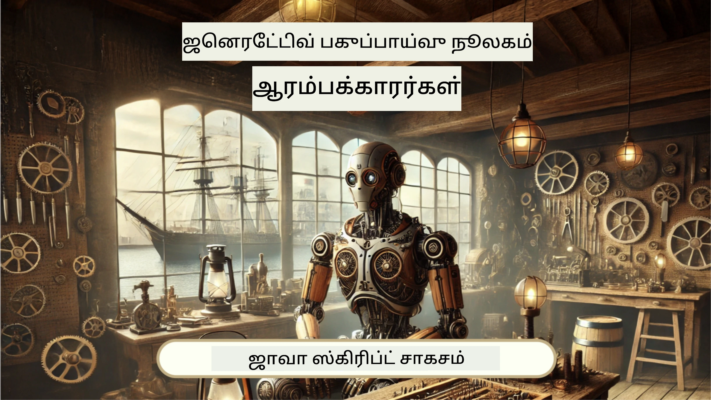

<!--
CO_OP_TRANSLATOR_METADATA:
{
  "original_hash": "fea3a0fceb8ad86fd640c09cf63a2aac",
  "translation_date": "2026-01-07T12:28:29+00:00",
  "source_file": "README.md",
  "language_code": "ta"
}
-->
[](https://github.com/microsoft/Web-Dev-For-Beginners/blob/master/LICENSE)
[](https://GitHub.com/microsoft/Web-Dev-For-Beginners/graphs/contributors/)
[](https://GitHub.com/microsoft/Web-Dev-For-Beginners/issues/)
[](https://GitHub.com/microsoft/Web-Dev-For-Beginners/pulls/)
[](http://makeapullrequest.com)

[](https://GitHub.com/microsoft/Web-Dev-For-Beginners/watchers/)
[](https://GitHub.com/microsoft/Web-Dev-For-Beginners/network/)
[](https://GitHub.com/microsoft/Web-Dev-For-Beginners/stargazers/)

[](https://discord.gg/nTYy5BXMWG)

# ஆரம்பத்தைக் கொண்டவர்களுக்கான வலை மேம்பாடு - ஒரு பாடத்திட்டம்

Microsoft Cloud Advocates உடன் இருக்கும் 12 வார முழுமையான பாடத்திட்டத்தில் வலை மேம்பாட்டின் அடிப்படைகளை கற்றுக்கொள்ளுங்கள். 24 பாடங்களில் ஒவ்வொன்றும் terrariums, உலாவி நீட்சிகள் மற்றும் விண்வெளி விளையாட்டுகள் போன்ற கைமுறை திட்டங்களின் மூலமாக JavaScript, CSS மற்றும் HTML ஐ ஆராய்கிறது. வினாக்கள், விவாதங்கள் மற்றும் நடைமுறை பணிகளுடன் ஈடுபடுங்கள். உங்கள் திறன்களை மேம்படுத்தி, நம் பயனுள்ள திட்ட-அடிப்படையிலான கல்விச் முறையுடன் உங்கள் அறிவை சிறப்பாக உறுதிப்படுத்துங்கள். இன்றே உங்கள் குறியீட்டு பயணத்தை தொடங்குங்கள்!

Azure AI Foundry Discord சமுதாயத்தில் சேரவும்

[](https://discord.gg/nTYy5BXMWG)

இந்த வளங்களை பயன்படுத்த தொடங்க பின்வரும் படிகளை பின்பற்றவும்:
1. **கோப்பகத்தைக் குறுக்கு செய்யவும்**: கிளிக் செய்க [](https://GitHub.com/microsoft/Web-Dev-For-Beginners/fork)
2. **கோப்பகத்தை நகலெடுக்கவும்**:   `git clone https://github.com/microsoft/Web-Dev-For-Beginners.git`
3. [**Azure AI Foundry Discord-இல் சேர்ந்து நிபுணர்களையும் மற்ற டெவலப்பர்களையும் சந்திக்கவும்**](https://discord.com/invite/ByRwuEEgH4)

### 🌐 பல மொழி ஆதரவு

#### GitHub Action மூலம் ஆதரிக்கப்படுகிறது (தானாகவும் எப்போதும் புதுப்பிக்கப்படும்)

<!-- CO-OP TRANSLATOR LANGUAGES TABLE START -->
[Arabic](../ar/README.md) | [Bengali](../bn/README.md) | [Bulgarian](../bg/README.md) | [Burmese (Myanmar)](../my/README.md) | [Chinese (Simplified)](../zh/README.md) | [Chinese (Traditional, Hong Kong)](../hk/README.md) | [Chinese (Traditional, Macau)](../mo/README.md) | [Chinese (Traditional, Taiwan)](../tw/README.md) | [Croatian](../hr/README.md) | [Czech](../cs/README.md) | [Danish](../da/README.md) | [Dutch](../nl/README.md) | [Estonian](../et/README.md) | [Finnish](../fi/README.md) | [French](../fr/README.md) | [German](../de/README.md) | [Greek](../el/README.md) | [Hebrew](../he/README.md) | [Hindi](../hi/README.md) | [Hungarian](../hu/README.md) | [Indonesian](../id/README.md) | [Italian](../it/README.md) | [Japanese](../ja/README.md) | [Kannada](../kn/README.md) | [Korean](../ko/README.md) | [Lithuanian](../lt/README.md) | [Malay](../ms/README.md) | [Malayalam](../ml/README.md) | [Marathi](../mr/README.md) | [Nepali](../ne/README.md) | [Nigerian Pidgin](../pcm/README.md) | [Norwegian](../no/README.md) | [Persian (Farsi)](../fa/README.md) | [Polish](../pl/README.md) | [Portuguese (Brazil)](../br/README.md) | [Portuguese (Portugal)](../pt/README.md) | [Punjabi (Gurmukhi)](../pa/README.md) | [Romanian](../ro/README.md) | [Russian](../ru/README.md) | [Serbian (Cyrillic)](../sr/README.md) | [Slovak](../sk/README.md) | [Slovenian](../sl/README.md) | [Spanish](../es/README.md) | [Swahili](../sw/README.md) | [Swedish](../sv/README.md) | [Tagalog (Filipino)](../tl/README.md) | [Tamil](./README.md) | [Telugu](../te/README.md) | [Thai](../th/README.md) | [Turkish](../tr/README.md) | [Ukrainian](../uk/README.md) | [Urdu](../ur/README.md) | [Vietnamese](../vi/README.md)

> **உங்களுடைய கணினியில் நகல் எடுக்க விரும்புகிறீர்களா?**

> இந்த கோப்பகம் 50+ மொழி மொழிபெயர்ப்புகளை கொண்டுள்ளது, இது பதிவிறக்க அளவைக் குறைக்கும் உதவும். மொழிபெயர்ப்புகளை இல்லாமல் நகல் எடுக்க sparse checkout ஐ பயன்படுத்தவும்:
> ```bash
> git clone --filter=blob:none --sparse https://github.com/microsoft/Web-Dev-For-Beginners.git
> cd Web-Dev-For-Beginners
> git sparse-checkout set --no-cone '/*' '!translations' '!translated_images'
> ```
> இது பாடத்திட்டத்தை முழுமையாக முடிக்க தேவையான அனைத்தையும் விரைவான பதிவிறக்கத்துடன் வழங்கும்.
<!-- CO-OP TRANSLATOR LANGUAGES TABLE END -->

**கூடுதல் மொழிபெயர்ப்பு மொழிகள் ஆதரிக்கப்பட வேண்டும் என்றால், பட்டியலை [இங்கே](https://github.com/Azure/co-op-translator/blob/main/getting_started/supported-languages.md) காணவும்**

[](https://open.vscode.dev/microsoft/Web-Dev-For-Beginners)

#### 🧑‍🎓 _நீங்கள் மாணவரா?_

[**Student Hub பக்கத்தை**](https://docs.microsoft.com/learn/student-hub/?WT.mc_id=academic-77807-sagibbon) பார்வையிடுங்கள். அங்கு ஆரம்பக் கல்வி வளங்கள், மாணவர் தொகுப்புகள் மற்றும் இலவச சான்றிதழ் வவுச்சர் பெறும் வழிமுறைகளும் உள்ளன. மாதாந்திரமாகப் புதுப்பிக்கப்படும் உள்ளடக்கத்தைக் காண இந்த பக்கம் நீங்கள் கூடுதல் பார்க்கத் தேவைப்படும்.

### 📣 அறிவிப்பு - GitHub Copilot Agent முறை சவால்கள் புதியவை!

புதிய சவால் சேர்க்கப்பட்டது, பெரும்பாலான அத்தியாயங்களில் "GitHub Copilot Agent Challenge 🚀" என தேடுங்கள். இது GitHub Copilot மற்றும் Agent முறையை பயன்படுத்தி நீங்கள் முடிக்க வேண்டிய புதிய சவால் ஆகும். முன்பு Agent முறையைப் பயன்படுத்தவில்லையெனில், இது உரை உருவாக்குதல் மட்டுமின்றி கோப்புகள் உருவாக்கல் மற்றும் திருத்துதல், கட்டளை இயக்குதல் மற்றும் இன்னும் பலவற்றை செய்யக்கூடியது.

### 📣 அறிவிப்பு - _Generative AI பயன்படுத்தி புதிய திட்டம்_ 

புதிய AI உதவியாளர் திட்டம் சேர்க்கப்பட்டுள்ளது, இதைப் பார்க்கவும் [திட்டம்](./9-chat-project/README.md)

### 📣 அறிவிப்பு - _Generative AI க்கான புதிய பாடத்திட்டம்_ JavaScript க்கானது வெளியிடப்பட்டது

எமது புதிய Generative AI பாடத்திட்டத்தை தவறவிடுங்கள்!

தொடங்க, [https://aka.ms/genai-js-course](https://aka.ms/genai-js-course) பார்க்கவும்!



- அடிப்படை முதல் RAG வரை ஆய்வுகள் உள்ளன.
- GenAI மற்றும் எங்களுடைய கூட்டாளி செயலியுடன் வரலாற்று காட்சிகளுடன் தொடர்பு கொள்ளவும்.
- பொழுதுபோக்கான மற்றும் ஈர்க்கக்கூடிய கதை, கால பயணம் செய்யும் அனுபவம்!


ஒவ்வொரு பாடத்திலும் ஒரு பணியை முடிக்கவும், அறிவு பரிசோதனை மற்றும் சவால்களை உள்ளடக்கியது, இவற்றை வழிநடத்தி நீங்கள் கீழ்க்காணும் தலைப்புகளை கற்றுக் கொள்ளலாம்:
- வழிகாட்டும் கேள்விகள் மற்றும் வழிகாட்டல் பொறியியல்
- உரை மற்றும் படம் செயலி உருவாக்குதல்
- தேடல் செயலிகள்

தொடங்க [https://aka.ms/genai-js-course](../../[https:/aka.ms/genai-js-course) பார்க்கவும்!


## 🌱 தொடக்கம்

> **ஆசிரியர்கள்**, இந்த பாடத்திட்டத்தை எப்படி பயன்படுத்துவது என்பது குறித்து [சிபாரிசுகள்](for-teachers.md) சேர்த்துள்ளோம். உங்கள் கருத்துக்களை எங்கள் [விவாதக் குழுவில்](https://github.com/microsoft/Web-Dev-For-Beginners/discussions/categories/teacher-corner) பகிர்ந்து கொள்ள விரும்புகிறோம்!

**[கல்வியாளர்கள்](https://aka.ms/student-page/?WT.mc_id=academic-77807-sagibbon)**, ஹரொரு பாடத்திலும் முன்-பாடவாய்ப்பு வினாத்தாளுடன் தொடங்கி, பாடக்க material அகங்களைப் படித்து, பல செயல்பாடுகளை முடித்து, பின்னர் பாட்டுப் பாட வினாத்தாளில் உங்கள் புரிதலைச் சோதிக்கவும்.

உங்கள் கற்றல் அனுபவத்தை மேம்படுத்த, உங்கள் நண்பர்களுடன் இணைந்து திட்டங்களைக் கையாளவும்! விவாதங்கள் நமது [விவாதக் குழுவில்](https://github.com/microsoft/Web-Dev-For-Beginners/discussions) ஊக்குவிக்கப்படுகின்றன, எங்கே நமது மோதரேட்டர் குழு உங்கள் கேள்விகளுக்கு பதிலளிக்க தயாராக இருக்கும்.

மேலும் உங்கள் கல்வியை மேம்படுத்த, [Microsoft Learn](https://learn.microsoft.com/users/wirelesslife/collections/p1ddcy5jwy0jkm?WT.mc_id=academic-77807-sagibbon) இல் கூடுதல் படிப்பு பொருட்களை ஆராய பரிந்துரை செய்கின்றோம்.

### 📋 உங்கள் சூழலை அமைத்தல்

இந்த பாடத்திட்டத்திற்கு ஒரு மேம்பாடு சூழல் தயார் செய்யப்பட்டுள்ளது! நீங்கள் தொடங்கும் போது, [Codespace](https://github.com/features/codespaces/) (_உலாவியில் இயங்கும், நிறுவல்களைத் தேவையில்லாத சூழல்_) அல்லது [Visual Studio Code](https://code.visualstudio.com/?WT.mc_id=academic-77807-sagibbon) போன்ற உரை தொகுப்புடைய உங்கள் கணினியில் பேசலாம்.

#### உங்கள் கோப்பகத்தை உருவாக்கவும்
உங்கள் பணியை எளிதில் சேமிக்க உங்கள் சொந்தக் காப்பியை உருவாக்குவது பரிந்துரைக்கப்படுகிறது. இதை செய்ய, பக்கத்தின் மேல் பகுதியில் உள்ள **Use this template** பொத்தானை கிளிக் செய்யவும். இது உங்கள் GitHub கணக்கில் இந்த பாடத்திட்டத்தின் நகலுடன் புதிய கோப்பகத்தை உருவாக்கும்.

பின்வரும் படிகளை பின்பற்றி:
1. **கோப்பகத்தை குறுக்கு செய்யவும் (Fork)**: இந்த பக்கத்தின் வலது மேல் மூலையில் உள்ள "Fork" பொத்தானை கிளிக் செய்யவும்.
2. **கோப்பகத்தை கிளோன் செய்யவும்**:   `git clone https://github.com/microsoft/Web-Dev-For-Beginners.git`

#### Codespaceஇல் பாடத்திட்டத்தை இயக்குதல்

நீங்கள் உருவாக்கிய இந்தக் கோப்பகத்தின் நகலில், **Code** பொத்தானை கிளிக் செய்து **Open with Codespaces** ஐத் தேர்ந்தெடுக்கவும். இது உங்களுக்கான புதிய Codespace ஐ உருவாக்கும்.


#### உங்கள் கணினியில் பாடத்திட்டத்தை இயக்குதல்

இந்த பாடத்திட்டத்தை உங்கள் கணினியில் இயக்க, ஒரு உரை தொகுப்பான், உலாவி மற்றும் கட்டளைக்கட்டளை கருவி தேவை. எங்கள் முதல் பாடம் [Introduction to Programming Languages and Tools of the Trade](../../1-getting-started-lessons/1-intro-to-programming-languages) இதில் பல விருப்பங்களைக் கூறி உங்களுக்கு ஏற்றதைத் தேர்ந்தெடுக்க உதவும்.

நாம் பரிந்துரைக்கும் உரை தொகுப்பான் [Visual Studio Code](https://code.visualstudio.com/?WT.mc_id=academic-77807-sagibbon), இதன் உட்பட்ட [Terminal](https://code.visualstudio.com/docs/terminal/basics/?WT.mc_id=academic-77807-sagibbon) அமையும் உண்டு. Visual Studio Code ஐ [இங்கே](https://code.visualstudio.com/?WT.mc_id=academic-77807-sagibbon) இருந்து பதிவிறக்கலாம்.


1. உங்கள் கணினிக்கு கோப்பகத்தை கிளோன் செய்யவும். இது **Code** பொத்தானை கிளிக் செய்து URL ஐ நகலெடுத்து செய்யலாம்:

    [CodeSpace](./images/createcodespace.png)
அப்பொழுது, [Visual Studio Code](https://code.visualstudio.com/?WT.mc_id=academic-77807-sagibbon) உள்ளே [Terminal](https://code.visualstudio.com/docs/terminal/basics/?WT.mc_id=academic-77807-sagibbon) ஐ திறந்து, கீழ்காணும் கட்டளை இயக்கவும், `<your-repository-url>` என்பதனை நீங்கள் இப்போது பிரதிபலித்துள்ள URL-ஆக மாற்றவும்:

    ```bash 
    git clone <your-repository-url>
    ```

2. Visual Studio Code இல் கோப்புறை திறக்கவும். **File** > **Open Folder** என்பதனை கிளிக் செய்து நீங்கள் தற்போது குறியிட்ட கோப்புறையை தேர்ந்தெடுக்கலாம்.

>  பரிந்துரைக்கப்பட்ட Visual Studio Code விரிவாக்கங்கள்:
>
> * [Live Server](https://marketplace.visualstudio.com/items?itemName=ritwickdey.LiveServer&WT.mc_id=academic-77807-sagibbon) - Visual Studio Code இல் HTML பக்கங்களை முன்னோடி பார்க்க
> * [Copilot](https://marketplace.visualstudio.com/items?itemName=GitHub.copilot&WT.mc_id=academic-77807-sagibbon) - நீங்கள் குறியீடு எழுதுவதில் வேகம் அதிகரிக்க உதவும்

## 📂 ஒவ்வொரு பாடத்திலும் செய்யப்பட்டுள்ளது:

- விருப்பமான ஸ்கெட்ச்நோட்
- விருப்பமான கூடுதல் காணொளி
- முன்னே பாடப் பழகல் குயிஸ்
- எழுத்துப்பாடம்
- திட்டம் சார்ந்த பாடங்களுக்கு, திட்டத்தை கட்டமைப்பதற்கான படிநிலை வழிகாட்டிகள்
- அறிவு பரிசோதனைகள்
- ஒரு சவால்
- கூடுதல் வாசிப்பு
- பின்-பாடக் குயிஸ் [post-lesson quiz](https://ff-quizzes.netlify.app/web/)

> **குயிஸ்கள் குறித்த குறிப்புகள்**: அனைத்து குயிஸ்களும் Quiz-app கோப்புறையில் உள்ளன, மூன்று கேள்விகளைக் கொண்ட மொத்தம் 48 குயிஸ்கள் இருக்கின்றன. அவை [இங்கே](https://ff-quizzes.netlify.app/web/) கிடைக்கின்றன, குயிஸ் பயன்பாட்டை உள்ளூர్లో ஓட்டவோ அல்லது Azure இல் வெளியிடவோ முடியும்; `quiz-app` கோப்புறையின் வழிமுறைகளை பின்பற்றவும்.

## 🗃️ பாடங்கள்

|     |                       திட்டத்தின் பெயர்                       |                            கற்றுக்கொள்ளப்படும் கருத்துக்கள்                             | கற்கை நோக்கங்கள்                                                                                                                 |                                                         சம்பந்தப்பட்ட பாடம்                                                          |         ஆசிரியர்          |
| :-: | :------------------------------------------------------: | :--------------------------------------------------------------------: | ----------------------------------------------------------------------------------------------------------------------------------- | :----------------------------------------------------------------------------------------------------------------------------: | :---------------------: |
| 01  |                     தொடக்கம்                      |           நிரலாக்க அறிமுகம் மற்றும் தொழில்சாதனங்கள்           | பெரும்பாலான நிரலாக்க மொழிகளின் அடிப்படைகளை கற்றுக்கொள்ளவும் மற்றும் தொழில்முறை டெவலப்பர்கள் தங்களின் பணி செய்ய உதவும் மென்பொருள் பற்றி தெரிந்து கொள்ளவும் | [நிரலாக்க மொழிகள் மற்றும் தொழில்சாதனங்கள் அறிமுகம்](./1-getting-started-lessons/1-intro-to-programming-languages/README.md) |         Jasmine         |
| 02  |                     தொடக்கம்                      |             GitHub அடிப்படைகள், ஒரு குழுவுடன் பணியாற்றும் முறைகள்             | உங்கள் திட்டத்தில் GitHub ஐ எப்படி பயன்படுத்துவது, மற்றவர்களுடன் குறியீடு பரிமாற்றம் செய்வது எப்படி                                                                |                            [GitHub அறிமுகம்](./1-getting-started-lessons/2-github-basics/README.md)                             |          Floor          |
| 03  |                     தொடக்கம்                      |                             அணுகத்தக்க தன்மை                              | வலை அணுகத்தக்க தன்மை அடிப்படைகள் கற்றுக்கொள்ளவும்                                                                                               |                       [அணுகத்தக்க தன்மை அடிப்படைகள்](./1-getting-started-lessons/3-accessibility/README.md)                       |       Christopher       |
| 04  |                        JS அடிப்படைகள்                         |                         JavaScript தரவுத் தகுதிகள்                          | JavaScript தரவுத் தகுதிகளின் அடிப்படை                                                                                                 |                                       [தரவுத் தகுதிகள்](./2-js-basics/1-data-types/README.md)                                        |         Jasmine         |
| 05  |                        JS அடிப்படைகள்                         |                         செயல்பாடுகள் மற்றும் முறைமைகள்                          | பயன்பாட்டின் நியமநிலை ஒற்றுமையை நிர்வகிக்க செயல்பாடுகள் மற்றும் முறைமைகளை பற்றி கற்றுக்கொள்ளவும்                                                             |                              [செயல்பாடுகள் மற்றும் முறைமைகள்](./2-js-basics/2-functions-methods/README.md)                               | Jasmine மற்றும் Christopher |
| 06  |                        JS அடிப்படைகள்                         |                        JS மூலம் முடிவெடுக்கல்                        | உங்கள் குறியீட்டில் முடிவெடுத்தல் முறைகளை உருவாக்க கற்றுக்கொள்ளவும்                                                           |                                 [முடிவெடுத்தல்](./2-js-basics/3-making-decisions/README.md)                                  |         Jasmine         |
| 07  |                        JS அடிப்படைகள்                         |                            வரிசைகள் மற்றும் சுற்றிகள்                            | JavaScript-இல் வரிசைகள் மற்றும் சுற்றிகள் மூலம் தரவை கையாளவும்                                                                                 |                                   [வரிசைகள் மற்றும் சுற்றிகள்](./2-js-basics/4-arrays-loops/README.md)                                    |         Jasmine         |
| 08  |       [Terrarium](./3-terrarium/solution/README.md)       |                            HTML நடைமுறை                            | ஆன்லைன் டெரேரியத்தை உருவாக்கும் HTML கட்டமைவிட்டு, கட்டமைப்புக்கு கவனம் செலுத்தவும்                                                         |                                 [HTML அறிமுகம்](./3-terrarium/1-intro-to-html/README.md)                                 |           Jen           |
| 09  |       [Terrarium](./3-terrarium/solution/README.md)       |                            CSS நடைமுறை                             | ஆன்லைன் டெரேரியத்தை அலங்கரிக்க CSS கட்டமைத்து, அடிப்படையான CSS மற்றும் பக்கம் பதிலளிக்கும் முறைகள் பற்றி கற்றுக்கொள்ளவும்                     |                                  [CSS அறிமுகம்](./3-terrarium/2-intro-to-css/README.md)                                  |           Jen           |
| 10  |            [Terrarium](./3-terrarium/solution/README.md)            |                 JavaScript மூடுபெயர்ச்சி, DOM செயலாக்கம்                  | டெரேரியத்தை ஒரு டிராக்/டிராப் இடைமுகமாக செயல்படுத்த JavaScript எழுதுக, மூடுபெயர்ச்சி மற்றும் DOM செயலாக்கம் பற்றி கவனம் செலுத்தவும்             |                  [JavaScript மூடுபெயர்ச்சி, DOM செயலாக்கம்](./3-terrarium/3-intro-to-DOM-and-closures/README.md)                   |           Jen           |
| 11  |          [Typing Game](./4-typing-game/solution/README.md)          |                          টাইப்பிங் கேம் உருவாக்கல்                           | உங்கள் JavaScript பயன்பாட்டின் நியமநிலையை இயக்க விசைப்பலகை நிகழ்வுகளை எப்படி பயன்படுத்துவது என்று கற்றுக்கொள்ளவும்                                                          |                                [நிகழ்வு சார்ந்த நிரலாக்கம்](./4-typing-game/typing-game/README.md)                                |       Christopher       |
| 12  | [Green Browser Extension](./5-browser-extension/solution/README.md) |                         உலாவிகள் வேலை செயல்                          | உலாவிகள் எப்படி வேலை செய்கின்றன, அவற்றின் வரலாறு, ஒரு உலாவி நீட்டிப்பின் முதல் கூறுகளை உருவாக்குவது எப்படி என்பதை கற்றுக்கொள்ளவும்                               |                               [உலாவிகள் குறித்த](./5-browser-extension/1-about-browsers/README.md)                                |           Jen           |
| 13  | [Green Browser Extension](./5-browser-extension/solution/README.md) | படிவம் உருவாக்கல், API அழைப்பும் உள்ளக சேமிப்பில் 변수 சேமிப்பும் | API ஐ அழைக்க உலாவி நீட்டிப்பின் JavaScript கூறுகளை உருவாக்கவும்; உள்ளக சேமிப்பில் சேமிக்கப்பட்ட மாறி மதிப்புகளை பயன்படுத்தவும்                      |                [APIs, படிவங்கள் மற்றும் உள்ளக சேமிப்பு](./5-browser-extension/2-forms-browsers-local-storage/README.md)                 |           Jen           |
| 14  | [Green Browser Extension](./5-browser-extension/solution/README.md) |          உலாவி பின்னணி செயலிகள், வலை செயல்திறன்          | நீட்டிப்பின் ஐகானை நிர்வகிக்க உலாவியின் பின்னணி செயலிகளைப் பயன்படுத்தவும்; வலை செயல்திறன் மற்றும் சில மேம்பாடுகள் பற்றி கற்றுக்கொள்ளவும்   |             [பின்னணி பணிகள் மற்றும் செயல்திறன்](./5-browser-extension/3-background-tasks-and-performance/README.md)              |           Jen           |
| 15  |           [Space Game](./6-space-game/solution/README.md)           |             JavaScript உதவி அதிகரிக்கப்பட்ட விளையாட்டு மேம்பாடு             | வகுப்புகளையும் கூட்டமைப்பையும் பயன்படுத்தி பேருரிமையை கற்றுக்கொள்ளவும் மற்றும் Pub/Sub வடிவமைப்பை அறிந்து விளையாட்டைப் போடும் முன் துவங்கவும்              |                      [மேம்பட்ட விளையாட்டு மேம்பாடு அறிமுகம்](./6-space-game/1-introduction/README.md)                       |          Chris          |
| 16  |           [Space Game](./6-space-game/solution/README.md)           |                           கேன்வாஸ் வரைதல்                            | திரையில் கூறுகளை வரைய தேவைப்படும் Canvas API பற்றி கற்றுக்கொள்ளவும்                                                                       |                                [கேன்வாஸ் வரைதல்](./6-space-game/2-drawing-to-canvas/README.md)                                |          Chris          |
| 17  |           [Space Game](./6-space-game/solution/README.md)           |                   திரையில் கூறுகள் நகர்த்தல்                    | கார்டிசியன் ஒருங்குத்தல்கள் மற்றும் Canvas API உதவியுடன் கூறுகள் எப்படி நகர்கின்றன என்பதை கண்டறியவும்                                            |                           [குறுப்புகளை நகர்த்தல்](./6-space-game/3-moving-elements-around/README.md)                           |          Chris          |
| 18  |           [Space Game](./6-space-game/solution/README.md)           |                          மோதி கண்டறிதல்                           | கூறுகள் எப்படி ஒருவரை ஒருவர் மோதி விளையாட்டு செயல்திறனை உறுதி செய்ய ஒரு குளிர் செயல்பாட்டுடன் செயல்படுகிறார்கள் என்பதைக் கற்றுக்கொள்ளவும்    |                              [மோதி கண்டறிதல்](./6-space-game/4-collision-detection/README.md)                              |          Chris          |
| 19  |           [Space Game](./6-space-game/solution/README.md)           |                             மதிப்பெண் வைத்தல்                              | விளையாட்டின் நிலை மற்றும் செயல்திறனை அடிப்படையாகக் கொண்டு கணக்குகளைச் செய்யவும்                                                                |                                    [மதிப்பெண் வைத்தல்](./6-space-game/5-keeping-score/README.md)                                    |          Chris          |
| 20  |           [Space Game](./6-space-game/solution/README.md)           |                     விளையாட்டை முடித்தல் மற்றும் மீட்டமைத்தல்                     | விளையாட்டை முடித்தல் மற்றும் மீட்டமைப்புக்கள், சொத்துகளை சுத்தம் செய்தல் மற்றும் மாறிலி மதிப்புகளை மீட்டமைத்தல் பற்றி கற்றுக்கொள்ளவும்                              |                                [முடிவு நிபந்தனை](./6-space-game/6-end-condition/README.md)                                 |          Chris          |
| 21  |         [Banking App](./7-bank-project/solution/README.md)          |                 வலை பயன்பாட்டில் HTML வார்ப்புருக்கள் மற்றும் பாதைகள்                 | பல பக்கங்கள் கொண்ட வலைத்தள கட்டமைப்பை பாதை வழிநடத்தல் மற்றும் HTML வார்ப்புருக்களைக் கொண்டு உருவாக்கும் முறை பற்றி கற்றுக்கொள்ளவும்                             |                            [HTML வார்ப்புருக்கள் மற்றும் பாதைகள்](./7-bank-project/1-template-route/README.md)                             |          Yohan          |
| 22  |         [Banking App](./7-bank-project/solution/README.md)          |                  உள்நுழைவு மற்றும் பதிவு படிவம் உருவாக்கல்                   | படிவங்கள் உருவாக்கல் மற்றும் சரிபார்ப்பு முறைகள் பற்றி கற்றுக்கொள்ளவும்                                                                          |                                           [படிவங்கள்](./7-bank-project/2-forms/README.md)                                           |          Yohan          |
| 23  |         [Banking App](./7-bank-project/solution/README.md)          |                   தரவு பெறுதல் மற்றும் பயன்பாடு                   | உங்கள் பயன்பாட்டிலே தரவு எப்படி வந்து செல்கிறது, அதை பெற்றல், சேமிப்பு மற்றும் திருட்டு செய்வது பற்றி கற்றுக்கொள்ளவும்                                                 |                                            [தரவு](./7-bank-project/3-data/README.md)                                            |          Yohan          |
| 24  |         [Banking App](./7-bank-project/solution/README.md)          |                      நிலை நிர்வாகம் கருத்துக்கள்                      | உங்கள் பயன்பாடு நிலையை எவ்வாறு வைத்திருக்கிறது மற்றும் அதை நிரல் முறையில் எப்படி நிர்வகிப்பது என்பதைக் கற்றுக்கொள்ளவும்                                                              |                                [நிலை நிர்வாகம்](./7-bank-project/4-state-management/README.md)                                |          Yohan          |
| 25 | [Browser/VScode Code](../../8-code-editor) | VScode உடன் பணியாற்றுதல் | குறியீடு தொகுப்பி எப்படி பயன்படுத்துவது கற்றுக்கொள்ளவும் | [VScode Code Editor பயன்படுத்துக](./8-code-editor/1-using-a-code-editor/README.md) | Chris |
| 26 | [AI உதவியாளர்கள்](./9-chat-project/README.md) | AI உடன் பணியாற்றுதல் | உங்கள் சொந்த AI உதவியாளரை எப்படி உருவாக்குவது கற்றுக்கொள்ளவும் | [AI உதவியாளர் திட்டம்](./9-chat-project/README.md) | Chris |

## 🏫 பாடத்திட்டம்

எங்கள் பாடத்திட்டம் இரண்டு முக்கியக் கல்விக் கொள்கைகளுடன் வடிவமைக்கப்பட்டுள்ளது:
* திட்டம் சார்ந்த கற்றல்
* அடிக்கடி குயிஸ்கள்

இந்த திட்டம் JavaScript, HTML மற்றும் CSS அடிப்படைகளை, மேலும் இன்றைய வலை டெவலப்பர்கள் பயன்படுத்தும் சமீபத்திய கருவிகள் மற்றும் தொழில்நுட்பங்களை கற்பிக்கிறது. மாணவர்கள் ஒரு டைப் செய்யும் கேம், மெய்நிகர் டெரேரியம், சுற்றுச்சூழல் பொருந்திய உலாவி நீட்டிப்பு, விண்வெளி படையல் பாணி விளையாட்டு மற்றும் வணிக கணக்கியல் பயன்பாட்டை உருவாக்கும் மூலம் நேரடித் அனுபவம் பெறுவர். தொடர் முடிவுக்கு நிலையில், மாணவர்கள் வலை மேம்பாட்டின் உறுதியான புரிதலைப் பெறுவர்.

> 🎓 இந்த பாடத்திட்டத்தின் முதல் சில பாடங்களை Microsoft Learn இல் [Learn Path](https://docs.microsoft.com/learn/paths/web-development-101/?WT.mc_id=academic-77807-sagibbon) ஆக எடுக்கலாம்!

திட்டங்களுக்கு எந்த வடிவமைப்பும் பொருந்திநிலை பின்பற்றுவதால் மாணவர்களுக்கான ஈடுபாட்டும் கருத்துக்கள் நீடிக்கும் தன்மையும் அதிகரிக்கும். JavaScript அடிப்படைகள் குறைந்தபட்ச வித்தியாசங்களை அறிமுகப்படுத்த சில தொடக்க பாடங்களும், "[JavaScript தொடக்க தொடர்](https://channel9.msdn.com/Series/Beginners-Series-to-JavaScript/?WT.mc_id=academic-77807-sagibbon)" வீடியோ பாடத் தொகுப்பில் இருந்து ஒரு காணொளியும் இணைக்கப்பட்டுள்ளது, அதுவரையில் சில ஆசிரியர்கள் இந்த பாடத்திட்டத்திற்கு பங்களித்துள்ளனர்.

மேலும், வகுப்புக்கு முன்தானியச்சாதனம் ஒரு குறைந்தபட்சமான குயிஸ் மூலம் மாணவரின் படிக்கும் நோக்கம் சமர்ப்பிக்கப்படுகிறது, வகுப்புக்குப் பின்பு இரண்டாவது குயிஸ் தன்மை மையமாக இருக்கும். இந்த பாடத்திட்டம் நெகிழ்வாகவும் வேடிக்கையாகவும் உருவாக்கப்பட்டுள்ளது மற்றும் முழுவதும் அல்லது பகுதியளவு ஏற்றுக்கொள்ளக்கூடியது. 12 வாரம் தொடர்ந்த இந்த திட்டங்கள் ஆரம்பத்தில் சிறியவை, இறுதியில் சிக்கலானவையாக மாறும்.

JavaScript கட்டமைப்புக்களை அறிமுகப்படுத்தாமல் வலைப்பDeveloper ஆக தேவையான அடிப்படைக் கையறைகள் மீது கவனம் செலுத்த இந்த திட்டம் வடிவமைக்கப்பட்டுள்ளது. இந்த பாடத்திட்டத்தை முடிக்க அடுத்தடுத்த ஓர் நல்ல படி Node.js பற்றி தனி வீடியோ தொகுப்பின் மூலம் கற்றுக்கொள்வது "[Node.js தொடக்க தொடர்](https://channel9.msdn.com/Series/Beginners-Series-to-Nodejs/?WT.mc_id=academic-77807-sagibbon)" ஆகும்.

> எங்கள் [ஒழுங்கு செயல்முறை](CODE_OF_CONDUCT.md) மற்றும் [பங்களிப்பு](CONTRIBUTING.md) வழிகாட்டுதல்களை பார்வையிடவும். உங்கள் கட்டுமான கருத்துக்களை வரவேற்கின்றோம்!


## 🧭 இணையமற்ற அணுகல்

[Docsify](https://docsify.js.org/#/) பயன்படுத்தி இந்த ஆவணத்தை இணையமின்றி இயக்கலாம். இந்த தொகுப்பைக் fork செய்து, [Docsify ஐ நிறுவி](https://docsify.js.org/#/quickstart) உங்கள் உள்ளூர் கணினியில் நிறுவி, பின்னர் இந்த தொகுப்பின் முகப்புக் கோப்புறையில் `docsify serve` எனக் கமாண்ட் செய்யவும். இந்த இணையத்தளமும் உங்கள் உள்ளூரில் வடிவமைக்கப்பட்ட 3000 போர்ட்டில் சேவையாக இருக்கும்: `localhost:3000`.

## 📘 PDF

எல்லா பாடங்களின் PDF இனை [இங்கே](https://microsoft.github.io/Web-Dev-For-Beginners/pdf/readme.pdf) காணலாம்.


## 🎒 பிற பாட வகுப்புகள்
எங்கள் குழு பிற பாடநெறிகளை தயாரிக்கிறது! பார்வையிடவும்:

<!-- CO-OP TRANSLATOR OTHER COURSES START -->
### LangChain
[](https://aka.ms/langchain4j-for-beginners)
[](https://aka.ms/langchainjs-for-beginners?WT.mc_id=m365-94501-dwahlin)

---

### Azure / Edge / MCP / Agents
[](https://github.com/microsoft/AZD-for-beginners?WT.mc_id=academic-105485-koreyst)
[](https://github.com/microsoft/edgeai-for-beginners?WT.mc_id=academic-105485-koreyst)
[](https://github.com/microsoft/mcp-for-beginners?WT.mc_id=academic-105485-koreyst)
[](https://github.com/microsoft/ai-agents-for-beginners?WT.mc_id=academic-105485-koreyst)

---
 
### Generative AI Series
[](https://github.com/microsoft/generative-ai-for-beginners?WT.mc_id=academic-105485-koreyst)
[-9333EA?style=for-the-badge&labelColor=E5E7EB&color=9333EA)](https://github.com/microsoft/Generative-AI-for-beginners-dotnet?WT.mc_id=academic-105485-koreyst)
[-C084FC?style=for-the-badge&labelColor=E5E7EB&color=C084FC)](https://github.com/microsoft/generative-ai-for-beginners-java?WT.mc_id=academic-105485-koreyst)
[-E879F9?style=for-the-badge&labelColor=E5E7EB&color=E879F9)](https://github.com/microsoft/generative-ai-with-javascript?WT.mc_id=academic-105485-koreyst)

---
 
### Core Learning
[](https://aka.ms/ml-beginners?WT.mc_id=academic-105485-koreyst)
[](https://aka.ms/datascience-beginners?WT.mc_id=academic-105485-koreyst)
[](https://aka.ms/ai-beginners?WT.mc_id=academic-105485-koreyst)
[](https://github.com/microsoft/Security-101?WT.mc_id=academic-96948-sayoung)
[](https://aka.ms/webdev-beginners?WT.mc_id=academic-105485-koreyst)
[](https://aka.ms/iot-beginners?WT.mc_id=academic-105485-koreyst)
[](https://github.com/microsoft/xr-development-for-beginners?WT.mc_id=academic-105485-koreyst)

---
 
### Copilot Series
[](https://aka.ms/GitHubCopilotAI?WT.mc_id=academic-105485-koreyst)
[](https://github.com/microsoft/mastering-github-copilot-for-dotnet-csharp-developers?WT.mc_id=academic-105485-koreyst)
[](https://github.com/microsoft/CopilotAdventures?WT.mc_id=academic-105485-koreyst)
<!-- CO-OP TRANSLATOR OTHER COURSES END -->

## உதவிக்கு

AI செயலிகளை உருவாக்கும்போது நீங்கள் இடையூறடைந்தால் அல்லது கேள்விகள் இருந்தால், MCP பற்றி மற்ற மாணவர்களும் அனுபவமுள்ள வடிவமைப்பாளர்களுடன் கலந்துரையாடவும். கேள்விகள் வரவேற்கப்படும் மற்றும் அறிவு சுதந்திரமாக பகிரப்படும் ஆதரவான சமூகம் இது.

[](https://discord.gg/nTYy5BXMWG)

உடையிருக்கை கருத்து அல்லது பிழைகள் இருந்தால் பயிற்சி அமைக்கும்போது பின்வரும் இடத்தை பார்வையிடவும்:

[](https://aka.ms/foundry/forum)

## உரிமம்

இந்த அலுவலககம் MIT உரிமம் கீழ் உரிமையுள்ளது. மேலும் தகவலுக்கு [LICENSE](../../LICENSE) கோப்பை பார்வையிடவும்.

---

<!-- CO-OP TRANSLATOR DISCLAIMER START -->
**வெளிப்படைத்தன்மை**:  
இந்த ஆவணம் AI மொழி மாற்ற சேவை [Co-op Translator](https://github.com/Azure/co-op-translator) பயன்படுத்தி மொழி மாற்றம் செய்யப்பட்டு உள்ளது. நாங்கள் சரியான தரத்தை வழங்க முயற்சிப்பதாக இருந்தாலும், தானியங்கி மொழி மாற்றங்களில் பிழைகள் அல்லது தவறுகள் இருக்க வாய்ப்பு உள்ளது என்பதைக் கவனிக்கவும். அசல் ஆவணம் அதன் சொந்த மொழியில் அதிகாரபூர்வமான மூலமாகக் கருதப்பட வேண்டும். முக்கியமான தகவல்களுக்கு, தொழில்முறை மனித மொழி மாற்றம் பரிந்துரை செய்வதாகும். இதன் பயன்படுத்துவதால் ஏற்படும் எந்த தவறான புரிதல்கள் அல்லது தவறான விளக்கங்களுக்கு நாங்கள் பொறுப்பேற்க மாட்டோம்.
<!-- CO-OP TRANSLATOR DISCLAIMER END -->