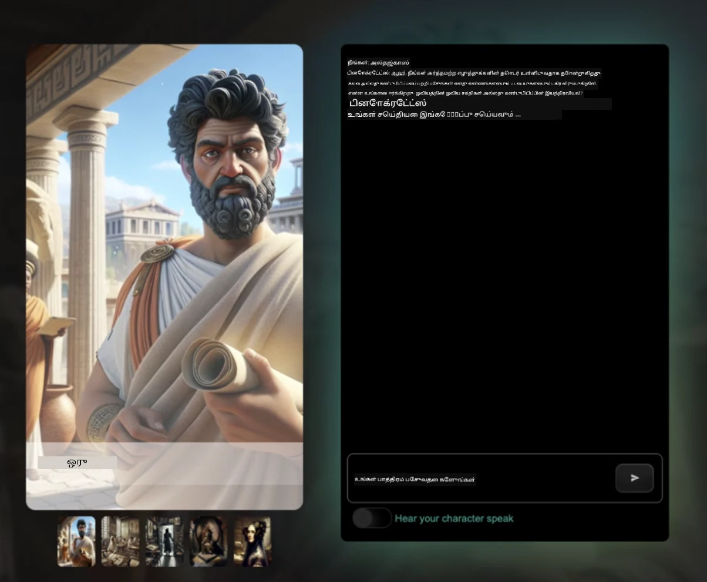
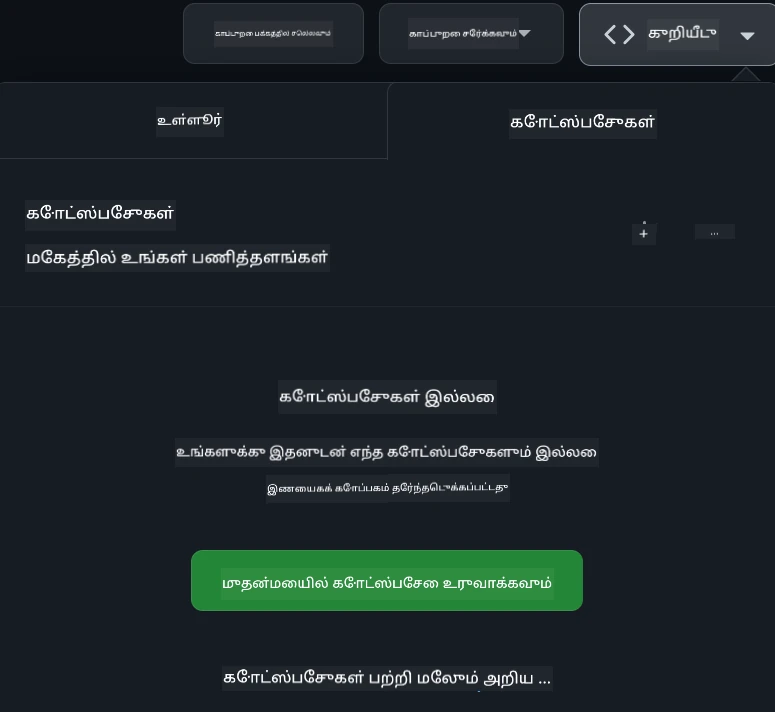

[](https://github.com/microsoft/Web-Dev-For-Beginners/blob/master/LICENSE)
[](https://GitHub.com/microsoft/Web-Dev-For-Beginners/graphs/contributors/)
[](https://GitHub.com/microsoft/Web-Dev-For-Beginners/issues/)
[](https://GitHub.com/microsoft/Web-Dev-For-Beginners/pulls/)
[](http://makeapullrequest.com) 

[](https://GitHub.com/microsoft/Web-Dev-For-Beginners/watchers/)
[](https://GitHub.com/microsoft/Web-Dev-For-Beginners/network/)
[](https://GitHub.com/microsoft/Web-Dev-For-Beginners/stargazers/)

[](https://discord.gg/nTYy5BXMWG)

# ஆரம்பநிலை நெட்வெர் மேம்பாட்டுக்கான பாடத்திட்டம்

Microsoft Cloud Advocates வழங்கும் 12 வார விரிவான பாடநெறியுடன் வலை மேம்பாட்டின் அடிப்படைகளை கற்றுக்கொள்க. 24 பாடங்களின் ஒவ்வொன்றும் ஜாவாஸ்கிரிப்ட், CSS மற்றும் HTML ஐ கரைதிருக்கும் திட்டங்களான டெராரியம்கள், உலாவி நீட்சிகள் மற்றும் விண்வெளி விளையாட்டுகள் மூலம் கையடக்கப் பயிற்சிகளுடன் ஆராய்கிறது. கேள்வி கேட்கிற, விவாதம் செய்க, மற்றும் நடைமுறை பணிகளை மேற்கொள். உங்கள் திறன்களை மேம்படுத்தவும் உங்கள் அறிவு நினைவாற்றலை எங்கள் பயிற்சி திட்டத்தின் மூலம் மேம்படுத்தவும். இன்று உங்கள் குறியீட்டு பயணம் தொடங்குங்கள்!

Azure AI Foundry Discord சமூகத்தில் சேரவும்

[](https://discord.gg/nTYy5BXMWG)

இந்த வளங்களை பயன்படுத்தத் தொடங்க இந்த படிகள் பின்பற்றவும்:
1. **காப்பகத்தை Fork செய்யவும்**: சொடுக்கவும் [](https://GitHub.com/microsoft/Web-Dev-For-Beginners/fork)
2. **காப்பகத்தை கிளோன் செய்யவும்**: `git clone https://github.com/microsoft/Web-Dev-For-Beginners.git`
3. [**Azure AI Foundry Discord இல் கலந்துகொள் மற்றும் நிபுணர்களை மற்றும் இணை உருவாக்குநர்களை சந்தி**](https://discord.com/invite/ByRwuEEgH4)

### 🌐 பலமொழி ஆதரவு

#### GitHub செயல்பாட்டின் மூலம் ஆதரவு (தானியங்கி & எப்போதும் கன்டேட்)

<!-- CO-OP TRANSLATOR LANGUAGES TABLE START -->
[Arabic](../ar/README.md) | [Bengali](../bn/README.md) | [Bulgarian](../bg/README.md) | [Burmese (Myanmar)](../my/README.md) | [Chinese (Simplified)](../zh-CN/README.md) | [Chinese (Traditional, Hong Kong)](../zh-HK/README.md) | [Chinese (Traditional, Macau)](../zh-MO/README.md) | [Chinese (Traditional, Taiwan)](../zh-TW/README.md) | [Croatian](../hr/README.md) | [Czech](../cs/README.md) | [Danish](../da/README.md) | [Dutch](../nl/README.md) | [Estonian](../et/README.md) | [Finnish](../fi/README.md) | [French](../fr/README.md) | [German](../de/README.md) | [Greek](../el/README.md) | [Hebrew](../he/README.md) | [Hindi](../hi/README.md) | [Hungarian](../hu/README.md) | [Indonesian](../id/README.md) | [Italian](../it/README.md) | [Japanese](../ja/README.md) | [Kannada](../kn/README.md) | [Korean](../ko/README.md) | [Lithuanian](../lt/README.md) | [Malay](../ms/README.md) | [Malayalam](../ml/README.md) | [Marathi](../mr/README.md) | [Nepali](../ne/README.md) | [Nigerian Pidgin](../pcm/README.md) | [Norwegian](../no/README.md) | [Persian (Farsi)](../fa/README.md) | [Polish](../pl/README.md) | [Portuguese (Brazil)](../pt-BR/README.md) | [Portuguese (Portugal)](../pt-PT/README.md) | [Punjabi (Gurmukhi)](../pa/README.md) | [Romanian](../ro/README.md) | [Russian](../ru/README.md) | [Serbian (Cyrillic)](../sr/README.md) | [Slovak](../sk/README.md) | [Slovenian](../sl/README.md) | [Spanish](../es/README.md) | [Swahili](../sw/README.md) | [Swedish](../sv/README.md) | [Tagalog (Filipino)](../tl/README.md) | [Tamil](./README.md) | [Telugu](../te/README.md) | [Thai](../th/README.md) | [Turkish](../tr/README.md) | [Ukrainian](../uk/README.md) | [Urdu](../ur/README.md) | [Vietnamese](../vi/README.md)

> **உள்ளூர் கிளோன் செய்ய விரும்புகிறீர்களா?**
>
> இந்த காப்பகம் 50+ மொழி மொழிபெயர்ப்புகளை உள்ளடக்குகிறது, இது பதிவிறக்கக் காட்சியை பெருக்குகிறது. மொழிபெயர்ப்புகள் இல்லாமல் கிளோன் செய்ய sparse checkout ஐ பயன்படுத்தவும்:
>
> **Bash / macOS / Linux:**
> ```bash
> git clone --filter=blob:none --sparse https://github.com/microsoft/Web-Dev-For-Beginners.git
> cd Web-Dev-For-Beginners
> git sparse-checkout set --no-cone '/*' '!translations' '!translated_images'
> ```
>
> **CMD (Windows):**
> ```cmd
> git clone --filter=blob:none --sparse https://github.com/microsoft/Web-Dev-For-Beginners.git
> cd Web-Dev-For-Beginners
> git sparse-checkout set --no-cone "/*" "!translations" "!translated_images"
> ```
>
> இது விரைவான பதிவிறக்கத்துடன் படிப்பை முடிப்பதற்கான அனைத்து தேவைகளையும் உங்களுக்கு வழங்கும்.
<!-- CO-OP TRANSLATOR LANGUAGES TABLE END -->

**மேலும் மொழிபெயர்ப்புகளுக்காக ஆதரவு தேவையெனில், இங்கு பட்டியலிட்டுள்ளன [here](https://github.com/Azure/co-op-translator/blob/main/getting_started/supported-languages.md)**

[](https://open.vscode.dev/microsoft/Web-Dev-For-Beginners)

#### 🧑‍🎓 _நீங்கள் மாணவரா?_

[**மாணவர் ஹப் பக்கம்**](https://docs.microsoft.com/learn/student-hub/?WT.mc_id=academic-77807-sagibbon) பார்க்கவும், அங்கே நீங்கள் ஆரம்பநிலை வளங்கள், மாணவர் பேக்குகள் மற்றும் இலவச சான்றிதழ் வவுச்சர் பெறும் வழிகளையும் காண்பீர்கள். மாதந்தோறும் உள்ளடக்கங்கள் மாறும் என்பதால் இந்தப் பக்கத்தைக் குறிச்சொல் வைத்து உடனுக்குடன் பார்க்கவும்.

### 📣 அறிவிப்பு - புதிய GitHub Copilot Agent முறையிலான சவால்கள் நிறைவு செய்க!

புதிய சவால் சேர்க்கப்பட்டது, பெரும்பாலான அத்தியாயங்களில் "GitHub Copilot Agent Challenge 🚀" என்பதைத் தேடுங்கள். இது GitHub Copilot மற்றும் Agent முறையைப் பயன்படுத்தி முடிக்க புதிய சவாலாகும். நீங்கள் முன்பு Agent முறையைப் பயன்படுத்தவில்லையெனில், இது உரையை உருவாக்குவததற்கு மட்டுமல்லாமல் கோப்புகளை உருவாக்கி மாற்றவும், கட்டளைகளை நடத்தவும் முடியும்.

### 📣 அறிவிப்பு - _உருவாக்கும் AI பயன்படுத்தும் புதிய திட்டம்_

புதிய AI உதவியாளர் திட்டம் சேர்க்கப்பட்டது, சரிபார்க்கவும் [project](./9-chat-project/README.md)

### 📣 அறிவிப்பு - _புதிய பாடத்திட்டம்_ ஜாவாஸ்கிரிப்டுக்கான உருவாக்கும் AI பற்றியவை வெளியிடப்பட்டது

எங்கள் புதிய உருவாக்கும் AI பாடத்திட்டம் தவறவிடாதீர்கள்!

தொடங்க [https://aka.ms/genai-js-course](https://aka.ms/genai-js-course) பார்க்கவும்!


- அடிப்படைகள் முதல் RAG வரை பாடங்கள்.
- GenAI மற்றும் எங்கள் துணை செயலியுடன் பண்புமிகு கதாப்பாத்திரங்களுடன் முத்திரை அமைத்து தொடர்பு கொள்ளுங்கள்.
- சுவையாகவும் ஈர்க்கும் கதைக்களம், நீங்கள் காலப்பயணம் செய்யப் போகிறீர்கள்!




ஒவ்வொரு பாடத்திலும் ஒரு பணியை நிறைவு செய்ய வேண்டும், அறிவு பரிசோதனை மற்றும் சில சவால்கள் உண்டாகும், அவை கீழ்காணும் தலைப்புகளில் உங்களுக்கு வழிகாட்டும்:
- ஃப்ராம்ட் மற்றும் ஃப்ராம்ட் என்ஜினியரிங்
- உரை மற்றும் பட செயலி உருவாக்கம்
- தேடல் செயலிகள்

தொடங்க [https://aka.ms/genai-js-course](https://aka.ms/genai-js-course) பாருங்கள்!


## 🌱 தொடங்குதல்

> **ஆசிரியைர்கள்**, இந்த பாடத்திட்டத்தை எப்படி பயன்படுத்துவது என்பதற்கான சில பரிந்துரைகளை நாங்கள் [இதில் சேர்த்துள்ளோம்](for-teachers.md). உங்கள் கருத்துக்களை [எமது விவாத மன்றத்தில்](https://github.com/microsoft/Web-Dev-For-Beginners/discussions/categories/teacher-corner) பகிர்வீர்கள் என நம்புகிறோம்!

**[கற்றவர்கள்](https://aka.ms/student-page/?WT.mc_id=academic-77807-sagibbon)**, ஒவ்வொரு பாடத்திற்கும் முன்-கல்வி வினோதையுடன் ஆரம்பித்து, பாடத்திட்ட வாசிப்பை தொடரவும், பல்வேறு செயல்பாடுகளை முடிக்கவும் மற்றும் பின்கல்வி வினோதையுடன் உங்கள் புரிதலை சோதிக்கவும்.

உங்கள் கற்றல் அனுபவத்தை மேம்படுத்த, திட்டங்களில் சேர்ந்து செயல்படும் சக மாணவர்களுடன் இணைந்து உழைக்கவும்! விவாதங்கள் எங்கள் [விவாத மன்றத்தில்](https://github.com/microsoft/Web-Dev-For-Beginners/discussions) ஊக்கப்படுத்தப்படுகின்றன, அங்கு எமது மைதான அறிவாளிகள் உங்கள் கேள்விகளுக்கு பதில் அளிக்க காத்திருக்கிறார்கள்.

உங்கள் கல்வியை இன்னும் விரிவுபடுத்த, கூடுதல் படிப்பு பொருட்களுக்காக [Microsoft Learn](https://learn.microsoft.com/users/wirelesslife/collections/p1ddcy5jwy0jkm?WT.mc_id=academic-77807-sagibbon) ஐ கண்டறிய பரிந்துரைக்கிறோம்.

### 📋 உங்கள் சுற்றுப்புறத்தை அமைத்தல்

இந்த பாடத்திட்டத்துக்கு முன்னேற்ற சூழல் தயார் நிலையில் உள்ளது! ஆரம்பிக்கும் போது நீங்கள் பாடத்திட்டத்தை [Codespace](https://github.com/features/codespaces/) (_உலாவி அடிப்படையிலான, நிறுவல்கள் தேவையில்லாத சூழல்_) அல்லது உங்கள் கணினியில் உள்ளே [Visual Studio Code](https://code.visualstudio.com/?WT.mc_id=academic-77807-sagibbon) போன்ற உரை தொகுப்பாளரைப் பயன்படுத்தி இயக்க முடியும்.

#### உங்கள் காப்பகத்தை உருவாக்கல்
உங்கள் பணி சேமிக்க எளிதாக, உங்கள் சொந்த காப்பகத்தை உருவாக்க பரிந்துரைக்கப்படுகிறது. உள் பக்கத்தின் மேல் பகுதியில் உள்ள **Use this template** பொத்தானை அழுத்தி இதை செய்யலாம். இது பாடத்திட்ட காப்பளிக்காக உங்களது GitHub கணக்கில் புதிய காப்பகத்தை உருவாக்கும்.

இந்த படிகளை பின்பற்றவும்:
1. **காப்பகத்தை Fork செய்க**: இந்த பக்கத்தின் வலது மேல் மூலையில் உள்ள "Fork" பொத்தானை அழுத்தவும்.
2. **காப்பகத்தை கிளோன் செய்க**: `git clone https://github.com/microsoft/Web-Dev-For-Beginners.git`

#### Codespace இல் பாடத்திட்டத்தை இயக்குதல்

நீங்கள் உருவாக்கிய காப்பகத்தில், **Code** பொத்தானை அழுத்தி **Open with Codespaces** ஐ தேர்ந்தெடுக்கவும். இது உங்களுக்கான புதிய Codespace-ஐ உருவாக்கும்.



#### உங்கள் கணினியில் உள்ளே பாடத்திட்டத்தை இயக்குதல்

இந்த பாடத்திட்டத்தை உள்ளே இயக்க, உங்கள் கணினியில் உரை தொகுப்பாளர், உலாவி மற்றும் கட்டளை வரி கருவி தேவை. எமது முதல் பாடம் [Introduction to Programming Languages and Tools of the Trade](../../1-getting-started-lessons/1-intro-to-programming-languages) இவற்றை தேர்வு செய்யும் அறிவுரைகளை வழங்கும்.

நாங்கள் பரிந்துரைக்குவது [Visual Studio Code](https://code.visualstudio.com/?WT.mc_id=academic-77807-sagibbon) என்ற தொகுப்பாளர். இது கட்டமைக்கப்பட்ட [Terminal](https://code.visualstudio.com/docs/terminal/basics/?WT.mc_id=academic-77807-sagibbon) உடன் வருகிறது. Visual Studio Code ஐ [இங்கே](https://code.visualstudio.com/?WT.mc_id=academic-77807-sagibbon) பதிவிறக்கம் செய்யலாம்.
1. உங்கள் களஞ்சியத்தை உங்கள் கணினியில் கிளோன் செய்யுங்கள். நீங்கள் இதை **Code** பொத்தானை கிளிக் செய்து URLஐ நகலெடுத்துக்கொள்வதும் மூலம் செய்யலாம்:

    [CodeSpace](./images/createcodespace.png)

    பிறகு, [Visual Studio Code](https://code.visualstudio.com/?WT.mc_id=academic-77807-sagibbon) இல் உள்ள [Terminal](https://code.visualstudio.com/docs/terminal/basics/?WT.mc_id=academic-77807-sagibbon) ஐத் திறந்து, கீழ்கண்ட கட்டளையை இயக்குங்கள், `<your-repository-url>` என்பதற்கு நீங்கள் நடப்பில் நகலெடுத்த URLஐ மாற்றி:

    ```bash 
    git clone <your-repository-url>
    ```

2. Visual Studio Code இல் கோப்புறை(ஐ) திறக்கவும். நீங்கள் இதை **File** > **Open Folder** என்பவற்றை கிளிக் செய்து, நீங்கள் கிளோன் செய்த கோப்புறை(ஐ) தேர்ந்தெடுக்கவும் செய்யலாம்.


>  பரிந்துரைக்கப்பட்ட Visual Studio Code நீட்சிகள்:
>
> * [Live Server](https://marketplace.visualstudio.com/items?itemName=ritwickdey.LiveServer&WT.mc_id=academic-77807-sagibbon) - Visual Studio Code இல் HTML பக்கங்களை முன்னோட்டம் காண
> * [Copilot](https://marketplace.visualstudio.com/items?itemName=GitHub.copilot&WT.mc_id=academic-77807-sagibbon) - உங்கள் குறியீட்டை வேகமாக எழுத உதவும்

## 📂 ஒவ்வொரு பாடமும் அடங்கும்:

- விருப்பமான ஸ்கெட்ச் நோட்
- விருப்பமான கூடுதல் வீடியோ
- பாடத்திற்கு முந்தின ஆய்வுக் கேள்வி
- எழுதிய பாடம்
- திட்ட அடிப்படையிலான பாடங்களுக்கு, திட்டத்தை கட்டடண பயிற்சிகள்
- அறிவு பரிசோதனைகள்
- ஒரு சவால்
- கூடுதல் வாசிப்பு
- பணிஎழுத்து
- [பாடம் முடித்த பிறகு கேள்வி](https://ff-quizzes.netlify.app/web/)

> **கேள்விகளுக்கு ஒரு குறிப்பு**: அனைத்து கேள்விகள் Quiz-app கோப்புறையில் உள்ளன, ஒவ்வொன்றும் மூன்று கேள்விகளால் ஆன 48 கேள்விகள். இவற்றை [இங்கே](https://ff-quizzes.netlify.app/web/) பெறலாம். கேள்வி செயலியை உள்ளகமாக இயக்கவோ அல்லது Azure இல் வெளியிடவோ செய்யலாம்; `quiz-app` கோப்புறையில் உள்ள வழிமுறைகளை பின்பற்றவும்.

## 🗃️ பாடங்கள்

|     |                       திட்டத்தின் பெயர்                       |                            கற்பிக்கப்பட்ட கருத்துக்கள்                             | கற்றல் நோக்கங்கள்                                                                                                                 |                                                         இணைக்கப்பட்ட பாடம்                                                          |         ஆசிரியர்          |
| :-: | :------------------------------------------------------: | :--------------------------------------------------------------------: | ----------------------------------------------------------------------------------------------------------------------------------- | :----------------------------------------------------------------------------------------------------------------------------: | :---------------------: |
| 01  |                     Getting Started                      |           நிரலாக்க அறிமுகம் மற்றும் கருவிகள்           | பெரும்பாலான நிரலாக்க மொழிகளின் அடிப்படைகளை அறிந்து, தொழில்முறை டெவலப்பர்களின் பணிக்கான மென்பொருட்களைப் பற்றி அறிதல் | [Intro to Programming Languages and Tools of the Trade](./1-getting-started-lessons/1-intro-to-programming-languages/README.md) |         Jasmine         |
| 02  |                     Getting Started                      |             GitHub அடிப்படைகள், குழுவுடன் பணியாற்றுதல்             | உங்கள் திட்டத்தில் GitHub ஐ எப்படி பயன்படுத்துவது, மற்றவர்களுடன் குறியீட்டு தளத்தில் கூட்டிணைவது                                                    |                            [Intro to GitHub](./1-getting-started-lessons/2-github-basics/README.md)                             |          Floor          |
| 03  |                     Getting Started                      |                             அணுகல்திறன்                              | வலை அணுகல்திறன் அடிப்படைகளை கற்றுக்கொள்ளவும்                                                                                               |                       [Accessibility Fundamentals](./1-getting-started-lessons/3-accessibility/README.md)                       |       Christopher       |
| 04  |                        JS Basics                         |                         ஜாவாஸ்கிரிப்ட் தரவுகளின் வகைகள்                          | ஜாவாஸ்கிரிப்ட் தரவுகளின் அடிப்படைகள்                                                                                                 |                                       [Data Types](./2-js-basics/1-data-types/README.md)                                        |         Jasmine         |
| 05  |                        JS Basics                         |                         செயல்பாடுகள் மற்றும் முறைகள்                          | பயன்பாட்டின் காரியஒழுங்கை நிர்வகிக்கும் செயல்பாடுகள் மற்றும் முறைகள் பற்றி கற்றுக்கொள்ளவும்                                                             |                              [Functions and Methods](./2-js-basics/2-functions-methods/README.md)                               | Jasmine and Christopher |
| 06  |                        JS Basics                         |                        JS ஆகிய மூலம் முடிவெடுத்தல்                        | உங்கள் குறியீட்டில் முடிவெடுத்தல் முறைகளைப் பயன்படுத்தி நிபந்தனைகளை உருவாக்குவது எப்படி என்பதைக் கற்றுக்கொள்ளவும்                                                           |                                 [Making Decisions](./2-js-basics/3-making-decisions/README.md)                                  |         Jasmine         |
| 07  |                        JS Basics                         |                            வரிசைகள் மற்றும் மீண்டும் சுழற்சிகள்                            | ஜாவாஸ்கிரிப்ட் வரிசைகள் மற்றும் மீண்டும் சுழற்சிகளைப் பயன்படுத்தி தரவை கையாளவும்                                                                                 |                                   [Arrays and Loops](./2-js-basics/4-arrays-loops/README.md)                                    |         Jasmine         |
| 08  |       [Terrarium](./3-terrarium/solution/README.md)       |                            HTML நடைமுறை                            | ஆன்லைன் டெரேரியத்தை உருவாக்க HTML உருவாக்கு, அமைப்பை கட்டமைப்பதில் கவனம் செலுத்துக                                                         |                                 [Introduction to HTML](./3-terrarium/1-intro-to-html/README.md)                                 |           Jen           |
| 09  |       [Terrarium](./3-terrarium/solution/README.md)       |                            CSS நடைமுறை                             | ஆன்லைன் டெரேரியத்தை வடிவமைக்க CSS உருவாக்கு, அடிப்படைகள் மற்றும் பக்கத்தை பதிலளிக்கும் முறைகள் பற்றியும் கவனம் செலுத்துக                     |                                  [Introduction to CSS](./3-terrarium/2-intro-to-css/README.md)                                  |           Jen           |
| 10  |            [Terrarium](./3-terrarium/solution/README.md)            |                 ஜாவாஸ்கிரிப்ட் மூடுபனிகள், DOM கையாள்தல்                  | டெரேரியத்தை ஒரு டிராக்/டிராப் இடைமுகமாக செயல்படுத்த ஜாவாஸ்கிரிப்டை உருவாக்கு, மூடுபனிகள் மற்றும் DOM கையாள்தலில் கவனம் செலுத்துக             |                  [JavaScript Closures, DOM manipulation](./3-terrarium/3-intro-to-DOM-and-closures/README.md)                   |           Jen           |
| 11  |          [Typing Game](./4-typing-game/solution/README.md)          |                          தட்டச்சு விளையாட்டை உருவாக்கு                           | கீபோர்டு நிகழ்வுகளைப் பயன்படுத்தி உங்கள் ஜாவாஸ்கிரிப்ட் செயலியின் கோட்பாட்டை இயக்குவது எப்படி என்பதைக் கற்றுக்கொள்ளவும்                                                          |                                [Event-Driven Programming](./4-typing-game/typing-game/README.md)                                |       Christopher       |
| 12  | [Green Browser Extension](./5-browser-extension/solution/README.md) |                         உலாவிகளுடன் பணியாற்றுதல்                          | உலாவிகள் எப்படி செயல்படுகின்றன, அவற்றின் வரலாறு மற்றும் உலாவி நீட்சியின் முதல் கூறுகளை உருவாக்குவது எப்படி என்பதைக் கற்றுக்கொள்ளவும்                               |                               [About Browsers](./5-browser-extension/1-about-browsers/README.md)                                |           Jen           |
| 13  | [Green Browser Extension](./5-browser-extension/solution/README.md) | படிவம் உருவாக்கல், API அழைக்கல் மற்றும் உள்ளூர் சேமிப்பில் மாறிகள் சேமித்தல் | உள்ளூர் சேமிப்பில் சேமித்த மாறிகளைப் பயன்படுத்தி API அழைக்க உலாவி நீட்சியின் ஜாவாஸ்கிரிப்ட் கூறுகளை உருவாக்குங்கள்                      |                [APIs, Forms, and Local Storage](./5-browser-extension/2-forms-browsers-local-storage/README.md)                 |           Jen           |
| 14  | [Green Browser Extension](./5-browser-extension/solution/README.md) |          உலாவியில் பின்புல செயலிகள், வலை செயல்திறன்          | நீட்சியின் ஐகானை நிர்வகிப்பதற்காக உலாவியின் பின்புல செயலிகளைப் பயன்படுத்தவும்; வலை செயல்திறன் மற்றும் சில மேம்பாடுகளை கற்றுக்கொள்ளவும்   |             [Background Tasks and Performance](./5-browser-extension/3-background-tasks-and-performance/README.md)              |           Jen           |
| 15  |           [Space Game](./6-space-game/solution/README.md)           |             ஜாவாஸ்கிரிப்ட் மூலமாக மேம்பட்ட விளையாட்டு உருவாக்குதல்             | வகுப்புகள் மற்றும் உருவாக்கலைப் பயன்படுத்தி ஒத்திசைக்கையாள்கையைப் பற்றியும் Pub/Sub மாதிரியைப் பற்றியும் கற்றுக்கொள்ளவும்              |                      [Introduction to Advanced Game Development](./6-space-game/1-introduction/README.md)                       |          Chris          |
| 16  |           [Space Game](./6-space-game/solution/README.md)           |                           கேன்வாஸ் வரைபடம்                            | திரைக்கு கூறுகளை வரைய கண்வாஸ் API பற்றி கற்றுக்கொள்ளவும்                                                                       |                                [Drawing to Canvas](./6-space-game/2-drawing-to-canvas/README.md)                                |          Chris          |
| 17  |           [Space Game](./6-space-game/solution/README.md)           |                   திரையில் கூறுகளை நகர்த்தல்                    | கார்டீசியன் இணைவரிசைகள் மற்றும் கேன்வாஸ் APIஐப் பயன்படுத்தி கூறுகள் எப்படி இயக்கம் பெறுகின்றன என்பதை அறிக                                            |                           [Moving Elements Around](./6-space-game/3-moving-elements-around/README.md)                           |          Chris          |
| 18  |           [Space Game](./6-space-game/solution/README.md)           |                          மோதல் கண்டறிதல்                           | முக்கிய அழுத்தங்களைப் பயன்படுத்தி கூறுகள் ஒருமொருவற்குப் பதிலளித்து மோதச் செய்க; விளையாட்டு செயல்திறனை உறுதி செய்ய ஒரு குளிர்ச்சி செயல்பாட்டைச் செய்க    |                              [Collision Detection](./6-space-game/4-collision-detection/README.md)                              |          Chris          |
| 19  |           [Space Game](./6-space-game/solution/README.md)           |                             மதிப்பெண் கண்காணித்தல்                              | விளையாட்டின் நிலை மற்றும் செயல்திறன் அடிப்படையில் கணிதக் கணக்கீடுகளைச் செய்க                                                                |                                    [Keeping Score](./6-space-game/5-keeping-score/README.md)                                    |          Chris          |
| 20  |           [Space Game](./6-space-game/solution/README.md)           |                     விளையாட்டை முடித்தல் மற்றும் மீண்டும் துவக்கல்                     | விளையாட்டை முடித்தல் மற்றும் மீண்டும் துவக்குவது பற்றி கற்றுக்கொள்ளவும், சொந்தச் சொத்துகளை சுத்தம் செய்யவும் மற்றும் மாறி மதிப்புகளை மீட்டமைக்கவும்                              |                                [The Ending Condition](./6-space-game/6-end-condition/README.md)                                 |          Chris          |
| 21  |         [Banking App](./7-bank-project/solution/README.md)          |                 வலை செயலியில் HTML மாதிரிகள் மற்றும் பாதைகள்                 | நெடுஞ்சாலைகளையும் HTML மாதிரிகளையும் பயன்படுத்தி பலப் பக்க வலைத்தள உருவமைப்பை உருவாக்குவது எப்படி என்பதைக் கற்றுக்கொள்ளவும்                             |                            [HTML Templates and Routes](./7-bank-project/1-template-route/README.md)                             |          Yohan          |
| 22  |         [Banking App](./7-bank-project/solution/README.md)          |                  உள்நுழைவும் பதிவு படிவமும் உருவாக்கல்                   | படிவங்களை உருவாக்குவது மற்றும் சரிபார்ப்பு நடைமுறைகளை கையாள்வது பற்றி கற்றுக்கொள்ளவும்                                                                          |                                           [Forms](./7-bank-project/2-forms/README.md)                                           |          Yohan          |
| 23  |         [Banking App](./7-bank-project/solution/README.md)          |                   தரவு பெற்றலும் பயன்பாடும் முறைகள்                   | உங்கள் செயலியில் தரவு எப்படி போகிறது, அதை எவ்வாறு பெறுவது, சேமிப்பது மற்றும் நீக்கும் முறைகள்                                                 |                                            [Data](./7-bank-project/3-data/README.md)                                            |          Yohan          |
| 24  |         [Banking App](./7-bank-project/solution/README.md)          |                      மாநில மேலாண்மை கருத்துக்கள்                      | உங்கள் செயலி மாநிலத்தை எவ்வாறு பராமரிக்கிறது மற்றும் அதை நிரலாக்க முறையில் எவ்வாறு நிர்வகிப்பது                                                              |                                [State Management](./7-bank-project/4-state-management/README.md)                                |          Yohan          |
| 25 | [Browser/VScode Code](../../8-code-editor) | VScode உடன் பணியாற்றுதல் | குறியீடு ஆசிரியரை பயன்படுத்துவது எப்படி கற்றுக்கொள்ளவும் | [Use VScode Code Editor](./8-code-editor/1-using-a-code-editor/README.md) | Chris |
| 26 | [AI Assistants](./9-chat-project/README.md) | AI உடன் பணியாற்றுதல் | உங்கள் சொந்த AI உதவியாளரை உருவாக்குவது எப்படி கற்றுக்கொள்ளவும் | [AI Assistant project](./9-chat-project/README.md) | Chris |

## 🏫 கல்வி தத்துவம்

எங்கள் பாடத்திட்டம் இரண்டு முக்கிய கல்வி தத்துவங்கள் மனதில் கொண்டு வடிவமைக்கப்பட்டுள்ளது:
* திட்ட அடிப்படையிலான கற்பித்தல்
* அடிக்கடி கேள்விகள்

இந்தத் திட்டம் ஜாவாஸ்கிரிப்ட், HTML, CSS அடிப்படைகளை மற்றும் இன்றைய வலை டெவலப்பர்கள் பயன்படுத்தும் சமீபத்திய கருவிகள் மற்றும் நுட்பங்களை கற்பிக்கிறது. மாணவர்கள் தட்டச்சு விளையாட்டு, மெய்நிகர் டெரேரியம், பசுமை உலாவி நீட்டிப்பு, விண்வெளி தாக்குதல் பாணி விளையாட்டு மற்றும் வங்கி செயலியை உருவாக்கி செயல்பாட்டுக் கற்றல் வாய்ப்பைப் பெறுவார்கள். தொடரின் முடிவில், மாணவர்கள் வலை வளர்ச்சியில் மூலபொருளான கற்பிதலைப் பெறுவார்கள்.

> 🎓 நீங்கள் இந்தப் பாடத்திட்டத்தில் ஆரம்ப சில பாடங்களை Microsoft Learn இல் [Learn Path](https://docs.microsoft.com/learn/paths/web-development-101/?WT.mc_id=academic-77807-sagibbon) என்ற முறையில் எடுத்துக்கொள்ளலாம்!

திட்டங்களுக்கு உள்ளடடை ஒப்பிடுவதால், மாணவர்களுக்கு கற்றல் செயல்முறை சுவாரஸ்யமாகவும் கருத்துக்கள் நிலைத்திருக்கும் வகையாகவும் அமைக்கப்படுகிறது. நாங்கள் சில ஆரம்ப ஜாவாஸ்கிரிப்ட் அடிப்படை பாடங்களை உருவாக்கி, "[Beginners Series to: JavaScript](https://channel9.msdn.com/Series/Beginners-Series-to-JavaScript/?WT.mc_id=academic-77807-sagibbon)" என்ற வீடியோ பாட தொகுப்பில் இருந்து ஒரு வீடியோவுடன் இணைத்துள்ளோம், இதில் சில ஆசிரியர்கள் இதற்கான பாடத்திட்டத்தில் பங்களித்துள்ளனர்.

மேலும், வகுப்புக்கு முன்னர் குறைந்த மோசடியான வினாடி வினா மாணவரின் கற்கும் நோக்கத்தை நிறுவுவதாகும், வகுப்புக்குப் பிறகு இரண்டாம் வினாடி வினா கூடுதல் நினைவைக் உறுதி செய்கிறது. இந்த பாடத்திட்டம் நெகிழ்வுடையது மற்றும் வேடிக்கையாக வடிவமைக்கப்பட்டது; முழுவதும் அல்லது பகுதியாய் எடுத்துக்கொள்ளலாம். திட்டங்கள் சிறிது அளவில் துவங்கி, 12 வார காலக்கட்டம் முடிவில் progressively சிக்கலானவையாக மாறுகின்றன.

நாங்கள் தயாராக ஜாவாஸ்கிரிப்ட் கட்டமைப்புகளை அறிமுகப்படுத்தாமல், ஒரு கட்டமைப்பை ஏற்குமாறு முன்னர் அடிப்படை திறன்களை கவனிக்கவுள்ளோம். இந்த பாடத்திட்டத்தை முடித்த பிறகு அடுத்த நல்ல படி Node.js பற்றி மற்றொரு வீடியோ தொகுப்பாகவும் "[Beginner Series to: Node.js](https://channel9.msdn.com/Series/Beginners-Series-to-Nodejs/?WT.mc_id=academic-77807-sagibbon)" கற்றுக்கொள்ளலாம்.

> எங்கள் [Code of Conduct](CODE_OF_CONDUCT.md) மற்றும் [Contributing](CONTRIBUTING.md) வழிகாட்டிகளுக்கு பார்வையிடவும். உங்கள் கட்டுமான கருத்துக்களை வரவேற்கின்றோம்!


## 🧭 ஆஃப்லைன் அணுகல்

[Docsify](https://docsify.js.org/#/) ஐப் பயன்படுத்தி இந்த அறிக்கையை ஆஃப்லைனில் இயக்கலாம். இந்த களஞ்சியத்தை ஃபோர்க் செய்து, உங்கள் உள்ளூர் இயந்திரத்தில் [Docsify ஐ நிறுவி](https://docsify.js.org/#/quickstart), பின்னர் இக்களஞ்சியத்தின் அடிப்புற கோப்புறையில் `docsify serve` என்ற கட்டளையை தட்டுங்கள். இந்த வலைத்தளம் பங்கேற்பாளரின் உள்ளூரில் port 3000 இல் வழங்கப்படும்: `localhost:3000`.

## 📘 PDF
அனைத்துப் பாடங்களின் PDF இங்கே [இங்கே](https://microsoft.github.io/Web-Dev-For-Beginners/pdf/readme.pdf) காணப்படலாம்.


## 🎒 பிற பாடநெறிகள்

எங்கள் குழு பிற பாடநெறிகளையும் உருவாக்குகிறது! பாருங்கள்:

<!-- CO-OP TRANSLATOR OTHER COURSES START -->
### LangChain
[](https://aka.ms/langchain4j-for-beginners)
[](https://aka.ms/langchainjs-for-beginners?WT.mc_id=m365-94501-dwahlin)
[](https://github.com/microsoft/langchain-for-beginners?WT.mc_id=m365-94501-dwahlin)
---

### Azure / Edge / MCP / Agents
[](https://github.com/microsoft/AZD-for-beginners?WT.mc_id=academic-105485-koreyst)
[](https://github.com/microsoft/edgeai-for-beginners?WT.mc_id=academic-105485-koreyst)
[](https://github.com/microsoft/mcp-for-beginners?WT.mc_id=academic-105485-koreyst)
[](https://github.com/microsoft/ai-agents-for-beginners?WT.mc_id=academic-105485-koreyst)

---
 
### Generative AI Series
[](https://github.com/microsoft/generative-ai-for-beginners?WT.mc_id=academic-105485-koreyst)
[-9333EA?style=for-the-badge&labelColor=E5E7EB&color=9333EA)](https://github.com/microsoft/Generative-AI-for-beginners-dotnet?WT.mc_id=academic-105485-koreyst)
[-C084FC?style=for-the-badge&labelColor=E5E7EB&color=C084FC)](https://github.com/microsoft/generative-ai-for-beginners-java?WT.mc_id=academic-105485-koreyst)
[-E879F9?style=for-the-badge&labelColor=E5E7EB&color=E879F9)](https://github.com/microsoft/generative-ai-with-javascript?WT.mc_id=academic-105485-koreyst)

---
 
### Core Learning
[](https://aka.ms/ml-beginners?WT.mc_id=academic-105485-koreyst)
[](https://aka.ms/datascience-beginners?WT.mc_id=academic-105485-koreyst)
[](https://aka.ms/ai-beginners?WT.mc_id=academic-105485-koreyst)
[](https://github.com/microsoft/Security-101?WT.mc_id=academic-96948-sayoung)
[](https://aka.ms/webdev-beginners?WT.mc_id=academic-105485-koreyst)
[](https://aka.ms/iot-beginners?WT.mc_id=academic-105485-koreyst)
[](https://github.com/microsoft/xr-development-for-beginners?WT.mc_id=academic-105485-koreyst)

---
 
### Copilot Series
[](https://aka.ms/GitHubCopilotAI?WT.mc_id=academic-105485-koreyst)
[](https://github.com/microsoft/mastering-github-copilot-for-dotnet-csharp-developers?WT.mc_id=academic-105485-koreyst)
[](https://github.com/microsoft/CopilotAdventures?WT.mc_id=academic-105485-koreyst)
<!-- CO-OP TRANSLATOR OTHER COURSES END -->

## உதவி பெறுதல்

நீங்கள் சிக்கிக்கொள்ளலா அல்லது AI செயலிகளை உருவாக்குவதில் ஏதேனும் கேள்விகள் உள்ளதா? MCP பற்றி fellow learners மற்றும் அனுபவித்துள்ள டெவலப்பர்களுடன் விவாதிக்க இணைகவும். இது கேள்விகள் கேட்கப்படக்கூடிய மற்றும் அறிவு சுதந்திரமாக பகிரப்பட்டு வருகிற ஒருங்கிணைந்த கருச்சுற்றுச்சூழல் ஆகும்.

[](https://discord.gg/nTYy5BXMWG)

உங்கள் தயாரிப்பு பின்னூட்டங்கள் அல்லது கட்டுமானத்தில் பிழைகள் இருந்தால் பார்வையிடவும்:

[](https://aka.ms/foundry/forum)

## உரிமை

இந்த அருங்கட்டமைப்பு MIT உரிமையளிப்பு மூலம் உரிமம் பெற்றது. மேலும் தகவலுக்கு [LICENSE](../../LICENSE) கோப்பை பார்க்கவும்.

---

<!-- CO-OP TRANSLATOR DISCLAIMER START -->
**குறிப்பு**:
இந்த ஆவணம் [Co-op Translator](https://github.com/Azure/co-op-translator) எனும் செயற்கை நுண்ணறிவு மொழி மாற்ற சேவையை பயன்படுத்தி மொழிமாற்றம் செய்யப்பட்டதாகும். துல்லியத்திற்காக முயலினாலும், தானாக உருவாகும் மொழிபெயர்ப்புகளில் பிழைகள் அல்லது தவறுகள் இருக்க வாய்ப்பு உள்ளதை நினைவில் கொள். அசல் ஆவணம் அதன் சொந்த மொழியில் அதிகாரப்பூர்வ ஆதாரமாக கருதப்பட வேண்டும். முக்கியமான தகவல்களுக்கு, தொழில்முறை மனித மொழிபெயர்ப்பை பரிந்துரைப்போம். இந்த மொழிபெயர்ப்பைப் பயன்படுத்தியதில் ஏற்படும் எந்த தவறான புரிதல்கள் அல்லது தவறான விளக்கங்களுக்கு நாங்கள் பொறுப்பாளர்கள் அல்ல.
<!-- CO-OP TRANSLATOR DISCLAIMER END -->