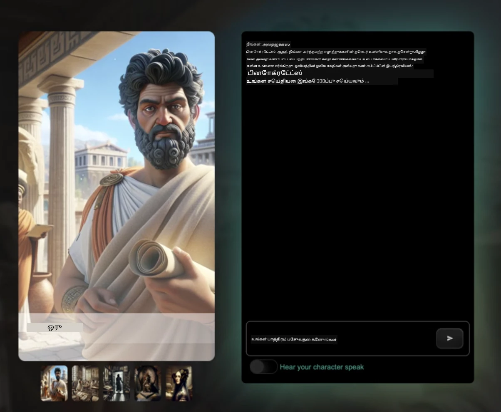
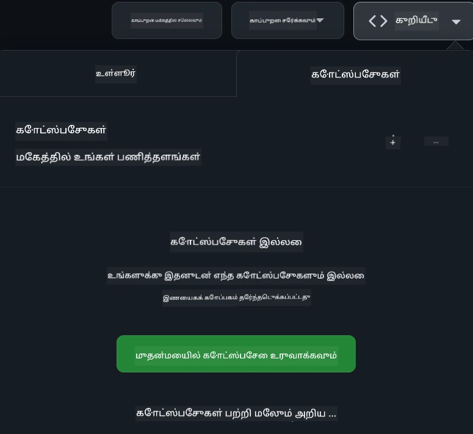

[](https://github.com/microsoft/Web-Dev-For-Beginners/blob/master/LICENSE)
[](https://GitHub.com/microsoft/Web-Dev-For-Beginners/graphs/contributors/)
[](https://GitHub.com/microsoft/Web-Dev-For-Beginners/issues/)
[](https://GitHub.com/microsoft/Web-Dev-For-Beginners/pulls/)
[](http://makeapullrequest.com) 

[](https://GitHub.com/microsoft/Web-Dev-For-Beginners/watchers/)
[](https://GitHub.com/microsoft/Web-Dev-For-Beginners/network/)
[](https://GitHub.com/microsoft/Web-Dev-For-Beginners/stargazers/)

[](https://discord.gg/nTYy5BXMWG)

# தொடக்கத்தரக்காரர்களுக்கான வலை மேம்பாடு - ஒரு பாடத்திட்டம்

மைக்ரோசாஃப்ட் கிளவுட் அட்வோகேட்ஸ் வழங்கும் 12 வார விரிவான பாடக்கருவியுடன் வலை மேம்பாட்டின் அடிப்படைகளை கற்றுக்கொள்ளுங்கள். 24 பாடங்களின் ஒவ்வொன்றும் ஜாவாச்கிரிப்ட், CSS மற்றும் HTML ஐ கொண்டு டெராரியம், பிரௌசர் நீட்சிகள் மற்றும் விண்வெளி விளையாட்டுகள் போன்ற 실험 பணிகள் மூலம் விரிவாக ஆய்வு செய்கிறது. வினாடி வினாக்கள், விவாதங்கள் மற்றும் நடைமுறை கடமைகளுடன் ஈடுபடுங்கள். உங்கள் திறன்களை மேம்படுத்தவும், அறிவை சிறந்த முறையில் பேண எங்கள் செயல்திறன் மிக்க திட்ட அடிப்படையுடைய கற்றல் முறையை அனுபவிக்கவும். உங்கள் குறியீட்டு பயணத்தை இன்று துவங்குங்கள்!

Azure AI Foundry Discord இல் சேர்ந்து நிபுணர்களையும் மற்றும் சக வலை மேம்பாட்டாளர்களையும் சந்திக்கவும்.

[](https://discord.gg/nTYy5BXMWG)

இந்த வளங்களை பயன்படுத்த துவங்க கீழ்காணும் படிகளை பின்பற்றவும்:
1. **கண்காணிப்பை Fork செய்யுங்கள்**: கிளிக் செய்யவும் [](https://GitHub.com/microsoft/Web-Dev-For-Beginners/fork)
2. **கண்காணிப்பை Clone செய்யுங்கள்**:   `git clone https://github.com/microsoft/Web-Dev-For-Beginners.git`
3. [**Azure AI Foundry Discord இல் சேர்ந்து நிபுணர்களையும் சக வலை மேம்பாட்டாளர்களையும் சந்திக்கவும்**](https://discord.com/invite/ByRwuEEgH4)

### 🌐 பல மொழி ஆதரவு

#### GitHub செயல் இயக்கம் மூலம் ஆதரிக்கப்படுகிறது (தானாகவும் எப்போதும் புதுப்பிக்கப்படும்)

<!-- CO-OP TRANSLATOR LANGUAGES TABLE START -->
[Arabic](../ar/README.md) | [Bengali](../bn/README.md) | [Bulgarian](../bg/README.md) | [Burmese (Myanmar)](../my/README.md) | [Chinese (Simplified)](../zh-CN/README.md) | [Chinese (Traditional, Hong Kong)](../zh-HK/README.md) | [Chinese (Traditional, Macau)](../zh-MO/README.md) | [Chinese (Traditional, Taiwan)](../zh-TW/README.md) | [Croatian](../hr/README.md) | [Czech](../cs/README.md) | [Danish](../da/README.md) | [Dutch](../nl/README.md) | [Estonian](../et/README.md) | [Finnish](../fi/README.md) | [French](../fr/README.md) | [German](../de/README.md) | [Greek](../el/README.md) | [Hebrew](../he/README.md) | [Hindi](../hi/README.md) | [Hungarian](../hu/README.md) | [Indonesian](../id/README.md) | [Italian](../it/README.md) | [Japanese](../ja/README.md) | [Kannada](../kn/README.md) | [Khmer](../km/README.md) | [Korean](../ko/README.md) | [Lithuanian](../lt/README.md) | [Malay](../ms/README.md) | [Malayalam](../ml/README.md) | [Marathi](../mr/README.md) | [Nepali](../ne/README.md) | [Nigerian Pidgin](../pcm/README.md) | [Norwegian](../no/README.md) | [Persian (Farsi)](../fa/README.md) | [Polish](../pl/README.md) | [Portuguese (Brazil)](../pt-BR/README.md) | [Portuguese (Portugal)](../pt-PT/README.md) | [Punjabi (Gurmukhi)](../pa/README.md) | [Romanian](../ro/README.md) | [Russian](../ru/README.md) | [Serbian (Cyrillic)](../sr/README.md) | [Slovak](../sk/README.md) | [Slovenian](../sl/README.md) | [Spanish](../es/README.md) | [Swahili](../sw/README.md) | [Swedish](../sv/README.md) | [Tagalog (Filipino)](../tl/README.md) | [Tamil](./README.md) | [Telugu](../te/README.md) | [Thai](../th/README.md) | [Turkish](../tr/README.md) | [Ukrainian](../uk/README.md) | [Urdu](../ur/README.md) | [Vietnamese](../vi/README.md)

> **உள்ளூரில் Clone செய்வது விரும்புவீர்களா?**
>
> இந்த கண்காணிப்பு 50+ மொழி மொழிபெயர்ப்புகளை கொண்டுள்ளது, இது பதிவிறக்க அளவை மிகவும் அதிகரிக்கிறது. மொழிபெயர்ப்புகளின்றி clone செய்ய sparse checkout பயன்படுத்தவும்:
>
> **Bash / macOS / Linux:**
> ```bash
> git clone --filter=blob:none --sparse https://github.com/microsoft/Web-Dev-For-Beginners.git
> cd Web-Dev-For-Beginners
> git sparse-checkout set --no-cone '/*' '!translations' '!translated_images'
> ```
>
> **CMD (Windows):**
> ```cmd
> git clone --filter=blob:none --sparse https://github.com/microsoft/Web-Dev-For-Beginners.git
> cd Web-Dev-For-Beginners
> git sparse-checkout set --no-cone "/*" "!translations" "!translated_images"
> ```
>
> இது உங்கள் பாடத்திட்டத்தை முடிக்க தேவையான அனைத்தையும் மிக விரைவான பதிவிறக்கத்தில் வழங்கும்.
<!-- CO-OP TRANSLATOR LANGUAGES TABLE END -->

**மேலும் மொழிபெயர்ப்புகளை விரும்பினால், ஆதரிக்கப்படும் மொழிகள் இங்கே பட்டியலிடப்பட்டுள்ளன. [இங்கே](https://github.com/Azure/co-op-translator/blob/main/getting_started/supported-languages.md)**

[](https://open.vscode.dev/microsoft/Web-Dev-For-Beginners)

#### 🧑‍🎓 _நீங்கள் மாணவரா?_

[**மாணவர் ஹப் பக்கம்**](https://docs.microsoft.com/learn/student-hub/?WT.mc_id=academic-77807-sagibbon) பார்வையிடவும், அங்கே ஆரம்ப நிலை வளங்கள், மாணவர் தொகுப்புகள் மற்றும் இலவச சான்றிதழ் வௌச்சர் பெற வழிகளும் உள்ளன. இது நீங்கள் புத்தக குறியாக்கம் செய்து காலக்கெட்டுக்குள் சரிபார்க்க விரும்பும் பக்கம் ஆகும்.

### 📣 அறிவிப்பு - புதிய GitHub Copilot एजेंट் முறையின் சவால்கள் இப்போது தயார்!

புதிய சவால் சேர்க்கப்பட்டுள்ளது, புதிய அதிகாரப்பூர்வ காகித GitHub Copilot Agent Challenge 🚀 என்பதை அனைத்து அத்தியாயங்களிலும் காணவும். இது GitHub Copilot மற்றும் Agent முறையைப் பயன்படுத்தி முடிக்க நீங்கள் வேண்டிய புதிய சவால் ஆகும். Agent முறையை இதுவரை பயன்படுத்தவில்லை என்றால், இது உரையாடல் உருவாக்க 뿐 아니라 கோப்புகளை உருவாக்கவும் திருத்தவும், கட்டளை இயக்கவும் முடியும்.

### 📣 அறிவிப்பு - _உருவாக்கும் AI கொண்டு புதிய திட்டம் உருவாக்கல்_

புதிய AI உதவியாளர் திட்டம் இப்போது சேர்க்கப்பட்டுள்ளது, இதைப் பாருங்கள் [திட்டம்](./9-chat-project/README.md)

### 📣 அறிவிப்பு - _JavaScript க்கான உருவாக்கும் AI பற்றிய புதிய பாடத்திட்டம்_ வெளியிடப்பட்டது

எங்கள் புதிய உருவாக்கும் AI பாடத்திட்டத்தை தவறவிடாதீர்கள்!

துவங்க [https://aka.ms/genai-js-course](https://aka.ms/genai-js-course) பார்வையிடவும்!


- அடிப்படையிலிருந்து RAG வரை உள்ள பாடங்கள்.
- GenAI மற்றும் எங்கள் துணை செயலி மூலம் வரலாற்று கதாபாத்திரங்களுடன் தொடர்பு கொள்ளுங்கள்.
- சுவாரஸ்யமான மற்றும் ஈடுபடுத்தும் கதை, நீங்கள் நேரத்தில் பயணம் செய்வீர்கள்!




ஒவ்வொரு பாடத்திலும் ஒரு பணியினை முடிக்க, அறிவு பரிசோதனை மற்றும் சவால் உண்டு, இதில் கற்றுக்கொள்ள வேண்டிய தலைப்புகள்:
- Prompting மற்றும் prompt பொறியியல்
- உரை மற்றும் படம் செயலி உருவாக்கல்
- தேடும் செயலிகள்

துவங்க [https://aka.ms/genai-js-course](https://aka.ms/genai-js-course) பார்வையிடவும்!


## 🌱 துவக்குவது

> **ஆசிரியர்கள்**, இந்த பாடத்திட்டத்தை எப்படி பயன்படுத்துவது என்ற சில பரிந்துரைகளை நாங்கள் சேர்த்துள்ளோம். உங்கள் கருத்துக்களை [எங்கள் விவாத மேடையில்](https://github.com/microsoft/Web-Dev-For-Beginners/discussions/categories/teacher-corner) பகிர்வால் மகிழ்ச்சி அடைவோம்!

**[கற்றலாளர்கள்](https://aka.ms/student-page/?WT.mc_id=academic-77807-sagibbon)**, ஒவ்வொரு பாடத்திற்கும் முன்-பாட வினாடி வினா மூலம் துவங்கி, அதன்பின் பாடப் பதிவுகளை வாசித்து, வெவ்வேறு செயல்பாடுகளை நிறைவேற்றுங்கள் மற்றும் பின்னர்-பாட வினாடி வினாவால் உங்கள் புரிதலაინის சோதனை செய்யுங்கள்.

உங்கள் கற்றல் அனுபவத்தை மேம்படுத்த, உங்கள் சக மாணவர்களுடன் இணைந்து திட்டங்களில் பணியாற்றுங்கள்! விவாதங்கள் எங்கள் [விவாத மேடையில்](https://github.com/microsoft/Web-Dev-For-Beginners/discussions) ஊக்கப்படுகின்றன. அங்கு எங்கள் மோடரேட்டர் குழுவினர் உங்கள் கேள்விகளுக்கு பதிலளிக்க தயாராக இருப்பர்.

மேலும் உங்கள் கல்வியை மேம்படுத்த, கூடுதல் படிப்பு வசதிக்காக [Microsoft Learn](https://learn.microsoft.com/users/wirelesslife/collections/p1ddcy5jwy0jkm?WT.mc_id=academic-77807-sagibbon) அறிவுசார் உள்ளடக்கத்தை ஆராய பரிந்துரைக்கப்படுகிறது.

### 📋 உங்கள் சூழலை அமைத்தல்

இந்த பாடத்திட்டத்திற்கு வளர்ச்சியாளர்கள் பணியிட சூழல் தயார் அவசியம்! துவங்கும்போது, இதை [Codespace](https://github.com/features/codespaces/) (_உலாவியில் இயங்கி, நிறுவல் தேவையில்லாத சூழல்_)ல் அல்லது உங்கள் கணினியில் உள்ள உரை தொகுப்பியில் [Visual Studio Code](https://code.visualstudio.com/?WT.mc_id=academic-77807-sagibbon) போன்றவற்றைப் பயன்படுத்தி இயக்கலாம்.

#### உங்கள் கண்காணிப்பை உருவாக்குங்கள்
உங்கள் பணியை எளிதாக சேமிக்க, இந்த கண்காணிப்பின் தனிப்பட்ட நகலை உருவாக்க பரிந்துரைக்கப்படுகிறது. இதை செய்ய, பக்கத்தின் மேல் பகுதியில் உள்ள **Use this template** பொத்தானை அழுத்தவும். இது உங்கள் GitHub கணக்கில் பாடத்திட்டத்தின் நகலை கொண்ட புதிய கண்காணிப்பை உருவாக்கும்.

பின்வரும் படிகளை பின்பற்றவும்:
1. **கண்காணிப்பை Fork செய்யுங்கள்**: இந்தப் பக்கத்தின் வலது மேல் பகுதியிலுள்ள "Fork" பொத்தானைக் கிளிக் செய்யவும்.
2. **கண்காணிப்பை Clone செய்யுங்கள்**:   `git clone https://github.com/microsoft/Web-Dev-For-Beginners.git`

#### Codespace இல் பாடத்திட்டத்தை இயக்கல்

உங்கள் உருவாக்கிய கண்காணிப்பில் **Code** பொத்தானைக் கிளிக் செய்து **Open with Codespaces** என்பதைத் தேர்ந்தெடுக்கவும். இது உங்களுக்கு பணியாற்ற புதிய Codespace ஒன்றை உருவாக்கும்.



#### உங்கள் கணினியில் உள்ளூரில் பாடத்திட்டத்தைக் இயக்கல்

இந்த பாடத்திட்டத்தை உங்கள் கணினியில் இயக்க, ஒரு உரை தொகுப்பி, ஒரு உலாவி மற்றும் கட்டளை வரி கருவி தேவை. எங்களது முதல் பாடம் [Introduction to Programming Languages and Tools of the Trade](../../1-getting-started-lessons/1-intro-to-programming-languages), ஒவ்வொரு கருவிக்கும் உகந்த விருப்பங்களை நன்கு விளக்குகிறது.

எங்களுக்கு பரிந்துரைக்கப்படும் உரை தொகுப்பி [Visual Studio Code](https://code.visualstudio.com/?WT.mc_id=academic-77807-sagibbon) ஆகும், இதனுடன் உள்ளமைக்கப்பட்ட [Terminal](https://code.visualstudio.com/docs/terminal/basics/?WT.mc_id=academic-77807-sagibbon) உள்ளது. Visual Studio Code ஐ [இங்கிருந்து](https://code.visualstudio.com/?WT.mc_id=academic-77807-sagibbon) பதிவிறக்கலாம்.
1. உங்கள் சேமிப்பகத்தை (repository) உங்கள் கணினிக்கு கிளோன் (clone) செய்யவும். இதை செய்ய, **Code** பொத்தானை கிளிக் செய்து URL ஐ நகலெடுக்கலாம்:

    [CodeSpace](./images/createcodespace.png)

    பின்னர், [Visual Studio Code](https://code.visualstudio.com/?WT.mc_id=academic-77807-sagibbon) இல் உள்ள [Terminal](https://code.visualstudio.com/docs/terminal/basics/?WT.mc_id=academic-77807-sagibbon) ஐ திறந்து, கீழுள்ள கட்டளையை இயக்குங்கள், `<your-repository-url>` ஐ நீங்கள் தற்போது நகலெடுத்த URL கொண்டு மாற்றி:

    ```bash 
    git clone <your-repository-url>
    ```

2. Visual Studio Code இல் அந்த கோப்புறையை திறக்கவும். இதை செய்ய, **File** > **Open Folder** என்பதைக் கிளிக் செய்து, நீங்கள் கிளோன் செய்த கோப்புறையைத் தேர்ந்தெடுக்கவும்.


>  பரிந்துரைக்கப்படும் Visual Studio Code நீட்டிப்புகள்:
>
> * [Live Server](https://marketplace.visualstudio.com/items?itemName=ritwickdey.LiveServer&WT.mc_id=academic-77807-sagibbon) - Visual Studio Code இல் HTML பக்கங்களை நேரலாக முன்னோட்டம் செய்ய
> * [Copilot](https://marketplace.visualstudio.com/items?itemName=GitHub.copilot&WT.mc_id=academic-77807-sagibbon) - குறியீட்டை வேகமாக எழுத உதவும்

## 📂 ஒவ்வொரு பாடத்திலும் உள்ளவை:

- விருப்பமான ஸ்கெட்ச் நோட்
- விருப்பமான கூடுதல் வீடியோ
- பாடத்திற்கு முன்னதாக பொருத்தமான வினாத்தாள்
- எழுதிய பாடம்
- திட்டம் அடிப்படையிலான பாடங்களுக்கு, படி படியாக திட்டத்தை உருவாக்கும் வழிகாட்டிகள்
- அறிவு பரிசோதனைகள்
- ஒரு சவால்
- கூடுதல் வாசிப்பு
- பணிகள்
- [பாடத்திற்குப் பிறகு வினாத்தாள்](https://ff-quizzes.netlify.app/web/)

> **வினாத்தாள்கள் தொடர்பான குறிப்பு**: அனைத்து வினாத்தாள்களும் Quiz-app கோப்புறையில் உள்ளன, ஒவ்வொன்றிலும் மூன்று கேள்விகள் கொண்ட 48 வினாத்தாள்கள் உள்ளன. அவைகள் இங்கே கிடைக்கின்றன [இங்கே](https://ff-quizzes.netlify.app/web/) . Quiz app ஐ உள்ளூர் ரீதியாக இயக்கலாம் அல்லது Azureக்கு ஒப்படைக்கலாம்; இதற்கான வழிகாட்டுதல்களை `quiz-app` கோப்புறையில் பின்பற்றவும்.

## 🗃️ பாடங்கள்

|     |                       திட்டத்தின் பெயர்                       |                            கொடுக்கப்பட்ட கருத்துக்கள்                             | கற்றல் குறிக்கோள்கள்                                                                                                                 |                                                         இணைக்கப்பட்ட பாடம்                                                          |         ஆசிரியர்          |
| :-: | :----------------------------------------------------------: | :--------------------------------------------------------------------: | ----------------------------------------------------------------------------------------------------------------------------------- | :----------------------------------------------------------------------------------------------------------------------------: | :---------------------: |
| 01  |                     தொடங்குதல்                      |           நிரலாக்கத்தின் அறிமுகம் மற்றும் உபகரணங்கள்           | பெரும்பாலான நிரலாக்க மொழிகளின் அடிப்படைகளை மற்றும் தொழில்நுட்ப வல்லுநர்கள் தங்கள் வேலை செய்ய உதவும் மென்பொருளைப் பற்றி கற்றுக்கொள்ளுங்கள் | [Intro to Programming Languages and Tools of the Trade](./1-getting-started-lessons/1-intro-to-programming-languages/README.md) |         ஜேஸ்மின்         |
| 02  |                     தொடங்குதல்                      |             GitHub அடிப்படைகள், குழுவுடன் வேலை செய்வது             | உங்கள் திட்டத்தில் GitHub ஐ எப்படி பயன்படுத்துவது, குறியீட்டு அடித்தளத்தில் மற்றவர்களுடன் எவ்வாறு ஒத்துழைக்கலாம் என்பது பற்றி தெரிந்து கொள்ளவும்                                                    |                            [Intro to GitHub](./1-getting-started-lessons/2-github-basics/README.md)                             |          ஃப்ளோர்          |
| 03  |                     தொடங்குதல்                      |                             அணுகல் வசதி                              | வலை அணுகல் வசதி அடிப்படைகளை கற்றுக்கொள்ளவும்                                                                                               |                       [Accessibility Fundamentals](./1-getting-started-lessons/3-accessibility/README.md)                       |       கிறிஸ்டோபர்       |
| 04  |                        JS அடிப்படைகள்                         |                         ஜாவாஸ்கிரிப்ட் தரவின் வகைகள்                          | ஜாவாஸ்கிரிப்ட் தரவின் அடிப்படைகளை கற்றுக்கொள்ளவும்                                                                                                 |                                       [Data Types](./2-js-basics/1-data-types/README.md)                                        |         ஜேஸ்மின்         |
| 05  |                        JS அடிப்படைகள்                         |                         செயல்பாடுகள் மற்றும் முறைகள்                          | பயன்பாட்டின் செயல்திறன் வழிசெலுத்த செயல்பாடுகள் மற்றும் முறைகள் பற்றி கற்றுக்கொள்ளவும்                                                             |                              [Functions and Methods](./2-js-basics/2-functions-methods/README.md)                               | ஜேஸ்மின் மற்றும் கிறிஸ்டோபர் |
| 06  |                        JS அடிப்படைகள்                         |                        JS மூலம் முடிவெடுக்கும் செயல்முறைகள்                        | செயல்பாட்டில் நிபந்தனைகளை உருவாக்க JS பயன்படுத்துவது எப்படி என்பதை கற்றுக்கொள்ளவும்                                                           |                                 [Making Decisions](./2-js-basics/3-making-decisions/README.md)                                  |         ஜேஸ்மின்         |
| 07  |                        JS அடிப்படைகள்                         |                            வரிசைகள் மற்றும் சுற்றங்கள்                            | ஜாவாஸ்கிரிப்டில் வரிசைகள் மற்றும் சுற்றங்களைப் பயன்படுத்தி தரவுடன் செயல்படவும்                                                                                 |                                   [Arrays and Loops](./2-js-basics/4-arrays-loops/README.md)                                    |         ஜேஸ்மின்         |
| 08  |       [Terrarium](./3-terrarium/solution/README.md)       |                            HTML நடைமுறை                            | ஆன்லைன் டெரேரியம் உருவாக்க HTML கட்டமைப்பை உருவாக்கவும், கட்டமைப்பை உருவாக்குவதில் கவனம் செலுத்தவும்                                                         |                                 [Introduction to HTML](./3-terrarium/1-intro-to-html/README.md)                                 |           ஜென்           |
| 09  |       [Terrarium](./3-terrarium/solution/README.md)       |                            CSS நடைமுறை                             | ஆன்லைன் டெரேரியத்துக்கு CSS வடிவமைப்பை உருவாக்கவும், பக்கத்தை எதிர்மறையாக மாற்ற CSS அடிப்படைகளில் கவனம் செலுத்தவும்                     |                                  [Introduction to CSS](./3-terrarium/2-intro-to-css/README.md)                                  |           ஜென்           |
| 10  |            [Terrarium](./3-terrarium/solution/README.md)            |                 ஜாவாஸ்கிரிப்ட் கிளோசுர்கள், DOM செயலாக்கம்                  | டெரேரியம் செயல்படும் வகையில் JavaScript உருவாக்கவும், கிளோசுர்கள் மற்றும் DOM செயலாக்கத்தில் கவனம் செலுத்தவும்             |                  [JavaScript Closures, DOM manipulation](./3-terrarium/3-intro-to-DOM-and-closures/README.md)                   |           ஜென்           |
| 11  |          [Typing Game](./4-typing-game/solution/README.md)          |                          ஒரு டைப் விழுது விளையாட்டை உருவாக்குவது                           | உங்கள் JavaScript செயலிக்கு கீபோர்ட் நிகழ்வுகளை பயன்படுத்தி செயல்திறன் வழி நடத்துவது பற்றி கற்றுக்கொள்ளவும்                                                          |                                [Event-Driven Programming](./4-typing-game/typing-game/README.md)                                |       கிறிஸ்டோபர்       |
| 12  | [Green Browser Extension](./5-browser-extension/solution/README.md) |                         உலாவிகளுடன் வேலை செய்வது                          | உலாவிகள் எப்படி செயல்படுகின்றன, அவற்றின் வரலாறு மற்றும் உலாவி நீட்டிப்பின் முதல் மூலப்பொருட்களை உருவாக்குவது எப்படி என்பதை கற்றுக்கொள்ளவும்                               |                               [About Browsers](./5-browser-extension/1-about-browsers/README.md)                                |           ஜென்           |
| 13  | [Green Browser Extension](./5-browser-extension/solution/README.md) | படிவம் உருவாக்கல், API அழைப்பு மற்றும் உள்ளூர் நினைவக மாற்ற மாறிலிகள் | API ஐ அழைக்க உள்ளூர் நினைவகத்தில் மாறிலிகளை சேமித்துக் கொண்டு உலாவி நீட்டிப்பின் JavaScript கூறுகளை உருவாக்கவும்                      |                [APIs, Forms, and Local Storage](./5-browser-extension/2-forms-browsers-local-storage/README.md)                 |           ஜென்           |
| 14  | [Green Browser Extension](./5-browser-extension/solution/README.md) |          உலாவியின் பின்னணி செயல்முறைகள், வலை செயல்திறன்          | நீட்டிப்பின் சின்னத்தை வழிமொழுவதற்கும் பின்னணி செயல்முறைகளை பயன்படுத்தவும்; வலை செயல்திறன் மற்றும் சிறிது மேம்பாடுகளைப் பற்றி கற்றுக்கொள்ளவும்   |             [Background Tasks and Performance](./5-browser-extension/3-background-tasks-and-performance/README.md)              |           ஜென்           |
| 15  |           [Space Game](./6-space-game/solution/README.md)           |             ஜாவாஸ்கிரிப்ட் மூலம் மேம்படுத்திய விளையாட்டு மேம்பாடு             | வகுப்புகள் மற்றும் சேர்மத்தைப் பயன்படுத்தி மரபளிப்பை மற்றும் Pub/Sub முறையை கற்றுக்கொண்டு விளையாட்டை உருவாக்க தயாராகுங்கள்              |                      [Introduction to Advanced Game Development](./6-space-game/1-introduction/README.md)                       |          கிறிஸ்          |
| 16  |           [Space Game](./6-space-game/solution/README.md)           |                           பட்டத்தில் வரைதல்                            | திரையில் கூறுகளை வரைய Canvas API பற்றி கற்றுக்கொள்ளவும்                                                                       |                                [Drawing to Canvas](./6-space-game/2-drawing-to-canvas/README.md)                                |          கிறிஸ்          |
| 17  |           [Space Game](./6-space-game/solution/README.md)           |                   திரையில் கூறுகளை நகர்த்தல்                    | கார்டீசியன் ஒருங்குறிகள் மற்றும் Canvas API ஐ பயன்படுத்தி கூறுக்களை இயக்குவது எப்படி என்பதை அறியவும்                                            |                           [Moving Elements Around](./6-space-game/3-moving-elements-around/README.md)                           |          கிறிஸ்          |
| 18  |           [Space Game](./6-space-game/solution/README.md)           |                          மோதல் கண்டறிதல்                           | விசைகள் அழுத்துதல்களைப் பயன்படுத்தி கூறுகள் மோதும் மற்றும் பதிலளிக்கும் முறையை உருவாக்கவும்; விளையாட்டு செயல்திறனை உறுதி செய்ய குளிர்ச்சி செயல்பாடு கொடுக்கவும்    |                              [Collision Detection](./6-space-game/4-collision-detection/README.md)                              |          கிறிஸ்          |
| 19  |           [Space Game](./6-space-game/solution/README.md)           |                             மதிப்பெண்கள் நிர்ணயம்                              | விளையாட்டின் நிலை மற்றும் செயல்திறனை அடிப்படையாகக் கொண்டு கணக்கீடுகளைச் செய்க                                                                |                                    [Keeping Score](./6-space-game/5-keeping-score/README.md)                                    |          கிறிஸ்          |
| 20  |           [Space Game](./6-space-game/solution/README.md)           |                     விளையாட்டை நிறுத்துதல் மற்றும் மறுதொடக்கம்                     | விளையாட்டை நிறுத்துவது மற்றும் மறுதொடங்குவது, ஆதாரங்கள் சுத்தம் செய்தல் மற்றும் மாறிலிகளை மீட்டமைத்தல் பற்றியவை                                                                              |                                [The Ending Condition](./6-space-game/6-end-condition/README.md)                                 |          கிறிஸ்          |
| 21  |         [Banking App](./7-bank-project/solution/README.md)          |                 வலை பயன்பாட்டில் HTML வார்ப்புருக்கள் மற்றும் வழிகள்                 | பலபக்க வலைத்தளத் வடிவமைப்பின் விரிச்சட்டைத்தையும் HTML வார்ப்புருக்களையும் உருவாக்குவது எப்படி என்பதைக் கற்றுக்கொள்ளவும்                             |                            [HTML Templates and Routes](./7-bank-project/1-template-route/README.md)                             |          யோஹான்          |
| 22  |         [Banking App](./7-bank-project/solution/README.md)          |                  உள்நுழைவு மற்றும் பதிவு படிவத்தை உருவாக்குதல்                   | படிவங்களை உருவாக்குதல் மற்றும் சரிபார்ப்பு நடைமுறைகளை கையாளுதல் பற்றி கற்றுக்கொள்ளவும்                                                                          |                                           [Forms](./7-bank-project/2-forms/README.md)                                           |          யோஹான்          |
| 23  |         [Banking App](./7-bank-project/solution/README.md)          |                   தரவை அறியும் மற்றும் பயன்படுத்தும் முறைகள்                   | உங்கள் பயன்பாட்டிற்கு தரவு எப்படி வந்து செல்கிறது, அதை எவ்வாறு பெறுவது, சேமிப்பது மற்றும் கழிப்பது பற்றி கற்றுக்கொள்ளவும்                                                 |                                            [Data](./7-bank-project/3-data/README.md)                                            |          யோஹான்          |
| 24  |         [Banking App](./7-bank-project/solution/README.md)          |                      நிலை மேலாண்மை கருத்துக்கள்                      | உங்கள் பயன்பாட்டின் நிலையை எப்படி காக்கிறது மற்றும் அதை நிரல்முறையாக எப்படி நிர்வகிப்பது என்பதை கற்றுக்கொள்ளவும்                                                              |                                [State Management](./7-bank-project/4-state-management/README.md)                                |          யோஹான்          |
| 25 | [Browser/VScode Code](../../8-code-editor) | VScode உடன் வேலை செய்வது | குறியீட்டு எடிட்டரைப் பயன்படுத்துவது கற்றுக்கொள்வது | [Use VScode Code Editor](./8-code-editor/1-using-a-code-editor/README.md) | கிறிஸ் |
| 26 | [AI Assistants](./9-chat-project/README.md) | எஐ உடன் வேலை செய்வது | உங்கள் சொந்த AI உதவியாளரை உருவாக்குவதை கற்றுக்கொள்ளவும் | [AI Assistant project](./9-chat-project/README.md) | கிறிஸ் |

## 🏫 கல்வி முறைகள்

எங்கள் பாடத்திட்டம் கீழ்க்காணும் இரண்டு முக்கிய கல்வித்தத்துவங்களை கொண்டுள்ளது:
* திட்ட அடிப்படையிலான கற்றல்
* அடிக்கடி வினாத்தாள்கள்

இந்த திட்டம் ஜாவாஸ்கிரிப்ட், HTML மற்றும் CSS அடிப்படைகளை, மேலும் இன்றைய வலை வளர்ச்சியாளர்களால் பயன்படுத்தப்படும் சமீபத்திய கருவிகள் மற்றும் நுட்பங்களை கற்பிக்கிறது. மாணவர்கள் ஒரு டைப் விளையாட்டு, மெய்நிகர் டெரேரியம், சுற்றுச்சூழல் நட்பான உலாவி நீட்டிப்பு, விண்வெளி-பேருள்ளி மாதிரிப்புள்ள விளையாட்டு மற்றும் வணிகங்களுக்கான வங்கி பயன்பாட்டை உருவாக்குவதன் மூலம் நேரடி அனுபவம் பெற்றுக்கொள்ள வாய்ப்பு பெறுவர். தொடரின் முடிவில், மாணவர்கள் வலை வளர்ச்சியில் வலுவான புரிதலை கொண்டிருப்பர்.

> 🎓 இந்த பாடத்திட்டத்தில் முதல் சில பாடங்களை Microsoft Learn இல் உள்ள [Learn Path](https://docs.microsoft.com/learn/paths/web-development-101/?WT.mc_id=academic-77807-sagibbon) ஆக எடுத்துக்கொள்ளலாம்!

திட்டங்களுக்கு உள்ளடக்கம் இணைக்கப்படுவதை உறுதி செய்வதன் மூலம், மாணவர்களுக்கு கற்றல் செயல்முறை More கடுமையானதும் மீட்டெடுக்கும் திறன் அதிகரிக்கும். மேலும், சில ஸ்டார்டர் பாடங்களை ஜாவாஸ்கிரிப்ட் அடிப்படைகளில் எழுதினோம், "[Beginners Series to: JavaScript](https://channel9.msdn.com/Series/Beginners-Series-to-JavaScript/?WT.mc_id=academic-77807-sagibbon)" குறும்பட தொகுப்பின் வீடியோவுடன் இணைத்து, சில ஆசிரியர்கள் இதில் பங்களித்தனர்.

மேலும், வகுப்பிற்கு முன் குறைந்த அழுத்த வினாத்தாள் மூலம் மாணவர்கள் ஒரு தலைப்பை கற்பதில் நோக்கம் அர்ப்பணிக்கின்றனர்; வகுப்பிற்கு பின் இரண்டாவது வினாத்தாள் மேலதிக நினைவாற்றலை உறுதி செய்கிறது. இந்த பாடத்திட்டம் நெகிழ்வானதும் சுவாரஸ்யமாக இருப்பதாக வடிவமைக்கப்பட்டுள்ளது மற்றும் ஒரு முழுமையான இடையே எடுக்கலாம். 12 வார சுழற்சியின் இறுதியில் திட்டங்கள் சிறியதாக இருந்து மெதுவாக சிக்கலானதாக மாறுகின்றன.

வலை வளர்ச்சியாளராக அடிப்படை திறன்கள் படைப்பதற்காக ஜாவாஸ்கிரிப்ட் கட்டமைப்புகளை அறிமுகப்படுத்துவதை நாங்கள் தவிர்த்திருக்கிறோம், அதனை அறிந்த பிறகு, வேறு வீடியோ தொகுப்பான "[Beginner Series to: Node.js](https://channel9.msdn.com/Series/Beginners-Series-to-Nodejs/?WT.mc_id=academic-77807-sagibbon)" மூலம் Node.js பற்றி கற்றுக்கொள்ள பரிந்துரைகிறது.

> எங்கள் [Code of Conduct](CODE_OF_CONDUCT.md) மற்றும் [Contributing](CONTRIBUTING.md) வழிகாட்டுதல்களைப் பார்வையிடுங்கள். உங்கள் கட்டமைப்பூட்டி கருத்துக்களை வரவேற்கிறோம்!


## 🧭 ஆணையற்ற அணுகல்

[Docsify](https://docsify.js.org/#/) ஐ பயன்படுத்தி இந்த ஆவணத்தைக் கம்பியற்ற முறையில் இயக்கலாம். இந்த ரெப்போவை Fork செய்து, உங்கள் உள்ளூர் இயந்திரத்தில் [Docsify ஐ நிறுவி](https://docsify.js.org/#/quickstart), பின்னர் இந்த ரெப்போவின் ரூட் கோப்புறையில் `docsify serve` என টাইப் செய்யவும். இணையதளம் உங்கள் உள்ளூர் கணினியில் போர்ட் 3000 இல் வழங்கப்படும்: `localhost:3000`.

## 📘 PDF
எல்லா பாடங்களின் ஒரு PDF இங்கே காணலாம் [here](https://microsoft.github.io/Web-Dev-For-Beginners/pdf/readme.pdf).


## 🎒 பிற பாடநெறிகள்

எங்கள் குழு பிற பாடநெறிகளையும் உருவாக்குகிறது! பார்:

<!-- CO-OP TRANSLATOR OTHER COURSES START -->
### LangChain
[](https://aka.ms/langchain4j-for-beginners)
[](https://aka.ms/langchainjs-for-beginners?WT.mc_id=m365-94501-dwahlin)
[](https://github.com/microsoft/langchain-for-beginners?WT.mc_id=m365-94501-dwahlin)
---

### Azure / Edge / MCP / முகவர்கள்
[](https://github.com/microsoft/AZD-for-beginners?WT.mc_id=academic-105485-koreyst)
[](https://github.com/microsoft/edgeai-for-beginners?WT.mc_id=academic-105485-koreyst)
[](https://github.com/microsoft/mcp-for-beginners?WT.mc_id=academic-105485-koreyst)
[](https://github.com/microsoft/ai-agents-for-beginners?WT.mc_id=academic-105485-koreyst)

---
 
### உருவாக்கும் AI தொடர்
[](https://github.com/microsoft/generative-ai-for-beginners?WT.mc_id=academic-105485-koreyst)
[-9333EA?style=for-the-badge&labelColor=E5E7EB&color=9333EA)](https://github.com/microsoft/Generative-AI-for-beginners-dotnet?WT.mc_id=academic-105485-koreyst)
[-C084FC?style=for-the-badge&labelColor=E5E7EB&color=C084FC)](https://github.com/microsoft/generative-ai-for-beginners-java?WT.mc_id=academic-105485-koreyst)
[-E879F9?style=for-the-badge&labelColor=E5E7EB&color=E879F9)](https://github.com/microsoft/generative-ai-with-javascript?WT.mc_id=academic-105485-koreyst)

---
 
### மூலக் கற்கை
[](https://aka.ms/ml-beginners?WT.mc_id=academic-105485-koreyst)
[](https://aka.ms/datascience-beginners?WT.mc_id=academic-105485-koreyst)
[](https://aka.ms/ai-beginners?WT.mc_id=academic-105485-koreyst)
[](https://github.com/microsoft/Security-101?WT.mc_id=academic-96948-sayoung)
[](https://aka.ms/webdev-beginners?WT.mc_id=academic-105485-koreyst)
[](https://aka.ms/iot-beginners?WT.mc_id=academic-105485-koreyst)
[](https://github.com/microsoft/xr-development-for-beginners?WT.mc_id=academic-105485-koreyst)

---
 
### கோப்பைட் தொடர்ச்சி
[](https://aka.ms/GitHubCopilotAI?WT.mc_id=academic-105485-koreyst)
[](https://github.com/microsoft/mastering-github-copilot-for-dotnet-csharp-developers?WT.mc_id=academic-105485-koreyst)
[](https://github.com/microsoft/CopilotAdventures?WT.mc_id=academic-105485-koreyst)
<!-- CO-OP TRANSLATOR OTHER COURSES END -->

## உதவி பெறுவது எப்படி

நீங்கள் முடியாமல் போனால் அல்லது AI பயன்பாடுகளை உருவாக்குவதில் ஏதாவது கேள்விகள் இருந்தால் MCP பற்றி பேசும் நண்பர்கள் மற்றும் அனுபவம் வாய்ந்த வளர்ப்பவர்களுடன் இணைக. இது கேள்விகள் வரவேற்கப்படுகின்ற ஓர் ஆதரவு சமூகம் மற்றும் அறிவு சுதந்திரமாக பகிரப்படுகின்றது.

[](https://discord.gg/nTYy5BXMWG)

உங்கள் தயாரிப்பு கருத்துக்கள் அல்லது பிழைகள் இருந்தால் கட்டமைக்கும் போது:

[](https://aka.ms/foundry/forum)

## உரிமை

இந்த நிரல்கோப்பு MIT உரிமையுடன் உரிமம் பெற்றுள்ளது. மேலும் தகவலுக்கு [LICENSE](../../LICENSE) கோப்பை காணவும்.

---

<!-- CO-OP TRANSLATOR DISCLAIMER START -->
**பெயர்மறியல்**:  
இந்த அறிக்கை AI மொழிபெயர்ப்பு சேவை [Co-op Translator](https://github.com/Azure/co-op-translator) மூலம் மொழிமாற்றம் செய்யப்பட்டதாகும். நாங்கள் சரியானதிற்கு முயற்சி செய்கிறோம் என்பதுடன், தானாகச் செய்யப்பட்ட மொழிபெயர்ப்புகளில் பிழைகள் அல்லது தவறுகள் இருக்கக்கூடும் என்பதைக் கவனியுங்கள். அதன் தாய்மொழியில் உள்ள அசல் ஆவணம் அதிகாரபூர்வமான ஆதாரமாகக் கருதப்பட வேண்டியது முக்கியம். முக்கியமான தகவல்களுக்கு, தொழில்முறை மனித மொழிபெயர்ப்பு பரிந்துரைக்கப்படுகிறது. இந்த மொழிபெயர்ப்பைப் பயன்படுத்துவதனால் உண்டாகக்கூடிய எந்த தவறான புரிதல்கள் அல்லது தவறான பொருள் வெளியீடுகளுக்கும் நாங்கள் பொறுப்பேற்க மாட்டோம்.
<!-- CO-OP TRANSLATOR DISCLAIMER END -->