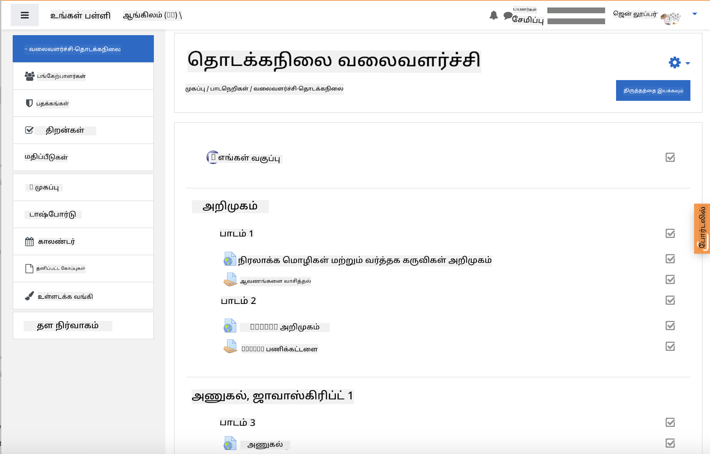
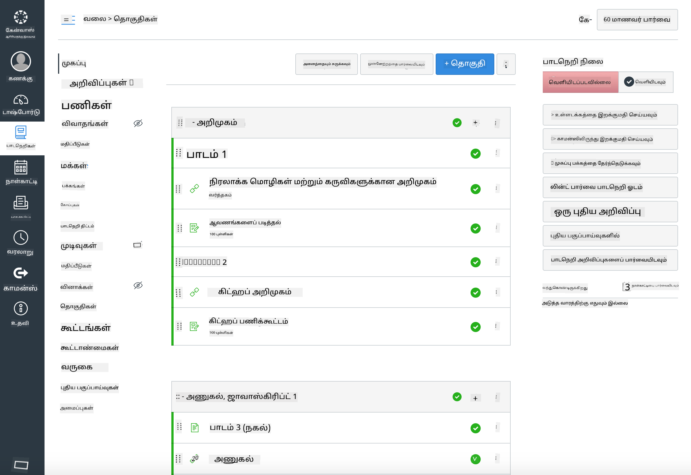

<!--
CO_OP_TRANSLATOR_METADATA:
{
  "original_hash": "71009af209f81cc01a1f2d324200375f",
  "translation_date": "2025-10-11T11:35:57+00:00",
  "source_file": "for-teachers.md",
  "language_code": "ta"
}
-->
### ஆசிரியர்களுக்காக

இந்த பாடத்திட்டத்தை உங்கள் வகுப்பறையில் பயன்படுத்த வரவேற்கிறோம். இது GitHub Classroom மற்றும் முன்னணி LMS தளங்களுடன் எளிதாக வேலை செய்கிறது, மேலும் உங்கள் மாணவர்களுடன் தனிப்பட்ட repo ஆகவும் பயன்படுத்தலாம்.

### GitHub Classroom உடன் பயன்படுத்துதல்

ஒவ்வொரு குழுவிற்கும் பாடங்கள் மற்றும் பணிகளை நிர்வகிக்க, ஒவ்வொரு பாடத்திற்கும் ஒரு repository உருவாக்கவும், இதனால் GitHub Classroom ஒவ்வொரு பணியையும் தனித்தனியாக இணைக்க முடியும்.

- இந்த repo-வை உங்கள் அமைப்புக்கு Fork செய்யவும்.
- ஒவ்வொரு பாடத்திற்கும் தனித்த Repo உருவாக்கி, ஒவ்வொரு பாடக் கோப்புறையை தனித்த Repo-வாக பிரிக்கவும்.
  - விருப்பம் A: ஒவ்வொரு பாடத்திற்கும் காலியான Repo-களை உருவாக்கி, பாடக் கோப்புறையின் உள்ளடக்கங்களை ஒவ்வொன்றிலும் நகலெடுக்கவும்.
  - விருப்பம் B: Git வரலாற்றை பாதுகாக்கும் அணுகுமுறை (எ.கா., ஒரு கோப்புறையை புதிய Repo-வாக பிரிக்கவும்) பயன்படுத்தவும், உங்களுக்கு Provenance தேவைப்பட்டால்.
- GitHub Classroom-ல், ஒவ்வொரு பாடத்திற்கும் ஒரு பணியை உருவாக்கி, அதற்கான பாட Repo-வை சுட்டிக்காட்டவும்.
- பரிந்துரைக்கப்படும் அமைப்புகள்:
  - Repository காட்சி: மாணவர் பணிக்கான தனிப்பட்டது.
  - பாட Repo-வின் இயல்புநிலை கிளையில் Starter Code பயன்படுத்தவும்.
  - வினாக்கள் மற்றும் சமர்ப்பிப்புகளுக்கான Issue மற்றும் Pull Request டெம்ப்ளேட்டுகளை சேர்க்கவும்.
  - உங்கள் பாடங்களில் உள்ளதானால், தானியக்க மதிப்பீடு மற்றும் சோதனைகளை விருப்பமாக அமைக்கவும்.
- உதவியாக இருக்கும் மரபுகள்:
  - Repository பெயர்கள்: lesson-01-intro, lesson-02-html போன்றவை.
  - Labels: quiz, assignment, needs-review, late, resubmission.
  - ஒவ்வொரு குழுவிற்கும் Tags/releases (எ.கா., v2025-term1).

சிறந்த ஆலோசனை: Git conflicts-ஐத் தவிர்க்க Windows-ல் synced folders (எ.கா., OneDrive/Google Drive) உள்ளே Repository-களைச் சேமிக்க வேண்டாம்.

### Moodle, Canvas, அல்லது Blackboard உடன் பயன்படுத்துதல்

இந்த பாடத்திட்டத்தில் பொதுவான LMS பணிச்செலுத்தல்களுக்கு ஏற்ற இறக்கக்கூடிய தொகுப்புகள் உள்ளன.

- Moodle: முழு பாடத்திட்டத்தை ஏற்ற Moodle upload file [Moodle upload file](../../../../../../../teaching-files/webdev-moodle.mbz) பயன்படுத்தவும்.
- Common Cartridge: Common Cartridge file [Common Cartridge file](../../../../../../../teaching-files/webdev-common-cartridge.imscc) பயன்படுத்தி LMS பொருத்தத்திற்கான பரந்த ஆதரவைப் பெறவும்.
- குறிப்புகள்:
  - Moodle Cloud-க்கு வரையறுக்கப்பட்ட Common Cartridge ஆதரவு உள்ளது. மேலே உள்ள Moodle கோப்பை விரும்பவும், இது Canvas-ல் கூட ஏற்றப்படலாம்.
  - இறக்குமதி செய்த பிறகு, உங்கள் கால அட்டவணைக்கு பொருந்த மாட்யூல்கள், கடைசித் தேதிகள் மற்றும் வினா அமைப்புகளை மதிப்பாய்வு செய்யவும்.

> Moodle வகுப்பறையில் உள்ள பாடத்திட்டம்

> Canvas-ல் உள்ள பாடத்திட்டம்

### Repo-வை நேரடியாக பயன்படுத்துதல் (Classroom இல்லாமல்)

GitHub Classroom-ஐப் பயன்படுத்த விரும்பாதவர்களுக்கு, இந்த Repo-விலிருந்து பாடத்திட்டத்தை நேரடியாக இயக்கலாம்.

- ஒத்திசைவு/ஆன்லைன் வடிவங்கள் (Zoom/Teams):
  - குறுகிய வழிகாட்டல்-முன்னோட்டங்களை நடத்தவும்; வினாக்களுக்கு Breakout Rooms-ஐப் பயன்படுத்தவும்.
  - வினாக்களுக்கு நேர சாளரத்தை அறிவிக்கவும்; மாணவர்கள் GitHub Issues-ஆக பதில்களை சமர்ப்பிக்கவும்.
  - கூட்டாக பணிகளைச் செய்ய, மாணவர்கள் பொதுவான பாட Repo-களில் வேலை செய்து Pull Requests-ஐத் திறக்கவும்.
- தனிப்பட்ட/அசைன்க்ரோனஸ் வடிவங்கள்:
  - மாணவர்கள் ஒவ்வொரு பாடத்தையும் தனிப்பட்ட **தனியார்** Repo-களுக்கு Fork செய்து, உங்களை ஒத்துழைப்பாளராக சேர்க்கவும்.
  - அவர்கள் உங்கள் வகுப்பறை Repo அல்லது அவர்களின் தனியார் Fork-களில் Issues (வினாக்கள்) மற்றும் Pull Requests (பணிகள்) மூலம் சமர்ப்பிக்கவும்.

### சிறந்த நடைமுறைகள்

- Git/GitHub அடிப்படைகள், Issues, மற்றும் PRs பற்றிய ஒரு அறிமுக பாடத்தை வழங்கவும்.
- பல படிகள் கொண்ட வினாக்கள்/பணிகளுக்கு Issues-ல் Checklists சேர்க்கவும்.
- வகுப்பறை விதிமுறைகளை அமைக்க CONTRIBUTING.md மற்றும் CODE_OF_CONDUCT.md சேர்க்கவும்.
- அணுகல் வசதி குறிப்புகள் (alt text, captions) சேர்க்கவும் மற்றும் அச்சிடக்கூடிய PDF-களை வழங்கவும்.
- உங்கள் உள்ளடக்கத்தை ஒவ்வொரு காலத்திற்கும் பதிப்பிடவும் மற்றும் பாட Repo-களை வெளியீட்டுக்குப் பிறகு உறுதிசெய்யவும்.

### கருத்துகள் மற்றும் ஆதரவு

இந்த பாடத்திட்டம் உங்களுக்கும் உங்கள் மாணவர்களுக்கும் பயனுள்ளதாக இருக்க வேண்டும். பிழைகள், கோரிக்கைகள் அல்லது மேம்பாடுகளுக்காக இந்த Repository-யில் புதிய Issue ஒன்றைத் திறக்கவும் அல்லது Teacher Corner-ல் ஒரு விவாதத்தைத் தொடங்கவும்.

---

**குறிப்பு**:  
இந்த ஆவணம் [Co-op Translator](https://github.com/Azure/co-op-translator) என்ற AI மொழிபெயர்ப்பு சேவையை பயன்படுத்தி மொழிபெயர்க்கப்பட்டுள்ளது. எங்கள் நோக்கம் துல்லியமாக இருக்க வேண்டும் என்பதுதான், ஆனால் தானியங்கி மொழிபெயர்ப்புகளில் பிழைகள் அல்லது துல்லியமின்மைகள் இருக்கக்கூடும் என்பதை தயவுசெய்து கவனத்தில் கொள்ளவும். அதன் தாய்மொழியில் உள்ள மூல ஆவணம் அதிகாரப்பூர்வ ஆதாரமாக கருதப்பட வேண்டும். முக்கியமான தகவல்களுக்கு, தொழில்முறை மனித மொழிபெயர்ப்பு பரிந்துரைக்கப்படுகிறது. இந்த மொழிபெயர்ப்பைப் பயன்படுத்துவதால் ஏற்படும் எந்த தவறான புரிதல்கள் அல்லது தவறான விளக்கங்களுக்கு நாங்கள் பொறுப்பல்ல.