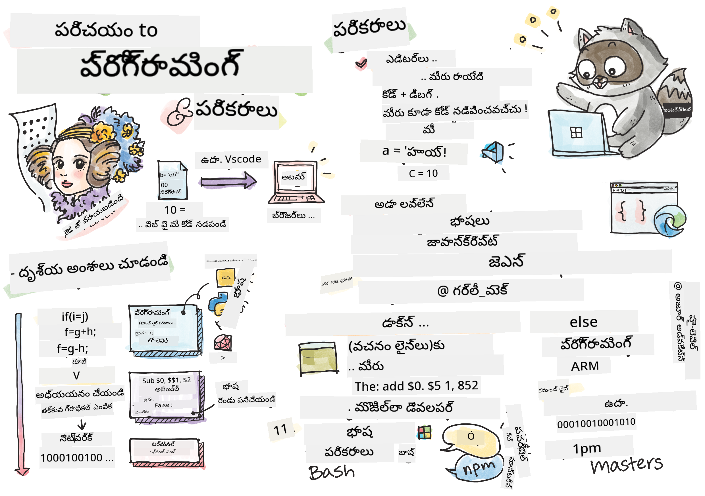
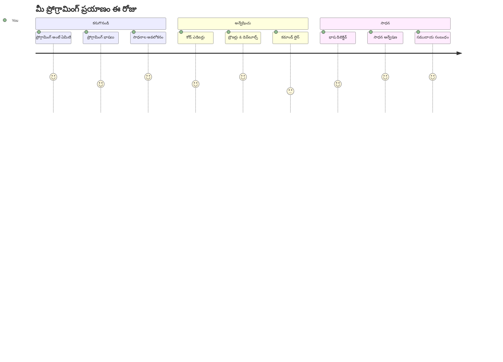
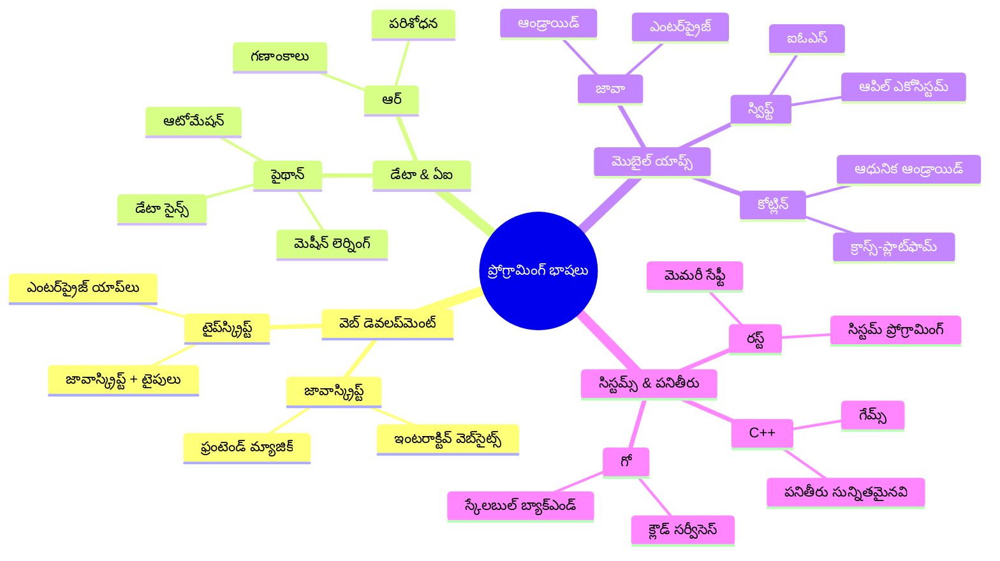
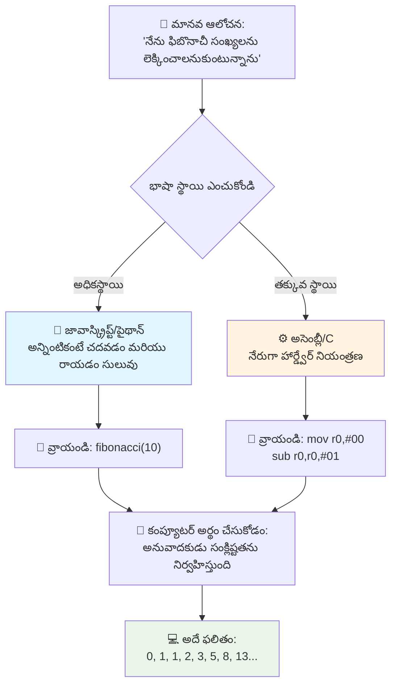
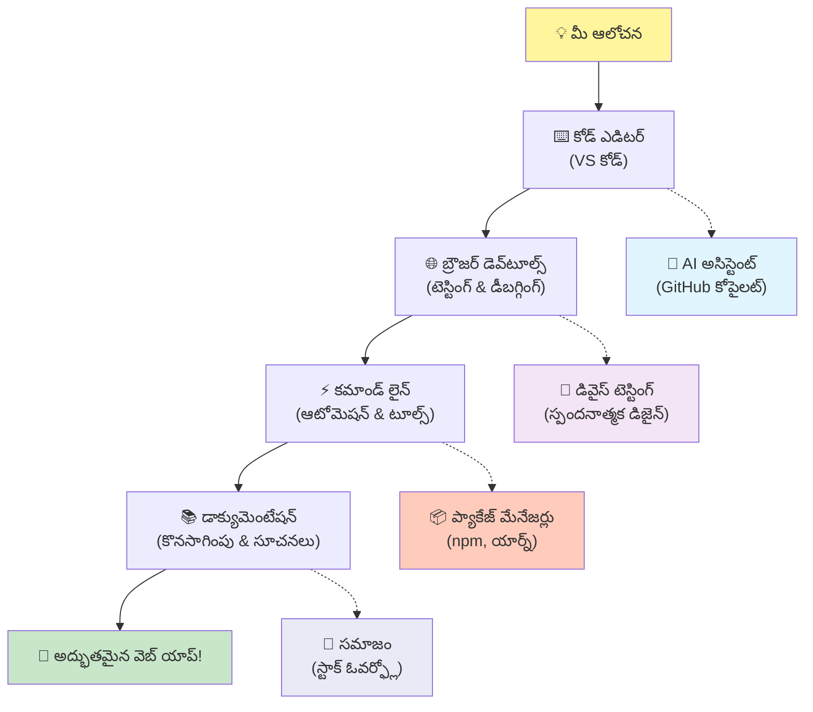
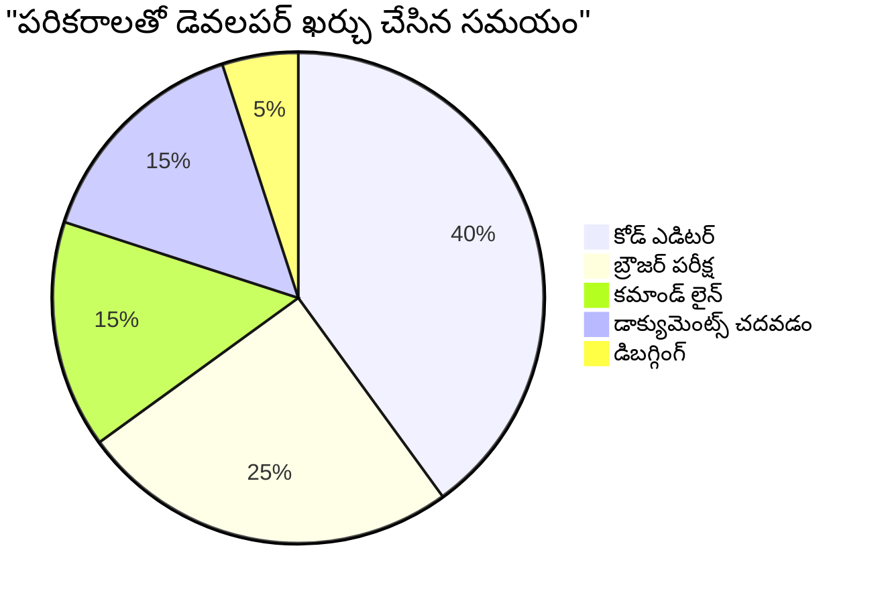
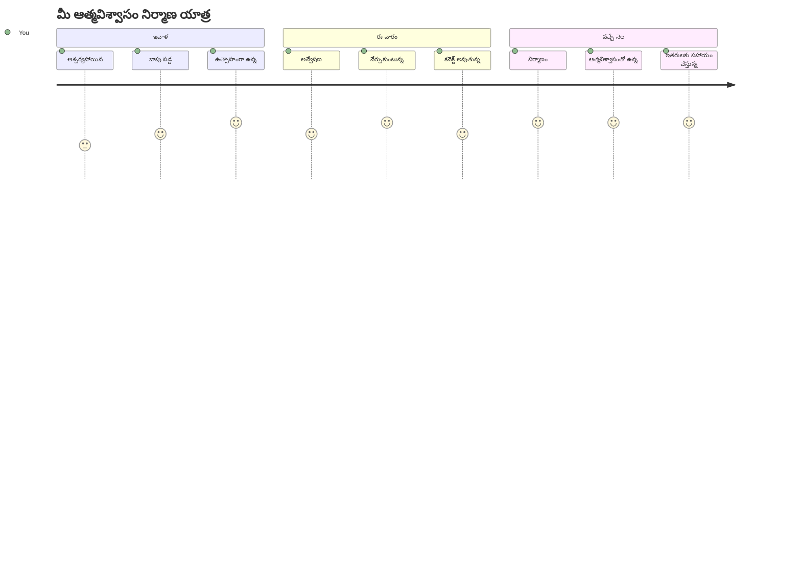

<!--
CO_OP_TRANSLATOR_METADATA:
{
  "original_hash": "d45ddcc54eb9232a76d08328b09d792e",
  "translation_date": "2026-01-08T20:04:20+00:00",
  "source_file": "1-getting-started-lessons/1-intro-to-programming-languages/README.md",
  "language_code": "te"
}
-->
# ప్రోగ్రామింగ్ భాషల పరిచయం మరియు ఆధునిక డెవలపర్ టూల్స్

అరేరా, భవిష్యత్ డెవలపర్! 👋 నేను ప్రతి రోజు నాకు గడిచేప్పుడు చలికాలం తలెత్తించే ఒక విషయం చెప్పనా? మీరు కనుగొనబోతున్నారు ప్రోగ్రామింగ్ కేవలం కంప్యూటర్ల గురించినది కాదు – అది మీ అద్భుతమైన ఆలోచనలను సజీవం చేసే నిజమైన సూపర్ పవర్స్ గురించి!

మీరు మీ ఇష్టమైన యాప్ ఉపయోగిస్తున్నప్పుడు ఆ క్షణం గుర్తుందా? మీరు ఒక బటన్ నొక్కగానే ఏదైనా అసాధారణమయిన వింత జరిగింది అని అనిపించే క్షణం, మీరు "వావ్, వారు అది ఎలా చేశారు?" అని ఆలోచించేది. సరే, మీరు లాంటివారు ఒకరు – కావచ్చు వారి ఇష్టమైన కాఫీ షాపులో రాత్రి 2 గంటలకు మూడవ ఎస్ప్రెస్‌తో కూర్చొని – ఆ వింత సృష్టించిన కోడ్‌ను రాయడం జరిగింది. మరియు ఇది మీ మస్తిష్కాన్ని పేలుస్తుంది: ఈ పాఠం ముగింపు వరకు, వారు ఎలా చేశారో అర్థం చేసుకోవడమే కాక, మీరు దాన్ని ప్రయత్నించాలని చలిస్తున్నాడు!

చూడండి, ప్రోగ్రామింగ్ ఇప్పుడు మీరు భయంగా అనిపించినట్లైనా నాకు బాగా తెలుసు. నేను మొదలు పెట్టినప్పుడు నిజంగా నేను అనుకున్నాను మీరు గణితగురు గారికీ ఐదేళ్ల వయస్సు నుండి కోడింగ్ చేస్తుందనుకున్నాను. కానీ నాకు నా దృష్టిని పూర్తిగా మార్చిన విషయం ఇది: ప్రోగ్రామింగ్ అంటే కొత్త భాషలో సంభాషణ నేర్చుకోవడం లాంటిది. మీరు "హలో" మరియు "థాంక్ యూ" తో మొదలు పెడతారు, ఆ తర్వాత కాఫీ ఆర్డర్ చేయడానికీ చేరుకుంటారు, ఇంకా మీరు తెలుసకుండానే మీరంతా తాత్త్విక చర్చల్లో పాల్గొంటున్నారు! కానీ ఇక్కడ మీరు కంప్యూటర్లతో సంభాషిస్తున్నారు, నిజంగా వాళ్లు మీరు చేసిన పొరపాట్లను ఎప్పుడూ న్యాయించరు మరియు మళ్లీ ప్రయత్నించడానికి ఎప్పుడూ ఉత్సాహంగా ఉంటారు!

ఈ రోజు, ఆధునిక వెబ్ డెవలప్మెంట్‌ను సాధ్యం చేసే అత్యద్భుతమైన టూల్స్ ని పరిశీలించబోతున్నాము, ఇవి చాలా ఇబ్బందిదాయకం కాకుండా అలూజిపోతాయి. నేను చెబుతున్నది Netflix, Spotify మరియు మీ ఇష్టమైన ఇండి యాప్ స్టూడియోలో డెవలపర్లు ప్రతిరోజు ఉపయోగించే అదే ఎడిటర్లు, బ్రౌజర్లు మరియు వర్క్‌ఫ్లోలు. మరియు ఇది మీకు సంతోష డ్యాన్స్ చేయించే భాగం: ఈ మోస్ట్ ప్రొఫెషనల్ గ్రేడ్, ఇండస్ట్రీ-స్టాండర్డ్ టూల్స్ చాలా కాలిగా ఉచితం!


> స్కెచ్‌నోట్ [Tomomi Imura](https://twitter.com/girlie_mac) రూపొందించారు


## మీరు ఇప్పటికే ఏమి తెలుసుకున్నారో చూద్దాం!

మనం రसंభరించడానికి ముందే, ఈ ప్రోగ్రామింగ్ ప్రపంచం గురించి మీరు ఇప్పటికే ఏమి తెలుసుకున్నారో నేను ఆసక్తిగా ఉన్నాను. మరియు వినండి, మీరు ఈ ప్రశ్నలను చూస్తూ "నేను అసలే ఏమీ తెలియలేదు" అని అనుకుంటే అది సకలంగా, అది పరిపూర్ణం! అంటే మీరు పూర్తిగా సరైన ప్రదేశంలో ఉన్నారు. ఈ క్విజ్ ని వ్యాయామం ముందు సన్నాహకంగా భావించండి – మనం మన మెదడ్ను మాత్రమే వేడి చేసుకొంటున్నాము!

[పూర్వ పాఠం క్విజ్ చేయండి](https://forms.office.com/r/dru4TE0U9n?origin=lprLink)


## మనం కలిసి ప్రయాణించబోతున్న సాహసం

బాగుంది, ఈ రోజు మనం ఏమి అన్వేషించబోతున్నామో నేను నిజమనస్ఫూర్తితో ఉత్సాహంగా ఉన్నాను! నిజంగా, కొంతమంది కాన్సెప్ట్లు మీరు అర్థం చేసుకున్నప్పుడు మీ ముఖం చూడాలని నేను కోరుకుంటున్నాను. ఇక్కడ మనం కలిసి చేసే అద్భుతమైన ప్రయాణం:

- **ప్రోగ్రామింగ్ అంటే ఏమిటి (మరియు ఇది ఎందుకు అతి ఫఫ్ coolest విషయం!)** – కోడ్ అనేది మీ చుట్టూ ఉన్న ప్రతిదీ నిర్వహించుకునే కనువిప్పుగా కూడానపుడు కనిపించని మాంత్రిక శక్తి అని మనం కనుగొంటాం, సోమవారం ఉదయం అని తెలిసి అలారం, లేదా మీ Netflix ప్రతిపాదనలు చూసి సరైన ఆ గమనాన్ని మార్చిన అల్గోరిథం వరకు
- **ప్రోగ్రామింగ్ భాషలు మరియు వాటి అద్భుతమైన వ్యక్తిత్వాలు** – ప్రతి వ్యక్తి విభిన్న సూపర్ పవర్స్ మరియు సమస్యల పరిష్కార మార్గాలను కలిగి ఉండే పార్టీకి మీరు భారీగా అడుగుపెడుతున్నారని ఊహించండి. అదే ప్రోగ్రామింగ్ భాషల ప్రపంచం, మరియు మీరు వాటిని కలవడం ఆనందిస్తారు!
- **డిజిటల్ మాంత్రికత్వం జరగడానికి ప్రాథమిక నిర్మాణ బ్లాక్‌లు** – ఈ భాగాలు అత్యుత్తమ సృష్టిశక్తివంతమైన LEGO సెట్ల లాంటివి. మీరు ఇవి ఎలా కలిసిపోతాయో అర్థం చేసుకున్నప్పుడు, మీరు మీ ఊహాతీత కలలను నిజం చేసుకోవచ్చు
- **ప్రొఫెషనల్ టూల్స్ – వాటిని పట్టు కోరిన తర్వాత మీరు వుద్దుమంతుడు చేతికి కొచ్చిన మంత్రదండంతో ఉన్నట్టు అనిపిస్తాయి** – నేను డ్రామా చేస్తున్నట్లు కాదు – ఈ టూల్స్ నిజంగా మీరు సూపర్ శక్తులతో ఉన్నట్టు అనిపిస్తాయి, మరియు ఉత్తమ భాగం? ఇవి ప్రొఫెషనల్స్ ఉపయోగించే వాటే!

> 💡 **ముందుగా भन्नెం**: ఈ రోజు అన్నింటినీ మీ మెమరీలో పెట్టుకునేందుకు యత్నించకండి! ఇప్పడు సరదాగా ఏం సాధ్యమో అందులో ఆ స్ఫూర్తిని మీరు పొందండి. వివరాలు సహజంగానే మాన్నిసులతో సాధన చేస్తూ నిలబడతాయి – ఇదే నిజమైన విద్య!

> మీరు ఈ పాఠాన్ని [Microsoft Learn](https://docs.microsoft.com/learn/modules/web-development-101/introduction-programming/?WT.mc_id=academic-77807-sagibbon) లో తీసుకోవచ్చు!

## కాబట్టి *ప్రోగ్రామింగ్* అంటే నిజంగా ఏమిటి?

సరే, మిలియన్ డాలర్ల ప్రశ్నను చేధిద్దాం: ప్రోగ్రామింగ్ అంటే నిజంగా ఏమిటి?

నేను చెప్పబోతున్నది ఒక కథ, ఇది నా ఆలోచనను పూర్తిగా మార్చింది. గత వారం, నేను మా స్మార్ట్ TV రిమోట్ ఎలా ఉపయోగించాలో మా అమ్మకు వివరించడానికి ప్రయత్నిస్తున్నాను. నేను "ఎరుపు బటన్ను నొక్కండి, కానీ పెద్ద ఎరుపు బటన్ కాదు, వలపు వైపు చిన్న ఎరుపు బటన్... కాదు, మీ మరొక వలపు... సరే, ఇప్పుడు ఆ బటన్ను రెండు సెకన్ల పాటు పట్టుకోండి, ఒక్క సెకనుకాదు, మూడు సెకన్లకు కాదు..." అని చెప్పుకున్నాను. ఇది మరొకరికి ఇదే అనిపిస్తే? 😅

అదే ప్రోగ్రామింగ్! ఇది చాలా శక్తివంతమైన వస్తువుకు అత్యంత సమగ్రమైన, దశలవారీ ఆదేశాలను ఇచ్చే కళ. కానీ మీరు మీ అమ్మకు వివరిస్తున్నట్లుకాదు (వాళ్లకు "ఏ ఎరుపు బటన్?!" అని అడగటానికి అవకాశం ఉంది), మీరు కంప్యూటర్‌కు వివరిస్తున్నారని భావించండి (అది మీరు చెప్పినదానికే నిజంగా చేస్తుంది, మీరు భావించినది కాకపోయినా).

నేను మొదటిసారి తెలుసుకున్నప్పుడు నా మదిని పేల్చిన విషయం ఇది: కంప్యూటర్లు వాస్తవానికి చాలా సరళంగా ఉంటాయి. అవి కేవలం రెండింటిని మాత్రమే అర్థం చేసుకోగలవు – 1 మరియు 0, అంటే సరే మరియు కాదు లేదా ఆన్ మరియు ఆఫ్. అంతే! కానీ ఇక్కడే మాంత్రికం సాగుతుంది – మేము 1లు మరియు 0లలో మాట్లాడాల్సిన అవసరం లేదు, మేము మెట్రిక్స్‌లో ఉన్నట్లుగా కాదు. అక్కడ **ప్రోగ్రామింగ్ భాషలు** ప్రేరేపిస్తాయి. అవి ప్రపంచంలో అత్యుత్తమ అనువాదకుల్లా ఉన్నాయి, అవి మీ సాధారణ మానవ ఆలోచనలను కంప్యూటర్ భాషలోకి మార్చేస్తాయి.

ఇప్పటికీ ప్రతి రోజు నాకు కదలిక చూపించే విషయం ఇది: మీ జీవితంలో ఉన్న అన్ని డిజిటల్ వస్తువులు ఎవరో మీరు లాంటి వారిచే ప్రారంభించబడ్డాయి, కాఫీ గ్లాస్‌తో పిజామాల్లో కూర్చొని తమ ల్యాప్టాప్‌లో కోడ్ టైప్ చేస్తూ. ఆ Instagram ఫిల్టర్ మీ అందమైన రూపాన్ని మలచింది? ఎవరో అది కోడ్ చేశారు. మీరు కొత్త ఇష్టమైన పాటకు దారితీసిన సూచన? ఒక డెవలపర్ ఆ అల్గోరిథాన్ని తయారుచేశాడు. మీ స్నేహితులతో డిన్నర్ బిల్లును భాగిస్తే సహాయం చేసే యాప్? అవును, ఎవరో "ఇది చికాకుగా ఉంది, నేను దీన్ను సరి చేసుకుంటాను" అని ఆలోచించి... తేడా చూపించారు!

మీరు ప్రోగ్రామ్ నేర్చుకుంటున్నప్పుడు, మీరు కేవలం కొత్త నైపుణ్యం నేర్చుకోకపోక, చాలా అద్భుతమైన స‌మ‌స్య‌ల ప‌రిష్కార‌కుల సమాజంలో భాగమవుతారు. వారు రోజువారీగా "నేను ఎవరో ఒకరి రోజు కొంచెం మెరుగుపర్చే ఏదైనా నిర్మిస్తే ఎలా ఉంటుంది?" అని ఆలోచిస్తారు. నిజంగా, అంతా కంటే కూలర్ ఏం ఉండాలి?

✅ **మంచి చిట్కా**: మీరు అల్ప సమయం ఉన్నపుడు చూస్తూ ఉండే ఒక అద్భుత విషయం – ప్రపంచంలో మొదటి కంప్యూటర్ ప్రోగ్రామర్ ఎవరో కనిపెట్టండి! నేను ఒక సూచన ఇస్తాను: మీరు ఊహించలేదు! ఆ వ్యక్తి వెనుక కథ అందంగా ఉంది మరియు ప్రోగ్రామింగ్ సృష్టాత్మక సమస్య పరిష్కారం మరియు స్థితి దాటి ఆలోచించడం ఎప్పుడూ ఎంత ప్రాధాన్యం ఉన్నదో చూపిస్తుంది.

### 🧠 **చెక్-ఇన్ సమయం: మీరు ఎలా అనుభూతి చెందుతున్నారు?**

**కొంత సమయం తీసుకుని ఆలోచించండి:**
- "కంప్యూటర్లకు ఆదేశాలు ఇవ్వడం" ఆలోచన ఇప్పుడు మీకు అర్థమైంది?
- రోజువారీ పని మీరు ప్రోగ్రామింగ్‌తో ఆటోమేట్ చేయాలని అనుకుంటున్నారా?
- ఈ మొత్తం ప్రోగ్రామింగ్ విషయం గురించి మీ మదిలో ఏమేమి ప్రశ్నలు ఉన్నాయంటే?

> **గమనించండి**: కొన్నిసార్లు కొంత కాన్సెప్ట్లు తుమ్మాకు మాదిరిగా అనిపించవచ్చు. ప్రోగ్రామింగ్ నేర్చుకోవడం ఒక కొత్త భాష నేర్చుకోవడంలాంటిది – దిమ్మతిని ఆ నలుపు మార్గాలను నిర్మించడానికి సమయం పడుతుంది. మీరు అద్భుతంగా చేస్తున్నారు!

## ప్రోగ్రామింగ్ భాషలు వేర్వేరు రుచుల మాంత్రికత లాంటివి

సరే, ఇది కొంచెం విచిత్రంగా అనిపించవచ్చు, కానీ నాతో కలిసి ఉండండి – ప్రోగ్రామింగ్ భాషలు సంగీత రకాలు లాంటివి. మీరు ఆలోచించండి: జాజ్, ఇది నిగద మరియు ఆ Improvisational, రాక్ శక్తివంతమైనదిగా మరియు నేరుగా, క్లాసికల్ షైలీ ప్రకృతి మరియు నిర్మాణాత్మకంగా, హిప్-హాప్ సృజనాత్మకంగా మరియు వ్యక్తిగతంగా ఉంటుంది. ప్రతి శైలి తన స్వంత వాతావరణం, అభిమానం ఉన్న సమాజం కలిగి ఉంటుంది, మరియు ఒక్కొక్కటి వేరే వాతావరణానికి సరిపోయే అభిరుచికి సరిపోతుంది.

ప్రోగ్రామింగ్ భాషలు కూడా అదే విధంగా పనిచేస్తాయి! మీరు ఒక ఆనందకర మొబైల్ గేమ్‌ను నిర్మించడానికి జాబితా మౌలిక డేటాను చెక్ చేయడం కోసం భాష వాడరు, అలాగే మీరు యోగ క్లాసులో డెత్ మెటల్ ప్లే చేయరు (పైనన్నట్లు ఎక్కువగా యోగ క్లాసులు కదా! 😄).

కానీ ప్రతిసారీ నాకు మీ మదిని పేల్చే విషయం ఇది: ఈ భాషలు ప్రపంచంలోనే అత్యంత సహనమైన, అద్భుతమైన అనువాదకులను మీ తర్వాత కూర్చొనిపెడతాయి. మీరు మానవ మెదడ్కి సహజంగా అనిపించే విధంగా ఆలోచనలు వ్యక్తపరిచవచ్చు, మరియు అవి గొప్పగా క్లిష్టమైన పనులన్నింటినీ కంప్యూటర్లు అర్థం చేసుకునే 1లు మరియు 0లలోకి అనువదిస్తాయి. ఇది మీరు ఒక స్నేహితుడిని కలిగి ఉండటమిలా, వారి ఇద్దరు "మానవ సృజనశక్తి" మరియు "కంప్యూటర్ లాజిక్"లో ఫ్లూ, ఎప్పుడూ అలసిపోరు, కాఫీ విరామాలు అవసరం లేదు, మరియు మీరు ఒకే ప్రశ్నను రెండుసార్లు అడగడం వల్ల న్యాయించరు!

### ప్రసిద్ధి గాంచిన ప్రోగ్రామింగ్ భాషలు మరియు వాటి ఉపయోగాలు


| భాష | ఉత్తమంగా ఉపయోగించే ప్రాంతం | ఆ భాష ఎందుకు ప్రముఖం? |
|----------|----------|------------------|
| **JavaScript** | వెబ్ డెవలప్మెంట్, యూజర్ ఇంటర్‌ఫేస్‌లు | బ్రౌజర్లలో నడుస్తుంది, ఇంటరాక్టివ్ వెబ్‌సైట్లకు శక్తివంతం చేస్తుంది |
| **Python** | డేటా సైన్స్, ఆటోమేషన్, AI | చదవడంలో సులభం, శక్తివంతమైన లైబ్రరీలు ఉన్నాయి |
| **Java** | ఎంటర్ప్రైజ్ అప్లికేష‌న్లు, ఆండ్రాయిడ్ యాప్‌లు | ప్లాట్‌ఫారమ్-ఇండిపెండెంట్, పెద్ద సిస్టమ్‌లకు మన్నించేలా ఉన్నది |
| **C#** | విండోస్ అప్లికేషన్స్, గేమ్ డెవలప్మెంట్ | పవర్ఫుల్ మైక్రోసాఫ్ట్ ఎకోసిస్టమ్ మద్దతు |
| **Go** | క్లౌడ్ సర్వీసులు, బ్యాక్‌ఎండ్ సిస్టమ్‌లు | వేగవంతమైన, సరళమైన, ఆధునిక కంప్యూటింగ్ కొరకు రూపుదిద్దినది |

### హై-లెవల్ వర్సెస్ లో-లెవల్ భాషలు

సరే, ఇది నిజంగా నేను నేర్చుకుంటున్నప్పుడు నా దిమ్మతిని పేల్చిన కాన్సెప్ట్, కాబట్టి నేను మీకు పాపరూపంగా చెప్పేది చెప్పబోతున్నాను – ఇది నాకు ఒక్కసారిగా అర్థమైంది – మరియు నేను ఇంకా ఆశిస్తున్నాను మీరు కూడా అర్థం చేసుకోగలరు!

మీరు ఒక దేశాన్ని సందర్శిస్తున్నారని ఊహించండి, అక్కడ మీరు భాష మాట్లాడలేరు, మరియు అత్యవసరం గా బెస్ట్ రెస్ట్ రూమ్ కనుగొనాలనుకుంటున్నార‌ని (మనంతా అలా అడుగుతున్నాము కదా? 😅):

- **లో-లెవల్ ప్రోగ్రామింగ్** అంటే అక్కడి స్థానిక భాషలో అంతగా బాగా మాట్లాడటం అందుకే మీరు కోణంలో ఉన్న వృద్ధ మహిళతో సంభాషిస్తున్నారు – స్థానిక సంస్కృతి సూచనలు, స్థానిక నాడి అంగాల అన్నిటినీ ఉపయోగిస్తూ. చాలా అద్భుతంగా మరియు సమర్థవంతంగా... మీరు దాన్ని తేలికగా మాట్లాడగలరు అంటే! కానీ మీరు కేవలం బాత్ రూమ్ వెతుకుతుంటే ఇది కొంచెం అతి క్లిష్టంగా అనిపిస్తుంది.

- **హై-లెవల్ ప్రోగ్రామింగ్** అంటే మీ నేలవైపు అద్భుతమైన స్థానిక స్నేహితుడు ఉన్నాడు – మీరు "నాకు బాత్ రూమ్ చాలా అవసరం" అని సాదా ఇంగ్లీష్‌లో చెబుతారు, మరియు వారు అన్ని స్థానిక అర్థాలను మార్చి మీకు సరైన దిశ చూపిస్తారు.

ప్రోగ్రామింగ్ భాషలలో:
- **లో-లెవల్ భాషలు** (Assembly లేదా C వంటి) కంప్యూటర్ యొక్క హార్డ్‌వేర్‌తో చాలా సమగ్ర సంభాషణలు చేయడానికి అనుమతిస్తాయి, కానీ మీరు యంత్రంలాగ ఆలోచించాలి, ఇది… సరే, మనసుకు పెద్ద మార్పు!
- **హై-లెవల్ భాషలు** (JavaScript, Python, లేదా C# వంటి) మీరు మానవుల్లా ఆలోచించేటపుడు, వాళ్లు ఆ యంత్రభాషను వెనుకనుంచి నిర్వహిస్తారు. అదనంగా, వీటికి అద్భుతమైన కమ్యూనిటీలున్నాయి, వారు కొత్తవారిని గుర్తు చేసుకుని సహాయం చేయడానికి ఇష్టపడతారు!

నేను మీరు ఏ భాషలతో మొదలు పెట్టాలని సూచిస్తాను తెలుసా? 😉 హై-లెవల్ భాషలు వాటిలాగానే మీకు ఉండే చెక్కులు లాంటి వాహనాలు, మీరు వీటి నుంచి బయటపడదలుచుకోరు ఎందుకంటే అవి మొత్తం అనుభూతిని ఎంతో ఆహ్లాదకరంగా చేస్తాయి!


### నేను ఎందుకు హై-లెవల్ భాషలను ఇష్టపడుతున్నానో మీకు చూపిస్తూ ఉన్నాను

సరే, నేను మీకు చూపించబోతున్నట్లు అంశం ఉంది, అది నా హృదయాన్ని హై-లెవల్ భాషల పట్ల ప్రేమలో పడేసింది, కానీ మొదట మీరు నాకు ఒక వాగ్దానం చేయాలి. మీరు ఆ మొదటి కోడ్ ఉదాహరణ చూస్తే, భయపడకండి! అది భయంకరంగా కనిపించడం మూలై ఉంది. ఆ భావం నేను చెబుతున్నది!

మనం ఒకే పనిని రెండు పూర్తిగా వేరు శైలుల్లో రాశాము. రెండూ ఫిబొనాచీ సీక్వెన్స్ అని పిలవబడే ఈ అద్భుత గణిత శ్రేణి సృష్టించబడును – ఇది ప్రతి సంఖ్య రెండు ముందు ఉన్న సంఖ్యల మొత్తం: 0, 1, 1, 2, 3, 5, 8, 13... (మంచి అంశం: మీరు ప్రకృతిలో literally ఈ శ్రేణి అన్ని చోట్ల చూడగలరు – సూర్య గుమ్మడికాయ గింజల మడత, వాటి ఆకారాలు, గెలాక్సీలు ఎలా ఏర్పడతాయో కూడా!)

తేడా చూడడానికి సిద్ధమా? పోదాం!

**హై-లెవల్ భాష (JavaScript) – మానవహృదయానికి అనుకూలంగా:**

```javascript
// దశ 1: ప్రాథమిక ఫిబొనాచ్చి సెటప్
const fibonacciCount = 10;
let current = 0;
let next = 1;

console.log('Fibonacci sequence:');
```

**ఈ కోడ్ ఏమి చేస్తుందో:**
- ఎంత మంది Fibonacci సంఖ్యలు సృష్టించాలో నిర్ధారించడానికి కంకణంగా ఒక స్థిరాంకం ప్రకటించండి
- సీక్వెన్స్‌లో ప్రస్తుత మరియు తదుపరి సంఖ్యలను ట్రాక్ చేయడానికి రెండు వేరియబల్స్‌ను ప్రారంభించండి
- Fibonacci నమూనాను నిర్వచించే మొదటి విలువలను (0 మరియు 1) సెట్ చేయండి
- మన అవుట్‌పుట్‌ను గుర్తించడానికి హెడర్ సందేశాన్ని ప్రదర్శించండి

```javascript
// దశ 2: ఒక లూప్‌తో క్ర‌మాన్ని రూపొందించండి
for (let i = 0; i < fibonacciCount; i++) {
  console.log(`Position ${i + 1}: ${current}`);
  
  // క్రమంలో తదుపరి సంఖ్యను లెక్కించండి
  const sum = current + next;
  current = next;
  next = sum;
}
```

**ఇక్కడ ఏమి జరుగుతుందో వివరించడం:**
- మన సీక్వెన్స్‌లోని ప్రతి స్థానాన్ని `for` లూప్ ఉపయోగించి తిరగండి
- ప్రతి సంఖ్యను దాని స్థానంతో టెంప్లేట్ లిటరల్ ఫార్మాట్‌తో చూపించండి
- ప్రస్తుత మరియు తదుపరి విలువలను జోడించి తదుపరి Fibonacci సంఖ్యను లెక్కించండి
- తదుపరి రౌండ్‌కు వెళ్లడానికి ట్రాకింగ్ వేరియబల్స్‌ను అప్‌డేట్ చేయండి

```javascript
// దశ 3: ఆధునిక ఫంక్షనల్ విధానం
const generateFibonacci = (count) => {
  const sequence = [0, 1];
  
  for (let i = 2; i < count; i++) {
    sequence[i] = sequence[i - 1] + sequence[i - 2];
  }
  
  return sequence;
};

// ఉపయోగం ఉదాహరణ
const fibSequence = generateFibonacci(10);
console.log(fibSequence);
```

**పైన, మనం:**
- ఆధునిక ఎరో ఫంక్షన్ సింటాక్స్ను ఉపయోగించి పునఃఉపయోగించదగిన ఫంక్షన్ సృష్టించాము
- ఒక్కొక్కటి చూపించకుండా మొత్తం శ్రేణిని నిల్వ చేసేందుకు ఒక యారే నిర్మించాము
- గత విలువల నుండి ప్రతి కొత్త సంఖ్యను లెక్కించడానికి యారే ఇండెక్సింగ్ ఉపయోగించాము
- వేరే భాగాల్లో స్వేచ్ఛగా ఉపయోగించడానికి పూర్తి శ్రేణిని తిరిగి ఇచ్చాము

**లో-లెవల్ భాష (ARM اسمبلی) – కంప్యూటర్ అనుకూలంగా:**

```assembly
 area ascen,code,readonly
 entry
 code32
 adr r0,thumb+1
 bx r0
 code16
thumb
 mov r0,#00
 sub r0,r0,#01
 mov r1,#01
 mov r4,#10
 ldr r2,=0x40000000
back add r0,r1
 str r0,[r2]
 add r2,#04
 mov r3,r0
 mov r0,r1
 mov r1,r3
 sub r4,#01
 cmp r4,#00
 bne back
 end
```

JavaScript వర్షన్ ఇంగ్లీష్ సూచనల లా చదవబడుతుందని గమనించండి, Assembly వర్షన్ కంప్యూటర్ ప్రాసెసర్‌ను నేరుగా నియంత్రించే సంకేతాల‌ను ఉపయోగిస్తుంది. రెండూ అదే పనిని చేస్తాయి, కానీ హై-లెవల్ భాష మానవులకు ప్రోగ్రామ్ రాయడం, అర్థం చేసుకోవడం మరియు నిర్వహించడం చాలా సులభం.

**మీ గుర్తించగల ముఖ్య తేడాలు:**
- **చదవడంలో సౌలభ్యం**: JavaScript‌లో 'fibonacciCount' వంటి వివరణాత్మక పేర్లను ఉపయోగిస్తే, Assemblyలో 'r0', 'r1' వంటి సంకేతాలే ఉన్నాయి
- **వ్యాఖ్యలు**: హై-లెవెల్ భాషలు స్వీయ-డాక్యుమెంటేషన్ చేసేలా వివరణాత్మక వ్యాఖ్యలను ప్రోత్సహిస్తాయి  
- **సంఘటన**: జావాస్క్రిప్ట్ యొక్క తార్కిక ప్రవాహం మనుషులు సమస్యలను దశలవారీగా ఎలా ఆలోచిస్తారో అలాగే ఉంటుంది  
- **నిర్వహణ**: విభిన్న అవసరాలకు జావాస్క్రిప్ట్ వర్షన్‌ను నవీకరించడం సులభం మరియు స్పష్టంగా ఉంటుంది  

✅ **ఫిబొనాచీ వరుస గురించి**: ఈ అద్భుతమైన సంఖ్యా నమూనా (ప్రతి సంఖ్య తన ముందటి రెండు సంఖ్యల మొత్తానికి సమానం: 0, 1, 1, 2, 3, 5, 8...) ప్రకృతిలో *ప్రతిటిన్నిట్లో* కనిపిస్తుంది! మీరు దీన్ని సన్‌ఫ్లవర్ స్పైల్స్, పైన్కోన్ నమూనాలు, నాటిలస్ షెల్స్ వంకర పట్టే విధానం, మరియు మరింతగా చెట్ల శాఖలు పెరుగుతుంటే కనిపిస్తాయి. గణితం మరియు కోడ్ సహాయంతో మనం ప్రకృతిలో అందాన్ని సృష్టించేందుకు ఉపయోగించే నమూనాలను ఎలా అర్థం చేసుకోవచ్చో మరియు తిరిగి సృష్టించవచ్చో చూడటం నిజంగా ఆశ్చర్యకరం!

## మ్యాజిక్ జరిగే బిల్డింగ్ బ్లాక్స్

ఇప్పుడైతే మీరు ప్రోగ్రామింగ్ భాషలు ఎలా అమలు అవుతాయో చూశారు, ప్రతి విధమైన ప్రోగ్రామ్ లో ఉండే మౌలిక భాగాలను విప్పి చూద్దాం. ఇవి మీ ఇష్టమైన రెసిపీలోని అత్యవసర పదార్ధాల్లా భావించండి – ప్రతి ఒకటి ఏమి చేస్తుంది అని మీకు అర్థం అవ్వగానే, మీరు చాలా భాషల్లో కోడ్ చదవగలుగుతారు మరియు రాయగలుగుతారు!

ఇది ప్రోగ్రామింగ్ వ్యాకరణం నేర్చుకోవటంతో కొంత సమానం. స్కూల్లో నామవాచకాలు, క్రియలు మరియు వాక్యాలు వేసే విధానం నేర్చుకున్నప్పుడు గమనించారా? ప్రోగ్రామింగ్ కి కూడా తానే వేరే వ్యాకరణం ఉంటుంది, నిజంగా ఇది ఆంగ్ల వ్యాకరణ కంటే ఎంతో లాజికల్ మరియు క్షమాపణ కలిగినది! 😄

### స్టేట్మెంట్స్: దశలవారీ దిశానిర్దేశాలు

ముందుగా **స్టేట్మెంట్స్** తో ప్రారంభిద్దాం – ఇవి మీ కంప్యూటర్‌తో సంభాషణలో విడిదు వాక్యాలు లాగానే ఉంటాయి. ప్రతి స్టేట్మెంట్ కంప్యూటర్ కొరకు ఒక నిర్దిష్ట విషయం చేయమని చెబుతుంది, దిశానిర్దేశాలు ఇచ్చేలా: “ఇక్కడ ఎడమ తిప్పండి,” “ఎరుపు లైట్ వద్ద ఆపు,” “ఆ స్థలంలో పార్క్ చేయండి.”

స్టేట్మెంట్స్ నాకు ఇష్టమయ్యేది అవి సాధారణంగా చదవగలిగే విధంగా ఉండటం. దీన్ని చూశారా:

```javascript
// ఒక్క చర్యలను నిర్వహించే ప్రాథమిక ప్రకటనలు
const userName = "Alex";                    
console.log("Hello, world!");              
const sum = 5 + 3;                         
```

**ఈ కోడ్ ఏమి చేస్తుంది:**
- యూజర్ పేరును నిల్వ చేయడానికి ఒక కాంస్టెంట్ వేరియబుల్‌ను ప్రకటించండి  
- కన్సోల్ లో ఒక అభివందన సందేశాన్ని ప్రదర్శించండి  
- గణిత చర్య ఫలితాన్ని లెక్కించండి మరియు నిల్వ చేయండి  

```javascript
// వెబ్ పేజీలతో పరస్పరం చేసే ప్రకటనలు
document.title = "My Awesome Website";      
document.body.style.backgroundColor = "lightblue";
```

**దశలవారీగా ఇది జరుగుతున్నది:**  
- బ్రౌజర్ ట్యాబ్ లో కనిపించే వెబ్ పేజీ శీర్షికను మార్చండి  
- మొత్తం పేజీ బ్యాక్‌గ్రౌండ్ కలర్ మార్చండి  

### వేరియబుల్స్: మీ ప్రోగ్రామ్ యొక్క మెమొరీ సిస్టమ్

సరే, **వేరియబుల్స్** నేర్పించడంలో నాకు చాలా ఇష్టం కలిగిన కాన్సెప్టులు – ఎందుకంటే అవి మీరు ప్రతిరోజూ ఉపయోగించే వాటిలాగే ఉంటాయి!

మీ ఫోన్ కన్టాక్ట్ లిస్ట్ పై ఒకసారి ఆలోచించండి. మీరు అందరి ఫోన్ నంబర్‌ను గుర్తు పెట్టుకోరు – బదులుగా “తల్లి,” “చుట్టువారు,” లేదా “రాత్రి 2 గంటల వరకు డెలివరీ చేసే పిజ్జా ప్లేస్” అని సేవ్ చేస్తారు, మీ ఫోన్ ఆ నంబర్లను గుర్తుంచుకుంటుంది. వేరియబుల్స్ కూడా అలాగే పనిచేస్తాయి! అవి లేబుల్ ఉన్న కలవాణ్లు లాంటి వాటి, మీ ప్రోగ్రామ్ సమాచారం నిల్వ చేసి, తరువాత అర్థమయ్యే పేరుతో తిరిగి తీసుకొనే అవకాశం కలిగి ఉంటాయి.

ఇది ఎంతో చక్కగా ఎలా సింపుల్ అంటే చూసి తీరండి:

```javascript
// దశ 1: ప్రాథమిక చారికలు సృష్టించడం
const siteName = "Weather Dashboard";        
let currentWeather = "sunny";               
let temperature = 75;                       
let isRaining = false;                      
```
  
**ఈ కాన్సెప్టులను అర్థం చేసుకోవటం:**  
- మార్పు కాకుండా ఉండే విలువలను `const` లో నిల్వ చేయండి (ఉదాహరణకు సైట్ పేరు)  
- ప్రోగ్రామ్ అంతటా మారవచ్చు మాత్రమే విలువలకు `let` ఉపయోగించండి  
- వేరియబుల్స్ కు వేర్వేరు డేటా రకాలు: స్ట్రింగ్స్ (పాఠ్యం), సంఖ్యలు, బూలియన్‌లు (true/false) ఇవ్వండి  
- అర్థం వచ్చే వివరణాత్మక పేర్లు ఎంచుకోండి  

```javascript
// దశ 2: సంబంధిత డేటాను సమూహం చేయడానికి వస్తువులతో పని చేయడం
const weatherData = {                       
  location: "San Francisco",
  humidity: 65,
  windSpeed: 12
};
```
  
**పై ఉదాహరణల్లో:**
- సంబంధిత వాతావరణ సమాచారాన్ని ఒక ఆబ్జెక్టుగా సృష్టించాం  
- ఎన్నో డేటా అంశాలను ఒక వేరియబుల్ పేరులో సమీకరించాం  
- ప్రతి అంశానికి క్లియర్ గా లేబుల్ ఇవ్వడానికి కీ-వ్యతిరేకమైన జోడీలు ఉపయొగించాం  

```javascript
// దశ 3: మாறుకొనే వేరియబుల్స్ ఉపయోగించడం మరియు నవీకరణ
console.log(`${siteName}: Today is ${currentWeather} and ${temperature}°F`);
console.log(`Wind speed: ${weatherData.windSpeed} mph`);

// మార్పు చెందగల వేరియబుల్స్ ను నవీకరించడం
currentWeather = "cloudy";                  
temperature = 68;                          
```
  
**ప్రతి భాగాన్ని అర్థం చేసుకుందాం:**  
- టెంప్లేట్ లిటరల్స్ `${}` సింటాక్స్ తో సమాచారం ప్రదర్శించండి  
- ఆబ్జెక్ట్ లక్షణాలకు డాట్ నోటేషన్ (`weatherData.windSpeed`) ఉపయోగించండి  
- మారే పరిస్థితుల కోసం `let` తో ప్రకటించిన వేరియబుల్స్ ని నవీకరించండి  
- అర్థవంతమైన సందేశాల కోసం అనేక వేరియబుల్స్ కలిపి ఉపయోగించండి  

```javascript
// దశ 4: మర씬 శుభ్రంగా ఉండేందుకు ఆధునిక డెస్ట్‌రక్చరింగ్
const { location, humidity } = weatherData; 
console.log(`${location} humidity: ${humidity}%`);
```
  
**మీకు తెలుసుకోవాల్సినవి:**  
- డీ-స్ట్రక్చరింగ్ అసైన్మెంట్ ద్వారా ఆబ్జెక్టుల ప్రత్యేక లక్షణాలను తీసుకోండి  
- ఆబ్జెక్ట్ కీస్ పేరుతో కొత్త వేరియబుల్స్ సృష్టించండి  
- పునరావృత డాట్ నోటేషన్ దాటించి కోడ్ ను సరళీకరించండి  

### కంట్రోల్ఫ్లో: మీ ప్రోగ్రామ్‌కు ఆలోచించడం నేర్పించడం  

సరే, ఇది ప్రోగ్రామింగ్‌ను మనసు చిందించే స్థాయికి తీసుకునే భాగం! **కంట్రోల్ఫ్లో** అంటే మీ ప్రోగ్రామ్ క్రియాశీలంగా, తెలివిగా నిర్ణయాలు తీసుకునేలా నేర్పించడం, మీరు ప్రతిరోజు ఎటువంటి ఆలోచన లేకుండా చేయే విధంగా.

ఈ ఉదయం మీరు ఇలా అనుకుంటారు అనుకోండి: “వర్షం పడితే, చెట్లగాలి తీసుకుందా; చలి అయితే జాకెట్ ధరించాలి; ఆలస్యం అయితే బ్రేక్‌ఫాస్ట్ మిస్ చేసి, కాఫీ తాగుదాం.” మేధస్సు రోజంతా పన్నెండు సార్లు ఇలాంటి “ఇఫ్ఎఫ్” లాజిక్ పాటిస్తుంది!

ఇది ప్రోగ్రామ్స్‌ని ఇంటెలిజెంట్ గా జీవితం లాంటిదిగా మార్చుతుంది, బోర్ అయ్యే స్క్రిప్ట్ లాగా కాకుండా. అవి పరిస్థితిని చూసి, ఏమి జరుగుతుందో అంచనా వేస్తాయి, తగినట్టుగా ప్రతిస్పందిస్తాయి. మీ ప్రోగ్రామ్ కి మేధస్సు ఇచ్చినట్లుగా ఇందులో అర్థం.

అదృష్టవశాత్తు, ఇది ఎంత బాగున్నదో చూపిస్తాను:

```javascript
// దశ 1: మౌలిక షరతు తర్కం
const userAge = 17;

if (userAge >= 18) {
  console.log("You can vote!");
} else {
  const yearsToWait = 18 - userAge;
  console.log(`You'll be able to vote in ${yearsToWait} year(s).`);
}
```
  
**ఈ కోడ్ చేస్తుంది:**  
- యూజర్ వయసు ఓటినిడిగా ఉండడానికి సరిపోతుందో తనిఖీ చేస్తుంది  
- షరతు ఫలితం ఆధారంగా వేరువేరు కోడ్ బ్లాక్స్ అమలు అవుతాయి  
- 18 కి కింద అయితే ఓటు హక్కు వచ్చే వరకు ఎంత సమయం ఉందో లెక్కించాలి, చూపించాలి  
- ప్రతి పరిస్థితికి సహాయక సూచనను అందిస్తుంది  

```javascript
// దశ 2: లాజికల్ ఆపరేటర్లతో బహు షరతులు
const userAge = 17;
const hasPermission = true;

if (userAge >= 18 && hasPermission) {
  console.log("Access granted: You can enter the venue.");
} else if (userAge >= 16) {
  console.log("You need parent permission to enter.");
} else {
  console.log("Sorry, you must be at least 16 years old.");
}
```
  
**ఇక్కడ ఏమవుతుందో విభజించి చెప్పాలి:**  
- `&&` (మరియు) ఆపరేటర్ తో అనేక షరతులను కాంబైన్ చేయండి  
- బహుళ పరిస్థితుల కోసం `else if` తో ఒక హైరార్కీ సృష్టించండి  
- అన్ని అనుకున్న కేసులను హ్యాండ్ిల్ చేయడానికి చివరిగా `else` స్టేట్మెంట్ వాడండి  
- వేర్వేరు పరిస్థితులకై స్పష్టమైన సూచనలు ఇవ్వండి  

```javascript
// దశ 3: త్రిబాహువక ఆపరేటర్‌తో సంక్షిప్త షరతు
const votingStatus = userAge >= 18 ? "Can vote" : "Cannot vote yet";
console.log(`Status: ${votingStatus}`);
```
  
**మీరు గుర్తుంచుకోవాల్సింది:**  
- సాధారణ రెండు ఎంపికల పరిస్థితుల కోసం టర్నరీ ఆపరేటర్ (`? :`) వాడండి  
- షరతు, తర్వాత `?`, సత్య ఫలితం, తర్వాత `:`, అసత్య ఫలితం రాయండి  
- షరతు ఆధారంగా విలువలు అప్పగించేటప్పుడు ఈ ప్యాటర్న్ అనుసరించండి  

```javascript
// దశ 4: బహుళ నిర్దిష్ట విషయాలను నిర్వహించడం
const dayOfWeek = "Tuesday";

switch (dayOfWeek) {
  case "Monday":
  case "Tuesday":
  case "Wednesday":
  case "Thursday":
  case "Friday":
    console.log("It's a weekday - time to work!");
    break;
  case "Saturday":
  case "Sunday":
    console.log("It's the weekend - time to relax!");
    break;
  default:
    console.log("Invalid day of the week");
}
```
  
**ఈ కోడ్ ఈ క్రింది పనిచేస్తుంది:**  
- వేరియబుల్ విలువను బహుళ ప్రత్యేక కేసులతో మ్యాచ్ చేయండి  
- సమానమైన కేసులను (వారంతపు రోజులు vs. వీకెండ్) గ్రూప్ చేయండి  
- మ్యాచ్ సిగ్గు పడితే సరైన కోడ్ బ్లాక్ అమలు చేయండి  
- అనుకోని విలువల కోసం `default` కేస్ అందించండి  
- తదుపరి కేసుకి వెళ్లకుండా `break` స్టేట్మెంట్లు ఉపయోగించండి  

> 💡 **ప్రాక్టికల్ అనాలజీ**: కంట్రోల్ ఫ్లోని ప్రపంచంలో అత్యంత సహనశీలమైన జీపీఎస్ తార్గెట్ దారులను ఇచ్చేలా ఆలోచించండి. “ముఖ్య రహదారిపై ట్రాఫిక్ ఉంటే, హైవే వెళ్ళండి. హైవే బ్లాక్ అయితే, అందమైన మార్గం ప్రయత్నించండి.” ప్రోగ్రామ్స్ ఇలాంటి షరతుల లాజిక్ ఉపయోగించి వివిధ పరిస్థితులకు తెలివిగా స్పందిస్తాయి మరియు యూజర్లకి ఉత్తమ అనుభవాన్ని ఇస్తాయి.

### 🎯 **కాన్సెప్ట్ చెక్: బిల్డింగ్ బ్లాక్స్ లో మాస్టరీ**

**మూలాధారాలతో మీరు ఎటువంటి స్థాయిలో ఉన్నారు చూడండి:**  
- మీ సొంత మాటల్లో వేరియబుల్ మరియు స్టేట్మెంట్ మధ్య తేడా చెప్పగలరా?  
- ఒక ప్రాక్టికల్ సందర్భంలో మీరు if-then నిర్ణయాన్ని ఎప్పుడు వాడుతారో ఆలోచించండి (మా ఓటు ఉదాహరణ లాగా)  
- ప్రోగ్రామింగ్ లాజిక్ లో ఏ విషయం మిమ్మల్ని ఆశ్చర్యపరిచింది?  

**వేగంగా ఆత్మవిశ్వాసం పెంచుకుందాం:**  

✅ **తరువాత ఏమి వస్తుంది**: మేము ఈ కాన్సెప్ట్‌లు పై మరింత లోతుగా సుభౌమ్యంగా ప్రయాణం కొనసాగించబోతున్నాము! మీరు ప్రస్తుతం ముందున్న అద్భుతమైన అవకాశాలపై ఉత్సాహంగా ఉండండి. నిర్దిష్ట నైపుణ్యాలు మరియు సాంకేతికతలు సహజంగానే పద్ధతిగా అర్థమవుతాయి – ఇది మీరు ఊహించిన కన్నా చాలా సరదాగా ఉంటుంది అని హామీ ఇస్తున్నాను!

## వాడే పరికరాలు  

ఇప్పడైతే, నిజంగా నేను ఉత్సాహంతో ఊగిపోతున్నా! 🚀 మిమ్మల్ని డిజిటల్ స్పేస్‌షిప్ కీస్ అందించట్లుగా మీరు అనుభవించే అద్వితీయ పరికరాల గురించి చర్చించబోతున్నాము.

మీలో ఒక చెఫ్ తన చేతులతోనే పూర్తిగా సంతృప్తి కలిగించే కత్తులు ఎలా ఉంటాయో తెలుసా? లేక ఒక సంగీతకారుడు తాకగానే పాడే గిటార్ తనది ఉంటుంది? అలాగే డెవలపర్లు తమ సొంత మాంత్రిక పరికరాలు కలిగి ఉంటారు, మరియు ఇక్కడ మీకు ఆశ్చర్యాన్ని ఇస్తుంది – ఎక్కువగా అవి పూర్తిగా ఉచితం!

నేను మీతో వాటిని పంచుకోవాలని ఎంతో ఆసక్తిగా ఉన్నాను, ఎందుకంటే అవి సాఫ్ట్‌వేర్ తయారీ విధానాన్ని పూర్తిగా మార్చివేశాయి. AI ఆధారిత కోడింగ్ సహాయకులు, Wi-Fi తో ఎక్కడినుండి అయినా పూర్తిగా అప్లికేషన్లు రెడీ చేసుకునే క్లౌడ్ పరికరాలు, ప్రోగ్రామ్స్ కి అద్భుతమైన ఎక్స్-రే విజన్ లాగా డీబగ్గింగ్ టూల్స్ ఉన్నాయి.

ఇంకా ఆశ్చర్యకరమైన విషయం: ఇవి "బిగినర్స్ టూల్స్" కాదని, మీరు వీటిని దాటిపోయే అవకాశమే లేదు. గూగుల్, నెట్‌ఫ్లిక్స్, మరియు మీరు ఇష్టపడే ఆ ఇండి యాప్ స్టూడియోల డెవలపర్లు ఇప్పుడు వాడుతున్న అత్యుత్తమ ప్రొఫెషనల్ క్లాస్ పరికరాలే ఇవి. మీరు వాడినపుడు ప్రొఫెషనల్‌లా అనిపించేది ఖచ్చితమే!


### కోడ్ ఎడిటర్లు మరియు IDEs: మీ కొత్త డిజిటల్ బెస్ట్ ఫ్రెండ్స్  

కోడ్ ఎడిటర్లు గురించి మాట్లాడుకుందాం – ఇవి మీ కొత్త ఇష్టమైన చోట్లుగా మారబోతున్నాయి! మీ వ్యక్తిగత కోడింగ్ శరణాల్లా వీటిని భావించండి - ఇక్కడ మీరు ఎక్కువ సమయం కృషి చేసి మీ డిజిటల్ సృష్టులను పక్కా చేస్తారు.

ఇప్పుడు, ఆధునిక ఎడిటర్ల అద్భుతమైన విషయం ఏమిటంటే: అవి కేవలం సున్నితమైన టెక్స్ట్ ఎడిటర్లు కాదు. అవి 24/7 మీరు వెంటనే కలుసుకునే అత్యంత ప్రతిభావంతమైన మరియు సహాయక కోడింగ్ గురువువంటి లాంటివి. అవి మీరు గమనించకముందే టైపోగ్రాఫికల్ లోపాలను పట్టుకుంటాయి, మీరు ఒక జీనియస్ లాగా కనిపించే సూచనలు ఇస్తాయి, ప్రతి కోడ్ భాగం ఏం చేస్తుందో అర్థం చేసుకోడానికి సహాయపడతాయి, బాగున్నవి మీరు టైపు చేయబోయే పదాలను ముందుగానే ఊహించి మీ ఆలోచనలను పూర్తి చేసేందుకు సహాయపడతాయి!

నేను మొదటి సారి ఆటో-కంప్లీషన్ కనుగొన్నప్పుడు; నిజంగా భవిష్యత్తులోనే ఉన్ననని అనిపించింది. మీరు ఏదైనా టైప్ చేయడం ప్రారంభిస్తే, మీ ఎడిటర్ అట్టి మాటలు అంటుంది: "ఏ, మీరు మీకు కావలసిన ఫంక్షన్‌ గురించి ఆలోచిస్తున్నారా?" ఇది మీ కోడింగ్ సఖుడు మైండ్ రీడర్ లాగా ఉంటుంది!

**ఈ ఎడిటర్లను అద్భుతంగా 만드는 అంశాలు:**

ఆధునిక కోడ్ ఎడిటర్లు ఉత్పాదకతను పెంచే లక్షణాల వందలైన కల్పిస్తాయి:

| లక్షణం | ఇది చేస్తుంది | ఇది ఎందుకు సహాయపడుతుంది |  
|---------|--------------|--------------|  
| **సింటాక్స్ హైలైట్** | కోడ్ లో భాగాలను రంగులతో చూపిస్తుంది | కోడ్ చదవడం సులభం మరియు లోపాలు కనపడుతాయి |  
| **ఆటో-కంప్లీషన్** | మీరు టైప్ చేస్తున్నప్పుడు కోడ్ సూచిస్తుంది | కోడింగ్ వేగవంతం మరియు లోపాలు తగ్గిస్తుంది |  
| **డీబగ్గింగ్ టూల్స్** | లోపాలను కనుగొని సరిచేస్తాయి | సమయాన్ని ఎక్కువగా ఆదా చేస్తాయి |  
| **ఎక్స్‌టెన్స్‌ల్స్** | ప్రత్యేక ఫీచర్లను జోడిస్తాయి | ఎడిటర్‌ను మీరు కోరుకునే టెక్నాలజీకి సొగసుగా మార్చొచ్చు |  
| **AI సహాయకులు** | కోడ్ మరియు వివరణలను సూచిస్తాయి | నేర్చుకోవడాన్ని మరియు ఉత్పాదకతను వేగవంతం చేస్తాయి |  

> 🎥 **వీడియో వనరు**: ఈ టూల్స్ ను ప్రత్యక్షం తో చూడాలనుకుంటే, దీన్ని చూడండి [Tools of the Trade video](https://youtube.com/watch?v=69WJeXGBdxg) పూర్తి అవగాహన కోసం.

#### వెబ్ డెవలప్‌మెంట్ కు సిఫార్సు చేయబడిన ఎడిటర్లు

**[Visual Studio Code](https://code.visualstudio.com/?WT.mc_id=academic-77807-sagibbon)** (ఉచితం)  
- వెబ్ డెవలపర్లలో అత్యంత ప్రాచుర్యం పొందినది  
- అద్భుతమైన ఎక్స్‌టెన్షన్ ఎకోసిస్టమ్  
- బిల్ట్-ఇన్ టెర్మినల్ మరియు Git ఇంటిగ్రేషన్  
- **అత్యవసర ఎక్స్‌టెన్షన్స్**:  
  - [GitHub Copilot](https://marketplace.visualstudio.com/items?itemName=GitHub.copilot) - AI ఆధారిత కోడ్ సూచనలు  
  - [Live Share](https://marketplace.visualstudio.com/items?itemName=MS-vsliveshare.vsliveshare) - ప్రత్యక్ష సహకారం  
  - [Prettier](https://marketplace.visualstudio.com/items?itemName=esbenp.prettier-vscode) - ఆటోమాటిక్ కోడ్ ఫార్మాటింగ్  
  - [Code Spell Checker](https://marketplace.visualstudio.com/items?itemName=streetsidesoftware.code-spell-checker) - కోడ్ లో చివర విచ్ఛిన్నాలు పట్టిస్తుంది  

**[JetBrains WebStorm](https://www.jetbrains.com/webstorm/)** (చెల్లించాలి, విద్యార్థులకు ఉచితం)  
- అభివృద్ధి చెందిన డీబగ్గింగ్ మరియు పరీక్షా పరికరాలు  
- తెలివైన కోడ్ కంప్లీషన్  
- బిల్ట్-ఇన్ వెర్షన్ కంట్రోల్  

**క్లౌడ్ ఆధారిత IDEలు** (వివిధ ధరలు)  
- [GitHub Codespaces](https://github.com/features/codespaces) - మీ బ్రౌజర్లో పూర్తి VS Code  
- [Replit](https://replit.com/) - నేర్చుకోవడం మరియు కోడ్ పంచుకోడానికి బాగుంది  
- [StackBlitz](https://stackblitz.com/) - తక్షణ, పూర్తి స్టాక్ వెబ్ డెవలప్‌మెంట్  

> 💡 **ప్రారంభ సూచన**: Visual Studio Code తో ప్రారంభించండి – ఇది ఉచితం, పరిశ్రమలో విస్తృతంగా వాడబడుతుంది మరియు అనేక ట్యుటోరియల్స్ మరియు ఎక్స్‌టెన్షన్స్ అందుబాటులో ఉన్నాయి.

### వెబ్ బ్రౌజర్లు: మీ రహస్య అభివృద్ధి ప్రయోగశాల

సరే, ఇప్పుడు మీరు బ్రౌజర్ లను సోషల్ మీడియా స్రోలింగ్ కొరకు మరియు వీడియోలు చూడటానికి వాడుతారని తెలుసు కదా? అయితే, ఇది తెలుసుకోండి, ఈ బ్రౌజర్లు ముప్పు తగలని అద్భుతమైన రహస్య అభివృద్ధి ప్రయోగశాల గానూ మీరు ఎప్పుడూ కనిపెట్టాలనుకుంటూ తలచుకుంటున్నా దాచిపెట్టుకున్నాయి!

ప్రతి సారి మీరు వెబ్ పేజీపై రైట్-క్లిక్ చేసి "Inspect Element" ఎంచుకునప్పుడు, మీరు ఒక దాచిన డెవలపర్ టూల్స్ ప్రపంచాన్ని తెరిచారు, అది నేను మొదటుగా వందల డాలర్లు చెల్లించి కొనుగోలు చేసుకున్న కొన్ని ఖరీదైన సాఫ్ట్‌వేర్‌ల కంటే ఎక్కువ శక్తివంతమైనది. ఇది అలాగే ఉంటుంది, మీ సాధారణ వంటగదిలో ఒక ప్రొఫెషనల్ చెఫ్ ప్రయోగశాల రహస్యంగా కనబడటం లాంటిది!
మొదటి సారిగా ఎవరైనా నాకు బ్రౌజర్ DevTools చూపించడం జరిగినప్పుడు, నేను సుమారు మూడు గంటల పాటు చుట్టూ క్లిక్ చేస్తూ "వేట్, ఇది కూడా చేయగలదా?!" అని అనుకున్నాను. మీరు లైవ్‌లో ఏదైనా వెబ్‌సైట్‌ని ఎడిట్ చేయవచ్చు, ఏది ఎంత వేగా లোడ్ అవుతుందో ఖచ్చితంగా చూడవచ్చు, మీ సైట్ విభిన్న పరికరాలలో ఎలా కనిపిస్తుందో పరీక్షించవచ్చు, మరియు పూర్తి ప్రొఫెషనల్‌లా JavaScript ను డీబగ్ చేయవచ్చు. ఇది నిజంగా మనస్సును ఊరిస్తుంది!

**ఇక్కడ బ్రౌజర్లు మీ గుట్టు ఆయుధం ఎందుకు:**

మీరు వెబ్‌సైట్ లేదా వెబ్ యాప్‌ని సృష్టించినప్పుడు, అది నిజ జీవితంలో ఎలా కనిపిస్తూ ఎలా వ్యవహరిస్తుందో చూడటం అవసరం. బ్రౌజర్లు మీ పని చూపేだけ కాక, పనితీరు, సౌలభ్యం మరియు సంభవించే సమస్యల గురించి వివరమైన ఫీడ్బ్యాక్ ఇస్తాయి.

#### బ్రౌజర్ డెవలపర్ టూల్స్ (DevTools)

నవీన బ్రౌజర్లు సమగ్ర అభివృద్ధి సూట్స్ కలిగి ఉంటాయి:

| టూల్ వర్గం | అది ఏమి చేస్తుంది | ఉదాహరణ ఉపయోగం |
|---------------|--------------|------------------|
| **ఎలిమెంట్ ఇన్స్పెక్టర్** | లైవ్‌లో HTML/CSS చూడటం మరియు ఎడిట్ చేయడం | వెంటనే ఫలితాలు చూసేందుకు శైలిని మార్చడం |
| **కన్సోల్** | లోప సందేశాలను చూడటం మరియు JavaScript పరీక్షించడం | సమస్యలను డీబగ్ చేయడం, కోడ్‌తో ప్రయోగాలు చేయడం |
| **నెట్‌వర్క్ మానిటర్** | వనరులు ఎలా లోడ్ అవుతున్నాయో ట్రాక్ చేయడం | పనితీరును మెరుగుపరచడం మరియు లోడింగ్ సమయాలు |
| **అక్సెసిబిలిటీ చెకర్** | సర్వసామాన్య రచనను పరీక్షించడం | మీ సైట్ అన్ని వినియోగదారుల కోసం పనిచేస్తుందో నిర్ధారించడం |
| **డివైస్ సిమ్యులేటర్** | విభిన్న స్క్రీన్ పరిమాణాలలో ప్రివ్యూ | ఒకటి చేయకుండా responsive డిజైన్‌ను పరీక్షించడం |

#### అభివృద్ధికి సిఫారసు చేసిన బ్రౌజర్లు

- **[Chrome](https://developers.google.com/web/tools/chrome-devtools/)** - పరిశ్రమ ప్రమాణ DevTools మరియు విస్తృత దస్తావేజులతో
- **[Firefox](https://developer.mozilla.org/docs/Tools)** - అద్భుతమైన CSS గ్రిడ్ మరియు అక్సెసిబిలిటీ టూల్స్
- **[Edge](https://docs.microsoft.com/microsoft-edge/devtools-guide-chromium/?WT.mc_id=academic-77807-sagibbon)** - క్రోమియంపై ఆధారితమైన మైక్రోసాఫ్ట్ డెవలపర్ వనరులతో

> ⚠️ **ముఖ్యమైన పరీక్ష సూచన**: మీ వెబ్‌సైట్లను ఎప్పుడూ పలు బ్రౌజర్లలో పరీక్షించండి! Chrome లో సరిగ్గా పనిచేసినది Safari లేదా Firefox లో తేడాగా కనిపించవచ్చు. ప్రొఫెషనల్ డెవలపర్లు అన్ని ప్రధాన బ్రౌజర్లలో పరీక్షించి, సुसంస్కృత వినియోగదారుల అనుభవాలను నిర్ధారిస్తారు.


### కమాండ్ లైన్ టూల్స్: డెవలపర్ సూపర్ పవర్స్‌కు మీ గేట్‌వే

బాగుంది, ఇప్పుడు కమాండ్ లైన్ గురించి నిజాయతీగా మాట్లేద్దాం, నేను మీరు నిజంగా అర్థం చేసుకోగలిగిన వ్యక్తి నుంచి ఇది వినాలనుకుంటున్నాను. మొదట చూశానప్పుడు – ఆ భయంకరమైన నలుపు తెర, బెదిలించే టెక్స్ట్ తో – నేను నిజంగా అనుకున్నాను, "లేదు, అసలు కాదు! ఇది 1980ల హ్యాకర్ మూవీ నుండి వచ్చినట్టు ఉంది, నేను దీని కోసం సరైన తెలివి లేను!" 😅

కానీ నేను అప్పుడే తెలుసుకోవాలని మనసారా కోరుకునేది ఇదిగో, మీరు ఇప్పుడు నన్ను విన్నట్టే: కమాండ్ లైన్ భయంకరం కాదు – ఇది మీ కంప్యూటరుతో నేరుగా మాట్లాడుతున్నట్లే. ఒక అద్భుత ఇమేజ్‌లు, మెనూలతో ఆర్డర్ చేసే fancy యాప్ (ఆ సులభమైనది) తో పోల్చితే, మీరు ఇష్టపడే స్థానిక రెస్టారెంట్‌లోకి నడిచి వెళ్లి, చెఫ్ "సర్‌ప్రైజ్ ఇవ్వండి" అనడంతోనే అద్భుతం తయారుచేసేలా ఉంటుంది.

కమాండ్ లైన్ అనేది డెవలపర్లు తమను నిజమైన వ mágicians లా భావించే చోటు. మీరు కొన్ని మాంత్రిక పదాలు టైప్ చేసి (సరే, అవి కేవలం కమాండ్లు కానీ అది మాంత్రికంగా అనిపిస్తాయి!), ఎంటర్ కొడితే, BOOM – మీరు పూర్తిగా ప్రాజెక్ట్ స్ట్రక్చర్స్ సృష్టించవచ్చు, ప్రపంచవ్యాప్తంగా శక్తివంతమైన టూల్స్ ఇన్‌స్టాల్ చేసుకోవచ్చు, లేదా మీ యాప్‌ను మిలియన్ల మందికి ఇంటర్నెట్‌లోకి పంపవచ్చు. మొదటి సారిగా ఆ శక్తిని ఆస్వాదించిన తర్వాత, అది నిజంగా బాగా అలవాటు అవుతుంది!

**కమాండ్ లైన్ మీ ఇష్టమైన టూల్ అవ్వడం ఎందుకు:**

గ్రాఫికల్ ఇంటర్‌ఫేస్‌లు అనేక పనులకు గొప్పవి అయినప్పటికీ, కమాండ్ లైన్ ఆటోమేషన్, ఖచ్చితత్వం మరియు వేగం కోసం మించినది. అనేక అభివృద్ధి టూల్స్ ముఖ్యంగా కమాండ్ లైన్ ద్వారా పనిచేస్తాయి, వాటిని సమర్థవంతంగా ఉపయోగించడం మీ ఉత్పాదకతను గణనీయంగా పెంచుతుంది.

```bash
# దశ 1: ప్రాజెక్ట్ డైరెక్టరీను సృష్టించండి మరియు దాని వద్దకి నావిగేట్ చేయండి
mkdir my-awesome-website
cd my-awesome-website
```

**ఈ కోడ్ ఏమి చేస్తుందో:**
- **"my-awesome-website"** అని కొత్త డైరెక్టరీ క్రియేట్ చేయడం
- ప్రాజెక్టుకు పని আৰম্ভించేందుకు ఆ కొత్త డైరెక్టరీలోకి వెళ్లడం

```bash
# దశ 2: package.json తో ప్రాజెక్ట్‌ను ప్రారంభించండి
npm init -y

# ఆధునిక అభివృద్ధి పరికరాలను ఇన్‌స్టాల్ చేయండి
npm install --save-dev vite prettier eslint
npm install --save-dev @eslint/js
```

**దశ దశగా ఈ ప్రాసెస్:**
- `npm init -y` ఉపయోగించి డిఫాల్ట్ సెట్టింగ్స్‌తో కొత్త Node.js ప్రాజెక్టు ప్రారంభించడం
- వేగవంతమైన అభివృద్ధి మరియు ఉత్పత్తి బిల్డ్స్ కోసం Vite ని ఇన్స్టాల్ చేయడం
- ఆటోమేటిక్ కోడ్ ఫార్మాటింగ్ కోసం Prettier మరియు కోడ్ నాణ్యత కోసం ESLint ని జోడించడం
- డెవలప్మెంట్-కేవలం ఆధారిత ప్యాకేజీలనుగా గుర్తించడానికి `--save-dev` ఫ్లాగ్ ఉపయోగించడం

```bash
# దశ 3: ప్రాజెక్ట్ నిర్మాణం మరియు ఫైళ్లు సృష్టించండి
mkdir src assets
echo '<!DOCTYPE html><html><head><title>My Site</title></head><body><h1>Hello World</h1></body></html>' > index.html

# అభివృద్ధి సర్వర్ ప్రారంభించండి
npx vite
```

**పై వాక్యాల్లో, మేము:**
- సోర్స్ కోడ్ మరియు ఆస్తుల కోసం వేర్వేరు ఫోల్డర్లను సృష్టించి ప్రాజెక్టును సక్రమం చేసినాము
- సరైన డాక్యుమెంట్ స్ట్రక్చర్ తో ప్రాథమిక HTML ఫైల్ సృష్టించాము
- లైవ్ రీలొడింగ్ మరియు హాట్ మోడ్యూల్ రీప్లేస్‌మెంట్ కోసం Vite డెవలప్మెంట్ సర్వర్ ప్రారంభించాము

#### వెబ్ అభివృద్ధి కోసం అత్యవసర కమాండ్ లైన్ టూల్స్

| టూల్ | ఉద్దేశ్యం | ఎందుకు అవసరం |
|------|---------|-----------------|
| **[Git](https://git-scm.com/)** | వెర్షన్ కంట్రోల్ | మార్పులను ట్రాక్ చేయడం, సహకారం, బ్యాకప్ |
| **[Node.js & npm](https://nodejs.org/)** | JavaScript రన్‌టైమ్ & ప్యాకేజీ మేనేజ్‌మెంట్ | బ్రౌజర్లకు వెలుపల JavaScript నడిపించటం, ఆధునిక అభివృద్ధి టూల్స్ ఇన్‌స్టాల్ చేయటం |
| **[Vite](https://vitejs.dev/)** | బిల్డ్ టూల్ & డెవ సర్వర్ | వేగవంతమైన అభివృద్ధి, హాట్ మోడ్యూల్ రీప్లేస్‌మెంట్ తో |
| **[ESLint](https://eslint.org/)** | కోడ్ నాణ్యత | JavaScript లో సమస్యలను స్వయంచాలకంగా కనుగొని సరిచేయడం |
| **[Prettier](https://prettier.io/)** | కోడ్ ఫార్మాటింగ్ | మీ కోడ్‌ని దృఢంగా మరియు చదవడానికి సులభంగా ఉంచడం |

#### వేదిక-పరీక్షించిన ఎంపికలు

**విండోస్:**
- **[Windows Terminal](https://docs.microsoft.com/windows/terminal/?WT.mc_id=academic-77807-sagibbon)** - ఆధునిక, ఫీచర్-భరితమైన టెర్మినల్
- **[PowerShell](https://docs.microsoft.com/powershell/?WT.mc_id=academic-77807-sagibbon)** 💻 - శక్తివంతమైన స్క్రిప్టింగ్ వాతావరణం
- **[Command Prompt](https://docs.microsoft.com/windows-server/administration/windows-commands/?WT.mc_id=academic-77807-sagibbon)** 💻 - సంప్రదాయ విండోస్ కమాండ్ లైన్

**macOS:**
- **[Terminal](https://support.apple.com/guide/terminal/)** 💻 - బిల్ట్-ఇన్ టెర్మినల్ అప్లికేషన్
- **[iTerm2](https://iterm2.com/)** - అధునాతన ఫీచర్లతో టెర్మినల్ ను మెరుగుపరచడం

**లినక్స్:**
- **[Bash](https://www.gnu.org/software/bash/)** 💻 - ప్రామాణిక లినక్స్ షెల్
- **[KDE Konsole](https://docs.kde.org/trunk5/en/konsole/konsole/index.html)** - అధునాతన టెర్మినల్ ఎమ్యులేటర్

> 💻 = ఆపరేటింగ్ సిస్టమ్ లో ముందే ఇన్‌స్టాల్ చేయబడింది

> 🎯 **అధ్యయన మార్గం**: మొదటి స్టెప్‌లాలో `cd` (డైరెక్టరీ మార్చడం), `ls` లేదా `dir` (ఫైళ్ళ జాబితా), `mkdir` (ఫోల్డర్ సృష్టించడం) వంటి ఆదేశాలు నేర్చుకోండి. ఆధునిక వర్క్‌ఫ్లో కమాండ్లను ఉపయోగించి (`npm install`, `git status`, `code .` ద్వారా ప్రస్తుత డైరెక్టరీని VS Code లో ఓపెన్ చేయడం) ప్రాక్టీస్ చేయండి. మీరు సుభిక్షమవుతున్న కొద్దీ ఇదివరకు మరిన్ని పటిష్ట ఆదేశాలు మరియు ఆటోమేషన్ సాంకేతికతలను నేర్చుకుంటారు.


### డాక్యుమెంటేషన్: మీ ఎప్పుడూ అందుబాటులో ఉండే నేర్పించే గురువు

సరే, నేను మీకు ఒక చిన్న రహస్యం చెప్పాలని ఉంది, ఇది మీరు ఒక ప్రాథమికుడు అని భావించి మీకు చాలా నచ్చేలా చేస్తుంది: అత్యంత అనుభవజ్ఞులైన డెవలపర్లు కూడా వారి సమయంలో చాలా భాగాన్ని డాక్యుమెంటేషన్ చదవడంలో గడుపుతారు. వారు ఏమి చెయ్యలేకపోతున్నారు కాబట్టి కాదు – ఇది నిజంగా మేధస్సుని సూచిస్తుంది!

డాక్యుమెంటేషన్ అనేది ప్రపంచంలోని అత్యంత ఉన్నతమైన, తెలిసిన వారిని 24/7 అందుబాటులో ఉంచుకోవడం లాంటిది. సమస్యలో చిక్కుకున్నారా 2 AM లో? డాక్యుమెంటేషన్ మీకు ఆవశ్యమైన జవాబుతో ఘనంగా సహాయం చేస్తుంది. వారంతా చర్చిస్తున్న కొత్త ఫీచర్ గురించి తెలుసుకోవాలనుకుంటున్నారా? డాక్యుమెంటేషన్ దగ్గర దాని గురించి స్టెప్-బై-స్టెప్ ఉదాహరణలు ఉన్నాయి. ఒక విషయం ఎందుకు పనిచేస్తుందో అర్థం కావాలనుకుంటే? డాక్యుమెంటేషన్ మీకు సులభంగా అర్థం అవ్వే విధంగా వివరిస్తుంది!

ఏదైనా నేను పూర్తిగా నా అభిప్రాయాన్ని మార్చిన విషయం ఇదిగో: వెబ్ అభివృద్ధి ప్రపంచం అత్యంత వేగంగా మారుతున్నది మరియు ఎవరూ (అంటే ఒకరూ కాదు!) అన్ని విషయాలను గుండెలో పెట్టుకోరు. 15+ సంవత్సరాల అనుభవం ఉన్న ఉన్నత స్థాయి డెవలపర్లు కూడా ప్రాథమిక సింటాక్స్ చూసుకుంటూ ఉంటారు, దీనిలో ఏమి ఇష్టం? అది సమర్ధత! సుదీర్ఘ జ్ఞాపకశక్తి ఉండటం కాదు; అది భరోసా లభించే సమాధానాలను త్వరగా కనుగొనడం మరియు వాటిని ఎలా వర్తించాలో అర్థం చేసుకోవడమే.

**ఇక్కడ నిజమైన మాంత్రికత జరుగుతుంది:**

ప్రొఫెషనల్ డెవలపర్లు చాలా సమయం డాక్యుమెంటేషన్ చదవడంలో గడుపుతారు – వారు తెలియకపోవటం కోసం కాదు, కానీ వెబ్ అభివృద్ధి ప్రపంచం చాలా వేగంగా అభివృద్ధి చెందుట వల్ల ఎప్పటికప్పుడు నేర్చుకోవడం అవసరం. మంచి డాక్యుమెంటేషన్ మీరు *ఎలా* ఉపయోగించాలో మాత్రమే కాదు, *ఎందుకు* మరియు *ఎప్పుడు* ఉపయోగించాలో అర్థం చేయడంలో సహాయపడుతుంది.

#### అత్యవసర డాక్యుమెంటేషన్ వనరులు

**[Mozilla Developer Network (MDN)](https://developer.mozilla.org/docs/Web)**
- వెబ్ సాంకేతిక డాక్యుమెంటేషన్ కోసం బంగారు ప్రమాణం
- HTML, CSS మరియు JavaScript పరిచయాలు వివరించిన సమగ్ర మార్గదర్శకాలు
- బ్రౌజర్ అనుకూలత సమాచారం
- ప్రాక్టికల్ ఉదాహరణలు మరియు ఇంటరాక్టివ్ డెమోలతో

**[Web.dev](https://web.dev)** (గూగుల్ ద్వారా)
- ఆధునిక వెబ్ అభివృద్ధి ఉత్తమ రీతులు
- పనితీరు ఆప్టిమైజేషన్ మార్గదర్శకాలు
- సౌలభ్య మరియు సమగ్ర డిజైన్ సిద్ధాంతాలు
- నిజప్రపంచ ప్రాజెక్టుల కేస్ స్టడీలు

**[Microsoft Developer Documentation](https://docs.microsoft.com/microsoft-edge/#microsoft-edge-for-developers)**
- Edge బ్రౌజర్ అభివృద్ధి వనరులు
- ప్రోగ్రెసివ్ వెబ్ యాప్ మార్గదర్శకాలు
- క్రాస్-ప్లాట్‌ఫామ్ అభివృద్ధి అవగాహన

**[Frontend Masters Learning Paths](https://frontendmasters.com/learn/)**
- నిర్మిత అధ్యయన పాఠ్యక్రమాలు
- పరిశ్రమ నిపుణుల వీడియో కోర్సులు
- చేతితో చేసే కోడింగ్ వ్యాయామాలు

> 📚 **అధ్యయన వ్యూహం**: డాక్యుమెంటేషన్ ను గుండెల్లో పెట్టుకుందామనకూడదు – దానిని సమర్థవంతంగా ఎలా నావిగేట్ చేయాలో నేర్చుకోండి. తరుచుగా ఉపయోగించే సూచనలను బుక్‌మార్క్ చేసుకొని, వేగంగా ప్రత్యేక సమాచారాన్ని కనుగొనడానికి శోధన ఫంక్షన్‌లను ఉపయోగించండి.

### 🔧 **టూల్ మాస్టరీ చెక్: మీకు ఏమి ఆకర్షిస్తోంది?**

**ఒక క్షణం ఆలోచించండి:**
- మీరు మొదట ప్రయత్నించాలనుకుంటున్న టూల్ ఏది? (తప్పు జవాబు లేదు!)
- ఇంకా కమాండ్ లైన్ భయంగా ఉందా లేదా మీరు దానిపై ఆసక్తి పడుతున్నారా?
- మీ ఇష్టమైన వెబ్‌సైట్ల వెనుక కంటే Peek చేయడానికి బ్రౌజర్ DevTools ఉపయోగిస్తున్నట్లు ఊహించగలరా?


> **ఆసక్తికరమైన విశ్లేషణ**: చాలా మంది డెవలపర్లు తమ కోడ్ ఎడిటర్‌లో సుమారు 40% సమయం గడుపుతారు, కానీ పరీక్షలు, నేర్చుకోవడం, సమస్య పరిష్కారానికి ఎంత సమయం వెచ్చిస్తారో గమనించండి. ప్రోగ్రామింగ్ కేవలం కోడ్ రాయడమే కాదు – అనుభవాలను సృష్టించడం!

✅ **ఆలోచించవలసిన విషయం**: మీకు ఆసక్తికరమైన విషయమేదంటే పరీక్షించండి – వెబ్‌సైట్లు నిర్మించడానికి (అభివృద్ధి) ఉపయోగించే టూల్స్, వాటి రూపాన్ని డిజైన్ చేయడానికి ఉపయోగించే టూల్స్ నుండి ఎలా వేర్వేరుగా ఉంటాయి? ఇది ఇలాంటిదే, ఒక వాస్తవికుడు బాగున్న గృహాన్ని డిజైన్ చేస్తాడు, మరొకరు అది కోరుకున్న రూపంలో కట్టే కాంట్రాక్టర్. రెండూ కీలకమైనవి, కానీ వేర్వేరు టూల్‌బాక్స్‌లు అవసరం! ఈ తర్కం మీకు వెబ్‌సైట్‌లు ఎలా సృష్టించబడుతాయో పెద్ద దృష్టిని అందిస్తుంది.

## GitHub Copilot Agent ఛాలెంజ్ 🚀

Agent మోడ్ ఉపయోగించి క్రింది ఛాలెంజ్ పూర్తి చేయండి:

**వర్ణన:** ఆధునిక కోడ్ ఎడిటర్ లేదా IDE లక్షణాలను పరిశీలించి, ఇది ఎలా వెబ్ డెవలపర్ గా మీ వర్క్‌ఫ్లోని మెరుగుపరుస్తుందో ప్రదర్శించండి.

**ప్రాంప్ట్:** ఒక కోడ్ ఎడిటర్ లేదా IDE (ఉదాహరణకు Visual Studio Code, WebStorm, లేదా క్లౌడ్‌-ఆధారిత IDE) ఎంచుకోండి. మీరు కోడ్ రాయడం, డీబగ్ చేయడం, లేదా నిర్వహణ చేయడాన్ని సులభతరం చేసే మూడు ఫీచర్స్ లేదా విస్తరణలను జాబితా చేయండి. ప్రతి ఒక్కదానికి అది మీ వర్క్‌ఫ్లోకి ఎలా లాభాన్ని తీసుకొస్తుందో సారాంశంగా వివరణ ఇవ్వండి.

---

## 🚀 ఛాలెంజ్

**సరే, డిటెక్టివ్, మీ మొదటి కేసుకు సిద్దమా?**

ఇప్పుడల్లా మీరు ఈ అద్భుతమైన ప్రాథమికం పొందారన్న మాటకు, నాకు మీకు ఒక సాహసం ఉంది, ఇది ప్రోగ్రామింగ్ ప్రపంచం ఎంత భిన్నత్వంగా మరియు ఆసక్తికరంగా ఉంటుందో మీకు చూపిస్తుంది. వినండి – ఇంకా కోడ్ రాయడం గురించి ఇది కాదు, కాబట్టి ఒత్తిడి ఉండరాదు! మీరు ఒక ప్రోగ్రామింగ్ భాషల డిటెక్టివ్ లా భావించండి, మీ మొదటి చివుల గ్రహణ కేసు!

**మీ మిషన్, మీరు అంగీకరిస్తే:**
1. **భాషల అన్వేషకులు అవ్వండి**: పూర్తిగా వేర్వేరు విశ్వాల నుండి మూడు ప్రోగ్రామింగ్ భాషలను ఎంచుకోండి – ఒకటి వెబ్‌సైట్ల కోసం, ఒకటి మొబైల్ యాప్స్ కోసం, మరొకటి శాస్త్రవేత్తలకు డేటా విశ్లేషణకి. ఒక్కటి చేసిన ఒకే సింపుల్ టాస్క్ అందులో మూడు భాషలలో ఎలా వ్రాయబడిందో చూడండి. నేను హామీ ఇస్తాను, అవి ఎంత భిన్నంగా కనిపించినా ఒకే పనిని చేస్తాయన్న విషయం మీకు ఆశ్చర్యంలో పడేస్తుంది!

2. **ఆవిర్భావ కథలను వెతకండి**: ప్రతి భాష ప్రత్యేకం చేయేది ఏమిటి? ప్రతి ప్రోగ్రామింగ్ భాష ఎందుకు తయారయ్యిందో తెలుసుకోండి – “ఈ సమస్యకు మెరుగైన పరిష్కారం ఉండాలి” అనిపించిందని. కొన్ని కథలు నిజంగా ఆసక్తికరంగా ఉంటాయి!

3. **ఎత్తుగడ కమ్యూనిటీ లను కలుసుకోండి**: ప్రతీ భాష కమ్యూనిటీ ఎంత ఆతిథ్య, ఉత్సాహంతో ఉందో పరిశీలించండి. కొన్ని మిల్లియన్ల మంది డెవలపర్లు ఉండగా, కొన్ని చిన్నవైనా ఒకరికొకరు ఎంతో సహాయం చేసుకునే సమూహాలా ఉంటాయి. మీరు వారి వ్యక్తిత్వాలను చూసి ఆనందిస్తారు!

4. **మనసు అనుసరించండి**: ఈ క్షణం మీకు ఏ భాష సులభంగా అనిపిస్తుంది? “పర్ఫెక్ట్” ఎంపిక కోసం ఒత్తిడి చెందకండి – మీ ప్రవృత్తులను వినండి! ఇదిలో తప్పు జవాబు లేదు, మీరు తరువాత ఇతర భాషలను సమీక్షించవచ్చు.

**బోనస్ డిటెక్టివ్ పని**: ప్రతీ భాషతో చాలా ప్రధాన వెబ్‌సైట్లు లేదా యాప్స్ ఏవి నిర్మించబడ్డాయో తెలుసుకోండి. Instagram, Netflix, లేదా మీరు ఆడటం ఆపలేని మొబైల్ గేమ్ ఏ భాషలో తయారయ్యాయో ఎక్కడో మీరు ఆశ్చర్యపోతారు!

> 💡 **గమనించండి**: మీరు ఈ భాషలలో నిపుణులు అవ్వడానికి ప్రయత్నించట్లేదు. మీరు ఇక్కడ తలదాపుగా నివసించే పరిసరాన్ని తెలుసుకుంటున్నారు, అక్కడ మీరు శిబిరం ఏర్పాటు చేసుకోవాలనుకుంటున్నారో నిర్ణయించుకోడానికి ముందు. సమయం తీసుకోండి, సంతోషంగా ఉండండి, మీ ఆసక్తి పటిష్టంగా ఉండనీయండి!

## మీరు కనుగొన్నారు దాన్ని జరుపుకుందాం!

హోలీ మోలీ, మీరు ఈ రోజు చాలా అద్భుత విషయాలను గ్రహించారు! నేను నిజంగా ఆనందిస్తున్నాను మీరు ఈ అద్భుత ప్రయాణంలో ఎంతమేర పడ్డారో చూడటానికి. మరియు గుర్తుంచుకోండి – ఇది పరీక్ష కాదు, ఒకటీ కూడా సరైనదే కావాల్సిన అవసరం లేదు. ఇది మీరు ఈ ఆసక్తికర ప్రపంచం గురించి నేర్చుకున్న అన్ని చల్లని విషయాల పట్ల సంబరంగా ఉండటానికి అవకాశం!

[పోస్ట్-లెసన్ ప్రశ్నావళి తీసుకోండి](https://ff-quizzes.netlify.app/web/)
## సమీక్ష & స్వయంవెళుసు

**సమయం తీసుకోండి, అన్వేషించండి మరియు మే ఆటో!**

మీరు ఈ రోజు చాలా విషయాలను నేర్చుకున్నట్టు ఉంది, ఇది గర్వించదగిన విషయం! ఇప్పుడు ఆసక్తిని కలిగించే అంశాలను అన్వేషించే సరదా భాగం వచ్చింది. ఇది హోంవర్క్ కాదు – ఇది ఒక సాహసం!

**మీ ఆసక్తిని ప్రేరేపించే విషయాలను మరింత లోతుగా తెలుసుకోండి:**

**ప్రోగ్రామింగ్ భాషలతో చేతనáci చేయండి:**
- మీకు కనపడిన 2-3 భాషల అధికారిక వెబ్‌సైట్లను సందర్శించండి. ప్రతి భాషకి తన ప్రత్యేక persoonality మరియు కధ ఉంది!
- [CodePen](https://codepen.io/), [JSFiddle](https://jsfiddle.net/), లేదా [Replit](https://replit.com/) వంటి ఆన్‌లైన్ కోడింగ్ ప్లేగ్రౌండ్లను ప్రయత్నించండి. ప్రయోగం చేయడానికి భయపడకండి – మీరు ఏమైనా పాడుచేస్తారు కాదండి!
- మీ ఇష్టమైన భాష ఎలా ఏర్పడింది అన్నదానిపై చదవండి. నిజంగా, కొందరు ఆరంభ కథనాలు ఆకట్టుకునే లక్షణం కలిగి ఉంటాయి మరియు భాషలు ఎలా పనిచేస్తాయో అర్థం చేసుకోవడానికీ సహాయపడతాయి.

**మీ కొత్త పరికరాలతో అలవాటు పడండి:**
- మీరు ఇప్పటివరకు Visual Studio Code డౌన్‌లోడ్ చేయకపోయా? ఇప్పుడే డౌన్‌లోడ్ చేసుకోండి – ఇది ఉచితం మరియు మీరు దీన్ని ఇష్టపడతారు!
- Extension మార్కెట్‌ప్లేస్‌ను కొన్ని నిమిషాలు బ్రౌజ్ చేయండి. ఇది మీ కోడ్ ఎడిటర్ కోసం ఒక యాప్ స్టోర్‌లాగా ఉంది!
- మీ బ్రౌజర్ డెవలపర్ టూల్స్‌ను తెరిచి చుట్టూ క్లిక్ చేయండి. ప్రతిదీ అర్థం చేసుకోవాలని ఈలాంటివి అనవసరం – అక్కడ ఉన్న వాటితో పరిచయమయ్యే ప్రయత్నం చేయండి.

**కమ్యూనిటీలో చేరండి:**
- [Dev.to](https://dev.to/), [Stack Overflow](https://stackoverflow.com/), లేదా [GitHub](https://github.com/) వంటి డెవలపర్ కమ్యూనిటీలను ఫాలో అవ్వండి. ప్రోగ్రామింగ్ కమ్యూనిటీ కొత్తవారిని ఆత్మీయంగా స్వాగతిస్తుంది!
- YouTube లో ప్రారంభ స్థాయి కోడింగ్ వీడియోలు చూడండి. మొదలు పెట్టినవారిని గుర్తున్నట్లుగా అద్భుతమైన క్రియేటర్లు చాలా ఉన్నారు.
- స్థానిక సమావేశాలు లేదా ఆన్‌లైన్ కమ్యూనిటీల్లో చేరాలని పరిశీలించండి. నాకు నమ్మండి, డెవలపర్లు కొత్తవారికి సహాయం చేయడం ఇష్టపడుతుంటారు!

> 🎯 **శ్రద్ధ పెట్టండి, నేను మీరు గుర్తుంచుకోవలసినది**: మీరు ఓ నిశ్చిత గంటలో కోడింగ్ మాంత్రికుడు అయ్యేలా అంచనా వేయకండి! మీరు ఈ అద్భుతమైన కొత్త ప్రపంచాన్ని పరిచయం చేసుకుంటున్నారు. సమయం తీసుకోండి, ప్రయాణాన్ని ఆనందించండి, మరియు గుర్తుంచుకోండి – మీరు అభిమానం చేసే ప్రతి డెవలపర్ కూడా ఒకప్పుడు మీరు ఉన్న స్థలంలోనే ఉత్సాహంగా, కొంత బాధతో కూర్చుని ఉండేవారు. అది సహజమే, ఇది మీరు సరిగ్గా చేస్తున్నట్లు సూచిస్తుంది!

## అసైన్‌మెంట్

[Reading the Docs](assignment.md)

> 💡 **మీ అసైన్‌మెంట్ కోసం ఒక చిన్న ప్రోత్సాహం**: మేము ఇంకా పరిచయమౌనట్లయిన కొన్ని సాధనాలను మీరే అన్వేషించాలి! మునుపటి ఎడిటర్లు, బ్రౌజర్లు, కమాండ్ లైన్ పరికరాలను పొదుపు చేయండి – అక్కడ మరిన్ని అద్భుతమైన అభివృద్ధి సాధనాల విశ్వం ఉంది అన్వేషించడానికి కోసం ఎదురు చూస్తోంది. నిత్యమూ నిర్వహించే మరియు సజావుగా ఆపరేట్ అయ్యే కమ్యూనిటీలను కలిగిన వాటిని వెతకండి (ఈ సాధనాలకు ఉత్తమ ట్యూటోరియల్స్ మరియు సహాయక వ్యక్తులు ఉన్నారు, మీరు తగినపుడు సాయం కోరగలుగుతారు).

---

## 🚀 మీ ప్రోగ్రామింగ్ ప్రయాణ టైం‌లైన్

### ⚡ **తదుపరి 5 నిమిషాలలో మీరు చేసే పనులు**
- [ ] మీ దృష్టిని ఆకర్షించిన 2-3 ప్రోగ్రామింగ్ భాషల వెబ్‌సైట్లను బుక్‌మార్క్ చేయండి
- [ ] Visual Studio Code డౌన్‌లోడ్ చేయండి, ముందే చేయకపోయినట్లయితే
- [ ] మీ బ్రౌజర్ యొక్క DevTools (F12) ను ఓపెన్ చేసి ఏదైనా వెబ్‌సైట్ చుట్టూ క్లిక్ చేయండి
- [ ] ఒక ప్రోగ్రామింగ్ కమ్యూనిటీలో చేరండి (Dev.to, Reddit r/webdev లేదా Stack Overflow)

### ⏰ **ఈ గంటలో మీరు సాధించగలిగేది**
- [ ] పాఠం తర్వాత క్విజ్ పూర్తి చేసి మీ సమాధానాలను పరిశీలించండి
- [ ] GitHub Copilot ఎక్స్‌టెన్షన్‌తో VS Code సెటప్ చేయండి
- [ ] 2 విభిన్న ప్రోగ్రామింగ్ భాషలలో "Hello World" ఉదాహరణను ఆన్‌లైన్‌లో ట్రై చేయండి
- [ ] YouTube లో "Day in the Life of a Developer" వీడియో చూడండి
- [ ] మీ ప్రోగ్రామింగ్ భాష డ్ర్వేటివ్ వర్క్‌ను మొదలుపెట్టండి (సవాలు నుండి)

### 📅 **మీ వారాంత సాహసం**
- [ ] అసైన్‌మెంట్ పూర్తి చేసి 3 కొత్త అభివృద్ధి సాధనాలను అన్వేషించండి
- [ ] 5 డెవలపర్లను లేదా ప్రోగ్రామింగ్ ఖాతాలను సోషల్ మీడియాలో ఫాలో చేయండి
- [ ] CodePen లేదా Replit లో ఒక చిన్న ప్రాజెక్టు నిర్మించండి ("Hello, [Your Name]!" కూడా సరిపోతుంది)
- [ ] ఒక డెవలపర్ బ్లాగ్ పోస్ట్ చదవండి, వారి కోడింగ్ ప్రయాణం గురించి
- [ ] ఒక వర్చువల్ మీట్‌ప్లో చేరండి లేదా ప్రోగ్రామింగ్ టాక్ చూడండి
- [ ] మీ ఎంచుకున్న భాషను ఆన్‌లైన్ ట్యూటోరియల్స్ తో నేర్చుకోవడం మొదలుపెట్టండి

### 🗓️ **మీ నెల వ్యాప్తి మార్పు**
- [ ] మీ మొదటి చిన్న ప్రాజెక్టును నిర్మించండి (ఏదైనా సులభమైన వెబ్‌పేజీ కూడా సరిపోతుంది)
- [ ] ఓపెన్ సోర్స్ ప్రాజెక్టుకు కాలు వేసండి (మొదట డాక్యుమెంటేషన్ సవరణలతో ప్రారంభించండి)
- [ ] కొత్తగా మొదలు పెట్టిన వారిని మెంటర్ చేయండి
- [ ] మీ డెవలపర్ పోర్ట్‌ఫోలియో వెబ్‌సైట్ సృష్టించండి
- [ ] స్థానిక డెవలపర్ కమ్యూనిటీల లేదా స్టడీ గ్రూపులతో కనెక్ట్ అవ్వండి
- [ ] మీ తదుపరి అభ్యాస మైలురాయిని ప్లాన్ చేయడం మొదలుపెట్టండి

### 🎯 **చివరి ప్రతిబింబ తనిఖీ**

**ముందుకు సాగేము ముందు, ఒక క్షణం ఆగి సంబరించండి:**
- ఈ రోజు ప్రోగ్రామింగ్ గురించి మీకు ఏమి ఉత్తేజన ఇచ్చిందని అనిపించింది?
- మొదటిసారి పరిశీలించాలనే టూల్ లేదా కాన్సెప్ట్ ఏది?
- ఈ ప్రోగ్రామింగ్ ప్రయాణాన్ని ప్రారంభించడంపై మీ భావనలు ఏంటి?
- ఇప్పుడే ఒక డెవలపర్‌ను అడగదలచుకున్న ఒక ప్రశ్న ఏంటి?


> 🌟 **గుర్తుంచుకోండి**: ప్రతి నిపుణుడు ఒకటి ఒకప్పుడు ప్రారంభుడు. ప్రతి సీనియర్ డెవలపర్ ఒకప్పుడు మీరు ఉన్న స్థితిలో ఉన్నారు – ఉత్సాహంగా, కొంత ఓవర్‌వెల్మ్ అయ్యారు మరియు ఏమి సాధ్యం అనేది తెలుసుకోవాలనే అరుదైన ఆసక్తితో. మీరు అద్భుతమైన సంస్థలో ఉన్నారు, ఈ ప్రయాణం అద్భుతంగా ఉంటుంది. ప్రోగ్రామింగ్ యొక్క అద్భుత ప్రపంచానికి స్వాగతం! 🎉

---

<!-- CO-OP TRANSLATOR DISCLAIMER START -->
**అసంకల్పన**:
ఈా దస్తావేజును AI అనువాద సేవ [Co-op Translator](https://github.com/Azure/co-op-translator) ఉపయోగించి అనువదించబడింది. ఖచ్చితత్వానికి మేము ప్రయత్నిస్తున్నప్పటికీ, స్వయంచాలక అనువాదాలలో పొరపాట్లు లేదా తప్పులు ఉండొచ్చు. మూల దస్తావేజు దాని స్థానిక భాషలోని అధికారిక మూలంగా పరిగణించబడాలి. ముఖ్యమైన సమాచారానికి, వృత్తిపరమైన మానవ అనువాదం సూచించబడుతుంది. ఈ అనువాదం వాడకం వల్ల ఏర్పడిన ఏదైనా అపార్థాలు లేదా తప్పుగా అర్థం చేసుకోవడాలకు మేము బాధ్యత వహించము.
<!-- CO-OP TRANSLATOR DISCLAIMER END -->