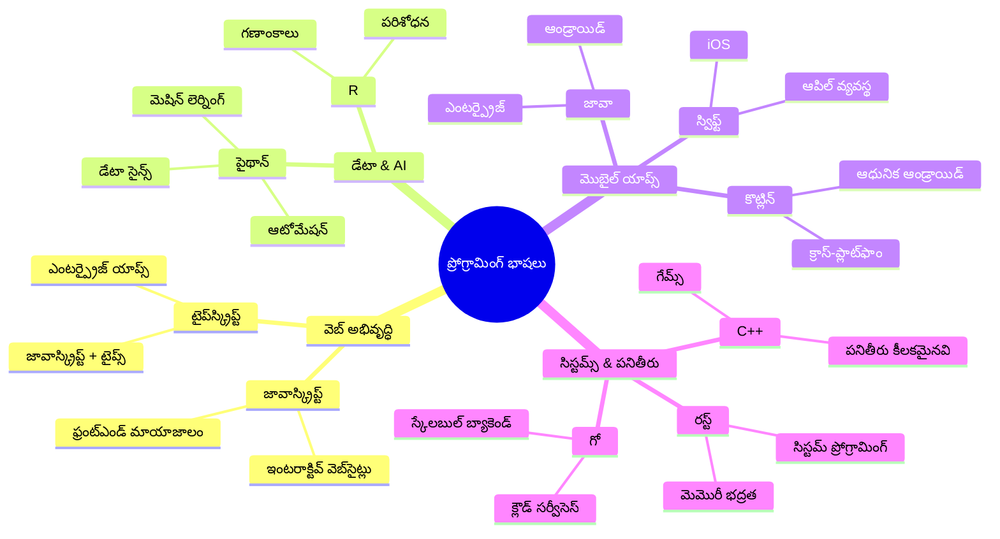
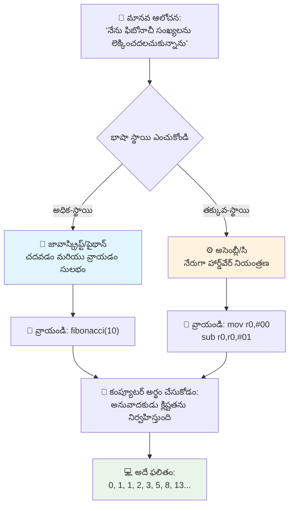
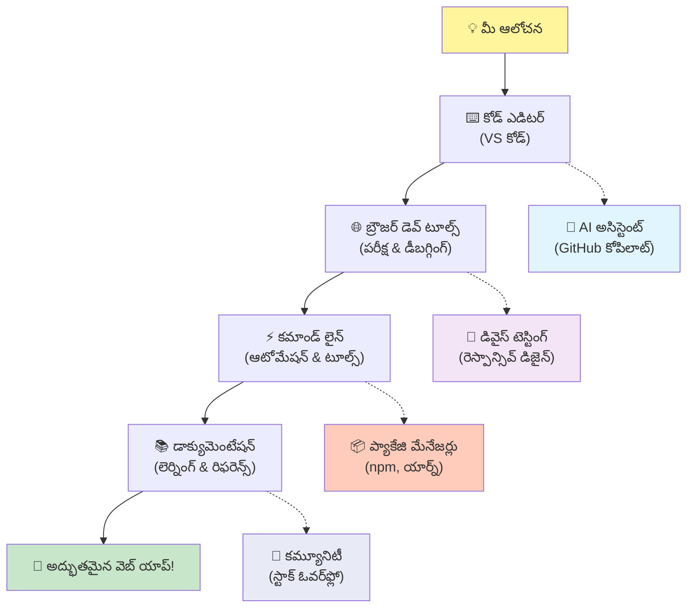

# ప్రోగ్రామింగ్ భాషలు మరియు ఆధునిక డెవలపర్ టూల్స్ కు పరిచయం

హలో, భవిష్యత్తున డెవలపర్! 👋 నేను నీకు ప్రతిరోజూ చల్లగా అనిపించే ఒక విషయం చెప్పనా? ప్రోగ్రామింగ్ అంటే కేవలం కంప్యూటర్ల గురించి కాదు – ఇది నీ కలలని నిజం చేసుకునే అసలైన సూపర్ పవర్లు పొందేందుకు సంబంధించినది!

నీకు తెలుసా, నువ్వు ఇష్టపడి వాడే యాప్ ఉపయోగిస్తున్నప్పుడు ఆ క్షణం ఎలా సరిపోయిందన్నా? ఒక బటన్ తప్పినప్పుడు అద్భుతమైనది జరిగి "వావ్, వారు ఎలా చేసింది?" అనిపించే క్షణం? ఆజ్ఞానకాక నువ్వు లాంటి ఎవరైనా – వరుస ఎస్ప్రెస్సో తాగుతూ రాత్రి 2 గంటలకు ఇష్టమైన కాఫీ షాపులో కూర్చుని – ఆ కోడ్ రాశారు. అలాగే ఈ పాఠం చివరికి, వారు ఎలా చేశారో గానీ అర్థమవుతుంది మాత్రమే కాదు, నువ్వు కూడా ప్రయత్నించాలనీ తలపడతావు!

నాకు పూర్తిగా అర్థమవుతుంది, ప్రోగ్రామింగ్ ఈ క్షణంలో భయంకరంగా అనిపించవచ్చు. నేను మొదట ప్రారంభించినప్పుడు, ప్రోగ్రామింగ్ అంటే గణిత మేథం గాణం కావాలి లేదా అయిదేళ్ల వయసుముంచటి నుంచే కోడింగ్ చేస్తున్నవారికిలా ఉండాలనిపించింది. కానీ నా దృష్టిని పూర్తిగా మార్చినది ఇలా ఉంది: ప్రోగ్రామింగ్ అంటే కొత్త భాషలో సంభాషణలు నేర్చుకోవటంలా ఉంటుంది. "హలో" మరియు " థ్యాంక్ యు" తో మొదలవుతుంది, తర్వాత కాఫీ కోరడం నేర్చుకుంటారు, ఆ తరువాత లోతైన తత్వవేత్తల సంభాషణలకు చేరుకుంటారు! కానీ ఇక్కడ నువ్వు కంప్యూటర్లతో సంభాషిస్తున్నట్టు, అవి అమిత సహనంతో ఎదుర్కొంటూ ఉంటాయి – నువ్వు చేసే పొరపాట్లు ఎప్పుడూ తీరు చూడవు మరియు ఎప్పుడూ మళ్లీ ప్రయత్నించడానికి ఉత్సాహంగా ఉంటాయి!

ఈరోజు, ఆధునిక వెబ్ డెవలప్మెంట్ నీకు సాధ్యంకాకుండా కాకుండా విపరీతంగా ఆకర్షణీయంగా చేసే అద్భుతమైన సాధనాలను మనం తెలుసుకోబోతున్నాం. నేను ప్రస్తావిస్తున్నది నెట్‌ఫ్లిక్స్, స్పాటిఫై మరియు నీ ఇష్టమైన ఇండీ యాప్ స్టూడియోల డెవలపర్లు ప్రతిరోజూ ఉపయోగించే అదే ఎడిటర్లను, బ్రౌజర్లను మరియు వర్క్‌ఫ్లోలను గురించి. ఇంకా, ఈ ప్రొఫెషనల్-గ్రేడ్, పరిశ్రమ-ధారిత సాధనాలు చాలా ఉచితమని విని నీకూ ఆనందంగా ఉనికి కలిగిస్తుంది!


> స్కెచ్ నోట్ [Tomomi Imura](https://twitter.com/girlie_mac) ద్వారా


```mermaid
journey
    title మీ ప్రోగ్రామింగ్ ప్రయాణం నేడు
    section కనుగొనండి
      ప్రోగ్రామింగ్ అనేది ఏమిటి: 5: You
      ప్రోగ్రామింగ్ భాషలు: 4: You
      సాధనాలు అవలోకనం: 5: You
    section అన్వేషించండి
      కోడ్ ఎడిటర్లు: 4: You
      బ్రౌజర్లు & డెవ్ టూల్స్: 5: You
      కమాండ్ లైన్: 3: You
    section అలవాటు చేసుకోండి
      భాష డిటెక్టివ్: 4: You
      సాధన అన్వేషణ: 5: You
      కమ్యూనిటీ నెట్టవరం: 5: You
```
## నీకు ఇప్పటికే ఏమి తెలుసు చూద్దాం!

సంతోషకరమైన విషయాల మీదకి ముందుకు దూకేముందు, నేను ఆ పurog్రమింగ్ ప్రపంచం గురించి నువ్వు ఏమి తెలుసుకుంటున్నావో తెలుసుకోవాలని ఆసక్తి. మరియు ఇవి చూసి "ఇవన్నీ నాకు ఏమీ తెలియదు" అనిపిస్తే, అది బాగానే ఉంది, అది చక్కగా ఉంది! అంటే నువ్వు ఖచ్చితంగా సరైన చోటుంది. ఈ క్విజ్ ని ఒక వర్కవుట్ కు ముందు వత్తు చేస్తున్నట్టు భావించు – మన మెదడుకి అరికడ పదేపదే వేయడం!

[పూర్వ పాఠం క్విజ్ చేయండి](https://ff-quizzes.netlify.app/web/)


## మనం కలిసి వెళ్ళే సాహసం

సరే, నేను నిజంగా ఉత్సాహంతో ఉన్నాను మనం ఈ రోజు ఏం తెలుసుకోబోతున్నామో! నిజానికి, కొన్ని భావాలు నీకు అర్థమయ్యే సమయంలో నేను నీ ముఖం చూడాలనిపిస్తుంది. మనం కలిసి తీసుకునే అద్భుత ప్రయాణం ఇది:

- **ప్రోగ్రామింగ్ అంటే ఏమిటి? (మరియు ఎందుకు ఇది అద్భుతమైనది!)** – కోడ్ అనేది నీ చుట్టూ ఉన్న ప్రతీ దానికి చెందిన అహం దృశ్యం లేని మాయాజాలం అని మనం కనుగొంటాము, సోమవారం ఉదయం అని తెలిసే అలారం నుండి నీ నెట్‌ఫ్లిక్స్ సూచనలు పిల్లి లాగా సర్దిచేస్తూ ఉన్న అల్గోరిథం వరకు
- **ప్రోగ్రామింగ్ భాషలు మరియు వాటి అద్భుతమైన వ్యక్తిత్వాలు** – ప్రతి వ్యక్తికీ భిన్నమైన సూపర్పవర్లు మరియు సమస్యలను పరిష్కరించాలనే భిన్నమైన మార్గాలు ఉన్న పార్టీకి నువ్వు వచ్చావని ఊహించు. అదే ప్రోగ్రామింగ్ భాషల ప్రపంచం, మరియు నువ్వు అవి కలుసుకోవడం ఇష్టపడతావు!
- **డిజిటల్ మాయాజాలాన్ని సృష్టించే ప్రాథమిక నిర్మాణ భాగాలు** – ఇది సెలవు రోజు కల్పించిన కోరికలకు తీరుగా ఉపయుక్తమయ్యే అతి గొప్ప క్రియేటివ్ లెగో సెట్టుగా భావించు. ఈ భాగాలు ఎలా కలిసి పనిచేస్తాయో అర్థం చేసుకుంటే, నీ కలలు ఏదైనా నిర్మించగలవు
- **ప్రొఫెషనల్ టూల్స్, వాటితో నీకు వారం వొక అధ్బుత మాంత్రికుడి కుడా ఇచ్చినట్లు అనిపిస్తుంది** – నేను తక్కువ భాష ఉపయోగించడం లేదు – ఈ సాధనాలు నిజంగా నీకు సూపర్ పవర్ లాంటి అనుభూతి ఇస్తాయి, మంచి విషయం ఏమిటంటే? అదే సాధనాలు నిపుణులు ఉపయోగిస్తున్న యి!

> 💡 **ఇది గుర్తుంచుకోవాలి**: ఇవన్నీ ఒకరోజే గుర్తుంచుకునేందుకు ప్రయత్నించవద్దు! ఇప్పుడు నీకు ఏమి సాధ్యమో ఉత్సాహం కలగాలని కోరుకుంటున్నా. వివరాలు సహజంగానే జ్ఞాపకం కలుగుతాయి – అది నిజమైన నేర్చుకునే పద్ధతి!

> నువ్వు ఈ పాఠం [Microsoft Learn](https://learn.microsoft.com/en-us/learn/modules/web-development-101/introduction-programming/?WT.mc_id=academic-77807-sagibbon) లో కూడా చూచుకోవచ్చు!

## మరి, ప్రోగ్రామింగ్ అంటే నిజంగా ఏమిటి?

మరి నాలుగు మిలియన్ డాలర్ల ప్రశ్నకి సమాధానం చూద్దాం: ప్రోగ్రామింగ్ ఏంటంటే?

నాకు ఈ విషయం ఎలా మారిందో చెప్పే ఒక కథ చెప్పా. గత వారం, నేను మా కొత్త స్మార్ట్ టీవీ రిమోట్ ఎలా ఉపయోగించాలో తల్లి కి వివరించడానికి ప్రయత్నిస్తున్నాను. "రెడ్ బటన్ నొక్కు, కానీ పెద్ద రెడ్ బటన్ కాదు, ఎడమవైపున ఉన్న చిన్న రెడ్ బటన్... కాదు, నీ మరో ఎడమ... సరే, ఇప్పుడు రెండు సెకన్లు పట్టుకో, ఒక్కటో కాదు, మూడో కూడా కాదు..." అని చెప్పుకుంటూ ఉన్నాను. ఇది నీకు తెలుసా? 😅

అదే ప్రోగ్రామింగ్! చాలా శక్తివంతమైన వాటికి వివరమైన, దశల వేదించలేని సూచనలు ఇవ్వడమే ఇది. కాని నీ తల్లికి వివరణ ఇచ్చే కంటే (ఆమె అడగొచ్చు "ఏ రెడ్ బటన్?") తరువాత కంప్యూటర్ కి వివరణ చెప్తున్నావు (అది చెప్పిందే చేస్తుంది, అది నీ అభిప్రాయం కాకపోయినా).

నేను ఒకసారి తెలుసుకున్నప్పుడు మైండ్ బ్లో అయింది: కంప్యూటర్లు అసలు చాలా సింపుల్ ఉన్నాయి. అవి రెండు మాత్రమే అర్థం చేసుకుంటాయి – 1 మరియు 0, అంటే basically "అవును" మరియు "కాదు" లేదా "ఆన్" మరియు "ఆఫ్." అంతే! కానీ ఇక్కడ అద్భుతం ఏమిటంటే – మనం 1 మరియు 0 లలోనే మాట్లాడాల్సిన అవసరం లేదు. అప్పుడు **ప్రోగ్రామింగ్ భాషలు** అందుకు వచ్చి ద cứu చేస్తాయి. అవి ప్రమాదం లేని అత్యద్భుత అనువాదకుల్లా ఉంటాయి, నీ సాధారణ మానవ ఆలోచనలను కంప్యూటర్ భాషలోకి మార్చేస్తాయి.

మరియు ప్రతి ఉదయం నాకు ఇప్పటికీ శీతలత కలిగించే విషయం ఏమిటంటే: నీ డిజిటల్ జీవితం లో ఉన్న *ప్రతి* భేదం నువ్వంటివారు కాఫీ తాగుతూ ప్యాజామా ధరించి ఉన్న వారు రాసిన కోడ్ తో ప్రారంభమైంది. నీ జిగురు చూపించే ఆ ఇన్‌స్టాగ్రామ్ ఫిల్టర్? ఎవరో ఆ కోడ్ రాశారు. నీకు కొత్త ఇష్టమైన పాటకు దారి తీసే సిఫారసు? ఒక డెవలపర్ ఆ అల్గోరిథాన్ని నిర్మించాడు. నీతో స్నేహితులతో జరిగిన డిన్నర్ బిల్లుల్ని పంచుకునే యాప్? అవును, ఎవరైనా "ఇది ఇబ్బంది" అనుకున్నారు, "నేను దీన్ని సరిచేసగలను" అనుకున్నారు... తరువాత వారు చేసారు!

ప్రోగ్రామ్ నేర్చుకున్నప్పుడు, నువ్వు కొత్త నైపుణ్యం పొందడమే కాదు – ఈ అద్భుతమైన సమస్య పరిష్కారకులు సమాజంలో భాగమవుతున్నావు. వారు రోజులు చేసిన ఆలోచన "ఎవరైనా వారి రోజు కొంచెం మెరుగు చేసే దాన్ని నేను నిర్మిస్తే ఎలా ఉంటుందో?" నిజంగా, ఆ కంటే అద్భుతమైన ఏదైనా ఉన్నదా?

✅ **ఫన్ ఫాక్ట్ కనుగొను:** నీకు కొంత సేపు ఉన్నప్పుడు తెలుసుకుని చూస్తే సూపర్ కూల్ – ప్రపంచంలో ప్రథమ కంప్యూటర్ ప్రోగ్రామర్ ఎవరో? ఒక సూచన ఇస్తా: ఆశించిన వ్యక్తి కావచ్చు అనుకోవచ్చు కాదు! ఆ వ్యక్తి కథ చాలా ఆసక్తికరంగా ఉంది మరియు ప్రోగ్రామింగ్ ఎప్పటికీ సృజనాత్మక సమస్య పరిష్కారానికి సంబంధించినదనే చూపిస్తుంది.

### 🧠 **చెక్-ఇన్ సమయం: నువ్వు ఎలా అనుభవిస్తున్నావు?**

**కొంత సమయం తీసుకుని ఆలోచించు:**
- "కంప్యూటర్లకు సూచనలు ఇవ్వడం" అనే ఆలోచన ఇప్పుడు నీకు అర్థమైందా?
- నువ్వు ప్రతీ రోజు చేస్తున్న పనిని ప్రోగ్రామింగ్ తో ఆటోమేట్ చేయాలని అనుకుంటున్నావా?
- ఈ మొత్తం ప్రోగ్రామింగ్ విషయం గురించి నీ మనసులో ఏమేమి సంబంధిత ప్రశ్నలు ఉన్నాయి?

> **గుర్తుంచుకో:** కొంత భాగం కొంత గందరగోళంగా అనిపించకపోవడం చాలా సహజం. ప్రోగ్రామింగ్ నేర్చుకోవడం కొత్త భాష నేర్చుకోవటం వంటిది – నీ మెదడు ఆ న్యూట్రల్ మార్గాలను నిర్మించుకోవడానికి సమయం దిద్దుకుంటుంది. నువ్వు బాగున్నావు!

## ప్రోగ్రామింగ్ భాషలు వివిధ రకాల మాయాజాల రుచుల్లాగా ఉంటాయి

సరే, ఇది విచిత్రంగా అనిపించవచ్చు, కానీ నా మాట విను – ప్రోగ్రామింగ్ భాషలు వివిధ సంగీత શૈలి లా ఉంటాయి. మీరు వింటే జాస్సు చక్కగా, స్వేచ్ఛభరితంగా ఉంటుంది, రాక్ శక్తివంతంగా, క్లాసికల్ గొప్పగా, క్రమబద్ధంగా ఉంటుంది, మరియు హిప్-హాప్ సృజనాత్మకంగా, మనోజ్ఞంగా ఉంటుంది. ప్రతి శైలి తన స్వతంత్ర వాతావరణం, అభిమాని సమూహం ఉందని, మరియు ప్రతీది వేరువేరు సమయాల్లో సరిపోతుందని.

ప్రోగ్రామింగ్ భాషలు కూడా అంతే! మీరు ఒక సరదా మొబైల్ గేమ్ కోసం వాడే భాష వాడి వాతావరణ డేటాను విశ్లేషించలేరు, అలాగే మీరు యోగా క్లాస్ లో డెత్ మేటల్ (అంటే చాలా శక్తివంతమైన సంగీతం) వింటారు కాదు (అధిక సంఖ్యలో యోగా క్లాసులు లేవు! 😄).

కాని నేను ప్రతిసారీ ఆశ్చర్యపోతాను: ఈ భాషలు ప్రపంచంలో అత్యంత సహిస్తారూ, మేధావయుల్లా, నీ పక్కన కూర్చొని ఉంటారు. నీ ఆలోచనలను మానవ మెదడికి సహజంగా అనిపించే విధంగా ప్రదర్శించవచ్చు, మరియు అవి కంప్యూటర్లు మాట్లాడే 1 మరియు 0 లకు అనువదించడం సౌకర్యంగా చేస్తాయి. ఇది మానవ సృజనాత్మకత మరియు కంప్యూటర్ లాజిక్ రెండింటినీ నైపుణ్యంగా అలవాటు చేసుకున్న స్నేహితుడు కలిగినట్టు – అవి అలసిపోదు, కాఫీ విరామాలు అవసరం లేదు, రెండు సార్లు అదే ప్రశ్న అడిగినా ఎప్పుడు విమర్శించవు!

### ప్రసిద్ధ ప్రోగ్రామింగ్ భాషలు మరియు వాటి ఉపయోగాలు


```mermaid
mindmap
  root((ప్రోగ్రామింగ్ భాషలు))
    వెబ్ అభివృద్ధి
      జావాస్క్రిప్ట్
        ఫ్రంట్‌ఎండ్ మాయాజాలం
        ఇంటరాక్టివ్ వెబ్‌సైట్లు
      టైప్‌స్క్రిప్ట్
        జావాస్క్రిప్ట్ + టైప్స్
        ఎంటర్ప్రైజ్ యాప్స్
    డేటా & AI
      పైథాన్
        డేటా సైన్స్
        మెషిన్ లెర్నింగ్
        ఆటోమేష‌న్
      R
        గణాంకాలు
        పరిశోధన
    మొబైల్ యాప్స్
      జావా
        ఆండ్రాయిడ్
        ఎంటర్ప్రైజ్
      స్విఫ్ట్
        iOS
        ఆపిల్ వ్యవస్థ
      కొట్లిన్
        ఆధునిక ఆండ్రాయిడ్
        క్రాస్-ప్లాట్‌ఫాం
    సిస్టమ్స్ & పనితీరు
      C++
        గేమ్స్
        పనితీరు కీలకమైనవి
      రస్ట్
        మెమొరీ భద్రత
        సిస్టమ్ ప్రోగ్రామింగ్
      గో
        క్లౌడ్ సర్వీసెస్
        స్కేలబుల్ బ్యాకెండ్
```
| భాష | ఉత్తమమైనది | ఎందుకు ప్రాచుర్యం పొందింది |
|----------|----------|------------------|
| **జావాస్క్రిప్ట్** | వెబ్ డెవలప్మెంట్, యూజర్ ఇంటర్‌ఫేస్‌లు | బ్రౌజర్‌లలో పరుగెడుతుంది, ఇంటరాక్టివ్ వెబ్‌సైట్‌లకు శక్తి అందిస్తుంది |
| **పైతాన్** | డేటా సైన్స్, ఆటోమేషన్, AI | చదవడం మరియు నేర్చుకోవడం సులభం, శక్తివంతమైన లైబ్రరీలు ఉన్నాయి |
| **జావా** | ఎন্টারప్రైజ్ అప్లికేషన్లు, ఆండ్రాయిడ్ యాప్స్ | ప్లాట్‌ఫారమ్-స్వతంత్రం, పెద్ద సిస్టమ్‌లకు బలమైనది |
| **C#** | విండోస్ అప్లికేషన్లు, గేమ్ డెవలప్మెంట్ | మైక్రోసॉफ్ట్ ఎకోసిస్టమ్ మద్దతు బలమైనది |
| **Go** | క్లౌడ్ సర్వీసులు, బ్యాక్‌ఎండ్ సిస్టమ్స్ | వేగవంతమైనది, సులభమైనది, ఆధునిక కంప్యూటింగ్ కోసం రూపకల్పన చెయ్యబడింది |

### హై-లెవెల్ vs. లో-లెవెల్ భాషలు

సరే, ఇది నిజంగా నేను నేర్చుకోవడం ప్రారంభించినపుడు నా మెదడ్ని విరగదీసిన భావన, అందుకే నేను నా కోసం ఎలా క్లిక్ చేసిందో వివరిస్తున్నాను – ఇది నీకు కూడా సహాయం చేస్తుందని భావిస్తున్నాను!

నీకు తెలియని భాష మాట్లాడే దేశానికి వెళ్ళి దగ్గర్లో కార్యాలయాన్ని కనుగొనాల్సి వస్తుందని ఊహించు (మనది అందరికీ అనుభవం చూసుకోండి, కదా? 😅):

- **లో-లెవెల్ ప్రోగ్రామింగ్** అంటే ఆ దేశంలోని స్థానిక భాషను అంతిగట్టుగా నేర్చుకుని దంత వ్యాసుడు అమ్మే వృద్ధ అమ్మమ్మతో సంభాషించడం లాంటిది, స్థానిక సంస్కృతి, లోకల్ సెలబ్రిటీలు, జోక్స్ ఉపయోగించి. ఇది దెబ్బ తీయబోతుంది, చాలా సమర్ధవంతమైనది... మీరు ఆ భాషలో ప్రతిఫలముగా ఉన్నారంటేనే! కానీ మీరు సాధారణంగా కేవలం టాయిలెట్ తలంపు మాత్రమే చేస్తూ ఉన్నప్పుడు అది చాలా భయంకరంగా ఉంటుంది.

- **హై-లెవెల్ ప్రోగ్రామింగ్** అంటే ఆ అద్భుతమైన స్థానిక స్నేహితుడు ఉన్నట్టే. నువ్వు సాధారణ ఇంగ్లీష్ లో "నాకు నేను టాయిలెట్ కనుక్కోను" అంటావు, వారు అన్ని తిరుగుల అర్థం పదేపదే అనువదించి నీకు అర్ధమయ్యే విధంగా దిశానిర్దేశం ఇస్తారు.

ప్రోగ్రామింగ్ రంగంలో:
- **లో-లెవెల్ భాషలు** (అసెంబ్లీ లేదా C లా) కంప్యూటర్ యొక్క హార్డ్‌వేర్‌తో చాలా వివరమైన సంభాషణ చేసేందుకు అనుమతిస్తాయి, కానీ నువ్వు యంత్రంలా ఆలోచించాల్సి ఉంటుంది, అది... పెద్ద మెంటల్ మార్పు అనుకోవచ్చు!
- **హై-లెవెల్ భాషలు** (జావాస్క్రిప్ట్, పైతాన్ లేదా C# లా) నువ్వు మానవుల్లా ఆలోచించవచ్చు, మిగతా బ్యాక్‌గ్రౌండ్ మెషిన్ పని ఆ భాషలు చూసుకుంటాయి. అదనంగా, వాటి సమాజాలు చాలా ఆతిథ్యంగా ఉంటాయి, కొత్తవారిని గమనిస్తూ సహాయం చేయాలనుకునే వారు ఉండండి!

ఏవి నువ్వు మొదలుపెట్టాలని నేను సూచిస్తానో ఊహించగలవా? 😉 హై-లెవెల్ భాషలు శిక్షణ వీల్స్ లాంటివి, వాళ్ళను తీసేయకపోతే మనం మరింత ఆనందంగా ఉంటాం!


```mermaid
flowchart TB
    A["👤 మానవ ఆలోచన:<br/>'నేను ఫిబోనాచీ సంఖ్యలను లెక్కించదలచుకున్నాను'"] --> B{భాషా స్థాయి ఎంచుకోండి}
    
    B -->|అధిక-స్థాయి| C["🌟 జావాస్క్రిప్ట్/పైథాన్<br/>చదవడం మరియు వ్రాయడం సులభం"]
    B -->|తక్కువ-స్థాయి| D["⚙️ అసెంబ్లీ/సి<br/>నేరుగా హార్డ్‌వేర్ నియంత్రణ"]
    
    C --> E["📝 వ్రాయండి: fibonacci(10)"]
    D --> F["📝 వ్రాయండి: mov r0,#00<br/>sub r0,r0,#01"]
    
    E --> G["🤖 కంప్యూటర్ అర్థం చేసుకోడం:<br/>అనువాదకుడు క్లిష్టతను నిర్వహిస్తుంది"]
    F --> G
    
    G --> H["💻 అదే ఫలితం:<br/>0, 1, 1, 2, 3, 5, 8, 13..."]
    
    style C fill:#e1f5fe
    style D fill:#fff3e0
    style H fill:#e8f5e8
```
### ఎందుకు హై-లెవెల్ భాషలు అంతే స్నేహపూర్వకమో చూపిస్తాను

సరే, నేను నీకు ఒక ఉదాహరణ చూపించబోతున్నాను, ఎందుకంటే నేను హై-లెవెల్ భాషలతో ప్రేమ పట్టుకున్నాను. కానీ ముందుగా – ఒక వాగ్దానం ఇవ్వు. మొదటి కోడ్ ఉదాహరణ చూసేటప్పుడు భయపడవద్దు! అది కాస్త భయంకరంగా కనిపించాలి. అదే నేను చెప్పాలనుకున్న విషయం!

మనము ఒకే పని రెండు వేర్వేరు శైలిలో రాయబడిన కోడ్ ను చూద్దాం. అవి ఫిబొనాచీ సీక్వెన్స్ కి సంబంధించినవి – ఇది ఒక అద్భుత గణిత నమూనా, ప్రతి సంఖ్య రెండు ముందు ఉన్న సంఖ్యల మొత్తం: 0, 1, 1, 2, 3, 5, 8, 13... (ఫన్ ఫ్యాక్ట్: ఈ పటర్న్ ప్రకృతిలో ఎక్కడికి చూసినా కనిపిస్తుంది – సూర్యగోధూలి గింజల తార్పు, శంకు నమూనాలు, గాలక్సీలు ఏర్పడే విధానం కూడా!)

తేడా చూడడానికి సిద్ధమా? పోదాం!

**హై-లెవెల్ భాష (జావాస్క్రిప్ట్) - మానవ-స్నేహపూర్వకంగా:**

```javascript
// దశ 1: ప్రాథమిక ఫిబోనాచీ సెటప్
const fibonacciCount = 10;
let current = 0;
let next = 1;

console.log('Fibonacci sequence:');
```

**ఇది చేసే పనులు:**
- **ఘోషించు** ఎన్ని ఫిబొనాచీ సంఖ్యలు కలిగి ఉండాలనుకుంటున్నామో తెలియజేస్తూ ఒక కానస్టెంట్
- **ప్రారంభించు** ప్రస్తుత మరియు తరువాతి సంఖ్యల ట్రాకింగ్ చేయడానికి రెండు వేరియబుల్స్
- **సెట్ చెయ్యి** ప్రారంభ విలువలు (0 మరియు 1) ఫిబొనాచీ నమూనాకు నిర్వచిస్తాయి
- **ప్రదర్శించు** అవుట్పుట్ గుర్తించేందుకు హెడ్డర్ సందేశం

```javascript
// దశ 2: లూప్‌తో క్రమం ఉత్పత్తి చేయండి
for (let i = 0; i < fibonacciCount; i++) {
  console.log(`Position ${i + 1}: ${current}`);
  
  // క్రమంలో తదుపరి సంఖ్యని లెక్కించండి
  const sum = current + next;
  current = next;
  next = sum;
}
```

**ఇక్కడ జరిగేది:**
- **లూప్** ఒక ఫర్ లూప్ ఉపయోగించి ప్రతి స్థానాన్ని తిప్పుతూ
- **ప్రదర్శించు** ప్రతీ సంఖ్యని దాని స్థానంతో టెంప్లేట్ లిటరల్ ఫార్మాట్ లో
- **లెక్కించు** తదుపరి ఫిబొనాచీ సంఖ్య ప్రస్తుత మరియు తరువాతి విలువల যোগం ద్వారా
- **అప్డేట్ చేయి** ట్రాకింగ్ వేరియబుల్స్ తదుపరి చక్రంలోకి రావడానికి

```javascript
// దశ 3: ఆధునిక функционal ప్రమేయం
const generateFibonacci = (count) => {
  const sequence = [0, 1];
  
  for (let i = 2; i < count; i++) {
    sequence[i] = sequence[i - 1] + sequence[i - 2];
  }
  
  return sequence;
};

// వాడుక ఉదాహరణ
const fibSequence = generateFibonacci(10);
console.log(fibSequence);
```

**పైగా, మనం:**
- **నిర్మించు** ఆధునిక arrow ఫంక్షన్ సింటాక్స్ ఉపయోగించి తిరిగి వాడే ఫంక్షన్
- **తయారు చేయి** మొత్తం సీక్వెన్స్ నిల్వ చేయడం కోసం అర్రే, ఒకదానిని ఒక్కటిగా చూపించకుండా
- **ఉపయోగించు** అర్రే ఇండెక్సింగ్ గత విలువల నుండి ప్రతి కొత్త సంఖ్య లెక్కించేందుకు
- **తిరిగి ఇవ్వు** పూర్తి సీక్వెన్స్ ని ఇతర భాగాల్లో ఉపయోగార్ధం చేసేందుకు

**లో-లెవెల్ భాష (ARM అసెంబ్లీ) – కంప్యూటర్-స్నేహపూర్వకంగా:**

```assembly
 area ascen,code,readonly
 entry
 code32
 adr r0,thumb+1
 bx r0
 code16
thumb
 mov r0,#00
 sub r0,r0,#01
 mov r1,#01
 mov r4,#10
 ldr r2,=0x40000000
back add r0,r1
 str r0,[r2]
 add r2,#04
 mov r3,r0
 mov r0,r1
 mov r1,r3
 sub r4,#01
 cmp r4,#00
 bne back
 end
```

జావాస్క్రిప్ట్ వర్షన్ ఇంగ్లీష్ ఇన్స్ట్రక్షన్స్ లాగానే చదవబడుతుంది, కాగా అసెంబ్లీ వర్షన్ క్రిప్టిక్ ఆదేశాలు ఉపయోగించి కంప్యూటర్ ప్రాసెసర్ ని నేరుగా నియంత్రిస్తోంది. రెండూ అదే పని చేస్తాయి, కానీ హై-లెవెల్ భాష మానవులకు అర్థం చేసుకోవడానికి, రాయడానికి, నిర్వహించడానికి బాగుంటుంది.

**మీదైన ప్రముఖ భిన్నతలు మీరు గమనిస్తారు:**
- **చదవగలత**: జావా‌స్క్రిప్ట్ `fibonacciCount` లాంటి వివరణాత్మక పేర్లు ఉపయోగిస్తే, అసెంబ్లీ `r0`, `r1` లాంటి సంకేతాత్మక లేబుళ్లను ఉపయోగిస్తుంది  
- **వ్యాఖ్యలు**: ఉన్నతస్థాయి భాషలు స్వయంసంప్రదాయకంగా ఉండే వ్యాఖ్యలను ప్రోత్సహిస్తాయి  
- **రచన**: జావాస్క్రిప్ట్ యొక్క తర్కబద్దమైన ప్రవాహం మనుషులు సమస్యలను ఒకదాని తర్వాత ఒకటి ఎలా ఆలోచిస్తారో అలాగే ఉంటుంది  
- ** పరిరక్షణ**: వేరువేరు అవసరాలకు జావాస్క్రిప్ట్ సంస్కరణను నవీకరించడం స్పష్టంగా మరియు సులభంగా ఉంటుంది  

✅ **ఫిబొనాకి సీక్వెన్స్ గురించి**: ఈ అద్భుతమైన సంఖ్యా నమూనా (ప్రతి సంఖ్య తన ముందు ఉన్న రెండు సంఖ్యల మొత్తానికి సమానం: 0, 1, 1, 2, 3, 5, 8...) ప్రకృతిలో సరిగ్గా ప్రతి చోటా కనబడుతుంది! మీరు దీనిని సూర్యఫూలు మడకలు, పైన్‌కోన్ నమూనాలు, నౌటిలస్ సిప్స్ వలయాలు, మరియు చెట్టు శాఖలు పెరిగే రీతిలో కనిపిస్తుంది. గణితం మరియు కోడ్ సహాయంతో ప్రకృతిలో అందాన్ని సృష్టించే నమూనాలను మనం అర్థం చేసుకొను మరియు పునఃసృష్టించగలమంటే అది నిజంగా ఆశ్చర్యకరం!


## మ్యాజిక్ జరుగుతుంది ఆ మౌలిక ఘటకాలు

సరే, ఇప్పుడు మీరు ప్రోగ్రామింగ్ భాషలు ఎలా పనిచేస్తాయో చూశారు కాబట్టి, ప్రతి ప్రోగ్రామ్ లో ఉండే మౌలిక భాగాలను కూలగొట్టుకుందాం. వీటిని మీ ఇష్టమైన వంటకం లో ఉండే అవసరమైన సామగ్రి లాంటి వాటిగా పరిగణించండి – ప్రతి ఒక్కటి ఏమి చేస్తుందో అర్థం చేసుకుంటే, మీరు దాదాపు ఏ భాషలోైనా కోడ్ చదవగలుగుతూ వ్రాయగలుగుతారు!

ఇది ఒక విధంగా ప్రోగ్రామింగ్ వ్యాకరణం నేర్పుకునేటటిలానే. మీరు పాఠశాలలో నామవాచకాలు, క్రియల గురించి మరియు వాక్యాలను ఎలా సమకూర్చాలో నేర్చుకున్నప్పుడు గుర్తుందా? ప్రోగ్రామింగ్ కు తన స్వంత వ్యాకరణం ఉంది, నిజానికి అది ఆంగ్ల వ్యాకరణం కంటే చాలా తార్కికంగా మరియు క్షమాపణతో ఉంటుంది! 😄

### స్టేట్మెంట్‌లు: దశలవారీ సూచనలు

మనం **స్టేట్మెంట్‌లు** తో మొదలు పెడదాం – ఇవి మీ కంప్యూటర్ తో సంభాషణ లో ఒక్కో వాక్యముల్లాంటివి. ప్రతి స్టేట్మెంట్ కంప్యూటర్ కి ఒక నిర్దిష్ట పని చెయ్యమని చెబుతుంది, అటువంటి సూచనలు ఇలా ఉంటాయి: "ఇక్కడ ఎడమకు తిరుగు," "ఎర్రలేని యాంత్ర సమీపంలో ఆపు," "ఆ స్పాట్ లో పార్క్ చెయ్యి."

నేను స్టేట్మెంట్‌ల గురించి ప్రేమించే విషయం ఏమిటంటే అవి చదవడానికి ఎంత సులభంగా ఉంటాయో చూస్తే:

```javascript
// ఒక్క చర్యలను నిర్వహించే ప్రాథమిక ప్రకటనలు
const userName = "Alex";                    
console.log("Hello, world!");              
const sum = 5 + 3;                         
```
  
**ఈ కోడ్ ఏమి చెయ్యదు:**  
- ఒక కాంక్షం మార్చదగిన కాన్స్టెంట్ వేరియబుల్ లో యూజర్ పేరు నిల్వ చేయండి  
- కన్సోల్ ఔట్‌పుట్‌కు గ్రీటింగ్ సందేశం ప్రదర్శించండి  
- ఒక గణిత ఆపరేషన్ ఫలితాన్ని లెక్కించి నిల్వ చేయండి  

```javascript
// వెబ్ పేజీలతో ఇంటరాక్ట్ అయ్యే ప్రకటనలు
document.title = "My Awesome Website";      
document.body.style.backgroundColor = "lightblue";
```
  
**దశలవారీగా, ఇక్కడ ఏమి జరుగుతోంది:**  
- బ్రౌజర్ ట్యాబ్‌లో కనిపించే వెబ్‌పేజ్ శీర్షికను మార్చు  
- మొత్తం పేజీ శరీరం నేపథ్య రంగును మార్చు  

### వేరియబుల్స్: మీ ప్రోగ్రామ్ మెమొరీ వ్యవస్థ

సరే, **వేరియబుల్స్** నిజంగా నేర్పించడానికి నా అత్యంత ఇష్టమైన ఆలోచనలలో ఒకటి, ఎందుకంటే అవి మీరు ప్రతి రోజు ఉపయోగించే పదార్థాలకు చాలా సమానంగా ఉంటాయి!

మీ ఫోన్ సంప్రదింపు జాబితా గురించి ఒక సెకనుకు ఆలోచించండి. మీరు అందరి ఫోన్ నెంబర్లను జ్ఞాపకం పెట్టుకోరు – బదులు, "తల్లి," "మిత్రుడు," లేదా "రాత్రి 2 గంటల వరకు డెలివరీ చేసే పిజ్జా ప్లేస్" అని సేవ్ చేసుకుంటారు మీరు, మరియు మీ ఫోన్ నిజమైన నంబర్లను గుర్తుంచుతుంది. వేరియబుల్స్ కూడా ఇదే విధంగా పనిచేస్తాయి! అవి లేబుల్ చేసిన కంటైనర్లు లాంటివి, మీ ప్రోగ్రామ్ సమాచారం నిల్వ చేసేందుకు మరియు తర్వాత అది ఏమి ఉన్నదో అర్థం చేసుకునే పేరుతో దాన్ని తిరిగి పొందేందుకు ఉపయోగిస్తాయి.

ఇది నిజంగా చక్కగా ఉంది: వేరియబుల్స్ మీ ప్రోగ్రామ్ నడుస్తున్నప్పుడు మారొచ్చు (అదే జీవరీతంగా "variable" అన్న పదం నుండీ ఏర్పడింది). మీరు కొత్త సమాచారం నేర్చుకున్నప్పుడు లేదా పరిస్థితులు మారినప్పుడు వారికి విలువలను నవీకరించవచ్చు.

ఇది ఎంత అందంగా సులభంగా ఉందో చూపిస్తాను:

```javascript
// దశ 1: ప్రాథమిక వైరీయబుల్స్ తయారు చేయడం
const siteName = "Weather Dashboard";        
let currentWeather = "sunny";               
let temperature = 75;                       
let isRaining = false;                      
```
  
**ఈ కాన్సెప్ట్స్ అర్థం చేసుకోవడం:**  
- మారొనిది కాని విలువలను `const` వేరియబుల్స్ లో నిల్వ చేయండి (ఉదాహరణకు, సైట్ పేరు)  
- ప్రోగ్రామ్ నడిగేటప్పుడు మారగల విలువల కోసం `let` వాడండి  
- వేరియబుల్స్ కి వివిధ డేటా రకాలు అలౌ చేయండి: స్ట్రింగ్‌లు (అక్షరాలు), సంఖ్యలు, బూలియన్స్ (true/false)  
- ప్రతి వేరియబుల్ ఏమి అనేది వివరిస్తున్న సరైన పేర్లు ఎంచుకోండి  

```javascript
// దశ 2: సంబంధిత డేటాను సమూహీకరించడానికి ఆబ్జెక్టులతో పని చేయడం
const weatherData = {                       
  location: "San Francisco",
  humidity: 65,
  windSpeed: 12
};
```
  
**పై కోడులో మనం ఏమి చేశామో:**  
- సంబంధిత వాతావరణ సమాచారాన్ని ఒక ఆబ్జెక్టుగా సృష్టించాము  
- ఒక వేరియబుల్ పేరు క్రింద బహుళ డేటా నిల్వ చేయడం గమనించండి  
- ప్రతి సమాచారం స్పష్టంగా లేబుల్ చేసేందుకు కీ-వెల్యూ జంటలను ఉపయోగించాము  

```javascript
// దశ 3: వేరియబుల్స్ ఉపయోగించడం మరియు నవీకరించడం
console.log(`${siteName}: Today is ${currentWeather} and ${temperature}°F`);
console.log(`Wind speed: ${weatherData.windSpeed} mph`);

// మార్చగలిగే వేరియబుల్స్ ని నవీకరించడం
currentWeather = "cloudy";                  
temperature = 68;                          
```
  
**ప్రతి భాగాన్ని అర్థం చేసుకుందాం:**  
- `${}` సంకేతపధ్ధతితో టెంప్లేట్ లిటరల్స్ ఉపయోగించి సమాచారం ప్రదర్శించండి  
- ఆబ్జెక్ట్ లక్షణాలను డాట్ నోటేషన్ (`weatherData.windSpeed`) ద్వారా యాక్సెస్ చేయండి  
- మారుతున్న పరిస్థితులకు అనుగుణంగా `let` అని ప్రకటించిన వేరియబుల్స్ అనంతరం అప్‌డేట్ చేయండి  
- అర్థవంతమైన సందేశాల కోసం అనేక వేరియబుల్స్ కలపండి  

```javascript
// దశ 4: శ్రేష్ఠమైన కోడ్ కోసం ఆధునిక డెస్ట్రకచరింగ్
const { location, humidity } = weatherData; 
console.log(`${location} humidity: ${humidity}%`);
```
  
**ఇక్కడ మీరు తెలుసుకోవలసిందే:**  
- డీస్ట్రక్చరింగ్ అసైన్మెంట్ ఉపయోగించి ఆబ్జెక్టుల నుండి నిర్దిష్ట లక్షణాలను తీసుకోండి  
- ఆబ్జెక్ట్ కీజిలా పేర్లతో కొత్త వేరియబుల్స్ ఆటోమేటిక్ గా సృష్టించండి  
- పునరావృతమైన డాట్ నోటేషన్ నుండి విముక్తి పొందడానికి కోడ్ సులభతరం చేయండి  

### నియంత్రణ ప్రవాహం: మీ ప్రోగ్రామ్ కు ఆలోచించటం నేర్పించడం

సరే, ఇక్కడికెచ్చినట్టు ప్రోగ్రామింగ్ అద్భుతంగా ఉంటుంది! **నియంత్రణ ప్రవాహం** అనేది మీ ప్రోగ్రామ్‌కు తెలివైన నిర్ణయాలు తీసుకోవడం నేర్పించడం, మీరు ఒకరోజు కెల్లా ఆలోచించకుండా చేస్తూనే ఉండే పని వంటిది.

ఉదాహరణకి: ఈ ఉదయం మీరు "మంచు వాన వస్తే, నేను ఊకుపల్లక చెయ్యాలి. చలి ఉంటే, జాకెట్ ధరించాలి. ఆలస్యమైతే, ఆహారం తినకుండానే కాఫీ తీసుకోగలనా" అన్నట్లు ఆలోచించడం జరిగింది. మీరు రోజుకో కొన్ని పూటలుగా ఇలాంటి ఉంటే-మార్గదర్శకాలు అనుసరిస్తారు!

ఇది ప్రోగ్రామ్‌లను సాధారణ స్క్రిప్ట్ల కన్నా తెలివైనదిగా, జివితమయంగా మార్చుతుంది. అవి పరిస్థితి చూసి, అది ఏమి జరుగుతుందో అంచనా వేసి, అనుగుణంగా స్పందించగలవు. ఒక మెదడు ఇచ్చినట్లే అవి పరిణామానికి అనుగుణంగా నిర్ణయాలు తీసుకుంటాయి!

ఇది ఎంత సులభంగా పనిచేస్తుందో చూడాలా? ఇక్కడ చూడండి:

```javascript
// దశ 1: ప్రాథమిక షరతు తార్కికత
const userAge = 17;

if (userAge >= 18) {
  console.log("You can vote!");
} else {
  const yearsToWait = 18 - userAge;
  console.log(`You'll be able to vote in ${yearsToWait} year(s).`);
}
```
  
**ఈ కోడ్ ఏమి చేస్తుంది:**  
- యూజర్ వయసు ఓటింగ్ అర్హతకు సరిపోతుందో లేదో పరిశీలించు  
- పరిస్థితి ఫలితం ఆధారంగా వేరే వేరే కోడ్ భాగాలు అమలు చెయ్యి  
- 18 కంటే తక్కువ వయసు ఉంటే ఓటింగ్ అర్హత వచ్చే సమయాన్ని లెక్కించి ప్రదర్శించు  
- ప్రతి పరిస్థితికి స్పష్టమైన, సహాయక సూచనలు ఇచ్చు  

```javascript
// దశ 2: లాజికల్ ఆపరేటర్లతో బహుళ షరతులు
const userAge = 17;
const hasPermission = true;

if (userAge >= 18 && hasPermission) {
  console.log("Access granted: You can enter the venue.");
} else if (userAge >= 16) {
  console.log("You need parent permission to enter.");
} else {
  console.log("Sorry, you must be at least 16 years old.");
}
```
  
**ఇక్కడ ఏమి జరుగుతున్నదో అర్థం చేసుకుందాం:**  
- `&&` (మరియు) ఆపరేటర్‌తో బహుళ పరిస్థితులను కలిపి  
- బహుళ పరిస్థితుల కోసం `else if` వాడుతూ స్థాయి నిర్మాణం  
- అన్ని సాధ్యమైన సందర్భాలను `else` స్టేట్మెంట్ తో నిర్వహించు  
- ప్రతీ పరిస్థితికి స్పష్టమైన, అమలు చేయదగిన సూచనలు ఇవ్వడం  

```javascript
// దశ 3: టెర్నరీ ఆపరేటర్‌తో సంక్షిప్త ప్రమాణాత్మక ఆపరేషన్
const votingStatus = userAge >= 18 ? "Can vote" : "Cannot vote yet";
console.log(`Status: ${votingStatus}`);
```
  
**మీరు గుర్తుంచుకోవలసింది:**  
- సాదా రెండు ఎంపికల పరిస్థితులకు టెర్నరీ ఆపరేటర్ (`? :`) వాడండి  
- ముందు పరిస్థితిని వ్రాయండి, తరువాత `?`, తర్వాత నిజమైన ఫలితం, తర్వాత `:`, తర్వాత తప్పు ఫలితం రాయండి  
- ఈ నమూనా విలువలను పరిస్థితుల ఆధారంగా నియమించేటప్పుడు వర్తింపజేయండి  

```javascript
// దశ 4: అనేక నిర్దిష్ట సందర్భాలను నిర్వహించడం
const dayOfWeek = "Tuesday";

switch (dayOfWeek) {
  case "Monday":
  case "Tuesday":
  case "Wednesday":
  case "Thursday":
  case "Friday":
    console.log("It's a weekday - time to work!");
    break;
  case "Saturday":
  case "Sunday":
    console.log("It's the weekend - time to relax!");
    break;
  default:
    console.log("Invalid day of the week");
}
```
  
**ఈ కోడ్ ఈ క్రింది పనులు చేస్తుంది:**  
- వేరియబుల్ విలువను బహుళ నిర్దిష్ట కేసులతో పోల్చు  
- సంబందిత కేసులను కలిపి (వారం రోజుల వర్క్‌ డేస్ మరియు వీకెండ్స్)  
- సరిపడిన సందర్భం దొరుకుతుంటే సరైన కోడ్‌ను అమలు చేయండి  
- అనూహ్య విలువల కోసం `default` కేస్ ని కలిగి ఉండు  
- తదుపరి కేసుకు కోడ్ నడవకుండా `break` స్టేట్మెంట్లను ఉపయోగించండి  

> 💡 **వాస్తవ ప్రపంచ ఉదాహరణ**: నియంత్రణ ప్రవాహాన్ని మీరు సర్వశ్రేష్టమైన GPS లాంటి దిశానుభవాన్ని ఇవ్వడం లాగా పరిగణించండి. ఇది ఇలా చెప్పవచ్చు: "మెయిన్ స్ట్రీట్ ట్రాఫిక్ ఉన్నపుడు మీరు హైవే తీసుకోండి. హైవేతో పనులు బందులులైతే, దృశ్యమయమైన మార్గం ప్రయత్నించండి." ప్రోగ్రామ్‌లు అలానే వివిధ పరిస్థితులకు తెలివిగల ప్రతిస్పందనలు ఇవ్వటానికి అలాంటి షరతుల తర్కాన్ని వాడతాయి మరియు యూజర్లకు ఉత్తమ అనుభవం అందిస్తాయి.

### 🎯 **కాన్సెప్ట్ల తనిఖీ: బిల్డింగ్ బ్లాక్స్ నైపుణ్యం**

**మౌలికాలపై మీ స్థితి ఎలా ఉందో చూద్దాం:**  
- మీ ভাষాలో వేరియబుల్ మరియు స్టేట్మెంట్ మధ్య తేడా నెపదు చెప్పగలరా?  
- ఒక వాస్తవ ప్రపంచ పరిస్థితి గుర్తించండి అక్కడ if-then నిర్ణయం వాడగలరు (మన ఓటింగ్ ఉదాహరణ వంటిది)  
- ప్రోగ్రామింగ్ తర్కంలో మీని ఆశ్చర్యపరిచిన ఒక విషయం ఏంటి?  

**త్వరిత ధైర్యవर्धకుడు:**  

```mermaid
flowchart LR
    A["📝 ప్రకటనలు<br/>(సూచనలు)"] --> B["📦 వేరియబుల్స్<br/>(భద్రപ്പെടുത്തటం)"] --> C["🔀 నియంత్రణ ప్రవాహం<br/>(నిర్ణయాలు)"] --> D["🎉 పని గల ప్రోగ్రామ్!"]
    
    style A fill:#ffeb3b
    style B fill:#4caf50
    style C fill:#2196f3
    style D fill:#ff4081
```  
✅ **తదుపరి దశలో ఏమి రావాలంటే**: మనం ఈ కాన్సెప్ట్లలో ఇంకా లోతుగా ప్రవేశిస్తాము! ఈ అద్భుతమైన ప్రయాణంలో ముందుగా మీరు చేసే ప్రయత్నం గురించి ఉత్సాహంగా ఉండండి. నిపుణ్యాలు మరియు సాంకేతికతలు సహజంగా వస్తాయ్ మనం కలిసి అభ్యసించినప్పుడు – ఇది మీ ఊహలను మించిపోయి చాలా సరదాగా ఉంటుంది!

## పనిముట్లు

సరే, ఇక్కడ నిజంగా నేను ఎంతో ఉత్తేజపడుతున్నాను! 🚀 ఈ ప్లాట్‌ఫాం గురించి మాట్లాడబోతున్నాం - ఒక డిజిటల్ స్పేస్‌షిప్ కీలు మీరు ఏరి ని తీసుకున్నట్టు ఉంటుంది!

యెట్టు, రుచికరమైన వంటలకి చాకువలు వుండటంలా, సంగీతకారుడికి అతని గిటార్ పాటించటానికి సిద్ధంగా ఉన్నట్టు, డెవలపర్లు మా స్వంత మాయాజాల పనిముట్లు కలిగి ఉంటారు. మీ మైలు రాయాలు కూల్చేస్తుంది - ఎక్కువవారు ఇలాంటి పనిముట్లను ఉచితంగా పొందగలరు!

నేను మీతో ఇవి పంచుకోవడం ఆలోచించగా అసాధారణంగా ఆనందంగా ఉన్నాను ఎందుకంటే ఇవి మా సాప్ట్‌వేర్ అభివృద్ధి కు విప్లవాత్మక మార్పులు తెచ్చాయి. AI ఆధారిత కోడింగ్ సహాయకులు, వై-ఫై తో ఎక్కడైనా పూర్తి అప్లికేషన్ తయారుచేసే క్లౌడ్ వాతావరణాలు, ప్రోగ్రామ్‌లకు ఎక్స్-రే దృష్టి లాంటి డీబగ్గింగ్ పరికరాలు ఉన్నాయి.

ఇది "మొదటిసారి వాడే సాధనాలు" కాదు. ఇవి గూగుల్, నెట్‌ఫ్లిక్స్ మరియు మీరు ఇష్టపడే అరటి ప్రపంచం యాప్ స్టూడియోల సరైన ఆద్యక్ష సాధనాలు. మీరు వీటిని వాడాలంటే మీరు నిజంగా నిపుణుడిలా అనిపిస్తారు!


```mermaid
graph TD
    A["💡 మీ ఆలోచన"] --> B["⌨️ కోడ్ ఎడిటర్<br/>(VS కోడ్)"] 
    B --> C["🌐 బ్రౌజర్ డెవ్ టూల్స్<br/>(పరీక్ష & డీబగ్గింగ్)"]
    C --> D["⚡ కమాండ్ లైన్<br/>(ఆటోమేషన్ & టూల్స్)"]
    D --> E["📚 డాక్యుమెంటేషన్<br/>(లెర్నింగ్ & రిఫరెన్స్)"]
    E --> F["🚀 అద్భుతమైన వెబ్ యాప్!"]
    
    B -.-> G["🤖 AI అసిస్టెంట్<br/>(GitHub కోపిలాట్)"]
    C -.-> H["📱 డివైస్ టెస్టింగ్<br/>(రెస్పాన్సివ్ డిజైన్)"]
    D -.-> I["📦 ప్యాకేజి మేనేజర్లు<br/>(npm, యార్న్)"]
    E -.-> J["👥 కమ్యూనిటీ<br/>(స్టాక్ ఓవర్‌ఫ్లో)"]
    
    style A fill:#fff59d
    style F fill:#c8e6c9
    style G fill:#e1f5fe
    style H fill:#f3e5f5
    style I fill:#ffccbc
    style J fill:#e8eaf6
```  
### కోడ్ ఎడిటర్లూ, IDEs: మీ కొత్త డిజిటల్ మిత్రులు

మనం కోడ్ ఎడిటర్ల గురించి మాట్లాడుకుందాం – ఈ వేదికలు త్వరలో మీరు మరచిపోవాలనుకోని ప్రియమైన ప్రదేశాలు అవుతాయి! మీరు మీ డిజిటల్ కళాఖండాలను సృష్టించడానికి ఎక్కువ సమయం గడపబోతున్న వ్యక్తిగత కోడింగ్ ఆశ్రమం లాంటివి ఇవి.

కానీ ఆధునిక ఎడిటర్ల గొప్పదనం ఏమిటంటే: అవి కేవలం ఖాళీ టెక్స్ట్ ఎడిటర్లు కాదు. ఇవి 24/7 ఎప్పుడూ మీ దగ్గర కూర్చున్న అద్భుతమైన, మద్దతు ఇచ్చే కోడింగ్ గురువు లాంటి వట్లు ఉంటాయి. మీ టైపోలను మీరు అన్వేషించకముందే అరసి, మెరుగుదలల సూచనలు ఇస్తాయి, ప్రతి కోడ్ భాగం ఏమి పని చేస్తుందో అర్థం చేసుకోవడంలో సహాయపడతాయి, ఇంకా మీరు టైప్ చేయబోయే పదాలను ఊహించి మీ ఆలోచనలు పూర్తిచేయగలవు!

నేను ఆటో-కంప్లీషన్ కనిపించినప్పుడు  భవిష్యత్ లో జీవిస్తున్నట్లు అనిపించింది. మీరు టైప్ చేయగానే ఎడిటర్ మీకు "ఈ ఫంక్షన్ మీకెలావైనా అవసరమేనా?" అని విచారణ చేస్తుంది. అది మీ కోడింగ్ బడ్‌డి గా మైండ్ రీడర్ లాగా ఉంటుంది!

**ఇవి ఎడిటర్లను అద్భుతంగా చేసే అంశాలు ఏవి?**

ఆధునిక కోడ్ ఎడిటర్లు మీ కార్యదక్షత పెంపొందించే సేవలు అందిస్తాయి:

| లక్షణం | అది ఏమి చేస్తుంది | ఎందుకు సహాయపడుతుంది |
|---------|--------------|--------------|
| **సింటాక్స్ హైలైటింగ్** | కోడ్ లోనిది వేరు వేరు భాగాలను రంగులతో చెబుతుంది | కోడ్ చదవడం సులభంగా, తప్పుల సందర్శించడం సులభం |
| **ఆటో-కంప్లీషన్** | మీరు టైప్ చేస్తున్నప్పుడు సూచనలు ఇస్తుంది | కోడింగ్ వేగవంతం చేస్తుంది, టైపోలను తగ్గిస్తుంది |
| **డీబగ్గింగ్ టూల్స్** | తప్పులు కనుక్కోవడంలో మరియు సరిచేయడంలో సహాయపడుతుంది | సమస్య పరిష్కారానికి గంటలుగా సమయం ఆదా చేస్తుంది |
| **ఎక్స్‌టెన్షన్స్** | ప్రత్యేక ఫీచర్లను జోడిస్తుంది | ఏ టెక్నాలజీకి సరిపోయేలా ఎడిటర్ వ్యక్తిగతీకరించుకోండి |
| **AI సహాయకులు** | కోడ్ మరియు వివరణలను సూచిస్తారు | నేర్చుకునే దోశను వేగవంతం చేస్తుంది |

> 🎥 **వీడియో వనరు**: ఈ పనిముట్లు ఎలా పనిచేస్తాయో చూడాలంటే ఈ [Tools of the Trade video](https://youtube.com/watch?v=69WJeXGBdxg) న్ చూసి సమగ్ర అవగాహన పొందండి.

#### వెబ్ డెవలప్‌మెంట్ కోసం సిఫార్సు చేసిన ఎడిటర్లు

**[Visual Studio Code](https://code.visualstudio.com/?WT.mc_id=academic-77807-sagibbon)** (ఉచితం)  
- వెబ్ డెవలపర్లలో అత్యంత ప్రజాదరణ  
- అద్భుతమైన ఎక్స్‌టెన్షన్ వ్యవస్థ  
- అంతర్గత టెర్మినల్ మరియు గిట్ సమగ్రత  
- **అవసరమైన ఎక్స్‌టెన్షన్లు**:  
  - [GitHub Copilot](https://marketplace.visualstudio.com/items?itemName=GitHub.copilot) - AI ఆధారిత కోడ్ సూచనలు  
  - [Live Share](https://marketplace.visualstudio.com/items?itemName=MS-vsliveshare.vsliveshare) - రీల్-టైం సహకారం  
  - [Prettier](https://marketplace.visualstudio.com/items?itemName=esbenp.prettier-vscode) - ఆటోమేటిక్ కోడ్ ఫార్మాటింగ్  
  - [Code Spell Checker](https://marketplace.visualstudio.com/items?itemName=streetsidesoftware.code-spell-checker) - కోడ్‌లో టైపోలను కనుగొనడం  

**[JetBrains WebStorm](https://www.jetbrains.com/webstorm/)** (పెయిడ్, విద్యార్థులకు ఉచితం)  
- అధునాతన డీబగ్గింగ్ మరియు టెస్టింగ్ టూల్స్  
- తెలివైన కోడ్ కంప్లిషన్  
- అంతర్గత వెర్షన్ కంట్రోల్  

**క్లౌడ్-ఆధారిత IDEs** (వివిధ ధరలు)  
- [GitHub Codespaces](https://github.com/features/codespaces) - బ్రౌజర్ లో పూర్తి VS కోడ్  
- [Replit](https://replit.com/) - నేర్చుకోవడం మరియు కోడ్ పంచుకోవడానికి అద్భుతం  
- [StackBlitz](https://stackblitz.com/) - తక్షణ, పూర్తి-స్టాక్ వెబ్ డెవలప్‌మెంట్  

> 💡 **ప్రారంభ సూచన**: Visual Studio Code తో ప్రారంభించండి – ఇది ఉచితం, పరిశ్రమలో విస్తృత వాడకం ఉంది, మరియు సహాయక ట్యుటోరియల్స్ ఎక్స్‌టెన్షన్లను విస్తృత సమాజం సృష్టిస్తోంది.


### వెబ్ బ్రౌజర్లు: మీ రహస్య అభివృద్ధి ప్రయోగశాల

సరే, మీ మదిని పూర్తిగా కదిలించేలా సిద్ధంగా ఉండండి! మీరు సోషల్ మీడియా స్క్రోల్ చేయడానికి, వీడియోలు చూడటానికి బ్రౌజర్లను ఉపయోగిస్తున్నారు. కానీ మీరు ఆ తీరులో ఉండగా ఈ అద్భుతమైన రహస్య డెవలపర్ ప్రయోగశాలను దాచిపెట్టారని మీరు ఊహించలేదు!

ప్రతి సారి మీరు వెబ్ పేజీపై రైట్ క్లిక్ చేసి "Inspect Element" ఎంచుకునేటప్పుడు, మీరు ఓ బయటి ప్రపంచాన్నే తెరవడమే కాకుండా, అలాంటి శక్తివంతమైన డెవలపర్ టూల్స్ ని కూడా పొందుతారు, మరైన కొన్ని వేల డాలర్లు ఖర్చు చేయాల్సిన సాఫ్ట్‌వేర్ కంటే ఎక్కువ శక్తివంతమైనవి ఇవి. ఇది ఒక సాధారణ వంటగది వెనుక ప్రొఫెషనల్ చెఫ్ ప్రయోగశాలను కనిపెట్టడం లాంటిది!
మొదటిసారి ఎవరో నాకు బ్రౌజర్ DevTools చూపించగానే, నేను సుమారు మూడు గంటలు కేవలం క్లిక్ చేస్తూ “వేచి ఉండండి, ఇది కూడా చేయగలదా?!” అనియున్నాను. మీరు నిజంగా ఏ వెబ్‌సైట్‌ను అయినా రియల్ టైంలో ఎడిట్ చేయగలరని, ఏయే ద్రుతగతి లో లోడ్ అవుతుందో ఖచ్చితంగా చూడగలరని, మీ సైట్ ఎలా వుంది అనేది వేరే వేరే డివైసుల్లో పరీక్షించగలరని, మరియు జావాస్క్రిప్ట్‌ను పూర్తిగా ప్రొఫెషనల్ లా డీబగ్ చేయగలరని. ఇది నిజంగా అద్భుతం!

**ఇక్కడ బ్రౌజర్లు మీ రహస్య ఆయుధం ఎందుకంటే:**

మీరు ఒక వెబ్‌సైట్ లేదా వెబ్ అప్లికేషన్ సృష్టించేటప్పుడు, అది నిజ ప్రపంచంలో ఎలా కనిపిస్తుందో మరియు ఎలా పనిచేస్తుందో చూడాల్సిన అవసరం ఉంటుంది. బ్రౌజర్లు మీ పని మాత్రమే చూపకుండా, పనితీరు, యాక్ససిబిలిటీ మరియు సంభవించగల సమస్యల గురించి సవివరమైన అభిప్రాయాన్ని ఇస్తాయి.

#### బ్రౌజర్ డెవలపర్ టూల్స్ (DevTools)

ఆధునిక బ్రౌజర్లలో సమగ్ర అభివృద్ధి సూట్స్ ఉంటాయి:

| టూల్ కేటగిరీ | ఇది ఏం చేస్తుంది | ఉదాహరణ వాడుక కేసులు |
|---------------|--------------|------------------|
| **ఎలిమెంట్ ఇన్‌స్పెక్టర్** | రియల్ టైంలో HTML/CSS ని చూడండి మరియు సవరించండి | స్టైలింగ్ సర్దుబాటు చేసి తక్షణ ఫలితాలు చూడండి |
| **కన్సోల్** | ఎర్రర్ సందేశాలు చూడండి మరియు జావాస్క్రిప్ట్ ను పరీక్షించండి | సమస్యలను డీబగ్ చేయండి మరియు కోడ్ తో ప్రయోగాలు చేయండి |
| **నెట్‌వర్క్ మానిటర్** | వనరులు ఎలా లోడ్ అవుతున్నాయో ట్రాక్ చేయండి | పనితీరు మరియు లోడ్ టైమ్స్ ను ఆప్టిమైజ్ చేయండి |
| **యాక్ససిబిలిటీ చెకర్** | సమావేశక డిజైన్ కోసం పరీక్షించండి | మీ సైట్ అన్ని వాడుకదారులు కోసం పనిచేస్తుందో ధృవీకరించండి |
| **డివైస్ సిమ్యులేటర్** | వేరే వేరే స్క్రీన్ సైజ్‌లపై ప్రివ్యూ | బహుళ డివైస్ ల అవసరం లేకుండా రెస్పాన్సివ్ డిజైన్‌ను పరీక్షించండి |

#### అభివృద్ధి కోసం సిఫార్సు చేసిన బ్రౌజర్లు

- **[Chrome](https://developers.google.com/web/tools/chrome-devtools/)** - విస్తృతమైన డాక్యుమెంటేషన్ ఉన్న ఇండస్ట్రీ-స్టాండర్డ్ DevTools  
- **[Firefox](https://developer.mozilla.org/docs/Tools)** - అసాధారణ CSS గ్రిడ్ మరియు యాక్ససిబిలిటీ టూల్స్  
- **[Edge](https://docs.microsoft.com/microsoft-edge/devtools-guide-chromium/?WT.mc_id=academic-77807-sagibbon)** - Microsoft యొక్క డెవలపర్ వనరులతో Chromium పై నిర్మించబడింది  

> ⚠️ **మహత్తునైన పరీక్షా సూచన**: మీ వెబ్‌సైట్లను ఎల్లప్పుడూ బహుళ బ్రౌజర్లలో పరీక్షించండి! Chrome లో పూర్తి పనిచేసే విషయం Safari లేదా Firefox లో వేరుగా కనిపించవచ్చు. ప్రొఫెషనల్ డెవలపర్లు అన్ని ప్రధాన బ్రౌజర్లు లో పరీక్షించి స్థిరమైన ఉపయోగకర్త అనుభవాలను నిర్ధారిస్తారు.

### కమాండ్ లైన్ టూల్స్: మీ డెవలపర్ సూపర్ఫవర్సులు వైపు గేట్వే

సరే, ఇపుడు కమాండ్ లైన్ గురించి పూర్తిగా నిజాయితీగా మాట్లాడుకుందాం, ఎందుకంటే నేను మీకు నిజంగా అర్థమయ్యే వారు నుంచి ఇది వినపాలననుకుంటున్నాను. మొదటిసారి నేను చూడగా – ఆ బ్లాక్ స్క్రీన్ లో మెరుపులతో ఉన్న టెక్స్ట్ – నేను నిజంగా అనుకున్నాను, "లేదు, ఖచ్చితంగా కాదు! ఇది 1980ల హ్యాకర్ సినిమా లోనిది లాగా ఉంది, మరియు నేను దీనిని చేయడానికి ఎవరికీ సరిపడను!" 😅

కానీ నేను అప్పుడే ఎవరో నాకు చెప్పకపోవడం నా కోరిక ఏమిటంటే, ఇప్పుడు మీకు చెబుతున్న విషయం: కమాండ్ లైన్ భయంకరమైంది కాదు – ఇది మీ కంప్యూటర్ తో నేరుగా సంభాషణ లాంటిది. దాన్ని fancy apps ఉపయోగించి ఆహారం ఆర్డర్ చేసుకోవడం (అది సులభంగా ఉంటుంది) మరియు మీరు నేరుగా మీ ఇష్టాలను తెలుసుకుంటూ మీ ఇష్టమైన రెస్టారెంట్ లోకి వెళ్లి “ఒక అద్భుతమైన సర్ప్రైజ్ ఇవ్వు” అని చెబుతూనే శెఫ్ మీకోసం పర్ఫెక్ట్ వంటిది తయారు చేయించడం మధ్య తేడా లాగానే ఆందుకోవాలి.

కమాండ్ లైన్ అనేది డెవలపర్లు అసలు "మంత్రవాదులు" లా అనుభూతి చెందేందుకు వెళ్ళే స్థలం. మీరు కొద్ది మాయాజాల వాక్యాలు టైప్ చేస్తారు (సరే, ఆ వాక్యాలు కేవలం కమాండ్లు అయినా, అవి మాయాజాల లాగా అనిపిస్తాయి!), ఎంటర్ నొక్కండి, మరియు బూమ్ – మీరు మొత్తం ప్రాజెక్ట్ నిర్మాణాలను సృష్టించారు, ప్రపంచం నుండి శక్తివంతమైన టూల్స్ ని ఇన్స్టాల్ చేసుకున్నారు, లేదా మీ అప్లికేషన్ ను ఇంటర్నెట్ లో కోట్ల మందికి ప్రదర్శించారు. ఈ శక్తిని మొదటిసారి చెప్పే స్వాది పొందగానే, అది నిజంగా అలవాటు అవుతుంటుంది!

**కమాండ్ లైన్ మీకు ఇష్టమైన టూల్ అయ్యే కారణం:**

గ్రాఫికల్ ఇంటర్‌ఫేసుకి అనేక పనులకు మంచిది కానీ కమాండ్ లైన్ ఆటోమేషన్, ఖచ్చితత్వం, మరియు వేగం విషయంలో ప్రత్యేకంగా ఉంటుంది. అనేక అభివృద్ధి టూల్స్ ప్రధానంగా కమాండ్ లైన్ ఇంటర్‌ఫేస్ ద్వారా పని చేస్తాయి, మరియు వాటిని సమర్థవంతంగా ఉపయోగించడం మీ ఉత్పాదకత్వాన్ని విపరీతంగా మెరుగుపరుస్తుంది.

```bash
# దశ 1: ప్రాజెక్ట్ డైరెక్టర్‌ను రూపొందించి దానిలోకి వెళ్లండి
mkdir my-awesome-website
cd my-awesome-website
```
  
**ఈ కోడ్ ఏం చేస్తుందో ఇక్కడ ఉంది:**
- **'my-awesome-website'** అనే కొత్త డైరక్టరీని మీ ప్రాజెక్ట్ కోసం సృష్టిస్తుంది  
- **కొత్తగా సృష్టించిన డైరక్టరీలోకి** వెళ్లడానికి `cd` ఉపయోగిస్తుంది  

```bash
# దశ 2: package.json తో ప్రాజెక్ట్ ప్రారంభించండి
npm init -y

# ఆధునిక అభివృద్ధి సాధనాలు ఇన్స్టాల్ చేయండి
npm install --save-dev vite prettier eslint
npm install --save-dev @eslint/js
```
  
**దశలవారీగా ఇది ఎలా జరుగుతుందో:**
- `npm init -y` ఉపయోగించి డిఫాల్ట్ సెట్టింగులతో కొత్త Node.js ప్రాజెక్ట్‌ని ప్రారంభించండి  
- వేగవంతమైన అభివృద్ధి మరియు ప్రొడక్షన్ బిల్డ్ కోసం ఆధునిక బిల్డ్ టూల్ Viteని ఇన్స్టాల్ చేయండి  
- ఆటోమేటిక్ కోడ్ ఫార్మాటింగ్ కోసం Prettier మరియు కోడ్ క్వాలిటి చెక్ కోసం ESLintని జోడించండి  
- ఈ టూల్స్ ని అభివృద్ధికి మాత్రమే కావున `--save-dev` ఫ్లాగ్ తో మార్క్ చేయండి  

```bash
# దశ 3: ప్రాజెక్ట్ నిర్మాణం మరియు ఫైళ్ళను సృష్టించండి
mkdir src assets
echo '<!DOCTYPE html><html><head><title>My Site</title></head><body><h1>Hello World</h1></body></html>' > index.html

# అభివృద్ధి సర్వర్ ప్రారంభించండి
npx vite
```
  
**ముందటిది లో పరిశీలిస్తే:**
- సోర్స్ కోడ్ మరియు ఆస్తుల కోసం వేరే ఫోల్డర్ లను సృష్టించి ప్రాజెక్ట్‌ను సక్రమం చేశాము  
- సరైన డాక్యుమెంట్ నిర్మాణంతో ప్రాథమిక HTML ఫైల్ రూపొందించాము  
- లైవ్ రిలోడింగ్ మరియు హాట్ మాడ్యూల్ రీప్లేస్‌మెంట్ కోసం Vite అభివృద్ధి సర్వర్ ప్రారంభించాము  

#### వెబ్ అభివృద్ధికి అవసరమైన కమాండ్ లైన్ టూల్స్

| టూల్ | ప్రయోజనం | మీరు అవసరం ఎందుకు |
|-------|----------|---------------------|
| **[Git](https://git-scm.com/)** | వెర్షన్ కంట్రోల్ | మార్పులను ట్రాక్ చేయండి, ఇతరులతో కలిసి పనిచేయండి, మీ పని బ్యాకప్ చేయండి |
| **[Node.js & npm](https://nodejs.org/)** | జావాస్క్రిప్ట్ రన్ టైమ్ & ప్యాకేజ్ మేనేజ్‌మెంట్ | బ్రౌజర్ల వెలుపల జావాస్క్రిప్ట్ నడపండి, ఆధునిక అభివృద్ధి టూల్స్ ఇన్స్టాల్ చేయండి |
| **[Vite](https://vitejs.dev/)** | బిల్డ్ టూల్ & డెవ్ సర్వర్ | హాట్ మాడ్యూల్ రీప్లేస్‌మెంట్ తో మెరుగు అభివృద్ధి వేగం |
| **[ESLint](https://eslint.org/)** | కోడ్ క్వాలిటీ | మీ జావాస్క్రిప్ట్ లో సమస్యలను ఆటోమేటిగ్గా కనుగొని పరిష్కరించండి |
| **[Prettier](https://prettier.io/)** | కోడ్ ఫార్మాటింగ్ | మీ కోడ్ ను స్థిరంగా మరియు పఠనీయంగా ఉంచండి |

#### ప్లాట్‌ఫారం-స్పెసిఫిక్ ఆప్షన్లు

**విండోస్:**  
- **[Windows Terminal](https://docs.microsoft.com/windows/terminal/?WT.mc_id=academic-77807-sagibbon)** - ఆధునిక, ఫీచర్‌స్ తో కూడిన టెర్మినల్  
- **[PowerShell](https://docs.microsoft.com/powershell/?WT.mc_id=academic-77807-sagibbon)** 💻 - శక్తివంతమైన స్క్రిప్టింగ్ వాతావరణం  
- **[Command Prompt](https://learn.microsoft.com/windows-server/administration/windows-commands/windows-commands)** 💻 - సాంప్రదాయ విండోస్ కమాండ్ లైన్  

**macOS:**  
- **[Terminal](https://support.apple.com/guide/terminal/)** 💻 - బిల్ట్-ఇన్ టెర్మినల్ అప్లికేషన్  
- **[iTerm2](https://iterm2.com/)** - అధునాతన ఫీచర్లతో కూడిన మెరుగైన టెర్మినల్  

**లినక్సు:**  
- **[Bash](https://www.gnu.org/software/bash/)** 💻 - లినక్సు మూల శెల్  
- **[KDE Konsole](https://docs.kde.org/trunk5/en/konsole/konsole/index.html)** - అధునాతన టెర్మినల్ ఎమ్యులేటర్  

> 💻 = ఆపరేటింగ్ సిస్టమ్ లో ప్రీ-ఇన్‌స్టాల్డ్ ఉంది  

> 🎯 **అध्यయన మార్గం**: `cd` (డైరెక్టరీ మార్చండి), `ls` లేదా `dir` (ఫైల్ ల జాబితా), మరియు `mkdir` (ఫోల్డర్ సృష్టించు) వంటి మూల కమాండ్లతో మొదలు పెట్టండి. `npm install`, `git status`, మరియు `code .` (ప్రస్తుత డైరెక్టరీని VS Code లో తెరవు) వంటి ఆధునిక వర్క్‌ఫ్లో కమాండ్లను ప్రయోగించి ప్రావీణ్యం పొందండి. మరింత సౌకర్యంగా ఉన్న తర్వాత, మీరు సహజంగా మరింత అధునాతన కమాండ్లు మరియు ఆటోమేషన్ సాంకేతికతలు నేర్చుకుంటారు.

### డాక్యుమెంటేషన్: మీ ఎప్పుడూ అందుబాటులో ఉన్న లెర్నింగ్ మెంటర్

సరే, నేను మీకు ఒక చిన్న రహస్యం పంచుకోను ఇది ప్రాథమికులకు చాలా సహాయపడుతుంది: అతి అనుభవజ్ఞులైన డెవలపర్లు కూడా చాలా సమయం వారి పనిలో డాక్యుమెంటేషన్ చదవడంలో గడుపుతారు. ఇది వారి అర్థం లేకపోవటం కాదు – ఇది జ్ఞాన చిహ్నం!

డాక్యుమెంటేషన్ అనేది ప్రపంచంలోని అత్యంత సహనశీల, జ్ఞానవంతులైన గురువులు, 24/7 అందుబాటులో ఉన్నట్లుగా ఆలోచించండి. 2 AM కు ఒక సమస్యలో పడితే, డాక్యుమెంటేషన్ ఆ సమయంలో ఆత్మీయ వర్చువల్ హగ్ తో మీకు అవసరమైన ఖచ్చితమైన సమాధానం ఇస్తుంది. అందరూ మాట్లాడుకుంటున్న కొత్త ఫీచర్ గురించి తెలుసుకోవాలనుకుంటే, డాక్యుమెంటేషన్ దాని దారిలో పరిస్థితి మరియు ఉదాహరణలను నిర్దేశిస్తుంది. ఎందుకు ఏదో పని చేస్తుందని అర్థం చేసుకోవాలంటే – మీరు ఊహించినట్లే, డాక్యుమెంటేషన్ అది ఎలా క్లారిటీగా వివరించగలదో తెలుసు!

ఇది నా దృష్టిని పూర్తిగా మార్చిన విషయం: వెబ్ అభివృద్ధి ప్రపంచం చాలా వేగంగా కదులుతుంది, మరియు ఎవరూ (నిజంగా ఎవరూ కాదు!) అన్నీ స్మరించరు. నేను 15+ సంవత్సరాల అనుభవం ఉన్న సీనియర్ డెవలపర్లు సామాన్య సింటాక్స్ కోసం వెతకడం చూశాను, మరియు మీకు తెలుసా? అది అసభ్యమైన విషయం కాదు – అది తెలివితేటలతో కూడినది! ఇది సంపూర్ణ జ్ఞాపకం కలిగి ఉండటం గురించి కాదు; దీనికి బదులుగా విశ్వసనీయ సమాధానాలను త్వరగా కనుగొనటం మరియు వాటిని ఎలా వర్తింపజేయాలో అర్థం చేసుకోవడమే.

**ఇది అసలు మాయాజాలం జరిగే చోట:**

ప్రొఫెషనల్ డెవలపర్లు ఎక్కువ సమయాన్ని డాక్యుమెంటేషన్ చదవడంలో గడపడం వలన – వారు ఏం చేస్తున్నారో తెలియకపోవడం కాదు, కానీ వెబ్ అభివృద్ధి పరిసరాలు చాలా వేగంగా మారుతుంటాయి అందుకే ఎప్పటికప్పుడు నేర్చుకోవడం అవసరం. గొప్ప డాక్యుమెంటేషన్ మీకు *ఎలా* కాకుండా *ఎందుకు* మరియు *ఎప్పుడు* ఉపయోగించాలో కూడా అర్థం చేసుకునేందుకు సహాయం చేస్తుంది.

#### అవసరమైన డాక్యుమెంటేషన్ వనరులు

**[Mozilla Developer Network (MDN)](https://developer.mozilla.org/docs/Web)**  
- వెబ్ సాంకేతికత కోసం అగ్రగణ్య డాక్యుమెంటేషన్  
- HTML, CSS, మరియు JavaScriptకి సమగ్ర మార్గదర్శకాలు  
- బ్రౌజర్ అనుకూలత సమాచారంతో  
- ప్రాక్టికల్ ఉదాహరణలు మరియు ఇంటరాక్టివ్ డెమోలు

**[Web.dev](https://web.dev)** (గూగుల్ అందించిన)  
- ఆధునిక వెబ్ అభివృద్ధి ఉత్తమ ప్రాక్టీసులు  
- పనితీరు ఆప్టిమైజేషన్ గైడ్‌లు  
- యాక్ససిబిలిటీ మరియు సమావేశక డిజైన్ సూత్రాలు  
- రియల్-వరల్డ్ ప్రాజెక్టుల కేస్ స్టడీస్

**[Microsoft Developer Documentation](https://docs.microsoft.com/microsoft-edge/#microsoft-edge-for-developers)**  
- Edge బ్రౌజర్ అభివృద్ధి వనరులు  
- ప్రోగ్రెసివ్ వెబ్ యాప్ గైడ్‌లు  
- క్రాస్-ప్లాట్‌ఫారమ్ అభివృద్ధి అవగాహనలు

**[Frontend Masters Learning Paths](https://frontendmasters.com/learn/)**  
- నిర్మాణబద్ధమైన అభ్యాస కోర్సులు  
- పరిశ్రమ నిపుణుల వీడియో కోర్సులు  
- ప్రాక్టికల్ కోడింగ్ వ్యాయామాలు

> 📚 **అధ్యయన వ్యూహం**: డాక్యుమెంటేషన్ ని జ్ఞాపకం చేసుకోవడానికి ప్రయత్నించవద్దు – బదులుగా దానిని ఎలా సమర్థవంతంగా నావిగేట్ చేసుకోవాలో నేర్చుకోండి. తరచుగా ఉపయోగించే రిఫరెన్సులు బుక్మార్క్ చేసుకొని వేగంగా సమాచారాన్ని కనుగొనటానికి శోధన ఫంక్షన్లను ఉపయోగించండి.

### 🔧 **టూల్ ఆచరణ పరీక్ష: మీకు ఏది ఓడిగిస్తుంది?**

**కొంచెం ఆలోచించండి:**  
- మీరు మొదటిసారి ఎటువంటి టూల్ ఉపయోగించడానికి అత్యంత ఉత్సాహంగా ఉన్నారు? (ఇక్కడ ఏ తప్పు జవాబు లేదు!)  
- కమాండ్ లైన్ ఇంకా భయంగా అనిపిస్తుందా లేదా దానిపై ఆసక్తి పెరిగిందా?  
- ఫేవ‌రేట్ వెబ్‌సైట్ల వెనుక پردమీదిని చూడటానికి బ్రౌజర్ DevTools ఉపయోగించగలరని ఊహించగలరా?


```mermaid
pie title "పరికరాలతో డెవలపర్ సమయం ఖర్చు"
    "కోడ్ ఎడిటర్" : 40
    "బ్రౌజర్ పరీక్ష" : 25
    "కమాండ్ లైన్" : 15
    "డాక్యుమెంట్స్ చదవడం" : 15
    "డీబగ్గింగ్" : 5
```  
> **సందడి జ్ఞానం**: చాలా మంది డెవలపర్లు సుమారు 40% సమయం తమ కోడ్ ఎడిటర్ లో గడుపుతారు, కానీ వారు పరీక్ష, నేర్చుకోవడం మరియు సమస్యలు పరిష్కరించడంలో ఎంత సమయం చెయ్యడం గమనించండి. ప్రోగ్రామింగ్ అంటే కేవలం కోడ్ వ్రాయడం కాదు – అందమైన అనుభవాలను సృష్టించడం!

✅ **ఆలోచించాల్సిన విషయం**: వెబ్‌సైట్లను నిర్మించడానికి టూల్స్ (డెవలప్‌మెంట్) మరియు అవి ఎలా కనిపిస్తాయో రూపొందించడానికి టూల్స్ (డిజైన్) ఎలా భిన్నంగా ఉంటాయి? ఇది సుందరమైన ఇంటి రూపకర్తగా ఉండటం మరియు ఆ ఇంటిని నిర్మించే కాంట్రాక్టర్ ల మధ్య తేడా లాంటిది. రెండూ కీలకమైనవి, కానీ వేరే వేరే టూల్‌బాక్స్‌లు అవసరం! ఇలాంటి ఆలోచనలు మీకు వెబ్‌సైట్లు ఎలా జీవించాయని పెద్ద దృక్కోణాన్ని ఇవ్వగలవు.

## GitHub Copilot Agent ఛాలెంజ్ 🚀

Agent మోడ్ ఉపయోగించి క్రింది ఛాలెంజ్‌ను పూర్తి చేయండి:

**వివరణ:** ఆధునిక కోడ్ ఎడిటర్ లేదా IDE లక్షణాలను అన్వేషించి, అది వెబ్ డెవలపర్ వర్క్ ఫ్లో ఎలా మెరుగుపరుస్తుందో ప్రదర్శించండి.

**ప్రాంప్ట్:** కోడ్ ఎడిటర్ లేదా IDE (విజువల్ స్టూడియో కోడ్, WebStorm, లేదా క్లౌడ్ ఆధారిత IDE వంటి) ఎంచుకోండి. మీరు కోడ్ వ్రాయటానికి, డీబగ్ చేయటానికి, లేదా నిర్వహించటానికి సహాయపడే మూడు లక్షణాలు లేదా ఎక్స్టెన్షన్స్ జాబితా చేయండి. ప్రతీదులో, అది మీ వర్క్ ఫ్లోకి ఎలా ఉపయోగపడుతుందో సంక్షిప్త వివరణ ఇవ్వండి.

---

## 🚀 ఛాలెంజ్

**సరే, డిటెక్టివ్! మీ తొలి కేసు కోసం సిద్ధమా?**

ఇప్పటికే మీరు ఈ అద్భుతమైన బేస్‌ను అందుకున్నారు, ఇప్పుడు నాకు ఒక సాహసకర్తగా మీరు ప్రోగ్రామింగ్ ప్రపంచం ఎలా విభిన్నంగా, ఆసక్తికరంగా ఉందో చూడగలాడని ఒక సాహసం ఉంది. మరియు వినండి – ఇది ఇప్పటి వరకు కోడ్ వ్రాయడం గురించి కాదు, కాబట్టి ఒత్తిడి పడవద్దు! మీరు ఒక ప్రోగ్రామింగ్ భాష డిటెక్టివ్ లా మీ తొలి రোমాంచక కేసుతో ఉన్నారు!

**మీ మిషన్, మీరు ఆమోదిస్తే:**  
1. **భాష అన్వేషకుడు అవ్వండి**: పూర్తిగా వేరే విశ్వాల నుంచి మూడు ప్రోగ్రామింగ్ భాషలను ఎంచుకోండి – ఒకటి వెబ్‌సైట్‌లు తయారుచేసేదిగా, ఒకటి మొబైల్ యాప్లు సృష్టించేదిగా, మరియు ఒకటి శాస్త్రవేత్తల కోసం డేటా సంకలనం చేయేలాగా ఉండాలి. ప్రతీ భాషలో ఒకే సాధారణ పని ఎలా వుంటుందో ఉదాహరణలను కనుగొనండి. మీరు చాలా ఆశ్చర్యపోతారు ఆ భాషలు ఎంత వేరుగా కనిపించినా పనితీరు అదే అని!  
2. **అవి ఏ కొత్త ఆవిష్కరణలు తెచ్చాయో తెలుసుకోండి**: ప్రతి ప్రోగ్రామింగ్ భాష ఎందుకు సృష్టించబడిందో తెలుసుకోండి – "ఎదురంటే ఏ సమస్యకి మేలు చేసే మార్గమా?" అని ఎవరో భావించి అది రూపొందించారు. ఆ కథలు కొన్ని నిజంగా ఆసక్తికరంగా ఉంటాయి!  
3. **సంఘాలతో పరిచయం అవ్వండి**: ప్రతీ భాష యొక్క కమ్యూనిటీ ఎంత ఆతిథ్యపూర్వకంగా మరియు ఉత్సాహంగా ఉందో తెలుసుకోండి. కొన్ని దాదాపు మిలియన్ల డెవలపర్లతో విస్తరించినవే, మరికొన్ని చిన్నదై స్వల్పులైనంత మాత్రమే, కానీ చాలా బలమైన మరియు సహాయపడే వర్గాలు. మీరు ఈ వేరే వేరే పాత్రలను చూసి ఆనందిస్తారు!  
4. **మీ హృదయాన్ని అనుసరించండి**: ఏ భాష మీకు ఇపుడు అత్యంత సరైనది అనిపిస్తుంది? "పరిపూర్ణ" ఎంపిక గురించి ఆలోచించకండి – మీ గ్రహించి నిర్ణయించండి! ఇక్కడ తప్పు జవాబు లేదు, మీరు ఎప్పుడైనా ఇతరాలను అన్వేషించవచ్చు!  

**బోనస్ డిటెక్టివ్ వర్క్:** ప్రతీ భాషతో ఏ ముఖ్యమైన వెబ్‌సైట్లు లేదా యాప్స్ నిర్మించబడ్డాయో కనుగొనగలరా? నాకు భరోసా ఉంది మీరు Instagram, Netflix, లేదా మీరు ఆడటం ఆపలేని ఆ మొబైల్ గేమ్ ఏ భాషతో పని చేస్తుందో తెలుసుకున్నప్పుడు ఆశ్చర్యపోతారు!

> 💡 **గమనించండి**: మీరు ఇవాళ ఏ భాషలోనూ నిపుణులు కావాలని ప్రయత్నించటం కాదు. మీరు ముందుగా నివసించాలనుకునే అడ్రస్ గుర్తు చేసుకునే ముందు పరిసరాన్ని తెలుసుకుంటున్నారు. సమయం తీసుకోండి, ఆనందించండి, మరియు మీ కుతూహలాన్ని అనుసరించండి!

## మీరు కనిపెట్టిన విషయాలను జరుపుకుందాం!

అయ్యో, మీరు ఇవాళ చాలా అద్భుతమైన విషయాలు గ్రహించారు! నేను నిజంగా ఉత్సాహంగా ఉన్నాను మీరు ఈ అద్భుతమైన ప్రయాణం నుంచి ఎంత తెలుసుకున్నారో చూడటానికి. మరియు గుర్తు పెట్టుకోండి – ఇది అన్నీ పూర్తి గా సరైనట్టు చేయాల్సిన పరీక్ష కాదు. ఇది మీరు ఈ ఆసక్తికర ప్రపంచం గురించి తెలుసుకున్న ప్రాంజకాల జరుపుకునే వేడుక!

[పోస్ట్-లెసన్ క్విజ్ తీసుకోండి](https://ff-quizzes.netlify.app/web/)

## సమీక్ష & స్వయంచాలక అధ్యయనం

**సమయం తీసుకొని అన్వేషించండి మరియు మీరే ఆనందించండి!**
నీవు ఈ రోజు చాలా విషయాలు నేర్చుకున్నావు, ఇది గర్వించుకోవాల్సిన విషయం! ఇప్పుడు సరదా భాగం వచ్చేసింది – నీ ఆత్మస్వరూపాన్ని ప్రేరేపించిన విషయాలను అన్వేషించు. గుర్తుంచుకో, ఇది ఇంటిగారకం కాదు – ఇది ఒక సాహస యాత్ర!

**నీకు ఇష్టం ఉన్న విషయాలను లోతుగా తెలుసుకో:**

**ప్రోగ్రామింగ్ భాషలతో అనుభవించు:**
- నీకు ఆసక్తి కలిగించిన 2-3 భాషల అధికారిక వెబ్‌సైట్‌లకు వెళ్లి చూడండి. ప్రతి భాషకు తన వ్యక్తిత్వం మరియు కథ ఉంటుంది!
- [CodePen](https://codepen.io/), [JSFiddle](https://jsfiddle.net/), లేదా [Replit](https://replit.com/) వంటి ఆన్‌లైన్ కోడింగ్ ప్లేగ్రౌండ్లలో ప్రయత్నించు. ప్రయోగించడానికి భయపడకు – ఏమీ ప్రేమించలేవు!
- నీ ఇష్టమైన భాష ఎలా ఏర్పడిందో చదువు. నిజంగా, కొంతమంది వారి మూలకథలు అదృష్టకరం, భాషలు ఎలా పనిచేస్తాయో అర్థం చేసుకోవటానికి సహాయపడతాయి.

**నీ కొత్త పరికరాలతో అలవాటు పడుకో:**
- Visual Studio Code ని ఇప్పటికీ డౌన్లోడ్ చేయకపోతే పొందు – ఇది ఉచితం మరియు నువ్వు దీన్ని ప్రేమిస్తావు!
- కొన్ని నిమిషాలు Extensions మార్కెట్ప్లేస్‌ని పరిశీలించు. ఇది నీ కోడ్ సంపాదకునికి ఒక యాప్ స్టోర్ లాంటిది!
- నీ బ్రౌజర్ యొక్క Developer Tools ను తెరవడం మరియు వెబ్‌సైట్‌లో చుట్టుముట్టు క్లిక్ చేయడం. అన్నీ అర్థం చేసుకోవాలని ఆందోళన చెందకూడదు – ఉన్న దానితో పరిచయం పొందు.

**సమాజంతో కలవండి:**
- [Dev.to](https://dev.to/), [Stack Overflow](https://stackoverflow.com/), లేదా [GitHub](https://github.com/) వంటి డెవలపర్ కమ్యూనిటీలను అనుసరించండి. ప్రోగ్రామింగ్ సమాజం కొత్తవారిని చాలా ఆతిథ్యంగా స్వాగతిస్తుంది!
- యుట్యూబ్‌లో ప్రారంభించేవారికి అనుకూలమైన కోడింగ్ వీడియోలను చూడండి. ప్రారంభ దశలో ఉన్నవారు ఎలాగుంటారో గుర్తుంచుకునే బహుశా గొప్ప సృజనాత్మకులు చాలా మంది ఉన్నారు.
- స్థానిక మీట్-అప్‌లు లేదా ఆన్‌లైన్ సమూహాల్లో చేరాలని పరిగణించండి. నమ్ముకో, డెవలపర్లు కొత్తవారికి సహాయం చేయడం ఇష్టం!

> 🎯 **నీవు గుర్తుంచుకోనున్న విషయం ఇదిగో**: ఒక రాత్రికే కోడింగ్ విజార్డు కావాలని నీవు ఆకలి పడవద్దు! ఇప్పటికీ, నీవు ఈ ఆశ్చర్యకరమైన కొత్త ప్రపంచాన్ని పరిచయం చేస్తున్నావు. నీ సమయం తీసుకో, ఈ ప్రయాణాన్ని ఆలోచించు, మరియు గుర్తుంచుకో – నీకు అభిమానమైన ప్రతీ డెవలపర్, ఒక సమయంలో ఇదే స్థానంలో ఉన్నాడు, ఉల్లాసంగా, కొంచెం అంతఃపటుత్వంతో కూడుకొని. ఇది పూర్తిగా సాధారణం మరియు నీవు సరి దారిలో ఉన్నావు అనే సంకేతం!

## అసైన్‌మెంట్

[Reading the Docs](assignment.md)

> 💡 **నీ అసైన్‌మెంట్ కోసం ఒక తేలికపాటి ప్రేరణ**: మనం ఇంకా చూడని పరికరాలను అన్వేషించడం నీకు చాలా ఇష్టంగా ఉంటుంది! మనం ఇప్పటికే చర్చించిన ఎడిటర్లు, బ్రౌజర్లు, మరియు కమాండ్ లైన్ పరికరాలను తప్పించు – విస్తృతమైన అద్భుతమైన అభివృద్ధి పరికరాల విశ్వం అంతా నీ ఎదురు చూస్తోంది. ఉత్సాహంగా నిర్వహించబడే, సమాచారంలో సహాయక సమాజాలున్నవి (అటువంటి పరికరాల్లో ఉత్తమ ట్యుటోరియల్స్ మరియు అతి అనుకూలమైన సాహాయం ఉంటుంది).

---

## 🚀 నీ ప్రోగ్రామింగ్ ప్రయాణ కాలరేఖ

### ⚡ **oretNext 5 నిమిషాల్లో ఏం చేయవచ్చు**
- [ ] నీకు ఆకట్టుకున్న 2-3 ప్రోగ్రామింగ్ భాష వెబ్‌సైట్లు బుక్‌మార్క్ చేయు
- [ ] ఇప్పటికీ నీ వద్ద లేకపోతే Visual Studio Code డౌన్లోడ్ చేయు
- [ ] నీ బ్రౌజర్ DevTools (F12) తెరుచుకుని ఏదైనా వెబ్‌సైట్ లో చుట్టుపక్కల క్లిక్ చేయడం ప్రారంభించు
- [ ] ఒక ప్రోగ్రామింగ్ కమ్యూనిటీ (Dev.to, Reddit r/webdev, లేదా Stack Overflow) లో చేరు

### ⏰ **ఇప్పటి గంటలో ఏం సాధించవచ్చు**
- [ ] పాఠం తరువాత క్విజ్ పూర్తి చేసి నీ సమాధానాలను ప్రతిబింబించు
- [ ] GitHub Copilot విస్తరణతో VS Code సెటప్ చేయు
- [ ] 2 విభిన్న ప్రోగ్రామింగ్ భాషలలో ఒక "Hello World" ఉదాహరణను ఆన్‌లైన్‌లో ప్రయత్నించు
- [ ] YouTubeలో "డెవలపర్ జీవితంలో ఒక రోజు" వీడియో చూడండి
- [ ] ప్రోగ్రామింగ్ భాషల డిటెక్టివ్ గా పని మొదలు పెట్టు (చాలెంజ్ నుంచి)

### 📅 **నీ వారాంతపు సాహసం**
- [ ] అసైన్‌మెంట్ పూర్తి చేసి 3 కొత్త అభివృద్ధి పరికరాలను అన్వేషించు
- [ ] సోషియల్ మీడియాలో 5 డెవలపర్లను లేదా ప్రోగ్రామింగ్ ఖాతాలను అనుసరించు
- [ ] CodePen లేదా Replitలో ఏదైనా చిన్నది నిర్మించు (కేవలం "Hello, [నీ పేరు]!" కూడా సరిపోతుంది)
- [ ] ఏ వేరొక డెవలపర్ బ్లాగ్ పోస్టు చదవండి వారి కోడింగ్ ప్రయాణం గురించి
- [ ] వర్చువల్ మీట్-అప్‌లో చేరాలి లేదా ప్రోగ్రామింగ్ టాక్ చూడండి
- [ ] నువ్వు ఎంచుకున్న భాషను ఆన్‌లైన్ ట్యుటోరియల్స్ తో నేర్చుకోకు

### 🗓️ **నీ నెలంత కాల సృజనాత్మక మార్పు**
- [ ] నీ మొదటి చిన్న ప్రాజెక్ట్ నిర్మించు (సాధారణ వెబ్‌పేజీ కూడా సరిపోతుంది!)
- [ ] ఓపెన్-సోర్స్ ప్రాజెక్టుకు సహాయం చేయు (డాక్యుమెంటేషన్ సవరణలు మొదట)
- [ ] ప్రోగ్రామింగ్ ప్రారంభం చేసినవారికి మెంటర్ అవ్వు
- [ ] నీ డెవలపర్ పోర్ట్ఫోలియో వెబ్‌సైట్ సృష్టించు
- [ ] స్థానిక డెవలపర్ కమ్యూనిటీల లేదా అభ్యాస సమూహాలతో కలుసుకో
- [ ] నీ తదుపరి నేర్చుకునే దశకు ప్రణాళిక మొదలు పెట్టు

### 🎯 **చివరి ఆలోచనల తనిఖీ**

**ముందుకు వెళ్లేముందు కాసేపు జయోత్సవం జరుపుకో:**
- ఈ రోజు ప్రోగ్రామింగ్ గురించి ఏ విషయం నీకు ఉత్తేజం కలిగించింది?
- మొదట ఏ పరికరం లేదా భావనను అన్వేషించాలనుకుంటున్నావు?
- ఈ ప్రోగ్రామింగ్ యాత్ర ప్రారంభించేందుకు ఎలా భావిస్తున్నావు?
- ప్రస్తుతానికి ఏ దేనిని డెవలపర్‌తో అడగాలని కోరుకుంటున్నావు?


```mermaid
journey
    title మీ ధైర్యవంతమైన ప్రయాణం
    section ఈ రోజు
      ఆసక్తికరం: 3: You
      overwhelmed: 4: You
      ఉత్సాహంగా ఉంది: 5: You
    section ఈ వారం
      అన్వేషణ: 4: You
      నేర్చుకుంటున్నాడు: 5: You
      కనెక్ట్ అవుతోంది: 4: You
    section వచ్చే నెల
      నిర్మాణం: 5: You
      స్వయమున విశ్వాసం: 5: You
      ఇతరులకు సహాయం: 5: You
```
> 🌟 **గుర్తుంచుకో**: ప్రతి నిపుణుడు ఒకప్పుడు ప్రారంభస్తుడే. ప్రతి సీనియర్ డెవలపర్ నీవు ఉన్న స్థానం ఇదే – ఉత్సాహంగా, కొంచెం overwhelmedగా, మరియు అసాధ్యమైన అన్వేషణతో ఉన్నాడు. నీవు అద్భుతమైన స్నేహితుల మధ్య ఉన్నావు, మరియు ఈ ప్రయాణం అద్భుతంగా ఉంటుంది. ప్రోగ్రామింగ్ యొక్క అద్భుత ప్రపంచానికి స్వాగతం! 🎉

---

<!-- CO-OP TRANSLATOR DISCLAIMER START -->
**మున్ముందు తెలియజేపు**:
ఈ డాక్యుమెంట్ AI అనువాద సేవ [Co-op Translator](https://github.com/Azure/co-op-translator) ఉపయోగించి అనువదించబడింది. మేము ఖచ్చితత్వానికి ప్రయత్నిస్తున్నప్పటికీ, ఆటోమేటిక్ అనువాదాలు పొరపాట్లు లేదా లోపాలు కలిగి ఉండవచ్చు. అసలు డాక్యుమెంట్ దాని జాతీయ భాషలో అధికారిక మూలం గా తీసుకోవాలి. కీలక సమాచారం కోసం, ప్రొఫెషనల్ మానవ అనువాదం సిఫార్సు చేయబడుతుంది. ఈ అనువాదం ఉపయోగంలో ఏమైనా అపార్థాలు లేదా తప్పుగా అర్థం చేసుకోవడంపై మేము బాధ్యత వహించము.
<!-- CO-OP TRANSLATOR DISCLAIMER END -->