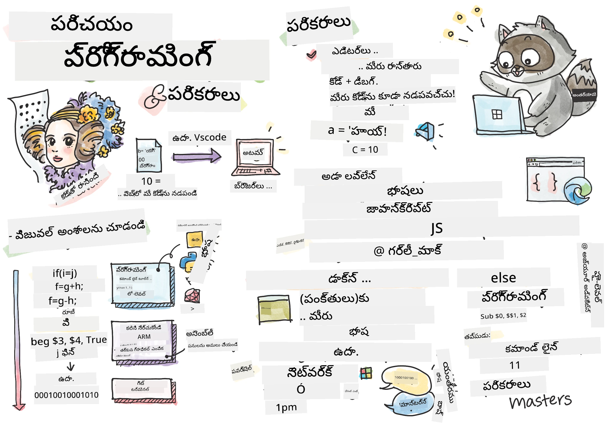
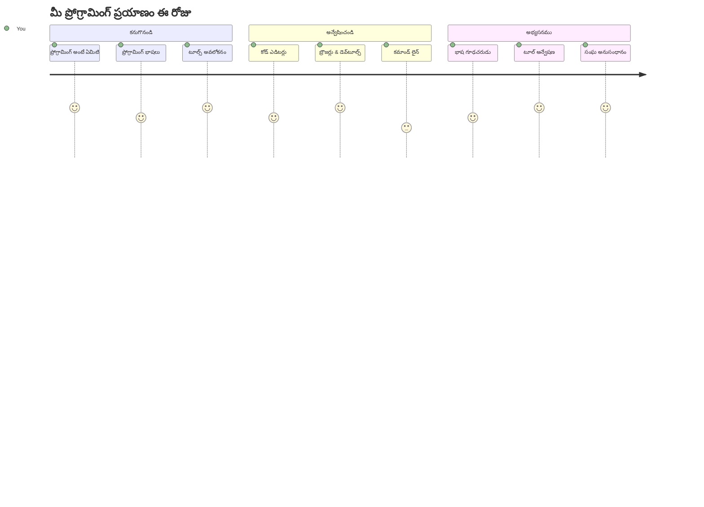
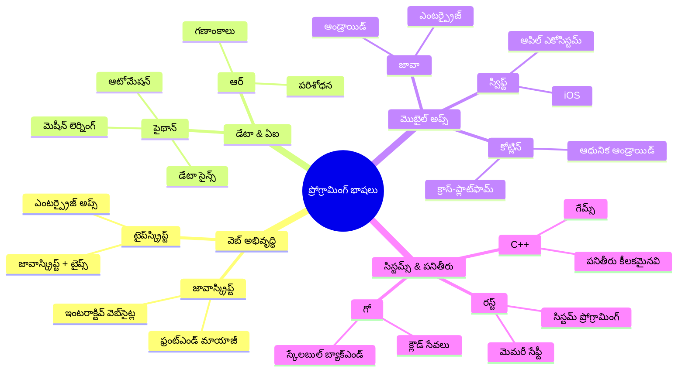
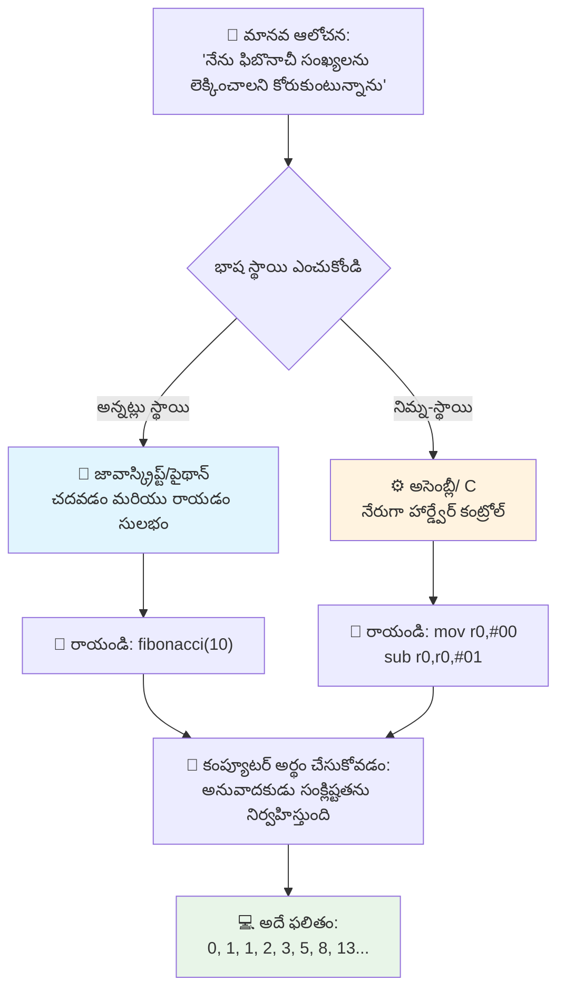
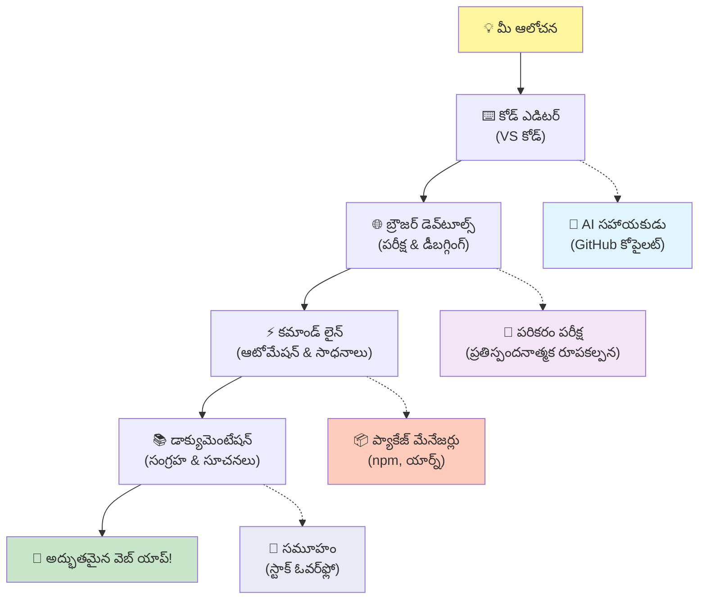
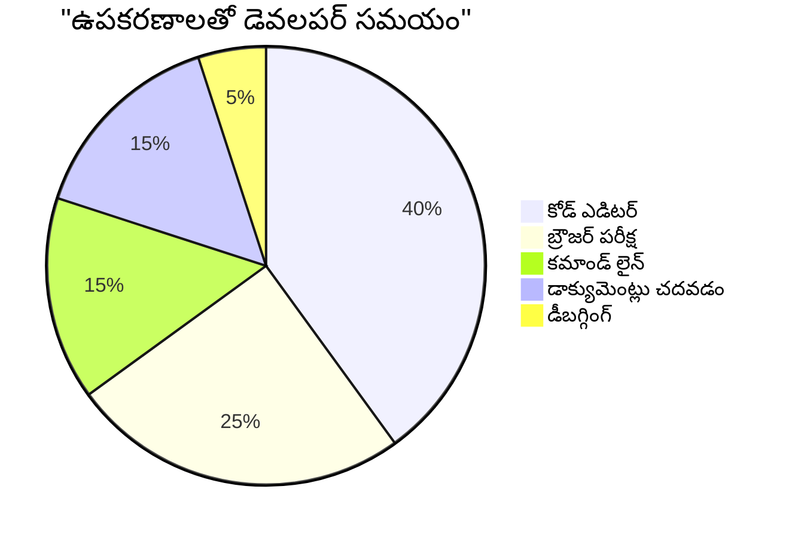
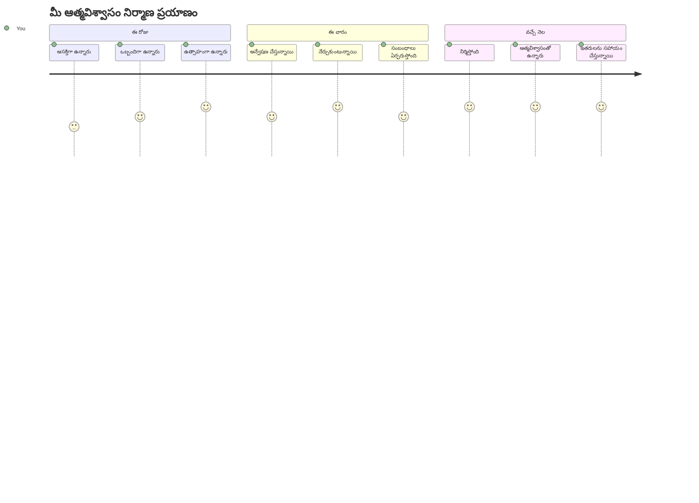

# ప్రోగ్రామింగ్ భాషల పరిచయం మరియు ఆధునిక డెవలపర్ టూల్స్

హాయ్, భవిష్యత్తులో డెవలపర్! 👋 నేను ప్రతిరోజూ నాకు చిందుతున్న ఒక విషయం చెప్పనా? మీరు ప్రోగ్రామింగ్ అనేది కంప్యూటర్ల గురించి మాత్రమే కాదు – మీ అద్భుతమైన ఆలోచనలను నిజం చేయడానికి అందమైన సూపర్‌పవర్స్ కలిగి ఉండటం అన్న విషయాన్ని ఇప్పుడే కనుగొంటున్నారు!

మీకు ఇష్టమైన యాప్ ఉపయోగిస్తున్నప్పుడు ఆ మధుర క్షణం గుర్తుందా? మీరు ఒక బటన్ ట్యాప్ చేసినప్పుడు ఏదో అద్భుతమైనది జరుగుతుంది మరియు మీరు "వావ్, ఇది ఎలా చేశారు?" అని ఆశ్చర్యపోతారు? సరే, మీరు లాగా ఒకరు – ఎగువగానే తృतीय ఎస్ప్రెస్సోతో 2 AM గడిపి ఉన్నారు – ఆ మాంత్రిక code ను రాశారు. ఈ పాఠం ముగిసే సమయానికి మీరు కేవలం వారు ఎలా చేసారో అర్థం చేసుకోకుండా కాకుండా, మీరు కూడా ప్రయత్నించాలనే ఆసక్తి కలుగుతుంది!

ప్రోగ్రామింగ్ ప్రారంభంలో భయంకरంగా అనిపిస్తే నేను పూర్తిగా అర్థం చేసుకుంటాను. నేను మొదట ప్రారంభించినప్పుడు, మీరు గణితం లో అద్భుత దిగ్గజంగా ఉండాలి లేదా ఐదేళ్ల వయసులోనే కోడింగ్ చేస్తున్నట్టు అనుకున్నాను. కాని ఈది నా దృష్టిని పూర్తిగా మార్చింది: ప్రోగ్రామింగ్ అంటే కొత్త భాషలో సంభాషణలు నేర్చుకోవడం లాగే. మీరు "హలో" మరియు "థాంక్ యు" తో మొదలుపెడతారు, తరువాత కాఫీ ఆర్డర్ చేయడం నేర్చుకుంటారు, మరియు తర్వత మీరు లోతైన తత్వ చర్చలు చేస్తున్నారు! అయితే ఈ సారి మీరు కంప్యూటర్లతో మాట్లాడుతున్నారు, అవి అత్యంత సహనశీల సంభాషణ భాగస్వాములు – మీ తప్పులను ఎప్పుడూ తీర్చిదిద్దవు మరియు ప్రతి సారి ప్రయత్నించడానికి ఉత్సాహంగా ఉంటాయి!

ఈరోజు, ఆధునిక వెబ్ డెవలప్‌మెంట్‌ను మాత్రమే సాధ్యముగా కాకుండా చాలా మనోహరంగా చేసే అద్భుతమైన టూల్స్ చూడబోతున్నాం. నేను మాట్లాడుతున్నది Netflix, Spotify, మరియు మీ ఇష్టమైన ఇండీ యాప్ స్టూడియో డెవలపర్లు ప్రతి రోజూ ఉపయోగించే సరిగ్గా అదే ఎడిటర్ల, బ్రౌజర్ల, మరియు వర్క్‌ఫ్లోలను గురించి. ఈ న్యూస్ మీరు సంతోషంగా డాన్స్ పెట్టించేదిగా ఉంటుంది: ఈ ప్రొఫెషనల్-గ్రేడ్, ఇండస్ట్రీ-స్టాండర్డ్ టూల్స్ ఎక్కువ భాగం పూర్తిగా ఉచితం!


> స్కెచ్‌నోట్ [Tomomi Imura](https://twitter.com/girlie_mac) చేత


```mermaid
journey
    title మీ ప్రోగ్రామింగ్ ప్రయాణం ఈ రోజు
    section కనుగొనండి
      ప్రోగ్రామింగ్ అంటే ఏమిటి: 5: You
      ప్రోగ్రామింగ్ భాషలు: 4: You
      టూల్స్ అవలోకనం: 5: You
    section అన్వేషించండి
      కోడ్ ఎడిటర్లు: 4: You
      బ్రౌజర్లు & డెవ్‌టూల్స్: 5: You
      కమాండ్ లైన్: 3: You
    section అభ్యసనము
      భాష గూఢచరుడు: 4: You
      టూల్ అన్వేషణ: 5: You
      సంఘ అనుసంధానం: 5: You
```
## మీరు ఇప్పటివరకు ఏమి తెలుసుకున్నారో చూద్దాం!

ఆనందమైన విషయానికి ముందు పడకానికి ముందే, మీరు ప్రోగ్రామింగ్ ప్రపంచం గురించి ఇప్పటివరకు ఏమి తెలుసుకున్నారు అంటే ఆ విషయం నాకు ఆరాటంగా ఉంది! ఈ ప్రశ్నలను చూస్తూ "నాకు వీటిపై ఒకటే తెలియదు" అనని అనుకుంటున్నట్లయితే అది క్షమించదగ్గ విషయం కాదు, అది అసలు సరైన స్థలంలో ఉన్నారు అన్నది! ఈ క్విజ్‌ని వ్యాయామానికి ముందు స్ట్రెచింగ్ లాగా భావించండి – మనం మన మెదడు కండరాలను వెచ్చబెడుతున్నారు!

[ప్రీ-లెసన్ క్విజ్ తీసుకోండి](https://ff-quizzes.netlify.app/web/)

## మనం కలిసి చేయబోయే సాహసం

సరే, ఈ రోజు మనం యేమి తెలుసుకోబోతున్నామో నేను నిజంగా ఉత్సాహంగా ఉన్నాను! నిజంగా, కొన్ని కాన్సెప్ట్‌లు క్లిక్ అయినప్పుడు మీ ముఖాన్ని చూడగలిగితే ఎంత సంతోషంగా ఉండేది! మనం చేయబోయే అద్భుత ప్రయాణం ఈ క్రింద ఉంది:

- **ప్రోగ్రామింగ్ అంటే ఏమిటి (మరి అది ఎందుకు అద్భుతమైనది!)** – కోడ్ అనేది అందులో ఉన్న అజ్ఞాత మాయాజాలం, అది మీరు చుట్టూ ఉన్న ప్రతిదాన్ని, సోమవారం ఉదయం తెలుసుకునే అలారమ్ నుండి మీ Netflix సిఫార్సులను పరిపూర్ణంగా చేర్చుకునే ఆల్గారిథం వరకు శక్తివంతంగా నడిపిస్తుంది
- **ప్రోగ్రామింగ్ భాషలు మరియు అవి కలిగిన ఆశ్చర్యకరమైన వ్యక్తిత్వాలు** – ప్రతి వ్యక్తి వేరే సూపర్‌పవర్స్ మరియు సమస్యలు పరిష్కరించే నైపుణ్యాలు కలిగి ఉన్న పార్టీకి మీరు వెళ్ళిపోయినట్టు ఊహించండి. ప్రోగ్రామింగ్ భాషల ప్రపంచం కూడా అదే విధంగా ఉంటుంది, వాటిని కలవడం మీరు ఇష్టపడతారు!
- **డిజిటల్ మాంత్రికతను సాధించే ప్రాథమిక నిర్మాణాలు** – వీటిని అతి సృజనాత్మక LEGO సెట్ లాగా భావించండి. ఈ పీసులు ఎలా ఒకటొకటిగా చేరాలని అర్థం చేసుకున్నప్పుడు, మీరు మీ కలల రూపంలో ఏదైనా నిర్మించవచ్చు
- **పరిచయ వంతమైన వనరులు, వార్డాని మీరు కప్పుకుని ఉన్నట్లుగా అనిపిస్తుంటాయి** – నేను డ్రామాటిక్ కాదు – ఈ టూల్స్ నిజంగా మీరు సూపర్పవర్స్ కలిగి ఉన్నట్టు అనిపిస్తాయి, ఇంకా మంచి విషయం ఏంటంటే? ఇవి ప్రొఫెషనల్స్ ఉపయోగించే టూల్స్!

> 💡 **ఇది తెలుసుకోండి**: ఈరోజు ప్రతిదీ జ్ఞాపకంలో ఉంచుకోవడానికి వెసులుబాటు చేయరు అవుతుందని అనుకోవద్దు! ఇప్పుడిప్పుడు, మీరు వీటి గురించి ఆసక్తితో ఉండడమే కావాలి. వివరాలు సహజంగానే మనం కలిసి ప్రాక్టీస్ చేసినప్పుడు చురుకుగా గుర్తుండిపోగా ఉంటాయి – అటువంటి రియల్ లెర్నింగ్ అవుతుంది!

> మీరు ఈ పాఠాన్ని [Microsoft Learn](https://learn.microsoft.com/en-us/learn/modules/web-development-101/introduction-programming/?WT.mc_id=academic-77807-sagibbon) లో కూడా తీసుకోవచ్చు!

## ప్రోగ్రామింగ్ అంటే ఏమిటి?

సరే, ఈ మిలియన్ డాలర్ ప్రశ్నను పరిష్కరిద్దాం: ప్రోగ్రామింగ్ అంటే ఏమిటి?

ఈ అంశాన్ని అర్థం చేసుకోవడానికి నాకు జీవితాన్ని మార్చిన ఒక కథ చెప్పేస్తాను. గత వారం నేను మా అమ్మకి కొత్త స్మార్ట్ TV రిమోట్‌ను ఎలా ఉపయోగించాలో వివరిస్తుంటే అని ఊహించండి. నేను చెప్పింది "ఎరుపు బటన్ నొక్కుకో, కానీ పెద్ద ఎరుపు బటన్ కాదు, ఎడమవైపు చిన్న ఎరుపు బటన్... కాదు, మీ మరో ఎడమవైపు... ఓ హే, ఇప్పుడు ఆ బటన్‌ని రెండుసెకన్లు పట్టుకో, ఒకటి కాదు, మూడు కాదు..." చెప్పటం మొదలైంది. అదేమీ మీకు తెలిసిపోతుందా? 😅

దేన్నంటే అదే ప్రోగ్రామింగ్! ఇది చాలా శక్తివంతమైన వస్తువుకు సవివరమైన దశల వారీగా ఆదేశాలను ఇచ్చే కళ. మీరు మీ అమ్మకి వివరిస్తున్నట్టు కాదు ("ఏ ఎరుపు బటన్?!" అని అడగగలదు), మీరు కంప్యూటర్‌ని అలాగే వివరిస్తున్నారు (కంప్యూటర్ మీరు చెప్పినట్లు సరిగ్గా చేస్తుంది, మీరు చెప్పినది మీరు ఉద్దేశించినదాని కంటే వేరే అయినా).

నేను మొదట ఇది నేర్చుకున్నపుడు నా మనసును ఆశ్చర్యంతో నింపిన విషయం: కంప్యూటర్లు వాస్తవానికి బేసిక్ స్టేజ్ లో చాలా సరళమైనవి. అవి కేవలం రెండు విషయాలను మాత్రమే అర్థం చేసుకుంటాయి – 1 మరియు 0, అంటే "అవును" మరియు "కాదు" లేదా "ఆన్" మరియు "ఆఫ్." అంతే! కానీ మాయాజాలం వస్తుంది – మనం 1లు మరియు 0లు మాట్లాడాల్సిన అవసరం లేదు, మేమ్మాట్లాడటానికి ప్రోగ్రామింగ్ భాషలు ఉన్నాయి. అవి మీ సంపూర్ణ మానవ ఆలోచనలను కంప్యూటర్ భాషలోకి మారుస్తారనేది ప్రపంచంలోని అత్యుత్తమ అనువాదకుడిలా ఉంటాయి.

ఇంకా నేను ప్రతిరోజు ఉదయం నిద్రాలాలేముందు గందరగోళంలో పడిపోతున్నది: మీ జీవితం లో డిజిటల్ గా *ప్రతి* దాని ప్రారంభం ఎవరో మీలాంటి ఒకరితోనే మొదలైంది, కావున గాబ్రీన్ బట్టలు ధరించి కాఫీతో కోడ్ రాసేవారు. మీరు లేదా స్నేహితులతో బిల్లులు పంచుకోవడంలో సహాయం చేసే యాప్? ఆ అల్గోరిథం తయారు చేసిన డెవలపర్. నూతనమైన మీ ఇష్టమైన పాటకు మార్గం చూపిన సిఫార్సు? ఒక డెవలపర్ రూపొందించినది. "ఇది ఇబ్బంది" అని భావించి "దీనిని సరి చేసుకోవచ్చు" అనుకున్న ఒకరు ఆ పని చేశారు.

మీరు ప్రోగ్రామ్ నేర్చుకుంటే, మీరు కేవలం కొత్త నైపుణ్యం నేర్చుకోవడం కాదు – మీరు సమస్యలను పరిష్కరించే అద్భుతమైన సమాజంలో భాగమయ్యారు, వారు ప్రతిరోజూ ఆలోచిస్తుంటారు, "ఏమైనా ఒకటి తయారుచేస్తే ఎవరైనా కొంత సంతోషపడతారు" అని. నిజంగా, అంతే చల్లగా ఏదైనా ఉందా?

✅ **వినోద సమాచారాన్ని వెతకండి**: మీకు ఒక సన్నివేశంలో చూసేది ఈ అంశం – ప్రపంచంలో మొదటి కంప్యూటర్ ప్రోగ్రామర్ ఎవరు? నేను ఒక సూచన ఇస్తాను: మీరు ఊహించే వ్యక్తి కాకపోవచ్చు! ఆతన(ఆమె) వెనుక ఉన్న కథ చెలామణి సమస్యలను సృజనాత్మకంగా పరిష్కరించడం మరియు బయటి ఆలోచనలు చేసేవారిగా ప్రోగ్రామింగ్ ఎప్పుడూ ఉండిందని చూపుతుంది.

### 🧠 **మరలోత్సాహం సమయం: మీరు ఎలా అనుభూతి చెందుతున్నారు?**

**ఒక క్షణం ఆలోచించండి:**
- "కంప్యూటర్లకు సూచనలు ఇవ్వడం" అర్థమవుతుందా?
- మీరు రోజువారీ పనిని ప్రోగ్రామింగ్ తో ఆటోమేట్ చేయాలనుకునే ఏదైనా ఉందా?
- ఈ ప్రోగ్రామింగ్ విషయం గురించి మీ మనసులో ఏ ప్రశ్నలు ఉన్నాయి?

> **గురువుగా ఉండండి**: కొన్ని కాన్సెప్ట్‌లు ఇప్పుడు కొంత గందరగోళంగా అనిపించవచ్చు. ప్రోగ్రామింగ్ నేర్చుకోవడం కొత్త భాష నేర్చుకోవడం లాంటిదే – మన మెదడు ఆ న్యూరల్ మార్గాలను నిర్మించుకోవడానికి సమయం పడుతుంది. మీరు చాలా బాగున్నారు!

## ప్రోగ్రామింగ్ భాషలు విభిన్న మాంత్రిక రుచుల్లా ఉంటాయి

సరే, ఇది వింతగా వినబడవచ్చు, కానీ నా మాటకు యథార్థంగా ఉండండి – ప్రోగ్రామింగ్ భాషలు భిన్న సంగీత ప్రకారాల్లా ఉంటాయి. మీరు జాజ్ గురించి ఆలోచించండి, అది మృదువైన మరియు సాధారణమైనది, రాక్ శక్తివంతమైనది మరియు నేరుగా, క్లాసికల్ అందమైన మరియు నిర్మితమైనది, హిప్ హాప్ సృజనాత్మక మరియు వ్యక్తీకరణతో కూడుకున్నది. ప్రతి శైలి తన సొంత వాతావరణం, తన అభిమానుల సంఘం కలిగి ఉంటుంది, మరియు ప్రతి ఒక్కటి విభిన్న మూడ్స్ మరియు సందర్భాల కోసం సరిపోతుంది.

ప్రోగ్రామింగ్ భాషలు పూర్తిగా ఇదే విధంగా పనిచేస్తాయి! మీరు మంచి మొబైల్ గేమ్ ను నిర్మించడానికి ఒకే భాష ఉపయోగించరాదు, మీరు వాతావరణ డేటాను ప్రాసెస్ చేసే కోసం వేరే భాష ఉపయోగిస్తారు, అటువంటి మాదిరిగా మీరు యోగా తరగతిలో డెత్ మెటల్ వినరు (చాలా యోగా తరగతుల్లో తప్ప 😄).

కానీ నాకు ప్రతిసారీ ఆశ్చర్యమైనది ఏమిటంటే: ఈ భాషలు ప్రపంచంలో అత్యంత సహనశీల, ప్రతిభావంతులైన అనువాదకులు మీ పక్కన ఉండు లాగే ఉంటాయి. మీరు మీ ఆలోచనలను సహజమైన మానవ మెదడుతో వ్యక్తపరచవచ్చు, మరియు అవి అంతటా క్లిష్టమైన పనిని 1లు మరియు 0ల చుట్టూ అర్థం చేసుకునేలా చేస్తాయి. ఇది మానవ సృజనాత్మకత మరియు కంప్యూటర్ లాజిక్ రెండింటిలో పరిపూర్ణంగా నైపుణ్యం కలిగిన స్నేహితుడి లా ఉంటుంది – వారు కుదిరేడది లేరు, కాఫీ బ్రేక్లు అవసరం లేదు, మరియు మీరు ఒకే ప్రశ్నను రెండుసార్లు అడిగినా ఎప్పుడూ కోపపడరు!

### ప్రముఖ ప్రోగ్రామింగ్ భాషలు మరియు వారి ఉపయోగాలు


```mermaid
mindmap
  root((ప్రోగ్రామింగ్ భాషలు))
    వెబ్ అభివృద్ధి
      జావాస్క్రిప్ట్
        ఫ్రంట్‌ఎండ్ మాయాజీ
        ఇంటరాక్టివ్ వెబ్‌సైట్ల
      టైప్‌స్క్రిప్ట్
        జావాస్క్రిప్ట్ + టైప్స్
        ఎంటర్ప్రైజ్ అప్స్
    డేటా & ఏఐ
      పైథాన్
        డేటా సైన్స్
        మెషీన్ లెర్నింగ్
        ఆటోమేషన్
      ఆర్
        గణాంకాలు
        పరిశోధన
    మొబైల్ అప్స్
      జావా
        ఆండ్రాయిడ్
        ఎంటర్ప్రైజ్
      స్విఫ్ట్
        iOS
        ఆపిల్ ఎకోసిస్టమ్
      కోట్లిన్
        ఆధునిక ఆండ్రాయిడ్
        క్రాస్-ప్లాట్‌ఫామ్
    సిస్టమ్స్ & పనితీరు
      C++
        గేమ్స్
        పనితీరు కీలకమైనవి
      రస్ట్
        మెమరీ సేఫ్టీ
        సిస్టమ్ ప్రోగ్రామింగ్
      గో
        క్లౌడ్ సేవలు
        స్కేలబుల్ బ్యాక్‌ఎండ్
```
| భాష | ఉత్తమ ఉపయోగాలు | ఎందుకంటే ఇది ప్రాచుర్యం పొందింది |
|----------|----------|------------------|
| **JavaScript** | వెబ్ అభివృద్ధి, యూజర్ ఇంటర్‌ఫేస్‌లు | బ్రౌజర్లలో నడుస్తుంది మరియు ఇంటరాక్టివ్ వెబ్‌సైట్లను శక్తివంతం చేస్తుంది |
| **Python** | డేటా సైన్స్, ఆటోమేషన్, AI | చదవడం మరియు నేర్చుకోవడం సులభం, శక్తివంతమైన లైబ్రరీలు |
| **Java** | ఎంటర్ప్రైజ్ అప్లికేషన్లు, ఆండ్రాయం యాప్‌లు | ప్లాట్‌ఫాం స్వతంత్రం, పెద్ద సిస్టమ్స్‌కి బలమైనవి |
| **C#** | విండోస్ అప్లికేషన్లు, గేమ్ అభివృద్ధి | బలమైన మైక్రోసాఫ్ట్ ఈకోసిస్టం మద్దతు |
| **Go** | క్లౌడ్ సర్వీసులు, బ్యాక్‌ఎండ్ సిస్టమ్స్ | వేగవంతమైనది, సులభమైనది, ఆధునిక కంప్యూటింగ్ కోసం రూపొందించబడింది |

### హై-లెవెల్ మరియు లో-లెవెల్ భాషలు

సరే, ఇది నిజంగా నాకు మొదటిసారి నేర్చుకునేటప్పుడు నా తల నొప్పి చేస్తున్న కాన్సెప్ట్, కాబట్టి నా కోసం చివరకు అర్థమయ్యే ఉపమానం మీతో పంచుకోబోతున్నాను – మీకూ ఇది సహాయం చేస్తుందని ఆశిస్తున్నాను!

మీరు ఒక విదేశి దేశం లో ఉన్నారు, అక్కడ మీరు భాష మాట్లాడలేరు, మరియు అత్యవసర పరిస్థితిలో బాత్‌రూమ్ ను కనుగొనాలి అని ఊహించండి (మనం అందరం ఈ పరిస్థితిలో ఉన్నాం కదా? 😅):

- **లో-లెవెల్ ప్రోగ్రామింగ్** స్థానీయ భాషని ఇంగ్లీష్ లో సమాచారం ఇవ్వడం కన్నా చిట్కాలు, ప్రదేశీయ జోక్ లను ఉపయోగించి భాషా నైపుణ్యం కలిగి ఉండటం లాంటిది. చాలా ప్రభావవంతమైనది మరియు సమర్థవంతమైనది... మీరు ఆ భాషలో పలుకుబడి కలిగి ఉంటే! కానీ మీరు కేవలం బాత్‌రూమ్ కనుగొనాలనుకొంటే చాలా కష్టం.

- **హై-లెవెల్ ప్రోగ్రామింగ్** అంటే మీకు అర్థమయ్యే విధంగా "నేను టాయిలెట్ వెళ్ళాలి" అని చెప్పగలిగే అద్భుతమైన స్థానిక మిత్రుడు ఉండటం లాంటిది, అతను అన్ని సాంస్కృతిక అనువాదాలు చేసుకుని మీకు సరైన దిశ చూపిస్తాడు.

ప్రోగ్రామింగ్ భాషలలో:
- **లో-లెవెల్ భాషలు** (Assembly లేదా C వంటి) కంప్యూటర్ హార్డ్‌వేర్‌తో చాలా విస్తృతంగా సంభాషించడానికి అనుమతిస్తాయి, కానీ మీరు యంత్రంలా ఆలోచించాల్సి ఉంటుంది, అది... చాలా పెద్ద మానసిక మార్పు!
- **హై-లెవెల్ భాషలు** (JavaScript, Python లేదా C# వంటి) మీరు మానవుల్లా ఆలోచించేలా అనుమతిస్తాయి, వారు యంత్రం-స్పీక్ అన్ని సారూప్యాలను నడిపిస్తారు. ఇంకా, వీటికి అద్భుతమైన కమ్యూనిటీలున్నాయి, వారు కొత్తవారిని గుర్తుంచుకుని సాయం చేయడానికి సిద్ధంగా ఉంటారు!

నాకు మీరు ఏ భాషలు మొదలు పెడతారు చెప్పమంటున్నారు కదా? 😉 హై-లెవెల్ భాషలు శిక్షణ బైకులను కలిగి ఉంటాయి, మీరు వాటిని ఎప్పుడూ తీసివేయాలని అనుకోరు ఎందుకంటే అవి మొత్తం అనుభవాన్ని మరింత అందంగా చేస్తాయి!


```mermaid
flowchart TB
    A["👤 మానవ ఆలోచన:<br/>'నేను ఫిబొనాచీ సంఖ్యలను లెక్కించాలని కోరుకుంటున్నాను'"] --> B{భాష స్థాయి ఎంచుకోండి}
    
    B -->|అన్నట్లు స్థాయి| C["🌟 జావాస్క్రిప్ట్/పైథాన్<br/>చదవడం మరియు రాయడం సులభం"]
    B -->|నిమ్న-స్థాయి| D["⚙️ అసెంబ్లీ/ C<br/>నేరుగా హార్డ్వేర్ కంట్రోల్"]
    
    C --> E["📝 రాయండి: fibonacci(10)"]
    D --> F["📝 రాయండి: mov r0,#00<br/>sub r0,r0,#01"]
    
    E --> G["🤖 కంప్యూటర్ అర్థం చేసుకోవడం:<br/>అనువాదకుడు సంక్లిష్టతను నిర్వహిస్తుంది"]
    F --> G
    
    G --> H["💻 అదే ఫలితం:<br/>0, 1, 1, 2, 3, 5, 8, 13..."]
    
    style C fill:#e1f5fe
    style D fill:#fff3e0
    style H fill:#e8f5e8
```
### నేను మీరు ఎందుకు హై-లెవెల్ భాషలను ఇష్టం పెట్టుకున్నానో చూపిస్తాను

సరే, నేను మీకు చూపబోయే కోడ్ ఉదాహరణ హై-లెవెల్ భాషలు ఎంత మానవ నాయకత్వమైనాయో చూపిస్తుంది, కానీ ముందుగా మీరు నా మించి ఏదైనా వాగ్దానం చేయాలి. మీరు ఆ మొదటి కోడ్ ఉదాహరణ చూస్తే భయపడవద్దు! అది భయానకంగా కనిపించడం సరిగ్గా నేను చెప్పాలనుకున్న విషయం!

మనం రెండు పూర్తి వేరే శైలుల్లో రాస్తారు అయిన ఒకే పని చేసిన పనిని చూస్తాం. ఫిబోనాచ్చి సీక్వెన్స్ సృష్టించే కోడ్ ఇది – ఒక అందమైన గణిత నమూనా, ఇందులో ప్రతి సంఖ్య దానికంటే రెండు ముందు ఉన్న సంఖ్యల సమం: 0, 1, 1, 2, 3, 5, 8, 13... (వినోదమైన విషయం: మీరు ఈ నమూనాను ప్రకృతిలో ఎక్కడనా ఎక్కడో చూడవచ్చు – సూర్యఫూల్ గింజల స్పైరల్స్, పైన్కోన్ నమూనాలు, ఇంతకుముందు గెలాక్సీల నిర్మాణం!)

తేడాను చూడడానికి సిద్ధంగా ఉన్నారా? మొదలు పెడదాం!

**హై-లెవెల్ భాష (JavaScript) – మానవ స్నేహపూర్వక:**

```javascript
// దశ 1: ప్రాథమిక ఫిబొనాచీ సెటప్
const fibonacciCount = 10;
let current = 0;
let next = 1;

console.log('Fibonacci sequence:');
```

**ఈ కోడ్ ఏమి చేస్తుంది:**
- **ఘోషించు** ఈన్ని Fibonacci సంఖ్యలు సృష్టించాలన్నదాన్ని స్థిరంగా పేర్కొన్నది
- **ప్రారంభించు** ప్రస్తుతం మరియు తదుపరి సంఖ్యలను ట్రాక్ చేసే రెండు వేరియబుల్ లను
- **సెట్ చేయు** ఫిబోనాచ్చి నమూనా నిర్వచించే ప్రారంభ విలువలు (0 మరియు 1)
- **ప్రదర్శన** మన అవుట్పుట్ గుర్తించడం కోసం హెడర్ మెసేజ్

```javascript
// దశ 2: లూప్‌తో క్రమాన్ని తయారు చేయండి
for (let i = 0; i < fibonacciCount; i++) {
  console.log(`Position ${i + 1}: ${current}`);
  
  // క్రమంలో తదుపరి సంఖ్యను లెక్కించండి
  const sum = current + next;
  current = next;
  next = sum;
}
```

**ఇక్కడ ఏమి జరుగుతుందో విపిపించటం:**
- **లూప్** ప్రతి స్థానంలో మేము `for` లూప్ ఉపయోగించి ప్రయాణిస్తాము
- **ప్రదర్శన** ప్రతి సంఖ్య స్థానంతో పాటు టెంప్లేట్ లిటరల్ రూపంలో చూపించు
- **లెక్కించు** ప్రస్తుతం మరియు తదుపరి విలువలను కలిపి తదుపరి ఫిబోనాచ్చి సంఖ్యను
- **అప్డేట్** మా ట్రాకింగ్ వేరియబుల్స్ తదుపరి పునరావృతానికి మళ్ళించు

```javascript
// దశ 3: ఆధునిక ఫంక్షనల్ దృష్టికోణం
const generateFibonacci = (count) => {
  const sequence = [0, 1];
  
  for (let i = 2; i < count; i++) {
    sequence[i] = sequence[i - 1] + sequence[i - 2];
  }
  
  return sequence;
};

// ఉపయోగం ఉదాహరణ
const fibSequence = generateFibonacci(10);
console.log(fibSequence);
```

**పైన మనం:**
- **రచించి** మోడరన్ యారో ఫంక్షన్ సింటాక్స్ ఉపయోగించి పునర్వినియోగ ఫంక్షన్
- **కలిపి** ఒక ఆర్రే పూర్తి సీక్వెన్స్ నిల్వ చేయడానికి, ఒక్కొక్కటి చూపించకుండా
- **ఉపయోగించి** ఆర్రే ఇండెక్సింగ్ ప్రతి కొత్త సంఖ్యను గత విలువల నుండి లెక్కించేందుకు
- **తిరిగి ఇచ్చాం** పూర్తి సీక్వెన్స్ ప్రోగ్రామ్ ఇతర భాగాలకు సులభంగా ఉపయోగించేందుకు

**లో-లెవెల్ భాష (ARM Assembly) – కంప్యూటర్-స్నేహపూర్వక:**

```assembly
 area ascen,code,readonly
 entry
 code32
 adr r0,thumb+1
 bx r0
 code16
thumb
 mov r0,#00
 sub r0,r0,#01
 mov r1,#01
 mov r4,#10
 ldr r2,=0x40000000
back add r0,r1
 str r0,[r2]
 add r2,#04
 mov r3,r0
 mov r0,r1
 mov r1,r3
 sub r4,#01
 cmp r4,#00
 bne back
 end
```

JavaScript వెర్షన్ ఆంగ్ల నిర్దేశాల్లా చదవబడుతుంది, అయితే Assembly వెర్షన్ కంప్యూటర్ ప్రొసెసర్‌ని నేరుగా నియంత్రించే గోప్యమైన ఆజ్ఞలను ఉపయోగిస్తుంది. రెండు విధానాలు ఒకే పనిని చేస్తాయి, కానీ హై-లెవెల్ భాష మానవులకు అర్థం చేసుకోవడానికి, వ్రాయడానికి మరియు నిర్వహించడానికి చాలా సులభంగా ఉంటాయి.

**మీరు గమనించే ముఖ్య తేడాలు:**
- **పఠనసౌలభ్యం**: జావాస్క్రిప్ట్ `fibonacciCount` వంటి వివరణాత్మక పేర్లను ఉపయోగిస్తుంది, ఆ సమయాలలో అసెంబ్లీ `r0`, `r1` వంటి రహస్య లేబుల్స్ ఉపయోగిస్తుంది
- **వ్యాఖ్యలు**: హై-లెవల్ భాషలు ఎక్స్‌ప్లానేటరీ వ్యాఖ్యలను ప్రోత్సహిస్తాయి, ఇవి కో드를 స్వయంగా డాక్యుమెంట్ చేసేలా చేస్తాయి
- **సంరచన**: జావాస్క్రిప్ట్ యొక్క లాజికల్ ఫ్లో మనుషులుగా సమస్యలను దశలవారీగా ఆలోచించే విధానాన్ని కలిసిరుతుంది
- **నిర్వాహణ**: వేరే అవసరాలకు జావాస్క్రిప్ట్ వెర్షన్‌ను నవీకరించటం సులభం మరియు స్పష్టంగా ఉంటుంది

✅ **ఫిబొనాచ్చి సీక్వెన్స్ గురించి**: ఈ అద్భుతమైన సంఖ్యా నమూనా (ప్రతి సంఖ్య దాని ముందు రెండు సంఖ్యల సమనుమానం: 0, 1, 1, 2, 3, 5, 8...) ప్రకృతిలో నిజంగా *ప్రతి చోటా* కనిపిస్తుంది! మీరు దీన్ని సూర్యపుష్పాలు గుండ్రటి ఆకారాలు, పైన్కోన్ నమూనాలు, నాటిలస్ షెల్ వలయాలు, ఇంకా చెట్టు கிளలు ఎలా పెరుగుతాయో అన్న దాని లో కూడా చూడగలరు. గణితం మరియు కోడ్ సహాయంగా ప్రకృతిలో అందం సృష్టించే నమూనాలను అర్థం చేసుకోవడం మరియు పునరుత్పత్తి చేయడం ఎంత ఆశ్చర్యకరమో నిజంగా మనసు తిప్పే విషయం!

## మాంత్రికత చేసేవి నిర్మించే మూలకాలు

సరే, ఇప్పుడు మీరు ప్రోగ్రామింగ్ భాషలు ఎలా కనిపిస్తాయో చూశాక, ప్రతీ ప్రోగ్రామ్ రాయబడే మౌలిక భాగాల్ని విరగడిద్దాం. వీటిని మీ ఇష్టమైన వంటకంలో ముఖ్యమైన పదార్ధాలుగా ఆలోచించండి – ప్రతి ఒక్కటి ఏది చేస్తుందో అర్థం చేసుకుంటే, మీరు ఏ భాషలో అయినా కోడ్ చదవగలరు మరియు రాసుకోగలరు!

ఇది ప్రోగ్రామింగ్ యొక్క వ్యాకరణం నేర్చుకోవటంలా ఉంటుంది. పాఠశాలలో మీరు నామవాచకాలు, క్రియలు, వాక్యాలు ఎలా కలిపి వ్రాయాలో నేర్చుకున్నారు కదా? ప్రోగ్రామింగ్ కి మరొక రకమైన వ్యాకరణ ఉంది, మరియు నిజంగా అది ఇంగ్లీష్ వ్యాకరణం కంటే చాలా తార్కికమైనది మరియు క్షమించగలిగేది! 😄

### స్టేట్మెంట్లు: దశలవారీ సూచనలు

మనం **స్టేట్మెంట్లు** తో మొదలెడదాం – ఇవి మీ కంప్యూటర్‌తో సంభాషణలో ఒక్కో వాక్యాలు వంటి ఉంటాయి. ప్రతి స్టేట్మెంట్ కంప్యూటర్ కు ఒక ప్రత్యేక పని చేయమని చెప్తుంది, ఒక విధంగా దారిచూపులా: "ఇక్కడ ఎడమకు మలిబు", "ఎరుపు బत्ती వద్ద ఆపు", "ఆ స్థలంలో పార్క్ చేయి."

స్టేట్మెంట్స్ నాకు ఇష్టంగా ఉండటానికి కారణం వాటి పఠనసౌలభ్యం. దీన్నే చూడండి:

```javascript
// ఒక్క చర్యలను పూర్తి చేసే ప్రాథమిక వాక్యాలు
const userName = "Alex";                    
console.log("Hello, world!");              
const sum = 5 + 3;                         
```
  
**ఈ కోడ్ ఏం చేస్తుంది:**  
- **ఒక కాస్టెంట్ వేరియబుల్** ప్రకటించి యూజర్ పేరు నిల్వచేయడం  
- **కన్సోల్ అవుట్‌పుట్‌కి** గ్రీటింగ్ సందేశం ప్రదర్శించడం  
- **గణిత ఆపరేషన్ ఫలితం** లెక్కించి నిల్వచేయడం  

```javascript
// వెబ్ పేజీలతో పరిచయం అయ్యే స్టేట్మెంట్లు
document.title = "My Awesome Website";      
document.body.style.backgroundColor = "lightblue";
```
  
**దశలవారీగా, ఇది జరుగుతోంది:**  
- **బ్రౌజర్ ట్యాబ్**లో కనిపించే వెబ్‌పేజీ శీర్షికను మార్చడం  
- **పేజీ యొక్క బ్యాక్‌గ్రౌండ్ రంగు** మార్చడం  

### వేరియబుల్స్: మీ ప్రోగ్రామ్ యొక్క మెమరీ సిస్టమ్

సరే, **వేరియబుల్స్** నేర్చుకోవడం నాకు చాలా ఇష్టమైన అంశం ఎందుకంటే ఇవి మీరు రోజూవారి ఉపయోగించే వస్తువుల్లా ఉంటాయి!

మీ ఫోన్ కాంటాక్ట్ జాబితా గురించి ఆలోచించండి. మీరు అందరి ఫోన్ నంబర్ లను మర్చిపోరు – బదులుగా "అమ్మ," "స్నേഹితుడు," లేదా "రాత్రి 2 గంటలకు పంపించే పిజ్జా షాప్" అని పేర్లను సేవ్ చేసి నిజమైన నంబర్లను ఫోన్ గుర్తుంచుకుంటుంది. వేరియబుల్స్ కూడా అలా పనిచేస్తాయి! ఇవి లేబుల్డ్ కంటైనర్లా ఉంటాయి, అందులో మీరు పలు సమాచారాలను నిల్వచేయవచ్చు, తర్వాత ఆ పేరును వాడి పొందవచ్చు.

ఇది నిజంగా అద్భుతం – వేరియబుల్స్ ప్రోగ్రామ్ నడుస్తున్నప్పుడు మారవచ్చు ( అందుకేనంటే వీటిని "వేరియబుల్" అని పిలుస్తారు – చూశారా వారు). మీరు కొత్త సమాచారాన్ని నేర్చుకుంటూనే లేదా పరిస్థితులు మారితే, వేరియబుల్స్ కూడా నవీకరించబడతాయి!

ఇది ఎంత సరళంగా ఉందో చూద్దాం:

```javascript
// దశ 1: ప్రాథమిక వేరియబుల్స్ సృష్టించడం
const siteName = "Weather Dashboard";        
let currentWeather = "sunny";               
let temperature = 75;                       
let isRaining = false;                      
```
  
**ఈ భావనలను అర్థం చేసుకోవడం:**  
- `const` వేరియబుల్స్‌లో మార్చలేని విలువలని నిల్వ చేయడం (దేవైస్ లేదా సైట్ పేరు లాంటివి)  
- `let` వేరియబుల్స్‌ను ప్రోగ్రామ్‌లో మార్చుకునే విలువలకు ఉపయోగించడం  
- స్ట్రింగ్స్ (పాఠ్యం), నంబర్లు, మరియు బూలియన్స్ (true/false) వలె ధరోలైన డేటా రకాల్ని కేటాయించడం  
- ప్రతీ వేరియబుల్ ఏది సూచిస్తుందో వివరిస్తూ సరైన పేర్లను ఎంచుకోవడం  

```javascript
// దశ 2: సంబంధిత డేటాను సమూహీకరించడానికి ఆబ్జెక్టులతో పని చేయడం
const weatherData = {                       
  location: "San Francisco",
  humidity: 65,
  windSpeed: 12
};
```
  
**పై ఉదాహరణలో:**
- సంబంధిత వాతావరణ సమాచారాన్ని ఒక ఆబ్జెక్టుగా గుంపు చేసి రూపొందించడం  
- పలు డేటా అంశాలను ఒక్క వేరియబుల్ పేరులో ఏర్పాటు చేయడం  
- కీ-విలువ జంటల ద్వారా ప్రతి ఒక్క సమాచారాన్ని స్పష్టంగా లేబుల్ చేయడం  

```javascript
// దశ 3: వేరియబులు ఉపయోగించడం మరియు నవీకరించడం
console.log(`${siteName}: Today is ${currentWeather} and ${temperature}°F`);
console.log(`Wind speed: ${weatherData.windSpeed} mph`);

// మార్పు చెందదగిన వేరియబులలను నవీకరించడం
currentWeather = "cloudy";                  
temperature = 68;                          
```
  
**ప్రతీ భాగాన్ని అర్థం చేసుకోవడం:**  
- టెంప్లేట్ లిటరల్స్ `${}` సింటాక్స్ ఉపయోగించి సమాచారం ప్రదర్శించడం  
- డాట్ నోటేషన్ (`weatherData.windSpeed`) ఉపయోగించి ఆబ్జెక్ట్ ప్రాపర్టీలను యాక్సెస్ చేయడం  
- `let` తో ప్రకటించిన వేరియబుల్స్‌ను వైవిధ్య పరిస్థితులకు అనుగుణంగా అప్డేట్ చేయడం  
- పలు వేరియబుల్స్ కలిపి అర్థవంతమైన సందేశాలు సృష్టించడం  

```javascript
// దశ 4: శుభ్రమైన కోడ్ కోసం ఆధునిక డీస్ట్రక్చరింగ్
const { location, humidity } = weatherData; 
console.log(`${location} humidity: ${humidity}%`);
```
  
**మీకు తెలిసి ఉండాల్సినవి:**  
- డిస్ట్రక్చరింగ్ అసైన్‌మెంట్‌తో ఆబ్జెక్ట్ నుండి ప్రత్యేకమైన ప్రాపర్టీలను తీసుకోవడం  
- ఆబ్జెక్ట్ కీలు పేర్లను వేరియబుల్స్‌గా ఆటోమేటిక్‌గా సృష్టించడం  
- పదేపదే డాట్ నోటేషన్ వాడకుండానే కోడ్ సింప్లిఫై చేయడం  

### కంట్రోల్ ఫ్లో: మీ ప్రోగ్రామ్‌ను ఆలోచించడం నేర్పించడం

సరే, ఇక్కడ ప్రోగ్రామింగ్ పట్టు ఎక్కువవుతుంది! **కంట్రోల్ ఫ్లో** అంటే మీ ప్రోగ్రామ్‌కు తెలివైన నిర్ణయాలు తీసుకోవడం నేర్పించడం, మీరు ప్రతిరోజూ ఆలోచించకుండా ఉంటే అలాగే.

ఉదాహరణకి: ఈ ఉదయం మీరు "వర్షం లేకపోతే, అంబ్రెల్లా తీయను. చలి అయితే జాకెట్ చప్పుకుంటాను. ఆలస్యంగా ఉంటే బ్రేక్‌ఫాస్ట్ మిస్ చేసి, రాస్తున్నప్పుడు కాఫీ తాగుతాను" అని నిర్ణయించుకున్నారు. మీ మెదడు ఈ 'if-then' లాజిక్‌ను ప్రతిరోజూ పలు సార్లు అనుసరిస్తుంది!

దీంతో ప్రోగ్రామ్స్ తెలివైనవిగా, జీవితం ఉన్నట్లుగాఉన పట్టు పడతాయి, ఇవి సాధారణ, బోరింగ్ స్క్రిప్ట్‌లుగా కాకుండా. అవి పరిస్థితిని విశ్లేషించి, తగిన విధంగా స్పందిస్తాయి. మీ ప్రోగ్రామ్‌కు వ్యాసంగం ఇచ్చినట్లే, అది అనుగుణంగా అర్ధం చేసుకొని నిర్ణయాలు తీసుకొంటుంది!

ఈ పనితీరు ఎంత అందంగా పని చేస్తుందో చూడాలా? 

```javascript
// దశ 1: ప్రాథమిక పరిస్థితి తర్కం
const userAge = 17;

if (userAge >= 18) {
  console.log("You can vote!");
} else {
  const yearsToWait = 18 - userAge;
  console.log(`You'll be able to vote in ${yearsToWait} year(s).`);
}
```
  
**ఇది ఏం చేస్తుందో చూస్తే:**  
- యూజర్ వయస్సు ఓటు హక్కు ఉండే వయస్సు అనుకూలమో చెక్ చేస్తుంది  
- షరతు ఫలితంపై ఆధారపడి వేరువేరు కోడ్ బ్లాక్స్ నడిపిస్తుంది  
- 18 కంటే తక్కువ వయస్సు అయితే ఓటు హక్కు ఈ ఎప్పుడైనట్లు లెక్కించి చూపిస్తుంది  
- ప్రతి పరిస్థితికి స్పష్టమైన, ఉపయోగకరమైన ఫీడ్‌బ్యాక్ ఇస్తుంది  

```javascript
// దశ 2: లోజికల్ ఆపరేటర్లతో బహుళ షరతులు
const userAge = 17;
const hasPermission = true;

if (userAge >= 18 && hasPermission) {
  console.log("Access granted: You can enter the venue.");
} else if (userAge >= 16) {
  console.log("You need parent permission to enter.");
} else {
  console.log("Sorry, you must be at least 16 years old.");
}
```
  
**ఇక్కడ ఏం జరుగుతుందో విభజన:**  
- `&&` (మరియు) ఆపరేటర్‌తో పలు షరతులను కలపడం  
- బహుళ పరిస్థితులు ఉన్నప్పుడు `else if` ఉపయోగించి హైయరార్కీ ఏర్పరచడం  
- అన్ని సంభవాలు చివరలో `else` స్టేట్మెంట్‌తో నిర్వహించడం  
- వేర్వేరు పరిస్థితులకు స్పష్టమైన ఫీడ్‌బ్యాక్ అందించడం  

```javascript
// దశ 3: టర్నరీ ఆపరేటర్‌తో సంక్షిప్త సshరనాత్మక పరిస్థితి
const votingStatus = userAge >= 18 ? "Can vote" : "Cannot vote yet";
console.log(`Status: ${votingStatus}`);
```
  
**మీకే గుర్తుంచుకోవాల్సింది:**  
- సరళమైన రెండు-ఐచ్ఛిక పరిస్థితులకు టెర్నరీ ఆపరేటర్ (`? :`) వాడడం  
- షరతు మొదటకి రాయడం, తర్వాత `?`, నిజమైన ఫలితాన్ని, `:`,తప్పుడు ఫలితాన్ని రాయడం  
- షరతుల ఆధారంగా విలువలు కేటాయించేటప్పుడు ఈ నమూనాను ఉపయోగించడం  

```javascript
// దశ 4: బహుళ ప్రత్యేక కేసులను నిర్వహించడం
const dayOfWeek = "Tuesday";

switch (dayOfWeek) {
  case "Monday":
  case "Tuesday":
  case "Wednesday":
  case "Thursday":
  case "Friday":
    console.log("It's a weekday - time to work!");
    break;
  case "Saturday":
  case "Sunday":
    console.log("It's the weekend - time to relax!");
    break;
  default:
    console.log("Invalid day of the week");
}
```
  
**ఈ కోడ్ సాధించే దాని ముఖ్యాంశాలు:**  
- వేరియబుల్ విలువను బహుళ నిర్దిష్ట కేసులతో సరిపోల్చడం  
- సమానమైన కేసులను భాగాలుగా (వారపు రోజులు vs వారం చివరి) గుంపుగా చేయడం  
- సరిపోగా ఉన్న కోడ్ బ్లాక్ నడపడం  
- అప్రతిష్టిత విలువలకు `default` కేసును చేర్చడం  
- తదుపరి కేసుకు వెళ్లకుండా `break` స్టేట్మెంట్స్ ఉపయోగించడం  

> 💡 **ప్రాసంగిక ఉదాహరణ**: కంట్రోల్ ఫ్లోని ప్రపంచంలోనే అధీక్షమ GPS తో మీకు దారిచూపడం లా ఆలోచించండి. "ముఖ్య సడెన్ వాహన రాకుండా ఉండి, మీరు హైవేకి వెళ్లండి. హైవే రోడ్డు పనులతో మూసివిడితే, స్కెనిక్ రూట్ ప్రయత్నించండి." ప్రోగ్రామ్స్ కూడా ఇదే రకమైన షరతు లాజిక్‌ని వాడి వివిధ పరిస్థితులకు తెలివిగా స్పందిస్తాయి మరియు యూజర్లకు ఉత్తమ అనుభవం అందిస్తాయి.

### 🎯 **ఆలోచన పరీక్ష: మౌలిక భాగాల పరిజ్ఞానం**

**మీరు మూలాలను ఎలా అర్థం చేసుకున్నారు చూద్దాం:**  
- వేరియబుల్ మరియు స్టేట్మెంట్ మధ్య తేడా ఏమిటి? మీ మాటల్లో చెప్పండి  
- ఒక నిజ జీవిత పరిస్థితిని ఆలోచించండి, మీరు if-then నిర్ణయం తీసుకునే (మా ఓటింగ్ ఉదాహరణ వంటిది)  
- ప్రోగ్రామింగ్ లో ఏదైనా విస్మయపరిచిన విషయం ఏమిటి?  

**త్వరిత విశ్వాసం పెంపకం:**  

```mermaid
flowchart LR
    A["📝 ప్రకటనలు<br/>(సూచనలు)"] --> B["📦 వేరియబులు<br/>(సంగ్రహణ)"] --> C["🔀 నియంత్రణ ప్రవాహం<br/>(నిర్ణయాలు)"] --> D["🎉 పనిచేస్తున్న ప్రోగ్రామ్!"]
    
    style A fill:#ffeb3b
    style B fill:#4caf50
    style C fill:#2196f3
    style D fill:#ff4081
```  
✅ **తరువాత ఏం వస్తోంది**: మా అద్భుతమైన ప్రయాణంలో ఈ భావనలు మరింత లోతుగా నేర్చుకోబోతున్నాం! ఇప్పటి కోసం, ఈ అద్భుతమైన అవకాశాల గురించి ఆ ఉత్సాహాన్ని పైలగొనండి. ప్రత్యేక నైపుణ్యాలు వ్యవహరించేటప్పుడు సహజంగానే నేర్చుకుంటారు – ఇది మీరు ఊహించినట్లు అదనంగా రసప్రదంగానే ఉంటుంది!

## వాడే సాధనాలు

సరే, నిజంగా ఇది నాకు చాలా ఉత్సాహాన్ని ఇస్తున్నది! 🚀 మేము ఇప్పుడు మాట్లాడబोతోన్న సాధనాలు వాస్తవానికి మీరు ఒక డిజిటల్ స్పేస్‌షిప్ కీలు అందుకున్నట్లుగా అనిపిస్తాయి.

మీరు చూస్తున్న క్యుయి పాకాల వంటవాడు ఒకసారి తన చేతులకు సరిపోయే సమతుల్యత గల కత్తులతో తయారవుతాడు కదా? లేదా సంగీతవిద్ధుడు ఒక గొప్ప గిటార్ ఉపయోగిస్తాడు, దానిని తుడిచిన వెంటనే పాడుతుంది? డెవలపర్లు కూడా అలాంటి మాంత్రిక సాధనాలు వాడతారు, మరియు ఇక్కడ మీ మనసును తిప్పే విషయం ఏంటంటే – వాటిలో ఎక్కువ సమస్యా ఉచితం!

నేను ఆ ఉత్సాహంతో కదులుతున్నాను లో, ఎందుకంటే ఈ సాధనాలు మా సాఫ్ట్‌వేర్ అభివృద్ధి పద్దతిలో పూర్తిగా విప్లవాత్మక మార్పులు తీసుకువచ్చాయి. మేము AI ఆధారిత కోడింగ్ అసిస్టెంట్ల గురించి మాట్లాడుతున్నాం, ఇవి మీ కోడ్ రాయడంలో సహాయపడతాయి (నేను సరదాగా కాదు!), క్లౌడ్ పరిసరాలు, ఏ దిక్కులోనైనా Wi-Fi తో మొత్తం అప్లికేషన్‌లు నిర్మించుకోవడానికి, X-రే దృష్టి లాగా పనిచేసే డీబగ్గింగ్ టూల్స్ ఉన్నాయి.

మరియు ఇక్కడ ఇంకా నాకు గట్టి ఇన్స్పిరేషన్ ఇస్తుంది: ఇవి "ప్రారంభ టూల్స్" కాదు, మీరు పెరుగుదలతో మోసుకురావు టూల్స్ కూడా కాదు. ఇవి Google, Netflix, మరియు మీరు ఇష్టపడే ఆ ఇండీ యాప్ స్టూడియో సహా ప్రొఫెషనల్ డెవలపర్స్ వాడుకునే వారు. మీరు వాటిని వాడటం ద్వారా ఒక ప్రొఫెషనల్ లాగా అనిపిస్తారు!


```mermaid
graph TD
    A["💡 మీ ఆలోచన"] --> B["⌨️ కోడ్ ఎడిటర్<br/>(VS కోడ్)"] 
    B --> C["🌐 బ్రౌజర్ డెవ్‌టూల్స్<br/>(పరీక్ష & డీబగ్గింగ్)"]
    C --> D["⚡ కమాండ్ లైన్<br/>(ఆటోమేషన్ & సాధనాలు)"]
    D --> E["📚 డాక్యుమెంటేషన్<br/>(సంగ్రహ & సూచనలు)"]
    E --> F["🚀 అద్భుతమైన వెబ్ యాప్!"]
    
    B -.-> G["🤖 AI సహాయకుడు<br/>(GitHub కోపైలట్)"]
    C -.-> H["📱 పరికరం పరీక్ష<br/>(ప్రతిస్పందనాత్మక రూపకల్పన)"]
    D -.-> I["📦 ప్యాకేజ్ మేనేజర్లు<br/>(npm, యార్న్)"]
    E -.-> J["👥 సమూహం<br/>(స్టాక్ ఓవర్‌ఫ్లో)"]
    
    style A fill:#fff59d
    style F fill:#c8e6c9
    style G fill:#e1f5fe
    style H fill:#f3e5f5
    style I fill:#ffccbc
    style J fill:#e8eaf6
```  
### కోడ్ ఎడిటర్లూ మరియు IDEs: మీ నూతన డిజిటల్ స్నేహితులు

కోడ్ ఎడిటర్ల గురించి చెప్పుకుందాము – ఇవి నిజంగా మీ ప్రతీ రోజు వాడే ప్రియమైన ప్రదేశాలు కావబోతున్నాయి! ఇది మీ వ్యక్తిగత కోడింగ్ ఆశ్రమం వంటి, అక్కడ మీరు ఎక్కువ సమయం గడపబోతారు మీ డిజిటల్ సృష్టుల తయారీ మరియు మెరుగు కొరకు.

ఒక అద్భుతమైన విషయం ఏమిటంటే: ఆధునిక ఎడిటర్లు కేవలం సుందరమైన టెక్స్ట్ ఎడిటర్లు కాదు. ఇవి 24/7 కాలంలో మీనక్కు కూర్చొని ఉండే అత్యంత తెలివైన, మద్దతైన కోడింగ్ గురువుల్లా ఉంటాయి. మీరు తప్పుపడినప్పుడే అది పట్టుకుంటుంది, మెరుగులు సూచిస్తుంది, ప్రతీ కోడ్ భాగం ఏలా పనిచేస్తుందో అర్థం చేసుకోవచ్చుగా సహాయపడుతుంది, కొన్నింటి ప్రిడిక్ట్ చేసి మీరు రాయబోయే భావన ముగించేందుకు సహకరిస్తాయి!

నేను ఆ ఆటో-కంప్లీషన్ మొదటిసారి కనుక్కుంటే భవిష్యత్తులో జీవిస్తున్నట్లుగా అనిపించింది. మీరు రాయడం ప్రారంభిస్తే, ఎడిటర్ "ఇది మీరు అవసరమైన ఫంక్షన్ కాదా?" అని చెప్పిపోదుంది. ఇది మీ మెదడును చదువుతున్న కోడింగ్ స్నేహితుడిలా ఉంది!

**ఇవి అద్భుతతకు కారణం ఏమిటి?**

ఆధునిక కోడ్ ఎడిటర్లు మీ పని వేగాన్ని పెంచేందుకు ఇంత భారీ ఫీచర్లను అందిస్తాయి:

| ఫీచర్ | ఇది చేస్తుంది | దీని లాభాలు |  
|---------|--------------|--------------|  
| **సింటాక్స్ హైలైటింగ్** | మీ కోడ్ భాగాలను రంగుల చేసి చూపుతుంది | కోడ్ చదవడం సులభం, తప్పులను గమనించవచ్చు |  
| **ఆటో-కంప్లీషన్** | మీరు టైపుచేసేటప్పుడు కోడ్ సలహాలు ఇస్తుంది | కోడింగ్ వేగవంతం అవుతుంది, తప్పిదాలు తగ్గుతాయి |  
| **డీబగ్గింగ్ టూల్స్** | తప్పులను కనుగొని సరిచేయడంలో సహాయపడుతుంది | పరిష్కారానికి ఎక్కువ సమయం ఆదా చేస్తుంది |  
| **విస్తరణలు** | ప్రత్యేక ఫీచర్లను జోడించవచ్చు | టెక్నాలజీకి అనుగుణంగా ఎడిటర్ కస్టమైజ్ చేయవచ్చు |  
| **AI అసిస్టెంట్లు** | కోడ్ మరియు వివరణలను సూచిస్తాయి | నేర్చుకోవడం మరియు పనితీరు వేగవంతం అవుతుంది |  

> 🎥 **వీడియో వనరు**: ఈ సాధనాలను ప్రత్యక్షంగా చూసేందుకు ఈ [Tools of the Trade video](https://youtube.com/watch?v=69WJeXGBdxg) చూడండి.

#### వెబ్ డెవలప్‌మెంట్‌కు సిఫార్సు చేయబడిన ఎడిటర్లు

**[Visual Studio Code](https://code.visualstudio.com/?WT.mc_id=academic-77807-sagibbon)** (ఉచితం)  
- వెబ్ డెవలపర్లలో అత్యధిక ప్రాచుర్యం  
- అద్భుతమైన విస్తరణ వ్యవస్థ  
- ఇంటిగ్రేటెడ్ టెర్మినల్ మరియు Git  
- **అవసరమైన విస్తరణలు**:  
  - [GitHub Copilot](https://marketplace.visualstudio.com/items?itemName=GitHub.copilot) - AI ఆధారిత కోడ్ సూచనలు  
  - [Live Share](https://marketplace.visualstudio.com/items?itemName=MS-vsliveshare.vsliveshare) - రియల్ టైం సహకారం  
  - [Prettier](https://marketplace.visualstudio.com/items?itemName=esbenp.prettier-vscode) - ఆటోమేటిక్ కోడ్ ఫార్మాటింగ్  
  - [Code Spell Checker](https://marketplace.visualstudio.com/items?itemName=streetsidesoftware.code-spell-checker) - కోడ్లో టైపోలను పట్టుకోవటం  

**[JetBrains WebStorm](https://www.jetbrains.com/webstorm/)** (చెల్లింపు, విద్యార్థులకు ఉచితం)  
- అధునిక డీబగ్గింగ్ మరియు టెస్టింగ్ సాధనాలు  
- తెలివైన కోడ్ కంప్లీషన్  
- ఇంటిగ్రేటెడ్ వర్షన్ కంట్రోల్  

**క్లౌడ్ ఆధారిత IDE లు** (విభిన్న ధరలతో)  
- [GitHub Codespaces](https://github.com/features/codespaces) - మీ బ్రౌజర్‌లో పూర్తి VS Code  
- [Replit](https://replit.com/) - నేర్చుకోవడానికి మరియు కోడ్ షేర్ చేయడానికి గొప్పది  
- [StackBlitz](https://stackblitz.com/) - తక్షణ, పూర్తి-స్టాక్ వెబ్ డెవలప్‌మెంట్  

> 💡 **ప్రారంభ సూచన**: Visual Studio Code తో మొదలుపెట్టండి – ఇది ఉచితం, పరిశ్రమలో విస్తృతంగా వాడబడుతోంది, మరియు సహాయక ట్యుటోరియల్స్ మరియు విస్తరణలతో పెద్ద కమ్యూనిటీ ఉంది.

### వెబ్ బ్రౌజర్లు: మీ రహస్య డెవలప్‌మెంట్ ల్యాబ్

సరే, మీ మనసును పూర్తి రీతిలో ఆశ్చర్యపెట్టుకోండి! మీరు సామాజిక మాధ్యమాలు బ్రౌజ్ చేయటానికి మరియు వీడియోలు చూడటానికి బ్రౌజర్లను గమనిస్తున్నారు కదా? అవి మీకు కనిపించకుండా ఈ అద్భుత రహస్య డెవలపర్ ల్యాబరేటరీని దాచుకున్నాయి, మీరు ఇప్పుడే ఆవిష్కరించాలని ఎదురుచూస్తున్నాయి!

ప్రతి సారి మీరు వెబ్‌పేజీపై రైట్-క్లిక్ చేసి "Inspect Element" ఎంచుకున్నప్పుడు, మీరు నిజంగా ఆయాకి సరిపోలుతోన్న డెవలపర్ టూల్స్ ప్రపంచం తెరకు డ్రాయింగ్ చేస్తున్నారు, ఇవి మీరు వందల డాలర్ల ఖర్చు చెల్లించి కొన్న కొన్ని సాఫ్ట్‌వేర్‌ల కంటే ఎక్కువ శక్తివంతంగా ఉంటాయి. ఇది మీ సాధారణ కిచెన్ వెనుక రహస్యంగా ఉన్న ప్రొఫెషనల్ చెఫ్ ప్రయోగశాల కనిపెట్టినట్లు!
మొట్టమొదటిసారిగా ఎవ్వరైనా బ్రౌజర్ డెవ్‌టూల్స్ చూపించగానే, నేను గంటల తరబడి కుడి కొడుతూ "వేచుకోండి, ఇది కూడా చేస్తుందా?!" అని అనుకున్నా. మీరు నిజంగా ఏ వెబ్‌సైట్‌ను అయినా రియల్-టైమ్‌లో ఎడిట్ చేయవచ్చు, ఏది ఎంత వేగంగా లోడ్ అవుతుందో స్పష్టంగా చూడవచ్చు, మీరు డిఫరెంట్ డివైసులపై మీ సైట్ ఎలా కనిపిస్తుందో పరీక్షించవచ్చు, మరియు జావాస్క్రిప్ట్‌ను కూడా ప్రొఫెషనల్‌లాగా డీబగ్ చేయవచ్చు. ఇది నిజంగా అద్భుతమే!

**ఇది బ్రౌజర్లు మీ గుప్త ఆయుధమయ్యే కారణాలు:**

మీరు ఒక వెబ్‌సైట్ లేదా వెబ్ అప్లికేషన్ సృష్టించే సమయంలో, అది ఎలా కనిపిస్తోంది మరియు ఎలా ప్రవర్తిస్తోంది అనేది మీరు నిజ జీవితంలో చూడాలి. బ్రౌజర్లు మీ పనిచేసినదాన్ని మాత్రమే చూపించరు, కానీ పనితీరు, అనుకూలత, మరియు లోపాల గురించి విశదమైన ఫీడ్‌బ్యాక్ అందిస్తాయి.

#### బ్రౌజర్ డెవలపర్ టూల్స్ (DevTools)

ఆధునిక బ్రౌజర్లు సమగ్ర అభివృద్ధి సముదాయాలను కలిగి ఉంటాయి:

| టూల్ విభాగం | అది చేస్తుంది | ఉదాహరణ ఉపయోగం |
|---------------|--------------|------------------|
| **ఎలిమెంట్ ఇన్స్పెక్టర్** | HTML/CSS ను రియల్-టైమ్‌లో చూడండి మరియు సవరించండి | స్టైలింగ్ సర్దుబాటు చేసి తక్షణ ఫలితాలు చూడండి |
| **కన్సోల్** | లోపాల సందేశాలు చూడండి మరియు జావాస్క్రిప్ట్‌ను పరీక్షించండి | సమస్యలను డీబగ్ చేసి కోడ్‌ను ప్రయోగించండి |
| **నెట్వర్క్ మానిటర్** | వనరులు ఎలా లోడ్ అవుతాయో ట్రాక్ చేయండి | పనితీరు మరియు లోడింగ్ సమయాలను మెరుగుపరచండి |
| **అక్సెసిబిలిటీ చెకర్** | సమగ్ర డిజైన్ కోసం పరీక్షించండి | మీ సైట్ అందరికి పనిచేయాలని నిర్థారించండి |
| **డివైస్ సిమ్యులేటర్** | వివిధ స్క్రీన్ పరిమాణాలలో ప్రివ్యూ చేయండి | ఒకటికి ఎక్కువ డివైసులు లేకుండా ప్రతిస్పందనాత్మక డిజైన్‌ను పరీక్షించండి |

#### అభివృద్ధి కోసం సిఫారసు చేయబడ్డ బ్రౌజర్లు

- **[Chrome](https://developers.google.com/web/tools/chrome-devtools/)** - విస్తృత డాక్యుమెంటేషన్ కలిగిన పరిశ్రమ-స్థాయి DevTools  
- **[Firefox](https://developer.mozilla.org/docs/Tools)** - అద్భుతమైన CSS గ్రిడ్ మరియు అనుకూలత టూల్స్  
- **[Edge](https://docs.microsoft.com/microsoft-edge/devtools-guide-chromium/?WT.mc_id=academic-77807-sagibbon)** - మైక్రోసాఫ్ట్ డెవలపర్ వనరులతో Chromium ఆధారంగా

> ⚠️ **महत्त्वपूर्ण  परीक्षण సూచన**: మీ వెబ్‌సైట్‌లను ఎప్పుడూ అనేక బ్రౌజర్లలో పరీక్షించండి! Chrome లో సరిగ్గా పనిచేసినది Safari లేదా Firefox లో వేరుగా కనిపించవచ్చు. ప్రొఫెషనల్ డెవలపర్లు అన్ని ప్రధాన బ్రౌజర్‌లలో పరీక్షించి సురక్షిత వాడకం నిర్ధారిస్తారు.


### కమాండ్ లైన్ టూల్స్: డెవలపర్ సూపర్ పవర్స్ కు మీ ద్వారం

సరే, కమాండ్ లైన్ గురించి నిజాయతీగా మాట్లాడుకుందాం, ఎందుకంటే దీన్ని నిజంగా అర్థం చేసుకున్నవారి నుండి మీరు వినాలని ఉంది. నేను మొదటి సారి దీన్ని చూసినప్పుడు – ఆ భయంకరమైన నల్ల తెర బల్కర్లు మెరిసే టెక్స్ట్ తో – నేను గట్టిగా అనుకున్నా, "లేదు, అంతకంటే కాదు! ఇది ఎటో 1980ల హ్యాకర్ చిత్రంలాంటి ఉంది, నేను దీని పైన చమది కాదు!" 😅

కానీ ఆ సమయంలో నాకు ఎవరో చెప్పి ఉంటే ఎంత బాగుండేదో, మరియు ఇప్పటికీ మీకు చెబుతున్నది: కమాండ్ లైన్ భయంకరం కాదు – ఇది మీ కంప్యూటర్‌తో నేరుగా సంభాషించడంలా ఉంటుంది. అనుకోండి, మీరు ఫొటోలు మరియు మెనూలు ఉండే ఫ్యాన్సీ ఆప్ ద్వారా ఆహారం ఆర్డర్ చేయడంలా (ఇది సులభం), కేవలం మీ ఇష్టాలను తెలుసుకున్న మీరు ఇష్టమైన స్థానిక రెస్టారెంట్‌లో నేరుగా వెళ్లి "ఎక్కడైనా ఆశ్చర్యకరమైనది తయారుచేయండి" అని చెప్పడంలా ఉంటుంది.

కమాండ్ లైన్ వద్ద డెవలపర్లు పూర్తిగా మాంత్రికులమవుతారు. మీరు కొన్ని మాయాజాలిక మాటలు టైప్ చేసి (ఇవి కేవలం కం౦డ్స్, కానీ మాయాజాలంలా అనిపిస్తాయి!), ఎంటర్ కొడతారు, అప్పుడు బూమ్! మీరు మొత్తం ప్రాజెక్ట్ నిర్మాణాలను సృష్టిస్తారు, ప్రపంచవ్యాప్తంగా శక్తివంతమైన టూల్స్ ఇన్స్టాల్ చేస్తారు, లేదా మీ యాప్‌ను ఇంటర్నెట్‌లో మిలియన్లకు చూపిస్తారు. ఆ శక్తి మొదటి సారి అనుభూతి చెందినప్పుడు అది నిజంగా బాగా అలవాటు అవుతుంది!

**కమాండ్ లైన్ మీకు ఇష్టమైన టూల్ అవ్వడానికి కారణాలు:**

గ్రాఫికల్ ఇంటర్‌ఫేసులు చాలా పనులకు మంచి, కానీ కమాండ్ లైన్ ఆటోమేషన్, ఖచ్చితత్వం, మరియు వేగంలో నైపుణ్యాన్ని అందిస్తుంది. చాలా అభివృద్ధి టూల్స్ వెనుక కమాండ్ లైన్ ఇంటర్‌ఫేసులో నడుస్తాయి, వాటిని సమర్థవంతంగా నేర్చుకోవడం మీ ఉత్పాదకతను గణనీయంగా పెంచుతుంది.

```bash
# దశ 1: ప్రాజెక్ట్ డైరెక్టరీ సృష్టించి దారం చేయండి
mkdir my-awesome-website
cd my-awesome-website
```
  
**ఈ కోడ్ ఏమి చేస్తుంది:**  
- **మీ ప్రాజెక్ట్ కోసం** "my-awesome-website" అనే కొత్త డైరెక్టరీ సృష్టిస్తుంది  
- **కొత్తగా సృష్టించబడిన డైరెక్టరీలోకి నావిగేట్ అవుతుంది** పని ప్రారంభించడానికి

```bash
# దశ 2: package.json తో ప్రాజెక్ట్ ప్రారంభించండి
npm init -y

# ఆధునిక అభివృద్ధి సాధనాలను ఇన్‌స్టాల్ చేయండి
npm install --save-dev vite prettier eslint
npm install --save-dev @eslint/js
```
  
**దశల వారీగా, ఇది ఇలా జరుగుతుంది:**  
- `npm init -y` ఉపయోగించి డిఫాల్ట్ సెట్టింగులతో కొత్త Node.js ప్రాజెక్ట్ ప్రారంభిస్తుంది  
- వేగవంతమైన అభివృద్ధి మరియు ప్రొడక్షన్ బిల్డ్స్ కోసం ఆధునిక బిల్డ్ టూల్ Vite ఇన్స్టాల్ చేస్తుంది  
- ఆటోమేటిక్ కోడ్ ఫార్మాటింగ్ కోసం Prettier, కోడ్ నాణ్యత తనిఖీ కోసం ESLint జతచేస్తుంది  
- ఈ డిపెండెన్సీలను డెవలప్‌మెంట్-మాత్రమే అనేది `--save-dev` ఫ్లాగ్‌తో ఉపయోగిస్తుంది  

```bash
# దశ 3: ప్రాజెక్ట్ నిర్మాణం మరియు ఫైళ్లను సృష్టించండి
mkdir src assets
echo '<!DOCTYPE html><html><head><title>My Site</title></head><body><h1>Hello World</h1></body></html>' > index.html

# అభివృద్ధి సర్వర్‌ను ప్రారంభించండి
npx vite
```
  
**పై విధంగా, మేము:**  
- సోర్స్ కోడ్ మరియు ఆస్తులకు వేర్వేరు ఫోల్డర్లు సృష్టించి ప్రాజెక్ట్‌ను ఆర్గనైజ్ చేశాము  
- సరిగ్గా డాక్యుమెంట్ నిర్మాణం కలిగిన బేసిక్ HTML ఫైల్ రూపొందించాము  
- లైవ్ రీలొడింగ్ మరియు హాట్ మాడ్యూల్ రీప్లేస్‌మెంట్ కొరకు Vite అభివృద్ధి సర్వర్ ప్రారంభించాము  

#### వెబ్ డెవలప్‌మెంట్ కోసం అవసరమైన కమాండ్ లైన్ టూల్స్

| టూల్ | ప్రయోజనం | మీకు ఎందుకు అవసరం |
|-------|----------|-----------------|
| **[Git](https://git-scm.com/)** | వెర్షన్ కంట్రోల్ | మార్పులు ట్రాక్ చేయడం, ఇతరులతో సహకారం, బ్యాకప్ |
| **[Node.js & npm](https://nodejs.org/)** | జావాస్క్రిప్ట్ రంటైం & ప్యాకేజీ మేనేజ్మెంట్ | బ్రౌజర్ల బయట జావాస్క్రిప్ట్ నడిపించడం, ఆధునిక టూల్స్ ఇన్స్టాల్ చేయడం |
| **[Vite](https://vitejs.dev/)** | బిల్డ్ టూల్ & డెవ్ సర్వర్ | అద్భుతంగా తక్షణ అభివృద్ధి, హాట్ మాడ్యూల్ రీప్లేస్‌మెంట్ |
| **[ESLint](https://eslint.org/)** | కోడ్ నాణ్యత | జావాస్క్రిప్ట్ లో సమస్యలను ఆటోమేటిక్‌గా గుర్తించడం మరియు సరిచేయడం |
| **[Prettier](https://prettier.io/)** | కోడ్ ఫార్మాటింగ్ | మీ కోడ్‌ను స్థిరంగా మరియు చదవడానికి సులభంగా ఉంచుతుంది |

#### ప్లాట్‌ఫారం-ప్రత్యేక ఎంపికలు

**Windows:**  
- **[Windows Terminal](https://docs.microsoft.com/windows/terminal/?WT.mc_id=academic-77807-sagibbon)** - ఆధునిక, ఫీచర్స్ పుష్కలమైన టెర్మినల్  
- **[PowerShell](https://docs.microsoft.com/powershell/?WT.mc_id=academic-77807-sagibbon)** 💻 - శక్తివంతమైన స్క్రిప్టింగ్ వాతావరణం  
- **[Command Prompt](https://docs.microsoft.com/windows-server/administration/windows-commands/?WT.mc_id=academic-77807-sagibbon)** 💻 - సాంప్రదాయ విండోస్ కమాండ్ లైన్  

**macOS:**  
- **[Terminal](https://support.apple.com/guide/terminal/)** 💻 - రూపొందించబడిన టెర్మినల్ అప్లికేషన్  
- **[iTerm2](https://iterm2.com/)** - మెరుగైన ఫీచర్లతో అగ్రగామి టెర్మినల్  

**Linux:**  
- **[Bash](https://www.gnu.org/software/bash/)** 💻 - ప్రామాణిక లినక్స్ షెల్  
- **[KDE Konsole](https://docs.kde.org/trunk5/en/konsole/konsole/index.html)** - అధునాతన టెర్మినల్ ఎమ్యులేటర్  

> 💻 = ఆపరేటింగ్ సిస్టమ్లో ముందే ఇన్స్టాల్  
  
> 🎯 **అధ్యయన మార్గం**: `cd` (డైరెక్టరీ మార్చు), `ls` లేదా `dir` (ఫైళ్లను జాబితా చేయండి), `mkdir` (ఫోల్డర్ సృష్టించు) వంటి ప్రాథమిక కమాండ్‌లతో ప్రారంభించండి. `npm install`, `git status`, మరియు `code .` (ప్రస్తుత డైరెక్టరీని VS Code లో తెరవడం) వంటి ఆధునిక వర్క్‌ఫ్లో క‌మాండ్లతో సాధన చేయండి. మీరు సుఖంగా ఉన్న కొద్దీ, మీరు స్వయంచాలక సాధనాలు మరియు అభివృద్ధి పద్ధతులను సహజంగా నేర్చుకుంటారు.


### డాక్యుమెంటేషన్: మీ ఎప్పుడూ అందుబాటులో ఉన్న అధ్యయన గురువు

సరే, మీరు ఒక ప్రారంభదశలో ఉన్నందుకు మీరు ఎంతో సంతోషపడేవిధంగా ఒక రహస్యం పంచుకోబోతున్నాను: అత్యంత అనుభవజ్ఞులైన డెవలపర్లు కూడా వారి సమయానికి పెద్ద భాగాన్ని డాక్యుమెంటేషన్ చదవడంలో గడిపిపోతారు. అది వారు అనర్థం కావడమంటే కాదు – అది తెలివితేటల సూచన!

డాక్యుమెంటేషన్ ను ప్రపంచంలోనే అత్యంత ఆలోచనాత్మకమైన, జ్ఞానసారమైన ఉపాధ్యాయులు 24/7 అందుబాటులో ఉన్నట్లుగానే భావించండి. సాయంత్రం 2 గంటల సమయంలో స‌మ‌స్యలో మొరబడి ఉన్నారా? డాక్యుమెంటేషన్ అక్కడ దయగల వర్చువల్ ఆలింగనం తో మరియు మీరు కోరుకున్న సమాధానంతో ఉంది. అందరూ మాట్లాడుతున్న కొత్త ఫీచర్ గురించీ తెలుసుకోవాలనుకుంటున్నారా? డాక్యుమెంటేషన్ దశల వారీ మార్గదర్శకాలతో మీకు సహాయం చేస్తుంది. ఏదైన విషయం ఎందుకు ఇలా పని చేస్తుందో అర్థం కావాలనుకుంటే? డాక్యుమెంటేషన్ అక్కడ మీకు అర్థమయ్యేలా వివరించడానికే సిద్ధంగా ఉంది!

నాకున్నదే నాకు పూర్తి దృక్పథాన్ని మార్చేసింది: వెబ్ అభివృద్ధి ప్రపంచం తక్కువ సమయంలోనే విపరీతంగా మారుతుంది, మరియు ఎవ్వరూ కూడా (నిజమే, ఎవరూ కాదు!) అన్నీ గుండెల్లో పెట్టుకోరు. 15+ సంవత్సరాల అనుభవం ఉన్న సీనియర్ డెవలపర్లు ప్రాథమిక సింటాక్స్ కోసం చూస్తూ ఉంటారు, మీరు తెలుసా? అది అవాస్తవం కాదు – అది తెలివితేట! ఇది పర్ఫెక్ట్ మెమరీ ఉండటం పట్ల కాదు; అది విశ్వసనీయ సమాధానాలను త్వరగా కనుగొని వాటిని ఎలా వర్తింపజేయాలో తెలుసుకోవడంలో ఉంది.

**ఇక్కడే నిజమైన మాంత్రికత జరుగుతుంది:**

ప్రొఫెషనల్ డెవలపర్లు వారి సమయానికి పెరుగుదల వరకు పెద్ద భాగాన్ని డాక్యుమెంటేషన్ చదవడంలో గడుపుతారు – అది వారు అనర్థం కావడంలేదు, కానీ వెబ్ అభివృద్ధి విభాగం చాలా వేగంగా మారుతున్నందున తాజాతో ఉండటానికి నిరంతర అధ్యయనం అవసరం. అద్భుతమైన డాక్యుమెంటేషన్ మీకు *ఎలా* ఉపయోగించాలో మాత్రమే కాకుండా *ఎందుకు* మరియు *ఎప్పుడు* ఉపయోగించాలో అర్థం చేసుకోవడంలో సహాయం చేస్తుంది.

#### అవసరమైన డాక్యుమెంటేషన్ వనరులు  

**[Mozilla Developer Network (MDN)](https://developer.mozilla.org/docs/Web)**  
- వెబ్ టెక్నాలజీ డాక్యుమెంటేషన్‌కు గోల్డ్ స్టాండర్డ్  
- HTML, CSS, మరియు జావాస్క్రిప్ట్ కోసం సమగ్ర మార్గదర్శకాలు  
- బ్రౌజర్ అనుకూలత సమాచారాన్ని కలిగి ఉంటుంది  
- ప్రాక్టికల్ ఉదాహరణలు మరియు ఇంటరాక్టివ్ డెమోలతో కూడినది  

**[Web.dev](https://web.dev)** (గూగుల్ నుండి)  
- ఆధునిక వెబ్ అభివృద్ధి ఉత్తమ పద్ధతులు  
- పనితీరు ఆప్టిమైజేషన్ గైడ్‌లు  
- అనుకూలత మరియు సమగ్ర డిజైన్ సిద్ధాంతాలు  
- వాస్తవ ప్రాజెక్టుల కేసు స్టడీస్  

**[Microsoft Developer Documentation](https://docs.microsoft.com/microsoft-edge/#microsoft-edge-for-developers)**  
- ఎడ్జ్ బ్రౌజర్ అభివృద్ధి వనరులు  
- ప్రోగ్రెసివ్ వెబ్ యాప్ గైడ్‌లు  
- క్రాస్-ప్లాట్‌ఫారమ్ అభివృద్ధి అవగాహన  

**[Frontend Masters Learning Paths](https://frontendmasters.com/learn/)**  
- క్రమబద్ధీకరించిన అధ్యయన ప్రణాళికలు  
- పరిశ్రమ నిపుణుల వీడియో కోర్సులు  
- చేతితో చేసే కోడింగ్ వ్యాయామాలు  

> 📚 **అధ్యయన వ్యూహం**: డాక్యుమెంటేషన్‌ను జ్ఞాపకంలో పెట్టుకోబద్దకండి – దాన్ని సమర్థవంతంగా ఎలా నావిగేట్ చేయాలో నేర్చుకోండి. తరచుగా వాడే సూచికలను బుక్‌మార్క్ చేసుకోండి మరియు ప్రత్యేక సమాచారాన్ని వేగంగా కనుగొనడానికి సెర్చ్ ఫంక్షన్స్‌ను ఉపయోగించడంలో సాధన చేయండి.

### 🔧 **టూల్ మాస్టరీ చెక్: మీకు ఏది పసందయ్యింది?**

**ఒక నిమిషం ఆలోచించి చూడండి:**  
- మీరు ఏ టూల్‌ను మొదట ప్రయత్నించాలనుకుంటున్నారు? (ఎటువంటిది తప్పు కాదు!)  
- కమాండ్ లైన్ ఇంకా భయంకరంగా అనిపిస్తుందా, లేక ఆసక్తిగా ఉందా?  
- మీ ప్రియమైన వెబ్ సైట్ల వెనుక ఉండే پردాకాశాలను చూడటానికి బ్రౌజర్ డెవ్‌టూల్స్ ఉపయోగించటం ఊహించగలరా?


```mermaid
pie title "ఉపకరణాలతో డెవలపర్ సమయం"
    "కోడ్ ఎడిటర్" : 40
    "బ్రౌజర్ పరీక్ష" : 25
    "కమాండ్ లైన్" : 15
    "డాక్యుమెంట్లు చదవడం" : 15
    "డీబగ్గింగ్" : 5
```  
> **మనొరంజనకమైన విషయం**: చాలా మంది డెవలపర్లు వారి కోడ్ సంపాదకంలో సుమారు 40% సమయాన్ని గడుపుతారు, కానీ పరీక్షించడం, అధ్యయనం చేయడం, సమస్య పరిష్కారం చేయడంలో ఎంత సమయం ఖర్చవుతుందో గమనించండి. ప్రోగ్రామింగ్ కేవలం కోడ్ రాయడం మాత్రమే కాదు – అది అనుభవాలను రూపకల్పన చేసుకోవడమే!

✅ **ఆలోచనకి ఆహారం**: వెబ్‌సైట్స్‌ను నిర్మించే టూల్స్ (అభివృద్ధి) మరియు అవి ఎలా కనిపిస్తాయి అన్న విషయాన్ని రూపకల్పన చేసే టూల్స్ (డిజైన్) ఎలా వేరువేరులు అని మీరు ఎలా అనుకుంటారు? ఇది ఒక అందమైన ఇల్లు రూపకల్పన చేసే ఆర్కిటెక్ట్ మరియు ఆ ఇల్లు నిర్మించే కాంట్రాక్టర్ మధ్య తేడాగా ఉంటుంది. రెండు ముఖ్యమైనవి, కానీ వేర్వేర్వుగా ఉండే టూల్‌బాక్స్‌లు అవసరం! ఇలాంటి ఆలోచన మీకు వెబ్‌సైట్లు ఎలా జీవితం పొందుతాయో పెద్ద చిత్రాన్ని అర్థం చేసుకోవడంలో సహాయపడుతుంది.

## GitHub Copilot Agent ఛాలెంజ్ 🚀

Agent మోడ్ ఉపయోగించి క్రింది ఛాలెంజ్ పూర్తి చేయండి:

**వివరణ:** ఆధునిక కోడ్ ఎడిటర్ లేదా IDE ఫీచర్లను అన్వేషించి ఎలా అప్‌వర్క్‌ఫ్లోను మెరుగుపరచగలదో ప్రదర్శించండి.

**ప్రాంప్ట్:** Visual Studio Code, WebStorm లేదా క్లౌడ్ ఆధారిత IDEలలో ఏదైనా ఒక కోడ్ ఎడిటర్ లేదా IDE ఎంచుకోండి. మీరు కోడ్ రాయడం, డీబగ్గింగ్, లేదా కోడ్ నిర్వహణలో సహాయపడే మూడు ఫీచర్లు లేదా విస్తరణలు (ఎక్స్‌టెన్షన్స్) వివరించండి. ప్రతి ఒక్కటిలో కూడా అది మీ వర్క్‌ఫ్లోకి ఎలా లాభం చేర్పుతుందో చిన్న వివరణ ఇవ్వండి.

---

## 🚀 ఛాలెంజ్

**సరే, డిటెక్టివ్, మీ తొలి కేసుకోసం సిద్ధంగా ఉన్నారా?**

ఇప్పుడు మీరు ఈ అద్భుతమైన ప్రాథమిక పరిజ్ఞానం పొందినందుకు, నేను మీకు ఒక సాహసం ఇచ్చబోతున్నాను. ఇది మీరు ప్రోగ్రామింగ్ ప్రపంచం ఎంత విభిన్నమైనదీ, రంజిస్తుందో చూడటానికి సహాయపడుతుంది. మరియు వినండి – ఇది ఇప్పుడే కోడ్ రాయడం గురించి కాదు, కావున ఒత్తిడి వద్దు! మీను మీరు మీ తొలి వింతల కేసులను పరిష్కరిస్తున్న ఒక ప్రోగ్రామింగ్ భాషల డిటెక్టివ్‌లా అనుకోండి!

**మీ మిషన్, మీరు అంగీకరిస్తే:**  
1. **భాషా అన్వేషకుడివ్వండి:** పూర్తిగా వివిధ униవర్సీలనుండి మూడు ప్రోగ్రామింగ్ భాషలను ఎంచుకోండి – అందులో ఒకటి వెబ్‌సైట్‌లు సృష్టించే భాష, ఇంకొకటి మొబైల్ యాప్స్ సృష్టించే భాష, మరియు మరొకటి శాస్త్రవేత్తల కోసం డేటా విశ్లేషణ చేస్తున్నది. ప్రతి భాషలో ఒకే సాధారణ పని చేసిన ఉదాహరణలను కనుగొనండి. మీరు ఏకంగా ఎంత వేరుగా కనిపిస్తాయో చూసి ఆశ్చర్యపోతారు!  
2. **వారి మూల కథలను వెదకండి:** ప్రతి భాష ప్రత్యేకత ఎందుకు కలిగి ఉంది? ఒక్కొక్క ప్రోగ్రామింగ్ భాష వెనుక ఈ ఆలోచన ఉంటుంది – "ఈ నిర్దిష్ట సమస్యను పరిష్కరించడానికి మెరుగైన మార్గం ఉండాలి" అని ఎవరో భావించారు. ఆ సమస్యలు ఏమిటో తెలుసుకోండి. కొన్ని కథలు నిజంగా ఆసక్తికరంగా ఉంటాయి!  
3. **సమూహాలను కలవండి:** ప్రతి భాష సమాజం ఎంత ఏకఆకర్షణీయంగా మరియు ఆసక్తికరంగా ఉందో చూసుకోండి. కొన్ని లక్షల డెవలపర్లు ఒకరినొకరు సహాయంతో చాలా పెద్ద సమూహాలు ఉండగా, మరికొన్ని చిన్న కానీ బాగా బంధం ఉన్నవి. మీరు ఈ సమూహాలకు ఉన్న విభిన్న వ్యక్తిత్వాలను చూడటం ఇష్టపడతారు!  
4. **మీ అంతఃస్ఫూర్తిని అనుసరించండి:** మీరు ప్రస్తుతం ఏ భాష మీకు అత్యంత దగ్గరగా అనిపిస్తుంది? "పర్ఫెక్ట్" ఎంపిక ఎందుకు చేయాలో ఒత్తిడి పెట్టుకోకండి – మీ హృదయాన్ని వినండి! ఇది తప్పు సమాధానం లేదు, మరింత సమయం వచ్చినప్పుడు మీరు ఇతర भाषలను అన్వేషించవచ్చు.

**బోనస్ డిటెక్టివ్ పని:** మీరు ప్రతి భాషతో ప్రధానంగా ఏ ప్రసిద్ధ వెబ్‌సైట్లు లేదా యాప్స్ నిర్మించబడ్డాయో కనుగొనండి. Instagram, Netflix లేదా మీరు ఆడటం ఆపలేనిది ఐతే ఆ మొబైల్ గేమ్ ఏ భాషతో తయారయ్యిందో తెలిసి మీరు ఆశ్చర్యపోతారు!

> 💡 **మరచుకోకండి:** మీరు ఈ భాషల్లో నిపుణులు అవ్వడం కాదు. మీరు ఏ ప్రాంతానికి వుండాలనుకుంటున్నారో నిర్ణయించే ముందు ఆ పరిసరాలను తెలుసుకోవడం మాత్రమే. మీకు సమయం కాడు, ఆనందించండి మరియు మీ జిజ్ఞాసను అనుసరించండి!

## మీరు కనుగొన్నదాన్ని జరుపుకుందాం!

అదృష్టవశాత్తు, మీరు ఈ రోజు ఎంతో అద్భుతమైన సమాచారం గ్రహించారు! నేను నిజంగా ఆశ్చర్యం చెందుతున్నాను మీరు ఎంత మేర ఈ అద్భుత ప్రయాణానికి ముడిపడ్డారో చూడటానికి. మరచిపోలేదు – ఇది పరీక్ష కాదు, మీరు అన్ని సరిగ్గా చేయాలని లేదు. ఇది మీరు ఈ ఆహ్లాదకర ప్రపంచం గురించిన మీకో తెలుసుకున్న గర్వం పండుగ తరహా!

[పోస్ట్-పాఠం క్విజ్‌ను ఎత్తుకోండి](https://ff-quizzes.netlify.app/web/)

## సమీక్ష & స్వీయ అధ్యయనం

**మీ సమయం తీసుకోండి, ఆస్వాదించండి!**
మీరు ఈ రోజు చాలా విషయాలను అర్థం చేసుకున్నారు, మరియు ఇది మీ గర్వించే విషయం! ఇప్పుడు సరదాగా ఉండే భాగం – మీరు ఆసక్తి చూపించిన విషయాలను అన్వేషించడం. గుర్తుంచుకోండి, ఇది హోంవర్క్ కాదు – ఇది ఒక సాహసయాత్ర!

**మీ ఆసక్తిని మరింత లోతుగా తెలుసుకోండి:**

**ప్రోగ్రామింగ్ భాషలలో హస్తచాలన చేయండి:**
- మీ దృష్టిని ఆకర్షించిన 2-3 భాషల అధికారిక వెబ్‌సైట్ల సందర్శించండి. ప్రతి భాషకి తన స్వంత వ్యక్తిత్వం మరియు కథ ఉంటుంది!
- [CodePen](https://codepen.io/), [JSFiddle](https://jsfiddle.net/), లేదా [Replit](https://replit.com/) వంటి ఆన్లైన్ కోడింగ్ ప్లేగ్రౌండ్లను ప్రయత్నించండి. ప్రయోగించడంలో భయపడకండి – మీరు ఏమీ భంగం చేయరు!
- మీ ఇష్టం ఉన్న భాష ఎలా ప్రారంభమైంది అనే విషయం చదవండి. నిజంగా, ఈ మూల కథనాలు చాలా ఆసక్తికరంగా ఉంటాయి మరియు భాషలు ఎందుకు ఆ విధంగా పనిచేస్తాయో అర్థం అయ్యేందుకు సహాయపడతాయి.

**మీ కొత్త సాధనాలతో స్నేహపూర్వకంగా ఉండండి:**
- మీరు ఇప్పటివరకు డౌన్లోడ్ చేయనట్లయితే Visual Studio Code ను డౌన్లోడ్ చేసుకోండి – ఇది ఉచితం మరియు మీరు దీన్ని ఇష్టపడతారు!
- ఎక్స్టెన్షన్లు మార్కెట్‌ప్లేస్‌లో కొన్ని నిమిషాలు గడుపండి. ఇది మీ కోడ్ ఎడిటర్ కోసం ఒక యాప్ స్టోర్ లాగా ఉంటుంది!
- మీ బ్రౌజర్ యొక్క డెవలపర్ టూల్స్ ను తెరిచి కుడి-ఎడమగా క్లిక్ చేయండి. అన్నీ అర్థం చేసుకోవాలని ఆలోచించవద్దు – అక్కడ ఏమున్నాయో అవగాహన చేసుకోండి.

**సమాజంతో చేరుకోండి:**
- [Dev.to](https://dev.to/), [Stack Overflow](https://stackoverflow.com/), లేదా [GitHub](https://github.com/) వంటి డెవలపర్ సమాజాలను అనుసరించండి. ప్రోగ్రామింగ్ సంఘం కొత్తవాళ్లకు చాలా ఆహ్వానిస్తూ ఉంటుంది!
- YouTubeలో ప్రారంభ స్థాయి కోడింగ్ వీడియోలను చూడండి. ప్రారంభిస్తున్న వారికి గుర్తుండే అనేక గొప్ప స్రష్టులు ఉన్నారు.
- స్థానిక మీటప్స్ లేదా ఆన్‌లైన్ సమాజాలలో చేరే ఆలోచన చేయండి. నమ్మండి, డెవలపర్లు కొత్తవాళ్లకు సహాయం చేయడానికే ఇష్టపడతారు!

> 🎯 **శ్రద్ధ పెట్టండి, నేను మీకు చెప్పదలిచినది**: మీరు రాత్రిరోజుకు కోడింగ్ విజార్డ్గా మారాలని అనుకోవడంలేదు! ప్రస్తుతం, మీరు ఈ అద్భుతమైన కొత్త ప్రపంచాన్ని తెలుసుకుంటున్నారు. సమయం తీసుకోండి, ప్రయాణాన్ని ఆస్వాదించండి, మరియు గుర్తుంచుకోండి – మీరు ఆరంభించిన ప్రతి డెవలపర్ కూడా మీరు ఉన్న స్థానంలో excitement తో, కొంత అయోమయం తో కూర్చోున్నాడు. ఇది నైసర్గికం, మరియు మీరు సరికిందే చేస్తున్నట్లుందని సూచిస్తుంది.

## అసైన్మెంట్

[Reading the Docs](assignment.md)

> 💡 **మీ అసైన్మెంట్ కొరకు ఒక చిన్న ప్రేరణ:** మనం ఇప్పటి వరకు చూడని కొన్ని టూల్స్‌ని మీరు తప్పకుండా అన్వేషించాలి! ఇప్పటికే చర్చించిన ఎడిటర్లు, బ్రౌజర్లు, కమాండ్ లైన్ ఉపకరణాలను దాటించండి – అక్కడ ఇంకా కొందరు అద్భుతమైన అభివృద్ధి టూల్స్ ఉన్నాయి, అవి తయారుచేసే సమూహాలు చురుకైనవే, సాయం చేసే వర్గాలు చక్కగా ఉంటాయి (ఈ టూల్స్ కి సరైన ట్యుటోరియల్స్ మరియు సహాయక వ్యక్తులు ఉంటారు, మీరు కష్టపడి దారితప్పినా స్నేహపూర్వకంగా వీరు సాయం చేస్తారు).

---

## 🚀 మీ ప్రోగ్రామింగ్ ప్రయాణ టైంకి లైన్

### ⚡ **తరువాత 5 నిమిషాల్లో మీరు చేయగలిగేది**
- [ ] మీ ఆసక్తిని ఆకర్షించిన 2-3 ప్రోగ్రామింగ్ భాషల వెబ్‌సైట్లు బుక్‌మార్క్ చేయండి
- [ ] మీరు ఇప్పటివరకు డౌన్లోడ్ చేయనట్లయితే Visual Studio Code డౌన్లోడ్ చేసుకోండి
- [ ] మీ బ్రౌజర్ డెవ్‌ టూల్స్ (F12) తెరిచి ఏ ఒక వెబ్‌సైట్‌పై క్లిక్ చేయండి
- [ ] ఒక ప్రోగ్రామింగ్ సమాజంలో (Dev.to, Reddit r/webdev, లేదా Stack Overflow) చేరండి

### ⏰ **ఈ గంటలో మీరు సాధించగలిగేది**
- [ ] పాఠం తరువాత ఇచ్చిన క్విజ్ పూర్తి చేసి మీ సమాధానాలను పరిశీలించండి
- [ ] VS Code ను GitHub Copilot ఎక్స్టెన్షన్‌తో సెట్ చేయండి
- [ ] 2 వేర్వేరు ప్రోగ్రామింగ్ భాషల్లో ఆన్‌లైన్‌లో "హెల్లో వర్మ" ఉదాహరణను ప్రయత్నించండి
- [ ] YouTubeలో "డెవలపర్ జీవితంలో ఒక రోజు" వీడియో చూడండి
- [ ] మీరు ఎంచుకున్న భాష గురించి అన్వేషణ మొదలు పెట్టండి (చాలెంజ్ నుండి)

### 📅 **మీ వారం పొడవైన సాహసయాత్ర**
- [ ] అసైన్మెంట్ పూర్తి చేసి కొత్త 3 అభివృద్ధి టూల్స్‌ని అన్వేషించండి
- [ ] సోషల్ మీడియాలో 5 మంది డెవలపర్లు లేదా ప్రోగ్రామింగ్ ఖాతాలను ఫాలో అవండి
- [ ] CodePen లేదా Replit లో చిన్నదైనా నిర్మాణం చేయండి (కాని "హెల్లో, [Your Name]!" సరిపోతుంది!)
- [ ] ఎవరైనా డెవలపర్ యొక్క కోడింగ్ ప్రయాణంపై ఒక బ్లాగ్ పోస్ట్ చదవండి
- [ ] ఒక వర్చువల్ మీట్‌అప్ లేదా ప్రోగ్రామింగ్ ప్రసంగం చూడండి
- [ ] మీరు ఎంచుకున్న భాష మరింత నేర్చుకోవడానికి ఆన్లైన్ ట్యుటోరియల్స్ మొదలు పెట్టండి

### 🗓️ **మీ నెల పొడవైన మార్పు**
- [ ] మీ మొదటి చిన్న ప్రాజెక్ట్ నిర్మించండి (సరళమైన వెబ్‌పేజ్ అయినా సరే!)
- [ ] ఓపెన్ సోర్స్ ప్రాజెక్ట్ కు సహకరించండి (డాక్యుమెంటేషన్ సవరణలతో మొదలు పెట్టండి)
- [ ] ప్రోగ్రామింగ్ కొత్తవాళ్లకు మార్గదర్శకత్వం ఇవ్వండి
- [ ] మీ డెవలపర్ పోర్ట్‌ఫోలియో వెబ్‌సైట్ సృష్టించండి
- [ ] స్థానిక డెవలపర్ సమాజాలు లేదా అధ్యయన గ్రూపులతో సంబంధం కలిగి ఉండండి
- [ ] మీ తదుపరి అభ్యాస లక్ష్యాన్ని ప్రణాళిక చేయండి

### 🎯 **చివరి తపాసు**

**ముందుకు వెంటనే వెళ్లేముందు, కొద్దిగా సంబరించండి:**
- ఈ రోజు ప్రోగ్రామింగ్ గురించి ఏ విషయం మీను ఉత్సాహపరిచింది?
- మొదట ఏ టూల్ లేదా భావనను అన్వేషించాలనుకుంటున్నారు?
- ఈ ప్రోగ్రామింగ్ ప్రయాణాన్ని మొదలు పెట్టినప్పుడు మీ భావన ఏమిటి?
- మీరు ఇప్పుడే ఒక డెవలపర్‌ను అడగాలనుకునే ఒక ప్రశ్న ఏమిటి?


```mermaid
journey
    title మీ ఆత్మవిశ్వాసం నిర్మాణ ప్రయాణం
    section ఈ రోజు
      ఆసక్తిగా ఉన్నారు: 3: You
      ఒబ్బందిగా ఉన్నారు: 4: You
      ఉత్సాహంగా ఉన్నారు: 5: You
    section ఈ వారం
      అన్వేషణ చేస్తున్నాయి: 4: You
      నేర్చుకుంటున్నాయి: 5: You
      సంబంధాలు ఏర్పరుస్తోంది: 4: You
    section వచ్చే నెల
      నిర్మిస్తోంది: 5: You
      ఆత్మవిశ్వాసంతో ఉన్నారు: 5: You
      ఇతరులను సహాయం చేస్తున్నాయి: 5: You
```
> 🌟 **మరచిపోకండి**: ప్రతి నిపుణుడు ఒకప్పుడు ప్రారంభకుడు. ప్రతి సీనియర్ డెవలపర్ కూడా మీరు ఇప్పుడున్నట్లు భావించాడు – ఉత్సాహతో, కొద్దిగా అయోమయం తో, మరియు ఏమి సాధ్యమని జిజ్ఞాస ఉన్న వ్యక్తిగా. మీరు అద్భుతమైన స్నేహితులతో ఉన్నారు, ఈ ప్రయాణం అద్భుతమైనది అవుతుంది. ప్రోగ్రామింగ్ యొక్క అద్భుత ప్రపంచానికి స్వాగతం! 🎉

---

<!-- CO-OP TRANSLATOR DISCLAIMER START -->
**అస్పష్టీకరణ**:  
ఈ డాక్యుమెంటును AI అనువాద సేవ అయిన [Co-op Translator](https://github.com/Azure/co-op-translator) ఉపయోగించి అనువాదం చేసాం. మేము ఖచ్చితత్వంపై శ్రద్ధ వహించినప్పటికీ, యంత్ర అనువాదాల్లో పొరపాట్లు లేదా తప్పిదాలు ఉండొచ్చు. అసలు డాక్యుమెంట్ దాని మూల భాషలోని అధికారిక మూలం గానే పరిగణించాలి. ముఖ్యమైన సమాచారానికి, ప్రొఫెషనల్ మానవ అనువాదం చేయించడం మంచిది. ఈ అనువాదం వలన కలిగే ఏదైనా తప్పుదోవ పట్టుకోవడం లేదా తప్పుగా అర్థం చేసుకోవడం గురించి మేము బాధ్యత వహించము.
<!-- CO-OP TRANSLATOR DISCLAIMER END -->