# GitHub పరిచయం

హే అక్కడ, భవిష్యత్తు డెవలపర్! 👋 ప్రపంచవ్యాప్తంగా కోట్ల కోడర్లలో భాగమవ్వడానికి సిద్ధమా? నేను నిజంగా నీకు GitHub ని పరిచయం చేయడానికి ఉత్సాహంగా ఉన్నాను – దీన్ని ప్రోగ్రామర్ల సోషల్ మీడియా ప్లాట్‌ఫారంగా భావించండి, కాని మీరు మీ భోజనపు ఫోటోల్ని పంచుకోకుండా, కోడ్ ని పంచుకుని అద్భుతమైన విషయాలను కలసి నిర్మిస్తున్నాం!

ఇది నాకు అసాధారణంగా అనిపిస్తుంది: మీ ఫోన్‌లో ప్రతి యాప్, మీరు సందర్శించే ప్రతి వెబ్‌సైట్, మీరు నేర్చుకునే ఎక్కువ టూల్స్ GitHub వంటి ప్లాట్‌ఫారాలపై కలసి పని చేస్తున్న డెవలపర్ల జట్లు నిర్మించటం. మీరు ఇష్టపడే ఆ సంగీత యాప్? మీరు పోలిన ఎవరో దానికి తోడ్పడారు. మీరు వదలలేని ఆ గేమ్? అవును, అది GitHub సహకారంతో ఇవ్వబడింది. ఇప్పుడు మీరు ఆ అద్భుతమైన కమ్యూనిటీలో భాగం కావడాన్ని నేర్చుకోబోతున్నారు!

ప్రథమేమీ ఇది చాలా అనిపించవచ్చేమో నాకు తెలుసు – నేను నా మొదటి GitHub పేజీ చూస్తూ "ఇది ఏమిటి అని అర్థమైందా?" అనుకుంటూ నిలబడినప్పుడు నాకు అక్కడ నుండి మొదలైంది. కాని ఐతే: ప్రతి డెవలపర్ మీరు ఉన్న స్థాయిలోనేం మొదలుపెట్టారు. ఈ పాఠం చివరిలో, మీకు మీ స్వంత GitHub రిపోసిటరీ (ఇది మీ వ్యక్తిగత ప్రాజెక్ట్ ప్రదర్శనలాగా ఆకాశంలో ఉన్నట్లయితే) ఉంటుంది, మీ పని ఎలా సేవ్ చేయాలో, ఇతరులతో పంచుకోవడం ఎలా నేర్చుకుంటారు, మరియు కోట్ల మందికి ఉపయోగపడే ప్రాజెక్టులకు ఎలా కాంట్రిబ్యూట్ చేయాలో కూడా తెలుసుకుంటారు.

మనం కలసి ఈ ప్రయాణం తీసుకుందాం, ఒక్కో స్టెప్పులో ఒక్కోసారి. తొందరగా లేదు, ఒత్తిడి లేదు – కేవలం మీరు, నేను, మరియు మీరు త్వరలో మీ కొత్త మిత్రులయ్యే అద్భుతమైన టూల్స్‌!


> స్కెచ్ నోట్ [Tomomi Imura](https://twitter.com/girlie_mac)

```mermaid
journey
    title మీ GitHub సాహసం ఈ రోజు
    section సెటప్
      Git ఇన్‌స్టాల్ చేయండి: 4: మీరు
      ఖాతా సృష్టించండి: 5: మీరు
      మొదటి రిపాజిటరీ: 5: మీరు
    section Git అంద mastered
      స్థానిక మార్పులు: 4: మీరు
      కమిట్లు & పుషులు: 5: మీరు
      బ్రాంచింగ్: 4: మీరు
    section సహకరించండి
      ప్రాజెక్టులను ఫోర్క్ చేయండి: 4: మీరు
      పుల్ రిక్వెస్టులు: 5: మీరు
      ఓపెన్ సోర్స్: 5: మీరు
```


## ప్రీ-లెక్చర్ క్విజ్
[Pre-lecture quiz](https://ff-quizzes.netlify.app)

## పరిచయం

నిజంగా రసమైన విషయాల్లోకి దూకేముందు, మీ కంప్యూటర్‌ని GitHub మ్యాజిక్ కొరకు సిద్దం చేద్దాం! ఇది ఒక మాస్టర్‌పీస్ సృష్టించే ముందుగా మీ చిత్రకల సామగ్రిని సర్దుబాటు చేయడం లాగా – సరైన టూల్స్‌తో సర్వం చాలా సులభంగా, మరింత ఆనందకరంగా ఉంటుంది.

నేను ఒక్కో సెట్‌లతొ మీకు ప్రైవేట్ గా గైడ్ చేస్తాను, మరియు మీరు మొదటినుండి భయపడకూడదు. ఏదైనా వెంటనే క్లిక్ కాకపోతే, అది పూర్తిగా సహజం! నేను నా మొదటి డెవలప్‌మెంట్ ఇన్విరాన్మెంట్‌ని సెట్ చేసుకున్నప్పుడు, నేను ప్రాచీన హైరోగ్లిఫ్లను చదవడానికి ప్రయత్నిస్తూ భావించాను. ప్రతి డెవలపర్ మీరు ఉన్న స్థితిలోనే ఉంది, వారు సరైనదిగా చేయట్లేదా అనిపించుకునే ఆలోచనతో. స్పాయిలర్: మీరు ఇక్కడ నేర్చుకుంటున్నారు కాబట్టి, మీరు ఇప్పటికే సరైనదిగా చేస్తున్నారు! 🌟

ఈ పాఠం లో మనం చర్చించబోదున్నాం:

- మీ మెషీన్‌లో మీరు చేసిన పని ట్రాక్ చేయడం
- ఇతరులతో ప్రాజెక్టులపై పని చేయడం
- ఓపెన్ సోర్స్ సాఫ్ట్‌వేర్‌కు ఎలా కాంట్రిబ్యూట్ చేయాలి

### ముందస్తు అవసరాలు

GitHub మ్యాజిక్ కొరకు మీ కంప్యూటర్‌ని సిద్దం చేద్దాం! పిండి వద్దంట, ఈ సెట్‌అప్ ఒక్కసారికే చేయాలి, ఆపై మీ కోడింగ్ ప్రయాణం మొత్తం సిద్దంగా ఉంటుంది.

అప్పుడు, ఫౌండేషన్‌తో మొదలు చేద్దాం! మొదట, Git మీ కంప్యూటర్‌పై ఉందో లేదో చూద్దాం. Git అనేది ప్రొఫెషనల్ అసిస్టెంట్ లాంటిది, ఇది ప్రతి చిన్న కోడ్ మార్పును గుర్తుంచుకుంటుంది – Ctrl+S అని ప్రతిసారి జోరుగా డబ్బా కొట్టటం కంటే చాలా బెటర్ (మనం అందరం అనుభవించాము!).

మీకున్న టెర్మినల్లో ఈ మాంత్రిక ఆజ్ఞ వ్రాయండి:

`git --version`

Git ఇంకా లేకపోతే, ఎలాంటి అబ్బాయిలేదు! [download Git](https://git-scm.com/downloads) కి వెళ్ళి డౌన్లోడ్ చేసుకోండి. ఇన్స్టాల్ చేసిన తర్వాత, Git ని సరి చేసినట్లు పరిచయం చేద్దాం:

> 💡 **మొదటి సెట్‌అప్**: ఈ ఆజ్ఞలు Git కు మీరు ఎవరిమీ అని చెప్తాయి. ప్రతి కమిట్‌కు ఈ సమాచారం జతచేయబడుతుంది, కాబట్టి పేరు మరియు ఇమెయిల్‌ను పబ్లిక్‌గా పంచుకోవడం కోసం మీరు సంతోషంగా ఉండే వివరాలను ఎంచుకోండి.

```bash
git config --global user.name "your-name"
git config --global user.email "your-email"
```

Git ఇప్పటికే సెటప్ అయిందా కాదా తెలుసుకోవడానికి మీరు టైప్ చేయవచ్చు:
```bash
git config --list
```

మీకు GitHub అకౌంట్, కోడ్ ఎడిటర్ (Visual Studio Code వంటివి), మరియు టెర్మినల్ (లేదా: command prompt) కూడా అవసరం.

[github.com](https://github.com/) కు వెళ్లి అకౌంట్ క్రియేట్ చేసుకోండి లేదా లాగిన్ అయ్యి మీ ప్రొఫైల్ పూర్తి చేసుకోండి.

💡 **మోడర్న్ సూచన**: [SSH keys](https://docs.github.com/en/authentication/connecting-to-github-with-ssh) సెటప్ చేయడం లేదా [GitHub CLI](https://cli.github.com/) ఉపయోగించడం సులభమైన ఆథెంటికేషన్ కోసం పాస్వర్డ్లు లేకుండా ప్రయత్నించండి.

✅ GitHub మాత్రమే కాకుండా మరికొన్ని కోడ్ రిపోజిటరీలు ఉన్నాయి, కానీ GitHub అత్యంత ప్రసిద్ధది.

### సిద్ధత

మీకు ఒక కోడ్ ప్రాజెక్టుతో కూడిన లోకల్ మిషన్‌లో ఒక ఫోల్డర్ అవసరం (ల్యాప్‌టాప్ లేదా PC), మరియు GitHub లో ఒక పబ్లిక్ రిపోసిటరీ అవసరం, ఇది ఇతరుల ప్రాజెక్టులకు ఎలా కాంట్రిబ్యూట్ చేయాలో ఉదాహరణగా ఉపయోగపడుతుంది.

### మీ కోడ్ భద్రంగా ఉంచడం

సెక్యూరిటీ గురించి ఒకటిది చెప్పుకుందాం – కానీ భయపడకండి, మేము మీను భయపెట్టాల్సిన అంశాలు చూపించమని కాదు! ఈ సెక్యూరిటీ ఆచరణలను మీ కారు లేదా ఇల్లు లాక్ చేయటం లాంటిదిగా పరిగణించండి. ఇవి సులభమైన అలవాట్లు, ఇది మీ శ్రమను కాపాడుతుంది.

మనం GitHub తో పని చేసే ఆధునిక, భద్రతగల మార్గాలను మొదట నుండే చూపిస్తాం. దీంతో మీరు మంచి అలవాట్లు పెంపొందిస్తారు, అవి మీ కోడింగ్ కెరీర్‌లో మీకు సేవ చేస్తాయి.

GitHub పని సమయంలో, సెక్యూరిటీ ఉత్తమ ఆచరణలను అనుసరించడం ముఖ్యము:

| సెక్యూరిటీ ప్రాంతం | ఉత్తమ ఆచరణ | ఎందుకు ముఖ్యం |
|---------------------|-------------|--------------|
| **ఆథెంటికేషన్**       | SSH కీస్ లేదా Personal Access Tokens ఉపయోగించండి | పాస్వర్డ్లు తక్కువ భద్రతగలవిగా, వీటి వినియోగం తగ్గుతోంది |
| **టూ-ఫ్యాక్టర్ ఆథెంటికేషన్** | GitHub అకౌంట్‌లో 2FA ఎనేబుల్ చేయండి | అకౌంట్ రక్షణకు అదనపు స్థాయి |
| **రిపోసిటరీ భద్రత**     | సెన్సెటివ్ సమాచారం ఎప్పుడూ కమిట్ చెయ్యకండి | API కీలు మరియు పాస్వర్డ్లు ప్రజా రిపోలో ఉండకూడదు |
| **డిపెండెన్సీ మేనేజ్‌మెంట్** | Dependabot ను అప్‌డేట్స్ కొరకు ఎనేబుల్ చేయండి | డిపెండెన్సీలు భద్రంగా మరియు అప్డేట్‌లలో ఉండేలా చూస్తుంది |

> ⚠️ **గురుత్వপূর্ণ సెక్యూరిటీ సూచన**: ఏ రిపోసిటరీకు API కీలు, పాస్వర్డ్లు లేదా సెన్సిటివ్ సమాచారం ఎప్పుడూ కమిట్ చేయవద్దు. సెన్సిటివ్ డేటాను రక్షించడానికి ఎన్‌విరాన్‌మెంట్ వేరియబుల్స్ మరియు `.gitignore` ఫైళ్ళను ఉపయోగించండి.

**ఆధునిక ఆథెంటికేషన్ సెటప్:**

```bash
# SSH కీని రూపొందించండి (ఆధునిక ed25519 అల్గోరిథం)
ssh-keygen -t ed25519 -C "your_email@example.com"

# Git ను SSH ఉపయోగించేందుకు సెట్ చేయండి
git remote set-url origin git@github.com:username/repository.git
```

> 💡 **ప్రొ టిప్**: SSH కీలు పాస్వర్డ్లు మళ్లీ మళ్లీ ఎంటర్ చేయాల్సిన అవసరాన్ని తొలగించి, సాంప్రదాయ ఆథెంటికేషన్ కంటే భద్రతగలవిగా ఉంటాయి.

---

## మీ కోడ్‌ని ప్రొలాగే నిర్వహించడం

సరే, ఇక్కడే నిజమైన ఆసక్తికరమైనది మొదలవుతుంది! 🎉 మనం ఇప్పుడు నేర్చుకోబోతున్నాం, ప్రొఫెషనల్స్ లాగా మీ కోడ్‌ను ఎలా ట్రాక్ చేయాలో, నిర్వహించాలో, మరియు నిజంగా ఇది ఒక గేమ్-చేంజర్.

ఇలా ఊహించండి: మీరు అద్భుతమైన కథ వ్రాస్తున్నారు, ప్రతి ప్రాథమికా ముసాయిదా, ప్రతి శుభ్రమైన ఎడిట్, మరియు ప్రతి "వావ్, ఇది శ్రేష్టం!" క్షణాలు ట్రాక్ చేయాలనుకుంటున్నారు. అదే Git మీ కోడ్ కు చేస్తుంది! అది అద్భుతమైన టైమ్-ట్రావెలింగ్ నోటుబుక్ లాంటిది, ఇది ప్రతీ అక్షరం, ప్రతీ మార్పు, "అయ్యోయ్, ఇది మొత్తం బ్రోక్ అయింది" క్షణాన్ని గుర్తుంచుకుంటుంది, వెంటనే అన్డూ చేయగలుగుతుంది.

నేను నిజముగా చెప్పాలంటే – మొదట ఇది కొంచెం భారంగా అనిపించవచ్చు. నేను మొదలుపెట్టినప్పుడు, నేను "నా ఫైళ్ళను సాధారణంగా ఎలా సేవ్ చేయలేను?" అనుకున్నాను. కానీ నమ్మండి: Git మీకు క్లిక్ ఐపోతే (మరియు భావిస్తున్నాను ఐతే!), మీరు ఆ లైట్బల్ప్ మోమెంట్స్‌ను పొందుతారు – "నేను ఎప్పుడూ Git లేకుండా ఎలా కోడ్ చేసేవాడిని?" అనిపిస్తుంది. ఇది ఎలా ఎప్పుడూ నడుస్తూ వచ్చారు కానీ ఇప్పుడు ఎగరడం నేర్చుకున్నట్లే!

ఓలా, మీరు లోకల్‌లో ఒక ఫోల్డర్‌లో కోడ్ ప్రాజెక్ట్ ఉంచుకున్నారని అనుకుందాం, మరియు మీరు మీ ప్రగతిని git – వర్షన్ కంట్రోల్ సిస్టమ్ తో ట్రాక్ చేయాలనుకుంటున్నారు. కొందరు git వినియోగం భవిష్యత్ స్వయానికి ప్రేమ లేఖ వ్రాయడంలా అనుకుంటారు. మీ కమిట్ సందేశాలను రోజులు, వారాలు, నెలల తరువాత చదివితే, మీరు ఎందుకు ఆ నిర్ణయం తీసుకున్నారు లేదా మార్పును "రాల్బ్యాక్" చేయవచ్చు – అంటే మీరు మంచి కమిట్ సందేశాలు వ్రాస్తే.

```mermaid
flowchart TD
    A[📁 మీ ప్రాజెక్టు ఫైళ్ల] --> B{ఇది Git రిపోజిటరీనా?}
    B -->|కాకపోతే| C[git init]
    B -->|అవును| D[మార్పులు చేయండి]
    C --> D
    D --> E[git add .]
    E --> F["git commit -m 'సందేశం'"]
    F --> G[git push]
    G --> H[🌟 GitHubపై కోడ్!]
    
    H --> I{కలసి పనిచేయాలనుకుంటున్నారా?}
    I -->|అవును| J[Fork & Clone]
    I -->|కాదు| D
    J --> K[బ్రాంచ్ సృష్టించండి]
    K --> L[మార్పులు చేయండి]
    L --> M[పుల్ రిక్వెస్ట్]
    M --> N[🎉 సహకరించడం!]
    
    style A fill:#fff59d
    style H fill:#c8e6c9
    style N fill:#ff4081,color:#fff
```


### పని: మీ మొదటి రిపోసిటరీ క్రియేట్ చేయండి!

> 🎯 **మీ మిషన్ (నేను మీకు చాలా ఉత్సాహంగా ఉన్నాను!)**: మనం కలిసి మీ మొదటి GitHub రిపోజిటరీని సృష్టించబోతున్నాం! మనం ఇక్కడ పూర్తిచేసేపుడు, మీ కోడ్ ఆ ఇంటర్నెట్ లో చిన్న మూలం ఉంటుంది, మరియు మీరు మొదటి "commit" (అంటే తెలివిగా మీ పనిని సేవ్ చేస్తున్నట్టు) చేశారు.  
>
> ఇది నిజంగా ఒక ప్రత్యేక క్షణం – మీరు అధికారికంగా ప్రపంచవ్యాప్తంగా ఉన్న డెవలపర్స్ సమూహంలో చేరబోతున్నారు! నేను నా మొదటి రిపో క్రియేట్ చేసిన సందర్భం మర్చిపోలేను – "వావ్, నేను నిజంగా చేస్తున్నాను" అనిపించింది!

ఈ అడ్వెంచర్ లో మనం ఒక్కో దశలో చూద్దాం. ఒక్కటో ఒక్కటో విడిగా తీసుకోండి – తొందరి అవసరం లేదు, ప్రతి దశ అర్థమవుతుంది అని హామీ ఇస్తాను. మీరు అభిమానించే ప్రతి కోడింగ్ స్టార్ కూడా ఒకప్పుడు నేడు మీరు కూర్చున్న స్థలంలో కూర్చొని మొదటి రిపోకే సృష్టిస్తున్నది. ఎంత సరదాగా ఉంది కదా?

> వీడియోను చూడండి
> 
> [](https://www.youtube.com/watch?v=9R31OUPpxU4)

**మనమిద్దరం కలిసి చేద్దాం:**

1. **GitHub లో మీ రిపోజిటరీ సృష్టించండి**. GitHub.com కి వెళ్ళి ఆ ప్రకాశవంతమైన ఆకుపచ్చ **New** బటన్ (లేదా పై భాగం కుడి కోణంలో ఉన్న **+** గుర్తు) చూడండి. దాన్ని క్లిక్ చేసి **New repository** ఎంచుకోండి.

   ఇలా చేయండి:
   1. మీ రిపోకు ఒక పేరు పెట్టండి – మీకు అర్థం అయ్యేలా!
   1. మీరు ఇష్టపడ్డట్లయితే డిస్క్రిప్షన్ జోడించండి (ఇది ఇతరులకు మీ ప్రాజెక్ట్ గురించి అర్థం చేసుకోవడానికి సహాయపడుతుంది)
   1. ఇది పబ్లిక్ చేయాలనుకుంటున్నారా (ప్రతి ఒక్కరు చూడవచ్చు) లేదా ప్రైవేట్ చేయాలనుకుంటున్నారా (కేవలం మీరు మాత్రమే)
   1. నేను README ఫైలు జోడించడానికి బాక్స్‌లో టిక్ చేయమని సలహా ఇస్తాను – ఇది మీ ప్రాజెక్ట్ ముందు పేజీలా ఉంటుంది
   1. **Create repository** క్లిక్ చేసి సంబరించండి – మీరు ఈ చిన్నారిని సృష్టించారు! 🎉

2. **మీ ప్రాజెక్ట్ ఫోల్డర్‌కి చేరండి**. ఇప్పుడు మీ టెర్మినల్ తెరవండి (భయపడవద్దు, అది అంత భయంకరం కాదు!). మీ కంప్యూటర్‌కు మీ ప్రాజెక్ట్ ఫైళ్ళు ఎక్కడున్నాయని చెప్పాలి. ఈ ఆజ్ఞ వ్రాయండి:

   ```bash
   cd [name of your folder]
   ```

   **మనం ఇక్కడ చేస్తున్నది:**
   - మేము "హే కంప్యూటర్, నా ప్రాజెక్ట్ ఫోల్డర్‌కి తీసుకెళ్లి" అని చెప్తున్నాము
   - ఇది మీ డెస్క్‌టాప్‌పై ఒక ప్రత్యేక ఫోల్డర్ తెరవడానికి సరిపోతుంది, కానీ మనం టెక్స్ట్ ఆజ్ఞలతో చేస్తున్నాము
   - `[name of your folder]` స్థానంలో మీ ప్రాజెక్ట్ ఫోల్డర్ ప్రామాణిక పేరు ఉంచండి

3. **మీ ఫోల్డర్‌ను Git రిపోసిటరీగా మార్చండి**. ఇక్కడ మ్యాజిక్ జరుగుతుంది! వ్రాయండి:

   ```bash
   git init
   ```

   **ఇక్కడ ఏమైంది (చాలా చక్కటి విషయం!):**
   - Git మీ ప్రాజెక్ట్‌లో గోప్యమైన `.git` ఫోల్డర్ క్రియేట్ చేసింది – మీరు చూడరు, కానీ అది ఉంది!
   - మీ సాధారణ ఫోల్డర్ ఇప్పుడు "రిపోసిటరీ" అయింది, ఇది మీరు చేసిన ప్రతి మార్పును ట్రాక్ చేస్తుంది
   - ఇది మీ ఫోల్డర్ కి సూపర్‌పవర్స్ ఇచ్చిందే అని అర్థం

4. **ఏం జరుగుతుందో చూద్దాం**. ఇప్పుడు Git మీ ప్రాజెక్ట్ గురించి ఏమని అనుకుంటుందో చూద్దాం:

   ```bash
   git status
   ```

   **Git మీకు ఏం చెబుతోంది అనేది అర్థం చేసుకోండి:**
   
   మీరు దీని లాగా ఏదైనా చూడవచ్చు:

   ```output
   Changes not staged for commit:
   (use "git add <file>..." to update what will be committed)
   (use "git restore <file>..." to discard changes in working directory)

        modified:   file.txt
        modified:   file2.txt
   ```

   **ప్యానిక్ అవ్వద్దు! దీని అర్ధం:**
   - **ఎరుపు** రంగులో ఉన్న ఫైల్స్ మార్చబడ్డాయి కానీ ఇప్పటికీ సేవ్ కోసం సిద్ధంగా లేవు
   - **ఆకుపచ్చ** (మీరు చూసినప్పుడు) రంగులో ఉన్న ఫైల్స్ సేవ్ కోసం సిద్ధంగా ఉన్నాయి
   - Git సహాయం చేస్తోంది, తర్వాత ఏమి చేయాలో అర్థం చేసుకోవటానికి

   > 💡 **ప్రొ టిప్**: `git status` ఆజ్ఞ మీను సదా సహాయకుడు! ఏదైనా మిశ్రమంగా అనిపిస్తే, Git ని అడగండి "ఇప్పుడు పరిస్థితి ఎలా ఉంది?"

5. **మీ ఫైళ్ళను సేవ్ చేయడానికి సిద్ధం చేయండి** (దీనిని "staging" అంటారు):

   ```bash
   git add .
   ```

   **మనం ఇప్పుడు చేసినది:**
   - మేము Git కి "అరేస్ అన్ని ఫైలు ని తదుపరి సేవ్ లో చేర్చు" అని చెప్పారు
   - `.` అంటే "ఈ ఫోల్డర్‌లో ఉన్న ప్రతి ఒక్కటి" అని అర్థం
   - ఇప్పుడు మీ ఫైల్స్ "staged" అయి తదుపరి దశకు సిద్ధంగా ఉన్నాయి

   **మరింత ఎంపికగా ఉండాలనుకుంటున్నారా?** మీరు కేవలం ప్రత్యేక ఫైళ్ళని జోడించవచ్చు:

   ```bash
   git add [file or folder name]
   ```

   **ఇలా చేయడానికి కారణం ఏమిటి?**
   - కొన్ని సార్లు మీరు సంబంధ ఉన్న మార్పులను కలిపి సేవ్ చేయాలని కోరుకుంటారు
   - ఇది మీ పని లాజికల్ భాగాలుగా ఉంచడంలో సహాయపడుతుంది
   - మీరు ఏమి మారిందో, ఎప్పుడు మారిందో అర్థం చేసుకోవడంలో సులభతరం చేస్తుంది

   **ఆలోచనలు మార్చుకున్నారా?** సమస్య లేదు! మీరు ఫైల్స్‌ను ఇలాగే unstaging చేయవచ్చు:

   ```bash
   # అన్నింటిని అనస్తేజ్ చేయండి
   git reset
   
   # ఒక ఫైలు మాత్రమే అనస్తేజ్ చేయండి
   git reset [file name]
   ```

   పని కోల్పోవద్దు – ఇది మీ పని తీసివేయదు, కేవలం "సేవ్ చేయడానికి సిద్ధంగా" ఉన్న స్థానం నుండి తీసివేస్తుంది.

6. **మీ పనిని శాశ్వతంగా సేవ్ చేయండి** (మీ మొదటి commit!):

   ```bash
   git commit -m "first commit"
   ```

   **🎉 అభినందనలు! మీరు మీ మొదటి commit చేశారు!**
   
   **ఇక్కడ ఏమైంది:**
   - Git ఇప్పుడు మీరు staged చేసిన అన్ని ఫైల్స్ యొక్క "స్నాప్షాట్" తీసుకుంది
   - మీరు వ్రాసిన commit సందేశం "first commit" ఈ సేవ్ పాయింట్ గురించి వివరిస్తుంది
   - Git ఈ స్నాప్షాట్‌కి ప్రత్యేక ID ఇచ్చింది, మీరు ఎప్పుడూ దాన్ని వెతకవచ్చు
   - మీరు అధికారికంగా మీ ప్రాజెక్ట్ చరిత్రను ట్రాక్ చేయడం ప్రారంభించారు!

   > 💡 **భవిష్యత్ commit సందేశాలు**: తర్వాతి commit సందేశాలు మరింత వివరణాత్మకంగా ఉండాలి! "updated stuff" బదులు "Add contact form to homepage" లేదా "Fix navigation menu bug" వ్రాయండి. మీ భవిష్యత్ స్వయం మీకు కృతజ్ఞతలు తెలుపుతుంది!

7. **మీ లోకల్ ప్రాజెక్ట్‌ని GitHub తో కనెక్ట్ చేయండి**. ఇప్పటివరకూ, మీ ప్రాజెక్ట్ కేవలం మీ కంప్యూటర్లోనే ఉంది. దాన్ని GitHub రిపోసిటరీకి కనెక్ట్ చేసుకుందాం, ద్వారా మీరు ప్రపంచానికి పంచుకోవచ్చు!

   ముందుగా, GitHub రిపో పేజీకి వెళ్లి URL కాపీ చేసుకోండి. తర్వాత ఇక్కడికి రావడం చేసి ఈ ఆజ్ఞ వ్రాయండి:

   ```bash
   git remote add origin https://github.com/username/repository_name.git
   ```
   
   (ఆ URL ను మీ అసలు రిపోజిటరీ URL తో మార్చండి!)

   **ఇప్పుడు మనం చేసినది:**
   - మేము మీ స్థానిక ప్రాజెక్ట్ మరియు మీ GitHub రిపాజిటరీ మధ్య ఒక కనెక్షన్ సృష్టించాము
   - "Origin" అనేది మీ GitHub రిపాజిటరీకు ఒక నిక్‌నేమ్ మాత్రమే – ఇది మీ ఫోన్‌లో ఒక సంపర్కాన్ని జోడించడం లాంటిది
   - ఇప్పుడు మీ స్థానిక Git మీ కోడ్‌ను ఎప్పుడు పంపాలనుకున్నారో తెలుసుకొని పంపేందుకు సిద్ధంగా ఉంది

   💡 **సులభమైన మార్గం**: మీరు GitHub CLI ఇన్స్టాల్ చేసుకున్నట్లయితే, మీరు దీన్ని ఒక్క కమాండ్‌లో చేయవచ్చు:
   ```bash
   gh repo create my-repo --public --push --source=.
   ```

8. **మీ కోడ్‌ను GitHubకి పంపండి** (అత్యంత ముఖ్యమైన ముoమెంట్!):

   ```bash
   git push -u origin main
   ```

   **🚀 ఇదీ! మీరు మీ కోడ్‌ను GitHubకి అప్‌లోడ్ చేస్తున్నారు!**
   
   **ఏమి జరుగుతుంది:**
   - మీ కమిట్లు మీ కంప్యూటర్ నుండి GitHubకి ప్రయాణిస్తున్నాయి
   - `-u` ఫ్లాగ్ ఒక శాశ్వత కనెక్షన్ సెటప్ చేస్తుంది కాబట్టి భవిష్యత్తు పుష్‌లు సులభమవుతాయి
   - "main" మీ ప్రధాన బ్రాంచ్ పేరు (ముఖ్య ఫోల్డర్ లాంటిది)
   - దీన్ని తరువాత మీరు కేవలం `git push` టైప్ చేయడం ద్వారా భవిష్యత్తులో అప్‌లోడ్‌లు చేయవచ్చు!

   💡 **తక్కువ గమనిక**: మీ బ్రాంచ్ పేరు వేరొకటి అయితే (ఉదారహరణకు "master"), ఆ పేరుని ఉపయోగించండి. మీరు `git branch --show-current` తో చెక్ చేసుకోవచ్చు.

9. **మీ కొత్త రోజువారీ కోడింగ్ రిథమ్** (ఇది చాలా బానిస్ అవుతుంది!):

   ఇప్పటి నుండి, మీరు మీ ప్రాజెక్ట్‌లో మార్పులు చేసినప్పుడు, మీకు ఈ సరళమైన ముగ్గురు దశల నాట్యం ఉంది:

   ```bash
   git add .
   git commit -m "describe what you changed"
   git push
   ```

   **ఇది మీ కోడింగ్ హార్ట్‌బీట్ అవుతుంది:**
   - మీ కోడులో అద్భుతమైన మార్పులు చేయండి ✨
   - వాటిని స్టేజ్ చేసుకోండి `git add` తో ("Hey Git, ఈ మార్పులపై దృష్టి పెట్టు!")
   - వాటిని సేవ్ చేయండి `git commit` మరియు వివరణాత్మక సందేశంతో (భవిష్యత్తులో మీకు ధన్యవాదాలు!)
   - వాటిని ప్రపంచంతో పంచుకోండి `git push` తో 🚀
   - మళ్లీ మరియు మళ్లీ – దీన్ని శ్వాస తీసుకోవడం లాంటిదిగా అనుభవించండి!

   నాకు ఈ వర్క్ఫ్లో చాలా ఇష్టం ఎందుకంటే ఇది వీడియో గేమ్‌లో అనేక సేవ్ పాయింట్లు ఉండటం లాంటిది. మీరు ఇష్టపడే మార్పు చేసారా? కమిట్ చేయండి! కొంత రిస్క్ తీసేయాలనుకుంటున్నారా? చింతించవద్దు – మీరు ఎప్పుడైనా చివరి కమిట్‌కు తిరిగి వెళ్ళవచ్చు!

   > 💡 **సూచన**: మీరు `.gitignore` ఫైల్‌ను కూడా ఉపయోగించవచ్చు, మీరు ట్రాక్ చేయదలచని ఫైళ్లను GitHubపై కనిపించకుండా ఉంచేందుకు – ఉదా: అదే ఫోల్డర్‌లో ఉంచిన కానీ పబ్లిక్ రిపాజిటరీకి సంబంధం లేని నోట్స్ ఫైల్. మీరు `.gitignore` టెంప్లేట్లను [.gitignore templates](https://github.com/github/gitignore) వద్ద పొందవచ్చు లేదా [gitignore.io](https://www.toptal.com/developers/gitignore) ఉపయోగించి ఒకటి సృష్టించవచ్చు.

### 🧠 **మొదటి రిపాజిటరీ చెక్-ఇన్: మీకు ఎలా అనిపించింది?**

**కొంచెం సమయం తీసుకొని సంబరపడండి మరియు పునరావృత్తి చేయండి:**
- మీ కోడ్ GitHubపై మొదటిసారి కనపడటం ఎలా అనిపించింది?
- ఏ దశ మరింత సందిగ్ధంగా అనిపించింది, ఏది ఆశ్చర్యకరంగా సులభంగా అనిపించింది?
- `git add`, `git commit`, మరియు `git push` మధ్య తేడా మీరు స్వయంగా వివరిస్తారా?

```mermaid
stateDiagram-v2
    [*] --> LocalFiles: ప్రాజెక్ట్ సృష్టించండి
    LocalFiles --> Staged: git add .
    Staged --> Committed: git commit
    Committed --> GitHub: git push
    GitHub --> [*]: విజయం! 🎉
    
    note right of Staged
        ఫైల్స్ సేవ్ చేసేందుకు సిద్ధంగా ఉన్నాయి
    end note
    
    note right of Committed
        స్నాప్షాట్ సృష్టించబడింది
    end note
```


> **గుర్తుంచుకోండి**: అనుభవజ్ఞులైన డెవలపర్లు కూడా కొన్నిసార్లు సరిగ్గా ఆ కమాండ్లు మర్చిపోతారు. ఈ వర్క్ఫ్లో మీ మసిల్ మెమరీ అవ్వడంతో మీరు చాలా బాగున్నారు!

#### ఆధునిక Git వర్క్ఫ్లోలు

ఈ ఆధునిక పద్ధతులను అనుసరించడం పరిగణించండి:

- **Conventional Commits**: `feat:`, `fix:`, `docs:` లాంటి ప్రమాణిక కమిట్ సందేశ ఫార్మాట్ ఉపయోగించండి. మరింత తెలుసుకోండి [conventionalcommits.org](https://www.conventionalcommits.org/)
- **Atomic commits**: ప్రతి కమిట్ ఒకే ఒక శారీరక మార్పును సూచించేలా చేసుకోండి
- **Frequent commits**: పెద్ద పెద్ద దూరం ఉన్న కమిట్ల కన్నా తరచుగా వివరణాత్మక సందేశాలతో కమిట్ చేయండి

#### కమిట్ సందేశాలు

ఒక మంచి Git కమిట్ సబ్జెక్ట్ లైన్ ఈ వాక్యాన్ని పూర్తి చేస్తుంది:
If applied, this commit will <మీ సబ్జెక్ట్ లైన్ ఇక్కడ>

సబ్జెక్ట్ కోసం ఆదేశాత్మక మనిషి వర్తమాన కాలం ఉపయోగించండి: "change" అలాగే "changed" లేదా "changes" కాదు.
సబ్జెక్ట్ లాగా, బాడీలో (ఐచ్ఛికంగా) కూడా ఆదేశాత్మక, వర్తమాన కాలం ఉపయోగించండి. బాడీ మార్చిన కారణం మరియు ఇది పూర్వపు ప్రవర్తనతో ఎలా భేదం కలిగి ఉందో వివరిస్తుంది. మీరు `why` ను వివరిస్తున్నారు, `how` కాదన్నారు.

✅ కొంత సమయాన్ని GitHubలో సర్ఫింగ్ చేయడానికి వెచ్చించండి. మీరు చాలా గొప్ప కమిట్ సందేశం కనుగొంటారా? అత్యంత సంక్షిప్తదాన్ని కనుగొంటారా? కమిట్ సందేశంలో convey చేయడానికి ఎంత ముఖ్యమైన మరియు ఉపయోగకరమైన సమాచారమని మీరు అనుకుంటున్నారు?

## ఇతరులతో కలిసి పని చేయడం (ఆనందదాయకమైన భాగం!)

మీ టోపీని పట్టుకోండి ఎందుకంటే GitHub ఈ భాగంలో పూర్తి మాయాజాలం అవుతుంది! 🪄 మీరు మీ స్వంత కోడ్‌ను నిర్వహించడం నేర్చుకున్నారు, కానీ ఇప్పుడు నేను చాలా ఇష్టపడే భాగం – ప్రపంచవ్యాప్తంగా ఉన్న అద్భుతమైన వ్యక్తులతో సహకారం.

ఇలాంటి దృశ్యం ఊహించండి: మీరు రేపు లేపినప్పుడు, ఎవరో టోక్యోలో మీ కోడ్‌ను మెరుగుపరిచారు. తరువాత బెర్లిన్‌లో ఎవరో మీరు చిక్కుకున్న బగ్‌ను సవరిస్తున్నారు. మధ్యాహ్నం వరకు సావ్ పాలో లో ఒక డెవలపర్ మీరు కనిపించని ఒక ఫీచర్‌ను జతచేశారు. అది సైన్స్ ఫిక్షన్ కాదు – GitHub ప్రపంచంలో ఇది కేవలం సోమవారం లాంటిదే!

నన్ను ఎంతో ఉత్సాహపరిచేది ఏమిటంటే, మీరు నేర్చుకోబోతున్న సహకారం నైపుణ్యాలు? ఇవి గూగుల్, మైక్రోసాఫ్ట్ మరియు మీ ఇష్టమైన స్టార్టప్పుల జట్లు ప్రతిరోజూ ఉపయోగించే అదే వర్క్‌ఫ్లోలు. మీరు కేవలం ఒక చక్కటి టూల్ నేర్చుకోక, మొత్తం సాఫ్ట్వేర్ ప్రపంచం కలిసి పనిచేసే రహస్యం నేర్చుకుంటున్నారు.

గంభీరంగా చెబితే, మీ మొదటి పల రిక్వెస్ట్ Merge అయ్యే ఆనందం మీరు అనుభవించిన వెంటనే, వికాసకులు ఎందుకు ఓపెన్ సోర్స్ పట్ల ఇంతగా ఇష్టపడుతున్నారో మీరు అర్థం చేసుకుంటారు. ఇది ప్రపంచంలోనే అతి పెద్ద, సృజనాత్మకమైన టీమ్ ప్రాజెక్ట్‌లో భాగమైనట్లు బ్రతుకుతుంది!

> వీడియో చూడండి
>
> [](https://www.youtube.com/watch?v=bFCM-PC3cu8)

GitHubపై విషయాలను ఉంచిన ప్రధాన కారణం ఇతర డెవలపర్లతో సహకారం సాధ్యమవ్వడం.

```mermaid
flowchart LR
    A[🔍 ప్రాజెక్ట్ కనుగొనండి] --> B[🍴 రిపాజిటరీని ఫోర్క్ చేయండి]
    B --> C[📥 స్థానికంగా క్లోన్ చేయండి]
    C --> D[🌿 బ్రాంచ్ సృష్టించండి]
    D --> E[✏️ మార్పులు చేయండి]
    E --> F[💾 మార్పులను కమిట్ చేయండి]
    F --> G[📤 బ్రాంచ్ ని పుష్ చేయండి]
    G --> H[🔄 పుల్ రిక్వెస్ట్ సృష్టించండి]
    H --> I{నిర్వాహక సమీక్ష}
    I -->|✅ ఆమోదించారు| J[🎉 విలీనం చేయండి!]
    I -->|❓ మార్పులు కోరారు| K[📝 అప్‌డేట్‌లు చేయండి]
    K --> F
    J --> L[🧹 బ్రాంచ్‌లను శుభ్రపరచండి]
    
    style A fill:#e3f2fd
    style J fill:#e8f5e8
    style L fill:#fff3e0
```


మీ రిపాజిటరీలో, `Insights > Community` కి వెళ్ళి మీరు మీ ప్రాజెక్ట్ GitHub సమాజ ప్రమాణాలకు ఎంతవరకు సరిపోయిందో తెలుసుకోండి.

మీ రిపాజిటరీను ప్రొఫెషనల్ మరియు ఆహ్లాదకరంగా చూపించాలనుకుంటున్నారా? మీ రిపాజిటరీకి వెళ్లి `Insights > Community` క్లిక్ చేయండి. ఈ అద్భుత ఫీచర్ మీ ప్రాజెక్ట్ GitHub సమాజం భావించే "చక్కటి రిపాజిటరీ ప్రాక్టీసెస్" తో ఎలా సరిపోలుతుందో చూపిస్తుంది.

> 🎯 **మీ ప్రాజెక్టును మెరిసింప జేస్తూ**: బాగా ఏర్పాటు చేసిన రిపాజిటరీ మంచి డాక్యుమెంటేషన్ తో ఒక శుభ్రమైన, ఆహ్లాదకరమైన storefront లాంటిది. ఇది మీరు మీ పని గురించి যত্ন పడుతున్నారని చెప్పడంతో పాటు, ఇతరులను సహకారానికి ఆకర్షిస్తుంది!

**ఇది రిపాజిటరీని అద్భుతంగా చేయటానికి కారణాలు:**

| ఏమి జోడించాలి | ఎందుకు ఇది ముఖ్యమయింది | ఇది మీకు ఏమి చేస్తుంది |
|-------------|-------------------|---------------------|
| **Description** | మొదటి'impression' చాలా ముఖ్యం! | ప్రజలు వెంటనే మీ ప్రాజెక్ట్ ఏం చేస్తుందో తెలుసుకుంటారు |
| **README** | మీ ప్రాజెక్ట్ ముఖ పేజీ | కొత్త సందర్శకులకు స్నేహపూర్వక గైడ్ లాంటిది |
| **Contributing Guidelines** | మీరు సహాయం స్వాగతించుతారని చూపిస్తుంది | ప్రజలు మీకు ఎలా సహాయం చేయాలో అర్థం చేసుకుంటారు |
| **Code of Conduct** | స్నేహపూర్వక వాతావరణాన్ని సృష్టిస్తుంది | ప్రతిఒక్కరూ పాల్గొనేందుకు ఉత్సాహంతో ఉంటారు |
| **License** | లీగల్ క్లారిటీ | ఇతరులు మీ కోడ్‌ను ఎలా ఉపయోగించవచ్చో తెలుసుకుంటారు |
| **Security Policy** | మీరు బాధ్యతగలవారని చూపిస్తుంది | ప్రొఫెషనల్ ప్రాక్టీసులను ప్రదర్శిస్తుంది |

> 💡 **ప్రొ టిప్**: GitHub ఈ ఫైళ్ళ కొరకు టెంప్లేట్లను అందిస్తుంది. కొత్త రిపాజిటరీ సృష్టించేటప్పుడు, ఈ ఫైళ్ళను ఆటోమేటిక్‌గా జెనరేట్ చేయడానికి చెక్బాక్స్‌లను పరిశీలించండి.

**ఎక్స్‌ప్లోర్ చేయవలసిన ఆధునిక GitHub ఫీచర్లుః**

🤖 **ఆటోమేషన్ & CI/CD:**
- **GitHub Actions** ఆटोమేటెడ్ టెస్టింగ్ మరియు డిప్లాయ్‌మెంట్ కొరకు
- **Dependabot** ఆటోమేటిక్ డిపెండెన్సీ నవరూపాలు కోసం

💬 **సమాజం & ప్రాజెక్ట్ మేనేజ్‌మెంట్:**
- **GitHub Discussions** ఇష్యూలకు మించిన సమాజ సంభాషణల కోసం
- **GitHub Projects** కాన్బన్-స్టైల్ ప్రాజెక్ట్ నిర్వహణ కోసం
- **బ్రాంచ్ రక్షణ నియమాలు** కోడ్ నాణ్యత ప్రమాణాలను కలపడానికి


ఈ అన్ని వనరులు కొత్త టీమ్ సభ్యులను ఆన్‌బోర్డింగ్‌కు సహాయపడతాయి. మరియు కొత్త కంట్రిబ్యూటర్లు సాధారణంగా మీ కోడ్‌ను చూడకముందే ఈ అంశాలను పరిశీలిస్తారు, మీ ప్రాజెక్ట్ వారికి సరిపోతుందా లేదో తెలుసుకోవడానికి.

✅ README ఫైళ్ళు తయారుచేయడానికి సమయం తీసుకుంటాయి కానీ బిజీ మేంటైనర్ల చేత పట్టించుకోబడటం తక్కువ. మీరు ప్రత్యేకంగా వివరణాత్మక README ఉదాహరణ కనుగొంటారా? గమనిక: మంచి READMEలు సృష్టించడానికి కొన్ని [హెల్ప్ టూల్స్](https://www.makeareadme.com/) ఉన్నాయి, మీరు వాటిని ప్రయత్నించవచ్చు.

### టాస్క్: కొంత కోడ్ మిళితం చేయండి

కంట్రిబ్యూటింగ్ డాక్స్ ప్రజలకు ప్రాజెక్ట్‌కు సహకరించడానికి సహాయపడతాయి. మీరు ఏ రకాల కంట్రిబ్యూషన్లను కోరుకుంటున్నారో, మరియు ప్రక్రియ ఎలా పనిచేస్తుందో వివరిస్తాయి. కంట్రిబ్యూటర్లు GitHubపై మీ రిపోజిటరీకి సహకరించడానికి క్రింద ఇచ్చిన దశలను పాటించాల్సి ఉంటుంది:


1. **మీ రిపోజిటరీను ఫోర్క్ చేయడం** మీరు ప్రజలకు ప్రాజెక్టును _ఫోర్క్_ చేసుకోవాలని కోరుకుంటారు. ఫోర్క్ అనే పదం వారి GitHub ప్రొఫైలులో మీ రిపోజిటరీ యొక్క కాపీ సృష్టించడాన్ని సూచిస్తుంది.
1. **క్లోన్ చేయడం**. అటు నుండి వారు ప్రాజెక్టును వారి స్థానిక మెషీన్‌లోకి క్లోన్ చేస్తారు.
1. **బ్రాంచ్ సృష్టించడం**. వారు తమ పని కోసం ఒక _బ్రాంచ్_ సృష్టించమని మీరు కోరుతారు.
1. **మార్పులను ఒక ప్రాంతంలోనే కేంద్రీకరించడం**. కంట్రిబ్యూటర్లు ఒక్కసారి ఒక్క విషయం మీద మాత్రమే తమ కాంట్రిబ్యూషన్లను కేంద్రీకరించాలని అడగండి – ఇలా చేస్తే మీరు వారి పనిని _మిళితం_ చేసుకోవడానికి అవకాశం ఎక్కువ. వారు ఒక బగ్ ఫిక్స్ చేస్తే, కొత్త ఫీచర్ జతచేస్తే, మరియు అనేక టెస్టులను నవీకరిస్తే – మీరు 3 లో 2 మాత్రమే అమలు చేయాలనుకుంటే లేదా 3 లో 1 మాత్రమే చేయగలిగితే ఎలా జరుగుతుంది?

✅ ప్రత్యేకించి మంచి కోడ్ రాయడం మరియు పంపేందుకు బ్రాంచ్లు ఎంత ముఖ్యమో ఒక పరిస్థితిని ఊహించండి. మీరు ఏ వాడుక కేసులను గుర్తించవచ్చని అనుకుంటున్నారు?

> గమనిక, మీరు మీ స్వంత పనికి బ్రాంచ్లు సృష్టించండి. మీరు చేసిన ఏ కమిట్ అయినా మీరు ప్రస్తుత "చెక్ అవుట్" అయిన బ్రాంచ్ మీద చేయబడుతుంది. ఆ బ్రాంచ్ ఏదో తెలుసుకొనడానికి `git status` ఉపయోగించండి.

కంట్రిబ్యూటర్ వర్క్‌ఫ్లోని చూద్దాం. కంట్రిబ్యూటర్ రిపోజిటరీని ఇప్పటికే _ఫోర్క్_ చేసి, _క్లోన్_ చేసుకున్నట్లు భావించండి, కనుక ఫైల్ వారు వారి లోకల్ మెషీన్లో పని చేయడానికి Git రిపో సిద్ధంగా ఉంది:

1. **బ్రాంచ్ సృష్టించండి**. వారు చేయబోయే మార్పులను కలిగిన బ్రాంచ్ సృష్టించడానికి `git branch` కమాండ్ ఉపయోగించండి:

   ```bash
   git branch [branch-name]
   ```

   > 💡 **ఆధునిక పద్ధతి**: మీరు ఒక్క కమాండ్‌లో కొత్త బ్రాంచ్ సృష్టించి మార్చవచ్చు:
   ```bash
   git switch -c [branch-name]
   ```

1. **పని బ్రాంచ్‌కు మారండి**. నిర్దిష్ట బ్రాంచ్‌కు మారి, పని డైరెక్టరీని `git switch` తో అప్‌డేట్ చేయండి:

   ```bash
   git switch [branch-name]
   ```

   > 💡 **ఆధునిక గమనిక**: బ్రాంచ్లు మార్చేటప్పుడు `git switch` ఆదేశం `git checkout` కు ఆధునిక ప్రతిస్థానం. ఇది క్లియర్ మరియు కొత్తవారికి సురక్షితం.

1. **పని చేయండి**. ఈ దశలో మార్పులను పూర్తి చేయండి. Git కి ఈ విషయాన్ని తెలియజేయడాన్ని మరచిపోకండి క్రింది కమాండ్లతో:

   ```bash
   git add .
   git commit -m "my changes"
   ```

   > ⚠️ **కమిట్ సందేశ నాణ్యత**: మీరు చేస్తున్న మార్పుల గురించి బాగా మరియు స్పష్టంగా కమిట్ పేరు ఇవ్వాలని చూసుకోండి, మీకు మరియు మీరు సహాయం చేస్తున్న రిపో యొక్క మెట్‌నైర్‌కు ఇది అవసరం!

1. **మీ పనిని `main` బ్రాంచ్‌తో మిళితం చేయండి**. ఒక దశలో మీరు పని పూర్తి చేస్తారు మరియు మీ పనిని `main` బ్రాంచ్‌తో కలపాలనుకుంటారు. ఈ మధ్యలో `main` బ్రాంచ్ మారి ఉండవచ్చు కాబట్టి ముందుగా క్రింద ఇచ్చిన కమాండ్లతో దాన్ని తాజారుపోచండి:

   ```bash
   git switch main
   git pull
   ```

   ఈ దశలో మీరు ప్రతి _కొనసాగే_, అంటే Git సులభంగా _మిళితం_ చేసుకోలేని మార్పులు మీ పని బ్రాంచ్లో ఉంటే చూసుకోవాలి. కాబట్టి ఈ క్రింది కమాండ్లను నడపండి:

   ```bash
   git switch [branch_name]
   git merge main
   ```

   `git merge main` కమాండ్ `main` నుండి అన్ని మార్గాలను మీ బ్రాంచ్‌లో కాబట్టి తీసుకొస్తుంది. ఆశిస్తున్నాం మీరు సులభంగా కొనసాగుతారు. లేకపోతే, VS Code మీకు Git ఎక్కడ _గందరగోళంలో_ ఉన్నదో చూపిస్తుంది, మీరు అదేవిధంగా ఫైల్స్ సవరించి ఏ కంటెంట్ మరింత ఖచ్చితమైనదో సూచించాలి.

   💡 **ఆధునిక ప్రత్యామ్నాయం**: మరొక సాహిత్యం కోసం `git rebase` ను ఉపయోగించడం పరిగణించండి:
   ```bash
   git rebase main
   ```
   ఇది మీ కమిట్లను తాజా main బ్రాంచ్‌కు పైగా బహిర్గతం చేస్తుంది, ఒక రేఖాకార చరిత్ర సృష్టిస్తుంది.

1. **మీ పనిని GitHubకు పంపండి**. GitHubకి మీ పనిని పంపడం అంటే రెండు విషయాలు. మీరు మీ బ్రాంచ్‌ని మీ రిపోకు పుష్ చేయడం, తరువాత PR, పుల్ రిక్వెస్ట్ తెరవడం.

   ```bash
   git push --set-upstream origin [branch-name]
   ```

   పై కమాండ్ మీ ఫోర్క్ చేసిన రిపోలో బ్రాంచ్ సృష్టిస్తుంది.

### 🤝 **సహకార నైపుణ్యాల చెక్: ఇతరులతో పని చేయడానికి సిద్ధమా?**

**మీ సహకార భావన ఎలా ఉందో చూద్దాం:**
- ఫోర్కింగ్ మరియు పుల్ రిక్వెస్టు భావనలు మీకు ఇప్పుడు అర్ధమయ్యాయా?
- బ్రాంచ్లతో పనిచేయడంలో ఒక్క విషయం మీరు మరింత సాధన చేయాలనుకుంటున్నారా?
- మరొకరినీ ప్రాజెక్ట్‌లో సహకరించడానికి మీతో ఎంత సౌకర్యంగా ఉందని భావిస్తున్నారా?

```mermaid
mindmap
  root((Git సహకారం))
    Branching
      ఫీచర్ బ్రాంచెస్
      బగ్ ఫిక్స్ బ్రాంచెస్
      ప్రయోగాత్మక పని
    Pull Requests
      కోడ్ సమీక్ష
      చర్చ
      పరీక్ష
    Best Practices
      స్పష్టమైన కమీట్ సందేశాలు
      చిన్న దృష్టిమార్పులు
      మంచి డాక్యుమెంటేషన్
```


> **ఆత్మవిశ్వాస పెంపు**: మీరు అభిమానించే ప్రతి అభివృద్ధికర్త మొదటి పుల్ రిక్వెస్ట్‌ను చేసేటప్పుడు ఆందోళన చెందేవారు. GitHub సమాజం కొత్తవారికి ఎంతో స్వాగతంగా ఉంది!

1. **ఒక PR తెరవండి**. తదుపరి, మీరు ఒక PR తెరవాలి. మీరు ఇంటర్ఫేస్‌లో కమిట్ సందేశం శీర్షిక మార్చడం, సరైన వివరణ అప్పగించడం చేయగలుగుతారు. ఇప్పుడు మీరు ఫోర్క్ చేసిన రిపో యొక్క మెంట్‌నైర్ ఈ PRను చూడగలుగుతారు మరియు _ఫింగర్స్ క్రాస్_ వారు మీ PRని మెచ్చి _మిళితం_ చేయగలుగుతారు. ఈ నేపథ్యంలో మీరు ఇప్పుడు కంట్రిబ్యూటర్ అవుతున్నారండి, యేయ్ :)

   💡 **ఆధునిక సూచన**: మీరు GitHub CLI ఉపయోగించి కూడా PRలు సృష్టించవచ్చు:
   ```bash
   gh pr create --title "Your PR title" --body "Description of changes"
   ```

   🔧 **PRల కొరకు ఉత్తమ పద్ధతులు**:
   - "Fixes #123" వంటి కీవర్డ్స్ ఉపయోగించి సంబంధిత ఇష్యూలను లింక్ చేయండి
   - UI మార్పులకు స్క్రీన్‌షాట్లు జత చేయండి
   - నిర్దిష్ట సమీక్షకులను అభ్యర్థించండి
   - వర్క్-ఇన్-ప్రోగ్రెస్ కోసం డ్రాఫ్ట్ PRలను ఉపయోగించండి
   - సమీక్ష అభ్యర్థించకముందు అన్ని CI పరీక్షలు జయప్రదంగా ఉన్నాయో చూసుకోండి
1. **స్వచ్ఛం చేయండి**. మీరు ఒక PR విజయవంతంగా మిళితం చేసిన తర్వాత _స్వచ్ఛం చేయడం_ మంచి ఆచారం అని పరిగణించబడుతుంది. మీరు మీ స్థానిక బ్రాంచ్ మరియు మీరు GitHub కు పుష్ చేసిన బ్రాంచ్ రెండింటినీ స్వచ్ఛం చేయాలి. మొదట దిగువ కమాండ్ తో స్థానికంగా దాన్ని తొలగిద్దాం:

   ```bash
   git branch -d [branch-name]
   ```

   తరువాత మీరు ఫోర్క్ చేసిన రిపో యొక్క GitHub పేజీకి వెళ్లి మీరు తాజాగా పుష్ చేసిన రిమోట్ బ్రాంచ్‌ను తొలగించాలి.

`పుల్ రిక్వెస్ట్` అనే పదం కొంచెం విచిత్రంగా అనిపిస్తుంది ఎందుకంటే నిజానికి మీరు మీ మార్పులను ప్రాజెక్ట్‌లోకి పుష్ చేయాలనుకుంటున్నారు. కానీ మైంటైనర్ (ప్రాజెక్ట్ యజమాని) లేదా కోర్ టీమ్ మీ మార్పులను పరిశీలించి ప్రాజెక్ట్ యొక్క "మైన్" బ్రాంచ్‌తో మిళితం చేయాల్సి ఉంటుంది, కాబట్టి మీరు నిజానికి మైంటైనర్ వద్ద నుంచి మార్పు నిర్ణయం కోరుతున్నారు.

పుల్ రిక్వెస్ట్ అనేది ఒక బ్రాంచ్‌లో పరిచయం చేసిన తేడాలను సమీక్షలు, వ్యాఖ్యలు, విలీనం చేసిన పరీక్షలు మరియు మరెన్నోతో పోల్చి చర్చించడానికి స్థలం. ఒక మంచి పుల్ రిక్వెస్ట్ కిందటివాటిలాగే కమిట్ సందేశానికి సారూప్యంగా నియమాలు పాటిస్తుంది. ఉదాహరణకి మీ పని ఒక సమస్యను పరిష్కరిస్తే మీరు ఇష్యూ ట్రాకర్‌లో ఉన్న సమస్యకు సంబంధించిన సూచననూ జోడించవచ్చు. దీని కోసం మీ ఇష్యూ సంఖ్యకు ముందు `#` ఉపయోగిస్తారు. ఉదాహరణకి `#97`.

🤞అన్ని పరీక్షలు విజయవంతంగా జరగాలని మరియు ప్రాజెక్ట్ యజమాని(లు) మీ మార్పులను ప్రాజెక్ట్‌లో మిళితం చేయాలని ఆశిస్తున్నాము🤞

GitHub పై సరసమైన రిమోట్ బ్రాంచ్ నుంచి మీ ప్రస్తుత స్థానిక వర్కింగ్ బ్రాంచ్ ను కొత్త కామిట్లతో నవీకరించండి:

`git pull`

## ఓపెన్ సోర్స్‌కు సహకరించడం (మీకు ప్రభావం చూపించే అవకాశం!)

మీ మనసును ఆగట్టి వేయబోయే ఏదైనా దాన్ని మీకు చెప్పడానికి సిద్ధమా? 🤯 ఓపెన్ సోర్స్ ప్రాజెక్టులకు సహకరించడం గురించి మాట్లాడుకుందాం – దీన్ని మీతో పంచుకోవడం గురించి ఆలోచించడం కూడా నాకు goosebumps వస్తున్నాయి!

ఇది మీరు నిజంగా అసాధారమైన దానిలో భాగమవ్వాలనే అవకాశం. రోజువారీ వందల కోట్ల మంది డెవలపర్లు ఉపయోగించే సాధనాలను మీరు మెరుగుపరచడం, లేదా మీ స్నేహితులు ఇష్టపడే యాప్‌లో ఒక బగ్‌ని సరిచేయడం అని ఊహించండి. అది కేవలం ఒక కల కాదు – అదే ఓపెన్ సోర్స్ సహకారం యొక్క అసలు భేదం!

ప్రతి సారి నేను దీన్ని ఆలోచిస్తే నాకు రంధ్రాలు వల్లె నాకు శీతలంగా అనిపిస్తుంది: మీరు నేర్చుకుంటున్న ప్రతి సాధనం – మీ కోడ్ ఎడిటర్, మనం అన్వేషించబోయే ఫ్రేమ్‌వర్క్లు, మీరు ఈ టెక్స్ట్‌ను చదవుతున్న బ్రౌజర్ కూడా – ఎవరో మీలా ఒక వ్యక్తి వారి మొదటి సహకారంతో ప్రారంభించిన దాంట్లో మొదలైంది. మీ ఇష్టమైన VS Code ఎక్స్‌టెన్షన్ ని రూపొందించిన ఆ గొప్ప డెవలపర్ కూడా ఒక కొత్తవాడే, "create pull request" బటన్‌ను కంపంగా చేతులతో క్లిక్ చేసే సమయంలో ఉన్న వారు.

మరియు ఇక్కడ అద్భుతమైన విషయం ఏమిటంటే: ఓపెన్ సోర్స్ కమ్యూనిటీ ఇంటర్నెట్‌లోని అతి పెద్ద గ్రూప్ హగ్ లాంటిది. చాలా ప్రాజెక్టులు కొత్తవారిని చేర్చుకోవడానికి చురుగ్గా చూస్తుంటాయి మరియు మీరు వంటి వారికంటూ ప్రత్యేకంగా "good first issue" ట్యాగ్ పెట్టిన సమస్యలు ఉంటాయి! మైంటైనర్లు కొత్త సహకారదారులు చూడగానే ఎంతో ఉత్సాహంగా మారతారు ఎందుకంటే వారు తమ మొదటి అడుగులు గుర్తుచేసుకోవడం వల్ల.

```mermaid
flowchart TD
    A[🔍 GitHub ని అన్వేషించండి] --> B[🏷️ "మுதல் మంచి సమస్య" ని కనుగొనండి]
    B --> C[📖 సహకార మార్గదర్శకాలను చదవండి]
    C --> D[🍴 రిపాజిటరీని Fork చేయండి]
    D --> E[💻 లోకల్ వాతావరణాన్ని సెట్ చేయండి]
    E --> F[🌿 ఫీచర్ బ్రాంచ్ సృష్టించండి]
    F --> G[✨ మీ సహకారాన్ని అందించండి]
    G --> H[🧪 మీ మార్పులను పరీక్షించండి]
    H --> I[📝 స్పష్టమైన కమిట్ వ్రాయండి]
    I --> J[📤 పుష్ & PR సృష్టించండి]
    J --> K[💬 ఫీడ్బ్యాక్‌తో కమ్యూనికేట్ చేయండి]
    K --> L[🎉 విలీనం అయింది! మీరు ఒక సహకర్త!]
    L --> M[🌟 తదుపరి సమస్యను కనుగొనండి]
    
    style A fill:#e1f5fe
    style L fill:#c8e6c9
    style M fill:#fff59d
```
మీరు ఇక్కడ కేవలం కోడ్ నేర్చుకోరు – మీరు ప్రపంచవ్యాప్తంగా ఉన్న నిర్మాతల కుటుంబంలో చేరడానికి సిద్ధం అవుతున్నారు, వారు ప్రతి రోజూ "డిజిటల్ ప్రపంచాన్ని కొంచెం మెరుగుపరచడానికి ఎలా చేయగలం?" అనుకుంటారు. క్లబ్‌కు స్వాగతం! 🌟

మొదట, GitHub పై మీకు ఆసక్తి ఉన్న, మీరు మార్పు చేయాలని అనుకునే రిపోసిటరీ(లేదా **రిపో**) కనుగొనండి. దాని కంటెంట్ మీ యంత్రం (మిషన్) పై కాపీ చేసుకోవాలి.

✅ 'beginner-friendly' రిపోలను కనుగొనడానికి మంచి మార్గం అంటే [‘good-first-issue’ ట్యాగ్‌తో శోధించడం](https://github.blog/2020-01-22-browse-good-first-issues-to-start-contributing-to-open-source/) ఇది.


కోడ్ కాపీ చేసుకునే అనేక మార్గాలు ఉన్నాయి. ఒక మార్గం "క్లోన్" చేయడం, దీనికి HTTPS, SSH లేదా GitHub CLI (కమాండ్ లైన్ ఇంటర్ఫేస్) ఉపయోగిస్తారు.

మీ టెర్మినల్ ఓపెన్ చేసి ఈ విధంగా రిపోని క్లోన్ చేయండి:
```bash
# HTTPS ఉపయోగించడం
git clone https://github.com/ProjectURL

# SSH ఉపయోగించడం (SSH కీ సెటప్ అవసరం)
git clone git@github.com:username/repository.git

# GitHub CLI ఉపయోగించడం
gh repo clone username/repository
```

ప్రాజెక్ట్‌పై పని చేయాలంటే సరైన ఫోల్డర్‌కు మారండి:
`cd ProjectURL`

మరియు మీరు మొత్తం ప్రాజెక్టును ఇలా కూడా ఓపెన్ చేయవచ్చు:
- **[GitHub Codespaces](https://github.com/features/codespaces)** - బ్రౌజర్లో VS Code తో GitHub యొక్క క్లౌడ్ అభివృద్ధి వాతావరణం
- **[GitHub Desktop](https://desktop.github.com/)** - Git ఆపరేషన్ల కోసం GUI అప్లికేషన్
- **[GitHub.dev](https://github.dev)** - ఏ GitHub రిపో అయినా `.` కీ నొక్కి బ్రౌజర్‌లో VS Code ని ఓపెన్ చేయండి
- GitHub Pull Requests విస్తరణ కలిగిన VS Code

చివరగా, జిప్ చేసిన ఫోల్డర్ లో కోడ్ డౌన్లోడ్ చేసుకోవచ్చు.

### GitHub గురించి కొన్ని మరిన్ని ఆసక్తికర విషయాలు

GitHub లోని ఏ ప్రజాస్వామ్య రిపోని మీరు స్టార్ చేయవచ్చు, వాచ్ చేయవచ్చు మరియు/లేదా "ఫోర్క్" కూడా చేయవచ్చు. మీరు స్టార్ చేసిన రిపోలను అతి కుడి కోణంలో డ్రాప్‌డౌన్ మెనులో కనుగొనవచ్చు. ఇది బుక్‌మార్క్ లాంటిది, కాని కోడ్ కోసం.

ప్రాజెక్టుకు ఇష్యూ ట్రాకర్ ఉంటుంది, ప్రతి ఒక్కరు "Issues" ట్యాబ్ లో ప్రాజెక్ట్ కి సంబంధించిన సమస్యలపై చర్చిస్తారు (మరేరవి చెప్పకుంటే GitHub లో). పుల్ రిక్వెస్ట్ ట్యాబ్ లో ప్రాజెక్ట్ లో జరుగుతున్న మార్పులపై చర్చలు మరియు సమీక్షలు జరుగుతుంటాయి.

ప్రాజెక్టులకు అప్పుడప్పుడూ ఫోరమ్స్, మెయిలింగ్ లిస్టులు లేదా Slack, Discord, IRC లాంటి చాట్ ఛానల్స్ లో చర్చలు కూడా ఉంటాయి.

🔧 **ఆధునిక GitHub లక్షణాలు**:
- **GitHub Discussions** - కమ్యూనిటీ చర్చల కోసం బిల్ట్-ఇన్ ఫోరం
- **GitHub Sponsors** - మైంటైనర్లను ఆర్థికంగా సహాయం చేయడం  
- **Security tab** - భద్రతా సమాచారాలు మరియు అసురక్షత నివేదికలు
- **Actions tab** - ఆటోమేటెడ్ వర్క్‌ఫ్లోలు మరియు CI/CD పైప్లైన్లు చూడటం
- **Insights tab** - సహకారదారుల, కామిట్ల మరియు ప్రాజెక్ట్ ఆరోగ్య విశ్లేషణ
- **Projects tab** - GitHub లో బిల్ట్-ఇన్ ప్రాజెక్ట్ మేనేజ్‌మెంట్ సాధనాలు

✅ మీ కొత్త GitHub రిపోను చుట్టూ చూడండి, కొన్ని పనులు ట్రై చేయండి, సెట్టింగ్స్ మార్చడం, రిపోకు సమాచారం జోడించడం, ప్రాజెక్ట్ (ఉదాహరణకు కన్బన్ బోర్డు) సృష్టించడం, GitHub Actions ద్వారా ఆటోమేషన్ సెటప్ చేయడం. మీరు ఎంతో చేయవచ్చు!

---

## 🚀 సవాలు

సరే, మీ కొత్త GitHub సూపర్ పవర్స్‌ను పరీక్షించుకునే సమయం వచ్చింది! 🚀 ఇక్కడ ఒక సవాలు ఉంది, ఇది మీకు సంతృప్తిదాయకంగా అన్ని విషయాలు క్లిక్ అవుతాయి:

ఒక స్నేహితుడిని (లేదా "ఈ కంప్యూటర్ విషయాలతో నీవు చేయుచున్నది ఏమిటి?" అని అడిగే కుటుంబ సభ్యుడిని) తీసుకొని కలసి కోడింగ్ యాత్ర ప్రారంభించండి! ఇక్కడే అసలు మాంత్రికత జరిగేది – ఒక ప్రాజెక్ట్ సృష్టించి, వారినొప్పిక్కోనిది, కొంత బ్రాంచులు చేసుకోవడం, మరియు మీరు ప్రొఫెషనల్స్ లాగా మార్పులు మిళితం చేయడం.

నిజంగా చెప్పాలంటే – మీరు ఏదో ఒక సమయంలో నవ్వుతారు (ప్రత్యేకంగా మీరు ఇద్దరూ ఒకే లైన్ మార్చడానికి ప్రయత్నించినప్పుడు), కొంచెం సంక్లిష్టతలో తల దింపుతారు, కానీ నిశ్చయంగా ఆ అద్భుత "అహా!" క్షణాలు పొందుతారు, అవి అన్ని నేర్చుకోవడాన్ని విలువైనదిగా చేస్తాయి. అదనంగా, మొదటి విజయవంతమైన మిళితం (merge) మీతో ఇతరులతో పంచుకోవడం ఒక చిన్న వేడుకలా ఉంటుంది – మీరు ఎంత దూరం వచ్చారో అది జ్ఞాపకం ఉంచుతుంది!

మీకు ఇంకా కోడింగ్ బడీ లేకపోతే? ఎటువంటి సమస్య లేదు! GitHub కమ్యూనిటీ ఎంతో ఆహ్లాదకరమైన వారితో నిండినదిగా ఉంటుంది, వారు కొత్తవారితో ఎలా వ్యవహరించామో గుర్తుంచుకుంటారు. "good first issue" లేబుల్స్ ఉన్న రిపోలను వెతకండి – అవి మిమ్మల్ని "హే కొత్తవారూ, మాతో కలిసి నేర్పుకోండి!" అని పలకరిస్తున్నట్లు భావించండి! అది ఎంత అద్భుతమో?

## పోస్ట్-లెక్చర్ క్విజ్
[Post-lecture quiz](https://ff-quizzes.netlify.app/web/en/)

## సమీక్ష & నేర్చుకోవడం కొనసాగించండి

వాహ్! 🎉 మీరు GitHub ప్రాథమిక అంశాలను అద్భుతంగా నేర్చుకుందారు! మీ మెదడు కొంచెం ఫుల్ గా అనిపిస్తుంటే, అది పూర్తిగా సహజం మరియు నిజంగా మంచి సంకేతం. మీరు నేర్చుకున్న సాధనాలు నాకు మొదటిరోజుల్లో అనుభవించడానికి వారాలపాటు పట్టాయి.

Git మరియు GitHub చాలా శక్తివంతమైనవి (అదేకాక గంభీరంగా శక్తివంతమైనవి), మరియు నేను తెలుసుకునే ప్రతి డెవలపర్ – ఇప్పుడు మాయాలోపేతుల్లాగే ఉన్నవాళ్ళు కూడా – కొంత సమయం సాధించి, తప్పుల్లలో పడుతూ ఇది సమగ్రమైన విషయం తెలిసింది. మీరు ఈ పాఠం పూర్తి చేసుకున్నారని అర్థం మీరు డెవలపర్ సాధనాలలో అత్యంత ముఖ్యమైన వాటి లో ఒకదానిపై మంచి పరిజ్ఞానాన్ని పొందుతున్నారు.

వేడీనైన సహకారాన్ని చేయడానికి మరియు మరింత మంచి వ్యక్తిగా మారడానికి ఇవి అద్భుతమైన వనరులు:

- [ఓపెన్ సోర్స్ సాఫ్ట్వేర్‌కు సహకరించే సూచిక](https://opensource.guide/how-to-contribute/#how-to-submit-a-contribution) – ప్రభావం చూపేందుకు మీ రోడ్‌మ్యాప్
- [Git చిట్కాలు](https://training.github.com/downloads/github-git-cheat-sheet/) – త్వరగా చూడడానికి సులభం!

మరియు మర్చిపోకండి: సాధన చేయడం అనేది ప్రగతిని గణిస్తుంది, సంపూర్ణతను కాదు! మీరు Git మరియు GitHub ను ఎక్కువగా ఉపయోగిస్తే, అది సహజంగా మారుతుంది. GitHub కొద్ది అద్భుతమైన ఇంటరాక్టివ్ కోర్సులు సృష్టించింది, ఇవి మీరు సురక్షిత వాతావరణంలో సాధించేందుకు సహాయపడతాయి:

- [GitHub పరిచయం](https://github.com/skills/introduction-to-github)
- [Markdown ఉపయోగించి కమ్యూనికేట్ చేయడం](https://github.com/skills/communicate-using-markdown)  
- [GitHub పేజీలు](https://github.com/skills/github-pages)
- [మిళిత సంబందిత వివాదాలు పరిష్కరించడం](https://github.com/skills/resolve-merge-conflicts)

**చాలా కష్టపడి చూస్తారా? ఈ ఆధునిక సాధనాలు చూడండి:**
- [GitHub CLI డాక్యుమెంటేషన్](https://cli.github.com/manual/) – కమాండ్ లైన్ మాయాచారుల్లా భావించాలని ఇష్టపడితే
- [GitHub Codespaces డాక్యుమెంటేషన్](https://docs.github.com/en/codespaces) – క్లౌడ్‌లో కోడింగ్!
- [GitHub Actions డాక్యుమెంటేషన్](https://docs.github.com/en/actions) – అన్ని పనులను ఆటోమేట్ చేయండి
- [Git ఉత్తమ పద్ధతులు](https://www.atlassian.com/git/tutorials/comparing-workflows) – మీ వర్క్‌ఫ్లో అర్ధం మెరుగుపరచండి

## GitHub Copilot ఏజెంట్ సవాలు 🚀

ఏజెంట్ మోడ్ ఉపయోగించి క్రింది సవాలు పూర్తి చేయండి:

**వివరణ:** మీరు ఈ పాఠంలో నేర్చుకున్న పూర్తి GitHub వర్క్‌ఫ్లో చూపించే సహకార వెబ్ డెవలప్‌మెంట్ ప్రాజెక్ట్ సృష్టించండి. ఈ సవాలు మీకు రిపోసిటరీ సృష్టి, సహకారం లక్షణాలు మరియు ఆధునిక Git పని విధానాలను వాస్తవ ప్రపంచ పరిస్థితిలో సాధించే అవకాశం ఇస్తుంది.

**ప్రాంప్ట్:** ఒక సాదారణ "వెబ్ డెవలప్‌మెంట్ వనరులు" ప్రాజెక్టుకు కొత్త పబ్లిక్ GitHub రిపోసిటరీ సృష్టించండి. రిపోసిటరీలో గుర్తుంచదగిన README.md ఫైల్ ఉండాలి, అందులో ఉపయోగకరమైన వెబ్ డెవలప్‌మెంట్ టూల్స్ మరియు వనరులను, HTML, CSS, JavaScript మొదలగునా విషయాలకంటూ వర్గీకరింపచేసి జాబితా పెట్టండి. సరైన కమ్యూనిటీ ప్రమాణాలతో రిపో తయారు చేయండి: లైసెన్స్, సహకార మార్గదర్శకాలు మరియు ప్రవర్తన నియమాలు. కనీసం రెండు ఫీచర్ బ్రాంచుల్ని సృష్టించండి: ఒకటి CSS వనరులు కోసం, మరొకటి JavaScript వనరులు కోసం. ప్రతి బ్రాంచ్ పై వివరణాత్మక కమిట్ సందేశాలతో కామిట్లు చేయండి, తరువాత మార్పులను mainకి మిళితం చేయడానికి పుల్ రిక్వెస్ట్ లు సృష్టించండి. Issues, Discussions వంటి GitHub ఫీచర్లు ప్రారంభించండి మరియు ఆటోమేటెడ్ పరీక్షల కోసం GitHub Actions వర్క్‌ఫ్లోను సెట్ చేయండి.

## అసైన్మెంట్

మీ మిషన్, మీరు స్వీకరించాలనుకుంటే: GitHub Skills లో [Introduction to GitHub](https://github.com/skills/introduction-to-github) కోర్సు పూర్తి చేయండి. ఈ ఇంటరాక్టివ్ కోర్సు మీరు నేర్చుకున్న ప్రతీ దాన్ని సురక్షిత, మార్గనిర్దేశిత వాతావరణంలో సాధించేందుకు అనుమతిస్తుంది. మీరు పూర్తి చేసుకుంటే చల్లని బ్యాడ్జ్ కూడా పొందుతారు! 🏅

**ఇంకా సవాళ్లకు సిద్ధమా?**
- మీ GitHub ఖాతాకు SSH ధృవీకరణను సెట్ చేయండి (ఇప్పుడు పాస్‌వర్గాలు అవసరం కాదు!)
- మీ దినసరి Git ఆపరేషన్ల కోసం GitHub CLI ప్రయత్నించండి
- GitHub Actions వర్క్‌ఫ్లోతో రిపో సృష్టించండి
- GitHub Codespaces ఉపయోగించి ఈ రిపోని క్లౌడ్-ఆధారిత ఎడిటర్లో ఓపెన్ చేయండి

---

## 🚀 మీ GitHub ప్రావీణ్యతా కాలపరిమితి

### ⚡ **తదుపరి 5 నిమిషాల్లో మీరు చేయగలరు**
- [ ] ఈ రిపోను మరియు మీరు ఆసక్తి పెట్టుకున్న మరొక 3 ప్రాజెక్ట్లను స్టార్ చేయండి
- [ ] మీ GitHub ఖాతాలో 2-ఫ్యాక్టర్ ధృవీకరణను సెట్ చేయండి
- [ ] మీ మొదటి రిపోకు ఒక సాధారణ README సృష్టించండి
- [ ] 5 స్ఫూర్తిదాయక డెవలపర్లను అనుసరించండి

### 🎯 **ఈ గంటలో మీరు సాధ్యమయ్యేది**
- [ ] పాఠం తరువాత క్విజ్ పూర్తి చేసి GitHub ప్రయాణం పై ఆలోచించండి
- [ ] పాస్వర్డ్-రహిత GitHub ధృవీకరణ కోసం SSH కీస్ సెట్ చేయండి
- [ ] అర్థవంతమైన మొదటి కమిట్ మరియు మంచి కమిట్ సందేశం తో క్రియేట్ చేయండి
- [ ] GitHub "Explore" టాబ్ లో ట్రెండింగ్ ప్రాజెక్టులను పరిశీలించండి
- [ ] రిపోని ఫోర్క్ చేసి చిన్న మార్పు చేయడానికి అభ్యాసం చేయండి

### 📅 **మీ వారం నిండిన GitHub అడ్వెంచర్**
- [ ] GitHub Skills కోర్సులను పూర్తి చేయండి (Introduction to GitHub, Markdown)
- [ ] ఓపెన్ సోర్స్ ప్రాజెక్టుకు మీ మొదటి పుల్ రిక్వెస్ట్ ఇవ్వండి
- [ ] మీ పని ప్రదర్శించేందుకు GitHub Pages సైట్ సృష్టించండి
- [ ] మీ ఆసక్తికర ప్రాజెక్టులపై GitHub Discussions లో చేరండి
- [ ] సరైన కమ్యూనిటీ ప్రమాణాలతో రిపో (README, లైసెన్స్, మొదలగు) సృష్టించండి
- [ ] GitHub Codespaces ద్వారా క్లౌడ్-ఆధారిత అభివృద్ధిని ప్రయత్నించండి

### 🌟 **మీ నెల నిందిన పరిణామం**
- [ ] 3 వేర్వేరు ఓపెన్ సోర్స్ ప్రాజెక్టులకు సహకరించండి
- [ ] కొత్తవారికి మెంటార్ గా ఉండండి (దానిని మీరే ముందుగా చేయండి!)
- [ ] GitHub Actions తో ఆటోమేటెడ్ వర్క్‌ఫ్లోలను సెట్ చేయండి
- [ ] మీ GitHub సహకారాలు ప్రదర్శించే పోర్ట్‌ఫోలియో నిర్మించండి
- [ ] Hacktoberfest లేదా సమాన సముదాయ కార్యక్రమాలలో పాల్గొనండి
- [ ] ఇతరులు సహకరించే మీ స్వంత ప్రాజెక్ట్ మైంటైనర్ గా మారండి

### 🎓 **చివరి GitHub ప్రావీణ్యత తనిఖీ**

**మీరు ఎంత దూరం వచ్చారో సెలబ్రేట్ చేయండి:**
- GitHub ఉపయోగించడంలో మీకు ఇష్టమైన విషయం ఏమిటి?
- ఏ సహకార ఫీచర్ మీకు అత్యంత ఉత్సాహం కలిగిస్తుంది?
- ఓపెన్ సోర్స్‌కు సహకరించడంలో మీరు ఎంత విశ్వాసంగా ఉన్నారనుకుంటారు?
- మీరు ముందుగా సహకరించదలచుకున్న మొదటి ప్రాజెక్ట్ ఏది?

```mermaid
journey
    title మీ GitHub విశ్వాస యాత్ర
    section ఈ రోజు
      Nervous: 3: మీరు
      Curious: 4: మీరు
      Excited: 5: మీరు
    section ఈ వారం
      Practicing: 4: మీరు
      Contributing: 5: మీరు
      Connecting: 5: మీరు
    section వచ్చే నెల
      Collaborating: 5: మీరు
      Leading: 5: మీరు
      Inspiring Others: 5: మీరు
```


> 🌍 **గ్లోబల్ డెవలపర్ సమాజంలోకి స్వాగతం!** మీరు ఇప్పుడు ప్రపంచవ్యాప్తంగా మిలియన్ల డెవలపర్లతో కలిసి పని చేయడానికి సదుపాయమున్న సాధనాలు కలిగి ఉన్నారు. మీ మొదటి సహకారం చిన్నదే అనిపించవచ్చు, కానీ ప్రతి పెద్ద ఓపెన్ సోర్స్ ప్రాజెక్ట్ కూడా ఎవరో వారి మొదటి కామిట్‌తో ప్రారంభమైంది. మీరు ప్రభావం చూపగలరా అని కాదు, మీ అసాధారణ దృష్టికోణం గల ఏ అద్భుత ప్రాజెక్ట్ మొదటిసారిగా లాభపడదని ప్రశ్న.

మర్చిపోకండి: ప్రతీ నిపుణుడు మొదట కొత్తవాడు. మీరు దీనిని సాధించగలరు! 💪

---

<!-- CO-OP TRANSLATOR DISCLAIMER START -->
**అస్వీకరణ**:  
ఈ డాక్యుమెంట్ AI అనువాద సేవ [Co-op Translator](https://github.com/Azure/co-op-translator) ద్వారా అనువదించబడింది. మేము ఖచ్చితత్వానికి ప్రయత్నించినప్పటికీ, ఆటోమేటెడ్ అనువాదాల్లో తప్పులు లేదా అసమగ్రతలు ఉండవచ్చు. స్థానిక భాషలో ఉన్న అసలు డాక్యుమెంట్ اعتبارించే అధికారిక మూలం గా పరిగణించాలి. మహत्त्वమైన సమాచారం కోసం, వృత్తిపరమైన మనుష్య అనువాదాన్ని సూచించబడుతుంది. ఈ అనువాదం వలన వచ్చే ఏదైనా అవగాహన తప్పులు లేదా వ్యాఖ్యానాలలో మేము బాధ్యత వహించము.
<!-- CO-OP TRANSLATOR DISCLAIMER END -->