# ప్రాప్యత కలిగిన వెబ్‌పేజీల తయారీ

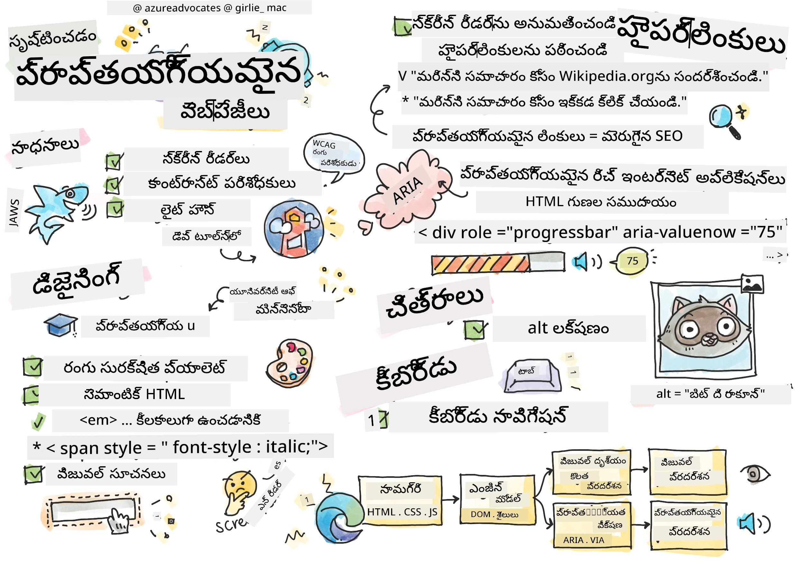
> స్కెచ్‌నోట్ రచయిత [టొమోమి ఇమురా](https://twitter.com/girlie_mac)

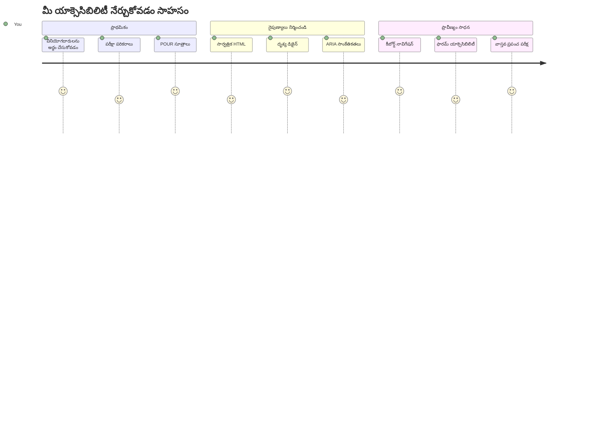
## పూర్వ-లెక్చర్ క్విజ్
[పూర్వ-లెక్చర్ క్విజ్](https://ff-quizzes.netlify.app/web/)

> వెబ్ పవర్ దాని ఏకీభావంలోనే ఉంది. అంగవైకల్యం ఉన్నవారు సహా అందరూ ప్రవేశించడమేం ముఖ్య అంశం.
>
> \- సర్ టిమోతీ బర్నర్స్-లి, W3C డైరెక్టర్ మరియు వరల్డ్ వైడ్ వెబ్ రచయిత

మీకు ఆశ్చర్యంగా ఉండే విషయం ఇది: మీరు ప్రాప్యత కలిగిన వెబ్‌సైట్లు తయారు చేస్తే, మీరు కేవలం అంగవైకల్యం ఉన్న ప్రజలకు సహాయం చేస్తున్నట్లు కాకుండా—వాస్తవానికి మీరు వెబ్‌ను అందరికీ మెరుగ్గా పరిచేస్తున్నారు!

సమీప రోడ్డుజోకు వద్ద చూడగల curb cuts గుర్తిస్తే? అవి మొదట వికలాంగుల వాహనాలకు రూపొందించబడ్డాయి, కానీ ఇప్పుడు అవి బిడ్డల వాహనాలు తో కలిసి వచ్చే వారు, సరుకు పంపే కార్మికులు డల్లి లతో, ప్రయాణికులు రోలింగ్ లగేజీతో, సైకిళ్లు కూడా ఉపయోగిస్తారు. ఇదే ప్రాప్యత కలిగిన వెబ్ డిజైన్ విధానం—ఒక గ్రూప్‌కు ఉపయోగపడే పరిష్కారాలు సాధారణంగా అందరికీ లాభదాయకమవుతాయి. చాలా చల్లగా ఉన్నదా?

ఈ పాఠంలో, మీరూ వెబ్‌ను ఎలాగైనా నడిపించే విధానంలో నిజంగా అందరికి పునరుద్ధరించే వెబ్‌సైట్లు ఎలా తయారు చేయాలో పరిశీలిస్తాము. మీరు ఇప్పటికే వెబ్ ప్రమాణాలలో నిర్మితమైన ప్రాక్టికల్ సాంకేతికతలను కనుగొంటారు, టెస్టింగ్ టూల్‌లతో ప్రాక్టీసు చేస్తారు, మరియు ప్రాప్యత మీ సైట్లను ఎలా ఎక్కువగా ఉపయోగించదగినవి చేస్తుందో చూద్దాము.

ఈ పాఠం అంతా మీరు మీ అభివృద్ధి వర్క్‌ఫ్లోలో ప్రాప్యతను సహజమైన భాగంగా మారుస్తూ ధైర్యాన్ని పొందుతారు. ఆలోచనాత్మక డిజైన్ ఎంపికలు బిలియన్ల వినియోగదారులకు వెబ్‌ను తెరవడంలో ఎలా సహాయపడతాయో అన్వేషించడానికి సిద్ధంగా ఉన్నారా? ఆహ్వానం!

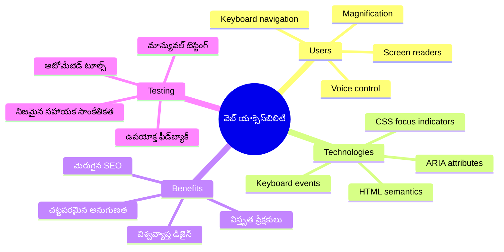
> మీరు ఈ పాఠాన్ని [Microsoft Learn](https://docs.microsoft.com/learn/modules/web-development-101/accessibility/?WT.mc_id=academic-77807-sagibbon) లో కూడా తీసుకోవచ్చు!

## సహాయక సాంకేతికాలలో అవగాహన

కోడ్ చేయడం ప్రారంభించే ముందు, విభిన్న సామర్థ్యాలు కలిగిన ప్రజలు వెబ్‌ను ఎలా అనుభవిస్తారు అన్నదాన్ని ఓ క్షణం చూసుకుందాం. ఇది కేవలం సైద్ధాంతం కాదు—నిజ జీవన నావిగేషన్ నమూనాలను అవగాహన చేయడం మీరు మెరుగైన డెవలపర్‌గా మారడానికి సహాయపడుతుంది!

సహాయక సాంకేతికాలు అద్భుతమైన సాంకేతిక పరికరాలు, ఇవి అంగవైకల్యం ఉన్నవారి వెబ్‌తో సహజ సమ్మిళితాన్ని సులభతరం చేస్తాయి, మరియు మీరు ఆశ్చర్యపోయే విధానాలలో సహాయం చేస్తాయి. ఈ సాంకేతికతల పని తీరును మీరు గ్రహిస్తే, ప్రాప్యత కలిగిన వెబ్ అనుభవాలు సృష్టించడం చాలా సరళంగా మారుతుంది. ఇది తప్పకుండా మీ కోడ్‌ని ఇంకొరరుల్ చూపించుకునే విద్య నేర్చుకోవడం లాంటిది.

### స్క్రీన్ రీడర్లు

[స్క్రీన్ రీడర్లు](https://en.wikipedia.org/wiki/Screen_reader) అనేవి మైనర్ టెక్నాలజీలుగా, డిజిటల్ టెక్ట్స్‌ని మాటలు లేదా బ్రైల్ అవుట్‌పుట్‌గా మార్చుతాయి. వీటిని దృష్టి లోపం ఉన్నవారు ఎక్కువగా ఉపయోగిస్తారు, కానీ డిస్లెక్సియా వంటి నేర్చుకోవడంలో ఇబ్బందులు ఉన్న వారు కూడా ఉపయోగించుకోవచ్చు.

స్క్రీన్ రీడర్ బుక్ ఓ చదివే చాలా తెలివైన కథావాచకుడితో పోలిస్తాను. అది కంటెంట్‌ను తగిన క్రమంలో చదువుతుంది, "బటన్" లేదా "లింక్" లాంటి ఇంటరాక్టివ్ అంశాలను ప్రకటిస్తుంది, మరియు కీబోర్డు షార్ట్‌కట్స్‌ను అందిస్తుంది పేజీలో కూర్చోవడానికి. కానీ ఇది సరిగ్గా పనిచేయడానికి మనం సరైన నిర్మాణం మరియు అర్థవంతమైన కంటెంట్‌తో వెబ్‌సైట్లు రూపొందించాలి. అక్కడ మీరు ఒక డెవలపర్‌గా ముఖ్య పాత్ర played.

**ప్లాట్‌ఫార్మ్‌లలో ప్రసిద్ధ స్క్రీన్ రీడర్లు:**
- **విండోస్**: [NVDA](https://www.nvaccess.org/about-nvda/) (ఉచితం మరియు చాలా ప్రాచుర్యం), [JAWS](https://webaim.org/articles/jaws/), [Narrator](https://support.microsoft.com/windows/complete-guide-to-narrator-e4397a0d-ef4f-b386-d8ae-c172f109bdb1/?WT.mc_id=academic-77807-sagibbon) (బిల్ట్-ఇన్)
- **macOS/iOS**: [VoiceOver](https://support.apple.com/guide/voiceover/welcome/10) (బిల్ట్-ఇన్ మరియు సమర్థవంతమైనది)
- **ఆండ్రాయిడ్**: [TalkBack](https://support.google.com/accessibility/android/answer/6283677) (బిల్ట్-ఇన్)
- **లినక్స్**: [Orca](https://wiki.gnome.org/Projects/Orca) (ఉచితం మరియు ఓపెన్-సోర్స్)

**స్క్రీన్ రీడర్లు వెబ్ కంటెంట్‌ను ఎలా నావిగేట్ చేస్తాయో:**

స్క్రీన్ రీడర్లు అనుభవజ్ఞులైన వినియోగదారులకు బ్రౌజింగ్‌ను సమర్థవంతంగా చేసే బహుళ నావిగేషన్ విధానాలను అందిస్తాయి:
- **క్రమంగా చదవడం**: పుస్తకంలా పైన నుంచి క్రిందికి కంటెంట్ చదువుతుంది
- **ల్యాండ్‌మార్క్ నావిగేషన్**: పేజీ విభాగాల మధ్యకి (హెడర్, నావ్, మెయిన్, ఫుటర్) జంప్ చేస్తుంది
- **హెడింగ్ నావిగేషన్**: పేజీ నిర్మాణం అర్థం చేసుకోవడానికి హెడింగ్‌ల మధ్య స్కిప్ చేస్తుంది
- **లింక్ లిస్టులు**: త్వరగా యాక్సెస్ కోసం అందరి లింక్స్ జాబితాను ఉత్పత్తి చేస్తుంది
- **ఫారం నియంత్రణలు**: ఇన్‌పుట్ ఫీల్డ్స్ మరియు బటన్‌ల మధ్య నేరుగా నావిగేట్ చేస్తుంది

> 💡 **ఇది నాకు మైండ్ బ్లోవింగ్ గా అనిపించింద**: 68% స్క్రీన్ రీడర్ వినియోగదారులు ప్రధానంగా హెడింగ్‌ల ద్వారా నావిగేట్ చేస్తారు ([WebAIM సర్వే](https://webaim.org/projects/screenreadersurvey9/#finding)). అంటే మీ హెడింగ్ నిర్మాణం వినియోగదారులకు మ్యాప్‌లా ఉంటుంది—నిలువలేని గా చేయగలిగితే, వారు మీ కంటెంట్ చుట్టూ వేగంగా దారితీస్తున్నారు!

### మీ టెస్టింగ్ వర్క్‌ఫ్లో నిర్మించడం

మంచి వార్త ఇదే—సక్రమమైన ప్రాప్యత టెస్టింగ్ భారంగా ఉండాల్సిన అవసరం లేదు! మీరు ఆటోమేటెడ్ టూల్స్ (వీటి ద్వారా స్పష్టమైన సమస్యలను సులభంగా కనుగొనవచ్చు) మరియు కొంత పూర్తిగా చేతులతో టెస్టింగ్ కలియజేయాలనుకుంటారు. నేను కనుగొన్న ఒక వ్యవస్థాపక పద్ధతి ఉన్నది ఇది, ఇది పూర్తిగా మీ రోజును తినకుండా ఎక్కువ సమస్యలను పట్టుకుంటుంది:

**అవసరమైన మాన్యువల్ టెస్టింగ్ వర్క్‌ఫ్లో:**

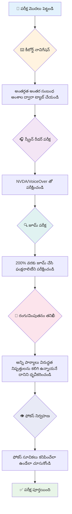
**దశల వారీ టెస్టింగ్ చెక్‌లిస్ట్:**
1. **కీబోర్డు నావిగేషన్**: కేవలం Tab, Shift+Tab, Enter, Space, మరియు Arrow కీలు వాడండి
2. **స్క్రీన్ రీడర్ టెస్టింగ్**: NVDA, VoiceOver, లేదా Narrator ని ఎనేబుల్ చేసి కళ్ళు మూసుకుని నావిగేట్ చేయండి
3. **జూమ్ టెస్టింగ్**: 200% మరియు 400% జూమ్ స్థాయిల్లో పరీక్షించండి
4. ** కలర్ కాంట్రాస్ట్ వెరిఫికేషన్**: అన్ని టెక్ట్స్ మరియు UI భాగాలను తనిఖీ చేయండి
5. **ఫోకస్ సూచిక టెస్టింగ్**: అన్ని ఇంటరాక్టివ్ అంశాలకు కనిపించే ఫోకస్ స్టేట్లు ఉండేలా చూసుకోండి

✅ **లైట్హౌస్‌తో ప్రారంభించండి**: మీ బ్రౌజర్ యొక్క డెవ్‌టూల్స్ ఓపెన్ చేసి, లైట్హౌస్ ప్రాప్యత ఆడిట్ నిర్వహించండి, ఆపై ఫలితాలను మీ మాన్యువల్ టెస్టింగ్ ఫోకస్ ప్రాంతాల కోసం మార్గదర్శనం చేయండి.

### జూమ్ మరియు magniఫికేషన్ టూల్స్

మీరు మీ ఫోన్‌లో టెక్స్ట్ చాలా చిన్నగా ఉన్నపుడు పిన్ చేయడం ద్వారా జూమ్ చేస్తారు లేదా చాలా వెలుతురు ఉన్నప్పుడూ ల్యాప్‌టాప్ స్క్రీన్‌ను squint చేస్తారని తెలుసు? చాలా మంది వినియోగదారులు ప్రతిరోజూ విషయం చదవదగినదిగా తీర్చుకోవడానికి magniఫికేషన్ టూల్స్‌పై ఆధారపడతారు. ఈవారు లో కనిష్ట దృష్టి ఉన్నవారు, వృద్ధులు, లేదా ఎవరికైనా అవుట్డోర్స్ లో వెబ్ సైట్ చదవడానికి ప్రయత్నించేవారు.

మోడరన్ జూమ్ సాంకేతికత కేవలం పెద్దదిగా చేయడం కంటే పైన అభివృద్ధి జరిగింది. ఈ టూల్స్ ఎలా పనిచేస్తాయో అర్థం చేసుకోవడం ద్వారా మీరు ప్రతిస్పందనతో కూడుకున్న డిజైన్‌లు తయారు చేయవచ్చు, అవి ఎటువంటి magniఫికేషన్ స్థాయిలోనైనా ఉపయోగకరంగా మరియు ఆకర్షకంగా ఉంటాయి.

**మోడరన్ బ్రౌజర్ జూమ్ సామర్థ్యాలు:**
- **పేజ్ జూమ్**: అందుబాటులోని అన్ని కంటెంట్‌ను ఆత్ పాతులో (టెక్స్ట్, ఇమేజెస్, లేఅవుట్) తేడా లేకుండా స్కేల్ చేస్తుంది — ఇది ఇష్టపడే పద్ధతి
- **టెక్ట్స్ మాత్రమే జూమ్**: ఫాంట్ పరిమాణాన్ని పెంచటం కానీ అసలు లేఅవుట్ నిలుపుకోవడం
- **పిన్-టు-జూమ్**: తాత్కాలిక magniఫికేషన్ కోసం మొಬೈల్ జెస్చర్ మద్దతు
- ** బ్రౌజర్ మద్దతు**: అన్ని ఆధునిక బ్రౌజర్లు 500% వరకు జూమ్ మద్దతు ఇస్తాయి, ఫంక్షనాలిటీ భంగం కాకుండా

**ప్రత్యేక magniఫికేషన్ సాఫ్ట్‌వేర్:**
- **విండోస్**: [Magnifier](https://support.microsoft.com/windows/use-magnifier-to-make-things-on-the-screen-easier-to-see-414948ba-8b1c-d3bd-8615-0e5e32204198) (బిల్ట్-ఇన్), [ZoomText](https://www.freedomscientific.com/training/zoomtext/getting-started/)
- **macOS/iOS**: [Zoom](https://www.apple.com/accessibility/mac/vision/) (అధునాతన ఫీచర్లతో బిల్ట్-ఇన్)

> ⚠️ **డిజైన్ పరిశీలన**: WCAG 200% జూమ్ స్థాయిలో కంటెంట్ ఫంక్షనల్‌గా ఉండాలి అని డిమాండ్ చేస్తుంది. ఆ స్థాయిలో, హోరిజాంటల్ స్క్రోలింగ్ తక్కువగా ఉండాలి మరియు అన్ని ఇంటరాక్టివ్ అంశాలు అందుబాటులో ఉండాలి.

✅ **మీ ప్రతిస్పందనీయమైన డిజైన్‌ను పరీక్షించండి**: మీ బ్రౌజర్‌ను 200% మరియు 400% జూమ్ చేయండి. మీ లేఅవుట్ సాఫీగా సరిపోతుందా? మీరు ఇంకా అధిక స్క్రోలింగ్ లేకుండా అన్ని ఫంక్షనల్ అంశాలకు యాక్సెస్ చేయగలరా?

## ఆధునిక ప్రాప్యత టెస్టింగ్ టూల్స్

ఇప్పుడు మీరు సహాయక సాంకేతికాలతో ప్రజలు వెబ్‌ను ఎలా అన్వేషిస్తారో తెలుసుకున్నాక, ప్రాప్యత కలిగిన వెబ్‌సైట్లు సృష్టించడానికి మరియు పరీక్షించడానికి సహాయపడే టూల్స్ అన్వేషిద్దాము.

ఇది ఇలా అనుకోండి: ఆటోమేటెడ్ టూల్స్ స్పష్టమైన సమస్యలను కనుగొనడంలో గొప్పవి (ఉదా: అల్ట్ టెక్ట్స్ లేకపోవడం), చేతులతో చేసే టెస్టింగ్ మీ సైట్ వాస్తవ ప్రపంచంలో ఉపయోగించడానికి సర్వోవత్తమంగా ఉండేలా చేస్తుంది. కలిసికట్టుగా, అవి మీ సైట్లు అందరికీ పనిచేస్తాయని ధైర్యం ఇస్తాయి.

### రంగుల వ్యత్యాస పరీక్ష

మంచి వార్త: రంగుల వ్యత్యాసం అత్యధిక సార్లు జరిగే ప్రాప్యత సమస్య గాను, అలాగే ఇది సులభంగా పరిష్కరించదగినదిగాను ఉంటుంది. మంచిగా కనుస్పష్టత అందరికీ లాభదాయకం—దృష్టి లోపం ఉన్నవారు నుంచి బీచ్ వద్ద వారి ఫోన్లో చదవడానికి ప్రయత్నించే వారు వరకు.

**WCAG వ్యత్యాస అవసరాలు:**

| టెక్ట్ టైప్ | WCAG AA (కనీసం) | WCAG AAA (ఎన్‌హాన్స్డ్) |
|-----------|-------------------|---------------------|
| **సాధారణ టెక్ట్స్** (18 పాయింట్ల కింద) | 4.5:1 వ్యత్యాసం | 7:1 వ్యత్యాసం |
| **పెద్ద టెక్ట్స్** (18 పాయింట్లు+ లేదా 14 పాయింట్లు+ గాఢమైనది) | 3:1 వ్యత్యాసం | 4.5:1 వ్యత్యాసం |
| **UI భాగాలు** (బటన్లు, ఫారం బోర్డర్స్) | 3:1 వ్యత్యాసం | 3:1 వ్యత్యాసం |

**ముఖ్యమైన టెస్టింగ్ టూల్స్:**
- [Colour Contrast Analyser](https://www.tpgi.com/color-contrast-checker/) - డెస్క్‌టాప్ దరఖాస్తులతో కలర్ పికెర్
- [WebAIM Contrast Checker](https://webaim.org/resources/contrastchecker/) - వెబ్ ఆధారిత తక్షణ ఫీడ్‌బ్యాక్
- [Stark](https://www.getstark.co/) - Figma, Sketch, Adobe XD కోసం డిజైన్ టూల్ ప్లగిన్
- [Accessible Colors](https://accessible-colors.com/) - ప్రాప్యత కలిగిన రంగుల ప్యాలెట్స్ కనుగొనండి

✅ **మంచి రంగుల ప్యాలెట్స్ సృష్టించండి**: మీ బ్రాండ్ రంగులతో ప్రారంభించి, కాంట్రాస్ట్ చెకర్స్ ఉపయోగించి ప్రాప్యత కలిగిన వేరియేషన్లను సృష్టించండి. వీటిని మీ డిజైన్ సిస్టమ్ యొక్క ప్రాప్యత కలిగిన రంగుల టోకెన్లుగా డాక్యుమెంట్ చేయండి.

### సమగ్ర ప్రాప్యత ఆడిటింగ్

సంసిద్ధమైన ప్రాప్యత టెస్టింగ్ అనేక దృష్టికోణాలను కలపాలి. ఏ ఒక్క సాధనం సర్వం చూపదు, వివిధ పద్ధతులతో టెస్టింగ్ రొటీన్ తయారు చేయడం సమగ్ర కవరేజ్‌ను యుగీచేస్తుంది.

**బ్రౌజర్-ఆధారిత పరీక్షలు (డెవ్ టూల్స్‌లోగా):**
- **Chrome/Edge**: లైట్హౌస్ ప్రాప్యత ఆడిట్ + ప్రాప్యత ప్యానెల్
- **Firefox**: ప్రాప్యత ఇన్‌స్పెక్టర్ దృఢమైన చెట్టు వీక్షణతో
- **Safari**: వెబ్ ఇన్స్పెక్టర్‌లో ఆడిట్ టాబ్ VoiceOver అనుకరణతో

**ప్రొఫెషనల్ టెస్టింగ్ ఎక్స్‌టెన్షన్స్:**
- [axe DevTools](https://www.deque.com/axe/devtools/) - పరిశ్రమ ప్రమాణ ఆటోమేటెడ్ టెస్టింగ్
- [WAVE](https://wave.webaim.org/extension/) - ఖచ్చితమైన దృష్టికోణంతో దోషాలను హైలైట్ చేస్తుంది
- [Accessibility Insights](https://accessibilityinsights.io/) - Microsoft యొక్క సమగ్ర టెస్టింగ్ సూట్

**కమాండ్ లైన్ మరియు CI/CD ఇంటిగ్రేషన్:**
- [axe-core](https://github.com/dequelabs/axe-core) - ఆటోమేటెడ్ టెస్టింగ్ కోసం జావాస్క్రిప్ట్ లైబ్రరీ
- [Pa11y](https://pa11y.org/) - కమాండ్ లైన్ ప్రాప్యత టెస్టింగ్ టూల్
- [Lighthouse CI](https://github.com/GoogleChrome/lighthouse-ci) - ఆటోమేటెడ్ ప్రాప్యత స్కోరింగ్

> 🎯 **పరీక్ష లక్ష్యం**: మీ ప్రారంభానికి లైట్హౌస్ ప్రాప్యత స్కోర్ 95+ లక్ష్యం పెట్టండి. గమనించండి, ఆటోమేటెడ్ టూల్స్ సుమారు 30-40% ప్రాప్యత సమస్యలు మాత్రమే గుర్తిస్తాయి—మాన్యువల్ టెస్టింగ్ మాత్రం అవసరం!

### 🧠 **టెస్టింగ్ నైపుణ్యాల తనిఖీ: సమస్యలు కనుగొనడానికి సిద్ధంగా ఉన్నారా?**

**మీరు ప్రాప్యత టెస్టింగ్ గురించి ఎలా భావిస్తున్నారు చూద్దాము:**
- మీరు ఏ టెస్టింగ్ పద్ధతి ప్రస్తుతం అత్యంత సులభంగా అనిపిస్తోంది?
- మీరు కీబోర్డు మాత్రమే నావిగేషన్ కోసం ఒక పూర్ణ రోజు ఉపయోగించడం ఊహించగలరా?
- మీరు ఆన్‌లైన్‌లో వ్యక్తిగతంగా ఎదుర్కొన్న ఒక ప్రాప్యత అడ్డంకి ఏమిటి?

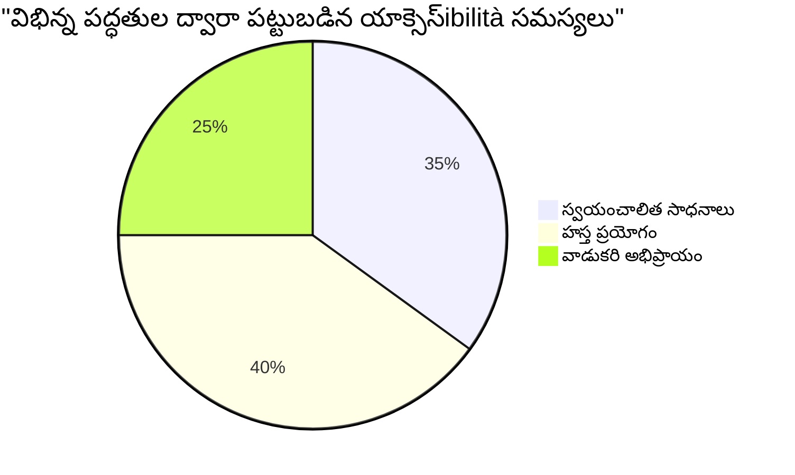
> **ధైర్య పెంపకం**: ప్రొఫెషనల్ ప్రాప్యత టెస్టర్లు ఇదే పద్ధతుల సమ్మిళితాన్ని ఉపయోగిస్తారు. మీరు పరిశ్రమ ప్రమాణాలను నేర్చుకుంటున్నారు!

## ప్రాప్యతను బేస్ నుంచి నిర్మించడం

ప్రాప్యతలో విజయం సాధించడానికి కీలక విషయం మొదటి రోజు నుండి దాన్ని మీ ప్రాథమిక ఆధారంగా సృష్టించడం. "నేను తరువాత ప్రాప్యతను జోడిస్తాను" అని అనుకోవడం ఆహ్వానకరం ఐతే, అది ఒక ఇంటిని నిర్మించిన తర్వాత ర్యాంప్ వేసుకోవడానికి సమానం. సాధ్యమే? అవును. సులభం కాదు.

ప్రాప్యతను మీ ఆర్చిటెక్చర్ ప్లాన్లలో సక్రమంగా చేర్చుకోవడం తార్కికమయిన విషయం.

### POUR సూత్రాలు: మీ ప్రాప్యత ఆధారం

వెబ్ కంటెంట్ ప్రాప్యత మార్గదర్శకాలు (WCAG) నాలుగు మూల సూత్రాలపై తయారు చేయబడ్డాయి, ఇవి POUR అని ఉచ్ఛరించబడతాయి. భయపడవద్దు—ఇవి సాధారణ విద్యా భావనలు కాదు! ఇవి కంటెంట్ అందరికీ పనిచేసే విధంగా రూపొందించేందుకు అనుసరించాల్సిన ప్రాక్టికల్ మార్గదర్శకాలు.

POUR మీరు అర్థం చేసుకుంటే, ప్రాప్యత నిర్ణయాలు తీసుకోవడం చాలా సహజంగా మారుతుంది. ఇది మెంటల్ చెక్‌లిస్ట్ లాంటిది, ఇది మీ డిజైన్ ఎంపికలను దారితీస్తుంది. ఇది విడదీయండి:

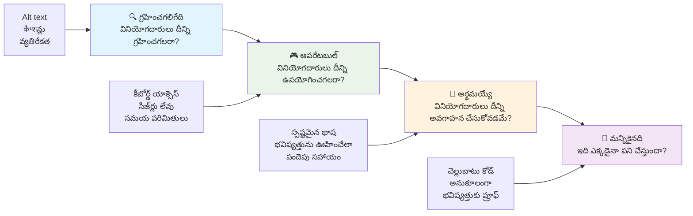
**🔍 గ్రహించదగినది**: సమాచారం ఉపయోగదారులు అందుబాటులో ఉన్న ఇంద్రియాల ద్వారా గ్రహించగల విధంగా అందించాల్సి ఉంటుంది

- అక్షరేతర కంటెంట్ (చిత్రాలు, వీడియోలు, ఆడియో) కోసం పఠ్య ప్రత్యామ్నాయాలు అందించండి
- అన్ని టెక్ట్స్ మరియు UI భాగాల కోసం సంతృప్తికర రంగుల వ్యత్యాసం నిర్ధారించండి
- మల్టీమీడియా కంటెంట్‌కు శీర్షికలు మరియు ట్రాన్స్క్రిప్ట్‌లను అందించండి
- కంటెంట్ 200% వరకు సైజ్ పెంచినప్పటికీ ఫంక్షనల్‌గా ఉండేలా డిజైన్ చేయండి
- సమాచారం తెలిపేందుకు బహుళ ఇంద్రియ లక్షణాలు (షక్తి కేవలం రంగులే కావు) ఉపయోగించండి

**🎮 నడపదగినది**: అందుబాటులో ఉన్న ఇన్‌పుట్ పద్ధతుల ద్వారా అన్ని ఇంటరఫేస్ భాగాలు నడిపించదగినవి కావలసినవి

- అన్ని ఫంక్షనాలిటీలను కీబోర్డు నావిగేషన్ ద్వారా అందుబాటులో ఉంచండి
- వినియోగదారులకు చదవడానికి మరియు ఇంటరాక్ట్ చేయడానికి సరిపడ సమయం ఇవ్వండి
- అలసత్వం లేదా వెస్టిబ్యులర్ జబ్బులకు కారణమయ్యే కంటెంట్ నివారించండి
- క్లియర్ నిర్మాణం మరియు ల్యాండ్మార్క్‌లతో వినియోగదారులు సమర్థవంతంగా నావిగేట్ చేయగలుగుం
- ఇంటరాక్టివ్ అంశాలకు తగిన లక్ష్య పరిమాణాలు (కనీసం 44px) ఇవ్వండి

**📖 అర్థమయ్యేలా ఉండాలి**: సమాచారం మరియు UI ఆపరేషన్ స్పష్టంగా, అర్థమయ్యే విధంగా ఉండాలి

- మీ ప్రేక్షకులకు తగిన సులభ, స్పష్టమైన భాషను ఉపయోగించండి
- కంటెంట్ అనుకున్న విధంగా కనిపించాలి మరియు పని చేయాలి
- వినియోగదారుల ఇన్‌పుట్‌కు స్పష్టమైన సూచనలు మరియు దోష సందేశాలు అందించండి
- ఫారమ్లలో తప్పులను అర్థం చేసుకోవడం మరియు సరి చేయడంలో సహాయపడండి
- కంటెంట్‌ను తార్కికంగా చదవడానికె మరియు సమాచార హిరార్కీని పరిగణలోకి తీసుకుని అమర్చండి

**💪 బలమైనది**: కంటెంట్ వివిధ సాంకేతికతలు మరియు సహాయక పరికరాలతో నమ్మకంగా పనిచేయాలి

- **వాలిడ్మైన, సేమాంటిక్ HTML ను మీ ప్రాథమికంగా వాడండి**
- **ప్రస్తుత మరియు భవిష్యత్తు సహాయక సాంకేతికతలతోaxy అర్ధం అయ్యేలా ఉండాలి**
- **వెబ్ ప్రమాణాలు మరియు ఉత్తమ పద్ధతులను పిన్చండి**
- **విభిన్న బ్రౌజర్లు, పరికరాలు, మరియు సహాయక సాధనాలపై పరీక్షించండి**
- **అధునాతన ఫీచర్లు మద్దతు లేనప్పుడు కంటెంట్ తగిన విధంగా పడ్డకోయేలా నిర్మించండి**

### 🎯 **POUR సూత్రాల తనిఖీ: దీన్ని అందుబాటులో ఉంచడం**

**మూలాలను త్వరితంగా ఆలోచించండి:**
- మీరు యోచించగలిగే వెబ్‌సైట్ ఫీచర్ ഏదైనా ప్రతి POUR సూత్రాన్ని విఫలమవుతోందా?
- డెవలపర్‌గా మీకు ఏ సూత్రం సహజంగా అనిపిస్తుంది?
- ఈ సూత్రాలు దివ్యాంగులు కాకపోయినా అందరికి డిజైన్ ఎలా మెరుగుపరుస్తాయి?

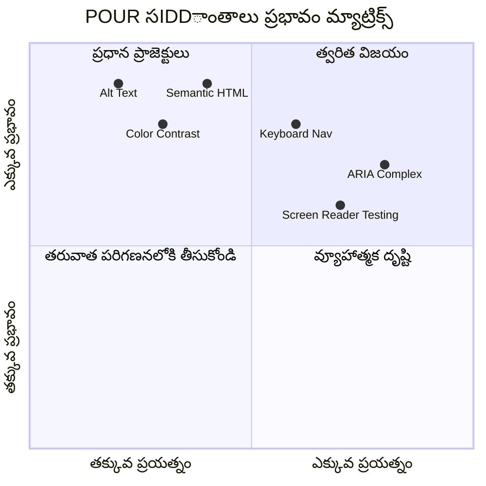
> **గమనిక**: అధిక ప్రభావం, తక్కువ శ్రమతో కూడిన మార్పులు మొదలు పెట్టండి. సમાંత్మక HTML మరియు అల్ట్ టెక్స్ట్ మీకు కనీస ప్రయత్నంలో అత్యంత ఆక్సెసిబిలిటీ వృద్ధిని ఇస్తాయి!

## యాక్సెసిబుల్ విజువల్ డిజైన్ సృష్టించడం

మంచి విజువల్ డిజైన్ మరియు యాక్సెసిబిలిటీ అనేవి కలిపి పనిచేస్తాయి. మీరు యాక్సెసిబిలిటీని మనసులో ఉంచి డిజైన్ చేస్తే, ఈ పరిమితులు మరింత శుభ్రమైన, సొగసైన పరిష్కారాలను తీసుకురావడంతో పాటు అందరికీ లాభదాయకంగా ఉంటాయి.

ఆయనదానంతా తమ విజువల్ సామర్థ్యాలు లేదా మీరు వారి కంటెంట్ వీక్షించాలనుకున్న పరిస్థితులపై సంబంధం లేకుండా అందరికీ పనిచేసే ఆకర్షణీయమైన డిజైన్లు ఎలా నిర్మించాలో మనము తెలుసుకుందాం.

### రంగు మరియు విజువల్ యాక్సెసిబిలిటీ వ్యూహాలు

రంగు సంభాషణకు శక్తివంతమైనది, కానీ ఇది ముఖ్యమైన సమాచారాన్ని బొమ్మలో మాత్రమే ఇవ్వకూడదు. రంగుతో మించి డిజైన్ చేయడం మరింత బలమైన, సమగ్ర అనుభవాలను సృష్టిస్తుంది, ఇవి ఎక్కువ పరిస్థితులలో పనిచేస్తాయి.

**రంగు దృష్టి వ్యత్యాసాల కోసం డిజైన్ చేయండి:**

సుమారు 8% పురుషులు మరియు 0.5% మహిళలు కొంత రకమైన రంగు దృష్టి వ్యత్యాసం కలిగి ఉన్నారు (సాధారణంగా "రంగు అంధత్వం" అని పిలవబడుతుంది). సూచించదగిన సాధారణ రకాలు ఇవి:
- **డ్యూటెరానోపియా**: ఎరుపు మరియు ఆకుపచ్చ రంగులు తేడాను గుర్తించడంలో దోషం
- **ప్రోటానోపియా**: ఎరుపు మెరుగైన ఆవిర్భావం లేదు
- **ట్రైటానోపియా**: నీలం మరియు పసుపు తో కష్టాలు (అల్పం సాందర్భికం)

**సమగ్ర రంగు వ్యూహాలు:**

```css
/* ❌ Bad: Using only color to indicate status */
.error { color: red; }
.success { color: green; }

/* ✅ Good: Color plus icons and context */
.error {
  color: #d32f2f;
  border-left: 4px solid #d32f2f;
}
.error::before {
  content: "⚠️";
  margin-right: 8px;
}

.success {
  color: #2e7d32;
  border-left: 4px solid #2e7d32;
}
.success::before {
  content: "✅";
  margin-right: 8px;
}
```

**ప్రాథమిక వ్యతిరేకత అవసరాలను మించి:**
- మీ రంగుల ఎంపికలను రంగు అంధత్వం సిమ్యులేటర్స్ తో పరీక్షించండి
- రంగు సూచనతో పాటు నమూనాలు, టెక్స్చర్‌లు లేదా ఆకారాలు ఉపయోగించండి
- అంతర్‌క్రియాత్మక స్థితులు రంగు లేకుండా కూడా తేడాగా ఉండేలా నిర్ధారించండి
- హై కాంట్రాస్ట్ మోడ్ లో మీ డిజైన్ ఎలా కనిపిస్తుందో పరిశీలించండి

✅ **మీ రంగు యాక్సెసిబిలిటీని పరీక్షించండి**: [Coblis](https://www.color-blindness.com/coblis-color-blindness-simulator/) వంటి సాధనాలను ఉపయోగించి మీ సైట్ వివిధ రంగు దృష్టి రకాలు ఉన్న వినియోగదారులకు ఎలా కనిపిస్తుందో చూడండి.

### ఫోకస్ సూచికలు మరియు ఇంటరాక్షన్ డిజైన్

ఫోకస్ సూచికలు డిజిటల్ కర్సర్ సమాన—they చ toetsenbord వినియోగదారులు ఎక్కడ ఉన్నారో పేజీలో చూపుతాయి. బాగా డిజైన్ చేయబడిన ఫోకస్ సూచికలు అందరికీ ఇంటరాక్షన్లను స్పష్టంగా మరియు ఊహించదగినవి చేయడానికి అనుభవాన్ని పెంచుతాయి.

**ఆధునిక ఫోకస్ సూచిక ఉత్తమ పద్ధతులు:**

```css
/* Enhanced focus styles that work across browsers */
button:focus-visible {
  outline: 2px solid #0066cc;
  outline-offset: 2px;
  box-shadow: 0 0 0 4px rgba(0, 102, 204, 0.25);
}

/* Remove focus outline for mouse users, preserve for keyboard users */
button:focus:not(:focus-visible) {
  outline: none;
}

/* Focus-within for complex components */
.card:focus-within {
  box-shadow: 0 0 0 3px rgba(74, 144, 164, 0.5);
  border-color: #4A90A4;
}

/* Ensure focus indicators meet contrast requirements */
.custom-focus:focus-visible {
  outline: 3px solid #ffffff;
  outline-offset: 2px;
  box-shadow: 0 0 0 6px #000000;
}
```

**ఫోకస్ సూచిక అవసరాలు:**
- **దృశ్యమానత**: పక్కని అంశాలతో కనీసం 3:1 వ్యతిరేకత నిష్పత్తి ఉండాలి
- **వెడల్పు**: మొత్తం అంశం చుట్టూ కనీసం 2px మందం
- **సిత్త బాటు**: ఫోకస్ అక్కడుండేవరకు కనిపించాలి
- **వివేకం**: ఇతర UI స్థితుల నుండి దృశ్యంగా వేరు ఉండాలి

> 💡 **డిజైన్ సూచన**: అద్భుతమైన ఫోకస్ సూచికలు తరచుగా ఔట్‌లైన్, బాక్స్-షాడో మరియు రంగు మార్పులతో కలిపి వివిధ నేపథ్యాలకు మరియు సందర్భాలకు దృశ్యమానతను నిర్ధారిస్తాయి.

✅ **ఫోకస్ సూచికలను ఆడిట్ చేయండి**: మీ వెబ్‌సైట్ లో టాబ్ ద్వారా నడిచి ఏ అంశాలపై స్పష్టమైన ఫోకస్ సూచికలు ఉన్నాయో గమనించండి. కనబడుట కష్టం కావడం లేదా పూర్తిగా లేకపోవడం ఉన్నదేమైనా?

### సేమాంటిక్ HTML: యాక్సెసిబిలిటీ మౌలికం

సేమాంటిక్ HTML అనేది సహాయక సాంకేతికతలకు మీ వెబ్‌సైట్ కోసం GPS వ్యవస్థని అందించడం లాంటిది. మీరు సరైన HTML మూలకాలను వారి ఉద్దేశానికి ఉపయోగించినప్పుడు, మీరు స్క్రీన్ రీడర్లు, కీబోర్డ్లు మరియు ఇతర సాధనాలకు ఉపయోగకరమైన మార్గదర్శిని ఇస్తున్నారు.

ఇక్కడ ఒక సరళమైన ఉపమా ఉంది: సేమాంటిక్ HTML బాగా విభజించబడిన గ్రంథాలయం మరియు విజ్ఞాపనలతో ఉన్నత స్థాయిలో ఉన్నది, మరియూ కారణంగా పుస్తకాలు ఎక్కడ ఉన్నాయని అర్థం చేసుకోవచ్చు; ఇక గోడలో పుస్తకాలు ఎర్రబడిన గోడపూడ్డిలా ఉండటం కాదు. రెండు చోట్ల పుస్తకాలు ఉన్నప్పటికీ, మీరు ఏదో కనుగొనడం ఇష్టపడతారు? అదే!

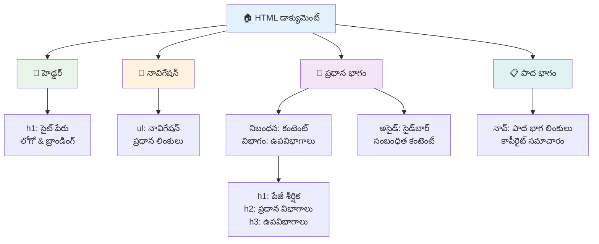
**ప్రాప్తి పేజీ నిర్మాణపు బ్లాక్‌లు:**

```html
<!-- Landmark elements provide page navigation structure -->
<header>
  <h1>Your Site Name</h1>
  <nav aria-label="Main navigation">
    <ul>
      <li><a href="/home">Home</a></li>
      <li><a href="/about">About</a></li>
      <li><a href="/services">Services</a></li>
    </ul>
  </nav>
</header>

<main>
  <article>
    <header>
      <h1>Article Title</h1>
      <p>Published on <time datetime="2024-10-14">October 14, 2024</time></p>
    </header>
    
    <section>
      <h2>First Section</h2>
      <p>Content that relates to this section...</p>
    </section>
    
    <section>
      <h2>Second Section</h2>
      <p>More related content...</p>
    </section>
  </article>
  
  <aside>
    <h2>Related Links</h2>
    <nav aria-label="Related articles">
      <ul>
        <li><a href="/related-1">First related article</a></li>
        <li><a href="/related-2">Second related article</a></li>
      </ul>
    </nav>
  </aside>
</main>

<footer>
  <p>&copy; 2024 Your Site Name. All rights reserved.</p>
  <nav aria-label="Footer links">
    <ul>
      <li><a href="/privacy">Privacy Policy</a></li>
      <li><a href="/contact">Contact Us</a></li>
    </ul>
  </nav>
</footer>
```

**ఎందుకు సేమాంటిక్ HTML యాక్సెసిబిలిటీని మార్చేస్తుంది:**

| సేమాంటిక్ మూలకం   | ఉద్దేశం              | స్క్రీన్ రీడర్ లాభం               |
|------------------|---------------------|------------------------------|
| `<header>`        | పేజీ లేదా విభాగ హెడ్డర్ | "బ్యానర్ లాండ్మార్క్" - తలపై వేగంగా చేరడం  |
| `<nav>`           | నావిగేషన్ లింకులు       | "నావిగేషన్ లాండ్మార్క్" - నావి విభాగాల జాబితా|
| `<main>`          | ప్రాథమిక పేజీ కంటెంట్    | "మైన్ లాండ్మార్క్" - కంటెంట్ కు నేరుగా వెళ్లడం  |
| `<article>`       | స్వయంగా పూర్తి కంటెంట్    | ఆర్టికల్ సరిహద్దులను ప్రకటిస్తుంది   |
| `<section>`       | థీమ్ కంటెంట్ గుంపులు    | కంటెంట్ స్ట్రక్చర్ అందిస్తుంది        |
| `<aside>`         | సంబంధిత సైడ్‌బార్ కంటెంట్ | "పూరక లాండ్మార్క్"                 |
| `<footer>`        | పేజీ లేదా విభాగ ఫుటర్    | "కంటెంట్ ఇన్ఫో లాండ్మార్క్"            |

**సేమాంటిక్ HTMLతో స్క్రీన్ రీడర్ అద్భుతాలు:**
- **లాండ్మార్క్ నావిగేషన్**: ముఖ్యమైన పేజీ విభాగాలు మధ్య వెంటనే జంప్ చేయండి
- **హెడింగ్ అవుట్‌లైన్లు**: మీ హెడ్డింగ్ నిర్మాణం నుండి విషయ సూచిక సృష్టించండి
- **ఆంశాల జాబితాలు**: అన్ని లింకులు, బటన్లు లేదా ఫారం నియంత్రణల జాబితాలు సృష్టించండి
- **సందర్భ అవగాహన**: కంటెంట్ విభాగాల మధ్య సంబంధాలను అర్థం చేసుకోండి

> 🎯 **త్వరిత పరీక్ష**: NVDA/JAWS లో D ద్వారా లాండ్మార్క్, H ద్వారా హెడ్డింగ్, K ద్వారా లింక్ నావిగేషన్ ఉపయోగించి మీ సైట్ ను స్క్రీన్ రీడర్ తో నావిగేట్ చేయండి. నావిగేషన్ అర్థం అవుతుందా?

### 🏗️ **సేమాంటిక్ HTML నేర్పే పరీక్ష: బలమైన మౌళికాలు నిర్మించడం**

**మీ సేమాంటిక్ అవగాహనను మదింపు చేద్దాం:**
- కేవలం HTML చూసి ఒక వెబ్‌పేజీలో లాండ్మార్క్‌లను గుర్తించగలరా?
- `<section>` మరియు `<div>` మధ్య తేడాను మిత్రునికి ఎలా వివరిస్తారు?
- స్క్రీన్ రీడర్ వినియోగదారుడు నావిగేషన్ సమస్యలను చెబితే మొదటి ఆలోచించేది ఏమిటి?

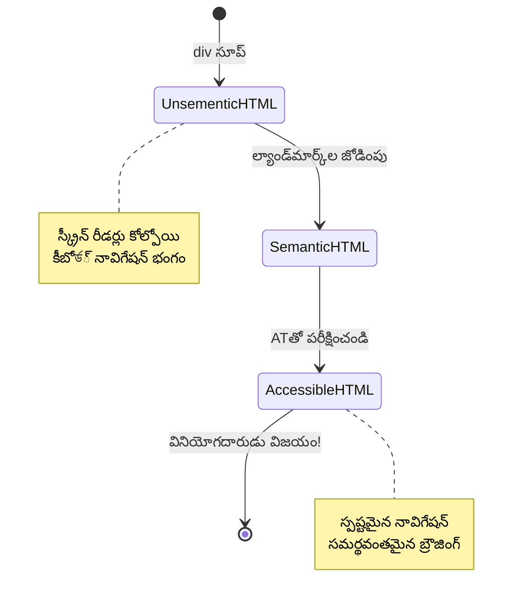
> **ప్రొ ఫలితం**: మంచి సేమాంటిక్ HTML తక్కువచేయకపోయిన యాక్సెసిబిలిటీ సమస్యలలో సుమారు 70% స్వయంచాలకంగా పరిష్కరిస్తుంది. ఈ మౌలికాన్ని నేర్చుకుని మీరు ముందుకు పోవు!

✅ **మీ సేమాంటిక్ నిర్మాణాన్ని ఆడిట్ చేయండి**: మీ బ్రౌజర్ DevTools లో యాక్సెసిబిలిటీ ప్యానెల్ ఉపయోగించి యాక్సెసిబిలిటీ ట్రి చూడండి మరియు మీ మార్కప్ తార్కిక నిర్మాణాన్ని సృష్టిస్తుందో లేదో నిర్ధారించండి.

### హెడ్డింగ్ హైయరార్కీ: లాజికల్ కంటెంట్ అవుట్‌లైన్ సృష్టించడం

హెడ్డింగులు యాక్సెసిబుల్ కంటెంట్ కోసం అత్యంత కీలకం—ఇవి అన్నీ కలిపి పట్టుకునే మథి లాంటివిగా ఉంటాయి. స్క్రీన్ రీడర్ వినియోగదారులు హెడ్డింగులను దృష్టిలగలిగే విధంగా మీ కంటెంట్ లో అర్థమయిన సారాంశాన్ని అందుకునేందుకు చాలా ఆధారపడుతారు. ఇది మీ పేజీకి కంటెంట్ సూచికని అందించడం లాంటిది.

**హెడ్డింగ్‌ల కోసం బంగారు నియమం:**
స్థాయిని ఎప్పుడూ తప్పక కొనసాగించండి. `<h1>` నుండి `<h2>`, ఆపై `<h3>` వంటివి. పాఠశాలలో మనం అవుట్‌లైన్లు చేయడం గుర్తు ఉంది కదా? అదే సూత్రీకరణ—మీరు "I. ముఖ్య బిందువు" నుంచి నేరుగా "C. ఉప-ఉప బిందువు"కి పొడవుగా దూకబోరు కదా?

**పర్పెక్ట్ హెడ్డింగ్ నిర్మాణ ఉదాహరణ:**

```html
<!-- ✅ Excellent: Logical, hierarchical progression -->
<main>
  <h1>Complete Guide to Web Accessibility</h1>
  
  <section>
    <h2>Understanding Screen Readers</h2>
    <p>Introduction to screen reader technology...</p>
    
    <h3>Popular Screen Reader Software</h3>
    <p>NVDA, JAWS, and VoiceOver comparison...</p>
    
    <h3>Testing with Screen Readers</h3>
    <p>Step-by-step testing instructions...</p>
  </section>
  
  <section>
    <h2>Color and Contrast Guidelines</h2>
    <p>Designing with sufficient contrast...</p>
    
    <h3>WCAG Contrast Requirements</h3>
    <p>Understanding the different contrast levels...</p>
    
    <h3>Testing Tools and Techniques</h3>
    <p>Tools for verifying contrast ratios...</p>
  </section>
</main>
```

```html
<!-- ❌ Problematic: Skipping levels, inconsistent structure -->
<h1>Page Title</h1>
<h3>Subsection</h3> <!-- Skipped h2 -->
<h2>This should come before h3</h2>
<h1>Another main heading?</h1> <!-- Multiple h1s -->
```

**హెడ్డింగ్ ఉత్తమ పద్ధతులు:**
- **ప్రతి పేజీకి ఒక `<h1>`**: సాధారణంగా ప్రధాన పేజీ శీర్షిక లేదా ప్రాథమిక కంటెంట్ హెడ్డింగ్
- **తార్కిక ప్రగతి**: స్థాయిలను ఎప్పుడూ తప్పక కొనసాగించండి (h1 → h2 → h3, h1 → h3 కాదు)
- **వివరణాత్మక కంటెంట్**: అలానే చదువుతున్నప్పుడు అర్థం వచ్చేలా హెడ్డింగులు ఉండాలి
- **CSS ద్వారా దృశ్య శైలీకరణ**: రూపానికి CSS ఉపయోగించండి, HTML స్థాయిలను నిర్మాణానికి వాడండి

**స్క్రీన్ రీడర్ నావిగేషన్ గణాంకాలు:**
- స్క్రీన్ రీడర్ వినియోగదారుల 68% హెడ్డింగుల ద్వారా నావిగేట్ చేస్తారు ([WebAIM Survey](https://webaim.org/projects/screenreadersurvey9/#finding))
- వినియోగదారులు లాజికల్ హెడ్డింగ్ అవుట్‌లైన్ ను ఆశిస్తారు
- హెడ్డింగులు పేజీ నిర్మాణాన్ని అర్థం చేసుకోవడంలో వేగవంతమైన మార్గం

> 💡 **ప్రొ సూచన**: "HeadingsMap" వంటి బ్రౌజర్ విస్తరణలను ఉపయోగించి మీ హెడ్డింగ్ నిర్మాణాన్ని దృశ్యమానంగా చూడండి. ఇది ఒక బాగా నిర్వహించిన విషయ సూచికలా చదవాలి.

✅ **మీ హెడ్డింగ్ నిర్మాణం పరీక్షించండి**: స్క్రీన్ రీడర్ హెడ్డింగ్ నావిగేషన్ (NVDAలో H కీ) ఉపయోగించి హెడ్డింగుల మధ్య జంప్ చేయండి. ప్రగతి మీ కంటెంట్ కథను తార్కికంగా చెపుతుందా?

### పురోగతిశీల విజువల్ యాక్సెసిబిలిటీ సాంకేతికాలు

కాంట్రాస్ట్ మరియు రంగు ప్రాథమికాల దాటి సాంకేతిక పద్ధతులు నిజంగా సమగ్ర విజువల్ అనుభవాలను సృష్టించడానికి సహాయపడతాయి. ఈ పద్ధతులు మీ కంటెంట్ వివిధ వీక్షణ షరతులకు మరియు సహాయక సాంకేతికాలకు అనుకూలంగా ఉంటాయి.

**అత్యవసర విజువల్ కమ్యూనికేషన్ వ్యూహాలు:**

- **బహుమాధ్యమిక స్పందన**: విజువల్, వాచ్య, మరియు పది సార్లు ఆడియో సూచనలను కలపండి
- **ప్రోగ్రెసివ్ డిస్క్లోజర్**: సమాచారాన్ని గమనించదగిన ముక్కలలో ఉంచండి
- **నిరంతర ఇంటరాక్షన్ మోడల్స్**: స్ఞాత UI కన్వెషన్స్ వాడండి
- **ప్రత్యుత్తరపు టైపోగ్రఫీ**: పరికరాల ఆధారంగా టెక్స్ట్ పరిమాణాన్ని సరిగ్గా సర్దుబాటు చేయండి
- **లోడింగ్ మరియు లోపపు స్థితులు**: అన్ని యూజర్ చర్యలకు స్పష్టమైన స్పందన ఇవ్వండి

**యాక్సెసిబిలిటీ కోసం CSS సదుపాయాలు:**

```css
/* Screen reader only text - visually hidden but accessible */
.sr-only {
  position: absolute;
  width: 1px;
  height: 1px;
  padding: 0;
  margin: -1px;
  overflow: hidden;
  clip: rect(0, 0, 0, 0);
  white-space: nowrap;
  border: 0;
}

/* Skip link for keyboard navigation */
.skip-link {
  position: absolute;
  top: -40px;
  left: 6px;
  background: #000000;
  color: #ffffff;
  padding: 8px 16px;
  text-decoration: none;
  border-radius: 4px;
  font-weight: bold;
  transition: top 0.3s ease;
  z-index: 1000;
}

.skip-link:focus {
  top: 6px;
}

/* Reduced motion respect */
@media (prefers-reduced-motion: reduce) {
  .skip-link {
    transition: none;
  }
  
  * {
    animation-duration: 0.01ms !important;
    animation-iteration-count: 1 !important;
    transition-duration: 0.01ms !important;
  }
}

/* High contrast mode support */
@media (prefers-contrast: high) {
  .button {
    border: 2px solid;
  }
}
```

> 🎯 **యాక్సెసిబిలిటీ నమూనా**: "skip link" కీబోర్డ్ వినియోగదారులకు తప్పనిసరిది. ఇది మీ పేజీలోని మొదటి ఫోకసబుల్ అంశం కావాలి మరియు నేరుగా ప్రధాన కంటెంట్ ప్రాంతానికి వెళ్లాలి.

✅ **స్కిప్ నావిగేషన్ అమలు చేయండి**: మీ పేజీలలో స్కిప్ లింకులను జోడించి పేజీ లోడ్ అయిన వెంటనే టాబ్ నొక్కి పరీక్షించండి. అవి కనిపించి మీకు ప్రధాన కంటెంట్ కి జంప్ చేయగలగాలి.

## అర్థవంతమైన లింక్ టెక్స్ట్ రూపొందించడం

లింకులు వెబ్ యొక్క రహదారులాగా ఉంటాయి, కానీ చెడ్డవిధంగా రాసిన లింక్ టెక్స్ట్ "Downtown Chicago" బదులు కేవలం "స్థలం" అనే రహదారుల సంకేతాలా ఉంటుంది. అంతగా సహాయకంగా లేదు కదా?

నేను మొదటిసారిగా తెలుసుకున్నప్పుడు ఇది నన్ను ఆశ్చర్యపరిచింది: స్క్రీన్ రీడర్లు పేజీ నుండి అన్ని లింకులను తీసుకుని ఒక పెద్ద జాబితాగా చూపగలవు. మీకు ఎవరో ఒకరు పేజీ上的 ప్రతి లింక్ యొక్క డైరెక్టరీని ఇచ్చినట్లు ఊహించండి. ఒక్కొక్కటి కూడా తమ సొంతంగా అర్థం చేసుకుంటుందా? అదే మీ లింక్ టెక్స్ట్ తీరుకు పరీక్ష.

### లింక్ నావిగేషన్ నమూనాలను అర్థం చేసుకోవడం

స్క్రీన్ రీడర్లు మంచి లింక్ టెక్స్ట్ ఆధారంగా శక్తివంతమైన లింక్ నావిగేషన్ ఫీచర్లను అందిస్తాయి:

**లింక్ నావిగేషన్ పద్ధతులు:**
- **క్రమంగా చదవడం**: కంటెంట్ ప్రవాహంలో భాగంగా లింకులు చదవబడతాయి
- **లింక్ జాబితా తయారీ**: అన్ని పేజీ లింకులు శోధించదగిన డైరెక్టరీగా సంకలితం అవుతాయి
- **త్వరిత నావిగేషన్**: కీబోర్డ్ షార్ట్‌కట్‌ల (NVDAలో K) ఉపయోగించి లింకుల మధ్య జంప్ చేయండి
- **శోధన ఫంక్షనాలిటీ**: భాగమైన టెక్స్ట్ టైపు చేసి నిర్దిష్ట లింకులను కనుగొనండి

**సందర్భం ఎందుకు ముఖ్యం:**
స్క్రీన్ రీడర్ వినియోగదారు లింక్ జాబితాను తయారు చేస్తే, వారు ఇలా చూస్తారు:
- "Download report"
- "Learn more"
- "Click here"
- "Privacy policy"
- "Click here"

ఈ లింకుల్లో కేవలం రెండు మాత్రమే సాందర్భంలో విరివిగా ఉపయోగకరమైన సూచనలు ఇస్తాయి!

> 📊 **వినియోగదారు ప్రభావం**: స్క్రీన్ రీడర్ వినియోగదారులు పేజీ కంటెంట్ త్వరగా అర్థం చేసుకోవడానికి లింకుల జాబితాలను స్కాన్ చేస్తారు. సాధారణ లింక్ టెక్స్ట్ వారిని ప్రతీ లింక్ సందర్భం వైపు తిరిగి నావిగేట్ చేయమంటుంది, ఇది వారి బ్రౌజింగ్ అనుభవాన్ని గణనీయంగా మల్లిచేస్తుంది.

### సాధారణ లింక్ టెక్స్ట్ పొరపాట్లు తప్పించడం

ఏమి పనిచోదో అర్థం చేసుకోవడం దేని పనిచేయదొ తెలుసుకోవడానికి సహాయపడుతుంది.

**❌ సాధారణ లింక్ టెక్స్ట్, కాన텍్ట్ ఇవ్వని:**

```html
<!-- Meaningless when read from a link list -->
<p>Our sustainability efforts are detailed in our recent report. 
   <a href="/sustainability-2024.pdf">Click here</a> to view it.</p>

<!-- Repeated generic text throughout the page -->
<div class="article-card">
  <h3>Web Accessibility Guide</h3>
  <p>Learn the fundamentals...</p>
  <a href="/accessibility-guide">Read more</a>
</div>
<div class="article-card">
  <h3>Color Contrast Tips</h3>
  <p>Improve your design...</p>
  <a href="/color-contrast">Read more</a>
</div>

<!-- URLs as link text (difficult for screen readers to announce) -->
<p>Visit https://www.w3.org/WAI/WCAG21/quickref/ for WCAG guidelines.</p>

<!-- Vague action words -->
<a href="/contact">Go</a> | <a href="/about">See</a> | <a href="/help">View</a>
```

**ఈ నమూనాలు ఎందుకు విఫలమవుతాయో:**
- **"Click here"** గమ్యస్థానం గురించి వినియోగదారులకు ఏమీ చెప్పదు
- **"Read more"** ను చాలా సార్లు పునరావృతం చేయడం గందరగోళాన్ని కలిగిస్తుంది
- **రా URLలు** స్క్రీన్ రీడర్లకు స్పష్టంగా ఉచ్చరించడం కష్టమవుతుంది
- **ఒకే పదాలు** "Go" లేదా "See" వంటివి వివరణాత్మక కాన్టెక్ట్ లేకుండా ఉంటాయి

### మంచి లింక్ టెక్స్ట్ రాయడం

వివరణాత్మక లింక్ టెక్స్ట్ అందరికీ లాభదాయకం—కంటపడే వినియోగదారులు లింకులను వేగంగా స్కాన్ చేస్తారు, స్క్రీన్ రీడర్ వినియోగదారులు గమ్యస్థానాలు క్లుప్తంగా అర్థం చేసుకుంటారు.

**✅ స్పష్టమైన, వివరణాత్మక లింక్ టెక్స్ట్ ఉదాహరణలు:**

```html
<!-- Descriptive text that explains the destination -->
<p>Our comprehensive <a href="/sustainability-2024.pdf">2024 sustainability report (PDF, 2.1MB)</a> details our environmental initiatives.</p>

<!-- Specific, unique link text for each card -->
<div class="article-card">
  <h3>Web Accessibility Guide</h3>
  <p>Learn the fundamentals of inclusive design...</p>
  <a href="/accessibility-guide">Read our complete web accessibility guide</a>
</div>
<div class="article-card">
  <h3>Color Contrast Tips</h3>
  <p>Improve your design with better color choices...</p>
  <a href="/color-contrast">Explore color contrast best practices</a>
</div>

<!-- Meaningful text instead of raw URLs -->
<p>The <a href="https://www.w3.org/WAI/WCAG21/quickref/">WCAG 2.1 Quick Reference guide</a> provides comprehensive accessibility guidelines.</p>

<!-- Descriptive action links -->
<a href="/contact">Contact our support team</a> | 
<a href="/about">About our company</a> | 
<a href="/help">Get help with your account</a>
```

**లింక్ టెక్స్ట్ ఉత్తమ పద్ధతులు:**
- **ప్రత్యక్షంగా ఉండండి**: "త్రైమాసిక ఆర్థిక నివేదిక డౌన్‌లోడ్ చేయండి" వర్సెస్ "డౌన్‌లోడ్ చేయండి"
- **ఫైల్ రకం మరియు పరిమాణాన్ని చేర్చండి**: డౌన్‌లోడ్ లింకులకు "(PDF, 1.2MB)"
- **లింకులు బహిర్గతంగా తెరవడం సూచించండి**: అవసరమైతే "(కొత్త విండోలో తెరవబడుతుంది)"
- **సജീവ భాష వినియోగించండి**: "మమ్మల్ని సంప్రదించండి" వర్సెస్ "కాంటాక్ట్ పేజీ"
- **సంక్షిప్తంగా ఉంచండి**: సాధ్యమైతే 2-8 పదాల మధ్యకు లక్ష్యం ఉంచండి

### ఆధునిక లింక్ యాక్సెసిబిలిటీ నమూనాలు

ఎప్పుడో విజువల్ డిజైన్ పరిమితులు లేదా సాంకేతిక అవసరాలు ప్రత్యేక పరిష్కారాలను కోరుతాయి. ఇక్కడ సాధారణ సవాళ్ళు కోసం కించిత సాంకేతిక పద్ధతులు ఉన్నాయి:

**పారదర్శకత కోసం ARIA ఉపయోగించడం:**

```html
<!-- When button text must be short but needs more context -->
<a href="/report.pdf" 
   aria-label="Download 2024 annual financial report, PDF format, 2.3MB">
  Download Report
</a>

<!-- When the full context comes from surrounding content -->
<h3 id="sustainability-heading">Sustainability Initiative</h3>
<p>Our efforts to reduce environmental impact...</p>
<a href="/sustainability-details" 
   aria-labelledby="sustainability-heading"
   aria-describedby="sustainability-summary">
  Learn more
</a>
<p id="sustainability-summary">Detailed breakdown of our 2024 environmental goals and achievements</p>
```

**ఫైల్ రకాలు మరియు బాహ్య గమ్యస్థానాలు సూచించటం:**

```html
<!-- Method 1: Include information in visible link text -->
<a href="/annual-report.pdf">
  Download our 2024 annual report (PDF, 2.3MB)
</a>

<!-- Method 2: Use screen reader-only text for file details -->
<a href="/annual-report.pdf">
  Download our 2024 annual report
  <span class="sr-only">(PDF format, 2.3MB)</span>
</a>

<!-- Method 3: External link indication -->
<a href="https://example.com" 
   target="_blank" 
   aria-describedby="external-link-warning">
  Visit external resource
</a>
<span id="external-link-warning" class="sr-only">
  (opens in new window)
</span>

<!-- Method 4: Using CSS for visual indicators -->
<a href="https://example.com" class="external-link">
  External resource
</a>
```

```css
/* Visual indicator for external links */
.external-link::after {
  content: " ↗";
  font-size: 0.8em;
  color: #666;
}

/* Screen reader announcement for external links */
.external-link::before {
  content: "External link: ";
  position: absolute;
  left: -10000px;
  width: 1px;
  height: 1px;
  overflow: hidden;
}
```

> ⚠️ **ముఖ్యం**: `target="_blank"` ఉపయోగించే సమయంలో లింక్ కొత్త విండో లేదా టాబ్‌లో తెరుచుకుంటుందని వినియోగదారులకు ఎప్పుడూ తెలియజేయాలి. అనూహ్య మార్పులు అసహజంగా అనిపించవచ్చు.

✅ **మీ లింక్ సందర్భాన్ని పరీక్షించండి**: మీ బ్రౌజర్ డెవలపర్ టూల్స్ ద్వారా పేజీ上的 అన్ని లింకుల జాబితా సృష్టించి ప్రతి లింక్ ఉద్దేశాన్ని సంబంధిత సందర్భం లేకుండా అర్థం చేసుకోగలరా అని చూడండి.

## ARIA: HTML యాక్సెసిబిలిటీలో శక్తివంతమైన సహాయం

[Accessible Rich Internet Applications (ARIA)](https://developer.mozilla.org/docs/Web/Accessibility/ARIA) అనేది మీ క్లిష్టమైన వెబ్ అప్లికేషన్లు మరియు సహాయక సాంకేతికతల మధ్య విశ్వవ్యాప్త అనువాదకమవుతుంది. HTML ఒంటరిగా అన్ని ఇంటరాక్షన్లను పలకలేకపోతే, ARIA ఆ గ్యాప్‌లను నింపుతుందని అనుకోండి.

నేను ARIAని మీ HTMLకి సహాయక వ్యాఖ్యానాలు వేసేలా భావిస్తున్నాను—కళాకారులు తమ పాత్రలు మరియు సంబంధాలను అర్థం చేసుకోడానికి నాటకం స్క్రిప్ట్‌లో ఉన్న స్టేజ్ దిశానిర్దేశికల మాదిరిగా.

**ARIA గురించి అత్యంత ముఖ్యమైన నియమం ఉంది**: ఎప్పుడూ ముందుగా సేమాంటిక్ HTML ఉపయోగించండి, తరువాత దానిని మెరుగుపరచడానికి ARIA ని జోడించండి. ARIA ఒక కలిపే మసాలా లాంటిది, ప్రధాన వంటకం కాదు. ఇది మీ HTML నిర్మాణాన్ని స్పష్టతకు మరియు మెరుగుదలకు మాత్రమే ఉపయోగించాలి, దాన్ని మార్చాలి కాదు. ఆ మౌలికాన్ని ముందుగా సక్రమంగా సిద్ధం చేయండి!

### వ్యూహాత్మక ARIA అమలు

ARIA శక్తివంతమైనది, కానీ శక్తితో బాధ్యత వస్తుంది. తప్పు ARIA వాడకం యాక్సెసిబిలిటీని మరింత చెడగొట్టవచ్చు. ఇది ఎవరు, ఎప్పుడు మరియు ఎలా వాడాలో తెలుసుకుందాం:

**✅ ARIA వాడండి:**
- కస్టమ్ ఇంటరాక్టివ్ విడ్జిట్లు సృష్టిస్తున్నప్పుడు (అకార్డియన్లు, ట్యాబ్లు, కరోసెల్లు)
- పేజీ రీ లోడ్ లేకుండా మారుతున్న డైనమిక్ కంటెంట్ నిర్మాణంలో
- సంక్లిష్ట UI సంబంధాలకు అదనపు సందర్భాన్ని అందిస్తున్నప్పుడు
- లోడింగ్ స్థితులు లేదా ప్రత్యక్ష కంటెంట్ నవీకరణలు సూచించినప్పుడు
- కస్టమ్ నియંત્રణలతో యాప్-లాగా ఇంటరాఫేసులు సృష్టించినప్పుడు

**❌ ARIAని దూరంగా ఉంచండి:**
- ప్రామాణిక HTML మూలకాలు ఇప్పటికే అవసరమైన సేమాంటిక్స్ ఇస్తుంటే
- దాని సరిగా అమలుకు నిర్ధారకంగా లేనప్పుడు
- సేమాంటిక్ HTML ఇప్పటికే ఇస్తున్న సమాచారాన్ని పునరావృతం చేస్తే
- నిజమైన సహాయక సాంకేతికతలతో పరీక్షించకపోతే

> 🎯 **ARIA బంగారు నియమం**: "అవసరం లేనప్పుడల్లా సేమాంటిక్స్ మార్చవద్దు, ఎప్పుడూ కీబోర్డ్ యాక్సెసిబిలిటీని నిర్ధారించు, మరియు నిజమైన సహాయక సాంకేతికాలతో పరీక్షించు."
**ARIA యొక్క ఐదు వర్గాలు:**

1. **పాత్రలు**: ఇది ఏమిటి? (`button`, `tab`, `dialog`)
2. **గుణాలు**: దీని లక్షణాలు ఏమిటి? (`aria-required`, `aria-haspopup`)
3. **స్థితులు**: దాని ప్రస్తుత పరిస్థితి ఏమిటి? (`aria-expanded`, `aria-checked`)
4. **భూసమానం సూచికలు**: పేజీ నిర్మాణంలో ఇది ఎక్కడ ఉంది? (`banner`, `navigation`, `main`)
5. **లైవ్ ప్రాంతాలు**: మార్పులను ఎలా ప్రకటించాలి? (`aria-live`, `aria-atomic`)

### ఆధునిక వెబ్ అనువర్తనాల కోసం తప్పనిసరి ARIA నమూనాలు

ఈ నమూనాలు ఇంటరాక్టివ్ వెబ్ అప్లికేషన్లలో సాధారణ అనుకూలత సవాళ్లను పరిష్కరిస్తాయి:

**పాత్రలను పేరుపెట్టడం మరియు వివరించడం:**

```html
<!-- aria-label: Provides accessible name when visible text isn't sufficient -->
<button aria-label="Close newsletter subscription dialog">×</button>

<!-- aria-labelledby: References existing text as the accessible name -->
<section aria-labelledby="news-heading">
  <h2 id="news-heading">Latest News</h2>
  <!-- news content -->
</section>

<!-- aria-describedby: Links to additional descriptive text -->
<input type="password" 
       aria-describedby="pwd-requirements pwd-strength"
       required>
<div id="pwd-requirements">
  Password must contain at least 8 characters, including uppercase, lowercase, and numbers.
</div>
<div id="pwd-strength" aria-live="polite">
  <!-- Dynamic password strength indicator -->
</div>
```

**డైనమిక్ కంటెంట్ కోసం లైవ్ ప్రాంతాలు:**

```html
<!-- Polite announcements (don't interrupt current speech) -->
<div aria-live="polite" id="status-updates">
  <!-- Status messages appear here -->
</div>

<!-- Assertive announcements (interrupt and announce immediately) -->
<div aria-live="assertive" id="urgent-alerts">
  <!-- Error messages and critical alerts -->
</div>

<!-- Loading states with live regions -->
<button id="submit-btn" aria-describedby="loading-status">
  Submit Application
</button>
<div id="loading-status" aria-live="polite" aria-atomic="true">
  <!-- "Processing your application..." appears here -->
</div>
```

**ఇంటరాక్టివ్ విడ్జెట్ ఉదాహరణ (యాకార్డియన్):**

```html
<div class="accordion">
  <h3>
    <button aria-expanded="false" 
            aria-controls="panel-1" 
            id="accordion-trigger-1"
            class="accordion-trigger">
      Accessibility Guidelines
    </button>
  </h3>
  <div id="panel-1" 
       role="region"
       aria-labelledby="accordion-trigger-1" 
       hidden>
    <p>WCAG 2.1 provides comprehensive guidelines...</p>
  </div>
</div>
```

```javascript
// అకార్డియన్ స్థితిని నిర్వహించడానికి జావాస్క్రిప్ట్
function toggleAccordion(trigger) {
  const panel = document.getElementById(trigger.getAttribute('aria-controls'));
  const isExpanded = trigger.getAttribute('aria-expanded') === 'true';
  
  // స్థితులను టోగల్ చేయండి
  trigger.setAttribute('aria-expanded', !isExpanded);
  panel.hidden = isExpanded;
  
  // స్క్రీన్ రీడర్స్‌కు మార్పును ప్రకటన చేయండి
  const status = document.getElementById('status-updates');
  status.textContent = isExpanded ? 'Section collapsed' : 'Section expanded';
}
```

### ARIA నిర్వాహకం ఉత్తమ పద్ధతులు

ARIA శక్తివంతమైనది కానీ జాగ్రత్తగా అమలు చేయాలి. ఈ మార్గదర్శకాలు ఉపయోగించడం ద్వారా మీ ARIA అనుకూలతను మెరుగుపరుస్తుంది:

**🛡️ మౌలిక సూత్రాలు:**

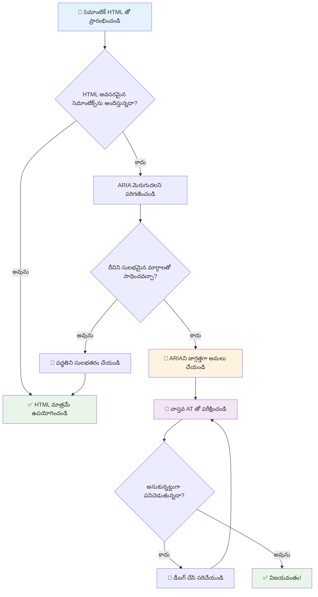
1. **సెమాంటిక్ HTML మొదట**: `<div role="button">` కంటే ఎప్పుడైతే `<button>` ఉపయోగించండి
2. **సెమాంటిక్స్ గైద్యం చేయొద్దు**: ఉన్న HTML అర్థాన్ని మళ్లీ నిర్వచించకండి (`<h1 role="button">` వంటివి తప్పించండి)
3. **కీబోర్డ్ అనుకూలతను కాపాడు**: అన్ని ఇంటరాక్టివ్ ARIA భాగాలు పూర్తిగా కీబోర్డ్ అనుకూలంగా ఉండాలి
4. **నిజమైన వినియోగదారులతో పరీక్షించండి**: సహాయక సాంకేతికతల మధ్య ARIA మద్దతు విభిన్నంగా ఉంటుంది
5. **సరళంగా మొదలు పెట్టండి**: క్లిష్ట ARIA అమలు తప్పిదాలు ఎక్కువగా ఉండే అవకాశం ఉంది

**🔍 పరీక్షా పనిముట్లు:**

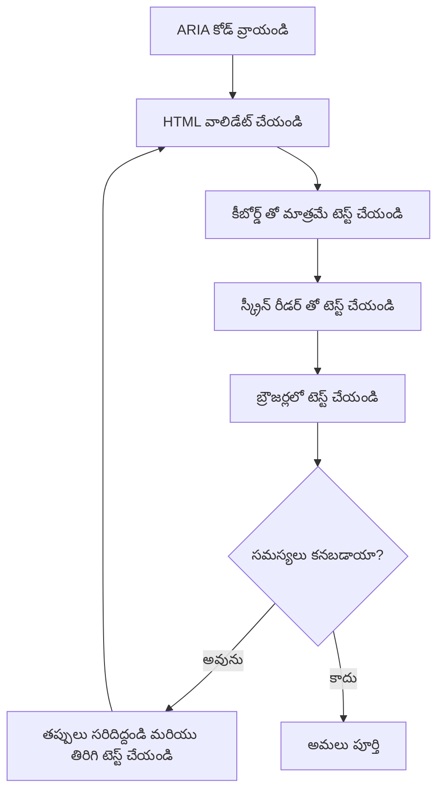
**🚫 తప్ప రాకూడని సాధారణ ARIA పొరపాట్లు:**

- **ఎదురు పడ్డ సమాచారం**: HTML సెమాంటిక్స్ కు వ్యతిరేకంగా ఉండవద్దు
- **అతిగా లేబుల్ చేయడం**: ఎక్కువ ARIA సమాచారం వినియోగదారులను ఆవర్తిస్తుంది
- **స్థిర ARIA**: కంటెంట్ మార్చినపుడు ARIA స్థితులను నవీకరించకపోవడం
- **పరీక్షించని అమలు**: సిద్దాంతంలో పని చేస్తున్న ARIA, కానీ ప్రాక్టీస్ లో పని చేయటం లేదు
- **కీబోర్డ్ మద్దతు లేకపోవడం**: సంబంధిత కీబోర్డ్ ప్రవర్తనలేని ARIA పాత్రలు

> 💡 **పరీక్షా వనరులు**: ఆటోమేటెడ్ ARIA ధృవీకరణ కోసం [accessibility-checker](https://www.npmjs.com/package/accessibility-checker) వంటి టూల్స్ ఉపయోగించండి, కానీ పూర్తి అనుభవం కోసం ఎప్పుడూ పర్యవేక్షణపరిగణించే స్క్రీన్ రీడర్లతో పరీక్షించండి.

### 🎭 **ARIA నైపుణ్య పరీక్ష: క్లిష్ట ఇంటరాక్షన్లకు సిద్ధమో?**

**మీ ARIA విశ్వాసాన్ని కొలవండి:**
- సెమాంటిక్ HTML కంటే ఎప్పుడు ARIA ఎంచుకుంటారు? (సూచన: చాలా గొప్పగా కాదు!)
- `<div role="button">` సాధారణంగా `<button>` కంటే ఎందుకు చెడు అనేది వివరణ ఇవ్వగలరా?
- ARIA పరీక్ష గురించి గుర్తు పెట్టుకోవలసిన అత్యంత ముఖ్యమైన విషయం ఏమిటి?

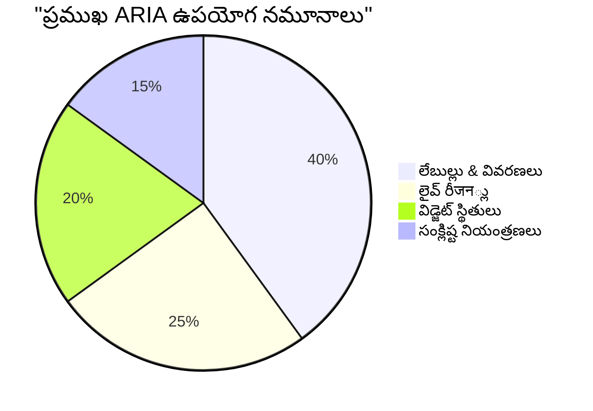
> **ప్రధాన అవగాహన**: ARIA ఉపయోగం ఎక్కువగా లేబులింగ్ మరియు పాత్రలను వివరించడానికి ఉంటుంది. క్లిష్ట విడ్జెట్ నమూనాలు మీరు గمانించిన కన్నా చాలా తక్కువగా ఉంటాయి!

✅ **నిపుణుల ఇన్సైట్స్ పొందండి**: క్లిష్ట ఇంటరాక్టివ్ విడ్జెట్‌లకు యుద్ధ పరీక్షించిన నమూనాలు మరియు అమలుల కొరకు [ARIA Authoring Practices Guide](https://w3c.github.io/aria-practices/) ను అధ్యయనం చేయండి.

## చిత్రాలు మరియు మీడియా అనుకూలత

దృష్టి మరియు శ్రవణ కంటెంట్ ఆధునిక వెబ్ అనుభవాలకు ముఖ్యమైన భాగాలు, కానీ అవి జాగ్రత్తగా అమలు చేయనిదే అడ్డంకులు సృష్టించగలవు. లక్ష్యం మీ మీడియా సమాచారం మరియు భావోద్వేగ ప్రభావం ప్రతి వినియోగదారికి చేరేలా చేయడం. ఒకసారి మీరు దీన్ని నేర్చుకోవడం ప్రారంభిస్తే, అది రెండవ స్వభావంగా మారుతుంది.

భిన్న రకాల మీడియాకు భిన్న అనుకూలత విధానాలు అవసరం. ఇది వంటలా: సున్నితమైన చేపను మీరు గట్టి మాంసంతో ఒకే విధంగా చికాకు చేయరు. ఈ భేదాలను అర్థం చేసుకోవడం ద్వారా మీరు ప్రతి పరిస్థితికి సరైన పరిష్కారాన్ని ఎంచుకుంటారు.

### వ్యూహాత్మక చిత్ర అనుకూలత

మీ వెబ్‌సైట్ లో ప్రతి చిత్రం ఒక ప్రయోజనాన్ని కలిగి ఉంటుంది. ఆ ప్రయోజనాన్ని అర్థం చేసుకోవడం వల్ల మీరు ఉత్తమ ప్రత్యామ్నాయ వచనం రాయగలరు మరియు మరింత సమగ్ర అనుభవాలను సృష్టించగలరు.

**నాలుగు రకాల చిత్రాలు మరియు వాటి alt వచనం వ్యూహాలు:**

**సూచనాత్మక చిత్రాలు** - ముఖ్య సమాచారం ఇవ్వడం:
```html

```

**అలంకరణాత్మక చిత్రాలు** - కేవలం దృష్టి కోసం, సమాచార విలువ లేకపోయినవి:
```html

```

**కార్యగత చిత్రాలు** - బటన్ లేదా నియంత్రణలుగా పనిచేసే చిత్రాలు:
```html
<button>
  
</button>
```

**సంక్లిష్ట చిత్రాలు** - ఛార్టులు, డయాగ్రామ్లు, ఇన్‌ఫోగ్రాఫిక్స్:
```html

<div id="chart-description">
  <p>Detailed description: Sales data shows a steady increase across all quarters...</p>
</div>
```

### వీడియో మరియు ఆడియో అనుకూలత

**వీడియో అవసరాలు:**
- **కెప్టన్లు**: మౌఖిక కంటెంట్ మరియు శబ్ద ప్రభావాల వచన రూపం
- **ఆడియో వివరణలు**: అంధులకు దృష్టి అంశాల వివరణ
- **ట్రాన్స్క్రిప్ట్లు**: అన్ని ఆడియో మరియు విజువల్ కంటెంట్ పూర్తి వచనం

```html
<video controls>
  <source src="video.mp4" type="video/mp4">
  <track kind="captions" src="captions.vtt" srclang="en" label="English">
  <track kind="descriptions" src="descriptions.vtt" srclang="en" label="Audio descriptions">
</video>
```

**ఆడియో అవసరాలు:**
- **ట్రాన్స్క్రిప్ట్లు**: అన్ని మౌఖిక కంటెంట్ టెక్స్ట్ రూపం
- **విజువల్ సూచనలు**: కేవలం ఆడియో కంటెంట్ కోసం దృష్టి సూచనలు అందించండి

### ఆధునిక చిత్రం సాంకేతికతలు

**అలంకరణాత్మక చిత్రాలకు CSS ఉపయోగించడం:**
```css
.hero-section {
  background-image: url('decorative-hero.jpg');
  /* Decorative images in CSS don't need alt text */
}
```

**అనుకూల అనవర్తనాత్మక చిత్రాలు:**
```html
<picture>
  <source media="(min-width: 800px)" srcset="large-chart.png">
  <source media="(min-width: 400px)" srcset="medium-chart.png">
  
</picture>
```

✅ **చిత్ర అనుకూలతను పరీక్షించండి**: స్క్రీన్ రీడర్ ఉపయోగించి చిత్రాలతో పేజీ నావిగేట్ చేయండి. విషయాన్ని అర్థం చేసుకోవడానికి సరిపడా సమాచారం వస్తుందా?

## కీబోర్డ్ నావిగేషన్ మరియు ఫోకస్ నిర్వహణ

చాలా మంది వినియోగదారులు కీబోర్డ్ ద్వారా మాత్రమే వెబ్ నావిగేట్ చేస్తారు. ఇందులో మోటార్ లోపం ఉన్నవారు, కీబోర్డ్ మౌస్ కంటే త్వరగా ఉందని భావించే పవర్ యూజర్లు, మరియు వారి మౌస్ పనిచేయకపోయిన వారు ఉన్నారు. మీ సైట్ కీబోర్డ్ ఇన్పుట్ తో బాగా పని చేయడం తప్పనిసరి, ఇది అందరికీ మరింత సమర్ధవంతంగా మారుస్తుంది.

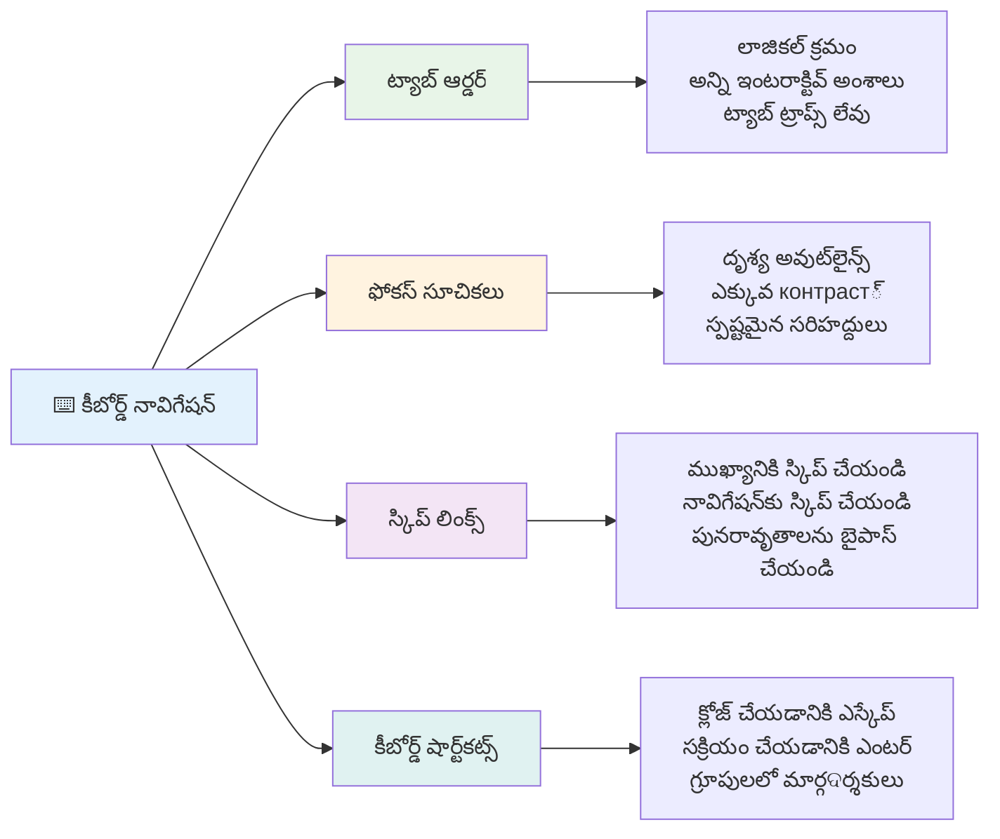
### అవసరమైన కీబోర్డ్ నావిగేషన్ నమూనాలు

**సాధారణ కీబోర్డ్ ఇంటరాక్షన్లు:**
- **Tab**: ఇంటరాక్టివ్ పదార్థాల మీద ఫోకస్ ముందుకు తరలించండి
- **Shift + Tab**: ఫోకస్ను వెనుకకు తరలించండి
- **Enter**: బటన్లు మరియు లింకులను సక్రియం చేయండి
- **Space**: బటన్లు, చెక్ బాక్స్‌లు సక్రియం చేయండి
- **Arrow keys**: కాంపోనెంట్ గ్రూపుల లో నావిగేట్ చేయండి (రేడియో బటన్లు, మెనూలు)
- **Escape**: మోడల్స్, డ్రాప్‌డౌన్‌లు మూసివేయండి, లేదా ఆపరేషన్ రద్దు చేయండి

### ఫోకస్ నిర్వహణ ఉత్తమ పద్ధతులు

**దృష్టిగత ఫోకస్ సూచికలు:**
```css
/* Ensure focus is always visible */
button:focus-visible {
  outline: 2px solid #4A90A4;
  outline-offset: 2px;
}

/* Custom focus styles for different components */
.card:focus-within {
  box-shadow: 0 0 0 3px rgba(74, 144, 164, 0.5);
}
```

**సక్రమ నావిగేషన్ కోసం స్కిప్ లింకులు:**
```html
<a href="#main-content" class="skip-link">Skip to main content</a>
<a href="#navigation" class="skip-link">Skip to navigation</a>

<nav id="navigation">
  <!-- navigation content -->
</nav>
<main id="main-content">
  <!-- main content -->
</main>
```

**సరైన ట్యాబ్ క్రమం:**
```html
<!-- Use semantic HTML for natural tab order -->
<form>
  <label for="name">Name:</label>
  <input type="text" id="name" tabindex="0">
  
  <label for="email">Email:</label>
  <input type="email" id="email" tabindex="0">
  
  <button type="submit" tabindex="0">Submit</button>
</form>
```

### మోడల్స్‌లో ఫోకస్ ట్రాప్పింగ్

మోడల్ డైలాగ్‌లు తెరిచే సేపు ఫోకస్ మోడల్ లోపలే ఉండాలి:

```javascript
// ఆధునిక ఫోకస్ ట్రాప్ అమలు
function trapFocus(element) {
  const focusableElements = element.querySelectorAll(
    'button, [href], input, select, textarea, [tabindex]:not([tabindex="-1"])'
  );
  
  const firstElement = focusableElements[0];
  const lastElement = focusableElements[focusableElements.length - 1];

  element.addEventListener('keydown', (e) => {
    if (e.key === 'Tab') {
      if (e.shiftKey && document.activeElement === firstElement) {
        e.preventDefault();
        lastElement.focus();
      } else if (!e.shiftKey && document.activeElement === lastElement) {
        e.preventDefault();
        firstElement.focus();
      }
    }
    
    if (e.key === 'Escape') {
      closeModal();
    }
  });
  
  // మోడల్ తెరవുമ്പോള് మొదటి అంశం పై ఫోకస్ పెట్టండి
  firstElement.focus();
}
```

✅ **కీబోర్డ్ నావిగేషన్‌ను పరీక్షించండి**: కేవలం Tab కీ ఉపయోగించి మీ వెబ్‌సైట్ నావిగేట్ చేయండి. అన్ని ఇంటరాక్టివ్ అంగాలు చేరగలరా? ఫోకస్ క్రమం తార్కికమా? ఫోకస్ సూచికలు స్పష్టంగా కనిపిస్తున్నాయా?

## ఫారమ్ అనుకూలత

ఫారమ్‌లు వినియోగదారు ఇంటరాక్షన్‌కు ముఖ్యమైనవి, వాటికి ప్రత్యేక అనుకూలత శ్రద్ధ అవసరం.

### లేబుల్ మరియు ఫారమ్ కంట్రోల్ అసోసియేషన్

**ప్రతి ఫారమ్ నియంత్రణకు లేబుల్ అవసరం:**
```html
<!-- Explicit labeling (preferred) -->
<label for="username">Username:</label>
<input type="text" id="username" name="username" required>

<!-- Implicit labeling -->
<label>
  Password:
  <input type="password" name="password" required>
</label>

<!-- Using aria-label when visual label isn't desired -->
<input type="search" aria-label="Search products" placeholder="Search...">
```

### పొరపాట్ల నిర్వహణ మరియు ధ్రువీకరణ

**అనుకూల పొరపాటి సందేశాలు:**
```html
<label for="email">Email Address:</label>
<input type="email" id="email" name="email" 
       aria-describedby="email-error" 
       aria-invalid="true" required>
<div id="email-error" role="alert">
  Please enter a valid email address
</div>
```

**ఫారమ్ ధ్రువీకరణ ఉత్తమ పద్ధతులు:**
- చెల్లని ఫీల్డ్లను సూచించడానికి `aria-invalid` ఉపయోగించండి
- స్పష్టమైన, నిర్దిష్ట పొరపాటు సందేశాలు ఇవ్వండి
- ముఖ్య పొరపాటు ప్రకటనలకు `role="alert"` ఉపయోగించండి
- పొరపాట్లు వెంటనే మరియు ఫారమ్ సమర్పణ సమయంలో చూపించండి

### ఫీల్డ్‌సెట్స్ మరియు సమూహీకరణ

**సంబంధిత ఫారమ్ నియంత్రణలను సమూహీకరించండి:**
```html
<fieldset>
  <legend>Shipping Address</legend>
  <label for="street">Street Address:</label>
  <input type="text" id="street" name="street">
  
  <label for="city">City:</label>
  <input type="text" id="city" name="city">
</fieldset>

<fieldset>
  <legend>Preferred Contact Method</legend>
  <input type="radio" id="contact-email" name="contact" value="email">
  <label for="contact-email">Email</label>
  
  <input type="radio" id="contact-phone" name="contact" value="phone">
  <label for="contact-phone">Phone</label>
</fieldset>
```

## మీ అనుకూలత ప్రయాణం: ముఖ్యమైన విశ్లేషణలు

అభినందనలు! మీరు నిజంగా సమగ్ర వెబ్ అనుభవాలను సృష్టించడానికి అవసరమైన పునాదిని పొందారు. ఇది చాలా ఉత్సాహపూర్వక విషయం! వెబ్ అనుకూలత కేవలం కంప్లయిన్స్ బాక్స్‌లను గమనించడం కాదు—ఇది ప్రజలు డిజిటల్ కంటెంట్‌తో ఎలా పరస్పరం చేస్తున్నారో అర్థం చేసుకోవడం మరియు ఆ అద్భుతమైన సంక్లిష్టత కోసం డిజైన్ చేయడమే.

మీరు ఇప్పుడు గొప్ప డిజైన్ ప్రతి ఒక్కరికీ పని చేస్తుందని అర్థం చేసుకునే అభివృద్ధి సమూహంలో భాగమయ్యారు. స్వాగతం!

**🎯 మీ అనుకూలత పనిముట్లలో ఇప్పుడు ఉన్నవి:**

| కోర్ సూత్రం | అమలు | ప్రభావం |
|----------------|----------------|---------|
| **సెమాంటిక్ HTML పునాది** | తమ ఉద్దేశిత ప్రయోజనానికి సరైన HTML అంశాలు ఉపయోగించండి | స్క్రీన్ రీడర్లు సమర్థంగా నావిగేట్ చేయగలవు, కీబోర్డులు స్వతంత్రంగా పనిచేస్తాయి |
| **సమగ్ర దృశ్య డిజైన్** | సరిపడిన వ్యత్యాసం, అర్థవంతమైన రంగుల వినియోగం, కనిపించే ఫోకస్ సూచికలు | ఏ దృష్టి పరిస్థితిలోనైనా అందరికీ స్పష్టం |
| **వివరణాత్మక కంటెంట్** | అర్థవంతమైన లింక్ వచనం, alt వచనం, శీర్షికలు | వినియోగదారులు దృశ్య సందర్భం లేకుండా కంటెంట్ అర్థం చేసుకుంటారు |
| **కీబోర్డ్ అనుకూలత** | ట్యాబ్ క్రమం, కీబోర్డ్ షార్ట్‌కట్స్, ఫోకస్ నిర్వహణ | మోటార్ అనుకూలత మరియు పవర్ యూజర్ సమర్ధత |
| **ARIA మెరుగుదల** | సెమాంటిక్ ఖాళీలను పూరించే వ్యూహాత్మక ఉపయోగం | క్లిష్ట అప్లికేషన్లు సహాయక సాంకేతికతల తో పని చేస్తాయి |
| **సంపూర్ణ పరీక్ష** | ఆటోమేటెడ్ టూల్స్ + మాన్యువల్ ధ్రువీకరణ + నిజమైన ఉపయోగదారుల పరీక్ష | వినియోగదారులపై ప్రభావితం కాబోయే సమస్యలను ముందుగానే గుర్తించండి |

**🚀 మీ తదుపరి దశలు:**

1. **పరీక్షని మీ వర్క్‌ఫ్లోలో నిర్మించండి**: పరీక్షను మీ అభివృద్ధి ప్రక్రియలో సహజ భాగంగా మార్చండి
2. **నిజమైన వినియోగదారుల నుంచి నేర్చుకోండి**: సహాయక సాంకేతికతలు ఉపయోగించే వ్యక్తుల నుండి అభిప్రాయాలను కోరండి
3. **ప్రస్తుతానికి అనుగుణంగా ఉండండి**: కొత్త సాంకేతికతలు మరియు ప్రమాణాలతో అనుకూలత పద్ధతులు అభివృద్ధి చెందుతాయి
4. **సామాన్యకత్వం కొరకు ప్రచారం చేయండి**: మీ జ్ఞానం పంచుకొని అనుకూలతను జట్టు ప్రాధాన్యంగా మార్చండి

> 💡 **గుర్తుంచుకోండి**: అనుకూలతతో ఉన్న పరిమితులు నూతన, సుస్థిరమైన పరిష్కారాలకు దారి తీస్తాయి, ఇవి అందరికీ లాభాలు కలిగిస్తాయి. కర్బ్ కట్స్, కెప్టన్లు, వాయిస్ కంట్రోల్స్ మొదలు అన్నీ మొదట అనుకూలత లక్షణాలు కాగా ఇప్పుడు సర్వత్రా మెరుగుదల.

**బిజినెస్ కేసు స్పష్టంగా ఉంది**: అనుకూల వెబ్‌సైట్లు ఎక్కువ వినియోగదారులను చేరుకుంటాయి, సెర్చ్ ఇంజిన్లలో మంచి ర్యాంక్ పొందుతాయి, తక్కువ నిర్వహణ ఖర్చులు ఉంటాయి, మరియు చట్టపరమైన ప్రమాదాలను తప్పించుకుంటాయి. కానీ నిజానికి? అనుకూలతకు సంబంధించిన అసలు కారణం చాలా లోతైనది. అనుకూల వెబ్‌సైట్లు వెబ్ యొక్క ఉత్తమ విలువలను ప్రతిబింబిస్తాయి— ఓపెనెనస్, సమగ్రత, మరియు ప్రతి ఒక్కరికీ సమాన సమాచారం అందించాలనే భావం.

మీరు ఇప్పుడు రాబోయే inclusive వెబ్ ని నిర్మించడానికి సన్నద్ధులు. మీరు సృష్టించే ప్రతి అనుకూల సైట్ ఇంటర్నెట్ ను అందరికి మరింత ఆతిథ్యంగా మారుస్తుంది. ఇది నిజంగా అద్భుతం!

## అదనపు వనరులు

ఈ కీలక వనరులతో మీ అనుకూలత నేర్చుకోవడం కొనసాగించండి:

**📚 అధికారిక ప్రమాణాలు మరియు మార్గదర్శకాలు:**
- [WCAG 2.1 మార్గదర్శకాలు](https://www.w3.org/WAI/WCAG21/quickref/) - అధికారిక అనుకూలత ప్రమాణం మరియు త్వరిత సూచిక
- [ARIA Authoring Practices Guide](https://w3c.github.io/aria-practices/) - ఇంటరాక్టివ్ విడ్జెట్‌లకు సమగ్ర నమూనాలు
- [WebAIM మార్గదర్శకాలు](https://webaim.org/) - వ్యావహారిక, ప్రారంభ దశ అనుకూలత మార్గనిర్దేశకాలు

**🛠️ సాధనాలు మరియు పరీక్ష వనరులు:**
- [axe DevTools](https://www.deque.com/axe/devtools/) - పరిశ్రమ ప్రమాణ అనుకూలత పరీక్ష
- [A11y Project Checklist](https://www.a11yproject.com/checklist/) - దశల వారీ అనుకూలత నిర్ధారణ
- [Accessibility Insights](https://accessibilityinsights.io/) - మైక్రోసాఫ్ట్ యొక్క సమగ్ర పరీక్షా సూట్
- [Color Oracle](https://colororacle.org/) - డిజైన్ పరీక్ష కోసం వర్ణకోళ తప్పిదాల సిమ్యులేటర్

**🎓 నేర్చుకోవడం మరియు సంఘం:**
- [WebAIM స్క్రీన్ రీడర్ సర్వే](https://webaim.org/projects/screenreadersurvey9/) - నిజమైన వినియోగదారుల ప్రాధాన్యతలు మరియు నడక
- [Inclusive Components](https://inclusive-components.design/) - ఆధునిక అనుకూల భాగ నమూనాలు
- [A11y Coffee](https://a11y.coffee/) - త్వరిత అనుకూలత చిట్కాలు మరియు అవగాహన
- [Web Accessibility Initiative (WAI)](https://www.w3.org/WAI/) - W3C యొక్క సమగ్ర అనుకూలత వనరులు

**🎥 ప్రత్యక్ష శిక్షణ:**
- [Accessibility Developer Guide](https://www.accessibility-developer-guide.com/) - ప్రయోగాత్మక అమలు మార్గనిర్దేశాలు
- [Deque University](https://dequeuniversity.com/) - ప్రొఫెషనల్ అనుకూలత శిక్షణ కోర్సులు

## GitHub Copilot ఏజెంట్ ఛాలెంజ్ 🚀

ఏజెంట్ మోడ్ ఉపయోగించి క్రింది ఛాలెంజ్ పూర్తి చేయండి:

**వివరణ:** సరైన ఫోకస్ నిర్వహణ, ARIA లక్షణాలు మరియు కీబోర్డ్ నావిగేషన్ నమూనాలను ప్రదర్శించే అనుకూల మోడల్ డైలాగ్ భాగాన్ని సృష్టించండి.

**ప్రాంప్ట్:** సరిగ్గా ఫోకస్ ట్రాప్పింగ్, ESC కీ తో మూసివేయడం, బయట క్లిక్ తో మూసివేయడం, స్క్రీన్ రీడర్ల కోసం ARIA లక్షణాలు, మరియు కనిపించే ఫోకస్ సూచికలతో HTML, CSS, JavaScript తో పూర్తి మోడల్ డైలాగ్ భాగాన్ని నిర్మించండి. మోడల్‌లో సరైన లేబుల్స్ మరియు పొరపాట్ల నిర్వహణతో ఒక ఫారమ్ ఉండాలి. ఈ భాగం WCAG 2.1 AA ప్రమాణాలను కలిగి ఉండాలి.

## 🚀 ఛాలెంజ్

ఈ HTML ను తీసుకొని మీరు నేర్చుకున్న వ్యూహాల ప్రకారం అది సాధ్యమైనంత అనుకూలంగా మళ్లీ రాయండి.

```html
<!DOCTYPE html>
<html lang="en">
  <head>
    <meta charset="UTF-8">
    <meta name="viewport" content="width=device-width, initial-scale=1.0">
    <title>Turtle Ipsum - The World's Premier Turtle Fan Club</title>
    <link href='../assets/style.css' rel='stylesheet' type='text/css'>
  </head>
  <body>
    <header class="site-header">
      <h1 class="site-title">Turtle Ipsum</h1>
      <p class="site-subtitle">The World's Premier Turtle Fan Club</p>
    </header>
    
    <nav class="main-nav" aria-label="Main navigation">
      <h2 class="nav-header">Resources</h2>
      <ul class="nav-list">
        <li><a href="https://www.youtube.com/watch?v=CMNry4PE93Y">"I like turtles" video</a></li>
        <li><a href="https://en.wikipedia.org/wiki/Turtle">Basic turtle information</a></li>
        <li><a href="https://en.wikipedia.org/wiki/Turtles_(chocolate)">Chocolate turtles candy</a></li>
      </ul>
    </nav>
    
    <main class="main-content">
      <article>
        <h1>Welcome to Turtle Ipsum</h1>
        <p class="intro">
          <a href="/about">Learn more about our turtle community</a> and discover fascinating facts about these amazing creatures.
        </p>
        <p class="article-text">
          Turtle ipsum dolor sit amet, consectetur adipiscing elit, sed do eiusmod tempor incididunt ut labore et dolore magna aliqua. Ut enim ad minim veniam, quis nostrud exercitation ullamco laboris nisi ut aliquip ex ea commodo consequat. Duis aute irure dolor in reprehenderit in voluptate velit esse cillum dolore eu fugiat nulla pariatur. Excepteur sint occaecat cupidatat non proident, sunt in culpa qui officia deserunt mollit anim id est laborum.
        </p>
      </article>
    </main>
    
    <footer class="footer">
      <section class="newsletter-signup">
        <h2>Stay Updated</h2>
        <button type="button" onclick="showNewsletterForm()">Sign up for turtle news</button>
      </section>
      
      <nav class="footer-nav" aria-label="Footer navigation">
        <h2>Site Pages</h2>
        <ul>
          <li><a href="../">Home</a></li>
          <li><a href="../semantic">Semantic HTML example</a></li>
        </ul>
      </nav>
      
      <p class="footer-copyright">&copy; 2024 Instrument. All rights reserved.</p>
    </footer>
  </body>
</html>
```

**కీ మెరుగుదలలు చేసినవి:**
- సరైన సెమాంటిక్ HTML నిర్మాణం జోడించబడింది
- శీర్షిక వరుసను సరిచేయడం (ఒకే h1, లాజికల్ ప్రగతిని)
- "click here" బదులు అర్థవంతమైన లింక్ వచనం జోడించడం
- నావిగేషన్‌కు సరైన ARIA లేబుల్స్ జోడించడం
- lang attribute మరియు సరైన మెటా ట్యాగ్‌లను జోడించడం
- ఇంటరాక్టివ్ భాగాలకు button ఎలిమెంట్ ఉపయోగించడం
- సరైన స్థల సూచికలతో ఫుటర్ కంటెంట్ నిర్మించడం

## ఉపన్యాసానంతర బహిర్గతము
[ఉపన్యాసానంతర బహిర్గతము](https://ff-quizzes.netlify.app/web/en/)

## సమీక్ష & స్వీయ అధ్యయనం

బహుళ ప్రభుత్వం అనుకూలత అవసరాలపై చట్టాలు ఉన్నాయి. మీ దేశం యొక్క అనుకూలత చట్టాలను చదవండి. ఏమి కవర్ అవుతుంది, ఏమి కాదు? ఉదాహరణకు [ఈ ప్రభుత్వ వెబ్‌సైట్](https://accessibility.blog.gov.uk/).

## అసైన్‌మెంట్

[అనుకూలత లేని వెబ్‌సైట్ విశ్లేషణ](assignment.md)

క్రెడిట్స్: [Turtle Ipsum](https://github.com/Instrument/semantic-html-sample) ద్వారా Instrument

---

## 🚀 మీ అనుకూలత నైపుణ్యం సమయరేఖ

### ⚡ **తరువాతి 5 నిమిషాల్లో మీరు చేయగలరు**
- [ ] మీ బ్రౌజర్‌లో axe DevTools ఎక్స్టెన్షన్ ఇన్‌స్టాల్ చేయండి
- [ ] మీ ఇష్టమైన వెబ్‌సైట్‌పై లైట్ హౌస్ అనుకూలత ఆడిట్ చేయండి
- [ ] అడగకుండా ఏదైనా వెబ్‌సైట్ కేవలం Tab కీతో నావిగేట్ చేయండి
- [ ] మీ బ్రౌజర్ లోపల స్క్రీన్ రీడర్ (Narrator/VoiceOver) ని పరీక్షించండి

### 🎯 **ఈ గంటలో మీరు సాధించగలరు**
- [ ] ఉపన్యాసానంతర బహిర్గతము పూర్తి చేసి అనుకూలత అవగాహనపై ఆలోచించండి
- [ ] 10 విభిన్న చిత్రాలకు అర్థవంతమైన alt వచనం రాయడంలో ప్రాక్టీస్ చేయండి
- [ ] HeadingsMap ఎక్స్టెన్షన్ ఉపయోగించి వెబ్‌సైట్ శీర్షిక నిర్మాణాన్ని ఆడిట్ చేయండి
- [ ] ఛాలెంజ్ HTML లో కనుగొన్న అనుకూలత అంశాలను సరి చేసుకోండి
- [ ] మీ ప్రాజెక్టుపై WebAIM టూల్ తో రంగు వ్యతిరేకతను పరీక్షించండి

### 📅 **మీ వారింగ్ అనుకూలత ప్రయాణం**
- [ ] అనుకూలత లేని వెబ్‌సైట్ విశ్లేషణ అసైన్‌మెంట్ పూర్తి చేయండి
- [ ] అనుకూలత పరీక్షా సాధనాలతో మీ అభివృద్ధి వాతావరణాన్ని సెట్ చేయండి
- [ ] 5 విభిన్న క్లిష్ట వెబ్‌సైట్‌లపై కీబోర్డ్ నావిగేషన్ ప్రాక్టీస్ చేయండి  
- [ ] సరైన లేబుళ్లు, లోపం నిర్వహణ మరియు ARIA తో ఒక సరళమైన ఫారం నిర్మించండి  
- [ ] ఒక యాక్సెస్‌బిలిటీ కమ్యూనిటీ (A11y Slack, WebAIM ఫోరమ్) లో చేరండి  
- [ ] వికలాంగత చెందిన వాస్తవ వినియోగదారులు వెబ్‌సైట్‌లను ఎలా నావిగేట్ చేస్తారో చూడండి (YouTube లో అద్భుతమైన ఉదాహరణలు ఉన్నాయి)  

### 🌟 **మీ నెల పొడవైన మార్పు**  
- [ ] మీ అభివృద్ధి పని ప్రవాహంలో యాక్సెస్‌బిలిటీ పరీక్షలను కలపండి  
- [ ] యాక్సెస్‌బిలిటీ సమస్యలను పరిష్కరించడం ద్వారా ఓపెన్ సోర్స్ ప్రాజెక్టుకు తోడ్పాటు ఇవ్వండి  
- [ ] సహాయక సాంకేతికత ఉపయోగించే ఎవరితోనైనా వినియోగదారత్వ పరీక్షను నిర్వహించండి  
- [ ] మీ టీమ్ కోసం యాక్సెస్‌బుల్ కాంపోనెంట్ లైబ్రరీ తయారుచేయండి  
- [ ] మీ పని ప్రదేశం లేదా కమ్యూనిటీలో యాక్సెస్‌బిలిటీ కోసం పరిరక్షణ చేపట్టండి  
- [ ] యాక్సెస్‌బిలిటీ కాన్సెప్ట్స్ కొత్తవారిని మెంటర్ చేయండి  

### 🏆 **ఆఖరి యాక్సెస్‌బిలిటీ చాంపియన్ చెక్-ఇన్**  

**మీ యాక్సెస్‌బిలిటీ ప్రయాణాన్ని జరుపుకోండి:**  
- మనుషులు వెబ్‌ను ఎలా ఉపయోగిస్తారో గురించి మీరు ఏది అత్యంత ఆశ్చర్యకరంగా నేర్చుకున్నారు?  
- మీ అభివృద్ధి శైలికి అత్యంత అనుకూలంగా ఉన్న యాక్సెస్‌బిలిటీ సూత్రం ఏది?  
- యాక్సెస్‌బిలిటీ గురించి తెలుసుకోవడం మీ డిజైన్ దృష్టికోణాన్ని ఎలా మార్చింది?  
- మీరు ఒక వాస్తవ ప్రాజెక్టు పై చేయదలచిన మొదటి యాక్సెస్‌బిలిటీ మెరుగుదల ఏది?  

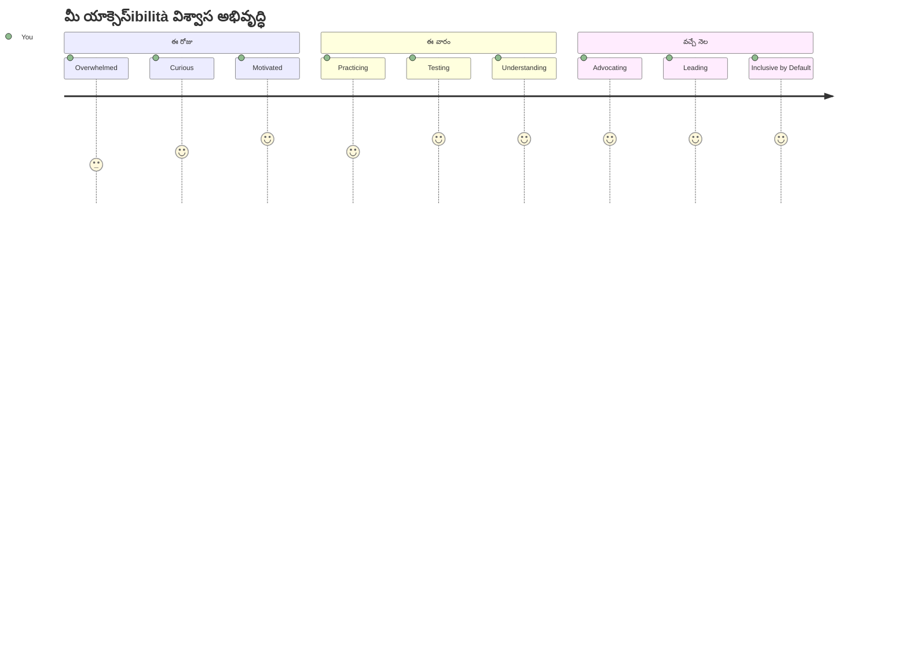
> 🌍 **మీరు ఇప్పుడు యాక్సెస్‌బిలిటీ చాంపియన్‌ని అయ్యారు!** వెబ్‌ను వారు ఎలా యాక్సెస్ చేస్తున్నారో సంబంధం లేకుండా గొప్ప వెబ్ అనుభవాలు అందరికి పనిచేస్తాయని మీరు అర్థం చేసుకున్నారు. మీరు తయారుచేసే ప్రతి యాక్సెస్‌బుల్ ఫీచర్ ఇంటర్నెట్‌ను మరింత సమర్థవంతంగా చేస్తుంది. యాక్సెస్‌బిలిటిని పరిమితిగా కాకుండా, అందరికి మెరుగైన అనుభవాలను సృష్టించే అవకాశం అని చూడగలిగిన అభివృద్ధిదారులు వెబ్‌కు అవసరం. ఈ ఉద్యమానికి స్వాగతం! 🎉

---

<!-- CO-OP TRANSLATOR DISCLAIMER START -->
**తగ్గింపు నోటిఫికేషన్**:  
ఈ దస్తావేజును AI అనువాద సేవ [కో-ఓప్ ట్రాన్స్‌లేటర్](https://github.com/Azure/co-op-translator) ఉపయోగించి అనువదించబడింది. మేము ఖచ్చితత్వం కోసం ప్రయత్నిస్తున్నప్పటికీ, ఆటోమెటిక్ అనువాదాలలో పొరపాట్లు లేదా అసత్యతలు ఉండవచ్చు. సొంత భాషలోని అసలు దస్తావేజే అధికారిక మూలం గా పరిగణించాలి. ప్రముఖమైన సమాచారం కోసం, ప్రొఫెషనల్ మానవ అనువాదం సూచించబడుతుంది. ఈ అనువాదం ఉపయోగంతో ఏర్పడిన ఏమైనా అపార్థాలు లేదా తప్పు అర్థాల కోసం మేము బాధ్యత వహించమేము.
<!-- CO-OP TRANSLATOR DISCLAIMER END -->