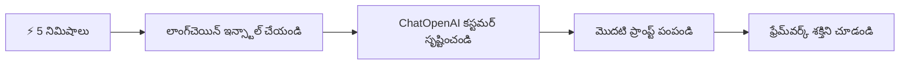
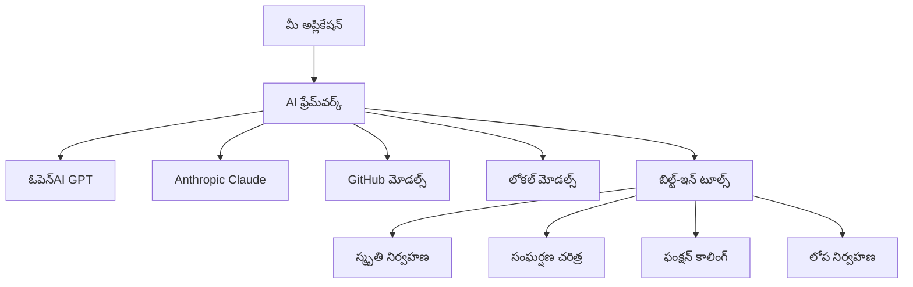
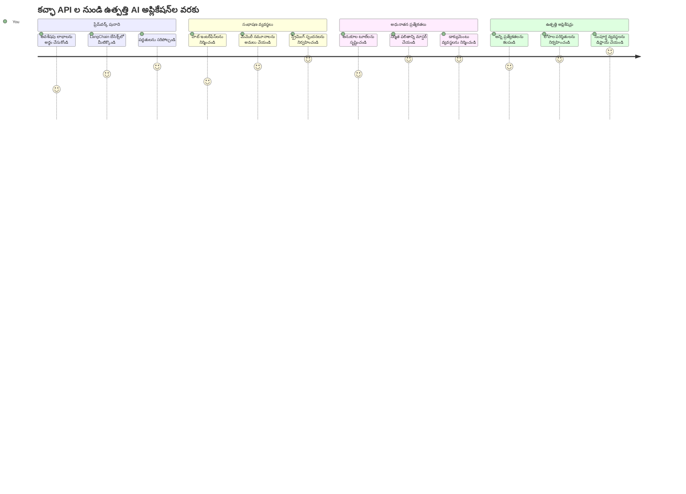
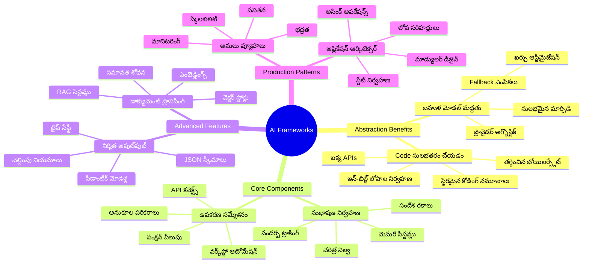
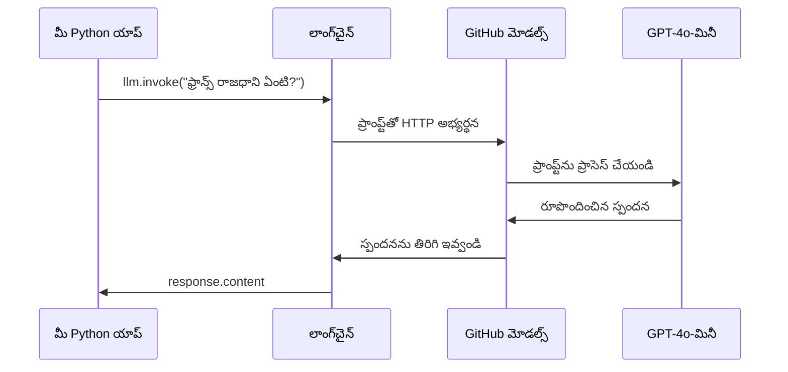
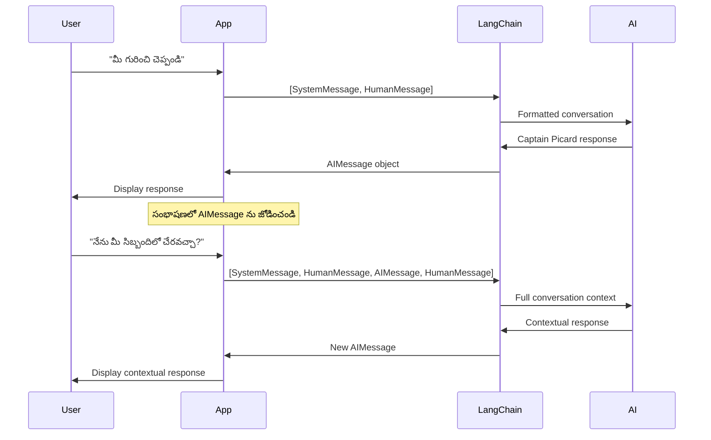
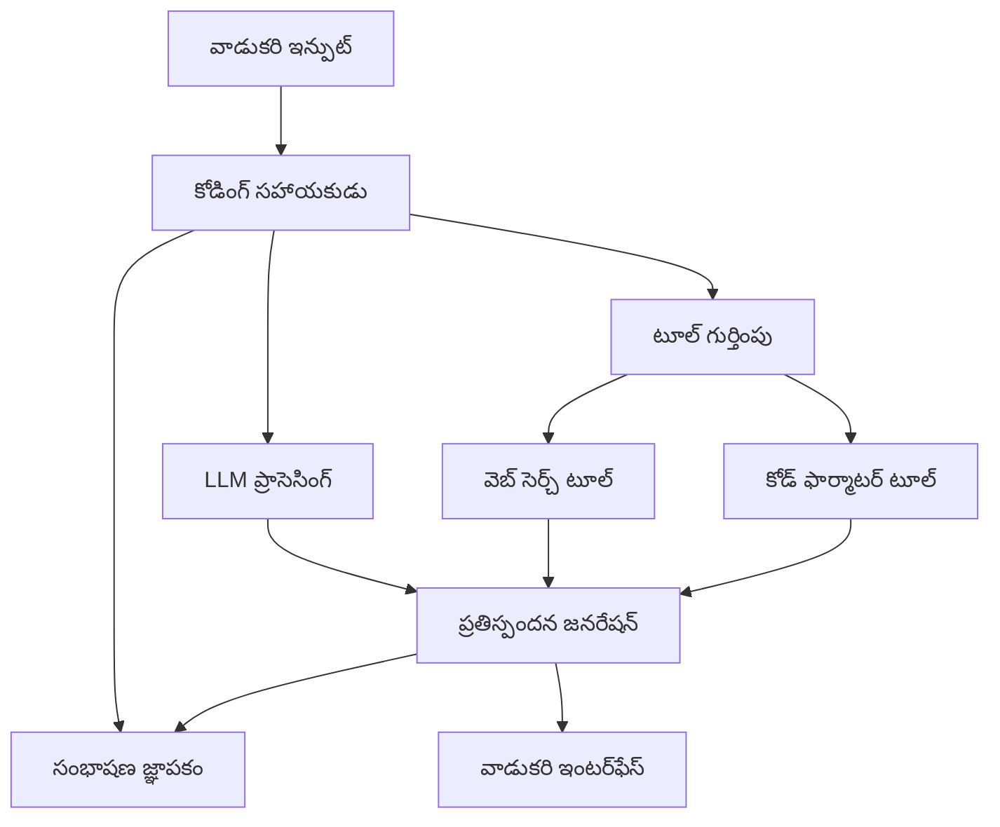
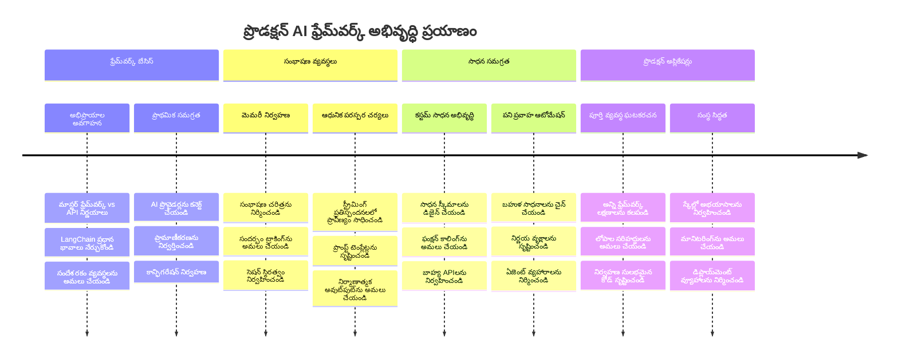
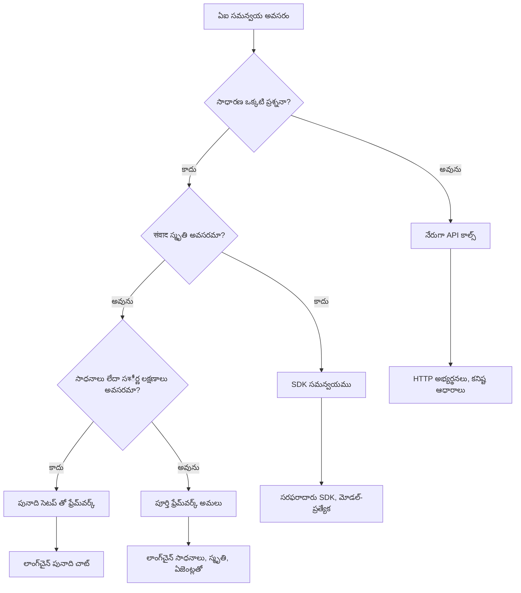

<!--
CO_OP_TRANSLATOR_METADATA:
{
  "original_hash": "3925b6a1c31c60755eaae4d578232c25",
  "translation_date": "2026-01-08T10:51:03+00:00",
  "source_file": "10-ai-framework-project/README.md",
  "language_code": "te"
}
-->
# AI ఫ్రేమ్‌వర్క్

ప్రారంభం నుంచి AI అనువర్తనాలను నిర్మించడానికి ప్రయత్నిస్తుండగా మీరు ఒత్తిడిపడిందిగా భావించారా? మీరు ఒంటరిగా లేరు! AI ఫ్రేమ్‌వర్క్‌లు AI అభివృద్ధికి స్విస్ ఆर्मी కత్తి లాంటివి – అవి బలమైన సాధనాలు, అవి తెలివైన అనువర్తనాలను నిర్మించేటప్పుడు మీకు సమయం మరియు తలనొప్పులను ఆదా చేస్తాయి. AI ఫ్రేమ్‌వర్క్‌ను బాగా వ్యవస్థీకృత గ్రంథాలయంగా ఆలోచించండి: ఇది ముందుగా రూపొందించిన పరికరాలు, ప్రమాణీకృత APIs, మరియు తెలివైన సారాంశాలను అందిస్తుంది, అందువల్ల మీరు అమలు వివరాలతో సమరపడకుండా స‌మ‌స్య‌ల‌ను ప‌రిష్క‌రించేవారిగా ఉండ‌గ‌ల‌రు.

ఈ పాఠంలో, LangChain వంటి ఫ్రేమ్‌వర్క్‌లు సంక్లిష్ట AI సమైక్య పనులను శుభ్రమైన, చదవగల కోడ్‌గా ఎలా మార్చగలవో పరిశీలిస్తాము. సంభాషణలను అనుసరించడం, సాధనాన్ని పిలవడం మరియు ఒక ఐక్య ఇంటర్‌ఫేస్ ద్వారా వివిధ AI మోడల్స్‌ నిర్వహించడం వంటి వాస్తవ ప్రపంచ సవాళ్లను ఎలా ఎదుర్కోవాలో మీరు కనుగొంటారు.

మేము ముగించే సమయం లో, మీరు ఎప్పుడు ఫ్రేమ్‌వర్క్‌లను ఉపయోగించాలో, వాటి సారాంశాలను సమర్థవంతంగా ఎలా ఉపయోగించాలో, మరియు వాస్తవ ప్రపంచ వినియోగానికి సిద్ధమైన AI అనువర్తనాలను ఎలా నిర్మించాలో తెలుసుకుంటారు. మీ ప్రాజెక్టుల కోసం AI ఫ్రేమ్‌వర్క్‌లు ఏమి చేయగలవో చూద్దాం.

## ⚡ మీరు వచ్చే 5 నిమిషాల్లో ఏమి చేయగలరు

**వేగంగా ప్రారంభించేందుకు బిజీ డెవలపర్ల కోసం మార్గం**


- **నిమిషం 1**: LangChain ఇన్‌స్టాల్ చేయండి: `pip install langchain langchain-openai`
- **నిమిషం 2**: మీ GitHub టోకెన్‌ను సెట్ చేసి ChatOpenAI క్లయింట్‌ను దిగుమతి చేసుకోండి
- **నిమిషం 3**: సిస్టమ్ మరియు హ్యూమన్ మెసేజెస్‌తో ఒక సాధారణ సంభాషణ సృష్టించండి
- **నిమిషం 4**: ఒక ప్రాథమిక సాధనం (ఉదాహరణకు, జోడింపు ఫంక్షన్) జోడించి AI సాధన పిలవడాన్ని చూడండి
- **నిమిషం 5**: కచ్చితమైన API కాల్స్ మరియు ఫ్రేమ్‌వర్క్ సారాంశం మధ్య తేడాను అనుభవించండి

**వేగవంతమైన పరీక్షా కోడ్**:
```python
from langchain_openai import ChatOpenAI
from langchain_core.messages import SystemMessage, HumanMessage

llm = ChatOpenAI(
    api_key=os.environ["GITHUB_TOKEN"],
    base_url="https://models.github.ai/inference",
    model="openai/gpt-4o-mini"
)

response = llm.invoke([
    SystemMessage(content="You are a helpful coding assistant"),
    HumanMessage(content="Explain Python functions briefly")
])
print(response.content)
```

**ఇది ఎందుకు ముఖ్యం**: 5 నిమిషాల్లో, మీరు క్లిష్టమైన AI సమైక్యాన్ని సులభమైన విధాన పిలుపులుగా మారుస్తామని AI ఫ్రేమ్‌వర్క్‌లు ఎలా రూపొందిస్తాయో అనుభవించగలరు. ఇది ఉత్పత్తి AI అనువర్తనాలకు ఆధారం.

## ఎందుకు ఫ్రేమ్‌వర్క్‌ను ఎంచుకోాలి?

మీరు AI అనువర్తనం నిర్మించడానికి సిద్ధంగా ఉన్నారు - అద్భుతం! కానీ ఇదిగో విషయం: మీరు తీసుకునే పలు మార్గాలు ఉన్నాయి, ప్రతి ఒక్కదానికి వెచ్చింపులు మరియు లోపాలు ఉన్నాయి. ఇది ఒక ప్రదేశానికి చేరుకోవడానికి నడవడం, సైక్లింగ్ చేయడం లేదా డ్రైవింగ్ చేయడం ఏది ఎంచుకోవాలో నిర్ణయించుకుంటున్నట్లు - ఇవన్నీ ఆ ప్రదేశానికి తీసుకెళ్తాయి, కానీ అనుభవం (మరియు శ్రమ) పూర్తిగా భిన్నంగా ఉంటుంది.

మీ ప్రాజెక్టుల్లో AI ని సమైక్యం చేసే మూడు ముఖ్య మార్గాలను విడదీయండి:

| దృక్కోణం | ప్రయోజనాలు | ఉత్తమ ఉపయోగం | గమనించవలసిన విషయాలు |
|----------|------------|----------|--------------|
| **Direct HTTP Requests** | పూర్తి నియంత్రణ, ఆధారపడకపోవడం | సులభ ప్రశ్నలు, ప్రాథమిక విషయాలను నేర్చుకోవడం | మరిన్ని పంక్తులు, మానవ పొరపాటు నిర్వహణ |
| **SDK Integration** | తక్కువ బాయిలర్‌ప్లేట్, మోడల్-స్పెషిఫిక్ ఆప్టిమైజేషన్ | ఏక మోడల్ అనువర్తనాలు | నిర్దిష్ట ప్రొవైడర్లు మాత్రమే |
| **AI Frameworks** | ఐక్య API, అంతర్గత సారాంశాలు | బహుముఖ మోడల్ అనువర్తనాలు, సంక్లిష్ట వర్క్‌ఫ్లోలు | నేర్చుకోవడంలో కొంత అవగాహన అవసరం, అధిక సారాంశం అవకాశం |

### ఫ్రేమ్‌వర్క్ లాభాలు ప్రాక్టీస్‌లో


**ఫ్రేమ్‌వర్క్‌లు ముఖ్యం ఎందుకంటే:**
- **ఒక్క ఇంటర్‌ఫేస్ లో** అనేక AI ప్రొవైడర్లు ఐక్యీకృతమవుతారు
- **సంభాషణ స్మృతి** ను ఆటోమేటిగ్గా నిర్వహిస్తాయి
- **ఎంబెడ్డింగ్స్ మరియు ఫంక్షన్ పిలుపులకు** సిద్ధమైన సాధనాలు అందిస్తాయి
- **లోప నిర్వహణ మరియు రీట్రై లాజిక్** ను నిర్వహిస్తాయి
- **సంక్లిష్ట వర్క్‌ఫ్లోలను** చదవగల విధాన పిలుపులుగా మార్చుతాయి

> 💡 **ప్రొ టిప్**: మీరు వివిధ AI మోడల్స్ మధ్య మార్చడానికి లేదా ఏజెంట్లు, స్మృతి లేదా టూల్ పిలుపులను నిర్మించేటప్పుడు ఫ్రేమ్‌వర్క్‌లు ఉపయోగించండి. ప్రాథమికాలను నేర్చుకునేటప్పుడు లేదా సరళమైన, కేంద్రీకృత అనువర్తనాలను నిర్మించేటప్పుడు నేరుగా APIలను ఉపయోగించండి.

**ముగింపు సరళి**: ఒక నైపుణ్యంతో కూడిన శిల్పి ప్రత్యేక పనిముట్లను మరియు పూర్తి పనిముట్ల కేంద్రాన్ని ఎంచుకొనడంలా, పరికరాన్ని పనికి తగినట్లు ఎంచుకోవడం ముఖ్యం. సంక్లిష్ట, ఫీచర్-పుష్టి అనువర్తనాలకు ఫ్రేమ్‌వర్క్‌లు మెచినవి, సరళ వాడుక కేసులకు నేరుగా APIలు బాగుంటాయి.

## 🗺️ మీ AI ఫ్రేమ్‌వర్క్ ప్రావీణ్యత ప్రయాణం


**మీ ప్రయాణ లక్ష్యం**: ఈ పాఠం ముగిసే సమయానికి, మీరు AI ఫ్రేమ్‌వర్క్ అభివృద్ధిని పట్టు కోని, వాణిజ్య AI సహాయకులను సమానం చేసే సాంకేతిక, ఉత్పత్తి సిద్ధమైన AI అనువర్తనాలను నిర్మించగలుగుతారు.

## పరిచయం

ఈ పాఠంలో, మనం నేర్చుకుంటాము:

- ఒక సాధారణ AI ఫ్రేమ్‌వర్క్‌ను ఉపయోగించడం.
- సంభాషణలు, సాధన వినియోగం, స్మృతి మరియు సందర్భం వంటి సాధారణ సమస్యలను పరిష్కరించడం.
- దీన్ని ఉపయోగించి AI అనువర్తనాలను నిర్మించడం.

## 🧠 AI ఫ్రేమ్‌వర్క్ అభివృద్ధి పరిసరాలు


**ఆధార సూత్రం**: AI ఫ్రేమ్‌వర్క్‌లు సంక్లిష్టతను సారాంశంగా మార్చి, సంభాషణ నిర్వహణ, సాధన సమైక్యం మరియు డాక్యుమెంట్ ప్రాసెసింగ్ కోసం శక్తివంతమైన సారాంశాలు అందిస్తూ, అభివృద్ధకులకు శుభ్రమైన, నిర్వహించగలిగే కోడ్‌తో సాంకేతిక AI అనువర్తనాలు నిర్మించడానికి అవకాశం ఇస్తాయి.

## మీ తొలి AI ప్రాంప్ట్

మొదటిపద్ధతులను ప్రారంభిద్దాం: మీ మొదటి AI అనువర్తనం తయారు చేసి ప్రశ్న పంపించి సమాధానం పొందడం. అర్చిమెడీస్ తన స్నానంలో ప్రదేశం తొలగింపు సూత్రాన్ని కనుగొన్నట్లే, కొన్ని సారళ్యమైన గమనికలు అద్భుతమైన అవగాహనలకు దారి తీస్తాయి - మరియు ఫ్రేమ్‌వర్క్‌లు ఈ అవగాహనలను అందుబాటులోకి తెస్తాయి.

### LangChain ను GitHub మోడల్స్‌తో సెటప్ చేయడం

LangChain ను ఉపయోగించి GitHub మోడల్స్‌తో కనెక్ట్ అవుతాము, అవి చాలా బాగున్నాయి ఎందుకంటే ఇది వివిధ AI మోడల్స్‌కు ఉచిత ప్ర‌వేశాన్ని ఇస్తుంది. ఉత్తమ విషయం? మీరు మొదలు పెట్టడానికి కొన్ని సులభమైన కాన్ఫిగరేషన్ పరిమాణాలు మాత్రమే అవసరం:

```python
from langchain_openai import ChatOpenAI
import os

llm = ChatOpenAI(
    api_key=os.environ["GITHUB_TOKEN"],
    base_url="https://models.github.ai/inference",
    model="openai/gpt-4o-mini",
)

# ఒక సాదా ప్రాంప్ట్ పంపండి
response = llm.invoke("What's the capital of France?")
print(response.content)
```

**ఇక్కడ ఏమి జరుగుతోంది మార్చి చూద్దాం:**
- `ChatOpenAI` క్లాస్ ఉపయోగించి LangChain క్లయింట్ సృష్టిస్తారు - ఇది మీ AI‌కి మార్గం!
- మీ ధృవీకరణ టోకెన్‌తో GitHub మోడల్స్ కనెక్షన్‌ను కాంఫిగర్ చేస్తుంది
- ఉపయోగించవలసిన AI మోడల్ ను (ఉదా: `gpt-4o-mini`) నిర్ధారిస్తుంది - దీన్ని మీ AI సహాయకుడిగా ఆలోచించండి
- `invoke()` పద్ధతితో మీ ప్రశ్న పంపుతుంది - ఇదే అనుభవాలయం
- సమాధానాన్ని తీసుకుని ప్రదర్శిస్తుంది - అంటే మీరు AIతో మాట్లాడుతున్నారు!

> 🔧 **సెట్టప్ గమనిక**: మీరు GitHub Codespaces ఉపయోగిస్తే అదృష్టంగా మీరు ఉన్నారు - `GITHUB_TOKEN` ఇప్పటికే సెట్ అయిందీ! లోకల్‌గా పనిచేస్తున్నారా? భయపడకండి, సరైన అనుమతులతో ప్రైవేట్ యాక్సెస్ టోకెన్ సృష్టించాలి.

**ఎగుమతి ఫలితాన్ని అభిప్రాయపడండి:**
```text
The capital of France is Paris.
```


## సంభాషణాత్మక AI నిర్మాణం

మొదటి ఉదాహరణ మౌలికాలను చూపిస్తుంది, కానీ అది కేవలం ఒక్కసారి మార్పిడి - మీరు ప్రశ్న అడుగుతారు, సమాధానం అందుతుంటుంది, అంతే. వాస్తవ అనువర్తనాల్లో, మీరు మీ AI గత సంభాషణలని గుర్తుంచుకోవాలని కోరుకుంటారు, వాత్సన్ మరియు హోమ్స్ ఎలా వారి విచారణ సంభాషణలను కాలక్రమేణా నిర్మించారో అలానే.

ఇక్కడ LangChain ప్రత్యేకంగా ఉపయోగకరం అవుతుంది. ఇది వివిధ సందేశ రకాల్ని అందిస్తుంది, ఇవి సంభాషణలను నిర్మించడంలో సహాయపడతాయి మరియు మీ AIకి వ్యక్తిత్వం ఇవ్వగలవు. మీరు సందర్భాన్ని మరియు పాత్రను నిలుపుకొనే చాట్ అనుభవాలను రూపొందించగలుగుతారు.

### సందేశ రకాల అర్థం

ఈ సందేశ రకాలను సంభాషణలో పాల్గొనేవారు ధరించే "టోపీలు" లాగా ఆలోచించండి. LangChain వివిధ సందేశ క్లాసులను ఉపయోగించి ఎవరు ఏమి మాట్లాడుతున్నారో ట్రాక్ చేస్తుంది:

| సందేశ రకం | ఉద్దేశ్యం | ఉదాహరణ ఉపయోగం |
|--------------|---------|------------------|
| `SystemMessage` | AI వ్యక్తిత్వం మరియు ప్రవర్తనను నిర్వచిస్తుంది | "నీవు ఒక సహాయకారి కోడింగ్ అసిస్టెంట్" |
| `HumanMessage` | యూజర్ ఇన్‌పుట్ సూచిస్తుంది | "ఫంక్షన్లు ఎలా పనిచేస్తాయో వివరించు" |
| `AIMessage` | AI సమాధానాలు నిల్వచేస్తుంది | సంభాషణలో పూర్వ AI సమాధానాలు |

### మీ మొదటి సంభాషణ సృష్టి

మనం ఒక సంభాషణ సృష్టిద్దాం, అందులో AI ఒక నిర్దిష్ట పాత్రను చేపడుతుంది. దీని పాత్ర కేప్టెన్ పికార్డ్‌ని అనుసరిస్తుంది - అతనిatibus డిప్లొమాటిక్ జ్ఞానం మరియు నాయకత్వం పర్సనాలిటీతో:

```python
messages = [
    SystemMessage(content="You are Captain Picard of the Starship Enterprise"),
    HumanMessage(content="Tell me about you"),
]
```

**ఈ సంభాషణ సెటప్ అవగాహన:**
- `SystemMessage` ద్వారా AI పాత్ర మరియు వ్యక్తిత్వాన్ని కల్పిస్తుంది
- `HumanMessage` ద్వారా ప్రాథమిక యూజర్ ప్రశ్న అందిస్తుంది
- బహుళ మార్లు సంభాషణకి బేస్ వేశారు

ఈ ఉదాహరణకు పూర్తి కోడ్ ఇలాగా ఉంటుంది:

```python
from langchain_core.messages import HumanMessage, SystemMessage
from langchain_openai import ChatOpenAI
import os

llm = ChatOpenAI(
    api_key=os.environ["GITHUB_TOKEN"],
    base_url="https://models.github.ai/inference",
    model="openai/gpt-4o-mini",
)

messages = [
    SystemMessage(content="You are Captain Picard of the Starship Enterprise"),
    HumanMessage(content="Tell me about you"),
]


# పనిచేస్తుంది
response  = llm.invoke(messages)
print(response.content)
```

ఇలాంటి ఫలితం కనపడాలి:

```text
I am Captain Jean-Luc Picard, the commanding officer of the USS Enterprise (NCC-1701-D), a starship in the United Federation of Planets. My primary mission is to explore new worlds, seek out new life and new civilizations, and boldly go where no one has gone before. 

I believe in the importance of diplomacy, reason, and the pursuit of knowledge. My crew is diverse and skilled, and we often face challenges that test our resolve, ethics, and ingenuity. Throughout my career, I have encountered numerous species, grappled with complex moral dilemmas, and have consistently sought peaceful solutions to conflicts.

I hold the ideals of the Federation close to my heart, believing in the importance of cooperation, understanding, and respect for all sentient beings. My experiences have shaped my leadership style, and I strive to be a thoughtful and just captain. How may I assist you further?
```

సంభాషణ కొనసాగింపును నిలిపివేయకుండా (ప్రతి సారి సందర్భాన్ని రీసెట్ చేయకుండా), మీరు మీ సందేశ జాబితాను కొనసాగిస్తూ జోడించాలి. తాత్కాలికంగా గాథలు తరాలుగా నిలుపుకున్న వాటిలాగే ఈ పద్ధతి శాశ్వత స్మృతిని నిర్మిస్తుంది:

```python
from langchain_core.messages import HumanMessage, SystemMessage
from langchain_openai import ChatOpenAI
import os

llm = ChatOpenAI(
    api_key=os.environ["GITHUB_TOKEN"],
    base_url="https://models.github.ai/inference",
    model="openai/gpt-4o-mini",
)

messages = [
    SystemMessage(content="You are Captain Picard of the Starship Enterprise"),
    HumanMessage(content="Tell me about you"),
]


# పని చేస్తుంది
response  = llm.invoke(messages)

print(response.content)

print("---- Next ----")

messages.append(response)
messages.append(HumanMessage(content="Now that I know about you, I'm Chris, can I be in your crew?"))

response  = llm.invoke(messages)

print(response.content)

```

బాగా సరిపోతుంది కదా? ఇక్కడ LLM‌ను రెండుసార్లు పిలుస్తున్నాం - మొదట కేవలం మా మొదటి రెండు సందేశాలతో, తరువాత పూర్తి సంభాషణ చరిత్రతో. ఇది AI నిజంగా మా చాట్‌ను అనుసరిస్తున్నట్లుంది!

ఇ కోడ్ నడిపిస్తే, రెండవ సమాధానం ఇలా వస్తుంది:

```text
Welcome aboard, Chris! It's always a pleasure to meet those who share a passion for exploration and discovery. While I cannot formally offer you a position on the Enterprise right now, I encourage you to pursue your aspirations. We are always in need of talented individuals with diverse skills and backgrounds. 

If you are interested in space exploration, consider education and training in the sciences, engineering, or diplomacy. The values of curiosity, resilience, and teamwork are crucial in Starfleet. Should you ever find yourself on a starship, remember to uphold the principles of the Federation: peace, understanding, and respect for all beings. Your journey can lead you to remarkable adventures, whether in the stars or on the ground. Engage!
```


నేను దానిని ‘షायद్’ అనుకుంటా ;)

## స్ట్రీమింగ్ సమాధానాలు

ఎప్పుడైనా గమనించారా ChatGPT తన సమాధానాలను ప్రత్యక్షంగా "టైప్ చేయడం" వంటిది? అది స్ట్రీమింగ్ పరిణామం. కాస్త నైపుణ్యం ఉన్న కాలిగ్రాఫర్ పనిచేస్తున్నట్లుగా - అక్షరాలు బ్రష్ స్ట్రోక్స్ లాంటివిగా కనిపించడం, అకస్మాత్తుగా విజృంభించకపోవడం - స్ట్రీమింగ్ ఈ అనుభవాన్ని సహజంగా మారుస్తుంది మరియు వెంటనే ప్ర‌తిస్పంద‌న‌ ఇస్తుంది.

### LangChainతో స్ట్రీమింగ్ అమలు

```python
from langchain_openai import ChatOpenAI
import os

llm = ChatOpenAI(
    api_key=os.environ["GITHUB_TOKEN"],
    base_url="https://models.github.ai/inference",
    model="openai/gpt-4o-mini",
    streaming=True
)

# స్పందనను స్ట్రీమ్ చేయండి
for chunk in llm.stream("Write a short story about a robot learning to code"):
    print(chunk.content, end="", flush=True)
```

**స్ట్రీమింగ్ ఎందుకు అద్భుతం:**
- **సృష్టించినట్లుగా** విషయాన్ని చూపిస్తుంది - ఇక నిమిషాల సేపు వేచిచూడాల్సిన అవసరం లేదు!
- **యూజర్లకు** ఏదో జరుగుతుందని అనిపిస్తుంది
- **సాంకేతికంగా వేగంగా కాకపోయినా కూడా** వేగంగా అనిపిస్తుంది
- **AI "ఆలోచిస్తున్నప్పుడు" కూడా** యూజర్లు చదవడం మొదలు పెట్టొచ్చు

> 💡 **యూజర్ అనుభవ సూచన**: కోడ్ వివరణలు, సృజనాత్మక రచనలు లేదా వివరమైన పాఠాలు వంటి పొడవాటి సమాధానాల కోసం స్ట్రీమింగ్ చాలా ఉపయోగిస్తారు. మీ యూజర్లు తేలికగా పురోగతిని చూస్తారు, ఖాళీ తెరపై కన్నేస్తుండరు!

### 🎯 విద్యా తనిఖీ: ఫ్రేమ్‌వర్క్ సారాంశ లాభాలు

**ఆగండి మరియు ఆలోచించండి**: మీరు కేవలం AI ఫ్రేమ్‌వర్క్ సారాంశ శక్తిని అనుభవించారు. మీరు గత పాఠాల మానవీయ API కాల్స్‌తో మీ నేర్చుకున్నది ఎలా భేదం ఉందో పోల్చుకోండి.

**త్వరిత స్వయం-మూల్యాంకనం**:
- LangChain సంభాషణ నిర్వహణను ఎలా సులభతరం చేస్తుందో వివరించగలరా?
- `invoke()` మరియు `stream()` పద్ధతుల మధ్య తేడా ఏమిటి, ఎప్పుడు ఏది ఉపయోగిస్తారు?
- ఫ్రేమ్‌వర్క్ సందేశ రకం వ్యవస్థ కోడ్ కట్టుబ‌డిని ఎలా మెరుగుపరుస్తుంది?

**వాస్తవ ప్రపంచ సంబంధం**: మీరు నేర్చుకున్న సారాంశ నమూనాలు (సందేశ రకాలు, స్ట్రీమింగ్ ఇంటర్‌ఫేసులు, సంభాషణ స్మృతి) ప్రతి ప్రముఖ AI అనువర్తనంలో ఉపయోగించబడుతున్నవి - ChatGPT ఇంటర్‌ఫేస్ నుండి GitHub Copilot కోడ్ సాయం వరకు. మీరు వృత్తిపరమైన AI అభివృద్ధి బృందాలు ఉపయోగించే ఆర్కిటెక్చరల్ నమూనాలను నేర్చుకుంటున్నారు.

**సవాలు ప్రశ్న**: నిమగ్నమై ఏకైక ఇంటర్‌ఫేస్‌తో విభిన్న AI మోడల్ ప్రొవైడర్లను ఎలా వ్యవస్థీకరించగల ఫ్రేమ్‌వర్క్ సారాంశాన్ని డిజైన్ చేస్తారు? లాభాలు మరియు వ్యాపారాలను పరిగణించండి.

## ప్రాంప్ట్ టెంప్లేట్లు

ప్రాంప్ట్ టెంప్లేట్లు శాస్త్రీయ ప్రసంగాలలో ఉపయోగించే వాక్య నిర్మాణాల లాగా పనిచేస్తాయి - సీసిరో తన ప్రసంగ శైలులను వివిధ ప్రసంగాల్లో మార్చుకున్నట్లు, కానీ persuasive ఫ్రేమ్‌వర్క్ అదే ఉండేది. ఇవి పునర్వినియోగపడి, మీరు ప్రతిసారీ ఇమాజినేషన్ కూడా లేకుండా వివిధ సమాచార భాగాలను మార్చుకోవడానికి సహాయపడతాయి. ఒకసారి టెంప్లేట్ సృష్టించిన తర్వాత, మీరు కేవలం వేరియబుల్స్‌తో అవసరమైన విలువలను భర్తీ చేస్తారు.

### పునర్వినియోగపడ్డ ప్రాంప్ట్‌లు సృష్టించడం

```python
from langchain_core.prompts import ChatPromptTemplate

# కోడ్ వివరణలకు టెంప్లేట్‌ను నిర్వచించండి
template = ChatPromptTemplate.from_messages([
    ("system", "You are an expert programming instructor. Explain concepts clearly with examples."),
    ("human", "Explain {concept} in {language} with a practical example for {skill_level} developers")
])

# వేరే విలువలతో టెంప్లేట్ ఉపయోగించండి
questions = [
    {"concept": "functions", "language": "JavaScript", "skill_level": "beginner"},
    {"concept": "classes", "language": "Python", "skill_level": "intermediate"},
    {"concept": "async/await", "language": "JavaScript", "skill_level": "advanced"}
]

for question in questions:
    prompt = template.format_messages(**question)
    response = llm.invoke(prompt)
    print(f"Topic: {question['concept']}\n{response.content}\n---\n")
```

**మీరు టెంప్లేట్లను ఎందుకు ఇష్టపడతారు:**
- **మీ ప్రాంప్ట్‌లు** మీ యాప్ అంతటా కన్సిస్టెంట్ గా ఉంటాయి
- **మరింత అవ్యవస్థీకృత స్ట్రింగ్ కనాటెనేషన్ లేదు** – కేవలం శుభ్రమైన, సరళ వేరియబుల్స్
- **మీ AI** ప్రవర్తన ఊహించదగినదిగా ఉంటుంది ఎందుకంటే నిర్మాణం కదలు లేదు
- **అప్డేట్స్** చాలా సులభం - ఒకసారి టెంప్లేట్ మార్చండి, అంతా మార్చబడతాయి

## నిర్మాణాబద్ధ ఔట్పుట్

AI స్పందనలు అసంఘటిత టెక్స్ట్‌గా వచ్చినప్పుడు మీకు ఎప్పుడైనా అసౌకర్యంగా అనిపించిందా? నిర్మాణబద్ధ ఔట్పుట్ అనేది లైనియస్ జీవ శాస్త్ర వర్గీకరణ విధానాన్ని నేర్పించినట్లే - క్రమం తప్పకుండా ఉండే, ఊహించదగిన, మరియు పని చేయడానికి సులభంగా ఉండే విధానం. మీరు JSON, నిర్దిష్ట డేటా నిర్మాణాలు లేదా ఏ ఫార్మాట్ కావాలన్నా అభ్యర్థించవచ్చు.

### ఔట్‌పుట్ స్కీమాల నిర్వచనం

```python
from langchain_core.prompts import ChatPromptTemplate
from langchain_core.output_parsers import JsonOutputParser
from pydantic import BaseModel, Field

class CodeReview(BaseModel):
    score: int = Field(description="Code quality score from 1-10")
    strengths: list[str] = Field(description="List of code strengths")
    improvements: list[str] = Field(description="List of suggested improvements")
    overall_feedback: str = Field(description="Summary feedback")

# పార్సర్‌ను సెట్ చేయండి
parser = JsonOutputParser(pydantic_object=CodeReview)

# ఫార్మాట్ సూచనలతో ప్రాంప్ట్ రూపొందించండి
prompt = ChatPromptTemplate.from_messages([
    ("system", "You are a code reviewer. {format_instructions}"),
    ("human", "Review this code: {code}")
])

# సూచనలతో ప్రాంప్ట్‌ను ఫార్మాట్ చేయండి
chain = prompt | llm | parser

# నిర్మిత స్పందన పొందండి
code_sample = """
def calculate_average(numbers):
    return sum(numbers) / len(numbers)
"""

result = chain.invoke({
    "code": code_sample,
    "format_instructions": parser.get_format_instructions()
})

print(f"Score: {result['score']}")
print(f"Strengths: {', '.join(result['strengths'])}")
```

**నిర్మాణబద్ధ ఔట్‌పుట్ ఎందుకు ప్రాముఖ్యం:**
- **ఏదైనా ఫార్మాట్ వస్తుందో అంచనా వేయాల్సిన అవసరం లేదు** - ప్రతి సారి సరి తప్పకుండా వస్తుంది
- **మీ డేటాబేస్‌లు మరియు APIలకు నేరుగా ప్లగ్ అవుతుంది** అదనపు పని అవసరం లేదు
- **విచిత్ర AI స్పందనలను మీ యాప్ బిగ్ బగ్ కాబట్టి ముందుగానే పట్టుకోగలదు**
- **మీ కోడ్ వ్యక్తీకరణ సులభతరం అవుతుంది** ఎందుకంటే మీరు ఏమి పని చేస్తున్నారో స్పష్టంగా ఉంటుంది

## సాధన పిలవడం

ఇప్పుడు అత్యంత శక్తివంతమైన ఫీచర్లలో ఒకటైన సాధనాల వద్దకు వచ్చాము. ఇది మీ AI కి సంభాషణకంటే మించి ప్రాక్టికల్ సామర్థ్యాలను ఇస్తుంది. మధ్యయుగ గిల్డ్‌లు నిర్దిష్ట కళల కోసం ప్రత్యేక పనిముట్లు అభివృద్ధి చేసినట్టే, మీరు మీ AIకి నైపుణ్య పరికరాలు అందించవచ్చు. మీరు ఏ సందర్భాలలో సాధనాలు అందుబాటులో ఉన్నాయో చెప్పాలి, మరియు ఎవరికైనా అనుకూలంగా ఉన్నది కోరితే, ఆ AI చర్య తీసుకోగలదు.

### పైథాన్ ఉపయోగించడం

ఈ విధంగా కొన్ని సాధనాలు జోడిద్దాం:

```python
from typing_extensions import Annotated, TypedDict

class add(TypedDict):
    """Add two integers."""

    # వ్యాఖ్యానాలకు 타입 తప్పనిసరిగా ఉండాలి మరియు ఐచ్ఛికంగా ఒక డిఫాల్ట్ విలువ మరియు వివరణ (ఆ క్రమంలో) ఉండవచ్చు.
    a: Annotated[int, ..., "First integer"]
    b: Annotated[int, ..., "Second integer"]

tools = [add]

functions = {
    "add": lambda a, b: a + b
}
```

ఇక్కడ ఏమి జరుగుతుంది? `add` అనే సాధనానికి ఒక బ్లూప్రింట్ సృష్టిస్తున్నాం. `TypedDict` నుండి వారసత్వాన్ని తీసుకొని, `a` మరియు `b` కి అందించిన అద్భుతమైన `Annotated` రకాలతో, LLMకి ఈ సాధనం ఏమి చేస్తుందో, ఏ వివరాలు అవసరమో స్పష్టంగా తెలియజేస్తున్నాం. `functions` డిక్షనరీ మన పనిముట్ల సమాహారం లాంటిది – అది AI నిర్ణయం తీసుకున్నపుడు ఏ సాధనాన్ని ఉపయోగించాలో మన కోడ్ సరిగ్గా చెప్పుతుంది.

ఈ సాధనంతో LLMని ఎలా పిలుస్తామో చూద్దాం:

```python
llm = ChatOpenAI(
    api_key=os.environ["GITHUB_TOKEN"],
    base_url="https://models.github.ai/inference",
    model="openai/gpt-4o-mini",
)

llm_with_tools = llm.bind_tools(tools)
```

 ఇక్కడ `bind_tools` తో మన `tools` అrrayని పంపించి, LLM `llm_with_tools` ఇప్పుడు ఈ సాధనాన్ని తెలుసుకుంది.

ఈ కొత్త LLMను ఉపయోగించడానికి, క్రింది కోడ్ రాయవచ్చు:

```python
query = "What is 3 + 12?"

res = llm_with_tools.invoke(query)
if(res.tool_calls):
    for tool in res.tool_calls:
        print("TOOL CALL: ", functions[tool["name"]](../../../10-ai-framework-project/**tool["args"]))
print("CONTENT: ",res.content)
```

ఇప్పుడు మనం ఈ కొత్త సాధనాలతో `invoke` పిలుస్తున్నప్పుడు, `tool_calls` అనే సొంత ప్రాపర్టీ పూరించబడవచ్చు. అలా అయితే, ఏ సాధనాన్ని పిలవాలో `name` మరియు `args` ప్రాపర్టీల ద్వారా గుర్తించబడుతుంది. పూర్తి కోడ్ ఈ విధంగా ఉంటుంది:

```python
from langchain_core.messages import HumanMessage, SystemMessage
from langchain_openai import ChatOpenAI
import os
from typing_extensions import Annotated, TypedDict

class add(TypedDict):
    """Add two integers."""

    # వ్యాఖ్యానాలు టైప్ కలిగి ఉండాలి మరియు ఐచ్ఛికంగా ఒక డిఫాల్ట్ విలువ మరియు వివరణను (ఆర్డర్‌లో) చేర్చవచ్చు.
    a: Annotated[int, ..., "First integer"]
    b: Annotated[int, ..., "Second integer"]

tools = [add]

functions = {
    "add": lambda a, b: a + b
}

llm = ChatOpenAI(
    api_key=os.environ["GITHUB_TOKEN"],
    base_url="https://models.github.ai/inference",
    model="openai/gpt-4o-mini",
)

llm_with_tools = llm.bind_tools(tools)

query = "What is 3 + 12?"

res = llm_with_tools.invoke(query)
if(res.tool_calls):
    for tool in res.tool_calls:
        print("TOOL CALL: ", functions[tool["name"]](../../../10-ai-framework-project/**tool["args"]))
print("CONTENT: ",res.content)
```

ఈ కోడ్ నడిపితే, ఇలా ఫలితం వస్తుంది:

```text
TOOL CALL:  15
CONTENT: 
```

AI "What is 3 + 12" అనే ప్రశ్నని పరిశీలించి, దీన్ని `add` సాధనం టాస్క్‌గా గుర్తించింది. నైపుణ్యమైన గ్రంథాలయపాలకుడు ప్రశ్న రకానికి సరిపోయే గ్రంధాన్ని ఎంచుకునేలా, ఈ నిర్ణయం సాధనం పేరు, వివరణ మరియు ఫీల్డ్ వివరాలతో అయింది. 15 అనే ఫలితం `functions` డిక్షనరీలో ఉండే టూల్ అమలైనవలన వచ్చింది:

```python
print("TOOL CALL: ", functions[tool["name"]](../../../10-ai-framework-project/**tool["args"]))
```

### ఒక ఇంకా ఆసక్తికరమైన సాధనం, ఇది వెబ్ APIని పిలుస్తుంది
నంబర్స్ జోడించడం కాన్సెప్ట్ చూపిస్తుంది, కానీ అసలైన టూల్స్ సాదారణంగా మరింత క్లిష్టమైన ఆపరేషన్లను చేస్తున్నారు, వెబ్ APIల్ని పిలిచేలా. మన ఉదాహరణని విస్తరించి AI ఇంటర్నెట్ నుండి కంటెంట్ తీసుకొస్తుంది - టెలిగ్రాఫ్ ఆపరేటర్లు ఒకప్పుడు దూర ప్రాంతాలను కలిపిన విధానం లాగా:

```python
class joke(TypedDict):
    """Tell a joke."""

    # వ్యాఖ్యలకు రకం ఉండాలి మరియు ఐచ్ఛికంగా ఒక డిఫాల్ట్ విలువ మరియు వివరణ (అ ఆర్డర్ లో) ఉండవచ్చు.
    category: Annotated[str, ..., "The joke category"]

def get_joke(category: str) -> str:
    response = requests.get(f"https://api.chucknorris.io/jokes/random?category={category}", headers={"Accept": "application/json"})
    if response.status_code == 200:
        return response.json().get("value", f"Here's a {category} joke!")
    return f"Here's a {category} joke!"

functions = {
    "add": lambda a, b: a + b,
    "joke": lambda category: get_joke(category)
}

query = "Tell me a joke about animals"

# మిగిలిన కోడ్ అదే ఉంటుంది
```

ఇప్పుడు మీరు ఈ కోడ్ నడిపిస్తే ఇంతటి రకమైన ప్రతిస్పందన వస్తుంది:

```text
TOOL CALL:  Chuck Norris once rode a nine foot grizzly bear through an automatic car wash, instead of taking a shower.
CONTENT:  
```

```mermaid
flowchart TD
    A[వినియోగదారు ప్రశ్న: "జంతువుల గురించి ఓ హాస్యకథ చెప్పు"] --> B[లాంగ్‌చైన్ విశ్లేషణ]
    B --> C{సాధనం అందుబాటులో ఉందా?}
    C -->|అవును| D[హాస్యకథ సాధనం ఎన్నుకోండి]
    C -->|కాదు| E[సెట్టుగా స్పందన సృష్టించు]
    
    D --> F[పరామితులు డ్ర extracción చేయండి]
    F --> G[హాస్యకథ పిలుపు(category="animals")]
    G --> H[chucknorris.io వరకు API అభ్యర్థన]
    H --> I[హాస్యకథ విషయం తిరిగి ఇవ్వండి]
    I --> J[వినియోగదారికి ప్రదర్శించండి]
    
    E --> K[AI-నిర్మిత స్పందన]
    K --> J
    
    subgraph "సాధనం నిర్వచన స్థాయి"
        L[TypedDict స్కీమా]
        M[ఫంక్షన్ అమలు]
        N[పరామితుల సరైనత]
    end
    
    D --> L
    F --> N
    G --> M
```
ఇది మొత్తం కోడ్:

```python
from langchain_openai import ChatOpenAI
import requests
import os
from typing_extensions import Annotated, TypedDict

class add(TypedDict):
    """Add two integers."""

    # అనోటేషన్లు టైపు కలిగి ఉండాలి మరియు ఆప్షనల్‌గా ఒక డిఫాల్ట్ విలువ మరియు వివరణను (ఆ క్రమంలో) కలిగి ఉండవచ్చు.
    a: Annotated[int, ..., "First integer"]
    b: Annotated[int, ..., "Second integer"]

class joke(TypedDict):
    """Tell a joke."""

    # అనోటేషన్లు టైపు కలిగి ఉండాలి మరియు ఆప్షనల్‌గా ఒక డిఫాల్ట్ విలువ మరియు వివరణను (ఆ క్రమంలో) కలిగి ఉండవచ్చు.
    category: Annotated[str, ..., "The joke category"]

tools = [add, joke]

def get_joke(category: str) -> str:
    response = requests.get(f"https://api.chucknorris.io/jokes/random?category={category}", headers={"Accept": "application/json"})
    if response.status_code == 200:
        return response.json().get("value", f"Here's a {category} joke!")
    return f"Here's a {category} joke!"

functions = {
    "add": lambda a, b: a + b,
    "joke": lambda category: get_joke(category)
}

llm = ChatOpenAI(
    api_key=os.environ["GITHUB_TOKEN"],
    base_url="https://models.github.ai/inference",
    model="openai/gpt-4o-mini",
)

llm_with_tools = llm.bind_tools(tools)

query = "Tell me a joke about animals"

res = llm_with_tools.invoke(query)
if(res.tool_calls):
    for tool in res.tool_calls:
        # print("TOOL CALL: ", tool)
        print("TOOL CALL: ", functions[tool["name"]](../../../10-ai-framework-project/**tool["args"]))
print("CONTENT: ",res.content)
```

## ఎంబెడ్డింగ్స్ మరియు డాక్యుమెంట్ ప్రాసెసింగ్

ఎంబెడ్డింగ్స్ ఆధునిక AIలో ఒక అతి అందమైన పరిష్కారాలలో ఒకటి. మీరు ఎక్కడైనా టెక్స్ట్ తీసుకొని దాని అర్థాన్ని బట్టి సంఖ్యల కోఆర్డినేట్స్‌గా మార్చగలిగితే అని ఊహించండి. అదే ఎంబెడ్డింగ్స్ చేస్తున్నది - వారు టెక్స్ట్ను బహుమాన్య స్పేస్‌లో పాయింట్లుగా మార్చుతారు, అక్కడ సమానమైన భావాలు సమూహాలు ఏర్పరుస్తాయి. ఇది ఆలోచనల కోఆర్డినేట్ సిస్టమ్ లాగా, Mendeleev periodic పట్టికను అటామిక్ లక్షణాల ఆధారంగా ఏర్పాటు చేసినట్లుగానే.

### ఎంబెడ్డింగ్స్ సృష్టించడం మరియు ఉపయోగించడం

```python
from langchain_openai import OpenAIEmbeddings
from langchain_community.vectorstores import FAISS
from langchain_community.document_loaders import TextLoader
from langchain.text_splitter import CharacterTextSplitter

# ఎంబెడ్డింగ్స్‌ను ప్రారంభించండి
embeddings = OpenAIEmbeddings(
    api_key=os.environ["GITHUB_TOKEN"],
    base_url="https://models.github.ai/inference",
    model="text-embedding-3-small"
)

# డాక్యుమెంట్లను లోడ్ చేసి విభజించండి
loader = TextLoader("documentation.txt")
documents = loader.load()

text_splitter = CharacterTextSplitter(chunk_size=1000, chunk_overlap=0)
texts = text_splitter.split_documents(documents)

# వెక్టార్ స్టోర్‌ను సృష్టించండి
vectorstore = FAISS.from_documents(texts, embeddings)

# సాదృశ్య శోధనను నిర్వహించండి
query = "How do I handle user authentication?"
similar_docs = vectorstore.similarity_search(query, k=3)

for doc in similar_docs:
    print(f"Relevant content: {doc.page_content[:200]}...")
```

### వివిధ ఫార్మాట్ల కోసం డాక్యుమెంట్ లోడర్స్

```python
from langchain_community.document_loaders import (
    PyPDFLoader,
    CSVLoader,
    JSONLoader,
    WebBaseLoader
)

# వేరే వేరే డాక్యుమెంట్ రకాలని లోడ్ చేయండి
pdf_loader = PyPDFLoader("manual.pdf")
csv_loader = CSVLoader("data.csv")
json_loader = JSONLoader("config.json")
web_loader = WebBaseLoader("https://example.com/docs")

# అన్ని డాక్యుమెంట్లను ప్రాసెస్ చేయండి
all_documents = []
for loader in [pdf_loader, csv_loader, json_loader, web_loader]:
    docs = loader.load()
    all_documents.extend(docs)
```

**ఎంబెడ్డింగ్స్‌తో మీరు చేయగలిగేది:**
- **బిల్డ్ చేయండి** మీ అర్థం సరిగ్గా గ్రహించే సర్చ్, కీవర్డ్ మ్యాచ్ మాత్రమే కాకుండా
- **తయారు చేయండి** AIని, ఇది మీ డాక్యుమెంట్లపై ప్రశ్నలకు సమాధానం ఇవ్వగలదు
- **తయారు చేయండి** సిఫార్సు వ్యవస్థలు, నిజంగా సంబంధిత కంటెంట్ సూచించబడుతుంది
- **తనిఖీగా** మీ కంటెంట్ ని ఆటోమేటిక్‌గా కూర్చొని వర్గీకరించండి

```mermaid
flowchart LR
    A[పత్రాలు] --> B[పాఠ్యం విభజన]
    B --> C[ఎంబెడింగ్‌ల సృష్టి]
    C --> D[వెక్టర్ స్టోర్]
    
    E[వినియోగదారు ప్రశ్న] --> F[ప్రశ్న ఎంబెడింగ్]
    F --> G[సారూప్యత శోధన]
    G --> D
    D --> H[సంబంధిత పత్రాలు]
    H --> I[ఎ ఐ ప్రతిస్పందన]
    
    subgraph "వెక్టర్ స్థలం"
        J[పత్రం A: [0.1, 0.8, 0.3...]]
        K[పత్రం B: [0.2, 0.7, 0.4...]]
        L[ప్రశ్న: [0.15, 0.75, 0.35...]]
    end
    
    C --> J
    C --> K
    F --> L
    G --> J
    G --> K
```
## పూర్తి AI అప్లికేషన్ నిర్మాణం

ఇప్పుడీ మీరు నేర్చుకున్న ప్రతిదాన్ని ఒక సమగ్ర అప్లికేషన్‌గా తిరిగి కూర్చొనండి - ఇది కోడింగ్ అసిస్టెంట్, ఇది ప్రశ్నలకు సమాధానం ఇచ్చి, టూల్స్ ఉపయోగించి, సంభాషణ మిథ్య‌త (memory)ను నిర్వహిస్తుంది. ప్రింటింగ్ ప్రెస్ అనేదీ ముందుగా ఉన్న సాంకేతికతలను (మూవబుల్ టైప్, మంకు, పేపర్, ప్రెషర్) కలిపి ఒక పరికరం తయారు చేసినట్లు, మన AI భాగాలను ఒక ప్రాక్టికల్, ఉపయోగకరమైనదిగా కలుపుతాము.

### పూర్తి అప్లికేషన్ ఉదాహరణ

```python
from langchain_openai import ChatOpenAI, OpenAIEmbeddings
from langchain_core.prompts import ChatPromptTemplate
from langchain_core.messages import HumanMessage, SystemMessage, AIMessage
from langchain_community.vectorstores import FAISS
from typing_extensions import Annotated, TypedDict
import os
import requests

class CodingAssistant:
    def __init__(self):
        self.llm = ChatOpenAI(
            api_key=os.environ["GITHUB_TOKEN"],
            base_url="https://models.github.ai/inference",
            model="openai/gpt-4o-mini"
        )
        
        self.conversation_history = [
            SystemMessage(content="""You are an expert coding assistant. 
            Help users learn programming concepts, debug code, and write better software.
            Use tools when needed and maintain a helpful, encouraging tone.""")
        ]
        
        # టూల్స్‌ను నిర్వచించండి
        self.setup_tools()
    
    def setup_tools(self):
        class web_search(TypedDict):
            """Search for programming documentation or examples."""
            query: Annotated[str, "Search query for programming help"]
        
        class code_formatter(TypedDict):
            """Format and validate code snippets."""
            code: Annotated[str, "Code to format"]
            language: Annotated[str, "Programming language"]
        
        self.tools = [web_search, code_formatter]
        self.llm_with_tools = self.llm.bind_tools(self.tools)
    
    def chat(self, user_input: str):
        # సంభాషణలో వినియోగదారు సందేశాన్ని జోడించండి
        self.conversation_history.append(HumanMessage(content=user_input))
        
        # AI స్పందన పొందండి
        response = self.llm_with_tools.invoke(self.conversation_history)
        
        # టూల్ కాల్స్ ఉంటే వాటిని నిర్వహించండి
        if response.tool_calls:
            for tool_call in response.tool_calls:
                tool_result = self.execute_tool(tool_call)
                print(f"🔧 Tool used: {tool_call['name']}")
                print(f"📊 Result: {tool_result}")
        
        # AI స్పందనను సంభాషణలో జోడించండి
        self.conversation_history.append(response)
        
        return response.content
    
    def execute_tool(self, tool_call):
        tool_name = tool_call['name']
        args = tool_call['args']
        
        if tool_name == 'web_search':
            return f"Found documentation for: {args['query']}"
        elif tool_name == 'code_formatter':
            return f"Formatted {args['language']} code: {args['code'][:50]}..."
        
        return "Tool execution completed"

# వినియోగ ఉదాహరణ
assistant = CodingAssistant()

print("🤖 Coding Assistant Ready! Type 'quit' to exit.\n")

while True:
    user_input = input("You: ")
    if user_input.lower() == 'quit':
        break
    
    response = assistant.chat(user_input)
    print(f"🤖 Assistant: {response}\n")
```

**అప్లికేషన్ నిర్మాణం:**


**మేము అమలు చేసిన ముఖ్యమైన ఫీచర్లు:**
- **మీ అఖండ సంభాషణను** గుర్తుంచుకుంటుంది, కాంటెక్స్ట్ నిరంతరత్వం కోసం
- **ఆక్షన్లు చేస్తుంది** టూల్ కాలింగ్ ద్వారా, కేవలం సంభాషణ కాదు
- **అనుసరిస్తుంది** అంచనా వేయగల ఇంటరాక్షన్ నమూనాలు
- **నిర్వహిస్తుంది** తప్పిద నిర్వహణ మరియు క్లిష్ట వర్క్‌ఫ్లోలను ఆటోమేటిక్‌గా

### 🎯 పాఠశాల పరీక్ష: ఉత్పత్తి AI నిర్మాణం

**నిర్మాణం అవగాహన**: మీరు ఒక సమగ్ర AI అప్లికేషన్ నిర్మించారు, ఇది సంభాషణ నిర్వహణ, టూల్ కాలింగ్, నిర్మిత వర్క్‌ఫ్లోలను కలిపి ఉంటుంది. ఇది ప్రొడక్షన్ స్థాయి AI అప్లికేషన్ డెవలప్మెంట్‌ను సూచిస్తుంది.

**ప్రధాన భావాలు చేసుకున్నవి**:
- **క్లాస్-ఆధారిత నిర్మాణం**: వ్యవస్థీకృత, నిర్వహించదగిన AI అప్లికేషన్ నిర్మాణం
- **టూల్ ఇంటిగ్రేషన్**: సంభాషణతో పాటు అనుకూల ఫంక్షనాలిటీ
- **మెమరీ మేనేజ్మెంట్**: నిరంతర సంభాషణ కాంటెక్స్ట్
- **తప్పిద నిర్వహణ**: దృఢమైన అప్లికేషన్ ప్రవర్తన

**వృత్తి అనుసంధానం**: మీరు అమలు చేసిన ఆర్కిటెక్చర్ నమూనాలు (సంభాషణ క్లాసులు, టూల్ సిస్టమ్స్, మెమరీ మేనేజ్మెంట్) అనేవి Slack AI అసిస్టెంట్, GitHub Copilot, Microsoft Copilot వంటి ఎంటర్‌ప్రైజ్ AI అప్లికేషన్లలో ఉపయోగించే అదే నమూనాలు. మీరు వృత్తిపరమైన ఆర్కిటెక్చర్ ఆలోచనతో నిర్మిస్తున్నారు.

**పునరోలచన ప్రశ్న**: మీరు ఈ అప్లికేషన్‌ని ఏమిటి మార్పులు చేసి బహుళ యూజర్స్, నిరంతర నిల్వ లేదా బాహ్య డేటాబేస్‌లతో సమీకరణ చేయాలనుకుంటారు? స్కేలబిలిటీ మరియు స్టేట్ మేనేజ్మెంట్ సవాళ్ళను పరిగణించండి.

## అసైన్మెంట్: మీ స్వంత AI-శక్తితో ప్రోగ్రామింగ్ అసిస్టెంట్ రూపొందించండి

**లక్ష్యం**: ప్రోగ్రామింగ్ కాన్సెప్ట్‌లు నేర్చుకోవడానికి విద్యార్థులకు సహాయం చేసే AI అప్లికేషన్ రూపొందించండి, దీని ద్వారా వివరణలు, కోడ్ ఉదాహరణలు మరియు ఇంటరాక్టివ్ క్విజ్ లు అందిస్తాయి.

### అవసరాలు

**ముఖ్య ఫీచర్లు (అవసరం):**
1. **సంభాషణ ఇంటర్‌ఫేస్**: బహుళ ప్రశ్నలలో కాంటెక్స్ట్ నిలుపుకునే చాట్ సిస్టమ్ ఇంప్లిమెంట్ చేయండి
2. **విద్యా టూల్స్**: కనీసం రెండు టూల్స్ రూపొందించండి విద్యా సహాయం కోసం:
   - కోడ్ వివరణ సాధనం
   - కాన్సెప్ట్ క్విజ్ జనరేటర్
3. **వ్యక్తిగతీకరించిన నేర్చుకోవడం**: వివిధ నైపుణ్య స్థాయులకు అనుగుణంగా సిస్టమ్ సందేశాలను ఉపయోగించడం
4. **సంభాషణ రూపకల్పన**: క్విజ్ ప్రశ్నలకు నిర్మిత అవుట్పుట్ ఇంప్లిమెంట్ చేయండి

### అమలు దశలు

**దశ 1: మీ పరిసరాన్ని సెట్ చేయండి**
```bash
pip install langchain langchain-openai
```

**దశ 2: ప్రాథమిక చాట్ ఫంక్షనాలిటీ**
- `StudyAssistant` క్లాస్ సృష్టించండి
- సంభాషణ మెమరీ అమలు చేయండి
- విద్యా మద్దతు కొరకు వ్యక్తిత్వ కాన్ఫిగరేషన్ జోడించండి

**దశ 3: విద్యా టూల్స్ జోడించండి**
- **కోడ్ వివరణకర్త**: కోడ్‌ను అర్థం చేసుకునే భాగాలుగా విభజిస్తుంది
- **క్విజ్ జనరేటర్**: ప్రోగ్రామింగ్ కాన్సెప్ట్‌లపై ప్రశ్నలు సృష్టిస్తుంది
- **ప్రోగ్రెస్ ట్రాకర్**: కవర్ చేసిన థీమ్స్ ట్రాక్ చేస్తుంది

**దశ 4: విస్తృత ఫీచర్లు (ఐచ్ఛికం)**
- మెరుగైన యూజర్ అనుభవం కొరకు స్ట్రీమింగ్ స్పందనలను అమలు చేయండి
- కోర్స్ మెటీరియల్స్ చేర్చేందుకు డాక్యుమెంట్ లోడింగ్ జోడించండి
- సమానత ఆధారిత కంటెంట్ రిట్రీవల్ కోసం ఎంబెడ్డింగ్స్ సృష్టించండి

### మూల్యాంకన ప్రమాణాలు

| ఫీచర్ | అద్భుతం (4) | మంచిది (3) | సరిపోతుంది (2) | పనికి రాకపోవడం (1) |
|---------|-----------------|--------------|------------------|--------------------|
| **సంభాషణ ప్రవాహం** | సహజమైన, కాంటెక్స్ట్-అవేర్ స్పందనలు | మంచి కాంటెక్స్ట్ నిలుపుదల | ప్రాథమిక సంభాషణ | మార్పుల మధ్య మెమరీ లేదు |
| **టూల్ ఇంటిగ్రేషన్** | బహుళ ఉపయోగకరమైన టూల్స్ సజావుగా పని చేస్తాయి | 2+ టూల్స్ సరైంది అమలు | 1-2 ప్రాథమిక టూల్స్ | టూల్స్ పని చేయవు |
| **కోడ్ నాణ్యత** | శుభ్రమైన, బాగా వర్ణించబడిన, తప్పిద హ్యాండ్లింగ్ | మంచి నిర్మాణం, కొంత డాక్ | ప్రాథమిక ఫంక్షనాలిటీ పని చేస్తుంది | చెత్త నిర్మాణం, తప్పిద నిర్వహణ లేదు |
| **విద్యా విలువ** | నిజంగా నేర్చుకునేందుకు సహాయకంగా, అనుకూల | మంచి నేర్చుకునే మద్దతు | ప్రాథమిక వివరణలు | పరిమిత విద్యా లాభం |

### నమూనా కోడ్ నిర్మాణం

```python
class StudyAssistant:
    def __init__(self, skill_level="beginner"):
        # LLM, సాధనాలు, మరియు సంభాషణ జ్ఞాపకశక్తిని ప్రారంభించండి
        pass
    
    def explain_code(self, code, language):
        # సాధనం: కోడ్ ఎలా పనిచేస్తుందో వివరించండి
        pass
    
    def generate_quiz(self, topic, difficulty):
        # సాధనం: ప్రాక్టీస్ ప్రశ్నలను సృష్టించండి
        pass
    
    def chat(self, user_input):
        # ప్రధాన సంభాషణ ఇంటర్‌ఫేస్
        pass

# ఉదాహరణ ఉపయోగం
assistant = StudyAssistant(skill_level="intermediate")
response = assistant.chat("Explain how Python functions work")
```

**బోనస్ ఛాలెంజెస్:**
- వాయిస్ ఇన్‌పుట్/ఆుట్‌పుట్ సామర్థ్యాలు జోడించండి
- Streamlit లేదా Flask ఉపయోగించి వెబ్ ఇంటర్‌ఫేస్ అమలు చేయండి
- కోర్స్ మెటీరియల్స్ నుండి జ్ఞాన ఆధారం సృష్టించండి ఎంబెడ్డింగ్స్ ఉపయోగించి
- ప్రోగ్రెస్ ట్రాకింగ్ మరియు వ్యక్తిగత నేర్చుకునే మార్గాలు జోడించండి

## 📈 మీ AI ఫ్రేమ్‌వర్క్ అభివృద్ధి నైపుణ్యాల కాలక్రమం


**🎓 గ్రాడ్యుయేషన్ మైలురాయ్**: మీరు ఆధునిక AI అప్లికేషన్లను నడిపే అదే టూల్స్, నమూనాలతో AI ఫ్రేమ్‌వర్క్ అభివృద్ధి విజయవంతంగా నేర్చుకున్నారు. ఈ నైపుణ్యాలు AI అప్లికేషన్ అభివృద్ధి లో ఆధునికతను సూచిస్తాయి మరియు ప్రొఫెషనల్ గ్రేడ్ ఇంటెలిజెంట్ సిస్టమ్స్ నిర్మాణానికి సిద్ధం చేస్తాయి.

**🔄 తదుపరి స్థాయి సామర్థ్యాలు**:
- అభివృద్ధి చేసిన AI ఆర్కిటెక్చర్ పర్యవేక్షణ (ఏజెంట్లు, బహుళ ఏజెంట్ సిస్టమ్స్)
- RAG సిస్టమ్స్ తో వెక్టార్ డేటాబేస్‌లను నిర్మించడానికి సిద్ధంగా
- బహుళ మోడ్ AI అప్లికేషన్లు సృష్టించడానికి సమర్ధత
- AI అప్లికేషన్ స్కేలింగ్ మరియు ఆప్టిమైజేషన్ కు ఆధారం

## సారాంశం

🎉 మీరు ఇప్పుడు AI ఫ్రేమ్‌వర్క్ అభివృద్ధి ప్రాథమికాలను పూర్తి చేసి LangChain ఉపయోగించి సంకটమైన AI అప్లికేషన్లు ఎలా నిర్మించాలో నేర్చుకున్నారు. సమగ్ర శిక్షణ పూర్తి చేశట్లుగానే, మీరు విశాలమైన నైపుణ్యాల ప్యాకేజీ సంపాదించారు. మీరు చేసిన వాటిని మళ్ళీ చూద్దాం.

### మీరు నేర్చుకున్నవి

**ప్రాథమిక ఫ్రేమ్‌వర్క్ భావనలు:**
- **ఫ్రేమ్‌వర్క్ ల ప్రయోజనాలు**: నేరుగా API కాల్స్ కన్నా ఎప్పుడు ఫ్రేమ్‌వర్క్‌లను ఎంచుకోవాలి
- **LangChain బేసిక్స్**: AI మోడల్స్ కనెక్షన్లు సెటప్ మరియు కాన్ఫిగర్
- **సందేశ రకాలు**: `SystemMessage`, `HumanMessage`, `AIMessage` ఉపయోగించి నిర్మిత సంభాషణలు

**అత్యాధునిక ఫీచర్లు:**
- **టూల్ కాలింగ్**: మెరుగైన AI సామర్థ్యాలు కోసం అనుకూల టూల్స్ సృష్టించడం మరియు ఇంటిగ్రేట్ చేయడం
- **సంభాషణ మెమరీ**: బహుళ సంభాషణ తిరుగుల ద్వారా కాంటెక్స్ట్ నిలుపడం
- **స్ట్రీమింగ్ స్పందనలు**: రియల్ టైమ్ ప్రతిస్పందనలు ఇవ్వడం
- **ప్రాంప్ట్ టెంప్లేట్లు**: పునర్వినియోగపరచగల, డైనమిక్ ప్రాంప్ట్‌లు తయారు చేయడం
- **నిర్మిత అవుట్పుట్**: సమకూర్చిన, పార్సవగల AI ప్రతిస్పందనల కోసం
- **ఎంబెడ్డింగ్స్**: సేమాంటిక్ సర్చ్ మరియు డాక్యుమెంట్ ప్రాసెసింగ్ సామర్థ్యాలు సృష్టించడం

**వ్యవహారిక అప్లికేషన్లు:**
- **పూర్తి అప్లికేషన్లు నిర్మించడం**: బహుళ ఫీచర్లను ఉత్పత్తి-సిద్ధమైన అప్లికేషన్లలో కలపడం
- **తప్పిద నిర్వహణ**: దృఢమైన తప్పిద నిర్వహణ మరియు ధ్రువీకరణ
- **టూల్ ఇంటిగ్రేషన్**: AI సామర్థ్యాలను విస్తరించే అనుకూల టూల్స్

### ముఖ్యాంశాలు

> 🎯 **గుర్తు పెట్టుకోండి**: LangChain లాంటి AI ఫ్రేమ్‌వర్క్‌లు మీ యొక్క క్లిష్టతను దాచే, ఫీచర్లతో నిండిన ఉత్తమ మిత్రులు. మీరు సంభాషణ మెమరీ, టూల్ కాలింగ్, లేదా బహుళ AI మోడల్స్ తో పని చేయాలనుకుంటే ఇవి తగినవి.

**AI ఇంటిగ్రేషన్ కోసం నిర్ణయ ఫ్రేమ్‌వర్క్:**


### ఇక్కడి నుంచి మీరు ఎక్కడికి వెళ్ళాలి?

**ఇప్పుడే కట్టడం ప్రారంభించండి:**
- ఈ భావనలను తీసుకుని మీకు ఉత్సాహం కలిగించే ఏదైనా కట్టండి!
- LangChain ద్వార అలోక AI మోడల్స్ తో ఆడుకోండి - ఇది AI మోడల్స్ ఆట స్థలం లాంటిది
- మీరు ఎదుర్కొంటున్న అసలైన సమస్యలకు పరిష్కారంగా టూల్స్ సృష్టించండి

**తదుపరి స్థాయి కోసం సిద్ధమా?**
- **AI ఏజెంట్లు**: స్వయంగా సుదీర్ఘ పని ఆలోచించి అమలు చేయగల AI సిస్టమ్స్ కట్టండి
- **RAG (రిట్రీవల్-ఆగ్మెంటెడ్ జనరేషన్)**: మీ జ్ఞానాధారాలతో AI ని కులపరచి శక్తివంతమైన అప్లికేషన్లు తయారు చేయండి
- **బహుళ మోడ్ AI**: టెక్స్ట్, ఇమేజ్, ఆడియో ఒకదాని తర్వాత ఒకటి ఉపయోగించడం - అవకాశాలు అనగా అపారమే!
- **ఉత్పత్తి ప్రదర్శన**: మీ AI అప్లికేషన్లను స్కేల్ చేయడం మరియు వాస్తవ ప్రపంచంలో పర్యవేక్షణ చేయడం నేర్చుకోండి

**సంఘంలో చేరండి:**
- LangChain సమాజం తాజా సమాచారం కోసం మరియు ఉత్తమ పద్ధతులు నేర్చుకోవడానికి అద్భుతం
- GitHub Models మీకు ఆధునిక AI సామర్థ్యాలను అందిస్తాయి - అన్వేషణకు సరైనది
- వేర్వేరు కేసులతో అభ్యాసం కొనసాగించండి - ప్రతి ప్రాజెక్టు ఒక కొత్త విషయం నేర్పుతుంది

మీ వద్ద ఇప్పుడు తెలివైన, సంభాషణాత్మక అప్లికేషన్లు సృష్టించే జ్ఞానం ఉంది, ఇది ప్రజలకు నిజమైన సమస్యలు పరిష్కరించడానికి సహాయపడుతుంది. పునర్జన్మ కళాకారులు కళాత్మక దృష్టిని సాంకేతిక నైపుణ్యంతో కలిపినట్టు మీరు AI సామర్థ్యాలను వాస్తవ అనువర్తనాలతో మిళితం చేయవచ్చు. ప్రశ్న: మీరు ఏమి సృష్టిస్తారు? 🚀

## GitHub Copilot ఏజెంట్ ఛాలెంజ్ 🚀

ఏజెంట్ మోడ్ ఉపయోగించి ఈ ఛాలెంజ్ పూర్తి చేయండి:

**వివరణ:** బహుళ LangChain ఫీచర్లను, టూల్ కాలింగ్, నిర్మిత అవుట్పుట్, సంభాషణ మెమరీలతో, కోడ్ సమర్పణలపై సమగ్ర ఫీడ్‌బ్యాక్ ఇవ్వగల అధునాతన AI-శక్తితో కోడ్ రివ్యూ అసిస్టెంట్ నిర్మించండి.

**ప్రాంప్ట్:** క్రింది విషయాలు ఉన్న CodeReviewAssistant క్లాస్ సృష్ఠించండి:
1. కోడ్ సాంకేతికత విశ్లేషణ, మెరుగుదలల సూచన కోసం ఒక టూల్
2. ఉత్తమ పద్ధతులకు అనుగుణంగా కోడ్ తనిఖీ చేసే టూల్
3. సమానమైన సమీక్ష ఫార్మాట్ కోసం Pydantic మోడల్స్ ఉపయోగించి నిర్మిత అవుట్పుట్
4. సమీక్ష సెషన్స్ ట్రాక్ చేయడానికి సంభాషణ మెమరీ
5. కోడ్ సమర్పణలు మరియు వివరమైన, అమలు చేయగల ఫీడ్‌బ్యాక్ ఇచ్చే ప్రధాన చాట్ ఇంటర్‌ఫేస్

అసిస్టెంట్ బహుళ ప్రోగ్రామింగ్ భాషల కోడ్‌ను సమీక్షించి, ఒక సెషన్‌లో బహుళ కోడ్ సమర్పణల కాంటెక్స్ట్‌ను నిర్వహించి, సారాంశ స్కోర్లు మరియు సవరించేందుకు సూచనలను అందించగలగాలి.

[agent mode](https://code.visualstudio.com/blogs/2025/02/24/introducing-copilot-agent-mode) గురించి మరింత తెలుసుకోండి.

---

<!-- CO-OP TRANSLATOR DISCLAIMER START -->
**వివరణ**:  
ఈ డాక్యుమెంట్ AI అనువాద సేవ [Co-op Translator](https://github.com/Azure/co-op-translator) ఉపయోగించి అనువదించబడింది. మేము ఖచ్చితత్వానికి ప్రయత్నించినప్పటికీ, ఆటోమేటెడ్ అనువాదాలలో తప్పులు లేదా లోపాలు ఉండవచ్చు. మూల డాక్యుమెంట్ స్థానిక భాషలోనే అధికారిక మూలంగా పరిగణించాలి. ముఖ్య సమాచారం కోసం, వృత్తిపరమైన మనుష్య అనువాదం సిఫార్సు చేయబడుతుంది. ఈ అనువాదం ఉపయోగంతో ఏర్పడిన ఏవైనా తప్పుదోవలు లేదా తప్పుడు అవగాహనలకి మేము బాధ్యత వహించము.
<!-- CO-OP TRANSLATOR DISCLAIMER END -->