<!--
CO_OP_TRANSLATOR_METADATA:
{
  "original_hash": "672b0bb6e8b431075f3bdb7130590d2d",
  "translation_date": "2026-01-08T12:33:24+00:00",
  "source_file": "2-js-basics/1-data-types/README.md",
  "language_code": "te"
}
-->
# జావాస్క్రిప్ట్ మౌలికాలు: డేటా రకాలు


> స్కెచ్ నోట్ ద్వారా [Tomomi Imura](https://twitter.com/girlie_mac)

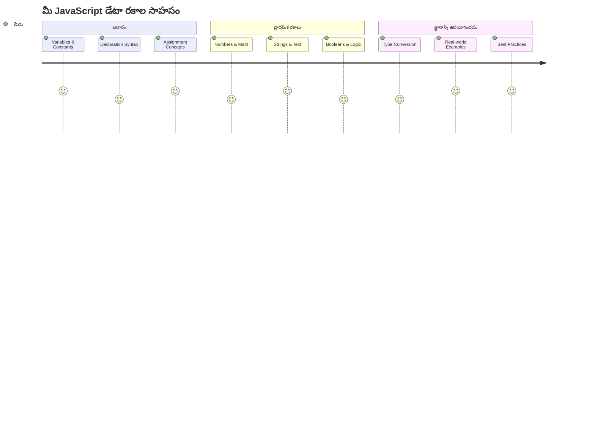
డేటా రకాలు జావాస్క్రిప్ట్‌లోని ప్రాథమిక భావనలలో ఒకటి, మీరు రాసే ప్రతి ప్రోగ్రాంలో మీరు ఎదుర్కొననేంటివి. డేటా రకాలని అలెగ్జాండ్రియాలో పురాతన గ్రంథాలయకర్తలు వాడిన ఫైలింగ్ సిస్టమ్ లా అనుకోండి – వారు కవితలు, గణితం, మరియు చరిత్రా రికార్డులు ఉన్న స్క్రోలు కోసం నిర్దిష్ట ప్రదేశాలు కలిగారు. జావాస్క్రిప్ట్ కూడా వివిధ రకాల డేటాకు విభిన్న వర్గాలు ఇలాచేరుస్తుంది.

ఈ పాఠంలో, జావాస్క్రిప్ట్‌ని పనిచేస్తించే ముఖ్యమైన డేటా రకాలను పరిశీలిస్తాము. మీరు సంఖ్యలు, పాఠ్యాలు, సత్య/అసత్య విలువలను ఎలా నిర్వహించాలో నేర్చుకుంటారు, మరియు సరైన రకం ఎంచుకోవడం మీ ప్రోగ్రామ్లకు ఎందుకు అవసరమో అర్థం చేసుకుంటారు. ఈ భావనలు మొదట్లో抽象ంగా అనిపించవచ్చు, కాని అనుభవంతో అవి సహజంగా మారతాయి.

డేటా రకాలను అర్థం చేసుకోవడం జావాస్క్రిప్ట్‌లోని మిగతా విషయాలన్నింటికీ స్పష్టత ఇస్తుంది. ఒక కేథెడ్రాల్ నిర్మించాలంటే శిల్పకారులు వివిధ నిర్మాణ పదార్థాలను అర్థం చేసుకోవాలి గానీ, ఇలాంటి ప్రాథమిక విషయాలు మీరు భవిష్యత్తులో తయారుచేసే ప్రతిదానికి మద్దతు ఇస్తాయి.

## లెక్చర్ ముందు క్విజ్
[లెక్చర్ ముందు క్విజ్](https://ff-quizzes.netlify.app/web/)

ఈ పాఠం వెబ్‌పై ఇంటరాక్టివిటీని అందించే జావాస్క్రిప్ట్ యొక్క మౌలికమైన అంశాలను కవరిస్తుంది.

> మీరు ఈ పాఠాన్ని [Microsoft Learn](https://docs.microsoft.com/learn/modules/web-development-101-variables/?WT.mc_id=academic-77807-sagibbon)లో కూడా తీసుకోవచ్చు!

[](https://youtube.com/watch?v=JNIXfGiDWM8 "Variables in JavaScript")

[](https://youtube.com/watch?v=AWfA95eLdq8 "Data Types in JavaScript")

> 🎥 పైన ఉన్న చిత్రాలను క్లిక్ చేస్తే వేరియబుల్స్ మరియు డేటా రకాల గురించి వీడియోలు వస్తాయి

వేరియబుల్స్ మరియు వాటిలో నిల్వ అయ్యే డేటా రకాలతో ప్రారంభిద్దాం!

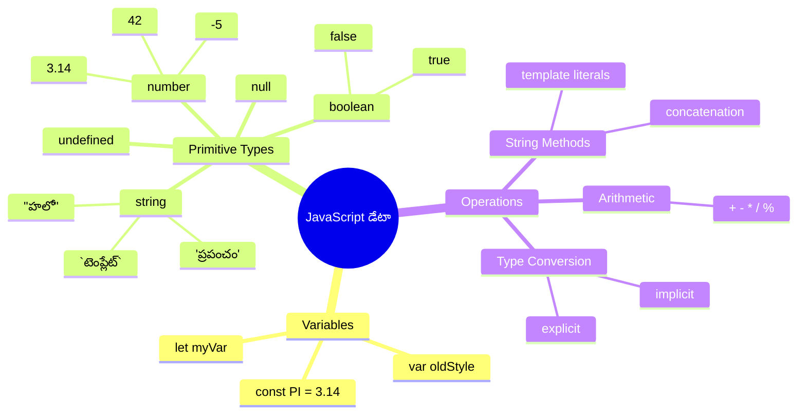
## వేరియబుల్స్

వేరియబుల్స్ ప్రోగ్రామింగ్‌లో ప్రాథమిక నిర్మాణ బ్లాకులు. మధ్యయుగ గంధకారుల వలె వివిధ పదార్థాలను నిల్వ చేసే స్టిక్కర్లు ఉన్న జార్లు లా, వేరియబుల్స్ మీరు సమాచారాన్ని నిల్వ చేసి దానికి వివరణాత్మక పేరు ఇస్తారు, తద్వారా మీరు మళ్లీ ఆ సమాచారాన్ని సూచించవచ్చు. ఎవరో యువత వయస్సును గుర్తు పెట్టుకోవాలా? దానిని `age` అనే వేరియబుల్‌లో నిల్వ చేయండి. ఒక వినియోగదారుని పేరు ట్రాక్ చేయాలా? దానిని `userName` అనే వేరియబుల్‌లో ఉంచండి.

మనం జావాస్క్రిప్ట్‌లో వేరియబుల్స్ సృష్టించడంలో ఆధునిక దృష్టికోణాన్ని పరిగణిస్తాము. మీరు ఇక్కడ నేర్చుకుంటున్న సాంకేతికతలు భాష అభివృద్ధి మరియు ప్రోగ్రామింగ్ స‌మాజం ద్వారా అభివృద్ధి చెందిన ఉత్తమ పద్ధతులను ప్రతిబింబిస్తాయి.

ఒక వేరియబుల్ సృష్టించడం మరియు **ప్రకటన చేయడం** ఈ విధంగా ఉంటుంది **[keyword] [name]**. ఇది రెండు భాగాల సంగమం:

- **కీవర్డ్**. మారగల వేరియబుల్స్ కోసం `let` ఉపయోగించండి, లేదా విలువ మారకదగినవి అయితే `const` ఉపయోగించండి.
- **వేరియబుల్ పేరు**, మీరు ఎంచుకునే వివరణాత్మక పేరు.

✅ `let` కీవర్డ్ ES6లో ప్రవేశపెట్టబడింది మరియు మీ వేరియబుల్‌కు ఒక _బ్లాక్ స్కోప్_ ఇస్తుంది. పాత `var` కీవర్డ్‌కి బదులుగా మీకు `let` లేదా `const` ఉపయోగించడం సిఫార్సు చేయబడుతుంది. బ్లాక్ స్కోప్స్ గురించి మేము భవిష్యత్తులో ఎక్కువగా మాట్లాడతాము.

### పని - వేరియబుల్స్ తో పని

1. **వేరియబుల్ ప్రకటించండి**. మన మొదటి వేరియబుల్ సృష్టించడం ప్రారంభిద్దాం:

    ```javascript
    let myVariable;
    ```

   **ఇది ఏమి సాధిస్తుంది:**
   - జావాస్క్రిప్ట్‌కి `myVariable` అనే నిల్వ స్థలాన్ని సృష్టించాలని చెబుతుంది
   - జావాస్క్రిప్ట్ ఈ వేరియబుల్ కోసం మెమరీలో స్థలం కేటాయిస్తుంది
   - వేరియబుల్‌ను ప్రస్తుతం ఏ విలువ లేదు (అర్థం కానిది)

2. **దానికి విలువ ఇవ్వండి**. ఇప్పుడు మన వేరియబుల్‌లో ఏదైనా ఉంచుదాం:

    ```javascript
    myVariable = 123;
    ```

   **అసైన్‌మెంట్ ఎలా పనిచేస్తింది:**
   - `=` ఆపరేటర్ 123 విలువను మా వేరియబుల్‌కు కేటాయిస్తుంది
   - వేరియబుల్ ఇప్పుడు ఎవ్వైదైన విలువులతో ఉంటుంది, అర్థం కానిది కాదు
   - మీరు `myVariable` వాడడం ద్వారా ఈ విలువను మీ కోడ్ మొత్తం అభియోగించవచ్చు

   > గమనిక: ఈ పాఠంలో `=` ఉపయోగించడం అంటే మేము "అసైన్‌మెంట్ ఆపరేటర్" వాడుతున్నాం, ఇది వేరియబుల్‌కు విలువ సెట్ చేసేందుకు ఉపయోగిస్తారు. ఇది సమానత్వాన్ని సూచించదు.

3. **సమర్థవంతమైన మార్గం**. వాస్తవానికి, ఈ రెండు దశలను కలిపిద్దాం:

    ```javascript
    let myVariable = 123;
    ```

    **ఈ విధానం ఎక్కువ సమర్థవంతం:**
    - ఒక అభిప్రాయంలో వేరియబుల్ ప్రకటించి విలువను కేటాయిస్తున్నారు
    - ఇది డెవలపర్లలో సాంప్రదాయ పద్ధతి
    - కోడ్ పొడవును తగ్గించినా స్పష్టత ఉంటుంది

4. **మార్చాలనుకుంటే**. వేరియబుల్ లో వేరే సంఖ్య ఉంచాలంటే?

   ```javascript
   myVariable = 321;
   ```

   **పునఃనియామకం అర్థం చేసుకోండి:**
   - వేరియబుల్ ఇప్పుడు 123 కాకుండా 321 కలిగి ఉంది
   - మొన్నటి విలువ మారు ఐనది – వేరియబుల్స్ ఒక్కోసారి ఒక్క విలువను నిల్వ చేస్తాయి
   - ఈ మారగలpekత `let`తో ప్రకటించిన వేరియబుల్స్ ముఖ్య లక్షణం

   ✅ ప్రయత్నించండి! మీరు మీ బ్రౌజర్‌లోనే జావాస్క్రిప్ట్ రాయవచ్చు. ఒక బ్రౌజర్ విండో తెరవండి మరియు డెవలపర్ టూల్స్‌కు వెళ్ళండి. కన్సోల్‌లో మీరు ఒక ప్రాంప్ట్ చూడగలరు; `let myVariable = 123` టైప్ చేసి, రిటర్న్ నొక్కండి, అప్పుడు `myVariable` టైప్ చేయండి. ఏం జరుగుతుంది? ఈ భావనలు తరువాతి పాఠాలలో మరింత వివరంగా నేర్చుకుంటారు.

### 🧠 **వేరియబుల్స్ ఆచరణ పరీక్ష: సౌకర్యంగా ఉండటానికి**

**వేరియబుల్స్ గురించి మీ భావన ఎలా ఉందో చూద్దాము:**
- వేరియబుల్ ప్రకటించడం మరియు అసైన్ చేయడంలో తేడా చెప్పగలరా?
- మీరు వేరియబుల్‌ను ప్రకటించేములోపల వాడితే ఏం జరుగుతుంది?
- ఎప్పుడు వేరియబుల్ కోసం `let` ను `const` కంటే ఎంపికచేస్తారు?

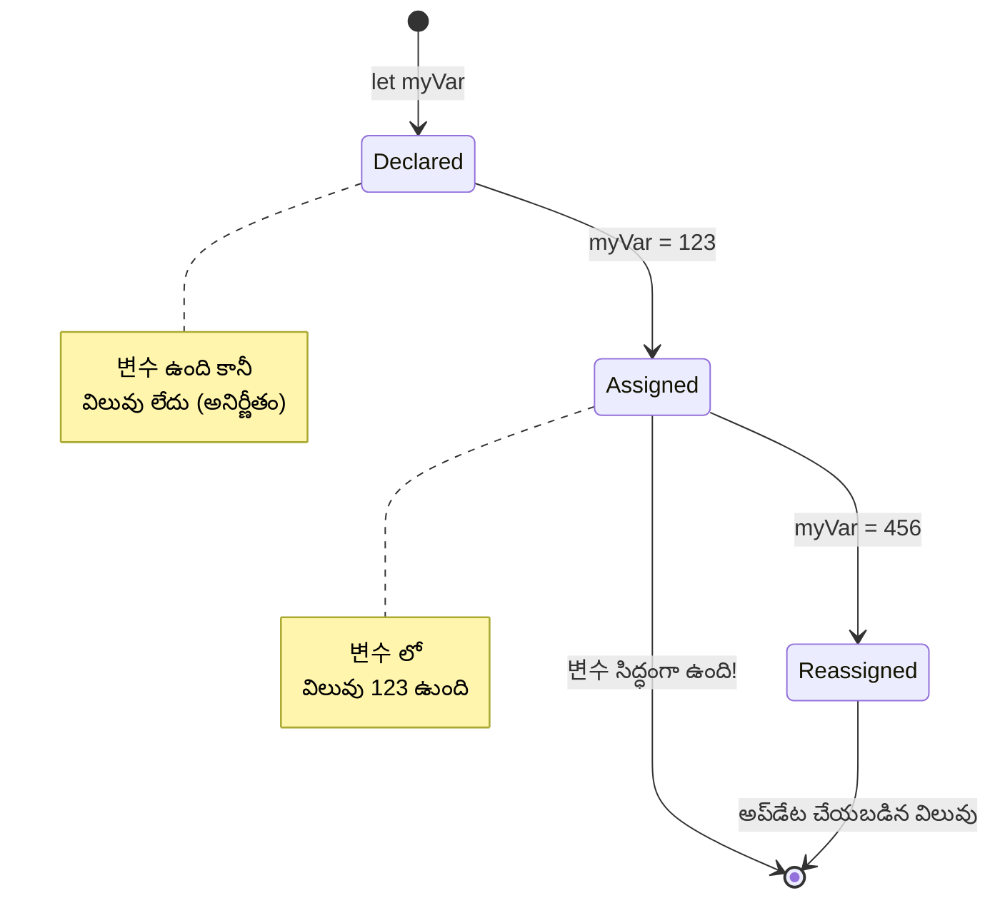
> **త్వరిత చిట్కా**: వేరియబుల్స్‌ని లేబుల్ చేసిన నిల్వ బాక్సుల్లా ఆలోచించండి. మీరు బాక్స్ సృష్టిస్తారు (`let`), దాంట్లో ఏదైనా ఇస్తారు (`=`), తరువాత అవసరమైతే దాన్ని మార్చవచ్చు!

## కాన్స్టెంట్స్

కొన్నిసార్లు మీరు ప్రోగ్రామ్ అమలులో యథాతథంగా మారని సమాచారం నిల్వ చేయాలి. కాన్స్టెంట్లు పురాతన గ్రీస్‌లో యుక్లిడ్ స్థాపించిన గణిత సూత్రాల లాగా – ఒకసారి నిరూపించబడి నమోదు అయ్యాక, అవి భవిష్యత్తులో ఎప్పుడూ మారవు.

కాన్స్టెంట్లు వేరియబుల్స్ లా పనిచేస్తాయి, అయితే ఒక ముఖ్యమైన పరిమితితో: మీరు వాటికి మొదటిసారి విలువను కేటాయించిన తరువాత, దానిని మార్చలేరు. ఈ స్థిరత్వం ప్రోగ్రామ్‌లో ముఖ్యమైన విలువలకు అనుకోని మార్పులకు అడ్డుకట్ట వేస్తుంది.

కాన్స్ట్ ప్రకటన మరియు ప్రారంభం వేరియబుల్‌ల వలే ఉంటుంది, కానీ కీవర్డ్ `const`. కాన్స్టెంట్లు సాధారణంగా పెద్ద అక్షరాలతో పేరిస్తారు.

```javascript
const MY_VARIABLE = 123;
```

**ఈ కోడ్ ఏమి చేస్తుంది:**
- **`MY_VARIABLE` అనే కాన్స్టెంట్ను 123 విలువతో సృష్టిస్తుంది**
- **కాన్స్టెంట్లకు పెద్ద అక్షరాల నేమింగ్ కాన్వెన్షన్ ఉపయోగిస్తుంది**
- **ఈ విలువకు భవిష్యత్తులో మార్పులు జరగకుండా నిరోధిస్తుంది**

కాన్స్టెంట్లకు రెండు ప్రధాన నియమాలు ఉన్నాయి:

- **వాళ్ళకు వెంటనే విలువ ఇవ్వాలి** – ఖాళీ కాన్స్టెంట్లు అనుమతించబడవు!
- **మీరు ఆ విలువను ఎప్పటికీ మార్చలేరు** – ప్రయత్నిస్తే జావాస్క్రిప్ట్ తప్పిదం చూపుతుంది. దీన్ని చూద్దాం:

   **సాధారణ విలువ** - ఈ క్రింది అనుమతించబడదు:
   
      ```javascript
      const PI = 3;
      PI = 4; // అనుమతించబడదు
      ```

   **మీరు గుర్తుంచుకోవాల్సింది:**
   - **కాన్స్టెంట్ పునఃనియామకం ప్రయత్నాలు తప్పుదోవ కలిగిస్తాయి**
   - **ముఖ్యమైన విలువలను అనుకోని మార్పుల నుంచి రక్షిస్తుంది**
   - **విలువ ప్రోగ్రామ్ అంతటికీ స్థిరంగా ఉంచుతుంది**
 
   **ఆబ్జెక్ట్ రిఫరెన్స్ రక్షించబడినది** - ఈ క్రింది అనుమతించబడదు:
   
      ```javascript
      const obj = { a: 3 };
      obj = { b: 5 } // అనుమతించబడదు
      ```

   **ఈ భావనలు అర్థం చేసుకోండి:**
   - **అన్ని ఆబ్జెక్ట్ను కొత్తదిగా మార్చకుండా నిరోధిస్తుంది**
   - **మొదటి ఆబ్జెక్ట్‌కు రిఫరెన్స్‌ను రక్షిస్తుంది**
   - **ఆబ్జెక్ట్ గుర్తింపును మెమరీలో నిలుపుతుంది**

    **ఆబ్జెక్ట్ విలువ రక్షించబడలేదు** - ఈ క్రింది అనుమతించబడుతుంది:
    
      ```javascript
      const obj = { a: 3 };
      obj.a = 5;  // అనుమతించబడింది
      ```

      **ఇక్కడ ఏమి జరుగుతుందో వివరణ:**
      - **ఆబ్జెక్ట్ లోపల ప్రాపర్టీ విలువను మార్చింది**
      - **అదే ఆబ్జెక్ట్ రిఫరెన్స్ నిలిపింది**
      - **ఆబ్జెక్ట్ కంటెంట్స్ మారవచ్చు కానీ రిఫరెన్స్ స్థిరంగా ఉంటుంది**

   > గమనిక, `const` అంటే రిఫరెన్స్ పునఃనియామకం నుంచి రక్షించబడింది. విలువ మాత్రం _అమర్యాదకరం_ కాదు, ముఖ్యంగా అది ఆబ్జెక్ట్ వంటి సంక్లిష్ట నిర్మాణం అయితే మారవచ్చు.

## డేటా రకాలు

జావాస్క్రిప్ట్ సమాచారం ను వివిధ వర్గాలుగా విభజిస్తుంది, వీటిని డేటా రకాలు అంటారు. ఈ భావన పురాతన పండితులు జ్ఞానాన్ని వర్గీకరించిన విధానాన్ని అనుసరిస్తుంది – అరిస్టోటిల్ వివిధ రకాల తర్కాన్ని వేరుగా చూపించాడు, ఎందుకంటే సాంఘిక సూత్రాలను కవిత, గణితం, ప్రకృతి తత్వశాస్త్రాలకు సమానంగా వర్తింపజేయలేవు.

డేటా రకాలు ముఖ్యం ఎందుకంటే వివిధ రకాల సమాచారం వివిధ ఆపరేషన్లతో పని చేస్తాయి. మీరు వ్యక్తి పేరుపై గణితం చేయలేము కాబట్టి గణిత సమీకరణని అల్ఫాబెట్ల క్రమంలో అమర్చలేము, అదే విధంగా జావాస్క్రిప్ట్ ప్రతి ఆపరేషన్ కు సరైన డేటా రకం కావాలి. దీని అర్థం వల్ల తప్పులూ తగ్గుతాయి మరియు మీ కోడ్ భరోసాలైనది అవుతుంది.

వేరియబుల్స్ అనేక రకాల విలువలను నిల్వ చేయగలవు, ఉదాహరణకు సంఖ్యలు మరియు పాఠ్యాలు. ఈ విలువల వివిధ రకాలే **డేటా రకం** గా పిలవబడతాయి. డేటా రకాలు సాఫ్ట్‌వేర్ అభివృద్ధిలో ముఖ్యమైనవి, ఎందుకంటే అవి డెవలపర్లకు కోడ్ రాయడంలో మరియు సాఫ్ట్‌వేర్ ఎలా నడిచించాలో నిర్ణయించడంలో సహాయపడతాయి. అంతేకాక, కొన్ని డేటా రకాలకు ప్రత్యేక లక్షణాలు ఉండి విలువలోని అదనపు సమాచారాన్ని మారుస్తాయి లేదా ఇవ్వగలవు.

✅ డేటా రకాలు జావాస్క్రిప్ట్ డేటా ప్రిమిటివ్ లాగా పిలవబడతాయి, ఎందుకంటే ఇవి భాష అందించే కనిష్ఠ స్థాయి డేటా రకాలు. ఏడు ప్రిమిటివ్ డాటా రకాలు ఉన్నాయి: string, number, bigint, boolean, undefined, null మరియు symbol. ప్రతీ ప్రిమిటివ్ ఏమిటో ఒక సారి ఊహించండి. `zebra` అంటే ఏమిటి? `0` అంటే? `true` అంటే?

### సంఖ్యలు

సంఖ్యలు జావాస్క్రిప్ట్‌లో అత్యంత సరళమైన డేటా రకం. మీరు 42 వంటి సంపూర్ణ సంఖ్యలు, 3.14 లాంటి దశాంసాలు, లేదా -5 లాంటి ప్రతికూల సంఖ్యలతో పని చేస్తున్నా, జావాస్క్రిప్ట్ వాటిని ఒకే విధంగా వ్యవహరిస్తుంది.

ముందు మన వేరియబుల్ గుర్తొచ్చా? మనం నిల్వ చేసిన 123 నిజానికి సంఖ్య డేటా రకం:

```javascript
let myVariable = 123;
```

**ప్రధాన లక్షణాలు:**
- జావాస్క్రిప్ట్ స్వయంచాలకంగా సంఖ్యల విలువలను గుర్తిస్తుంది
- మీరు ఈ వేరియబుల్స్‌తో గణిత ఆపరేషన్లను చేయవచ్చు
- ప్రత్యేక రకం ప్రకటన అవసరం లేదు

వేరియబుల్సందు అన్ని రకాల సంఖ్యలు నిల్వ చేయవచ్చు, దశాంసాలు లేదా ప్రతికూల సంఖ్యలు సహా. సంఖ్యలను గణిత ఆపరేటర్స్‌తో ఉపయోగించచ్చు, ఇది [తర్వాతి భాగంలో](../../../../2-js-basics/1-data-types) వివరించబడింది.

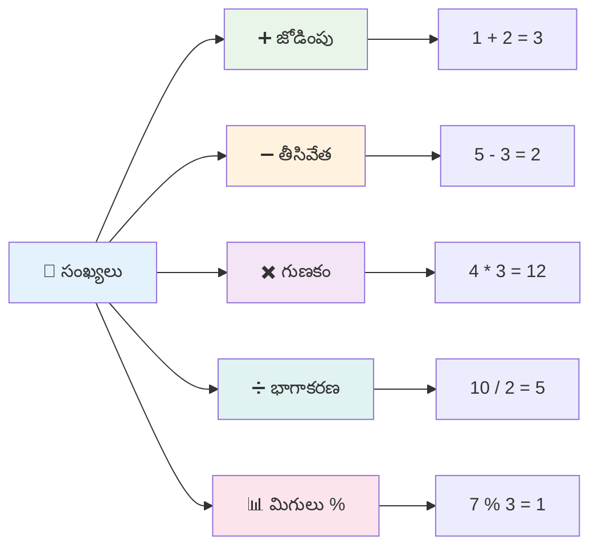
### గణిత ఆపరేటర్లు

గణిత ఆపరేటర్లు జావాస్క్రిప్ట్‌లో గణిత లెక్కింపులను చేయడానికి అనుమతిస్తాయి. ఈ ఆపరేటర్లు శతాబ్దాలుగా గణితజ్ఞులు ఉపయోగించిన సూత్రాలను అనుసరిస్తాయి – అల్-ఖ్వారిజ్మీ వంటి పండితుల రచనలలో కనిపించే అదే చిహ్నాలు.

ఆపరేటర్లు సంప్రదాయ గణిత విధానాలా పనిచేస్తాయి: వేసుకోవాలంటే జోడించడం, తీసివేయాలంటే తీసివేయడం, మొదలైనవి.

గణిత ఫంక్షన్లు నిర్వహించేటప్పుడు ఉపయోగించే కొన్ని ఆపరేటర్లను ఇక్కడ ను చూపడం జరిగింది:

| చిహ్నం | వివరణ                                                                | ఉదాహరణ                            |
| ------ | --------------------------------------------------------------------- | ---------------------------------- |
| `+`    | **జోడింపు**: రెండు సంఖ్యల మొత్తం లెక్కించు                            | `1 + 2 //అంచనా సమాధానం 3`         |
| `-`    | **వియోగం**: రెండు సంఖ్యల వ్యత్యాసం లెక్కించు                        | `1 - 2 //అంచనా సమాధానం -1`        |
| `*`    | **గుణకం**: రెండు సంఖ్యల గుణిత ఫలితం లెక్కించు                       | `1 * 2 //అంచనా సమాధానం 2`         |
| `/`    | **భాగం**: రెండు సంఖ్యల భాగఫల లెక్కించు                            | `1 / 2 //అంచనా సమాధానం 0.5`       |
| `%`    | **శేషం**: రెండు సంఖ్యల భాగించేటప్పుడు ఉన్న మిగులు లెక్కించు          | `1 % 2 //అంచనా సమాధానం 1`         |

✅ ప్రయత్నించండి! మీ బ్రౌజర్ కన్సోల్‌లో గణిత లెక్కింపు ఆపరేషన్ ఒకటి ప్రయత్నించండి. ఫలితాలు మిమ్మల్ని ఆశ్చర్యచకితులు చేస్తాయా?

### 🧮 **గణిత నైపుణ్యాల పరిశీలన: విశ్వాసంతో లెక్కించండి**

**మీ గణిత అర్థం పరీక్షించండి:**
- `/` (భాగం) మరియు `%` (శేషం) మధ్య తేడా ఏమిటి?
- `10 % 3` విలువు ఏమిటో ఊహించాల్సి ఉంది? (సూచన: అది 3.33 కాదు...)
- ప్రోగ్రామింగ్‌లో శేష ఆపరేటర్ ఎందుకు ఉపయోగకరమై ఉంటుంది?

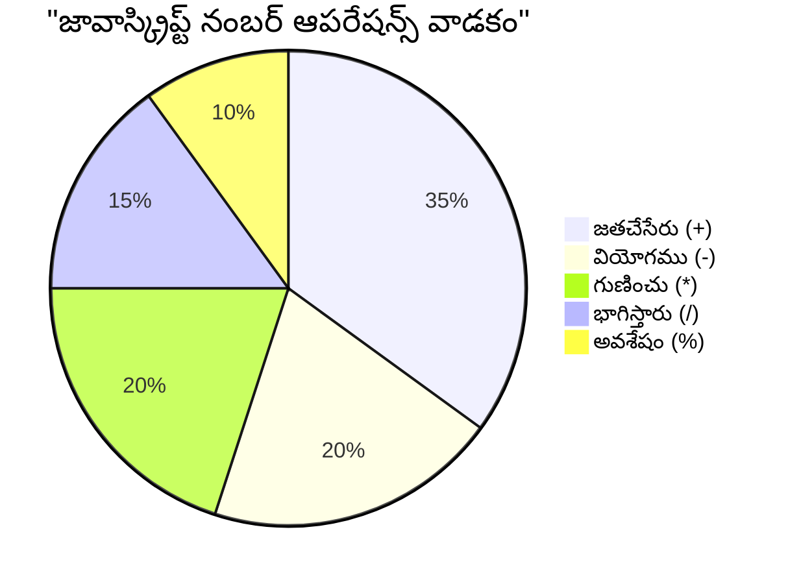
> **వాస్తవ ప్రపంచ అవగాహన**: శేష ఆపరేటర్ (%) సంఖ్యలు సమ/విసమ కాదా అని చూసేందుకు, నమూనాలు సృష్టించేందుకు లేదా అర్రేస్‌లో చక్రగతి కోసం గొప్పగా ఉపయోగపడుతుంది!

### స్ట్రింగ్స్

జావాస్క్రిప్ట్‌లో, పాఠ్య డేటాను స్ట్రింగ్స్ (strings) గా ప్రాతినిథ్యం చేస్తారు. "స్ట్రింగ్" పదం అక్షరాలను క్రమంగా జతకలిపిన విజ్ఞానం నుంచి వచ్చింది, మధ్యయుగ మఠాలలో శ్రద్ధగా అక్షరాల నుంచి పదాలు, వాక్యాలు తయారు చేసిన విధానాన్ని పోలి ఉంటుంది.

స్ట్రింగ్స్ వెబ్ డెవలప్‌మెంట్‌లో ప్రాథమికం. ఒక వెబ్‌సైట్‌పై చూపించే ప్రతి టెక్స్ట్ – వినియోగదారు పేర్లు, బటన్ లేబుల్స్, లోప సందేశాలు, కంటెంట్ – అన్ని స్ట్రింగ్ డేటాగా నిర్వహించబడతాయి. స్ట్రింగ్స్ అర్థం చేసుకోవడం పనితనపు యూజర్ ఇంటర్‌ఫేస్‌లను తయారుచేయడానికి అవసరం.

స్ట్రింగ్స్ ఒకల మేటి కోట్స్ లేదా ద్విటీయ కోట్స్ మధ్య ఉన్న అక్షరాల సమాహారం.

```javascript
'This is a string'
"This is also a string"
let myString = 'This is a string value stored in a variable';
```

**ఈ భావనలు అర్థం చేసుకోండి:**
- స్ట్రింగ్స్ నిర్వచించేందుకు ఒకల కోట్స్ `'` లేదా ద్విటీయ కోట్స్ `"` వాడతారు
- అక్షరాలు, సంఖ్యలు మరియు చిహ్నాలు ఉన్న పాఠ్య డేటాను నిల్వ చేస్తుంది
- వేరియబుల్స్ కోసం స్ట్రింగ్ విలువలను అసైన్ చేస్తుంది
- పాఠ్యాన్ని వేరియబుల్ номићతినుండి వేరుచేయడానికి కోట్స్ అవసరం

స్ట్రింగ్ రాయేటప్పుడు కోట్స్ వాడాలి, లేకపోతే జావాస్క్రిప్ట్ దానిని వేరియబుల్ పేరు అనుకుంటుంది.

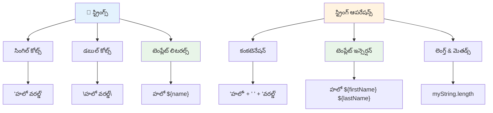
### స్ట్రింగ్ ఫార్మాటింగ్

స్ట్రింగ్ నిర్వహణ ద్వారా మీరు పాఠ్యం భాగాలను కలపవచ్చు, వేరియబుల్స్‌ను చేర్చవచ్చు, మరియు ప్రోగ్రామ్ పరిస్థితికి అనుగుణంగా సాంద్రీకృత కంటెంట్ సృష్టించవచ్చు. ఈ సాంకేతికత టెక్స్ట్‌ని ప్రోగ్రామింగ్ రూపంలో నిర్మించడానికి సహాయపడుతుంది.

సాధారణంగా, మీరు బహుళ స్ట్రింగ్స్ ని కలపాల్సి వస్తుంది – దీన్ని కనక్టెనేషన్ అంటారు.
రెండు లేదా అంతకంటే ఎక్కువ స్ట్రింగులను **కణకటించడానికి** లేదా వాటిని కలపడానికి, `+` ఆపరేటర్ ఉపయోగించండి.

```javascript
let myString1 = "Hello";
let myString2 = "World";

myString1 + myString2 + "!"; //హలో వరల్డ్!
myString1 + " " + myString2 + "!"; //హలో వరల్డ్!
myString1 + ", " + myString2 + "!"; //హలో, వరల్డ్!
```
  
**దశలవారీగా, ఇది ఏమి జరుగుతున్నది అనేది ఇక్కడ ఉంది:**  
- `+` ఆపరేటర్ ఉపయోగించి అనేక స్ట్రింగులను **మిళితం చేస్తుంది**  
- మొదటి ఉదాహరణలో స్ట్రింగులను మధ్యలో ఖాళీలు లేకుండా **కలపడం**  
- వాచకతకు స్ట్రింగుల మధ్య `" "` ఖాళీ అక్షరాలను **చేరుస్తుంది**  
- సరైన ఆకృతీకరణ కోసం కామాలు వంటి విరామార్థ చిహ్నాలను **చేర్చడం**

✅ JavaScriptలో ఎందుకు `1 + 1 = 2` కానీ `'1' + '1' = 11` అవుతుంది? దీని గురించి ఆలోచించండి. `'1' + 1` గురించి ఏం జరుగుతుంది?

**టెంప్లేట్ లిటరల్స్** అనేవి స్ట్రింగులను ఆకృతీకరించడానికి మరో మార్గం, కానీ క్వోట్ల బదులు బ్యాక్‌టిక్ ఉపయోగిస్తారు. ఏదైనా సున్నితమైన వచనం కాకుండా ఉంచాలి `${ }` ప్లేస్హోల్‌డర్లు లో. ఇందులో స్ట్రింగ్ అయ్యే వేరియబుల్స్ కూడా ఉంటాయి.

```javascript
let myString1 = "Hello";
let myString2 = "World";

`${myString1} ${myString2}!` //హెలో వరల్డ్!
`${myString1}, ${myString2}!` //హెలో, వరల్డ్!
```
  
**ప్రతి భాగాన్ని అర్థం చేసుకుందాం:**  
- టెంప్లేట్ లిటరల్స్ సృష్టించడానికి సాధారణ క్వోట్ల బదులు బ్యాక్‌టిక్కులు `` ` `` ఉపయోగిస్తుంది  
- `${}` ప్లేస్హోల్డర్ సింటాక్స్ ఉపయోగించి వేరియబుల్స్‌ను నేరుగా **ఎంబెడ్ చేస్తుంది**  
- ఖాళీలు మరియు ఆకృతీకరణను గానీ, అలాగే వ్రాయబడినట్లుగా **పూర్తిగా సంరక్షిస్తుంది**  
- వేరియబుల్స్ తో సంక్లిష్ట స్ట్రింగులను సృష్టించడానికి **చక్కటి పద్ధతి అందిస్తుంది**

ఈ రెండు విధానాలలో ఏదైనా మీ ఆకృతీకరణ అవసరాలను సాధించవచ్చు, కానీ టెంప్లేట్ లిటరల్స్ అన్ని ఖాళీలు మరియు లైన్ బ్రేక్స్ ని గౌరవిస్తాయి.

✅ టెంప్లేట్ లిటరల్ మరియు సాధారణ స్ట్రింగ్ ఎప్పుడు ఉపయోగిస్తారు?

### 🔤 **స్ట్రింగ్ నైపుణ్యం పరీక్ష: టెక్స్ట్ మానిప్యులేషన్ విశ్వాసం**

**మీ స్ట్రింగ్ నైపుణ్యాలను మూల్యాంకనం చేయండి:**  
- `'1' + '1'` ఎందుకు `2` కాదు `'11'` అవుతుంది అనేది మీరు వివరిస్తారా?  
- మీరు ఏ స్ట్రింగ్ పద్ధతిని మరింత వాచకతగా భావిస్తారు: కణకటన లేదా టెంప్లేట్ లిటరల్స్?  
- స్ట్రింగ్ చుట్టూ క్వోట్లను మర్చిపోయితే ఏమి జరుగుతుంది?

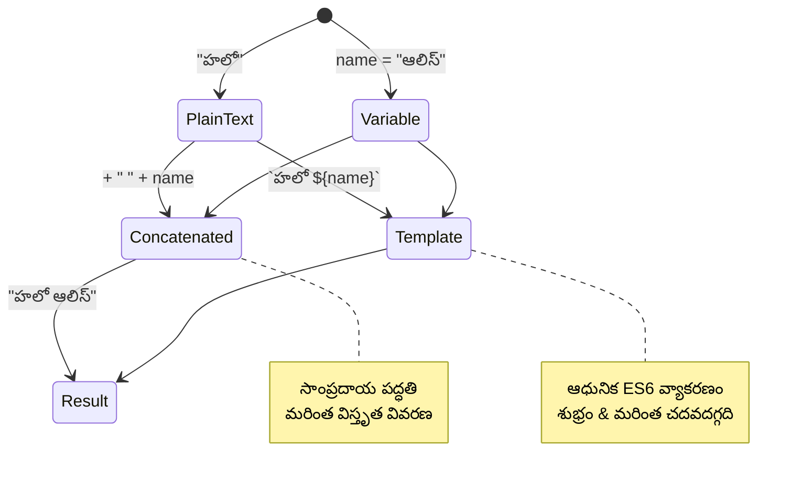
> **ప్రో టిప్**: సంక్లిష్ట స్ట్రింగ్ నిర్మాణానికి టెంప్లేట్ లిటరల్స్ సాధారణంగా ప్రాధాన్యం పొందుతాయి ఎందుకంటే అవి మరింత వాచకత కల్గిస్తూ బహుళ-లైన్ స్ట్రింగ్‌లను అద్భుతంగా నిర్వహిస్తాయి!

### బూలియన్స్

బూలియన్స్ అత్యంత సాదారణ డేటా రూపం: అవి দুটি విలువలలో ఒకదాన్ని మాత్రమే కలిగి ఉంటాయి – `true` లేదా `false`. ఈ బైనరీ లాజిక్ వ్యవస్థ 19వ శతాబ్దంలోని గణిత శాస్త్రజ్ఞుడు జర్జ్ బూల్ అభివృద్ధి చేసిన బూలియన్ ఆల్జీబ్రా నుండి వెలువడింది.

సాదాసీదాగా ఉన్నా, బూలియన్స్ ప్రోగ్రాం లాజిక్ కోసం చాలా అవసరమైనవి. అవి మీ కోడ్‌ను షరతుల ఆధారంగా నిర్ణయాలు తీసుకునే విధానాన్ని అనుమతిస్తాయి – వాడుకదారు లాగిన్ అయిందా, బటన్ క్లిక్ అయిందా, లేదా నిర్దిష్ట ప్రమాణాలు తీర్చబడ్డాయా అన్నది.

బూలియన్స్ రెండు విలువలే కలిగి ఉండవచ్చు: `true` లేదా `false`. బూలియన్స్ సహాయంతో నిర్దిష్ట షరతులు తీరినప్పుడు ఏ కోడ్ లైన్లు అమలు అవుతాయో మీరు నిర్ణయించవచ్చు. చాలా సందర్భాల్లో, [ఆపరేటర్లు](../../../../2-js-basics/1-data-types) బూలియన్ విలువను సెట్ చేయడంలో సహాయపడతాయి, మరియు మీరు తరచూ వేరియబుల్స్‌ ప్రారంభం, లేదా వాటి విలువలు ఆపరేటర్ సహాయంతో నవీకరింపబడుతున్నట్టు గమనిస్తారు.

```javascript
let myTrueBool = true;
let myFalseBool = false;
```
  
**పైన చేసినది:**  
- బూలియన్ విలువ `true` ని నిలుపుకొనే వేరియబుల్‌ను **సృష్టించాము**  
- బూలియన్ విలువ `false` ని నిలుపుకోవడం **ప్రదర్శించాము**  
- ఖచ్చితంగా `true` మరియు `false` అనే కీవర్డ్స్ ను (క్వోట్ల అవసరం లేదు) **ఉపయోగించాము**  
- ఈ వేరియబుల్స్‌ను షరతు భావన లలో ఉపయోగించేందుకు **సిద్ధం చేసాము**

✅ ఒక వేరియబుల్‌ను 'ట్రూతీ' అని పరిగణించవచ్చు అంటే అది బూలియన్ `true` గా తేలికవ్వాలి. ఆసక్తికరంగా, JavaScriptలో, [అన్ని విలువలు ట్రూతీగా పరిగణించబడతాయి, తప్ప టాల్సీగా నిర్వచించబడినవి మాత్రమే భిన్నంగా ఉంటాయి](https://developer.mozilla.org/docs/Glossary/Truthy).

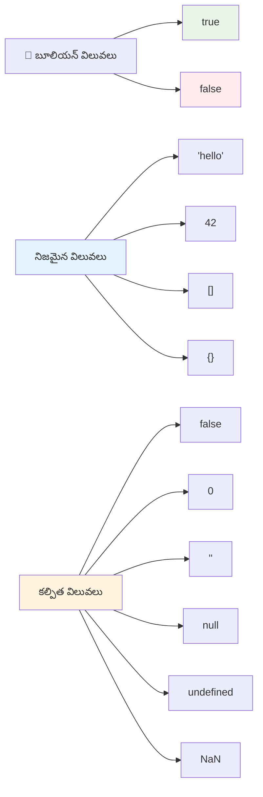
### 🎯 **బూలియన్ లాజిక్ పరీక్ష: నిర్ణయం తీసుకునే నైపుణ్యాలు**

**మీ బూలియన్ అవగాహనను పరీక్షించండి:**  
- మీరు ఎందుకు అనుకుంటున్నారు JavaScriptలో `true` మరియు `false` కంటే మరింత "ట్రూతీ" మరియు "టాల్సీ" విలువలు కూడా ఉన్నాయని?  
- `0`, `"0"`, `[]`, `"false"`లో ఏది టాల్సీ అని మీరు భావిస్తారు?  
- బూలియన్స్ ప్రోగ్రాం ఫ్లో నియంత్రణలో ఎలా ఉపయోగపడతాయి?

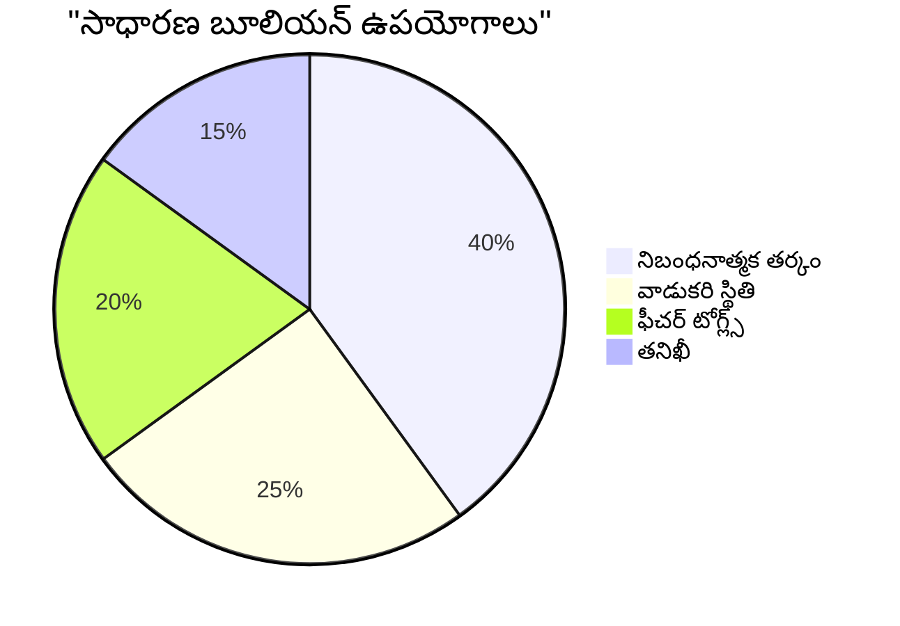
> **గమనించండి**: JavaScriptలో, కేవలం ఈ 6 విలువలు టాల్సీ: `false`, `0`, `""`, `null`, `undefined`, మరియు `NaN`. అన్ని ఇతర విలువలు ట్రూతీ!

---

## 📊 **మీ డేటా రకాల సాధనాల సంక్షిప్తం**

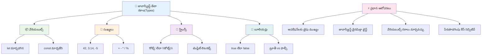
## GitHub Copilot ఏజెంట్ సవాలు 🚀

ఏజెంట్ మోడ్ ఉపయోగించి క్రింది సవాలను పూర్తి చేయండి:

**వివరణ:** మీరు ఈ పాఠంలో నేర్పుకున్న అన్ని JavaScript డేటా రకాల ఉపయోగాలను ప్రదర్శించే వ్యక్తిగత సమాచార నిర్వాహకిని నిర్మించండి. ఇది వాస్తవ ప్రపంచ డేటా సన్నివేశాలను నిర్వహిస్తుంది.

**ప్రాంప్ట్:** వ్యక్తి పేరు (స్ట్రింగ్), వయస్సు (నంబర్), విద్యార్థి స్థితి (బూలియన్), ఇష్ట రంగులు జాబితాగా (అర్రే), మరియు అడ్రస్ (స్ట్రీట్, సిటీ, జిప్ కోడ్) కలిగిన యూజర్ ప్రొఫైల్ ఆబ్జెక్టును సృష్టించే JavaScript ప్రోగ్రాం రూపొందించండి. ప్రొఫైల్ సమాచారాన్ని ప్రదర్శించడానికి మరియు వ్యక్తిగత ఫీల్డులను నవీకరించడానికి ఫంక్షన్లు చేర్చండి. స్ట్రింగ్ కణకటన, టెంప్లేట్ లిటరల్స్, వయస్సుతో గణిత ఆపరేషన్లు మరియు విద్యార్థి స్థితి కోసం బూలియన్ లాజిక్ ఉపయోగాన్ని చూపండి.

[ఏజెంట్ మోడ్ గురించి మరింత](https://code.visualstudio.com/blogs/2025/02/24/introducing-copilot-agent-mode) తెలుసుకోండి.

## 🚀 సవాలు

JavaScriptలో కొన్ని ప్రవర్తనలు డెవలపర్లు ఆశ్చర్యానికి గురిచేయవచ్చు. ఒక ప్రాచీన ఉదాహరణ: బ్రౌజర్ కన్సోల్ లో టైప్ చేయండి: `let age = 1; let Age = 2; age == Age` మరియు ఫలితాన్ని గమనించండి. ఇది `false` ఇస్తుంది – కారణం మీరు గమనించగలరా?

ఇది JavaScriptలో అర్థం చేసుకోవలసిన అనేక ప్రవర్తనలలో ఒకటి మాత్రమే. ఈ విచిత్రతలను తెలుసుకోవడం మంచి విశ్వసనీయ కోడ్ రాయడానికి మరియు సమస్యలు డీబగ్ చేయడానికి సహాయపడుతుంది.

## లెక్చర్ తర్వాత క్విజ్  
[లెక్చర్ తర్వాత క్విజ్](https://ff-quizzes.netlify.app)

## సమీక్ష & స్వీయ అధ్యయనం

[ఈ JavaScript వ్యాయామాల జాబితా](https://css-tricks.com/snippets/javascript/)ని చూడండి మరియు ఒకటి ప్రయత్నించండి. మీరు ఏమి నేర్చుకున్నారు?

## అసైన్మెంట్

[డేటా రకాలు అభ్యాసం](assignment.md)

## 🚀 మీ JavaScript డేటా రకాల ప్రావీణ్యం టైమ్‌లైన్

### ⚡ **తర్వాతి 5 నిమిషాల్లో మీరు చేయగలిగేది**  
- [ ] బ్రౌజర్ కన్సోల్ తెరవండి మరియు వేర్వేరు డేటా రకాలతో 3 వేరియబుల్స్ సృష్టించండి  
- [ ] సవాలు ప్రయత్నించండి: `let age = 1; let Age = 2; age == Age` మరియు ఎందుకు false అవుతుంది తెలుసుకోండి  
- [ ] మీ పేరు మరియు ఇష్ట సంఖ్యతో స్ట్రింగ్ కణకటనం ప్రాక్టీస్ చేయండి  
- [ ] ఒక స్ట్రింగ్ కు సంఖ్య జోడించినప్పుడు ఏమి జరుగుతుందో పరీక్షించండి

### 🎯 **ఈ గంటలో మీరు సాధించగలిగేది**  
- [ ] పాఠం తర్వాత క్విజ్ పూర్తి చేసి ఎటువంటి సందేహాలు ఉన్నాయో సమీక్షించండి  
- [ ] రెండు సంఖ్యలను యాడ్, సబ్‌ట్రాక్ట్, మల్టిప్లై, డివైడ్ చేసే మిని కాల్క్యులేటర్ సృష్టించండి  
- [ ] టెంప్లేట్ లిటరల్స్ ఉపయోగించి సరళమైన పేరు ఆకృతీకర్తను తయారు చేయండి  
- [ ] `==` మరియు `===` తులనాత్మక ఆపరేటర్ల మధ్య వ్యత్యాసాలను అన్వేషించండి  
- [ ] వేర్వేరు డేటా రకాల మధ్య మార్పిడి ప్రాక్టీస్ చేయండి

### 📅 **మీ వారాంతం JavaScript పునాదులు**  
- [ ] అసైన్‌మెంట్‌ను నమ్మకంతో మరియు సృజనాత్మకతతో పూర్తి చేయండి  
- [ ] నేర్చుకున్న అన్ని డేటా రకాలతో వ్యక్తిగత ప్రొఫైల్ ఆబ్జెక్టును సృష్టించండి  
- [ ] [CSS-Tricks నుండి JavaScript వ్యాయామాలతో](https://css-tricks.com/snippets/javascript/) ప్రాక్టీస్ చేయండి  
- [ ] బూలియన్ లాజిక్ ఉపయోగించి సరళమైన ఫారమ్ వాలిడేటర్ సృష్టించండి  
- [ ] అర్రే మరియు ఆబ్జెక్ట్ డేటా రకాలపై ప్రాక్టీస్ చేయండి (భవిష్యత్తు పాఠాల అవలోకనం)  
- [ ] JavaScript కమ్యూనిటీతో చేరి డేటా రకాల గురించి ప్రశ్నలు అడగండి

### 🌟 **మీ నెల రోజుల మార్పు**  
- [ ] పెద్ద ప్రోగ్రామింగ్ ప్రాజెక్టుల్లో డేటా రకాల జ్ఞానాన్ని ప్రముఖంగా ఉపయోగించండి  
- [ ] ప్రతి డేటా రకాన్ని నిజ జీవిత అనువర్తనాల్లో ఎప్పుడు మరియు ఎందుకు ఉపయోగించాలో అర్థం చేసుకోండి  
- [ ] ఇతర ప్రారంభకులకు JavaScript ప్రాథమికాలను అర్థం చేసుకోవడంలో సహాయం చేయండి  
- [ ] భిన్న రకాల యూజర్ డేటాను నిర్వహించే చిన్న అప్లికేషన్ నిర్మించండి  
- [ ] టైపు కోర్షన్ మరియు కఠిన సరిపోలిక (strict equality) వంటి అధునాతన డేటా రక భావనలను అన్వేషించండి  
- [ ] డాక్యుమెంటేషన్ మెరుగుదలతో ఓపెన్ సోర్స్ JavaScript ప్రాజెక్టులకు సహాయం చేయండి

### 🧠 **చివరి డేటా రక ప్రావీణ్యత తనిఖీ**

**మీ JavaScript ప్రాధమికాన్ని జరుపుకోండి:**  
- ఏ డేటా రకం దాని ప్రవర్తన పరంగా మీకు అత్యంత ఆశ్చర్యంగా అనిపించింది?  
- వేరియబుల్స్ మరియు కాన్స్టెంట్లను స్నేహితుడికి వివరించడంలో మీరు ఎంత సంతృప్తిగా ఉన్నారు?  
- JavaScript టైపు వ్యవస్థ గురించి మీరిచ్చిన అత్యంత ఆసక్తికర విషయం ఏమిటి?  
- ఈ ప్రాథమికాలతో మీరు ఏ నిజ జీవిత అనువర్తనాన్ని నిర్మించవచ్చు అని ఊహించుకోవచ్చు?

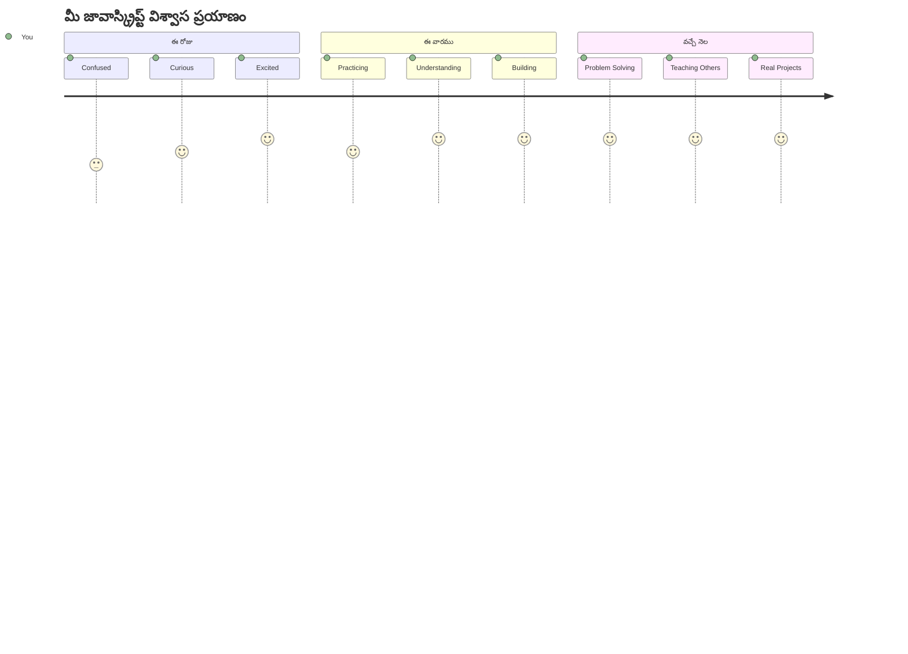
> 💡 **మీరు ప్రాథమికాలను నిర్మించారు!** డేటా రకాలు అక్షరమాల నేర్చుకోవడం లాంటిది, కథలు రాయడానికి ముందు. మీరు రాసే ప్రతి JavaScript ప్రోగ్రామ్ ఈ ప్రాథమిక భావనలను ఉపయోగిస్తాయి. మీరు ఇప్పుడు ఇంటరాక్టివ్ వెబ్‌సైట్లు, డైనమిక్ అప్లికేషన్లు మరియు వాస్తవ ప్రపంచ సమస్యలను కోడ్ తో పరిష్కరించడానికి నిర్మాణ బ్లోక్స్ కలిగి ఉన్నారు. JavaScript యొక్క అద్భుత ప్రపంచానికి స్వాగతం! 🎉

---

<!-- CO-OP TRANSLATOR DISCLAIMER START -->
**వెలిపించే నోటీసు**:  
ఈ డాక్యుమెంట్‌ను AI అనువాద సేవ [Co-op Translator](https://github.com/Azure/co-op-translator) ఉపయోగించి అనువదించబడింది. మేము సరిగా ఉండే ప్రయత్నం చేస్తాం, అయినప్పటికీ ఆటోమేటెడ్ అనువాదాల్లో తప్పులు లేదా పొరపాట్లు ఉండవచ్చు. మూల డాక్యుమెంట్ native భాషలోనే అధికారిక మూలంగా పరిగణించాలి. ప్రధాన సమాచారం కోసం, వృత్తిపరమైన మానవ అనువాదం సిఫారసు చేయబడుతుంది. ఈ అనువాదం వాడినందರಿಂದ కలిగే ఏ తప్పుదోవలుబాళ్ళకో లేదా తప్పుడు అర్థాలకో మేము బాధ్యత వహించమేము.
<!-- CO-OP TRANSLATOR DISCLAIMER END -->