<!--
CO_OP_TRANSLATOR_METADATA:
{
  "original_hash": "71f7d7dafa1c7194d79ddac87f669ff9",
  "translation_date": "2026-01-08T12:21:56+00:00",
  "source_file": "2-js-basics/2-functions-methods/README.md",
  "language_code": "te"
}
-->
# జావాస్క్రిప్ట్ బేసిక్స్: మెల్యాళ్లు మరియు ఫంక్షన్లు


> స్కెచ్ నోట్ చేసిన [టోమోమి ఇమురా](https://twitter.com/girlie_mac)

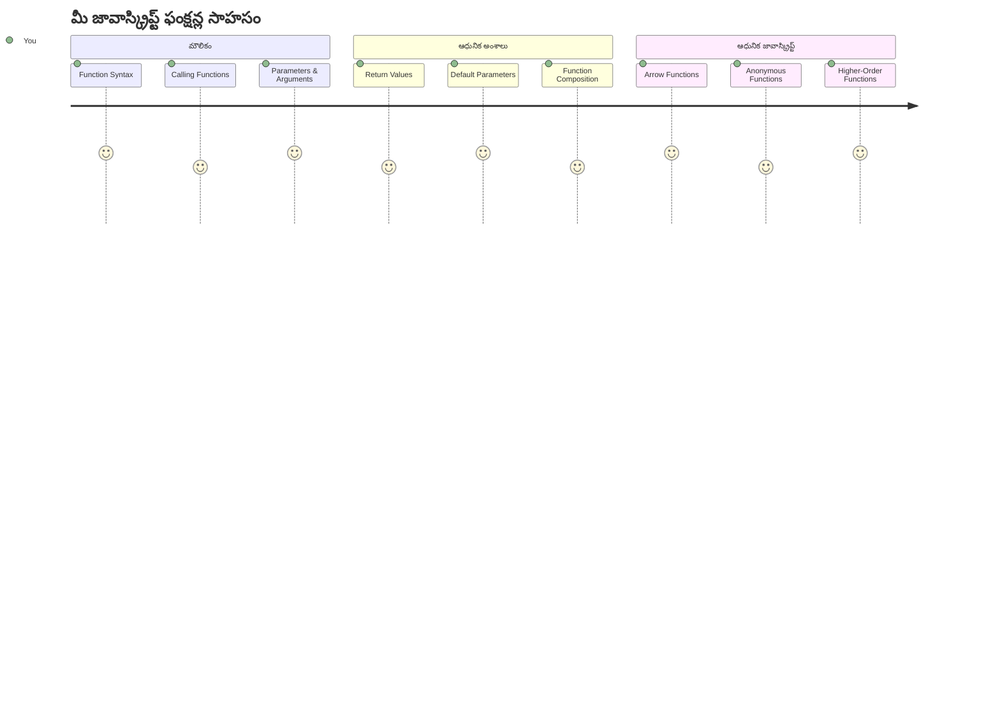
## లెక్చర్ ముందు క్విజ్
[లెక్చర్ ముందు క్విజ్](https://ff-quizzes.netlify.app)

అనే కోడ్ ను పునరావృతం చేయడం ప్రోగ్రామింగ్ లో అత్యంత సాధారణమైన నిరాశలలో ఒకటి. ఫంక్షన్లు ఈ సమస్యను పరిష్కరిస్తాయి, మీరు కోడ్ ను పునర్వినియోగయోగ్యమైన బ్లాక్‌లలో ప్యాకేజీ చేయగలుగుతారు. ఫంక్షన్లను హెన్రీ ఫోర్డ్ అసెంబ్లీ లైన్ విప్లవాత్మకంగా చేసింది అటువంటి ప్రమాణీకృత భాగాలుగా పరిగణించండి – ఒక నమ్మదగిన భాగాన్ని సృష్టించిన తర్వాత, మీరు దాన్ని ఎక్కడ కావలే అక్కడ ఉపయోగించవచ్చు, మొదలుఅరు నుండి పునర్రచయించడం అవసరం లేదు.

ఫంక్షన్లు మీకు కోడ్ భాగాలను బండిల్ చేయడానికి అనుమతిస్తాయి, కాబట్టి మీరు వాటిని మీ ప్రోగ్రామ్ లో ఎక్కడైనా పునర్వినియోగం చేసుకోవచ్చు. ప్రతి చోటా అదే లాజిక్ ను కాపీ చేసి పేస్ట్ చేయాలనుకోవడం వులా కాకుండా, మీరు ఒకసారి ఫంక్షన్ ను సృష్టించి అవసరమైనప్పుడు దాన్ని కాల్ చేయవచ్చు. ఈ విధానం మీ కోడ్ ను సుసంఘటితంగా ఉంచుతుంది మరియు తాజాకరణలను ఎంతో సులభంగా చేస్తుంది.

ఈ పాఠంలో, మీరు మీ స్వంత ఫంక్షన్లను ఎలా సృష్టించాలో, వారికి సమాచారాన్ని ఎలా పంపించాలో, మరియు ఉపయోగకరమైన ఫలితాలను ఎలా తీసుకోవాలో నేర్చుకుంటారు. మీరు ఫంక్షన్ల మరియు మెల్యాళ్ల మధ్య తేడాను గుర్తిస్తారు, ఆధునిక సింటాక్స్ పద్ధతులను నేరుగుతారు మరియు ఫంక్షన్లు ఇతర ఫంక్షన్లతో ఎలా పనిచెయ్యగలవో చూస్తారు. ఈ కాన్సెప్ట్‌లను దశల వారీగా మీరు ఏర్పాటు చేస్తారు.

[](https://youtube.com/watch?v=XgKsD6Zwvlc "Methods and Functions")

> 🎥 పై చిత్రాన్ని క్లిక్ చేసి మెల్యాళ్లు మరియు ఫంక్షన్ల గురించి వీడియో చూడండి.

> మీరు ఈ పాఠాన్ని [Microsoft Learn](https://docs.microsoft.com/learn/modules/web-development-101-functions/?WT.mc_id=academic-77807-sagibbon)లో కూడా తీసుకోవచ్చు!

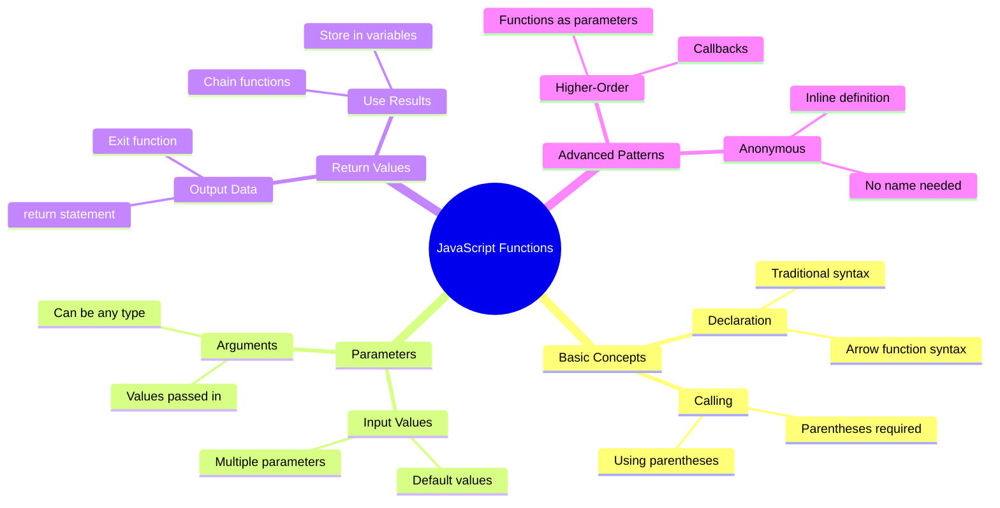
## ఫంక్షన్లు

ఫంక్షన్ అనేది ఒక స్వయంక్రియాత్మక కోడ్ బ్లాక్, ఇది నిర్దిష్ట పనిని నిర్వహిస్తుంది. ఇది మీరు కావలసినపుడు అమలు చేసుకునే లాజిక్‌ను కలిపి ఉంచుతుంది.

మీ ప్రోగ్రామ్‌లో ఒకటే కోడ్‌ను బహుళసార్లు రాయడం అంతే కాకుండా, మీరు దానిని ఒక ఫంక్షన్‌లో ప్యాకేజీ చేసి అవసరమైనప్పుడు ఆ ఫంక్షన్‌ను కాల్ చేయవచ్చు. ఈ విధానం మీ కోడ్‌ను శుభ్రంగా ఉంచుతుంది మరియు నవీకరణలను చాలా సులభతరం చేస్తుంది. మీ కోడ్‌బేస్‌లో 20 వేర్వేరు ప్రదేశాల్లో వ్యాప్తిస్థితిలో ఉన్న లాజిక్‌ను మార్చాల్సి వచ్చినపుడు సంరక్షణ సవాలును బట్టి చూడండి.

మీ ఫంక్షన్ల పేర్లను వివరణాత్మకంగా పెట్టడం అత్యవసరం. బాగా నామకరణం చేపట్టిన ఫంక్షన్ దాని ఉద్దేశాన్ని స్పష్టంగా తెలియజేస్తుంది – మీరు `cancelTimer()` ను చూసే వాతావరణంలో అది ఏమి చేస్తుందో వెంటనే అర్థమవుతుంది, అలాగే స్పష్టంగా లేబుల్ చేసిన బటన్ మీరు క్లిక్ చేసినా ఏమి జరుగుతుందో మీకు చెప్పుతుంది.

## ఫంక్షన్ సృష్టించడం మరియు కాల్ చేయడం

మనం ఫంక్షన్‌ని ఎలా సృష్టించమో పరిశీలించుకుందాం. సింటాక్స్ నిరంతర నమూనాను అనుసరిస్తుంది:

```javascript
function nameOfFunction() { // ఫంక్షన్ నిర్వచనం
 // ఫంక్షన్ నిర్వచనం/శరీరం
}
```

దాన్ని విడగొట్టి చూద్దాం:
- `function` కీవర్డ్ జావాస్క్రిప్ట్‌కు "నేను ఫంక్షన్ సృష్టిస్తున్నాను!" అని చెప్తుంది
- `nameOfFunction` వద్ద మీరు మీ ఫంక్షన్‌కు వివరణాత్మక పేరు ఇస్తారు
- కోణాకాసులు `()` లో మీరు పారామితులను చేర్చవచ్చు (దాన్ని త్వరలో చూడబోతాము)
- కలుపు బ్రేసులు `{}` లో మీరు ఫంక్షన్ ని కాల్ చేసినపుడు నడిచే అసలు కోడ్ ఉంటుంది

మనం సింపుల్ గ్రీటింగ్ ఫంక్షన్‌ని తయారు చేసి దీన్ని పరిశీలిద్దాం:

```javascript
function displayGreeting() {
  console.log('Hello, world!');
}
```

ఈ ఫంక్షన్ కంసోల్ లో "Hello, world!" అనే సందేశాన్ని ప్రింట్ చేస్తుంది. మీరు దీన్ని నిర్వచించిన తర్వాత, మీరు దీన్ని ఎటువంటి విధంగా అనేకసార్లు ఉపయోగించవచ్చు.

మీరు మీ ఫంక్షన్‌ను అమలు చేయాలంటే (లేదా "కాల్స్" చేయాలంటే), దాని పేరును తర్వాత కోణాకాసులు రాయండి. జావాస్క్రిప్ట్ మీ ఫంక్షన్‌ను మీరు కాల్ చేసే ముందు లేదా తరువాత నిర్వచించడానికి అనుమతిస్తుంది – జావాస్క్రిప్ట్ యంత్రం అమలు ఆర్డర్‌ను నిర్వహిస్తుంది.

```javascript
// మన ఫังก్షన్‌ను కాల్ చేస్తున్నాం
displayGreeting();
```

మీరు ఈ వరుసను నడిపితే, మీరు `displayGreeting` ఫంక్షన్ లోని అన్ని కోడ్‌ను అమలు చేస్తుంది, మీ బ్రౌజర్ కన్సోల్ లో "Hello, world!" ప్రదర్శిస్తుంది. మీరు ఈ ఫంక్షన్ ను పునర్వినియోగం చేయవచ్చు.

### 🧠 **ఫంక్షన్ ప్రాథమిక పరీక్ష: మీ మొదటి ఫంక్షన్ల నిర్మాణం**

**ప్రాథమిక ఫంక్షన్ల గురించి మీ భావనను తెలుసుకుందాం:**
- ఫంక్షన్ నిర్వచనాలలో `{}` కలుపు బ్రేసులు ఎందుకు వాడుతాము?
- మీరు `displayGreeting` ను కోణాకాసులు లేకుండా రాసినప్పుడెమిటి జరుగుతుంది?
- మీరు అదే ఫంక్షన్‌ను పునరావృతంగా ఎందుకు కాల్ చేయాలనుకుంటారు?

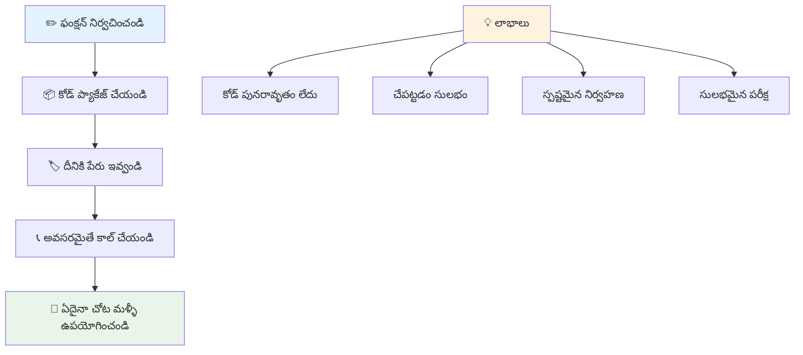
> **గమనిక:** మీరు ఈ పాఠాలలో **మెథడ్స్** ను ఉపయోగిస్తున్నారు. `console.log()` అనేది ఒక మెథడ్ – అంటే `console` ఆబ్జెక్ట్ కు సంబంధించిన ఒక ఫంక్షన్. ప్రధాన తేడా ఏమిటంటే, మెథడ్లు ఆబ్జెక్టులలో జోడింపబడతాయి, కానీ ఫంక్షన్లు స్వతంత్రంగా ఉంటాయి. చాలా డెవలపర్లు సాధారణ సంభాషణలో ఈ పదాలను పరస్పరం మార్పిడిగా ఉపయోగిస్తారు.

### ఫంక్షన్ ఉత్తమ ఉపయోగాలు

మంచి ఫంక్షన్లు వ్రాయడానికి కొన్ని చిట్కాలు:

- మీ ఫంక్షన్లకు స్పష్టమైన, వివరణాత్మక పేర్లు పెట్టండి – భవిష్యత్తులో మీరు ధన్యవాదములు తెలుపుతారు!
- బహుళపద పేర్ల కోసం **camelCase** ఉపయోగించండి (ఉదా: `calculateTotal` బదులు `calculate_total`)
- ప్రతి ఫంక్షన్ ఒకదే పని అద్భుతంగా చేయడం పైన దృష్టి పెట్టండి

## ఫంక్షన్ కి సమాచారాన్ని ఇవ్వడం

మన `displayGreeting` ఫంక్షన్ పరిమితమైంది – ఇది అన్నింటికీ `"Hello, world!"` మాత్రమే ప్రదర్శించగలదు. పారామితులు ఫంక్షన్లను మరింత సువిధాత్మకంగా మరియు ఉపయోగకరంగా మార్చేందుకు దోహదపడతాయి.

**పారామితులు** అనేవి ప్లేస్‌హోల్డర్ల్లా ఉంటాయి, మీరు ప్రతి సారి ఫంక్షన్ ఉపయోగించినప్పుడు వేరే విలువలను చేర్చవచ్చు. ఇలా, అదే ఫంక్షన్ ప్రతి కాల్ లో వేరే సమాచారంతో పనిచేస్తుంది.

మీరు ఫంక్షన్ నిర్వచించినప్పుడు పారామితులను కోణాకాసులలో పెట్టాలి, ఏకకాలంలో అనేక పారామితులను విరామచిహ్నంతో విడగొడతారు:

```javascript
function name(param, param2, param3) {

}
```

ప్రతి పారామిటర్ ఒక ప్లేస్‌హోల్డర్ లాంటిదే – మీరు ఎవరికైనా మీ ఫంక్షన్ ను కాల్ చేస్తే వారు నిజమైన విలువలను ఇస్తారు, అవి ఈ చోట్లకి జత చేయబడతాయి.

మన గ్రీటింగ్ ఫంక్షన్ సరికొత్తగా పేరు పొందుడం చేయేద్దాం:

```javascript
function displayGreeting(name) {
  const message = `Hello, ${name}!`;
  console.log(message);
}
```

ఇక్కడ మీరు బ్యాక్‌టిక్స్ (`` ` ``) మరియు `${}` ఉపయోగించి పేరును సందేశంలో నేరుగా చేర్చటం గమనించండి – ఇదే టెంప్లెట్ లిటరల్ అని అంటారు, ఇది వేరియబుల్స్ మిళితStrings సృష్టించడానికి చాలా ఉపయోగకరమైన పద్ధతి.

ఇప్పుడు మనం ఫంక్షన్ ను కాల్ చేస్తే ఏ పేరైనా ఇస్తాం:

```javascript
displayGreeting('Christopher');
// అమలు చేసినప్పుడు "హలో, క్రిస్టోఫర్!" చూపిస్తుంది
```

జావాస్క్రిప్ట్ కూడా `'Christopher'` ను `name` పేరామితి కి కేటాయించి, వ్యక్తిగతీకరించిన సందేశం "Hello, Christopher!" ని తయారు చేస్తుంది.

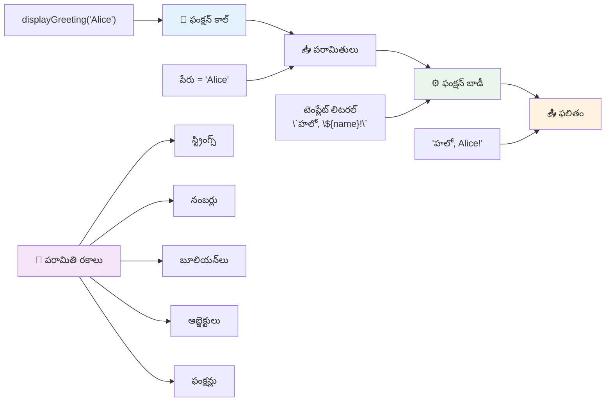
## డిఫాల్ట్ విలువలు

మంచి దృష్టాంతం! మనం కొంత పారామితులను ఐచ్ఛికం గా చేసుకోవాలనుకుంటే? అందుకు డిఫాల్ట్ విలువలు ఉపయోగపడతాయి!

మనం కొందరు మనం అభివాద పదాన్ని కస్టమైజ్ చేసుకోవాలని అనుకుంటే, కానీ వారు ఇచ్చకపోతే "Hello"ని డిఫాల్ట్ గా వాడే విధంగా సెటప్ చేయవచ్చు. డిఫాల్ట్ విలువలను సమానతరియక చిహ్నం ఉపయోగించి సెట్టింగ్ చేయవచ్చు, వేరియబుల్ వలే:

```javascript
function displayGreeting(name, salutation='Hello') {
  console.log(`${salutation}, ${name}`);
}
```

ఇక్కడ, `name` ఇంకా అవసరం, కానీ `salutation` కు ఎవరైనా విభిన్నమైన గ్రీటింగ్ అందించనప్పుడు `'Hello'` బ్యాకప్ విలువ ఉంది.

ఇప్పుడు మనం ఈ ఫంక్షన్‌ను రెండు విధాలుగా కాల్ చేయవచ్చు:

```javascript
displayGreeting('Christopher');
// "హలో, క్రిస్టోఫర్" ప్రదర్శిస్తుంది

displayGreeting('Christopher', 'Hi');
// "హాయ్, క్రిస్టోఫర్" ప్రదర్శిస్తుంది
```

మొదటి కాల్ లో, మేము గ్రీటింగ్ చెప్పలేదు కనుక జావాస్క్రిప్ట్ డిఫాల్ట్ "Hello" వాడుతుంది. రెండవ కాల్ లో, మన కస్టమ్ "Hi" ఉపయోగిస్తారు. ఈ సౌలభ్యం ఫంక్షన్లను వివిధ పరిస్థితులకు అనుకూలంగా మారుస్తుంది.

### 🎛️ **పారామితుల నైపుణ్యం పరీక్ష: ఫంక్షన్లను సడలించుట**

**మీ పారామితుల అర్థం ని పరీక్షించండి:**
- పారామితి మరియు ఆర్గ్యుమెంట్ మధ్య తేడా ఏమిటి?
- నిజ జీవిత ప్రోగ్రామింగ్‌లో డిఫాల్ట్ విలువలు ఎందుకు ఉపయోగకరంగా ఉంటాయి?
- మీరు పారామితుల కంటే ఎక్కువ ఆర్గ్యుమెంట్లు పంపితే ఏమవుతుంది అని ఊహించగలరా?

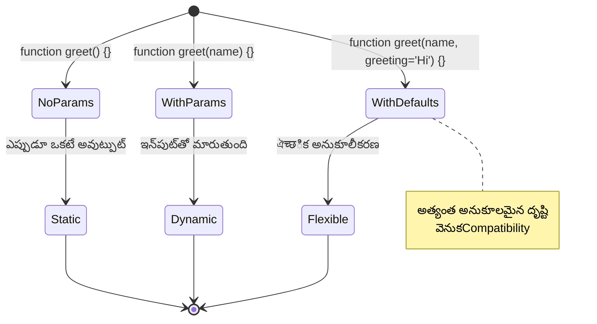
> **ప్రో టిప్**: డిఫాల్ట్ పారామితులు మీ ఫంక్షన్లను ఎక్కువ వినియోగదారుల అనుకూలంగా చేస్తాయి. వినియోగదారులు తగిన మౌలిక విలువలతో త్వరగా ప్రారంభించగలుగుతారు, అయినప్పటికీ అవసరమైతే నిబంధనలను వ్యవస్థీకరించవచ్చు!

## రిటర్న్ విలువలు

ఇప్పటి వరకు మన ఫంక్షన్లు సందేశాలను కంసోల్ లో మాత్రమే ప్రింట్ చేస్తున్నారు, కానీ మీరు ఫంక్షన్ ను ఏదో లెక్కించి ఆ ఫలితాన్ని తిరిగి ఇవ్వాలని అనుకుంటే?

అక్కడ **return values** అనే అంశం వస్తుంది. ఏదో ప్రదర్శించటం కాకుండా, ఫంక్షన్ మీరు నిల్వ చేసుకునే వేరియబుల్ లేదా మీ కోడ్ యొక్క ఇతర భాగాల్లో ఉపయోగించే విలువను తిరిగి ఇస్తుంది.

విలువను తిరిగి ఇవ్వటానికి, మీరు `return` కీవర్డ్ ని ఉపయోగించి ఆ విలువను వ్రాయాలి:

```javascript
return myVariable;
```

ఇంకో ముఖ్య విషయం ఇదే: ఫంక్షన్ `return` స్టేట్‌మెంట్‌ను ఎదుర్కొన్నప్పుడే వెంటనే ఆపి, ఆ విలువను దాన్ని కాల్ చేసిన దానికి రిటర్న్ చేస్తుంది.

మన గ్రీటింగ్ ఫంక్షన్ ను ప్రింట్ చేయాలంటే కాకుండా, సందేశాన్ని తయారుచేసి తిరిగి ఇచ్చేలా మార్చుద్దాం:

```javascript
function createGreetingMessage(name) {
  const message = `Hello, ${name}`;
  return message;
}
```

ఇప్పుడు ఈ ఫంక్షన్ గ్రీటింగ్ ను ప్రింట్ చేయకుండా సృష్టించి మాకు పంపిస్తుంది.

తిరిగి వచ్చిన విలువను ఉపయోగించటానికి, దాన్ని వేరియబుల్ లో నిల్వ చేయవచ్చు:

```javascript
const greetingMessage = createGreetingMessage('Christopher');
```

ఇప్పుడు `greetingMessage` లో "Hello, Christopher" ఉంటుంది, దాన్ని మీరు ఎక్కడైనా ఉపయోగించవచ్చు – వెబ్ పేజీ లో చూపించడానికి, ఇమెయిల్ లో చేర్చడానికి లేదా మరొక ఫంక్షన్ కు అందించడానికి.

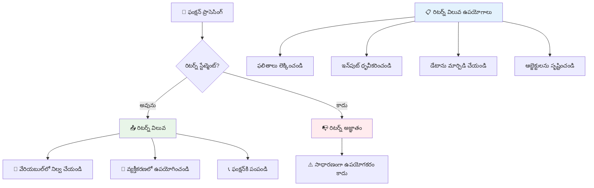
### 🔄 **రిటర్న్ విలువల పరీక్ష: ఫలితాలను తిరిగి పొందటం**

**రితర్న్ విలువల అర్థం మీరు ఎంతవరకు గ్రహించారో ధరించండి:**
- ఫంక్షన్ లో `return` స్టేట్‌మెంట్ తరువాత కోడ్ కు ఏమి జరుగుతుంది?
- కలపకుండా ప్రింట్ కంటే రిటర్న్ చేయడం ఎందుకు మంచిదని భావిస్తారు?
- ఒక ఫంక్షన్ వేరే వర్గాల విలువలు (స్ట్రింగ్, నంబర్, బూలియన్) రిటర్న్ చేయగలదా?

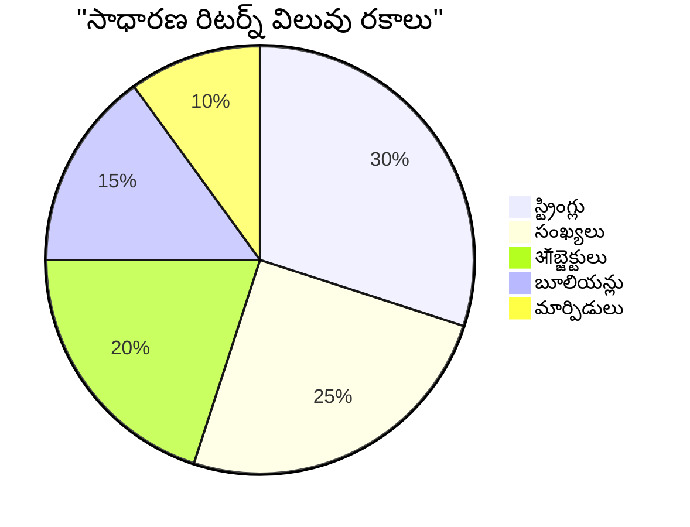
> **ప్రధానంగా గుర్తు పెట్టుకోండి**: విలువలను రిటర్న్ చేసే ఫంక్షన్లు మరింత సౌలభ్యంగా ఉంటాయి ఎందుకంటే కాలర్ ఆ ఫలితాన్ని ఎలా వాడాలో నిర్ణయిస్తారు. ఇది మీ కోడ్ ను మరింత మాడ్యులర్ మరియు పునర్వినియోగయోగ్యంగా చేస్తుంది!

## ఫంక్షన్లు ఫంక్షన్లకు పారామితులుగా

ఫంక్షన్లను ఇతర ఫంక్షన్లకు పారామితులుగా పంపవచ్చు. మొదట ఇది క్లిష్టంగా అనిపించవచ్చు, కానీ ఇది శక్తివంతమైన ఫీచర్, ఇది సడలించగల ప్రోగ్రామింగ్ నమూనాలను వీలు చేస్తుంది.

ఈ నమూనా చాలా సాధారణం, "ఏదైనా జరిగింది అంటే, ఇది చేయు" అని చెప్పాలి అని ఉంటే చాలు. ఉదాహరణకి, "టైమర్ ముగిసినప్పుడు ఈ కోడ్ నడపండి" లేదా "వినియోగదారు బటన్ క్లిక్ చేసినప్పుడు ఈ ఫంక్షన్ ను కాల్ చేయండి."

`setTimeout` అనే బిల్ట్-ఇన్ ఫంక్షన్ ని చూద్దాం, ఇది కొంత సమయం వెయిట్ చేసి తరువాత కొంత కోడ్ నడిపిస్తుంది. మనం దానికి ఏ కోడ్ నడిపించాలో చెప్పాలి – ఫంక్షన్ పంపే ఉత్తమ సందర్భం!

ఈ కోడ్ ప్రయత్నించండి – 3 సెకన్ల తర్వాత ఒక సందేశం కనిపిస్తుంది:

```javascript
function displayDone() {
  console.log('3 seconds has elapsed');
}
// టైమర్ విలువ మిల్లీసెకన్లలో ఉంటుంది
setTimeout(displayDone, 3000);
```

మేము `displayDone` ను (కోణాకాసులు లేకుండా) `setTimeout` కి పంపుతున్నాము గమనించండి. మనం ఆ ఫంక్షన్‌ను స్వయంగా కాల్ చేయడం లేదు – దాన్ని `setTimeout` కు ఇచ్చి "3 సెకన్ల తర్వాత దీన్ని కాల్ చేయు" అని చెబుతున్నాము.

### అనామక ఫంక్షన్లు

కొన్నిసార్లు మీరు ఒక్క పని కోసం ఒక ఫంక్షన్ కావాలి, అది పేరు పెట్టకపోవచ్చు. ఆలోచించండి – మీరు ఒకసారి మాత్రమే ఉపయోగించేది అంటే, కోడ్లో అదనపు పేరు ఎందుకు జోడించాలి?

జావాస్క్రిప్ట్ మీకు **అనామక ఫంక్షన్లు** సృష్టించే అవకాశం ఇస్తుంది – పేర్లేని ఫంక్షన్లు, వాటిని మీరు అప్పుడు మరియు అక్కడ నిర్వచించవచ్చు.

మనం మా టైమర్ ఉదాహరణను అనామక ఫంక్షన్ తో ఇలా మళ్లీ వ్రాయవచ్చు:

```javascript
setTimeout(function() {
  console.log('3 seconds has elapsed');
}, 3000);
```

ఇది అదే ఫలితాన్ని ఇస్తుంది, కానీ ఫంక్షన్ ను `setTimeout` కాల్ లోనే నేరుగా నిర్వచించడం వల్ల వేరొక డిక్లరేషన్ అవసరం లేదు.

### ఫ్యాట్ యారో ఫంక్షన్లు

ఆధునిక జావాస్క్రిప్ట్ లో ఫంక్షన్లు రాయడానికి మరింత సంక్షిప్త పద్ధతి ఉంది, దాన్ని **యారో ఫంక్షన్స్** అంటారు. వారు `=>` ఉపయోగిస్తారు (ఒక యారో లా కనిపిస్తుంది), మరియు డెవలపర్లలో చాలా ప్రాచుర్యం పొందాయి.

యారో ఫంక్షన్స్ మీరు `function` కీవర్డ్ వదిలివేసి సంక్షిప్తమైన కోడ్ రాయడానికి అనుమతిస్తాయి.

మా టైమర్ ఉదాహరణను యారో ఫంక్షన్‌తో ఇలా వ్రాస్తారు:

```javascript
setTimeout(() => {
  console.log('3 seconds has elapsed');
}, 3000);
```

`()` లో పారామితులు ఉంటాయి (ఇక్కడ ఖాళీగా ఉంది), తరువాత యారో `=>` వస్తుంది, మరియు చివరగా ఫంక్షన్ బాడీ కలుపు బ్రేసుల్లో ఉంటుంది. ఇది అదే ఫంక్షన్ పని చేస్తుంది మరింత సంక్షిప్త సింటాక్స్‌తో.

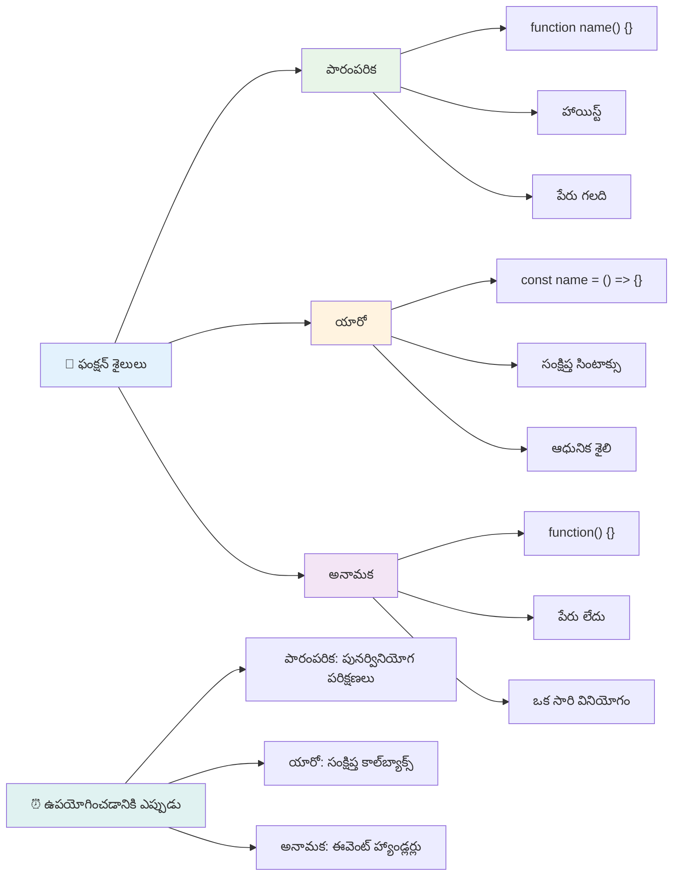
### ప్రతి విధానాన్ని ఎప్పుడు ఉపయోగించాలి

ప్రతీ విధానాన్ని ఎప్పుడు వాడాలంటే? ఒక ప్రాక్టికల్ మార్గదర్శకం: మీరు ఫంక్షన్ ను అనేకసార్లు ఉపయోగించాలనుకుంటే, దానికి పేరు పెట్టి వేరుగా నిర్వచించు. ఒక ప్రత్యేక పని కోసం అయితే, అనామక ఫంక్షన్ పరిగణించండి. యారో ఫంక్షన్స్ మరియు సాంప్రదాయ సింటాక్స్ రెండూ సరైన ఎంపికలు, అయితే ఆధునిక జావాస్క్రిప్ట్ కోడ్ బేసులలో యారో ఫంక్షన్స్ ఎక్కువగా వాడతారు.

### 🎨 **ఫంక్షన్ శైలుల నైపుణ్యం పరీక్ష: సరైన సింటాక్స్ ఎంచుకోవడం**

**మీ సింటాక్స్ అర్థాంతాన్ని పరీక్షించండి:**
- మీరు ఎప్పుడు యారో ఫంక్షన్స్ ను సాంప్రదాయ ఫంక్షన్ సింటాక్స్ కంటే ప్రాధాన్యం ఇస్తారు?
- అనామక ఫంక్షన్ యొక్క ప్రధాన ప్రయోజనం ఏమిటి?
- పేరు ఉన్న ఫంక్షన్ అనామక ఫంక్షన్ తో పోలిస్తే ఎప్పుడు మెరుగుగా ఉంటుంది అనుకుంటారు?

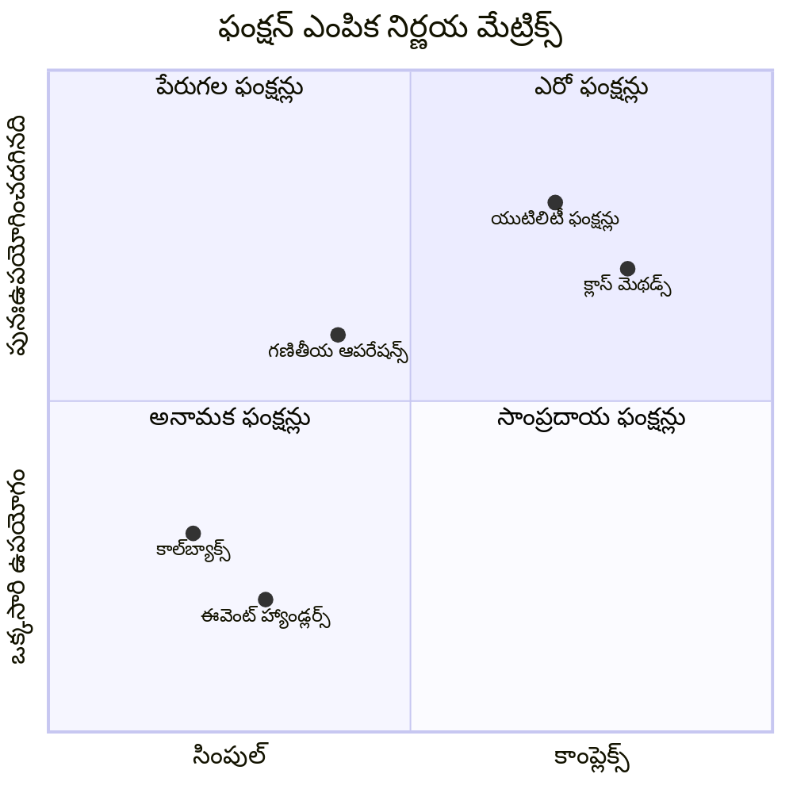
> **మొదర్న ట్రెండ్**: యారో ఫంక్షన్స్ సంక్షిప్తమైన సింటాక్స్ కారణంగా చాలా డెవలపర్లకు చెలామణి అవుతున్నాయి, అయినప్పటికీ సాంప్రదాయ ఫంక్షన్లకు కూడా ఇంకా ప్రాముఖ్యత ఉంది!

---


## 🚀 సవాలు

ఫంక్షన్లు మరియు మెథడ్ల మధ్య తేడాను ఒక వాక్యంలో వివరించగలరా? ప్రయత్నించండి!

## GitHub Copilot Agent సవాలు 🚀

క్రింది సవాలుని పూర్తి చేయడానికి ఏజెంట్ మోడ్ ఉపయోగించండి:

**వివరణ:** ఈ పాఠంలో కవర్ చేసిన వివిధ ఫంక్షన్ కాన్సెప్ట్‌లను, మాదిరిగా పారామితులు, డిఫాల్ట్ విలువలు, రిటర్న్ విలువలు, మరియు యారో ఫంక్షన్లతో కూడిన గణిత సంబంధిత ఫంక్షన్‌ల ఉపయోగిత గ్రంథాలయాన్ని సృష్టించండి.

**ప్రాంప్ట్:** `mathUtils.js` అనే ఒక జావాస్క్రిప్ట్ ఫైల్ సృష్టించండి, ఇందులో క్రింద వివరించిన ఫంక్షన్లు ఉండాలి:
1. రెండు పారామితులు తీసుకుని వాటి యోగాన్ని ఇవ్వు `add` ఫంక్షన్
2. డిఫాల్ట్ పారామితుల విలువలతో `multiply` ఫంక్షన్ (రెండో పారామితి డిఫాల్ట్ గా 1)
3. ఒక సంఖ్య తీసుకొని దాని చదరంగం ఇచ్చే యారో ఫంక్షన్ `square`
4. మరో ఫంక్షన్ మరియు రెండు సంఖ్యలను పారామితులుగా తీసుకుని ఆ ఫంక్షన్ ను ఆ సంఖ్యలపై అమలు చేసే `calculate` ఫంక్షన్
5. ప్రతి ఫంక్షన్ ను సంబంధిత టెస్ట్ కేసులతో కాల్ చేస్తూ ప్రకటన చేయండి

[ఏజెంట్ మోడ్ గురించి మరింత చదవండి](https://code.visualstudio.com/blogs/2025/02/24/introducing-copilot-agent-mode).

## లెక్చర్ తరువాత క్విజ్
[లెక్చర్ తరువాత క్విజ్](https://ff-quizzes.netlify.app)

## సమీక్ష & స్వవిద్య

కోడింగ్ బేసుల్లో యారో ఫంక్షన్లు ಹೆಚ್ಚుతున్నాయని గమనించి, [యారో ఫంక్షన్లపై మరింత చదవటం](https://developer.mozilla.org/docs/Web/JavaScript/Reference/Functions/Arrow_functions) విలువయుతం. ఒక ఫంక్షన్ రాయడం అభ్యసించి, తరువాత దాన్ని ఈ సింటాక్స్ తో మళ్లీ రాయండి.

## అస్సైన్మెంట్

[ఫంక్షన్లతో సరదా](assignment.md)

---

## 🧰 **మీ జావాస్క్రిప్ట్ ఫంక్షన్స్ సాధన పెట్టి 요약ం**

```mermaid
graph TD
    A["🎯 జావాస్క్రిప్ట్ ఫంక్షన్స్"] --> B["📋 ఫంక్షన్ డిక్లరేషన్"]
    A --> C["📥 పరామితులు"]
    A --> D["📤 రిటర్న్ విలువలు"]
    A --> E["🎨 ఆధునిక సంకేతవిధానం"]
    
    B --> B1["function name() {}"]
    B --> B2["వివరణాత్మక పేరుపొందింపు"]
    B --> B3["పునరావృత కోడ్ బ్లాక్స్"]
    
    C --> C1["ఇన్‌పుట్ డేటా"]
    C --> C2["మూల్యపు విలువలు"]
    C --> C3["బహుళ పరామితులు"]
    
    D --> D1["return స్టייט్మెంట్"]
    D --> D2["ఫంక్షన్ నిష్క్రమణ"]
    D --> D3["డేటా తిరిగి పంపించండి"]
    
    E --> E1["అర్రో ఫంక్షన్స్: () =>"]
    E --> E2["నామరహిత ఫంక్షన్స్"]
    E --> E3["అధిక-ఆర్డర్ ఫంక్షన్స్"]
    
    F["⚡ ప్రధాన ప్రయోజనాలు"] --> F1["కోడ్ పునర్వినియోగం"]
    F --> F2["మంచి వ్యవస్థీకరణ"]
    F --> F3["ఈజీ పరీక్ష"]
    F --> F4["మాడ్యులర్ డిజైన్"]
    
    style A fill:#e3f2fd
    style B fill:#e8f5e8
    style C fill:#fff3e0
    style D fill:#f3e5f5
    style E fill:#e0f2f1
    style F fill:#fce4ec
```
---

## 🚀 మీ జావాస్క్రిప్ట్ ఫంక్షన్స్ ప్రావీణ్యత సమయరేఖ

### ⚡ **తర్వాతి 5 నిమిషాల్లో మీరు చేయగలిగేది**
- [ ] మీ ఇష్టమైన సంఖ్యను రిటర్న్ చేసే ఒక సింపుల్ ఫంక్షన్ రాయండి
- [ ] రెండు పారామితుల కలిగిన మరియు వాటిని కలిపే ఫంక్షన్ సృష్టించండి
- [ ] సాంప్రదాయ ఫంక్షన్‌ను ఆర్రో ఫంక్షన్_Syntaxకి మార్పిడి చేయడానికి ప్రయత్నించండి
- [ ] ఛాలెంజ్‌ను అభ్యసించండి: ఫంక్షన్లు మరియు మెథడ్స్ మధ్య తేడాను వివరించండి

### 🎯 **ఈ గంటలో మీరు సాధించగలిగేది**
- [ ] పోస్ట్-లెసన్ క్విజ్ పూర్తి చేసి ఏదైనా గందరగోళమైన కాన్సెప్ట్‌లను సమీక్షించండి
- [ ] GitHub Copilot ఛాలెంజ్ నుండి మ్యాథ్ యుటిలిటీస్ లైబ్రరీ నిర్మించండి
- [ ] ఒక ఫంక్షన్‌ను పారామీటరుగా ఉపయోగించే మరో ఫంక్షన్ సృష్టించండి
- [ ] డిఫాల్ట్ పారామీటర్లతో ఫంక్షన్లను రాయడం అభ్యసించండి
- [ ] ఫంక్షన్ రిటర్న్ విలువలలో టెంప్లేట్ లిటర అలను ప్రయోగించండి

### 📅 **మీ వారపత్రిక ఫంక్షన్ నైపుణ్యం**
- [ ] "ఫన్ విత్ ఫంక్షన్స్" అసైన్‌మెంట్‌ను సృజనాత్మకంగా పూర్తి చేయండి
- [ ] మీరు రాయగా పునరావృతమైన కోడ్‌ను పునర్వినియోగయోగ్య ఫంక్షన్లుగా మార్చండి
- [ ] కేవలం ఫంక్షన్లను ఉపయోగించి చిన్న క్యాలკ్యులేటర్‌ను నిర్మించండి (గ్లోబల్ వేరియబుల్స్ లేకపోయినా సరే)
- [ ] `map()` మరియు `filter()` వంటి అర్రే మెథడ్లతో ఆర్రో ఫంక్షన్లను అభ్యసించండి
- [ ] సాధారణ పనుల కోసం యుటిలిటి ఫంక్షన్ల సేకరణను రూపొందించండి
- [ ] హయ్యర్-ఆర్డర్ ఫంక్షన్లు మరియు ఫంక్షనల్ ప్రోగ్రామింగ్ కాన్సెప్ట్‌లను అధ్యయనం చేయండి

### 🌟 **మీ నెలపాటు పరివర్తనం**
- [ ] క్లోజర్‌లు మరియు స్కోప్ వంటి అధిక స్థాయి ఫంక్షన్ కాన్సెప్ట్‌లను చక్కన చేసుకోండి
- [ ] ఫంక్షన్ కంపోజిషన్‌ని విస్తృతంగా ఉపయోగించే ప్రాజెక్ట్‌ను నిర్మించండి
- [ ] ఫంక్షన్ డాక్యుమెంటేషన్ మెరుగుపరచడం ద్వారా ఓపెన్ సోర్స్‌కు విరాళం ఇవ్వండి
- [ ] మరొకరికి ఫంక్షన్లు మరియు విభిన్న సింటాక్స్ శైలుల గురించి బోధించండి
- [ ] జావాస్క్రిప్ట్‌లో ఫంక్షనల్ ప్రోగ్రామింగ్ పద్ధతులను అన్వేషించండి
- [ ] భవిష్యపు ప్రాజెక్ట్‌ల కోసం పునర్వినియోగయోగ్యమైన వ్యక్తిగత ఫంక్షన్ లైబ్రరీని సృష్టించండి

### 🏆 **అంతిమ ఫంక్షన్స్ ఛాంపియన్ చెక్-ఇన్**

**మీ ఫంక్షన్ నైపుణ్యాన్ని జరుపుకోండి:**
- ఇప్పటివరకు మీరు సృష్టించిన అత్యంత ఉపయోగకరమైన ఫంక్షన్ ఏది?
- ఫంక్షన్ల గురించి నేర్చుకోవడం మీ కోడ్ ఆర్గనైజేషన్ దృక్పథాన్ని ఎలా మార్చిందని మీరు అనుకుంటున్నారు?
- మీరు ఏ ఫంక్షన్ సింటాక్స్‌ను ప్రాధాన్యం ఇస్తారు మరియు ఎందుకు?
- మీరు ఏ వాస్తవ ప్రపంచ సమస్యను ఒక ఫంక్షన్ రాయడం ద్వారా పరిష్కరించాలనుకుంటారు?

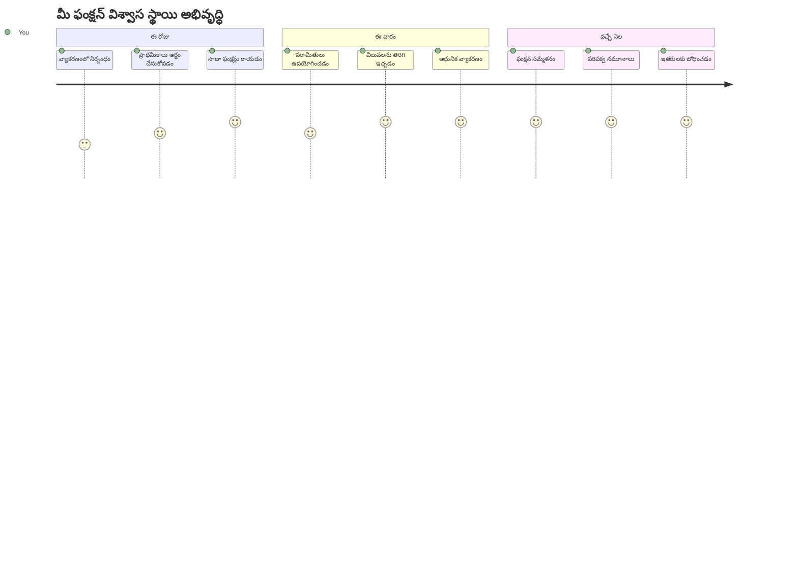
> 🎉 **మీరు ప్రోగ్రామింగ్ యొక్క అత్యంత శక్తివంతమైన కాన్సెప్ట్‌లలో ఒకదాన్ని సాధించారు!** ఫంక్షన్లు పెద్ద ప్రోగ్రామ్‌ల నిర్మాణ బ్లాకులు. మీరు ఎప్పుడైనా నిర్మించే ప్రతి అప్లికేషన్ కోడ్‌ను ఆర్గనైజ్ చేయడానికి, పునర్వినియోగం చేయడానికి, మరియు నిర్మించడానికి ఫంక్షన్లను ఉపయోగిస్తుంది. మీరు ఇప్పుడు లాజిక్‌ను పునర్వినియోగయోగ్యమైన భాగాలుగా ప్యాకేజ్ చేయడం ఎలా అనేదాన్ని అర్థం చేసుకున్నారు, అది మిమ్మల్ని మరింత సమర్థవంతమైన మరియు ప్రభావవంతమైన ప్రోగ్రామర్ గా మార్చుతుంది. మాడ్యులర్ ప్రోగ్రామింగ్ ప్రపంచానికి స్వాగతం! 🚀

---

<!-- CO-OP TRANSLATOR DISCLAIMER START -->
**దర్శక సూచన**:  
ఈ డాక్యూమెంట్‌ని AI అనువాద సేవ [Co-op Translator](https://github.com/Azure/co-op-translator) ఉపయోగించి అనువదించబడింది. మనం ఖచ్చితత్వానికి ప్రయత్నించినప్పటికీ, ఆటోమేటెడ్ అనువాదాల్లో పొరపాట్లు లేదా అసత్యతలు ఉండవచ్చును. అసలు డాక్యూమెంట్ దాని స్వదేశ భాషలోనే అధికారిక మూలంగా పరిగణించాలి. ముఖ్యమైన సమాచారం కోసం, ప్రొఫెషనల్ మానవ అనువాదాన్ని ఉపయోగించడం మంచిది. ఈ అనువాదం వలన ఏర్పడిన ఏదైనా అపార్థాలు లేదా తప్పుదిద్దుతలపై మేము బాధ్యత వహించము.
<!-- CO-OP TRANSLATOR DISCLAIMER END -->