# జావాస్క్రిప్ట్ బేసిక్స్: నిర్ణయాలు తీసుకోవడం

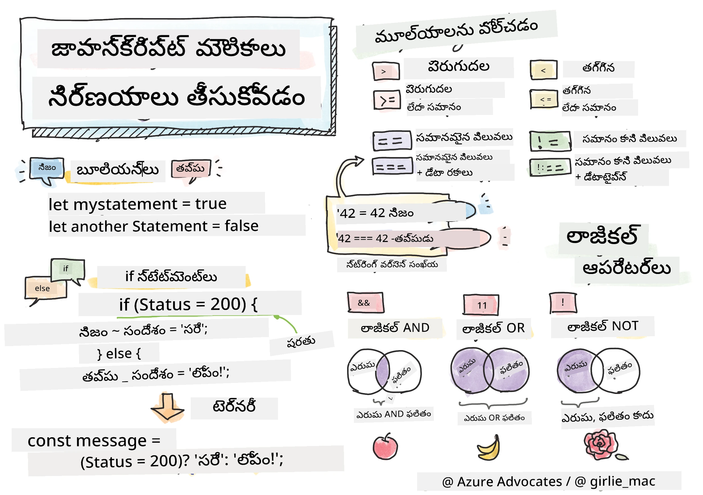

> స్కేట్ఛ్‌‌నోట్ [Tomomi Imura](https://twitter.com/girlie_mac) రచన

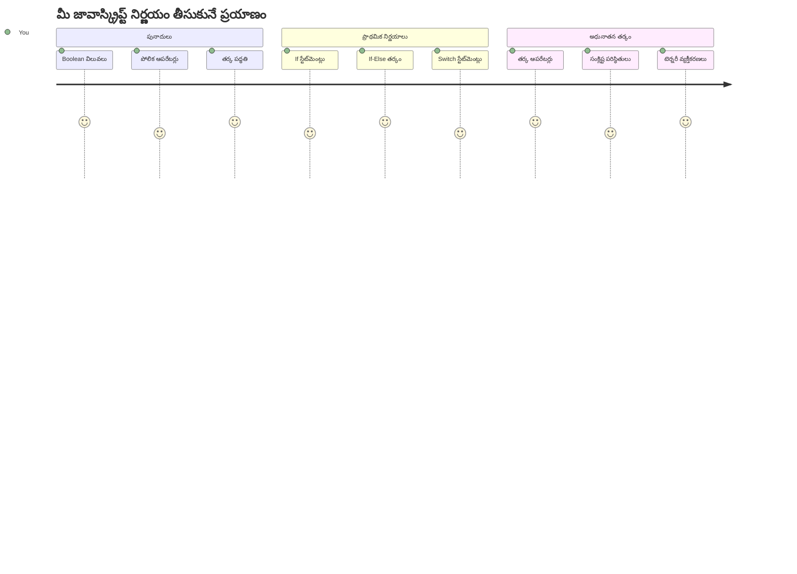
మీరు ఎప్పుడైనా ఆలోచించారా, యాప్స్ ఎలా తెలివైన నిర్ణయాలు తీసుకుంటాయో? ఉదాహరణకి, ఒక నావిగేషన్ సిస్టమ్ వేగవంతమైన మార్గాన్ని ఎలా ఎంచుకుంటుంది, లేదా ఒక థర్మోస్టాట్ వేడి ఎప్పుడు ప్రారంభించాలో ఎలా నిర్ణయించుకుంటుంది? ఇది ప్రోగ్రామింగ్‌లో నిర్ణయం తీసుకునే ప్రాథమిక భావన.

చార్లెస్ బాబేజ్ యొక్క అనలిటికల్ ఇంజిన్ పరిస్థితుల ఆధారంగా వివిధ ఆపరేషన్లు అనుసరిస్తుందని రూపకల్పన చేయబడింది అంటూ, ఆధునిక జావాస్క్రిప్ట్ ప్రోగ్రామ్‌లు వివిధ పరిస్థితులపై ఆధారపడి ఎంపికలు చేయాలి. ఈ శాఖ పద్ధతి, నిర్ణయాలు తీసుకోవడం వల్ల స్థిర కోడ్‌ ను స్పందనాత్మక, తెలివైన యాప్లికేషన్లుగా మారుస్తుంది.

ఈ పాఠంలో, మీరు మీ ప్రోగ్రామ్‌లలో షరతు లాజిక్ ఎలా అమలు చేయాలో నేర్చుకుంటారు. షరతు స్టేట్మెంట్లు, పోలిక ఆపరేటర్లు, మరియు తార్కిక వ్యక్తీకరణలను పరిశీలించి, మీ కోడ్ పరిస్థితులను అంచనా వేసి సరిగ్గా స్పందించడానికి వీలు కల్పిస్తాయి.

## ముందస్తు ఉపన్యాస క్విజ్

[ముందస్తు ఉపన్యాస క్విజ్](https://ff-quizzes.netlify.app/web/quiz/11)

నిర్ణయాలు తీసుకోవడం మరియు ప్రోగ్రామ్ ప్రవాహాన్ని నియంత్రించడం ప్రోగ్రామింగ్ యొక్క ప్రాథమిక అంశం. ఈ విభాగం బూలియన్ విలువలు మరియు షరతు లాజిక్ ఉపయోగించి మీ జావాస్క్రిప్ట్ ప్రోగ్రామ్‌లు ఎలా అమలు చేయాలో వివరిస్తుంది.

[](https://youtube.com/watch?v=SxTp8j-fMMY "Making Decisions")

> 🎥 నిర్ణయాలు తీసుకోవడం గురించి వీడియో కోసం పై చిత్రం క్లిక్ చేయండి.

> మీరు ఈ పాఠాన్ని [Microsoft Learn](https://docs.microsoft.com/learn/modules/web-development-101-if-else/?WT.mc_id=academic-77807-sagibbon) లో కూడా నేర్చుకోవచ్చు!

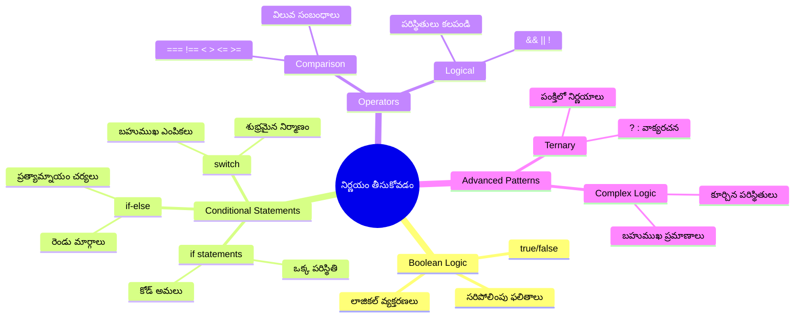
## బూలియన్‌లపై సంక్షిప్త జ్ఞాపకం

నిర్ణయాలు తీసుకునే ప్రక్రియను పరిశీలించే ముందు, మన గత పాఠం నుంచి బూలియన్ విలువలను మళ్లీ చూసుకుందాం. గణిత శాస్త్రజ్ఞుడు జార్జ్ బూల్ పేరు మీద ఈ విలువలు binary స్థితులను సూచిస్తాయి – అది `true` లేదా `false` మాత్రమే. ఇందులో ఎటువంటి సందేహం లేదా మధ్యస్థానం ఉండదు.

ఈ binary విలువలు అన్ని కంప్యూటేషనల్ లాజిక్ యొక్క పునాది. మీ ప్రోగ్రామ్ తీసుకునే ప్రతి నిర్ణయం తగినంతగా ఒక బూలియన్ అంచనాకే తగ్గుతుంది.

బూలియన్ వేరియబుల్స్ సృష్టించడం సులభం:

```javascript
let myTrueBool = true;
let myFalseBool = false;
```

ఇది స్పష్టమైన బూలియన్ విలువలతో రెండు వేరియబుల్స్ సృష్టిస్తుంది.

✅ బూలియన్‌లు ఇంగ్లీషు గణిత శాస్త్రజ్ఞుడు, తత్త్వవేత్త మరియు తార్కికవేత్త జార్జ్ బూల్ (1815–1864) పేరిట ఉన్నాయి.

## పోలిక ఆపరేటర్లు మరియు బూలియన్‌లు

ప్రాక్టికల్‌గా, మీరు బూలియన్ విలువలను వ్యక్తిగతంగా ఇలా సెట్ చేయరు. దీని బదులు, మీరు షరతులను అంచనా వేసి వాటిని ఉత్పత్తి చేస్తారు: "ఈ సంఖ్య ఆ సంఖ్య కంటే ఎక్కువగా ఉందా?" లేదా "ఈ విలువలు సమానంగానేనా?"

పోలిక ఆపరేటర్లు ఈ అంచనాలు చేయడానికి ఉపయోగపడతాయి. అవి రెండూ విలువలను పోల్చి ఆపరాండ్ల మధ్య సంబంధం ఆధారంగా బూలియన్ ఫలితాలను ఇస్తాయి.

| ప్రతీక | వివరణ                                                                                                                          | ఉదాహరణ            |
| ------ | ------------------------------------------------------------------------------------------------------------------------------- | ------------------ |
| `<`    | **తక్కువ**: రెండు విలువలను పోల్చి ఎడమవైపున ఉన్నది కుడిపక్కన ఉన్నదికంటే తక్కువైతే `true` ఇస్తుంది                                 | `5 < 6 // true`    |
| `<=`   | **తక్కువగా లేదా సమానం**: రెండు విలువలను పోల్చి ఎడమవైపున ఉన్నది కుడిపక్కన ఉన్నదికి తక్కువ లేదా సమానమైతే `true` ఇస్తుంది        | `5 <= 6 // true`   |
| `>`    | **గొప్ప**: రెండు విలువలను పోల్చి ఎడమవైపున ఉన్నది కుడిపక్కన ఉన్నదికన్నా ఎక్కువైతే `true` ఇస్తుంది                                   | `5 > 6 // false`   |
| `>=`   | **గొప్ప లేదా సమానం**: రెండు విలువలను పోల్చి ఎడమవైపున ఉన్నది కుడిపక్కన ఉన్నదికి పెద్దది లేదా సమానమైతే `true` ఇస్తుంది              | `5 >= 6 // false`  |
| `===`  | **కఠిన సమానత్వం**: రెండు విలువలను పోల్చి కుడి మరియు ఎడమవైపు రెండూ సమానమైన డేటా టైప్ ఉంటే `true` ఇస్తుంది                        | `5 === 6 // false` |
| `!==`  | **వేడుకోవడము**: కఠిన సమానత్వ ఆపరేటరు ఇస్తున్న విలువకు విరుద్ధమైన బూలియన్ విలువ ఇస్తుంది                                            | `5 !== 6 // true`  |

✅ మీ జ్ఞానాన్ని పరీక్షించేందుకు మీ బ్రౌజర్ కన్సోల్‌లో కొన్ని పోలికలు రాయండి. మీరు ఆశించని డేటా ఎవరైనా వచ్చిందా?

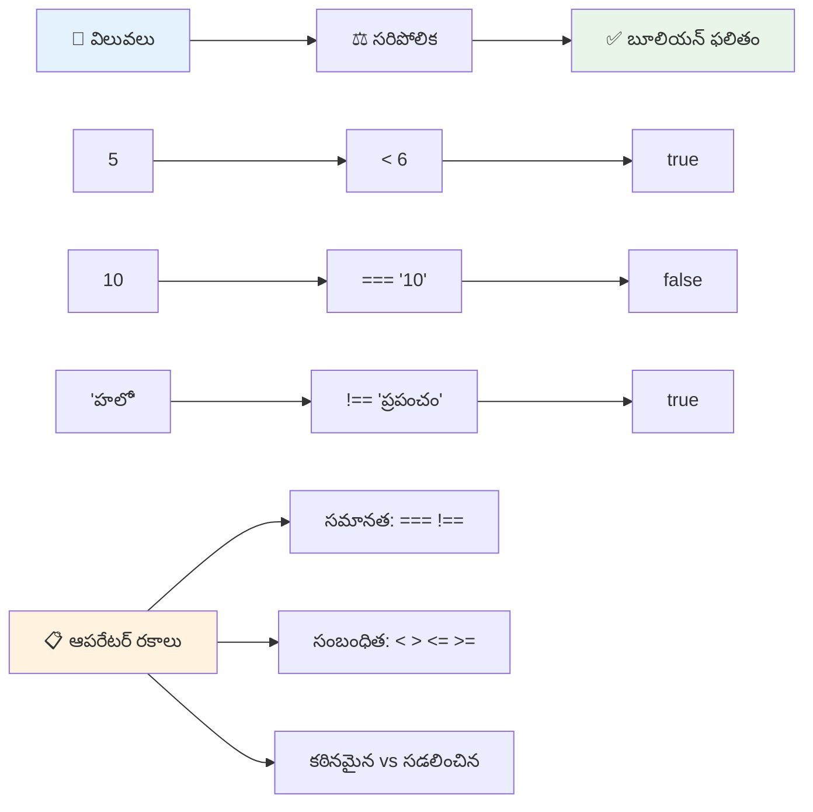
### 🧠 **పోలిక నైపుణ్యం పరీక్ష: బూలియన్ లాజిక్ అర్థం చేసుకోడం**

**మీ పోలిక అర్థం చేసుకున్నదా పరీక్షించండి:**
- మీరు ఎందుకు `===` (కఠిన సమానత్వం) ను సాధారణంగా `==` (కొద్దిగా సమానత్వం) కంటే ఇష్టపడతారు?
- `5 === '5'` ఎం వస్తుందో ఊహించగలరా? అలాగే `5 == '5'`?
- `!==` మరియు `!=` మధ్య తేడా ఏమిటి?

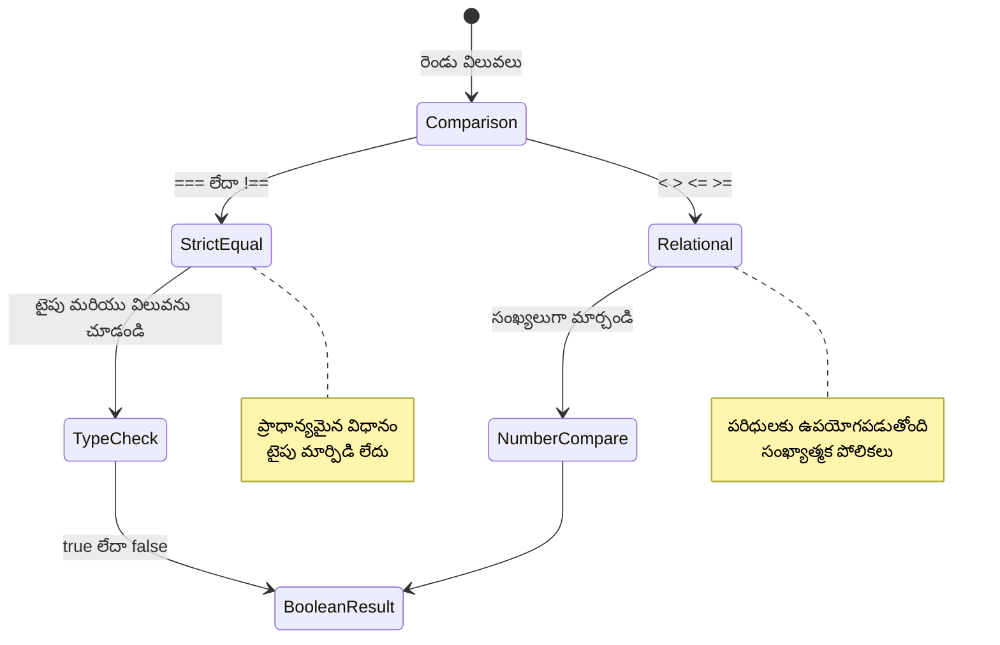
> **ప్రో చిట్కా**: టైపు మార్పిడి అవసరం లేకపోతే ఎప్పుడూ సమానత్వం పరీక్షలకు `===` మరియు `!==` వాడండి. ఇది అనూహ్య ప్రవర్తనలను నివారిస్తుంది!

## If స్టేట్మెంట్

`if` స్టేట్మెంట్ మీ కోడ్‌లో ఒక ప్రశ్న అడిగినట్టే. "ఈ షరతు true అయితే, ఈ పని చేయు." ఇది జావాస్క్రిప్ట్‌లో నిర్ణయాలు తీసుకునేందుకు అత్యంత ముఖ్యమైన పరికరం.

ఇలా పనిచేస్తుంది:

```javascript
if (condition) {
  // పరిస్థితి నిజం. ఈ బ్లాక్‌లో కోడ్ అమలవుతుంది.
}
```

షరతు ప్రముఖంగా కోసుపైన ఉంచబడుతుంది, అది `true` అయితే, జావాస్క్రిప్ట్ కర్లీ బ్రేసెస్ లోని కోడ్‌ను నడుపుతుంది. `false` అయితే, ఆ బ్లాక్ మొత్తాన్ని స్కిప్ చేస్తుంది.

మీరు తరచుగా ఈ షరతులను సృష్టించడానికి పోలిక ఆపరేటర్లను వాడతారు. ప్రావీట్ ఉదాహరణ చూద్దాం:

```javascript
let currentMoney = 1000;
let laptopPrice = 800;

if (currentMoney >= laptopPrice) {
  // షరతు నిజం. ఈ బ్లాక్‌లోని కోడ్ నడుస్తుంది.
  console.log("Getting a new laptop!");
}
```

`1000 >= 800` సత్యం కావడంతో, బ్లాక్‌లోని కోడ్ పనిచేస్తుంది, కన్సోల్‌లో "Getting a new laptop!" ప్రదర్శిస్తుంది.

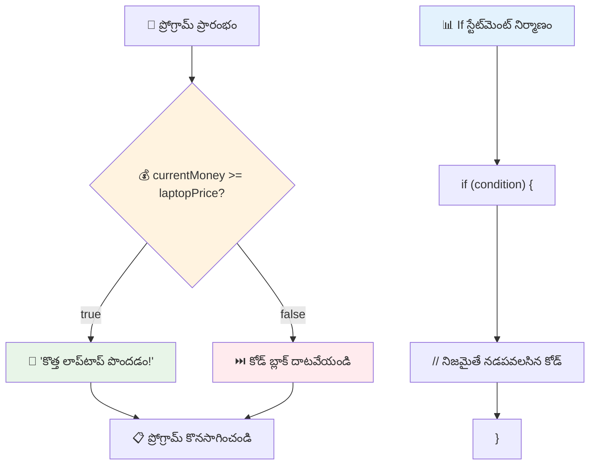
## If..Else స్టేట్మెంట్

కానీ షరతు false అయినప్పుడు మీ ప్రోగ్రామ్ వేరే పని చేయాలని అనుకున్నట్లయితే? అప్పుడు `else` వస్తుంది – ఇది బ్యాక్‌అప్ ప్లాన్ లాంటి కొరుక్క.

`else` స్టేట్మెంట్ అంటే "ఈ షరతు సత్యం కాదు అయితే, మరీచిన్న పని చేయు" అర్థం.

```javascript
let currentMoney = 500;
let laptopPrice = 800;

if (currentMoney >= laptopPrice) {
  // పరిస్థితి నిజం. ఈ బ్లాక్‌లో ఉన్న కోడ్ చేయబడుతుంది.
  console.log("Getting a new laptop!");
} else {
  // పరిస్థితి తప్పు. ఈ బ్లాక్‌లో ఉన్న కోడ్ చేయబడుతుంది.
  console.log("Can't afford a new laptop, yet!");
}
```

ఇప్పుడు `500 >= 800` false కాబట్టి, జావాస్క్రిప్ట్ మొదటి బ్లాక్‌ ఖాళీ చేసి, `else` బ్లాక్ నడుపుతుంది. కన్సోల్‌లో "Can't afford a new laptop, yet!" కనిపిస్తుంది.

✅ ఈ కోడ్ మరియు క్రింద ఇవ్వబడిన కోడ్ మీ బ్రౌజర్ కన్సోల్ లో నడుపుతూ మీ అవగాహనను పరీక్షించండి. `currentMoney` మరియు `laptopPrice` వేరియబుల్స్ విలువలు మార్చి `console.log()` లో వేరే ఫలితాన్ని పొందండి.

### 🎯 **If-Else లాజిక్ పరీక్ష: శాఖలు**

**మీ షరతుల గురించి అర్థం చేసుకోవడం నిర్వహించుకోండి:**
- `currentMoney` సరియైనదిగా `laptopPrice` కి సమానం అయితే ఏం జరుగుతుంది?
- నిజ జీవిత పరిస్థితిలో if-else లాజిక్ ఉపయోగించే ఎటువంటి ఉదాహరణ చెప్పగలరా?
- మీరు ఈ[src]ను ఎట్లా విస్తరించవచ్చు, బహుళ ధర పరిధుల నిర్వహణ కోసం?

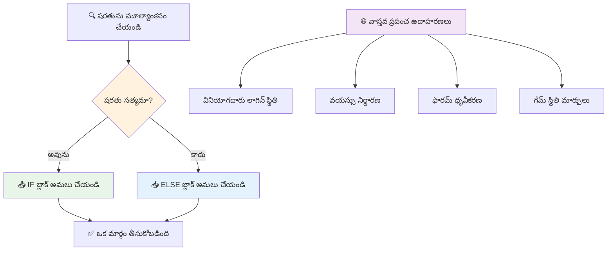
> **ముఖ్య అనుభవం**: If-else పద్ధతితో ఖచ్చితంగా ఒక్క దారి తీసుకుంటారు. ఇది మీ ప్రోగ్రామ్ ఎప్పుడూ ఏదైనా షరతుపై స్పందన కలిగి ఉండటం నిర్ధారిస్తుంది!

## Switch స్టేట్మెంట్

కొన్నిసార్లు మీరు ఒక విలువను బహుళ ఎంపికలతో పోల్చుకోవలసి ఉంటుంది. మీరు అనేక `if..else` స్టేట్మెంట్లను జత చేయవచ్చు కానీ అది స్తంభించిపోతుంది. `switch` స్టేట్మెంట్ బహుళ తేడా ఉన్న విలువల నిర్వహణకు క్లీన్ నిర్మాణం అందిస్తుంది.

ఈ భావన తొలున్న టెలిఫోన్ ఎక్స్చేంజ్‌లలో ఉపయోగించిన మెకానికల్ స్విచ్చింగ్ వ్యవస్థకు సమానం – ఒక ఇన్‌పుట్ విలువ ఏ ప్రత్యేక మార్గాన్ని ఎంచుకోవాలనేదాన్ని నిర్ణయిస్తుంది.

```javascript
switch (expression) {
  case x:
    // కోడ్ బ్లాక్
    break;
  case y:
    // కోడ్ బ్లాక్
    break;
  default:
    // కోడ్ బ్లాక్
}
```

దీని నిర్మాణం ఇలా ఉంటుంది:
- జావాస్క్రిప్ట్ ఒకసారి వ్యక్తీకరణని (expression) అంచనా వేస్తుంది
- ప్రతి `case` ని చూసి సరిపోలడం చూసుకుంటుంది
- సరిపడ్డప్పుడు ఆ కోడ్ బ్లాక్ నడుపుతుంది
- `break` జావాస్క్రిప్ట్‌ని ఆపి switch నుండి బయటకు పంపుతుంది
- ఎట్టిపరిస్థితిలో cases సరిపోకుండా ఉంటే, `default` బ్లాక్ నడుస్తుంది (మీ దగ్గర ఉంటే)

```javascript
// వారపు రోజుకు స్విచ్ స్టేట్మెంట్ ఉపయోగించి ప్రోగ్రాం
let dayNumber = 2;
let dayName;

switch (dayNumber) {
  case 1:
    dayName = "Monday";
    break;
  case 2:
    dayName = "Tuesday";
    break;
  case 3:
    dayName = "Wednesday";
    break;
  default:
    dayName = "Unknown day";
    break;
}
console.log(`Today is ${dayName}`);
```

ఈ ఉదాహరణలో, జావాస్క్రిప్ట్ `dayNumber` ని 2 గా గుర్తించి, `case 2` కనుగొని, `dayName` ని "Tuesday" గా సెట్ చేస్తుంది, ఆపై switch నుండి బయటికెక్కుతుంది. ఫలితం: "Today is Tuesday" కన్సోల్ లో ప్రదర్శించబడింది.

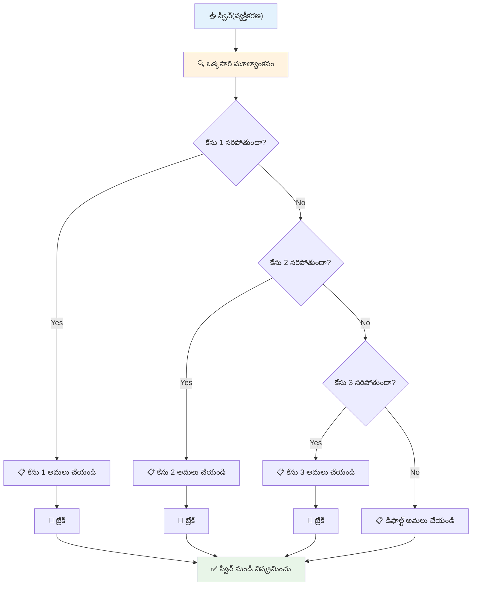
✅ ఈ కోడ్ మరియు క్రింది కోడ్ లోని బదిలీ కోసం బ్రౌజర్ కన్సోల్ లో పరీక్షించండి. వేరియబుల్ `a` విలువలని మార్చి `console.log()` లో ఫలితాన్ని గమనించండి.

### 🔄 **Switch స్టేట్మెంట్ నైపుణ్యం: బహుళ ఎంపికలు**

**మీ switch అర్థం చేసుకోవడాన్ని పరీక్షించండి:**
- మీరు `break` స్టేట్మెంట్ మర్చిపోయినట్లయితే ఏం జరుగుతుంది?
- మీరు ఎప్పుడు బహుళ `if-else` బదులు `switch` వాడతారు?
- మీరు అన్ని అవకాశాలను కప్పుకున్నట్టు అనుకున్నా, ఎందుకు `default` వాడడం మంచిది?

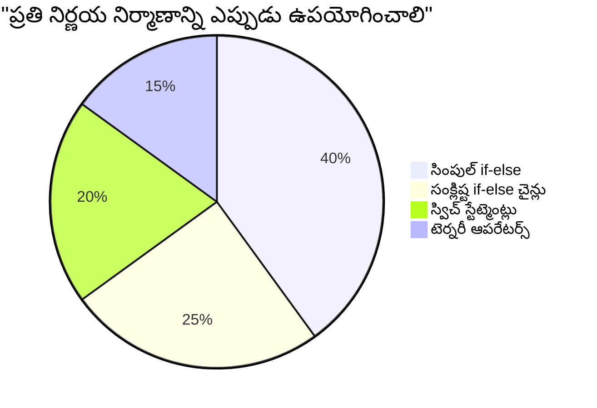
> **మంచి ప్రాక్టీస్**: ఒక వేరియబుల్‌ను బహుళ ప్రత్యేక విలువలతో పోల్చేటప్పుడు `switch` ఉపయోగించండి. పర్యాయాలను పరీక్షించేటప్పుడు లేదా క్లిష్ట పరిస్థితుల కోసం `if-else` వాడండి!

## తార్కిక ఆపరేటర్లు మరియు బూలియన్‌లు

క్లిష్ట నిర్ణయాలకు ఒకేసారి పలు పరిస్థితులను అంచనా వేసోవలసి ఉంటుంది. బూలియన్ బోధనలో మత్తుగా లాజికల్ వ్యక్తీకరణలను కలుపుతూ, ప్రోగ్రామింగ్‌లో తార్కిక ఆపరేటర్లు పలు బూలియన్ షరతులను కలుపుతాయి.

ఈ ఆపరేటర్లు సరళమైన సత్య/అసత్య అంచనాలను సంయోజించి మెలుకువైన షరతు లాజిక్ సృష్టించడానికి వీలు కల్పిస్తాయి.

| ప్రతీక | వివరణ                                                                                                         | ఉదాహరణ                                                                      |
| ------ | ------------------------------------------------------------------------------------------------------------ | ---------------------------------------------------------------------------- |
| `&&`   | **తార్కిక AND**: రెండు బూలియన్ వ్యక్తీకరణలను పోల్చి రెండూ true అయితే మాత్రమే true ఇస్తుంది                      | `(5 > 3) && (5 < 10) // రెండూ true కాబట్టి true ఇస్తుంది`                      |
| `\|\|` | **తార్కిక OR**: రెండు బూలియన్ వ్యక్తీకరణలను పోల్చి కనీసం ఒకటి true అయితే true ఇస్తుంది                          | `(5 > 10) \|\| (5 < 10) // ఒకటి false, ఇంకోటి true కావడం వల్ల true ఇస్తుంది`  |
| `!`    | **తార్కిక NOT**: ఒక బూలియన్ వ్యక్తీకరణకు వ్యతిరేకమైన విలువ ఇస్తుంది                                           | `!(5 > 10) // 5 పెద్దది కాదు కాబట్టి "!" తో true అవుతుంది`                      |

ఈ ఆపరేటర్లతో మీరు పరిస్థితులను ఈ విదంగా కలుపుకోవచ్చు:
- AND (`&&`) అంటే రెండు పరిస్థితులు నిజం కావాలి
- OR (`||`) అంటే కనీసం ఒకటి నిజం కావాలి
- NOT (`!`) నిజం ని అబద్ధంగా, అబద్ధాన్ని నిజంగా మార్చుతుంది

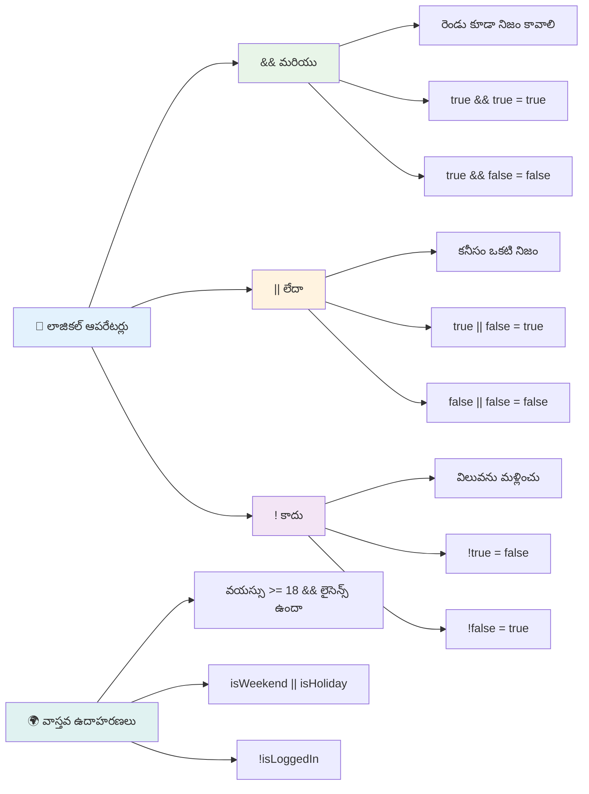
## తార్కిక ఆపరేటర్లతో షరతులు మరియు నిర్ణయాలు

మామూలు ఉదాహరణతో ఈ తార్కిక ఆపరేటర్లను చూద్దాం:

```javascript
let currentMoney = 600;
let laptopPrice = 800;
let laptopDiscountPrice = laptopPrice - (laptopPrice * 0.2); // ల్యాప్‌టాప్ ధర 20 శాతం తగ్గింపు

if (currentMoney >= laptopPrice || currentMoney >= laptopDiscountPrice) {
  // పరిస్థితి సత్యం. ఈ బ్లాక్‌లోని కోడ్ అమలు అవుతుంది.
  console.log("Getting a new laptop!");
} else {
  // పరిస్థితి అబద్ధం. ఈ బ్లాక్‌లోని కోడ్ అమలు అవుతుంది.
  console.log("Can't afford a new laptop, yet!");
}
```

ఈ ఉదాహరణలో: మనం 20% డిస్కౌంట్ ధర (640) లెక్కించాము, తరువాత మన అందుబాటులో ఉన్న డబ్బు సంపూర్ణ ధర లేదా తగ్గింపు ధర అందుబాటులో ఉందో అంచనా వేస్తాం. 600 తగ్గింపు ధర 640 కి తక్కువగా ఉండటం వల్ల షరతు సత్యం అవుతుంది.

### 🧮 **తార్కిక ఆపరేటర్స్ పరీక్ష: షరతులను కలపడం**

**మీ తార్కిక ఆపరేటర్ అవగాహనని పరీక్షించండి:**
- `A && B` లో A false అయితే ఏం జరుగుతుంది? B అంచనా వేస్తేనా?
- మీరు ఎప్పుడైతే మూడు ఆపరేటర్ల (&&, ||, !) అవసరం అవుతుందో ఒక పరిస్థితిని ఊహించగలరా?
- `!user.isActive` మరియు `user.isActive !== true` మధ్య తేడా ఏమిటి?

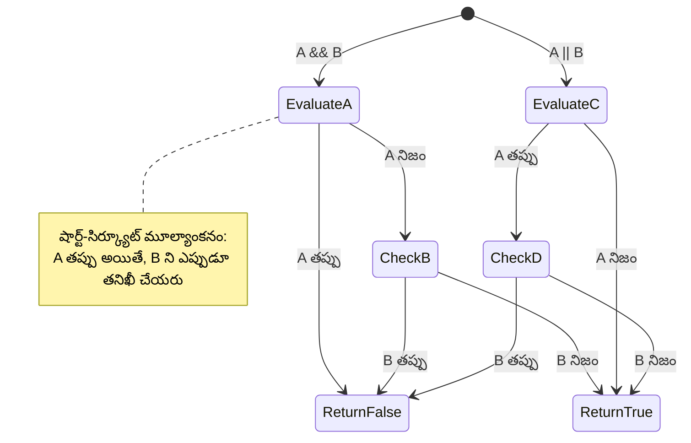
> **పనితీరు చిట్కా**: జావాస్క్రిప్ట్ "షార్ట్-సర్జిట్ అంచన" ఉపయోగిస్తుంది - `A && B` లో, A false అయితే B అంచనా వేయబడదు. దీనిని మీ ప్రయోజనానికి ఉపయోగించండి!

### విరోధి ఆపరేటర్

ఎప్పుడో మాట, మీరు ఎప్పుడో విషయం నిజం కాకపోవడాన్ని విలువచేయాలనుకోవచ్చు. ఉదాహరణకు "వాడుకరి లాగిన్ అయ్యారా?" అడగకుండా "వాడుకరి లాగిన్ కాలేదా?" అని అడగడం. సూచిక గుర్తు (`!`) ఆ తీరు లాజిక్‌ను కొంత తేలికగా మార్చిస్తుంది.

```javascript
if (!condition) {
  // నిబంధన తప్పు అయితే నడుస్తుంది
} else {
  // నిబంధన సత్యం అయితే నడుస్తుంది
}
```

`!` ఆపరేటర్ అంటే "వ్యతిరేకం" – ఏదైతే `true` అయితే `!` వదిలితే `false` అవుతుంది, మరియు ఉల్టా కూడా.

### టెర్నరీ వ్యక్తీకరణలు

సరళమైన షరతు విధానాల కోసం, జావాస్క్రిప్ట్ **టెర్నరీ ఆపరేటర్** అందిస్తుంది. ఈ సంక్షిప్త సింటాక్స్ ఒక్క లైనులో షరతు బాధ్యతను వ్రాయడానికి ఉపయుక్తం, ఇది ఒక షరతు ఆధారంగా రెండు విలువల మధ్య ఒకదాన్ని కేటాయించడానికి ఉపయోగపడుతుంది.

```javascript
let variable = condition ? returnThisIfTrue : returnThisIfFalse;
```

ఇది ఒక ప్రశ్నలా చదవండి: "ఈ షరతు true అయితే ఈ విలువ వాడు. false అయితే ఆ విలువ వాడు."

క్రింది ఉదాహరణ చూడండి:

```javascript
let firstNumber = 20;
let secondNumber = 10;
let biggestNumber = firstNumber > secondNumber ? firstNumber : secondNumber;
```

✅ కొంచెం సమయం తీసుకుని ఈ కోడ్ పునరుద్ఘహరించండి. ఈ ఆపరేటర్లు ఎలా పని చేస్తున్నాయో మీకు అర్థమవుతుందా?

ఈ లైన్ ఇలా చెప్పటం: "`firstNumber` `secondNumber` కంటే ఎక్కువనా? అవును అయితే `biggestNumber` లో `firstNumber` ఉంచు. లేదంటే `biggestNumber` లో `secondNumber` ఉంచు."

టెర్నరీ ఆపరేటర్ కింది సంప్రదాయ `if..else` స్టేట్మెంట్ కంటే కేవలం సంక్షిప్త రూపం:

```javascript
let biggestNumber;
if (firstNumber > secondNumber) {
  biggestNumber = firstNumber;
} else {
  biggestNumber = secondNumber;
}
```

రెండు పద్ధతులు ఒకే ఫలితాన్ని ఇస్తాయి. టెర్నరీ ఆపరేటర్ సంక్షిప్తంగా ఉంటుంది, సాంప్రదాయ if-else కంటే క్లిష్ట పరిస్థితులలో చదవటానికి కొంత సులభమే.

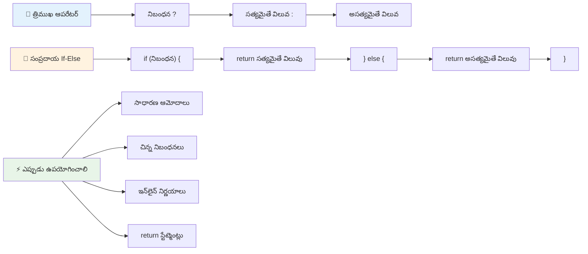
---


## 🚀 సవాలు

మొదట తార్కిక ఆపరేటర్లు వాడి, తరువాత టెర్నరీ వ్యక్తీకరణ వాడి వ్రాసిన ఒక ప్రోగ్రామ్ తయారు చేయండి. మీకు ఇష్టమైన సింటాక్స్ ఏది?

---

## GitHub Copilot ఏజెంట్ సవాలు 🚀

ఈ సవాలను పూర్తి చేయడానికి ఏజెంట్ మోడ్ ఉపయోగించండి:

**వివరణ:** ఈ పాఠంలో నిర్ణయాలు తీసుకునే అనేక భావాలను చూపించే సమగ్ర గ్రేడ్ లెక్కింపు ప్రోగ్రామ్ రాయండి, ఇందులో if-else స్టేట్మెంట్లు, switch స్టేట్మెంట్లు, తార్కిక ఆపరేటర్లు మరియు టెర్నరీ వ్యక్తీకరణలు ఉంటాయి.

**ప్రాంప్ట్:** ఒక విద్యార్థి సంఖ్యాత్మక స్కోర్ (0-100) ను తీసుకుని, క్రింది ప్రమాణాల ప్రకారం వారి లెటర్ గ్రేడ్ నిర్ణయించే జావాస్క్రిప్ట్ ప్రోగ్రామ్ వ్రాయండి:  
- A: 90-100  
- B: 80-89  
- C: 70-79  
- D: 60-69  
- F: 60 కి దిగువన  

అవసరాలు:  
1. లెటర్ గ్రేడ్ నిర్ణయానికి if-else స్టేట్మెంట్ ఉపయోగించండి
2. విద్యార్థి ఉత్తీర్ణత సాధించినట్టునో (గ్రేడ్ >= 60) మరియు ఆర్డర్లు ఉన్నాయో (గ్రేడ్ >= 90) చెక్ చేయడానికి లాజికల్ ఆపరేటర్లను వాడండి  
3. ప్రతి లెటర్ గ్రేడ్ కొరకు నిర్దిష్ట అభిప్రాయాన్ని పంచేందుకు స్విచ్ స్టేట్‌మెంట్‌ను వాడండి  
4. తదుపరి కోర్సుకు విద్యార్థి అర్హుడా అనేదాన్ని నిర్ణయించడానికి టెర్నరీ ఆపరేటర్ వాడండి (గ్రేడ్ >= 70)  
5. స్కోరు 0 మరియు 100 మధ్య ఉందని నిర్ధారించడానికి ఇన్‌పుట్ చెలామణీని చేర్చండి  

ముఖ్య సంఘర్షణలుగా 59, 60, 89, 90 మరియు చెలామణి కాని ఇన్‌పుట్‌లతో మీ ప్రోగ్రామ్ను పరీక్షించండి.  

ఇంకా సమాచారం కోసం [agent mode](https://code.visualstudio.com/blogs/2025/02/24/introducing-copilot-agent-mode) ఇక్కడ చూడండి.  


## పోస్ట్-లెక్చర్ క్విజ్  

[Post-lecture quiz](https://ff-quizzes.netlify.app/web/quiz/12)  

## సమీక్ష & స్వీయ అధ్యయనం  

యూజర్‌కు అందుబాటులో ఉన్న అనేక ఆపరేటర్లు గురించి మరింత తెలుసుకోండి [MDNలో](https://developer.mozilla.org/docs/Web/JavaScript/Reference/Operators).  

జోష్ కామౌ యొక్క అద్భుతమైన [ఆపరేటర్ లుకప్](https://joshwcomeau.com/operator-lookup/)ని గమనించండి!  

## అసైన్మెంట్  

[Operators](assignment.md)  

---  

## 🧠 **మీ నిర్ణయ-making టూల్‌కిట్ సారాంశం**  

```mermaid
graph TD
    A["🎯 జావాస్క్రిప్ట్ నిర్ణయాలు"] --> B["🔍 బూలియన్ లాజిక్"]
    A --> C["📊 షరతుల స్టేట్మెంట్లు"]
    A --> D["🔗 లాజికల్ ఆపరేటర్లు"]
    A --> E["⚡ అభివృద్ధి చెందిన నమూనాలు"]
    
    B --> B1["true/false విలువలు"]
    B --> B2["తులనా ఆపరేటర్లు"]
    B --> B3["సత్యత్వ సిద్ధాంతాలు"]
    
    C --> C1["if స్టేట్మెంట్లు"]
    C --> C2["if-else గొలుసులు"]
    C --> C3["switch స్టేట్మెంట్లు"]
    
    D --> D1["&& (AND)"]
    D --> D2["|| (OR)"]
    D --> D3["! (NOT)"]
    
    E --> E1["టెర్నరీ ఆపరేటర్"]
    E --> E2["షార్ట్-సర్క్యూట్ మూల్యాంకనం"]
    E --> E3["సంక్లిష్ట షరతులు"]
    
    F["💡 కీలక సూత్రాలు"] --> F1["స్పష్టమైన చదవదగిన షరతులు"]
    F --> F2["అనువైన తులన శైలి"]
    F --> F3["శ్రేయోన్నత ఆపరేటర్ ప్రాధాన్యత"]
    F --> F4["ప్రభావవంతమైన మూల్యాంకన క్రమం"]
    
    style A fill:#e3f2fd
    style B fill:#e8f5e8
    style C fill:#fff3e0
    style D fill:#f3e5f5
    style E fill:#e0f2f1
    style F fill:#fce4ec
```  
---  

## 🚀 మీ జావాస్క్రిప్ట్ నిర్ణయ-making మాస్టరీ టైమ్‌లైన్  

### ⚡ **మరుసటి 5 నిమిషాల్లో మీరు చేయగలవు**  
- [ ] మీ బ్రౌజర్ కన్సోల్‌లో పోలిక ఆపరేటర్లతో అభ్యాసం చేయండి  
- [ ] మీ వయస్సును చెక్ చేసే సాధారణ if-else స్టేట్‌మెంట్ రాయండి  
- [ ] ఒక if-else ను టెర్నరీ ఆపరేటర్ ఉపయోగించి మళ్లీ రాయడాన్ని ప్రయత్నించండి  
- [ ] వేర్వేరు “ట్రూతీ” మరియు “ఫాల్సీ” విలువలతో ఏమి జరుగుతుందో పరీక్షించండి  

### 🎯 **ఈ గంటలో మీరు సాధించగలిగేది**  
- [ ] పోస్ట్-పాఠం క్విజ్ పూర్తి చేసి ఏదైనా చిక్కిన భావనలను సమీక్షించండి  
- [ ] GitHub Copilot ఛాలెంజ్ నుండి సమగ్ర గ్రేడ్ క్యాలిక్యులేటర్ నిర్మించండి  
- [ ] నిజ జీవిత పరిస్థితికి సరళమైన నిర్ణయ మొక్క (decision tree) సృష్టించండి (ఉదాహరణకు ఏమి ధరిస్తామో ఎంచుకోవడం)  
- [ ] అనేక పరిస్థితులను లాజికల్ ఆపరేటర్లతో కలిపి అభ్యాసం చేయండి  
- [ ] వేర్వేరు ఉపయోగాల కొరకు స్విచ్ స్టేట్మెంట్లను ప్రయోగించండి  

### 📅 **మీ వారాంతపు లాజిక్ మాస్టరీ**  
- [ ] సృజనాత్మక ఉదాహరణలతో ఆపరేటర్ల అసైన్మెంట్ పూర్తి చేయండి  
- [ ] వేర్వేరు షరతుల నిర్మాణాలతో మినీ క్విజ్ అప్లికేషన్ రూపొందించండి  
- [ ] అనేక ఇన్‌పుట్ షరతులను చెక్ చేసే ఫారమ్ వాలిడేటర్ సృష్టించండి  
- [ ] జోష్ కామౌ యొక్క [ఆపరేటర్ లుకప్](https://joshwcomeau.com/operator-lookup/) వ్యాయామాలను అభ్యసించండి  
- [ ] ప్రస్తుతం ఉన్న కోడ్‌ను మరింత తగిన షరతుల నిర్మాణాల కోసం పునఃరూపకల్పన చేయండి  
- [ ] షార్ట్-సర్క్యూట్ ఇవాల్యుషన్ మరియు పనితీరు ప్రభావాలను అధ్యయనం చేయండి  

### 🌟 **మీ నెలపాటు పరివర్తనం**  
- [ ] సంక్లిష్టమైన nested షరతులను సంపూర్ణంగా ఆలస్యం లేకుండా నేర్చుకోండి మరియు కోడ్ చదవటానికి సులభతరం చేయండి  
- [ ] నైపుణ్యమయిన నిర్ణయ-making లాజిక్‌తో అప్లికేషన్ నిర్మించండి  
- [ ] ప్రస్తుత ప్రాజెక్టులలో షరతుల లాజిక్ మెరుగుపరచుతూ ఓపెన్ సోర్స్‌కు సహాయం చేయండి  
- [ ] ఇతరులకు వేర్వేరు షరతుల నిర్మాణాలు మరియు వాటిని ఎప్పుడు వాడాలో బోధించండి  
- [ ] షరతుల లాజిక్‌కు ఫంక్షనల్ ప్రోగ్రామింగ్ దారులను అన్వేషించండి  
- [ ] షరతుల ఉత్తమ విధానాల కోసం వ్యక్తిగత సూచిక గైడ్ సృష్టించండి  

### 🏆 **దశాంతమైన నిర్ణయ-making ఛాంపియన్ చెక్-ఇన్**  

**మీ లాజికల్ ఆలోచన మాస్టరీని సంబరంగా జరుపుకోండి:**  
- మీరు విజయవంతంగా అమలు చేసిన అత్యంత సంక్లిష్టమైన నిర్ణయ లాజిక్ ఏమిటి?  
- ఏ షరతుల నిర్మాణం మీకు అత్యంత సహజంగా అర్థమవుతుంది మరియు ఎందుకు?  
- లాజికల్ ఆపరేటర్ల గురించి నేర్చుకున్నことで మీ సమస్య పరిష్కార దశపై ఎలా ప్రభావం వచ్చింది?  
- ఏ నిజ జీవిత అప్లికేషన్ నైపుణ్యపూర్వక నిర్ణయ-making లాజిక్ నుంచి ప్రయోజనం పొందుతుంది?  

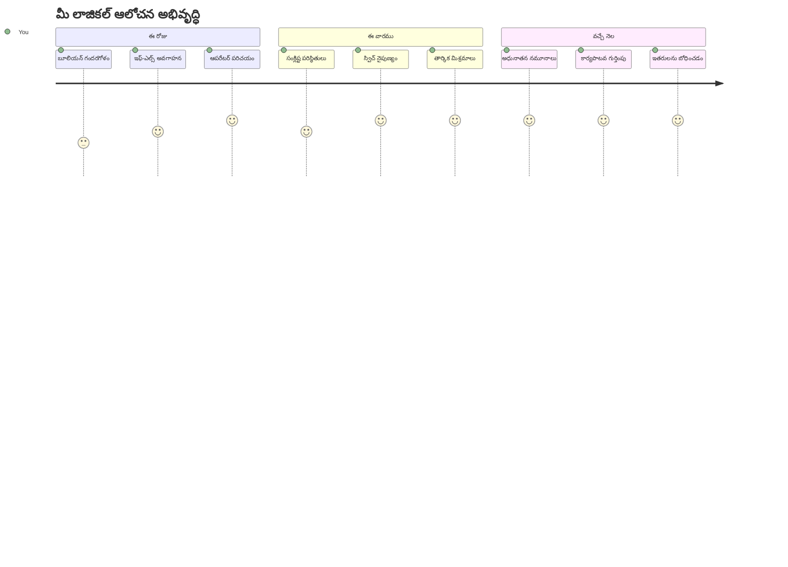
> 🧠 **మీరు డిజిటల్ నిర్ణయ-making కళను నైపుణ్యంగా ఆర్జించారు!** ప్రతి ఇంటరాక్టివ్ అప్లికేషన్ వినియోగదారుల చర్యలు మరియు మార్పుల పరిస్థితులకు తెలివిగా స్పందించడానికి షరతుల లాజిక్ పై ఆధారపడి ఉంటుంది. ఇప్పుడు మీరు తెలుసుకున్నారు మీ ప్రోగ్రామ్లు ఎలా ఆలోచించాలో, మూల్యాంకన చేయాలో, మరియు సరైన ప్రతిస్పందనలను ఎంపిక చేసుకోవాలో. ఈ లాజికల్ పునాది మీ నిర్మించే ప్రతీ డైనమిక్ అప్లికేషన్‌కు శక్తినిస్తుంది! 🎉

---

<!-- CO-OP TRANSLATOR DISCLAIMER START -->
**అస్పష్టత**:
ఈ పత్రాన్ని AI అనువాద సేవ [Co-op Translator](https://github.com/Azure/co-op-translator) ఉపయోగించి అనువదించారు. మేము సంతృప్తికరమైన ఖచ్చితత్వం కోసం ప్రయత్నించినప్పటికీ, స్వయంచాలక అనువాదాల్లో పొరపాట్లు లేదా తప్పిదాలు ఉండవచ్చు. స్వదేశీ భాషలోని అసలు పత్రం అధికారిక మూలంగా తీసుకోవాలి. ముఖ్యమైన సమాచారానికి, ప్రొఫెషనల్ మానవ అనువాదాన్ని సూచించబడతుంది. ఈ అనువాద ఉపయోగంలో నుంచే వచ్చిన ఏదైనా అపార్థాలు లేదా తప్పుదారులు కారణంగా మేము బాధ్యులు కాదు.
<!-- CO-OP TRANSLATOR DISCLAIMER END -->