<!--
CO_OP_TRANSLATOR_METADATA:
{
  "original_hash": "1710a50a519a6e4a1b40a5638783018d",
  "translation_date": "2026-01-08T12:59:56+00:00",
  "source_file": "2-js-basics/4-arrays-loops/README.md",
  "language_code": "te"
}
-->
# JavaScript ప్రాథమికాలు: శ్రేణులు మరియు పునరావృతాలు


> స్కెచ్నోట్ [టొమోమీ ఇమురా](https://twitter.com/girlie_mac) ద్వారా

```mermaid
journey
    title మీ అర్రేస్ & లూప్స్ సాహసము
    section అర్రే మౌలికాలు
      అర్రే లను సృష్టించడం: 5: You
      అంశాలను చేరుకోవడం: 4: You
      అర్రే పద్ధతులు: 5: You
    section లూప్ నైపుణ్యం
      ఫర్ లూప్స్: 4: You
      వైల్ లూప్స్: 5: You
      ఆధునిక సింటాక్స్: 4: You
    section డేటా ప్రాసెసింగ్
      అర్రే + లూప్స్: 5: You
      నిజజీవిత అనువర్తనాలు: 4: You
      పనితీరు ఆప్టిమైజేషన్: 5: You
```
## ముందు-పాఠం క్విజ్
[మునుపటి పాఠం క్విజ్](https://ff-quizzes.netlify.app/web/quiz/13)

వెబ్‌సైట్లలో షాపింగ్ కార్ట్ వస్తువులను ఎలా ట్రాక్ చేస్తారో లేదా మీ స్నేహితుల జాబితాను ఎలా చూపిస్తారో మీరు ఎప్పుడైనా ఆలోచించారా? అటువంటి సందర్భాల్లో శ్రేణులు మరియు పునరావృతాలు ఉపయోగపడతాయి. శ్రేణులు అనేవి అనేక సమాచారం భాగాలను ఉంచే డిజిటల్ కంటైనర్లు లాగా ఉంటాయి, మరియు పునరావృతాలు ఆ డాటాను పునరావృతం లేకుండా సమర్థంగా ఉపయోగించుకోవడానికి సహాయపడతాయి.

ఈ రెండు సూత్రాలు కలిసి మీ ప్రోగ్రాములలో సమాచారాన్ని నిర్వహించే ప్రాధమిక నిర్మాణాన్ని ఏర్పరుస్తాయి. మీరు ప్రతి ఒక్క దశను చేతితో వ్రాయడం నుండి వేలు వెయ్యాలా లేదా వేల సంఖ్యలో అంశాలను త్వరగా ప్రాసెస్ చేయగల తెలివైన, సమర్థవంతమైన కోడ్ సృష్టించే దశకు ఎలా వెళ్ళాలో నేర్చుకుంటారు.

ఈ పాఠం చివరలో, మీరు కొద్ది కోడ్ లైన్లతో క్లిష్టమైన డేటా పనులను ఎలా సాధించాలో అర్థమవుతుంది. వస్తువులు మరియు పునరావృతాల పాఠాల ఈ ముఖ్యమైన భాగాలను అన్వేషిద్దాం.

[](https://youtube.com/watch?v=1U4qTyq02Xw "ష్రేణులు")

[](https://www.youtube.com/watch?v=Eeh7pxtTZ3k "పునరావృతాలు")

> 🎥 పై చిత్రాలను క్లిక్ చేసి ష్రేణులు మరియు పునరావృతాల గురించి వీడియోగ్రాఫ్ చూడండి.

> మీరు ఈ పాఠాన్ని [మైక్రోసాఫ్ట్ లెర్న్](https://docs.microsoft.com/learn/modules/web-development-101-arrays/?WT.mc_id=academic-77807-sagibbon) లోనూ తీసుకోవచ్చు!

```mermaid
mindmap
  root((డేటా ప్రాసెసింగ్))
    Arrays
      Structure
        Square brackets syntax
        శూన్య-ఆధారమైన సూచిక
        డైనమిక్ సైజింగ్
      Operations
        push/pop
        shift/unshift
        indexOf/includes
      Types
        సాంఖ్యికాలు arrays
        స్ట్రింగ్స్ arrays
        మిశ్రమ రకాలు
    Loops
      For Loops
        ఆవర్తనల లెక్కింపు
        array ప్రాసెసింగ్
        ఊహించదగిన ప్రవাহం
      While Loops
        షరతు ఆధారిత
        తెలియని ఆవర్తనాలు
        యూజర్ ఇన్‌పుట్
      Modern Syntax
        for...of
        forEach
        ఫంక్షనల్ పద్ధతులు
    Applications
      Data Analysis
        గణాంకాలు
        ఫిల్టరింగ్
        మార్పులు
      User Interfaces
        జాబితాలు
        మెనూలు
        గ్యాలరీలు
```
## శ్రేణులు

శ్రేణులను ఒక డిజిటల్ ఫైలింగ్ కేబినెట్ లాగ భావించండి - ఒక్క ఓ షెల్ఫ్ లో ఒక్క డాక్యుమెంట్ నిల్వ చేయడానికి కాకుండా, మీరు అనేక సంబంధిత అంశాలను ఒకే, నిర్మిత కంటైనర్ లో సుధీర్ఘంగా ఉంచుకోవచ్చు. ప్రోగ్రామింగ్ దృష్టిలో, శ్రేణులు అనేది మీరు అనేక సమాచారం భాగాలను ఒక సక్రమ గూడుబిడ్డు లో నిల్వ చేయడానికి ఆప్షన్ ఇచ్చే కంటైనర్లు.

మీరు ఫోటో గ్యాలరీని లేదా టూ-డూ జాబితాని నిర్మిస్తున్నారో లేదా గేమ్ లో ఉన్న హై స్కోర్లను ట్రాక్ చేస్తున్నారో, శ్రేణులు డేటాను గూడబెట్టడానికి ప్రాధమిక ఆధారం ఇస్తాయి. అవి ఎలా పని చేస్తాయో చూద్దాం.

✅ శ్రేణులు మన చుట్టూ ఎక్కడు ఉన్నాయో చూశారా? ఉదాహరణకి సాలర్లు ప్యానెల్ శ్రేణి గురించి మీరు కొంత ఆలోచించగలరా?

### శ్రేణులు సృష్టించడం

శ్రేణిని సృష్టించడం చాలా సులభమే - కేవలం స్క్వేర్ బ్రాకెట్లను ఉపయోగించండి!

```javascript
// ఖాళీ వరస - వస్తువులు కోసం ఎదురుచూస్తున్న ఖాళీ షాపింగ్ కార్ట్ మాదిరిగా
const myArray = [];
```

**ఇక్కడ ఏమి జరుగుతోంది?**
మీరు స్క్వేర్ బ్రాకెట్ల `[]` ద్వారా ఖాళీ కంటైనర్‌ని సృష్టించారు. ఒక ఖాళీ గ్రంథాలయ షెల్ఫ్ లాగా ఉంది - మీరు ఇందులో ఏ పుస్తకాల్న అయినా ఉంచుకోవడానికి సిద్ధంగా ఉంది.

మీరు ప్రారంభంలోనే మీ శ్రేణిలో ప్రారంభ విలువలను కూడా నింపవచ్చు:

```javascript
// మీ ఐస్ క్రీం షాప్ యొక్క ఫ్లేవర్ మెనూ
const iceCreamFlavors = ["Chocolate", "Strawberry", "Vanilla", "Pistachio", "Rocky Road"];

// ఒక వినియోగదారుడి ప్రొఫైల్ సమాచారం (విభిన్న రకాల డేటాను కలపడం)
const userData = ["John", 25, true, "developer"];

// మీ ప్రియమైన తరగతి కోసం పరీక్షా మార్కులు
const scores = [95, 87, 92, 78, 85];
```

**గమనించదగ్గ వాటి విషయం:**
- ఒకే శ్రేణిలో మీరు పదాలు, సంఖ్యలు, నిజం/అబద్ధ విలువలన్నీ ఉంచుకోవచ్చు
- ఒక్కో అంశాన్ని కామాతో విడగొట్టండి - ఇది సులభం!
- శ్రేణులు సంబంధిత సమాచారాన్ని కలిసి ఉంచడానికి ఉత్తమం

```mermaid
flowchart LR
    A["📦 గుణాంకాలు"] --> B["సృష్టించు [ ]"]
    A --> C["బహుళ అంశాలను నిల్వ చేయు"]
    A --> D["సూచి ద్వారా ప్రాప్తి"]
    
    B --> B1["const arr = []"]
    B --> B2["const arr = [1,2,3]"]
    
    C --> C1["సంఖ్యలు"]
    C --> C2["సంకేతాలు"]
    C --> C3["బూలియన్లు"]
    C --> C4["మిశ్రమ రకాలు"]
    
    D --> D1["arr[0] = మొదటి"]
    D --> D2["arr[1] = రెండవది"]
    D --> D3["arr[2] = మూడవది"]
    
    E["📊 గుణాంక సూచీ"] --> E1["సూచి 0: మొదటి"]
    E --> E2["సూచి 1: రెండవది"]
    E --> E3["సూచి 2: మూడవది"]
    E --> E4["సూచి n-1: చివరి"]
    
    style A fill:#e3f2fd
    style B fill:#e8f5e8
    style C fill:#fff3e0
    style D fill:#f3e5f5
    style E fill:#e0f2f1
```
### శ్రేణి సూచికలు (Array Indexing)

ఇదే ఒక్క విషయం మొదటికి అసాధారణంగా అనిపించవచ్చు: శ్రేణులు తమ అంశాలను 0 నుండి నంబర్ చేస్తాయి, 1 నుండి కాదు. ఈ శూన్య ఆధారిత సూచిక విధానం కంప్యూటర్ మెమరీ పని విధానంలో మూలాలు కలిగి ఉంటుంది - ఇది తొలి రోజుల కంప్యూటర్ భాషలు, ముఖ్యంగా C భాష నుండి ప్రోగ్రామింగ్ సంప్రదాయం అయింది. శ్రేణిలో ప్రతి చోటుకు ఒక ప్రత్యేక చిరునామా నెంబరు ఉంటుంది, దీనిని **సూచిక (index)** అంటారు.

| సూచిక | విలువ | వివరణ |
|-------|-------|-------------|
| 0 | "Chocolate" | మొదటి అంశం |
| 1 | "Strawberry" | రెండవ అంశం |
| 2 | "Vanilla" | మూడవ అంశం |
| 3 | "Pistachio" | నాల్గవ అంశం |
| 4 | "Rocky Road" | ఐదవ అంశం |

✅ మీరు ఆశ్చర్యపోతున్నారా శ్రేణులు 0 సూచిక నుండి మొదలవుతాయని? కొన్ని ప్రోగ్రామింగ్ భాషల్లో సూచికలు 1 నుండీ మొదలవుతాయి. దీనికి సంబంధించిన ఆసక్తికర చరిత్ర మీరు [వికీపీడియాలో](https://en.wikipedia.org/wiki/Zero-based_numbering) చదవవచ్చు.

**శ్రేణి అంశాలను యాక్సెస్ చేయడం:**

```javascript
const iceCreamFlavors = ["Chocolate", "Strawberry", "Vanilla", "Pistachio", "Rocky Road"];

// కోకు లోగడ నోటేషన్ ఉపయోగించి వ్యక్తిగత అంశాలను యాక్సెస్ చేయండి
console.log(iceCreamFlavors[0]); // "చాక్లెట్" - మొదటి అంశం
console.log(iceCreamFlavors[2]); // "వనిల్లా" - మూడవ అంశం
console.log(iceCreamFlavors[4]); // "రోకి రోడ్" - చివరి అంశం
```

**ఈ కోడ్ లో జరుగుతున్న విషయం:**
- **స్క్వేర్ బ్రాకెట్ల సూచిక సంఖ్య ఉపయోగించి** అంశాలను యాక్సెస్ చేస్తుంది
- **ఆ స్థానం లోని విలువను** తిరిగి ఇస్తుంది
- 0 నుండి లెక్క ప్రారంభించి మొదటి అంశం సూచిక 0 అవుతుంది

**శ్రేణి అంశాలను మార్చడం:**

```javascript
// ఉన్న విలువను మార్చు
iceCreamFlavors[4] = "Butter Pecan";
console.log(iceCreamFlavors[4]); // "బటర్ పీకాన్"

// చివరిలో కొత్త అంశం చేర్చండి
iceCreamFlavors[5] = "Cookie Dough";
console.log(iceCreamFlavors[5]); // "కూకీ డో"
```

**ఈ కోడ్ లో:**
- సూచిక 4 వద్ద ఉన్న "Rocky Road" అంశాన్ని "Butter Pecan"కి మార్చింది
- సూచిక 5 వద్ద కొత్త అంశం "Cookie Dough"ని జోడించింది
- ప్రస్తుతం ఉన్న పరిమితిని మించి జోడిస్తున్నప్పుడు స్వయంచాలకంగా శ్రేణి పొడవును పెంచుతుంది

### శ్రేణి పొడవు మరియు సాధారణ పద్ధతులు

శ్రేణులకు లోపల రూపొందిన గుణాలు మరియు పద్ధతులు ఉంటాయి, ఇవి డాటాతో పని చేయడాన్ని సులభతరం చేస్తాయి.

**శ్రేణి పొడవు తెలుసుకోవడం:**

```javascript
const iceCreamFlavors = ["Chocolate", "Strawberry", "Vanilla", "Pistachio", "Rocky Road"];
console.log(iceCreamFlavors.length); // 5

// అలవాటు మారుతున్నప్పుడు పొడవు స్వయంచాలకంగా నవీకరిస్తుంది
iceCreamFlavors.push("Mint Chip");
console.log(iceCreamFlavors.length); // 6
```

**గమనించవలసిన ముఖ్యాంశాలు:**
- శ్రేణిలో ఉన్న మొత్తం అంశాల సంఖ్యను తిరిగి ఇస్తుంది
- అంశాలు జోడించబడితే లేదా తీసివేసితే ఆటోమేటిక్ గా నవీకరించబడుతుంది
- పునరావృతాలకు మరియు సరైన ధృవీకరణకు ఉపయోగపడే డైనమిక్ లెక్కను ఇస్తుంది

**ముఖ్యమైన శ్రేణి పద్ధతులు:**

```javascript
const fruits = ["apple", "banana", "orange"];

// అంశాలను జోడించండి
fruits.push("grape");           // చివరకి జోడిస్తుంది: ["ఆపిల్", "బనానా", "ఆరెంజ్", "ద్రాక్ష"]
fruits.unshift("strawberry");   // ప్రారంభంలో జోడిస్తుంది: ["స్ట్రాబెర్రీ", "ఆపిల్", "బనానా", "ఆరెంజ్", "ద్రాక్ష"]

// అంశాలను తొలగించండి
const lastFruit = fruits.pop();        // "ద్రాక్ష"ని తొలగించి తిరిగి ఇస్తుంది
const firstFruit = fruits.shift();     // "స్ట్రాబెర్రీ"ని తొలగించి తిరిగి ఇస్తుంది

// అంశాలను కనుగొనండి
const index = fruits.indexOf("banana"); // 1 ను తిరిగి ఇస్తుంది ("బనానా" స్థానం)
const hasApple = fruits.includes("apple"); // true ను తిరిగి ఇస్తుంది
```

**ఈ పద్ధతుల అర్థం:**
- `push()` (అంతే చివరలో) మరియు `unshift()` (ఆరంభంలో) ఉపయోగించి అంశాలను జోడిస్తుంది
- `pop()` (చివర నుండి) మరియు `shift()` (ఆరంభం నుండి) ఉపయోగించి అంశాలను తొలగిస్తుంది
- `indexOf()` తో అంశాల స్థానం తెలుసుకొంటుంది మరియు `includes()` తో ఉన్నదా కాదా దాన్ని చెక్ చేస్తుంది
- తీసిన అంశాలు లేదా స్థానం సూచులను తిరిగి ఇస్తుంది

✅ మీరు ప్రయత్నించండి! మీ బ్రౌజర్ కన్సోల్ లో మీ స్వంత శ్రేణి సృష్టించి, దాన్ని నియంత్రించండి.

### 🧠 **శ్రేణి ప్రాథమికాలు తనిఖీ: మీ డేటాను సక్రమంగా నిర్వహించండి**

**మీ శ్రేణికి సంబంధించిన అర్ధాన్ని పరీక్షించండి:**
- ఎందుకు శ్రేణులు 1 కాక 0 నుండి లెక్కను ప్రారంభిస్తాయి?
- 5 అంశాల శ్రేణిలో అస్తిత్వం లేని సూచిక (ఉదా: `arr[100]`) ను యాక్సెస్ చేస్తే ఏమవుతుంది?
- మీరు మూడు వాస్తవ జీవిత పరిస్థితులు చెప్పగలరా, అక్కడ శ్రేణులు ఉపయోగపడతాయి?

```mermaid
stateDiagram-v2
    [*] --> EmptyArray: const arr = []
    EmptyArray --> WithItems: అంశాలు జోడించండి
    WithItems --> Accessing: సూచికలను ఉపయోగించండి
    Accessing --> Modifying: విలువలను మార్చండి
    Modifying --> Processing: పద్ధతులను ఉపయోగించండి
    
    WithItems --> WithItems: push(), unshift()
    Processing --> Processing: pop(), shift()
    
    note right of Accessing
        సున్నా-ఆధారిత సూచికలు
        arr[0] = మొదటి అంశం
    end note
    
    note right of Processing
        అంతర్గత పద్ధతులు
        గతి విధానాలు
    end note
```
> **వాస్తవ ప్రపంచ అవగాహన**: ప్రోగ్రామింగ్ లో శ్రేణులు అన్ని చోట్ల ఉన్నాయి! సోషల్ మీడియా ఫీడ్లు, షాపింగ్ కార్టులు, ఫోటో గ్యాలరీలు, ప్లేలిస్ట్ పాటలు ఇలా చాలా చోట్ల ఇవే ఉన్నాయ్!

## పునరావృతాలు (Loops)

చార్ల్స్ డికెన్స్ నవలల నుండి తెలిసిన శిక్ష విధానం లో విద్యార్థులు పదాలు వరుసగా వ్రాయాల్సిన విధంగా ఉంది. ఇప్పుడు "ఈ వాక్యం 100 సార్లు వ్రాయండి" అని ఒకసారి చెప్పి వాటి ఎక్కడ చూసినా ఆ పని తక్షణమే జరిగిపోతుందని భావించండి. అదే పునరావృతాలు మీ కోడ్ కోసం చేస్తాయి.

పునరావృతాలు అంటే తప్పులు లేకుండా పనులను పునరావృతం చేసే తలంపు లేని సహాయకుడు లాగే. మీరు షాపింగ్ కార్ట్ లోని ప్రతి అంశాన్ని చెక్ చేయాలనుకున్నా లేక ఫోటో ఆల్బం లోని అన్ని చిత్రాలను చూపించాలనుకున్నా, పునరావృతాలు ఆ పునరావృతతను సమర్థవంతంగా నిర్వహిస్తాయి.

జావా స్క్రిప్ట్ వివిధ రకాల పునరావృతాలను అందిస్తుంది. వాటిని పరిశీలించి ఎప్పుడు ఉపయోగించాలో తెలుసుకుందాం.

```mermaid
flowchart TD
    A["🔄 లూప్ రకాల"] --> B["ఫార్ లూప్"]
    A --> C["వైల్ లూప్"]
    A --> D["ఫర్...ఆఫ్ లూప్"]
    A --> E[" ఫర్‌ఈచ్ మెథడ్"]
    
    B --> B1["తెలిసిన పునరావృతులు"]
    B --> B2["కౌంటర్ ఆధారిత"]
    B --> B3["for(init; condition; increment)"]
    
    C --> C1["తెలియని పునరావృతులు"]
    C --> C2["నిబంధన ఆధారిత"]
    C --> C3["while(condition)"]
    
    D --> D1["ఆధునిక ES6+"]
    D --> D2["అర్రే పునరావృతి"]
    D --> D3["for(item of array)"]
    
    E --> E1["ఫంక్షనల్ శైలి"]
    E --> E2["అర్రే విధానం"]
    E --> E3["array.forEach(callback)"]
    
    F["⏰ ఎప్పుడు ఉపయోగించాలి"] --> F1["ఫర్: లెక్కలు, సూచికలు"]
    F --> F2["వైల్: వినియోగదారు ఇన్‌పుట్, శోధన"]
    F --> F3["ఫర్...ఆఫ్: సరళమైన పునరావృతి"]
    F --> F4["ఫర్‌ఈచ్: ఫంక్షనల్ ప్రోగ్రామింగ్"]
    
    style A fill:#e3f2fd
    style B fill:#e8f5e8
    style C fill:#fff3e0
    style D fill:#f3e5f5
    style E fill:#e0f2f1
    style F fill:#fce4ec
```
### For Loop

`for` లూప్ టైమర్ సెటింగ్ లాంటిది - మీరు ఒక పని ఏన్ని సార్లు జరగాలనో ముందే తెలుసు. ఇది బాగా సక్రమమైనది మరియు ఊహించదగ్గది, కనుక శ్రేణులతో పని చేస్తూ గణనలు చేయాల్సినప్పుడు ఇది అద్భుతంగా ఉంటుంది.

**For Loop నిర్మాణం:**

| భాగం | హోదా | ఉదాహరణ |
|-----------|---------|----------|
| **ఆరంభీకరణ** | ప్రారంభ స్థానం సెట్ చేస్తుంది | `let i = 0` |
| **నిబంధన** | ఎప్పుడు కొనసాగించాలి | `i < 10` |
| **పండుగ** | ఎలా నవీకరించాలి | `i++` |

```javascript
// 0 నుండి 9 వరకు లెక్కించడం
for (let i = 0; i < 10; i++) {
  console.log(`Count: ${i}`);
}

// మరింత ప్రాక్టికల్ ఉదాహరణ: స్కోర్‌లను ప్రాసెస్ చేయడం
const testScores = [85, 92, 78, 96, 88];
for (let i = 0; i < testScores.length; i++) {
  console.log(`Student ${i + 1}: ${testScores[i]}%`);
}
```

**దశలవారీగా ఇది ఏమి చేస్తుందో:**
- ప్రారంభంలో కౌంటర్ వేరియబుల్ `i` ని 0 గా ఇనిషియలైజ్ చేస్తుంది
- ప్రతి పావతిలో ముందుగా షరతును `i < 10` చెక్ చేస్తుంది
- షరతు నిజం అయితే కోడ్ బ్లాక్ నడుపుతుంది
- ప్రతి పావతిలో `i++` ద్వారా `i`ని 1 పెంచుతుంది
- షరతు అబద్ధంగా మారిపోయే (i = 10 కు చేరితే) స్టాప్ అవుతుంది

✅ ఈ కోడ్ ను మీ బ్రౌజర్ కన్సోల్లో నడిపి చూడండి. కౌంటర్, షరతు లేదా పునరావృతి ఎక్స్‌ప్రెషన్ లో చిన్న మార్పు చేస్తే ఏం జరుగుతుంది? మీరు దీన్ని వ్యతిరేక దిశలో (కౌంట్ డౌన్) నడిపించగలరా?

### 🗓️ **For Loop లో పట్టు తనిఖీ: నియంత్రిత పునరావృతం**

**మీ For loop అర్ధం పరీక్షించండి:**
- For loop లో మూడు భాగాలు ఏవీ, వాటి ప్రతి ఒక్కటి ఏమి చేస్తుంది?
- మీరు శ్రేణిని వెనుక టు ముందు ఎలా లూప్ చేస్తారు?
- ఇన్క్రిమెంట్ను (`i++`) మర్చిపోతే ఏం జరుగుతుంది?

```mermaid
flowchart TD
    A["🚀 ఫోర్ లూప్ ప్రారంభించండి"] --> B["ప్రారంభం: let i = 0"]
    B --> C{"నిబంధన: i < array.length?"}
    C -->|true| D["కోడ్ బ్లాక్ అమలు చేయండి"]
    D --> E["ఎక్కువ చేయండి: i++"]
    E --> C
    C -->|false| F["✅ లూప్ నుండి ఎగ్జిట్ అవ్వండి"]
    
    G["📋 సాధారణ నమూనాలు"] --> G1["for(let i=0; i<n; i++)"]
    G --> G2["for(let i=n-1; i>=0; i--)"]
    G --> G3["for(let i=0; i<arr.length; i+=2)"]
    
    style A fill:#e3f2fd
    style F fill:#e8f5e8
    style G fill:#fff3e0
```
> **లూప్ జ్ఞానం**: మీరు మీ పనిని ఎన్ని సార్లు చేయాలో మీరు ఖచ్చితంగా తెలుసుకున్న సందర్భంలో For loops మంచి ఎంపిక! శ్రేణి ప్రాసెసింగ్ లో ఇది చాలా సాధారణమైనది!

### While Loop

`while` లూప్ అంటే "ఇది జరుగుతూనే ఉండాలి..." అని చెప్పటం లాంటిది - మీరు ఇది ఎన్ని సార్లు నడుస్తుందో తెలియకపోవచ్చు, కానీ ఎప్పుడు ఆపాలనో తెలుసు. ఇది వినియోగదారుని ఇన్పుట్ కోరుతూ అనుకూల సమయంలో ఆపడం లేదా డేటాను శోధిస్తూ కావాల్సిన సందర్భంలో ఆపడం కోసం చాలా సరిపోయేది.

**While Loop లక్షణాలు:**
- షరతు నిజంగానే ఉన్నంత సమయం కొనసాగుతుంది
- కౌంటర్ వేరియబుల్స్ మాన్యువల్ గా నిర్వహించాలి
- ప్రతి పునరావృతానికి ముందు షరతు చెక్ చేస్తుంది
- షరతు ఎప్పుడూ మంచి అయినా అర్ధం లేకుండా అనంత లూపులు రావచ్చు

```javascript
// ప్రాథమిక లెక్కింపు ఉదాహరణ
let i = 0;
while (i < 10) {
  console.log(`While count: ${i}`);
  i++; // పెరిగించుకోవడం మరచిపోకండి!
}

// మరింత ప్రయోజనవంతమైన ఉదాహరణ: వినియోగదారుడి ఇన్పుట్ ప్రాసెసింగ్
let userInput = "";
let attempts = 0;
const maxAttempts = 3;

while (userInput !== "quit" && attempts < maxAttempts) {
  userInput = prompt(`Enter 'quit' to exit (attempt ${attempts + 1}):`);
  attempts++;
}

if (attempts >= maxAttempts) {
  console.log("Maximum attempts reached!");
}
```

**ఈ ఉదాహరణలు ఏమి చెబుతాయో:**
- కౌంటర్ వేరియబుల్ `i`ని లూప్ బాడీ లో మాన్యువల్ గా నిర్వహిస్తుంది
- అనంత లూపులు రాకుండా కౌంటర్ పెంచుతుంది
- వినియోగదారుల ఇన్పుట్ మరియు ప్రయత్న పరిమితి చూపించి వ్యావహారిక ఉదాహరణ
- ఎండ్లెస్ ఎగ్జిక్యూషన్ ని నివారించడానికి భద్రతా చర్యలు

### ♾️ **While Loop జ్ఞానం తనిఖీ: షరతుపై ఆధారపడి పునరావృతం**

**మీ While loop అర్ధం పరీక్షించండి:**
- While loops ఉపయోగిస్తే ప్రధాన ప్రమాదం ఏమిటి?
- మీరు ఎప్పుడు while loop ను for loop కంటే ఎంచుకుంటారు?
- అనంత లూపులకు మీరు ఎలా నివారణ చెయ్యగలరు?

```mermaid
flowchart LR
    A["🔄 While vs For"] --> B["While లూప్"]
    A --> C["For లూప్"]
    
    B --> B1["తెలియని పునరావృతులు"]
    B --> B2["పరిస్థితి ఆధారిత"]
    B --> B3["వినియోగదారు ఇన్‌పుట్, శోధన"]
    B --> B4["⚠️ ప్రమాదం: అనంత లూప్‌లు"]
    
    C --> C1["తెలిసిన పునరావృతులు"]
    C --> C2["కౌంటర్-ఆధారిత"]
    C --> C3["సరసరి ప్రాసెసింగ్"]
    C --> C4["✅ సురక్షితం: ఊహించదగిన ముగింపు"]
    
    D["🛡️ భద్రతాపరమైన సూచనలు"] --> D1["ఎప్పుడూ పరిస్థితి వేరియబుల్ మార్చాలి"]
    D --> D2["ఎస్కేప్ పరిస్థితులు చేర్చండి"]
    D --> D3["గరిష్ఠ పునరావృతి పరిమితులు నిర్దేశించండి"]
    
    style A fill:#e3f2fd
    style B fill:#fff3e0
    style C fill:#e8f5e8
    style D fill:#ffebee
```
> **భద్రత ముందు**: While loops శక్తివంతమైనవి కానీ సూచికను జాగ్రత్తగా నిర్వహించాలి. మీ లూప్ షరతు ఎప్పటికీ అబద్ధం అవుతుంది అని చూసుకోండి!

### ఆధునిక లూప్ ప్రత్యామ్నాయాలు

జావాస్క్రిప్ట్ ఆధునిక లూప్ వ్యాకరణాన్ని అందిస్తుంది, ఇది మీ కోడ్ ను చదవటానికి సులభం చేస్తుంది మరియు తప్పుల అవకాశాలను తగ్గిస్తుంది.

**For...of లూప్ (ES6+):**

```javascript
const colors = ["red", "green", "blue", "yellow"];

// ఆధునిక దృష్టికోణం - సాఫ్‌టర్ మరియు భద్రతగలది
for (const color of colors) {
  console.log(`Color: ${color}`);
}

// సంప్రదాయ for లూప్‌తో పోల్చండి
for (let i = 0; i < colors.length; i++) {
  console.log(`Color: ${colors[i]}`);
}
```

**for...of ప్రధాన లాభాలు:**
- సూచిక నిర్వహణను మరియు తప్పు సంభవించే అవకాశాన్ని తొలగిస్తుంది
- శ్రేణి అంశాలను నేరుగా పొందుతుంది
- కోడ్ చదవదగినదిగా మారుతుంది మరియు సింటాక్స్ క్లిష్టత తగ్గుతుంది

**forEach పద్ధతి:**

```javascript
const prices = [9.99, 15.50, 22.75, 8.25];

// ఫంక్షనల్ ప్రోగ్రామింగ్ శైలి కోసం forEach ఉపయోగించడం
prices.forEach((price, index) => {
  console.log(`Item ${index + 1}: $${price.toFixed(2)}`);
});

// సులభమైన ఆపరేషన్ల కోసం arrow ఫంక్షన్లతో forEach
prices.forEach(price => console.log(`Price: $${price}`));
```

**forEach గురించి ఎలాంటివి తెలుసుకోవాలి:**
- ప్రతి శ్రేణి అంశం కొరకు ఒక ఫంక్షన్ నడుపుతుంది
- అంశ విలువ మరియు సూచికను పరామితులుగా ఇస్తుంది
- త్వరగా ఆపలేరు (సాంప్రదాయ లూప్స్ లాగా కాదు)
- తిరిగి ఇస్తుంది 'undefined' (కొత్త శ్రేణి సృష్టించదు)

✅ మీరు For loop మరియు While loop మధ్య ఎంపిక ఎందుకు చేస్తారు? StackOverflow లో 17 వేల మంది చూస్తున్న ప్రశ్నకు సంబంధించిన కొన్ని అభిప్రాయాలు [మీకు ఆసక్తిగా ఉండవచ్చు](https://stackoverflow.com/questions/39969145/while-loops-vs-for-loops-in-javascript).

### 🎨 **ఆధునిక లూప్ వ్యాకరణం తనిఖీ: ES6+ అంగీకారము**

**మీ ఆధునిక జావాస్క్రిప్ట్ అర్ధం పరీక్షించండి:**
- సాంప్రదాయ For loops కంటే for...of లాభాలు ఏవీ?
- మీరు ఎప్పుడు సాంప్రదాయ మార్గాలు ఇంకా ఇష్టపడతారు?
- forEach మరియు map మధ్య తేడా ఏమిటి?

```mermaid
quadrantChart
    title లూప్ ఎంపిక గైడ్
    x-axis సాంప్రదాయం --> ఆధునికం
    y-axis సులభం --> సంక్లిష్టం
    quadrant-1 ఆధునిక Sanklishtam
    quadrant-2 సాంప్రదాయం Sanklishtam
    quadrant-3 సాంప్రదాయం సులభం
    quadrant-4 ఆధునిక సులభం
    
    Traditional For: [0.2, 0.7]
    While Loop: [0.3, 0.6]
    For...of: [0.8, 0.3]
    forEach: [0.9, 0.4]
    Array Methods: [0.8, 0.8]
```
> **ఆధునిక ధోరణి**: `for...of` మరియు `forEach` వంటి ES6+ వ్యాకరణం శ్రేణులపైన లూపింగ్ సులభం, తప్పుడు పొరపాట్లను తగ్గిస్తాయి కాబట్టి ఇవి ప్రాధాన్య రూపం అవుతున్నాయి!

## పునరావృతాలు మరియు శ్రేణులు

శ్రేణులు మరియు పునరావృతాలను కలిపి ఉపయోగించడం శక్తివంతమైన డేటా ప్రాసెసింగ్ సామర్ధ్యాలను సృష్టిస్తుంది. ఇది అనేక ప్రోగ్రామింగ్ పనుల మధ‍‍య పెట్టుబడి, జాబితాలను చూపించడం నుండి గణాంకాలను లెక్కించడం వరకు ఉపయోగపడుతుంది.

**సాంప్రదాయ శ్రేణి ప్రాసెసింగ్:**

```javascript
const iceCreamFlavors = ["Chocolate", "Strawberry", "Vanilla", "Pistachio", "Rocky Road"];

// క్లాసిక్ ఫర్ లూప్ పద్ధతి
for (let i = 0; i < iceCreamFlavors.length; i++) {
  console.log(`Flavor ${i + 1}: ${iceCreamFlavors[i]}`);
}

// ఆధునిక for...of పద్ధతి
for (const flavor of iceCreamFlavors) {
  console.log(`Available flavor: ${flavor}`);
}
```

**ప్రతి పద్ధతిని అర్థం చేసుకుందాం:**
- లూప్ పరిమితిని నిర్ణయించడానికి శ్రేణి పొడవు ప్రాపర్టీ ఉపయోగిస్తుంది
- సాంప్రదాయ ఫర్ లూప్స్ లో సూచికతో అంశాలను యాక్సెస్ చేస్తుంది
- for...of లూప్స్ లో నేరుగా అంశాలను పొందుతుంది
- ప్రతి శ్రేణి అంశాన్ని ఒక్కసారి ప్రాసెస్ చేస్తుంది

**ప్రయోజనాత్మక డేటా ప్రాసెసింగ్ ఉదాహరణ:**

```javascript
const studentGrades = [85, 92, 78, 96, 88, 73, 89];
let total = 0;
let highestGrade = studentGrades[0];
let lowestGrade = studentGrades[0];

// ఒక్క లూప్‌తో అన్ని గ్రేడులను ప్రాసెస్ చేయండి
for (let i = 0; i < studentGrades.length; i++) {
  const grade = studentGrades[i];
  total += grade;
  
  if (grade > highestGrade) {
    highestGrade = grade;
  }
  
  if (grade < lowestGrade) {
    lowestGrade = grade;
  }
}

const average = total / studentGrades.length;
console.log(`Average: ${average.toFixed(1)}`);
console.log(`Highest: ${highestGrade}`);
console.log(`Lowest: ${lowestGrade}`);
```

**ఈ కోడ్ ఎలా పనిచేస్తుందో:**
- మొత్తం మరియు తీవ్రమైన విలువలను ట్రాక్ చేయడానికి వేరియబుళ్లను ఇనిషియలైజ్ చేస్తుంది
- ప్రతీ గ్రేడ్‌ను ఒక్క లూప్ లో సమర్థవంతంగా ప్రాసెస్ చేస్తుంది
- సగటును లెక్కించడానికి మొత్తం చేర్చుకుంటోంది
- లూప్ సమయంలో అతిపెద్ద మరియు కనిష్ట విలువలను ట్రాక్ చేస్తుంది
- లూప్ ముగిసిన తర్వాత ముగింపు గణాంకాలు లెక్కిస్తుంది

✅ మీరు మీ స్వంత శ్రేణి తో మీ బ్రౌజర్ కన్సోల్ లో ప్రయోగం చేయండి.

```mermaid
flowchart TD
    A["📦 పరిమాణ డేటా"] --> B["🔄 పునరావృత ప్రాసెసింగ్"]
    B --> C["📈 ఫలితాలు"]
    
    A1["[85, 92, 78, 96, 88]"] --> A
    
    B --> B1["మొత్తాన్ని లెక్కించండి"]
    B --> B2["కనిష్ఠం/గరిష్ఠం కనుగొనండి"]
    B --> B3["నిర్ధారిత పరిస్థితులను లెక్కించండి"]
    B --> B4["డేటాను మార్చండి"]
    
    C --> C1["సగటు: 87.8"]
    C --> C2["అత్యున్నత: 96"]
    C --> C3["అనుమతింపు: 5/5"]
    C --> C4["అక్షర గ్రేడ్‌లు"]
    
    D["⚡ ప్రాసెసింగ్ మొదలుపెట్టు"] --> D1["సేకరణ (మొత్తం)"]
    D --> D2["తులన (కనిష్ఠం/గరిష్ఠం)"]
    D --> D3["ఫిల్టరింగ్ (స్థితులు)"]
    D --> D4["మ్యాపింగ్ (మార్పు)"]
    
    style A fill:#e3f2fd
    style B fill:#fff3e0
    style C fill:#e8f5e8
    style D fill:#f3e5f5
```
---

## GitHub Copilot ఏజెంట్ ఛాలెంజ్ 🚀

ఏజంట్ మోడ్ ఉపయోగించి క్రింది ఛాలెంజ్ పూర్తి చేయండి:

**వివరణ:** శ్రేణులు మరియు పునరావృతాలను కలిపి ఉపయోగించి డేటా సెట్‌ను విశ్లేషించి అర్ధం వచ్చే వివరాలను అందించే సమగ్ర డేటా ప్రాసెసింగ్ ఫంక్షన్ ను నిర్మించండి.

**ప్రాంప్ట్:** `analyzeGrades` అనే ఫంక్షన్ సృష్టించండి, ఇది విద్యార్థుల గ్రేడ్ ఆబ్జెక్టుల శ్రేణి (ప్రతి ఒకటిలో పేరు మరియు స్కోరు గుణాలున్నవి) తీసుకొని అత్యధిక స్కోరు, కనిష్ట స్కోరు, సగటు స్కోరు, పాసైనవారి సంఖ్య (స్కోరు >= 70), మరియు సగటు కన్నా ఎక్కువ స్కోరు పొందిన విద్యార్థుల పేర్ల శ్రేణిని గణించే గణాంకాలను కలిగి ఓ ఆబ్జెక్టును తిరిగి ఇస్తుంది. మీ పరిష్కారంలో కనీసం రెండు వేర్వేరు లూప్ రకాలను ఉపయోగించండి.

[ఏజెంట్ మోడ్ గురించి మరింత తెలుసుకోండి](https://code.visualstudio.com/blogs/2025/02/24/introducing-copilot-agent-mode).

## 🚀 ఛాలెంజ్
JavaScript అనేది కొన్ని ఆధునిక అర్రే విధానాలను అందిస్తుంది, ఇవి ప్రత్యేక పనుల కోసం సాంప్రదాయక లూపులను బదులుగా ఉపయోగించవచ్చు. [forEach](https://developer.mozilla.org/docs/Web/JavaScript/Reference/Global_Objects/Array/forEach), [for-of](https://developer.mozilla.org/docs/Web/JavaScript/Reference/Statements/for...of), [map](https://developer.mozilla.org/docs/Web/JavaScript/Reference/Global_Objects/Array/map), [filter](https://developer.mozilla.org/docs/Web/JavaScript/Reference/Global_Objects/Array/filter), మరియు [reduce](https://developer.mozilla.org/docs/Web/JavaScript/Reference/Global_Objects/Array/reduce) ను అన్వేషించండి. 

**మీ సవాలు:** కనీసం మూడు వేర్వేరు అర్రే విధానాలను ఉపయోగించి విద్యార్థుల గ్రేడ్ ఉదాహరణను రీఫాక్టర్ చేయండి. ఆధునిక JavaScript సింటాక్స్తో కోడ్ ఎంత చక్కగా మరియు స్పష్టంగా మారిందో గమనించండి.

## లెక్చర్ తర్వాత క్విజ్
[లెక్చర్ తర్వాత క్విజ్](https://ff-quizzes.netlify.app/web/quiz/14)


## సమీక్ష & స్వీయ అధ్యయనం

JavaScriptలో అర్రేలతో అనేక విధానాలు జోడించబడ్డాయి, ఇవి డేటా నియంత్రణకు అత్యంత ఉపయోగకరంగా ఉంటాయి. [ఈ విధానాలను చదవండి](https://developer.mozilla.org/docs/Web/JavaScript/Reference/Global_Objects/Array) మరియు మీ సృష్టించిన అర్రేపై (పుష్, పాప్, స్లైస్ మరియు స్ప్లైస్ వంటి) వాటిలో కొన్ని ప్రయత్నించండి.

## అసైన్‌మెంట్

[అర్రే ను లూక్ చేయండి](assignment.md)

---

## 📊 **మీ అర్రేల & లూప్ టూల్‌కిట్ సమరీ**

```mermaid
graph TD
    A["🎯 అర్రేలు & లూప్ మాస్టరీ"] --> B["📦 అర్రే మౌలికాలు"]
    A --> C["🔄 లూప్ రకాలు"]
    A --> D["🔗 డేటా ప్రాసెసింగ్"]
    A --> E["🎨 ఆధునిక సాంకేతికతలు"]
    
    B --> B1["సృష్టి: [ ]"]
    B --> B2["ఇండెక్సింగ్: arr[0]"]
    B --> B3["మెథడ్స్: push, pop"]
    B --> B4["గుణపరిధులు: length"]
    
    C --> C1["For: తెలుసు పునరావృతాలు"]
    C --> C2["While: షరతు ఆధారితమైన"]
    C --> C3["For...of: ప్రత్యక్ష ప్రవేశం"]
    C --> C4["forEach: ఫంక్షనల్"]
    
    D --> D1["గణాంకాల లెక్కింపు"]
    D --> D2["డేటా మార్పిడి"]
    D --> D3["ఫిల్టర్ & శోధన"]
    D --> D4["ప్రత్యక్ష-సమయం ప్రాసెసింగ్"]
    
    E --> E1["అరో ఫంక్షన్లు"]
    E --> E2["మెథడ్ చెయినింగ్"]
    E --> E3["డిస్ట్రక్చరింగ్"]
    E --> E4["టెంప్లేట్ లిటరల్స్"]
    
    F["💡 కీలక లాభాలు"] --> F1["దక్షంగా డేటా నిర్వహణ"]
    F --> F2["కోడ్ పునరావృతం తగ్గింపు"]
    F --> F3["విస్తరించదగిన పరిష్కారాలు"]
    F --> F4["శుభ్రంగా సింటాక్స్"]
    
    style A fill:#e3f2fd
    style B fill:#e8f5e8
    style C fill:#fff3e0
    style D fill:#f3e5f5
    style E fill:#e0f2f1
    style F fill:#fce4ec
```
---

## 🚀 మీ అర్రేల & లూప్ మాస్టరీ టైમ్లైన్

### ⚡ **తర్వాతి 5 నిమిషాలలో మీరు చేయగలిగేది**
- [ ] మీ ఇష్టమైన సినిమాల అర్రే సృష్టించి ప్రత్యేక అంశాలను యాక్సెస్ చేయండి
- [ ] 1 నుండి 10 వరకు లెక్కించునట్లు ఒక for లూప్ రాయండి
- [ ] పాఠం నుంచి ఆధునిక అర్రే విధానాల సవాలు ప్రయత్నించండి
- [ ] బ్రౌజర్ కన్సోల్‌లో అర్రే ఇండెక్సింగ్‌ను భావన చేయండి

### 🎯 **ఈ గంటలో మీరు సాధించగలిగేది**
- [ ] పాఠం తర్వాత క్విజ్ పూర్తి చేసి ఎటువంటి క్లిష్టమైన భావనలను సమీక్షించండి
- [ ] GitHub Copilot సవాళ్ల నుండి సమగ్ర గ్రేడ్ అనలుగర్ నిర్మించండి
- [ ] వస్తువులను జోడించి తీసివేసే సాదారణ షాపింగ్ కార్ట్ సృష్టించండి
- [ ] వేర్వేరు లూప్ రకాల మధ్య మార్పిడి సాధన చేయండి
- [ ] `push`, `pop`, `slice`, మరియు `splice` వంటి అర్రే విధానాలతో ప్రయోగం చేయండి

### 📅 **మీ వారాంతపు డేటా ప్రాసెసింగ్ ప్రయాణం**
- [ ] సృజనాత్మక మెరుగుదలలతో "అర్రేను లూప్ చేయండి" అసైన్‌మెంట్ పూర్తి చేయండి
- [ ] అర్రేలతో మరియు లూపులతో టు-డూ లిస్ట్ అప్లికేషన్ తయారుచేయండి
- [ ] గణనీయ డేటా కోసం ఒక సాదారణ గణాంక కాలిక్యులేటర్ తయారుచేయండి
- [ ] [MDN అర్రే విధానాలతో](https://developer.mozilla.org/docs/Web/JavaScript/Reference/Global_Objects/Array) సాధన చేయండి
- [ ] ఫోటో గ్యాలరీ లేదా సంగీత ప్లేలిస్ట్ ఇంటర్‌ఫేస్ నిర్మించండి
- [ ] `map`, `filter`, మరియు `reduce` వంటి విధానాలతో ఫంక్షనల్ ప్రోగ్రామింగ్ అన్వేషించండి

### 🌟 **మీ నెలరోజుల మార్పిడి**
- [ ] ఆధునిక అర్రే ఆపరేషన్లు మరియు పనితీరు ఆప్టిమైజేషన్‌లో మాస్టరీ సాధించండి
- [ ] సంపూర్ణ డేటా విజువలైజేషన్ డాష్‌బోర్డ్ నిర్మించండి
- [ ] డేటా ప్రాసెసింగ్‌లో పాల్గొన్న ఓపెన్ సోర్స్ ప్రాజెక్టులకు తోడ్పాటు ఇవ్వండి
- [ ] ఉపయోగకరమైన ఉదాహరణలతో ఇతరులకు అర్రేల మరియు లూపులను బోధించండి
- [ ] పునర్వినియోగ డేటా ప్రాసెసింగ్ ఫంక్షన్ల వ్యక్తిగత లైబ్రరీ సృష్టించండి
- [ ] అర్రేల ఆధారంగా అల్గోరిథంలు మరియు డేటా నిర్మాణాలను అన్వేషించండి

### 🏆 **చివరి డేటా ప్రాసెసింగ్ చాంపియన్ చెక్-ఇన్**

**మీ అర్రేల మరియు లూప్ మాస్టరీని సెలబ్రేట్ చేయండి:**
- మీరు నిజజీవిత అనువర్తనాలకు నేర్చుకున్న అత్యంత ఉపయోగకర అర్రే ఆపరేషన్ ఏది?
- మీకు ఏ లూప్ రకం సహజంగా అనిపించిందీ మరియు ఎందుకు?
- అర్రేలు మరియు లూపులను అర్థం చేసుకోవడం మీ డేటాను ఏర్పాటు చేసే దారిని ఎలా మార్చింది?
- మీరు తదుపరి ఏ క్లిష్టమైన డేటా ప్రాసెసింగ్ టాస్క్ ను చేపట్టాలని కోరుకుంటున్నారు?

```mermaid
journey
    title మీ డేటా ప్రాసెసింగ్ అభివృద్ధి
    section ఈ రోజు
      Array Confusion: 3: You
      Loop Basics: 4: You
      Index Understanding: 5: You
    section ఈ వారం
      Method Mastery: 4: You
      Efficient Processing: 5: You
      Modern Syntax: 5: You
    section వచ్చే నెల
      Complex Algorithms: 5: You
      Performance Optimization: 5: You
      Teaching Others: 5: You
```
> 📦 **మీరు డేటా ఏర్పాట్లు మరియు ప్రాసెసింగ్ శక్తిని అన్లాక్ చేసారు!** అర్రేలు మరియు లూపులు మీరు ఎప్పుడైనా తయారుచేసే ప్రతి అనువర్తనానికి మౌలికమైన పునాది. సాదా జాబితాల నుండి క్లిష్టమైన డేటా విశ్లేషణ వరకు, మీరు ఇప్పుడు సమాచారాన్ని సమర్థవంతంగా మరియు చక్కగా నిర్వహించడానికి టూల్స్ కలిగి ఉన్నారు. ప్రతి డైనమిక్ వెబ్‌సైట్, మొబైల్ యాప్ మరియు డేటా ఆధారిత అనువర్తనం ఈ మౌలిక భావనలపై ఆధారపడుతుంది. స్కేలబుల్ డేటా ప్రాసెసింగ్ ప్రపంచానికి స్వాగతం! 🎉

---

<!-- CO-OP TRANSLATOR DISCLAIMER START -->
**డిస్క్లైమర్**:  
ఈ డాక్యుమెంట్‌ను AI అనువాద సేవ [Co-op Translator](https://github.com/Azure/co-op-translator) ద్వారా అనువదించబడినది. మేము నిజత్వంపై శ్రద్ధ వహించినప్పటికీ, ఆటోమేటెడ్ అనువాదాలలో పొరపాట్లు లేదా అసత్యతలు ఉండే అవకాశముంది. ఈ డాక్యుమెంట్ యొక్క మాతృష్టమైన భాషలో ఉన్న అసలు పత్రాన్ని అధికారిక మూలం గా పరిగణించాలి. గంభీరమైన సమాచారానికి, వృత్తిపరమైన మానవ అనువాదం సిఫార్సు చేయబడుతుంది. ఈ అనువాదం వాడకంనుంచి వచ్చే ఏవైనా అర్థం తప్పుదోవ పడే పరిస్థితులకు మేము బాధ్యత వహించము.
<!-- CO-OP TRANSLATOR DISCLAIMER END -->