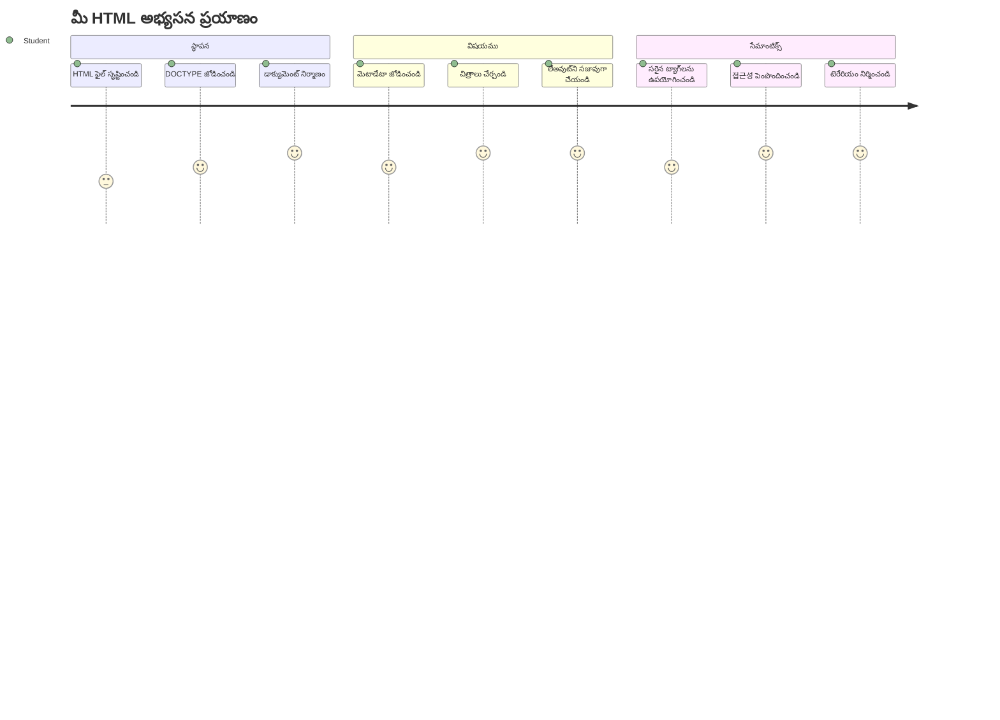
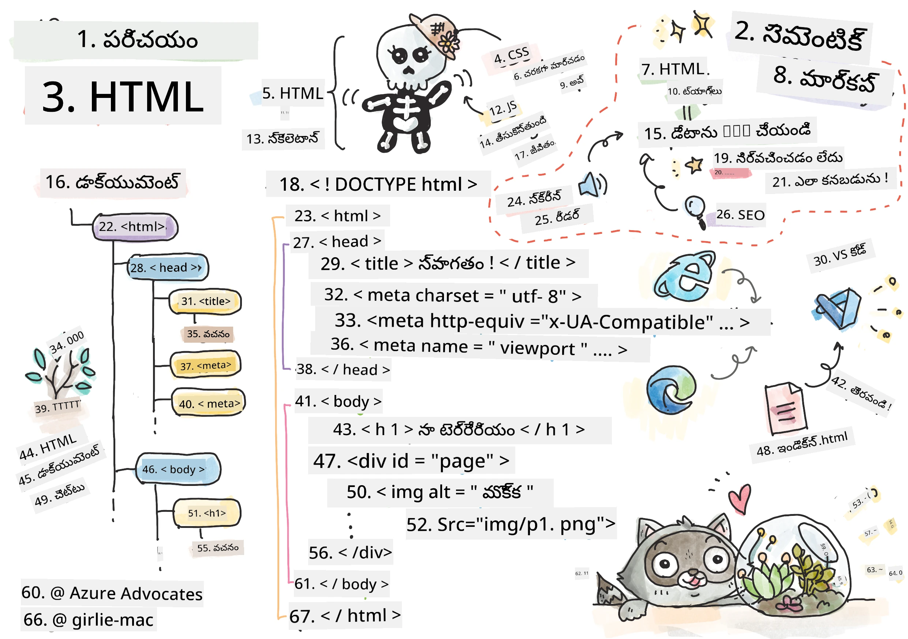
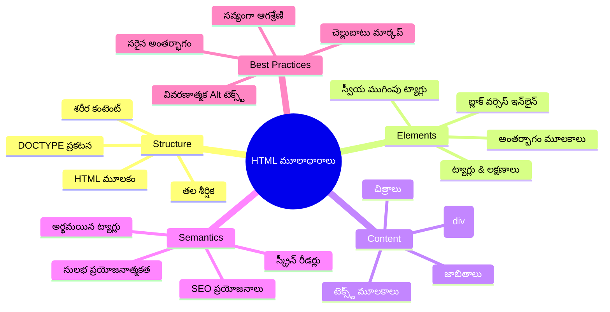
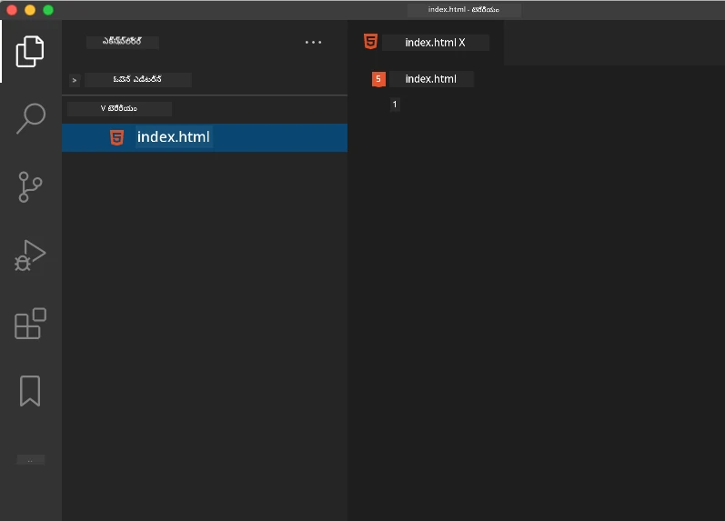
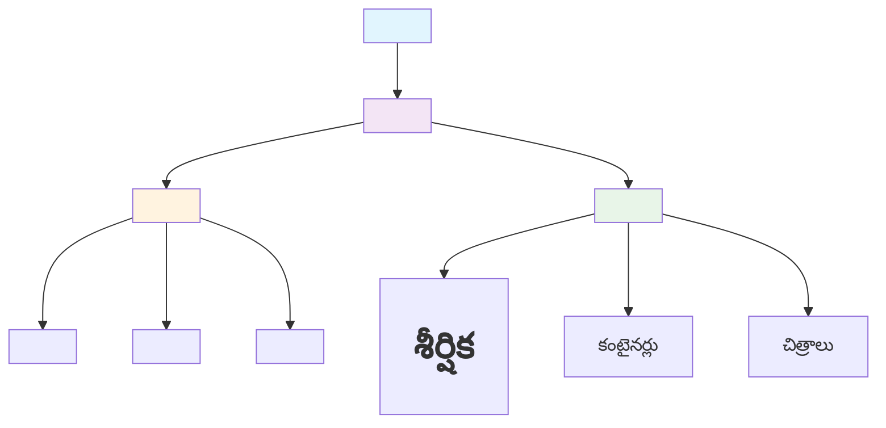
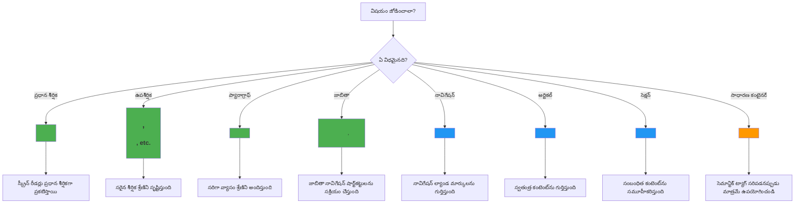
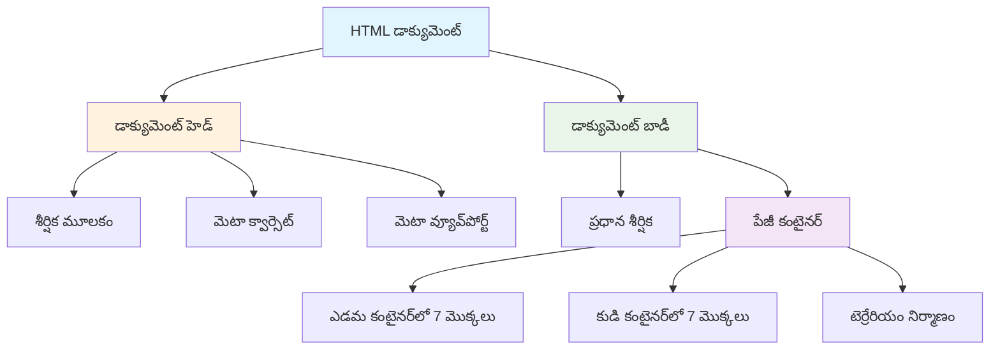
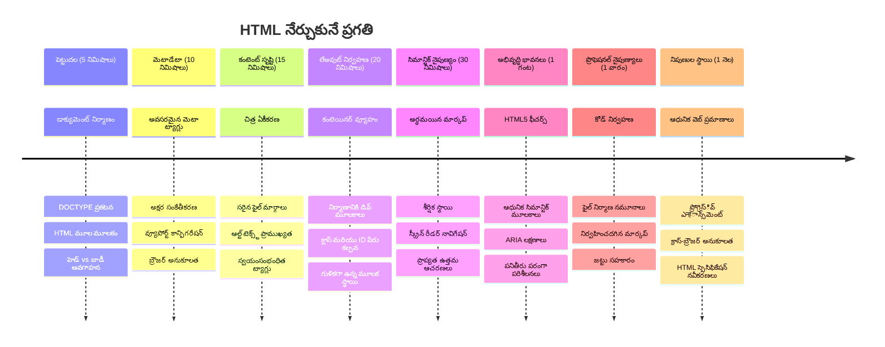

<!--
CO_OP_TRANSLATOR_METADATA:
{
  "original_hash": "3fcfa99c4897e051b558b5eaf1e8cc74",
  "translation_date": "2026-01-08T18:30:47+00:00",
  "source_file": "3-terrarium/1-intro-to-html/README.md",
  "language_code": "te"
}
-->
# Terrarium Project Part 1: HTML కు పరిచయం



> Sketchnote by [Tomomi Imura](https://twitter.com/girlie_mac)

HTML, లేదా HyperText Markup Language, మీరు ఎప్పుడైనా సందర్శించిన ప్రతి వెబ్‌సైట్ యొక్క మూలాధారం. HTMLని వెబ్ పేజీలకు నిర్మాణాన్ని ఇచ్చే ఎముకల యాడుగా భావించండి – అది ఎక్కడ విషయం ఉండాలి, ఎలా అవి ఏర్పాటు చేయబడ్డాయి, ప్రతి భాగం ఏమిటి అని నిర్వచిస్తుంది. CSS తరువాత మీ HTMLను రంగులు మరియు లేఅవుట్లు తో "డ్రెస్ అప్" చేస్తుంది, మరియు JavaScript ఇంటరాక్టివిటీతో జీవంతం చేస్తుంది, HTML అన్ని ఇతర విషయాలను సాధ్యాన్ని చేసే ప్రాథమిక నిర్మాణాన్ని అందిస్తుంది.

ఈ పాఠంలో, మీరు ఒక వర్చ్యువల్ టెరేరియం ఇంటర్‌ఫేస్ కోసం HTML నిర్మాణం సృష్టించబోతున్నారు. ఈ హ్యాండ్స్-ఆన్ ప్రాజెక్టు ద్వారా మీరు ప్రాథమిక HTML కాన్సెప్ట్స్ నేర్చుకుంటారు మరియు దృశ్యంగా ఆకట్టుకునే దాన్ని నిర్మించబోతున్నారు. మీరు సెమెంటిక్ ఎలిమెంట్స్ ఉపయోగించి విషయం ఎలా ఏర్పాటు చేయాలో, చిత్రాలతో ఎలా పనిచేయాలో, మరియు ఇంటరాక్టివ్ వెబ్ అనువర్తనం కోసం ప్రాథమికాన్ని ఎలా సృష్టించాలో నేర్చుకుంటారు.

ఈ పాఠం ముగింపులో, మీరు ఒక పని చేసే HTML పేజీ చేయబోతారు, ఇది సజీవమైన కాలములలో మొక్కల చిత్రాలను ప్రదర్శిస్తుంది, తదుపరి పాఠంలో స్టైలింగ్ కోసం సిద్ధంగా ఉంటుంది. ఇది మొదట్లో బేసిక్ గా కనపడితే బాగోలేదు – అదే HTML పని చేసేది CSS దృష్టి సౌందర్యాన్ని జోడించడానికి ముందు.


## లెక్చర్ ‌కు ముందు క్విజ్

[Pre-lecture quiz](https://ff-quizzes.netlify.app/web/quiz/15)

> 📺 **పարզరం చేసుకోండి మరియు నేర్చుకోండి**: ఈ ఉపయుక్త వీడియో సరాంశాన్ని చూడండి
> 
> [](https://www.youtube.com/watch?v=1TvxJKBzhyQ)

## మీ ప్రాజెక్ట్ సెటప్ చేయడం

HTML కోడ్ లోకి దిగేముందు, మీ టెరేరియం ప్రాజెక్ట్ కోసం సరైన వర్క్ స్పేస్ ను ఏర్పాటు చేద్దాం. మొదటి నుండి ఒక సరిగా నిర్వహించబడిన ఫైల్ నిర్మాణాన్ని సృష్టించడం ఒక కీలక అలవాటు, ఇది మీ వెబ్ అభివృద్ధి ప్రయాణంలో మీకు చాలా ఉపయోగపడుతుంది.

### టాస్క్: మీ ప్రాజెక్ట్ నిర్మాణం సృష్టించండి

మీ టెరేరియం ప్రాజెక్ట్ కోసం ఒక ప్రత్యేక ఫోల్డర్ మరియు మీ మొదటి HTML ఫైల్‌ను సృష్టించబోతున్నారు. మీరు ఉపయోగించగల రెండు విధానాలు ఇక్కడ ఉన్నాయి:

**ఎంపిక 1: Visual Studio Code ఉపయోగించడం**
1. Visual Studio Codeను ఓపెన్ చేయండి
2. "File" → "Open Folder" ను క్లిక్ చేయండి లేదా `Ctrl+K, Ctrl+O` (Windows/Linux) లేదా `Cmd+K, Cmd+O` (Mac) ఉపయోగించండి
3. `terrarium` అనే కొత్త ఫోల్డర్ సృష్టించి దానిని ఎంచుకోండి
4. ఎక్స్‌ప్లోరర్ ప్యానెలులో, "New File" ఐకాన్ పై క్లిక్ చేయండి
5. మీ ఫైల్‌కు పేరు `index.html` పెట్టండి



**ఎంపిక 2: టెర్మినల్ కమాండ్ లు ఉపయోగించడం**
```bash
mkdir terrarium
cd terrarium
touch index.html
code index.html
```

**ఈ కమాండ్ లు ఏమి చేస్తారంటే:**
- **కొత్త డైరెక్టరీ** `terrarium` ను మీ ప్రాజెక్ట్ కోసం సృష్టిస్తుంది
- **terrarium డైరెక్టరీ** లోకి మారుతుంది
- **ఖాళీ `index.html` ఫైల్** సృష్టిస్తుంది
- **ఫైల్‌ను** Visual Studio Code లో సవరించేందుకు ఓపెన్ చేస్తుంది

> 💡 **ప్రో టిప్**: వెబ్ డెవలప్‌మెంట్‌లో `index.html` పేరు ప్రత్యేకం. ఎవరో వెబ్‌సైట్‌ను సందర్శించినప్పుడు, బ్రౌజర్లు సర్వసాధారణంగా `index.html` ను డిఫాల్ట్ పేజీగా చూపిస్తాయి. అంటే, `https://mysite.com/projects/` వంటి URL లో స్పష్టంగా ఫైల్ పేరును ఇవ్వకుండా కూడా `projects` ఫోల్డర్ నుండి `index.html` ఫైల్ సేవ్ చేయబడుతుంది.

## HTML డాక్యుమెంట్ నిర్మాణం అర్థం చేసుకోవడం

ప్రతి HTML డాక్యుమెంట్ బ్రౌజర్లకు అర్థమయ్యేలా మరియు సరి చూపించేందుకు నిర్ధారించడానికి ఒక నిర్దిష్ట నిర్మాణం అనుసరిస్తుంది. ఈ నిర్మాణాన్ని ఒక అధికారిక లేఖ అనుకుంటే – ఇందులో నిర్దిష్ట క్రమంలో అవసరమైన ఎలిమెంట్లు ఉంటాయి, ఇవి గ్రాహకుడు (ఇక్కడ బ్రౌజర్) సరిగా విషయాన్ని ప్రాసెస్ చేయడంలో సహాయపడతాయి.


ప్రతి HTML డాక్యుమెంట్‌కు అవసరమైన ప్రాథమిక స్థాపనను జోడించడం ప్రారంభిద్దాం.

### DOCTYPE ప్రకటన మరియు మూల ఎలిమెంట్

ఏ HTML ఫైల్ మొదటి రెండు లైన్లు బ్రౌజర్‌కు డాక్యుమెంట్ యొక్క "పరిచయం":

```html
<!DOCTYPE html>
<html></html>
```

**ఈ కోడ్ ఏమి చేస్తుందో అర్థం చేసుకోవడం:**
- `<!DOCTYPE html>` ను ఉపయోగించి డాక్యుమెంట్ టైప్‌ను HTML5 గా ప్రకటిస్తుంది
- అన్ని పేజీ విషయాలను కలిగించే మూల `<html>` ఎలిమెంట్ సృష్టిస్తుంది
- సరియైన బ్రౌజర్ రేండరింగ్ కొరకు ఆధునిక వెబ్ ప్రమాణాలను ఏర్పాటు చేస్తుంది
- వివిధ బ్రౌజర్ల మరియు డివైస్ లలో సళువు ప్రదర్శనను నిర్ధారిస్తుంది

> 💡 **VS Code సలహా**: VS Codeలో ఏదైనా HTML ట్యాగ్ పై హోవర్ చేసినపుడు MDN వెబ్ డాక్స్ నుండి సహాయక సమాచారం, ఉపయోగం ఉదాహరణలు, బ్రౌజర్ కంపాటబిలిటీ వివరాలు చూడవచ్చు.

> 📚 **మరింత తెలుసుకోండి**: DOCTYPE ప్రకటన బ్రౌజర్లను "quirks mode" లోకి పోకుండా నిరోధిస్తుంది, ఇది చాలా పాత వెబ్‌సైట్లు మద్దతు చేసేందుకు ఉపయోగించబడింది. ఆధునిక వెబ్ అభివృద్ధి సులభమైన `<!DOCTYPE html>` ప్రకటనను ఉపయోగించి [స్టాండర్డ్స్-కంప్లయింట్ రేండరింగ్](https://developer.mozilla.org/docs/Web/HTML/Quirks_Mode_and_Standards_Mode) ను నిర్ధారిస్తుంది.

### 🔄 **శిక్షణాత్మక తనిఖీ**
**ఆరంభించకముందు ఆలోచించండి**: మీరు ఈ క్రిందలు అర్థం చేసుకున్నారా:
- ✅ ప్రతి HTML డాక్యుమెంట్ కి DOCTYPE ప్రకటన ఎందుకు కావాలి
- ✅ `<html>` మూల ఎలిమెంట్ లో ఏమి ఉంటుంది
- ✅ ఈ నిర్మాణం బ్రౌజర్లకు పేజీలను తగినట్టుగా ఎలా చూపించడంలో సహాయపడుతుంది

**త్వరిత స్వీయ-పరీక్ష**: "స్టాండర్డ్స్-కంప్లయింట్ రేండరింగ్" అంటే మీ మాటల్లో మీరు ఎలా వివరిస్తారు?

## అవసరమైన డాక్యుమెంట్ మెటాడేటాను చేర్చడం

HTML డాక్యుమెంట్ యొక్క `<head>` విభాగం బ్రౌజర్లు మరియు సెర్చ్ ఇంజిన్లు అవసరమయ్యే ముఖ్య సమాచారం కలిగి ఉంటుంది, కానీ సందర్శకులు పేజీ పై నేరుగా చూడరారు. ఇది ఒక "వెనుకగడ్డ సమాచారం" లాంటిదిగా భావించండి, ఇది మీ వెబ్ పేజీ యొక్క సరిగ్గా పనిచేయడం మరియు వాడే డివైస్ లకు సరైన ప్రదర్శన అందించడానికి సహాయపడుతుంది.

ఈ మెటాడేటా బ్రౌజర్లకు మీ పేజీ ఎలా ప్రదర్శించాలో, ఎటువంటి క్యారెక్టర్ ఎంకోడింగ్ ఉపయోగించాలో, వివిధ స్క్రీన్ పరిమాణాలను ఎలా నిర్వహించాలో చెప్పుతుంది – ఇవన్నీ ప్రొఫెషనల్, యాక్సెసిబుల్ వెబ్ పేజీలను సృష్టించడానికి అవసరం.

### టాస్క్: డాక్యుమెంట్ హెడ్ను చేర్చండి

మీ ప్రారంభ మరియు ముగింపు `<html>` ట్యాగుల మధ్య ఈ `<head>` విభాగాన్ని చొప్పించండి:

```html
<head>
	<title>Welcome to my Virtual Terrarium</title>
	<meta charset="utf-8" />
	<meta http-equiv="X-UA-Compatible" content="IE=edge" />
	<meta name="viewport" content="width=device-width, initial-scale=1" />
</head>
```

**ప్రతి ఎలిమెంట్ ఏమి accomplish చేస్తుందో విభజన:**
- బ్రౌజర్ ట్యాబ్స్ మరియు సెర్చ్ ఫలితాలలో కనిపించే పేజీ శీర్షికను సెట్స్ చేస్తుంది
- ప్రపంచవ్యాప్తంగా సరైన టెక్ట్స్ ప్రదర్శన కోసం UTF-8 క్యారెక్టర్ ఎంకోడింగ్‌ను స్పెసిఫై చేస్తుంది
- ఆధునిక Internet Explorer వెర్షన్లతో అనుకూలతను నిర్ధారిస్తుంది
- డివైస్ వెడల్పుకు తగ్గట్టుగా viewport ను సెట్ చేసి స్పందించే డిజైన్‌ను కంఫిగర్ చేస్తుంది
- విషయాన్ని సహజ పరిమాణంలో చూపించేందుకు ప్రారంభ జూమ్ స్థాయిని నియంత్రిస్తుంది

> 🤔 **ఇది గురించి ఆలోచించండి**: మీరు ఇలా ఒక viewport meta ట్యాగ్ సెట్ చేస్తే: `<meta name="viewport" content="width=600">` ఏం జరుగుతుంది? ఇది పేజీని ఎప్పుడూ 600 పిక్సెల్ల వెడల్పుగా బలం చేస్తుంది, ఇది స్పందించే డిజైన్ ను తెగతీస్తుంది! [సరైన viewport కాన్ఫిగరేషన్](https://developer.mozilla.org/docs/Web/HTML/Viewport_meta_tag) గురించి మరింత తెలుసుకోండి.

## డాక్యుమెంట్ బాడీని నిర్మించడం

`<body>` ఎలిమెంట్ మీ వెబ్ పేజీ యొక్క అన్ని కనిపించే కంటెంట్ ను కలిగి ఉంటుంది – యూజర్లు చూసే మరియు ఇంటరాక్ట్ చేసే ప్రతిదీ. `<head>` విభాగం బ్రౌజర్ కి సూచనలు అందించినా, `<body>` విభాగంలో అసలు విషయాలు ఉంటాయి: టెక్ట్స్, చిత్రాలు, బటన్లు మరియు ఇతర UI ఎలిమెంట్లు.

బాడీ నిర్మాణాన్ని జోడించి, HTML ట్యాగ్లు ఎలా కలిసి అర్థవంతమైన విషయం సృష్టిస్తాయో అర్థం చేసుకుందాం.

### HTML ట్యాగ్ నిర్మాణం అర్థం చేసుకోవడం

HTMLలో ఎలిమెంట్లను నిర్వచించడానికి స్టాండర్డ్ జోడు ట్యాగ్స్ ఉపయోగిస్తారు. చాలా ట్యాగ్స్ వద్ద ఓపెనింగ్ `<p>` మరియు క్లోజింగ్ `</p>` ట్యాగ్ ఉంటాయి, మధ్యలో విషయముంటుంది: `<p>Hello, world!</p>`. ఇది "Hello, world!" టెక్ట్స్ తో ఒక ప్యారాగ్రాఫ్ ఎలిమెంట్ సృష్టిస్తుంది.

### టాస్క్: బాడీ ఎలిమెంట్ చేర్చండి

మీ HTML ఫైల్‌ను `<body>` ఎలిమెంట్ తో అప్డేట్ చేయండి:

```html
<!DOCTYPE html>
<html>
	<head>
		<title>Welcome to my Virtual Terrarium</title>
		<meta charset="utf-8" />
		<meta http-equiv="X-UA-Compatible" content="IE=edge" />
		<meta name="viewport" content="width=device-width, initial-scale=1" />
	</head>
	<body></body>
</html>
```

**ఈ సంపూర్ణ నిర్మాణం ఏమి అందిస్తుంది:**
- ప్రాథమిక HTML5 డాక్యుమెంట్ ఫ్రేమ్‌వర్క్‌ను ఏర్పాటు చేస్తుంది
- సరైన బ్రౌజర్ రేండరింగ్ కోసం అవసరమైన మెటాడేటాను కలిగిస్తుంది
- కనిపించే కంటెంట్ కోసం ఖాళీ బాడీని సృష్టిస్తుంది
- ఆధునిక వెబ్ అభివృద్ధి మంచిపనులని అనుసరిస్తుంది

ఇప్పుడు మీరు మీ టెరేరియం కనిపించే అంశాలు జోడించేందుకు సిద్ధంగా ఉన్నారు. విభిన్న భాగాలను ఏర్పాటుచేయడానికి కంటైనర్‌లుగా `<div>` ఎలిమెంట్లను, మొక్కల చిత్రాలను ప్రదర్శించడానికి `` ఎలిమెంట్లను ఉపయోగిస్తాము.

### చిత్రాలతో మరియు లేఅవుట్ కంటైనర్‌లతో పని చేయడం

HTMLలో చిత్రాలు ప్రత్యేకం, ఎందుకంటే అవి "సెల్ఫ్-క్లోజింగ్" ట్యాగ్స్ ఉపయోగిస్తాయి. కంటెంట్ చుట్టూ కూర్చుకునే `<p></p>` లాంటి ఎలిమెంట్లకు భిన్నంగా, `` ట్యాగ్ లో అవసరమైన సమాచారం ట్యాగ్ లోనేని `src` వంటి అట్రిబ్యూట్‌లతో ఉంటుంది మరియు యాక్సెసిబిలిటీ కోసం `alt` అట్రిబ్యూట్ ఉంటుంది.

మీ HTMLకు చిత్రాలను జోడించే ముందు, ప్రాజెక్ట్ ఫైళ్ళను సక్రమంగా ఏర్పాటు చేయాలి. అందుకోసం `images` ఫోల్డర్ సృష్టించి, మొక్కల చిత్రాలను అందులో ఉంచాలి.

**మొదట, మీ చిత్రాలను సెట్ చేయండి:**
1. మీ టెరేరియం ప్రాజెక్ట్ ఫోల్డర్ లో `images` ఫోల్డర్ ను సృష్టించండి
2. [solution folder](../../../../3-terrarium/solution/images) నుండి మొక్కల చిత్రాలను డౌన్‌లోడ్ చేయండి (మొత్తం 14 మొక్కల చిత్రాలు)
3. అన్ని మొక్కల చిత్రాలను కొత్త `images` ఫోల్డర్ లో కాపీ చేయండి

### టాస్క్: మొక్క ప్రదర్శన లేఅవుట్ సృష్టించండి

ఇప్పుడు మీ `<body></body>` ట్యాగుల మధ్యలో రెండు కాలములుగా ఏర్పాటు చేసిన మొక్కల చిత్రాలను జోడించండి:

```html
<div id="page">
	<div id="left-container" class="container">
		<div class="plant-holder">
			
		</div>
		<div class="plant-holder">
			
		</div>
		<div class="plant-holder">
			
		</div>
		<div class="plant-holder">
			
		</div>
		<div class="plant-holder">
			
		</div>
		<div class="plant-holder">
			
		</div>
		<div class="plant-holder">
			
		</div>
	</div>
	<div id="right-container" class="container">
		<div class="plant-holder">
			
		</div>
		<div class="plant-holder">
			
		</div>
		<div class="plant-holder">
			
		</div>
		<div class="plant-holder">
			
		</div>
		<div class="plant-holder">
			
		</div>
		<div class="plant-holder">
			
		</div>
		<div class="plant-holder">
			
		</div>
	</div>
</div>
```

**దశల వారీగా, ఈ కోడ్‌లో ఏమి జరుగుతుందో:**
- `id="page"` తో ప్రధాన పేజీ కంటైనర్ సృష్టించడం, అన్ని కంటెంట్ ను కలిగి ఉంటుంది
- రెండు కాలమ్ కంటైనర్‌లు సృష్టించడం: `left-container` మరియు `right-container`
- ఎడమ కాలమ్‌లో 7 మొక్కలు, కుడి కాలమ్‌లో 7 మొక్కలు ఏర్పాటు చేయడం
- ప్రతి మొక్క చిత్రాన్ని వ్యక్తిగత స్థానం కోసం `plant-holder` div లో చుట్టడం
- తదుపరి పాఠంలో CSS స్టైలింగ్ కోసం సమానమైన క్లాస్ పేర్లను అప్లై చేయడం
- JavaScript ఇంటరాక్షన్ కోసం ప్రతి మొక్క చిత్రానికి ప్రత్యేక ID కేటాయించడం
- చిత్రాల ఫోల్డర్ వైపు సరిగా ఉన్న ఫైల్ పథాలను ఉపయోగించడం

> 🤔 **దీన్ని పరిశీలించండి**: ప్రస్తుతం అన్ని చిత్రాలకు ఒకే `alt` టెక్స్ "plant" ఇవ్వబడింది. ఇది యాక్సెసిబిలిటీ కోసం సరియైనది కాదు. స్క్రీన్ రీడర్ వినియోగదారులు అదే "plant" పదాన్ని 14 సార్లు వినిపించుకునే Gelegenheit వారు ఏ మొక్క చూపబడుతున్నదో తెలియదు. ప్రతి చిత్రానికి ఉత్తమంగా వివరించే `alt` టెక్స్ ఎలాంటిదిగా ఉండాలి?

> 📝 **HTML ఎలిమెంట్ రకాలు**: `<div>` ఎలిమెంట్లు "బ్లాక్-లెవల్"వి, పూర్తి వెడల్పు తీసుకుంటాయి, `<span>` ఎలిమెంట్లు "ఇన్‌లైన్" మరియు అవసరమైన వెడల్పు మాత్రమే తీసుకుంటాయి. మీరు ఈ `<div>` ట్యాగ్స్ అన్నింటిని `<span>` ట్యాగ్స్ గా మార్చితే ఏమి జరుగుతుందని మీరు అనుకుంటారు?

### 🔄 **శిక్షణాత్మక తనిఖీ**
**నిర్మాణం అర్థం చేసుకోవడం**: మీ HTML నిర్మాణాన్ని ఒక నిమిషం సమీక్షించండి:
- ✅ మీ లేఅవుట్ లో ప్రధాన కంటైనర్ లను గుర్తించగలరా?
- ✅ ప్రతి చిత్రానికి ప్రత్యేక ID ఉండటం ఎందుకు తెలుసా?
- ✅ `plant-holder` divs ఉద్దేశ్యాన్ని మీరు ఎలా వివరిస్తారు?

**దృశ్య పరీక్ష**: మీ HTML ఫైల్‌ను బ్రౌజర్‌లో ఓపెన్ చేయండి. మీరు చూడగలిగేది:
- ఒక సాధారణ మొక్కల జాబితా
- రెండు కాలములలో ఏర్పాటు చేసిన చిత్రాలు
- సింపుల్, స్టైల్ చేయబడని లేఅవుట్

**గమనిక**: ఈ సాధారణ రూపం నేరుగా CSS స్టైలింగ్ వరకు HTML ఎలా కనిపించాలో చూపిస్తుంది!

ఈ మార్కప్ తో, మొక్కలు స్క్రీన్ పై కనపడతారు, అయితే అవి ఇంకా అద్భుతంగా కనిపించవు – తదుపరి పాఠంలో CSS అలాగే చేస్తుంది! ఇప్పటి కోసం మీరు ఒక బలమైన HTML పునాది కలిగి ఉన్నారు, ఇది సక్రమంగా విషయాన్ని ఏర్పాటు చేస్తుంది మరియు యాక్సెసిబిలిటీ యొక్క ఉత్తమ పద్ధతులను పాటిస్తుంది.

## యాక్సెసిబిలిటీ కోసం సెమెంటిక్ HTML ఉపయోగించడం

సెమెంటిక్ HTML అంటే HTML ఎలిమెంట్లను వాటి అర్థం మరియు ఉద్దేశ్యానికి అనుగుణంగా ఎంచుకోవడం, కేవలం ఆ కంటెంట్ ఎలా కనిపిస్తుందో కాని కాదు. మీరు సెమెంటిక్ మార్కప్ ఉపయోగించినప్పుడు, మీరు మీ విషయం నిర్మాణం మరియు అర్థం పై బ్రౌజర్లు, సెర్చ్ ఇంజిన్లు మరియు సహాయక సాంకేతికతలు (ఉదా: స్క్రీన్ రీడర్స్) కు కమ్యూనికేట్ చేస్తారు.


ఈ విధానం మీ వెబ్‌సైట్లను వికలాంగత కలిగినవారికి మరింత యాక్సెసిబుల్‌గా చేస్తుంది మరియు సెర్చ్ ఇంజిన్లు మీ కంటెంట్ ను బాగా అర్థం చేసుకోవడానికి సహాయపడుతుంది. ఇది ఆధునిక వెబ్ అభివృద్ధి యొక్క ప్రాథమిక సిద్దాంతం, ఇది అందరికీ మెరుగైన అనుభవాలను సృష్టిస్తుంది.

### సెమెంటిక్ పేజీ శీర్షిక జోడించడం

మీ టెరేరియం పేజీకి సరైన హెడింగ్ జత చేయండి. ఈ లైన్ ను మీ ప్రారంభ `<body>` ట్యాగ్ తర్వాత వెంటనే చొప్పించండి:

```html
<h1>My Terrarium</h1>
```

**సెమెంటిక్ మార్కప్ ఎందుకు ముఖ్యం:**
- స్క్రీన్ రీడర్లు పేజీ నిర్మాణాన్ని నావిగేట్ చేయడంలో, అర్థం చేసుకోవడంలో సహాయపడుతుంది
- కంటెంట్ హైరార్కీ స్పష్టంగా ఉండడం ద్వారా సెర్చ్ ఇంజిన్ ఆప్టిమైజేషన్ (SEO) మెరుగుపడుతుంది
- దృష్టి లోపం లేదా మానసిక తేడాలు ఉన్న వినియోగదారుల యాక్సెసిబిలిటీ పెరుగుతుంది
- అన్ని డివైసులు మరియు ప్లాట్‌ఫారమ్‌లపై మెరుగైన వినియోగదారుల అనుభవాలను సృష్టిస్తుంది
- ప్రొఫెషనల్ డెవలప్మెంట్‌ కోసం వెబ్ ప్రమాణాలు మరియు ఉత్తమ పద్ధతులను అనుసరిస్తుంది

**సెమెంటిక్ మరియు అసెమెంటిక్ ఎంపికల ఉదాహరణలు:**

| ప్రయోజనం | ✅ సెమెంటిక్ ఎంపిక | ❌ అసెమెంటిక్ ఎంపిక |
|---------|-------------------|------------------------|
| ప్రధాన శీర్షిక | `<h1>శీర్షిక</h1>` | `<div class="big-text">శీర్షిక</div>` |
| నావిగేషన్ | `<nav><ul><li></li></ul></nav>` | `<div class="menu"><div></div></div>` |
| బటన్ | `<button>నొక్కండి</button>` | `<span onclick="...">నొక్కండి</span>` |
| ఆర్టికల్ కంటెంట్ | `<article><p></p></article>` | `<div class="content"><div></div></div>` |

> 🎥 **అమల్లో చూడండి**: [వెబ్ పేజీలతో స్క్రీన్ రీడర్లు ఎలా ఇంటరాక్ట్ అవుతాయో చూడండి](https://www.youtube.com/watch?v=OUDV1gqs9GA), మరియు సెమెంటిక్ మార్కప్ యాక్సెసిబిలిటీకి ఎందుకు ముఖ్యం అనేది అర్థం చేసుకోండి. సరైన HTML నిర్మాణం ఎలా వినియోగదారులకి సులభంగా నావిగేట్ చేయడానికి సహాయపడుతుందో గమనించండి.

## టెరేరియం కంటైనర్ సృష్టించడం

ఇప్పుడు టెరేరియం యొక్క HTML నిర్మాణాన్ని జోడించండి – మొక్కలు చివరికి ఉంచగల ప్లాస్టిక్ గ్లాస్ కంటైనర్. ఈ విభాగం ఒక ముఖ్యమైన భావనని చూపిస్తుంది: HTML నిర్మాణం అందిస్తుంది, కానీ CSS స్టైలింగ్ లేకుండా, ఈ ఎలిమెంట్లు ఇంకా కనిపించవు.

టెరేరియం మార్కప్ లో అందుబాటులో ఉండే క్లాస్ పేర్లు తదుపరి పాఠంలో CSS స్టైలింగ్ చాలా సులభతరం మరియు నిర్వహించదగినవి చేస్తాయి.

### టాస్క్: టెరేరియం నిర్మాణం చేర్చండి

ఈ మార్కప్ ను చివరి `</div>` ట్యాగు ముందు (పేజీ కంటైనర్ మూసే ట్యాగు ముందు) చొప్పించండి:

```html
<div id="terrarium">
	<div class="jar-top"></div>
	<div class="jar-walls">
		<div class="jar-glossy-long"></div>
		<div class="jar-glossy-short"></div>
	</div>
	<div class="dirt"></div>
	<div class="jar-bottom"></div>
</div>
```

**ఈ టెరేరియం నిర్మాణం అర్థం చేసుకోవడం:**
- స్టైలింగ్ కోసం ప్రత్యేక IDతో ప్రధాన టెరేరియం కంటైనర్ సృష్టిస్తుంది
- **ప్రతీ విజువల్ భాగానికి** వేరే వేరే ఎలిమెంట్లను నిర్వచిస్తుంది (ఉపరి భాగం, గోడలు, మన్ను, దిగువ భాగం)  
- **గ్లాసు ప్రతిబింబ ప్రభావాల కోసం** నెస్టెడ్ ఎలిమెంట్లను కలిగి ఉంటుంది (గ్లోసీ ఎలిమెంట్లు)  
- **ప్రతి ఎలిమెంటు యొక్క ప్రయోజనాన్ని స్పష్టంగా సూచించే** వివరణాత్మక క్లాస్ పేర్లను ఉపయోగిస్తుంది  
- **గ్లాస్ టెర్రారియం రూపాన్ని సృష్టించేందుకు** CSS స్టైలింగ్ కోసం నిర్మాణాన్ని సిద్ధం చేస్తుంది  

> 🤔 **ఏమైనా గమనించారా?**: మీరు ఈ మార్కప్‌ని చేర్చినప్పటికీ, మీరు పేజీలో కొత్తగా ఏదీ చూడరు! ఇది HTML నిర్మాణాన్ని మరియు CSS రూపాన్ని ఎలా కల్పించేదో సంపూర్ణంగా తెలియజేస్తుంది. ఈ `<div>` ఎలిమెంట్లు ఉన్నప్పటికీ వాటికి ఇంకా ఏవైనా దృశ్య శైలులు లేవు – అవి తర్వాతి పాఠంలో వస్తాయి!


### 🔄 **ఉపాధ్యాయుల చెక్-ఇన్**  
**HTML నిర్మాణ నైపుణ్యం**: ముందుకు సాగేముందు, మీరు ఈ క్రింది విషయాలను తెలుసుకోండి:  
- ✅ HTML నిర్మాణం మరియు దృశ్య రూపంలోని తేడాను వివరించగలగాలి  
- ✅ సాందర్భిక (semantic) మరియు అసాందర్భిక (non-semantic) HTML ఎలిమెంట్లను గుర్తించగలగాలి  
- ✅ సరైన మార్కప్ యాక్సెసిబిలిటీకి ఎలా ఉపయోగపడుతుందో వివరించగలగాలి  
- ✅ పూర్తి డాక్యుమెంట్ ట్రీ నిర్మాణాన్ని గుర్తించగలగాలి  

**మీ అర్థం ట్రై చేయండి**: మీ HTML ఫైల్‌ను జావాస్క్రిప్ట్ డిసేబుల్ చేసి మరియు CSS తీసేసి బ్రౌజర్‌లో తెరవండి. ఇది మీరు సృష్టించిన ఖచ్చితమైన సాందర్భిక నిర్మాణాన్ని చూపిస్తుంది!

---

## GitHub Copilot ఏజెంట్ ఛాలెంజ్

Agent మోడ్ ఉపయోగించి క్రింది ఛాలెంజ్‌ను పూర్తి చేయండి:  

**వివరణ:** టెర్రారియం ప్రాజెక్టుకు చేర్చగల ఒక మొక్కల సంరక్షణ మార్గదర్శక భాగం కోసం సాందర్భిక HTML నిర్మాణాన్ని సృష్టించండి.

**ప్రాంప్ట్:** "Plant Care Guide" అనే ప్రధాన శీర్షికతో ఒక సెక్షన్ సృష్టించండి, దాని కింద "Watering", "Light Requirements", మరియు "Soil Care" అనే మూడు ఉపసెక్ట్‌లతో పాటు ప్రతి ఉపశీర్షికకి సంబంధించిన మొక్కల సంరక్షణ సమాచారంతో కూడిన పేరాగ్రాఫ్లు ఉండాలి. సరైన సాందర్భిక HTML ట్యాగ్స్ `<section>`, `<h2>`, `<h3>`, మరియు `<p>` ఉపయోగించి కంటెంట్‌ను సక్రమంగా నిర్మించండి.

ఇక్కడ [agent mode](https://code.visualstudio.com/blogs/2025/02/24/introducing-copilot-agent-mode) గురించి మరింత తెలుసుకోండి.

## HTML చరిత్రను అన్వేషించే ఛాలెంజ్

**వెబ్ అభివృద్ధి గురించిన అభ్యాసం**

HTML 1990లో టిమ్ బర్నర్స్-్లీ CERNలో మొదటి వెబ్ బ్రౌజర్ సృష్టించినప్పటి నుండి గణనీయంగా అభివ్రుద్ధి చెందింది. కొన్ని పాత ట్యాగ్స్ వంటి `<marquee>` ప్రస్తుతం నిషేధించబడ్డాయి ఎందుకంటే అవి ఆధునిక యాక్సెసిబిలిటీ ప్రమాణాలు మరియు రెస్పాన్సివ్ డిజైన్ సూత్రాలతో సరిపడవు.

**ఈ ప్రయోగాన్ని నిర్వహించండి:**  
1. తాత్కాలికంగా మీ `<h1>` శీర్షికను `<marquee>` ట్యాగ్‌లో చుట్టండి: `<marquee><h1>My Terrarium</h1></marquee>`  
2. మీ పేజీని బ్రౌజర్‌లో తెరచి స్క్రోల్లింగ్ ప్రభావాన్ని పరిశీలించండి  
3. ఈ ట్యాగ్ ఎందుకు నిషేధించబడిందో ఆలోచించండి (సూచన: వినియోగదారుల అనుభవం మరియు యాక్సెసిబిలిటీపై దృష్టి పెడతుంది)  
4. `<marquee>` ట్యాగ్ తీసివేసి సాందర్భిక మార్కప్‌కు తిరిగి రావాలి  

**పరిశీలించవలసిన ప్రశ్నలు:**  
- స్క్రోలింగ్ శీర్షిక దృష్టి లోపం ఉన్నవారు లేదా గమనిక స్పందనకు ఆందోళన ఉన్న వినియోగదారులపై ఎలా ప్రభావం చూపుతుంది?  
- ఆమోదయోగ్యమైన దృష్టితో ఏ ఆధునిక CSS సాంకేతికతలు ఇలాంటి దృశ్య ప్రభావాలను సాధించగలవు?  
- ప్రస్తుత వెబ్ ప్రమాణాలను ఉపయోగించడం ఏ కారణంగా అవసరం, ఎందుకంటే నిషేదించిన ఎలిమెంట్లను ఉపయోగించకూడదా?  

[నిషేధించిన మరియు పాతతరగతి HTML ఎలిమెంట్ల గురించి](https://developer.mozilla.org/docs/Web/HTML/Element#Obsolete_and_deprecated_elements) మరింత తెలుసుకోండి, అవి ఎలా వెబ్ ప్రమాణాలను మెరుగుపరుస్తాయి.

## పోస్ట్-లెక్చర్ క్విజ్

[Post-lecture quiz](https://ff-quizzes.netlify.app/web/quiz/16)

## సమీక్ష & స్వయంగా అధ్యయనం

**మీ HTML జ్ఞానాన్ని లోతుగా చేసుకోండి**

HTML వెబ్ స్థాపనకు 30 ఏళ్ల పైనుగా మూలస్తంభమైనది, ఒక సరళమైన డాక్యుమెంట్ మార్కప్ భాష నుండి సంక్లిష్ట అనువర్తనాల వేదికగా అభివృద్ది చెందినది. ఈ అభివృద్ది తెలుసుకోవడం ఆధునిక వెబ్ ప్రమాణాలు అర్థం చేసుకోవడానికి మరియు మెరుగైన అభివృద్ధి నిర్ణయాలు తీసుకోవడానికి సహాయపడుతుంది.

**ధారిత అభ్యాస మార్గాలు:**  

1. **HTML చరిత్ర మరియు అభివృద్ది**  
   - HTML 1.0 నుండి HTML5 వరకు టైమ్‌లైన్ పరిశోధించండి  
   - కొన్ని ట్యాగ్లు ఎందుకు నిషేధించబడ్డాయో తెలుసుకోండి (యాక్సెసిబిలిటీ, మొబైల్ అనుకూలత, నిర్వహణ)  
   - రావాల్సిన HTML లక్షణాలు మరియు ప్రతిపాదనలు తెలుసుకోండి  

2. **సాందర్భిక HTML లోతైన అధ్యయనం**  
   - [HTML5 సాందర్భిక ఎలిమెంట్ల](https://developer.mozilla.org/docs/Web/HTML/Element) పూర్తి జాబితాను అధ్యయనం చేయండి  
   - ఎప్పుడు `<article>`, `<section>`, `<aside>`, మరియు `<main>` ఉపయోగించాలో సాధన చేయండి  
   - మెరుగైన యాక్సెసిబిలిటీ కోసం ARIA గుణల గురించి నేర్చుకోండి  

3. **ఆధునిక వెబ్ అభివృద్ధి**  
   - Microsoft Learn లో [రెస్పాన్సివ్ వెబ్‌సైట్ల నిర్మాణం](https://docs.microsoft.com/learn/modules/build-simple-website/?WT.mc_id=academic-77807-sagibbon) గురించి తెలుసుకోండి  
   - HTML ఎలా CSS మరియు జావాస్క్రిప్ట్‌తో కలిసిఉంది అనేదాన్ని అర్థం చేసుకోండి  
   - వెబ్ పనితనం మరియు SEO ఉత్తమ ప్రాక్టీసులు తెలుసుకోండి  

**పరిశీలన ప్రశ్నలు:**  
- మీరు ఏ పాతతరగతి HTML ట్యాగ్లు కనుగొన్నారు, అవి ఎందుకు తొలగించబడ్డాయి?  
- భవిష్యత్ వెర్షన్లకు కొత్త HTML లక్షణాలు ఏమేమి ప్రతిపాదిస్తున్నారు?  
- సాందర్భిక HTML వెబ్ యాక్సెసిబిలిటీ మరియు SEOకు ఎలా సహాయపడుతుంది?  

### ⚡ **తరువాతి 5 నిమిషాల్లో మీరు చేయగలరు**  
- [ ] DevTools (F12) తెరిచి మీ ఇష్టమైన వెబ్‌సైట్ యొక్క HTML నిర్మాణాన్ని పరిశీలించండి  
- [ ] `<h1>`, `<p>`, మరియు `` వంటి ప్రాథమిక ట్యాగ్లతో సులభమైన HTML ఫైల్ సృష్టించండి  
- [ ] W3C HTML వాలిడేటర్ ఆన్‌లైన్ ద్వారా మీ HTML ని ధృవీకరించండి  
- [ ] మీ HTMLకి `<!-- comment -->` ఉపయోగించి వ్యాఖ్యలు జోడించండి  

### 🎯 **ఈ గంటలో మీరు సాధించగలిగేది**  
- [ ] పోస్ట్-లెసన్ క్విజ్ పూర్తి చేసి సాందర్భిక HTML భావనలను పునరावलोकన చేయండి  
- [ ] సరైన HTML నిర్మాణంతో మీ గురించి సరళమైన వెబ్‌పేజీని రూపొందించండి  
- [ ] వివిధ హెడింగ్ స్థాయిలు మరియు టెక్స్ట్ ఫార్మాటింగ్ ట్యాగ్లతో ప్రయోగం చేయండి  
- [ ] మల్టీమీడియా ఇంటిగ్రేషన్ కోసం చిత్రాలు మరియు లింకులను జోడించండి  
- [ ] మీరు ఇప్పటివరకు ప్రయత్నించని HTML5 లక్షణాలపై పరిశోధన చేయండి  

### 📅 **మీ వారాంతపు HTML ప్రయాణం**  
- [ ] సాందర్భిక మార్కప్‌తో టెర్రారియం ప్రాజెక్ట్ అసైన్‌మెంట్ పూర్తి చేయండి  
- [ ] ARIA లేబుల్స్ మరియు పాత్రలతో యాక్సెసిబుల్ వెబ్‌పేజీ సృష్టించండి  
- [ ] వివిధ ఇన్‌పుట్ టైప్లతో ఫారమ్ సృష్టి అభ్యాసం చేయండి  
- [ ] localStorage లేదా geolocation వంటి HTML5 APIs అన్వేషించండి  
- [ ] రెస్పాన్సివ్ HTML నమూనాలు మరియు మొబైల్-ఫస్ట్ డిజైన్ అధ్యయనం చేయండి  
- [ ] ఇతర డెవలపర్‌ల HTML కోడ్ పునః సమీక్షించండి ఉత్తమ అభ్యాసాల కోసం  

### 🌟 **మీ నెలల తరంపాటు వెబ్ ఫౌండేషన్**  
- [ ] మీ HTML నైపుణ్యాలను ప్రదర్శించే పోర్ట్‌ఫోలియో వెబ్‌సైట్ నిర్మించండి  
- [ ] Handlebars వంటి ఫ్రేమ్‌వర్క్‌తో HTML టెంప్లేటింగ్ నేర్చుకోండి  
- [ ] HTML డాక్యుమెంటేషన్ మెరుగుపరచడంలో ఓపెన్ సోర్స్ ప్రాజెక్టులకు కాంట్రిబ్యూట్ చేయండి  
- [ ] కస్టమ్ ఎలిమెంట్స్ వంటి అధునాతన HTML భావనలను మాస్టరు చేయండి  
- [ ] HTMLని CSS ఫ్రేమ్‌వర్క్స్ మరియు జావాస్క్రిప్ట్ లైబ్రరీలతో సమన్వయంచేయండి  
- [ ] HTML పునాది నేర్చుకుంటున్న ఇతరులకు మార్గదర్శకత్వం ఇవ్వండి  

## 🎯 మీ HTML నైపుణ్యాల కాలపరిమితి


### 🛠️ మీ HTML టూల్‌కిట్ సారాంశం  

ఈ పాఠం పూర్తిచేసిన తర్వాత, మీ వద్ద ఉంది:  
- **డాక్యుమెంట్ నిర్మాణం**: సరైన DOCTYPEతో పూర్తి HTML5 ఫౌండేషన్  
- **సాందర్భిక మార్కప్**: యాక్సిసిబిలిటీ మరియు SEOను మెరుగుపరచే అర్థవంతమైన ట్యాగ్లు  
- **చిత్ర ఇంటిగ్రేషన్**: సరైన ఫైల్ కంట్రోల్ మరియు alt టెక్స్ట్ విధానం  
- **లేఅవుట్ కంటైనర్లు**: వివరణాత్మక క్లాస్ పేర్లతో సూచించే div ఉపయోగం  
- **యాక్సెసిబిలిటీ అవగాహన**: స్క్రీన్ రీడర్ నావిగేషన్ అర్థం చేసుకోవడం  
- **ఆధునిక ప్రమాణాలు**: ప్రస్తుత HTML5 ఆచారాలు మరియు పాతతరగతి ట్యాగ్ల జ్ఞానం  
- **ప్రాజెక్ట్ ఫౌండేషన్**: CSS స్టైలింగ్ మరియు జావాస్క్రిప్ట్ ఇంటరాక్టివిటీ కోసం దృఢమైన ఆధారం  

**తరువాతి అడుగులు**: మీ HTML నిర్మాణం CSS స్టైలింగ్ కోసం సిద్ధంగా ఉంది! మీరు సృష్టించిన సాందర్భిక ఫౌండేషన్ తర్వాతి పాఠాన్ని చాలా సులభంగా అర్థం చేసుకోవడానికి సహాయపడుతుంది.

---

## అసైన్‌మెంట్

[Practice your HTML: Build a blog mockup](assignment.md)

---

<!-- CO-OP TRANSLATOR DISCLAIMER START -->
**అస్పష్టత**:
ఈ పత్రాన్ని AI అనువాద సేవ [Co-op Translator](https://github.com/Azure/co-op-translator) సహాయంతో అనువదించబడింది. మేము నిజసంబంధత కోసం ప్రయత్నిస్తామని గమనించండి, అయితే ఆటోమెటిక్ అనువాదాలలో దోషాలు లేదా అసత్యతలు ఉండవచ్చు. స్థానిక భాషలో ఉన్న అసలు పత్రం అధికారిక మూలంగా పరిగణించాలి. కీలకమైన సమాచారం కోసం, ప్రొఫెషనల్ మానవ అనువాదం సిఫార్సుచేయబడుతుంది. ఈ అనువాదం వాడుక వల్ల కలిగే ఏ ధోకా లేదా తప్పుగా అర్థం చేసుకున్న పరిస్థితులకి మేము బాధ్యులం కాదు.
<!-- CO-OP TRANSLATOR DISCLAIMER END -->