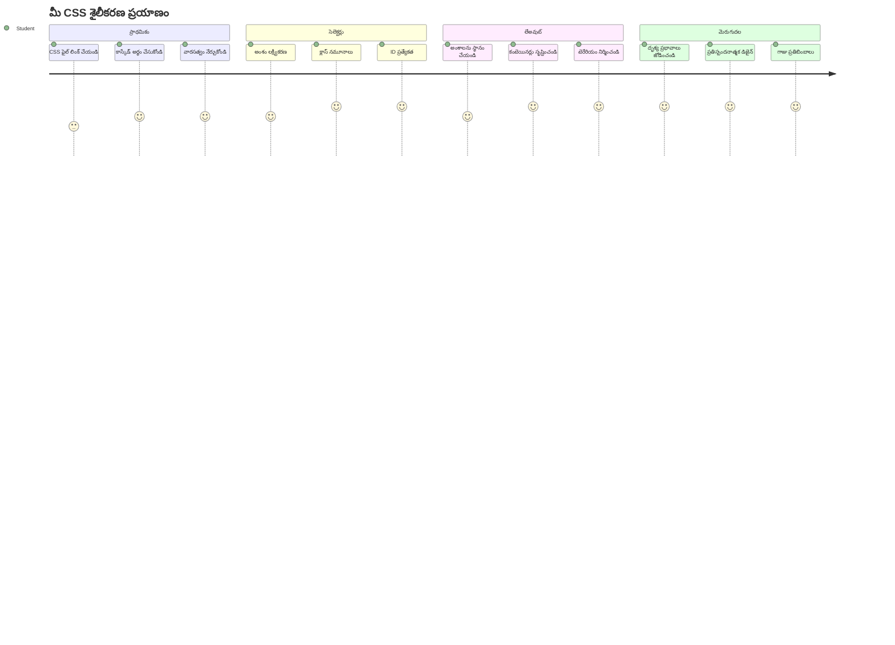
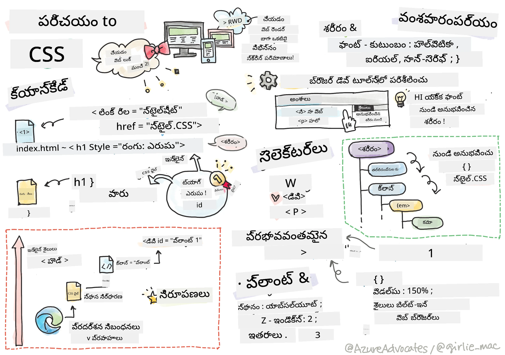
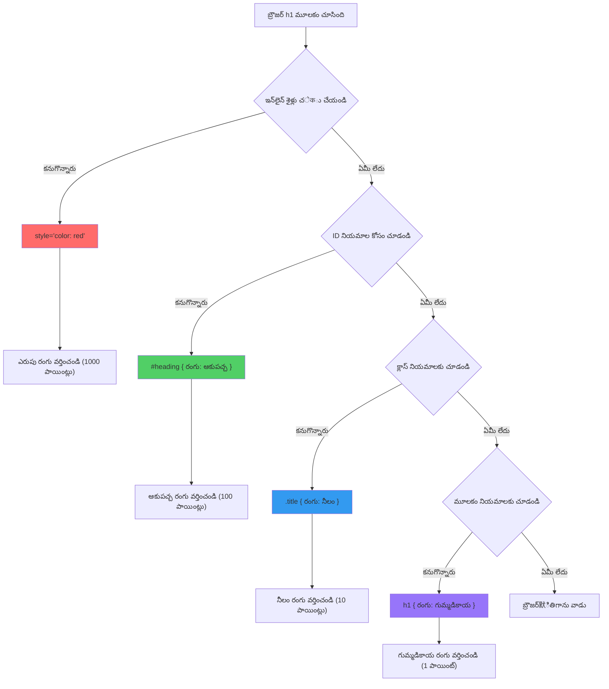
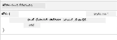
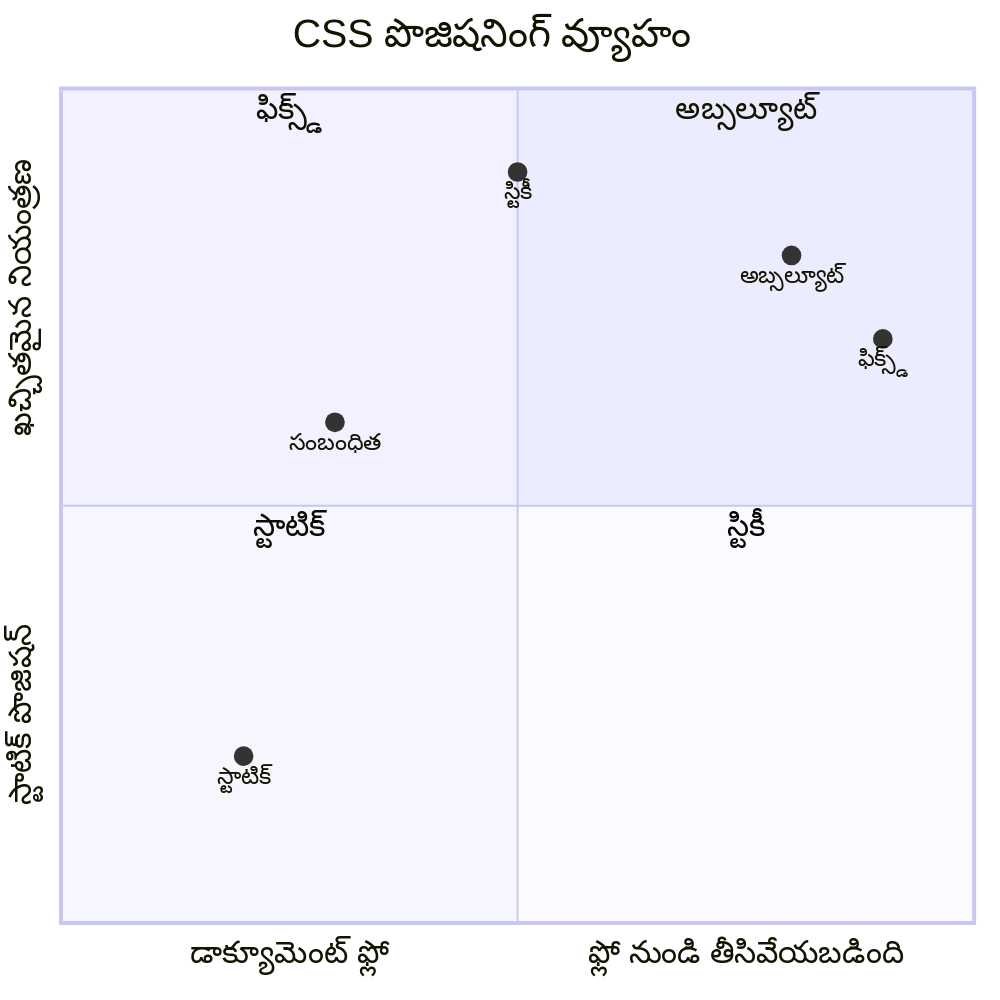
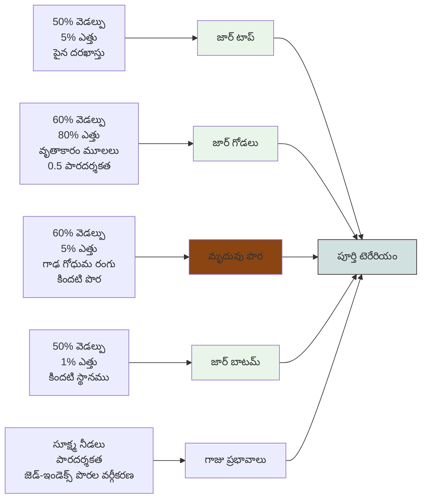
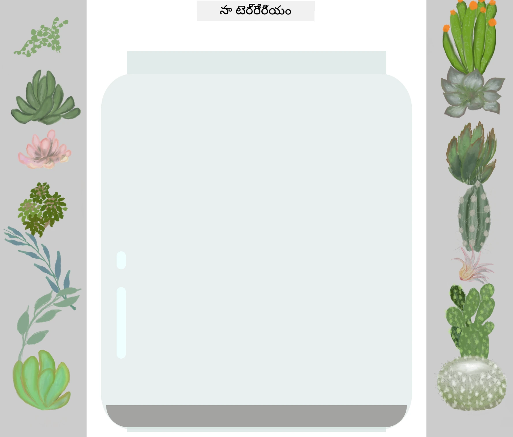
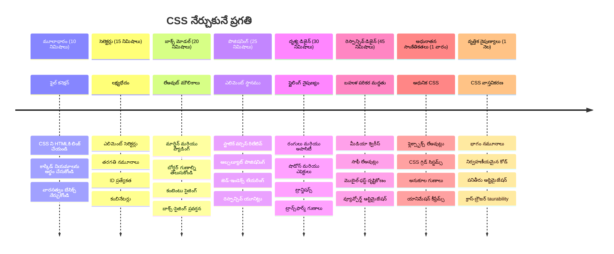

<!--
CO_OP_TRANSLATOR_METADATA:
{
  "original_hash": "e39f3a4e3bcccf94639e3af1248f8a4d",
  "translation_date": "2026-01-08T19:12:27+00:00",
  "source_file": "3-terrarium/2-intro-to-css/README.md",
  "language_code": "te"
}
-->
# Terrarium Project భాగం 2: CSS పరిచయం



> స్కెచ్నోట్ చేసిన [Tomomi Imura](https://twitter.com/girlie_mac)

మీ HTML టెర్రేరియం ఎంత సాధారణంగా కనిపించిందో గుర్తుందా? CSS ఆ సరళమైన నిర్మాణాన్ని దృశ్యంగా ఆకర్షణీయంగా మార్చే స్థానం.

HTML ఒక ఇంటి బేస్ నిర్మాణం లాగా ఉంటే, CSS అన్ని రంగులు, ఫర్నిచర్ క్రమం, లైటింగ్, గదులు ఎలా పరస్పరం కలుసుకుంటాయో అన్నింటిని నియంత్రిస్తుంది. వర్సైల్ ప్యాలెస్ ఎలా ఒక సాధారణ హంటింగ్ లాడ్జ్ నుండి ప్రపంచంలో అత్యద్భుతమైన భవనాల్లో ఒకటిగాను మారిందో ఆలోచించండి.

ఈ రోజు, మీ టెర్రేరియాన్ని సాధారణం నుండి మెరుగ్గా మార్చుదాం. మీరు ఎలిమెంట్స్ ని ఖచ్చితంగా ఎలా అమర్చాలో, వివిధ స్క్రీన్ సైజులకు అనుగుణంగా లేఅవుట్లు ఎలా రెస్పాన్స్ వుంటాయో, మరియు వెబ్‌సైట్‌లను ఆకర్షణీయంగా చేసే దృశ్య ఆకర్షణను ఎలా సృష్టించాలో నేర్చుకుంటారు.

ఈ పాఠ్యం చివరికి, కసరత్తుపరమైన CSS స్టైలింగ్ ఎలా మీ ప్రాజెక్ట్‌ను గణనీయంగా మెరుగు పరిచే తెలుసుకుంటారు. మీ టెర్రేరియానికి శైలి జోడిద్దాం.

```mermaid
mindmap
  root((CSS ప్రాథమికాలు))
    Cascade
      Specificity Rules [ప్రత్యేక చట్టాలు]
      Inheritance [విరాసత్తు]
      Priority Order [ప్రాధాన్యత క్రమం]
      Conflict Resolution [విరోధ పరిష్కారం]
    Selectors
      Element Tags [ఘటకం ట్యాగ్‌లు]
      Classes (.class) [.వర్గాలు (.class)]
      IDs (#id) [ID‌లు (#id)]
      Combinators [సంయోజకులు]
    Box Model
      Margin [మార్జిన్]
      Border [అంచు]
      Padding [ఉపశీర్షిక]
      Content [దరఖాస్తు]
    Layout
      Positioning [స్థానం కల్పన]
      Display Types [ప్రదర్శన రకాలు]
      Flexbox [ఫ్లెక్సిబాక్స్]
      Grid [గ్రిడ్]
    Visual Effects
      Colors [రంగులు]
      Shadows [నాయుకు]
      Transitions [స్థానాంతరాలు]
      Animations [చలనాలు]
    Responsive Design
      Media Queries [మీడియా ప్రశ్నించడం]
      Flexible Units [లబ్ధ్యత యూనిట్‌లు]
      Viewport Meta [వ్యూయర్పోర్ట్ మెటా]
      Mobile First [మొబైల్ మొదట]
```
## పాఠ్యం ముందు క్విజ్

[పాఠ్యం ముందు క్విజ్](https://ff-quizzes.netlify.app/web/quiz/17)

## CSS ప్రారంభం

CSS ను కేవలం "అందంగా చేయడం" మాత్రమే అనుకొని ఉంటారు, కాని ఇది చాలా విస్తృత ప్రయోజనం కలిగి ఉంటుంది. CSS ఒక సినిమా డైరెక్టర్ లాంటిదేగాదు - మీరు కేవలం దృశ్యాన్ని మాత్రమే కాకుండా, చలనం, పరస్పరం చర్యలకు స్పందించడం, వివిధ పరిస్థితులలో ఎలా మారాలి అనేది నియంత్రిస్తారు.

ఆధునిక CSS అసాధారణంగా సామర్థ్యవంతంగా ఉంటుంది. మీరు ఫోన్లు, టాబ్లెట్లు, డెస్క్‌టాప్ కంప్యూటర్ల కోసం ఆటోమేటిక్ లేఅవుట్ అనుకూలతలు కలిగిన కోడ్ వ్రాయవచ్చు. ఉజ్వలమైన యానిమేషన్లు సృష్టించి, వినియోగదారుల దృష్టిని కావలసిన చోటికి మళ్లించవచ్చు. ఈ మార్పులు ఒకే సమయంలో పనిచేస్తే ఫలితాలు అద్భుతంగా ఉంటాయి.

> 💡 **ప్రో టిప్**: CSS నిరంతరం కొత్త ఫీచర్లు మరియు సామర్థ్యాలతో అభివృద్ధి చెందుతుంది. ప్రొడక్షన్ ప్రాజెక్ట్స్ లో కొత్త CSS ఫీచర్స్ ఉపయోగించడానికి ముందే [CanIUse.com](https://caniuse.com)లో బ్రౌసర్ సహకారాన్ని చూసుకోవడం మంచిది.

**ఈ పాఠ్యంలో మనం సాధించబోయేది:**
- **మీ టెర్రేరియానికి ఆధునిక CSS సాంకేతికతలతో పూర్తి దృశ్య డిజైన్ సృష్టిస్తుంది**
- **మూల సూత్రాలు గుర్తించడం - కస్కేడ్, వారసత్వం, మరియు CSS సెలెక్టర్లను అన్వేషిస్తుంది**
- **ప్రతిస్పందించే స్థానమన్ను మరియు లేఅవుట్ వ్యూహాలను అమలు చేస్తుంది**
- **CSS ఆకారాలు మరియు శైలులతో టెర్రేరియం కన్టైనర్‌ను నిర్మిస్తుంది**

### ముందస్తు అవసరం

గత పాఠ్యం నుండీ మీ టెర్రేరియం HTML నిర్మాణాన్ని పూర్తి చేసి ఉంటుంది మరియు స్టైల్ చేయడానికి సిద్ధంగా ఉండాలి.

> 📺 **వీడియో వనరు**: ఈ సహాయక వీడియో వాక్‌త్రూ చూడండి
>
> [](https://www.youtube.com/watch?v=6yIdOIV9p1I)

### మీ CSS ఫైల్ సెట్టప్ చేయడం

స్టైలింగ్ ప్రారంభించే ముందు, CSS ని HTML తో కनेक్ట్ చేస్తాం. ఈ క్రమం బ్రౌజర్‌కి మీ టెర్రేరియం కోసం స్టైలింగ్ సూచనలను ఎక్కడ చోటు చేసుకోవాలో చెబుతుంది.

మీ టెర్రేరియం ఫోల్డర్ లో `style.css` అనే కొత్త ఫైల్ సృష్టించి, దానిని మీ HTML డాక్యూమెంట్ `<head>` సెక్షన్ లో లింక్ చేయండి:

```html
<link rel="stylesheet" href="./style.css" />
```

**ఈ కోడ్ ఏమి చేస్తుంది:**
- **మీ HTML మరియు CSS ఫైళ్ల మధ్య కనెక్షన్ సృష్టిస్తుంది**
- **బ్రౌజర్‌కు `style.css` లోని స్టైల్‌ను లోడ్ చేసి వర్తింప చేయమని చెప్పుతుంది**
- **ఈ ఫైల్ CSS ఫైల్ అయిందని సూచించడానికి `rel="stylesheet"` అనే ఎట్రిబ్యూట్ వాడుతుంది**
- **ఫైల్ పాత్ సూచించడానికి `href="./style.css"` వాడుతుంది**

## CSS కస్కేడ్ అర్థం చేసుకోవడం

ఎప్పుడైనా CSS కి "Cascading" कहते ఎందుకు అనుకుంటున్నారా? స్టైల్స్ జలపాతంలా కిందకి వచ్చేలా ఉంటాయి, కొన్నిసార్లు అవి పరస్పరం పరోక్షమై పోతాయి.

సైనిక కమాండ్ వ్యవస్థాలలా ఆలోచించండి - జనరల్ ఆదేశం "అన్ని సైనికులు ఆకుపచ్చ దుస్తులు ధరించాలి" అని ఉండొచ్చు, కాని మీ యూనిట్ కోసం ప్రత్యేక ఆదేశం "పండుగ కోసం బ్లూ డ్రెస్ ధరించాలి" అని ఉండవచ్చు. ప్రత్యేక ఆదేశం గెలుస్తుంది. CSS కూడా తేడాగా ఇదే విధానం అనుసరిస్తుంది, మరియు ఈ అర్చనను అర్థం చేసుకోవడం డీబగ్గింగ్ ను సులభం చేస్తుంది.

### కస్కేడ్ ప్రాధాన్యతతో ప్రయోగం

కస్కేడ్ ఎలా పని చేస్తుందో చూసేందుకు, స్టైల్ ఘర్షణను సృష్టిద్దాం. ముందుగా మీ `<h1>` ట్యాగ్ లో ఇన్‌లైన్ స్టైల్ జోడించండి:

```html
<h1 style="color: red">My Terrarium</h1>
```

**ఈ కోడ్ ఏమి చేస్తుంది:**
- **ఇన్‌లైన్ స్టైలింగ్ ఉపయోగించి `<h1>` ఎలిమెంట్ కు నేరుగా ఎరుపు రంగును వర్తింపజేస్తుంది**
- **CSS ను HTMLలో నేరుగా బిగిలుపు చేయడానికి `style` ఎట్రిబ్యూట్ వాడుతుంది**
- **ఈ ప్రత్యేక ఎలిమెంట్ కొరకు అత్యధిక ప్రాధాన్యత కలిగిన స్టైల్ నియమాన్ని సృష్టిస్తుంది**

తదుపరి, ఈ నియమాన్ని `style.css` ఫైల్ లో జోడించండి:

```css
h1 {
  color: blue;
}
```

**పై ఉదాహరణలో మనం:**
- **అన్ని `<h1>` ఎలిమెంట్లకు టార్గెట్ చేసే CSS నియమాన్ని నిర్వచించాము**
- **బ్లూ రంగును టెక్స్ట్ కు అనుసంధానిక స్టైల్‌షీట్ ఉపయోగించి సెట్ చేసాము**
- **ఇన్‌లైన్ స్టైల్ కంటే తక్కువ ప్రాధాన్యత కలిగి ఉన్న నియమాన్ని సృష్టించాము**

✅ **జ్ఞాన పరీక్ష**: మీ వెబ్ యాప్ లో ఏ రంగు ప్రదర్శింపబడుతుంది? ఆ రంగు ఎందుకు గెలుస్తుంది? మీరు ఎప్పుడైనా స్టైల్‌ లను ఓవర్‌రైడ్ చేయాల్సిన సందర్భాలను ఊహించగలరా?


> 💡 **CSS ప్రాధాన్యత క్రమం (అత్యధికం నుండి తక్కువ వరకు):**
> 1. **ఇన్‌లైన్ స్టైల్స్** (`style` ఎట్రిబ్యూట్)
> 2. **IDs** (#myId)
> 3. **క్లాసెస్** (.myClass) మరియు ఎట్రిబ్యూట్స్
> 4. **ఎలిమెంట్ సెలెక్టర్లు** (h1, div, p)
> 5. **బ్రౌజర్ డిఫాల్ట్స్**

## CSS వారసత్వం (Inheritance) అమలు

CSS వారసత్వం జన్యువుల్లాగా పనిచేస్తుంది - ఎలిమెంట్లు వారి తల్లిదండ్రుల ఎలిమెంట్ల నుండి కొన్ని లక్షణాలను వారసత్వం స్వరూపం తీసుకుంటాయి. మీరు బాడీ ఎలిమెంట్ పై ఫాంట్ ఫ్యామిలీ సెట్ చేస్తే, అంతర్గత అన్ని టెక్స్ట్‌లు ఆ ఫాంట్‌ను ఆటోమేటిక్ గా వాడతాయి. ఇది హాబ్‌స్బర్గ్ కుటుంబం యొక్క ప్రత్యేక జాగ్‌లైన్ తరాల తరాలుగా కనిపించే విధానంలాగా ఉంటుంది.

కానీ, అన్నీ వారసత్వం కావు. ఫాంట్లు, రంగులు వంటి టెక్స్ట్ స్టైల్స్ వారసత్వం కలిగినవి, కానీ మార్జిన్లు, బార్డర్లు వంటి లేఅవుట్ లక్షణాలు లేకుంటాయి. పిల్లలు తల్లిదండ్రుల శారీరక లక్షణాలు కాకపోయినా వారి ఫ్యాషన్ ఎంపికలు వారసత్వంగా తీసుకోరు లాంటిదే.

### ఫాంట్ వారసత్వాన్ని పరిశీలించడం

`<body>` ఎలిమెంట్ పై ఫాంట్ ఫ్యామిలీ సెట్ చేసి వారసత్వాన్ని చూడండి:

```css
body {
  font-family: 'Segoe UI', Tahoma, Geneva, Verdana, sans-serif;
}
```

**ఇక్కడ ఏమి జరుగుతుంది:**
- **పూర్తి పేజీ కోసం `<body>` ఎలిమెంట్‌ని టార్గెట్ చేసి ఫాంట్ ఫ్యామిలీ సెట్ చేస్తుంది**
- **బ్రౌజర్ అనుకూలత కోసం ఫాంట్ స్టాక్ లో fallback ఆప్షన్లు ఉంటాయి**
- **విభిన్న ఆపరేటింగ్ సిస్టమ్స్ లో బాగుంటున్న ఆధునిక సిస్టమ్ ఫాంట్లు వాడుతుంది**
- **ప్రత్యేకంగా ఓవర్‌రైడ్ చేయకపోతే అన్ని చైల్డ్ ఎలిమెంట్లు ఈ ఫాంట్ వాడతాయి**

మీ బ్రౌజర్ డెవలపర్ టూల్స్ (F12) తెరవండి, Elements ట్యాబ్ కు వెళ్లి `<h1>` ఎలిమెంట్ ని ఇన్స్పెక్ట్ చేయండి. అది బాడీ నుండి ఫాంట్ ఫ్యామిలీని వారసత్వంగా పొందుతుందని చూడొచ్చు:



✅ **ప్రయోగ సమయం**: మీ `<body>` లో మరో వారసత్వ లక్షణాలను సెట్ చేయండి, ఉదాహరణకు `color`, `line-height`, లేదా `text-align`. మీ హెడ్డింగ్ మరియు ఇతర ఎలిమెంట్లకు ఏమి జరుగుతుందో గమనించండి.

> 📝 **వారసత్వ లక్షణాలు: `color`, `font-family`, `font-size`, `line-height`, `text-align`, `visibility`**
>
> **వారసత్వం కాని లక్షణాలు: `margin`, `padding`, `border`, `width`, `height`, `position`**

### 🔄 **పాఠ్య నిర్వహణ తనిఖీ**
**CSS ఫౌండేషన్ అర్థం పొందడం**: సెలెక్టర్లకు వెళ్లక ముందు మీరు:
- ✅ కస్కేడ్ మరియు వారసత్వం మధ్య తేడాను వివరించగలరు
- ✅ స్పెసిఫిసిటీ ఘర్షణలో ఏ స్టైల్ గెలుస్తుందో ఊహించగలరు
- ✅ Eltern నుండి ఏ లక్షణాలు వారసత్వం అవుతాయో గుర్తించగలరు
- ✅ CSS ఫైల్స్ ను HTML కు సరిగా కనెక్ట్ చేయగలరు

**త్వరిత పరీక్ష**: ఈ స్టైల్‌లు ఉంటే, `<div class="special">` లో ఉన్న `<h1>` రంగు ఏమిటి?
```css
div { color: blue; }
.special { color: green; }
h1 { color: red; }
```
*జవాబు: ఎరుపు (ఎలిమెంట్ సెలెక్టర్ నేరుగా h1ని టార్గెట్ చేస్తుంది)*

## CSS సెలెక్టర్ల మాస్టరీ

CSS సెలెక్టర్లు మీరు స్టైల్ చేయడానికి ప్రత్యేక ఎలిమెంట్లను టార్గెట్ చేసే మార్గం. అవి ఖచ్చిత స్థలాలు సూచించే విధంగా ఉంటాయి - "ఇంటి" అనటం కంటే మీరు "మేపుల్ వీధిలో ఎరుపు తలుపు ఉన్న నీలం ఇల్లు" అంటారు.

CSS వివిధ విధాలుగా స్పష్టత ఇస్తుంది, సరైన సెలెక్టర్ ఎంచుకోవడం పనికి సరిపోయే సాధనాన్ని ఎంచుకోవడం లాంటిది. మీరు పక్కనున్న ప్రతి తలుపును స్టైల్ చేయాలంటే లేదా ఒక్క తలుపు మాత్రమే స్టైల్ చేయాలంటే తరచూ ప్రత్యేకట్టиспేసుకోవాలి.

### ఎలిమెంట్ సెలెక్టర్లు (ట్యాగ్లు)

ఎలిమెంట్ సెలెక్టర్లు HTML ఎలిమెంట్లను తూటా పేరుతో టార్గెట్ చేస్తాయి. ఇవి మీ పేజీ మొత్తంలో ప్రాథమిక స్టైల్స్ అందుబాటులో ఉంచడానికి ఉపయోగపడతాయి:

```css
body {
  font-family: 'Segoe UI', Tahoma, Geneva, Verdana, sans-serif;
  margin: 0;
  padding: 0;
}

h1 {
  color: #3a241d;
  text-align: center;
  font-size: 2.5rem;
  margin-bottom: 1rem;
}
```

**ఈ స్టైల్‌లు ఎలా పని చేస్తాయో అర్థం చేసుకోవడం:**
- **`body` సెలెక్టర్ తో పూర్తి పేజీకి స్థిరమైన టైపోగ్రఫీ సెట్ చేస్తుంది**
- **డిఫాల్ట్ బ్రౌజర్ మార్జిన్లు మరియు ప్యాడింగ్ తొలగిస్తూ నియంత్రణ మెరుగుపడుతుంది**
- **అన్ని హెడ్డింగ్ ఎలిమెంట్లకు రంగు, సమీకరణ, అంతరాలు ఇస్తుంది**
- **`rem` యూనిట్ లను వాడి స్కేలబుల్, యాక్సెసిబుల్ ఫాంట్ సైజింగ్ చేస్తుంది**

అయితే, ఎలిమెంట్ సెలెక్టర్‌లు సాధారణ స్టైలింగ్‌కు మెరుగైనవి కాని మీ టెర్రేరియంలో ఉన్న మొక్కల వంటి ప్రత్యేక భాగాలను మరింత స్పష్టమైన సెలెక్టర్లతో స్టైల్ చేయాలి.

### ప్రత్యేక ఎలిమెంట్ల కొరకు ID సెలెక్టర్లు

ID సెలెక్టర్లు `#` చిహ్నంతో ఉంటాయి మరియు ప్రత్యేక `id` ఉన్న ఎలిమెంట్లను టార్గెట్ చేస్తాయి. ఒక పేజీలో IDs ప్రత్యేకమైనవని, కాబట్టి మన టెర్రేరియంలో ఎడమ మరియు కుడి మొక్కల కంటైనర్ల వంటి ప్రత్యేక ఎలిమెంట్లను స్టైల్ చేయడానికి ఇవి అనుకూలం.

మొక్కలు ఉన్న సైడ్ కంటైనర్ల స్టైల్ ను రూపొందిద్దాం:

```css
#left-container {
  background-color: #f5f5f5;
  width: 15%;
  left: 0;
  top: 0;
  position: absolute;
  height: 100vh;
  padding: 1rem;
  box-sizing: border-box;
}

#right-container {
  background-color: #f5f5f5;
  width: 15%;
  right: 0;
  top: 0;
  position: absolute;
  height: 100vh;
  padding: 1rem;
  box-sizing: border-box;
}
```

**ఈ కోడ్ చేయేమి:**
- **కంటైనర్లు స్క్రీన్ వైపులా అతి ఎడమ మరియు కుడివైపు పెట్టడానికి `absolute` స్థానమన్ను వాడుతుంది**
- **స్క్రీన్ సైజుకు అనుగుణంగా ఉండే ఎత్తు కొరకు `vh` యూనిట్లను ఉపయోగిస్తుంది**
- **ప్యాడింగ్ మొత్తం వెడల్పులో చేరిస్తుంది కోసం `box-sizing: border-box` ని ప్రయోగిస్తుంది**
- **సున్నా విలువల వద్ద `px` యూనిట్లు తొలగించి శుభ్రంగా కోడ్ చేస్తుంది**
- **తీవ్ర గ్రే కంటే కాస్త స్వేదనీయమైన బ్యాక్‌గ్రౌండ్ రంగు సెట్ చేస్తుంది**

✅ **కోడ్ నాణ్యత సవాలు**: ఈ CSS DRY (Don't Repeat Yourself) సూత్రాన్ని ఉల్లంఘిస్తోంది. మీరు ID మరియు క్లాస్ రెండింటిని ఉపయోగించి దీనిని ఎలా రీఫాక్టర్ చేయగలరు?

**ఇంకాచేయవలసింది:**
```html
<div id="left-container" class="container"></div>
<div id="right-container" class="container"></div>
```

```css
.container {
  background-color: #f5f5f5;
  width: 15%;
  top: 0;
  position: absolute;
  height: 100vh;
  padding: 1rem;
  box-sizing: border-box;
}

#left-container {
  left: 0;
}

#right-container {
  right: 0;
}
```

### పునర్వినియోగ స్టైల్స్ కోసం క్లాస్ సెలెక్టర్లు

క్లాస్ సెలెక్టర్లు `.` చిహ్నంతో ఉంటాయి మరియు మీకు అదే స్టైల్స్ మల్టిపుల్ ఎలిమెంట్లకు వర్తింపజేయాలనిపిస్తే ఇవి అనుకూలంగా ఉంటాయి. ID లకు భిన్నంగా, క్లాసులు HTML అంతటా పునర్వినియోగం చేయవచ్చు, కాబట్టి పాఠాంతరాల్లో కాంసిస్టెంట్ స్టైలింగ్ కోసం ఇవి చాలా ఉపయోగకరంగా ఉంటాయి.

మన టెర్రేరియంలో ప్రతీ మొక్కకు ఒకటే విధమైన స్టైల్ ఉండాలి మరి సూక్ష్మస్థాయిలో స్థానమన్ను కూడా ఉండాలి. అందుకే పంచుకోబడిన స్టైల్ కోసం క్లాసులు, ప్రత్యేక స్థానానికి IDs రెండూ వాడతాము.

**ప్రతీ మొక్కకు HTML నిర్మాణం:**
```html
<div class="plant-holder">
  
</div>
```

**ప్రధాన అంశాలు:**
- **అన్ని మొక్కల కోసం సుసंगత కంటైనర్ స్టైలింగ్ కోసం `class="plant-holder"` ఇస్తుంది**
- **ఆకారం మరియు ప్రవర్తనల కోసం `class="plant"` ఉపయోగిస్తుంది**
- **ప్రత్యేక స్థానమున్నది మరియు జావాస్క్రిప్ట్ ఇంటరాక్షన్ కొరకు ప్రత్యేక `id="plant1"` ఉంచుతుంది**
- **స్క్రీన్ రీడర్ కోసం వివరణాత్మక ఆల్ట్ టెక్స్ట్ అందిస్తుంది**

ఇప్పుడు అందరి `style.css` ఫైల్ కు ఈ స్టైల్స్ జోడించండి:

```css
.plant-holder {
  position: relative;
  height: 13%;
  left: -0.6rem;
}

.plant {
  position: absolute;
  max-width: 150%;
  max-height: 150%;
  z-index: 2;
  transition: transform 0.3s ease;
}

.plant:hover {
  transform: scale(1.05);
}
```

**ఈ స్టైల్స్ లో ఏమి జరుగుతుంది:**
- **ప్లాంట్ హోల్డర్ కు రిలేటివ్ స్థానమన్ను ఇస్తుంది, ఇది ఒక స్థితి నియంత్రణ పరిమితం సృష్టిస్తుంది**
- **ప్రతి ప్లాంట్ హోల్డర్ కు 13% ఎత్తు ఇస్తుంది, ప్లాంట్లు చూపించు విదంగా స్క్రోల్ అవసరం లేకుండా కుదుతుంది**
- **హోల్డర్స్ సన్నగా ఎడమకు తక్కువ, మొక్కలు కంటైనర్లు మధ్యలో సెంటర్ కావడానికి మారుస్తుంది**
- **మాక్స్ విత్ మరియు హైట్ ప్రాపర్టీస్ తో మొక్కలను రెస్పాన్సివ్ స్కేలు చేయగలుగుతుంది**
- **`z-index` ఉపయోగించి మొక్కలను ఇతర సంపూర్ణ ఎలిమెంట్ల కంటే మీదికి తెస్తుంది**
- **CSS ట్రాన్సిషన్లతో సన్నని హోవర్ ఎఫెక్ట్ ఇవ్వడం కస్టమర్ ఇంటరాక్షన్ మెరుగుపరుస్తుంది**

✅ **ముఖ్య ఆలోచన**: `.plant-holder` మరియు `.plant` రెండింటికి ఎందుకు అవసరం? ఒకదానితో మాత్రమే ప్రయత్నిస్తే ఏమవుతుంది?

> 💡 **డిజైన్ నమూనా**: కంటైనర్ (`.plant-holder`) లేఅవుట్ మరియు స్థానమన్ను నియంత్రిస్తుంది, కంటెంట్ (`.plant`) కనిపించు విధానం మరియు స్కెలింగ్ ను నియంత్రిస్తుంది. ఈ వర్గీకరణ కోడ్‌ను నిర్వహించడంలో మరియు మెరుగుపరచడంలో ఉపయోగకరంగా ఉంటుంది.

## CSS స్థానమన్ను అర్థం చేసుకోవడం

CSS స్థానమన్ను ఒక నాటకాన్ని అడ్రస్ చేసే డైరెక్టర్ లాంటిది - మీరు ఆ నటుడు ఎక్కడ ఎప్పుడు ఉన్నాడో, ఎలా కదిలాడో ఆదేశిస్తారు. కొంత నటులు సాధారణ స్వభావంగా ఉంటారు, మరికొందరు ప్రత్యేక స్థానంలో ఉండాలి.

స్థానమన్ను అర్థం చేసుకున్న తర్వాత అనేక లేఅవుట్ సవాళ్లు పరిష్కారమవుతాయి. స్క్రోల్ చేసే సమయంలో కూడా కనబడే నావిగేషన్ బార్ కావాలి? స్థానమన్ను హ్యాండిల్ చేస్తుంది. ఒక నిర్దిష్ట స్థలంలో కనిపించే టూల్‌టిప్ కావాలి? అదే స్థానమన్ను.

### ఐదు స్థానమన్ను విలువలు


| స్థానమన్ను విలువ | ప్రవర్తన | ఉపయోగం |
|----------------|----------|----------|
| `static` | డిఫాల్ట్ ప్రవాహం, top/left/right/bottom ను పరిగణించదు | సాధారణ డాక్యూమెంట్ లేఅవుట్ |
| `relative` | సాధారణ స్థానానికి సంబంధించి స్థానమన్ను | చిన్న సవరణలు, స్థాన స్థితి ప్రదేశం సృష్టించడం |
| `absolute` | సమీప స్థానమన్ను ఉన్న తండ్రీకు సంబంధించిన స్థానమన్ను | ఖచ్చితమైన స్థానం, ఓవర్‌లే |
| `fixed` | వ్యూయ్‌పోర్ట్‌కు సంబంధించి స్థానమన్ను | నావిగేషన్ బార్లు, ఫ్లోటింగ్ ఎలిమెంట్లు |
| `sticky` | స్క్రోల్ ఆధారంగా relative మరియు fixed మధ్య స్విచ్ అవుతుంది | స్క్రోల్ సమయంలో అంటుకునే హెడ్డర్లు |

### మన టెర్రేరియంలో స్థానమన్ను

మన టెర్రేరియం కింది స్థానమన్నులు సహా వ్యూహాన్ని ఉపయోగిస్తుంది:

```css
/* Container positioning */
.container {
  position: absolute; /* Removes from normal flow */
  /* ... other styles ... */
}

/* Plant holder positioning */
.plant-holder {
  position: relative; /* Creates positioning context */
  /* ... other styles ... */
}

/* Plant positioning */
.plant {
  position: absolute; /* Allows precise placement within holder */
  /* ... other styles ... */
}
```

**స్థానమన్ను వ్యూహం అర్థం చేసుకోవడం:**
- **Absolute కంటైనర్లు సాధారణ డాక్యూమెంట్ ప్రవాహం నుండి తొలగించి స్క్రీన్ త్రుటిలో అమర్చబడి ఉంటాయి**
- **Relative ప్లాంట్ హోల్డర్లు ఒక స్థాన నియంత్రణ పరిసరాన్ని సృష్టిస్తూ డాక్యూమెంట్ ప్రవాహంలో ఉంటాయి**
- **Absolute మొక్కలు వారి రిలేటివ్ కంటైనర్లలో ఖచ్చితంగా అమర్చబడి ఉంటాయి**
- **ఈ కలయిక ప్లాంట్లను నిలువుగా సవరించాలని మరియు వ్యక్తిగతంగా స్థానమన్ను ఇవ్వటానికి అనుమతిస్తుంది**

> 🎯 **ఇది ఎందుకు ముఖ్యమైనది**: తదుపరి పాఠ్యంలో `plant` ఎలిమెంట్లు డ్రాగ్ చేయదగినవి కావాలనుకుంటున్నాం. Absolute స్థానమన్ను ఉపయోగించటం వాటిని సాధారణ లేఅవుట్ ప్రవాహం నుండి బయటపెట్టుతుంది, దీని వలన డ్రాగ్-అండ్-డ్రాప్ చర్యలు సాధ్యమవుతాయి.

✅ **ప్రయోగ సమయం**: స్థానమన్ను విలువలను మార్చి ఫలితాలు గమనించండి:
- `.container` ను `absolute` నుండి `relative` కి మార్చితే ఏమవుతుంది?
- `.plant-holder` `relative` కాకుండా `absolute` ఉపయోగిస్తే లేఅవుట్ ఎలా మారుతుంది?
- `.plant`ను `relative` పొజిషనింగ్‌కు మార్చినప్పుడు ఏమౌతుంది?

### 🔄 **అధ్యాపనాత్మక తనిఖీ**
**CSS పొజిషనింగ్ ప్రావీణ్యం**: మీ అర్థం చేసుకున్నదాని తనిఖీ చేయండి:
- ✅ పుట్టలు డ్రాగ్-అండ్-డ్రాప్ కోసం ఎందుకు absolute పొజిషనింగ్ అవసరమౌతుంది అని చెప్పగలరా?
- ✅ relative కంటెయినర్ల ద్వారా పొజిషనింగ్ సందర్భం ఎలా సృష్టించబడుతుంది తెలుసా?
- ✅ సైడ్ కంటెయినర్లు ఎందుకు absolute పొజిషనింగ్ ఉపయోగిస్తాయి?
- ✅ మీరు పొజిషన్ డిక్లరేషన్లు పూర్తిగా తీసివేస్తే ఏమౌతుంది?

**ప్రకృతి సంబంధం**: CSS పొజిషనింగ్ ఎలా వాస్తవ ప్రపంచ లేఅవుట్ను ప్రతిబింబిస్తుంది అనుకోండి:
- **Static**: తలంపుపై పుస్తకాలు (సహజ క్రమం)
- **Relative**: పుస్తకాన్ని తక్కువగా కదిలించడం కానీ దాని స్థానాన్ని ఉంచడం
- **Absolute**: ఖచ్చితమైన పేజీ నంబరుపై బుక్మార్క్ పెట్టడం
- **Fixed**: మీరు పేజీలు తిప్పుతున్నప్పుడు కనిపించే స్టికి నోట్

## CSSతో టెర్రారియాన్ని నిర్మించడం

ఇప్పుడు మీరొక్క గాజు జార్‌ను సింపుల్ CSS ఉపయోగించి నిర్మిస్తాము - ఇమేజులు లేదా గ్రాఫిక్స్ సాఫ్ట్వేర్ అవసరం లేదు.

పొజిషనింగ్ మరియు పారదర్శకం ఉపయోగించి వాస్తవికమైన గాజు, నీడలు మరియు లోతు ప్రభావాలు సృష్టించడం CSS యొక్క దర్శన సామర్థ్యాలను ప్రదర్శిస్తుంది. బౌహౌస్ ఉద్యమంలోని నిపుణులు ఎలా సులభమైన జ్యామితీయ ఆకారాలతో క్లిష్టమైన, అందమైన నిర్మాణాలు సృష్టించారో ఈ టెక్నిక్ అంతాగే ఉంటుంది. మీరు ఈ సూత్రాలను అర్థం చేసుకున్నాక చాలా వెబ్ డిజైన్ల వెనుక CSS టెక్నిక్‌లు గుర్తుపెట్టుకుంటారు.


### గాజు జార్ భాగాలను సృష్టించడం

ఒక్కో భాగం ప్రాతిపదికన టెర్రారియం జార్ నిర్మించుకుందాం. ప్రతి భాగం absolute పొజిషనింగ్ మరియు శాతానుపాత ఆధారిత సైజింగ్ ఉపయోగించి స్పందనాత్మక డిజైన్ కోసం రూపొందించబడింది:

```css
.jar-walls {
  height: 80%;
  width: 60%;
  background: #d1e1df;
  border-radius: 1rem;
  position: absolute;
  bottom: 0.5%;
  left: 20%;
  opacity: 0.5;
  z-index: 1;
  box-shadow: inset 0 0 2rem rgba(0, 0, 0, 0.1);
}

.jar-top {
  width: 50%;
  height: 5%;
  background: #d1e1df;
  position: absolute;
  bottom: 80.5%;
  left: 25%;
  opacity: 0.7;
  z-index: 1;
  border-radius: 0.5rem 0.5rem 0 0;
}

.jar-bottom {
  width: 50%;
  height: 1%;
  background: #d1e1df;
  position: absolute;
  bottom: 0;
  left: 25%;
  opacity: 0.7;
  border-radius: 0 0 0.5rem 0.5rem;
}

.dirt {
  width: 60%;
  height: 5%;
  background: #3a241d;
  position: absolute;
  border-radius: 0 0 1rem 1rem;
  bottom: 1%;
  left: 20%;
  opacity: 0.7;
  z-index: -1;
}
```

**టెర్రారియం నిర్మాణాన్ని అర్థం చేసుకోవడం:**
- **అన్ని స్క్రీన్ సైజులకు అనుగుణంగా** శాతానుపాతాల పరిమాణాలు ఉపయోగించడం
- **ఖచ్చితంగా నిలిపి, సరిపోల్చుటకు** ఎలిమెంట్లను absolute గా పొజిషన్ చేయడం
- **గాజు పారదర్శకత ప్రభావం** సృష్టించడానికి వున్న వేరే వేరే అపాసిటీ విలువలను వర్తించడం
- **ప్లాంట్లు జార్ లోపల కనిపించేందుకు** `z-index` లేయరింగ్ అమలు చేయడం
- **అధిక వాస్తవికత కొరకు** సూక్ష్మ బాక్స్-షాడో మరియు మెరుగైన బోర్డర్-రిసియస్ జోడించడం

### శాతానుపాతాలతో స్పందనాత్మక డిజైన్

అన్ని పరిమాణాలు శాతానుపాతాలుగా ఉపయోగించడం గమనించండి, స్థిరమైన పిక్సెల్ విలువలన కన్నా:

**దీన్ని ఎందుకు ఉపయోగిస్తారు:**
- **టెర్రారియం ఏ స్క్రీన్ సైజుపైన సరిపోతుంది** అని నిర్ధారిస్తుంది
- **జార్ భాగాల మధ్య దృశ్య సంబంధాలను నిలుపుతుంది**
- **మొబైల్ నుండి పెద్ద డెస్క్‌టాప్ మానిటర్ల వరకు అనుభవాన్ని సమానంగా ఇస్తుంది**
- **దృశ్య లేఅవుట్ బ్రేక్ కాకుండా డిజైన్ సర్దుబాటు అవుతుంది**

### CSS యూనిట్లు ప్రత్యక్షంగా

మేము `rem` యూనిట్లను బోర్డర్-రిసియస్ కోసం ఉపయోగిస్తున్నాము, ఇవి మూల ఫాంట్ సైజ్‌కు సంబంధించి స్కేలు అవుతాయి. ఇది వినియోగదారు ఫాంట్ ప్రిఫరెన్సులకు గౌరవం ఇచ్చే మరింత యాక్సెస్ చేయదగిన డిజైన్లను సృష్టిస్తుంది. అధికారిక స్పెసిఫికేషన్‌లో [CSS సాపేక్ష యూనిట్ల గురించి](https://www.w3.org/TR/css-values-3/#font-relative-lengths) మరింత తెలుసుకోండి.

✅ **దృష్టి ప్రయోగాలు**: ఈ విలువలను మార్చి ఫలితాలను పరిశీలించండి:
- జార్ యొక్క అపాసిటీని 0.5 నుండి 0.8 వరకు మార్చండి – గాజు ఎదురుదృశ్యానికి ఎలా ప్రభావితం అవుతుంది?
- మట్టివర్ణాన్ని `#3a241d` నుండి `#8B4513` కి మార్చండి – దాని దృష్టి ప్రభావం ఏమిటి?
- మట్టికి `z-index`ని 2 కి మార్చండి – లేయరింగ్ కు ఏమౌతుంది?

### 🔄 **అధ్యాపనాత్మక తనిఖీ**
**CSS దృష్టి డిజైన్ అర్థం చేసుకోవడం**: మీ CSS దృష్టిని నిర్ధారించుకోండి:
- ✅ శాతానుపాత ఆధారిత పరిమాణాలు ఎలా స్పందనాత్మక డిజైన్ సృష్టిస్తాయి?
- ✅ అపాసిటీ గాజు పారదర్శకత ప్రభావం సృష్టించడంలో ఏమాత్రం పాత్ర వహిస్తుంది?
- ✅ ఎలిమెంట్లను లేయర్ చేయడంలో z-index పాత్ర ఏమిటి?
- ✅ బోర్డర్-రిసియస్ విలువలతో జార్ ఆకారాన్ని ఎలా సృష్టిస్తారు?

**డిజైన్ సూత్రం**: మేము సులభ ఆకారాల నుండి క్లిష్ట దృష్టులను ఎలా నిర్మిస్తున్నామో గమనించండి:
1. **చతురస్రాలు** → **గుండ్రటివిడులు చతురస్రాలు** → **జార్ భాగాలు**
2. **సాలిడ్ రంగులు** → **అపాసిటీ** → **గాజు ప్రభావం**
3. **విభిన్న ఎలిమెంట్లు** → **లేయర్డ్ కాంపోజిషన్** → **3D దృశ్యము**

---

## GitHub Copilot ఏజెంట్ ఛాలెంజ్ 🚀

ఏజెంట్ మోడ్ ఉపయోగించి ఈ క్రింది ఛాలెంజ్ పూర్తి చేయండి:

**వర్ణన:** టెర్రారియంలోని మొక్కలు సహజ గాలి ప్రభావాన్ని అనుభూతి పరచేలా మెల్లగా ముందుకూ వెనుకకు తరలే CSS అనిమేషన్ సృష్టించండి. దీని ద్వారా CSS అనిమేషన్స్, ట్రాన్స్‌ఫార్మ్స్ మరియు కీఫ్రేమ్స్ లో ప్రాక్టీస్ చేయవచ్చు.

**ప్రాంప్ట్:** టెర్రారియంలోని మొక్కలు రెండు నుండి మూడు డిగ్రీల వరకు ఎడమ మరియు కుడి వైపుకు తేలికగా తిప్పే స్వయంచాలక కీఫ్రేమ్ అనిమేషన్స్ `.plant` క్లాసుపై అమలు చేయండి. అనిమేషన్ 3-4 సెకన్ల పాటు కొనసాగూ ఉంటూ, సహజ ఉద్యమానికి ఈజింగ్ ఫంక్షన్ కలిగి ఉండాలి.

ఇక్కడ [ఏజెంట్ మోడ్](https://code.visualstudio.com/blogs/2025/02/24/introducing-copilot-agent-mode) గురించి మరింత తెలుసుకోండి.

## 🚀 ఛాలెంజ్: గాజు ప్రతిబింబాలు జోడించడం

మీ టెర్రారియాన్ని వాస్తవిక గాజు ప్రతిబింబాలతో అభివృద్ధి చేయడానికి సిద్ధంగా ఉన్నారా? ఈ టెక్నిక్ లోతు మరియు వాస్తవికతను పెంచుతుంది.

మీరు గాజు ఉపరితలాలపై వెలుతురు ప్రతిబింబాలను కలిగించే సూక్ష్మ హైలైట్లను సృష్టిస్తారు. ఇది రెనెసెన్స్ పెయింటర్స్ జాన్ వాన్ ఎయ్క్ లాంటి వారు గాజు పెయింటింగ్లను 3D లాగా చూపించడానికి ఉపయోగించిన పరిస్థితిని అనుకరిస్తుంది. మీరు లక్ష్యం చేసుకునేది ఇలాగే ఉంది:



**మీ ఛాలెంజ్:**
- గాజు ప్రతిబింబాల కోసం సూక్ష్మ తెల్లటి లేదా ప్రకాశవంత రంగు ఒవల్ ఆకారాలను సృష్టించండి
- జార్ ఎడమ వైపున వ్యూహాత్మకంగా అవి ఉండేలా పొజిషన్ చేయండి
- వాస్తవిక ప్రతిబింబం కోసం తగిన అపాసిటీ మరియు బ్లర్ ప్రభావాలు వర్తించండి
- సేంద్రీయ, బుడగలలా ఆకారాల కోసం `border-radius` ఉపయోగించండి
- అభివృద్ధి కొరకై గ్రాడియంట్లు లేదా బాక్స్-షాడోలను ప్రయోగించండి

## పోస్ట్-లెక్చర్ క్విజ్

[Post-lecture quiz](https://ff-quizzes.netlify.app/web/quiz/18)

## మీ CSS జ్ఞానాన్ని విస్తరించండి

CSS మొదట్లో క్లిష్టంగా అనిపించవచ్చు, కానీ ఈ ముఖ్య సూత్రాలు సమర్థవంతమైన, అధునాతన టెక్నిక్స్‌కు బలమైన ఆధారం ఇస్తాయి.

**మీ తదుపరి CSS నేర్చుకునే ప్రాంతాలు:**
- **Flexbox** - ఎలిమెంట్ల సులభ ఎలైన్మెంట్ మరియు పంపిణీ
- **CSS Grid** - క్లిష్టమైన లేఅవుట్లను సృష్టించడానికి శక్తివంతమైన పరికరాలు
- **CSS Variables** - పునరావృతిని తగ్గించి నిర్వహణను మెరుగుపరుస్తాయి
- **స్పందనాత్మక డిజైన్** - విభిన్న స్క్రీన్ సైజ్లపై సైట్లను సమర్థంగా పనిచేయించటం

### ఇంటరాక్టివ్ నేర్చుకునే వనరులు

ఈ ఆలోచనలను హాండ్స్-ఆన్ ఆటల ద్వారా ప్రయత్నించండి:
- 🐸 [Flexbox Froggy](https://flexboxfroggy.com/) - ఫన్ ఛాలెంజ్‌ల ద్వారా Flexbox నేర్చుకోండి
- 🌱 [Grid Garden](https://codepip.com/games/grid-garden/) - వర్చువల్ క్యారెట్లను పెంచుతూ CSS Grid నేర్చుకోండి
- 🎯 [CSS Battle](https://cssbattle.dev/) - మీ CSS నైపుణ్యాలను కోడింగ్ ఛాలెంజ్‌లతో పరీక్షించండి

### అదనపు నేర్చుకోవడం

సంపూర్ణ CSS ప్రాథమికాల కోసం ఈ Microsoft Learn మాడ్యూల్ పూర్తి చేయండి: [Style your HTML app with CSS](https://docs.microsoft.com/learn/modules/build-simple-website/4-css-basics/?WT.mc_id=academic-77807-sagibbon)

### ⚡ **తర్వాతి 5 నిమిషాల్లో మీరు చేయగలిగేది**
- [ ] DevTools ఓపెన్ చేసి ఎలిమెంట్స్ ప్యానెల్ ఉపయోగించి ఏ వెబ్‌సైట్ CSS శైలులను పరిశీలించండి
- [ ] సింపుల్ CSS ఫైలు తయారుచేసి HTML పేజీకి లింక్ చేయండి
- [ ] కలర్స్ మార్చేందుకు వేర్వేరు పద్ధతులు: హెక్స్, RGB, మరియు పేరులైన రంగులు ప్రయత్నించండి
- [ ] బాక్స్ మోడల్ పై_PADDING_ మరియు_MARGIN_ వెల్పింపు సాధనలో ప్రాక్టీస్ చేయండి

### 🎯 **ఈ గంటలో మీరు సాధించగలిగేది**
- [ ] పోస్ట్-లెక్షన్ క్విజ్ పూర్తి చేసి CSS ప్రాథమికాలు సమీక్షించండి
- [ ] HTML పేజీకి ఫాంట్లు, రంగులు, మరియు మోసమోసాల ద్వారా స్టైల్ చేయండి
- [ ] flexbox లేదా grid ఉపయోగించి సులభ లేఅవుట్ సృష్టించండి
- [ ] స్మూత్ ఎఫెక్ట్స్ కోసం CSS ట్రాన్జిషన్స్ ప్రయోగించండి
- [ ] మీడియా క్వెరీలతో స్పందనాత్మక డిజైన్ సాధన చేయండి

### 📅 **మీ వారాంత CSS యాత్ర**
- [ ] టెర్రారియం స్టైలింగ్ అసైన్మెంట్ సృజనాత్మకతతో పూర్తి చేయండి
- [ ] CSS Grid ను మాస్టర్ చేసి ఫోటో గ్యాలరీ లేఅవుట్ సృష్టించండి
- [ ] CSS అనిమేషన్స్ నేర్చుకుని డిజైన్లకు ప్రాణం పోసండి
- [ ] Sass లేదా Less వంటి CSS ప్రీప్రాసెసర్లు అన్వేషించండి
- [ ] డిజైన్ సూత్రాలను అధ్యయనం చేసి CSS లో అమలు చేయండి
- [ ] ఆన్‌లైన్ లో కనుగొన్న ఆసక్తికరమైన డిజైన్లను విశ్లేషించి పునఃసృష్టించండి

### 🌟 **మీ నెలంతా డిజైన్ ప్రావీణ్యం**
- [ ] సంపూర్ణ స్పందనాత్మక వెబ్‌సైట్ డిజైన్ సిస్టమ్ నిర్మించండి
- [ ] Tailwind వంటి CSS-in-JS లేదా utility-first ఫ్రేమ్‌వర్క్‌లు నేర్చుకోండి
- [ ] CSS మెరుగుదలలతో ఓపెన్ సోర్స్ ప్రాజెక్టులకు సహాయం చేయండి
- [ ] CSS కస్టమ్ ప్రాపర్టీస్ మరియు కంటైన్‌మెంట్ వంటి అధునాతన సూత్రాల నిర్వీర్యత
- [ ] మాడ్యులర్ CSS తో పునర్వినియోగపరచుకోగల కంపోనెంట్ లైబ్రరీలు సృష్టించండి
- [ ] ఇతరులను CSS నేర్పడానికి గైడ్ చేయండి మరియు డిజైన్ జ్ఞానం పంచుకోండి

## 🎯 మీ CSS ప్రావీణ్యం కాలఆక్రమికం


### 🛠️ మీ CSS టూల్‌కిట్ సమరి

ఈ పాఠాన్ని పూర్తి చేసిన తర్వాత, మీరు ఇప్పుడు కలిగి ఉన్నవి:
- **కాస్కేడింగ్ అర్థం**: శైలులు ఎలా వారసత్వంగా పొందుతాయో మరియు మార్చుకుంటాయో
- **సెలెక్టర్ ప్రావీణ్యం**: ఎలిమెంట్లు, క్లాసులు, IDs తో ఖచ్చితమైన లక్ష్యం
- **పొజిషనింగ్ నైపుణ్యాలు**: వ్యూహాత్మకంగా ఎలిమెంట్లను స్థానం పెట్టుట మరియు లేయరింగ్
- **దృష్టి డిజైన్**: గాజు ప్రభావాలు, నీడలు, పారదర్శకత సృష్టించడం
- **స్పందనాత్మక సాంకేతికతలు**: శాతానుపాత ఆధారిత లేఅవుట్లు, ఏ స్క్రీన్‌కు సరిపోతాయి
- **కోడ్ వ్యవస్థీకరణ**: సాఫీగా, నిర్వహణ సులభంగా ఉండే CSS నిర్మాణం
- **ఆధునిక ఆచరణలు**: సాపేక్ష యూనిట్లను ఉపయోగించి యాక్సెసిబుల్ డిజైన్ నమూనాలు

**తదుపరి అడుగు**: మీ టెర్రారియానికి ఇప్పుడు నిర్మాణం (HTML) మరియు శైలి (CSS) రెండూ ఉన్నాయి. తుద పాఠం JavaScript తో ఇంటరాక్టివిటీ జోడిస్తుంది!

## అసైన్మెంట్

[CSS Refactoring](assignment.md)

---

<!-- CO-OP TRANSLATOR DISCLAIMER START -->
**తప్పిదరువు**:
ఈ పత్రం AI అనువాద సేవ అయిన [Co-op Translator](https://github.com/Azure/co-op-translator) ఉపయోగించి అనువదించబడింది. మేము ఖచ్చితత్వానికి ప్రయత్నిస్తున్నప్పటికీ, ఆటోమేటెడ్ అనువాదాల్లో పొరపాట్లు లేదా లోపాలు ఉండవచ్చు అని దయచేసి గమనించాలి. పూర్వస్థితి భాషలో ఉన్న అసలు పత్రం అధికారిక వనరు గా పరిగణించాలి. ముఖ్యమైన సమాచారం కోసం, ప్రొఫెషనల్ మానవ అనువాదం సూచించబడుతుంది. ఈ అనువాదం ఉపయోగంపై ఏ విధమైన అవగాహన లోపాలు లేదా తప్పు అర్థం చేసుకోవడాలపై మేము బాధ్యత కోల్పోము.
<!-- CO-OP TRANSLATOR DISCLAIMER END -->