<!--
CO_OP_TRANSLATOR_METADATA:
{
  "original_hash": "973e48ad87d67bf5bb819746c9f8e302",
  "translation_date": "2026-01-08T18:54:46+00:00",
  "source_file": "3-terrarium/3-intro-to-DOM-and-closures/README.md",
  "language_code": "te"
}
-->
# Terrarium Project భాగం 3: DOM నిర్వహణ మరియు JavaScript క్లోజర్లు

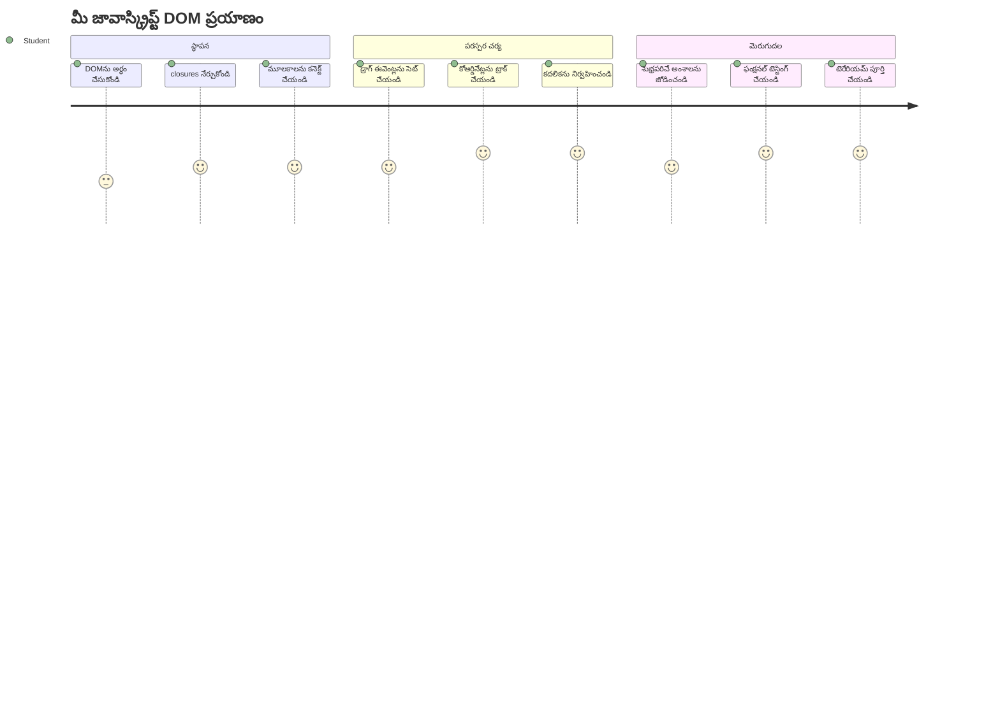
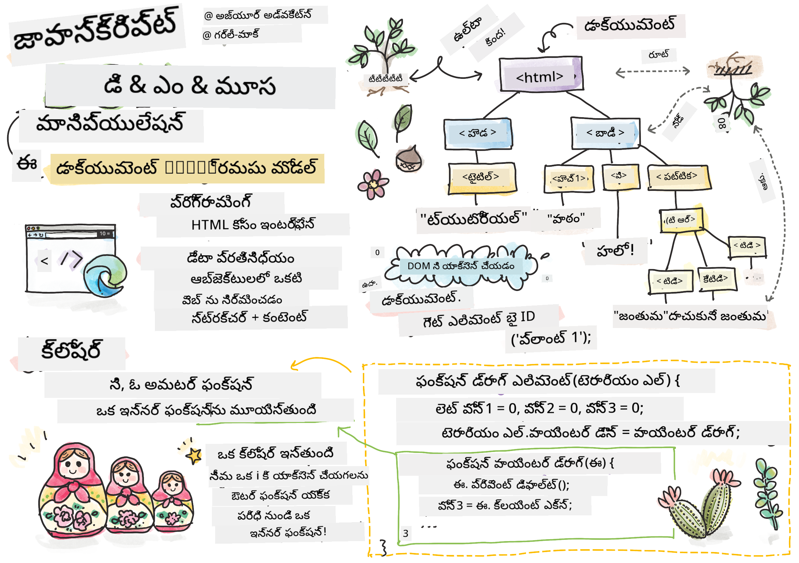
> స్కెచ్‌నోట్: [Tomomi Imura](https://twitter.com/girlie_mac)

వెబ్ డెవలప్‌మెంట్ లో అత్యంత ఆసక్తికరమైన అంశాలలో ఒకటికి స్వాగతం - విషయాలను పరస్పర చర్యాత్మకంగా మార్చడం! డాక్యూమెంట్ ఆబ్జెక్ట్ మోడల్ (DOM) అనేది మీ HTML మరియు JavaScript మధ్య ఒక ఇద్దరి మధ్య వంతెన లాగా ఉంటుంది, మరియు ఈ రోజు మనం దాన్ని ఉపయోగించి మీ టెర్రారియం కి జీవం తెస్తాము. Tim Berners-Lee మొదటి వెబ్ బ్రౌజర్ ను సృష్టించినప్పుడు, అతను డాక్యూమెంట్లు డైనమిక్ మరియు పరస్పర చర్యాత్మకంగా ఉండే వెబ్ ను ఊహించాడు - DOM ఆ దృశ్యాన్ని నిజం చేస్తుంది.

మనం JavaScript క్లోజర్లను కూడా అన్వేషిస్తాము, అవి మొదట్లో బాగ కాకపోవచ్చు. క్లోజర్లు అంటే, మీ ఫంక్షన్లు ముఖ్య సమాచారం గుర్తుంచుకునే "మెమరీ పొకెట్టులు" సృష్టించడం అని ఆలోచించండి. ఇది మీరు మీ టెర్రారియంలో ప్రతి మొక్కకు దాని స్వంత డేటా రికార్డు ఉంటుందని భావించడానికి సమానం. ఈ పాఠాంతం ముగింపు వరకు, మీరు అవి సహజమైనవి మరియు ఉపయోగకరమైనవి అని అర్థం చేసుకుంటారు.

ఇది మనం నిర్మించబోతున్నది: మరింత ఇష్టమైన ఏ ప్రదేశంలో అయినా మొక్కలను డ్రాగ్ మరియు డ్రాప్ చేయగల టెర్రారియం. మీరు డ్రాగ్-అండ్-డ్రాప్ ఫైల్ అప్‌లోడ్స్ నుండి పరస్పర చర్య గేమ్‌ల వరకు ప్రతి దానిని నడిపించే DOM నిర్వహణ సాంకేతికతలను నేర్పుకుంటారు. మీ టెర్రారియం కి జీవం తెప్పిద్దాము.

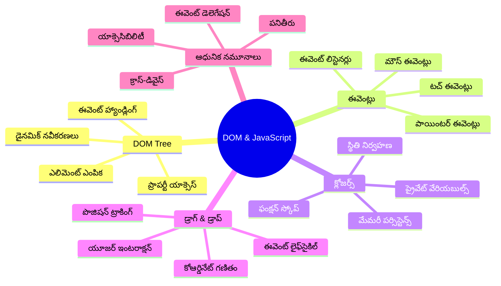
## ముందస్తు-విందు క్విజ్

[ముందస్తు-విందు క్విజ్](https://ff-quizzes.netlify.app/web/quiz/19)

## DOM అర్థం చేసుకోవడం: మీకు ఇంటరాక్టివ్ వెబ్ పేజీలకు ద్వారం

డాక్యూమెంట్ ఆబ్జెక్ట్ మోడల్ (DOM) అనేది JavaScript మీ HTML అంశాలతో ఎలా సంభాషిస్తుందో సూచిస్తుంది. మీ బ్రౌజర్ ఒక HTML పేజీ లోడ్ చేసినప్పుడు, ఆ పేజీకి మెమరీలో ఒక నిర్మితి రూపాన్ని సృష్టిస్తుంది - అదే DOM. దీన్ని ఒక కుటుంబ వృక్షంగా ఆలోచించండి, ఇక్కడ ప్రతి HTML అంశం ఒక కుటుంబ సభ్యునిగా ఉంటుంది, JavaScript అందుకు యాక్సెస్ చెయ్యగలదు, మార్చగలదు లేదా పునఃవ్యవస్థాపించగలదు.

DOM నిర్వహణ స్థిరమైన పేజీలను ఇంటరాక్టివ్ వెబ్‌సైట్లుగా మార్చుతుంది. మీరు ప్రతి సారీ ఓ బటన్ హోవర్ అయినప్పుడు రంగు మారడం, పేజీ రీఫ్రెష్ లేకుండా కంటెంట్ నవీకరణ, లేదా మీరు చుట్టుంచి డ్రాగ్ చేయగల అంశాలు చూస్తే, అది DOM నిర్వహణ పనిచేస్తోంది.

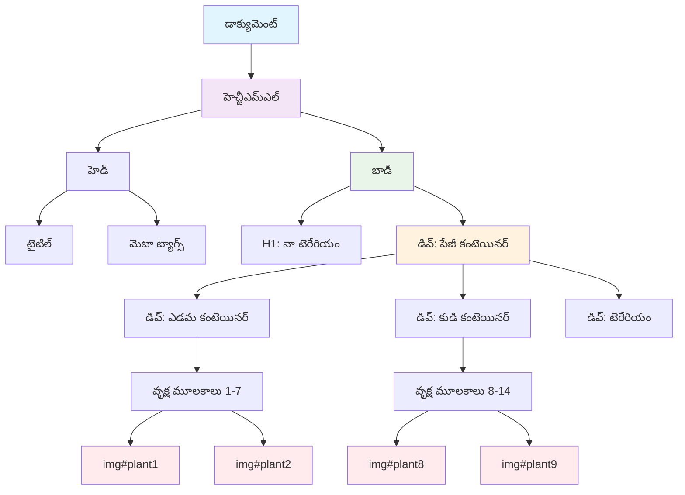
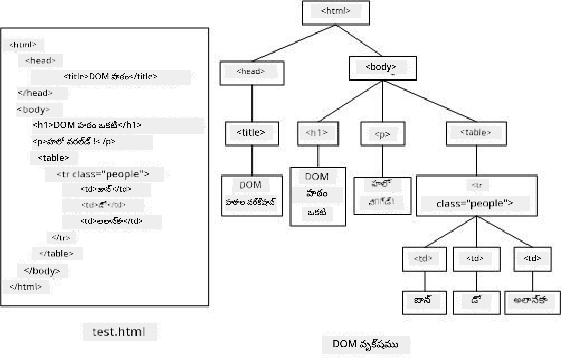

> DOM మరియు దానికి సూచించే HTML మార్కప్ యొక్క ప్రతినిధి. [Olfa Nasraoui](https://www.researchgate.net/publication/221417012_Profile-Based_Focused_Crawler_for_Social_Media-Sharing_Websites)

**DOM ని శక్తివంతం చేసే అంశాలు ఇవి:**
- **మీ పేజీలోని ఏ అంశానికి అయినా యాక్సెస్ ఇచ్చే** నిర్మిత మార్గాన్ని అందిస్తుంది
- **పేజీ రీఫ్రెష్ లేకుండా డైనమిక్ కంటెంట్ నవీకరణలు చేయగలదు**
- **క్లిక్‌లు, డ్రాగ్‌ల వంటి వాడుకరి పరస్పర చర్యలకు ప్రత్యక్ష స్పందన చేయగలదు**
- **ఆధునిక పరస్పర చర్య గల వెబ్ అప్లికేషన్లకు పునాది సృష్టిస్తుంది**

## JavaScript క్లోజర్లు: ఒక సమగ్రమైన, శక్తివంతమైన కోడ్ సృష్టించడం

[js closure](https://developer.mozilla.org/docs/Web/JavaScript/Closures) అర్థం: ఫంక్షన్కు దాని స్వంత ప్రైవేటు పని స్థలంతో పాటు నిలువ డేటా ఇచ్చినట్లు. గాలపాగోస్ ద్వీపాల్లో డార్విన్ పక్షులు ప్రతీది తమ ప్రత్యేక వాతావరణం ప్రకారం ప్రత్యేక బీక్స్ అభివృద్ధి చేసుకున్నట్లు భావించండి - క్లోజర్లు కూడా అదే విధంగా పనిచేస్తాయి, అందులో ప్రత్యేకమైన ఫంక్షన్లు రూపొందించి ఆ ప్రత్యేక సన్నివేశాన్ని "మరచుకోకుండా" నిలుపుతాయి, అవి తల్లి ఫంక్షన్ పూర్తయిన తర్వాత కూడా.

మన టెర్రారియంలో, క్లోజర్లు ప్రతి మొక్క తన స్థానాన్ని స్వతంత్రంగా గుర్తుంచుకోవడంలో సహాయపడతాయి. ఈ నమూనా ప్రొఫెషనల్ JavaScript డెవలప్‌మెంట్ లో అన్ని చోట్ల కనిపిస్తుంది, కనుక దీన్ని అర్థం చేసుకోవడం చాలా విలువైన విషయం.

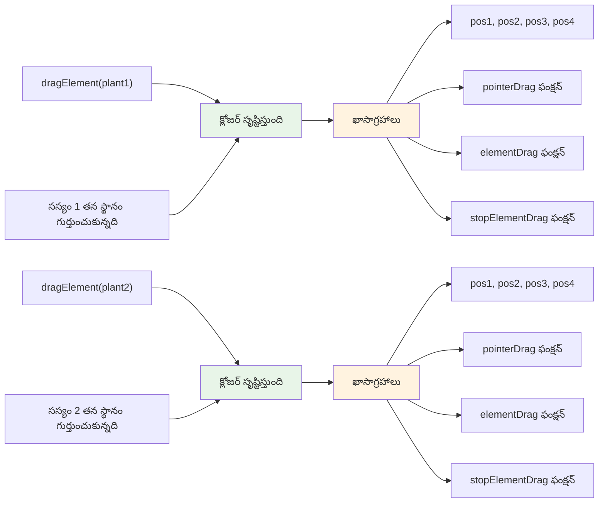
> 💡 **క్లోజర్ల అర్థం**: క్లోజర్లు JavaScript లో ఒక ముఖ్యమైన విషయం, మరియు బహుశా అనేక డెవలపర్లు దీన్ని పూర్తిగా అర్థం చేసుకోవడం నిధానం తీసుకుంటారు. ఈ రోజు మనం ఆచరణకు కేంద్రీకృతమై ఉన్నాము - మీరు ఇంటరాక్‌టివ్ ఫీచర్లను నిర్మించినప్పుడు క్లోజర్లు సహజంగా ఉత్పన్నమవుతాయో చూశారు. అవగాహనమీదుగా ఉంటూ మీరు వీరు నిజ స‌మ‌స్య‌ల‌కు ఎలాగా పరిష్కార‌మిచ్చారో తెలుసుకుంటారు.


> DOM మరియు దానికి సూచించే HTML మార్కప్ యొక్క ప్రతినిధి. [Olfa Nasraoui](https://www.researchgate.net/publication/221417012_Profile-Based_Focused_Crawler_for_Social_Media-Sharing_Websites)

ఈ పాఠంలో, మేము ఇంటరాక్టివ్ టెర్రారియం ప్రాజెక్టును పూర్తిచేయబోతున్నాము - ఇది యూజర్‌కు పేజీ上的 మొక్కలను నిర్వహించడానికి JavaScript సృష్టించడం ద్వారా సాధ్యం అవుతుంది.

## మొదలు పెట్టే ముందు: విజయంలో సిద్ధం కావడం

మీకు గత టెర్రారియం పాఠాల నుండి HTML మరియు CSS ఫైళ్ల అవసరం - మనం ఆ స్థిరమైన డిజైన్ను ఇంటరాక్టివ్‌గా మార్చబోతున్నాము. మీరు మొదటి సారి చేరుతున్నట్లయితే, ఆ పాఠాలు ముందుగా పూర్తి చేయడం ముఖ్యమైన సమాచారాన్ని అందిస్తుంది.

మనము ఈ క్రింది అంశాలను నిర్మించబోతున్నాము:
- **అన్ని టెర్రారియం మొక్కలకు స్మూత్ డ్రాగ్-అండ్-డ్రాప్**
- **స్థాన సూచికల ట్రాకింగ్** - మొక్కలు తమ స్థానాలను గుర్తుంచుకుంటాయి
- **వానిల్లా JavaScript తో పూర్తి ఇంటరాక్షన్ ఇంటర్‌ఫేస్**
- **క్లోజర్ ప్యాటర్న్ల ఉపయోగంతో శుభ్రమైన మరియు సమగ్రమైన కోడ్**

## మీ JavaScript ఫైల్ సెట్ చేయడం

మీ టెర్రారియాన్ని ఇంటరాక్టివ్‌గా మార్చే JavaScript ఫైల్ను సృష్టిద్దాం.

**దశ 1: మీ స్క్రిప్ట్ ఫైల్ సృష్టించండి**

మీ టెర్రారియం ఫోల్‌డర్‌లో `script.js` అనే కొత్త ఫైల్‌ను సృష్టించండి.

**దశ 2: JavaScript ను HTML కి లింక్ చేయండి**

మీ `index.html` ఫైల్ యొక్క `<head>` సెక్షన్‌లో ఈ స్క్రిప్ట్ ట్యాగ్‌ను చేర్చండి:

```html
<script src="./script.js" defer></script>
```

**`defer` అట్రిబ్యూట్ ముఖ్యం అయిన కారణాలు:**
- **మీ JavaScript అన్ని HTML లోడ్ అయ్యే వరకు వేచిచూసేలా చేస్తుంది**
- **JS లోడ్ కాకముందు ఎలిమెంట్స్ కోసం చూడటానికి ఉండే లోపాలను నివారిస్తుంది**
- **మీ ప్లాంట్ ఎలిమెంట్లు అందుబాటులో ఉంటాయని ఖాయం చేస్తుంది**
- **పేజీ చివర స్క్రిప్ట్ పెట్టే దానిపై మెరుగైన పనితనం ఇస్తుంది**

> ⚠️ **ముఖ్య గమనిక**: `defer` అట్రిబ్యూట్ సాధారణ టైమింగ్ సమస్యలను నివారిస్తుంది. లేకపోతే, JavaScript లోడ్ అయిన వెంటనే కానీ HTML ఎలిమెంట్లు ఇంకా అందుబాటులో లేకపోవచ్చు, దానిని యాక్సెస్ చేయడానికి యత్నిస్తే లోపాలు వస్తాయి.

---

## JavaScript ను మీ HTML ఎలిమెంట్లకు కనెక్ట్ చేయడం

ఎలిమెంట్స్ ని డ్రెగ్గబుల్ చేయడానికి ముందు, JavaScript అవి DOM లో ఎక్కడ ఉన్నాయో కనుగొనాలి. ఇది ఒక లైబ్రరీ సూచిక వ్యవస్థకు సమానం - మీరు సూచిక సంఖ్య కలిగి ఉంటే, మీరు కావలసిన ఖచ్చితమైన పుస్తకాన్ని కనుగొని అందులోని అన్ని విషయాలను యాక్సెస్ చేయవచ్చు.

మనం `document.getElementById()` పద్ధతిని ఆ కనెక్షన్ల కోసం ఉపయోగిస్తాము. ఇది ఖచ్చితమైన దస్త్రీకరణ విధానం లాంటిది - మీరు ఒక ID ఇస్తే, అది HTML లో ఖచ్చితమైన అంశాన్ని కనుగొంటుంది.

### అన్ని మొక్కలకు డ్రాగ్ ఫంక్షనాలిటీకి అనుమతించడం

ఈ కోడ్‌ను మీ `script.js` ఫైల్‌లో చేర్చండి:

```javascript
// అన్ని 14 మొక్కలకు డ్రాగ్ ఫంక్షనాలిటీని ఆన్ చేయండి
dragElement(document.getElementById('plant1'));
dragElement(document.getElementById('plant2'));
dragElement(document.getElementById('plant3'));
dragElement(document.getElementById('plant4'));
dragElement(document.getElementById('plant5'));
dragElement(document.getElementById('plant6'));
dragElement(document.getElementById('plant7'));
dragElement(document.getElementById('plant8'));
dragElement(document.getElementById('plant9'));
dragElement(document.getElementById('plant10'));
dragElement(document.getElementById('plant11'));
dragElement(document.getElementById('plant12'));
dragElement(document.getElementById('plant13'));
dragElement(document.getElementById('plant14'));
```

**ఈ కోడ్ సాధించేది:**
- **ప్రతి మొక్క ఎలిమెంట్‌ను DOM లోని దాని ప్రత్యేక ID ద్వారా కనుగొంటుంది**
- **ప్రతి HTML అంశానికి JavaScript సూచనను తెస్తుంది**
- **ప్రతి అంశాన్ని `dragElement` ఫంక్షన్‌కు పంపుతుంది (మనం తరువాత సృష్టించుకుందాం)**
- **ప్రతి మొక్కను డ్రాగ్-అండ్-డ్రాప్ ఇంటరాక్షన్ కోసం సిద్ధం చేస్తుంది**
- **మీ HTML నిర్మాణాన్ని JavaScript ఫంక్షనాలిటీతో కలిపిస్తుంది**

> 🎯 **ఎందుకు క్లాసుల కంటే IDs ఉపయోగించాలి?** IDs ప్రత్యేకమైన గుర్తింపులను అందిస్తాయి, క్లాసులు వివిధ అంశాల గ్రూపుల స్టైలింగ్ కోసం ఉంటాయి. JavaScript ప్రత్యేక అంశాలను నియంత్రించేటప్పుడు, IDs ఖచ్చితత్వం మరియు పనితనాన్ని అందిస్తాయి.

> 💡 **ప్రో సూచన**: ప్రతి మొక్కకి `dragElement()` ని వేరుగా పిలవటం గమనించండి. దీని వల్ల ప్రతి మొక్కకి దాని స్వంత స్వతంత్ర డ్రాగింగ్ ప్రవర్తన వస్తుంది, ఇది స్మూత్ వాడుకరి అనుభవం కోసం అవసరం.

### 🔄 **అధ్యాపక పరీక్ష**
**DOM కనెక్షన్ అర్థం చేసుకోవడం**: డ్రాగ్ ఫంక్షనాలిటీకి ముందు, మీరు సామర్థ్యం కలిగి ఉండాలి:
- ✅ `document.getElementById()` HTML ఎలిమెంట్లు ఎలా కనుగొంటుందో వివరించగలగాలి
- ✅ ప్రతి మొక్కకి ప్రత్యేక IDs ఎందుకు ఉపయోగిస్తామో అర్థం చేసుకోవాలి
- ✅ స్క్రిప్ట్ ట్యాగ్స్ లో `defer` అట్రిబ్యూట్ ఉద్దేశం ఏమిటో వివరించగలగాలి
- ✅ JavaScript మరియు HTML DOM ద్వారా ఎలా కనెక్ట్ అవుతాయో గుర్తించగలగాలి

**తక్షణ స్వీయ-పరీక్ష**: ఒకే ID తో రెండు అంశాలు ఉంటే ఏమవుతుంది? `getElementById()` ఒకే ఒక్క అంశాన్ని ఎందుకు ఇస్తుంది?  
*జవాబు: IDs ప్రత్యేకంగా ఉండాలి; అవి పునరావృతమైతే, మొదటి అంశం మాత్రమే రిటర్న్ అవుతుంది*

---

## డ్రాగ్ ఎలిమెంట్ క్లోజర్‌ను నిర్మించడం

ఇప్పుడు మనం డ్రాగింగ్ ఫంక్షనాలిటీ హృదయమైన క్లోజర్‌ని సృష్టిస్తాము: ఇది ప్రతి మొక్కకు డ్రాగింగ్ ప్రవర్తనను నిర్వహిస్తుంది. ఈ క్లోజర్ లో ఒకటి కంటే ఎక్కువ లోపలి ఫంక్షన్లు ఉంటాయి, అవి మౌస్ కదిలే దిశలను ట్రాక్ చేసి, అంశాల స్థానాలను నవీకరిస్తాయి.

క్లోజర్లు ఈ పని కి సంపూర్ణం, ఎందుకంటే అవి "ప్రైవేటు" వేరియబుల్స్ సృష్టించి ఫంక్షన్ పిలుపుల మధ్య పిజి ఉంటాయి, అందివల్ల ప్రతి మొక్కకి దాని స్వంత స్వతంత్ర స్థానం ట్రాకింగ్ వ్యవస్థ వస్తుంది.

### ఒక సులభ ఉదాహరణతో క్లోజర్ల అర్థం చేసుకోవడం

క్లోజర్ల తోడు సులభ ఉదాహరణ ఇక్కడ ఉంది:

```javascript
function createCounter() {
    let count = 0; // ఇది ఒక ప్రైవేట్ వేరియబుల్ లాంటిది
    
    function increment() {
        count++; // లోపల ఫంక్షన్ బయటి వేరియబుల్‌ను గుర్తుంచుకుంటుంది
        return count;
    }
    
    return increment; // మేము లోపల ఫంక్షన్‌ను తిరిగి ఇస్తున్నాము
}

const myCounter = createCounter();
console.log(myCounter()); // 1
console.log(myCounter()); // 2
```

**ఈ క్లోజర్ నమూనాలో జరుగుతున్నది:**
- **ఒక ప్రైవేట్ `count` వేరియబుల్ సృష్టిస్తుంది ఇది క్లోజర్ లోనే ఉంటుంది**
- **లోపలి ఫంక్షన్ ఆ అవుటర్ వేరియబుల్ ని యాక్సెస్ చేసి మార్చుకోవచ్చు (క్లోజర్ యాంత్రికత)**
- **లోపలి ఫంక్షన్ రిటర్న్ చేసినప్పుడు, అది ఆ ప్రైవేట్ డేటాతో కనెక్షన్ నిలుపుకుంటుంది**
- **`createCounter()` పూర్తి అయిన తర్వాత కూడా `count` మన్నిస్తుంది మరియు దాని విలువ గుర్తుంచుకుంటుంది**

### డ్రాగ్ ఫంక్షనాలిటీకి క్లోజర్లు ఎందుకు సరైనవి

మన టెర్రారియంలో ప్రతీ మొక్క దాని ప్రస్తుత స్థాన సూచికలను గుర్తుంచుకోవాలి. క్లోజర్లు ఈ సమస్యకు సరైన పరిష్కారం:

**మనం పొందే ముఖ్య లాభాలు:**
- **ప్రతి మొక్కకు స్వతంత్ర ప్రైవేట్ స్థాన వేరియబుల్స్ ఉంచడం**
- **డ్రాగ్ సమావేశాల మధ్య సూచిక మొత్తం సురక్షితంగా నిలుపుకొనటం**
- **వేరే డ్రాగ్ అండ్ డ్రాప్ అంశాల మధ్య వేరియబుల్ సర్థకత తప్పించడం**
- **క్లియర్, సమగ్రమైన కోడ్ నిర్మాణాన్ని సృష్టించడం**

> 🎯 **ఉద్యమ లక్ష్యం**: మీరు ఇప్పుడు క్లోజర్ల అన్ని అంశాల్లో నిపుణులు కావాల్సిన అవసరం లేదు. మీరు దానికి సహాయకారిగా ఎలా ఉపయోగిస్తారో దృష్టి పెడండి మరియు మన డ్రాగింగ్ ఫంక్షనాలిటీకి స్టేట్ నిర్వహణ ఎలా చేస్తుందో చూడండి.

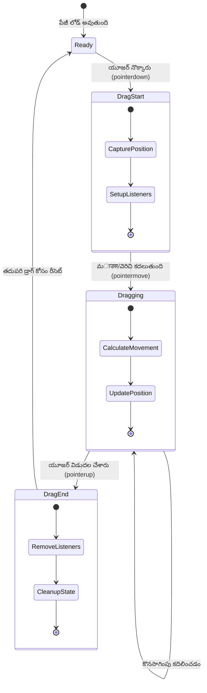
### dragElement ఫంక్షన్ ను సృష్టించడం

ఇప్పుడు మనం డ్రాగింగ్ లాజిక్ లోపల పూర్తి ఫంక్షన్ ను నిర్మిద్దాం. మీ మొక్క ఎలిమెంట్ల డిక్లరేషన్ల కింద ఈ ఫంక్షన్ చేర్చండి:

```javascript
function dragElement(terrariumElement) {
    // స్థానాన్ని ట్రాకింగ్ చేయడానికి వేరియబుల్స్ ప్రారంభించండి
    let pos1 = 0,  // మునుపటి మౌస్ X స్థానం
        pos2 = 0,  // మునుపటి మౌస్ Y స్థానం
        pos3 = 0,  // ప్రస్తుత మౌస్ X స్థానం
        pos4 = 0;  // ప్రస్తుత మౌస్ Y స్థానం
    
    // ప్రారంభ డ్రాగ్ ఈవెంట్ లిస్నర్ సెటప్ చేయండి
    terrariumElement.onpointerdown = pointerDrag;
}
```

**స్థాన సూచిక వ్యవస్థ అర్థం చేసుకోవడం:**
- **`pos1` మరియు `pos2`**: పాత మరియు కొత్త మౌస్ స్థానాల మధ్య వ్యత్యాసాన్ని నిలుపుకుంటాయి
- **`pos3` మరియు `pos4`**: ప్రస్తుత మౌస్ సమన్వయాలను ట్రాక్ చేస్తాయి
- **`terrariumElement`**: మనం డ్రాగ్ చేయదలచిన ప్రత్యేక మొక్క ఎలిమెంట్
- **`onpointerdown`**: వాడుకరి డ్రాగ్ ప్రారంభించినప్పుడు టరిగ్గర్ అయ్యే ఈవెంట్

**క్లోజర్ నమూనా ఎలా పనిచేస్తుంది:**
- **ప్రతి మొక్క ఎలిమెంట్ కోసం ప్రైవేట్ స్థాన వేరియబుల్స్ సృష్టిస్తుంది**
- **ఇవి డ్రాగింగ్ జీవితం అంతా కొనసాగుతాయి**
- **ప్రతి మొక్క స్వతంత్రంగా దాని స్థానాలను ట్రాక్ చేస్తుంది**
- **`dragElement` ఫంక్షన్ ద్వారా శుభ్రంగా ఇంటర్‌ఫేస్ అందిస్తుంది**

### ఎందుకు Pointer Events ఉపయోగించాలి?

`onclick` కన్నా `onpointerdown` ఎందుకు ఉపయోగిస్తున్నామని మీకు ఆశ్చర్యంగా ఉండవచ్చు. కారణాలు ఇవి:

| ఈవెంట్ రకం | ఉత్తమంగా ఉపయోగించే సందర్భం | పరిమితి |
|------------|-----------------------------|---------|
| `onclick` | సులభమైన బటన్ క్లిక్‌లు | డ్రాగ్ చేయలేడు (క్లిక్ & రిలీజు మాత్రమే) |
| `onpointerdown` | మౌస్ మరియు టచ్ రెండింటి కోసం | కొత్తది, కానీ ప్రస్తుతం బాగా మద్దతు ఉంది |
| `onmousedown` | డెస్క్‌టాప్ మౌస్ కోసం మాత్రమే | మొబైల్ వినియోగదారులను వదిలేస్తుంది |

**Pointer events మనం రూపొందిస్తున్నది కోసం ఎందుకు సరైనవి:**
- **మౌస్, ఏదైనా వేలితో లేదా స్టైలస్ తో ఉపయోగించినా సమర్ధవంతంగా పనిచేస్తుంది**
- **లాప్‌టాప్, టాబ్లెట్ లేదా ఫోన్ లో కూడా సమాన అనుభవం కలిగిస్తుంది**
- **నిజమైన డ్రాగింగ్ చర్యను నిర్వహిస్తుంది (మాత్రమే క్లిక్ చేయకుండా)**
- **ఆధునిక వెబ్ యాప్స్ నుండి వినియోగదారులు గడుతారు అలా సహజ అనుభవాన్ని ఇస్తుంది**

> 💡 **భవిష్యత్తుకు సన్నద్ధత**: Pointer events సరికొత్త, వాడుకరి పరస్పర క్రియలకు అత్యంత సమగ్ర పద్దతిగా మారింది. మౌస్ మరియు టచ్ కోసం విభిన్న కోడ్ రాయకుండానే రెండింటిని ఉచితంగా పొందడం చాలా మంచి విషయం, కాకపోతే ఎలా?

### 🔄 **అధ్యాపక పరీక్ష**
**ఈవెంట్ నిర్వహణ అర్థం చేసుకోవడం**: మీరు ఈ విషయాలను ధృవీకరించాలి:
- ✅ pointer events ను mouse events కి బదులు ఎందుకు ఉపయోగిస్తారు?
- ✅ క్లోజర్ వేరియబుల్స్ ఫంక్షన్ పిలుపుల మధ్య ఎలా నిలుస్తాయి?
- ✅ smooth dragging కోసం `preventDefault()` పాత్ర ఏంటి?
- ✅ మనం వ్యక్తిగత ఎలిమెంట్లకు కాక, డాక్యుమెంట్‌కు లిసనర్స్ ఎందుకు జత చేస్తాం?

**వాస్తవ ప్రపంచ సంబంధం**: మీరు రోజువారీ ఉపయోగించే డ్రాగ్ & డ్రాప్ ఇంటర్‌ఫేస్‌ల గురించి ఆలోచించండి:
- **ఫైలు అప్‌లోడ్లు**: బ్రౌజర్ విండోలో ఫైళ్ళను డ్రాగ్ చేయడం
- **కాన్బన్ బోర్డులు**: పనులను కాలమ్స్ మధ్య తరలించడం
- **ఇమేజ్ గ్యాలరీలు**: ఫొటోలు సర్దుబాటు చేయడం
- **మొబైల్ ఇంటర్‌ఫేస్‌లు**: టచ్‌స్క్రీన్‌లపై స్వైప్ మరియు డ్రాగ్ చేయడం

---

## pointerDrag ఫంక్షన్: డ్రాగ్ ప్రారంభాన్ని క్యాప్చర్ చేయడం

వాడుకరి మొక్కపై కుడివైపు మౌస్ క్లిక్ లేదా వేళ్లతో టచ్ చేస్తే, `pointerDrag` ఫంక్షన్ చర్యలోకి వస్తుంది. ఈ ఫంక్షన్ ప్రారంభ సమన్వయాలను గ్రహించి డ్రాగ్ వ్యవస్థను సెట్ చేస్తుంది.

ఈ ఫంక్షన్ ను `dragElement` క్లోజర్లో, `terrariumElement.onpointerdown = pointerDrag;` లైన్ వెంట చేర్చండి:

```javascript
function pointerDrag(e) {
    // డిఫాల్ట్ బ్రౌజర్ ప్రవర్తనను ఆపండి (ఉదాహరణకు, టెక్స్ట్ సెలక్షన్)
    e.preventDefault();
    
    // ప్రారంభ మౌస్/టచ్ స్థానం పట్టుకోండి
    pos3 = e.clientX;  // డ్రాగ్ ప్రారంభమైన X కోఆర్డినేట్
    pos4 = e.clientY;  // డ్రాగ్ ప్రారంభమైన Y కోఆర్డినేట్
    
    // డ్రాగింగ్ ప్రక్రియ కోసం ఈవెంట్ లిస్నర్లు ఏర్పాటు చేయండి
    document.onpointermove = elementDrag;
    document.onpointerup = stopElementDrag;
}
```

**దశల వారీగా జరిగేది:**
- **డ్రాగింగ్ లో జోక్యం కలిగే డిఫాల్ట్ బ్రౌజర్ ప్రవర్తనలు నిరోధిస్తుంది**
- **వాడుకరి డ్రాగ్ ప్రారంభించిన ఖచ్చితమైన సమన్వయాలను రికార్డ్ చేస్తుంది**
- **డ్రాగ్ కదలికకు ఈవెంట్ లిసనర్లను సెట్ చేస్తుంది**
- **మౌస్/వేళ్లు కదలిక ట్రాకింగ్ కోసం పూర్తి డాక్యుమెంట్‌పై సిస్టమ్ సిద్ధం చేస్తుంది**

### ఈవెంట్ నిరోధన అర్థం చేసుకోవడం

`e.preventDefault()` లైన్ స్మూత్ డ్రాగ్ కోసం చాలా ముఖ్యము:

**నివారణ లేకపోతే బ్రౌజర్లు:**
- **పేజీ పై డ్రాగ్ చేస్తూ టెక్స్ట్ ఎంచుకోవచ్చు**
- **కుడి క్లిక్ డ్రాగ్ పై కంటెక్స్ట్ మెనూలు తెరుచుకోవచ్చు**
- **మన కస్టమ్ డ్రాగ్ ప్రవర్తనలో జోక్యం కలిగించవచ్చు**
- **డ్రాగ్ సమయంలో దృశ్య మిశ్రమాలు ఉత్పన్నం చేయవచ్చు**

> 🔍 **ప్రయోగం**: ఈ పాఠం పూర్తి అయిన తరువాత, `e.preventDefault()` తీసేసి డ్రాగింగ్ అనుభవం ఎలా మారినదో చూడండి. మీరు త్వరగా ఈ లైన్కు కారణం తెలుసుకుంటారు!

### స్థాన సూచిక ట్రాకింగ్ సిస్టమ్

`e.clientX` మరియు `e.clientY` ప్రాపర్టీలు మనకు ఖచ్చితమైన మౌస్/టచ్ సమన్వయాలను ఇవ్వగలుగుతాయి:

| ప్రాపర్టీ | ఇది ఏది కొలుస్తుంది | ఉపయోగం |
|----------|---------------------|---------|
| `clientX` | వ్యూవ్‌పోర్ట్ కు సంబంధించిన అడ్డుగారపు స్థానం | ఎడమ-కుడి కదలిక ట్రాక్ చేయడం |
| `clientY` | వ్యూవ్‌పోర్ట్ కు సంబంధించిన నిలువు స్థానం | పైకి-కిందికి కదలిక ట్రాక్ చేయడం |
**ఈ కోఆర్డినేట్లను అర్థం చేసుకోవడం:**
- **అందిస్తుంది** పిక్సెల్-పర్ఫెక్ట్ స్థానం సమాచారాన్ని
- **నవీకరిస్తుంది** యూజర్ వారి పాయింటర్‌ను కదిలించడంలో రియల్-టైంలో
- **స్థిరంగా ఉంటుంది** వివిధ స్క్రీన్ పరిమాణాలు మరియు జూమ్ స్థాయిలలో
- **సమర్థిస్తుంది** సున్నితమైన, ప్రతిస్పందనాత్మక డ్రాగ్ ఇంటరాక్షన్లు

### డాక్యుమెంట్-లెవెల్ ఈవెంట్ లిసనర్లను సెటప్ చేయడం

మనం ఎలా మొత్తం `document`కి move మరియు stop ఈవెంట్లను అటాచ్ చేస్తున్నామో గమనించండి, కేవలం ప్లాంట్ ఎలిమెంట్ కు కాదు:

```javascript
document.onpointermove = elementDrag;
document.onpointerup = stopElementDrag;
```

**ఎందుకు డాక్యుమెంట్కి అటాచ్ చేయాలి:**
- **కొనసాగుతుంది** ట్రాకింగ్ కి మౌస్ ప్లాంట్ ఎలిమెంట్ నుంచి బయటకు రావడం కూడా
- **తట్టు** డ్రాగ్ విరామం వద్ద యూజర్ వేగంగా కదిలినప్పటికీ
- **అందిస్తుంది** మొత్తం స్క్రీన్ మీద సాఫ్ట్ డ్రాగింగ్ అనుభవం
- **నిర్వహిస్తుంది** బ్రౌజర్ విండో వెలుపల కర్సర్ కదలడానికి వచ్చే ఎడ్జ్ కేసులను

> ⚡ **పర్ఫార్మెన్స్ నోటు**: డ్రాగింగ్ ఆగినప్పుడు ఈ డాక్యుమెంట్-లెవెల్ లిసనర్లను క్లీనప్ చేస్తాము, మెమొరీ లీక్స్ మరియు పనితీరు సమస్యలను నివారించడానికి.

## డ్రాగ్ సిస్టమ్ పూర్తి చేయడం: మోషన్ మరియు క్లీనప్

ఇప్పుడు మిగిలిన రెండు ఫంక్షన్లను సూచిస్తాం, ఇవి వాస్తవ డ్రాగింగ్ మూవ్మెంట్ మరియు డ్రాగింగ్ ఆగినప్పుడు క్లీనప్ నిర్వహిస్తాయి. ఈ ఫంక్షన్లు కలిసి మీ టెరేరియంలో సాఫ్ట్, ప్రతిస్పందనాత్మక ప్లాంట్ కదలికను సృష్టిస్తాయి.

### elementDrag ఫంక్షన్: కదలికను ట్రాక్ చేయడం

`pointerDrag` యొక్క ముగింపు కర్లీ బ్రాకెట్ వెంటనే `elementDrag` ఫంక్షన్ చేర్చండి:

```javascript
function elementDrag(e) {
    // చివరి సంఘటన నుండి మార్చిన దూరం లెక్కించండి
    pos1 = pos3 - e.clientX;  // కలంబ దూరం మార్చబడింది
    pos2 = pos4 - e.clientY;  // లంబ దూరం మార్చబడింది
    
    // ప్రస్తుత స్థానం ట్రాకింగ్‌ను నవీకరించండి
    pos3 = e.clientX;  // కొత్త ప్రస్తుత X స్థానం
    pos4 = e.clientY;  // కొత్త ప్రస్తుత Y స్థానం
    
    // మూలకం స్థానానికి చలనం వర్తించండి
    terrariumElement.style.top = (terrariumElement.offsetTop - pos2) + 'px';
    terrariumElement.style.left = (terrariumElement.offsetLeft - pos1) + 'px';
}
```

**కోఆర్డినెట్ గణితం అర్థం చేసుకోవడం:**
- **`pos1` మరియు `pos2`**: ఈ చివరి నవీకరణ నుండి మౌస్ ఎంత దూరం కదిలిందో లెక్కించు
- **`pos3` మరియు `pos4`**: తదుపరి గణన కోసం ప్రస్తుత మౌస్ స్థానం నిల్వ చేయు
- **`offsetTop` మరియు `offsetLeft`**: పేజీపై ఎలిమెంట్ ప్రస్తుత స్థానం పొందు
- **వియోగం తీయడం తత్వం**: మౌస్ కదలినదంతా ఎలిమెంట్ కదిలించడం

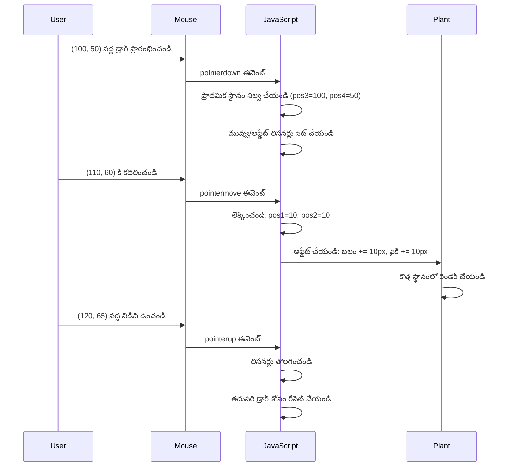
**కదలిక గణన వివరణ ఇక్కడ ఉంది:**
1. **పరిమాణం** పాత మరియు కొత్త మౌస్ స్థానాల మధ్య తేడా
2. **లెక్కించు** మౌస్ కదలిక ఆధారంగా ఎలిమెంట్ ఎంత కదిలించాలో
3. **నవీకరించు** ఎలిమెంట్ CSS స్థానం ప్రాపర్టీలను రియల్-టైంలో
4. **నిల్వ** కొత్త స్థానాన్ని తదుపరి కదలిక గణనకి ఆధారంగా

### గణిత విజువల్ ప్రదర్శన

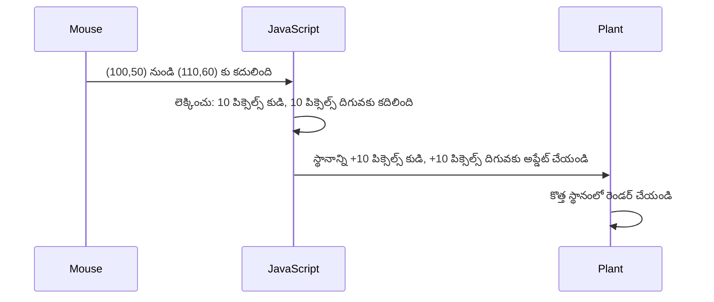
### stopElementDrag ఫంక్షన్: క్లీనప్

`elementDrag` ముగింపు కర్లీ బ్రాకెట్ తర్వాత క్లీనప్ ఫంక్షన్ చేర్చండి:

```javascript
function stopElementDrag() {
    // డాక్యుమెంట్-స్థాయి ఈవెంట్ లిసనర్లను తొలగించండి
    document.onpointerup = null;
    document.onpointermove = null;
}
```

**క్లీనప్ ఎందుకు అవసరం:**
- **తిరస్కరిస్తుంది** నిలిచిపోయిన ఈవెంట్ లిసనర్ల కారణంగా మెమొరీ లీక్స్
- **ఆగుస్తుంది** యూజర్ ప్లాంట్ విడుదల చేసినప్పుడు డ్రాగింగ్ ప్రవర్తన
- **అనుమతిస్తుంది** ఇతర ఎలిమెంట్లను స్వతంత్రంగా డ్రాగ్ చేయగలిగేందుకు
- **రిసెట్ చేస్తుంది** సిస్టమ్ తదుపరి డ్రాగ్ ఆపరేషన్ కోసం

**క్లీనప్ లేకపోతే ఏమవుతుంది:**
- డ్రాగ్ ఆగిన తరువాత కూడా ఈవెంట్ లిసనర్లు పనిచేస్తూనే ఉంటాయి
- పనితీరు తగ్గుతుంది, అనవసర లిసనర్లు కూడుకుని
- ఇతర ఎలిమెంట్స్‌తో ఇంటరెక్టర్ చేసే సమయాల్లో అనపేక్షిత ప్రవర్తన
- బ్రౌజర్ వనరులు వినా కారణాల కోసం నష్టం

### CSS స్థానం ప్రాపర్టీల అర్థం

మన డ్రాగింగ్ సిస్టమ్ రెండు ముఖ్య CSS ప్రాపర్టీలను మేనేజ్ చేస్తుంది:

| ప్రాపర్టీ | ఇది ఏమి నియంత్రిస్తుంది | మేము ఎలా ఉపయోగిస్తాం |
|----------|------------------------|------------------------|
| `top` | టాప్ ఎడ్జ్ నుండి దూరం | డ్రాగ్ సమయంలో వివరాత్మక నిలయిన క్రమం |
| `left` | ఎడమ ఎడ్జ్ నుండి దూరం | డ్రాగ్ సమయంలో పొడవైన నిలయిన క్రమం |

**offset ప్రాపర్టీల ముఖ్యమైన వివరాలు:**
- **`offsetTop`**: స్థానీకృత పేరెంట్ ఎలిమెంట్ నుండి ప్రస్తుత టాప్ దూరం
- **`offsetLeft`**: స్థానీకృత పేరెంట్ ఎలిమెంట్ నుండి ప్రస్తుత ఎడమ దూరం
- **స్థానీకరణ సੰਦਰభం**: ఈ విలువలు సమీపంగా ఉన్న స్థానీకృత రావద్దులపై ఆధారపడి ఉంటాయి
- **తక్షణ నవీకరణలు**: CSS ప్రాపర్టీలను మార్చిన వెంటనే మార్పులు

> 🎯 **డిజైన్ తత్యం**: ఈ డ్రాగ్ సిస్టమ్ ఉద్దేశపూర్వకంగా సాఫ్ట్ - "డ్రాప్ జోన్లు" లేదా పరిమితులు లేవు. యూజర్లు ప్లాంట్లను ఎక్కడైనా ఉంచవచ్చు, తమ టెరేరియం డిజైన్ పై పూర్తి సృజనాత్మక నియంత్రణతో.

## మొత్తం కలిపి: మీ సంపూర్ణ డ్రాగ్ సిస్టమ్

అభినందనలు! మీరు వానిల్లా జావాస్క్రిప్ట్ ఉపయోగించి నైపుణ్యమైన డ్రాగ్-అండ్-డ్రాప్ సిస్టమ్ ని నిర్మించారు. మీ పూర్తి `dragElement` ఫంక్షన్ ఇప్పుడు మూడు ముఖ్య ఫంక్షన్లు కలిగి ఉంది:

**మీ క్లోశర్ చేస్తే ఏం సాధ్యమవుతుందో:**
- **ప్రత్యేకంగా నిర్వహిస్తుంది** ప్రతి ప్లాంట్ కోసం వ్యక్తిగత ప్రైవేట్ స్థాన వేరియబుల్స్
- **మ్యానేజ్ చేస్తుంది** పూర్తి డ్రాగ్ జీవితచక్రం ప్రారంభం నుండి ముగింపు వరకూ
- **అందిస్తుంది** మొత్తం స్క్రీన్‌పై సాఫ్ట్, ప్రతిస్పందనాత్మక కదలికలు
- **క్లీన్ చేస్తుంది** సమగ్రమైన వనరులను మెమొరీ లీక్స్ నివారణకు
- **సృష్టిస్తుంది** టెరేరియం డిజైన్ కోసం ఆసక్తికరమైన మరియు సృజనాత్మక ఇంటర్‌ఫేస్

### మీ ఇంటరాక్టివ్ టెరేరియాన్ని పరీక్షించడం

ఇప్పుడు మీ ఇంటరాక్టివ్ టెరేరియాని పరీక్షించండి! `index.html` ఫైల్‌ని వెబ్ బ్రౌజర్ లో ఓపెన్ చేసి క్రియాశీలతను పరీక్షించండి:

1. ఏదైనా ప్లాంట్ పై **క్లిక్ చేసి హోల్డ్** చేయండి డ్రాగ్ మొదలుపెట్టు
2. మీ మౌస్ లేదా చేయి **చదిలించండి** మరియు ప్లాంట్ సాఫ్ట్‌గా కదిలి వచ్చేస్తున్నదని చూడండి
3. **ట్యాగ్ విడదీయండి** ప్లాంట్ కొత్త స్థానంలో ఉంచేందుకు
4. విభిన్న **అరేమెంట్లతో ప్రయోగం చేయండి** ఇంటర్‌ఫేస్ అన్వేషణకు

🥇 **అప గ్రేడ్**: మీరు ప్రొఫెషనల్ డెవలపర్స్ రోజువారీ ఉపయోగించే కోర్ కాన్సెప్ట్‌లు ఉపయోగించి పూర్తి ఇంటరాక్టివ్ వెబ్ అప్లికేషన్ సృష్టించారు. ఆ డ్రాగ్-అండ్-డ్రాప్ ఫంక్షనాలిటీ ఫైల్ అప్‌లోడ్లు, కన్బన్ బోర్డ్స్ వంటి అనేక ఇంటరాక్టివ్ ఇంటర్‌ఫేస్‌ల వెనుకlying ప్రఛీన సూత్రం.

### 🔄 **పాఠ్యా పరీక్ష**
**సంపూర్ణ సిస్టమ్ అర్థం చేసుకోవడం**: పూర్తి డ్రాగ్ సిస్టమ్ పట్ల మీ నైపుణ్యాన్ని ధృవీకరించండి:
- ✅ క్లోషల్‌లు ఎలా నిర్వహిస్తాయి ప్రతి ప్లాంట్ కోసం స్వతంత్ర స్థితిని?
- ✅ సాఫ్ట్ కదలిక కోసం కోఆర్డినేట్ గణితం ఎందుకు అవసరం?
- ✅ ఈవెంట్ లిసనర్ల క్లీనప్ మర్చిపోతే ఏమవుతుంది?
- ✅ ఈ ప్యాట్నర్ మరింత క్లిష్టమైన ఇంటరాక్షన్లకు ఎలా స్కేల్ అవుతుంది?

**కోడ్ నాణ్యత పరిశీలన**: మీ పూర్తి పరిష్కారాన్ని సమీక్షించండి:
- **మాడ్యూలర్ డిజైన్**: ప్రతి ప్లాంట్ కి వేరే క్లోశర్ ఉదాహరణ
- **ఈవెంట్ సామర్థ్యం**: లిసనర్ల సరైన సెటప్ మరియు క్లీనప్
- **క్రాస్-డివైస్ సపోర్ట్**: డెస్క్‌టాప్ మరియు మొబైల్ లో పని
- **పర్ఫార్మెన్స్ అవగాహన**: మెమొరీ లీక్స్ లేకుండా మరియు అదనపు లెక్కింపులు లేవు

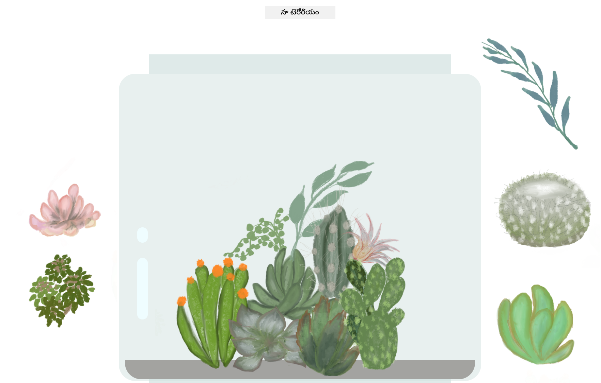

---

## GitHub Copilot ఏజెంట్ ఛాలెంజ్ 🚀

ఈ ఏజెంట్ మోడ్ ఉపయోగించి క్రింది ఛాలెంజ్ పూర్తి చేయండి:

**వివరణ:** టెరేరియం ప్రాజెక్ట్స్‌కు రీసెట్ ఫంక్షనాలిటీ జోడించండి, ఇది అన్ని ప్లాంట్లను వారి అసలు స్థానాలకు సాఫ్ట్ అనిమేషన్లతో తిరిగి పంపుతుంది.

**ప్రాంప్ట్:** రీసెట్ బటన్ సృష్టించండి; దీనిని క్లిక్ చేసినప్పుడు, CSS ట్రాన్సిషన్ల ఉపయోగించి అన్ని ప్లాంట్లను వారి అసలు సైడ్‌బార్ స్థానాలకు సాఫ్ట్‌గా 1 సెకనులో మళ్ళీ కదిలించాలి. ఈ ఫంక్షన్ పేజీ లోడ్ అయ్యేప్పుడు అసలు స్థానాలను నిల్వ చెయ్యాలి.

[agent mode](https://code.visualstudio.com/blogs/2025/02/24/introducing-copilot-agent-mode) గురించి మరింత తెలుసుకోండి.

## 🚀 అదనపు ఛాలెంజ్: మీ నైపుణ్యాలను విస్తరించుకోండి

మీ టెరేరియాన్ని తదుపరి స్థాయికి తీసుకెళ్లడానికి సిద్ధం? ఈ విస్తరణలను అమలు చేయండి:

**సృజనాత్మక విస్తరణలు:**
- ప్లాంట్ పై **డబుల్-క్లిక్** చేస్తే దానిని ముందు (z-index మానిప్యులేషన్) తీసుకు రావడం
- ప్లాంట్లపై హోవర్ చేసినప్పుడు **సూక్ష్మ గ్లో లాంటి విజువల్ ఫీడ్‌బ్యాక్** జోడించడం
- ప్లాంట్లను టెరేరియం వెలుపల **డ్రాగ్ చేయకుండా బౌండరీలు** అమలు చేయడం
- స్థానాలను గుర్తుంచుకునే **సేవ్ ఫంక్షన్** తయారు చేయడం localStorage ఉపయోగించి
- ప్లాంట్లు ఎత్తుకోవడం మరియు ఉంచే సమయంలో **శబ్ద ప్రభావాలు** జోడించడం

> 💡 **లెర్నింగ్ అవకాశం**: ఈ ప్రతిఒక్క ఛాలెంజ్ డిఓఎంవు మానిప్యులేషన్, ఈవెంట్ హ్యాండ్లింగ్, యూజర్ అనుభవ డిజైన్ లో కొత్త అంశాలను నేర్పుతుంది.

## పాఠం తర్వాత క్విజ్

[పాఠం తర్వాత క్విజ్](https://ff-quizzes.netlify.app/web/quiz/20)

## సమీక్ష & స్వయంగా అధ్యయనం: మీ అర్థం గంభీరత

మీరు DOM మానిప్యులేషన్ మరియు క్లోశర్లలో ప్రావీణ్యం పొందారు, కానీ ఇంకా చాలామంది పరిశీలించాల్సిన అంశాలు ఉన్నాయి! మీ జ్ఞానం మరియు నైపుణ్యాలను విస్తరించేందుకు కొన్ని మార్గాలు:

### ప్రత్యామ్నాయ డ్రాగ్ అండ్ డ్రాప్ దృష్టికోణాలు

మాక్స్ ఫ్లెక్సిబిలిటీ కోసం pointer ఈవెంట్లను ఉపయోగించాం, కాని వెబ్ డెవలప్‌మెంట్‌లో అనేక పద్ధతులు ఉన్నాయి:

| పద్ధతి | ఉత్తమం | నేర్చుకునే విలువ |
|----------|----------|------------------|
| [HTML డ్రాగ్ అండ్ డ్రాప్ API](https://developer.mozilla.org/docs/Web/API/HTML_Drag_and_Drop_API) | ఫైల్ అప్‌లోడ్లు, ఆపరేటింగ్ డ్రాగ్ జోన్లు | స్థానిక బ్రౌజర్ సామర్థ్యాలు అర్థం చేసుకోవడం |
| [టచ్ ఈవెంట్స్](https://developer.mozilla.org/docs/Web/API/Touch_events) | మొబైల్ ప్రత్యేక ఇంటరాక్షన్లు | మొబైల్-ఫస్ట్ డెవలప్‌మెంట్ మోడల్స్ |
| CSS `transform` ప్రాపర్టీస్ | సాఫ్ట్ అనిమేషన్లు | పనితీరు ఆప్టిమైజేషన్ సాంకేతికతలు |

### అధునాతన DOM మానిప్యులేషన్ అంశాలు

**మీకోసం తదుపరి అభ్యాసాలు:**
- **ఈవెంట్ డెలిగేషన్**: బహుళ ఎలిమెంట్లకు సమర్ధవంతమైన ఈవెంట్ నిర్వహణ
- **ఇంటర్సెక్షన్ ఆబ్జర్వర్**: ఎలిమెంట్లు వ్యూయిపోర్ట్‌లోకి వచ్చేటప్పుడు లేదా వెళ్లేటప్పుడు గుర్తింపు
- **మ్యూటేషన్ ఆబ్జర్వర్**: DOM నిర్మాణ మార్పులపై పర్యవేక్షణ
- **వెబ్ కాంపొనెంట్లు**: పునర్వినియోగపరచదగిన, ఉక్కు UI ఎలిమెంట్లు సృష్టించడం
- **వర్చువల్ DOM కాన్సెప్ట్స్**: ఫ్రేమ్‌వర్క్‌లు DOM నవీకరణలను ఎలా ఆప్టిమైజ్ చేసుకుంటాయి అర్థం చేసుకోవడం

### కొనసాగుతున్న అభ్యాసం కోసం ముఖ్య వనరులు

**టెక్నికల్ డాక్యుమెంటేషన్:**
- [MDN Pointer Events Guide](https://developer.mozilla.org/docs/Web/API/Pointer_events) - పూర్తిగా pointer ఈవెంట్ రెఫరెన్స్
- [W3C Pointer Events Specification](https://www.w3.org/TR/pointerevents1/) - అధికారిక ప్రమాణాల డాక్యుమెంట్
- [JavaScript Closures Deep Dive](https://developer.mozilla.org/docs/Web/JavaScript/Closures) - అధునాతన క్లోషర్ నమూనాలు

**బ్రౌజర్ అనుకూలత:**
- [CanIUse.com](https://caniuse.com/) - ఫీచర్ సపోర్ట్ గమనించు బ్రౌజర్ల మధ్య
- [MDN Browser Compatibility Data](https://github.com/mdn/browser-compat-data) - వివరణాత్మక అనుకూలత సమాచారం

**ప్రాక్టీస్ అవకాశాలు:**
- **పజిల్ గేమ్** ఉద్దరించండి డ్రాగ్ మెకానిక్స్ తో
- **కన్బన్ బోర్డ్** సృష్టించండి డ్రాగ్-అండ్-డ్రాప్ టాస్క్ మేనేజ్మెంట్ తో
- **ఫోటో గ్యాలరీ డిజైన్** డ్రాగ్ చేయగల ఫోటోల అమరికలతో
- **మొబైల్ ఇంటర్‌ఫేస్‌కు టచ్ జెస్టర్స్ పై ప్రయోగం చేయండి**

> 🎯 **అభ్యాస వ్యూహం**: ఈ కాన్సెప్ట్‌లను బలపడించటానికి ఉత్తమ మార్గం ప్రాక్టీస్. డ్రాగ్ చేయగల ఇంటర్‌ఫేస్‌ల వేరియేషన్లను నిర్మించి చూడండి – ప్రతి ప్రాజెక్టు యూజర్ ఇంటరాక్షన్ మరియు DOM మానిప్యులేషన్ గురించి కొత్తను నేర్పుతుంది.

### ⚡ **తర్వాతి 5 నిమిషాల్లో మీరు చేయవచ్చుని**
- [ ] బ్రౌజర్ డెవ్‌టూల్స్ తెరుచుకుని కన్‌సోల్‌లో `document.querySelector('body')` టైప్ చేయండి
- [ ] వెబ్ పేజీ టెక్స్ట్‌ని `innerHTML` లేదా `textContent` ఉపయోగించి మార్చండి
- [ ] ఏదైనా బటన్ లేదా లింక్ పై క్లిక్ ఈవెంట్ లిసనర్ జోడించండి
- [ ] ఎలిమెంట్స్ ప్యానల్ ఉపయోగించి DOM ట్రీ నిర్మాణాన్ని పరిశీలించండి

### 🎯 **ఈ గంటలో మీరు సాధించగలిగే వంటివి**
- [ ] పాఠం తర్వాత క్విజ్ పూర్తి చేసి DOM మానిప్యులేషన్ కాన్సెప్ట్‌ల సమీక్ష
- [ ] యూజర్ క్లిక్స్‌ಗೆ స్పందించే ఇంటరాక్టివ్ వెబ్‌పేజ్ సృష్టించండి
- [ ] వివిధ ఈవెంట్ రకాలతో (క్లిక్, మౌస్ ఓవర్, కీప్రెస్) ఈవెంట్ హ్యాండ్లింగ్ వ్యాయామం చేయండి
- [ ] సింపుల్ to-do లిస్ట్ లేదా కౌంటర్ నిర్మించండి DOM మానిప్యులేషన్‌తో
- [ ] HTML ఎలిమెంట్లు మరియు జావాస్క్రిప్ట్ ఆబ్జెక్టుల మధ్య సంబంధం తెలుసుకోండి

### 📅 **మీ వారం పాటు జావాస్క్రిప్ట్ ప్రయాణం**
- [ ] డ్రాగ్-అండ్-డ్రాప్ కలిగిన ఇంటరాక్టివ్ టెరేరియం ప్రాజెక్ట్ పూర్తి చేయండి
- [ ] సమర్ధవంతమైన ఈవెంట్ హ్యాండ్లింగ్ కోసం ఈవెంట్ డెలిగేషన్ నేర్చుకోండి
- [ ] ఈవెంట్ లూప్ మరియు అసింక్రనస్ జావాస్క్రిప్ట్ గురించి తెలుసుకోండి
- [ ] ప్రైవేట్ స్థితితో మాడ్యూల్స్ నిర్మించి క్లోశర్లలో ప్రాక్టీస్ చేయండి
- [ ] ఆధునాతన DOM APIs వంటి ఇంటర్సెక్షన్ ఆబ్జర్వర్ అధ్యయనం చేయండి
- [ ] ఫ్రేమ్‌వర్క్స్ లేకుండా ఇంటరాక్టివ్ కంపోనెంట్లను నిర్మించండి

### 🌟 **మీ నెల పొడవు జావాస్క్రిప్ట్ మాస్టరీ**
- [ ] వానిల్లా జావాస్క్రిప్ట్ ఉపయోగించి క్లిష్టమైన సింగిల్ పేజీ అప్లికేషన్ సృష్టించండి
- [ ] ఆధునిక ఫ్రేమ్‌వర్క్ (React, Vue లేదా Angular) నేర్చుకుని వానిల్లా DOM తో పోల్చండి
- [ ] ఓపెన్ సోర్స్ జావాస్క్రిప్ట్ ప్రాజెక్టులకు సహాయం చేయండి
- [ ] వెబ్ కాంపొనెంట్లు, కస్టమ్ ఎలిమెంట్ల వంటి అధునాతన కాన్సెప్ట్స్‌లో మాస్టరీ పొందండి
- [ ] ఉత్తమ DOM నమూనాలతో పనితీరు పూర్వక వెబ్ అప్లికేషన్లు నిర్మించండి
- [ ] ఇతరులకు DOM మానిప్యులేషన్ మరియు జావాస్క్రిప్ట్ ప్రాథమికాలు బోధించండి

## 🎯 మీ జావాస్క్రిప్ట్ DOM మాస్టరీ టైమ్లైన్

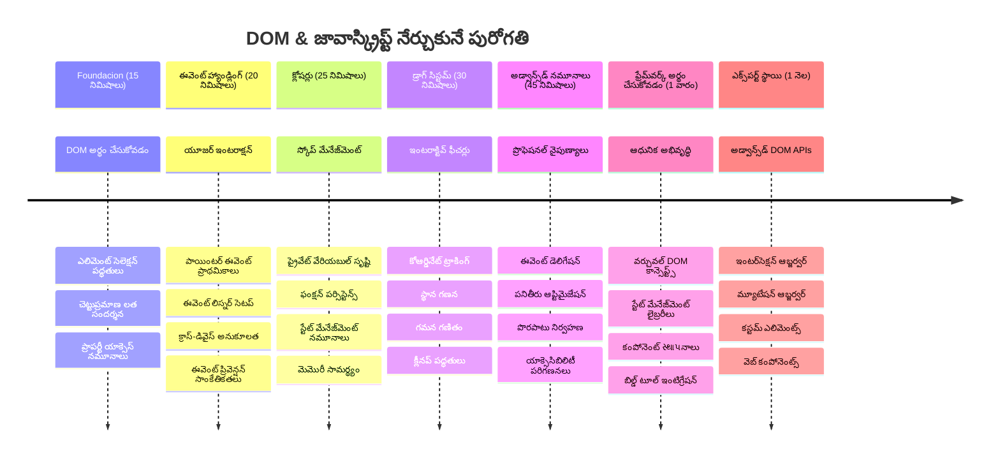
### 🛠️ మీ జావాస్క్రిప్ట్ టూల్‌కిట్ సమ్మరీ

ఈ పాఠం పూర్తి చేసిన తర్వాత, మీ వద్ద ఉన్నాయి:
- **DOM మాస్టరీ**: ఎలిమెంట్ సెలక్షన్, ప్రాపర్టీ మానిప్యులేషన్ మరియు ట్రీ నావిగేషన్
- **ఈవెంట్ నైపుణ్యం**: క్రాస్-డివైస్ ఇంటరాక్షన్ హ్యాండ్లింగ్ pointer ఈవెంట్లతో
- **క్లోశర్ అర్థం చేసుకోడం**: ప్రైవేట్ స్థితి నిర్వహణ మరియు ఫంక్షన్ విశ్రాంతి
- **ఇంటరాక్టివ్ సిస్టమ్స్**: మొదలు నుండి పూర్తి డ్రాగ్-అండ్-డ్రాప్ అమలును
- **పర్ఫార్మెన్స్ అవగాహన**: సరైన ఈవెంట్ క్లీనప్ మరియు మెమొరీ నిర్వహణ
- **ఆధునిక నమూనాలు**: ప్రొఫెషనల్ డెవలప్‌మెంట్ లో ఉపయోగించబడే కోడ్ ఆర్గనైజేషన్ సాంకేతికతలు
- **యూజర్ అనుభవం**: సులభంగా ఉపయోగించగల, ప్రతిస్పందనాత్మక ఇంటర్‌ఫేస్‌లు సృష్టించడం

**ప్రొఫెషనల్ నైపుణ్యాలు పొందినవి**: మీరు కింది సాంకేతికాలుతో ఫీచర్లు నిర్మించారు:
- **ట్రెల్లో/కన్బన్ బోర్డ్స్**: కాలమ్‌ల మధ్య కార్డ్ డ్రాగింగ్
- **ఫైల్ అప్‌లోడ్ సిస్టమ్స్**: డ్రాగ్-అండ్-డ్రాప్ ఫైల్ హ్యాండ్లింగ్
- **ఇమేజ్ గ్యాలరీస్**: ఫోటో అమరిక ఇంటర్‌ఫేస్‌లు
- **మొబైల్ యాప్స్**: టచ్ ఆధారిత ఇంటరాక్షన్ నమూనాలు

**తదుపరి దశ**: మీరు React, Vue లేదా Angular వంటి ఆధునిక ఫ్రేమ్‌వర్క్‌లను అన్వేషించడానికి సిద్ధంగా ఉన్నారు, ఇవి ఈ ప్రాథమిక DOM మానిప్యులేషన్ కాన్సెప్ట్‌లను అభివృద్ధి చేస్తాయి!

## అసైన్‌మెంట్

[డొమ్‌తో కొంచెం అదనంగా పని చేయండి](assignment.md)

---

<!-- CO-OP TRANSLATOR DISCLAIMER START -->
**అస్పృశ్య సూచన**:
ఈ పత్రాన్ని AI అనువాద సేవ [Co-op Translator](https://github.com/Azure/co-op-translator) ఉపయోగించి అనువదించబడింది. మేము ఖచ్చితత్వానికి ప్రయత్నిస్తూనే ఉన్నప్పటికీ, స్వయంచాలక అనువాదాలలో తప్పులు లేదా అసంపూర్ణతలను కలిగివుండవచ్చు. మూల పత్రాన్ని దాని స్థానిక భాషలో అధికారిక మూలంగా తీసుకోవాలి. ముఖ్యమైన సమాచారానికి, వృత్తిపరమైన మానవ అనువాదాన్ని సూచిస్తున్నాము. ఈ అనువాదం ఉపయోగంలో కలిగే అర్థాలు తప్పుదోవలకు మా బాధ్యత ఉంది కాదు.
<!-- CO-OP TRANSLATOR DISCLAIMER END -->