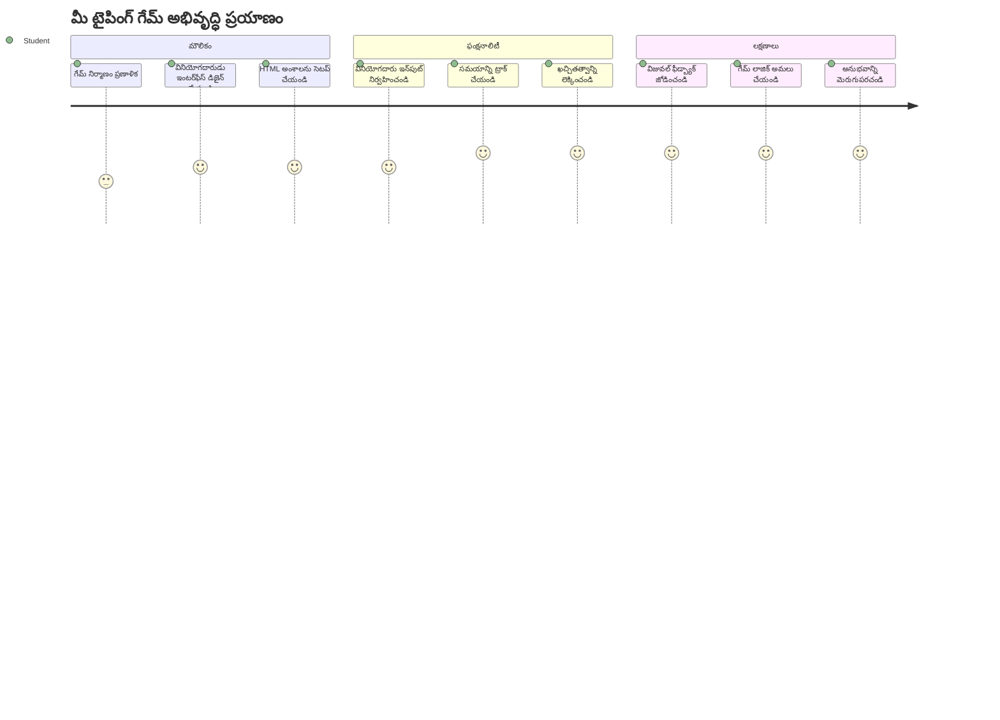
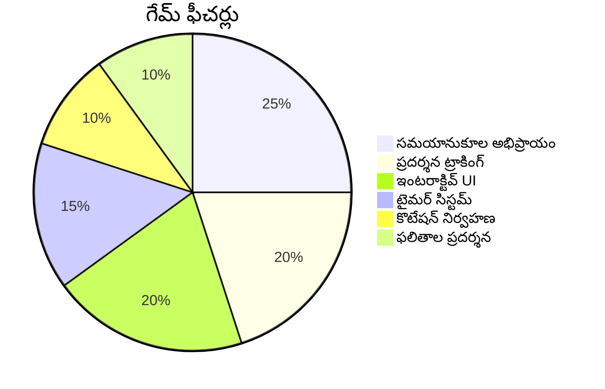
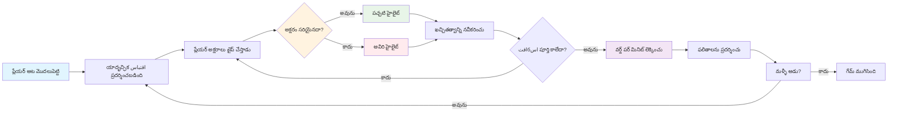
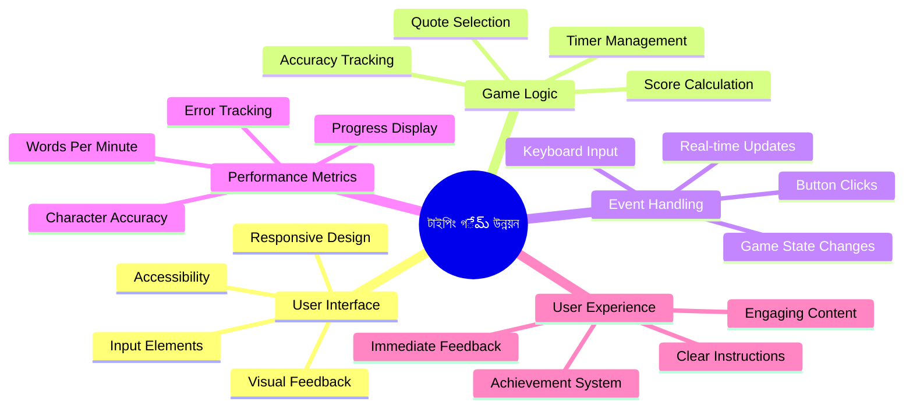
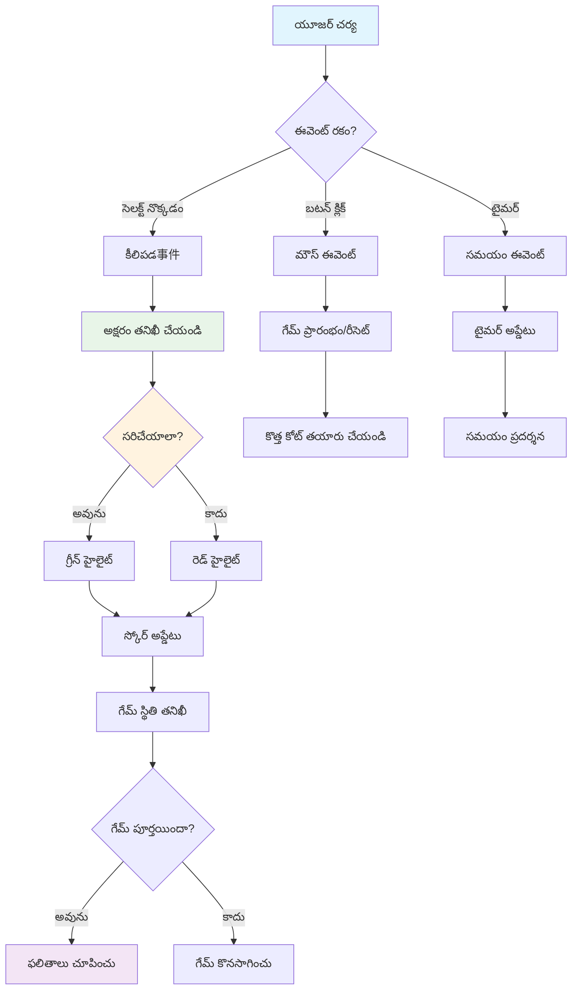
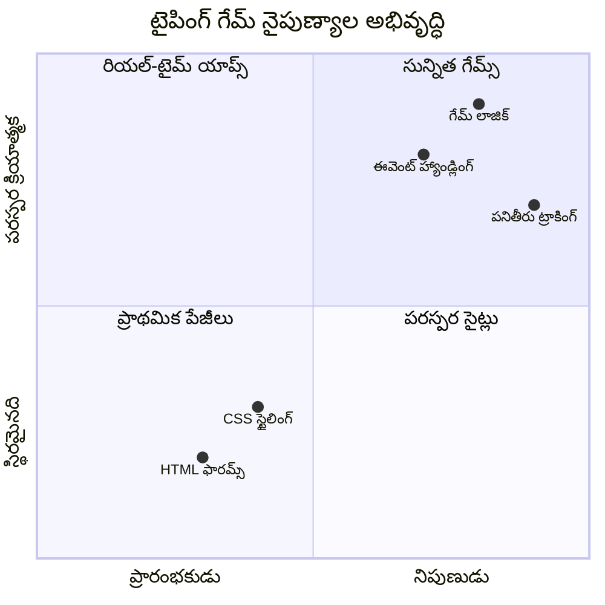
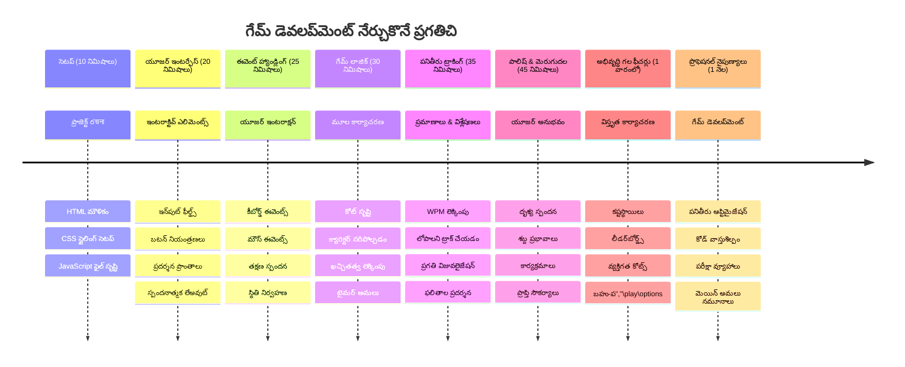

# ఈవెంట్-డ్రివెన్ ప్రోగ్రామింగ్ - ఒక టైపింగ్ గేమ్ తయారు చేయండి

## పరిచయం

ప్రతి డెవలపర్ తెలుసుకున్న కానీ అరుదుగా మాట్లాడే విషయం ఇదే: వేగంగా టైప్ చేయటం ఒక సూపర్ పవర్! 🚀 దీ్ని గురించి ఆలోచించండి - మీరు మీ ఆలోచనలను మెదడుండి మీ కోడ్ ఎడిటర్ వరకు ఎంత వేగంగా తేవగలరో, అంతే మీ సృజనాత్మకత ఎక్కువగా ప్రవహిస్తుంది. ఇది మీ ఆలోచనలు మరియు స్క్రీన్ మధ్య ప్రత్యక్ష పైప్లైన్ లాగా ఉంటుంది.

ఈ నైపుణ్యాన్ని మెరుగుపర్చడానికి ఉత్తమ మార్గాల్లో ఒకటి తెలుసుకోవాలా? మీరు ఊహించినట్టు - మనం ఒక గేమ్ తయారుచేయబోతున్నాము!

> మనం కలిసి ఒక అద్భుతమైన టైపింగ్ గేమ్ సృష్టしましょう!

మీరు నేర్చుకుంటున్న JavaScript, HTML, మరియు CSS నైపుణ్యాలను ఉపయోగించడానికి సిద్ధంగా ఉన్నారా? మనం టైపింగ్ గేమ్ బిల్డ్ చేయబోతున్నాము, ఇది పුරాతన డిటెక్టివ్ [షెర్లాక్ హోమ్స్](https://en.wikipedia.org/wiki/Sherlock_Holmes) నుండి యాదృచ్ఛిక కోట్ లతో మీని సవాలు చేస్తుంది. ఈ గేమ్ మీరు ఎంత వేగంగా మరియు ఖచ్చితత్వంతో టైప్ చేయగలరో ట్రాక్ చేస్తుంది -そして నమ్మండి, ఇది మీరు అనుకున్నదానికంటే ఎక్కువ అలవాటు చేయనిది!

## మీరు తెలుసుకోవలసిందు ఏమిటి

మనం లోతుగా వెళ్లేముందు, మీరు ఈ ఆలోచనలతో సౌకర్యంగా ఉన్నారని నిర్ధారించుకోండి (తక్షణ హవా అవసరం అయితే భయపడకండి - మనందరం అలానే ఉన్నాము!):

- టెక్స్ట్ ఇన్పుట్ మరియు బటన్ నియంత్రణలను సృష్టించడం
- CSS మరియు తరగతుల ద్వారా శైలులను సెట్ చేయడం  
- JavaScript ప్రారంభాలు
  - అర్రే సృష్టించడం
  - యాదృచ్ఛిక సంఖ్యను సృష్టించడం
  - ప్రస్తుత సమయాన్ని పొందడం

ఇవి ఏదైనా కొంచెం మాత్రం నన్నయినట్లయితే, అది బాగానే ఉంది! కొన్ని సార్లు మీ జ్ఞానాన్ని బలపర్చడానికి ఉత్తమ మార్గం ప్రాజెక్టులో చొరబడడం మరియు దారిలో తెలుసుకోవడం.

### 🔄 **పాఠశాలాత్మక తనిఖీ**
**ఆధార మూల్యాంకనం**: అభివృద్ధి ప్రారంభించే ముందు, మీరు ఈ విషయాలను అర్థం చేసుకోవాలి:
- ✅ HTML ఫారమ్స్ మరియు ఇన్పుట్ ఎలిమెంట్లు ఎలా పనిచేస్తాయో
- ✅ CSS తరగతులు మరియు డైనమిక్ స్టైలింగ్
- ✅ JavaScript ఈవెంట్ లిసనర్లు మరియు హ్యాండ్లర్స్
- ✅ అర్రే మానిప్యులేషన్ మరియు యాదృచ్ఛిక ఎంపిక
- ✅ సమయ కొలత మరియు లెక్కలు

**త్వరిత స్వీయ పరీక్ష**: ఈ ఆలోచనలు ఇంటరాక్టివ్ గేమ్ లో ఎలా పనిచేస్తాయో మీరు వివరిస్తుందా?
- **ఈవెంట్లు** వినియోగదారులు ఎలిమెంట్లతో ఇంటరాక్ట్ చేసినప్పుడు ప్రారంభమవుతాయి
- **హ్యాండ్లర్స్** ఆ ఈవెంట్లను ప్రాసెస్ చేసి గేమ్ స్థితిని నవీకరిస్తాయి
- **CSS** వినియోగదారుల చర్యలకు విజువల్ ఫీడ్బ్యాక్ ఇస్తుంది
- **టైమింగ్** పనితీరు కొలత మరియు గేమ్ ప్రగతికి అనుమతిస్తుంది

## మనం ఈ విషయం సృష్టిద్దాం!

[ఈవెంట్ డ్రివెన్ ప్రోగ్రామింగ్ ఉపయోగించి టైపింగ్ గేమ్ సృష్టించడం](./typing-game/README.md)

### ⚡ **తరువాతి 5 నిమిషాల్లో మీరు చేయగలిగేది**
- [ ] మీ బ్రౌజర్ కన్సోల్ తెరిచి, `addEventListener` తో కీబోర్డ్ ఈవెంట్లను వినడం ప్రయత్నించండి
- [ ] ఒక సాదా HTML పేజీ సృష్టించి, ఇన్పుట్ ఫీల్డ్ తో టైపింగ్ గుర్తింపును పరీక్షించండి
- [ ] టైప్ చేసిన టెక్స్ట్ ను లక్ష్య టెక్స్ట్ తో పోల్చి స్ట్రింగ్ మానిప్యులేషన్ పరిపర్యవేక్షణ
- [ ] టైమింగ్ ఫంక్షన్లను అర్థం చేసుకోవడానికి `setTimeout` తో ప్రయోగించండి

### 🎯 **ఈ గంటలో మీరు సాధించగలిగేది**
- [ ] పాఠం తరువాత చేసుకునే క్విజ్ పూర్తి చేసి ఈవెంట్-డ్రివెన్ ప్రోగ్రామింగ్ అర్థం చేసుకోవడం
- [ ] పద ధ్రువీకరణతో టైపింగ్ గేమ్ యొక్క ప్రాథమిక వెర్షన్ నిర్మాణం
- [ ] సరైన మరియు తప్పు టైపింగ్ కోసం విజువల్ ఫీడ్బ్యాక్ జోడించడం
- [ ] వేగం మరియు ఖచ్చితత్వం ఆధారంగా సాధారణ స్కోరింగ్ వ్యవస్థ అమలు
- [ ] మీ గేమ్ దృష్టిని ఆకర్షించేలా CSS తో స్టైలింగ్

### 📅 **మీ వారాంతపు గేమ్ అభివృద్ధి**
- [ ] అన్ని ఫీచర్లతో పూర్తి టైపింగ్ గేమ్ తయారు చేయడం మరియు మెరుగుదల
- [ ] వేరు వేరు పద క్లిష్టతలతో కష్టం స్థాయిలను జోడించడం
- [ ] వినియోగదారుల గణాంకాలు ట్రాకింగ్ (WPM, సమయం తో ఖచ్చితత్వం)
- [ ] మెరుగైన వినియోగదారుల అనుభవం కోసం శబ్ద эффекты మరియు అనిమేషన్స్ సృష్టించడం
- [ ] మీ గేమ్ ను మొబైల్-ప్రతిస్పందకంగా చేసుకోవడం
- [ ] ఆన్‌లైన్‌లో మీ గేమ్‌ను పంచుకోవడం మరియు వినియోగదారుల స్పందన సేకరించడం

### 🌟 **మీ నెల పాటు ఇంటరాక్టివ్ అభివృద్ధి**
- [ ] వేరు వేరు ఇంటరాక్షన్ నమూనాలు ఇన్వెస్టిగేట్ చేసే మల్టిపుల్ గేమ్స్ సృష్టించడం
- [ ] గేమ్ లూప్లు, స్థితి నిర్వహణ, పనితీరు మెరుగుదల గురించి నేర్చుకోవడం
- [ ] ఓపెన్ సార్స్ గేమ్ అభివృద్ధి ప్రాజెక్టులకు సహకారం
- [ ] ప్రగతిషీల టైమింగ్ కాన్సెప్ట్స్ మరియు సజీవ అనిమేషన్లలో నైపుణ్యం పొందడం
- [ ] వివిధ ఇంటరాక్టివ్ అప్లికేషన్లను ప్రదర్శించే పోర్ట్‌ఫోలియో సృష్టించడం
- [ ] గేమ్ అభివృద్ధి మరియు వినియోగదారు ఇంటరాక్షన్ లో ఆసక్తి ఉన్నవారికి మెంటార్‌గా ఉండడం

## 🎯 మీ టైపింగ్ గేమ్ మాస్టరీ టైమ్‌లైన్

### 🛠️ మీ గేమ్ అభివృద్ధి టూల్‌కిట్ సంగ్రహం

ఈ ప్రాజెక్ట్ పూర్తి చేసిన తర్వాత, మీరు నేర్చుకుంటారు:
- **ఈవెంట్-డ్రివెన్ ప్రోగ్రామింగ్**: ఇన్‌పుట్‌కు ప్రతిస్పందించే యూజర్ ఇంటర్‌ఫేస్‌లు
- **రీయల్-టైమ్ ఫీడ్బ్యాక్**: తక్షణ విజువల్ మరియు పనితీరు అప్‌డేట్స్
- **పనితీరు కొలత**: ఖచ్చితమైన టైమింగ్ మరియు స్కోరింగ్ సిస్టమ్‌లు
- **గేమ్ స్థితి నిర్వహణ**: అనువర్తన ప్రవాహం మరియు వినియోగదారుల అనుభవం నియంత్రణ
- **ఇంటరాక్టివ్ డిజైన్**: ఆకట్టుకునే, అలవాటు పెడిచే వినియోగదారు అనుభవాల సృష్టి
- **ఆధునిక వెబ్ APIలు**: బ్రౌజర్ సామర్థ్యాలు వాడుకొని సమృద్ధి గల ఇంటరాక్షన్స్
- **ప్రాప్తి నమూనాలు**: అన్ని వినియోగదారుల కోసం సమానమైన డిజైన్

**వాస్తవ ప్రపంచ అనువర్తనాలు**: ఈ నైపుణ్యాలు ప్రత్యక్షంగా వర్తిస్తాయి:
- **వెబ్ అనువర్తనాలు**: ఏదైనా ఇంటరాక్టివ్ ఇంటర్‌ఫేస్ లేదా డాష్‌బోర్డు
- **విద్యా సాఫ్ట్‌ వేర్**: నేర్చుకునే వేదికలు మరియు నైపుణ్య మూల్యాంకన టూల్‌లు
- **ఉత్పాదకత టూల్‌లు**: టెక్ట్స్ ఎడిటర్లు, IDEలు మరియు సహకార సాఫ్ట్‌వేర్
- **గేమింగ్ పరిశ్రమ**: బ్రౌజర్ గేమ్స్ మరియు ఇంటరాక్టివ్ వినోదం
- **మొబైల్ అభివృద్ధి**: టచ్-ఆధారిత ఇంటర్‌ఫేస్‌లు మరియు ఇశారాలు నిర్వహణ

**తరువాతి స్థాయి**: మీరు అధునాతన గేమ్ ఫ్రేమ్‌వర్క్స్, రియల్-టైమ్ మల్టీ ప్లేయర్ సిస్టమ్స్, లేదా సంక్లిష్ట ఇంటరాక్టివ్ అప్లికేషన్లను అన్వేషించడానికి సిద్ధంగా ఉన్నారు!

## క్రెడిట్స్

♥️ తో రచించారు [Christopher Harrison](http://www.twitter.com/geektrainer)

---

<!-- CO-OP TRANSLATOR DISCLAIMER START -->
**అస్పష్టం**:  
ఈ పత్రాన్ని AI అనువాద సేవ [Co-op Translator](https://github.com/Azure/co-op-translator) ఉపయోగించి అనువదించడం జరిగింది. మేము ఖచ్చితత్వానికి ప్రయత్నించినప్పటికీ, స్వయంచాలక అనువాదాల్లో తప్పులు లేదా అసమర్థతలు ఉండవచ్చు. స్థానిక భాషలో ఉన్న మౌలిక పత్రం అధికారిక మూలంగా పరిగణించాల్సినది. ముఖ్యమైన సమాచారానికి, నిపుణుల మానవ అనువాదం చేయించుకోవడం మంజూరు చేయబడింది. ఈ అనువాదం వాడకం వల్ల ఏర్పడే ఏవైనా అపార్థాలు లేదా తప్పుఅర్థాలు కోసం మేము బాధ్యత వహించము.
<!-- CO-OP TRANSLATOR DISCLAIMER END -->