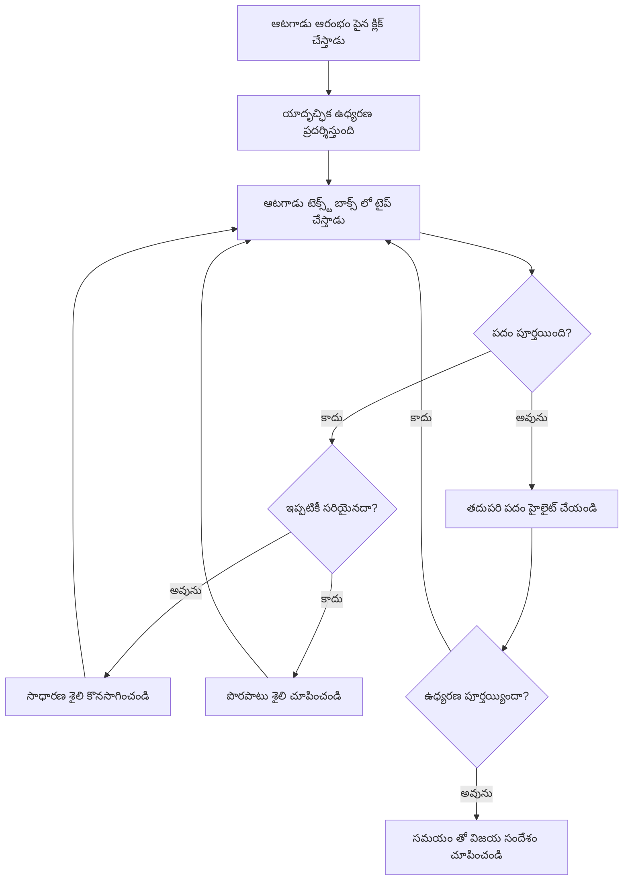
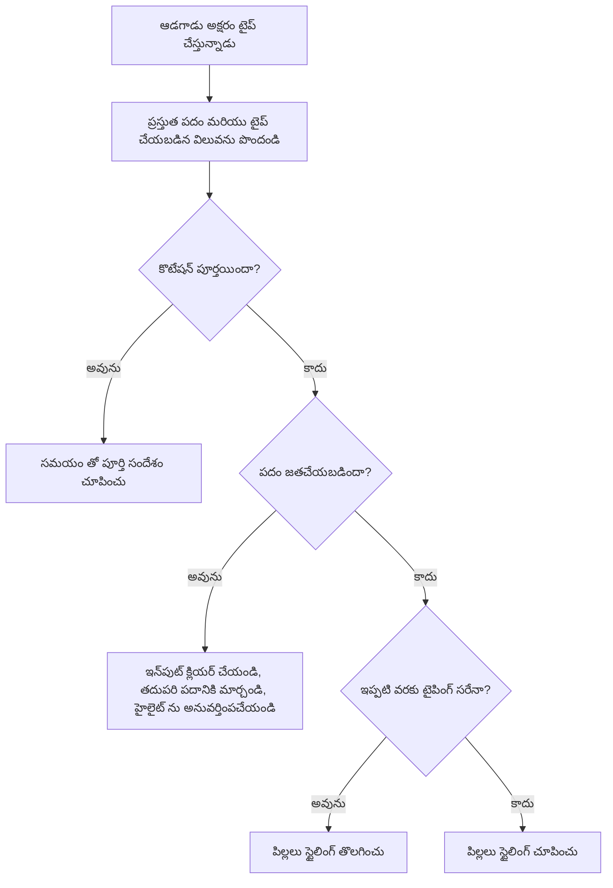
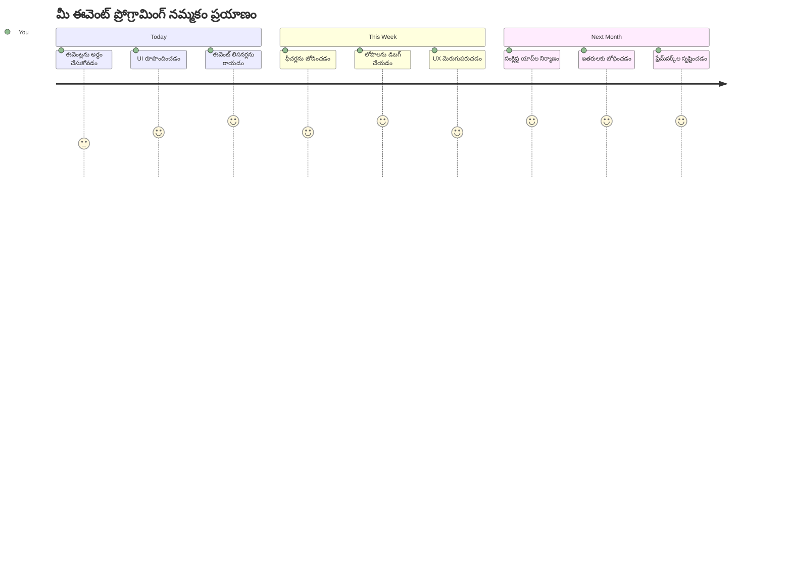

<!--
CO_OP_TRANSLATOR_METADATA:
{
  "original_hash": "da8bc72041a2bb3826a54654ee1a8844",
  "translation_date": "2026-01-08T18:09:43+00:00",
  "source_file": "4-typing-game/typing-game/README.md",
  "language_code": "te"
}
-->
# ఈవెంట్ల ఉపయోగంతో గేమ్ సృష్టించడం

మీరు ఎప్పుడైనా ఆలోచించారా, మీరు బటన్‌పై క్లిక్ చేసినప్పుడు లేదా టెక్స్ట్ బాక్సులో టైపు చేసినప్పుడు వెబ్‌సైట్లు ఎలా తెలుసుకుంటాయో? అది ఈవెంట్-డ్రివెన్ ప్రోగ్రామింగ్ మాయాజాలం! మీరు ప్రతి కీస్ట్రోక్‌‌కు ప్రతిస్పందించే టైపింగ్ స్పీడ్ గేమ్‌ని నిర్మించడం ద్వారా ఈ మూలభూత నైపుణ్యాన్ని నేర్చుకోవటానికి ఇంత మంచి మార్గం ఏమిటి.

మీరు ప్రత్యక్షంగా చూడబోతున్నారు వెబ్ బ్రౌజర్లు మీ జావాస్క్రిప్ట్ కోడ్‌తో "మాట్లాడటం" ఎలా జరుగుతుందో. మీరు ప్రతి సారి క్లిక్ చేసినప్పుడు, టైపు చేసినప్పుడు లేదా మౌస్ సహజీవనం చేసినప్పుడు, బ్రౌజర్ చిన్న సందేశాలు (మేము వాటిని ఈవెంట్లు అని పిలుస్తాం) మీ కోడ్‌కు పంపుతోంది, మీరు ఎలా స్పందించాలో నిర్ణయించుకుంటారు!

మనం ఇక్కడికల్లా వచ్చినప్పుడు, మీరు ఒక నిజమైన టైపింగ్ గేమ్‌ను నిర్మించి ఉంటుంది, అది మీ వేగాన్ని మరియు ఖచ్చితత్వాన్ని ట్రాక్ చేస్తుంది. మరింత ముఖ్యంగా, మీరు ఇప్పటివరకు ఉపయోగించిన ప్రతి ఇంటరాక్టివ్ వెబ్‌సైట్‌ను శక్తివంతం చేసే ప్రాథమిక సంప్రదాయాలను అర్థం చేసుకుంటారు. మొదలు పెట్టుదాం!

## పాఠం మునుపటి ప్రశ్నావళి

[Pre-lecture quiz](https://ff-quizzes.netlify.app/web/quiz/21)

## ఈవెంట్-డ్రివెన్ ప్రోగ్రామింగ్

మీ ఇష్టమైన యాప్ లేదా వెబ్‌సైట్ గురించి ఆలోచించండి - దాన్ని ప్రత్యక్షంగా మరియు స్పందించేలా ఎలా చేస్తుంది? అది మీరు చేసే పనికి అది ఎలా స్పందించడమే ముఖ్యమైనది! ప్రతి ట్యాప్, క్లిక్, స్వైప్ లేదా కీస్ట్రోకు "ఈవెంట్" అని పిలవబడే ఒక ఘటనను సృష్టిస్తుంది, అక్కడ వెబ్ అభివృద్ధి యొక్క నిజమైన మాయాజాలం జరుగుతుంది.

ఇది వెబ్ కోసం ప్రోగ్రామింగ్‌లో ఆసక్తికరంగా 만드는 విషయం ఇది: మనం ఎప్పుడూ ఒకరు ఆ బటన్ పై క్లిక్ చేస్తారో లేదా టెక్స్ట్ బాక్సులో టైపు చేయడం మొదలుపెడతారో తెలియదు. వారు వెంటనే క్లిక్ చేయవచ్చు, అయిదు నిమిషాలు వేచి ఉండవచ్చు, లేకపోతే ఎప్పుడూ క్లిక్ చేయకపోవచ్చు! ఈ అనిశ్చితి మీ కోడ్ ఎలా రాయాలో మనం వేరే రీతిగా ఆలోచించాల్సిన అవసరాన్ని కలిగిస్తుంది.

చెక్కపట్టు ప్రక్రియలాగా పై నుండి కిందికి పనిచేసే కోడ్ రాయడానికే బదులు, మనం ఏదో జరగాలని శాంతంగా ఎదురు చూస్తూ ఉండే కోడ్ రాస్తాము. ఇది 1800లలో టెలిగ్రాఫ్ ఆపరేటర్లు తమ యంత్రాల పక్కన కూర్చొని, వైర్ ద్వారా ఒక సందేశం వచ్చిన వెంటనే స్పందించే రూపాన్ని పోలి ఉంటుంది.

కాబట్టి ఈవెంట్ అనేది ఏమిటి? సరళంగా చెప్పాలంటే, అది ఏదో జరిగినది! మీరు ఒక బటన్ పై క్లిక్ చేసినప్పుడు - అది ఒక ఈవెంట్. మీరు ఒక అక్షరాన్ని టైపు చేసినప్పుడు - అది ఒక ఈవెంట్. మీరు మీ మౌస్‌ను కదిలించినప్పుడు - అది మరో ఈవెంట్.

ఈవెంట్-డ్రివెన్ ప్రోగ్రామింగ్ మనకు కోడ్‌ను వినిపించడానికి మరియు స్పందించడానికి ఏర్పాటుచేసే అవకాశం ఇస్తుంది. మేము **ఈవెంట్ లిసనర్లు** అని పిలవబడే ప్రత్యేక ఫంక్షన్లు సృష్టిస్తాము, అవి నిర్దిష్ట సంఘటన జరుగాలని ఓర్పుగా ఎదురు చూస్తాయి, అవి జరిగితే వెంటనే చర్య తీసుకుంటాయి.

ఈవెంట్ వినికిడి లాంటి వి చూడండి మీ కోడ్ కోసం వేర్‌ద్వారం కలిగి ఉండటం వలె ఉంటుంది. మీరు వేర్‌ద్వారం ఏర్పాటు చేయాలి (`addEventListener()`), మీరు వినటానికి కావలసిన శబ్దం (ఉదాహరణకు 'click' లేదా 'keypress') చెప్పాలి, మరియు దాన్ని ఎవరు కొట్టినప్పుడు (మీ కస్టమ్ ఫంక్షన్) ఏమి జరగాలో నిర్దేశించాలి.

**ఈవెంట్ లిసనర్లు ఎలా పనిచేస్తాయో ఇక్కడ ఉన్నది:**
- **గమనిస్తాయి** వినియోగదారుల ప్రత్యేక చర్యలను, ఉదాహరణకు క్లిక్‌లు, కీస్ట్రోక్స్, లేదా మౌస్ కదలికలు
- **మీ కస్టమ్ కోడ్‌ను అమలు చేస్తాయి** నిర్దిష్ట ఈవెంట్ సంభవించినప్పుడు
- **వినియోగదారుల ఇన్‌టరాక్షన్లకు వెంటనే స్పందిస్తాయి**, నిరాత్రుక अनुभवాన్ని సృష్టిస్తాయి
- **అదే ఎలిమెంట్‌పై బహుళ ఈవెంట్లను** వివిధ లిసనర్లతో నిర్వహిస్తాయి

> **NOTE:** ఈవెంట్ లిసనర్లు సృష్టించడానికి అనేక మార్గాలు ఉన్నాయని చెప్పటం మంచిది. మీరు అనామక ఫంక్షన్లు ఉపయోగించవచ్చు, లేదా పేరున్నవాటి సృష్టించవచ్చు. మీరు వివిధ షార్ట్‌కట్‌లు ఉపయోగించవచ్చు, ఉదాహరణకు `click` ప్రాపర్టీని సెట్ చేయడం, లేదా `addEventListener()` ఉపయోగించడం. మన వ్యాయామంలో మనం `addEventListener()` మరియు అనామక ఫంక్షన్లపై ఫోకస్ చేస్తాము, ఎందుకంటే ఇది వెబ్ డెవలపర్లలో సాధారణంగా ఉపయోగించే పద్ధతి. ఇది కూడా అత్యంత సరళమైనది, ఎందుకంటే `addEventListener()` అన్ని ఈవెంట్లకు పనిచేస్తుంది మరియు ఈవెంట్ పేరు పారామీటర్‌గా ఇవ్వవచ్చు.

### సాధారణ ఈవెంట్లు

వెబ్ బ్రౌజర్లు విన్నేందుకు అనేక రకాల ఈవెంట్లను అందించినప్పటికీ, అతి ఇంటరాక్టివ్ అప్లికేషన్లలో చాలా అవసరమైన ఈవెంట్లపై ఆధారపడి ఉంటాయి. ఈ ప్రధాన ఈవెంట్లను అర్థం చేసుకోవడం మీకు అత్యున్నత వినియోగదారు ఇన్‌టరాక్షన్లను నిర్మించడానికి పునాది ఇస్తుంది.

అప్లికేషన్ సృష్టించే సమయంలో వినియోగదారు చేసే ఏదైనా చర్య ఈవెంట్‌ను రేకెత్తిస్తుంది, దీనితో మీకు కావల్సిన అనుభూతిని అందించడానికి పెద్ద శక్తి దక్కుతుంది. అదృష్టవశాత్తు, మీరు సాధారణంగా కొద్ది ఈవెంట్లన్నింటినీ అవసరం పడతారు. ఇక్కడ కొన్ని సాధారణ ఈవెంట్లు ఉన్నాయి (మా గేమ్ సృష్టించేటప్పుడు ఉపయోగించే రెండు ఈవెంట్లు సహా):

| ఈవెంట్ | వివరణ | సాధారణ ఉపయోగాలు |
|-------|-------------|------------------|
| `click` | వినియోగదారు ఏదైనా ఒకటిపై క్లిక్ చేసింది | బటన్‌లు, లింకులు, ఇంటరాక్టివ్ అంశాలు |
| `contextmenu` | వినియోగదారు కుడి మౌస్ బటన్ క్లిక్ చేసింది | కస్టమ్ కుడి-క్లిక్ మెనూలు |
| `select` | వినియోగదారు కొన్ని టెక్స్ట్ ను హైలైట్ చేశాడు | టెక్స్ట్ సవరణ, కాపీ ఆపరేషన్లు |
| `input` | వినియోగదారు కొంత టెక్స్ట్ అందజేశాడు | ఫాం ప్రమాణీకరణ, రియల్-టైమ్ సెర్చ్ |

**ఈ ఈవెంట్లను అర్థం చేసుకోవడం:**
- **సృష్టిస్తుంది** వినియోగదారులు పేజీ上的 నిర్దిష్ట అంశాలతో సహకరిస్తే
- **సంధిస్తుంది** ఈవెంట్ ఆబ్జెక్ట్ల ద్వారా వినియోగదారుల చర్యలకు సంబంధించిన వివరాలను
- **అనుమతిస్తుంది** ప్రతిస్పందించే, ఇంటరాక్టివ్ వెబ్ అప్లికేషన్లను సృష్టించడానికి
- **ఇప్పటికీ పనిచేస్తుంది** అనేక బ్రౌజర్లు మరియు పరికరాలలో సమానంగా

## గేమ్ సృష్టించడం

ఈవెంట్లు ఎలా పని చేస్తాయో మీరు అర్థం చేసుకున్నందున, ఈ జ్ఞానాన్ని ఉపయోగించి ఒక ఉపయోగకరమైనవి తయారు చేద్దాం. మేము ఈవెంట్ హ్యాండ్లింగ్‌ను చూపించే టైపింగ్ స్పీడ్ గేమ్‌ను సృష్టిస్తాము, ఇది ఒక ముఖ్యమైన డెవలపర్ నైపుణ్యాన్ని అభివృద్ధి చేసేందుకు సహాయపడుతుంది.

మేము జావాస్క్రిప్ట్‌లో ఈవెంట్లు ఎలా పని చేస్తాయో తెలుసుకోవడానికి ఒక గేమ్‌ను సృష్టించబోతున్నాము. మా గేమ్ ఒక ప్లేయర్ టైపింగ్ నైపుణ్యాన్ని పరీక్షిస్తుంది, ఇది అన్ని డెవలపర్లు కలిగి ఉండాల్సిన అత్యంత అణచివేత నైపుణ్యాల్లో ఒకటి. సరదా విషయం: మనం ఈ రోజు ఉపయోగించే QWERTY కీబోర్డు లేఅవుట్ 1870లలో టైపర్‌ల కోసం డిజైన్ చేయబడింది - మరియు మంచి టైపింగ్ నైపుణ్యాలు ఇప్పటికీ ప్రోగ్రామర్‌లకు ఎంతో విలువైనవి! గేమ్ యొక్క సాధారణ ప్రవాహం ఇలా ఉంటుంది:


**మా గేమ్ ఎలా పనిచేస్తుంది:**
- **ప్రారంభమవుతుంది** ప్లేయర్ ప్రారంభ బటన్ క్లిక్ చేసినప్పుడు మరియు ఒక యాదృచ్ఛిక కోట్ ను చూపిస్తుంది
- **ట్రాక్ చేస్తుంది** ప్లేయర్ టైపింగ్ పురోగతిని పదం వారీగా రియల్-టైమ్‌లో
- **హైలైట్ చేస్తుంది** ప్రస్తుత పదాన్ని ప్లేయర్ దృష్టిని మార్గనిర్దేశం చేయడానికి
- **తక్షణ ప్రతిస్పందన అందిస్తుంది** టైపింగ్ లోపాలకు
- **ఎన్నుకుంటుంది** మరియు చూపిస్తుంది మొత్తం సమయం కోట్ పూర్తి అయినప్పుడల్లా

మా గేమ్‌ను నిర్మించుకుందాం, మరియు ఈవెంట్ల గురించి నేర్చుకుందాం!

### ఫైల్ నిర్మాణం

కోడ్ రాయడం మొదలుపెట్టేముందు, మనం వ్యవస్థీకృతంగా ఉండాలి! ప్రారంభం నుండి స్వచ్ఛమైన ఫైల్ నిర్మాణం ఉండటం తర్వాత తలనొప్పులు తగ్గించి, మీ ప్రాజెక్టును మరింత ప్రొఫెషనల్‌గా చేస్తుంది. 😊

మనం మూడు ఫైళ్ళతోనే సరిపోతాం: మా పేజీ నిర్మాణానికి `index.html`, మా గేమ్ లాజిక్ కోసం `script.js`, మరియు అంతా బాగుండేందుకు `style.css`. ఇది ఎక్కువగా వెబ్ని శక్తివంతం చేసే క్లాసిక్ ముగ్గురు!

**కన్సోల్ లేదా టెర్మినల్ విండో ఓపెన్ చేసి ఈ క్రింది కమాండ్లు ఇవ్వడం ద్వారా మీ పనికి కొత్త ఫోల్డర్ సృష్టించండి:**

```bash
# లినక్స్ లేదా మ్యాక్OS
mkdir typing-game && cd typing-game

# విండోస్
md typing-game && cd typing-game
```

**ఈ కమాండ్లు ఏమి చేస్తాయో:**
- **సృష్టిస్తుంది** ఒక కొత్త డైరెక్టరీ పేరుతో `typing-game` మీ ప్రాజెక్ట్ ఫైళ్ళ కోసం
- **దానిలోకి ప్రవేశిస్తుంది** ఆటోమేటీగా నూతనంగా సృష్టించబడిన డైరెక్టరీలోకి
- **సెట్ చేస్తుంది** మీ గేమ్ అభివృద్ధికి స్వచ్ఛమైన వర్క్‌ప్లేస్

**విజువల్ స్టూడియో కోడ్ ఓపెన్ చేయండి:**

```bash
code .
```

**ఈ కమాండ్:**
- **ప్రారంభిస్తుంది** కారెంట్ డైరెక్టరీలో Visual Studio Code ను
- **మీ ప్రాజెక్ట్ ఫోల్డర్‌ను ఎడిటర్ లో తెరవడం**
- **మీకు అవసరమైన అభివృద్ధి ఉపకరణాలను అందిస్తుంది**

**విజువల్ స్టూడియో కోడ్‌లో ఆ ఫోల్డర్‌లో ఈ క్రింది పేర్లతో మూడు ఫైళ్లను జోడించండి:**
- `index.html` - మీ గేమ్ నిర్మాణం మరియు కంటెంట్ కలిపివుంది
- `script.js` - అన్ని గేమ్ లాజిక్ మరియు ఈవెంట్ లిసనర్లను నిర్వహిస్తుంది
- `style.css` - దృశ్య రూపం మరియు శైలీకరణ నిర్వచిస్తుంది

## యూజర్ ఇంటర్‌ఫేస్ను సృష్టించండి

ఇప్పుడు మన గేమ్ చర్య జరుగుతుంది స్థలాన్ని నిర్మిద్దాం! ఇంగ్లీష్‌లో స్పేస్‌షిప్‌కి కంట్రోల్ ప్యానెల్ రూపకల్పన చేయడం లాంటిది - మన ఆటగాళ్లకు అవసరమైన ప్రతిదీ వారి ఆశించిన చోట ఉండటానికి చూసుకోవాలి.

మన గేమ్‌కు ఏది అవసరమో మనం తెలుసుకుందాం. మీరు టైపింగ్ గేమ్ ఆడుతున్నట్లయితే, మీరు స్క్రీన్‌పై ఏమి చూడాలని అనుకొంటారు? మెనూ ఇక్కడ ఉంది:

| UI అంశం | ఉద్దేశ్యం | HTML అంశం |
|------------|---------|-------------|
| Quote Display | టైపు చేయవలసిన టెక్స్ట్ చూపిస్తుంది | `<p>` with `id="quote"` |
| Message Area | స్థితి మరియు విజయ సందేశాలు చూపిస్తుంది | `<p>` with `id="message"` |
| Text Input | ప్లేయర్లు కోట్ టైప్ చేసే విభాగం | `<input>` with `id="typed-value"` |
| Start Button | గేమ్ ప్రారంభిస్తుంది | `<button>` with `id="start"` |

**UI నిర్మాణాన్ని అర్థం చేసుకోవడం:**
- **కంటెంట్‌ను సరైన క్రమంలో** పై నుండి దిగువకు ఏర్పాటు చేస్తుంది
- **అయిడీని** పరికరాలను జావాస్క్రిప్ట్ లక్ష్యం కోసం కేటాయిస్తుంది
- **స్పష్టమైన దృశ్య హైరార్కీ అందిస్తుంది** మెరుగైన వినియోగదారు అనుభవం కోసం
- **సెమాంటిక్ HTML అంశాలను కలిగి ఉంటుంది** అనుభవజ్ఞత్వానికి

ప్రతి ఒక్కదానికి మన JavaScript లో పని చేయడానికి ఐడీలు అవసరం. మేము CSS మరియు JavaScript ఫైళ్ళకు కూడా రిఫరెన్సులు జత చేస్తాము.

`index.html` అనే కొత్త ఫైల్ సృష్టించండి. ఈ క్రింది HTML జత చేయండి:

```html
<!-- inside index.html -->
<html>
<head>
  <title>Typing game</title>
  <link rel="stylesheet" href="style.css">
</head>
<body>
  <h1>Typing game!</h1>
  <p>Practice your typing skills with a quote from Sherlock Holmes. Click **start** to begin!</p>
  <p id="quote"></p> <!-- This will display our quote -->
  <p id="message"></p> <!-- This will display any status messages -->
  <div>
    <input type="text" aria-label="current word" id="typed-value" /> <!-- The textbox for typing -->
    <button type="button" id="start">Start</button> <!-- To start the game -->
  </div>
  <script src="script.js"></script>
</body>
</html>
```

**ఈ HTML నిర్మాణం ఏమి అందిస్తుంది:**
- **శైలీకరణ కోసం** `<head>` లో CSS స్టైల్‌షీట్‌లను లింక్ చేస్తుంది
- **స్పష్టమైన హెడ్డింగ్ మరియు సూచనలు** ఉపయోగదారులకు సృష్టిస్తుంది
- **ఐడీలతో ప్రత్యేకమైన ప్లేస్‌హోల్డర్ ప్యారాగ్రాఫ్‌లు ఏర్పరిచి డైనమిక్ కంటెంట్ కోసం ఉంటుంది**
- **ప్రవేశ ఫీల్డ్‌ను గమనించేందుకు అనువర్తించే లక్షణాలతో జత చేస్తుంది**
- **గేమ్ ప్రారంభించడానికి స్టార్ట్ బటన్ అందిస్తుంది**
- **ఉత్తమ పనితీరుకు జావాస్క్రిప్ట్ ఫైల్‌ను చివరికి లోడ్ చేస్తుంది**

### అప్లికేషన్ ప్రారంభించండి

అభివృద్ధి సమయంలో మీ అప్లికేషన్‌ను తరచుగా పరీక్షించడం, సమస్యలను సత్వరమే గుర్తించటానికి మరియు మీ పురోగతి ప్రత్యక్షంగా చూడటానికి సహాయపడుతుంది. లైవ్ సర్వర్ ఒక విలువైన ఉపకరం, ఇది మీరు చేంజ్ చేసిన ప్రతిసారూ ఆటోమేటిక్‌గా బ్రౌజర్ రిఫ్రెష్ చేస్తుంది, అభివృద్ధిని మరింత సమర్థవంతంగా చేస్తుంది.

విషయాన్ని మీరు ఎలా చూస్తోందో సరి చూసేందుకు అంసగతంగీ అభివృద్ధి చేయడం మంచిది. మన అప్లికేషన్ ప్రారంభిద్దాం. Visual Studio Codeకి ఉన్న అద్భుతమైన ఎక్స్‌టెన్షన్ [Live Server](https://marketplace.visualstudio.com/items?itemName=ritwickdey.LiveServer&WT.mc_id=academic-77807-sagibbon) మీ అప్లికేషన్‌ను స్థానికంగా హోస్ట్ చేస్తుంది మరియు మీరు సేవ్ చేసినప్పుడల్లా బ్రౌజర్‌ను రిఫ్రెష్ చేస్తుంది.

**[Live Server](https://marketplace.visualstudio.com/items?itemName=ritwickdey.LiveServer&WT.mc_id=academic-77807-sagibbon) ను ఇన్‌స్టాల్ చేయడానికి పై లింక్‌పై క్లిక్ చేసి ఇన్‌స్టాల్ క్లిక్ చేయండి:**

**ఇన్‌స్టాలేషన్ సమయంలో ఏం జరుగుతుందో:**
- **మీ బ్రౌజర్ మీరు Visual Studio Codeని తెరవడానికి ప్రాంప్ట్ చేస్తుంది**
- **ఎక్స్‌టెన్షన్ ఇన్‌స్టాలేషన్ ప్రక్రియను పరిచయం చేస్తుంది**
- **సెట్టప్ పూర్తి చేయడానికి Visual Studio Codeను రీస్టార్ట్ చేయాలని అవసరం ఉండవచ్చు**

**ఇన్‌స్టాల్ అయిన తర్వాత, Visual Studio Codeలో Ctrl-Shift-P (లేదా Cmd-Shift-P) నొక్కి కమాండ్ ప్యాలెట్ తెరవండి:**

**కమాండ్ ప్యాలెట్ అర్థం చేసుకోవడం:**
- **VS Codeలో అన్ని కమాండ్లకు త్వరితమైన ప్రవేశాన్ని అందిస్తుంది**
- **మీ టైపు చేసినట్లుగా కమాండ్లను శోధిస్తుంది**
- **త్వరిత అభివృద్ధి కోసం కీబోర్డ్ షార్ట్‌కట్‌లను అందిస్తుంది**

**"Live Server: Open with Live Server" టైపు చేయండి:**

**Live Server దీంట్లో చేయేది:**
- **మీ ప్రాజెక్ట్ కోసం స్థానిక అభివృద్ధి సర్వర్‌ను ప్రారంభిస్తుంది**
- **ఫైళ్లను సేవ్ చేసినప్పుడు బ్రౌజర్‌ను ఆటోమేటిక్‌గా రిఫ్రెష్ చేస్తుంది**
- **ఫైళ్లు స్థానిక URL (సాధారణంగా `localhost:5500`) నుండి అందిస్తుంది**

**బ్రౌజర్ తెరచి `https://localhost:5500` కి వెళ్లండి:**

ఇప్పుడు మీరు సృష్టించిన పేజీ కనబడుతుంది! కొంత ఫంక్షనాలిటీ జోడిద్దాం.

## CSS జోడించండి

ఇప్పుడు దృశ్యరూపాన్ని అందంగా తయారు చేద్దాం! దృశ్య ప్రతిస్పందన యూజర్ ఇంటర్‌ఫేస్లకు కోనియరోజుల నుంచి ముఖ్యమైనది. 1980లలో పరిశోధకులు వెంటనే దృశ్య ప్రతిస్పందన వినియోగదారుల ప్రదర్శనను గణనీయంగా మెరుగుపరిచిందని మరియు లోపాలు తగ్గించిందని తెలుసుకున్నారు. మనం ఇదే పనిచేయించబోతున్నాం.

మన గేమ్ ఏదైన స్పష్టంగా ఉండాలి. ఆటగాళ్లు వెంటనే తనవంటి పదాన్ని టైప్ చేయాలని తెలిసేలా ఉండాలి, తప్పు చేసినట్లయితే అది వెంటనే కనిపించాలి. కొంచెం సరళమైన కానీ సమర్థవంతమైన స్టైలింగ్ ని చేద్దాం:

`style.css` అనే కొత్త ఫైల్ సృష్టించి ఈ క్రింది సింటాక్స్ జత చేయండి.

```css
/* inside style.css */
.highlight {
  background-color: yellow;
}

.error {
  background-color: lightcoral;
  border: red;
}
```

**ఈ CSS క్లాసులను అర్థం చేసుకోవడం:**
- **ప్రస్తుతం ఉన్న పదాన్ని పసుపు నేపథ్యంతో హైలైట్ చేస్తుంది** స్పష్టమైన దృశ్య మార్గనిర్దేశానికి
- **టైపింగ్ లోపాలను కొరల్ వెలిగిపోయిన నేపథ్య రంగుతో సూచిస్తుంది**
- **ద్రుత ప్రతిస్పందన అందిస్తుంది** వినియోగదారు టైపింగ్ ప్రవాహాన్ని అంతరాయపడకుండా
- **మార్పు రంగులు ఉపయోగించి** అనుకూలత మరియు స్పష్టమైన దృశ్య కమ్యునికేషన్ ని కలిగి ఉంటుంది

✅ CSS విషయానికి వస్తే, మీరు మీ పేజీని మీ ఇష్టంగా అమర్చుకోవచ్చు. కొంత సమయం తీసుకుని పేజీ చూడటానికి మరింత ఆకర్షణీయంగా రూపొందించండి:

- వేరే ఫాంట్ ఎంచుకోండి
- హెడ్డర్లకు రంగులు జోడించండి
- అంశాలు పరిమాణం మార్చండి

## జావాస్క్రిప్ట్

ఇక్కడ విషయాలు ఆసక్తికరంగా మారతాయి! 🎉 మనకు HTML నిర్మాణం మరియు CSS శైలీకరణ ఉన్నాయి, కానీ ప్రస్తుతం మన గేమ్ ఇంజిన్ లేని అందమైన కారు లాంటిది. జావాస్క్రిప్ట్ ఆ ఇంజినే అవుతుంది - ఇది అన్ని పని చేయించేది మరియు ఆటగాళ్లు చేసే పనికి స్పందిస్తుంది.

ఇక్కడ మీ సృష్టి జీవించబోతుంది. మనం దశల వారీగా ముందుకువెళ్తాము కాబట్టి ఏదీ బరువు లాంటిది అనిపించదు:

| దశ | ఉద్దేశ్యం | మీరు నేర్చుకునేది |
|------|---------|------------------|
| [స్థిరాలు సృష్టించండి](../../../../4-typing-game/typing-game) | కోట్‌లు మరియు DOM సూచనలు సెట్ చేయండి | వేరియబుల్ నిర్వహణ మరియు DOM ఎంపిక |
| [గేమ్ ప్రారంభానికి ఈవెంట్ లిసనర్](../../../../4-typing-game/typing-game) | గేమ్ ప్రారంభాన్ని నిర్వహించండి | ఈవెంట్ హ్యాండ్లింగ్ మరియు UI నవీకరణలు |
| [టైపింగ్‌కు ఈవెంట్ లిసనర్](../../../../4-typing-game/typing-game) | వినియోగదారుల ఇన్‌పుట్‌ను రియల్-టైమ్‌లో ప్రాసెస్ చేయండి | ఇన్‌పుట్ నిర్ధారణ మరియు డైనమిక్ ప్రతిస్పందన |

**ఈ నిర్మిత విధానం మీకు సహాయపడుతుంది:**
- **మీ కోడ్‌ను తార్కికమైన, నిర్వహించదగిన విభాగాలుగా ఆర్గనైజ్ చేయండి**
- **లాజిక్‌ను పద్ధతిగా నిర్మించి డీబగ్గింగ్ సులభతరం చేయండి**
- **మీ అప్లికేషన్ వేర్వేరు భాగాలు ఎలా కలిసి పని చేస్తాయో అర్థం చేసుకోండి**
- **భవిష్యత్ ప్రాజెక్టుల కోసం పునరుపయోగ సాధనాలు సృష్టించండి**

కాని మొదట, `script.js` అనే కొత్త ఫైల్ సృష్టించండి.

### స్థిరాలను జోడించండి

చర్యలోకి దిగక ముందు మన వనరులను సేకరించుదాం! NASA మిషన్ కంట్రోల్ లా ఇయంతీ మానిటరింగ్ సిస్టమ్స్ అన్ని ప్రారంభించడానికి ముందు సక్రియపరుస్తారు, మనకు కూడా ప్రతిదీ సిద్ధంగా ఉండటం సరళం అవుతుంది. ఇది తర్వాత వస్తువుల కోసం తిరగొచ్చే పనిని తగ్గిస్తుంది మరియు టైపోలను నివారిస్తుంది.

ముందుగా మనం సెట్ చేసుకోవాలి:

| డేటా రకం | ఉద్దేశ్యం | ఉదాహరణ |
|-----------|---------|--------|
| اقتباسల శ్రేణి | ఆటకు అన్ని సాధ్యమైన اقتباسల ను నిల్వ చేయండి | `['Quote 1', 'Quote 2', ...]` |
| పదాల శ్రేణి | ప్రస్తుత اقتبాసును వ్యక్తిగత పదాలుగా విభజించండి | `['When', 'you', 'have', ...]` |
| పద సూచిక | ఆటగాడు ఎన్ని పదాలను టైప్ చేస్తున్నాడో ట్రాక్ చేయండి | `0, 1, 2, 3...` |
| ప్రారంభ సమయం | స్కోరింగ్ కోసం గడిచిన సమయాన్ని లెక్కించండి | `Date.now()` |

**మేము మా UI అంశాలకు సూచనలూ అవసరం:**
| అంశం | ID | ప్రయోజనం |
|---------|----|---------|
| వచన ఇన్‌పుట్ | `typed-value` | ఆటగాళ్లు టైప్ చేసే ప్రదేశం |
| اقتبాస ప్రదర్శన | `quote` | టైప్ చేయాల్సిన اقتبాసును చూపిస్తుంది |
| సందేశ ప్రాంతం | `message` | స్థితి నవీకరణలు చూపిస్తుంది |

```javascript
// script.js లో
// మన సర్వ కోట్స్
const quotes = [
    'When you have eliminated the impossible, whatever remains, however improbable, must be the truth.',
    'There is nothing more deceptive than an obvious fact.',
    'I ought to know by this time that when a fact appears to be opposed to a long train of deductions it invariably proves to be capable of bearing some other interpretation.',
    'I never make exceptions. An exception disproves the rule.',
    'What one man can invent another can discover.',
    'Nothing clears up a case so much as stating it to another person.',
    'Education never ends, Watson. It is a series of lessons, with the greatest for the last.',
];
// పదాల జాబితాను మరియు ప్లేయర్ ప్రస్తుతం టైప్ చేస్తున్న పదం సూచికను నిల్వచేయండి
let words = [];
let wordIndex = 0;
// ప్రారంభ సమయం
let startTime = Date.now();
// పేజీ అంశాలు
const quoteElement = document.getElementById('quote');
const messageElement = document.getElementById('message');
const typedValueElement = document.getElementById('typed-value');
```

**ఈ సెటప్ కోడ్ ఏం చేస్తుందో విశ్లేషణ:**
- **ఉంచుతుంది** షెర్లాక్ హోల్మ్స్ اقتبాసల శ్రేణి `const` తో ఎందుకంటే اقتبాసలు మారవు
- **ప్రారంభిస్తుంది** ట్రాకింగ్ చరాలు `let` తో ఎందుకంటే ఆట సమయంలో విలువలు మారుతాయి
- **తీసుకోవడo** DOM అంశాల సూచనలను `document.getElementById()` తో సమర్థవంతమైన ప్రాప్తికి
- **సెట్ చేస్తుంది** ఆట అన్ని ఫంక్షనల్ కోసం స్పష్టమైన, వివరణాత్మక చరాలతో
- **సంగ్రహిస్తుంది** సంబంధిత డేటాను మరియు అంశాలను సગౌరవంగా సులభ నిర్వహణ కోసం

✅ మీరు మీ ఆటకు ఇంకా ఎక్కువ اقتبాసలు జోడించండి

> 💡 **ప్రో టిప్**: కోడ్‌లో ఎప్పుడైనా `document.getElementById()` తో అంశాలను పొందవచ్చు. ఎందుకంటే మనం ఈ అంశాలపై తరచుగా సూచిస్తాము కాబట్టి లిఖిత లోపాల నుంచి తప్పించుకోవడానికి స్థిరచారాలు ఉపయోగించాలి. [Vue.js](https://vuejs.org/) లేదా [React](https://reactjs.org/) వంటి ఫ్రేమ్‌వర్క్‌లు మీ కోడ్‌ను సక్రమంగా నిర్వహించడానికి సహాయపడతాయి.
>
**ఈ విధానం ఎందుకు బాగా పని చేస్తుంది:**
- **తప్పుల్ని నివారిస్తుంది** పదం తప్పులని పదాన్ని తరచూ సూచించినపుడు
- **మెరుగుపరుస్తుంది** కోడ్ పఠనీయతను వివరణాత్మక స్థిరచారాలతో
- **ప్రముఖ IDE మద్దతు ఇస్తుంది** ఆటో కంప్లీట్ అండ్ పొరపాటు పరిక్షణతో
- **సులభంగా మార్చడం** ఉంటే ఎలిమెంట్ ID మారితే

`const`, `let` మరియు `var` పై వీడియోను కొంత సేపు చూడండి

[](https://youtube.com/watch?v=JNIXfGiDWM8 "చరాల రకాల")

> 🎥 వేరియబుల్స్ గురించి వీడియో కోసం పై చిత్రం క్లిక్ చేయండి.

### ప్రారంభ లాజిక్ జోడించండి

ఇక్కడనే ప్రతిదీ సరిపోతుంది! 🚀 మీరు మీ మొదటి నిజమైన ఈవెంట్ లిసనర్ని రాయబోతున్నారు, మరియు బటన్ క్లిక్ కి మీ కోడ్ స్పందించడం చూడటం చాలా సంతృప్తికరం.

ఆలోచించండి: ఎక్కడో ఒక ఆటగాడు ఆ "ప్రారంభం" బటన్‌ను క్లిక్ చేస్తాడు, మరియు మీ కోడ్ వారి కోసం సిద్ధంగా ఉండాలి. వారు ఎప్పుడు క్లిక్ చేస్తారో తెలియదు — వెంటనే కావచ్చు, లేదా కాఫీ తీసుకొని తర్వాత కావచ్చు — కానీ క్లిక్ చేసిన సమయంపై మీ ఆట చైతన్యానికి వస్తుంది.

వినియోగదారు `start` క్లిక్ చేసినప్పుడు, ఒక اقتبాసు ఎంచుకోవాలి, UI సెట్ చేయాలి, ప్రస్తుత పదాన్ని మరియు సమయాన్ని ట్రాక్ చేయడానికి సెట్ చేయాలి. దిగువ JavaScript మీరు జోడించాల్సినది; స్క్రిప్ట్ బ్లాక్ తర్వాత దీన్ని చర్చిస్తాము.

```javascript
// script.js చివరలో
document.getElementById('start').addEventListener('click', () => {
  // ఒక కోట్ పొందండి
  const quoteIndex = Math.floor(Math.random() * quotes.length);
  const quote = quotes[quoteIndex];
  // కోట్ను పదాల సరసన పెట్టండి
  words = quote.split(' ');
  // ట్రాకింగ్ కోసం పద సూచికను రీసెట్ చేయండి
  wordIndex = 0;

  // UI నవీకరణలు
  // క్లాస్ సెట్ చేయడానికి span ఎలిమెంట్ల సరసన సృష్టించండి
  const spanWords = words.map(function(word) { return `<span>${word} </span>`});
  // స్ట్రింగ్‌గా మార్చి quote డిస్ప్లేకి innerHTMLగా సెట్ చేయండి
  quoteElement.innerHTML = spanWords.join('');
  // మొదటి పదాన్ని హైలైట్ చేయండి
  quoteElement.childNodes[0].className = 'highlight';
  // పూర్వ సందేశాలను క్లియర్ చేయండి
  messageElement.innerText = '';

  // టెక్స్ట్‌బాక్స్‌ను సెట్ చేయండి
  // టెక్స్ట్‌బాక్స్‌ను క్లియర్ చేయండి
  typedValueElement.value = '';
  // ఫోకస్ సెట్ చేయండి
  typedValueElement.focus();
  // ఈవెంట్ హ్యాండ్లర్ సెట్ చేయండి

  // టైమర్ ప్రారంభించండి
  startTime = new Date().getTime();
});
```

**కోడ్‌ను తార్కిక విభాగాలుగా విభజిద్దాం:**

**📊 పద ట్రాకింగ్ సెటప్:**
- **ఎంచుకుంటుంది** వేరొక اقتبాసు `Math.floor()` మరియు `Math.random()` తో వివిధంగా ఉండేందుకు
- **మారుస్తుంది** اقتبాసును వ్యక్తిగత పదాల శ్రేణిగా `split(' ')` తో
- **తిరిగి సెట్ చేస్తుంది** `wordIndex` ను 0 గా ఎందుకంటే ఆటగాళ్లు మొదటి పదం నుండి ప్రారంభిస్తారు
- **సన్నద్ధం చేస్తుంది** ఆట స్థితిని తాజా రౌండ్ కోసం

**🎨 UI సెటప్ మరియు ప్రదర్శన:**
- **తయారుచేస్తుంది** `<span>` అంశాల శ్రేణిని, ప్రతి పదం ప్రత్యేక శైలీకరణ కోసం చుట్టడం
- **జోడిస్తుంది** span అంశాలను ఒంటి స్ట్రింగ్‌గా సమర్థవంతమైన DOM నవీకరణకు
- **ప్రధానపదాన్ని హైలైట్ చేస్తుంది** `highlight` CSS తరగతిని జోడించడం ద్వారా
- **తెలివిగా ముందటి సందేశాలను ఖాళీ చేస్తుంది** శుభ్రమైన స్థలాన్ని అందించడానికి

**⌨️ టెక్స్ట్ బాక్స్ సిద్ధం:**
- **తొలుత ఉన్న టెక్స్ట్ ను ఖాళీ చేస్తుంది** ఇన్‌పుట్ ఫీల్డ్‌లో
- **ఫోకస్ సెట్ చేస్తుంది** ఆటగాళ్లు వెంటనే టైప్ చేయడం ప్రారంభించడానికి
- **ఇన్‌పుట్ ప్రాంతాన్ని సిద్ధం చేస్తుంది** కొత్త ఆట సెషన్ కోసం

**⏱️ టైమర్ ప్రారంభం:**
- **ప్రస్తుతం సమయాన్ని పొందుతుంది** `new Date().getTime()` తో
- **సరైన టైపింగ్ వేగం మరియు పూర్తిచేసిన సమయం లెక్కింపును ప్రారంభిస్తుంది**
- **ఆట శకం పనితీరు ట్రాకింగ్ ప్రారంభం**

### టైపింగ్ లాజిక్ జోడించండి

ఇక్కడే మన ఆట మూలాన్ని తాకబోతూ ఉన్నాం! మొదటికి ఇది చాలా లాంటిదిగా అనిపించినా బాధ పడకండి — ప్రతి భాగం నాకు అడిగితే క్లుప్తంగా, చివరికి మీరు దీన్ని ఎంత తార్కికంగా ఉందో చూడగలరు.

మనం ఇక్కడ చేస్తున్నది చాలా సున్నితమైన పనీ: ప్రతి ఒక్కసారి ఒక అక్షరాన్ని టైప్ చేస్తే, మన కోడ్ అది ఏమిటీ అనేది చూడాలి, వారిని ఫీడ్బ్యాక్ ఇవ్వాలి, తరువాత ఏమి జరగాలో నిర్ణయించాలి. ఇది 1970లలో WordStar వంటి మొదటి పదం ప్రాసెసర్‌లతో సాదృశ్యం కలిగి ఉంటుంది.

```javascript
// script.js చివరలో
typedValueElement.addEventListener('input', () => {
  // ప్రస్తుత పదాన్ని పొందండి
  const currentWord = words[wordIndex];
  // ప్రస్తుత విలువను పొందండి
  const typedValue = typedValueElement.value;

  if (typedValue === currentWord && wordIndex === words.length - 1) {
    // వాక్య చివరం
    // విజయాన్ని ప్రదర్శించండి
    const elapsedTime = new Date().getTime() - startTime;
    const message = `CONGRATULATIONS! You finished in ${elapsedTime / 1000} seconds.`;
    messageElement.innerText = message;
  } else if (typedValue.endsWith(' ') && typedValue.trim() === currentWord) {
    // పదం ముగింపు
    // కొత్త పదం కోసం typedValueElement ను క్లియర్ చేయండి
    typedValueElement.value = '';
    // తదుపరి పదానికి సాగండి
    wordIndex++;
    // కోట్‌లోని అన్నీ ఎలిమెంట్ల కోసం క్లాస్ పేరు రీసెట్ చేయండి
    for (const wordElement of quoteElement.childNodes) {
      wordElement.className = '';
    }
    // కొత్త పదాన్ని హైలైట్ చేయండి
    quoteElement.childNodes[wordIndex].className = 'highlight';
  } else if (currentWord.startsWith(typedValue)) {
    // ప్రస్తుతానికి సరైనది
    // తదుపరి పదాన్ని హైలైట్ చేయండి
    typedValueElement.className = '';
  } else {
    // లోప పరిస్థితి
    typedValueElement.className = 'error';
  }
});
```

**టైపింగ్ లాజిక్ ప్రవాహం గురించి అవగాహన:**

ఈ ఫంక్షన్ వాటర్‌ఫాల్ విధానం ఉపయోగించి, అత్యంత ప్రత్యేకమైన పరిస్థితి నుండి అత్యంత సాధారణ పరిస్థితి వరకు తనిఖీలు చేస్తుంది. ప్రతీ సన్నివేశాన్ని విభజిద్దాం:


**🏁 اقتبాసు పూర్తయింది (సన్నివేశం 1):**
- **తనిఖీ చేస్తుంది** టైపైన విలువ ప్రస్తుత పదంతో సరిపోతుందా మరియు మనం చివరి పదాన ఉన్నామో
- **గణన చేస్తుంది** గడిచిన సమయాన్ని ప్రారంభ సమయం నించి ప్రస్తుత సమయం తక్కువ చేయడం ద్వారా
- **మిల్లిసెకండ్లను సెకన్లలోకి మార్చుతుంది** 1,000తో భాగించి
- **గుర్తింపు సందేశాన్ని చూపిస్తుంది** పూర్తయిన సమయంతో

**✅ పదం పూర్తయింది (సన్నివేశం 2):**
- **అందుకుంటుంది** పదం పూర్తి వలన ఇన్‌పుట్ చివరకు ఒక స్పేస్ ఉన్నప్పుడు
- **సరైనదని ధృవీకరించడం** ట్రిమ్ చేసిన ఇన్‌పుట్ ప్రస్తుత పదంతో ఖచ్చితంగా సరిపోతుందా
- **ఖాళీ చేస్తుంది** ఇన్‌పుట్ ఫీల్డ్ తదుపరి పదం కోసం
- **ముందుకు సాగుతుంది** తదుపరి పదానికి `wordIndex` పెంచడం ద్వారా
- **ప్రదర్శన మార్చుతుంది** అన్ని తరగతులు తీసివేసి కొత్త పదాన్ని హైలైట్ చేస్తుంది

**📝 టైపింగ్ కొనసాగుతోంది (సన్నివేశం 3):**
- **నిర్ధారిస్తుంది** ప్రస్తుత పదం ఇప్పటి వరకు టైప్ చేసిన అంగాలతో మొదలవుతుందా
- **తప్పు శైలిని తీసివేస్తుంది** ఇన్‌పుట్ సరైనదని చూపించడానికి
- **అడుగు కొనసాగుతుంది** అవసరంలేకుండా టైపింగ్ కొనసాగించడానికి

**❌ లోపం స్థితి (సన్నివేశం 4):**
- **రెండు స్ధాపిస్తుంది** టైప్ చేసిన పాఠం అంచనా వెనుకబడితే పాఠం తప్పు అంటే
- **లోపం CSS తరగతిని వేసే** తక్షణ దృష్టాంతపు ఫీడ్బ్యాక్ ఇవ్వడానికి
- **ఆటగాళ్లకు సహాయం** తప్పులను త్వరగా గుర్తించి సరిచేయడానికి

## మీ అప్లికేషన్‌ని పరీక్షించండి

మీరు చేసిన పని చూడండి! 🎉 మీరు ఈవెంట్-నిర్దేశిత ప్రోగ్రామింగ్ ఉపయోగించి నిజమైన టైపింగ్ ఆటను నిర్మించారు. దీన్ని గుర్తుచేసుకోండి - ఇది చిన్న పని కాదు!

ఇప్పుడు పరీక్షించే దశ! ఇది కోరినట్లుగా పనిచేస్తుందా? ఏదైనా మిస్ అయినదా? సాధారణ విషయం ఏమంటే: ఏదైనా తక్షణమే సరైన పని చేయకపోతే, ఇది సహజం. అనుభవజ్ఞులైన డెవలపర్లు కూడా తరచూ బగ్గాలను కనుగొంటారు. ఇది అభివృద్ధి ప్రక్రియలో భాగం!

`start` క్లిక్ చేసి టైపు చేయడం ప్రారంభించండి! కింద అచ్చైన అనిమేషన్ లాగా ఉండాలి.


**మీ అప్లికేషన్‌లో ఏమి పరీక్షించాలి:**
- **ధృవీకరిస్తుంది** 'Start' క్లిక్ చేస్తున్నప్పుడు యాదృచ్ఛిక اقتبాస ప్రదర్శన జరుగుతుందా
- **నిర్ధారిస్తుంది** టైపింగ్ ప్రస్తుత పదాన్ని సరైన రీతిలో హైలైట్ చేస్తుందా
- **తనిఖీ చేస్తుంది** తప్పు టైపింగ్ ఉన్నప్పుడు లోపం శైలి కనిపిస్తుందా
- **ఖచ్చితంగా నిలబెట్టి** పదాలు పూర్తయినప్పుడు హైలైట్ సరైన వివరంగా మారుతుందా
- **పరీక్షిస్తుంది** اقتبాసు పూర్తయినప్పుడు పూర్తి సందేశం మరియు సమయం చూపుతుందా

**సాధారణ డీబగ్గింగ్ సూచనలు:**
- **బ్రౌజర్ కన్సోల్** (F12) లో JavaScript లోపాలు చూడండి
- **ఫైల్ పేర్లు** పూర్తిగా సరిపోతున్నాయో చూసుకోండి (కేస్-సెన్సిటివ్)
- **Live Server** నడుస్తున్నదని మరియు రిఫ్రెష్ అవుతుందనేది ధృవీకరించండి
- **వేరే اقتبాస్లు ప్రయత్నించి** యాదృచ్ఛిక ఎంచుకునే అంశం పనిచేస్తుందా చూసుకోండి

---

## GitHub Copilot ఏజెంట్ చాలెంజ్ 🎮

ఏజెంట్ మోడ్ ఉపయోగించి ఈ కింది చాలెంజ్ పూర్తి చేయండి:

**వివరణ:** ఆటగాడి పనితీరు ఆధారంగా ఆట దృఢత్వాన్ని సర్దుబాటు చేసే కఠినత్వం వ్యవస్థను అభివృద్ధి చేయాలి. ఈ చాలెంజ్ ఆధునిక ఈవెంట్ హ్యాండ్లింగ్, డేటా విశ్లేషణ మరియు డైనమిక్ UI నవీకరణలను అభ్యాసం చేస్తుంది.

**ప్రాంప్ట్:** టైపింగ్ ఆటకి కఠినత్వం సర్దుబాటు వ్యవస్థ సృష్టించండి:
1. ఆటగాడి టైపింగ్ వేగం (_words per minute_) మరియు ఖచ్చితత్వ శాతం ట్రాక్ చేస్తుంది
2. ఆటను మూడు కఠినత్వ స్థాయిలకు సవరించాలి: సులభం (సరళమైన اقتبాస్లు), మధ్యస్థ (ప్రస్తుత اقتبాస్లు), కఠినమైనది (పంక్చువేషన్‌తో క్లిష్ట اقتبాస్లు)
3. ప్రస్తుత కఠినత్వ స్థాయి మరియు ఆటగాడి గణాంకాలు UIపై ప్రదర్శించాలి
4. 3 క్రమం తప్పకుండా మంచి ప్రదర్శనల తర్వాత కఠినత్వం పెంచే స്ട్రీక్ కౌంటర్ అమలు చేయాలి
5. కఠినత్వ మార్పులను సూచించడానికి దృశ్య ఫీడ్బ్యాక్ (రంగులు, అనిమేషన్లు) జోడించండి

ఈ ఫీచర్ అమలుకు అవసరమైన HTML అంశాలు, CSS శైలులు, JavaScript ఫังก్షన్లను చేర్చండి. సరైన లోపాల నిర్వహణను జోడించి, ARIA లేబుల్స్‌తో ఆట సులభంగా ఉండేలా చూసుకోండి.

[agent mode](https://code.visualstudio.com/blogs/2025/02/24/introducing-copilot-agent-mode) గురించి మరింత తెలుసుకోండి.

## 🚀 చాలెంజ్

మీ టైపింగ్ ఆటను మరింత మెరుగుపరచటానికి సిద్ధంగా ఉన్నారా? ఈ ఆధునిక లక్షణాలను ఉపయోగించి ఈవెంట్ హ్యాండ్లింగ్ మరియు DOM మేనేజ్మెంట్ లో మీ అవగాహనను పెంచండి:

**ఇంకా ఫంక్షనాలిటీ జోడించండి:**

| లక్షణం | వివరణ | మీరు సాధించబోయే నైపుణ్యాలు |
|---------|-------------|------------------------|
| **ఇన్‌పుట్ నియంత్రణ** | పూర్తయినప్పుడు `input` ఈవెంట్ లిసనర్ ని నిలిపివేయండి, బటన్ క్లిక్ చేస్తే తిరిగి ప్రారంభించండి | ఈవెంట్ నిర్వహణ మరియు స్థితి నియంత్రణ |
| **UI స్థితి నిర్వహణ** | ఆటగాడు اقتبాసు పూర్తిచేసినప్పుడు టెక్స్ట్బాక్స్ ని డిసేబుల్ చేయండి | DOM ప్రాపర్టీ మేనేజ్మెంట్ |
| **మోడల్ డైలాగ్** | విజయ సందేశంతో మోడల్ డైలాగ్ బాక్స్ చూపించండి | ఆధునిక UI నమూనాలు మరియు సులభత |
| **హై స్కోరు సిస్టమ్** | `localStorage` ఉపయోగించి హై స్కోర్లు నిల్వ చేయండి | బ్రౌజర్ నిల్వ APIs మరియు డేటా కొనసాగింపు |

**అమలులో సూచనలు:**
- **కొంచెం అన్వేషించండి** `localStorage.setItem()` మరియు `localStorage.getItem()` గురించి స్థిర నిల్వ కొరకు
- **ప్రాక్టీస్ చేయండి** ఈవెంట్ లిసనర్లని గమనించి జోడించడం మరియు తీసివేత
- **HTML డైలాగ్ ఎలిమెంట్లు లేదా CSS మోడల్ నమూనాలను** అన్వేషించండి
- **ఫారమ్ నియంత్రణలను డిసేబుల్ / ఎనేబుల్ చేసే సమయాల్లో సులభత‌ను** పరిగణించండి

## పోస్ట్-లెక్చర్ క్విజ్

[Post-lecture quiz](https://ff-quizzes.netlify.app/web/quiz/22)

---

## 🚀 మీ టైపింగ్ ఆట నైపుణ్యాల కాలక్రమం

### ⚡ **మీరు తరువాత 5 నిమిషాలలో చేయగలరు**
- [ ] వివిధ اقتبాస్లతో మీ typing ఆటను పరీక్షించండి
- [ ] CSS శైలులను మార్చి హైలైట్ మరియు లోపం రంగులు మార్చండి
- [ ] బ్రౌజర్ DevTools (F12) తెరుచుకొని Console చూడండి
- [ ] ఒక اقتبాసునందు అత్యంత వేగంగా టైపు చేయవలసిన సామర్ధ్యాన్ని సవాలు చేసుకోండి

### ⏰ **ఈ గంటలో మీరు సాధించగలరు**
- [ ] పోగులేని اقتబాస్లను జోడించండి (మీకి ఇష్టమైన పుస్తకాలు లేదా సినిమాల నుంచి)
- [ ] చాలెంజ్ సెక్షన్ లో localStorage హై స్కోర్ సిస్టమ్ అమలు చేయండి
- [ ] ప్రతి ఆట తర్వాతWords per minute క్యాల్క్యులేటర్ చూపించండి
- [ ] సరైన టైపింగ్, లోపాలు మరియు పూర్తి చేసేందుకు శబ్ద ప్రభావాలు జోడించండి

### 📅 **మీ వారాంత ప్రయాణం**
- [ ] మల్టీప్లేయర్ వర్షన్ నిర్మించండి, స్నేహితులు పక్కనపక్కనే పోటీ పడతారు
- [ ] వివిధ కఠినత్వ స్థాయిలు రూపొందించండి వివిధ اقتبాస్ల క్లిష్టతతో
- [ ] اقتبాసు ఎంత పూర్తయిందో చూపించే ప్రగతిబార్ జోడించండి
- [ ] వ్యక్తిగత గణాంకాలు ట్రాక్ చేసే యూజర్ ఖాతాలు అమలు చేయండి
- [ ] కస్టమ్ థీమ్ డిజైన్ చేసి యూజర్లకు వారి ఇష్టమైన శైలిని ఎంచుకోవడానికి అవకాశం ఇవ్వండి

### 🗓️ **మీ నెలంత ప్రయాణం**
- [ ] సరైన వేళల వేడి వేయడాన్ని తెలుసుకునే శిక్షణా పాఠాలు కలిగిన టైపింగ్ కోర్సులు సృష్టించండి
- [ ] ఏ అక్షరాలు లేదా పదాలు ఎక్కువగా లోపం కలిగిస్తున్నాయి అనేది చూపించే విశ్లేషణ పరికరాలు రూపొందించండి
- [ ] భిన్న భాషలు మరియు కీబోర్డ్ లేఅవుట్లకు మద్దతు జోడించండి
- [ ] సాహిత్య డేటాబేసుల నుంచి اقتబాస్లు తెచ్చే విద్యా APIsతో సహకరించండి
- [ ] మీ మెరుగుపరచబడిన టైపింగ్ ఆటను ఇतरులకు ఉపయోగించేలా ప్రచురించండి

### 🎯 **చివరి ఆలోచన పరిక్ష**

**ముందుకు వెళ్లేముందు, వీలైతే ఈ క్షణాలను ఆనందించండి:**
- ఈ ఆటను సృష్టించే సమయంలో అత్యంత సంతృప్తికరమైన క్షణం ఏది?
- ఈవెంట్-నిర్దేశిత ప్రోగ్రామింగ్ పట్ల మీరు ఇప్పటి భావిస్తున్నది మొదటి సారి ప్రారంభించినప్పుడు ఎలా ఉంది?
- ఈ ఆటను ప్రత్యేకంగా మార్చే ఏ ఫీచర్ జోడించదలచుకున్నారు?
- ఈవెంట్ హ్యాండ్లింగ్ సూత్రాలను ఇతర ప్రాజెక్టుల్లో ఎలా ప్రయోగిస్తారు?


> 🌟 **మరుస్తవద్దు**: మీరు ఇప్పుడు ప్రతిస్పందనీయ వెబ్‌సైట్లను మరియు అప్లికేషన్‌లను సాధన చేసే కోర్ కాన్సెప్ట్స్ లో ఒకటి నేర్చుకున్నారు. ఈవెంట్-డ్రైవన్ ప్రోగ్రామింగ్ వెబ్‌ను జీవంతం గా, స్పందనీయంగా మారుస్తుంది. ప్రతిసారి మీరు డ్రాప్‌డౌన్ మెనూ, టైప్ చేస్తున్నప్పుడు ధృవీಕರಣ ఫారం, లేదా మీ క్లిక్‌లకు స్పందించే ఆట చూస్తే, మీరు ఇప్పుడు దాని వెనుక మాయాజాలాన్ని అర్థం చేసుకున్నారు. మీరు కేవలం కోడ్ నేర్చుకుంటూ కాకుండా అనుభవాలను సృష్టిస్తున్నారు! 🎉

---

## సమీక్ష & స్వయంఅధ్యయనం

[అన్ని ఈవెంట్లు తెలుసుకోండి](https://developer.mozilla.org/docs/Web/Events) వెబ్ బ్రౌజర్ ద్వారా డెవలపర్‌కు అందుబాటులో వున్నవి, మరియు మీరు ప్రతి ఒక్కటి ఎప్పుడు ఉపయోగించాలో ఆలోచించండి.

## అసైన్‌మెంట్

[కొత్త కీబోర్డ్ గేమ్ సృష్టించండి](assignment.md)

---

<!-- CO-OP TRANSLATOR DISCLAIMER START -->
**అస్పష్టతా ప్రకటనా**:
ఈ దస్తావేజు AI అనువాద సేవ [Co-op Translator](https://github.com/Azure/co-op-translator) ఉపయోగించి అనువదించబడింది. మేము నిర్దిష్టత కోసం ప్రయత్నిస్తున్నప్పటికీ, ఆటోమేటెడ్ అనువాదాలలో పొరపాట్లు లేదా తప్పుదోవలు ఉండవచ్చును అన్న దాన్ని దయచేసి గమనించండి. స్థానిక భాషలో ఉన్న మూల दस्तावेजం అధికారిక మూలంగా భావించాలి. అత్యవసర సమాచారానికి, ప్రొఫెషనల్ మానవ అనువాదం సూచించబడుతుంది. ఈ అనువాదం వలన కలిగే ఏవైనా అపార్థాలు లేదా తప్పుగా అర్థం చేసుకోబడటం కోసం మేము బాధ్యత వహించము.
<!-- CO-OP TRANSLATOR DISCLAIMER END -->