# బ్రౌజర్ ఎక్స్‌టెన్షన్ ప్రాజెక్ట్ భాగం 1: బ్రౌజర్ల గురించి అంతా

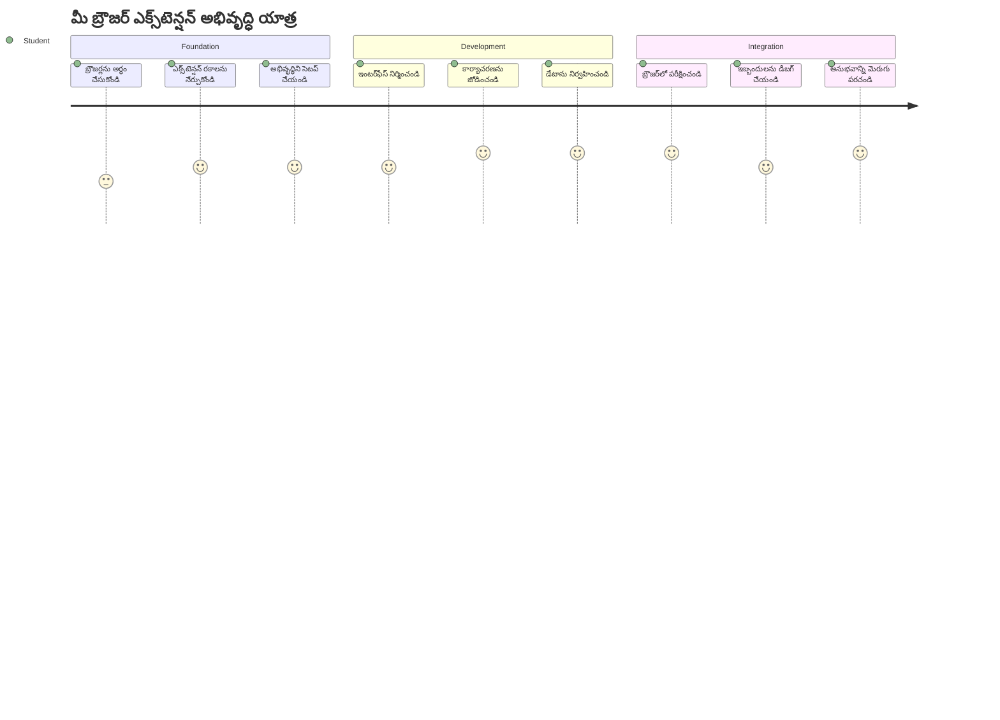
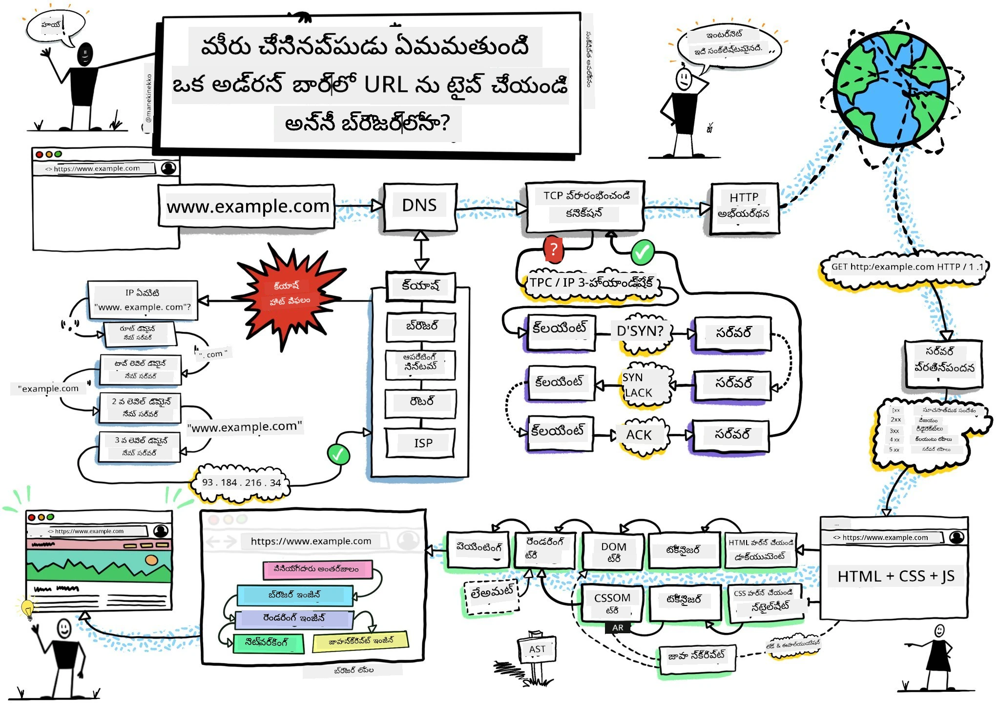
> స్కెచ్నోట్ ద్వారా [Wassim Chegham](https://dev.to/wassimchegham/ever-wondered-what-happens-when-you-type-in-a-url-in-an-address-bar-in-a-browser-3dob)

## ప్రీ-లెక్చర్ క్విజ్

[ప్రీ-లెక్చర్ క్విజ్](https://ff-quizzes.netlify.app/web/quiz/23)

### పరిచయం

బ్రౌజర్ ఎక్స్‌టెన్షన్లు మీ వెబ్ బ్రౌజింగ్ అనుభవాన్ని మెరుగుపరచే మినీ-యాప్స్. టిమ్ బర్నర్స్-లి యొక్క ఇంటరాక్టివ్ వెబ్ యొక్క అసలు దృష్టిని పోలి, ఎక్స్‌టెన్షన్లు బ్రౌజర్ సామర్థ్యాలను సాధారణ డాక్యుమెంట్ వీక్షణకి మించిఉంచుతాయి. మీ ఖాతాలను సురక్షితం చేసుకునే పాస్‌వర్డ్ మేనేజర్ల నుండి డిజైనర్లకు తగిన రంగులు ఎంచుకోడానికి సహాయపడే కలర్ పికర్ల వరకు, ఎక్స్‌టెన్షన్లు ప్రతి రోజూ ఎదురయ్యే బ్రౌజింగ్ సమస్యలను పరిష్కరిస్తాయి.

మీరెలాగైనా మీ మొదటి ఎక్స్‌టెన్షన్‌ను నిర్మించేముందు, బ్రౌజర్లు ఎలా పని చేస్తాయో అర్థం చేసుకుందాం. అలెగ్జాండర్ గ్రాహం బెల్ల్ ఫోన్ ఆవిష్కరణకు ముందు సౌండ్ ట్రాన్స్మిషన్ అర్థం చేసుకోవలసినట్టు, బ్రౌజర్ ప్రాథమిక అంశాల జ్ఞానం మీ ఎక్స్‌టెన్షన్లు బ్రౌజర్ సిస్టమ్స్‌తో సజావుగా ఇంటిగ్రేట్ అయ్యేందుకు సహాయపడుతుంది.

ఈ పాఠం చివరికి, మీరు బ్రౌజర్ నిర్మాణాన్ని అర్థం చేసుకుంటారు మరియు మీ మొదటి ఎక్స్‌టెన్షన్ నిర్మాణాన్ని ప్రారంభిస్తారు.

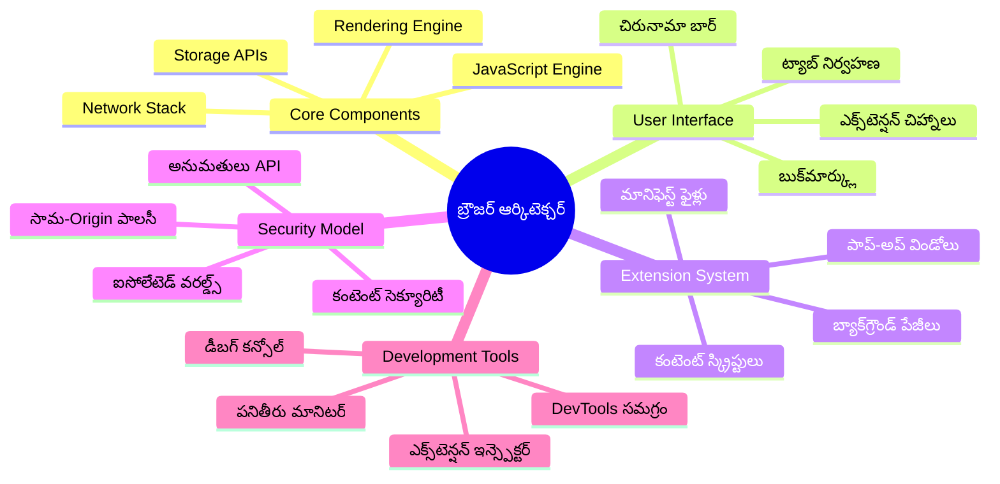
## వెబ్ బ్రౌజర్లను అర్థం చేసుకోవడం

వెబ్ బ్రౌజర్ అనేది బేసిక్‌గా ఒక కాంప్లెక్సు డాక్యుమెంట్ ఇంటర్‌ప్రెటర్. మీరు అడ్రస్ బార్‌ లో "google.com" టైప్ చేసినప్పుడు, బ్రౌజర్ ప్రపంచవ్యాప్త సర్వర్ల నుండి కంటెంట్‌ను అభ్యర్థిస్తూ, ఆ కోడ్‌ను పార్స్ చేసి, మీరు చూడగల ఇంటరాక్టివ్ వెబ్ పేజీలుగా రీండ్ర్ చేయడంలో సంక్లిష్ట కార్యకలాపాలు చేస్తుంది.

ఈ ప్రక్రియ మొదటి వెబ్ బ్రౌజర్, వర్డ్ వైడ్ వెబ్‌ను 1990లో టిమ్ బర్నర్స్-లీ నుండి రూపొందించిన విధానాన్ని ప్రతిబింబిస్తుంది, అది హైపర్లింక్ డాక్యుమెంట్లను అందరికి అందుబాటులోకి తీసుకురావడానికి రూపొందించబడింది.

✅ **చిన్న చరిత్ర**: మొదటి బ్రౌజర్ 'WorldWideWeb' అని పిలవబడింది మరియు ఇది సర్ టిమోథీ బర్నర్స్-లీ 1990లో సృష్టించారు.

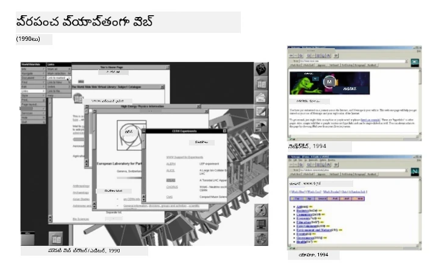
> కొన్ని ప్రారంభ బ్రౌజర్లు, [Karen McGrane](https://www.slideshare.net/KMcGrane/week-4-ixd-history-personal-computing) ద్వారా

### బ్రౌజర్లు వెబ్ కంటెంట్‌ను ఎలా ప్రాసెస్ చేస్తాయి

URL Toll నిర్ణీత వెబ్‌పేజీ చూపించడానికి మనం దిగిరాణించి కొన్ని సమన్వయ పద్ధతులను కొన్ని సెకన్లలో చేస్తుంది:

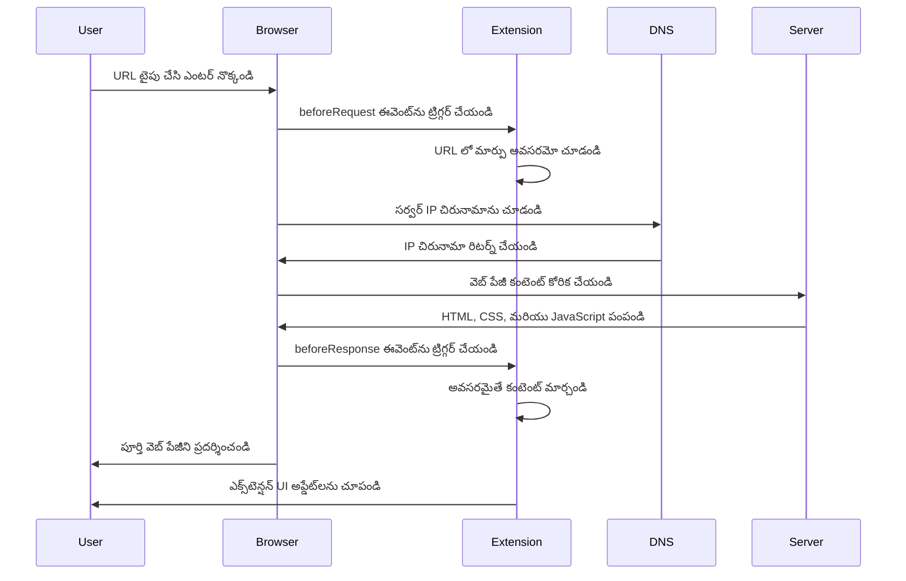
**ఈ ప్రక్రియ ఏమి చేస్తుందో ఇది:**
- **DNS లుకప్ ద్వారా** మానవ-readable URLని సర్వర్ IP అడ్రస్‌కి అనువదిస్తుంది
- **HTTP లేదా HTTPS ప్రోటోకాల్ ఉపయోగించి** వెబ్ సర్వర్‌తో సురక్షిత కనెక్షన్ ఏర్పాటు చేస్తుంది
- **సర్వర్ నుండి** నిర్దిష్ట వెబ్ పేజీ కంటెంట్ కోసం అభ్యర్థన చేస్తుంది
- **సర్వర్ నుండి** HTML మార్కప్, CSS స్టైలింగ్, మరియు JavaScript కోడ్‌ను అందుకుంటుంది
- **అన్ని కంటెంట్‌ను** మీరు చూస్తున్న ఇంటరాక్టివ్ వెబ్ పేజీగా రీండ్ర్ చేస్తుంది

### బ్రౌజర్ ముఖ్య ఫీచర్లు

ఆధునిక బ్రౌజర్లు ఎక్స్‌టెన్షన్ డెవలపర్లు ఉపయోగించగల అనేక ఫీచర్లను అందిస్తాయి:

| ఫీచర్ | ప్రయోజనం | ఎక్స్‌టెన్షన్ అవకాశాలు |
|---------|---------|------------------------|
| **రీండ్రరింగ్ ఇంజన్** | HTML, CSS, JavaScript ప్రదర్శిస్తుంది | కంటెంట్ మార్పిడి, స్టైలింగ్ ఇంజెక్షన్ |
| **JavaScript ఇంజన్** | JavaScript కోడ్ 실행్ చేస్తుంది | స్వంత స్క్రిప్టులు, API ఇంటరాక్షన్స్ |
| **లోకల్ స్టోరేజ్** | స్థానికంగా డేటా సేవ్ చేస్తుంది | యూజర్ ప్రిఫరెన్సులు, క్యాష్ డేటా |
| **నెట్‌వర్క్ స్టాక్** | వెబ్ అభ్యర్థనలు నిర్వహిస్తుంది | అభ్యర్థన మానిటరింగ్, డేటా విశ్లేషణ |
| **సెక్యూరిటీ మోడల్** | దుష్ట కంటెంట్ నుండి యూజర్లను రక్షిస్తుంది | కంటెంట్ ఫిల్టరింగ్, సెక్యూరిటీ మెరుగుదలలు |

**ఈ ఫీచర్లను అర్థం చేసుకోవడం మీకు:**
- మీ ఎక్స్‌టెన్షన్ అక్కడ ఎక్కువ విలువ చేర్చగలదో గుర్తించే అవకాశం
- మీ ఎక్స్‌టెన్షన్ ఫంక్షనాలిటీకి సరైన బ్రౌజర్ APIలను ఎంచుకునే అవకాశం
- బ్రౌజర్ వ్యవస్థలతో సమర్థవంతంగా పని చేసే ఎక్స్‌టెన్షన్లను రూపొందించే అవకాశం
- మీ ఎక్స్‌టెన్షన్ బ్రౌజర్ సెక్యూరిటీ ఉత్తమ విధానాలను అనుసరిస్తుందనే నిర్ధారణ

### క్రాస్-బ్రౌజర్ డెవలప్‌మెంట్ పరిగణనలు

విభిన్న బ్రౌజర్లు సాందర్బాల అమలులో తక్కువ తేడాలతో ఉంటాయి, విధానాలు కొంత భిన్నంగా ఉంటాయి, అదే విధంగా వేర్వేరు ప్రోగ్రామింగ్ భాషలు ఒకే అల్గోరిథమ్‌ని వేరుగా నిర్వహించేలా. క్రోమ్, ఫైర్‌ఫాక్స్, మరియు సఫారి ప్రతి ఒక్కటి డెవలపర్లకు పరిగణనలోకి తీసుకోవాల్సిన ప్రత్యేక లక్షణాలు కలిగి ఉంటాయి.

> 💡 **ప్రొ టిప్**: వివిధ బ్రౌజర్లలో ఏ వెబ్ టెక్నాలజీలు మద్దతు పొందుతున్నాయో తెలుసుకోవడానికి [caniuse.com](https://www.caniuse.com) ను ఉపయోగించండి. ఇది మీ ఎక్స్‌టెన్షన్ ఫీచర్స్ ప్లానింగ్‌లో అమూల్యంగా ఉంటుంది!

**ఎక్స్‌టెన్షన్ డెవలప్‌మెంట్ కీలక పరిగణనలు:**
- క్రోమ్, ఫైర్‌ఫాక్స్, ఎడ్జ్ బ్రౌజర్‌లపై మీ ఎక్స్‌టెన్షన్‌ను పరీక్షించండి
- వేరే బ్రౌజర్ ఎక్స్‌టెన్షన్ APIలు మరియు మానిఫెస్ట్ ఫార్మాట్లు అనుసరించండి
- ప్రదర్శన లక్షణాలు, పరిమితులు వేరుగా ఉంటాయనీ చూసుకోండి
- అందుబాటులో లేకపోవచ్చు అనుకున్న బ్రౌజర్-స్పెసిఫిక్ ఫీచర్లకు ప్రత్యామ్నాయాలు అందించండి

✅ **విశ్లేషణ సూచన**: మీరు ఏ బ్రౌజర్లను ఎక్కువగా వినియోగిస్తున్నారు అనేది తెలుసుకోవడానికి, వెబ్ అభివృద్ధి ప్రాజెక్ట్లలో విశ్లేషణ ప్యాకేజీలు ఇన్‌స్టాల్ చేయండి. ఈ డేటా మీకు మొదటి ప్రాధాన్యంగా ఏ బ్రౌజర్లను మద్దతు ఇవ్వాలో నిర్ణయించడంలో సహాయపడుతుంది.

## బ్రౌజర్ ఎక్స్‌టెన్షన్స్ అర్థం చేసుకోవడం

బ్రౌజర్ ఎక్స్‌టెన్షన్లు సాధారణ వెబ్ బ్రౌజింగ్ సమస్యలను బ్రౌజర్ ఇంటర్‌ఫేస్‌కి నేరుగా ఫంక్షనాలిటీ జత చేయడం ద్వారా పరిష్కరిస్తాయి. ప్రత్యేక యాప్స్ లేదా సంక్లిష్ట వర్క్‌ఫ్లోలను అవసరం లేకుండా, ఎక్స్‌టెన్షన్లు టూల్స్, ఫీచర్స్‌కె తక్షణ యాక్సెస్ ఇస్తాయి.

ఈ భావన డగ్లస్ ఎంగెల్‌బార్ట్ వంటి ఐటి పయనికులు మానవ సామర్థ్యాలను సాంకేతికతతో పెంచే విధానాన్ని ప్రతిబింబిస్తుంది - ఎక్స్‌టెన్షన్లు మీ బ్రౌజర్ యొక్క ప్రాథమిక సామర్థ్యాలను పెంచుతాయి.

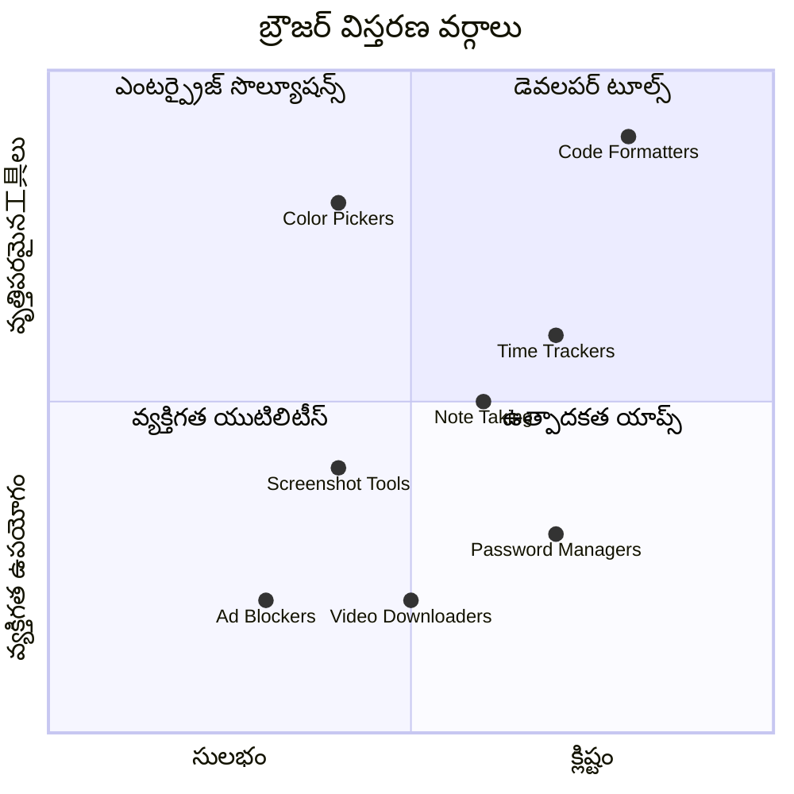
**ప్రసిద్ధ ఎక్స్‌టెన్షన్ వర్గాలు మరియు వాటి ప్రయోజనాలు:**
- **ఉత్పాదకత టూల్స్**: టాస్క్ మేనేజర్లు, నోట్-తీయడం యాప్స్, టైమ్ ట్రాకర్లు, అవి మీను ఏర్పాటు చేసుకునేందుకు సహాయం చేస్తాయి
- **సెక్యూరిటీ ఆప్టిమైజేషన్లు**: పాస్‌వర్డ్ మేనేజర్లు, యాడ్ బ్లిట్టర్స్, ప్రైవసీ టూల్స్, ఇవి మీ డేటాను రక్షిస్తాయి
- **డెవలపర్ టూల్స్**: కోడ్ ఫార్మాటర్స్, కలర్ పికర్స్, మరియు డీబగింగ్ యుటిలిటీజిలు అభివృద్ధిని సులభం చేస్తాయి
- **కంటెంట్ మెరుగుదల**: రీడింగ్ మోడ్లు, వీడియో డౌన్లోడర్లు, స్క్రీన్‌షాట్ టూల్స్, ఇవి మీ వెబ్ అనుభవాన్ని మెరుగుపరుస్తాయి

✅ **ప్రతిబింబ ప్రశ్న**: మీకు ఇష్టమైన బ్రౌజర్ ఎక్స్‌టెన్షన్లు ఏమిటి? అవి ఏ విధమైన పనులు చేస్తాయి, మరియు మీ బ్రౌజింగ్ అనుభవాన్ని ఎలా మెరుగు పరుస్తాయి?

### 🔄 **పాఠ శాస్త్రీయ చెక్-ఇన్**
**బ్రౌజర్ నిర్మాణ అవగాహన**: ఎక్స్‌టెన్షన్ డెవలప్‌మెంట్‌కు ముందుగా, మీరు ఈ విషయాలను ఖచ్చితంగా అర్థం చేసుకోవాలి:
- ✅ బ్రౌజర్లు వెబ్ అభ్యర్థనలు ఎలా ప్రాసెస్ చేసి కంటెంట్‌ని రీంద్ర్ చేస్తాయి వివరించగలగాలి
- ✅ బ్రౌజర్ నిర్మాణపు ప్రాముఖ్య భాగాలను గుర్తించగలగాలి
- ✅ ఎక్స్‌టెన్షన్లు బ్రౌజర్ ఫంక్షనాలిటీతో ఎలా ఇంటిగ్రేట్ అవుతాయో అర్థం చేసుకోవాలి
- ✅ యూజర్లను రక్షించే సెక్యూరిటీ మోడల్‌ను గుర్తించగలగాలి

**త్వరిత స్వీయ పరీక్ష**: URL టైప్ చేసి వెబ్ పేజీ చూసే దారిని మీరు ట్రేస్ చేయగలరా?
1. **DNS లుకప్** URLని IP అడ్రస్‌గా మారుస్తుంది
2. **HTTP అభ్యర్థన** సర్వర్ నుండి కంటెంట్‌ను తెస్తుంది
3. **పార్సింగ్** HTML, CSS, JavaScript ప్రాసెస్ చేస్తుంది
4. **రీండ్రింగ్** ఆఖరి వెబ్ పేజీని ప్రదర్శిస్తుంది
5. **ఎక్స్‌టెన్షన్‌లు** అనేక దశలలో కంటెంట్‌ను మార్చగలవు

## ఎక్స్‌టెన్షన్స్ ఇన్‌స్టాల్ చేయడం మరియు నిర్వహణ

ఎక్స్‌టెన్షన్ ఇన్‌స్టాలేషన్ ప్రక్రియను అర్థం చేసుకోవడం, ప్రజలు మీరు తయారు చేసిన ఎక్స్‌టెన్షన్‌ను ఇన్‌స్టాల్ చేయేటప్పుడు ఉపయోగపడే అనుభవాన్ని ఊహించడానికి సహాయం చేస్తుంది. ఆధునిక బ్రౌజర్లలో ఈ ఇన్‌స్టాలేషన్ ప్రక్రియ సాధారణంగా ఉంటుంది, చర్యల రూపరేఖలో స్వల్ప మార్పులుంటాయి.

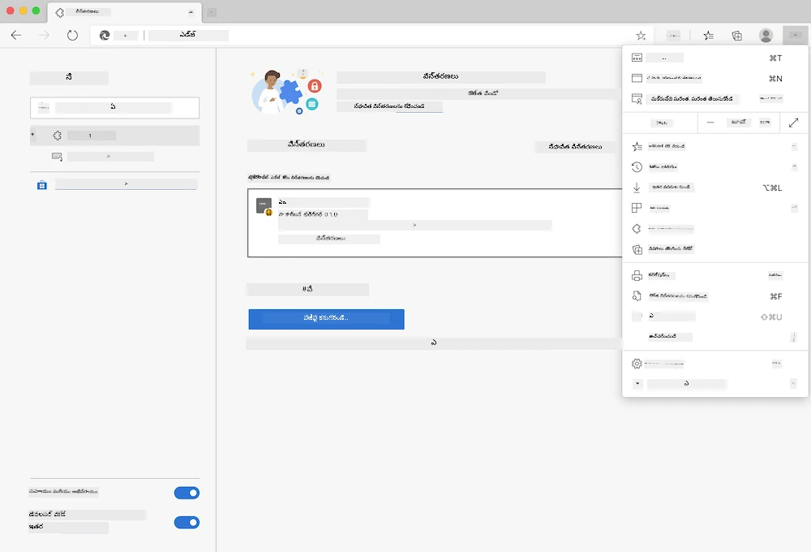

> **మరియు ముఖ్యమైనది**: మీ స్వంత ఎక్స్‌టెన్షన్లను పరీక్షించే సమయంలో డెవలపర్ మోడ్ ఆన్ చేసి, ఇతర స్టోర్స్ నుంచి ఎక్స్‌టెన్షన్స్ అనుమతి ఇవ్వడం మర్చిపోకండి.

### డెవలప్‌మెంట్ ఎక్స్‌టెన్షన్ ఇన్‌స్టాలేషన్ ప్రక్రియ

మీరు మీ స్వంత ఎక్స్‌టెన్షన్లు అభివృద్ధి చేసి పరీక్షిస్తున్నప్పుడు, ఈ వర్క్‌ఫ్లో అనుసరించండి:

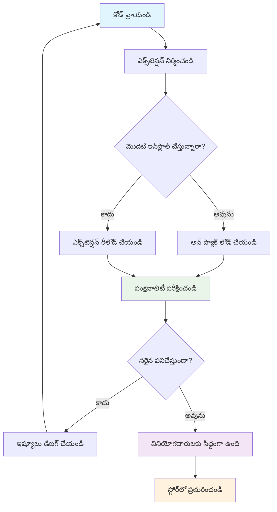
```bash
# దశ 1: మీ విస్తరణను నిర్మించండి
npm run build
```

**ఈ కమాండ్ ఏమి చేస్తుంది:**
- **మీ సోర్స్ కోడ్‌ను బ్రౌజర్-సిద్ధమైన ఫైల్స్‌గా కాంపైల్ చేస్తుంది**
- **JavaScript మాడ్యూల్స్‌ను ఆప్టిమైజ్డ్ ప్యాకెజిలుగా బండిల్ చేస్తుంది**
- **ఫైనల్ ఎక్స్‌టెన్షన్ ఫైళ్ళను `/dist` ఫోల్డర్‌లో ఉత్పత్తి చేస్తుంది**
- **ఇన్‌స్టాలేషన్, పరీక్షకు మీ ఎక్స్‌టెన్షన్‌ను సిద్ధం చేస్తుంది**

**దశ 2: బ్రౌజర్ ఎక్స్‌టెన్షన్స్ పేజీకి వెళ్లండి**
1. మీ బ్రౌజర్ యొక్క ఎక్స్‌టెన్షన్ నిర్వహణ పేజీని తెరవండి
2. పై-కుడిమీతంగా ఉన్న "సెట్టింగ్స్ మరియు మరిన్ని" బటన్ (`...` ఐకాన్) నొక్కండి
3. డ్రాప్‌డౌన్ మెనూ నుండి "Extensions" ఎంచుకోండి

**దశ 3: మీ ఎక్స్‌టెన్షన్ ను లోడ్ చేయండి**
- **కొత్త ఇన్‌స్టాలేషన్ల కోసం**: `load unpacked` ఎంచుకొని మీ `/dist` ఫోల్డర్ ని సెలెక్ట్ చేయండి
- **అప్‌డేట్‌ల కోసం**: ఇప్పటికే ఇన్‌స్టాల్ చేసిన ఎక్స్‌టెన్షన్ పక్కన `reload` క్లిక్ చేయండి
- **పరీక్ష కోసం**: అదనపు డీబగ్గింగ్ ఫీచర్లు కోసం "Developer mode" ను ఆన్ చేయండి

### ప్రొడక్షన్ ఎక్స్‌టెన్షన్ ఇన్‌స్టాలేషన్

> ✅ **గమనిక**: ఈ డెవలప్‌మెంట్ సూచనలు మీరు స్వయంగా నిర్మించే ఎక్స్‌టెన్షన్ల కోసం మాత్రమే. ఆవిష్కృత ఎక్స్‌టెన్షన్లు ఇన్‌స్టాల్ చేసుకోవడానికి అధికారిక బ్రౌజర్ ఎక్స్‌టెన్షన్ స్టోర్లు ఎలా చేరుకోవాలో చూడండి, ఉదాహరణకు [Microsoft Edge Add-ons store](https://microsoftedge.microsoft.com/addons/Microsoft-Edge-Extensions-Home).

**తేడా సమాధానం:**
- **డెవలప్‌మెంట్ ఇన్‌స్టాలేషన్లు** అభివృద్ధి సమయంలో అపబ్లిష్ చేయని ఎక్స్‌టెన్షన్లను పరీక్షించటానికి
- **స్టోర్ ఇన్‌స్టాలేషన్లు** ఆమోదించబడిన, ప్రచురించబడిన ఎక్స్‌టెన్షన్లను ఆటోమేటిక్ అప్‌డేట్స్‌తో అందిస్తాయి
- **సైడ్ లోడింగ్** అధికారిక స్టోర్‌ల వెలుపల నుండి ఎక్స్‌టెన్షన్స్ ఇన్‌స్టాల్ చేయడానికి (డెవలపర్ మోడ్ అవసరం)

## మీ కార్బన్ ఫుట్‌ప్రింట్ ఎక్స్‌టెన్షన్‌ను నిర్మించడం

మనం నిర్మించబోయే బ్రౌజర్ ఎక్స్‌టెన్షన్ మీ ప్రాంతంలో విద్యుత్ వినియోగం ద్వారా కార్బన్ ఉద్గారాల‌ను ప్రదర్శిస్తుంది. ఈ ప్రాజెక్టు ఎక్స్‌టెన్షన్ అభివృద్ధి కీలక సూత్రాలను చూపిస్తూ, పర్యావరణ అవగాహన కోసం ప్రయోగాత్మక సాధనం తయారుచేస్తుంది.

ఈ విధానము జాన్ డ్యూయి విద్యా సిద్ధాంతాల తర్వాత ఉపయోగపడే "చేసి నేర్చుకో" సూత్రాన్ని అనుసరిస్తుంది - సాంకేతిక నైపుణ్యాలను సమగ్రమైన నిజజీవిత అనువర్తనాలతో మిళితం చేస్తుంది.

### ప్రాజెక్టు అవసరాలు

అభివృద్ధి మొదలుపెట్టే ముందు అవసరమైన వనరులు, డిపెండెన్సీస్‌ని సేకరించండి:

**అవసరమైన API ప్రాప్యత:**
- **[CO2 Signal API కీ](https://www.co2signal.com/)**: మీ ఇమెయిల్ అడ్రస్ ఇన్‌పుట్ చేసి ఉచిత API కీ పొందండి
- **[ప్రాంత కోడ్](http://api.electricitymap.org/v3/zones)**: [Electricity Map](https://www.electricitymap.org/map) ఉపయోగించి మీ ప్రాంతం కోడ్ కనుగొనండి (ఉదాహరణకి, బోస్టన్ 'US-NEISO')

**అభివృద్ధి సాధనాలు:**
- **[Node.js మరియు NPM](https://www.npmjs.com)**: ప్రాజెక్ట్ డిపెండెన్సీలను ఇన్‌స్టాల్ చేసేందుకు ప్యాకేజీ మేనేజ్మెంట్ టూల్
- **[స్టార్టర్ కోడ్](../../../../5-browser-extension/start)**: అభివృద్ధి మొదలుపెట్టేందుకు `start` ఫోల్డర్ డౌన్‌లోడ్ చేసుకోండి

✅ **ఇంకా తెలుసుకోండి**: ప్యాకేజీ మేనేజ్మెంట్ నైపుణ్యాలను మెరుగుపరచేందుకు ఈ [విస్తృత Learn మోడ్యూల్](https://docs.microsoft.com/learn/modules/create-nodejs-project-dependencies/?WT.mc_id=academic-77807-sagibbon) ఉపయోగించండి

### ప్రాజెక్ట్ నిర్మాణాన్ని అర్థం చేసుకోవడం

ప్రాజెక్ట్ నిర్మాణం అర్థం చేసుకోవడం అభివృద్ధి పనిని సమగ్రంగా నిర్వహించడానికి సహాయపడుతుంది. అలెగ్జాండ్రియా గ్రంథాలయంలా సుసంస్కృతమైన నిర్మాణం సులభమైన జ్ఞాన అందుబాటుకు సహాయపడేది, అలాగే చక్కటి నిర్మిత కోడ్‌బేస్ అభివృద్ధిని సమర్థవంతంగా చేస్తుంది:

```
project-root/
├── dist/                    # Built extension files
│   ├── manifest.json        # Extension configuration
│   ├── index.html           # User interface markup
│   ├── background.js        # Background script functionality
│   └── main.js              # Compiled JavaScript bundle
├── src/                     # Source development files
│   └── index.js             # Your main JavaScript code
├── package.json             # Project dependencies and scripts
└── webpack.config.js        # Build configuration
```

**ప్రతి ఫైల్ ఏమి చేస్తుందో వ్యాఖ్యం:**
- **`manifest.json`**: ఎక్స్‌టెన్షన్ మేటాడేటా, అనుమతులు, ఎంట్రీ పాయింట్ల నిర్వచనం
- **`index.html`**: యూజర్ ఇంటర్‌ఫేస్ సృష్టిస్తుంది, యూజర్లు ఎక్స్‌టెన్షన్ క్లిక్ చేసినప్పుడు ప్రదర్శించబడుతుంది
- **`background.js`**: బ్యాక్‌గ్రౌండ్ టాస్కులు మరియు బ్రౌజర్ ఈవెంట్ లిసనర్స్ నిర్వహిస్తుంది
- **`main.js`**: బిల్డ్ ప్రక్రియ తర్వాత తుద JavaScript బండిల్
- **`src/index.js`**: మీ ప్రధాన అభివృద్ధి కోడ్, ఇది `main.js`లోకి కాంపైల్ అవుతుంది

> 💡 **సంఘటనా సూచన**: అభివృద్ధి సమయంలో API కీ మరియు ప్రాంత కోడ్‌ను ఒక సురక్షిత నోట్లో ఉంచండి. వాటిని పరీక్షించేప్పుడు ఉపయోగించాల్సి ఉంటుంది.

✅ **సెక్యూరిటీ సూచన**: API కీలు లేదా సున్నితమైన క్రెడెన్షియల్స్‌ను కోడ్ రిపాజిటరీలో పోస్ట్ చేయవద్దు. తరువాతి దశల్లో వాటిని ఎలా సురక్షితంగా నిర్వహించాలో చూపిస్తాము.

## ఎక్స్‌టెన్షన్ ఇంటర్‌ఫేస్ సృష్టించడం

ఇప్పుడు యూజర్ ఇంటర్‌ఫేస్ భాగాలను నిర్మిద్దాం. ఎక్స్‌టెన్షన్ రెండు-స్క్రీన్ పద్ధతిని ఉపయోగిస్తుంది: ఒకటి ఆరంభ సెటప్ ఇంగితంగా, మరొకటి ఫలితాలు చూపించదుకు.

ఈ విధానం కంప్యూటింగ్ తొలితియ్యల నుండి అనుసరించబడిన ప్రోగ్రెసివ్ డిస్క్లోజర్ సూత్రాన్ని అనుసరిస్తుంది - యూజర్లకు మించి సమాచారంతో మూర్చిపోకుండా, సమాచారం మరియు ఎంపికలను క్రమంగా ప్రదర్శించడం.

### ఎక్స్‌టెన్షన్ వీక్షణల అవలోకనం

**సెట్టప్ వీక్షణ** - మొదటి సారి ఉపయోగించే యూజర్ సెటప్:
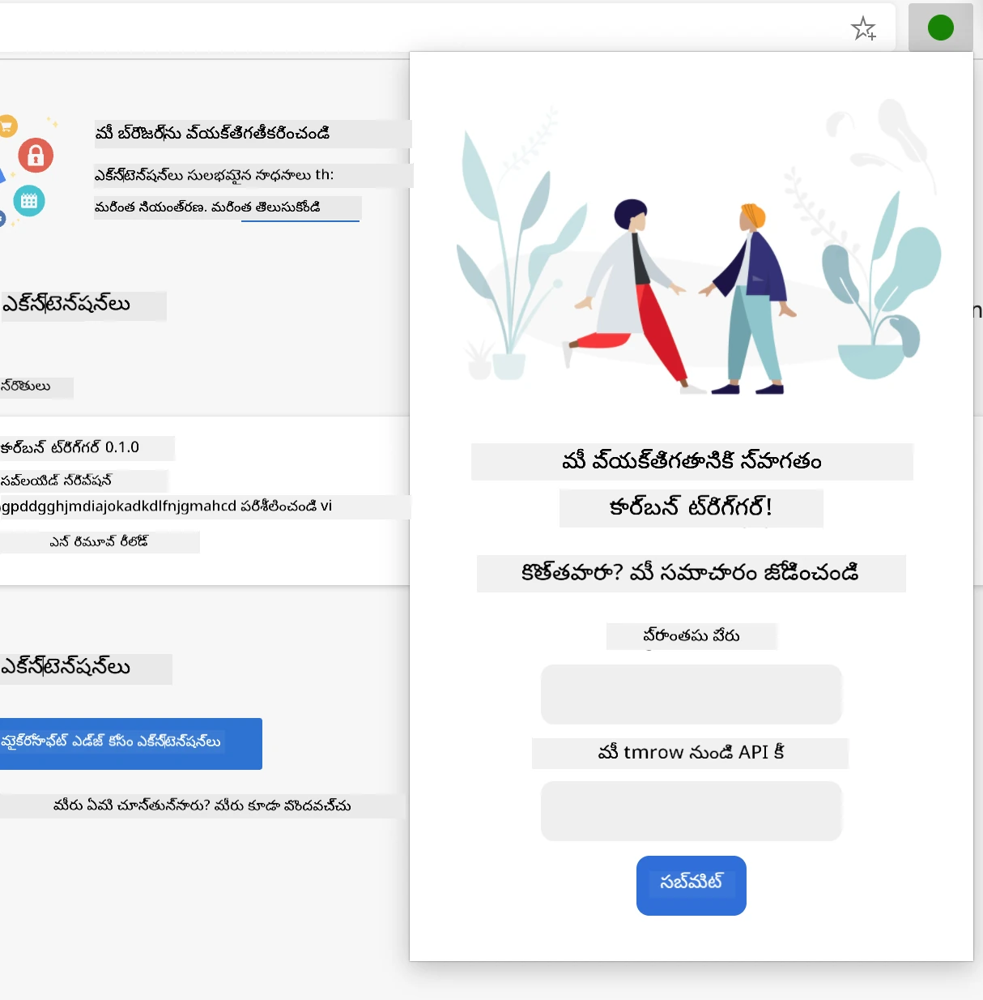

**ఫలితాల వీక్షణ** - కార్బన్ ఫుట్‌ప్రింట్ డేటాను చూపిస్తుంది:
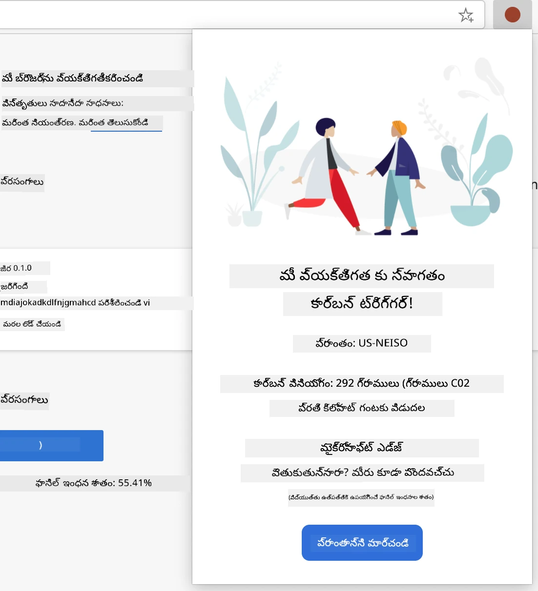

### సెటప్ ఫారం నిర్మించడం

సెట్టప్ ఫారం ప్రారంభంలో యూజర్ కాన్ఫిగరేషన్ డేటాను సేకరిస్తుంది. సెటప్ పూర్తైన తర్వాత, ఈ సమాచారం బ్రౌజర్ స్టోరేజీలో నిల్వ చేస్తుంది.

`/dist/index.html` ఫైల్‌లో ఈ ఫారం నిర్మాణం చేర్చండి:

```html
<form class="form-data" autocomplete="on">
    <div>
        <h2>New? Add your Information</h2>
    </div>
    <div>
        <label for="region">Region Name</label>
        <input type="text" id="region" required class="region-name" />
    </div>
    <div>
        <label for="api">Your API Key from tmrow</label>
        <input type="text" id="api" required class="api-key" />
    </div>
    <button class="search-btn">Submit</button>
</form>
```

**ఈ ఫారం ఏమి చేస్తుంది:**
- సరైన లేబుల్‌లు మరియు ఇన్‌పుట్ అసోసియేషన్‌తో సెంటిమాంటిక్ ఫారం నిర్మిస్తుంది
- మెరుగైన యూజర్ అనుభవానికి బ్రౌజర్ ఆటోకంప్లీట్ ఫంక్షనాలిటీని సక్రియం చేస్తుంది
- `required` అట్రిబ్యూట్ ద్వారా రెండూ ఫీల్డ్‌లు తప్పనిసరిగా నింపాల్సివుంటాయి
- సులభంగా స్టైలింగ్ మరియు JavaScript లక్ష్యీకరణ కోసం క్లాస్ పేరు కలిగి ఇన్‌పుట్లు క్రమబద్ధీకరించబడ్డాయి
- మొదటి సారి సెటప్ చేస్తున్న యూజర్లకు స్పష్టమైన సూచనలు ఇస్తుంది

### ఫలితాల ప్రదర్శన నిర్మించడం

తర్వాత, కార్బన్ ఫుట్‌ప్రింట్ డేటాను చూపించే ఫలితాల ప్రాంతాన్ని సృష్టించండి. ఈ HTML‌ను ఫారం కింద చేర్చండి:

```html
<div class="result">
    <div class="loading">loading...</div>
    <div class="errors"></div>
    <div class="data"></div>
    <div class="result-container">
        <p><strong>Region: </strong><span class="my-region"></span></p>
        <p><strong>Carbon Usage: </strong><span class="carbon-usage"></span></p>
        <p><strong>Fossil Fuel Percentage: </strong><span class="fossil-fuel"></span></p>
    </div>
    <button class="clear-btn">Change region</button>
</div>
```

**ఈ నిర్మాణం ఏమి అందిస్తుంది:**
- **`loading`**: API డేటా తీసుకువస్తుండగా లోడింగ్ సందేశాన్ని చూపిస్తుంది
- **`errors`**: API కాల్స్ విఫలమైతే లేదా డేటా చెల్లదనిపిస్తే తప్పుల సందేశాలు చూపిస్తుంది
- **`data`**: అభివృద్ధి సమయంలో డీబగ్గింగ్ కోసం ముడి డేటాను పట్టించుకుంటుంది
- **`result-container`**: యూజర్లకు రూపుదిద్దబడిన కార్బన్ ఫుట్‌ప్రింట్ సమాచారం ఇవ్వడం కోసం
- **`clear-btn`**: యూజర్లకు వారి ప్రాంతాన్ని మార్చి ఎక్స్‌టెన్షన్‌ను తిరిగి సెటప్ చేసుకోవడానికి అనుమతిస్తుంది

### బిల్డ్ ప్రక్రియ సెట్టప్ చేయడం

ఇప్పుడు ప్రాజెక్ట్ డిపెండెన్సీలను ఇన్‌స్టాల్ చేసి బిల్డ్ ప్రక్రియను పరీక్షిద్దాం:

```bash
npm install
```

**ఈ ఇన్‌స్టాలేషన్ ప్రక్రియ ఏమి చేస్తుంది:**
- `package.json` లో సూచించిన Webpack మరియు ఇతర అభివృద్ధి డిపెండెన్సీలను డౌన్లోడ్ చేస్తుంది
- ఆధునిక JavaScript కాంపైలింగ్ కోసం బిల్డ్ టూల్ చైన్‌ను కాంఫిగర్ చేస్తుంది
- ఎక్స్‌టెన్షన్ నిర్మాణం మరియు పరీక్ష కోసం అభివృద్ధి వాతావరణాన్ని సిద్ధం చేస్తుంది
- కోడ్ బండిలింగ్, ఆప్టిమైజేషన్, మరియు క్రాస్-బ్రౌజర్ అనుకూలత ఫీచర్లను ఎనేబుల్ చేస్తుంది

> 💡 **బిల్డ్ ప్రక్రియ అవగాహన**: Webpack మీ సోర్స్ కోడ్‌ను `/src/index.js` నుండి `/dist/main.js`కి బండిల్ చేస్తుంది. ఈ ప్రక్రియ ఉత్పత్తికి మీ కోడ్‌ని ఆప్టిమైజ్ చేసి, బ్రౌజర్‌కు అనుకూలంగా చేస్తుంది.

### మీ పురోగతిని పరీక్షించడం

ఈ దశలో మీ ఎక్స్‌టెన్షన్‌ను పరీక్షించవచ్చు:
1. **నడపండి** మీ కోడును కంపైల్ చేయడానికి build ఆదేశం
2. **లోడ్ చేయండి** డెవలపర్ మోడ్ ఉపయోగించి మీ బ్రౌజర్‌లో ఎక్స్‌టెన్షన్
3. **తప్పకుండా చూడండి** ఫారం సరిగ్గా ప్రదర్శించబడుతున్నదా మరియు ప్రొఫెషనల్‌గా ఉందా
4. **పరీక్షించండి** ఫారం ఎలిమెంట్లు సక్రమంగా అలైన్ అయ్యి, ఫంక్షనల్ గానే ఉన్నాయా

**మీరు సాధించినది:**
- **నిర్మించారు** మీ ఎక్స్‌టెన్షన్‌కు సూత్రప్రాయ HTML నిర్మాణం
- **సృష్టించారు** సరైన సెమంటిక్ మార్కప్‌తో కాన్ఫిగరేషన్ మరియు ఫలితాల ఇంటర్‌ఫేస్‌లు
- **సెట్ అప్ చేశారు** పరిశ్రమ-ప్రామాణిక టూల్స్ ఉపయోగంతో ఆధునిక డెవలప్‌మెంట్ వర్క్‌ఫ్లో
- **తయారుచేశారు** ఇంటరాక్టివ్ JavaScript ఫంక్షనాలిటీ కోసం పునాది

### 🔄 **పాఠశాల గమనిక**
**ఎక్స్‌టెన్షన్ అభివృద్ధి పురోగతి**: కొనసాగక ముందుగా మీ అవగాహనను నిర్దారించుకోండి:
- ✅ ప్రాజెక్ట్ నిర్మాణంలోని ప్రతి ఫైల్ ఉద్దేశం మీరు వివరించగలరా?
- ✅ build ప్రాసెస్ మీ సోర్స్ కోడ్‌ను ఎలా మారుస్తుందో అర్థం చేసుకున్నారా?
- ✅ కాన్ఫిగరేషన్ మరియు ఫలితాలను వేరువేరు UI సెక్షన్లుగా ఎందుకు విభజిస్తారు?
- ✅ ఫారం నిర్మాణం ఉపయోగకరత మరియు ఆకెసిబిలిటీ రెండింటినీ ఎలా మద్దతు ఇస్తుంది?

**డెవలప్‌మెంట్ వర్క్‌ఫ్లో అవగాహన**: ఇప్పుడు మీరు ఈ క్రింద చేయగలరు:
1. **సవరించండి** మీ ఎక్స్‌టెన్షన్ ఇంటర్‌ఫేసుకు సంబంధించిన HTML మరియు CSS
2. **నడపండి** build ఆదేశం మీ మార్పులు కంపైలేషన్ కోసం
3. **రీలోడ్ చేయండి** మీ బ్రౌజర్‌లో ఎక్స్‌టెన్షన్ కోసం అప్డేట్లను పరీక్షించండి
4. **డీబగ్ చేయండి** బ్రౌజర్ డెవలపర్ టూల్స్ ఉపయోగించి సమస్యలను

మీరు బ్రౌజర్ ఎక్స్‌టెన్షన్ అభివృద్ధి మొదటి దశను పూర్తి చేసారు. రైటు బ్రదర్స్ విమానయానానికి ముందు ఎరోడైనమిక్స్ అర్థం చేసుకోవాల్సిన విధంగా, ఈ ప్రాథమిక అభిప్రాయాలు మీకు తదుపరి పాఠంలో మరింత క్లిష్టమైన ఇంటరాక్టివ్ ఫీచర్లను నిర్మించడానికి సిద్ధం చేస్తాయి.

## GitHub Copilot ఏజెంట్ సవాలు 🚀

ఏజెంట్ మోడ్ ఉపయోగించి ఈ సవాలు పూర్తి చేయండి:

**వివరణ:** API కీస్ మరియు రీజియన్ కోడ్‌లు ఎంటర్ చేసే సమయంలో వినియోగదారు అనుభవాన్ని మెరుగుపరచడానికి ఫారం విలిడేషన్ మరియు వినియోగదారు ఫీడ్‌బ్యాక్ ఫీచర్లను జోడించి బ్రౌజర్ ఎక్స్‌టెన్షన్‌ను అభివృద్ధి చేయండి.

**ప్రాంప్ట్:** API కీ ఫీల్డ్ లో కనీసం 20 అక్షరాలు ఉన్నాయా లేదా అన్నది చెక్ చేసే మరియు రీజియన్ కోడ్ సరైన ఫార్మాట్ (‘US-NEISO’ లాగా) లో ఉందా చెక్ చేసే JavaScript విలిడేషన్ ఫంక్షన్‌లు రాయండి. సరైన ఇన్పుట్స్ కు గ్రీన్ బోర్డర్, తప్పులైన వాటికి రెడ్ బోర్డర్ ఇచ్చే విజువల్ ఫీడ్‌బ్యాక్ జోడించండి. భద్రతా కారణాలకోసం API కీను చూపించే/దాచే టోగుల్ ఫీచర్ కూడా జోడించండి.

ఇక్కడ గైడ్ కోసం [agent mode](https://code.visualstudio.com/blogs/2025/02/24/introducing-copilot-agent-mode) చదవండి.

## 🚀 సవాలు

మీ బ్రౌజర్‌లో ఎక్స్‌టెన్షన్ స్టోర్ చూడండి మరియు ఒకటి ఇన్‌స్టాల్ చేయండి. దాని ఫైళ్లను ఆసక్తికరంగా పరిశీలించవచ్చు. మీరు ఏమి కనుగొంటారు?

## పాఠం తర్వాత క్విజ్

[పాఠం తర్వాత క్విజ్](https://ff-quizzes.netlify.app/web/quiz/24)

## సమీక్ష & స్వీయ అధ్యయనం

ఈ పాఠంలో మీరు వెబ్ బ్రౌజర్ చారిత్రక నేపథ్యం గురించి కొంత తెలుసుకున్నారు; ప్రపంచవ్యాపీ వెబ్ కనెక్టెడ్ ఎలా అవుతుందో సృష్టికర్తలు ఎలా ఊహించినారో తెలుసుకోవడానికి దీని చారిత్రం చదవండి. కొన్ని ఉపయోగకరమైన వెబ్‌సైట్లు:

[వెబ్ బ్రౌజర్ల చరిత్ర](https://www.mozilla.org/firefox/browsers/browser-history/)

[వెబ్ చరిత్ర](https://webfoundation.org/about/vision/history-of-the-web/)

[టిమ్ బర్నర్స్-లీతో ఇంటర్వ్యూలు](https://www.theguardian.com/technology/2019/mar/12/tim-berners-lee-on-30-years-of-the-web-if-we-dream-a-little-we-can-get-the-web-we-want)

### ⚡ **తదుపరి 5 నిమిషాల్లో మీరు చేయగల పనులు**
- [ ] Chrome/Edge ఎక్స్‌టెన్షన్స్ పేజీ (chrome://extensions) ఓపెన్ చేసి ఇన్‌స్టాల్ చేసిన వాటిని పరిశీలించండి
- [ ] వెబ్‌పేజీ లోడ్ అయ్యేటప్పుడు మీ బ్రౌజర్ DevTools Network ట్యాబ్ చూడండి
- [ ] పేజీ సోర్స్ (Ctrl+U) చెక్ చేసి HTML నిర్మాణం పరిశీలించండి
- [ ] ఎలాంటి వెబ్‌పేజీ ఎలిమెంట్‌ను ఇన్‌స్పెక్ట్ చేసి DevTools లో CSS మార్చండి

### 🎯 ** ఈ గంటలో మీరు సాధించగల విజయాలు**
- [ ] పాఠం తర్వాత క్విజ్ పూర్తి చేసుకొని బ్రౌజర్ మూలాలను అర్థం చేసుకోండి
- [ ] బ్రౌజర్ ఎక్స్‌టెన్షన్ కోసం ప్రాథమిక manifest.json ఫైల్ సృష్టించండి
- [ ] ఒక సరళమైన "Hello World" ఎక్స్‌టెన్షన్ నిర్మించి popup చూపించండి
- [ ] డెవలపర్ మోడ్ లో మీ ఎక్స్‌టెన్షన్ లోడ్ చేయడం పరీక్షించండి
- [ ] మీ లక్ష్య బ్రౌజర్ కోసం ఎక్స్‌టెన్షన్ డాక్యుమెంటేషన్ చూడండి

### 📅 **మీ వార పొడవైన ఎక్స్‌టెన్షన్ ప్రయాణం**
- [ ] నిజమైన ఉపయోగం గల గణనీయమైన బ్రౌజర్ ఎక్స్‌టెన్షన్ పూర్తి చేయండి
- [ ] కంటెంట్ స్క్రిప్ట్‌లు, బ్యాక్‌గ్రౌండ్ స్క్రిప్ట్‌లు, పాపప్ ఇంటరాక్షన్ల గురించి నేర్చుకోండి
- [ ] స్టోరేజ్, టాబ్స్, మెసేజింగ్ వంటి బ్రౌజర్ APIs నేర్చుకోండి
- [ ] వినియోగదారు సొంతమైన ఇంటర్‌ఫేస్‌లను డిజైన్ చేయండి
- [ ] వివిధ వెబ్‌సైట్లలో మరియు పరిస్థితులలో మీ ఎక్స్‌టెన్షన్ పరీక్షించండి
- [ ] ఎక్స్‌టెన్షన్‌ను బ్రౌజర్ ఎక్స్‌టెన్షన్ స్టోర్‌లో ప్రచురించండి

### 🌟 **మీ నెల పొడవైన బ్రౌజర్ అభివృద్ధి**
- [ ] వేరే వేరే వినియోగదారు సమస్యలకు అనుకూలమైన అనేక ఎక్స్‌టెన్షన్‌లు నిర్మించండి
- [ ] అధునాతన బ్రౌజర్ APIలు మరియు భద్రతా ఉత్తమ క్రమాలు నేర్చుకోండి
- [ ] ఓపెన్ సోర్స్ బ్రౌజర్ ఎక్స్‌టెన్షన్ ప్రాజెక్టులకు సహకరించండి
- [ ] క్రాస్-బ్రౌజర్ అనుకూలత మరియు ప్రోగ్రెస్‌వ్ ఎన్‌హాన్స్‌మెంట్‌లో ప్రావీణ్యం సంతరించుకోండి
- [ ] ఇతరుల కోసం ఎక్స్‌టెన్షన్ అభివృద్ధి టూల్స్ మరియు టెంప్లెట్లను సృష్టించండి
- [ ] ఇతర డెవలపర్లకు సహాయం చేసే బ్రౌజర్ ఎక్స్‌టెన్షన్ నిపుణుడిగా మారండి

## 🎯 మీ బ్రౌజర్ ఎక్స్‌టెన్షన్ నైపుణ్య సమయరేఖ

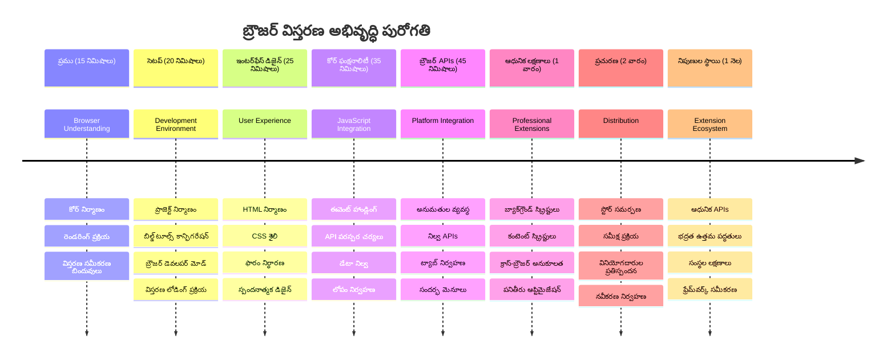
### 🛠️ మీ ఎక్స్‌టెన్షన్ అభివృద్ధి టూల్‌కిట్ సంక్షిప్తం

ఈ పాఠం పూర్తైన తర్వాత, మీ వద్ద ఉంది:
- **బ్రౌజర్ ఆర్కిటెక్చర్ జ్ఞానం**: రించరింగ్ ఇంజిన్లు, భద్రతా నమూనాలు, ఎక్స్‌టెన్షన్ ఇంటిగ్రేషన్ అర్థం
- **అభివృద్ధి వాతావరణం**: Webpack, NPM, డీబగ్గింగ్ సామర్థ్యాలతో ఆధునిక టూల్‌చైన్
- **UI/UX పునాది**: ప్రోగ్రెస్‌వ్ డిస్క్లోజర్ పేటర్న్‌తో సెమాంటిక్ HTML నిర్మాణం
- **భద్రతా అవగాహన**: బ్రౌజర్ అనుమతులు మరియు సురక్షిత అభివృద్ధి పద్ధతులు
- **క్రాస్-బ్రౌజర్ భావనలు**: అనుకూలత పరిగణనాలు మరియు పరీక్షా విధానాలు
- **API ఇంటిగ్రేషన్**: బాహ్య డేటా స్రోతోస్‌తో పని చేసే పునాది
- **వృత్తిపరమైన వర్క్‌ఫ్లో**: పరిశ్రమ-ప్రామాణిక అభివృద్ధి మరియు పరీక్షా ప్రకియలు

**సాకారిక వినియోగాలు**: ఈ నైపుణ్యాలు ప్రత్యక్షంగా వర్తిస్తాయి:
- **వెబ్ అభివృద్ధి**: సింగిల్ పేజ్ అప్లికేషన్‌లు మరియు ప్రోగ్రెస్‌వ్ వెబ్ యాప్స్
- **డెస్క్‌టాప్ అప్లికేషన్స్**: ఎలక్ట్రాన్ మరియు వెబ్ ఆధారిత డెస్క్‌టాప్ సాఫ్ట్వేర్
- **మొబైల్ అభివృద్ధి**: హైబ్రిడ్ యాప్స్ మరియు వెబ్ ఆధారిత మొబైల్ పరిష్కారాలు
- **ఎంటర్‌ప్రైజ్ టూల్స్**: అంతర్గత ఉత్పాదకత అప్లికేషన్స్ మరియు వర్క్‌ఫ్లో ఆటోమేషన్
- **ఓపెన్ సోర్స్**: బ్రౌజర్ ఎక్స్‌టెన్షన్ ప్రాజెక్ట్స్ మరియు వెబ్ ప్రమాణాలకు సహకారం

**తరగతి ముందరి దశ**: విస్తృత ఇంటరాక్టివ్ ఫంక్షనాలిటీ జోడించడానికి, బ్రౌజర్ APIs తో పని చేయడానికి, మరియు వాస్తవ వినియోగదారు సమస్యలను పరిష్కరించే ఎక్స్‌టెన్షన్‌లను సృష్టించడానికి మీరు సిద్ధంగా ఉన్నారు!

## అసైన్మెంట్

[మీ ఎక్స్‌టెన్షన్‌ను రీస్టైల్ చేయండి](assignment.md)

---

<!-- CO-OP TRANSLATOR DISCLAIMER START -->
**స్వీయ నిరాకరణ**:  
ఈ పత్రం AI అనువాద సేవ [Co-op Translator](https://github.com/Azure/co-op-translator) ఉపయోగించి అనువదించబడింది. మేము ఖచ్చితత్వానికి పోరాడుతున్నప్పటికీ, ఆటోమేటెడ్ అనువాదాల్లో తప్పిదాలు లేదా అసత్యతలు ఉండవచ్చును అని దయచేసి గమనించండి. అసలు పత్రం దాని స్థానిక భాషలో అధికారం సమ్మతమైన మూలంగా పరిగణించబడాలి. కీలక సమాచారం కోసం, వృత్తిపరమైన మానవ అనువాదాన్ని సిఫార్సు చేయబడింది. ఈ అనువాదం వాడకం వల్ల ఏర్పడే ఎటువంటి అపార్థాలు లేదా తప్పు అర్థం చేసుకోవడం కోసం మేము బాధ్యత వహించము.
<!-- CO-OP TRANSLATOR DISCLAIMER END -->