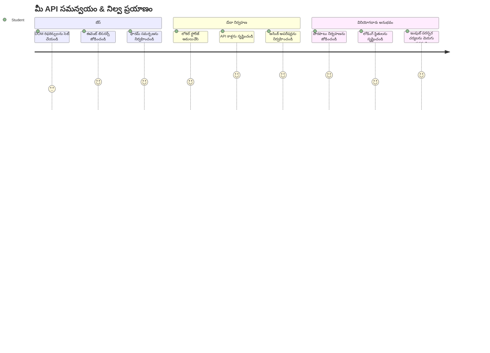
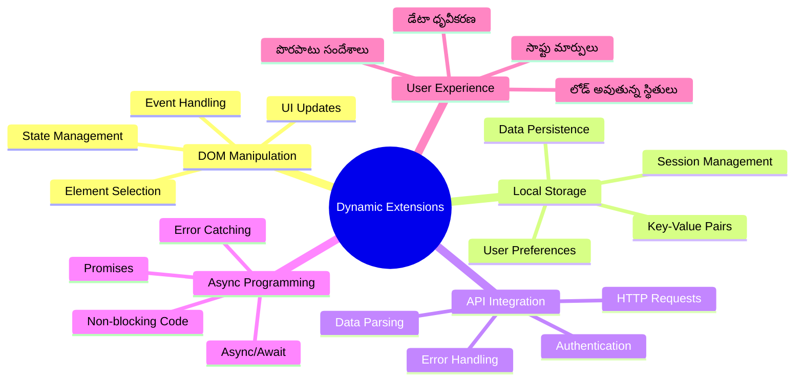
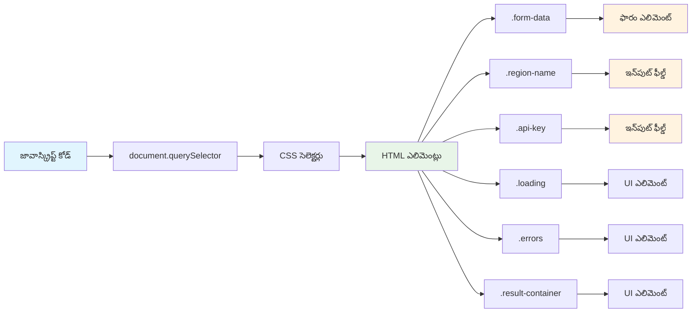
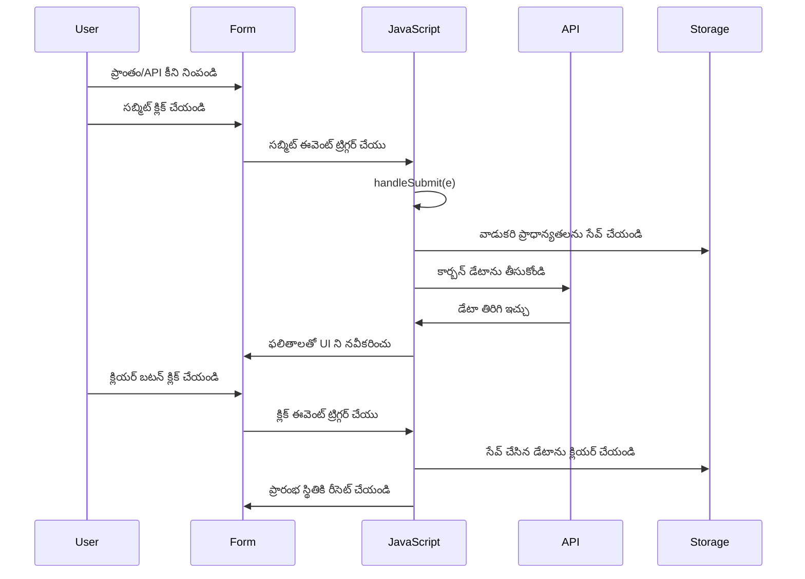
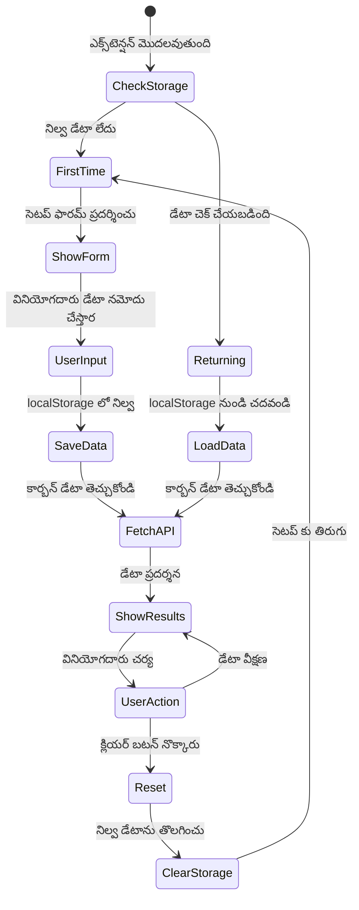
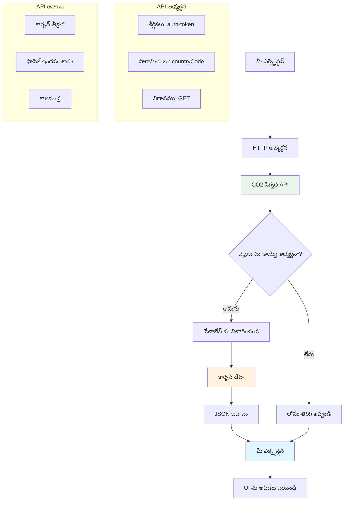
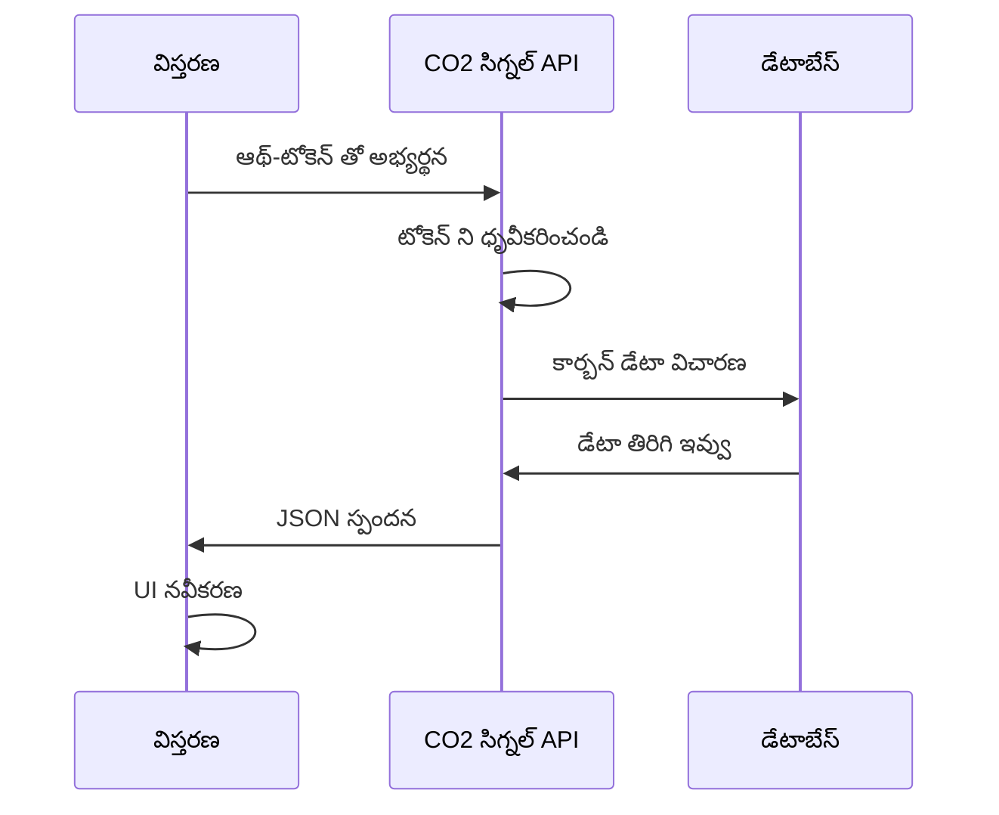
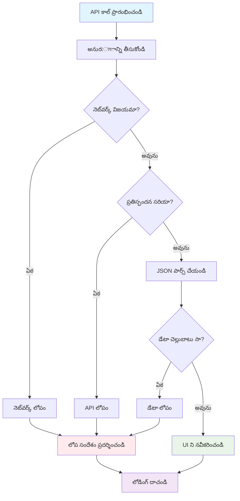
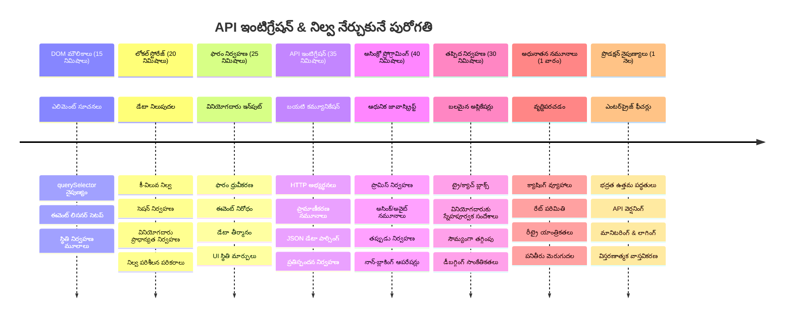

<!--
CO_OP_TRANSLATOR_METADATA:
{
  "original_hash": "2b6203a48c48d8234e0948353b47d84e",
  "translation_date": "2026-01-08T15:05:12+00:00",
  "source_file": "5-browser-extension/2-forms-browsers-local-storage/README.md",
  "language_code": "te"
}
-->
# బ్రౌజర్ పొడగింపు ప్రాజెక్ట్ పార్ట్ 2: API ను కాల్ చేయండి, లోకల్ స్టోరేజ్ ఉపయోగించండి


## ప్రీ-లెక్చర్ క్విజ్

[ప్రీ-లెక్చర్ క్విజ్](https://ff-quizzes.netlify.app/web/quiz/25)

## పరిచయం

నువ్వు ప్రారంభించిన బ్రౌజర్ పొడగింపు గుర్తుందా? ఇప్పటికీ నీకు బాగున్న రూపం ఉంది, కానీ అది అసలే స్థిరమైనది. ఈ రోజు మనం దానిని ప్రాణం పోస్తాము, నిజమైన డేటాతో కనెక్ట్ చేసి, దీనికి స్మృతి ఇస్తాము.

అపోలో మిషన్ కంట్రోల్ కంప్యూటర్ల గురించి ఆలోచించు - అవి స్థిరమైన సమాచారాన్ని మాత్రమే ప్రదర్శించలేదు. అవి ఎప్పటికప్పుడు స్పేస్ క్రాఫ్ట్‌తో కమ్యూనికేట్ చేసి, టెలిమెట్రీ డేటాతో నవీకరించబడ్డాయి మరియు ముఖ్యమైన మిషన్ పరామితులను గుర్తు పెట్టుకున్నాయి. మనం ఈ రోజు నిర్మిస్తున్న డైనమిక్ ప్రవర్తన ఇష్టం. మీ పొడగింపు ఇంటర్నెట్‌కు చేరుకుంటుంది, నిజమైన పర్యావరణ డేటా తీసుకుంటుంది, మరియు మీ సెట్ చేసిన సెట్టింగ్స్‌ను భవిష్యత్తు కోసం గుర్తుంచుకుంటుంది.

API ఇంటిగ్రేషన్ కష్టం అనిపించవచ్చును, కానీ ఇది మీ కోడ్‌ను ఇతర సేవలతో ఎలా కమ్యూనికేట్ చేయాలో నేర్పించడం మాత్రమే. మీరు వాతావరణ డేటాను తీసుకునే, సోషల్ మీడియాలో ఫీడ్స్‌ను పొందే లేదా ఈ రోజు చేయబోయే విధంగా కార్బన్ ఫుట్ ప్రింట్ సమాచారం తీసుకునే విధానం, ఇవన్నీ ఈ డిజిటల్ కనెక్షన్లను ఏర్పాటు చేసే విషయం. మనము ఏ విధంగానే బ్రౌజర్లు ఎలా సమాచారాన్ని నిలిపివేయగలవో కూడా తెలుసుకుందాము - లైబ్రరీలు ఎలా కార్డు క్యాటలాగ్‌లు ఉపయోగించి పుస్తకాలు ఎక్కడ ఉన్నాయో గుర్తుంచుకున్నాయో అలా.

ఈ పాఠం పూర్తయిన తర్వాత, మీకు నిజమైన డేటా పాఠిస్తుంది, వినియోగదారు ప్రాధమ్యాలను నిలిపివేస్తుంది మరియు సరళమైన అనుభవాన్ని అందించే బ్రౌజర్ పొడగింపు ఉంటుంది. మొదలు పెట్టుదాం!


✅ మీ కోడ్ ఎక్కడ ఉంచాలో తెలుసుకోవడానికి సంబంధిత ఫైల్స్ లో ఉన్న నంబర్ చేసిన సెగ్మెంట్లను అనుసరించండి

## పొడగింపులో మానిప్యులేట్ చేసే ఎలిమెంట్లను సెట్ చేయండి

మీ జావా స్క్రిప్ట్ ఇంటర్‌ఫేస్‌ను మానిప్యులేట్ చేయడానికి ముందు, అది ప్రత్యేక HTML ఎలిమెంట్లకు సూచనలు కావాలి. ఇది టెలిస్కోపును నిర్దిష్ట నక్షత్రాలపై దృష్టి పెట్టడంలాంటిది - గెలిలియో జుపిటర్ గోళ్ళను అధ్యయనం చేయడానికి ముందు జుపిటర్ను కనుగొని దానిపై దృష్టి పెట్టాలి.

మీ `index.js` ఫైలిలో, మనం ముఖ్యమైన ప్రతి ఫారం ఎలిమెంట్‌కి సూచనలను పట్టే `const` వేరియబుల్స్ సృష్టిస్తాము. ఇది శాస్త్రవేత్తలు తమ పరికరాలపై లేబుల్ పెడుతున్న తీరుగానే - ప్రతి సారి మొత్తం ప్రయోగశాలను అన్వేషించకుండా వారు అవసరమైన దాని నేరుగా యాక్సెస్ చేయగలుగుతారు.


```javascript
// ఫారమ్ ఫీల్డ్స్
const form = document.querySelector('.form-data');
const region = document.querySelector('.region-name');
const apiKey = document.querySelector('.api-key');

// ఫలితాలు
const errors = document.querySelector('.errors');
const loading = document.querySelector('.loading');
const results = document.querySelector('.result-container');
const usage = document.querySelector('.carbon-usage');
const fossilfuel = document.querySelector('.fossil-fuel');
const myregion = document.querySelector('.my-region');
const clearBtn = document.querySelector('.clear-btn');
```

**ఈ కోడ్ చేస్తున్నది:**
- CSS క్లాస్ సెలెక్టర్లతో `document.querySelector()` ఉపయోగించి ఫాం ఎలిమెంట్లను పట్టుకుంటుంది
- ప్రాంతం పేరు మరియు API కీ కోసం ఇన్‌పుట్ ఫీల్డ్స్‌కు సూచనలు సృష్టిస్తుంది
- కార్బన్ వాడుక డేటా కోసం ఫలిత ప్రదర్శన ఎలిమెంట్లకు కనెక్షన్‌ను ఏర్పరుస్తుంది
- లోడింగ్ సూచికలు మరియు లోప సూచనలు వంటి UI ఎలిమెంట్లను సెటప్ చేస్తుంది
- మీ కోడ్ అంతటా సులభంగా పునఃఉపయోగం కోసం ప్రతి ఎలిమెంట్ సూచనను `const` వేరియబుల్ గా నిల్వ చేస్తుంది

## ఈవెంట్ లిసెనర్లను జోడించండి

ఇప్పుడు మనం మీ పొడగింపును వినియోగదారుల చర్యలకు స్పందింపజేసేందుకు చేస్తాము. ఈవెంట్ లిసెనర్లు అనేవి మీ కోడ్ వినియోగదారుల పరస్పర చర్యలను పరిశీలించే మార్గం. అవి మొదటి కాలాల్లోని టెలిఫోన్ ఎక్స్ఛేంజ్ ఆపరేటర్లాగా - వారు వచ్చిన కాల్స్‌కి కస్టమర్స్ కనెక్ట్ కావడానికి సరైన సర్క్యూట్‌లను అనుసంధానం చేసేవారు.


```javascript
form.addEventListener('submit', (e) => handleSubmit(e));
clearBtn.addEventListener('click', (e) => reset(e));
init();
```

**ఈ సమాహారాల అర్థం:**
- వినియోగదారులు ఎంటర్ నొక్కినప్పుడు లేదా సమర్పించడానికి క్లిక్ చేసినప్పుడు ట్రిగ్గర్ అయ్యే ఫాం‌కు సబ్మిట్ లిసినర్‌ను కట్టడం
- ఫారమ్‌ను రీసెట్ చేయడానికి క్లియర్ బటన్కు క్లిక్ లిసినర్‌ను అనుసంధానం చేయడం
- అదనపు నియంత్రణ కోసం ఈవెంట్ ఆబ్జెక్ట్ `(e)`ని హ్యాండ్లర్ ఫంక్షన్లకు పంపడం
- మీ పొడగింపు ప్రారంభ స్థితిని అమర్చడానికి వెంటనే `init()` ఫంక్షన్‌ను పిలవడం

✅ ఇక్కడ ఉపయోగించిన షార్ట్ హ్యాండ్ ఏరో ఫంక్షన్ సింటాక్స్‌ను గమనించండి. ఈ ఆధునిక జావాస్క్రిప్ట్ విధానం సంప్రదాయ ఫంక్షన్ ఎక్స్‌ప్రెషన్ల కంటే మరింత క్లీనుగా ఉంటుంది, కానీ రెండూ బాగా పనిచేస్తాయి!

### 🔄 **పాఠశాల తనిఖీ**
**ఈవెంట్ హ్యాండ్లింగ్ అర్థం చేసుకోవడం**: Initialization కు వెళ్లేముందు, మీరు తెలుసుకోవాలి:
- ✅ `addEventListener` ఎలా వినియోగదారు చర్యలను జావాస్క్రిప్ట్ ఫంక్షన్స్ కు కలుపుతుందో బట్టి వివరించగలరు
- ✅ హ్యాండ్లర్ ఫంక్షన్లకు ఈవెంట్ ఆబ్జెక్ట్ `(e)` ఎందుకు పాస్ చేయబడుతుందో తెలుసుకోవచ్చు
- ✅ `submit` మరియు `click` ఈవెంట్ల మధ్య తేడా గుర్తించగలరు
- ✅ `init()` ఫంక్షన్ ఎప్పుడు మరియు ఎందుకు అమలవుతుందో వివరించగలరు

**తక్షణమే స్వయం పరీక్ష**: మీరు `e.preventDefault()`ను ఫారం సబ్మిషన్లో మర్చిపోతే ఏమవుతుంది?
*సమాధానం: పేజీ రీలోడ్ అవుతుంది, అందువలన అన్ని జావాస్క్రిప్ట్ స్థితులు పోతాయి మరియు వినియోగదారు అనుభవం అంతరాయం వస్తుంది*

## ప్రారంభకల్పన మరియు రీసెట్ ఫంక్షన్లను నిర్మించండి

మీ పొడగింపు కోసం Initialization లాజిక్‌ను సృష్టిద్దాం. `init()` ఫంక్షన్ ఒక నౌక యొక్క నావిగేషన్ సిస్టమ్ లాంటిదిది - ఇది ప్రస్తుత స్థితిని తనిఖీ చేసి అనుసరిస్తుంది. ఇది ఎవరో ముందు మీ పొడగింపును ఉపయోగించారో లేదా వారి పూర్వ సెట్టింగ్స్‌ను లోడ్ చేస్తుంది.

`reset()` ఫంక్షన్ వినియోగదారులకు కొత్త ప్రారంభాన్ని ఇస్తుంది - శాస్త్రవేత్తలు పరిశీలనల మధ్య తమ పరికరాలను రీసెట్ చేసే విధంగానే, శుభత డేటా కోసం.

```javascript
function init() {
	// యూజర్ ముందు API ఆవశ్యకతలను సేవ్ చేసినారా అని తనిఖీ చేయండి
	const storedApiKey = localStorage.getItem('apiKey');
	const storedRegion = localStorage.getItem('regionName');

	// ఎక్స్‌టెన్షన్ చిహ్నాన్ని సాధారణ ఆకుపచ్చ (భవిష్యత్తు పాఠానికి ప్లేస్‌హోల్డర్) గా సెట్ చేయండి
	// TODO: తదుపరి పాఠంలో చిహ్నం అప్‌డేట్‌ను అమలు చేయండి

	if (storedApiKey === null || storedRegion === null) {
		// తొలి సారి యూజర్: సెటప్ ఫారాన్ని చూపించండి
		form.style.display = 'block';
		results.style.display = 'none';
		loading.style.display = 'none';
		clearBtn.style.display = 'none';
		errors.textContent = '';
	} else {
		// తిరిగి వచ్చిన యూజర్: వారి సేవ్ చేసిన డేటాను ఆటోమేటిగ్గా లోడ్ చేయండి
		displayCarbonUsage(storedApiKey, storedRegion);
		results.style.display = 'none';
		form.style.display = 'none';
		clearBtn.style.display = 'block';
	}
}

function reset(e) {
	e.preventDefault();
	// కొత్త ప్రాంతాన్ని ఎంచుకునేందుకు నిల్వ చేసిన ప్రాంతాన్ని క్లియర్ చేయండి
	localStorage.removeItem('regionName');
	// ప్రారంభ ప్రక్రియను రీస్టార్ట్ చేయండి
	init();
}
```

**ఇక్కడ జరుగుతున్నది:**
- బ్రౌజర్ లోకల్ స్టోరేజ్ నుండి నిల్వ చేయబడిన API కీ మరియు ప్రాంతాన్ని తీసుకుంటుంది
- ఇది మొదటి సారి ఉపయోగిస్తున్నవారో (నిల్వ చేయబడిన ధృవపత్రాలు లేవో) లేదా తిరిగి వచ్చిన వినియోగదారో చెక్ చేస్తుంది
- కొత్త వినియోగదారుల కోసం సెటప్ ఫారం చూపుతుంది మరియు ఇతర UI అంశాలను దాచుతుంది
- తిరిగి వచ్చిన వినియోగదారుల కోసం స్వయంగా సঞ্চయించిన డేటాను లోడ్ చేసి రీసెట్ ఆప్షన్ చూపిస్తుంది
- అందుబాటులో ఉన్న డేటాపై ఆధారపడి యూజర్ ఇంటర్‌ఫేస్ స్టేట్‌ను నిర్వహిస్తుంది

**లోకల్ స్టోరేజ్ గురించి ముఖ్యమైన భావనలు:**
- బ్రౌజర్ సెషన్స్ మధ్య డేటాను నిలిపివేస్తుంది (సెషన్ స్టోరేజ్‌తో పోలిస్తే)
- `getItem()` మరియు `setItem()` ఉపయోగించి కీ-వెల్యూ జోడింపుగా డేటాను నిల్వ చేస్తుంది
- ఒక కీకి డేటా లేనప్పుడు `null` తిరిగి ఇస్తుంది
- వినియోగదారుల ప్రాధమ్యాలు మరియు సెట్టింగ్స్ గుర్తుంచుకోవడం కోసం సులభమైన మార్గం అందిస్తుంది

> 💡 **బ్రౌజర్ స్టోరేజ్ అర్థం చేసుకోండి**: [LocalStorage](https://developer.mozilla.org/docs/Web/API/Window/localStorage) మీ పొడగింపుకు దృఢమైన స్మృతి ఇస్తుంది. ప్రాచీన అలెగ్జాండ్రియా గ్రంథాలయం రెక్కలుగా స్మృతిని నిలిపినట్లు ఆలోచించండి - శాస్త్రజ్ఞులు వెళ్లిపోయినా సమాచారం అందుబాటులో ఉంటుంది.
>
> **ప్రధాన లక్షణాలు:**
> - బ్రౌజర్ మూసివేసినప్పటికీ డేటా నిలుస్తుంది
> - కంప్యూటర్ రీస్టార్ట్‌లు, బ్రౌజర్ క్రాష్‌లను తట్టుకొంటుంది
> - వినియోగదారుల ప్రాధమ్యాలకు పెద్ద నిల్వ స్థలం అందిస్తుంది
> - నెట్‌వర్క్ ఆలస్యం లేకుండా తక్షణ యాక్సెస్ ఇస్తుంది

> **గురుతింపు**: మీ బ్రౌజర్ పొడగింపుకు ప్రత్యేకమైన లోకల్ స్టోరేజ్ ఉంటుంది, ఇది సాధారణ వెబ్ పేజీల నుండి వేరుగా ఉంటుంది. ఇది భద్రతను కలిగించి ఇతర వెబ్‌సైట్లు మధ్య కలకలం నివారిస్తుంది.

మీ నిల్వ చేసిన డేటాను చూడటానికి బ్రౌజర్ డెవలపర్ టూల్స్ (F12) తెరవాలి, ఆపై **Application** ట్యాబ్‌కు వెళ్లి **Local Storage** విభాగాన్ని విస్తరించండి.




> ⚠️ **భద్రతా పరామర్శ**: ఉత్పత్తి అనువర్తనాల్లో, API కీలు LocalStorage లో నిల్వ చేయడం భద్రతా ప్రమాదాలను కలిగిస్తుంది ఎందుకంటే జావాస్క్రిప్ట్ ఈ డేటాకు యాక్సెస్ చేయగలదు. పాఠశాలలో ఈ విధానం సరైనది, కానీ నిజమైన అనువర్తనాలు సున్నితమైన ధారవాహికలకు సురక్షిత సర్వర్-సైడ్ నిల్వను ఉపయోగించాలి.

## ఫారం సమర్పణను నిర్వహించండి

ఇప్పుడు ఎవరో మీ ఫారాన్ని సమర్పించినప్పుడు ఏమవుతుంది అనేది చూస్తాము. డిఫాల్ట్‌గా, బ్రౌజర్లు ఫారం సమర్పించినప్పుడు పేజీని రీలోడ్ చేస్తాయి, కానీ మనం ఈ ప్రవర్తనను అడ్డుకుంటూ మృదువైన అనుభవం సృష్టిస్తాము.

ఈ విధానం మిషన్ కంట్రోల్ ఎలాంటి వ్యవస్థను ప్రతి ప్రచారం కోసం రీసెట్ చేయకుండా, నిరంతరంగా ఆపరేట్ చేస్తూ కొత్త సమాచారాన్ని ప్రాసెస్ చేసే విధానాన్ని సూచిస్తుంది.

ఫామ్ సమర్పణ ఈవెంట్‌ను పట్టుకొని వినియోగదారు ఇన్‌పుట్‌ను తీసుకునే ఫంక్షన్‌ను సృష్టించండి:

```javascript
function handleSubmit(e) {
	e.preventDefault();
	setUpUser(apiKey.value, region.value);
}
```

**పై కోడ్‌లో:**
- పేజీ రీలోడ్ అయ్యే డిఫాల్ట్ ఫారం సమర్పణ ప్రవర్తనను అడ్డుకుంటుంది
- API కీ మరియు ప్రాంత ఫీల్డ్‌ల నుంచి వినియోగదారు ఇన్‌పుట్ విలువలను తీసుకుంటుంది
- ప్రాసెసింగ్ కోసం `setUpUser()` ఫంక్షన్‌కు ఫారం డేటాను పంపిస్తుంది
- సింగిల్-పేజీ అప్లికేషన్ ప్రవర్తనను నిలుపుకోవడానికి పేజీ రీలోడ్స్‌ నివారిస్తుంది

✅ మీ HTML ఫారం ఫీల్డ్‌లలో `required` అట్రిబ్యూట్ ఉన్నందున బ్రౌజర్ ఆ ట్రమ్ ఫంక్షన్లు అమలయ్యే ముందు వినియోగదారు API కీ, ప్రాంతం రెండింటినీ ఇవ్వాలని ఆటోమేటిక్ గా ధ్రువీకరిస్తుంది.

## వినియోగదారు ప్రాధమ్యాలను సెటప్ చేయండి

`setUpUser` ఫంక్షన్ వినియోగదారుడి ధృవపత్రాలను సేవ్ చేసి మొదటి API కాల్‌ను ప్రారంభిస్తుంది. ఇది సెటప్ నుండి ఫలితాల ప్రదర్శనకు సాఫీ మార్పును సృష్టిస్తుంది.

```javascript
function setUpUser(apiKey, regionName) {
	// భవిష్యత్ సెషన్‌ల కోసం వినియోగదారు సాక్ష్యాలును సేవ్ చేయండి
	localStorage.setItem('apiKey', apiKey);
	localStorage.setItem('regionName', regionName);
	
	// లోడింగ్ స్థితిని చూపడానికి UI నవీకరించండి
	loading.style.display = 'block';
	errors.textContent = '';
	clearBtn.style.display = 'block';
	
	// వినియోగదారుని సాక్ష్యాలతో కార్బన్ వినియోగ డేటాను దిగుమతి చేసుకోండి
	displayCarbonUsage(apiKey, regionName);
}
```

**స్టెప్ బై స్టెప్:**
- API కీ మరియు ప్రాంత명을 భవిష్యత్తులకు లోకల్ స్టోరేజ్‌లో నిల్వ చేస్తుంది
- డేటా తీసుకురావడాన్ని తెలియజేయడానికి లోడింగ్ సూచికను చూపిస్తుంది
- ప్రదర్శన నుంచి పూర్వ లోప సందేశాలను తొలగిస్తుంది
- వినియోగదారులు వారి సెట్టింగ్స్‌ను రీసెట్ చేయడానికి క్లియర్ బటన్‌ను చూపిస్తుంది
- నిజమైన కార్బన్ వాడుక డేటాను పొందేందుకు API కాల్‌ను మొదలుపెడుతుంది

ఈ ఫంక్షన్ డేటా నిలుపుదల మరియు UI నవీకరణలను ఒక సమన్వయ కృత్యంలో నిర్వహిస్తూ వినియోగదారుడికి సాఫీ అనుభవాన్ని అందిస్తుంది.

## కార్బన్ వాడుక డేటాను ప్రదర్శించండి

ఇప్పుడు మనం మీ పొడగింపును API ల ద్వారా బహిరంగ డేటా సోర్సులను కనెక్ట్ చేస్తాము. ఇది మీ పొడగింపును స్టాండ్ఎలోన్ టూల్ కంటే బయట నుండి నిజ కాల సమాచారాన్ని యాక్సెస్ చేసే సాధనంగా మార్చుతుంది.

**APIs అర్థం చేసుకోవడం**

[APIs](https://www.webopedia.com/TERM/A/API.html) అనేవి వివిధ అనువర్తనాలు ఎలా పరస్పరం సంభాషిస్తాయో చూపిస్తాయి. వీటిని 19వ శతాబ్దంలో దూర నగరాలను కలిపే టెలిగ్రాఫ్ వ్యవస్థగా చూడవచ్చు - ఆపరేటర్లు దూరపు స్టేషన్లకు అభ్యర్థనలు పంపి కోరిన సమాచారంతో ప్రతిస్పందనలు స్వీకరించేవారు. మీరు సోషల్ మీడియాను చూస్తున్నప్పుడు, వాయిస్ అసిస్టెంట్ ప్రశ్న అడిగినప్పుడు లేదా డెలివరీ యాప్ వాడినప్పుడు APIs ఈ డేటా మార్పిడులను సులభతరం చేస్తాయి.


**REST APIs గురించి ముఖ్యమైన భావనలు:**
- REST అర్థం 'Representational State Transfer'
- డేటాతో చేపట్టేందుకు సాధారణ HTTP పద్ధతులు(GET, POST, PUT, DELETE) ఉపయోగిస్తుంది
- డేటాను సాధారణంగా JSON ఫార్మాట్‌లో తిరిగి ఇస్తుంది
- వివిధ రకాల అభ్యర్థనలకు సుదృఢ URL ఆధారిత ఎండ్పాయింట్లను అందిస్తుంది

✅ మనం ఉపయోగించబోయే [CO2 సిగ్నల్ API](https://www.co2signal.com/) ప్రపంచవ్యాప్తంగా విద్యుత్ గ్రిడ్‌ల నుండి నిజకాల కార్బన్ తీవ్రత సమాచారం ఇస్తుంది. ఇది వినియోగదారులకు వారి విద్యుత్ ఉపయోగం పర్యావరణ ప్రభావం గురించి అవగాహన కల్పిస్తుంది!

> 💡 **అసింక్రోనస్ జావాస్క్రిప్ట్ అర్థం చేసుకోండి**: [`async` కీవర్డ్](https://developer.mozilla.org/docs/Web/JavaScript/Reference/Statements/async_function) మీ కోడ్‌ను ఒకేసారి బహుళ క్రియాకలాపాలను నిర్వహించేందుకు అనుమతిస్తుంది. మీరు సర్వర్ నుండి డేటాను అభ్యర్థించే సమయంలో, మీ పొడగింపు మొత్తం ఎక్కడా ఆగకూడదు - అది ఏరో ట్రాఫిక్ కంట్రోల్ ఒక విమానం స్పందించముందు అన్ని ఆపరేషన్లు ఆపివేసిన తీరు కాదు.
>
> **ముఖ్య లాభాలు:**
> - డేటా లోడ్ అయ్యేవరకు పొడగింపు స్పందనशीलంగా ఉంటుంది
> - నెట్‌వర్క్ అభ్యర్థనల సమయంలో ఇతర కోడ్ అమలవ్వగలదు
> - సంప్రదాయ కాల్‌బ్యాక్ పద్ధతుల కన్నా చదవడానికి సులభం
> - నెట్‌వర్క్ సమస్యలకు సాఫీ లోప నిర్వహణ ఇస్తుంది

ఇదిగో `async` పై చిన్న వీడియో:

[](https://youtube.com/watch?v=YwmlRkrxvkk "Async and Await for managing promises")

> 🎥 పై చిత్రం మీద క్లిక్ చేసి async/await గురించి వీడియోను చూడండి.

### 🔄 **పాఠశాల తనిఖీ**
**Async ప్రోగ్రామింగ్ అర్థం చేసుకోండి**: API ఫంక్షన్‌లోకి వెళ్లే ముందు తెలుసుకోండి:
- ✅ ఎందుకు మనం మొత్తం పొడగింపును బ్లాక్ చేయకుండా `async/await` ఉపయోగిస్తామో
- ✅ `try/catch` బ్లాకులు నెట్‌వర్క్ లోపాలను సాఫీగా ఎలా నిర్వహిస్తాయో
- ✅ సమకాలీన (సింక్రోనస్) మరియు అసమకాలీన (అసింక్రోనస్) ఆపరేషన్‌ల మధ్య తేడా
- ✅ API కాల్స్ ఎందుకు నిర్లక్ష్యం అయ్యే అవకాశముంది మరియు వాటిని ఎలా పరిష్కరించాలో

**వాస్తవ ప్రపంచ అనుసంధానం**: ఈ దైనందిన అసింక్రో ఉదాహరణల గురించి ఆలోచించండి:
- **ఆపిల్ ఆర్డర్ చేయటం**: మీరు వంటగదీ ముందు నిలబడు వద్దు, రసీదు తీసుకుని ఇతర పనులు చేయవచ్చు
- **ఈమెయిల్స్ పంపడం**: మీ ఈమెయిల్ యాప్ పంపేమీ సమయంలో ఫ్రీజ్ అవ్వదు - మరిన్ని ఈమెయిల్స్ రచించవచ్చు
- **వెబ్ పేజీలు లోడ్ కావటం**: చిత్రం దశలవారీగా లోడ్ అవుతుంటే మీరు ఇప్పటికే టెక్స్ట్ చదవవచ్చు

**API ధృవీకరణ ప్రవాహం**:

కార్బన్ వాడుక డేటా తీసుకురావడానికి ఫంక్షన్ సృష్టించండి:

```javascript
// ఆధునిక fetch API విధానం (బాహ్య ఆధారాలు అవసరం లేదు)
async function displayCarbonUsage(apiKey, region) {
	try {
		// CO2 సిగ్నల్ API నుండి కార్బన్ తీవ్రత డేటాను తీసుకోండి
		const response = await fetch('https://api.co2signal.com/v1/latest', {
			method: 'GET',
			headers: {
				'auth-token': apiKey,
				'Content-Type': 'application/json'
			},
			// నిర్దిష్ట ప్రాంతం కోసం ప్రశ్న పరామితులను జోడించండి
			...new URLSearchParams({ countryCode: region }) && {
				url: `https://api.co2signal.com/v1/latest?countryCode=${region}`
			}
		});

		// API అభ్యర్థన విజయవంతమైందా అని తనిఖీ చేయండి
		if (!response.ok) {
			throw new Error(`API request failed: ${response.status}`);
		}

		const data = await response.json();
		const carbonData = data.data;

		// ముడతలు పెట్టిన కార్బన్ తీవ్రత విలువను లెక్కించండి
		const carbonIntensity = Math.round(carbonData.carbonIntensity);

		// తీసుకున్న డేటాతో వినియోగదారు ఇంటర్‌ఫేస్ ను నవీకరించండి
		loading.style.display = 'none';
		form.style.display = 'none';
		myregion.textContent = region.toUpperCase();
		usage.textContent = `${carbonIntensity} grams (grams CO₂ emitted per kilowatt hour)`;
		fossilfuel.textContent = `${carbonData.fossilFuelPercentage.toFixed(2)}% (percentage of fossil fuels used to generate electricity)`;
		results.style.display = 'block';

		// TODO: calculateColor(carbonIntensity) - తదుపరి పాఠంలో అమలు చేయాలి

	} catch (error) {
		console.error('Error fetching carbon data:', error);
		
		// వినియోగదారులకు స్నేహపూర్వక దోష సందేశాన్ని చూపించండి
		loading.style.display = 'none';
		results.style.display = 'none';
		errors.textContent = 'Sorry, we couldn\'t fetch data for that region. Please check your API key and region code.';
	}
}
```

**ఇక్కడ ఏమవుతుంది:**
- అదనపు లైబ్రరీలు లేకుండా శుభ్రంగా, ఆధునిక `fetch()` API ఉపయోగించడం
- `response.ok` తో సరైన లోప తనిఖీ అమలు చేసి API విఫలమైతే ముందుగానే పట్టుకోవడం
- అసింక్రోనస్ ఆపరేషన్లను `async/await` తో రూపొందించి చదవడానికి సులభం చేయడం
- CO2 సిగ్నల్ APIతో `auth-token` హెడర్ ద్వారా ధృవీకరణ చేయడం
- JSON ప్రతిస్పందన డేటా పార్థన చేసి కార्बన్ తీవ్రత సమాచారాన్ని తీసుకోవడం
- పర్యావరణ డేటాతో UI లో అనేక ఎలిమెంట్లను నవీకరించడం
- API కాల్స్ విఫలమైనప్పుడు వినియోగదారుకు స్నేహపూర్వక లోప సందేశాలను అందించడం

**ప్రముఖ ఆధునిక జావాస్క్రిప్ట్ భావనలు:**
- `${}` సింటాక్స్ తో టెంప్లేట్ లిటరల్స్ ఉపయోగించి శుభ్రంగా స్ట్రింగ్ తయారు చేయడం
- try/catch బ్లాకులతో లోప నిర్వహణ నిర్వహించడం
- async/await పద్ధతి తో నెట్‌వర్క్ అభ్యర్థనలను సులభతరంగా నిర్వహించడం
- ఓబ్జెక్ట్ డిస్ట్రక్చరింగ్ ద్వారా API ప్రతిస్పందన నుండి అవసరమైన డేటా తీసుకురావడం
- మెథడ్ చైనింగ్ తో బహుళ DOM మానిప్యులేషన్లను చేయడం

✅ ఈ ఫంక్షన్ బాహ్య సర్వర్‌లతో కమ్యూనికేట్ చేయడం, ధృవీకరణ, డేటా ప్రాసెసింగ్, ఇంటర్‌ఫేస్ నవీకరణలు మరియు లోపాల నిర్వహణ వంటి అనేక కీలక వెబ్ డెవలప్‌మెంట్ నైపుణ్యాలు ప్రదర్శిస్తుంది. ఇవి నిపుణుల డెవలపర్ల ముఖ్యం.


### 🔄 **పాఠశాల తనిఖీ**
**సంపూర్ణ వ్యవస్థ అర్థం చేసుకోండి**: మొత్తం ప్రవాహంపై పట్టు కుదించండి:
- ✅ DOM సూచనలు జావాస్క్రిప్ట్ ఇంటర్‌ఫేస్ నియంత్రణకు ఎలా సహాయపడతాయో
- ✅ బ్రౌజర్ సెషన్స్ మధ్య లోకల్ స్టోరేజ్ నిరంతరత్వాన్ని ఎలా పుట్టిస్తుందో
- ✅ API కాల్స్ సమయంలో పొడగింపు ఫ్రీజ్ కాకుండా async/await ఎలా సహాయపడుతుందో
- ✅ API కాల్స్ విఫలమైతే ఏమవుతుంది మరియు లోపాల నిర్వహణ ఎలా జరుగుతుందో
- ✅ లోడింగ్ స్టేట్స్ మరియు లోప సందేశాలు వినియోగదారు అనుభవంలో ఎందుకు అవసరం

🎉 **మీ సాధనాలు:** మీరు క్రింది పనులు చేసే బ్రౌజర్ పొడగింపుని సృష్టించారు:
- **ఇంటర్నెట్‌కు కనెక్ట్ అవుతుంది మరియు నిజమైన పర్యావరణ డేటాను పొందుతుంది**
- **సెషన్స్ మధ్య వినియోగదారుల సెట్టింగ్స్‌ను నిలుపుతుంది**
- **లోపాల వల్ల క్రాష్ కాకుండా సాఫీగా నిర్వహిస్తుంది**
- **సక్రమతతో కూడిన, ప్రొఫెషనల్ వినియోగదారు అనుభవాన్ని అందిస్తుంది**

మీ పనిని పరీక్షించడానికి `npm run build` నడపండి మరియు బ్రౌజర్‌లో మీ పొడగింపును రీఫ్రెష్ చేయండి. మీకు ఇప్పుడు పనిచేసే కార్బన్ ఫుట్ ప్రింట్ ట్రాకర్ ఉంది. తదుపరి పాఠం డైనమిక్ ఐకాన్ ఫంక్షనాలిటీని జోడిస్తుంది.

---

## GitHub Copilot ఏజెంట్ చాలెంజ్ 🚀

క్రింద ఇచ్చిన చాలెంజ్‌ను Agent మోడ్ ఉపయోగించి పూర్తి చేయండి:
**వివరణ:** బ్రౌజర్ విస్తరణను ఎర్రర్ హ్యాండ్లింగ్ మెరుగింపలతో మరియు వాడుకరి అనుభవ ప్రత్యేకతలతో మరింత అభివృద్ధి చేయండి. ఈ ఛాలెంజ్ ద్వారా మీరు APIs, లోకల్ స్టోరేజ్ మరియు DOM మ్యానిప్యులేషన్‌ను ఆధునిక జావాస్క్రిప్ట్ నమూనాల్లో ఎలా ఉపయోగించాలో అభ్యసించగలరు.

**ప్రాంప్ట్:** డిస్ప్లేకార్బన్యూసేజ్ ఫంక్షన్ యొక్క అభివృద్ధిచేసిన వెర్షన్‌ను సృష్టించండి, ఇది ఇలా ఉండాలి: 1) విఫలమైన API కాల్‌ల కోసం ఎక్స్‌పోనెన్షియల్ బ్యాక్ ఆఫ్‌తో రిట్రై మెకానిజం, 2) API కాల్ చేసే ముందు регион కోడ్ కోసం ఇన్పుట్ ధృవీకరణ, 3) ప్రోగ్రెస్ సూచికలతో లోడింగ్ అనిమేషన్, 4) API స్పందనలను localStorageలో 30 నిమిషాల అవధితో క్యాష్ చేయడం, మరియు 5) పూర్వ API కాల్‌ల నుండి చరిత్రాత్మక డేటాను ప్రదర్శించే ఫీచర్. అన్ని ఫంక్షన్ పరామితులు మరియు రిటర్న్ టైప్స్ కోసం సరైన TypeScript-శైలీ JSDoc వ్యాఖ్యలను జోడించండి.

[agent mode](https://code.visualstudio.com/blogs/2025/02/24/introducing-copilot-agent-mode) గురించి మరింత తెలుసుకోండి.

## 🚀 ఛాలెంజ్

వెబ్ డెవలప్‌మెంట్ కోసం అందుబాటులో ఉన్న విస్తృత బ్రౌజర్ ఆధారిత APIలను అన్వేషిస్తూ APIలపై మీ అవగాహనను విస్తరించండి. ఈ క్రింది బ్రౌజర్ APIలలో ఒకటిని ఎంచుకుని ఒక చిన్న ప్రదర్శనని తయారుచేయండి:

- [Geolocation API](https://developer.mozilla.org/docs/Web/API/Geolocation_API) - 사용자의 ప్రస్తుత లొకేషన్ పొందండి  
- [Notification API](https://developer.mozilla.org/docs/Web/API/Notifications_API) - డెస్క్‌టాప్ నోటిఫికేషన్లు పంపండి  
- [HTML Drag and Drop API](https://developer.mozilla.org/docs/Web/API/HTML_Drag_and_Drop_API) - ఇంటరాక్టివ్ డ్రాగ్ ఇంటర్‌ఫేస్లను సృష్టించండి  
- [Web Storage API](https://developer.mozilla.org/docs/Web/API/Web_Storage_API) - ఆధునిక లోకల్ స్టోరేజ్ టెక్నిక్స్  
- [Fetch API](https://developer.mozilla.org/docs/Web/API/Fetch_API) - XMLHttpRequestకి ఆధునిక ప్రత్యామ్నాయం

**సాధన ప్రశ్నలు:**
- ఈ API నిజజీవిత సమస్యలను ఎలా పరిష్కరిస్తుంది?
- ఈ API ఎర్రర్లు మరియు ఎడ్జ్ కేసులను ఎలా హ్యాండిల్ చేస్తుంది?
- ఈ API ఉపయోగించే సమయంలో ఏమి భద్రతా ఆలోచనలు ఉన్నాయి?
- ఈ API విభిన్న బ్రౌజర్లలో ఎంతవరకు మద్దతు పొందింది?

మీ పరిశోధన తర్వాత, ఏ లక్షణాలు APIని అభివృద్ధిదారులకు స్నేహపూర్వకంగా మరియు విశ్వసనీయంగా చేస్తాయో గుర్తించండి.

## పోస్ట్-లెక్చర్ క్విజ్

[Post-lecture quiz](https://ff-quizzes.netlify.app/web/quiz/26)

## సమీక్ష & స్వయం అభ్యాసం

ఈ పాఠంలో మీరు LocalStorage మరియు APIs గురించి నేర్పుకున్నారు, ఇవి ప్రొఫెషనల్ వెబ్ డెవలపర్లకు ఎంతో ఉపయోగకరమైనవి. ఈ రెండు భావాలను ఎలా కలిసి పని చేస్తాయో మీరు ఆలోచించగలరా? ఒక API ఉపయోగించే వెబ్ సైట్ తయారీలో మీరు ఎలా స్థాపిస్తారో ఆలోచించండి.

### ⚡ **తదుపరి 5 నిమిషాలలో మీరు చేయగల పనిచేస్తే**
- [ ] DevToolsలో Application ట్యాబ్ తెరచి ఏదైనా వెబ్‌సైట్‌లో localStorageని అన్వేషించండి  
- [ ] ఒక సాదాసీదా HTML ఫారం సృష్టించి బ్రౌజర్‌లో ఫారం ధృవీకరణను పరీక్షించండి  
- [ ] localStorageలో డేటా నిల్వ చేయడం మరియు తీసుకోవడం బ్రౌజర్ కన్సోల్ లో ప్రయత్నించండి  
- [ ] నెట్‌వర్క్ ట్యాబ్ ఉపయోగించి ఫారం డేటా సమర్పణను పరిశీలించండి  

### 🎯 **ఈ గంటలో మీరు సాధించగలవు**
- [ ] పోస్ట్-పాఠం క్విజ్ పూర్తి చేసి ఫారం హ్యాండ్లింగ్ కాన్సెప్ట్‌లు అర్థం చేసుకోండి  
- [ ] వాడుకరి అభిరుచులను నిల్వ చేసే బ్రౌజర్ విస్తరణ ఫారం నిర్మించండి  
- [ ] సహాయక ఎర్రర్ సందేశాలతో క్లైంట్-సైడ్ ఫారం ధృవీకరణ అమలు చేయండి  
- [ ] విస్తరణ డేటా నిల్వకోసం chrome.storage API ఉపయోగంపై అభ్యాసం  
- [ ] నిల్వ చేసిన వాడుకరి సెట్టింగులకు ప్రతిస్పందించే వాడుకరి ఇంటర్‌ఫేస్ సృష్టించండి  

### 📅 **మీ వారాంత విస్తరణ నిర్మాణం**
- [ ] ఫుల్-ఫీచర్ బ్రౌజర్ విస్తరణను ఫారం ఫంక్షనాలిటితో పూర్తి చేయండి  
- [ ] లోకల్, సింట్, సెషన్ స్టోరేజ్ వంటి వివిధ నిల్వ ఎంపికలను ప్రావీణ్యం చేయండి  
- [ ] ఆటోకంప్లీట్ మరియు ధృవీకరణ వంటి అధునాతన ఫారం ఫీచర్లను అమలు చేయండి  
- [ ] వాడుకరి డేటా కోసం దిగుమతి/ఎగుమతి ఫంక్షనాలిటీను చేర్చండి  
- [ ] విస్తరణను విభిన్న బ్రౌజర్లలో పూర్వకంగా పరీక్షించండి  
- [ ] విస్తరణ యొక్క వాడుకరి అనుభవం మరియు ఎర్రర్ హ్యాండ్లింగ్‌ను మెరుగుపరచండి  

### 🌟 **మీ నెల ఘనమైన వెబ్ API నైపుణ్యం**
- [ ] వివిధ బ్రౌజర్ స్టోరేజ్ APIలను ఉపయోగించి క్లిష్టమైన అప్లికేషన్లను సృష్టించండి  
- [ ] ఆఫ్‌లైన్-ఫస్ట్ అభివృద్ధి నమూనాలపై నేర్పుకోండి  
- [ ] డేటా నిల్వ సమస్యలు ఉన్న ఓపెన్ సోర్స్ ప్రాజెక్టులకు సహాయం చేయండి  
- [ ] ప్రైవసీ కేంద్రీకృత అభివృద్ధి మరియు GDPR అనుగుణతలో ప్రావీణ్యం సాధించండి  
- [ ] ఫారం హ్యాండ్లింగ్ మరియు డేటా నిర్వహణకు పునర్వినియోగపరచదగిన లైబ్రరీలు సృష్టించండి  
- [ ] వెబ్ APIలు మరియు విస్తరణ అభివృద్ధి గురించి జ్ఞానం పంచుకోండి  

## 🎯 మీ విస్తరణ అభివృద్ధి నైపుణ్య కాలనిర్వచన


### 🛠️ మీ పూర్తి-స్టాక్ అభివృద్ధి టూల్‌కిట్ సారాంశం

ఈ పాఠం పూర్తి చేసిన తరువాత, మీరు ఇప్పుడు కలిగి ఉన్నారు:  
- **DOM నైపుణ్యం**: ఖచ్చితమైన ఎలిమెంట్ లక్ష్యీకరణ మరియు మ్యానిప్యులేషన్  
- **స్టోరేజ్ నైపుణ్యం**: localStorageతో నిల్వ డేటా నిర్వహణ  
- **API సమ్మేళనం**: రియల్-టైమ్ డేటా ఫెッチింగ్ మరియు ప్రామాణీకరణ  
- **అసింక్రోనస్ ప్రోగ్రామింగ్**: ఆధునిక జావాస్క్రిప్ట్‌తో నాన్-బ్లాకింగ్ ఆపరేషన్లు  
- **ఎర్రర్ హ్యాండ్లింగ్**: విఫలతలను శ్రద్ధగా నిర్వహించే మద్దతు  
- **వాడుకరి అనుభవం**: లోడింగ్ స్టేట్ల, ధృవీకరణ, సరళమైన ఇంటరాక్షన్లు  
- **ఆధునిక నమూనాలు**: fetch API, async/await, మరియు ES6+ ఫీచర్లు  

**ప్రొఫెషనల్ నైపుణ్యాలు పొందారు**: మీరు ఈ నమూనాలను అమలు చేశారు:  
- **వెబ్ అప్లికేషన్లు**: బాహ్య డేటా సోర్సులతో సింగిల్-పేజ్ యాప్స్  
- **మొబైల్ అభివృద్ధి**: ఆఫ్‌లైన్ సామర్థ్యాలతో API-చలన యాప్స్  
- **డెస్క్‌టాప్ సాఫ్ట్‌వేర్**: ఎలెక్ట్రాన్ యాప్స్‌తో నిల్వ  
- **ఎంటర్ప్రైజ్ సిస్టమ్స్**: ప్రామాణీకరణ, క్యాషింగ్, మరియు ఎర్రర్ హ్యాండ్లింగ్  
- **ఆధునిక ఫ్రేమ్‌వర్క్స్**: React/Vue/Angular డేటా నిర్వహణ నమూనాలు  

**తదుపరి దశ**: క్యాషింగ్ వ్యూహాలు, రియల్-టైమ్ WebSocket కనెక్షన్లు లేదా క్లిష్ట స్టేట్ మేనేజ్‌మెంట్ వంటి అధునాతన అంశాలను అన్వేషించడానికి మీరు సిద్ధంగా ఉన్నారు!

## అసైన్‌మెంట్

[Adopt an API](assignment.md)

---

<!-- CO-OP TRANSLATOR DISCLAIMER START -->
**అసత్య ప్రకట:**  
ఈ పత్రం AI అనువాద సేవ [Co-op Translator](https://github.com/Azure/co-op-translator) ఉపయోగించి అనువదించబడింది. మేము ఖచ్చితత్వానికి ప్రయత్నిస్తూనే ఉన్నప్పటికీ, ఆటోమేటెడ్ అనువాదాలు లోపాలు లేదా అసత్యతలు ఉండవచ్చు. మౌలిక భాషలో ఉన్న అసలు పత్రాన్ని విశ్వసనీయ మూలంగా పరిగణించాలి. ముఖ్యమైన సమాచారం కోసం, నిపుణుల చేతుల అనువాదం చేయించడం సూచించబడుతుంది. ఈ అనువాదం వలన కలిగే ఏవైనా అపార్థాలు లేదా తప్పుదారితీసే అర్థాలు గురించి మేము బాధ్యత వహించము.
<!-- CO-OP TRANSLATOR DISCLAIMER END -->