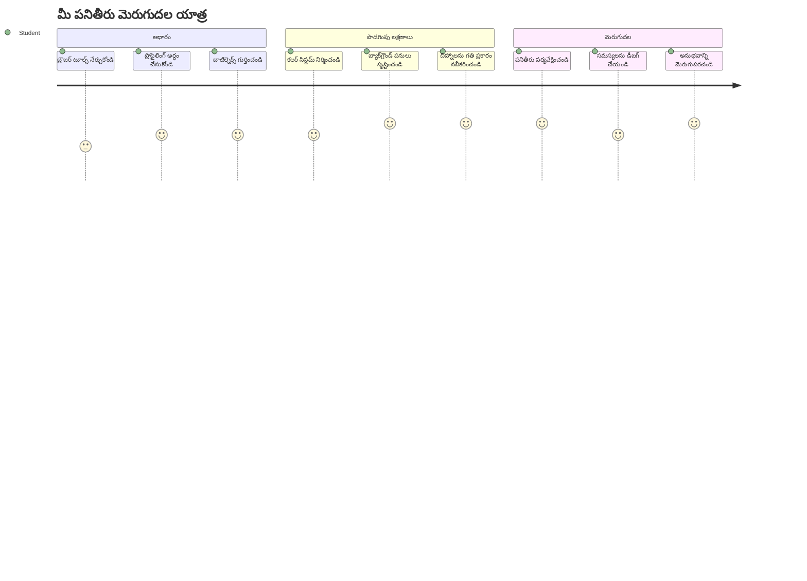
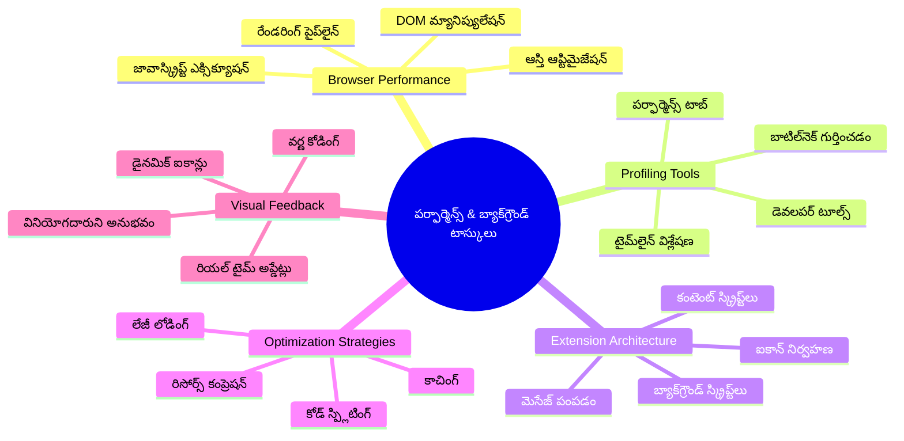
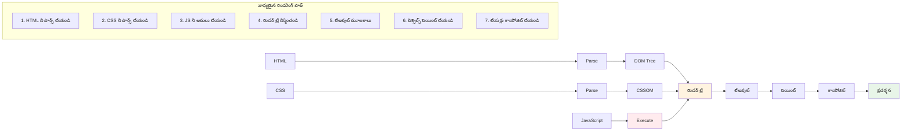
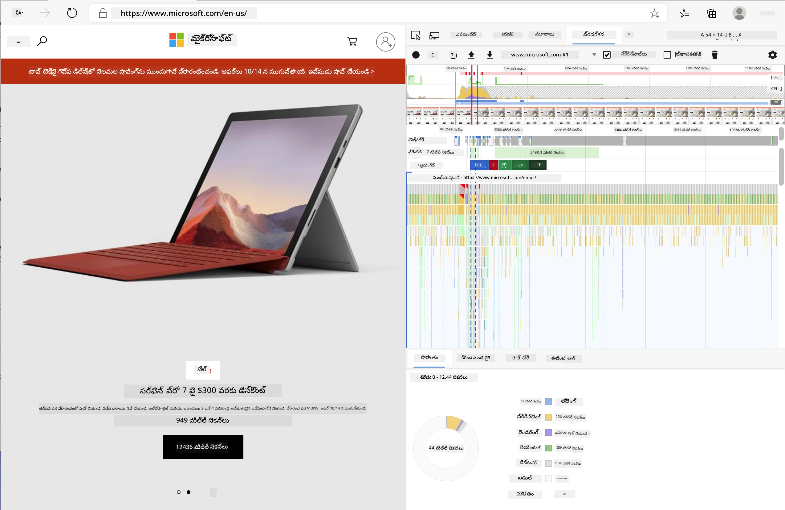
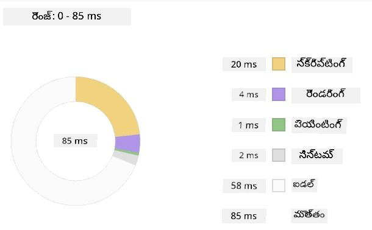
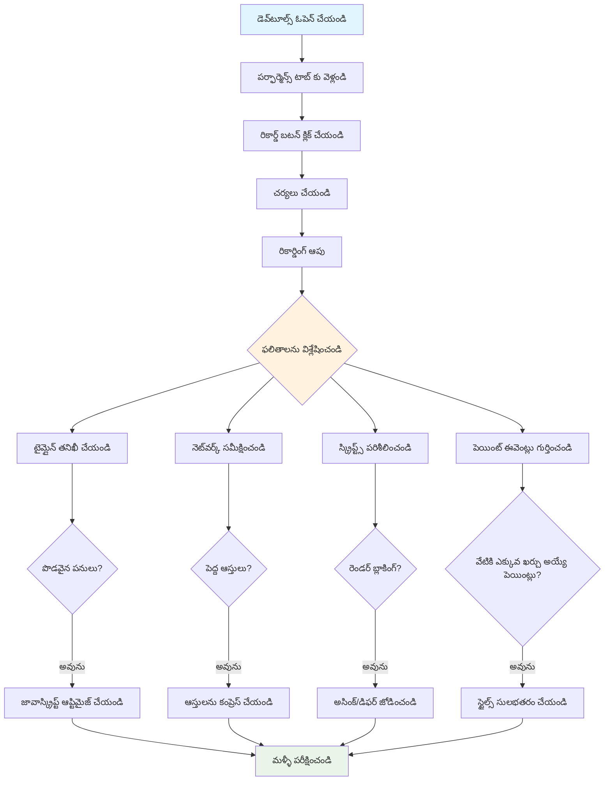
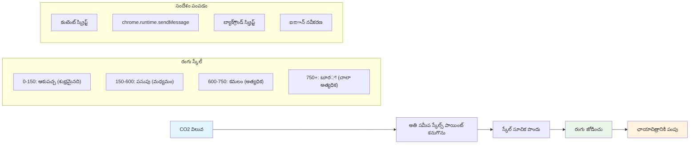
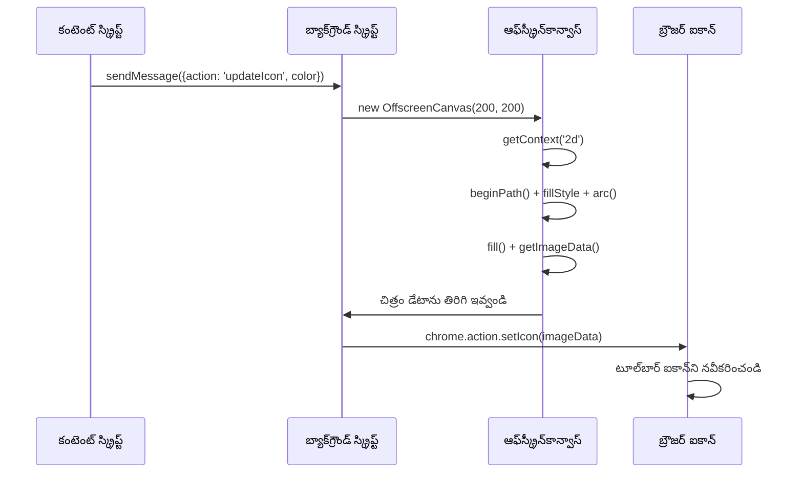
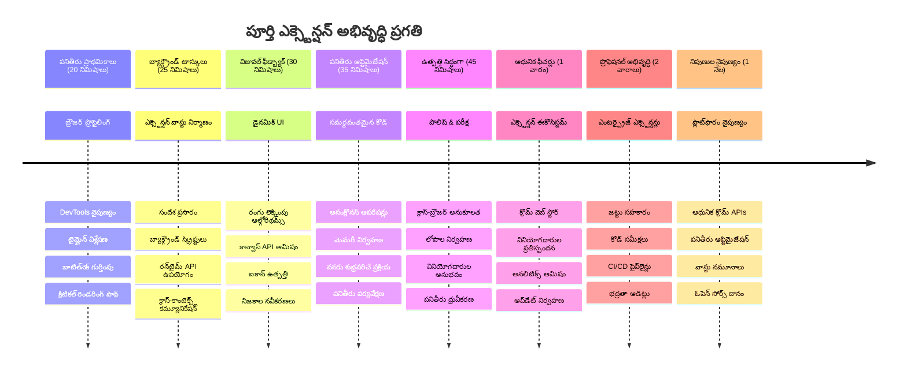

# Browser Extension Project Part 3: బ్యాక్‌గ్రౌండ్ టాస్కులు మరియు పనితీరు గురించి తెలుసుకోండి


కొన్ని బ్రౌజర్ ఎక్స్‌టెన్షన్‌లు త్వరగా మరియు స్పందించడానికి కారణం ఏమిటి అని ఎప్పుడైనా సంశయంగా ఉంది? ఇతరవారు మింది మెల్లగా అనిపిస్తే? రహస్యం సీన్‌గురించి జరుగుతున్నది. మీరు మీ ఎక్స్‌టెన్షన్ ఇంటర్‌ఫేస్‌లో క్లిక్ చేసినపుడు, బ్యాక్‌గ్రౌండ్‌లో డేటా ఫెచింగ్, ఐకాన్ అప్డేట్లు, మరియు సిస్టమ్ వనరుల నిర్వహణ హ్మారంగా జరుగుతుంది.

ఇది బ్రౌజర్ ఎక్స్‌టెన్షన్ సిరీస్‌లోని మా చివరి పాఠం, మరియు మేము మీ కార్బన్ ఫుట్‌ప్రింట్ ట్రాకర్ సాఫ్ట్‌గా పనిచేయిస్తాము. మీరు డైనమిక్ ఐకాన్ అప్డేట్లు జోడిస్తారు మరియు పనితీరు సమస్యలు సమస్యలుగా మారడానికి ముందుగానే గుర్తించటం నేర్చుకుంటారు. ఇది ఒక రేస్ కారును ట్యూన్ చేయడం లాంటిది - చిన్న ఆప్టిమైజేషన్లు వలన మొత్తం వ్యవస్థ ఎలా চলে అనేది చాలా మారుతుంది.

మనం ముగించేప్పుడు, మీ దగ్గర మెరుగైన ఎక్స్‌టెన్షన్ ఉండె మరియు మంచివి వెబ్ యాప్లను గొప్పవలె వేరుచేసే పనితీరు సూత్రాలు అర్థం చేసుకుంటారు. బ్రౌజర్ ఆప్టిమైజేషన్ ప్రపంచంలోకి దూకుకుందాం.

## ముందస్తు పాఠం క్విజ్

[Pre-lecture quiz](https://ff-quizzes.netlify.app/web/quiz/27)

### పరిచయం

మునుపటి పాఠాలలో మీరు ఒక ఫారం నిర్మించారు, దాన్ని APIకు కనెక్ట్ చేశారు, అసింక్రనస్ డేటా ఫెచింగ్ ను పరిష్కరించారు. మీ ఎక్స్‌టెన్షన్ బాగా రూపుదిద్దుకుంటోంది.

ఇప్పుడు మనం చివరి ట్విస్ట్‌లు జోడించాలి - ఆ ఎక్స్‌టెన్షన్ ఐకాన్ కార్బన్ డేటా ఆధారంగా రంగులను మార్చేలా చేయడం. ఇది నాసా అపోలో అంతరిక్ష నౌకలో ప్రతి సిస్టమ్ ఆప్టిమైజ్ చేయాల్సి వచ్చిన విధానాన్ని గుర్తుకు తెస్తుంది. వారు ఖర్చు లేకుండా సైకిళ్ళు లేదా మెమొరీ వాయిదా పెట్టలేకపోయారు ఎందుకంటే పనితీరు మీద ప్రాణాలు ఆధారపడ్డాయి. మన బ్రౌజర్ ఎక్స్‌టెన్షన్ అంత కీలకంగా లేకపోయినా, అదే సూత్రాలు వర్తిస్తాయి - సమర్థవంతమైన కోడ్ మంచిన యూజర్ అనుభవాలను సృష్టిస్తుంది.


## వెబ్ పనితీరు ప్రాథమికాలు

మీ కోడ్ సమర్థవంతంగా నడిచినపుడు, ప్రజలు వాస్తవంగా *భావిస్తారు* తేడాను. మీరు ఎప్పుడైనా ఒక పేజీ వెంటనే లోడ్ అయ్యిందని లేదా యానిమేషన్ సుగమంగా ఫ్లో అయ్యిందని గుర్తు పడుతుందా? అదే మంచి పనితీరు.

పనితీరు కేవలం వేగం గురించి కాదు - అది సహజంగా అనిపించే వెబ్ అనుభవాలను సృష్టించడం గురించి, చికాకు కలిగించే వాటిని కాకుండా. కంప్యూటింగ్ ప్రారంభ రోజుల్లో, గ్రేస్ హాపర్ ప్రసిద్ధిగా తన డెస్క్ పై ఒక నానోసెకండ్ (సుమారు ఒక్క అడుగు పొడవు తారలాంటి) ఉంచింది, ఇది ఒక బిలియన్‌వంతం సెకన్ లో వెలుతురు ఎంత పరుగు తీసుకొంటుందో చూపించడానికి. ఇది కంప్యూటింగ్ లో ప్రతి మైక్రోసెకండ్ ఎందుకు ముఖ్యం అనేది వివరించడానికి ఆమె మార్గం. మేము ఇప్పుడు ఏమి ఆలస్యం చేస్తుందని కనుగొనడానికి డిటెక్టివ్ టూల్స్ ని పరిశీలిద్దాం.

> "వెబ్ సైట్ పనితీరు రెండు విషయాల గురించి: పేజీ ఎంత వేగంగా లోడ్ అవుతుంది, మరియు అందులో కోడ్ ఎంత వేగంగా నడుస్తుంది." -- [Zack Grossbart](https://www.smashingmagazine.com/2012/06/javascript-profiling-chrome-developer-tools/)

మీ వెబ్‌సైట్లను అన్ని రకాల డివైసుల్లో, అన్ని రకాల యూజర్లకు, అన్ని రకాల పరిస్థితులలో అగ్నిమంతమైన వేగంగా చేయడం గురించి విషయం విస్తృతంగా ఉంది. మీరు సాధారణ వెబ్ ప్రాజెక్టు లేదా బ్రౌజర్ ఎక్స్‌టెన్షన్ తగ్గించేటప్పుడు గుర్తుంచుకునే కొన్ని ముఖ్యాంశాలు ఇక్కడ ఉన్నాయి.

మీ సైట్ ఆప్టిమైజ్ ప్రారంభ దశలో అయినది ఏం జరుగుతున్నదో అర్థం చేసుకోవడం. సంతోషకరంగా, మీ బ్రౌజర్ చాలా శక్తివంతమైన డిటెక్టివ్ టూల్‌లతో వస్తుంది.


Edgeలో Developer Tools తెరవాలంటే, పై కుడి మూలల్లో మూడడ్లు క్లిక్ చేసి, More Tools > Developer Tools కు వెళ్ళండి. లేదా Windowsలో `Ctrl` + `Shift` + `I` లేదా Macలో `Option` + `Command` + `I` కొరకు కీబోర్డ్ షార్ట్‌కట్ వాడండి. అక్కడ చేరిన తర్వాత Performance ట్యాబ్ క్లిక్ చేయండి - మీ గూగుల్ వెబ్ యాప్ ఫిట్‌నెస్ ట్రాకర్ లాంటిది అదే.

**ఇది మీ పనితీరు డిటెక్టివ్ టూల్‌కిట్**  
- **Developer Tools** తెరవండి (మీరు సాధారణంగా దీన్ని వినియోగిస్తారు)  
- **Performance ట్యాబ్** కు వెళ్లండి - ఇది మీ వెబ్ యాప్ ఫిట్‌నెస్ ట్రాకర్ లాంటిది  
- **Record బటన్** క్లిక్ చేసి మీ పేజీని పరిశీలించండి  
- **ఫలితాలను** అధ్యయనం చేసి ఏం ఆలస్యం చేస్తోందో గుర్తించండి  

ఇదాన్ని ప్రయత్నించండి. ఒక వెబ్‌సైట్ ఓపెన్ చేయండి (Microsoft.com బాగా పనిచేస్తుంది) మరియు 'Record' బటన్ క్లిక్ చేయండి. ఇప్పుడు పేజీని రిఫ్రెష్ చేసి ప్రొఫైలర్ ప్రతి సందర్భం ఎలా జరుగుతుందో క్యాప్చర్ చేస్తుంది. రికార్డింగ్ ఆపినప్పుడు, బ్రౌజర్ 'scripts', 'renders', మరియు 'paints' చేసినవిధానాల విస్తృతంగా వివరాలు చూడవచ్చు. ఇది ఒక రాకెట్ లాంచ్ సమయంలో మిషన్ కంట్రోల్ ప్రతి వ్యవస్థను పరిశీలించే విధానం గుర్తొస్తుంది - మీరు ఏం జరిగిందో, ఎప్పుడు జరిగిందో రియల్ టైమ్ డేటా పొందగలుగుతారు.



✅ మరింత లోతుగా తెలుసుకోడానికి [Microsoft Documentation](https://docs.microsoft.com/microsoft-edge/devtools-guide/performance/?WT.mc_id=academic-77807-sagibbon) చూడండి

> ప్రో టిప్: టెస్టింగ్ ప్రారంభించేముందు మీ బ్రౌజర్ కాష్ క్లియర్ చేయండి, తద్వారా మొదటి సారి సందర్శించే వారికి మీ సైట్ ఎలా పని చేస్తుందో చూడవచ్చు - ఇది సాధారణంగా పునర్వినియోగంలో చేసిన విషయాల నుండి వేరు.

పేజీ లోడ్ సమయంలో జరిగే సంఘటనల్ని జూమ్ చేయడానికి ప్రొఫైల్ టైమ్‌లైన్‌లో ఎంపిక చేయండి.

పేజీ పనితీరు స్నాప్‌షాట్‌ను పొందడానికి ప్రొఫైల్ టైమ్‌లైన్ భాగాన్ని ఎంచుకుని సమరీ ప్యాను చూడండి:



ఏవైనా ఈవెంట్లు 15 మిల్లీసెకండ్ల కంటే ఎక్కువ సమయం తీసుకున్నాయా అంటే ఈవెంట్ లాగ్ ప్యాను చెక్ చేయండి:


✅ మీ ప్రొఫైలర్‌ను తెలుసుకోండి! ఈ సైట్ మీద డెవలపర్ టూల్స్ తెరవండి మరియు ఏ బాటిల్‌నెక్స్లు ఉన్నాయో చూడండి. ఏది మెల్లగా లోడ్ అవుతుంది? ఏది వేగంగా?


## ప్రొఫైలింగ్ చేస్తుండగా ఏమి గమనించాలి

ప్రొఫైలర్ నడిపించడం మొదటి దశ మాత్రమే - నిజమైన నైపుణ్యం ఆ రంగిన చార్ట్‌లు మీకువ్యక్తం చేసే అర్థం తెలుసుకోవడమే. నిరాశ చెందకండి, మీరు వాటిని చదవడం నేర్చుకుంటారు. అనుభవజ్ఞులైన డెవలపర్లు సమస్యలు పూర్తిగా చాకచక్యంగా మారితే ముందుగానే హెచ్చరికలు గమనించే పాడు సాధించారు.

సాధారణంగా పనితీరు సమస్యలు కలిగించే అంశాలను చర్చిద్దాం. ఎలా మారీ కూరియే తన లాబొరేటరీలో రేడియేషన్ లెవల్స్ జాగ్రత్తగా గమనించాల్సి వచ్చింది, అలాగే మనం కూడా కొన్ని నమూనాలను గమనించాలి, అవి సమస్యలు వెలుగులోకి రాక ముందే గుర్తించడం ముఖ్యం. ఆగడమూ మీరు (మరియు మీ యూజర్లు) చాలా బాధ నుండి రక్షిస్తుంది.

**ఆస్టు పరిమాణాలు**: వెబ్‌సైట్లు సంవత్సరాలుగా "భారీ" అవుతున్నాయి, మరియు ఎక్కువ భాగం దాని పరిమాణం చిత్రాల కంటే వచ్చింది. మనం మన డిజిటల్ సూట్‌కేస్‌ను ఎక్కువ మరియు ఎక్కువ పూర్తిగా నింపుతున్నాం.

✅ [Internet Archive](https://httparchive.org/reports/page-weight) చూడండి, ఏలా పేజీ పరిమాణాలు కాలక్రమేణా పెరిగాయి - ఇది చాలా సూచనీయంగా ఉంటుంది.

**మీ ఆస్తులను ఎలా ఆప్టిమైజ్ చేయాలి:**  
- **ఆ చిత్రాలను కంప్రెస్ చేయండి!** కొత్త ఫార్మాట్లు (WebP) ఫైల్ సైజులను చాలా తగ్గించగలవు  
- **ప్రతి డివైస్‌కు సరైన చిత్ర పరిమాణాన్ని సర్వ్ చేయండి** - ఫోన్లకు భారీ డెస్క్‌టాప్ చిత్రాలు పంపించాల్సిన అవసరం లేదు  
- **మీ CSS మరియు JavaScript ను మినిఫై చేయండి** - ప్రతి బైట్ ముఖ్యం  
- **లేజీ లోడింగ్ వాడండి** - చిత్రాలు యూజర్లు కలవరించినప్పుడు మాత్రమే డౌన్లోడ్ అవ్వాలి  

**DOM ట్రావర్సల్స్**: బ్రౌజర్ Document Object Model ను మీ కోడ్ ఆధారంగా నిర్మించాల్సి ఉంటుంది, కాబట్టి మంచి పనితీరు కోసం ట్యాగ్లు కనిష్టంగా ఉపయోగించాలి మరియు పేజీ కి అవసరమైన వాటిని మాత్రమే స్టైల్ చేయాలి. ఉదాహరణకు, ఒక పేజీకి మాత్రమే అవసరమైన CSSని ప్రధాన స్టైల్ షీట్ లో కలపకుండా ఆప్టిమైజ్ చేయాలి.

**DOM ఆప్టిమైజేషన్ ముఖ్య వ్యూహాలు:**  
- **HTML ఎలిమెంట్స్ మరియు నెస్టింగ్ లెవల్స్ ను కనిష్టం చేయి**  
- **ఉపయోగించని CSS నిబంధనలను తీసివేయి మరియు స్టైల్‌షీట్లను సమర్థవంతంగా సమ్మేళనం చేయి**  
- **ప్రతి పేజీకి అవసరమైన CSS మాత్రమే లోడ్ అయ్యేలా నిర్వహించు**  
- **HTML ని సెంటిమెంటిక్గా నిర్మించి బ్రౌజర్ పార్సింగ్ మెరుగుపరుచు**  

**JavaScript**: ప్రతి JavaScript డెవలపర్ ర Render-Blocking స్క్రిప్ట్‌లు ఉంటాయి అని గమనించాలి, అవి DOM ట్రావర్సింగ్ మరియు పేజీ చిత్రీకరణకు ముందు లోడ్ అవ్వాలి. మీరు inline స్క్రిప్ట్‌లకు `defer` వాడుతుంటే బాగుంటుంది (Terrarium మాడ్యూల్ నందు చేసినట్టు).

**ఆధునిక జావాస్క్రిప్ట్ ఆప్టిమైజేషన్ టెక్నిక్స్:**  
- **DOM పార్సింగ్ తరువాత స్క్రిప్ట్‌లు లోడ్ అయ్యేలా `defer` యాడ్ చేయండి**  
- **కోడు విభజన అమలు చేయండి** - అవసరమైన జావాస్క్రిప్ట్ మాత్రమే లోడ్ అవ్వాలి  
- **అవసరం లేని ఫంక్షనాలిటీకు లేజీ లోడింగ్ వాడండి**  
- **భారీ లైబ్రరీలు మరియు ఫ్రేమ్‌వర్క్‌లు తగ్గించండి**  

✅ కొన్ని సైట్లను [Site Speed Test](https://www.webpagetest.org/) వెబ్‌సైట్ లో పరీక్షించి సాధారణ తనిఖీలు ఎలా ఉంటాయో తెలుసుకోండి.

### 🔄 **గురుకులాక్షణిక తనిఖీ**  
**పనితీరు అవగాహన**: ఎక్స్‌టెన్షన్ ఫీచర్లను నిర్మించడానికి ముందు, ఈ విషయాలు తెలిసి ఉండాలి:  
- ✅ HTML నుండి పిక్సెల్స్ వరకు క్రిటికల్ రండరింగ్ పాత్ వివరించగలగాలి  
- ✅ వెబ్ అప్లికేషన్లలో సాధారణ పనితీరు బాటిల్‌నెక్స్ గుర్తించగలగాలి  
- ✅ బ్రౌజర్ డెవలపర్ టూల్స్ ని ఉపయోగించి పేజీ పనితీరు ప్రొఫైల్ చేయగలగాలి  
- ✅ ఆస్తుల పరిమాణం మరియు DOM సంక్లిష్టత వేగం ఎలా ప్రభావితం చేస్తుందో అర్థం చేసుకోవాలి  

**త్వరిత స్వ-పరీక్ష**: రేండర్ బ్లాకింగ్ జావాస్క్రిప్ట్ ఉన్నప్పుడు ఏమవుతుంది?  
*జవాబు: బ్రౌజర్ పేజీ పార్స్ చేయడం మరియు పేజీని రండర్ చేయడం ప్రారంభించే ముందు స్క్రిప్ట్ డౌన్లోడ్ చేసి నడిపించాలి*

**నిజ జీవిత పనితీరు ప్రభావం**:  
- **100ms ఆలస్యం**: యూజర్లు ఆలస్యం గమనిస్తారు  
- **1 సెకను ఆలస్యం**: యూజర్లు దృష్టి కోల్పోతారు  
- **3+ సెకన్లు**: 40% యూజర్లు పేజీని వదిలేస్తారు  
- **మొబైల్ నెట్‌వర్క్‌లు**: పనితీరు మరింత ముఖ్యం  

ఇప్పుడు మీరు పంపిన ఆస్తులను బ్రౌజర్ ఎలా రండర్ చేస్తుందో తెలుసుకున్నారని, మీ ఎక్స్‌టెన్షన్ పూర్తి చేయడానికి చివరి కొన్ని పనులు చూద్దాం:

### రంగును లెక్కించే ఫంక్షన్ సృష్టించండి

ఇప్పుడు ఒక ఫంక్షన్ సృష్టిద్దాం, ఇది సంఖ్యల డేటాను అర్థవంతమైన రంగులుగా మార్చుతుంది. ఇది ట్రాఫిక్ లైట్ వలె భావించండి - గ్రీన్ అంటే శుభ్రమైన ఎనర్జీ, రెడ్ అంటే అధిక కార్బన్ తీవ్రత.

ఈ ఫంక్షన్ మా API నుంచి CO2 డేటా తీసుకుని పర్యావరణ ప్రభావాన్ని సూచించే ఉత్తమ రంగును నిర్ణయిస్తుంది. శాస్త్రవేత్తలు ఓషన్ ఉష్ణోగ్రతలు, నక్షత్ర నిర్మాణం వంటి క్లిష్ట సాంకేతిక డేటాను రంగుల ద్వారానే విజువలైజ్ చేయటాన్ని గుర్తు చేసుకోండి. దీనిని `/src/index.js` లో `const` వేరియబుల్స్ తర్వాత చేర్చండి:


```javascript
function calculateColor(value) {
	// CO2 తీవ్రత స్కేల్‌ను నిర్వచించండి (గ్రాములు ప్రతి kWhకి)
	const co2Scale = [0, 150, 600, 750, 800];
	// గ్రీన్ (శుభ్రమైనది) నుండి డార్క్ బ్రౌన్ (అధిక కార్బన్) వరకు తగిన రంగులు
	const colors = ['#2AA364', '#F5EB4D', '#9E4229', '#381D02', '#381D02'];

	// మన ఇన్‌పుట్‌కి సన్నిహితమైన స్కేల్ విలువను కనుగొనండి
	const closestNum = co2Scale.sort((a, b) => {
		return Math.abs(a - value) - Math.abs(b - value);
	})[0];
	
	console.log(`${value} is closest to ${closestNum}`);
	
	// రంగు మ్యాపింగ్ కోసం సూచికను కనుగొనండి
	const num = (element) => element > closestNum;
	const scaleIndex = co2Scale.findIndex(num);

	const closestColor = colors[scaleIndex];
	console.log(scaleIndex, closestColor);

	// బ్యాక్‌గ్రౌండ్ స్క్రిప్ట్‌కు రంగు నవీకరణ సందేశం పంపించండి
	chrome.runtime.sendMessage({ action: 'updateIcon', value: { color: closestColor } });
}
```
  
**ఈ తెలివైన ఫంక్షన్ ని విరుచుకుపడుదాం:**  
- **రెండు అర్రేలను సృష్టిస్తుంది** - ఒకటి CO2 స్థాయిల కోసం, ఇంకొకటి రంగుల కోసం (గ్రీన్=పరిమళం, బ్రౌన్=మలినం!)  
- **మేము అందుకున్న CO2 విలువకి దగ్గరగా ఉన్న సరిపోల్చే విలువను వెతుకుతుంది** అర్రే సార్టింగ్ ద్వారా  
- **findIndex() పద్ధతితో సరిపోలే రంగును అందుకుంటుంది**  
- **మా ఎంపిక చేసిన రంగుతో క్రోమ్ బ్యాక్‌గ్రౌండ్ స్క్రిప్ట్ కి సందేశం పంపుతుంది**  
- **సూటిగా స్ట్రింగ్ ఫార్మాటింగ్ కోసం టెంప్లేట్ లిటరల్స్ (బ్యాక్‌టిక్స్) ఉపయోగిస్తుంది**  
- **అన్ని కోడ్‌ని const ప్రకటింపులతో కట్టు క్రమంగా ఉంచుతుంది**  

`chrome.runtime` [API](https://developer.chrome.com/extensions/runtime) మీరు ఎక్స్‌టెన్షన్ యొక్క నర్వస్ సిస్టమ్ లాంటిది - ఇది బ్యాక్‌గ్రౌండ్ కమ్యూనికేషన్ మరియు పనులను నిర్వహిస్తుంది:

> "chrome.runtime API ని బ్యాక్‌గ్రౌండ్ పేజీని రిట్రీవ్ చేయడానికి, మానిఫెస్ట్ వివరాలను తిరిగి పొందడానికి మరియు యాప్ లేదా ఎక్స్‌టెన్షన్ జీవనచక్రంలో ఈవెంట్స్ కు స్పందించడానికి వినియోగించండి. మీరు URL ల సాపేక్ష పాథ్‌ను పూర్తి URL లుగా మార్చడానికి కూడా ఈ API ని ఉపయోగించవచ్చు."

**Chrome Runtime API ఎందుకు పట్ల విలక్షణం:**  
- **మీ ఎక్స్‌టెన్షన్ లోని వివిధ భాగాలు ఒకదానితో మరొకటి మాట్లాడేలా చేస్తుంది**  
- **వినియోగదారు ఇంటర్‌ఫేస్ ఫ్రీజ్ కాకుండా బ్యాక్‌గ్రౌండ్ పనులను నిర్వహిస్తుంది**  
- **మీ ఎక్స్‌టెన్షన్ జీవనచక్ర ఈవెంట్స్‌ని నిర్వహిస్తుంది**  
- **స్క్రిప్ట్‌ల మధ్య సందేశ ప్రసారాన్ని సులభతరం చేస్తుంది**  

✅ మీరు ఈ ఎక్స్‌టెన్షన్‌ని Edge కోసం అభివృద్ధి చేస్తుంటే ఆశ్చర్యం కలగవచ్చు, మీరు Chrome API వాడుతున్నారు. కొత్త Edge బ్రౌజర్ క్రమంగా Chromium బ్రౌజింగ్ ఇంజిన్ పై పనిచేస్తుంది కాబట్టి ఈ టూల్స్ ఉపయోగించవచ్చు.


> **ప్రో టిప్**: మీరు ఒక బ్రౌజర్ ఎక్స్‌టెన్షన్ ప్రొఫైల్ చేయాలనుకుంటే, ప్రతీ ఎక్స్‌టెన్షన్ ప్రత్యేక బ్రౌజర్ ఇన్స్టెన్స్ అయ 있기 వలన, ఆ ఎక్స్‌టెన్షన్ లో నుండి డెవలపర్ టూల్స్ స్టార్ట్ చేయండి. ఇది ఎక్స్‌టెన్షన్ ప్రత్యేక పనితీరు మెట్రిక్స్‌కి యాక్సెస్ ఇస్తుంది.

### డిఫాల్ట్ ఐకాన్ రంగు సెట్ చేయండి

నిజమైన డేటా పొందటం మొదలుపెట్టేముందు, మన ఎక్స్‌టెన్షన్ కు ఒక ఆరంభ స్థానం ఇవ్వాలి. ఎవ్వరూ ఖాళీ లేదా పగులని ఐకాన్ మీద చూడటం ఇష్టం లేదు. మనం గ్రీన్ రంగును మొదటి రంగుగా సెట్ చేద్దాం, తద్వారా యూజర్లు ఎక్స్‌టెన్షన్ ఇన్‌స్టాల్ చేసిన మొదటినుండి అది పని చేస్తున్నట్లు అర్థం చేసుకుంటారు.

మీ `init()` ఫంక్షన్‌లో డిఫాల్ట్ గ్రీన్ ఐకాన్ ను సెట్ చేద్దాం:

```javascript
chrome.runtime.sendMessage({
	action: 'updateIcon',
	value: {
		color: 'green',
	},
});
```
  
**ఈ ప్రారంభీకరణ అందే ప్రయోజనాలు:**  
- **డిఫాల్ట్ స్టేట్‌గా న్యూట్రల్ గ్రీన్ కలర్ సెట్ చేస్తుంది**  
- **ఎక్స్‌టెన్షన్ లోడ్ అయినప్పుడు వెంటనే విజువల్ ఫీడ్‌బ్యాక్ అందిస్తుంది**  
- **బ్యాక్‌గ్రౌండ్ స్క్రిప్ట్‌తో కమ్యూనికేషన్ ప్యాటర్న్ ఏర్పరుస్తుంది**  
- **డేటా లోడ్ కావడానికి ముందు వినియోగదారులు పనిచేసే ఎక్స్‌టెన్షన్ చూస్తారు**  

### ఫంక్షన్‌ను కాల్ చేసి ఆహ్వానం అమలు చేయండి

ఇప్పుడు ప్రతీకి కनेक్ట్ చేద్దాం, కొత్త CO2 డేటా వచ్చినప్పుడు ఐకాన్ స్వయంచాలకంగ రంగును మార్చేలా. ఇది ఒక ఎలక్ట్రానిక్ పరికరంలో చివరి సర్క్యూట్ కనెక్ట్ చేయడంలా - ఒక్కొక్క భాగం కలిసి ఒక సిస్టమ్ గా పని చేస్తుంది.

API నుండి CO2 డేటా పొందిన తర్వాత ఈ లైన్ జోడించండి:

```javascript
// API నుండి CO2 డేటాను పొందిన తర్వాత
// let CO2 = data.data[0].intensity.actual;
calculateColor(CO2);
```
  
**ఈ ఇంటిగ్రేషన్ accomplishes:**  
- **API డేటా ప్రవాహాన్ని విజువల్ సూచికా వ్యవస్థతో కనెక్ట్ చేస్తుంది**  
- **కొత్త డేటా వచ్చినపుడు ఐకాన్ అప్డేట్లు ఆటోమాటిక్ గా ట్రిగ్గర్ అవుతాయి**  
- **ప్రస్తుతం కార్బన్ తీవ్రత ఆధారంగా రియల్ టైమ్ విజువల్ ఫీడ్‌బ్యాక్ అందిస్తుంది**  
- **డేటా ఫెచింగ్ మరియు ప్రదర్శన తర్కాన్ని విడగొడుతుంది**  

మరియు చివరగా, `/dist/background.js` లో ఈ బ్యాక్‌గ్రౌండ్ చర్య కాల్స్ కోసం లిసనర్ జోడించండి:

```javascript
// కంటెంట్ స్క్రిప్ట్ నుండి సందేశాలను వినండి
chrome.runtime.onMessage.addListener(function (msg, sender, sendResponse) {
	if (msg.action === 'updateIcon') {
		chrome.action.setIcon({ imageData: drawIcon(msg.value) });
	}
});

// కాన్వాస్ API ఉపయోగించి డైనమిక్ ఐకాన్‌ను అందించండి
// ఎనర్జీ లోలిపాప్ ఎక్స్‌టెన్షన్ నుండి తీర్చిదిద్దారు - చక్కటి లక్షణం!
function drawIcon(value) {
	// మెరుగైన పనితీరు కోసం ఆఫ్‌స్క్రీన్ కాన్వాస్ సృష్టించండి
	const canvas = new OffscreenCanvas(200, 200);
	const context = canvas.getContext('2d');

	// కార్బన్ తీవ్రతను సూచించే రంగు రంగు సర్కిల్‌ను రాయండి
	context.beginPath();
	context.fillStyle = value.color;
	context.arc(100, 100, 50, 0, 2 * Math.PI);
	context.fill();

	// బ్రౌజర్ ఐకాన్ కోసం చిత్రం డేటాను తిరిగి ఇవ్వండి
	return context.getImageData(50, 50, 100, 100);
}
```
  
**ఈ బ్యాక్‌గ్రౌండ్ స్క్రిప్ట్ ని ఎం చేస్తుంది:**  
- **మీ ప్రధాన స్క్రిప్ట్ నుండి సందేశాలు వింటుంది (ఒక రిసెప్షనిస్ట్ లాంటి పనితీరు)**  
- **'updateIcon' అభ్యర్థనలను ప్రాసెస్ చేస్తుంది, మీ టూల్‌బార్ ఐకాన్ మార్చడానికి**  
- **Canvas API ఉపయోగించి కొత్త ఐకాన్లు తయారు చేస్తుంది**  
- **ప్రస్తుత కార్బన్ తీవ్రతను చూపించే ఒక సులభ రంగుల వృత్తాన్ని డ్రా చేస్తుంది**  
- **ప్రమదమైన ఐకాన్‌తో బ్రౌజర్ టూల్‌బార్ అప్డేట్ చేస్తుంది**  
- **స్మూత్ పనితీరు కోసం OffscreenCanvas ఉపయోగిస్తుంది (UI బ్లాకింగ్ లేదు)**  

✅ మీరు Canvas API గురించి మరింత [Space Game lessons](../../6-space-game/2-drawing-to-canvas/README.md) లో నేర్చుకుంటారు.


### 🔄 **గురుకులాక్షణిక తనిఖీ**  
**పూర్తి ఎక్స్‌టెన్షన్ అర్ధం చేసుకోవడం**: మొత్తం వ్యవస్థపై మీ నైపుణ్యం నిర్ధారించుకోండి:  
- ✅ వివిధ ఎక్స్‌టెన్షన్ స్క్రిప్ట్‌ల మధ్య సందేశ ప్రసారం ఎలా జరుగుతుందో?  
- ✅ పనితీరు కోసం సాధారణ క్యాన్వాస్ కాకుండా OffscreenCanvas ఎందుకు వాడుతాం?
- ✅ క్రోమ్ రన్‌టైమ్ API విస్తరణ వాస్తవిక నిర్మాణంలో ఏ పాత్ర పోషిస్తుంది?
- ✅ రంగు గణన చరిత్రాల్గోరిథం డేటాను దృశ్య స్పందనకు ఎలా మ్యాప్ చేస్తుంది?

**పనితీరు పరిశీలనలు**: మీ విస్తరణ ఇప్పుడు చూపిస్తుంది:
- **ప్రభావవంతమైన సందేశం పంపిణీ**: స్క్రిప్ట్ సందర్భాల మధ్య శుభ్రంగా కమ్యూనికేషన్
- **ఆప్టిమైజ్డ్ రెండరింగ్**: OffscreenCanvas UI బ్లాకింగ్ నివారిస్తుంది
- **రియల్-టైమ్ అప్‌డేట్లు**: ప్రత్యక్ష డేటా ఆధారంగా డైనమిక్ ఐకాన్ మార్పులు
- **మేమరీ నిర్వహణ**: సరైన శుభ్రపరిచే మరియు వనరు నిర్వహణ

**మీ విస్తరణను పరీక్షించాల్సిన సమయం:**
- **అన్ని** `npm run build` తో నిర్మించండి
- **మీ విస్తరణను రీలోడ్ చేయండి** బ్రౌజర్‌లో (ఈ దశ మర్చిపోకండి)
- **మీ విస్తరణను ఓపెన్ చేయండి** మరియు ఆ ఐకాన్ రంగులు మారుతున్నట్టు చూడండి
- **ప్రత్యక్ష కార్బన్ డేటాకు ఎలా స్పందిస్తున్నదో పరిశీలించండి** ప్రపంచవ్యాప్తంగా నుండి

ఇప్పుడు మీరు ఒక చూపుతో మీ దుస్తుల భారం వేయడానికి మంచిది కాదా, లేక శుభ్రమైన శక్తి కోసం వేచే సమయం ఉందా అనేది తెలుసుకుంటారు. మీరు నిజంగా ఉపయోగకరమైనదాన్ని నిర్మించారు మరియు బ్రౌజర్ పనితీరును కూడా కూడ నేర్చుకున్నారు.

## GitHub Copilot ఏజెంట్ ఛాలెంజ్ 🚀

ఏజెంట్ మోడ్ ఉపయోగించి క్రింది ఛాలెంజ్ పూర్తి చేయండి:

**వివరణ:** బ్రౌజర్ విస్తరణ పనితీరును పర్యవేక్షించే సామర్థ్యాలను మెరుగుపరిచేందుకు విస్తరణలోని వివిధ భాగాల లోడ్ సమయాలను ట్రాక్ చేయడం మరియు ప్రదర్శించగల ఫీచర్ చేర్చండి.

**ప్రాంప్ట్:** సృష్టించండి ఒక పనితీరు పర్యవేక్షణ వ్యవస్థ, ఇది API నుండి CO2 డేటా పొందడానికి, రంగుల లెక్కించడం మరియు ఐకాన్ అప్‌డేట్ చేయడానికి తీసుకునే సమయాన్ని కొలిచి లాగ్ చేస్తుంది. ఒక ఫంక్షన్ `performanceTracker` ను జోడించండి, ఇది Performance API ని ఉపయోగించి ఈ ఆపరేషన్లను కొలుస్తుంది మరియు టైమ్‌స్టాంపులు మరియు వ్యవధి మీట్రిక్స్‌తో బ్రౌజర్ కన్సోల్‌లో ఫలితాలను ప్రదర్శిస్తుంది.

[agent mode](https://code.visualstudio.com/blogs/2025/02/24/introducing-copilot-agent-mode) గురించి మరింత తెలుసుకోండి.

## 🚀 ఛాలెంజ్

ఇది ఒక ఆసక్తికరమైన డిటెక్టివ్ మిషన్: సంవత్సరాలుగా ఉన్న కొన్ని ఓపెన్ సోర్స్ వెబ్‌సైట్లు (వికీపీడియా, GitHub లేదా Stack Overflow వంటి) ఎంచుకుని వారి కమిట్ చరిత్రలోకి దృష్టిపడండి. వారు ఎక్కడ పనితీరు మెరుగులు చేర్పుకున్నారు? ఎటువంటి సమస్యలు యావత్తూ తరలినవి?

**మీ పరిశోధనా విధానం:**
- **కమిట్ సందేశాలలో** "optimize," "performance," లేదా "faster" వంటి పదాలను శోధించండి
- **ప్యాటర్న్స్ కోసం చూడండి** - ఒకే రకాల సమస్యలను తిరిగి పరిష్కరిస్తూ ఉన్నారా?
- **ముఖ్య కారణాలను గుర్తించండి** వెబ్‌సైట్లను నెమ్మదింపజేసే వాటిని
- **మీ కనుగొనుగోలను పంచుకోండి** - ఇతర డెవలపర్లు నిజ జీవిత ఉదాహరణల నుండి నేర్చుకుంటారు

## పోస్ట్-లెక్చర్ క్విజ్

[Post-lecture quiz](https://ff-quizzes.netlify.app/web/quiz/28)

## సమీక్ష & స్వీయ అధ్యయనం

[performance newsletter](https://perf.email/) కోసం సైన్ అప్ కండి

బ్రౌజర్లు వెబ్ పనితీరు కొలవడంలో కొన్ని మార్గాలను వెబ్ టూల్స్ లోని పనితీరు టాబ్స్ చదవడంలో పరిశీలించండి. మీరు ఎటువంటి ప్రధాన తేడాలు కనుగొంటారా?

### ⚡ **తరువాత 5 నిమిషాల్లో మీరు చేయగలిగేది**
- [ ] బ్రౌజర్ Task Manager (Chrome లో Shift+Esc) ఓపెన్ చేసి విస్తరణ వనరు వినియోగాన్ని చూడండి
- [ ] DevTools Performance టాబ్ ఉపయోగించి వెబ్‌పేజీ పనితీరును రికార్డు చేయండి మరియు విశ్లేషించండి
- [ ] బ్రౌజర్ Extensions పేజి తనిఖీ చేయండి ఏ విస్తరణలు ప్రారంభ సమయాన్ని ప్రభావితం చేస్తున్నాయో చూడండి
- [ ] తాత్కాలికంగా విస్తరణలని అగుమెంట్ చేసి పనితీరు తేడాలు పరిశీలించండి

### 🎯 **ఈ గంటలో మీరు సాధించగలిగేది**
- [ ] పోస్ట్-లెసన్ క్విజ్ పూర్తి చేసి పనితీరు భావనలు అర్థం చేసుకోండి
- [ ] మీ బ్రౌజర్ విస్తరణ కోసం బ్యాక్‌గ్రౌండ్ స్క్రిప్ట్ అమలు చేయండి
- [ ] browser.alarms ఉపయోగించి సమర్థవంతమైన బ్యాక్‌గ్రౌండ్ పనులను నేర్చుకోండి
- [ ] కంటెంట్ స్క్రిప్ట్స్ మరియు బ్యాక్‌గ్రౌండ్ స్క్రిప్ట్స్ మధ్య సందేశం పంపిణీ అభ్యాసం
- [ ] మీ విస్తరణ వనరు వినియోగాన్ని కొలవడం మరియు ఆప్టిమైజ్ చేయడం

### 📅 **మీ వారాంత పనితీరు ప్రయాణం**
- [ ] హై-పర్ఫార్మెన్స్ బ్రౌజర్ విస్తరణను పూర్తిచేయండి బ్యాక్‌గ్రౌండ్ ఫంక్షనాలిటీతో
- [ ] సర్వీస్ వర్కర్లను మరియు ఆధునిక విస్తరణ నిర్మాణాన్ని స్వాధీనం చేసుకోండి
- [ ] సమర్థవంతమైన డేటా సింక్రోనైజేషన్ మరియు క్యాషింగ్ వ్యూహాలు అమలు చేయండి
- [ ] విస్తరణ పనితీరు కోసం అధునాతన డీబగ్గింగ్ సాంకేతికతలు నేర్చుకోండి
- [ ] ఫంక్షనాలిటీ మరియు వనరు సామర్థ్యం రెండింటికీ ఆప్టిమైజ్ చేయండి
- [ ] విస్తరణ పనితీరు సన్నివేశాలకు సమగ్ర పరీక్షలని సృష్టించండి

### 🌟 **మీ నెల విస్తరణ ఆప్టిమైజేషన్ నైపుణ్యం**
- [ ] ఎంటర్ప్రైజ్-గ్రేడ్ బ్రౌజర్ విస్తరణలను అధిక పనితీరు తో నిర్మించండి
- [ ] Web Workers, Service Workers, మరియు ఆధునిక వెబ్ పనితీరు గురించి నేర్చుకోండి
- [ ] పనితీరు ఆప్టిమైజేషన్ కి సంబంధించిన ఓపెన్ సోర్స్ ప్రాజెక్టులకు సహాయం చెయ్యండి
- [ ] బ్రౌజర్ ఇంటర్నల్స్ మరియు అధునాతన డీబగ్గింగ్ టెక్నిక్స్ మాస్టర్ చేయండి
- [ ] పనితీరు పర్యవేక్షణ సాధనాలు మరియు ఉత్తమ అభ్యాస గైడ్‌లను సృష్టించండి
- [ ] వెబ్ అప్లికేషన్ల ఆప్టిమైజేషన్‌లో సహాయం చేసే పనితీరు నిపుణుడిగా మారండి

## 🎯 మీ బ్రౌజర్ విస్తరణ నైపుణ్య కాలక్రమం


### 🛠️ మీ పూర్తి విస్తరణ అభివృద్ధి టూల్‌కిట్

ఈ త్రిలాజీ పూర్తి చేసాక, మీరు ఇప్పుడు పట్టు సాధించారు:
- **బ్రౌజర్ వాస్తవిక నిర్మాణం**: విస్తరణలు బ్రౌజర్ వ్యవస్థలతో ఏ విధంగా సమ్మిళితం అవుతాయో లోతైన అవగాహన
- **పనితీరు ప్రొఫైలింగ్**: డెవలపర్ టూల్స్ ఉపయోగించి ఇబ్బందులను గుర్తించి పరిష్కరించగలిగే సామర్థ్యం
- **అసంక్రోనస్ ప్రోగ్రామింగ్**: ప్రాధునిక JavaScript ప్యాటర్న్లు త్వరితగతిన, బ్లాక్ కానివ్వకుండా ఆపరేషన్ల కోసం
- **API ఇంటిగ్రేషన్**: ధృవీకరణ మరియు ఎర్రర్ హ్యాండ్లింగ్ తో బాహ్య డేటా ఫెచింగ్
- **దృశ్య డిజైన్**: డైనమిక్ UI అప్‌డేట్లు మరియు క్యాన్వాస్ ఆధారిత గ్రాఫిక్స్ ఉత్పత్తి
- **సందేశాలు పంపిణీ**: విస్తరణ నిర్మాణాలలో అంతర్గత‌స్క్రిప్ట్ కమ్యూనికేషన్
- **వినియోగదారు అనుభవం**: లోడింగ్ స్థితులు, లోపాల నిర్వహణ, మరియు సొగసైన ఇంటరాక్షన్లు
- **ఉత్పత్తి నైపుణ్యాలు**: నిజ జీవిత డిప్లాయ్‌మెంట్ కోసం పరీక్షలు, డీబగ్గింగ్, మరియు ఆప్టిమైజేషన్

**నిజ జీవిత అప్లికేషన్లు**: మీ విస్తరణ అభివృద్ధి నైపుణ్యాలు ప్రత్యక్షంగా వర్తిస్తాయి:
- **ప్రోగ్రెస్‌వ్ వెబ్ యాప్స్**: సమాన వాస్తవిక నిర్మాణం మరియు పనితీరు నమూనాలు
- **ఎలక్ట్రాన్ డెస్క్‌టాప్ యాప్స్**: వెబ్ సాంకేతికతలతో క్రాస్-ప్లాట్‌ఫారమ్ అప్లికేషన్లు
- **మొబైల్ హైబ్రిడ్ యాప్స్**: Cordova/PhoneGap అభివృద్ధి వెబ్ APIs ఉపయోగించి
- **ఎంటర్ప్రైజ్ వెబ్ అప్లికేషన్లు**: సంక్లిష్ట డాష్‌బోర్డ్లు మరియు ఉత్పాదకత సాధనాలు
- **క్రోమ్ DevTools విస్తరణలు**: అధునాతన డెవలపర్ సాధనాలు మరియు డీబగ్గింగ్
- **వెబ్ API ఇంటిగ్రేషన్**: బాహ్య సర్వీసులతో కమ్యూనికేట్ చేసే ఏ యాప్లికేషన్ గొలుసు

**వృత్తిపరమైన ప్రభావం**: మీరు ఇప్పుడు చేయగలరు:
- **అవగాహన నుండి డిప్లాయ్‌మెంట్ వరకు ఉత్పత్తి-సిద్ధ బ్రౌజర్ విస్తరణలను అభివృద్ధి చేయండి**
- **పనితీరు ప్రొఫైలింగ్ సాధనాలు ఉపయోగించి వెబ్ యాప్లికేషన్ పనితీరును ఆప్టిమైజ్ చేయండి**
- **మార్చగల సిస్టమ్‌లను తగిన విభాగాలడిపై నిర్మించండి**
- **సంక్లిష్ట అసింక్ ఆపరేషన్లు మరియు క్రాస్-కాంటెక్స్ కమ్యూనికేషన్ డీబగ్గ్ చేయండి**
- **ఓపెన్ సోర్స్ విస్తరణ ప్రాజెక్టులకు మరియు బ్రౌజర్ ప్రమాణాలకు సహకరించండి**

**తరువాతి స్థాయి అవకాశాలు**:
- **క్రోమ్ వెబ్ స్టోర్ డెవలపర్**: లక్షల వినియోగదారులకు విస్తరణలు ప్రచురించండి
- **వెబ్ పనితీరు ఇంజనీర్**: ఆప్టిమైజేషన్ మరియు వినియోగదారు అనుభవంపై ప్రత్యేకత
- **బ్రౌజర్ ప్లాట్‌ఫారమ్ అభివృద్ధికర్త**: బ్రౌజర్ ఇంజిన్ అభివృద్ధికి సహారా చేయండి
- **విస్తరణ ఫ్రేమ్‌వర్క్ సృష్టికర్త**: ఇతర డెవలపర్లకు సహాయపడే టూల్స్ నిర్మించండి
- **డెవలపర్ రిలేషన్‌ల్స్**: బోధన మరియు సక్తి సృజన ద్వారా జ్ఞానం పంచుకోండి

🌟 **ప్రాప్తి సాధన**: మీరు పూర్తి, కార్యనిర్వాహక బ్రౌజర్ విస్తరణను నిర్మించారు, ఇది వృత్తిపరమైన అభివృద్ధి పద్ధతులు మరియు ఆధునిక వెబ్ ప్రమాణాలను చూపిస్తుంది!

## అసైన్‌మెంట్

[Analyze a site for performance](assignment.md)

---

<!-- CO-OP TRANSLATOR DISCLAIMER START -->
**అస్పష్టత**:
ఈ పత్రాన్ని AI అనువాద సేవ [Co-op Translator](https://github.com/Azure/co-op-translator) ద్వారా అనువదించబడింది. మేము సంది నిబద్దతకు ప్రయత్నించినప్పటికీ, ఆటోమేటెడ్ అనువాదాలలో తప్పులైనా పొరపాట్లు ఉండొచ్చు. ప్రామాణిక మూలంగా స్థానిక భాషలోని అసలు పత్రాన్ని ఎంతగానో పరిగణించాలి. కీలకమైన సమాచారానికి, వృత్తిపరమైన మానవ అనువాదం చేయించుకోవాలని సిఫార్సు చేస్తున్నాము. ఈ అనువాదం వాడకంతో ఏర్పడిన ఏవైనా అపార్థాలు లేదా తప్పుతీర్మానాలకు మేము బాధ్యత వహించము.
<!-- CO-OP TRANSLATOR DISCLAIMER END -->