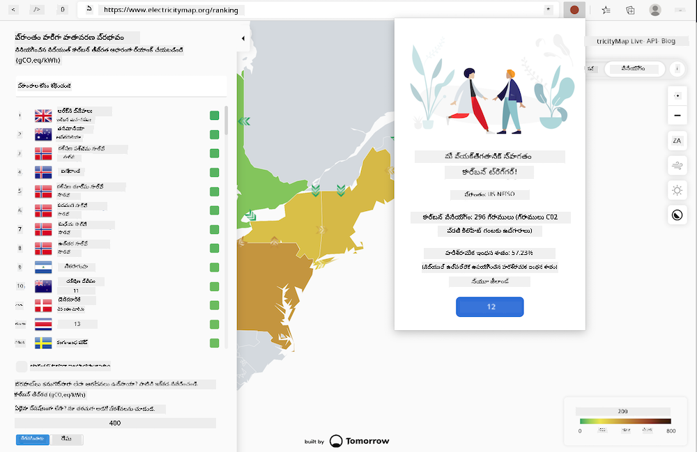
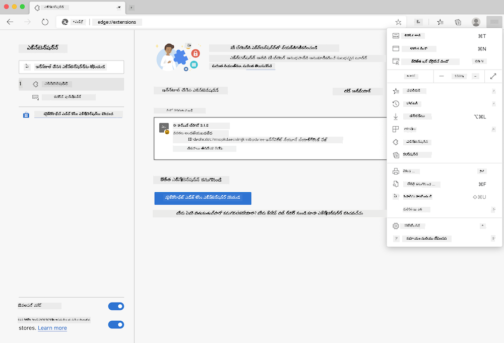

<!--
CO_OP_TRANSLATOR_METADATA:
{
  "original_hash": "9361268ca430b2579375009e1eceb5e5",
  "translation_date": "2026-01-08T16:11:44+00:00",
  "source_file": "5-browser-extension/solution/translation/README.fr.md",
  "language_code": "te"
}
-->
# Carbon Trigger బ్రౌజర్ ఎక్స్‌టెన్షన్: పూర్తి కోడ్

tmrow యొక్క CO2 సిగ్నల్ API ఉపయోగించి విద్యుత్ వినియోగాన్ని ట్రాక్ کرنے కోసం, మీరు మీ ప్రాంతంలోని విద్యుత్ వినియోగంపై నేరుగా మీ బ్రౌజర్‌లో ఒక రిమైండర్ ఉండేలా ఒక బ్రౌజర్ ఎక్స్‌టెన్షన్ సృష్టించండి. ఈ ప్రత్యేక ఎక్స్‌టెన్షన్ ఉపయోగించడం మీ కార్యకలాపాలను ఈ సమాచారంపై ఆధారపడి నిర్ణయం తీసుకోవడంలో మీకు సహాయం చేస్తుంది.



## ప్రారంభించండి

మీకు [npm](https://npmjs.com) ఇన్‌స్టాల్ చేసిన ఉండాలి. ఈ కోడ్ యొక్క ఒక కాపీని మీ కంప్యూటర్‌లోని ఒక ఫోల్డర్‌లో డౌన్లోడ్ చేసుకోండి.

అన్ని అవసరమైన ప్యాకేజీలను ఇన్‌స్టాల్ చేయండి:

```
npm install
```
  
webpack నుండి ఎక్స్‌టెన్షన్‌ని రూపొందించండి

```
npm run build
```
  
Edgeలో ఇన్‌స్టాల్ చేయాలంటే, బ్రౌజర్ యొక్క పైభాగం కుడి మూలలోని 'మూడు బిందువులు' మెనూలోనికి వెళ్లండి మరియు ఎక్స్‌టెన్షన్ ప్యానెల్ కనుగొనండి. అక్కడ నుండి, 'అన్‌జిప్ చేసిన ఎక్స్‌టెన్షన్ లోడ్ చేయండి'ని ఎంచుకుని కొత్త ఎక్స్‌టెన్షన్‌ను లోడ్ చేయండి. ప్రాంప్ట్ వచ్చినప్పుడు 'dist' ఫోల్డర్‌ను తెరవండి, ఎక్స్‌టెన్షన్ లోడ్ అవుతుంది. దీన్ని ఉపయోగించడానికి, CO2 Signal API కోసం API కీ అవసరం ([ఇక్కడ ఇమెయిల్ ద్వారా పొందండి](https://www.co2signal.com/) - ఈ పేజీలో మీ ఇమెయిల్ అడగండి) మరియు [ఎలక్ట్రిసిటీ మ్యాప్](https://www.electricitymap.org/map) కి సంబంధించిన [మీ ప్రాంతానికి కోడ్](http://api.electricitymap.org/v3/zones) (ఉదాహరణకు బోస్టన్‌లో నేను 'US-NEISO' ఉపయోగిస్తున్నాను).



API కీ మరియు ప్రాంతం ఎక్స్‌టెన్షన్ ఇంటర్‌ఫేస్‌లో ఎంటర్ చేసిన తర్వాత, బ్రౌజర్ ఎక్స్‌టెన్షన్ బార్‌లోని రంగు పాయింట్ మీ ప్రాంత విద్యుత్ వినియోగాన్ని ప్రతిబింబించేలా మారుతుంది మరియు ఏ ఎనర్జీ-ఇంతా కార్యకలాపాలు చేయడం మీకు సరిగా ఉండొచ్చో సూచిస్తుంది. ఈ 'పాయింట్లు' వ్యవస్థ వెనుక కాన్సెప్ట్ నాకు కాలిఫోర్నియా ఉద్గారాల కొరకు [Energy Lollipop ఎక్స్‌టెన్షన్](https://energylollipop.com/) ద్వారా అందించబడింది.

---

<!-- CO-OP TRANSLATOR DISCLAIMER START -->
**డిస్క్లెయిమర్**:
ఈ документа AI అనువాద సేవ [Co-op Translator](https://github.com/Azure/co-op-translator) ఉపయోగించి అనువదించబడింది. మనం ఖచ్చితత్వం కోసం ప్రయత్నించినప్పటికీ, ఆటోమేటెడ్ అనువాదాలలో లోపాలు లేదా అసమర్ధతలు ఉండవచ్చు. మూలపత్రం native భాషలోని డాక్యుమెంట్ అధికారిక మూలంగా భావించాలి. కీలక సమాచారం కోసం, ప్రొఫెషనల్ మానవ అనువాదం సూచించబడుతుంది. ఈ అనువాదం ఉపయోగించడంవల్ల ఏర్పడిన ఏదైనా తప్పుదోవ పట్టుకోవడం లేదా తార్కిక తప్పుదోవలకి మేము బాధ్యత వహించము.
<!-- CO-OP TRANSLATOR DISCLAIMER END -->