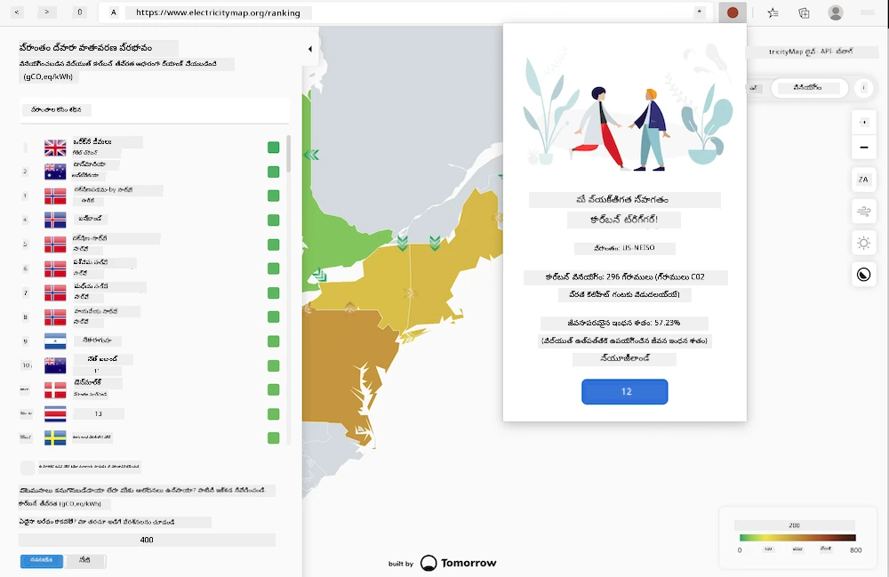
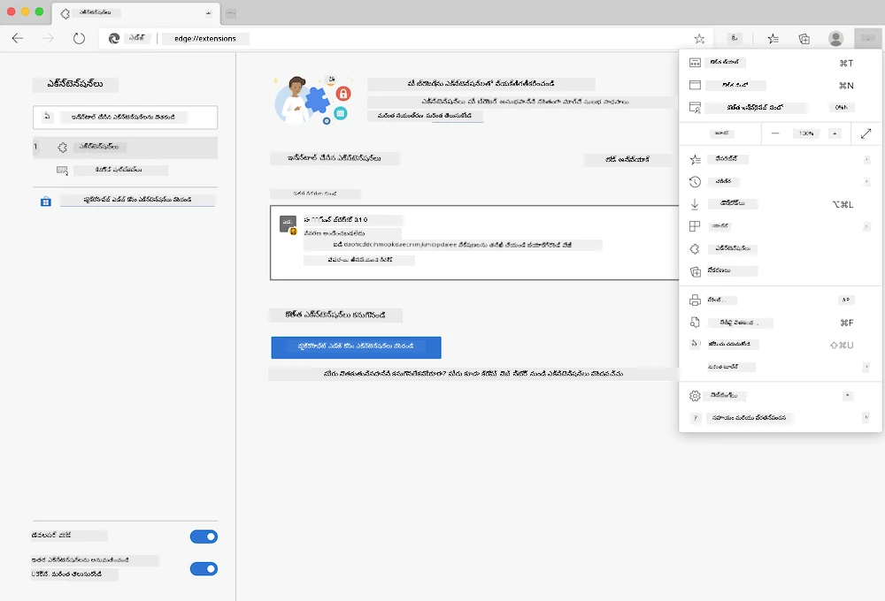

<!--
CO_OP_TRANSLATOR_METADATA:
{
  "original_hash": "26fd39046d264ba185dcb086d3a8cf3e",
  "translation_date": "2026-01-08T16:00:32+00:00",
  "source_file": "5-browser-extension/start/README.md",
  "language_code": "te"
}
-->
# కార్బన్ ట్రిగ్గర్ బ్రౌజర్ ఎక్స్టెన్షన్: స్టార్టర్ కోడ్

tmrow యొక్క CO2 సిగ్నల్ APIని ఉపయోగించి విద్యుత్ వినియోగాన్ని ట్రాక్ చేయడానికి, మీ ప్రాంతం విద్యుత్ వినియోగం ఎంత భారీగా ఉందో మీ బ్రౌజర్‌లోనే ఒక రిమైండర్ కలిగి ఉండేలా బ్రౌజర్ ఎక్స్టెన్షన్‌ని నిర్మించండి. ఈ ఎక్స్టెన్షన్‌ని అవసరమైనప్పుడు ఉపయోగించడం దాని ఆధారంగా మీ కార్యకలాపాలపై నిర్ణయాలు తీసుకోవడంలో సహాయపడుతుంది.



## ప్రారంభం

మీ కంప్యూటర్‌లో [npm](https://npmjs.com) ఇన్‌స్టాల్ చేయబడినదిగా ఉండాలి. ఈ కోడ్‌ను మీ కంప్యూటర్‌లో ఒక ఫోల్డర్‌కు డౌన్లోడ్ చేసుకోండి.

అవసరమైన అన్ని ప్యాకేజీలను ఇన్‌స్టాల్ చేయండి:

```
npm install
```

webpack నుండి ఎక్స్టెన్షన్‌ని నిర్మించండి

```
npm run build
```

Edgeలో ఇన్‌స్టాల్ చేయడానికి, బ్రౌజర్ యొక్క పై కుడి మూలలో ఉన్న 'మూడు డాట్' మెనూలను ఉపయోగించి ఎక్స్టెన్షన్స్ ప్యానెల్ కనుగొనండి. అక్కడి నుండి, కొత్త ఎక్స్టెన్షన్‌ని లోడ్ చేయడానికి 'Load Unpacked' ను ఎంచుకోండి. ప్రాంప్ట్ వద్ద 'dist' ఫోల్డర్‌ని ఓపెన్ చేయండి, ఆ ఎక్స్టెన్షన్ లోడ్ అవుతుంది. దీన్ని ఉపయోగించేందుకు, CO2 Signal యొక్క APIకి ఒక API కీ అవసరం ([ఇక్కడ ఇమెయిల్ ద్వారా పొందండి](https://www.co2signal.com/) - ఈ పేజీలో మీ ఇమెయిల్ పెట్టండి) మరియు [ఎలక్ట్రిసిటీ మ్యాప్](https://www.electricitymap.org/map) కు అనుగుణంగా మీ ప్రాంతానికి సంబంధించిన [కోడ్](http://api.electricitymap.org/v3/zones) (ఉదాహరణకు బోస్టన్ లో నేను 'US-NEISO' ఉపయోగిస్తాను).



API కీ మరియు ప్రాంతం ఎక్స్టెన్షన్ ఇంటర్‌ఫేస్‌లో ఇన్‌పుట్ చేసిన వెంటనే, బ్రౌజర్ ఎక్స్టెన్షన్ బార్‌లో ఉన్న రంగు డాట్ మీ ప్రాంతం యొక్క శక్తి వినియోగాన్ని ప్రతిబింబించేలా మారుతుంది మరియు ఎక్కువ శక్తి ఎక్కువగా ఉపయోగించే కార్యకలాపాలు మీకు అనుకూలంగా ఉండే సూచన ఇస్తుంది. ఈ 'డాట్' సిస్టమ్ వెనుక సంకల్పాన్ని నాకు [Energy Lollipop ఎక్స్టెన్షన్](https://energylollipop.com/) (కాలిఫోర్నియా ఉద్గారాల కొరకు) ఇచ్చింది.

---

<!-- CO-OP TRANSLATOR DISCLAIMER START -->
**డిస్క్లెయిమర్**:
ఈ డాక్యుమెంట్‌ను AI అనువాద సేవ [Co-op Translator](https://github.com/Azure/co-op-translator) ఉపయోగించి అనువదించబడింది. మేము ఖచ్చితత్వానికి ప్రయత్నించినప్పటికీ, ఆటోమేటిక్ అనువాదాల్లో తప్పులు లేదా అపార్ధాలు ఉండవచ్చు అని గమనించండి. అసలు డాక్యుమెంట్ దాని స్వదేశీ భాషలో అధికారిక మూలంగా పరిగణించబడాలి. ముఖ్యమైన సమాచారం కోసం, ప్రొఫెషనల్ انسانی అనువాదాన్ని చేపట్టడం ఉత్తమం. ఈ అనువాదం వాడుక వల్ల ఏర్పడిన ఏవైనా తప్పుదారులు లేదా అపార్థాల పరంగా మేము బాధ్యులు కము.
<!-- CO-OP TRANSLATOR DISCLAIMER END -->