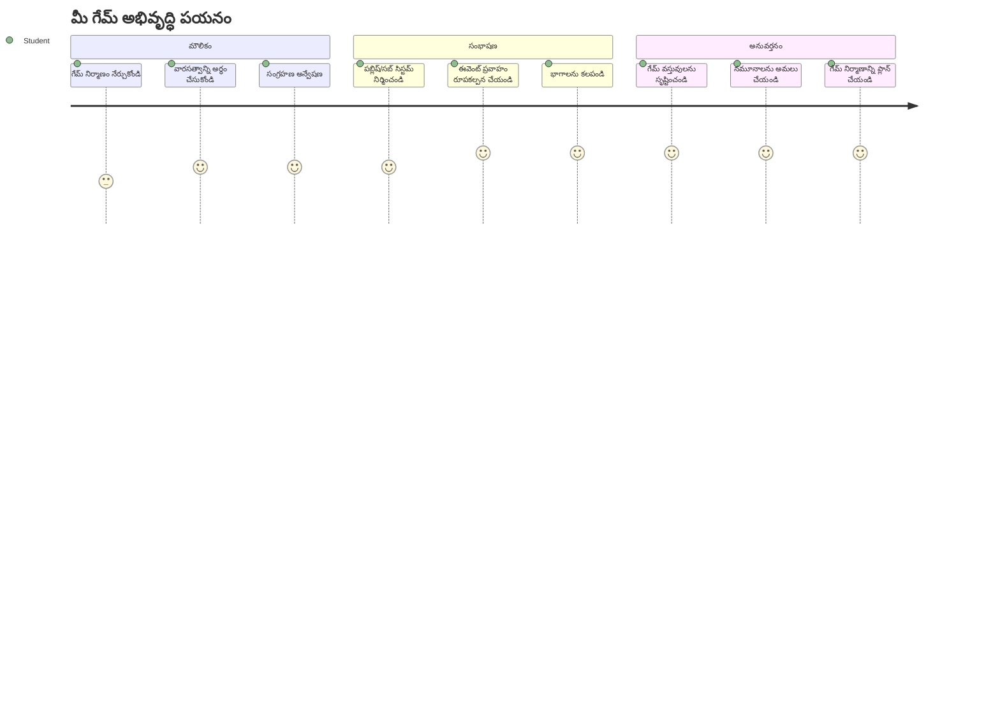
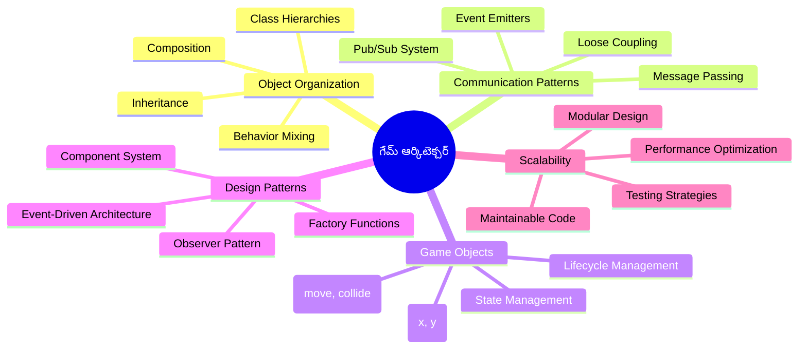
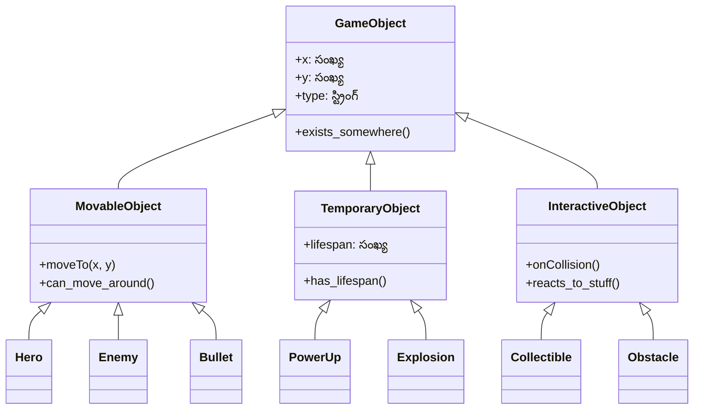
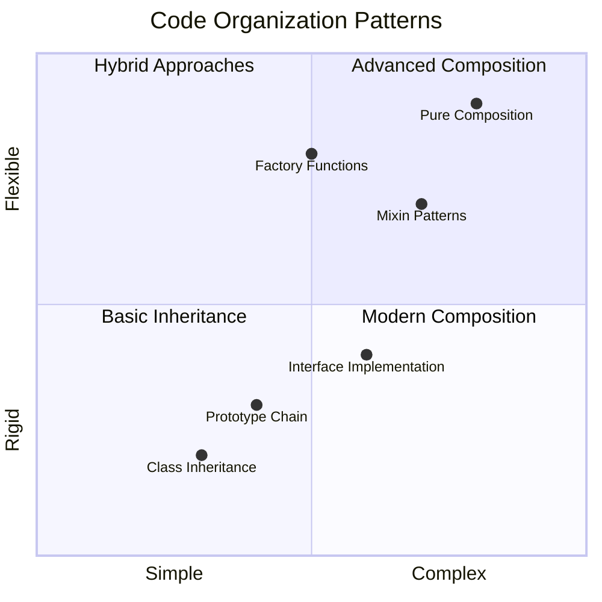
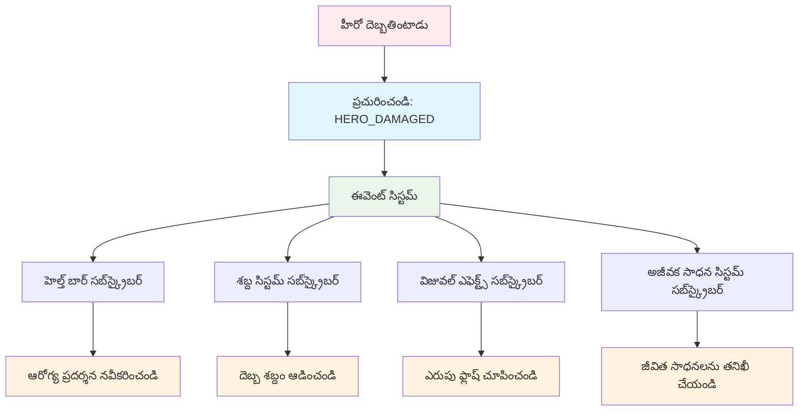
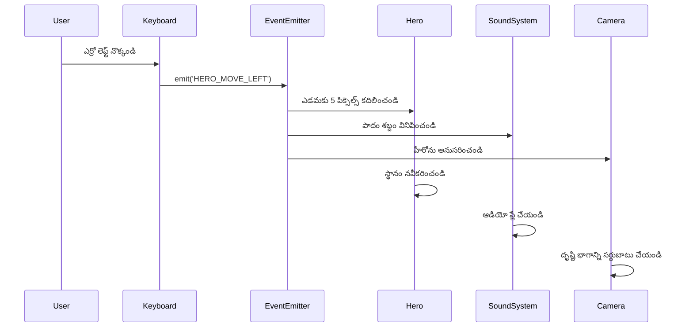
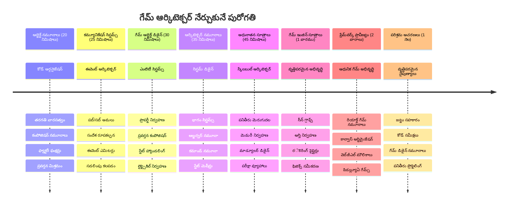

# స్పేస్ గేమ్ భాగం 1: పరిచయం




నాసా మిషన్ కంట్రోల్ ఒక స్పేస్ ప్రారంభ సమయంలో ఒకటి కంటే ఎక్కువ సిస్టమ్స్ సమన్వయం చేస్తున్నట్లు, మనం ఒక స్పేస్ గేమ్ ను తయారుచేస్తాము ఇది ప్రోగ్రామ్ యొక్క వేర్వేరు భాగాలు ఎలా సమన్వయంగా పనిచేస్తాయో చూపిస్తుంది. మీరు ప్రత్యక్షంగా ఆడగలిగే దాన్ని సృష్టిస్తున్న సమయంలో, మీరు ఏ సాఫ్ట్‌వేర్ ప్రాజెక్ట్‌కు కూడా వర్తించే ప్రధాన ప్రోగ్రామింగ్ సెంకల్పాలను నేర్పుకోగలుగుతారు.

మనం రెండు ప్రాథమిక కోడ్ సంస్థాపన పద్ధతులను పరిశీలిస్తాము: వారసత్వం మరియు కాంపోజిషన్. ఇవి మామూలు విద్యా సంభావనలు మాత్రమే కాక, వీటే వీడియో గేమ్స్ నుండి బ్యాంకింగ్ సిస్టమ్స్ వరకు అన్ని పనులను నడిపించే నమూనాలు. అంతేకాదు, మనం ఒక pub/sub అనే కమ్యూనికేషన్ సిస్టమ్ ని అమలు చేస్తాము, ఇది నౌకలో ఉపయోగించే కమ్యూనికేషన్ నెట్‌వర్క్‌ల్లా పనిచేస్తుంది, వేర్వేరు భాగాలు సమాచారం పంచుకునేందుకు ఆధారాలు లేకుండా అనుమతిస్తుంది.

ఈ సిరీస్ ముగింపులో, మీరు స్కేలింగ్ మరియు అభివృద్ధి అయ్యే అప్లికేషన్లు ఎలా తయారు చేయాలో అర్థం చేసుకుంటారు – మీరు గేమ్స్, వెబ్ అప్లికేషన్లు లేదా ఇతర సాఫ్ట్‌వేర్ వ్యవస్థలు అభివృద్ధి చేస్తున్నా.


## పీరు-లెక్చర్ క్విజ్

[పీరు-లెక్చర్ క్విజ్](https://ff-quizzes.netlify.app/web/quiz/29)

## గేమ్ అభివృద్ధిలో వారసత్వం మరియు కాంపోజిషన్

ప్రాజెక్ట్లు సంక్లిష్టంగా పెరిగే కొద్దీ, కోడ్ సంస్థాపన చాలా ముఖ్యమవుతుంది. సులభమైన స్క్రిప్ట్ గా ప్రారంభమైనది సరైన నిర్మాణం లేకపోతే నిర్వహించటం కష్టం అవుతుంది – అలా అపోల్లో మిషన్‌లు వేలాది భాగాల మధ్య జాగ్రత్తగా సమన్వయం అవసరమయ్యింది.

మనం రెండు ప్రాథమిక కోడ్ సంస్థాపన పద్ధతులను పరిశీలిస్తాము: వారసత్వం మరియు కాంపోజిషన్. ప్రతీదీ వేరువేరుగా ప్రయోజనాలు కలిగి ఉంటాయి మరియు ఎప్పటికప్పుడు తగిన దాన్ని ఎంచుకోవడానికి వీటిని గ్రహించడం సహాయపడుతుంది. మన స్పేస్ గేమ్ ద్వారా ఈ భావనలను చూపిస్తాము, ఇందులో హీరోలు, శత్రువులు, పవర్-అప్స్ మరియు ఇతర ఆబ్జెక్టులు సమర్ధవంతంగా పరస్పరం స్పందించాలి.

✅ అని చెప్పవచ్చు, అత్యంత ప్రసిద్ధ ప్రోగ్రామింగ్ పుస్తకాల్లో ఒకటి [డిజైన్ ప్యాటర్న్స్](https://en.wikipedia.org/wiki/Design_Patterns) గురించి.

ఎలాంటి గేమ్ లోనైనా మీకు కుడా `గేమ్ ఆబ్జెక్ట్లు` ఉంటుంది – ఇవి మీ గేమ్ ప్రపంచంలో పరస్పరం సంభాషిస్తున్న అంశాలు. హీరోలు, శత్రువులు, పవర్-అప్స్ మరియు విజువల్ ఎఫెక్ట్స్ అన్నీ గేమ్ ఆబ్జెక్ట్స్. ప్రతి ఒక్కటి `x` మరియు `y` విలువలను ఉపయోగించి నిర్దిష్ట స్క్రీన్ సమన్వయాల్లో ఉంటుంది, కార్టెసియన్ కోఆర్డికి సంభంధించి పాయింట్లు ప్లాట్లు చేయడంలా.

విజువల్ వైవిధ్యం ఉన్నప్పటికీ, ఈ ఆబ్జెక్టులు సాధారణ ప్రవర్తనలు కొంతవరకు పంచుకుంటాయి:

- **వారు ఎక్కడో ఉంటారు** – ప్రతి ఆబ్జెక్ట్ కి x మరియు y కోఆర్డినేట్‌లు ఉంటాయి, గేమ్ దాన్ని ఎక్కడ గీయాలో తెలుసుకోవడానికి
- **అన్నిసార్లు కదలగలిగే** – హీరోలు పరుగెత్తుతారు, శత్రువులు వెంటపడతారు, బుల్లెట్లు స్క్రీన్ మీద ఎగిరిపోతాయి
- **వారి జీవితం ఉంటుంది** – కొన్నికం నిరంతరం ఉంటాయి, మరికొన్ని (పടుపులు వంటివి) తక్షణమే కనబడతాయి మరి ఆ జరిగా పోతాయి
- **వాటికి ప్రతిస్పందనలు ఉంటాయి** – వస్తువులు ఢీకొన్నప్పుడు, పవర్-అప్స్ సేకరించబడుతున్నప్పుడు, హెల్త్ బార్‌లు నవీకరించబడతాయి

✅ పాక్-మ్యాన్ అలాంటి గేమ్ గురించి ఆలోచించండి. అందులో పై తెలిపిన నాలుగు ఆబ్జెక్ట్ రకాలని గుర్తించగలరా?


### కోడ్ ద్వారా ప్రవర్తనను వ్యక్తీకరించడం

గేమ్ ఆబ్జెక్టుల సామాన్య ప్రవర్తనలని మీరు గ్రహించినప్పుడు, ఇప్పుడు వాటిని JavaScript లో ఎలా అమలు చేయాలో పరిశీలిద్దాం. ఆబ్జెక్టుల ప్రవర్తన మేథడ్స్ ద్వారా వ్యక్తీకరించవచ్చు, అవి క్లాసులకు లేదా వ్యక్తిగత ఆబ్జెక్టులకు అనుబంధించబడవచ్చు మరియు ఎంపికచేసుకోవడానికి పలుఉన్నారూ పద్ధతులు ఉన్నాయి.

**క్లాస్-ఆధారిత పద్ధతి**

క్లాసులు మరియు వారసత్వం గేమ్ ఆబ్జెక్టులను నిర్మాణాత్మకంగా ఏర్పరచడానికి ఒక పద్ధతి అందిస్తుంది. కార్ల్ లినేఅస్ అభివృద్ధి చేసిన జంతు శాస్త్ర శ్రేణీకరణ వ్యవస్థ లాగా, మీరు సాధారణ లక్షణాలను కలిగిన బేస్ క్లాస్ తో మొదలు పెట్టి, ఆ ప్రాథమికాలను వారసత్వంగా పొందుతూ నిర్దిష్ట లక్షణాలు కలిగి ఉన్న క్లాసులను సృష్టిస్తారు.

✅ వారసత్వం ఒక ముఖ్యమైన భావన. దీని గురించి మరింత తెలుసుకోండి [MDN వారసత్వం వ్యాసంలో](https://developer.mozilla.org/docs/Web/JavaScript/Inheritance_and_the_prototype_chain).

ఇక గేమ్ ఆబ్జెక్టులను క్లాసులు మరియు వారసత్వంతో ఉపయోగించి ఎలా రూపొందించాలో చూద్దాం:

```javascript
// స్టెప్ 1: బేస్ గేమ్ ఆబ్జెక్ట్ క్లాస్‌ను సృష్టించండి
class GameObject {
  constructor(x, y, type) {
    this.x = x;
    this.y = y;
    this.type = type;
  }
}
```

**దాన్ని దశలవారీగా విభజిద్దాం:**
- ప్రతి గేమ్ ఆబ్జెక్ట్ ఉపయోగించగల ఒక మౌలిక టెంప్లేట్ ను సృష్టిస్తున్నాం
- కన్‌స్ట్రక్టర్ ఆబ్జెక్టు ఎక్కడ ఉందో (`x`, `y`) మరియు అది ఏ రకమైనదో భద్రపరుస్తుంది
- ఇది మీ అన్ని గేమ్ ఆబ్జెక్టులకు మౌలికంగా పనిచేస్తుంది

```javascript
// దశ 2: వారసత్వం ద్వారా ఉద్యమ సామర్థ్యాన్ని జోడించండి
class Movable extends GameObject {
  constructor(x, y, type) {
    super(x, y, type); // మాతృ కన్స్ట్రక్టర్‌ని పిలవండి
  }

  // కొత్త స్థానం క్రమంలో కరణత సామర్థ్యాన్ని జోడించండి
  moveTo(x, y) {
    this.x = x;
    this.y = y;
  }
}
```

**పైన ఉన్న లో:**
- గేమ్ ఆబ్జెక్ట్ క్లాస్ ను విస్తరించి మో ఉవ్‌మెంట్ ఫంక్షనాలిటీని జోడించాము
- `super()` ఉపయోగించి పేరెంట్ కన్‌స్ట్రక్టర్ ని పిలిచి వారసత్వపు అంశాలు ప్రారంభించాము
- ఆబ్జెక్టు స్థానం నవీకరించే `moveTo()` మెథడ్ ని జోడించాము

```javascript
// దశ 3: నిర్దిష్ట ఆట ఆబ్జెక్ట్ రకాలను సృష్టించండి
class Hero extends Movable {
  constructor(x, y) {
    super(x, y, 'Hero'); // రకం స్వయంచాలకంగా సెట్ చేయండి
  }
}

class Tree extends GameObject {
  constructor(x, y) {
    super(x, y, 'Tree'); // చెట్లకు కదలిక అవసరం లేదు
  }
}

// దశ 4: మీ ఆట ఆబ్జెక్టులను ఉపయోగించండి
const hero = new Hero(0, 0);
hero.moveTo(5, 5); // హీరో కదలగలడు!

const tree = new Tree(10, 15);
// tree.moveTo() లోపాన్ని కలిగిస్తుంది - చెట్లు కదలలేవు
```

**ఈ భావనలను అర్థం చేసుకోవడం:**
- సరైన ప్రవర్తనలను వారసత్వంగా పొందే ప్రత్యేక ఆబ్జెక్ట్ రకాల నిర్మాణం
- వారసత్వం ద్వారా ప్రత్యేక ఫీచర్ల ఎంపికను చూపిస్తుంది
- హీరోలు కదలగలరుగా, చెట్లు కదలరని చూపిస్తుంది
- క్లాస్ హైరార్కీ సరైన పనులను నిరోధించేందుకు బాధ్యత వహిస్తుంది

✅ మీరు కొన్ని నిమిషాలు పాక్-మ్యాన్ హీరో (ఇంకీ, పింకీ లేదా బ్లింకీ వంటి) ను మళ్ళీ JavaScript లో ఎలా రాయగలరో ఊహించండి.

**కాంపోజిషన్ పద్ధతి**

కాంపోజిషన్ ఒక మాడ్యులర్ డిజైన్ సూత్రాన్ని అనుసరిస్తుంది, ఇంజనీర్లు నౌకలను పరస్పరం మార్చలేనిర భాగాలతో ఎలా డిజైన్ చేసారో అంతే. పేరెంట్ క్లాస్ నుండి వారసత్వం పొందకుండా, మీరు నిర్దిష్ట ప్రవర్తనలను కలుపుతూ ఆబ్జెక్టులను వీలైనంత అవసరమైన విధంగా తయారు చేస్తారు. ఈ పద్ధతి కఠినమైన హైరార్కికల్ బంధాల లేని లవచీకృతతను అందిస్తుంది.

```javascript
// దశ 1: ప్రాథమిక ప్రవర్తన వಸ್ತువులు సృష్టించండి
const gameObject = {
  x: 0,
  y: 0,
  type: ''
};

const movable = {
  moveTo(x, y) {
    this.x = x;
    this.y = y;
  }
};
```

**ఈ కోడ్ చేసినది:**
- స్థానం మరియు రకం లక్షణాలతో బేస్ `gameObject` ను నిర్వచిస్తుంది
- మో వ్‌మెంట్ ఫంక్షనాలిటీ కలిగిన ప్రత్యేక `movable` ప్రవర్తన ఆబ్జెక్టుని సృష్టిస్తుంది
- స్థానం డేటా మరియు మో ఉవ్‌మెంట్ లాజిక్ ని స్వతంత్రంగా ఉంచి బాధ్యతలను విడగొడుతుంది

```javascript
// దశ 2: ప్రవర్తనలను సమ్మిళితం చేసి వస్తువులను నిర్మించండి
const movableObject = { ...gameObject, ...movable };

// దశ 3: వేర్వేறு వస్తువు రకాల కోసం ఫ్యాక్టరీ ఫంక్షన్లను సృష్టించండి
function createHero(x, y) {
  return {
    ...movableObject,
    x,
    y,
    type: 'Hero'
  };
}

function createStatic(x, y, type) {
  return {
    ...gameObject,
    x,
    y,
    type
  };
}
```

**పైన ఉన్న లో:**
- స్క్రిప్ట్ బ్రతుకులోని లక్షణాలు మరియు మో ఉవ్‌మెంట్ ప్రవర్తనను స్ప్రడ్ సింటాక్స్ తో కలిపారు
- కస్టమైజ్డ్ ఆబ్జెక్ట్స్ ఇస్తున్న ఫ్యాక్టరీ ఫంక్షన్లను సృష్టించారు
- కఠినమైన క్లాస్ హైరార్కీల లేకుండా సరళమైన ఆబ్జెక్ట్ సృష్టి అందించారు
- ఆబ్జెక్టులు తగిన ప్రవర్తనలను మాత్రమే కలిగి ఉండగలవు

```javascript
// దశ 4: మీ రూపొందించబడిన వస్తువులను సృష్టించి ఉపయోగించండి
const hero = createHero(10, 10);
hero.moveTo(5, 5); // పూర్తిగా పని చేస్తుంది!

const tree = createStatic(0, 0, 'Tree');
// tree.moveTo() నిర్వచించబడలేదు - ఎలాంటి చలనం ప్రవర్తన రూపొందించబడలేదు
```

**ముఖ్యాంశాలు గుర్తుంచుకోవాలి:**
- వారసత్వం కాకుండా ప్రవర్తనలను మిక్స్ చేయడం వలన ఆబ్జెక్టులను కంపోస్ చేస్తుంది
- కఠినమైన వారసత్వ హైరార్కీల కంటే ఎక్కువ లవచీకృతతను అందిస్తుంది
- ఆబ్జెక్టులకు తగిన లక్షణాలు మాత్రమే కల్పిస్తుంది
- తాజా జావాస్క్రిప్ట్ స్ప్రిస్ సింటాక్స్ ఉపయోగించి సాఫీగా ఆబ్జెక్టులను కలిపిస్తుంది
```

**Which Pattern Should You Choose?**

**Which Pattern Should You Choose?**



> 💡 **ప్రొ టిప్**: ఆధునిక జావాస్క్రిప్ట్ అభివృద్ధిలో రెండు నమూనాలు కూడా ప్రాముఖ్యం కలిగి ఉంటాయి. క్లాసులు స్పష్టమైన హైరార్కీల కోసం బాగుంటాయి, కాంపోజిషన్ వ్యక్తిగత స్వేచ్ఛ అవసరమైతే మెరుస్తుంది.
> 
**ప్రతి పద్ధతిని ఎప్పుడు ఉపయోగించాలో:**
- స్పష్టమైన "is-a" సంబంధాలు ఉన్నప్పుడు వారసత్వం ఎంచుకోండి (హీరో ఒక మోవబుల్ ఆబ్జెక్ట్)
- "has-a" సంబంధాలు ఉన్నప్పుడు కాంపోజిషన్ ఎంచుకోండి (హీరోకి మో వ్‌మెంట్ సామర్థ్యాలు ఉంటాయి)
- మీ టీమ్ యొక్క ఇష్టాలు మరియు ప్రాజెక్టు అవసరాలను పరిగణించండి
- ఒకే అప్లికేషన్ లో రెండు పద్ధతులను కలపవచ్చు

### 🔄 **ఆచార్య తనిఖీ**
**ఆబ్జెక్ట్ సంస్థాపన అర్థం చేసుకోవడం**: కమ్యూనికేషన్ నమూనాలతో ముందుకు పోయేముందు మీరు:
- ✅ వారసత్వం మరియు కాంపోజిషన్ మధ్య తేడాను వివరించగలగాలి
- ✅ క్లాసులు వర్సస్ ఫ్యాక్టరీ ఫంక్షన్లు ఎప్పుడు ఉపయోగించాలో గుర్తించగలగాలి
- ✅ వారసత్వంలో `super()` కీవర్డ్ ఎలా పనిచేస్తుందో అర్థం చేసుకోవాలి
- ✅ గేమ్ అభివృద్ధికి ప్రతి పద్ధతికి ఉన్న లాభాలను తెలుసుకోవాలి

**త్వరిత స్వీయ పరీక్ష**: కదలగలిగే మరియు ఎగిరే శత్రువును (Flying Enemy) ఎలా సృష్టిస్తారు?
- **వారసత్వ పద్ధతి**: `class FlyingEnemy extends Movable`
- **కాంపోజిషన్ పద్ధతి**: `{ ...movable, ...flyable, ...gameObject }`

**ప్రాక్టికల్ సంబంధం**: ఈ నమూనాలు అన్ని చోట్ల కనిపిస్తాయి:
- **React కంపోనెంట్లు**: Props (కాంపోజిషన్) వర్సస్ క్లాస్ వారసత్వం
- **గేమ్ ఇంజన్లు**: Entity-component సిస్టమ్స్ కాంపోజిషన్ ఉపయోగిస్తాయి
- **మొబైల్ యాప్స్**: UI ఫ్రేమ్‌వర్క్స్ తరచూ వారసత్వ హైరార్కీలు ఉపయోగిస్తాయి

## కమ్యూనికేషన్ నమూనాలు: పబ్/సబ్ సిస్టమ్

అప్లికేషన్లు సంక్లిష్టత పెరిగినప్పుడు, భాగాల మధ్య సంభాషణను నిర్వహించడం క్లిష్టమవుతుంది. పబ్లిష్-సబ్‌స్క్రైబ్ నమూనా (పబ్/సబ్) రేడియో ప్రసారంతో ఇలాగే పని చేస్తుంది – ఒక ప్రసారకుడు ఒకేకాక అనేక గ్రహీతలికి సందేశాన్ని పంపగలడు, ఎవరు వినుతుందో తెలియకుండానే.

హీరోకు హాని పడినప్పుడు ఏమవుతుందో ఆలోచించండి: హెల్త్ బార్ నవీకరించడం, శబ్ద ప్రభావాలు, దృశ్య స్పందన. హీరో ఆబ్జెక్టును ఈ వ్యవস্থలతో నేరుగా కలపకుండా, పబ్/సబ్ హీరో "నష్టం పొందింది" అనే సందేశాన్ని ప్రసారం చేస్తుంది. ప్రతిస్పందించాల్సిన ఎవరికైనా ఆ సందేశాన్ని సబ్‌స్క్రైబ్ చేసి స్పందించవచ్చు.

✅ **పబ్/సబ్** అంటే 'పబ్లిష్-సబ్‌స్క్రైబ్'


### పబ్/సబ్ ఆర్కిటెక్షర్ అర్థం చేసుకోవడం

పబ్/సబ్ నమూనా మీ అప్లికేషన్ విభాగాలను స్వేచ్ఛగా సంభంధితంగా ఉంచుతుంది, అంటే అవి ప్రత్యక్ష ఆధారపడకుండా కలిసి పనిచేస్తాయి. ఈ వేరుగా ఉంటే మీ కోడ్ నిర్వహణ, పరీక్ష మరియు మార్చడాన్ని సులభతరం చేస్తుంది.

**పబ్/సబ్ లో కీలక పాత్రలు:**
- **సందేశాలు** – `'PLAYER_SCORED'` తరహా సాదాసీదా టెక్స్ట్ లేబుల్స్, ఏమైంది అని వివరిస్తుంది (మరింత సమాచారం తో కూడా)
- **పబ్లిషర్లు** – "ఎదురుచూస్తున్న అందరికీ ఏదో జరిగింది!" అని ఫిర్యాదు చేసే ఆబ్జెక్టులు
- **సబ్‌స్క్రైబర్లు** – "ఆ ఈవెంట్ నాకు ముఖ్యం" అని చెప్పి, వాటిని స్పందించే ఆబ్జెక్టులు
- **ఈవెంట్ సిస్టమ్** – సందేశాలు సరైన వినేవారికి చేర도록 చూసే మధ్యవర్తి

### ఈవెంట్ సిస్టమ్ నిర్మాణం

ఈ భావనలను చూపించే సరళమైన అయినా శక్తివంతమైన ఈవెంట్ సిస్టమ్ తయారుచేసుకుందాం:

```javascript
// దశ 1: ఈవెంట్ ఎమిట్టర్ క్లాస్ రూపొందించండి
class EventEmitter {
  constructor() {
    this.listeners = {}; // అన్ని ఈవెంట్ లిసనర్లను నిల్వ చేయండి
  }
  
  // నిర్దిష్ట సందేశ తరగతికి లిసనר్ని నమోదు చేయండి
  on(message, listener) {
    if (!this.listeners[message]) {
      this.listeners[message] = [];
    }
    this.listeners[message].push(listener);
  }
  
  // నమోదైన అన్ని లిసనర్లకు సందేశం పంపండి
  emit(message, payload = null) {
    if (this.listeners[message]) {
      this.listeners[message].forEach(listener => {
        listener(message, payload);
      });
    }
  }
}
```

**ఇక్కడ జరుగుతున్నది:**
- సరళమైన క్లాస్ ఉపయోగించి ఒక కేంద్ర ఈవెంట్ నిర్వహణ వ్యవస్థను సృష్టిస్తుంది
- సందేశ రకాలను అనుసరించి శ్రోతలను ఓబ్జెక్టులో నిల్వ చేస్తుంది
- కొత్త శ్రోతలను `on()` మెథడ్ ద్వారా నమోదు చేస్తుంది
- `emit()` ద్వారా అన్ని ఆసక్తిగల శ్రోతలకు సందేశాలను ప్రసారం చేస్తుంది
- సంబంధిత సమాచారాన్ని పంపేందుకు ఐచ్ఛిక డేటా పayload ను మద్దతు తీస్తుంది

### కలిపి చూస్తూ: ఒక ప్రాక్టికల్ ఉదాహరణ

ఇప్పుడు దీన్ని ప్రత్యక్షంగా చూద్దాం! పబ్/సబ్ ఎంత శుభ్రమైన మరియు లవచీకృతమయినదో చూపించే సరళమైన మో ఉవ్‌మెంట్ సిస్టమ్ ని నిర్మాణం చేద్దాం:

```javascript
// దశ 1: మీ సందేశ రకాల్ని నిర్వచించండి
const Messages = {
  HERO_MOVE_LEFT: 'HERO_MOVE_LEFT',
  HERO_MOVE_RIGHT: 'HERO_MOVE_RIGHT',
  ENEMY_SPOTTED: 'ENEMY_SPOTTED'
};

// దశ 2: మీ ఈవెంట్ సిస్టమ్ మరియు గేమ్ ఆబ్జెక్టుల్ని సృష్టించండి
const eventEmitter = new EventEmitter();
const hero = createHero(0, 0);
```

**ఈ కోడ్ చేసే పని:**
- సందేశ పేర్లలో తప్పులు నివారించేందుకు కాంస్టెంట్ ఆబ్జెక్టును నిర్వచిస్తుంది
- అన్ని కమ్యూనికేషన్ నిర్వహించేందుకు ఈవెంట్ ఎమిటర్ యొక్క ఒక ఇన్‌స్టాన్స్ ను సృష్టిస్తుంది
- ప్రారంభ స్థానంలో ఒక హీరో ఆబ్జెక్టును ప్రారంభిస్తుంది

```javascript
// దశ 3: ఈవెంట్ లిస్నర్లు (సబ్‌స్రైబర్లు) సెటప్ చేయండి
eventEmitter.on(Messages.HERO_MOVE_LEFT, () => {
  hero.moveTo(hero.x - 5, hero.y);
  console.log(`Hero moved to position: ${hero.x}, ${hero.y}`);
});

eventEmitter.on(Messages.HERO_MOVE_RIGHT, () => {
  hero.moveTo(hero.x + 5, hero.y);
  console.log(`Hero moved to position: ${hero.x}, ${hero.y}`);
});
```

**ఇక్కడ:**
- మో ఉవ్‌మెంట్ సందేశాలకు స్పందించే ఈవెంట్ లిస్నర్స్ ని నమోదు చేసాము
- మో ఉవ్ దిశను ఆధారంగా హీరో స్థానం ని నవీకరించాము
- హీరో స్థానం మార్పులను కన్సోల్ లో లాగ్ చేయడం జోడించాము
- ఇన్పుట్ నిర్వహణ నుండి మో ఉవ్‌మెంట్ లాజిక్ ను వేరుగా ఉంచాము

```javascript
// దశ 4: కీప్యాడ్ ఇన్‌పుట్‌ను ఈవెంట్స్ (ప్రచారకులు)తో అనుసంధానించండి
window.addEventListener('keydown', (event) => {
  switch(event.key) {
    case 'ArrowLeft':
      eventEmitter.emit(Messages.HERO_MOVE_LEFT);
      break;
    case 'ArrowRight':
      eventEmitter.emit(Messages.HERO_MOVE_RIGHT);
      break;
  }
});
```

**ఈ భావనాలు అర్థం చేసుకోండి:**
- కీబోర్డ్ ఇన్పుట్ తో గేమ్ ఈవెంట్ లను కఠిన బంధం లేకుండా కట్టుకుంటుంది
- ఇన్పుట్ సిస్టమ్ గేమ్ ఆబ్జెక్టులకు పరోక్షంగా కమ్యూనికేట్ చేయగలదు
- ఒకే కీబోర్డ్ ఈవెంట్ కు అనేక సిస్టమ్‌లు స్పందించగలవు
- కీ బైండింగ్స్ మార్చడం లేదా కొత్త ఇన్పుట్ పద్ధతులు జోడించటం సులభం


> 💡 **ప్రొ టిప్**: ఈ నమూనా యొక్క అందం లవచీకృతతలోనే ఉంది! మీరు సౌండ్ ఎఫెక్ట్స్, స్క్రీన్ షేక్ లేదా పార్టికల్ ఎఫెక్ట్స్ ను సులభంగా జోడించవచ్చు – ఉన్న కీబోర్డ్ లేదా మో ఉవ్ కోడ్ మార్చాల్సిన అవసరం లేకుండా.
> 
**ఈ పద్ధతి మీకు ఇష్టపడతారు ఎందుకు:**
- కొత్త ఫీచర్స్ జోడించడం చాలా సులభం – మీరు ఆసక్తి ఉన్న ఈవెంట్ లను వినండి
- ఒకేసారి అనేక అంశాలు ఒకే ఈవెంట్ కు స్పందించొచ్చు, పరస్పర ఆటంకం లేకుండా
- పరీక్షించడం సులభం ఎందుకంటే ప్రతీ భాగం స్వతంత్రంగా పనిచేస్తుంది
- ఏదైనా తప్పు తగిలితే, మీరు ఎక్కడ చూడాలో సునిశ్చితంగా తెలుసుకుంటారు

### ఎందుకు పబ్/సబ్ సమర్థవంతంగా స్కేలు అవుతుందో

పబ్/సబ్ నమూనా అప్లికేషన్లు సంక్లిష్టత పెరిగినప్పటికీ సరళతను రక్షిస్తుంది. పలు శత్రువులు, డైనామిక్ UI నవీకరణలు లేదా శబ్ద వ్యవస్థలను నిర్వహించినా, నమూనా పెరుగుతున్న స్కేల్ ని ఆర్కిటెక్చర్లో మార్పులు చేయకుండా ఎదుర్కొంటుంది. కొత్త ఫీచర్లు ఉన్న ఈవెంట్ సిస్టమ్ లో సులభంగా అనుసంధానమౌతాయి, స్థాపిత పనితీరు పై ప్రభావం లేకుండా.

> ⚠️ **సాధారణ తప్పు**: ప్రారంభంలో చాలా ప్రత్యేక సందేశ రకాలను సృష్టించవద్దు. విస్తృత విభాగాలతో మొదలుపెట్టి గేమ్ అవసరాలతో అనుగుణంగా మెరుగుపర్చండి.
> 
**అనుసరించవలసిన ఉత్తమ పద్ధతులు:**
- సంభంధిత సందేశాలను తర్కబద్ధమైన వర్గాలుగా గుంపు చేయండి
- ఏమి జరిగిందో స్పష్టంగా సూచించే వివరణాత్మక పేర్లను ఉపయోగించండి
- సందేశపు పayloadలను సరళంగా మరియు లక్ష్యంగా ఉంచండి
- బృంద సహకారం కొరకు మీ సందేశ రకాలను డాక్యుమెంట్ చేయండి

### 🔄 **ఆచార్య తనిఖీ**
**ఈవెంట్-చేయి ఆర్కిటెక్చర్ అర్థం చేసుకోవడం**: పూర్తి వ్యవస్థపై మీ అందుబాటును నిర్ధారించుకోండి:
- ✅ పబ్/సబ్ నమూనా భాగాల మధ్య కఠిన బంధాన్ని ఎలా నివారించుతుందో
- ✅ ఈవెంట్-ఆధారిత ఆర్కిటెక్చర్ తో కొత్త ఫీచర్స్ జోడించడం ఇంత సులభమని
- ✅ కమ్యూనికేషన్ ప్రవాహంలో EventEmitter పాత్ర ఏదో
- ✅ సందేశ కాంస్టెంట్లు బగ్స్ నివారించటంలో మరియు నిర్వహణ లో ఎలా సహాయపడతాయో

**డిజైన్ సవాలు**: ఈ గేమ్ సన్నివేశాలను పబ్/సబ్ తో ఎలా నిర్వహిస్తారు?
1. శత్రువు చనిపోవడం: స్కోర్ నవీకరణ, శబ్దం ప్లే, పవర్-అప్ సృష్టి, స్క్రీన్ నుండి తొలగింపు
2. లెవెల్ పూర్తి కాబోవడం: మ్యూజిక్ ఆపటం, UI చూపించడం, ప్రోగ్రెస్ నిల్వ, తదుపరి లెవెల్ లోడ్
3. పవర్-అప్ సేకరణ: సామర్థ్యాలు పెంచటం, UI నవీకరణ, ప్రభావం ప్లే, టైమర్ ప్రారంభం

**వృత్తిపరమైన సంబంధం**: ఈ నమూనా ఈ చోట్ల కనిపిస్తుంది:
- **ఫ్రంట్‌ఎండ్ ఫ్రేమ్‌వర్క్స్**: React/Vue ఈవెంట్ సిస్టమ్స్
- **బ్యాక్‌ఎండ్ సర్వీసెస్**: మైక్రోసర్వీస్ కమ్యూనికేషన్
- **గేమ్ ఇంజిన్లు**: Unity ఈవెంట్ సిస్టమ్
- **మొబైల్ డెవలప్‌మెంట్**: iOS/Android నోటిఫికేషన్ సిస్టమ్స్

---

## GitHub Copilot ఏజెంట్ సవాలు 🚀

ఏజెంట్ మోడ్ ఉపయోగించి ఈ సవాలును పూర్తి చేయండి:

**వివరణ:** వారసత్వం మరియు పబ్/సబ్ నమూనా రెండింటిని ఉపయోగించి ఒక సరళమైన గేమ్ ఆబ్జెక్ట్ సిస్టమ్ సృష్టించండి. వివిధ ఆబ్జెక్టులు ఒకరితో ఒకరు నేరుగా తెలియకుండానే ఈవెంట్ల ద్వారా కమ్యూనికేట్ చేయగలిగే ఒక ప్రాథమిక గేమ్ అమలు చేయండి.

**ప్రాంప్ట్:** ఈ క్రింది అవసరాలతో ఒక జావాస్క్రిప్ట్ గేమ్ సిస్టమ్ సృష్టించండి: 1) x, y కోఆర్డినేట్లు మరియు ఒక రకం ప్రాపర్టీ కలిగిన బేస్ GameObject క్లాస్ తయారు చేయండి. 2) GameObject ను విస్తరించే మరియు కదలగల Hero క్లాస్ సృష్టించండి. 3) GameObject ను విస్తరించే మరియు హీరోని కదలడం కోసం పూనుకునే Enemy క్లాస్ సృష్టించండి. 4) పబ్/సబ్ నమూనా కొరకు EventEmitter క్లాస్ అమలు చేయండి. 5) హీరో కదిలితే దగ్గర ఉన్న శత్రువులు 'HERO_MOVED' ఈవెంట్ తీసుకొని తమ స్థానాలు హీరో వైపు మార్చేలా ఈవెంట్ లిస్నర్స్ ఏర్పాటు చేయండి. ఆబ్జెక్టుల మధ్య కమ్యూనికేషన్ కన్సోల్ లో ఫలితాలు చూపించండి.

[ఏజెంట్ మోడ్ గురించి ఇక్కడ మరింత తెలుసుకోండి](https://code.visualstudio.com/blogs/2025/02/24/introducing-copilot-agent-mode).

## 🚀 సవాలు
పబ్-సబ్ ప్యాటర్న్ గేమ్ ఆర్కిటెక్చర్‌ను ఎలా మెరుగుపరచగలదో పరిశీలించండి. ఎవరు ఈవెంట్లు విడుదల చేయాలని మరియు సిస్టమ్ ఎలా స్పందించాల్సుందో గుర్తించండి. ఒక గేమ్ కాన్సెప్ట్ రూపకల్పన చేసి దాని భాగాల మధ్య సంభాషణ ప్యాటర్న్లను మ్యాప్ చేయండి.

## పోസ്റ്റ്-లెక్చర్ క్విజ్

[పోస్ట్-లెక్చర్ క్విజ్](https://ff-quizzes.netlify.app/web/quiz/30)

## సమీక్ష & స్వీయ అధ్యయనం

పబ్/సబ్ గురించి [ఇప్పుడు చదవండి](https://docs.microsoft.com/azure/architecture/patterns/publisher-subscriber/?WT.mc_id=academic-77807-sagibbon).

### ⚡ **తర్వాతి 5 నిమిషాల్లో మీరు చేయగలిగింది**
- [ ] ఏదైనా HTML5 గేమ్ ఆన్‌లైన్‌లో తెరిచి DevTools ఉపయోగించి దాని కోడ్ పరిశీలించండి
- [ ] ఒక సులభమైన HTML5 కన్వాస్ ఎలిమెంట్ సృష్టించి ఒక ప్రాథమిక ఆకారాన్ని వ్రాయండి
- [ ] సాదా యానిమేషన్ లూప్ సృష్టించడానికి `setInterval` ఉపయోగించి ప్రయత్నించండి
- [ ] కాన్వాస్ API డాక్యుమెంటేషన్‌ను అన్వేషించి డ్రాయింగ్ మాధ్యమాన్ని ప్రయత్నించండి

### 🎯 **ఈ గంటలో మీరు సాధించగలిగింది**
- [ ] పోస్ట్-పాఠం క్విజ్ పూర్తిచేసి గేమ్ డెవలప్‌మెంట్ భావనలను అర్థం చేసుకోండి
- [ ] మీ గేమ్ ప్రాజెక్ట్ నిర్మాణం HTML, CSS, JavaScript ఫైల్స్‌తో ఏర్పాటు చేయండి
- [ ] నిరంతరంగా నవీకరించి చిత్రీకరించే ప్రాథమిక గేమ్ లూప్ సృష్టించండి
- [ ] కన్వాస్‌పై మీ మొదటి గేమ్ స్ప్రైట్స్‌ను ఆకర్షించండి
- [ ] చిత్రాలు, శబ్దాల కోసం ప్రాథమిక ఆస్తి లోడ్ చేయుట అమలు చేయండి

### 📅 **మీ వారాంతపు గేమ్ సృష్టి**
- [ ] అన్ని యోజనాబద్ధ లక్షణాలతో పూర్తి స్పేస్ గేమ్ పూర్తి చేయండి
- [ ] మెరుగైన గ్రాఫిక్స్, శబ్ద ప్రభావాలు, మృదువైన యానిమేషన్లు జోడించండి
- [ ] గేమ్ రాష్ట్రాలు (ప్రారంభ స్క్రీన్, గేమ్‌ప్లే, గేమ్ ఓవర్) అమలు చేయండి
- [ ] స్కోరింగ్ వ్యవస్థ మరియు ప్లేయర్ పురోగతి ట్రాకింగ్ సృష్టించండి
- [ ] మీ గేమ్‌ను విభిన్న పరికరాలలో సుస్ఫుటంగా మరియు సులభంగా చేయండి
- [ ] మీ గేమ్‌ను ఆన్‌లైన్‌లో పంచుకుని ఆటగాళ్ల నుండి ఫీడ్‌బ్యాక్ సేకరించండి

### 🌟 **మీ నెలపాటు గేమ్ డెవలప్‌మెంట్**
- [ ] విభిన్న జానర్లను, యాంత్రికాలను అన్వేషించుకుని మెరుగైన గేమ్స్ తయారు చేయండి
- [ ] Phaser లేదా Three.js వంటి గేమ్ డెవలప్‌మెంట్ ఫ్రేమ్‌వర్క్ నేర్చుకోండి
- [ ] ఓపెన్ సోర్స్ గేమ్ డెవలప్‌మెంట్ ప్రాజెక్టులలో కృషి చేయండి
- [ ] ఉన్నత స్థాయి గేమ్ ప్రోగ్రామింగ్ ప్యాటర్న్లు, ఆప్టిమైజేషన్ నేర్చుకోండి
- [ ] మీ గేమ్ డెవలప్‌మెంట్ నైపుణ్యాలను ప్రదర్శించే పోర్ట్‌ఫోలియో సృష్టించండి
- [ ] గేమ్ డెవలప్‌మెంట్ మరియు ఇంటరాక్టివ్ మీడియా కోసం ఇతరులను మార్గదర్శనం చెయ్యండి

## 🎯 మీ గేమ్ డెవలప్‌మెంట్ మాస్టరీ టైమ్‌లైన్


### 🛠️ మీ గేమ్ ఆర్కిటెక్చర్ టూల్‌కిట్ సారాంశం

ఈ పాఠం పూర్తయిన తర్వాత, మీరు ఇప్పుడు:
- **డిజైన్ ప్యాటర్న్ మాస్టరీ**: వారసత్వం మరియు కంపోజిషన్ మార్పిడి ఫైచుల అవగాహన
- **ఈవెంట్-డ్రివెన్ ఆర్కిటెక్చర్**: స్కేలబుల్ కమ్యూనికేషన్ కోసం పబ్/సబ్ అమలు
- **ఆబ్జెక్ట్-ఓరియెంటెడ్ డిజైన్**: క్లాస్ హైరార్కీలు మరియు ప్రవర్తనా కంపోజిషన్
- **ఆధునిక జావాస్క్రిప్ట్**: ఫ్యాక్టరీ ఫంక్షన్స్, స్ప్రెడ్ సింటాక్స్, ES6+ ప్యాటర్న్స్
- **స్కేలబుల్ ఆర్కిటెక్చర్**: లూజ్ కాప్లింగ్ మరియు మాడ్యులర్ డిజైన్ సూత్రాలు
- **గేమ్ డెవలప్‌మెంట్ ఫౌండేషన్**: ఎంటిటీ సిస్టమ్స్ మరియు కంపONENT్ ప్యాటర్న్స్
- **ప్రొఫెషనల్ ప్యాటర్న్స్**: కోడ్ ఆర్గనైజేషన్‌కు ఇండస్ట్రీ-స్టాండర్డ్ దృక్పథాలు

**వాస్తవ ప్రపంచ అన్వయాలు**: ఈ ప్యాటర్న్లు నేరుగా వర్తిస్తాయి:
- **ఫ్రంటెండ్ ఫ్రేమ్‌వర్క్స్**: React/Vue భాగ ఆర్కిటెక్చర్ మరియు స్టేట్ మేనేజ్‌మెంట్
- **బ్యాకెండ్ సర్వీసెస్**: మైక్రోసర్వీస్ కమ్యూనికేషన్ మరియు ఈవెంట్-డ్రివెన్ సిస్టమ్స్
- **మొబైల్ డెవలప్‌మెంట్**: iOS/Android యాప్ ఆర్కిటెక్చర్ మరియు నోటిఫికేషన్ సిస్టమ్స్
- **గేమ్ ఇంజిన్లు**: Unity, Unreal, మరియు వెబ్-ఆధారిత గేమ్ డెవలప్‌మెంట్
- **ఎంటర్ప్రైజ్ సాఫ్ట్‌వేర్**: ఈవెంట్ సోర్సింగ్ మరియు పంపిణీ సిస్టమ్ డిజైన్
- **API డిజైన్**: RESTful సర్వీసెస్ మరియు రియల్-టైమ్ కమ్యూనికేషన్

**ప్రొఫెషనల్ నైపుణ్యాలు**: మీరు ఇప్పుడు చేయగలరు:
- **డిజైన్**: నిరూపిత ప్యాటర్న్లతో స్కేలబుల్ సాఫ్ట్‌వేర్ ఆర్కిటెక్చర్‌లు రూపొందించు
- **అమలు**: సంక్లిష్ట పరస్పర చర్యలను నిర్వహించే ఈవెంట్-డ్రివెన్ సిస్టమ్‌లు అమలు చేయి
- **ఎంచుకోండి**: వివిధ సందర్భాలకు అనుకూలమైన కోడ్ ఆర్గనైజేషన్ వ్యూహాలు
- **డీబగ్** మరియు సులభంగా నిర్వహించు లూజ్ కాపుల్ సిస్టమ్‌లు
- **కమ్యూనికేట్**: పరిశ్రమ-స్థాయి పదజాలం ఉపయోగించి సాంకేతిక నిర్ణయాలు తెలియజేయండి

**తరువాతి స్థాయి**: మీరు ఈ ప్యాటర్న్లను నిజమైన గేమ్‌లో అమలు చేయడానికి, ఉన్నత గేమ్ డెవలప్‌మెంట్ అంశాలను అన్వేషించడానికి లేదా ఈ ఆర్కిటెక్చర్ భావనలను వెబ్ అప్లికేషన్స్‌లో అన్వయించడానికి సిద్ధం!!

🌟 **హాసలైంది**: మీరు సాదాసీదా గేమ్స్ నుండి సంక్లిష్ట ఎంటర్ప్రైజ్ సిస్టమ్స్ వరకు అన్ని వర్గాల సాఫ్ట్‌వేర్ ఆర్కిటెక్చర్ ప్యాటర్న్లను మాస్టర్ చేసుకున్నారు!

## అసైన్‌మెంట్

[గేమ్ నమూనా రూపొందించండి](assignment.md)

---

<!-- CO-OP TRANSLATOR DISCLAIMER START -->
**స్పష్టీకరణ**:  
ఈ పత్రాన్ని AI అనువాద సేవ [Co-op Translator](https://github.com/Azure/co-op-translator) ఉపయోగించి అనువదించాం. మేము ఖచ్చితత్వం కోసం ప్రయత్నిస్తేనూ, స్వయంచాలక అనువాదాల్లో పొరపాట్లు లేదా అపూర్వతలు ఉండవచ్చు. స్థానిక భాషలో ఉన్న అసలు పత్రాన్ని అధికారిక మూలంగా పరిగణించాలి. ముఖ్యమైన సమాచారం కోసం ప్రొఫెషనల్ మానవ అనువాదం చేయించుకోవడం ఉత్తమం. ఈ అనువాదం ఉపయోగకారణం జరిగిన అపార్థాలు లేదా తప్పుబాటులకు మేము బాధ్యత వహించము.
<!-- CO-OP TRANSLATOR DISCLAIMER END -->