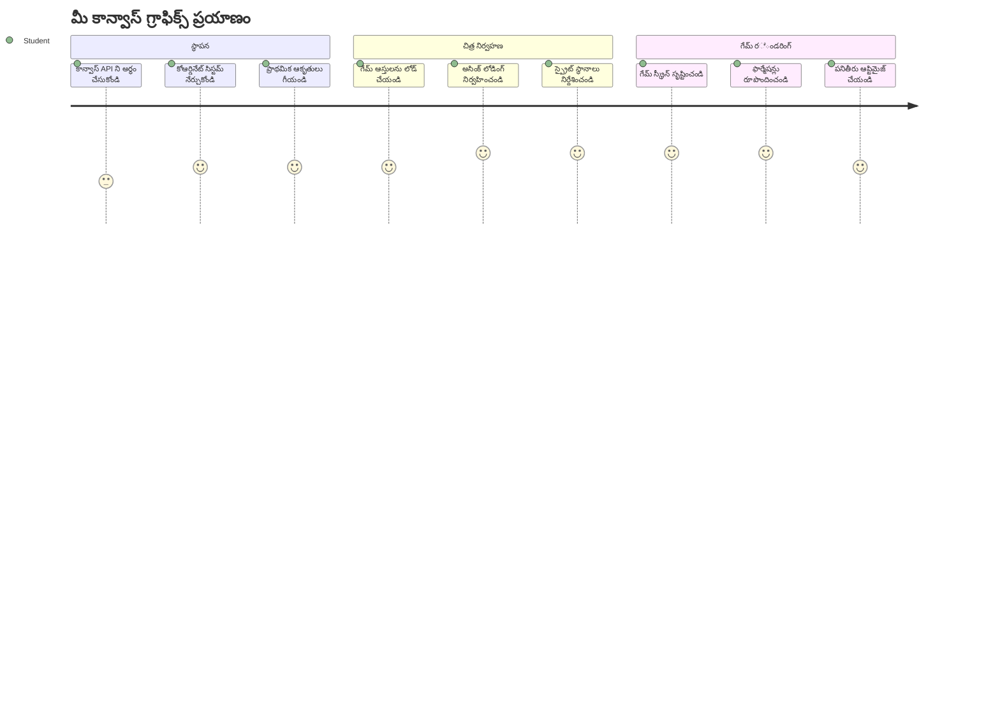
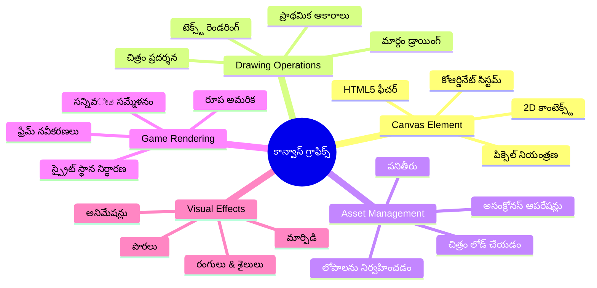
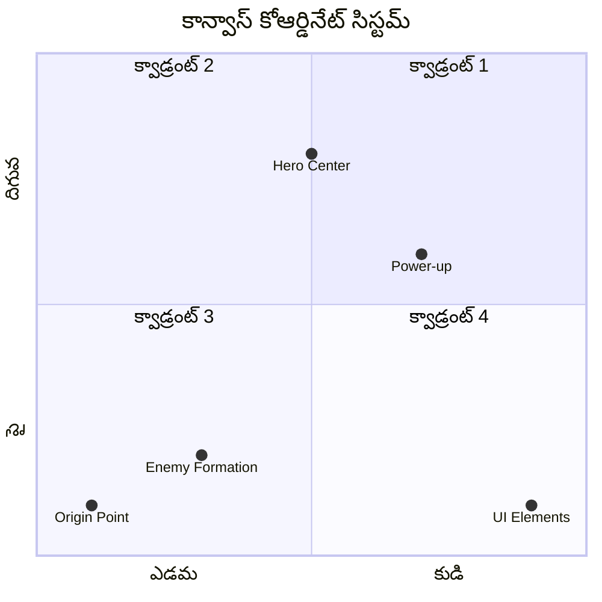
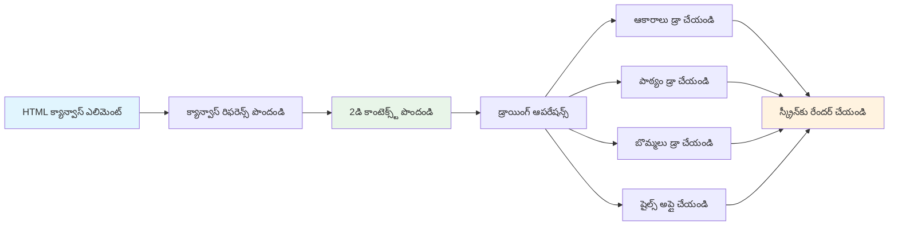
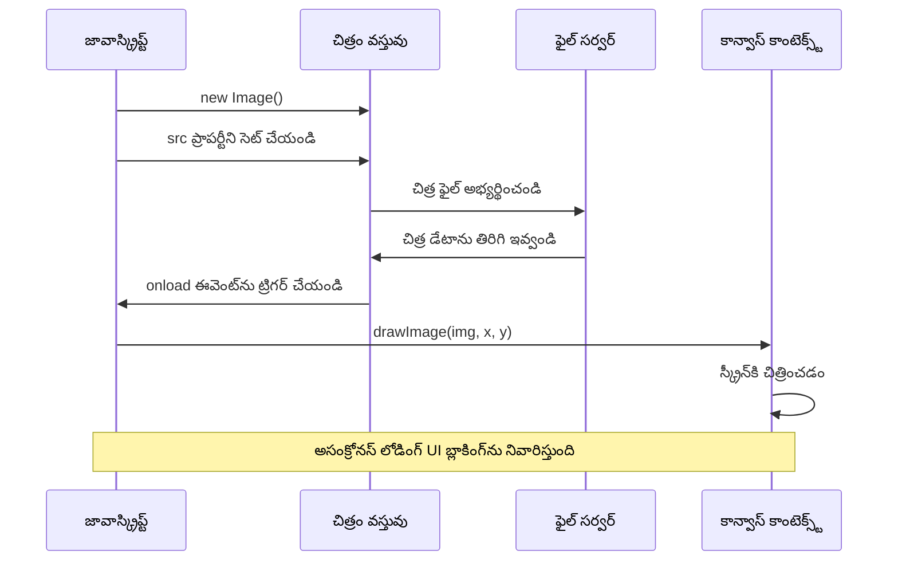
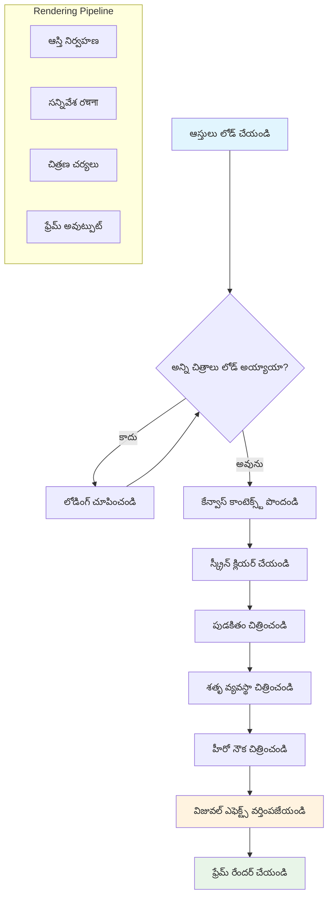
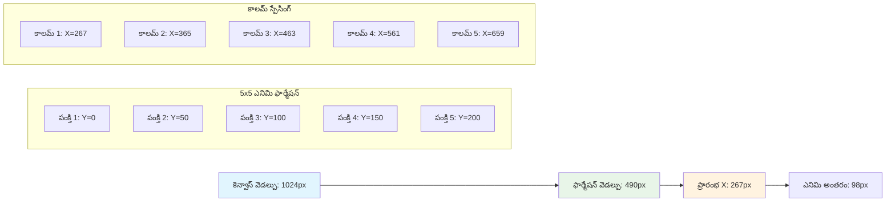
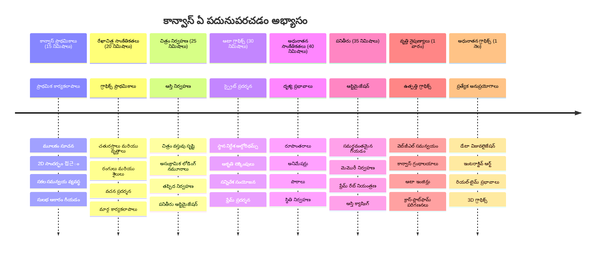

<!--
CO_OP_TRANSLATOR_METADATA:
{
  "original_hash": "7994743c5b21fdcceb36307916ef249a",
  "translation_date": "2026-01-08T13:39:04+00:00",
  "source_file": "6-space-game/2-drawing-to-canvas/README.md",
  "language_code": "te"
}
-->
# ఒక స్పేస్ గేమ్ భాగం 2: హీరో మరియు మానవులను కాన్వాస్‌లో డ్రా చేయండి


కేన్వాస్ API వెబ్ డెవలప్‌మెంట్ యొక్క అత్యంత శక్తివంతమైన ఫీచర్లలో ఒకటి, మీరు మీ బ్రౌజర్‌లోనే డైనమిక్, ఇంటరాక్టివ్ గ్రాఫిక్స్‌ని సృష్టించడానికి. ఈ పాఠంలో, మనం ఆ ఖాళీ HTML `<canvas>` ఎలిమెంట్‌ను గేమ్ ప్రపంచంగా మార్చబోతున్నాము, అక్కడ హీరోలు మరియు మానవులు ఉన్నారు. కేన్వాస్‌ని మీ డిజిటల్ ఆర్ట్ బోర్డ్‌గా ఆలోచించండి, అక్కడ కోడ్ విజువల్‌గా మారుతుంది.

ముందటి పాఠంలో మీరు నేర్చుకున్నదాన్ని మనం ఆధారంగా తీసుకుని, ఇప్పుడు విజువల్ అంశాల్లోకి డివ్ చేస్తాం. మీరు గేమ్ స్ప్రైట్లను లోడ్ చేసి చూపించడం, మూలకాలను ఖచ్చితమైన స్థలంలో ఉంచడం ఎలా చేయాలో నేర్చుకుంటారు మరియు మీ స్పేస్ గేమ్ కోసం విజువల్ ఫౌండేషన్ సృష్టిస్తారు. ఇది స్థిరమైన వెబ్ పేజీలతో డైనమిక్, ఇంటరాక్టివ్ అనుభవాల మధ్య గ టి పోతుంది.

ఈ పాఠం చివరికి, మీ హీరో షిప్ సరిగ్గా స్థాపించబడిన పూర్తి గేమ్ సన్నివేశం మరియు శత్రు ఆకృతీకరణలు యుద్ధానికి సిద్ధంగా ఉంటాయి. మీరు ప్రస్తుత గేమ్స్ బ్రౌజర్లలో గ్రాఫిక్స్ ఎలా రేండర్ చేస్తాయో అర్థం చేసుకుంటారు మరియు మీ స్వంత ఇంటరాక్టివ్ విజువల్ అనుభవాలు సృష్టించడానికి నైపుణ్యాలు పొందుతారు. కేన్వాస్ గ్రాఫిక్స్‌ని అన్వేషించి మీ స్పేస్ గేమ్‌కు ప్రాణం పోయిద్దాం!


## ముందస్తు-లెక్చర్ క్విజ్

[ముందస్తు-లెక్చర్ క్విజ్](https://ff-quizzes.netlify.app/web/quiz/31)

## కేన్వాస్ అంటే ఏమిటి

అప్పుడు ఈ `<canvas>` ఎలిమెంట్ అసలు ఏమిటి? ఇది HTML5 లో వెబ్ బ్రౌజర్లలో డైనమిక్ గ్రాఫిక్స్ మరియు యానిమేషన్స్ సృష్టించే పరిష్కారం. సాధారణ చిత్రాలు లేదా వీడియోలు స్థిరంగా ఉంటే, కేన్వాస్ స్క్రీన్‌పై కనిపించే ప్రతీదానిపై పిక్సెల్ స్థాయి నియంత్రణ ఇస్తుంది. ఇది గేమ్స్, డేటా విజువలైజేషన్స్ మరియు ఇంటరాక్టివ్ ఆర్ట్‌కు అనుకూలంగా ఉంటుంది. జావాస్క్రిప్ట్ మీ పెయింట్ బ్రష్ కావలెను, ప్రోగ్రామబుల్ డ్రాయింగ్ ఉపరితలంగా దీన్ని చూడండి.

డిఫాల్ట్‌గా, కేన్వాస్ ఎలిమెంట్ మీ పేజీలో ఖాళీ, పారదర్శకమైనచక్కటి అయతని ఉంటాది. కానీ శక్తి అక్కడే! మీరు జావాస్క్రిప్ట్ ఉపయోగించి ఆకారాలను డ్రా చేయగలరు, చిత్రాలు లోడ్ చేయగలరు, యానిమేషన్స్ సృష్టించగలరు, మరియు యూజర్ ఇంటరాక్షన్లకు స్పందించే అంశాలను చేయగలరు. 1960 లో బెల్ ల్యాబ్స్‌లోని కంప్యూటర్ గ్రాఫిక్స్ పయనేతలాగా ప్రతి పిక్సెల్‌ని ప్రోగ్రామ్ చేసి మొదటి డిజిటల్ యానిమేషన్స్ సృష్టించినట్టు ఇది ఉంది.

✅ MDN పై [కేన్వాస్ API గురించి మరింత చదవండి](https://developer.mozilla.org/docs/Web/API/Canvas_API).

ఇది సాధారణంగా పేజీ యొక్క బాడీలో ఇలా ప్రకటించబడుతుంది:

```html
<canvas id="myCanvas" width="200" height="100"></canvas>
```

**ఈ కోడ్ ఏమి చేస్తుంది:**
- జావాస్క్రిప్ట్‌లో ఈ కేన్వాస్ ఎలిమెంట్‌ను రిఫరెన్స్ చేయడానికి `id` కనుగొంటుంది
- కేన్వాస్ యొక్క అడ్డం పరిమాణాన్ని పిక్సెల్స్‌లో సెట్ చేస్తుంది
- కేన్వాస్ యొక్క నిలువు పరిమాణాన్ని పిక్సెల్స్‌లో నిర్ణయిస్తుంది

## సాదా జ్యామితి ఆకారాలు చిత్రించడం

ఇప్పుడు మీరు కేన్వాస్ ఎలిమెంట్ అంటే ఏమిటి తెలుసుకున్నారు, దానిపై చిత్రించడం ఎలా చేస్తామో చూద్దాం! కేన్వాస్ కూయ ఆ సమన్వయ వ్యవస్థ సాదా గమనానికి సారూప్యంగా ఉంటుంది, కానీ కంప్యూటర్ గ్రాఫిక్స్‌కు ప్రత్యేకంగా ఒక ముఖ్యమైన తేడా ఉంది.

కేన్వాస్ Cartesian సమన్వయ వ్యవస్థ ఉపయోగిస్తుంది, x-అక్షం (అడ్డంగా) మరియు y-అక్షం (కొత్తుగా) తో మీరు డ్రా చేసే ప్రతీదానికీ స్థానాన్ని నిర్ణయిస్తుంది. కానీ ముఖ్యమైన తేడా ఉంది: మాథ్స్ క్లాస్ నుండి సమన్వయ వ్యవస్థ నుండి భిన్నంగా, మూలపు బిందువు `(0,0)` ఎడమముపై మునుపు నుండి ప్రారంభమవుతుంది, x విలువలు కుడితో పెరుగుతాయి మరియు y విలువలు దిగువకు పెరుగుతాయి. ఈ విధానం 1960 కాలంలో మొదటి కంప్యూటర్ డిస్ప్లేలలో ఎలక్ట్రాన్ బీమ్స్ పై నుండి దిగువవైపు స్స్కాన్ జరిగిన కారణంగా పుట్టింది, కాబట్టి ఎడమ పై మూల భూత యెందుకు సహజ ఆరంభం అయింది.



> చిత్రం [MDN](https://developer.mozilla.org/docs/Web/API/Canvas_API/Tutorial/Drawing_shapes) నుండి

కేన్వాస్ ఎలిమెంట్ పై డ్రా చేయడానికి, మీరు కేన్వాస్ గ్రాఫిక్స్ బేసిక్ మూలాధారమైన మూడు-దశల ప్రక్రియను అనుసరిస్తారు. మీరు దీనిని కొన్ని సార్లు చేస్తే, ఇది సహజంగా మారుతుంది:


1. డామ్ నుండి మీ కేన్వాస్ ఎలిమెంట్‌కు రిఫరెన్స్ పొందండి (ఇతర HTML ఎలిమెంట్ల లాగే)
2. 2D రెండరింగ్ కాంటెక్స్ట్ పొందండి – ఇది అన్ని డ్రాయింగ్ మెథడ్‌లను అందిస్తుంది
3. చిత్రించడం మొదలు పెట్టండి! ప్రాసంగికంగా కాంటెక్స్ట్ లో ఉన్న మెథడ్‌లను ఉపయోగించి గ్రాఫిక్స్ సృష్టించండి

దానిని కోడ్‌లో ఇలా చూపిస్తారు:

```javascript
// దశ 1: కెన్వాస్ అంశాన్ని పొందండి
const canvas = document.getElementById("myCanvas");

// దశ 2: 2D రెండరింగ్ కంటెక్స్ట్ పొందండి
const ctx = canvas.getContext("2d");

// దశ 3: నింపే రంగును సెట్ చేసి ఒక చతురస్రం డ్రా చేయండి
ctx.fillStyle = 'red';
ctx.fillRect(0, 0, 200, 200); // ఎక్స్, వై, వెడల్పు, ఎత్తు
```

**దీన్ని దశల వారీగా విభజిద్దాం:**
- కేన్వాస్ ఎలిమెంట్‌ను ID ద్వారా పొందించి ఒక వేరియబుల్ లో స్టోర్ చేస్తాం
- 2D రెండరింగ్ కాంటెక్స్ట్ ఇది డ్రాయింగ్ లెక్కలతో కూడిన టూల్ కిట్‌
- `fillStyle` ప్రాపర్టీ ద్వారా ఎరుపు రంగుతో ఫిల్ చేయాలని చెప్పెం
- ఎడమ పై మూలం (0,0) నుండి 200 పిక్సెల్ వెడల్పు, ఎత్తు గల రెక్టాంగుల్ డ్రా చేస్తాం

✅ కేన్వాస్ API ఎక్కువగా 2D ఆకారాలపై దృష్టి పెట్టినా, మీరు వెబ్‌సైట్‌కి 3D అంశాలు కూడా డ్రా చేయవచ్చు; అందుకు [WebGL API](https://developer.mozilla.org/docs/Web/API/WebGL_API) ఉపయోగించవచ్చు.

మీరు కేన్వాస్ API తో ఎన్నో విషయాలు డ్రా చేయవచ్చు:

- **జ్యామితి ఆకారాలు**: రెక్టాంగిల్ డ్రా చేయడం మేము చూపించాము, కాని మరెన్నో ఆకారాలు ఎందుకు కాదు.
- **టెక్స్ట్**: మీరు ఏ ఫాంట్ మరియు రంగుతో అయినా టెక్స్ట్ డ్రా చేయవచ్చు.
- **చిత్రాలు**: .jpg లేదా .png వంటి చిత్రం ఆస్తి ఆధారంగా చిత్రాన్ని డ్రా చేయవచ్చు.

✅ ప్రయత్నించండి! మీరు రెక్టాంగిల్ డ్రా చేయడం తెలుసుకున్నట్లయితే, నిన్ను యొక్క పేజీకి సర్కిలు డ్రా చేయగలరా? CodePen లో కొన్ని ఆసక్తికరమైన కేన్వాస్ డ్రాయింగ్‌లను చూడండి. ఇక్కడ ఒక [ప్రత్యేకంగా అద్భుత ఉదాహరణ](https://codepen.io/dissimulate/pen/KrAwx).

### 🔄 **ఉపాధ్యాయ తనిఖీ**
**కేన్వాస్ ఫండమెంటల్స్ అర్థం చేసుకోండి**: చిత్రం లోడ్ మొదలు పెట్టేముందు, మీరు నీతించాల్సింది:
- ✅ కేన్వాస్ సమన్వయ వ్యవస్థ ఎలా గణిత సమన్వయాల నుండి భిన్నమైనదో వివరించగలరు
- ✅ కేన్వాస్ చిత్రీకరణ కోసం మూడు దశల ప్రక్రియ నేర్చుకోండి
- ✅ 2D రెండరింగ్ కాంటెక్స్ట్ ఏమి అందిస్తున్నదో గుర్తించండి
- ✅ fillStyle మరియు fillRect ఎలా కలిసి పనిచేస్తాయో వివరించండి

**త్వరిత స్వీయ పరీక్ష**: (100, 50) స్థానంలో 25 వ్యాసార్థంతో మీరన్నీలా నీలం వలయాన్ని డ్రా చేస్తారు?
```javascript
ctx.fillStyle = 'blue';
ctx.beginPath();
ctx.arc(100, 50, 25, 0, 2 * Math.PI);
ctx.fill();
```

**మీకిప్పుడు తెలిసిన కేన్వాస్ డ్రాయింగ్ మెథడ్స్:**
- **fillRect()**: నింపబడిన రెక్టాంగ్ల్స్ డ్రా చేస్తుంది
- **fillStyle**: రంగులు మరియు నమూనాలను సెట్ చేస్తుంది
- **beginPath()**: కొత్త డ్రాయింగ్ మార్గాలను ప్రారంభిస్తుంది
- **arc()**: వలయాలు మరియు వంకలు సృష్టిస్తుంది

## చిత్ర ఆస్తిని లోడ్ చేసి డ్రా చేయడం

ప్రాథమిక ఆకారాలు డ్రా చేయడం ఉపయోగకరం, కానీ ఎక్కువ గేమ్స్ వాస్తవ చిత్రాలను అవసరం పడతాయి! స్ప్రైట్లు, నేపథ్యాలు, మరియు టెక్స్చర్లు గేమ్స్‌కు విజువల్ ఆకర్షణను ఇస్తాయి. చిత్రాలను లోడ్ చేసి కేన్వాస్ పై ప్రదర్శించడం జ్యామితి ఆకారాల డ్రాయిం(గ నుండి వేరుగా పనిచేస్తుంది, కానీ ఇది సులభంగా అర్థం చేసుకోవచ్చు.

మనం `Image` ఆబ్జెక్ట్ సృష్టించాలి, చిత్రం ఫైల్ ని లోడ్ చేయాలి (ఇది అసింక్రోనస్, అంటే "బ్యాక్‌గ్రౌండ్" లో జరుగుతుంది), మరియు ఇది సిద్ధంగా ఉంటే కేన్వాస్ పై చిత్రించాలి. ఇది మీ చిత్రాలు సరైనవిగా ప్రదర్శించబడటానికి సహాయం చేస్తుంది, లోడ్‌గా ఉండగా మీ అప్లికేషన్ బ్లాక్ అయిపోకుండా.


### ప్రాథమిక చిత్రం లోడింగ్

```javascript
const img = new Image();
img.src = 'path/to/my/image.png';
img.onload = () => {
  // చిత్రం లోడ్ చేసి ఉపయోగానికి సిద్ధంగా ఉంది
  console.log('Image loaded successfully!');
};
```

**ఈ కోడ్ లో ఏమి జరుగుతుంది:**
- మనం కొత్త Image ఆబ్జెక్ట్ సృష్టించి మా స్ప్రైట్ లేదా టెక్స్చర్ ను ఉంచుతాము
- ఏ చిత్రం ఫైల్ లోడ్ చేయాలో సోర్స్ పాథ్ సెట్ చేసి చెప్తాము
- చిత్రం రెడీ అయినప్పుడు మాకు తెలియడానికి లోడ్ ఈవెంటుకు లిసెన్ చేయడం

### చిత్రాలను లోడ్ చేసే మెరుగైన విధానం

ప్రొఫెషనల్ డెవలపర్లు సాధారణంగా ఉపయోగించే చిత్ర లోడ్ నిర్వహణకు ఒక ఇంకా బలమైన విధానం ఉంది. మనం చిత్ర లోడింగ్ ని Promise ఆధారిత ఫంక్షన్ లో వ్రాస్తాము – JavaScript Promises ES6 నుండి సాధారణమైందాక, దీన్ని అమలు చేయడం అంతా ఆర్గనైజ్ చేయడం మరియు తప్పిదాలు సులువు నుండి నిర్వహించడం చేస్తుంది:

```javascript
function loadAsset(path) {
  return new Promise((resolve, reject) => {
    const img = new Image();
    img.src = path;
    img.onload = () => {
      resolve(img);
    };
    img.onerror = () => {
      reject(new Error(`Failed to load image: ${path}`));
    };
  });
}

// ఆసింక్/అవైట్‌తో ఆధునిక ఉపయోగం
async function initializeGame() {
  try {
    const heroImg = await loadAsset('hero.png');
    const monsterImg = await loadAsset('monster.png');
    // చిత్రాలు ఇప్పుడు వాడటానికి సిద్ధంగా ఉన్నవు
  } catch (error) {
    console.error('Failed to load game assets:', error);
  }
}
```

**ఇక్కడ మేము చేసినది:**
- అన్ని చిత్రం లోడింగ్ లాజిక్‌ను Promise తో చుట్టి మెరుగ్గా నిర్వర్తించాల్సి వచ్చింది
- ఏదైనా లోపం వస్తే తెలియజేసే ఎర్రర్ హ్యాండ్లింగ్ జోడించడం
- async/await ఆధునిక సింటాక్స్ ఉపయోగించడం – చదవడంలో క్లీనర్
- try/catch బ్లాక్స్ ఉపయోగించి లోడింగ్ సమస్యలను సావధానంగా నిర్వహించడం

మీరు చిత్రాలు లోడ్ చేసిన తర్వాత, వాటిని కేన్వాస్ పై డ్రా చేయడం చాలా సరళం:

```javascript
async function renderGameScreen() {
  try {
    // ఆట ఆస్తుల్ని లోడ్ చేయండి
    const heroImg = await loadAsset('hero.png');
    const monsterImg = await loadAsset('monster.png');

    // కాన్వాస్ మరియు కాంటెక్ట్ పొందండి
    const canvas = document.getElementById("myCanvas");
    const ctx = canvas.getContext("2d");

    // చిత్రాలను నిర్దిష్ట స్థానాలకు ఆదుకోవాలి
    ctx.drawImage(heroImg, canvas.width / 2, canvas.height / 2);
    ctx.drawImage(monsterImg, 0, 0);
  } catch (error) {
    console.error('Failed to render game screen:', error);
  }
}
```

**దీన్ని దశల వారీగా చూద్దాం:**
- మనం హీరో మరియు మానవుల చిత్రాలను బ్యాక్ గ్రౌండ్ లో awaitతో లోడ్ చేస్తాము
- మనం కేన్వాస్ ఎలిమెంట్‌ని తీసుకుని 2D కాంటెక్స్ట్ పొందుతాం
- అనుసంధాన సమన్వయ గణితంతో హీరో చిత్రాన్ని మధ్య భాగంలో ఉంచుతాము
- శత్రు చిత్రాన్ని ఎడమపై మూలం వద్ద పెట్టి శత్రుల చర నుండి ఆరంభిస్తాము
- లోడ్ లేదా రేండరింగ్ సమయంలో ఏ తప్పుపడితే అందును పట్టుకుంటాము


## ఇప్పుడు మీ గేమ్ నిర్మాణం ప్రారంభించడానికి సమయం వచ్చింది

ఇప్పుడు మనం అన్ని వాటిని కలిపి మీ స్పేస్ గేమ్ విజువల్ మౌలికాన్ని సృష్టిస్తాము. మీరు కేన్వాస్ ప్రాథమికాలు మరియు చిత్ర లోడింగ్ పద్ధతులను బాగా అర్థం చేసుకుని ఉన్నారు, కనుక ఈ ప్రాక్టికల్ సెక్షన్ పూర్తి గేమ్ స్క్రీన్‌ని సరైన స్ప్రైట్లతో ఎలా నిర్మించాలో చూపిస్తుంది.

### ఏమి నిర్మించాలి

మీరు ఒక వెబ్ పేజీని కేన్వాస్ ఎలిమెంట్‌తో నిర్మిస్తారు. ఇది బ్లాక్ బ్లాక్ స్క్రీన్ 1024*768 మర్పడాలి. మేము మీకు రెండు చిత్రాలు అందించాము:

- హీరో షిప్

   

- 5*5 మానవులు

   

### అభివృద్ధి ప్రారంభించడానికి సిఫార్సు చేసిన దశలు

`your-work` ఉప ఫోల్డర్‌లో మీరు కనుగొనగల స్టార్టర్ ఫైల్స్ ఉన్నాయి. మీ ప్రాజెక్ట్ నిర్మాణం ఇలా ఉండాలి:

```bash
your-work/
├── assets/
│   ├── enemyShip.png
│   └── player.png
├── index.html
├── app.js
└── package.json
```

**మీరు పని చేస్తున్నది:**
- గేమ్ స్ప్రైట్లను `assets/` ఫోల్డర్‌లో ఉంచి అందరికీ అనుకూలంగా నిర్వహించటం
- మీ ప్రధాన HTML ఫైల్ కేన్వాస్ ఎలిమెంట్ సెట్ చేసి అందుకోసం సిద్ధం చేయడం
- జావాస్క్రిప్ట్ ఫైల్, ఇక్కడ మీరు గేమ్ రేండరింగ్ మ్యాజిక్ రాస్తారు
- package.json, లోకల్ టెస్ట్ కోసం డెవలప్‌మెంట్ సర్వర్ సెట్ చేస్తుంది

డెవలప్‌మెంట్ ప్రారంభించడానికి ఈ ఫోల్డర్‌ను Visual Studio Codeలో తెరువు. మీరు Visual Studio Code, NPM, మరియు Node.js ఇన్‌స్టాల్ చేసిన లోకల్ డెవలప్‌మెంట్ వాతావరణం అవసరం. మీరు మీ కంప్యూటర్‌లో `npm` సెట్ చేయకపోతే, [ఇక్కడ అది ఎలా ఇన్‌స్టాల్ చేయాలో ఉంది](https://www.npmjs.com/get-npm).

`your-work` ఫోల్డర్‌లోకి వెళ్లి మీ డెవలప్‌మెంట్ సర్వర్‌ను ప్రారంభించండి:

```bash
cd your-work
npm start
```

**ఈ కమీండు ఇది చేస్తుంది:**
- మీ గేమ్‌ని పరీక్షించడానికి `http://localhost:5000` వద్ద లోకల్ సర్వర్ ప్రారంభిస్తుంది
- మీ ఫైల్స్ సరిగ్గా సర్వ్ చేస్తుంది, అంటే బ్రౌజర్ వాటిని సరిగా లోడ్ చేయగలదు
- ఫైళ్ళను మార్పులకు అందుబాటులో ఉంచి మృదువుగా అభివృద్ధి చేయవచ్చు
- వృత్తిపరమైన అభివృద్ధి వాతావరణం ఇస్తుంది

> 💡 **గమనిక**: మీ బ్రౌజర్ తొలుత ఖాళీ పేజీ చూపిస్తుంది – ఇది సాధారణం! మీరు కోడ్ జోడిస్తున్నప్పుడు, మీ మార్పులు చూడటానికి బ్రౌజర్‌ని రిఫ్రెష్ చేయండి. ఈ తిరిగి అభివృద్ధి విధానం NASA యొక్క అపోలో గైడెన్స్ కంప్యూటర్ అభివృద్ధి విధానంతో పోలిస్తే – ప్రతి భాగాన్ని అప్లికేషన్ లోకు చేర్చే ముందు పరీక్షించడం.

### కోడ్ జోడించండి

`your-work/app.js` లో ఈ క్రింద ఇవ్వబడిన పనులు పూర్తి చెయ్యడానికి అవసరమైన కోడ్ జోడించండి:

1. **కేన్వాస్‌ను బ్లాక్ బ్యాక్‌గ్రౌండ్‌తో డ్రా చేయండి**
   > 💡 **ఇలా చేస్తారు**: `/app.js` లో TODO కనుగొని రెండు లైన్లు మాత్రమే జోడించండి. `ctx.fillStyle` ని గడ్డిగా (black) సెట్ చేసి, దాని తరువాత `ctx.fillRect()` ని (0,0) నుండి కేన్వాస్ పరిమాణాలతో ఉపయోగించండి. సులువు!

2. **గేమ్ టెక్స్చర్ ల ను లోడ్ చేయండి**
   > 💡 **ఇలా చేస్తారు**: `await loadAsset()` ఉపయోగించి మీ ప్లేయర్ మరియు శత్రు చిత్రాలను లోడ్ చెయ్యండి. వాటిని వేరియబుల్స్ లో స్టోర్ చేయండి తదుపరి వాడటానికి. గుర్తుంచుకోండి – చిత్రాలను మీరు డ్రా చేసినపుడు మాత్రమే చూపబడతాయి!

3. **హీరో షిప్‌ను మధ్య-తొలి స్థానంలో డ్రా చేయండి**
   > 💡 **ఇలా చేస్తారు**: `ctx.drawImage()` ను ఉపయోగించి హీరోని సెంటర్ చేయండి. x-నిర్దేశానికి `canvas.width / 2 - 45` ప్రయత్నించండి, y-నిర్దేశానికి `canvas.height - canvas.height / 4` ఉపయోగించి దీన్ని కింద భాగంలో ఉంచండి.

4. **5×5 శత్రు షిప్‌ల ఆకృతీకరణ డ్రా చేయండి**
   > 💡 **ఇలా చేస్తారు**: `createEnemies` ఫంక్షన్ కనుగొని Nested loops ఉపయోగించండి. స్థల మరియు స్థానాల గణితం అవసరం, కానీ నేను ఖచ్చితంగా ఎలా చేయాలో చూపిస్తాను!

మొదట, సరైన శత్రు ఆకృతీకరణ స్థలానికి కాన్స్ట్‌లను స్థాపించండి:

```javascript
const ENEMY_TOTAL = 5;
const ENEMY_SPACING = 98;
const FORMATION_WIDTH = ENEMY_TOTAL * ENEMY_SPACING;
const START_X = (canvas.width - FORMATION_WIDTH) / 2;
const STOP_X = START_X + FORMATION_WIDTH;
```

**ఈ కాన్స్ట్‌లు ఏమి చేస్తున్నాయో చూడండి:**
- ప్రతి వరుస మరియు కాలమ్ కు 5 శత్రువులు సెట్ చేస్తున్నాం (అందమైన 5×5 గ్రిడ్)
- శత్రువుల మధ్య ఎంత ఖాళీ ఉంచాలో నిర్వచించాం
- మొత్తం ఆకృతీకరణ వెడల్పును లెక్కించాం
- ఆకృతీకరణ మధ్యలో కనిపించడానికి ఎక్కడ మొదలు పెట్టాలి మరియు ఆపాలి అనేది నిర్ణయించాం


తర్వాత, శత్రు ఆకృతీకరణకు Nested loops సృష్టించండి:

```javascript
for (let x = START_X; x < STOP_X; x += ENEMY_SPACING) {
  for (let y = 0; y < 50 * 5; y += 50) {
    ctx.drawImage(enemyImg, x, y);
  }
}
```

**ఈ Nested loop ఏమి చేస్తుంది:**
- బాహ్య లూప్ ఆకృతీకరణలో ఎడమ నుండి కుడికి జారుతుంది
- అంతర్గత లూప్ పై నుండి క్రింద వరుసలు సృష్టిస్తుంది
- లెక్కించిన ఖచ్చితమైన x,y స్థానాలలో ప్రతి శత్రువు స్ప్రైట్ ని డ్రా చేస్తుంది
- అన్ని సమానంగా ఖాళీలు ఉంచబడినవి, అందంగా మరియు సముడాయంగా కనిపిస్తాయి

### 🔄 **ఉపాధ్యాయ తనిఖీ**
**గేమ్ రెండరింగ్ నైపుణ్యం**: పూర్తిగా రేండరింగ్ వ్యవస్థ మీ అర్థం చెందిందా నిర్ధారించుకోండి:
- ✅ అసింక్రో చిత్రం లోడింగ్ గేమ్ స్టార్టప్ సమయంలో UI బ్లాక్ అవ్వకుండా ఎలా నిరోధిస్తుంది?
- ✅ హెచ్చరికలను హార్డ్‌కోడ్ చేయకుండా కాన్స్ట్‌లు ఉపయోగించి శత్రు ఆకృతీకరణ స్థలాలను ఎందుకు లెక్కిస్తాము?
- ✅ 2D రెండరింగ్ కాంటెక్స్ట్ డ్రాయింగ్ ఆపరేషన్లలో ఏమి పాత్ర వహిస్తుంది?
- ✅ Nested loops స్ప్రైట్ ఆకృతీకరణను ఎలా సిధ్దం చేస్తాయి?

**పనితీరు పరిగణనల**: మీ గేమ్ ఇప్పుడు చూపిస్తుంది:
- **ప్రభావవంతమైన ఆస్తి లోడింగ్**: Promise ఆధారిత చిత్ర నిర్వహణ
- **సంఘటిత రేండరింగ్**: నిర్మిత డ్రాయింగ్ ఆపరేషన్లు
- **గణాంక స్థాన నిర్థారణ**: లెక్కించిన స్ప్రైట్ స్థానాల అమ‌ల
- **తప్పిదాల నిర్వహణ**: శ్రద్ధగా వైఫల్యం నిర్వహణ

**విజువల్ ప్రోగ్రామింగ్ కాన్సెప్ట్స్**: మీరు నేర్చుకున్నారు:
- **సమన్వయ వ్యవస్థలు**: గణితాన్ని స్క్రీన్ స్థానాలకు అనువదించడం  
- **స్ప్రైట్ నిర్వహణ**: ఆట గ్రాఫిక్స్‌ను లోడ్ చేసి చూపించడం  
- **ఆకృతి ఆల్గోరిథమ్స్**: సక్రమమైన అమరికల కోసం గణితపు నమూనాలు  
- **అసింక్ ఆపరేషన్స్**: సాఫీ వినియోగదారు అనుభవం కోసం ఆధునిక జావాస్క్రిప్ట్  

## ఫలితం

సంపూర్ణ ఫలితం ఈ విధంగా ఉండాలి:


## పరిష్కారం

ముందుగా మీరు ప్రయత్నించండి, అయితే మీరు చిక్కుకుంటే [పరిష్కారం](../../../../6-space-game/2-drawing-to-canvas/solution/app.js) చూడండి

---

## GitHub Copilot ఏజెంట్ ఛాలెంజ్ 🚀

క్రింద ఇచ్చిన ఛాలెంజ్‌ను పూర్తి చేయడానికి ఏజెంట్ మోడ్‌ను ఉపయోగించండి:

**వివరణ:** మీరు నేర్చుకున్న Canvas API సాంకేతికతలను ఉపయోగించి, మీ స్పేస్ గేమ్ కేన్వాస్‌లో విజువల్ ఎఫెక్ట్స్ మరియు ఇంటరాక్టివ్ అంశాలను జోడించండి.

**ప్రాంప్ట్:** `enhanced-canvas.html` అనే కొత్త ఫైల్‌ను సృష్టించి, దానిలో బ్యాక్‌గ్రౌండ్‌లో యానిమేటెడ్ నక్షత్రాలు, హీరో షిప్ కోసం పల్సింగ్ హెల్త్ బార్, మరియు శత్రు షిప్‌లు మెల్లగా క్రిందికి కదలే విధంగా కనబరచండి. యాదృచ్ఛిక స్థానాలు మరియు అప్టిసిటీని ఉపయోగించి తారల మేకింగ్‌ను డ్రా చేసే జావాస్క్రిప్ట్ కోడ్‌ను, ఆరోగ్య స్థాయి ఆధారంగా రంగు మార్చుకునే హెల్త్ బార్‌ను (గ్రీన్ > యెల్లో > రెడ్), మరియు శత్రు షిప్‌లను వేర్వేరు వేగాలతో క్రిందికి కదిలే యానిమేషన్‌ను అమలు చేయండి.

[ఏజెంట్ మోడ్](https://code.visualstudio.com/blogs/2025/02/24/introducing-copilot-agent-mode) గురించి మరింత తెలుసుకోండి.

## 🚀 ఛాలెంజ్

మీరు 2D-కేంద్రీకృత Canvas API తో డ్రాయింగ్ గురించి నేర్చుకున్నారు; ఇప్పుడు [WebGL API](https://developer.mozilla.org/docs/Web/API/WebGL_API)ను పరిశీలించి, ఒక 3D ఆబ్జెక్ట్‌ను డ్రా చేయడానికి ప్రయత్నించండి.

## పోస్ట్-లెక్చర్ క్విజ్

[Post-lecture quiz](https://ff-quizzes.netlify.app/web/quiz/32)

## సమీక్ష & స్వీయ అధ్యయనం

Canvas API గురించి మరింత తెలుసుకోవడం కోసం [ఇదాన్ని చదవండి](https://developer.mozilla.org/docs/Web/API/Canvas_API).

### ⚡ **తరువాత 5 నిమిషాల్లో మీరు చేయగలిగేది**  
- [ ] బ్రౌజర్ కన్సోల్ ఓపెన్ చేసి `document.createElement('canvas')` తో ఒక కేన్వాస్ ఎలిమెంట్ సృష్టించండి  
- [ ] కేన్వాస్ కాంటెక్స్ట్ లో `fillRect()` ఉపయోగించి ఒక చతురస్రాన్ని డ్రా చేయండి  
- [ ] `fillStyle` ప్రాపర్టీని ఉపయోగించి వేర్వేరు రంగులతో ప్రయోగించండి  
- [ ] `arc()` పద్ధతి ఉపయోగించి ఒక సాదారణ వృత్తాన్ని డ్రా చేయండి  

### 🎯 **ఈ గంటలో మీరు సాధించగలిగేది**  
- [ ] పోస్ట్-లెస్సన్ క్విజ్ పూర్తి చేసి కేన్వాస్ మౌలికాలను అర్థం చేసుకోండి  
- [ ] బహు ఆకారాలు మరియు రంగులు కలిగిన కేన్వాస్ డ్రాయింగ్ అప్లికేషన్ రూపొందించండి  
- [ ] మీ ఆట కోసం చిత్రం లోడ్ చేసుకున్న మరియు స్ప్రైట్ రెండరింగ్ అమలు చేయండి  
- [ ] వస్తువులు కేన్వాస్ మీద కదిలే ఒక సులభ యానిమేషన్ రూపొందించండి  
- [ ] స్కేలింగ్, రొటేషన్, ట్రాన్స్‌లేషన్ వంటి కేన్వాస్ ట్రాన్స్‌ఫర్మేషన్‌లు ప్రాక్టీస్ చేయండి  

### 📅 **మీ వార వ్యవధి కేన్వాస్ ప్రయాణం**  
- [ ] మెరుగైన గ్రాఫిక్స్ మరియు స్ప్రైట్ యానిమేషన్‌లతో స్పేస్ గేమ్ పూర్తి చేయండి  
- [ ] గ్రేడియెంట్లు, ప్యాటర్న్లు, కంపోజిటింగ్ వంటి అధునాతన కేన్వాస్ సాంకేతికతలు నేర్చుకోండి  
- [ ] డేటా ప్రదర్శన కోసం ఇంటరాక్టివ్ విజువలైజేషన్లు రూపొందించండి  
- [ ] సాఫీ ప్రదర్శన కోసం కేన్వాస్ ఆప్టిమైజేషన్ సాంకేతికతలను తెలుసుకోండి  
- [ ] వివిధ పరికరాలతో డ్రాయింగ్/పెయింటింగ్ అప్లికేషన్ తయారుచేయండి  
- [ ] క్రియేటివ్ కోడింగ్ ప్యాటర్న్లు మరియు జనరేటివ్ ఆర్ట్‌ను అన్వేషించండి  

### 🌟 **మీ నెల వ్యవధి గ్రాఫిక్స్ నైపుణ్యం**  
- [ ] Canvas 2D మరియు WebGL తో సంక్లిష్ట విజువల్ అప్లికేషన్లు తయారుచేయండి  
- [ ] గ్రాఫిక్స్ ప్రోగ్రామింగ్ మౌలికాలు మరియు షేడర్ జ్ఞానం పొందండి  
- [ ] ఓపెన్ సోర్స్ గ్రాఫిక్స్ లైబ్రరీలు మరియు విజువలైజేషన్ టూల్స్‌కు సహకరించండి  
- [ ] గ్రాఫిక్స్-భారీ అప్లికేషన్‌ల కోసం పనితీరు ఆప్టిమైజేషన్ నైపుణ్యాలు పొందండి  
- [ ] కేన్వాస్ ప్రోగ్రామింగ్ మరియు కంప్యూటర్ గ్రాఫిక్స్ గురించిన విద్యా వివరాలను సృష్టించండి  
- [ ] ఇతరులకు విజువల్ అనుభవాలు సృష్టించడంలో సహాయపడే గ్రాఫిక్స్ ప్రోగ్రామింగ్ నిపుణులుగా మారండి  

## 🎯 మీ కేన్వాస్ గ్రాఫిక్స్ నైపుణ్య టైంలైన్


### 🛠️ మీ కేన్వాస్ గ్రాఫిక్స్ సూత్రగ్రంథం సారాంశం

ఈ పాఠం పూర్తిచేసిన తర్వాత, ప్రస్తుతం మీ వద్ద:  
- **కేన్వాస్ API నైపుణ్యం**: 2D గ్రాఫిక్స్ ప్రోగ్రామింగ్ పై సమగ్ర అర్థం  
- **సమన్నయ గణితశాస్త్రం**: ఖచ్చితంగా స్థాననియామాలు మరియు ఆకృతి ఆల్గోరిథమ్స్  
- **ఆస్తి నిర్వహణ**: ప్రొఫెషనల్ చిత్రం లోడింగ్ మరియు లోపాల నిర్వహణ  
- **రెండరింగ్ పైప్లైన్**: సన్నివేశ నిర్మాణం పై క్రమబద్ధమైన దృష్టికోణం  
- **అటువంటి ఆటలు**: స్ప్రైట్ స్థాననియోజన మరియు ఆకృతి లెక్కలు  
- **అసింక్ ప్రోగ్రామింగ్**: సాఫీ పనితీరుకు ఆధునిక జావాస్క్రిప్ట్ ప్యాటర్న్లు  
- **విజువల్ ప్రోగ్రామింగ్**: గణిత భావాలను స్క్రీన్ గ్రాఫిక్స్‌కి అనువదించడం  

**వాస్తవ ప్రపంచంలో ఉపయోగాలు**: మీ కేన్వాస్ నైపుణ్యాలు నేరుగా వర్తిస్తాయి:  
- **డేటా విజువలైజేషన్**: చార్ట్‌లు, గ్రాఫ్‌లు, ఇంటరాక్టివ్ డాష్‌బోర్డ్లు  
- **గేమ్ డెవలప్మెంట్**: 2D ఆటలు, సిమ్యులేషన్లు, ఇంటరాక్టివ్ అనుభవాలు  
- **డిజిటల్ ఆర్ట్**: క్రియేటివ్ కోడింగ్ మరియు జనరేటివ్ ఆర్ట్ ప్రాజెక్టులు  
- **UI/UX డిజైన్**: అనుకూల గ్రాఫిక్స్ మరియు ఇంటరాక్టివ్ అంశాలు  
- **విద్యా సాఫ్ట్వేర్**: విజువల్ లెర్నింగ్ సాధనాలు మరియు సిమ్యులేషన్లు  
- **వెబ్ అప్లికేషన్లు**: డైనమిక్ గ్రాఫిక్స్ మరియు రియల్-టైం విజువలైజేషన్లు  

**ప్రొఫెషనల్ నైపుణ్యాలు**: మీరు ఇప్పుడు చేయగలరు:  
- **అన్ని ఎక్స్‌టర్నల్ లైబ్రరీలు లేకుండా** కస్టమ్ గ్రాఫిక్స్ పరిష్కారాలను నిర్మించండి  
- **సాఫీ వినియోగదారు అనుభవాల కోసం** రెండరింగ్ పనితీరును ఆప్టిమైజ్ చేయండి  
- **సంక్లిష్ట విజువల్ సమస్యలను** బ్రౌజర్ డెవలపర్ టూల్స్‌తో డీబగ్ చేయండి  
- **గణిత సిద్ధాంతాల ఆధారంగా** స్కేలబుల్ గ్రాఫిక్స్ వ్యవస్థలను డిజైన్ చేయండి  
- **ఆధునిక వెబ్ అప్లికేషన్ ఫ్రేమ్‌వర్క్స్‌తో** కేన్వాస్ గ్రాఫిక్స్‌ను ఇంటిగ్రేట్ చేయండి  

**మీరు ఆచరించిన కేన్వాస్ API పద్ధతులు**:  
- **ఎలిమెంట్ నిర్వహణ**: getElementById, getContext  
- **డ్రాయింగ్ ఆపరేషన్స్**: fillRect, drawImage, fillStyle  
- **ఆస్తి లోడింగ్**: ఇమేజ్ ఆబ్జెక్ట్స్, Promise ప్యాటర్న్లు  
- **గణిత స్థాననిర్వాహణ**: కోఆర్డినేట్ లెక్కింపులు, ఆకృతి ఆల్గోరిథమ్స్  

**తదుపరి స్థాయి**: యానిమేషన్, వినియోగదారు ఇంటరాక్షన్, కలిషన్ డిటెక్షన్ జోడించడానికి లేదా 3D గ్రాఫిక్స్ కోసం WebGLను అన్వేషించడానికి మీరు సిధ్ధంగా ఉన్నారు!

🌟 **అందుకున్న విజయము**: మీరు ప్రాధమిక Canvas API సాంకేతికతలతో సంపూర్ణ గేమ్ రెండరింగ్ సిస్టమ్‌ని రూపొందించారు!

## అసైన్మెంట్

[కెన్వాస్ API తో ఆడుకోండి](assignment.md)

---

<!-- CO-OP TRANSLATOR DISCLAIMER START -->
**విస్తరణ**:
ఈ పత్రాన్ని AI అనువాద సేవ [Co-op Translator](https://github.com/Azure/co-op-translator) ఉపయోగించి అనువదించబడింది. మేము ఖచ్చితత్వానికి ప్రయత్నిస్తుంటే కూడా, ఆటోమేటెడ్ అనువాదాలలో తప్పులు లేదా లోపాలు ఉండవచ్చు. అసలు పత్రం స్వదేశీ భాషలో ఉన్నదాన్ని అధికారిక మూలంగా పరిగణించాలి. ముఖ్యం సమాచారం కోసం, ప్రొఫెషనల్ మానవ అనువాదాన్ని ఉపయోగించడం మంచిది. ఈ అనువాదం ఉపయోగంతో సృష్టవుతున్న ఏవైనా అపార్థాలు లేదా తప్పుదోవలకు మేము బాధ్యులు కాదు.
<!-- CO-OP TRANSLATOR DISCLAIMER END -->