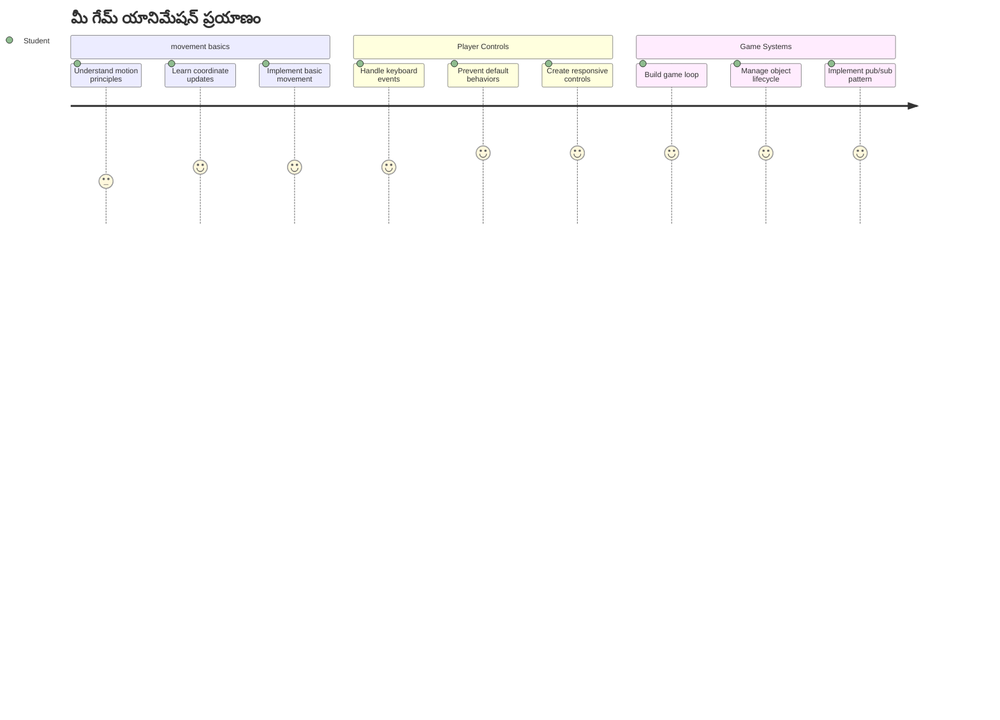
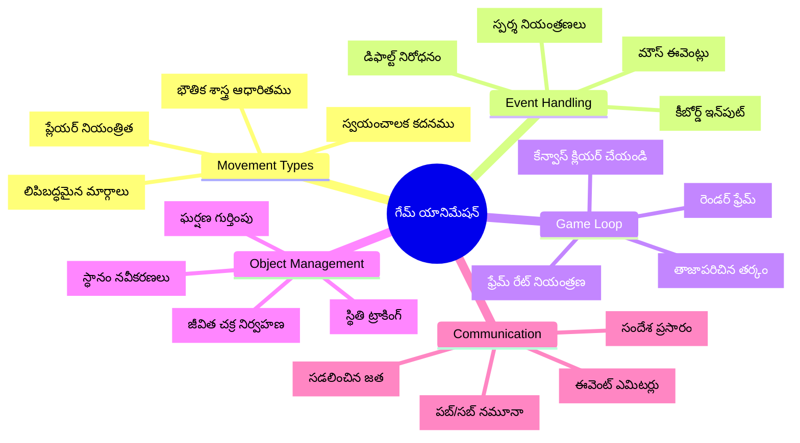
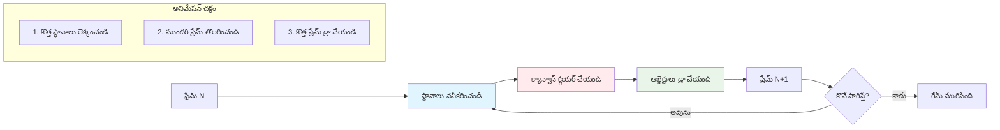
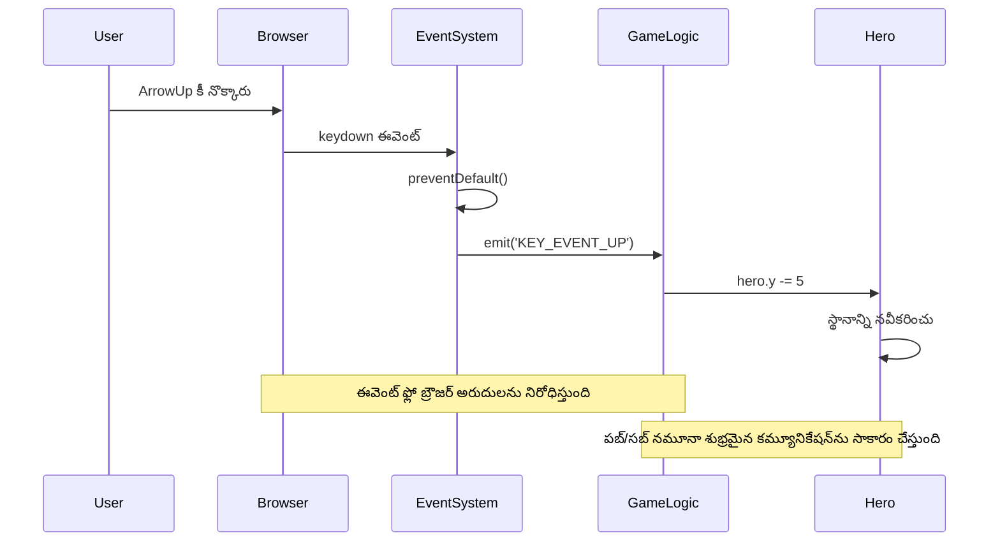
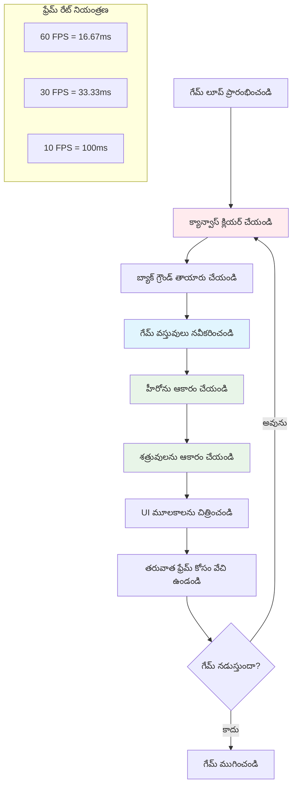
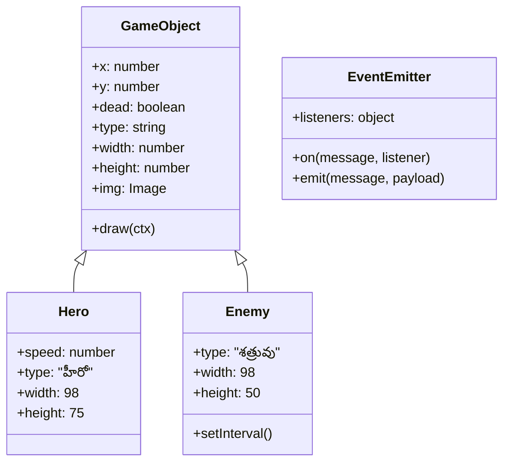
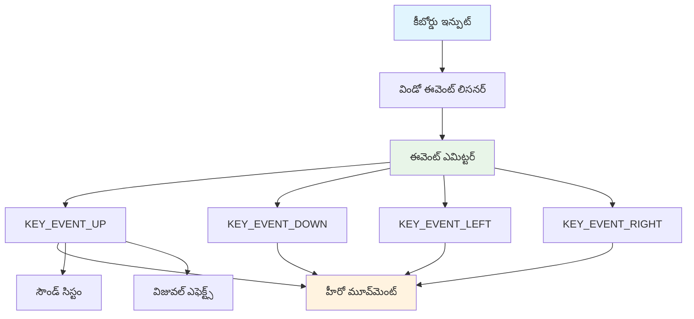
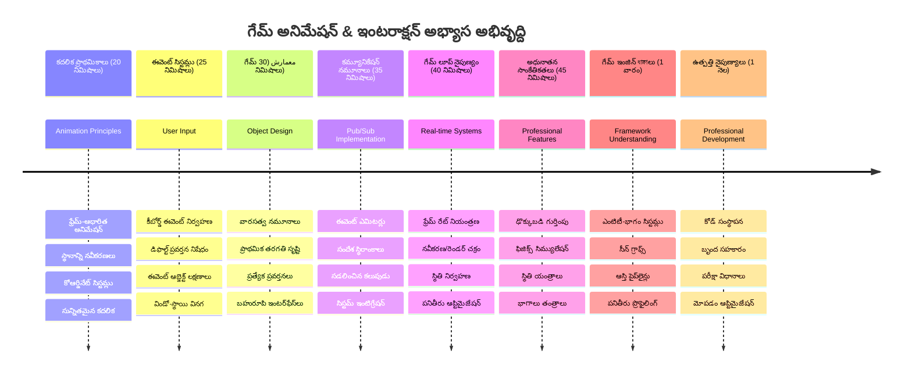

<!--
CO_OP_TRANSLATOR_METADATA:
{
  "original_hash": "8c55a2bd4bc0ebe4c88198fd563a9e09",
  "translation_date": "2026-01-08T14:38:58+00:00",
  "source_file": "6-space-game/3-moving-elements-around/README.md",
  "language_code": "te"
}
-->
# స్పేస్ గేమ్ భాగం 3: మోషన్ జోడించడం


మీ ఇష్టమైన గేమ్ల గురించి ఆలోచించండి – వాటిని ఆకట్టుకునే వుచ్చేది కేవలం అందమైన గ్రాఫిక్స్ మాత్రమే కాదు, అవి మీ చర్యలకు ఎలా స్పందిస్తాయో అదే. ప్రస్తుతం, మీ స్పేస్ గేమ్ ఒక అందమైన పేం చటింగ్ లాగా ఉంది, కానీ దానిలో జీవం మిళించేందుకు మేము కదలికను జోడించబోతున్నాం.

నాసా ఇంజనీర్లు అపోలో మిషన్ల కోసం గైడెన్స్ కంప్యూటర్‌ను ప్రోగ్రామ్ చేసినప్పుడు, వారు ఒక సామాన్య సవాలు ఎదుర్కొన్నారు: స్పేస్ క్రాఫ్ట్ పైలట్ ఇన్‌పుట్‌కు ఎలా స్పందించాలి, అదే సమయంలో కోర్సు సరిచూడటం ఆటోమేటిక్‌గా ఎలా నిర్వహించాలి? మనం ఈ రోజు నేర్చుకునే సూత్రాలు ఆ అదే సూత్రాలను ప్రతిబింబిస్తాయి – ప్లేయర్-నియంత్రిత కదలికను ఆటోమేటిక్ వ్యవస్థ ప్రవర్తనలతో మిగిల్చడం.

ఈ పాఠంలో, మీరు స్పేస్‌షిప్‌లను స్క్రీన్ అంతటా సొగసుగా తేలిపోముచేయడం, ప్లేయర్ ఆదేశాలకు స్పందించడం మరియు సాఫీ కదలిక నమూనాలను సృష్టించడం నేర్పుతారు. మనం ఈ మొత్తాన్ని సహజంగా పరస్పరం నిర్మించే సుసంపన్న భావనలుగా విభజిస్తాము.

చివరికి, ప్లేయర్లు వారి హీరో నౌకను స్క్రీన్ చుట్టూ ఎగిపోగా, శత్రు నౌకలు పైకి సంచరిస్తాయి. అత్యంత ముఖ్యంగా, మీరు గేమ్ కదలిక వ్యవస్థలకు శక్తినిచ్చే మౌలిక సూత్రాలను అర్థం చేసుకుంటారు.


## ప్రీ-లెక్చర్ క్విజ్

[ప్రీ-లెక్చర్ క్విజ్](https://ff-quizzes.netlify.app/web/quiz/33)

## గేమ్ మోషన్ అవగాహన

విషయాలు కదలడం ప్రారంభించినప్పుడు గేమ్స్ జీవింపజేస్తాయి, మరియు ప్రాథమికంగా ఇది రెండు విధాలుగా జరుగుతుంది:

- **ప్లేయర్-నియంత్రిత కదలిక**: మీరు ఏదైనా కీ నొక్కినప్పుడు లేదా మౌస్ క్లిక్ చేసినప్పుడు, ఏదో కదలుతుంది. ఇది మీరు మరియు మీ గేమ్ ప్రపంచం మధ్య నేరుగా అనుసంధానం.
- **ఆటోమేటిక్ కదలిక**: గేమ్ స్వయంగా వస్తువులను కదిలించాలని నిర్ణయించుకునేటప్పుడు – ఉదాహరణకు, మీరు ఏదైనా చేస్తున్నా లేకపోయినా స్క్రీన్ పటాలించే శత్రు నౌకలు.

కంప్యూటర్ స్క్రీన్‌పై ఆబ్జెక్టులను కదులించడం మీరు అనుకునే తక్కువ కష్టమైన పని. గణితం తరగతిలో నేర్చుకున్న x మరియు y కోఆర్డినేట్ల గుర్తుందా? అదే మనం ఇక్కడ వాడుకుంటున్నాం. 1610లో గేలిలియో జ్యుపిటర్ చందమామలను ట్రాక్ చేస్తున్నప్పుడు, అతను మౌషన్ నమూనాలను అర్థం చేసుకోవడానికి సమయానుసారంగా స్థానాలను గ్రాఫ్ చేస్తున్నాడు.

స్క్రీన్‌పై వస్తువులను కదిలించడం ఒక ఫ్లిప్‌బుక్ యానిమేషన్ సృష్టింపు లాంటిది – మీరు ఈ మూడు సులభమైన దశలను అనుసరించాలి:


1. **స్థానాన్ని నవీకరించండి** – మీ వస్తువు ఎక్కడ ఉండాలో మార్చండి (ఉదాహరణకు, 5 పిక్సెల్స్ కుడివైపు కదిలించండి)
2. **పాత ఫ్రేమ్‌ను తీసివేయండి** – స్క్రీన్‌ను క్లియర్ చేసి ప్రతిబింబాలు కనిపించకుండా చేయండి
3. **కొత్త ఫ్రేమ్‌ను చిత్రించండి** – మీ వస్తువును కొత్త స్థానంలో పెట్టండి

ఈ ప్రక్రియ వేగంగా చేస్తే, బూమ్! సాఫీగా కదలిక కనిపిస్తుంది, ఇది ప్లేయర్లకు సహజంగా అనిపిస్తుంది.

కోడ్‌లో ఇది ఎలా ఉండొచ్చో చూడండి:

```javascript
// హీరో యొక్క స్థానం సెట్ చేయండి
hero.x += 5;
// హీరోని కలిగిన చతురస్రాన్ని శుభ్రపరచండి
ctx.clearRect(0, 0, canvas.width, canvas.height);
// ఆట నేపథ్యాన్ని మరియు హీరోను తిరిగి చిత్రించండి
ctx.fillRect(0, 0, canvas.width, canvas.height);
ctx.fillStyle = "black";
ctx.drawImage(heroImg, hero.x, hero.y);
```

**ఈ కోడ్ ఏమి చేస్తుందో:**
- హీరో యొక్క x-కోఆర్డినేట్‌ను 5 పిక్సెల్స్ కుడి వైపుకు మార్చడంతో నవీకరిస్తుంది
- పూర్వపు ఫ్రేమ్ తొలగించేందుకు మొత్తం కాన్వాస్ ప్రాంతాన్ని క్లియర్ చేస్తుంది
- కాన్వాస్‌ను నలుపు నేపథ్య రంగుతో నింపుతుంది
- హీరో చిత్రాన్ని కొత్త స్థానంలో మళ్ళీ చిత్రిస్తుంది

✅ మీరు ఎందుకు మీ హీరోను ఒక్కసారిగా అనేక ఫ్రేముల్ల మళ్ళీ గీయడం పనితన వ్యయాలకు కారణమవుతుందో ఊహించగలరా? ఈ నమూనాకు ఉన్న [వేరే మార్గాలు](https://developer.mozilla.org/en-US/docs/Web/API/Canvas_API/Tutorial/Optimizing_canvas) గురించి చదవండి.

## కీబోర్డు ఈవెంట్‌లను నిర్వహించటం

ఇక్కడ ప్లేయర్ ఇన్‌పుట్‌ను గేమ్ చర్యతో అనుసంధానం చేస్తాము. ఎవరో స్పేస్‌బార్ నొక్కి లేజర్‌ను ఫైర్ చేస్తే లేదా ఆరు వొంగళి కీని నొక్కి అస్ట్రాయిడ్‌ను దిగజార్చడం ప్రయత్నిస్తే, మీ గేమ్ ఆ ఇన్‌పుట్‌ను గుర్తించి స్పందించాలి.

కీబోర్డు ఈవెంట్లు విండో స్థాయిలో జరుగుతాయి, అంటే మీ బ్రౌజర్ విండో మొత్తం ఆ కీలను వినిపిస్తుంది. మౌస్ క్లిక్‌లు, వచ్చే దారిలో ప్రత్యేక అంశాలకు అనుసంధానించవచ్చు (ఉదాహరణకు బటన్ క్లిక్). మన స్పేస్ గేమ్ కోసం, ప్లేయర్లు ఆర్కేడ్ ఫీల్ పొందడానికి కీబోర్డు నియంత్రణలపై ఫోకస్ చేస్తాము.

ఇది 1800ల మోర్సు కోడ్ ఇన్‌పుట్‌ను అర్థవంతమైన సందేశాలుగా అనువదించే టెలిగా్రాఫ్ ఆపరేటర్ల దృష్టాంతం ని గుర్తు చేస్తుంది – మనం కూడా కీప్రెస్సులను గేమ్ ఆదేశాలతో అనువదిస్తున్నాము.

ఒక ఈవెంట్‌ను నిర్వహించడానికి, మీరు విండో యొక్క `addEventListener()` మెథడ్‌ను ఉపయోగించి రెండు ఇన్పుట్ పరామితులను అందించాలి. మొదటి పరామితి ఈవెంట్ పేరు, ఉదాహరణకు `keyup`. రెండవది ఈ ఈవెంట్ జరిగినపై పిలవబడే ఫంక్షన్.

ఇదిగో ఉదాహరణ:

```javascript
window.addEventListener('keyup', (evt) => {
  // evt.key = కీ యొక్క స్ట్రింగ్ ప్రాతినిధ్యం
  if (evt.key === 'ArrowUp') {
    // ఏదైనా చేయండి
  }
});
```

**ఇక్కడ యేమి జరుగుతుందని విడదీస్తే:**
- విండోపై కీబోర్డు ఈవెంట్లను వినిపిస్తుంది
- కీ నొక్కబడినది ఏది అనేదನ್ನು తెలియజేసే ఈవెంట్ ఆబ్జెక్ట్‌ను పొందుతుంది
- నొక్కిన కీ అప్ అర్రో కీకి సరిపోలుతుందోచూస్తుంది
- షరతు నెరవేర్చుద్దామని కోడును నడుపుతుంది

కీ ఈవెంట్లకు ఈవెంట్‌లో మీరు ఉపయోగించగల రెండు గుణకోలోత్లు ఉన్నాయి:

- `key` - నొక్కిన కీ యొక్క స్ట్రింగ్ రూపం, ఉదాహరణకు `'ArrowUp'`
- `keyCode` - నొక్కిన కీ యొక్క సంఖ్య రూపం, ఉదాహరణకు `37`, ఇది `ArrowLeft` కు సరిపోతుంది

✅ కీ ఈవెంట్ పరివర్తన గేమ్ అభివృద్ధి బయట కూడా ఉపయోగకరంగా ఉంటుంది. ఈ సాంకేతికాన్ని మరెంతో చోట్ల ఉపయోగించవచ్చని మీరు ఏవి ఊహించగలరా?


### ప్రత్యేక కీలు: ఒక హెడ్ అప్!

కొన్ని కీలు బ్రౌజర్‌లో భవంతుల కార్యక్రమాలతో వచ్చి మీ గేమ్‌లో జోక్యం కాకుండా చేస్తాయి. అర్రో కీలు పేజీని స్క్రోల్ చేస్తాయి మరియు స్పేస్‌బార్ కిందకు దూకుతుంది – మీరు మీ స్పేస్‌షిప్‌ను నడపాలనుకున్నప్పుడు ఈ క్రియలని మీరు కోరదూ.

మనం ఈ డీఫాల్ట్ ప్రవర్తనలను నిరోధించి గేమ్ ఇన్‌పుట్‌ను నిర్వహించడం మానవము. ప్రారంభ కంప్యూటర్ ప్రోగ్రామర్లు సిస్టమ్ విభజనలను అడ్డుకోవాలి ఇరకాట ప్రవర్తనల కోసం – మనం బ్రౌజర్ స్థాయిలో దాన్ని చేస్తున్నట్లే. ఇక్కడ పద్ధతి:

```javascript
const onKeyDown = function (e) {
  console.log(e.keyCode);
  switch (e.keyCode) {
    case 37:
    case 39:
    case 38:
    case 40: // దిశాసూచికి కీలు
    case 32:
      e.preventDefault();
      break; // స్పేస్
    default:
      break; // ఇతర కీలను ఆవరించకండి
  }
};

window.addEventListener('keydown', onKeyDown);
```

**ఈ నిరోధింపు కోడ్ అర్థం చేసుకోవడం:**
- వ్యతిరేక బ్రౌజర్ ప్రవర్తనలకు కారణమయ్యే కీ కోడ్లను చూస్తుంది
- అర్రో కీలు మరియు స్పేస్‌బార్ కోసం డిఫాల్ట్ బ్రౌజర్ చర్యను అడ్డుకుంటుంది
- ఇతర కీలు సాధారణంగా పని చేయడానికిప్రవాహం ఇస్తుంది
- బ్రౌజర్ నిర్మిత ప్రవర్తనను అడ్డుకోడానికి `e.preventDefault()` ను ఉపయోగిస్తుంది

### 🔄 **హోదా తనిఖీ**
**ఈవెంట్ నిర్వహణ అవగాహన**: ఆటోమేటిక్ కదలికకు వెళ్లేముందు, మీరు ఇది చేయగలగాలి:
- ✅ `keydown` మరియు `keyup` మధ్య తేడా వివరించగలగాలి
- ✅ డిఫాల్ట్ బ్రౌజర్ ప్రవర్తనలను ఎందుకు అడ్డుకుంటామో అర్థం చేసుకోవాలి
- ✅ ఈవెంట్ లిసనర్లు ఎట్లా యూజర్ ఇన్‌పుట్‌ను గేమ్ లాజిక్‌కు అనుసంధానం చేస్తాయో వర్ణించగలగాలి
- ✅ గేమ్ నియంత్రణలకు వ్యతిరేకంగా పని చేసే కీలు ఏవో గుర్తించగలగాలి

**త్వరిత స్వయములు పరీక్ష**: మీరు అర్రో కీలకు డిఫాల్ట్ ప్రవర్తనను అడ్డుకోకపోతే ఏమవుతుంది?
*సమాధానం: బ్రౌజర్ పేజీని స్క్రోల్ చేస్తుంది, గేమ్ కదలికకు జోక్యం అవుతది*

**ఈవెంట్ సిస్టమ్ నిర్మాణం**: మీరు ఇప్పుడు అర్థం చేసుకున్నారు:
- **విండో స్థాయి శ్రవణ**: బ్రౌజర్ స్థాయిలో ఈవెంట్‌ను పట్టుకొనడం
- **ఈవెంట్ ఆబ్జెక్ట్ గుణకాలు**: స్ట్రింగ్ `key` vs సంఖ్య `keyCode`
- **డిఫాల్ట్ నిరోధనం**: వ్యతిరేక బ్రౌజర్ ప్రవర్తనలను ఆపడం
- **శరతుల లాజిక్**: ప్రత్యేక కీ కాంబినేషన్‌లకు స్పందించడం

## ఆట సృష్టించిన కదలిక

ఇప్పుడు ప్లేయర్ ఇన్‌పుట్ లేకుండా కదిలే వస్తువుల గురించి మాట్లాడుకుందాం. శత్రు నౌకలు స్క్రీన్ పై సుక్తిగా సంచరించడం, గోళ్లు నేరుగా ఎగురవేయడం, లేదా మేఘాలు వెనకటి తేలుమనేలా ఊదుట – ఈ స్వయం సంచాలితం గేమ్ ప్రపంచాన్ని జీవాత్మకంగా చేస్తుంది, ఎవరు నియంత్రణలను తాకకపోయినా.

మేము జావాస్క్రిప్ట్ బిల్ట్-ఇన్ టైమర్‌ను ఉపయోగించి స్థితిని సుగమంగా నవీకరిస్తాం. ఇది ప్రతిధ్వనించే సమయానుసరణం తో పనిచేసే పింధులమ్ గడియారాల వలె ఉంటుంది. ఇలా సులభంగా చేయవచ్చు:

```javascript
const id = setInterval(() => {
  // శత్రువును y అక్షం పై కదిలించు
  enemy.y += 10;
}, 100);
```

**ఈ కదలిక కోడ్ ఏమి చేస్తుంది:**
- ప్రతి 100 మిల్లీసెంకండ్లుకు ఒక టైమర్ సృష్టిస్తుంది
- శత్రువు y-కోఆర్డినేట్‌ను 10 పిక్సెల్స్ పెంపొందిస్తుంది
- అవసరమైతే వీలుగా ఆ టైమర్‌ను ఆపుకోగలిగేలా ఇంటర్వెల్ IDని ఉంచుతుంది
- శత్రువును స్క్రీన్ దిగువకి ఆటోమేటిక్‌గా కదిలిస్తుంది

## గేమ్ లూప్

ఇది ఏదో ఒకటి అన్ని విషయాలను కలిపే ధోరణి – గేమ్ లూప్. మీ గేమ్ సినిమా అయితే, గేమ్ లూప్ ఫిల్మ్ ప్రొజెక్టర్ లాంటి ఒకటి అవుతుంది, ఇది ఫ్రేమ్‌లను ఇలా వేగంగా చూపించి అన్ని వస్తువులు సాఫీగా కదిలుతున్నట్లు కనిపించేలా చేస్తుంది.

ప్రతి గేమ్‌లో పాఠం వెనుక ఈ లూప్ ఒకటి తప్పక నడుస్తుంది. ఇది ఒక ఫంక్షన్, అది అన్ని గేమ్ వస్తువులను నవీకరించి స్క్రీన్‌ని మళ్లీ చిత్రిస్తుంది, ఈ ప్రక్రియను నిరంతరం పునరావృతం చేస్తుంది. ఇది మీ హీరోను, అన్ని శత్రు నౌకలను, ఎలాంటి లేజర్లను కూడా ధ్యానంలో ఉంచుతుంది – మొత్తం గేమ్ స్థితి.

ఈ ధోరణి ప్రారంభ కాలం సినेमాటోగ్రాఫర్-వాల్‌ట డిస్నీ లాగానే క్యారెక్టర్‌లను ఒక్క ఫ్రేమ్ తర్వాత ఇంకొక ఫ్రేమ్ మళ్లీ చిత్రించడం వలె, కదలిక మాయాజాలాన్ని సృష్టించడంలో ఉండేది. మనం అదే చేస్తున్నాం, కానీ పెన్సిల్స్ స్థానంలో కోడ్‌తో.

ఇదిగో గేమ్ లూప్ సాధారణంగా ఎలా ఉంటుంది అనే దానిని కోడ్‌లో చూద్దాం:


```javascript
const gameLoopId = setInterval(() => {
  function gameLoop() {
    ctx.clearRect(0, 0, canvas.width, canvas.height);
    ctx.fillStyle = "black";
    ctx.fillRect(0, 0, canvas.width, canvas.height);
    drawHero();
    drawEnemies();
    drawStaticObjects();
  }
  gameLoop();
}, 200);
```

**గేమ్ లూప్ నిర్మాణం అర్థం చేసుకోవడం:**
- పూర్వ ఫ్రేమ్ తొలగించేందుకు మొత్తం కాన్వాస్‌ను క్లియర్ చేయడం
- నేపథ్యాన్ని ఘన రంగుతో నింపడం
- అన్ని గేమ్ వస్తువులను ప్రస్తుత స్థానాల్లో చిత్రించడం
- ప్రతి 200 మిల్లీసెకన్లకు ఈ ప్రక్రియను పునరావృతం చేయడం సాఫీ యానిమేషన్ కోసం
- ఇంటర్వెల్ సమయాన్ని నియంత్రించడం ద్వారా ఫ్రేమ్ రేట్ నిర్వహించడం

## స్పేస్ గేమ్ కొనసాగింపు

ఇప్పుడు మీరు మునుపటి పాఠంలో నిర్మించిన స్థిర దృశ్యంలో కదలిక జోడిస్తాము. దానిని స్క్రీన్‌షాట్ నుండి పరస్పర స్పందన అనుభవంగా మారుస్తాము. మనం దీన్ని దశల వారీగా చేయబోతున్నాము, ప్రతి భాగం ముందున్నదంపై ఆధారపడి ఉంటుంది.

మునుపటి పాఠం (లేదా మీరు కొత్తగా ప్రారంభించాలంటే [Part II- starter](../../../../6-space-game/3-moving-elements-around/your-work) ఫొల్డర్‌లోని కోడ్ తో) ఎక్కడ బ్రతికి ఉన్నామో ఆ కోడ్‌ ను ఎత్తుకోండి.

**ఇదే మనం ఈ రోజు నిర్మించబోతున్నది:**
- **హీరో నియంత్రణలు**: అర్రో కీలు మీ స్పేస్‌షిప్‌ను స్క్రీన్ చుట్టూ నడిపిస్తాయి
- **శత్రు కదలిక**: ఆ మెరుగైన నౌకలు వారి దాడిని ప్రారంభిస్తాయి

మనం ఈ లక్షణాలను అమలు చేయడం ప్రారంభిద్దాం.

## సిఫార్సు చేయబడిన దశలు

`your-work` ఉప ఫొల్డర్‌లో మీకు సృష్టించబడిన ఫైళ్లు ఉండాలి. అవి ఇలా:

```bash
-| assets
  -| enemyShip.png
  -| player.png
-| index.html
-| app.js
-| package.json
```

మీరు `your-work` ఫోల్డర్‌లో ప్రాజెక్ట్ ప్రారంభించడానికి టైప్ చేయండి:

```bash
cd your-work
npm start
```

**ఈ ఆజ్ఞ ఏమి చేస్తుంది:**
- మీ ప్రాజెక్ట్ డైరెక్టరీకి నావిగేట్ అవుతుంది
- అడ్రెసులో HTTP సర్వర్ ప్రారంభిస్తుంది `http://localhost:5000`
- మీ గేమ్ ఫైళ్ళను బ్రౌజర్లో పరీక్షించేందుకు సర్వ్ చేస్తుంది

పైన ఉన్నది అడ్రెసులో HTTP సర్వర్‌ను ప్రారంభిస్తుంది `http://localhost:5000`. ఇప్పుడు బ్రౌజర్‌ని తెరవండి మరియు ఆ అడ్రెసును ఇచ్చినప్పుడు, హీరో మరియు శత్రువులు కనిపిస్తాయి; ఇంకా ఏదీ కదలడం లేదు!

### కోడ్ జోడించండి

1. `hero`, `enemy` మరియు `game object` కు ప్రత్యేక వస్తువులను జోడించండి, వీటికి `x` మరియు `y` గుణాలు ఉండాలి. ([వైరసత్వం లేదా సమ్మేళనం](../README.md) వంతరిపై గుర్తుంచుకోండి).

   *సూచన*: `game object` అనేది `x` మరియు `y` కలిగి, కాన్వాస్‌కు తానే చిత్రించగల సామర్థ్యమున్న దానయ్యేది కావాలి.

   > **సలహా**: క్రింది విధంగా కన్స్ట్రక్టర్‌తో కొత్త `GameObject` తరగతిని మొదలుపెట్టి, దాన్ని కాన్వాస్‌పై చిత్రించండి:

    ```javascript
    class GameObject {
      constructor(x, y) {
        this.x = x;
        this.y = y;
        this.dead = false;
        this.type = "";
        this.width = 0;
        this.height = 0;
        this.img = undefined;
      }
    
      draw(ctx) {
        ctx.drawImage(this.img, this.x, this.y, this.width, this.height);
      }
    }
    ```

    **ఈ ప్రాథమిక తరగతిని అర్థం చేసుకోండి:**
    - గేమ్ అన్ని వస్తువులకు కామనైన గుణాలను నిర్వచిస్తుంది (స్థానం, పరిమాణం, చిత్రము)
    - వస్తువు తొలగింపు అవసరమైతే ట్రాక్ చేసే `dead` ఫ్లాగ్ కలిగి ఉంది
    - వస్తువును కాన్వాస్‌ మీద చిత్రించేందుకు `draw()` పద్ధతిని కలిగి ఉంది
    - అన్ని గుణాలకు డిఫాల్ట్ విలువలు సెట్ చేసి, పిల్ల తరగతులు వాటిని మినహాయించగలవు


    ఇప్పుడు ఈ `GameObject` ను విస్తరించి `Hero` మరియు `Enemy` సృష్టించండి:
    
    ```javascript
    class Hero extends GameObject {
      constructor(x, y) {
        super(x, y);
        this.width = 98;
        this.height = 75;
        this.type = "Hero";
        this.speed = 5;
      }
    }
    ```

    ```javascript
    class Enemy extends GameObject {
      constructor(x, y) {
        super(x, y);
        this.width = 98;
        this.height = 50;
        this.type = "Enemy";
        const id = setInterval(() => {
          if (this.y < canvas.height - this.height) {
            this.y += 5;
          } else {
            console.log('Stopped at', this.y);
            clearInterval(id);
          }
        }, 300);
      }
    }
    ```

    **ఈ తరగతులలో ముఖ్యమైన భావనలు:**
    - `extends` కీవర్డ్‌తో `GameObject` నుంచి వారసత్వం పొందడం
    - `super(x, y)` అనేక తల్లితరగతి కన్స్ట్రక్టర్‌ను పిలవడం
    - ప్రతి వస్తువు రకానికి ప్రత్యేక పరిమాణాలు మరియు లక్షణాలు సెట్ చేయడం
    - శత్రువుల ఆటోమేటిక్ కదలిక కోసం `setInterval()` ను అమలు చేయడం

2. కీ-ఈవెంట్ హ్యాండ్లర్లను జోడించి కీ నావిగేషన్ నిర్వహించండి (హీరోను పైకి/కిందకి/ఎడమ/కుడి కదిలించండి)

   *గుర్తుంచుకోండి* ఇది కార్డేషియాన్ సిస్టం, టాప్-లెఫ్ట్ 0,0. అలాగే డిఫాల్ట్ ప్రవర్తనను ఆపడానికి కోడ్ జోడించండి.

   > **సలహా**: మీ `onKeyDown` ఫంక్షన్ సృష్టించి, విండోకు అనుసంధానం చేయండి:

   ```javascript
   const onKeyDown = function (e) {
     console.log(e.keyCode);
     // డీఫాల్ట్ ప్రవర్తనను ఆపడానికి పై పాఠం నుండి కోడ్ జోడించండి
     switch (e.keyCode) {
       case 37:
       case 39:
       case 38:
       case 40: // ఎరో కీలు
       case 32:
         e.preventDefault();
         break; // స్పేస్
       default:
         break; // ఇతర కీలను అడ్డుకోకండి
     }
   };

   window.addEventListener("keydown", onKeyDown);
   ```
    
   **ఈ ఈవెంట్ హ్యాండ్లర్ ఏమి చేస్తుంది:**
   - మొత్తం విండోపై కీ డౌన్ ఈవెంట్లను దృష్టిలో ఉంచుతుంది
   - నొక్కిన కీ కోడ్‌ని డీబగ్ చేయడానికి లాగ్ చేస్తుంది
   - అర్రో కీలు మరియు స్పేస్‌బార్ కోసం డిఫాల్ట్ బ్రౌజర్ ప్రవర్తనను అడ్డుకుంటుంది
   - ఇతర కీలు సాధారణంగానే పనిచేయించగలదు
   
   ఈ సమయంలో బ్రౌజర్ కన్సోల్‌ను పరిశీలించి, కీ ప్రెస్లు ఎలా లాగ్ అవుతున్నాయో చూడండి.

3. [పబ్ సబ్ నమూనా](../README.md) ను అమలు చేయండి, ఇది మిగిలిన భాగాలను అనుసరించే విధంగా మీ కోడ్‌ను శుభ్రంగా ఉంచుతుంది.

   పబ్లిష్-సబ్స్క్రైబ్ నమూనా ఈవెంట్ గుర్తింపును ఈవెంట్ నిర్వహణ నుండి వేరుచేస్తూ మీ కోడ్‌ను వ్యవస్థీకృతం చేయడంలో సహాయపడుతుంది. దీని వలన మీ కోడ్ మరింత మాడ్యూలర్ గా, నిర్వహించడానికి సులభంగా ఉంటుంది.

   ఈ చివరి భాగాన్ని చేయడానికి మీరు చేయగలరు:

   1. విండోపై ఈవెంట్ లిసనర్ జోడించండి:

       ```javascript
       window.addEventListener("keyup", (evt) => {
         if (evt.key === "ArrowUp") {
           eventEmitter.emit(Messages.KEY_EVENT_UP);
         } else if (evt.key === "ArrowDown") {
           eventEmitter.emit(Messages.KEY_EVENT_DOWN);
         } else if (evt.key === "ArrowLeft") {
           eventEmitter.emit(Messages.KEY_EVENT_LEFT);
         } else if (evt.key === "ArrowRight") {
           eventEmitter.emit(Messages.KEY_EVENT_RIGHT);
         }
       });
       ```

   **ఈ ఈవెంట్ సిస్టమ్ ఏమి చేస్తుంది:**
   - కీబోర్డు ఇన్‌పుట్ను కనుగొని, దాన్ని కస్టమ్ గేమ్ ఈవెంట్లుగా మార్చుతుంది
   - ఇన్‌పుట్ గుర్తింపును గేమ్ లాజిక్ నుండి వేరుచేస్తుంది
   - గేమ్ కోడ్ పై ప్రభావం పెడకుండా నియంత్రణలను తరువాత మార్చడం సులభం చేస్తుంది
   - ఒకే ఇన్‌పుట్‌కు బహుళ వ్యవస్థలు స్పందించడానికి వీలు కల్పిస్తుంది


   2. సందేశాలను ప్రచురించడానికి మరియు సభ్యత్వం పొందడానికి ఒక EventEmitter తరగతి సృష్టించండి:

       ```javascript
       class EventEmitter {
         constructor() {
           this.listeners = {};
         }
       
         on(message, listener) {
           if (!this.listeners[message]) {
             this.listeners[message] = [];
           }
           this.listeners[message].push(listener);
         }
       
   3. స్థిరాంకాలను జోడించి EventEmitterని సెట్ చేయండి:

       ```javascript
       const Messages = {
         KEY_EVENT_UP: "KEY_EVENT_UP",
         KEY_EVENT_DOWN: "KEY_EVENT_DOWN",
         KEY_EVENT_LEFT: "KEY_EVENT_LEFT",
         KEY_EVENT_RIGHT: "KEY_EVENT_RIGHT",
       };
       
       let heroImg, 
           enemyImg, 
           laserImg,
           canvas, ctx, 
           gameObjects = [], 
           hero, 
           eventEmitter = new EventEmitter();
       ```

   **ఈ సెటప్ అర్థం చేసుకోవడం:**
   - టైపోలను నివారించడానికి మరియు పునఃసంఘటన సులభం చేయడానికి సందేశ స్థిరాంకాలను నిర్వచిస్తుంది
   - చిత్రాలు, కాన్వాస్ కాంటెక్స్‌ట్ మరియు గేమ్ స్థితికి వేరియబుల్స్ ప్రకటిస్తుంది
   - పబ్-సబ్ సిస్టమ్ కోసం ఒక గ్లోబల్ ఈవెంట్ ఎమిట్టర్ సృష్టిస్తుంది
   - **అన్ని గేమ్ వస్తువులను కలిగి ఉండేందుకు** ఒక అర్రే ప్రారంభిస్తుంది

   4. **గేమ్ ప్రారంభించండి**

       ```javascript
       function initGame() {
         gameObjects = [];
         createEnemies();
         createHero();
       
         eventEmitter.on(Messages.KEY_EVENT_UP, () => {
           hero.y -= 5;
         });
       
         eventEmitter.on(Messages.KEY_EVENT_DOWN, () => {
           hero.y += 5;
         });
       
         eventEmitter.on(Messages.KEY_EVENT_LEFT, () => {
           hero.x -= 5;
         });
       
4. **గేమ్ లూప్ సెట్ చేయండి**

   గేమ్ ప్రారంభించేందుకు మరియు మంచిదైన ఇంటర్వెల్‌లో గేమ్ లూప్ అమర్చేందుకు `window.onload` ఫంక్షన్‌ను రీఫాక్టర్ చేయండి. మీరు ఒక లేజర్ బీమ్ కూడా జోడిస్తారు:

    ```javascript
    window.onload = async () => {
      canvas = document.getElementById("canvas");
      ctx = canvas.getContext("2d");
      heroImg = await loadTexture("assets/player.png");
      enemyImg = await loadTexture("assets/enemyShip.png");
      laserImg = await loadTexture("assets/laserRed.png");
    
      initGame();
      const gameLoopId = setInterval(() => {
        ctx.clearRect(0, 0, canvas.width, canvas.height);
        ctx.fillStyle = "black";
        ctx.fillRect(0, 0, canvas.width, canvas.height);
        drawGameObjects(ctx);
      }, 100);
    };
    ```

   **గేమ్ సెటప్ అర్థం చేసుకోవడం:**
   - **పేజీ పూర్తిగా లోడ్ కావడం కోసం** వేచివుంటుంది ప్రారంభించడానికి ముందు
   - **కేన్వాస్ ఎలిమెంట్ మరియు దాని 2D రెండరింగ్ కంటెక్స్ట్ పొందుతుంది**
   - **అన్ని చిత్రం ఆసెట్‌లను అసింక్రనస్‌గా `await` ఉపయోగించి లోడ్ చేస్తుంది**
   - **గేమ్ లూప్‌ను 100ms ఇంటర్వెల్స్ (10 FPS) వద్ద ప్రారంభిస్తుంది**
   - **ప్రతి ఫ్రేమ్‌లో మొత్తం స్క్రీన్‌ను క్లియర్ చేసి తిరిగి డ్రా చేస్తుంది**

5. **శత్రువులను ఒక నిర్దిష్ట ఇంటర్వెల్ వద్ద కదిలించడానికి కోడ్ జోడించండి**

    `createEnemies()` ఫంక్షన్‌ను శత్రువులను సృష్టించి వాటిని కొత్త gameObjects క్లాస్‌లో పుష్ చేయడానికి రీఫాక్టర్ చేయండి:

    ```javascript
    function createEnemies() {
      const MONSTER_TOTAL = 5;
      const MONSTER_WIDTH = MONSTER_TOTAL * 98;
      const START_X = (canvas.width - MONSTER_WIDTH) / 2;
      const STOP_X = START_X + MONSTER_WIDTH;
    
      for (let x = START_X; x < STOP_X; x += 98) {
        for (let y = 0; y < 50 * 5; y += 50) {
          const enemy = new Enemy(x, y);
          enemy.img = enemyImg;
          gameObjects.push(enemy);
        }
      }
    }
    ```

    **శత్రువుల సృష్టి ఏం చేస్తుంది:**
    - **శత్రువులను స్క్రీన్ మధ్యలో సెంటర్ చేయటానికి స్థానాలను లెక్కించుతుంది**
    - **నెస్టెడ్ లూప్‌లను ఉపయోగించి శత్రువుల గ్రిడ్ సృష్టిస్తుంది**
    - **ప్రతి శత్రువుకు శత్రువు చిత్రం కేటాయిస్తుంది**
    - **ప్రతి శత్రువును గ్లోబల్ గేమ్ ఆబ్జెక్ట్స్ అర్రేలో జోడిస్తుంది**
    
    మరియు `createHero()` ఫంక్షన్‌ను కూడా హీరో కోసం సమానమైన ప్రక్రియ చేయడానికి జోడించండి.
    
    ```javascript
    function createHero() {
      hero = new Hero(
        canvas.width / 2 - 45,
        canvas.height - canvas.height / 4
      );
      hero.img = heroImg;
      gameObjects.push(hero);
    }
    ```

    **హీరో సృష్టి ఏం చేస్తుంది:**
    - **హీరోను స్క్రీన్ దిగువ మధ్యలో స్థానం చేస్తుంది**
    - **హీరో ఆబ్జెక్టుకు హీరో చిత్రం కేటాయిస్తుంది**
    - **డ్రాయింగ్ కోసం గేమ్ ఆబ్జెక్ట్స్ అర్రేలో హీరోను జోడిస్తుంది**

    చివరగా, డ్రాయింగ్ ప్రారంభించడానికి `drawGameObjects()` ఫంక్షన్‌ను జోడించండి:

    ```javascript
    function drawGameObjects(ctx) {
      gameObjects.forEach(go => go.draw(ctx));
    }
    ```

    **డ్రాయింగ్ ఫంక్షన్ అర్థం చేసుకోవడం:**
    - **అన్ని గేమ్ ఆబ్జెక్ట్స్ అర్రేలో దాటిచూడుతుంది**
    - **ప్రతి ఆబ్జెక్ట్‌పై `draw()` మెథడ్‌ను పిలవుతుంది**
    - **ఆబ్జెక్టులు తమను తాము రెండర్ చేయడానికి కేన్వాస్ కంటెక్స్ట్‌ను పంపుతుంది**

    ### 🔄 **పెदాగొజికల్ చెక్-ఇన్**
    **గేమ్ సిస్టమ్ పూర్తి అవగాహన**: మొత్తం నిర్మాణంపై మీ మాస్టరీని నిర్ధారించుకోండి:
    - ✅ హిరో మరియు శత్రువులు సాధారణ GameObject లక్షణాలను పంచుకోడానికి వంశపారంపర్యం ఎలా అనుమతిస్తుంది?
    - ✅ పబ్/సబ్ ప్యాటర్న్ మీ కోడ్‌ను మరింత నిర్వహణ చేయదగినది చేయడంలో ఎందుకు సహాయపడుతుంది?
    - ✅ సాఫీ యానిమేషన్ సృష్టించడంలో గేమ్ లూప్ పాత్ర ఏమిటి?
    - ✅ యూజర్ ఇన్‌పుట్‌ను గేమ్ ఆబ్జెక్ట్ ప్రవర్తనకు ఈవెంట్ లిసనర్లు ఎలా కలిగి ఉంటాయి?

    **సిస్టమ్ ఇంటిగ్రేషన్**: మీ గేమ్ ఈ క్రింది అంశాలను ప్రదర్శిస్తోంది:
    - **ఆబ్జెక్ట్-ఓరియెంటెడ్ డిజైన్**: ప్రత్యేకమైన వంశపారంపర్యంతో బేస్ క్లాసులు
    - **ఈవెంట్-చಾಲిత నిర్మాణం**: పబ్/సబ్ ప్యాటర్న్ తో సాఫ్ట్ లూపింగ్
    - **యానిమేషన్ ఫ్రేమ్‌వర్క్**: స్థిరమైన ఫ్రేమ్ అప్డేట్‌లతో గేమ్ లూప్
    - **ఇన్‌పుట్ నిర్వహణ**: డిఫాల్ట్ ప్రివెన్షన్ తో కీబోర్డ్ ఈవెంట్స్
    - **ఆసెట్ నిర్వహణ**: చిత్రం లోడ్ మరియు స్ప్రైట్ రెండరింగ్

    **ప్రొఫెషనల్ ప్యాటర్న్స్**: మీరు అమలు చేసారు:
    - **భాగముల వేరువేరు**: ఇన్‌పుట్, లాజిక్, రెండరింగ్ వేరు ఉంచబడింది
    - **పోలిమార్ఫిజం**: అన్ని గేమ్ ఆబ్జెక్టులు సాధారణ డ్రాయింగ్ ఇంటర్‌ఫేస్‌ను పంచుకుంటాయి
    - **మెసేజ్ పంపకం**: భాగాల మధ్య పారదర్శక కమ్యూనికేషన్
    - **వనరు నిర్వహణ**: సమర్థవంతమైన స్ప్రైట్ మరియు యానిమేషన్ హ్యాండ్లింగ్

    మీ శత్రువులు మీ హీరో స్పేస్‌షిప్ వైపు ప్రత్యక్షంగా అడుగు వేసే అవకాశముంది!
      }
    }
    ```
    
    and add a `createHero()` function to do a similar process for the hero.
    
    ```javascript
    function createHero() {
      hero = new Hero(
        canvas.width / 2 - 45,
        canvas.height - canvas.height / 4
      );
      hero.img = heroImg;
      gameObjects.push(hero);
    }
    ```

    చివరగా, డ్రాయింగ్ ప్రారంభించేందుకు `drawGameObjects()` ఫంక్షన్‌ను జోడించండి:

    ```javascript
    function drawGameObjects(ctx) {
      gameObjects.forEach(go => go.draw(ctx));
    }
    ```

    మీ శత్రువులు ఇప్పుడు మీ హీరో స్పేస్‌షిప్ వైపు అడుగు వేయడం ప్రారంభిస్తారు!

---

## GitHub Copilot ఏజెంట్ ఛాలెంజ్ 🚀

ఇక్కడ మీ గేమ్ పరికరాన్ని మెరుగుపరచడానికి ఒక ఛాలెంజ్ ఉంది: పరిమితులు మరియు సాఫీ నియంత్రణలు జోడించడం. ప్రస్తుతం, మీ హీరో స్క్రీన్ బయటకి పోవచ్చు మరియు కదలిక కొద్దిగా అవిభాజ్యంగా అనిపించవచ్చు.

**మీ మిషన్:** మీ స్పేస్‌షిప్‌ను మరింత నిజమైన అనుభూతి కలిగించండి స్క్రీన్ పరిమితులు మరియు అందమైన కదలికిని అమలుచేసి. ఇది NASA యొక్క ఫ్లైట్ కంట్రోల్ సిస్టమ్‌లను స్మరించిస్తుంది, అవి అంతరిక్ష యానిమేషన్ లీమిట్స్ మించకుండా నిరోధిస్తాయి.

**మీరు నిర్మించవలసినది:** మీ హీరో స్పేస్‌షిప్‌ను స్క్రీన్‌లో ఉంచే ఒక సిస్టమ్ సృష్టించండి, మరియు నియంత్రణల్ని సాఫీగ మార్చండి. ప్లేయర్లు ఎరో కీని పగలుచుకున్నపుడూ, రెండు విడతల కదలిక కాదని, కంటే నిరంతరంగా సాగేలా ఉండాలి. స్క్రీన్ నెగ్గి ఉన్నప్పుడు క్రీయాత్మక సూచనలును జోడించడం ఈ దిశగా సహాయకారి అవుతుంది.

ఇక్కడ [ఏజెంట్ మోడ్](https://code.visualstudio.com/blogs/2025/02/24/introducing-copilot-agent-mode) గురించి మరింత తెలుసుకోండి.

## 🚀 ఛాలెంజ్

కోడ్ సੰਗ్రహం ప్రాజెక్టులు పెరిగిన కొద్దీ చాలా ముఖ్యం అవుతుంది. మీ ఫైల్ ఫంక్షన్లు, వేరియబుల్స్, క్లాసులతో బాగా నిండిపోయిందని మీరు గమనించవచ్చు. ఇది అట్లాంటి పరిస్థితికి సమానం, అల్లాపొ మిషన్ కోడ్ టిమ్‌లు అనేక టీమ్‌లు ఒకేసారి పనిచేయడానికి క్లియర్, నిర్వహణ సులభమైన సిస్టమ్స్ రూపొందిస్తారని గుర్తు చేస్తుంది.

**మీ మిషన్:**
సాఫ్ట్‌వేర్ ఆర్కిటెక్ట్ లాగా ఆలోచించండి. ఆరు నెలల తర్వాత మీరు (లేదా మీ టీమ్ సభ్యుడు) మీ కోడ్‌ను సులభంగా అర్థం చేసుకునేలా ఎలా ఏర్పాటు చేస్తారు? ఇప్పటికీ ఒకటే ఫైల్‌లో ఉండిపోయినా, మీరు మంచి ఏర్పాటు చేయవచ్చు:

- **సంబంధిత ఫంక్షన్లను** క్లియర్ కామెంట్ శీర్షికలతో సమూహీకరించడం
- **అంశాలను వేరుచేయడం** - గేమ్ లాజిక్ మరియు రెండరింగ్ వేరుగా ఉంచడం
- **ఏకరీతమైన నామకరణం** వాక్యాలు, ఫంక్షన్లు కోసం ఉపయోగించడం
- **మాడ్యూల్స్ లేదా నేమ్స్‌పేస్‌లు** సృష్టించడం గేమ్ వివిధ అంశాలను సమగ్రంగా నిర్వహించడానికి
- **ప్రాముఖ్యమైన విభాగాల ప్రయోజనాన్ని** వివరించే డాక్యుమెంటేషన్ జోడించడం

**ప్రతిబింబించే ప్రశ్నలు:**
- మీరు తిరిగి వచ్చేటప్పుడు మీ కోడ్‌లో ఏ భాగాలు అర్థం చేసుకోవడానికి కష్టతరంగా ఉంటాయి?
- ఇతరులు సహాయం చేయడానికి కోడ్ ఎలా సులభం చేసుకోవచ్చు?
- మీరు పవర్-అప్స్ లేదా వివిధ శత్రువు రకాల లాంటి కొత్త ఫీచర్లను జోడిస్తే কী జరుగుతుంది?

## పోస్ట్-లెక్చర్ క్విజ్

[పోస్ట్-లెక్చర్ క్విజ్](https://ff-quizzes.netlify.app/web/quiz/34)

## సమీక్ష మరియు స్వీయ అధ్యయనం

మనము ప్రతిదీ మొదలైనదనుంచి నిర్మించుకుంటున్నాము, ఇది నేర్చుకోవటానికి అద్భుతం, కానీ ఒక చిన్న రహస్యం ఉంది – చాలా బలమైన జావాస్క్రిప్ట్ ఫ్రేమ్‌వర్క్స్ ఉన్నాయి, అవి మీకు ఎక్కువ బాధ్యతలను జాగ్రత్తగా నిర్వహిస్తాయి. మీరు మేము నేర్చుకున్న మౌలికాలు బాగా తెలిసిన తర్వాత, అందులో ఏమున్నదీ తెలుసుకోవడం విలువైనది.

ఫ్రేమ్‌వర్క్స్‌ను మీరు చేత తోల్ తయారుచేసేవారని కాకుండా, పూర్తిగా సిద్ధంగా ఉన్న టూల్స్ బాక్స్‌గా ఊహించుకోండి. అవి కోడ్ సౌలభ్య సమస్యలు అధిగమించడంలో సహాయపడతాయి, అంతేకాక, మీరు వారాంతంతో నెలల్లో నిర్మించేది కొన్ని ఫీచర్లు అందిస్తాయి.

**అన్వేషించదగ్గ అంశాలు:**
- గేమ్ ఇంజిన్‌లు కోడ్‌ను ఎలా గంపవేస్తాయో గమనించండి – మీరు ఉపయోగించే క్లీవర్ ప్యాటర్న్స్ చూస్తే ఆశ్చర్యపడతారు
- కేన్వాస్ గేమ్స్ బటర్-స్మూత్ నడిపించడానికి పనితీరు చిట్కాలు  
- ఆధునిక జావాస్క్రిప్ట్ ఫీచర్లతో మీ కోడ్‌ను క్లీనర్, నిర్వహించదగినది చేయడం
- గేమ్ ఆబ్జెక్ట్స్ మరియు వాటి సంబంధాలను ఎలా నిర్వహించాలో వివిధ రీతులు

## 🎯 మీ గేమ్ యానిమేషన్ మాస్టరీ టైమ్‌లైన్


### 🛠️ మీ గేమ్ డెవలప్‌మెంట్ టూల్‌కిట్ సమ్మరీ

ఈ పాఠం పూర్తి చేసిన తర్వాత, మీరు ఇప్పుడు సహజంగా:
- **యానిమేషన్ సూత్రాలు**: ఫ్రేమ్-ఆధారిత కదలిక మరియు సాఫీ మార్పులు
- **ఈవెంట్-ప్రేరేపిత ప్రోగ్రామింగ్**: సరైన ఈవెంట్ నిర్వహణతో కీబోర్డ్ ఇన్‌పుట్ హ్యాండ్లింగ్
- **ఆబ్జెక్ట్-ఓరియెంటెడ్ డిజైన్**: వంశపారంపర్యం మరియు పోలిమార్ఫిక్ ఇంటర్‌ఫేసులు
- **కమ్యూనికేషన్ ప్యాటర్న్స్**: నిర్వహణీయమైన కోడ్ కోసం పబ్/సబ్ ఆర్కిటెక్చర్
- **గేమ్ లూప్ ఆర్కిటెక్చర్**: నిజ సమయ అప్డేట్ మరియు రెండరింగ్ సైకిల్స్
- **ఇన్‌పుట్ సిస్టమ్స్**: డిఫాల్ట్ ప్రవర్తన నిరోధనతో యూజర్ నియంత్రణ మ్యాపింగ్
- **ఆసెట్ నిర్వహణ**: స్ప్రైట్ లోడింగ్ మరియు సమర్థవంతమైన రెండరింగ్ సాంకేతికతలు

### ⚡ **మీరు తర్వాత 5 నిమిషాల్లో చేయగలిగే విషయాలు**
- [ ] బ్రౌజర్ కన్సోల్ ఓపెన్ చేసి `addEventListener('keydown', console.log)` ప్రయత్నించండి కీబోర్డ్ ఈవెంట్స్ చూడటానికి
- [ ] ఒక సింపుల్ డివ్ ఎలిమెంట్ సృష్టించి దానిని ఎరో కీస్ ఉపయోగించి మార్చండి
- [ ] నిరంతర కదలిక కోసం `setInterval` అన్వేషించండి
- [ ] `event.preventDefault()` తో డిఫాల్ట్ ప్రవర్తన నిరోధన ప్రయత్నించండి

### 🎯 **ఈ గంటలో మీరు సాధించగలిగేది**
- [ ] పోస్ట్-లెక్చర్ క్విజ్ పూర్తి చేసి ఈవెంట్-చాలిత ప్రోగ్రామింగ్ అర్థం చేసుకోండి
- [ ] పూర్తి కీబోర్డ్ నియంత్రణలతో కదలికలో హీరో స్పేస్‌షిప్ నిర్మించండి
- [ ] సాఫీ శత్రువు కదలికా ప్యాటర్న్‌లను అమలు చేయండి
- [ ] గేమ్ ఆబ్జెక్టులు స్క్రీన్‌ను వదలకుండా పరిమితులను జోడించండి
- [ ] గేమ్ ఆబ్జెక్టుల మధ్య ప్రాథమిక ఢీగింపు గుర్తింపు సృష్టించండి

### 📅 **మీ వారాంత యానిమేషన్ ప్రయాణం**
- [ ] కదలిక మరియు ఇన్టరాక్షన్లతో పూర్తి స్పేస్ గేమ్ పూర్తిచేయండి
- [ ] వంకలు, ఆక్సిలరేషన్, మరియు భౌతిక శాస్త్రం వంటి అభివృద్ధి చెందిన కదలికా ప్యాటర్న్‌లను జోడించండి
- [ ] సాఫీ మార్పిడులు మరియు ఈసింగ్ ఫంక్షన్లను అమలు చేయండి
- [ ] పార్టికిల్ ఎఫెక్ట్‌లు మరియు విజువల్ ఫీడ్బ్యాక్ వ్యవస్థలు సృష్టించండి
- [ ] 60fps స్మూత్ గేమ్‌ప్లే కోసం గేమ్ పనితీరు ఆప్టిమైజ్ చేయండి
- [ ] మొబైల్ టచ్ నియంత్రణలు మరియు స్పందనాత్మక డిజైన్ జోడించండి

### 🌟 **మీ నెలంత interactive డెవలప్‌మెంట్**
- [ ] అభివృద్ధి చెందిన యానిమేషన్ సిస్టమ్‌లతో క్లిష్టమైన ఇంటరాక్టివ్ అప్లికేషన్లు నిర్మించండి
- [ ] GSAP వంటి యానిమేషన్ లైబ్రరీలు నేర్చుకోండి లేదా మీ స్వంత యానిమేషన్ యంత్రం సృష్టించండి
- [ ] ఓపెన్ సోర్స్ గేమ్ డెవలప్‌మెంట్ మరియు యానిమేషన్ ప్రాజెక్టులకు సహకరించండి
- [ ] గ్రాఫిక్స్-తీవ్ర అప్లికేషన్ల కోసం పనితీరు ఆప్టిమైజేషన్‌లో నైపుణ్యం పొందండి
- [ ] గేమ్ డెవలప్‌మెంట్ మరియు యానిమేషన్ గురించి విద్యా విషయాలను సృష్టించండి
- [ ] ఆధునిక ఇంటరాక్టివ్ ప్రోగ్రామింగ్ నైపుణ్యాలను ప్రదర్శించే పోర్ట్‌ఫోలియో రూపొందించండి

**నిజ-ప్రపంచ అనువర్తనాలు**: మీ గేమ్ యానిమేషన్ నైపుణ్యాలు నేరుగా వర్తిస్తాయి:
- **ఇంటరాక్టివ్ వెబ్ అప్లికేషన్లు**: డైనామిక్ డ్యాష్‌బోర్డులు మరియు నిజ-సమయ ఇంటర్‌ఫేస్‌లు
- **డేటా విజువలైజేషన్**: యానిమేటెడ్ చార్ట్లు మరియు ఇంటరాక్టివ్ గ్రాఫిక్స్
- **విద్యా సాఫ్ట్‌వేర్**: ఇంటరాక్టివ్ సిమ్యులేషన్లు మరియు అభ్యాస పరికరాలు
- **మొబైల్ డెవలప్‌మెంట్**: టచ్ ఆధారిత గేమ్స్ మరియు హాండ్లింగ్
- **డెస్క్‌టాప్ అప్లికేషన్లు**: ఎలక్ట్రాన్ యాప్‌లు సాఫీ యానిమేషన్‌లతో
- **వెబ్ యానిమేషన్‌లు**: CSS మరియు జావాస్క్రిప్ట్ యానిమేషన్ లైబ్రరీలు

**ప్రొఫెషనల్ నైపుణ్యాలు పొందారు**: మీరు ఇప్పుడు చేయగలుగుతారు:
- **ఆర్కిటెక్ట్** ఈవెంట్-చాలిత సిస్టమ్స్, సంక్లిష్టతతో పెరిగేవి
- **అమలు చేయండి** గణిత సూత్రాలతో సాఫీ యానిమేషన్లు
- **డీబగ్** బ్రౌజర్ డెవలపర్ టూల్స్ ఉపయోగించి క్లిష్ట ఇంటరాక్షన్ సిస్టమ్స్
- **ఆప్టిమైజ్** గేమ్ పనితీరు వివిధ పరికరాలు మరియు బ్రౌజర్లకు
- **డిజైన్** నిర్వహించదగిన కోడ్ నిర్మాణాలు ప్రామాణిక ప్యాటర్న్‌లతో

**గేమ్ డెవలప్‌మెంట్ భావనలు మాస్టరీ చేసినవి**:
- **ఫ్రేమ్ రేట్ నిర్వహణ**: FPS మరియు సమయ నియంత్రణలు అర్థం చేసుకోవడం
- **ఇన్‌పుట్ హ్యాండ్లింగ్**: క్రాస్-ప్లాట్‌ఫారమ్ కీబోర్డ్ మరియు ఈవెంట్ సిస్టమ్స్
- **ఆబ్జెక్ట్ లైఫ్‌సైకిల్**: సృష్టి, అప్డేట్, మరియు ధ్వంస ప్యాటర్న్స్
- **స్టేట్ సమకాలీకరణ**: ఫ్రేమ్‌ల మధ్య గేమ్ స్టేట్ సुसంపన్నంగా ఉంచడం
- **ఈవెంట్ ఆర్కిటెక్చర్**: గేమ్ సిస్టమ్స్ మధ్య విడిపెట్టిన కమ్యూనికేషన్

**తదుపరి స్థాయి**: మీరు ఢీగింపు గుర్తింపు, స్కోరింగ్ సిస్టమ్స్, సౌండ్ ఎఫెక్ట్స్ జోడించడానికి సిద్ధంగా ఉన్నారు, లేదా Phaser లేదా Three.js వంటి ఆధునిక గేమ్ ఫ్రేమ్‌వర్క్స్ అన్వేషించవచ్చు!

🌟 **అచీవ్‌మెంట్ అన్‌లాక్ అయింది**: మీరు ప్రొఫెషనల్ ఆర్కిటెక్చర్ ప్యాటర్న్స్‌తో పూర్తి ఇంటరాక్టివ్ గేమ్ సిస్టమ్‌ను నిర్మించారు!

## అసైన్‌మెంట్

[మీ కోడ్ పై వ్యాఖ్యానించండి](assignment.md)

---

<!-- CO-OP TRANSLATOR DISCLAIMER START -->
**డిస్క్లైమర్**:  
ఈ పత్రం AI అనువాద సేవ [Co-op Translator](https://github.com/Azure/co-op-translator) ఉపయోగించి అనువదించబడింది. మేము ఖచ్చితత్వానికి ప్రయత్నిస్తున్నప్పటికీ, ఆటోమేటెడ్ అనువాదాలలో తప్పులు లేదా అపరాధాలు ఉండొచ్చు. సరిఅయిన భాషలో అసలు పత్రాన్ని అధికారిక మూలంగా పరిగణించాలి. ముఖ్యమైన సమాచారం కోసం, వృత్తిపరమైన మానవ అనువాదం వివరంగా తీసుకోవడం సిఫార్సు చేయబడుతుంది. ఈ అనువాదం వల్ల వచ్చే ఏవైనా తప్పుపరిణామాలు లేదా సమజచు తప్పుల өчен మేము బాధ్యులు కాదు.
<!-- CO-OP TRANSLATOR DISCLAIMER END -->