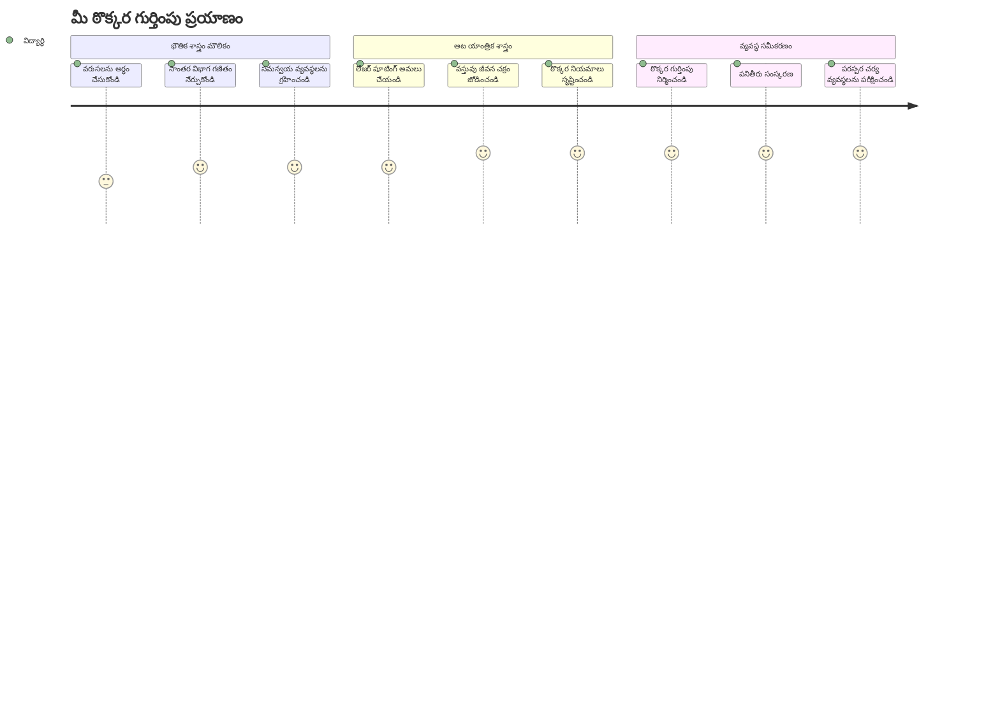
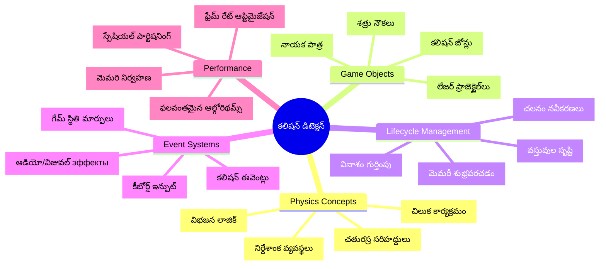
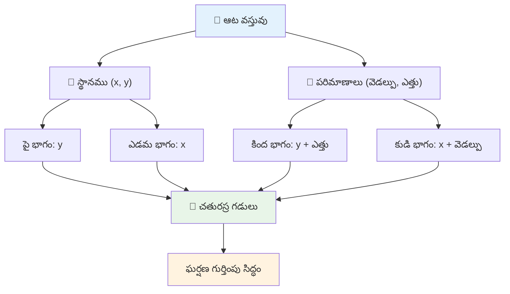
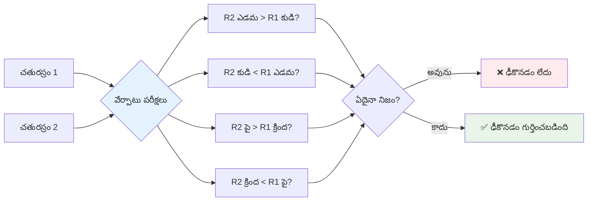
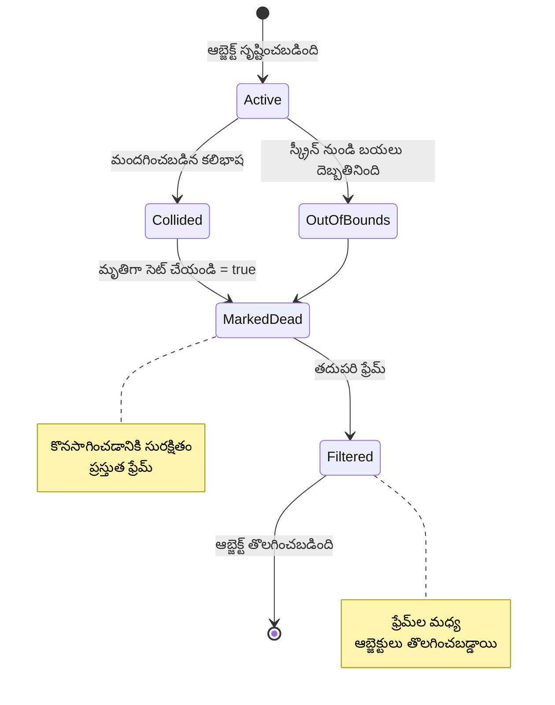
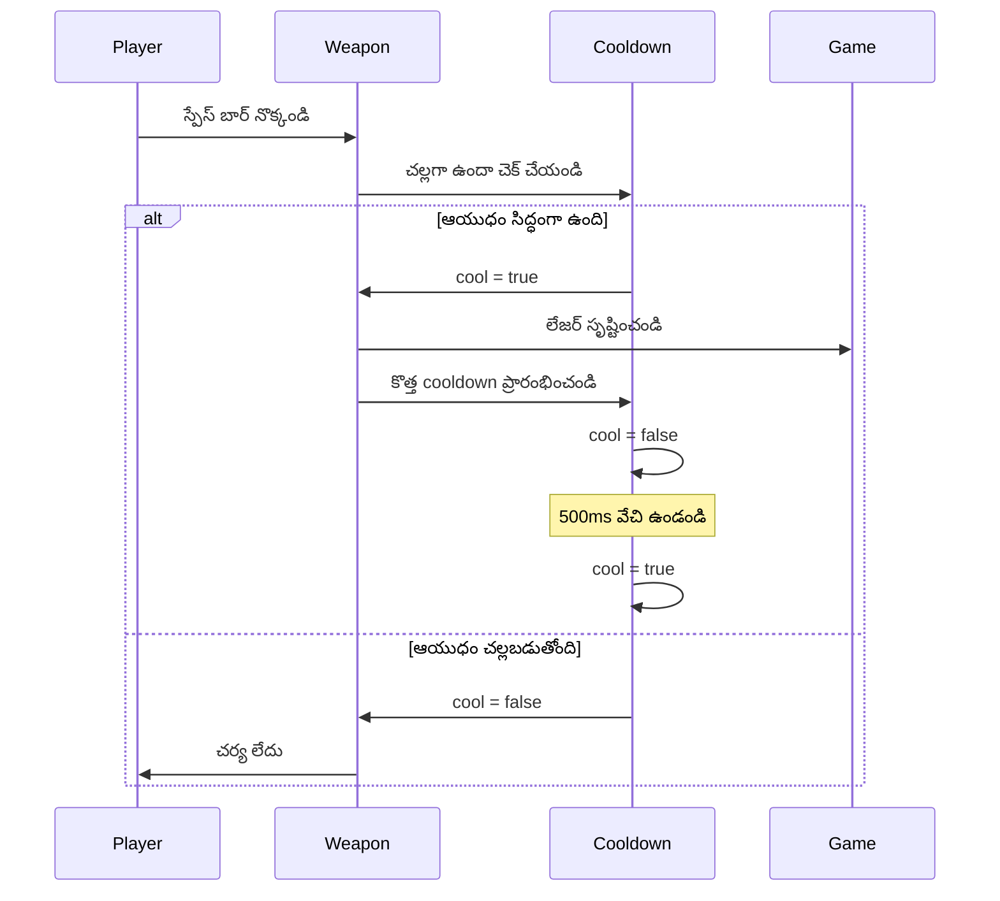
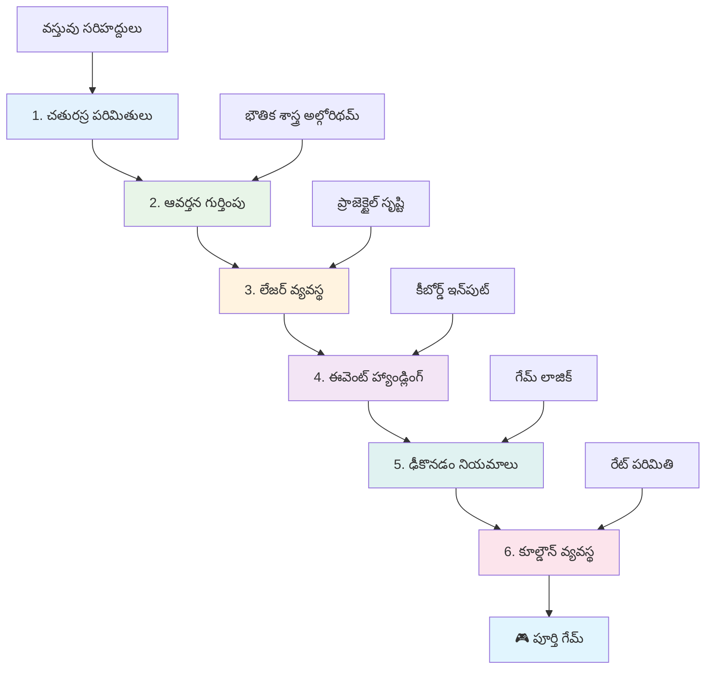
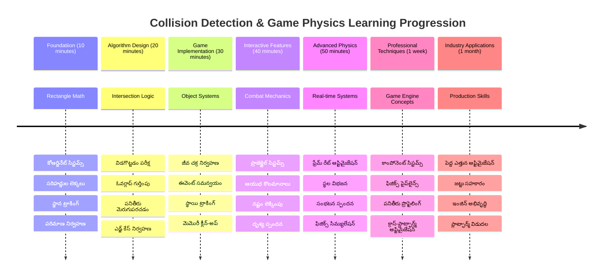

# స్పేస్ గేమ్ నిర్మాణం భాగం 4: లేజర్‌ను జోడించడం మరియు ఢీకి తెలియజేయడం


## పాఠం ముందరి క్విజ్

[పాఠం ముందరి క్విజ్](https://ff-quizzes.netlify.app/web/quiz/35)

స్టార్ వార్స్‌లో ల్యూక్ యొక్క ప్రోటాన్ టోర్పెడోలు డెత్ స్టార్ ఎగ్జాస్టు పోర్టును తగలగానే చోటుచేసుకున్న క్షణాన్ని గురించిన ఆలోచన చేయండి. ఆ ఖచ్చితమైన ఢీకి గుర్తింపు గెలాక్సీ యొక్క విధిని మార్చింది! గేమ్స్‌లో, ఢీకి గుర్తింపు అదే విధంగా పనిచేస్తుంది - ఇది వస్తువులు ఎప్పుడు పరస్పరం ఎదుర్కొంటున్నాయో నిర్ధారిస్తుంది మరియు తరువాత ఏమి జరుగుతుందో నిర్ణయిస్తుంది.

ఈ పాఠంలో, మీరు మీ స్పేస్ గేమ్‌కు లేజర్ ఆయుధాలను జోడించి ఢీకి గుర్తింపును అమలుపరుస్తారు. NASA మిషన్ ప్లానర్లు అశుభ్రత నివారించడానికి అంతరిక్షयान పథకాలను గణిస్తారని మీరు నేర్చుకుంటారు. మేము దీనిని ఒకదాని పైన మరొకటి నిర్మించే అనుకూలమైన దశలుగా విడగొడతాము.

చివరికి, లేజర్లు శత్రువులను నాశనం చేస్తూ, ఢీకి గమనించినప్పుడు గేమ్ సంఘటనలను రోగించే క్రియాశీల యుద్ధ వ్యవస్థను కలిగి ఉంటారు. ఇదే ఢీకి సూత్రాలు భౌతిక శాస్త్ర సిమ్యులేషన్స్ నుండి ఇంటరాక్టివ్ వెబ్ ఇంటర్‌ఫేస్ల వరకు ఉపయోగించబడతాయి.


✅ మొదటి కంప్యూటర్ గేమ్ ఎప్పుడైన రాయబడింది మరియు దాని కార్యాచరణ ఏమిటి అన్న విషయంపై కొంత పరిశోధన చేయండి.

## ఢీకి గుర్తింపు

ఢీకి గుర్తింపు అబ్బలో లూనార్ మాడ్యూల్లోని సమీప సెన్సార్ల లాంటి పని చేస్తుంది - ఇది క్రమంగా దూరాలను పరిక్షిస్తూనే వస్తువులు చాలా దగ్గరైనప్పుడు హెచ్చరికని ఉత్పత్తి చేస్తుంది. గేమ్స్‌లో ఇది వస్తువుల పరస్పరం చర్యలను మరియు తరువాత ఏమి జరగాలో నిర్ణయిస్తుంది.

మనం ఉపయోగించుకునే పద్ధతి ప్రతి గేమ్ ఆబ్జెక్టును ఒక చతురస్రం అన్నట్లుగా భావిస్తుంది, ఇది ఎయిర్ ట్రాఫిక్ కంట్రోల్ సిస్టమ్స్ విమానాలను ట్రాక్ చేయడానికి సరళీకృత జ్యామితీయ ఆకారాలను ఉపయోగించే విధానాన్ని పోలికగా తీసుకుంటుంది. ఈ చతురస్ర పద్ధతి సాధారణంగా కనిపించవచ్చు, కాని ఇది గణనీయంగా సమర్థవంతమే మరియు ఎక్కువ గేమ్ సందర్భాల్లో బాగుంది.

### చతురస్ర ప్రతీకారం

ప్రతి గేమ్ వస్తువు స్థానంలో సరిహద్దు కోఆర్డినేట్లు అవసరం, మარს్ పాథ్‌ఫైండర్ రోవర్ మంగళ గ్రహ ఉపరితలంపై తన స్థానాన్ని గుర్తించడానికి ఎలా ఉపయోగించిందో అలానే. ఇవి మనం సరిహద్దు కోఆర్డినేట్లను నిర్వచించేదాన్ని:


```javascript
rectFromGameObject() {
  return {
    top: this.y,
    left: this.x,
    bottom: this.y + this.height,
    right: this.x + this.width
  }
}
```

**దీనిని విడగొడదాం:**
- **పై అంచు**: ఇది మీ వస్తువు ఎక్కడ నుండి ప్రారంభమయ్యింది అనేది నిలువుగా (ఆటస్ధానం y)
- **ఎడమ అంచు**: ఇది أف్పుపరికి ఆడవైపు ప్రారంభ స్థానంని సూచిస్తుంది (ఆటస్ధానం x)
- **కింద అంచు**: y స్థానానికి ఎత్తు జోడించండి - ఇక్కడ వస్తువు ముగుస్తుంది!
- **కుడి అంచు**: x స్థానానికి వెడల్పు జోడించండి - మీరు పూర్తి సరిహద్దును పొందారు

### అసంక్రమణ అల్గోరిథమ్

చతురస్రాల అసంక్రమణలను గుర్తించడం హబుల్ స్పేస్ టెలిస్కోప్ విశ్వ పరిమాణంలో ఆకాశీయ వస్తువులు ఒకరిపై ఒకరు విభజించబోతున్నాయా అని నిర్ధారించే విధానం లాంటిదే. అల్గోరిథమ్ విడిపోవడాన్ని పరీక్షిస్తుంది:


```javascript
function intersectRect(r1, r2) {
  return !(r2.left > r1.right ||
    r2.right < r1.left ||
    r2.top > r1.bottom ||
    r2.bottom < r1.top);
}
```

**విభజన పరీక్ష రాడార్ వ్యవస్థలాగే పనిచేస్తుంది:**
- చతురస్రం 2 పూర్తిగా చతురస్రం 1 కుడివైపు ఉందా?
- చతురస్రం 2 పూర్తిగా చతురస్రం 1 ఎడమవైపు ఉందా?
- చతురస్రం 2 పూర్తిగా చతురస్రం 1 కింద ఉందా?
- చతురస్రం 2 పూర్తిగా చతురస్రం 1 పైగా ఉందా?

ఈ పరిస్థితేలపై ఇంకేమీ నిజం కాకపోతే, చతురస్రాలు ఒకరిపై ఒకరు ఉత్ప్రేరకంగా నిలబడ్డాయని అర్థం. ఇది రాడార్ ఆపరేటర్లు రెండు విమానాలు సురక్షిత దూరంలో ఉన్నాయా అని తెలుసుకునే విధానం.

## వస్తువుల జీవ చక్రాలను నిర్వహించడం

లేజర్ శత్రువు పైన తగిలితే, రెండు వస్తువులు గేమ్ నుండి తొలగించాలి. అయితే, లోపల లూప్ లో వస్తువులను తొలగించడం క్రాష్‌లకు దారి తీస్తుంది - ఇది అప్పోలో మార్గదర్శి కంప్యూటర్ వంటి ప్రాచీన కంప్యూటర్ వ్యవస్థలలో అనుభవించిన పాఠం. బదులుగా, "తొలగించడానికి గుర్తు" సూత్రాన్ని ఉపయోగిస్తాము, ఇది ఫ్రేమ్‌ల మధ్య వస్తువులను సురక్షితంగా తొలగిస్తుంది.


ఇలా ఏదైనా తొలగించడానికి గుర్తు చేస్తున్నాం:

```javascript
// వస్తువును తొలగింపు కోసం గుర్తించండి
enemy.dead = true;
```

**ఈ విధానం ఎందుకు పనిచేస్తుంది**:
- వస్తువును "డెడ్" గా గుర్తిస్తాం కానీ వెంటనే తొలగింపము చేయం
- ఇది ప్రస్తుత గేమ్ ఫ్రేమ్ సురక్షితంగా పూర్తయ్యేలా చేస్తుంది
- ముందే తొలగించిన వస్తువును ఉపయోగించటంలో దోషాలు రాకుండా చేస్తుంది!

తర్వాత తదుపరి రేండర్ చక్రానికి ముందే గుర్తించిన వస్తువులను ఫిల్టర్ చేస్తాం:

```javascript
gameObjects = gameObjects.filter(go => !go.dead);
```

**ఈ ఫిల్టరింగ్ చేస్తుంది:**
- "జీవంత" వస్తువులతో కొత్త జాబితా సృష్టిస్తుంది
- డెడ్ గా గుర్తించిన వాటిని బయటపెడుతుంది
- మీ గేమ్ బాగుగా నడుస్తుంది
- నాశనమైన వస్తువుల చేర్చడం వల్ల స్మృతి పెరిగేలా ఉండదు

## లేజర్ యాంత్రికతను అమలుచేయడం

గేమ్స్‌లో లేజర్ ప్రాజెక్టైల్స్ స్టార్ ట్రెక్‌లోని ఫోటాన్ టోర్పెడోల మాదిరిగా పనిచేస్తాయి - అవి నిర్దిష్ట వస్తువులు క్రమంగా సరేఖా గుండా ప్రయాణిస్తూ ఏదైనా తగలుతున్నంతవరకు. ప్రతి స్పేస్‌బార్ నొక్కటంతో కొత్త లేజర్ వస్తువు సృష్టించబడుతుంది, ఇది తెరపై కదులుతుంది.

ఇది పనిచేసేందుకు, కొన్ని భాగాలను సమన్వయింపచేయాలి:

**ప్రధాన భాగాలు అమలు చేసుకోవాలి:**
- హీరో స్థానంలో నుండి లేజర్ వస్తువులను సృష్టించండి
- కీబోర్డ్ ఇన్‌పుట్‌ను హ్యాండిల్ చేసి లేజర్ సృష్టింపు ప్రారంభించండి
- లేజర్ కదలికను మరియు జీవ చక్రాన్ని నిర్వహించండి
- లేజర్ ప్రాజెక్టైల్స్ కోసం విజువల్ ప్రతినిధిత్వాన్ని అమలు చేయండి

## ఆగిపోనున్న కాలం నియంత్రణ అమలు

అంగీకరించని వేగంతో తుప్పు వేయడం గేమ్ ఇంజన్‌ను ఒత్తిడికి లోనుచేస్తుంది మరియు ఆటను చాలా సులభతరం చేస్తుంది. నిజమైన ఆయుధ వ్యవస్థలు కూడా అటువంటి పరిమితులను ఎదుర్కొంటాయి - USS ఎంటర్‌ప్రైజ్ ఫేసర్స్ కు కాలం అవసరం ఉండేది ప్రతి షాట్ గడిచిన తర్వాత.

మనము అవకాశాలను తగ్గించే కూల్డౌన్ సిస్టమ్ అమలు చేస్తాము, ఇది తుప్పు వేయడంలో వేగాన్ని తగ్గిస్తుంటూ స్పందనాత్మక నియంత్రణలను కాపాడుతుంది:


```javascript
class Cooldown {
  constructor(time) {
    this.cool = false;
    setTimeout(() => {
      this.cool = true;
    }, time);
  }
}

class Weapon {
  constructor() {
    this.cooldown = null;
  }
  
  fire() {
    if (!this.cooldown || this.cooldown.cool) {
      // లేజర్ ప్రాజెక్టైల్ తయారు చేయండి
      this.cooldown = new Cooldown(500);
    } else {
      // ఆయుధం ఇంకా కూలింగ్ అవుతుంది
    }
  }
}
```

**కూల్డౌన్ పని విధానం:**
- సృష్టించినప్పుడు, ఆయుధం "హాట్" (ఇప్పుడే తుప్పు వేయడం వీల్గా లేదు)
- టైమౌట్ తర్వాత, అది "కూల్" అవుతుంది (తుప్పుకు సిద్దంగా ఉంటుంది)
- తుప్పు వేయక ముందు, "ఏయే ఆయుధం కూల్ గా ఉందా?" అని తనిఖీ చేస్తాం
- ఇది తుప్పులను శీఘ్ర నిడివిలో ఉపయోగించకుండా చేస్తుంది కాని నియంత్రణల్ని స్పందన చేయగలిగేలా ఉంచుతుంది

✅ స్పేస్ గేమ్ పరంపరలో పాఠం 1 ను మరోసారి నోటీసు చేసుకోండి, కూల్డౌన్ల గురించి గుర్తు చేసుకోవడానికి.

## ఢీకి వ్యవస్థను నిర్మించడం

మీ ఇప్పటికే ఉన్న స్పేస్ గేమ్ కోడ్‌ను పొడిగించి ఢీకి గుర్తింపు వ్యవస్థను సృష్టిస్తారు. అంతర్జాతీయ అంతరిక్ష స్టేషన్ ఢీకి నివారణ వ్యవస్థల లాగా, మీ గేమ్ వస్తువుల స్థానాలను నిరంతరం పర్యవేక్షించి అసంక్రమణలను గుర్తించి స్పందిస్తుంది.

మీ పూర్వ పాఠాల కోడ్ నుండి ప్రారంభించి, వస్తువుల పరస్పర చర్యలను నియంత్రించే చట్టాలతో ఢీకి గుర్తింపు జోడిస్తారు.

> 💡 **ప్రో చిట్కా**: లేజర్ స్ప్రైట్ ఇప్పటికే మీ ఆసెట్ ఫోల్డర్‌లో ఉంది మరియు మీ కోడ్‌లో సూచించబడింది, అమలుకు సిద్ధంగా ఉంది.

### అమలు చేయవలసిన ఢీకి నియమాలు

**గేమ్ యాంత్రికతలకు జోడించవలసినవి:**
1. **లేజర్ శత్రువు‌ను తగిలిస్తే**: లేజర్ ప్రాజెక్టైల్ తగిలిపోవడంవల్ల శత్రువు వస్తువు నాశనం అవుతుంది
2. **లేజర్ తెర అంచుకు తగిలితే**: తెరపై పై అంచునకు చేరుకున్నప్పుడు లేజర్ తొలగించబడుతుంది
3. **శత్రువు మరియు హీరో ఢీకి**: పరస్పరం తగిలితే రెండు వస్తువులు నాశనం చేస్తాయి
4. **శత్రువు తెర దిగువకు చేరితే**: శత్రువులు తెర క్రిందకి చేరినప్పుడు గేమ్ ముగిసింది కారెక్కుతుందని భావిస్తాం

### 🔄 **బోధనా తనిఖీ**
**ఢీకి గుర్తింపు పునాది**: అమలు ముందు, ఈ విషయాలు అర్థం చేసుకోండి:
- ✅ చతురస్ర సరిహద్దులు ఢీకులను ఎలా నిర్వచిస్తాయి
- ✅ కారణంగా విడిపోవడం పరీక్షించడం అసంఖ్య పద్ధతిని ఎందుకు మెరుగుపరుస్తుంది
- ✅ గేమ్ లూప్‌లో వస్తువు జీవ చక్రం నిర్వహణ ముఖ్యత
- ✅ ఘటన-ఆధారిత వ్యవస్థల ద్వారా ఢీకి స్పందనలు ఎలా సమన్వయింపబడతాయి

**తక్షణ స్వీయ పరీక్ష**: మీరు వస్తువులను వెంటనే తొలగిస్తే ఏమి జరుగుతుంది?
*పలుకు: మధ్యలో తొలగిస్తే క్రాష్‌లు వస్తాయి లేదా లూప్‌లో వస్తువులు మిస్ కావచ్చు*

**భౌతిక శాస్త్ర అవగాహన**: ఈ విషయాలు మీరు గ్రహించాలి:
- **కోఆర్డినేట్ వ్యవస్థలు**: స్థానాలు మరియు పరిమాణాలు సరిహద్దులను ఎలా సృష్టిస్తాయి
- **అసంక్రమణ తాత్త్వికత**: ఢీకి గుర్తింపుకు గణిత సూత్రాలు
- **స్థితిగతిగ వృద్ధి**: వాస్తవసమయ వ్యవస్థల్లో సమర్థ అల్గోరిథమ్ల ప్రాముఖ్యత
- **స్మృతి నిర్వహణ**: సురక్షితంగా వస్తువులను నిర్వహించే విధానాలు

## మీ అభివృద్ధి వాతావరణాన్ని సెట్ చేయడం

సంతోషకరం - మేము మీకు చాలా ప్రాథమిక పని సిద్ధం చేశాము! మీ గేమ్ ఆసెట్లన్నీ మరియు ప్రాథమిక నిర్మాణం `your-work` ఉపఫోల్డర్‌లో ఉంది, మీరు చల్లని ఢీకి లక్షణాలను జోడించండి.

### ప్రాజెక్ట్ నిర్మాణం

```bash
-| assets
  -| enemyShip.png
  -| player.png
  -| laserRed.png
-| index.html
-| app.js
-| package.json
```

**ఫైల్ నిర్మాణాన్ని అర్థం చేసుకోండి:**
- గేమ్ వస్తువులకు అవసరమైన అన్ని స్ప్రైట్ చిత్రాలు ఉన్నాయి
- ప్రధాన HTML డాక్యుమెంట్ మరియు జావాస్క్రిప్ట్ అప్లికేషన్ ఫైల్‌ను కూడా కలిగి ఉంది
- స్థానిక అభివృద్ధి సర్వర్ కొరకు ప్యాకేజ్ కాన్ఫిగరేషన్ అందిస్తుంది

### అభివృద్ధి సర్వర్ ప్రారంభించడం

మీ ప్రాజెక్ట్ ఫోల్డర్ కి వెళ్లి స్థానిక సర్వర్ ప్రారంభించండి:

```bash
cd your-work
npm start
```

**ఈ ఆదేశం క్రమం:**
- మీ పని ప్రాజెక్ట్ ఫోల్డర్ కు మారుతుంది
- `http://localhost:5000` వద్ద లోకల్ HTTP సర్వర్ ప్రారంభిస్తుంది
- గేమ్ ఫైల్స్ ని పరీక్ష మరియు అభివృద్ధి కోసం అందిస్తుంది
- లైవ్ అభివృద్ధితో ఆటోమాటిక్ రీలోడింగ్ యాక్టివేట్ చేస్తుంది

మీ బ్రౌజర్‌ను తెరిచి `http://localhost:5000` కి వెళ్ళి మీ ప్రస్తుత గేమ్ స్థితిని హీరో మరియు శత్రువులతో స్క్రీన్ పై చూడండి.

### దశల వారీ అమలు

NASA వాయేజర్ అంతరిక్షయాన ప్రోగ్రామ్ చేసిన విధంగా, మనము ఢీకి గుర్తింపును సistemా లోగడ మెట్టెల వారీగా అమలు చేద్దాము.


#### 1. చతురస్ర ఢీకి సరిహద్దులను జోడించడం

ముందుగా, మన గేమ్ వస్తువులకు వారి సరిహద్దులను ఎలా వివరించాలో నేర్పుదాం. ఇది మీ `GameObject` తరగతికి జోడించండి:

```javascript
rectFromGameObject() {
    return {
      top: this.y,
      left: this.x,
      bottom: this.y + this.height,
      right: this.x + this.width,
    };
  }
```

**ఈ విధానం చేస్తుంది:**
- ఖచ్చితమైన సరిహద్దు కోఆర్డినేట్లతో ఒక చతురస్రం వస్తువు సృష్టిస్తుంది
- స్థానానికి ఎత్తు, వెడల్పు జోడించి దిగువ మరియు కుడి అంచులను లెక్కిస్తుంది
- ఢీకి గుర్తింపు అల్గోరిథమ్ల కోసం సిద్ధంగా ఉన్న వస్తువు అందిస్తుంది
- ప్రతి గేమ్ వస్తువుకు ప్రామాణిక ఇంటర్‌ఫేస్ అందిస్తుంది

#### 2. అసంక్రమణ గుర్తింపును అమలు చేయండి

ఇప్పుడు మన ఢీకి గూఢచర్యకర్తను సృష్టిద్దాం - రెండు చతురస్రాలు ఒక ఏర్పాటులో ఉన్నాయా లేమో చెబుతుంటే ఫంక్షన్:

```javascript
function intersectRect(r1, r2) {
  return !(
    r2.left > r1.right ||
    r2.right < r1.left ||
    r2.top > r1.bottom ||
    r2.bottom < r1.top
  );
}
```

**ఈ అల్గోరిథం పని విధానం:**
- చతురస్రాల మధ్య నాలుగు విడిపోయే పరిస్థితులను పరీక్షిస్తుంది
- ఏదైనా విడిపోవడం నిజమైతే `false` ను ఇవ్వాలి
- విడిపోవడం లేకపోతే ఢీకి ఉన్నది అనిపిస్తుంది
- సమర్థవంతమైన అసంక్రమణ పరీక్షకై వ్యతిరేకత తర్కాన్ని ఉపయోగిస్తుంది

#### 3. లేజర్ తుప్పు వ్యవస్థను అమలు చేయండి

ఇక్కడ అన్ని ఉత్తేజకర అంశాలు వస్తున్నాయి! మనము లేజర్ తుప్పు వ్యవస్థను సెట్ చేద్దాము.

##### సందేశ స్థిరాంకాలు

మొదట, గేమ్ భాగాలు పరస్పరం మాట్లాడటానికి సందేశ రకాలను నిర్వచిద్దాం:

```javascript
KEY_EVENT_SPACE: "KEY_EVENT_SPACE",
COLLISION_ENEMY_LASER: "COLLISION_ENEMY_LASER",
COLLISION_ENEMY_HERO: "COLLISION_ENEMY_HERO",
```

**ఈ స్థిరాంకాలు అందించడం:**
- అప్లికేషన్ అంతటా ఈవెంట్ పేర్లను ప్రమాణీకరిస్తాయి
- గేమ్ వ్యవస్థల మధ్య సుస్పష్ట కమ్యూనికేషన్ కోసం వీలు కలిగిస్తాయి
- ఈవెంట్ హ్యాండ్లర్ రిజిస్ట్రేషన్‌లో తప్పులను నివారిస్తాయి

##### కీబోర్డ్ ఇన్‌పుట్ నిర్వహణ

మీ కీ ఈవెంట్ లిసనర్‌కు స్పేస్ కీ గుర్తింపును జోడించండి:

```javascript
} else if(evt.keyCode === 32) {
  eventEmitter.emit(Messages.KEY_EVENT_SPACE);
}
```

**ఈ ఇన్‌పుట్ హ్యాండ్లర్:**
- keyCode 32 ఉపయోగించి స్పేస్ కీ నొక్కినట్లు గుర్తిస్తుంది
- ప్రమాణీకృత ఈవెంట్ సందేశాన్ని ఉత్పత్తి చేస్తుంది
- వేరే భాగాల నుండి సంక్లిష్ట తుప్పు నియంత్రణని సాధ్యం చేస్తుంది

##### ఈవెంట్ లిసనర్ సెట్ చేసుకోవడం

మీ `initGame()` ఫంక్షన్‌లో తుప్పు ప్రవర్తనను నమోదు చేయండి:

```javascript
eventEmitter.on(Messages.KEY_EVENT_SPACE, () => {
 if (hero.canFire()) {
   hero.fire();
 }
});
```

**ఈ ఈవెంట్ లిసనర్:**
- స్పేస్ కీ ఈవెంట్లకు స్పందిస్తుంది
- తుప్పు వేయడానికి కూల్డౌన్ స్థితిని తనిఖీ చేస్తుంది
- అనుమతిస్తే లేజర్ సృష్టిని ప్రారంభిస్తుంది

లేజర్-శత్రువు ఢీకి నిర్వహణ జోడించండి:

```javascript
eventEmitter.on(Messages.COLLISION_ENEMY_LASER, (_, { first, second }) => {
  first.dead = true;
  second.dead = true;
});
```

**ఈ ఢీకి హ్యాండ్లర్:**
- రెండూ వస్తువుల డేటాను సహా ఢీకి ఈవెంట్‌ను అందుకుంటుంది
- రెండు వస్తువులను తొలగింపకు గుర్తిస్తుంది
- ఢీకి తర్వాత సరైన శుభ్రతని యెక్కిస్తుంది

#### 4. లేజర్ తరగతిని సృష్టించండి

పైనకి కదులుతున్న, తాను జీవ చక్రాన్ని నిర్వహించే లేజర్ ప్రాజెక్టైల్‌ను అమలుచేయండి:

```javascript
class Laser extends GameObject {
  constructor(x, y) {
    super(x, y);
    this.width = 9;
    this.height = 33;
    this.type = 'Laser';
    this.img = laserImg;
    
    let id = setInterval(() => {
      if (this.y > 0) {
        this.y -= 15;
      } else {
        this.dead = true;
        clearInterval(id);
      }
    }, 100);
  }
}
```

**ఈ తరగతి అమలు:**
- GameObject ను విస్తృతం చేస్తూ ప్రాథమిక ఫంక్షనాలిటీని పొందుతుంది
- లేజర్ స్ప్రైట్‌కు తగిన పరిమాణాలను సెట్ చేస్తుంది
- `setInterval()` ఉపయోగించి ఆటోమేటిక్ పైనకి కదిలే కదలికను సృష్టిస్తుంది
- తెరపై పై అంచుకు చేరినపుడు తానే తనను తానే ధ్వంసం చేసుకుంటుంది
- తన యానిమేషన్ సమయాన్ని మరియు శుభ్రతను నిర్వహిస్తుంది

#### 5. ఢీకి గుర్తింపు వ్యవస్థను అమలు చేయండి

సమగ్ర ఢీకి గుర్తింపు ఫంక్షన్ సృష్టించండి:

```javascript
function updateGameObjects() {
  const enemies = gameObjects.filter(go => go.type === 'Enemy');
  const lasers = gameObjects.filter(go => go.type === "Laser");
  
  // లేజర్-శత్రు ఢీంకులకు పరీక్షించండి
  lasers.forEach((laser) => {
    enemies.forEach((enemy) => {
      if (intersectRect(laser.rectFromGameObject(), enemy.rectFromGameObject())) {
        eventEmitter.emit(Messages.COLLISION_ENEMY_LASER, {
          first: laser,
          second: enemy,
        });
      }
    });
  });

  // ధ్వంసమైన వస్తువులను తీసివేయండి
  gameObjects = gameObjects.filter(go => !go.dead);
}
```

**ఈ ఢీకి వ్యవస్థ:**
- పరీక్ష కోసం గేమ్ వస్తువులను రకం ప్రకారం ఫిల్టర్ చేస్తుంది
- ప్రతి లేజర్‌ ను ప్రతి శత్రువు పై పరీక్షించి అసంక్రమణలను గుర్తిస్తుంది
- అసంక్రమణలు గుర్తించినపుడు ఢీకి ఈవెంట్లను ఉత్పత్తి చేస్తుంది
- ఢీకి సంచాలన తర్వాత ధ్వంసిత వస్తువులను శుభ్రం చేస్తుంది

> ⚠️ **ముఖ్యము**: `updateGameObjects()`ని మీ ప్రధాన గేమ్ లూపులో `window.onload` లో జోడించండి, ఇది ఢీకి గుర్తింపునకు అనుమతిస్తుంది.

#### 6. హీరో క్లాస్‌లో కూల్డౌన్ వ్యవస్థను జోడించండి

ఫైరింగ్ యాంత్రికతను మరియు వేగ పరిమితిని ఉన్న హీరో క్లాస్‌ను మెరుగు పరచండి:

```javascript
class Hero extends GameObject {
  constructor(x, y) {
    super(x, y);
    this.width = 99;
    this.height = 75;
    this.type = "Hero";
    this.speed = { x: 0, y: 0 };
    this.cooldown = 0;
  }
  
  fire() {
    gameObjects.push(new Laser(this.x + 45, this.y - 10));
    this.cooldown = 500;

    let id = setInterval(() => {
      if (this.cooldown > 0) {
        this.cooldown -= 100;
      } else {
        clearInterval(id);
      }
    }, 200);
  }
  
  canFire() {
    return this.cooldown === 0;
  }
}
```

**మరింత మెరుగైన హీరో క్లాస్ అర్థం:**
- ప్రారంభంలో కూల్డౌన్ టైమర్‌ను సున్నా గా (తుప్పుకు సిద్దంగా) సెట్ చేస్తుంది
- హీరో నౌక స్ధానానికి పైభాగంలో లేజర్లు సృష్టిస్తుంది
- త్వరిత తుప్పుకు నిరోధం కొరకు కూల్డౌన్ సమయాన్ని సెట్ చేస్తుంది
- ఇంటర్వల్ ఆధారిత నవీకరణలతో కూల్డౌన్ టైమర్‌ను తగ్గిస్తుంది
- `canFire()` విధానం ద్వారా తుప్పు వేయడంలో స్థితిని ఇస్తుంది

### 🔄 **బోధనా తనిఖీ**
**సistem పూర్తి అవగాహన**: ఢీకి వ్యవస్థపై మీ పట్టు:
- ✅ చతురస్ర సరిహద్దులు సమర్థ ఢీకి గుర్తింపును ఎలా సాధిస్తాయి?
- ✅ వస్తువు జీవ చక్ర నిర్వహణ గేమ్ స్థిరత్వానికి ఎందుకు ముఖ్యము?
- ✅ కూల్డౌన్ వ్యవస్థ పనితీరును ఎలా నిలిపివేస్తుంది?
- ✅ సంఘటన ఆధారిత ఆర్కిటెక్చర్ ఢీకి నిర్వహణలో ఎటువంటి పాత్ర కలిగి ఉంది?

**సистем్ సమాఖ్య**: మీ ఢీకి గుర్తింపు చూపిస్తుంది:
- **గణిత ఖచ్చితత్వం**: చతురస్ర అసంక్రమణ అల్గోరిథమ్లు
- **దక్షత పెంపు**: సమర్థ ఢీకి పరీక్ష నమూనాలు
- **స్మృతి నిర్వహణ**: సురక్షిత వస్తువు సృష్టి మరియు నాశనం
- **ఈవెంట్ సమన్వయం**: వేరొకరితో వ్యవస్థ కమ్యూనికేషన్
- **వాస్తవసమయ ప్రాసెసింగ్**: ఫ్రేమ్ నవీకరణ చక్రాలు

**వృత్తిపరమైన నమూనాలు**: మీరు అమలుచేసారు:
- **జాగ్రత్త విభజన**: భౌతిక శాస్త్రం, దృశ్యీకరణ, ఇన్‌పుట్ వేరుగా ఉంచడం
- **ఆబ్జెక్ట్-ఓరియెంటెడ్ డిజైన్**: వారసత్వం మరియు పాళిమార్ఫిజం
- **స్థితి నిర్వహణ**: వస్తువు జీవ చక్రం మరియు గేమ్ స్థితి ట్రాకింగ్
- **దక్షత సాంకేతికత**: వాస్తవసమయ వినియోగానికి సమర్థ అల్గోరిథమ్లు

### మీ అమలుని పరీక్షించడం

మీ స్పేస్ గేమ్ ఇప్పుడు పూర్తి ఢీకి గుర్తింపు మరియు యుద్ధ యాంత్రికత కలిగి ఉంది. 🚀 ఈ కొత్త సామర్థ్యాలను పరీక్షించండి:
- గమనించడానికి ఆనకీలు ఉపయోగించి కదిలండి
- స్పేస్‌బార్ తో లేజర్ తుప్పండి - కూల్డౌన్ స్పామ్ తగ్గింపును గమనించండి
- లేజర్లు శత్రువులు తగిలినప్పుడు ఢీకి గమనించి తొలగింపును సమీక్షించండి
- నాశనం పొందిన వస్తువులు గేమ్ నుండి తొలగబడుతున్నప్పుడు పరిశీలించండి

మీరు విజయవంతంగా ఢీకి గుర్తింపు వ్యవస్థను అమలు చేశారని గుర్తించండి, ఇది అంతరిక్ష నావిగేషన్ మరియు రొబోటిక్స్‌ను మార్గనిర్దేశం చేసే అదే గణిత సూత్రాలు ఉపయోగిస్తుంది.

### ⚡ **తరువాతి 5 నిమిషాల్లో మీరు చేయగలిగేది**
- [ ] డెవ్‌టూల్స్‌లో మీ ఢీకి గుర్తింపు ఫంక్షన్‌లో బ్రేక్ పాయింట్లను సెట్ చేయండి
- [ ] లేజర్ వేగం లేదా శత్రువు కదలికను మార్చి ఢీకి ప్రభావాలను చూడండి
- [ ] తుప్పు వేయుటకు వేర్వేరు కూల్డౌన్ విలువలతో ప్రయోగం చేయండి
- [ ] సన్నికిత సంఘటనలను ప్రత్యక్షంగా ట్రాక్ చేయడానికి `console.log` స్టేట్మెంట్లను జోడించండి

### 🎯 **ఈ గంటలో మీరు సాధించగలిగేది ఏమిటి**
- [ ] పాఠం తర్వాత క్విజ్ పూర్తి చేసి సన్నికిత గుర్తింపు అల్గోరిథంలను అర్థం చేసుకోవడం
- [ ] సన్నికిత సందర్భంగా పేలుడు వంటి విజువల్ ప్రభావాలను జోడించడం
- [ ] విభిన్న గుణ లక్షణాలతో వివిధ రకాల ప్రాజెక్టైళ్లను అమలు చేయడం
- [ ] ఆటగాడి సామర్థ్యాలను తాత్కాలికంగా మెరుగుపరచే పవర్-అప్స్ సృష్టించడం
- [ ] సన్నికితలకు మరింత సంతృప్తిదాయకంగా ఉండే శబ్దప్రభావాలను జోడించడం

### 📅 **మీ వారాంతం ఫిజిక్స్ ప్రోగ్రామింగ్**
- [ ] మెరుగైన సన్నికిత వ్యవస్థలతో పూర్తి స్పేస్ గేమ్ పూర్తి చేయండి
- [ ] చతురస్రాలని దాటించి అధునాతన సన్నికిత ఆకృతులను అమలు చేయడం (వృత్తాలు, బహుచతురస్రాలు)
- [ ] వాస్తవిక పేలుడు ప్రభావాలకు పార్టికల్ సిస్టమ్స్ జోడించడం
- [ ] సన్నికిత నివారణతో సంక్లిష్ట శత్రువు ప్రవర్తనను సృష్టించడం
- [ ] అనేక వస్తువులతో మెరుగైన పనితనానికి సన్నికిత గుర్తింపును ఆప్టిమైజ్ చేయడం
- [ ] త్వరణం మరియు వాస్తవిక ఉద్యమంలాంటి ఫిజిక్స్ సిమ్యులేషన్ ను జోడించడం

### 🌟 **మీ నెలరోజుల గేమ్ ఫిజిక్స్ నైపుణ్యం**
- [ ] అధునాతన ఫిజిక్స్ ఇంజన్లతో మరియు వాస్తవిక సిమ్యులేషన్లతో గేమ్ లను నిర్మించడం
- [ ] 3D సన్నికిత గుర్తింపు మరియు స్పేషియల్ పార్టిషనింగ్ అల్గోరిథంలను నేర్చుకోవడం
- [ ] ఓపెన్ సోర్స్ ఫిజిక్స్ లైబ్రరీలు మరియు గేమ్ ఇంజన్లలో సహకరించడం
- [ ] గ్రాఫిక్స్-భారతమైన అప్లికేషన్లకు పనితన ఆప్టిమైజేషన్‌లో నైపుణ్యం సాధించడం
- [ ] గేమ్ ఫిజిక్స్ మరియు సన్నికిత గుర్తింపు గురించి విద్యా విషయాలు సృష్టించడం
- [ ] అధునాతన ఫిజిక్స్ ప్రోగ్రామింగ్ నైపుణ్యాలతో పోర్ట్ఫోలియో నిర్మించడం

## 🎯 మీ సన్నికిత గుర్తింపు నైపుణ్య సమయం


### 🛠️ మీ గేమ్ ఫిజిక్స్ టూల్‌కిట్ సారాంశం

ఈ పాఠం పూర్తి చేసిన తరువాత, మీరు నాకు పూర్తి వచ్చారు:
- **సన్నికిత గణితం**: చతురస్ర క్రాస్‌చెక్ అల్గోరిథమ్స్ మరియు కోఆర్డినేట్ సిస్టమ్స్
- **పనితన ఆప్టిమైజేషన్**: ప్రత్యక్ష అప్లికేషన్ల కోసం సమయానుగుణ సన్నికిత గుర్తింపు సామర్థ్యం
- **వస్తువు జీవితచక్ర నిర్వహణ**: సురక్షితమైన సృష్టి, నవీకరణ మరియు ధ్వంసం నమూనాలు
- **సంఘటన ఆధారిత నిర్మాణం**: సన్నికిత ప్రతిస్పందన కొరకు డీకపుల్ చేసిన వ్యవస్థలు
- **గేమ్ లూప్ సమ్మేళనం**: ఫ్రేమ్ ఆధారిత ఫిజిక్స్ నవీకరణలు మరియు రెండరింగ్ సమన్వయం
- **ఇన్‌పుట్ సిస్టమ్స్**: స్పందనాత్మక నియంత్రణలు రేటు పరిమితి మరియు అభిప్రాయం తో
- **మెమరీ నిర్వహణ**: సమర్థవంతమైన వస్తువు పూలింగ్ మరియు శుభ్రపరిచే వ్యూహాలు

**వాస్తవ ప్రపంచ అప్లికేషన్లు**: మీ సన్నికిత గుర్తింపు నైపుణ్యాలు నేరుగా వర్తిస్తాయి:
- **ఇంటరాక్టివ్ సిమ్యులేషన్లు**: శాస్త్రీయ నమూనాలు మరియు విద్యా ఉపకరణాలు
- **వినియోగదార ఇన్ఫర్‌ఫేస్ డిజైన్**: డ్రాగ్-అండ్-డ్రాప్ మరియు టచ్ గుర్తింపు
- **డేటా విజువలైజేషన్**: ఇంటరాక్టివ్ చార్టులు మరియు క్లిక్ చేయదగిన అంశాలు
- **మొబైల్ డెవలప్‌మెంట్**: టచ్ జెస్చర్ గుర్తింపు మరియు సన్నికిత నిర్వహణ
- **రోబోటిక్స్ ప్రోగ్రామింగ్**: మార్గ ప్రణాళిక మరియు ఆటంక నివారణ
- **కంప్యూటర్ గ్రాఫిక్స్**: రే ట్రేసింగ్ మరియు స్థల అల్గోరిథంలు

**వృత్తిపరమైన నైపుణ్యాలు పొందినవి**: మీరు ఇప్పుడే చేయగలరు:
- **డిజైన్** సమయానుగుణ సన్నికిత గుర్తింపుకు సమర్థమైన అల్గోరిథంలు
- **అంశాల సంక్లిష్టతతో మరింత స్కేల్ అయ్యే ఫిజిక్స్ సిస్టమ్స్ అమలు
- **సాంకేతిక - గణిత సూత్రాలతో సంక్లిష్ట పరస్పర వ్యవస్థలను డీబగ్ చేయండి
- **వివిధ హార్డ్వేర్ మరియు బ్రౌజర్ సామర్థ్యాలకు పనితనాన్ని ఆప్టిమైజ్ చేయండి
- **ఆర్కిటెక్చర్** నిరూపిత డిజైన్ నమూనాలతో నిర్వహించదగిన గేమ్ వ్యవస్థలు

**గేమ్ డెవలప్‌మెంట్ కాన్సెప్ట్లు నేర్చుకున్నవి**:
- **ఫిజిక్స్ సిమ్యులేషన్**: ప్రత్యక్ష సన్నికిత గుర్తింపు మరియు స్పందన
- **పనితన ఇంజనీరింగ్**: ఇంటరాక్టివ్ అప్లికేషన్లకు ఆప్టిమైజ్ చేసిన అల్గోరిథమ్స్
- **సంఘటన వ్యవస్థలు**: గేమ్ భాగాల మధ్య డీకపుల్ చేసిన కమ్యూనికేషన్
- **వస్తువు నిర్వహణ**: గతి చెందిన విషయాల కోసం సమర్థవంతమైన జీవిత చక్ర నమూనాలు
- **ఇన్‌పుట్ హ్యాండ్లింగ్**: సరైన అభిప్రాయం తో స్పందనాత్మక నియంత్రణలు

**తరువాతి దశ**: మీరు Matter.js వంటి అధునాతన ఫిజిక్స్ ఇంజన్లను అన్వేషించడానికి, 3D సన్నికిత గుర్తింపును అమలు చేయడానికి లేదా సంక్లిష్ట పార్టికల్ సిస్టమ్స్ నిర్మించడానికి సిద్దంగా ఉన్నారు!

🌟 **సాఫల్యం సాధించారు**: మీరు వృత్తిపరమైన స్థాయి సన్నికిత గుర్తింపు కలిగిన పూర్తి ఫిజిక్స్ ఆధారిత ఇంటరాక్షన్ సిస్టమ్ ని నిర్మించారు!

## GitHub Copilot ఏజెంట్ ఛాలెంజ్ 🚀

క్రింది ఛాలెంజ్ పూర్తి చేయడానికి ఏజెంట్ మోడ్ ఉపయోగించండి:

**వివరణ:** హీరో నౌక ద్వారా సేకరించబడినప్పుడు తాత్కాలిక సామర్థ్యాలు కలిగిన పవర్-అప్స్ యాదృచ్ఛికంగా ఉత్పత్తి అయ్యేలా సన్నికిత గుర్తింపు వ్యవస్థను బలోపేతం చేయండి.

**ప్రాంప్ట్:** గేమ్‌ఆబ్జెక్ట్‌ని విస్తరించే PowerUp తరగతిని సృష్టించి, హీరో మరియు పవర్-అప్స్ మధ్య సన్నికిత గుర్తింపును అమలు చేయండి. కనీసం రెండు రకాల పవర్-అప్స్ జోడించండి: ఒకటి అగ్ని వేగాన్ని పెంచుతుందని (కూల్‌డౌన్ తగ్గిస్తుంది) మరియు మరొకటి తాత్కాలిక షీల్డ్ సృష్టిస్తుంది. యాదృచ్ఛిక మధ్యంతరాలు మరియు స్థానాలలో పవర్-అప్స్ సృష్టించే స్పాన్ లాజిక్ చేర్చండి.

---


## 🚀 ఛాలెంజ్

ఒక పేలుడు జోడించండి! గేమ్ ఆసెట్‌లను [the Space Art repo](../../../../6-space-game/solution/spaceArt/readme.txt)లో చూడండి మరియు లేజర్ ఒక ఎలియన్‌ను తాకినప్పుడు పేలుడు జోడించడానికి ప్రయత్నించండి

## లెక్చర్ తర్వాత క్విజ్

[లెక్చర్ తర్వాత క్విజ్](https://ff-quizzes.netlify.app/web/quiz/36)

## సమీక్ష & స్వీయ అధ్యయనం

ఇప్పటి వరకు మీ గేమ్‌లో విరామాలను ప్రయోగించండి. వాటిని మార్చినప్పుడు ఏమి జరుగుతుంది? [JavaScript టైమింగ్ ఈవెంట్ల గురించి](https://www.freecodecamp.org/news/javascript-timing-events-settimeout-and-setinterval/) మరింత చదవండి.

## అసైన్‌మెంట్

[సన్నికితలను అన్వేషించండి](assignment.md)

---

<!-- CO-OP TRANSLATOR DISCLAIMER START -->
**త్యాగపత్రం**:
ఈ పత్రాన్ని AI అనువాద సేవ [Co-op Translator](https://github.com/Azure/co-op-translator) ఉపయోగించి అనువదించారు. మేము సరిగా ఉండేందుకు ప్రయత్నించినప్పటికీ, స్వయం క్రియ అనువాదాలలో లోపాలు లేదా అసత్యతలు ఉండే అవకాశం ఉంది. అసలు పత్రం దాని స్థానిక భాషలోనే ప్రామాణికమైన మూలాధారం కావాలి. అత్యవసర సమాచారం కోసం, నిపుణుల చేత మనవదానం సిఫార్సు చేయబడింది. ఈ అనువాదం వాడకం కారణంగా ఏమైన అవగాహన లోపాలు లేదా తప్పు అర్థగ్రహణలకు మేము బాధ్యులు కాదు.
<!-- CO-OP TRANSLATOR DISCLAIMER END -->