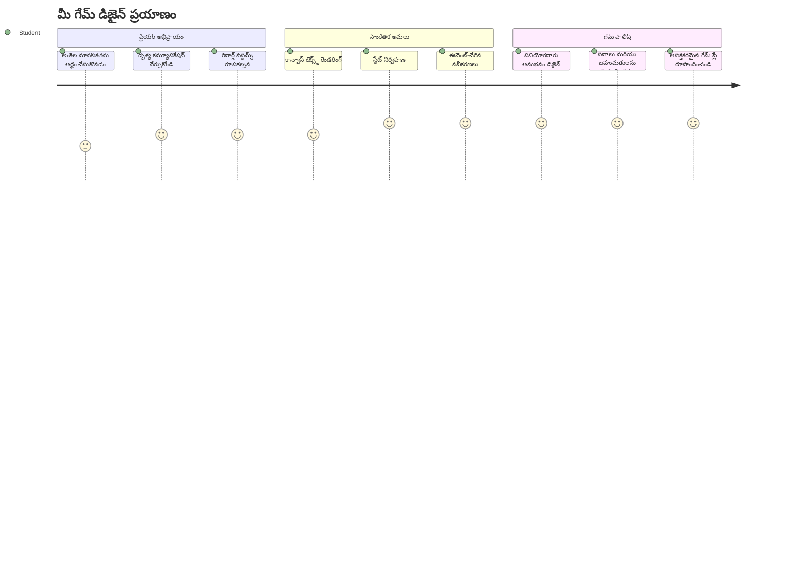
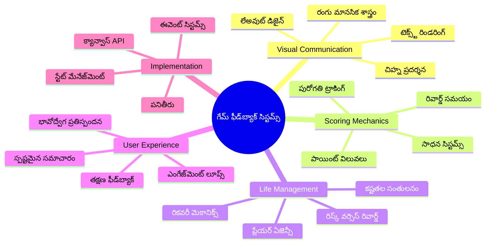
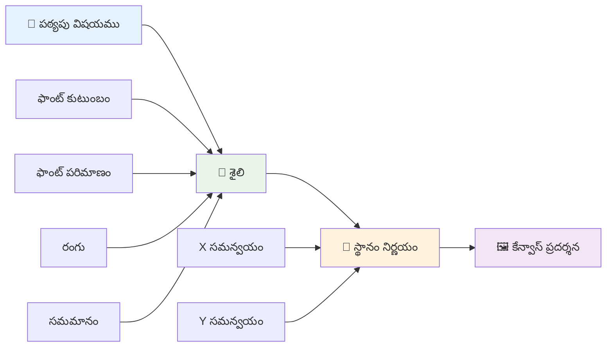
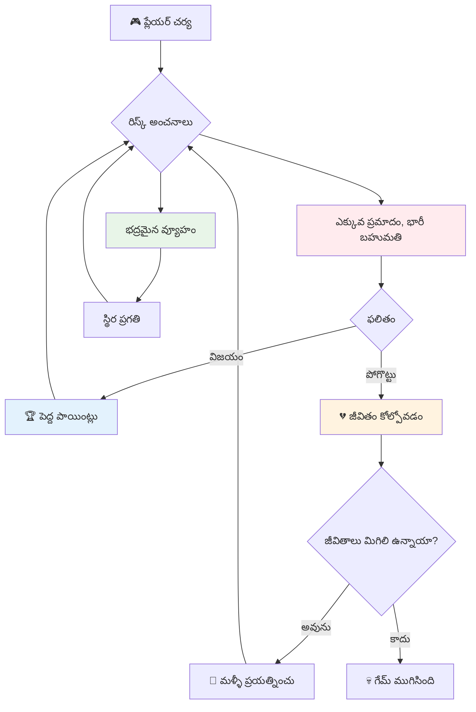
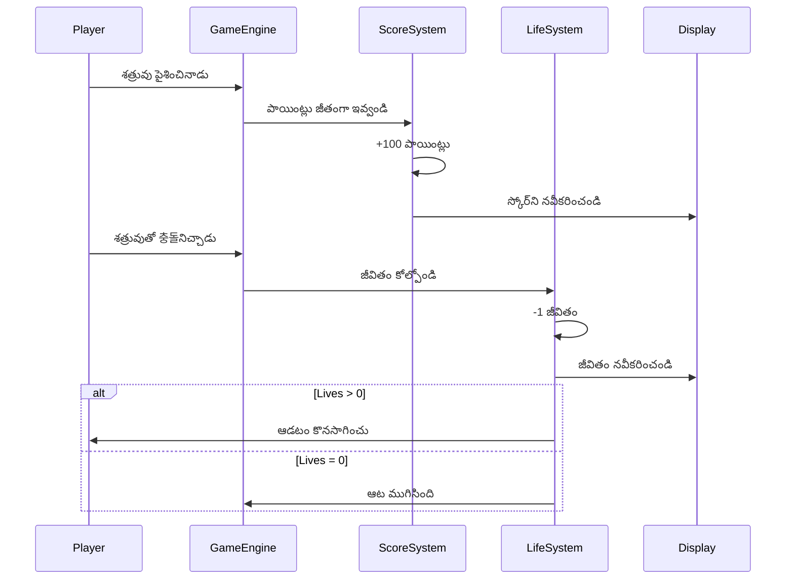
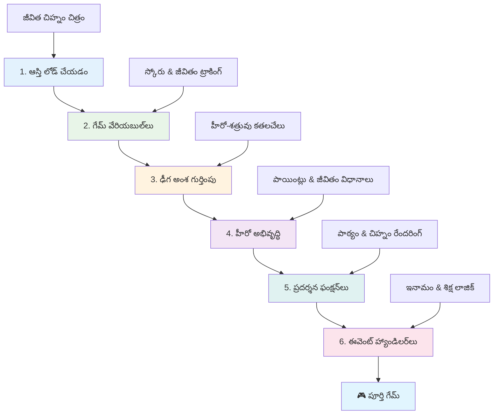
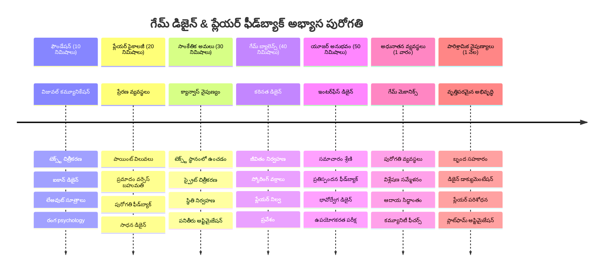

# ఒక స్పేస్ గేమ్‌ను నిర్మించండి భాగం 5: స్కోరింగ్ మరియు లైఫ్స్


## ప్రీ-లెక్చర్ క్విజ్

[ప్రీ-లెక్చర్ క్విజ్](https://ff-quizzes.netlify.app/web/quiz/37)

మీ స్పేస్ గేమ్ నిజమైన గేమ్‌లాగా అనిపించేలా చేయడానికి సిద్ధంగా ఉన్నారా? ఇది స్కోరింగ్ పాయింట్లు మరియు లైఫ్స్ నిర్వహణను జోడిద్దాం—ప్రాథమిక ఆట మెకానిక్స్, ఇది ప్రాథమిక ఆర్కేడ్ గేమ్స్ వంటి స్పేస్ ఇన్వేడర్స్‌లను సాదా ప్రదర్శనల నుండి వ్యసనపూర్వక వినోదంగా మార్చింది. ఇక్కడే మీ గేమ్ నిజంగా ఆడగలదిగా మారుతుంది.


## స్క్రీన్ పై టెక్స్ట్ డ్రాయింగ్ - మీ గేమ్ యొక్క వోయిస్

మీ స్కోర్‌ను ప్రదర్శించడానికి, కేన్వాస్ పై టెక్స్ట్ ఎలా ఆకృతీకరించాలో నేర్చుకోవాలి. `fillText()` మెథడ్ మీ ప్రధాన సాధనం ఇది - స్కోర్స్, స్థితి సమాచారం చూపించడానికి క్లాసిక్ ఆర్కేడ్ గేమ్స్ ఉపయోగించిన అదే పద్ధతి.


మీ టెక్స్ట్ రంగురూపాన్ని పూర్తిగా నియంత్రించుకోవచ్చు:

```javascript
ctx.font = "30px Arial";
ctx.fillStyle = "red";
ctx.textAlign = "right";
ctx.fillText("show this on the screen", 0, 0);
```

✅ [కేన్వాస్ పై టెక్స్ట్ జోడించడం](https://developer.mozilla.org/docs/Web/API/Canvas_API/Tutorial/Drawing_text) లో మరింత లోతుగా దూకండి — ఫాంట్లు మరియు స్టైలింగ్‌తో మీరు ఎంత సృజనాత్మకంగా ఉండవచ్చో మీరు ఆశ్చర్యపడేరు!

## లైఫ్స్ - కేవలం సంఖ్య మాత్రమే కాదు

గేమ్ డిజైన్‌లో, "లైఫ్" అంటే ప్లేయర్ కు తప్పుల కోసం వచ్చిన అవకాశం. ఈ భావన పిన్బాల్ మెషీన్ల నుండి వచ్చింద, అక్కడ మీరు పలు బంతులు ఆడటానికి అందేవి. ప్రాథమిక వీడియో గేమ్స్ అయిన అస్టెరాయిడ్స్ వంటివి లో, లైఫ్స్ ప్లేయర్లకు ప్రమాదాలను తీసుకోవడానికి మరియు తప్పుల నుండి నేర్చుకోడానికి అనుమతి ఇచ్చేవి.


ప్రతీతి ప్రదర్శన చాలా ముఖ్యంగా ఉంటుంది - కేవలం "లైవ్స్: 3" అని చెప్పడం కంటే షిప్ ఐకాన్లను చూపించడం వెంటనే దృశ్య గుర్తింపును కల్పిస్తుంది, ఇదే విధంగా ప్రారంభ ఆర్కేడ్ క్యాబినెట్లు భాషా అడ్డంకులెక్కించేందుకు ఐకనోగ్రఫీ ఉపయోగించేవి.

## మీ గేమ్ యొక్క రివార్డు సిస్టమ్ నిర్మాణం

ఇప్పుడు మేము ఆటగాళ్లను ఆకట్టుకొనే ప్రాథమిక ఫీడ్‌బ్యాక్ సిస్టమ్స్‌ను అమలు చేయబోతున్నాము:


- **స్కోరింగ్ సిస్టమ్**: ప్రతీ ధ్వంసమైన శత్రు నౌక 100 పాయింట్లు అందిస్తుంది (మూర్ఖ సంఖ్యలు ప్లేయర్లకు మానసికంగా లెక్కించడానికి సులభం). స్కోర్ కింద ఎడమ మూలలో ప్రదర్శించబడుతుంది.
- **లైఫ్ కౌంటర్**: మీ హీరో మూడు లైఫ్స్‌తో ప్రారంభమవుతాడు—ఇది ప్రాథమిక ఆర్కేడ్ గేమ్స్ ద్వారా స్తాపించబడిన ప్రమాణం, ఇది సవాలు మరియు ఆడగలిగే సామర్థ్యాన్ని సమతుల్యం చేస్తుంది. శత్రు తో ప్రతి ఢీ కొట్టు ఒక లైఫ్‌ను తగ్గిస్తుంది. మిగిలిన లైఫ్స్ కుడి కింద షిప్ ఐకాన్లతో చూపిస్తాము .

## మొదలు చేద్దాం!

ముందుగా, మీ వర్క్‌స్పేస్ సెట్ చేయండి. మీ `your-work` సబ్ ఫోల్డర్‌లోని ఫైళ్లకు వెళ్లండి. మీరు ఈ ఫైల్స్ చూడాలి:

```bash
-| assets
  -| enemyShip.png
  -| player.png
  -| laserRed.png
-| index.html
-| app.js
-| package.json
```

మీ గేమ్‌ను పరీక్షించడానికి, `your_work` ఫోల్డర్ నుండి డెవలప్‌మెంట్ సర్వర్‌ను ప్రారంభించండి:

```bash
cd your-work
npm start
```

ఇది `http://localhost:5000` లో ఒక లోకల్ సర్వర్‌ను నడపుతుంది. మీ బ్రౌజర్‌లో ఈ అడ్రస్‌ను తెరిచి మీ గేమ్‌ను చూడండి. అరో కీలు తో కంట్రోల్స్‌ను టెస్ట్ చేయండి మరియు శత్రువులను కాల్చి మీ గేమ్ సరిగ్గా పనిచేస్తుందో తనిఖీ చేయండి.


### కోడ్ టైమ్!

1. **మీకు కావలసిన దృశ్య ఆస్తులు అందుకోండి**. `solution/assets/` ఫోల్డర్ నుండి `life.png` ఆస్తిని మీ `your-work` ఫోల్డర్ లోకి కాపీ చేయండి. తర్వాత lifeImg ను మీ window.onload ఫంక్షన్‌లో జోడించండి:

    ```javascript
    lifeImg = await loadTexture("assets/life.png");
    ```

1. మీ ఆస్తుల జాబితాలో `lifeImg` జోడించడం మరువకండి:

    ```javascript
    let heroImg,
    ...
    lifeImg,
    ...
    eventEmitter = new EventEmitter();
    ```
  
2. **మీ గేమ్ వేరియబుల్స్ సెట్ చేయండి**. మొత్తం స్కోరు (0 నుండి ప్రారంభం) మరియు మిగిలిన లైఫ్స్ (3 తో ప్రారంభం) ను ట్రాక్ చేయడానికి కొడ్ జోడించండి. ప్లేయర్లు ఎల్లప్పుడూ తమ స్థితి తెలిసేలా స్క్రీన్‌పై వీటిని చూపిస్తాము.

3. **ఢీ కొట్టు గుర్తింపు అమలు చేయండి**. మీ `updateGameObjects()` ఫంక్షన్‌ను పొడగించి శత్రువులు మీ హీరోతో ఢీ కొట్టినప్పుడు గుర్తించండి:

    ```javascript
    enemies.forEach(enemy => {
        const heroRect = hero.rectFromGameObject();
        if (intersectRect(heroRect, enemy.rectFromGameObject())) {
          eventEmitter.emit(Messages.COLLISION_ENEMY_HERO, { enemy });
        }
      })
    ```

4. **మీ హీరోకి లైఫ్ మరియు పాయింట్ల ట్రాకింగ్ జోడించండి**.  
   1. **కౌంటర్స్ ప్రారంభించండి**. మీ `Hero` క్లాస్‌లో `this.cooldown = 0` కింద, లైఫ్ మరియు పాయింట్లను సెట్ చేయండి:

        ```javascript
        this.life = 3;
        this.points = 0;
        ```

   1. **ప్లేయర్ కు ఈ విలువలు చూపించండి**. స్క్రీన్‌పై ఈ విలువలను డ్రా చేయడానికి ఫంక్షన్‌లు సృష్టించండి:

        ```javascript
        function drawLife() {
          // చేయవలసినది, 35, 27
          const START_POS = canvas.width - 180;
          for(let i=0; i < hero.life; i++ ) {
            ctx.drawImage(
              lifeImg, 
              START_POS + (45 * (i+1) ), 
              canvas.height - 37);
          }
        }
        
        function drawPoints() {
          ctx.font = "30px Arial";
          ctx.fillStyle = "red";
          ctx.textAlign = "left";
          drawText("Points: " + hero.points, 10, canvas.height-20);
        }
        
        function drawText(message, x, y) {
          ctx.fillText(message, x, y);
        }

        ```

   1. **అన్ని ఫంక్షన్స్‌ను మీ గేమ్ లూప్‌తో హుక్ చేయండి**. `updateGameObjects()` తరువాత window.onload ఫంక్షన్‌లో ఈ ఫంక్షన్స్‌ను జోడించండి:

        ```javascript
        drawPoints();
        drawLife();
        ```

### 🔄 **బోధనా తనిఖీ**
**గేమ్ డిజైన్ అవగాహన**: ఫలితాలను అమలు ముందు మీరు అర్థం చేసుకోవాలి:
- ✅ దృశ్య ఫీడ్‌బ్యాక్ ఎలా ప్లేయర్ స్థితిని తెలియజేస్తుంది
- ✅ UI అంశాల సారూప్యత ఎందుకు ఉపయోగకరం
- ✅ పాయింట్ విలువలు మరియు లైఫ్ నిర్వహణ వెనుక సైకాలజీ
- ✅ కేన్వాస్ టెక్స్ట్ రెండరింగ్ మరియు HTML టెక్స్ట్ వ్యత్యాసం

**త్వరిత స్వీయ-పరీక్ష**: శత్రు నిషేధాలలో ఆర్కేడ్ గేమ్స్ సాధారణంగా మూర్ఖ సంఖ్యలను ఎందుకు ఉపయోగిస్తాయి?  
*జవాబు: మూర్ఖ సంఖ్యలు ప్లేయర్లకి మానసికంగా సులభంగా లెక్కించుకోవడానికి మరియు సంతృప్తికరమైన మానసిక బహుమతులను సృష్టిస్తాయి*

**వినియోగదారు అనుభవ ప్రిన్సిపల్స్**: ఇప్పుడు మీరు ఉపయోగిస్తున్నారు:  
- **దృశ్య హయ్యరార్కీ**: ముఖ్య సమాచారం స్పష్టంగా ప్రదర్శించడం  
- **తక్షణ ఫీడ్‌బ్యాక్**: ప్లేయర్ చర్యలకు ప్రామాణిక అప్డేట్లు  
- **జ్ఞానం లోడింగ్**: సాదా, స్పష్టమైన సమాచారం ప్రదర్శన  
- **భావోద్వేగ డిజైన్**: ఐకాన్లు మరియు రంగులు ప్లేయర్ అనుబంధాన్ని కలుపుతాయి

1. **గేమ్ ఫలితాలు మరియు బహుమతులు అమలు చేయండి**. ఇప్పుడు మేము ప్లేయర్ చర్యలను అర్థవంతంగా చేయించే ఫీడ్‌బ్యాక్ సిస్టమ్స్‌ను జోడిస్తాము:

   1. **ఢీ కొట్టడం లైఫ్స్ ను తగ్గిస్తుంది**. మీ హీరో ప్రతి సారి శత్రుతో ఢీ కొట్టినప్పుడు, మీకు ఒక లైఫ్ తప్పాలి.  
   
      దీనికి ఈ మెథడ్‌ను `Hero` క్లాస్‌లో జోడించండి:

        ```javascript
        decrementLife() {
          this.life--;
          if (this.life === 0) {
            this.dead = true;
          }
        }
        ```

   2. **శత్రువులను కాల్చడం పాయింట్లు ఇస్తుంది**. ప్రతీ విజయవంతమైన హిట్ 100 పాయింట్లను ఇస్తుంది, ఇది ఖచ్చితంగా కాల్చడం పై తక్షణం నకటివ్గా ఫీడ్‌బ్యాక్ ఇస్తుంది.

      ఈ ఇన్క్రిమెంట్ మెథడ్ తో మీ Hero క్లాస్‌ను విస్తరించండి:

        ```javascript
          incrementPoints() {
            this.points += 100;
          }
        ```

        ఇప్పుడు ఈ ఫంక్షన్స్‌ను మీ ఢీ కొట్టు ఈవెంట్స్‌తో కలపండి:

        ```javascript
        eventEmitter.on(Messages.COLLISION_ENEMY_LASER, (_, { first, second }) => {
           first.dead = true;
           second.dead = true;
           hero.incrementPoints();
        })

        eventEmitter.on(Messages.COLLISION_ENEMY_HERO, (_, { enemy }) => {
           enemy.dead = true;
           hero.decrementLife();
        });
        ```

✅ JavaScript మరియు Canvas తో నిర్మించబడిన ఇతర గేమ్స్ గురించి ఆసక్తిగా ఉన్నారా? కొంత అన్వేషణ చేయండి - మీరు ఏమి సాధ్యం అవుతుందో ఆశ్చర్యపోతారు!

ఈ ఫీచర్లు అమలయ్యాక, మీ గేమ్ ను పరీక్షించండి పూర్తి ఫీడ్‌బ్యాక్ సిస్టమ్‌ను చూడడానికి. మీరు కుడి దిగువకు లైఫ్ ఐకాన్లు, ఎడమ దిగువకు స్కోర్ ను చూడాలి, ఢీ కొటాల వల్ల లైఫ్స్ తగ్గుతాయి మరియు విజయవంతమైన కాల్స్ స్కోర్ పెరుగుతుంటాయి.

మీ గేమ్ ఇప్పుడు ఆర్కేడ్ గేమ్స్‌కి స్ఫూర్తినిచ్చిన ముఖ్యమైన మెకానిక్స్ కలిగి ఉంది—స్పష్టమైన లక్ష్యాలు, తక్షణ ఫీడ్‌బ్యాక్, మరియు ఆటగాడు చర్యలకు అర్థవంతమైన ఫలితాలు.

### 🔄 **బోధనా తనిఖీ**
**పూర్తి గేమ్ డిజైన్ సిస్టమ్**: ప్లేయర్ ఫీడ్‌బ్యాక్ సిస్టమ్స్ పై మీ మాస్టరీని నిర్ధారించండి:  
- ✅ స్కోరింగ్ మెకానిక్స్ ప్లేయర్ ప్రేరణ మరియు ఆసక్తి ఎలా సృష్టిస్తాయి?  
- ✅ వినియోగదారు ఇంటర్ఫేస్ డిజైన్‌లో దృశ్య సారూప్యత ఎందుకు ముఖ్యం?  
- ✅ లైఫ్ సిస్టమ్ సవాలు మరియు నిలుపుదలను ఎలా సమతౌల్యంగా ఉంచుతుందో?  
- ✅ తక్షణ ఫీడ్‌బ్యాక్ సంతృప్తికరమైన గేమ్‌ప్లే సృష్టించడంలో ఏ పాత్ర పోషిస్తోంది?

**సిస్టమ్ ఇంటగ్రేషన్**: మీ ఫీడ్‌బ్యాక్ సిస్టమ్ ప్రదర్శిస్తుంది:  
- **వినియోగదారు అనుభవ డిజైన్**: స్పష్టమైన దృశ్య కమ్యూనికేషన్ మరియు సమాచారం హయ్యరార్కీ  
- **ఈవెంట్-డ్రివెన్ ఆర్కిటెక్చర్**: ప్లేయర్ చర్యలకు స్పందించే అప్డేట్లు  
- **స్టేట్ మేనేజ్‌మెంట్**: డైనమిక్ గేమ్ డేటా ట్రాకింగ్ మరియు ప్రదర్శన  
- **కేన్వాస్ మాస్టరీ**: టెక్స్ట్ రెండరింగ్ మరియు స్ప్రైట్ పొజిషనింగ్  
- **గేమ్ సైకాలజీ**: ప్లేయర్ ప్రేరణ మరియు ఆసక్తి అర్థం చేసుకోవడం

**వృత్తిపరమైన నమూనాలు**: మీరు అమలుచేశారు:  
- **MVC ఆర్కిటెక్చర్**: గేమ్ లాజిక్, డేటా, మరియు ప్రదర్శన విడదీయడం  
- **ఆబ్జర్వర్ ప్యాటర్న్**: గేమ్ స్టేట్ మార్పుల పై ఈవెంట్-డ్రివెన్ అప్డేట్లు  
- **కంపోనెంట్ డిజైన్**: రీయూజబుల్ ఫంక్షన్స్ రెండరింగ్ మరియు లాజిక్ కోసం  
- **పర్ఫార్మెన్స్ ఆప్టిమైజేషన్**: గేమ్ లూప్స్‌లో సమర్థవంతమైన రెండరింగ్

### ⚡ **తదుపరి 5 నిమిషాల్లో మీరు చేయగలరు**
- [ ] స్కోర్ ప్రదర్శనకు వివిధ ఫాంట్ పరిమాణాలు మరియు రంగులు ప్రయత్నించండి  
- [ ] పాయింట్ విలువలు మార్చి గేమ్‌ప్లే అనుభవాన్ని పరిశీలించండి  
- [ ] పాయింట్లు మరియు లైఫ్స్ మారినప్పుడు console.log స్టేట్‌మెంట్స్ జోడించండి  
- [ ] లైఫ్స్ అన్నయినప్పుడు లేదా అధిక స్కోర్లు సాధించినప్పుడు ఎడ్జ్ కేసెస్‌ను పరీక్షించండి

### 🎯 **ఈ గంటలో మీరు సాధించగలరు**
- [ ] పోస్ట్-లెసన్ క్విజ్ పూర్తి చేసి గేమ్ డిజైన్ సైకాలజీ అర్థం చేసుకోవడం  
- [ ] స్కోరింగ్ మరియు లైఫ్స్ కోల్పోవడానికి సౌండ్ ఎఫెక్ట్స్ జోడించడం  
- [ ] localStorage ఉపయోగించి హై స్కోరు సిస్టమ్ అమలు చేయడం  
- [ ] విభిన్న శత్రు రకాల కోసం విభిన్న పాయింట్ విలువలు సృష్టించడం  
- [ ] లైఫ్ కోల్పోతున్నప్పుడు స్క్రీన్ షేక్స్ వంటి దృశ్య ప్రభావాలు జోడించడం

### 📅 **మీ వారాంత గేమ్ డిజైన్ ప్రయాణం**
- [ ] పూర్తిగా పూర్తి స్పేస్ గేమ్‌ను అభివృద్ధి చేసి ఫీడ్‌బ్యాక్ సిస్టమ్స్‌ను మెరుగుపర్చడం  
- [ ] కాంబో మల్టిప్లయర్లు వంటి అధునాతన స్కోరింగ్ మెకానిక్స్ అమలు చేయడం  
- [ ] ఎచీవ్‌మెంట్స్ మరియు అన్‌లాకబుల్ కంటెంట్ జోడించడం  
- [ ] కష్టతరత మరియు సమతుల్యత సిస్టమ్స్ డిజైన్ చేయడం  
- [ ] మెనూలు మరియు గేమ్ ఓవర్ స్క్రీన్‌ల కోసం యూజర్ ఇంటర్ఫేస్‌లు రూపకల్పన చేయడం  
- [ ] ఇతర గేమ్స్ అధ్యయనం చేసి పాల్గొనే వ్యవస్థలను అర్థం చేసుకోవడం

### 🌟 **మీ నెలంత గేమ్ డెవలప్‌మెంట్ నైపుణ్యం**
- [ ] సాంకీర్తిక ప్రగతి సిస్టమ్స్ తో పూర్తిగా గేమ్స్ నిర్మించడం  
- [ ] గేమ్ అనలిటిక్స్ మరియు ప్లేయర్ ప్రవర్తన కొలత నేర్చుకోవడం  
- [ ] ఓపెన్ సోర్స్ గేమ్ డెవలప్‌మెంట్ ప్రాజెక్ట్‌లకు సహకారం అందించడం  
- [ ] అధునాతన గేమ్ డిజైన్ నమూనాలు మరియు మోనిటైజేషన్ మాస్టరీ  
- [ ] గేమ్ డిజైన్ మరియు వినియోగదారు అనుభవంపై విద్యా కంటెంట్ సృష్టించడం  
- [ ] గేమ్ డిజైన్ మరియు డెవలప్‌మెంట్ నైపుణ్యాలను ప్రదర్శించే పోర్ట్‌ఫోలియో నిర్మించడం

## 🎯 మీ గేమ్ డిజైన్ మాస్టరీ టైమ్‌లైన్


### 🛠️ మీ గేమ్ డిజైన్ టూల్‌కిట్ సారాంశం

ఈ పాఠం పూర్తి చేసిన తరువాత, మీరు ఇప్పటికీ మాస్టర్ అయిపోకున్నవి:  
- **ప్లేయర్ సైకాలజీ**: ప్రేరణ, ప్రమాదం/బహుమతి, మరియు ఆసక్తి లూప్స్ అర్థం చేసుకోవడం  
- **దృశ్య కమ్యూనికేషన్**: టెక్స్ట్, ఐకాన్లు, మరియు లేఅవుట్ ఉపయోగించి సమర్థవంత UI డిజైన్  
- **ఫీడ్‌బ్యాక్ సిస్టమ్స్**: ప్లేయర్ చర్యలు మరియు గేమ్ ఈవెంట్లపై ప్రత్యక్ష స్పందన  
- **స్టేట్ మేనేజ్‌మెంట్**: డైనమిక్ గేమ్ డేటా ట్రాకింగ్ మరియు ప్రదర్శన సమర్థవంతంగా  
- **కేన్వాస్ టెక్స్ట్ రెండరింగ్**: ప్రొఫెషనల్ టెక్స్ట్ ప్రదర్శన స్టైలింగ్ మరియు స్థానికరణతో  
- **ఈవెంట్ ఇంటిగ్రేషన్**: వినియోగదారు చర్యలను అర్థవంతమైన గేమ్ ఫలితాలతో కలపడం  
- **గేమ్ బ్యాలెన్స్**: కష్టతరత వక్రీకరణలు మరియు ప్లేయర్ ప్రగతి సిస్టమ్స్ రూపకల్పన

**వాస్తవ ప్రపంచ అనువర్తనాలు**: మీ గేమ్ డిజైన్ నైపుణ్యాలు నేరుగా ప్రయోజనవంతంగా ఉంటాయి:  
- **యూజర్ ఇంటర్ఫేస్ డిజైన్**: ఆకట్టుకునే మరియు సూటిగా ఉండే ఇంటర్ఫేస్‌లు సృష్టించడం  
- **ఉత్పత్తి అభివృద్ధి**: వినియోగదారు ప్రేరణ మరియు ఫీడ్‌బ్యాక్ లూప్స్ అర్థం చేసుకోవడం  
- **శిక్షణా సాంకేతికత**: గేమిఫికేషన్ మరియు నేర్చుకునే ఆసక్తి సిస్టమ్స్  
- **డేటా విజువలైజేషన్**: సంకీర్ణ సమాచారం అందుబాటులో ఉంచడం  
- **మొబైల్ యాప్ అభివృద్ధి**: నిలుపుదల మెకానిక్స్ మరియు వినియోగదారు అనుభవ డిజైన్  
- **మార్కెటింగ్ టెక్నాలజీ**: వినియోగదారు ప్రవర్తన మరియు మార్పిడి ఆప్టిమైజేషన్ అర్థం చేసుకోవడం

**వ్యవసాయ నైపుణ్యాలు పొందారు**: మీరు ఇప్పుడు చేయగలరు:  
- **డిజైన్** చేయటానికి వినియోగదారు అనుభవాలను ప్రేరేపించే మరియు ఆకర్షణీయంగా  
- **అమలు** చేయటానికి ఫీడ్‌బ్యాక్ సిస్టమ్స్ వాటిని సులభవంతం చేస్తాయి  
- **సమతౌల్యం** చేయటానికి సవాలు మరియుడానికి సౌకర్యాలు  
- **సృష్టించు** దృశ్య కమ్యూనికేషన్ వేర్వేరు వినియోగదారు గుంపుల కోసం పని చేసే  
- **విశ్లేషణ** చేయటానికి వినియోగదారు ప్రవర్తన మరియు డిజైన్ మెరుగుదలపై పునరావృతం చేయడం

**గేమ్ డెవలప్‌మెంట్ కాన్సెప్ట్‌లు మాస్టర్ చేశారు**:  
- **ప్లేయర్ ప్రేరణ**: ఆసక్తి మరియు నిలుపుదల ఎందుకు జరుగుతాయో అర్థం చేసుకోవడం  
- **దృశ్య డిజైన్**: స్పష్టమైన, ఆకర్షణీయ, మరియు కార్యాచరణ ఇంటర్ఫేస్‌లు తయారుచేయడం  
- **సిస్టమ్ ఇంటిగ్రేషన్**: సమగ్ర అనుభవం కోసం బహుళ గేమ్ సిస్టమ్స్ కలపడం  
- **పర్ఫార్మెన్స్ ఆప్టిమైజేషన్**: సమర్థవంతమైన రెండరింగ్ మరియు స్టేట్ మేనేజ్‌మెంట్  
- **అందుబాటులో ఉండటం**: భిన్న నైపుణ్య స్థాయిలు మరియు ప్లేయర్ అవసరాలకు డిజైన్ చేయడం

**తదుపరి దశ**: మీరు అధునాతన గేమ్ డిజైన్ నమూనాలను అన్వేషించడానికి, అనలిటిక్స్ సిస్టమ్స్ అమలు చేయడానికి, లేదా గేమ్ మోనిటైజేషన్ మరియు ప్లేయర్ నిలుపుదల వ్యూహాలు అధ్యయనం చేయడానికి సిద్ధంగా ఉన్నారు!

🌟 **అచీవ్మెంట్ అందుకుంది**: మీరు ప్రొఫెషనల్ గేమ్ డిజైన్ సూత్రాలతో పూర్తయిన ప్లేయర్ ఫీడ్‌బ్యాక్ సిస్టమ్ నిర్మించారు!

---

## GitHub Copilot ఏజెంట్ ఛాలెంజ్ 🚀

ఈ ఏజెంట్ మోడ్ ఉపయోగించి ఈ క్రింది ఛాలెంజ్‌ను పూర్తి చేయండి:

**వివరణ**: స్పేస్ గేమ్ స్కోరింగ్ సిస్టమ్‌ను బహుమతి స్కోరింగ్ మెకానిక్స్ మరియు పర్సిస్టెంట్ స్టోరేజ్ తో బస్ట్ చేయండి.

**ప్రాంప్ట్**: ప్లేయర్ యొక్క ఉత్తమ స్కోర్‌ను localStorage లో సేవ్ చేసే హై స్కోర్ సిస్టమ్ సృష్టించండి. క్రమంగా శత్రు హతమార్ప్స్ కోసం బోనస్ పాయింట్లు (కాంబో సిస్టమ్) జోడించండి మరియు వివిధ శత్రు రకాల కోసం వివిధ పాయింట్ విలువలతో అమలు చేయండి. ప్లేయర్ కొత్త హై స్కోర్ సాధించినప్పుడు ఒక దృశ్య సూచిక చేర్చండి మరియు గేమ్ స్క్రీన్ పై ప్రస్తుత హై స్కోర్‌ను ప్రదర్శించండి.


## 🚀 ఛాలెంజ్

మీ వద్ద ఇప్పుడు స్కోరింగ్ మరియు లైఫ్స్ ఉన్న ఫంక్షనల్ గేమ్ ఉంది. ప్లేయర్ అనుభవాన్ని మెరుగుపరచడానికి మరెలాంటి ఫీచర్లు కావచ్చునని పరిగణించండి.

## పోస్ట్-లెక్చర్ క్విజ్

[పోస్ట్-లెక్చర్ క్విజ్](https://ff-quizzes.netlify.app/web/quiz/38)

## సమీక్ష & స్వీయ అధ్యయనం

మరింత అన్వేషించాలనుకుంటున్నారా? గేమ్ స్కోరింగ్ మరియు లైఫ్ సిస్టమ్స్ కి విభిన్న 접근ాలను పరిశీలించండి. అక్కడ [PlayFab](https://playfab.com) లాంటి ఆసక్తికర గేమ్ ఇంజన్లు ఉన్నాయి, ఇవి స్కోరింగ్, లీడర్బోర్డ్స్, మరియు ప్లేయర్ ప్రగతిని నిర్వహిస్తాయి. అలాంటి దాన్ని సమగ్రపరచడం ఎలా మీ గేమ్‌ను తదుపరి స్థాయికి తీసుకెళ్తుందో తెలుసుకోండి.

## అసైన్‌మెంట్

[స్కోరింగ్ గేమ్ నిర్మించండి](assignment.md)

---

<!-- CO-OP TRANSLATOR DISCLAIMER START -->
**నిరాకరణ**:
ఈ పత్రం AI అనువాద సేవ [Co-op Translator](https://github.com/Azure/co-op-translator) ఉపయోగించి అనువదించబడింది. మేము ఖచ్చితత్వానికి ప్రయత్నించినప్పటికీ, స్వయంచాలక అనువాదాలలో పొరపాట్లు లేదా తప్పులూ ఉండవచ్చు. మూల పత్రం తన స్థానిక భాషలో అధికారిక వనరు గా పరిగణించాలి. కీలకమైన సమాచారం కోసం, నిపుణుల మానవ అనువాదాన్ని ఆహ్వానిస్తాం. ఈ అనువాదం వాడకంలో ఏవైనా అపార్థాలు లేదా తప్పువారినట్టి పరిస్తితులకై మేము బాధ్యత వహించము.
<!-- CO-OP TRANSLATOR DISCLAIMER END -->