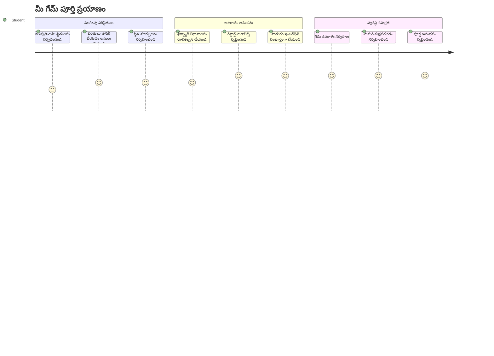
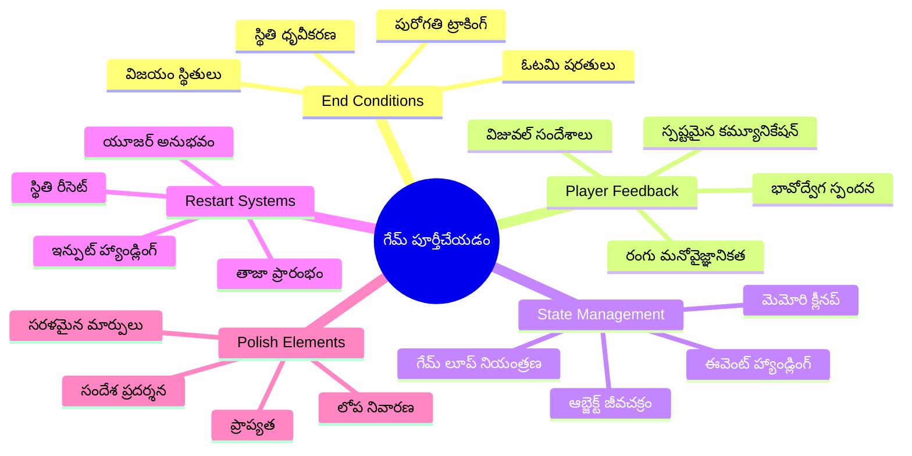
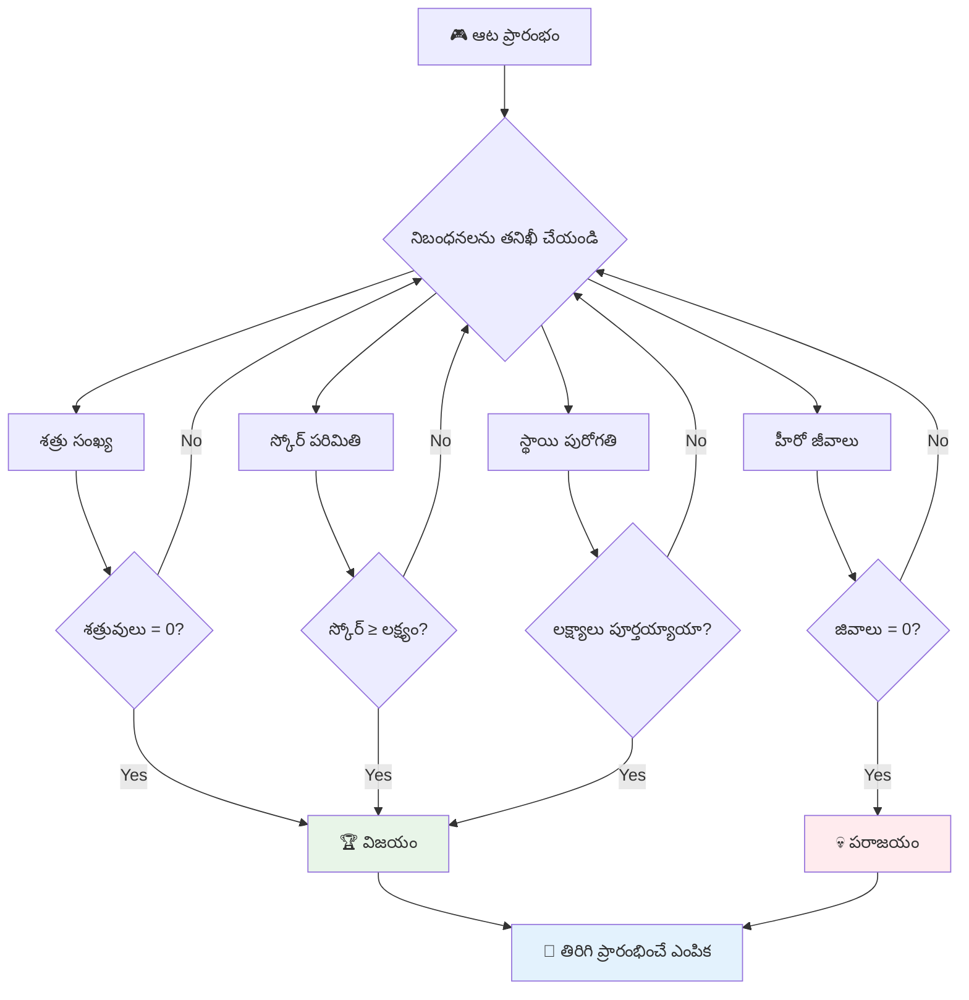
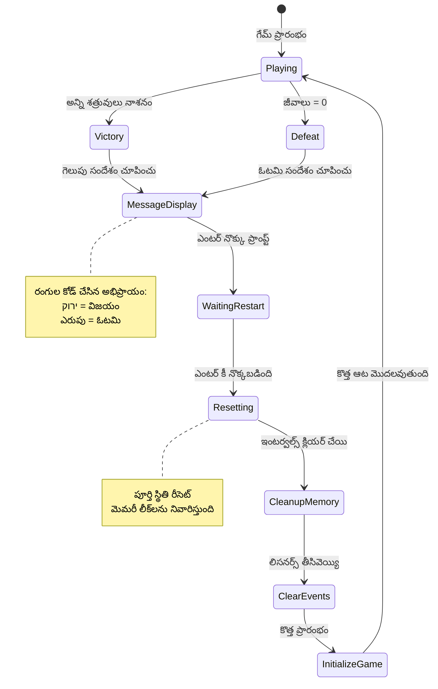
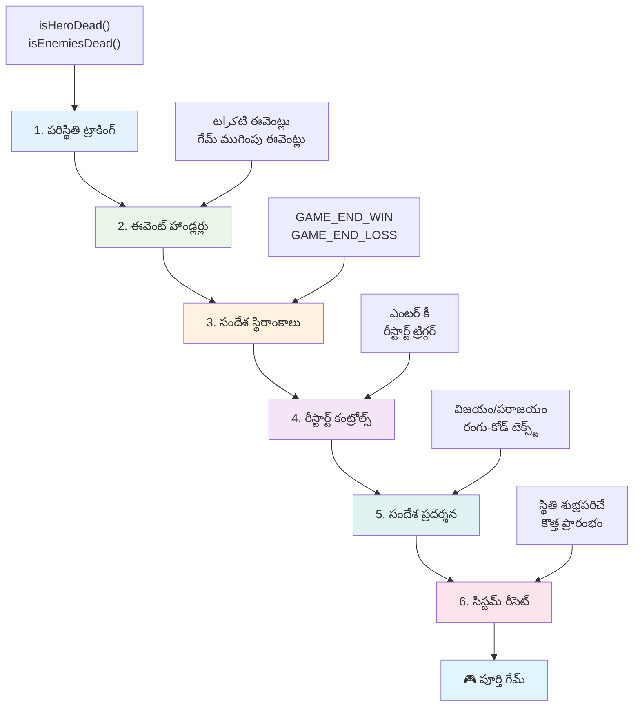
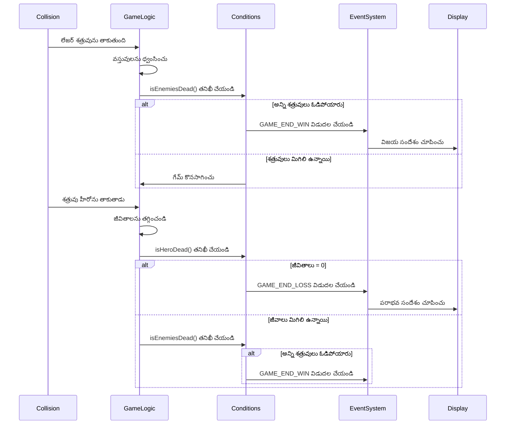
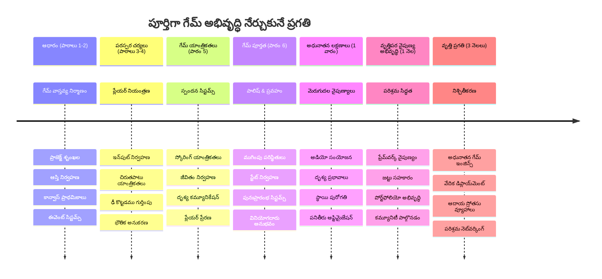

# స్పేస్ గేమ్ భాగం 6: ముగింపు మరియు రీస్టార్ట్


ప్రతి గొప్ప గేమ్‌కు సాఫీగా ముగింపు పరిస్థితులు మరియు సర్దుబాటు రీస్టార్ట్ వ్యవస్థ అవసరం. మీరు మూవ్మెంట్, యుద్ధం, మరియు స్కోరింగ్‌తో ఒక అద్భుతమైన స్పేస్ గేమ్‌ను నిర్మించారు - ఇప్పుడు దీన్ని పూర్తి అనిపించే తుది భాగాలను జోడించే సమయం వచ్చింది.

మీ గేమ్ ప్రస్తుతం సరిహద్దులు లేకుండా నడుస్తోంది, 1977లో NASA ప్రారంభించిన Voyager probes లాంటి వాటిలాగే - దశాబ్దాల తర్వాత కూడా స్పేస్‌లో ప్రయాణిస్తూనే ఉన్నాయి. ఇది స్పేస్ పరిశోధనకు సరైనది అయినా, గేమ్స్‌కు ఒక పరిమితి అవసరం ఉంటుంది గట్టి తృప్తిదాయక అనుభవం కోసం.

ఈ రోజు, మనం సరైన విజయం/పూడ్చుట పరిస్థితులు మరియు రీస్టార్ట్ వ్యవస్థను అమలు చేస్తాము. ఈ పాఠం చివరికి, మీరు ఒక పరిక్షితమైన గేమ్‌ను కలిగి ఉండాలి, ఇది ఆటగాళ్లు పూర్తి చేసి మళ్ళీ ఆడుకోవచ్చు, క్లాసిక్ ఆర్కేడ్ గేమ్‌లలా.


## పూర్వ పాఠ పరీక్ష

[పూర్వ పాఠ పరీక్ష](https://ff-quizzes.netlify.app/web/quiz/39)

## గేమ్ ముగింపు పరిస్థితుల అవగాహన

మీ గేమ్ ఎప్పుడు ముగియాలి? ఈ ప్రాథమిక ప్రశ్న ఆట డిజైన్‌ను ప్రారంభమైనప్పటి నుండే ప్రభావితం చేస్తోంది. పాక్-మాన్ గేమ్ లో భూతుల చేత పట్టుబడితే లేదా ఆన్ని డాట్స్ క్లియర్ అయితే ఆగిపోతుంది, స్పేస్ ఇన్వేడర్స్ గేమ్ లో వున్నీ విదేశీలు అడుగు తలనెత్తితే లేదా మీరు ఆన్ని ఎద్విలను నాశనం చేస్తే గేమ్ ముగుస్తుంది.

గేమ్ సృజనకర్తగా, మీరు విజయం మరియు పరాజయ పరిస్థితులను నిర్వచిస్తారు. మన స్పేస్ గేమ్ కోసం, ఇక్కడ ప్రామాణికమైన మరియు ఆకట్టుకునే ఆటను సృష్టించే పద్ధతులు ఉన్నాయి:


- **`N` శత్రు నౌకలు నాశనం అయ్యి ఉండాలి**: మీరు ఒక గేమ్‌ను వివిధ స్థాయిలుగా విభాజించి ఉంటే `N` శత్రు నౌకలను ధ్వంసం చేయడం సాధారణమే.
- **మీ నౌక నాశనం అయిందా**: కొన్ని గేమ్స్‌లో మీ నౌక ధ్వంసం అయితే మీరు గేమ్ ఓడిపోతారు. మరొక సాధారణ పద్ధతి జీవితాలు కలిగి ఉండటం. ప్రతి సారి మీ నౌక ధ్వంసమైనప్పుడు ఒక జీవితం తగ్గిపోతుంది. అన్ని జీవితాలు పోయిన తర్వాత మాత్రమే మీరు గేమ్ ఓడిపోతారు.
- **మీరు `N` పాయింట్లు సేకరించారు**: ఇంకొక సాధారణ ముగింపు పరిస్థితి పాయింట్లు సేకరించడం. పాయింట్లు చేయడానికి విధానాలు మీపై ఆధారపడి ఉంటాయి కానీ సాధారణంగా శత్రు నౌకను ధ్వంసం చేయడం లేదా శత్రు పదార్థాలు ధ్వంసం అయ్యే సమయంలో వస్తువులు ఒకటిని సేకరించడం వంటి కార్యకలాపాలకు పాయింట్లు ఇచ్చేరు.
- **ఒక స్థాయి పూర్తి చేయడం**: ఇది అనేక పరిస్థితులను కలిగి ఉండొచ్చు, ఉదాహరణకు `X` శత్రు నౌకల్ని నాశనం చేయడం, `Y` పాయింట్లను సేకరించడం లేదా కూల్చిన ఒక ప్రత్యేక వస్తువును సేకరించడం.

## గేమ్ రీస్టార్ట్ కార్యాచరణ అమలు

మంచి గేమ్స్ సాఫీగా రీస్టార్ట్ చేసే విధానాలతో మళ్లీ ఆడటానికి ప్రేరేపిస్తాయి. ఆటగాళ్లు గేమ్ పూర్తి చేసినప్పుడు లేదా ఓడిపోతే, వారు వెంటనే మరల ప్రయత్నించాలనుకునే అవకాశం ఎక్కువ - ఎక్కువ స్కోరు సాధించడానికి లేదా తమ పనితీరును మెరుగుపరచడానికి.


టెట్రిస్ దీన్ని అద్భుతంగా ఉదాహరించిందే: మీ బ్లాక్లు టాప్‌కు చేరినప్పుడు, మీరు కష్టమైన మెనూలను వీతరుస్కోవద్దు, వెంటనే కొత్త గేమ్ ప్రారంభించవచ్చు. మనం ఇలాంటిదే రీస్టార్ట్ వ్యవస్థను నిర్మించి గేమ్ స్థితిని నియంత్రించి ఆటగాళ్లను త్వరగా చర్యలోకి తీసుకుపోగలుగుతాం.

✅ **ఆలోచన**: మీరు ఆడిన గేమ్స్ గురించి ఆలోచించండి. అవి ఎప్పుడు ముగుస్తాయి, మీరు ఎలా రీస్టార్ట్ అవ్వడానికి ప్రేరేపించబడుతారు? సాఫీగా అనిపించే రీస్టార్ట్ అనుభవాన్ని ఏ సంగతులు చేస్తాయి?

## మీరు నిర్మించబోతున్నది

మీ ప్రాజెక్ట్‌ను పూర్తిగా అనుభవించే గేమ్‌గా మార్చే తుది ఫీచర్‌లను మీరు అమలు చేస్తారు. ఇవి మృదులైన గేమ్స్‌ను ప్రాథమిక నమూనాల నుండి వేరుచేస్తాయి.

**ఈక్రితం మీరు జత చేస్తున్నవి:**

1. **విజయ పరిస్థితి**: అన్ని శత్రువులను పేల్చి సరైన సంబరాలు జరపడం (మీకు హక్కుంది!)
2. **పరాజయ పరిస్థితి**: జీవితాలు అంతమవ్వడం, ఓడిపోయిన స్క్రీన్ ఎదుర్కొనడం
3. **రిస్టార్ట్ మెకానిజం**: ఎంటర్ నొక్కి వెంటనే తిరిగి ఆడటం - ఎందుకంటే ఒక గేమ్ మాత్రమే చాలదు
4. **స్థితి నిర్వహణ**: ప్రతిసారి శుభ్రంగా ప్రారంభం - ఎటువంటి మిగులు శత్రువులు లేదా గేమ్‌లోని గందరగోళాలు ఉండకుండా

## ప్రారంభించడం

మీ డెవలప్‌మెంట్ వాతావరణాన్ని సిద్ధం చేసుకోండి. మీరు గత పాఠాల నుండి గేమ్ ఫైల్స్ సన్నద్ధి చేసుకోవాలి.

**మీ ప్రాజెక్ట్ ఇలా ఉండాలి:**

```bash
-| assets
  -| enemyShip.png
  -| player.png
  -| laserRed.png
  -| life.png
-| index.html
-| app.js
-| package.json
```
  
**మీ డెవలప్‌మెంట్ సర్వర్ ప్రారంభించండి:**

```bash
cd your-work
npm start
```
  
**ఈ ఆజ్ఞ:**
- `http://localhost:5000` వద్ద లోకల్ సర్వర్ నడుపుతుంది
- మీ ఫైల్స్ సరిగ్గా సేవ్ చేస్తుంది
- మార్పులు చేసినప్పుడు ఆటోమేటిక్ రిఫ్రెష్ చేస్తుంది

మీ బ్రౌజర్‌లో `http://localhost:5000` తెరచి గేమ్ ఎరుగుతుందో లేదో చూసుకోండి. మీరు కదలగలగాలి, నిషేధించగలగాలి, మరియు శత్రువులతో వ్యవహరించగలగాలి. ధృవీకరించిన తర్వాతనే అమలు ప్రారంభిద్దాం.

> 💡 **ప్రో చిట్కా**: Visual Studio Code లో హెచ్చరికలు నివారించాలంటే, `window.onload` ఫంక్షన్ లో కాదు, ఫైల్ టాప్ వద్ద `let gameLoopId;` ను డిక్లేర్ చేయండి. ఇది ఆధునిక జావాస్క్రిప్ట్ యొక్క ఉత్తమ విద్య విధానాన్ని అనుసరించటం.


## అమలు దశలు

### దశ 1: ముగింపు పరిస్థితులను ట్రాక్ చేయడానికి ఫంక్షన్స్ రూపొందించడం

గేమ్ ఎప్పుడూ ముగియాలో పర్యవేక్షించడానికి ఫంక్షన్లు అవసరం. అంతర్జాతీయ స్పేస్ స్టేషన్ పై ఉన్న సెన్సార్లా ఇవి కీలక వ్యవస్థలను నిరంతరం పర్యవేక్షిస్తాయిలా, మన ఫంక్షన్స్ గేమ్ స్థితిని నిరంతరం తనిఖీ చేస్తాయి.

```javascript
function isHeroDead() {
  return hero.life <= 0;
}

function isEnemiesDead() {
  const enemies = gameObjects.filter((go) => go.type === "Enemy" && !go.dead);
  return enemies.length === 0;
}
```
  
**ఇది క్రింద ఎలా జరుగుతోంది:**
- **మీ హీరో జీవితాలు పోయాయా అని తనిఖీ చేస్తుంది (ఓ యచ్!)**
- **ఎన్ని శత్రువులు ఇంకా ఉన్నాయో లెక్కిస్తుంది**
- **యుద్ధ స్థలం శత్రువుల నుండి ఖాళీ అయ్యిందా అని సరి చూడటం**
- **సాధారణ true/false లాజిక్ ఉపయోగించడం**
- **అన్ని గేమ్ ఆబ్జెక్టుల్లో నుండి మిగిలినవాళ్లను ఎంచుకోవడం**

### దశ 2: ముగింపు పరిస్థితులకు ఈవెంట్ హ్యాండ్లర్లను అప్డేట్ చేయడం

ఇప్పుడు మనం ఈ పరిస్థితి తనిఖీలను గేమ్ ఈవెంట్ సిస్టంలోకి జత చేస్తాము. ప్రతి సారి ఢీకు సంభవించినప్పుడు, అది గేమ్ ముగింపు పరిస్థితిని తిలకిస్తుందో లేదో చాల వెంటనే తనిఖీ చేయబడుతుంది. ఇది గేమ్‌కు తక్షణ ఫీడ్‌బ్యాక్‌ను ఇస్తుంది.


```javascript
eventEmitter.on(Messages.COLLISION_ENEMY_LASER, (_, { first, second }) => {
    first.dead = true;
    second.dead = true;
    hero.incrementPoints();

    if (isEnemiesDead()) {
      eventEmitter.emit(Messages.GAME_END_WIN);
    }
});

eventEmitter.on(Messages.COLLISION_ENEMY_HERO, (_, { enemy }) => {
    enemy.dead = true;
    hero.decrementLife();
    if (isHeroDead())  {
      eventEmitter.emit(Messages.GAME_END_LOSS);
      return; // విజయం కంటే ముందు నష్టం
    }
    if (isEnemiesDead()) {
      eventEmitter.emit(Messages.GAME_END_WIN);
    }
});

eventEmitter.on(Messages.GAME_END_WIN, () => {
    endGame(true);
});
  
eventEmitter.on(Messages.GAME_END_LOSS, () => {
  endGame(false);
});
```
  
**ఇక్కడ జరుగుతుందేమిటి:**
- **లేజర్ శత్రువు హోలో**: ఇద్దరూ కనుమరుగవుతారు, మీరు పాయింట్లు పొందుతారు, మీరు గెలిచారా అని తనిఖీ అవుతుంది
- **శత్రువు మీతో ఢీకు పడ్డా**: మీరు ఒక జీవితం కోల్పోతారు, ఇంకా శ్వాసించబోతున్నారా అని తనిఖీ
- **స్మార్ట్ ఆర్డరింగ్**: ముందుగా ఓడిపోయిందా అని తనిఖీ (యారూ గెలిచింది మరియు పోయింది కదా అనుకోవడం మీకు ఇష్టం లేదు!)
- **తక్షణ స్పందనలు**: ఎటువంటి ముఖ్యమైనది జరిగితే గేమ్ తక్షణమే దీనిని తెలుసుకొంటుంది

### దశ 3: కొత్త సందేశ స్థిరాంకాలను జత చేయడం

మీ `Messages` స్థిరాంక మొబ్జెక్టులో కొత్త సందేశ రకాల్ని జత చేయాలి. ఇవి ఈవెంట్ సిస్టమ్‌లో సమరూపత కలిగి ఉండటం మరియు టైపోలను నివారించటానికి సహాయం చేస్తాయి.

```javascript
GAME_END_LOSS: "GAME_END_LOSS",
GAME_END_WIN: "GAME_END_WIN",
```
  
**పై వాటిలో:**
- **గేమ్ ముగింపు ఈవెంట్లకు స్థిరాంకాలు జత చేసినవి**
- **ఈవెంట్ ఉద్దేశాన్ని స్పష్టంగా తెలియజేసే వివరణాత్మక పేర్లు ఉన్నవి**
- **పూర్వపు పేర్లను అనుసరించినవి**

### దశ 4: రీస్టార్ట్ నియంత్రణలు అమలు చేయడం

ఇప్పుడు కీబోర్డు నియంత్రణలు జత చేస్తారు, ఆటగాళ్లకు గేమ్ రీస్టార్ట్ చేసే వీకల్నిచ్చేవి. ఎంటర్ కీ సహజమైన ఎంపిక, ఎందుకంటే సాధారణంగా ఇది ఆమోదం మరియు కొత్త గేమ్స్ ప్రారంభించాలని సూచిస్తుంది.

**మీ దాదాపు ఉన్న keydown ఈవెంట్ లిసనర్‌లో ఎంటర్ కీ గుర్తింపు జత చేయండి:**

```javascript
else if(evt.key === "Enter") {
   eventEmitter.emit(Messages.KEY_EVENT_ENTER);
}
```
  
**కొత్త సందేశ స్థిరాంకాన్ని జత చేయండి:**

```javascript
KEY_EVENT_ENTER: "KEY_EVENT_ENTER",
```
  
**మీరు తెలుసుకోవలసినవి:**
- **మీ ఇప్పటికే ఉన్న కీబోర్డ్ ఈవెంట్ హ్యాండ్లింగ్ సిస్టమ్‌ను విస్తరించటం**
- **ఎంటర్ కీని రీస్టార్ట్ ట్రిగ్గర్‌గా ఉపయోగించడం ఉపయోగదాయకం**
- **ఇతర గేమ్ భాగాలు వినేలా కাস্টమ్ ఈవెంట్‌ను విడుదల చేయడం**
- **మీ ఇతర కీ నియంత్రణలతో సమరూప చర్య**

### దశ 5: సందేశ ప్రదర్శన వ్యవస్థను సృష్టించడం

మీ గేమ్ ఫలితాలను స్పష్టంగా ఆటగాళ్లకు తెలియజేయాలి. మనం విజయం మరియు పరాజయ స్థితులను పరిగణించి రంగు-కోడ్ చేసిన టెక్స్ట్ తో ప్రదర్శించే సందేశ వ్యవస్థను తయారుచేస్తాము, పాత కంప్యూటర్ టర్మినల్ లా, ఆకుపచ్చ బాగుంటే, ఎరుపు దోషాలను సూచిస్తుంది.

**`displayMessage()` ఫంక్షన్ సృష్టించండి:**

```javascript
function displayMessage(message, color = "red") {
  ctx.font = "30px Arial";
  ctx.fillStyle = color;
  ctx.textAlign = "center";
  ctx.fillText(message, canvas.width / 2, canvas.height / 2);
}
```
  
**దశల వారీగా ఏమవుతోందంటే:**
- **ఫాంట్ పరిమాణం మరియు కుటుంబం సెట్ చేయడం స్పష్టంగా టెక్స్ట్ చదవడానికి**
- **రంగు పరామితి వర్తింపచేస్తుందీ, హెచ్చరికలకు డిఫాల్ట్ గా "ఎరుపు"**
- **టెక్స్ట్‌ను ఆధారంగా నిలువు మరియు తెర మధ్యలో సరిచేయడం**
- **ఆధునిక జావాస్క్రిప్ట్ డిఫాల్ట్ పరామితులు ఉపయోగించడం**
- **కాన్వాస్ 2D కాంటెక్స్ట్ ద్వారా నేరుగా టెక్స్ట్ వేయడం**

**`endGame()` ఫంక్షన్ సృష్టించండి:**

```javascript
function endGame(win) {
  clearInterval(gameLoopId);

  // ఎటువంటి పెండింగ్ రెండర్స్ పూర్తయ్యేందుకు ఆలస్యం సెట్ చేయండి
  setTimeout(() => {
    ctx.clearRect(0, 0, canvas.width, canvas.height);
    ctx.fillStyle = "black";
    ctx.fillRect(0, 0, canvas.width, canvas.height);
    if (win) {
      displayMessage(
        "Victory!!! Pew Pew... - Press [Enter] to start a new game Captain Pew Pew",
        "green"
      );
    } else {
      displayMessage(
        "You died !!! Press [Enter] to start a new game Captain Pew Pew"
      );
    }
  }, 200)  
}
```
  
**ఈ ఫంక్షన్ చేస్తుంది:**
- **అన్ని యాక్టివిటీలను నిలిపివేస్తుంది - నౌకలు మరియు లేజర్లు కదలవు**
- **చిన్న బ్రేక్ (200మిల్లీసెకన్లు) ఇస్తుంది చివరి ఫ్రేమ్ డ్రాయింగ్ పూర్తి చేసుకోవడానికి**
- **స్క్రీన్‌ను శుభ్రం చేసి నలుపు రంగు పెయింట్ చేస్తుంది గంభీరత కోసం**
- **విజేతలు మరియు ఓడిపోయినవారికి వేరు సందేశాలు చూపిస్తుంది**
- **రంగులను అనుసరిస్తుంది - బాగుండడానికి ఆకుపచ్చ, ఎరుపు మాత్రం... బాగుండదు**
- **ఆటగాళ్లకు తిరిగి ఎలా మొదలు పెట్టాలో చెప్పడం**

### 🔄 **బోధనా తనిఖీ**  
**గేమ్ స్థితి నిర్వహణ**: రీసెట్ వ్యవస్థను అమలుపరచేముందు మీకు ఈ విషయాలు అర్థమైందా చూడండి:  
- ✅ ముగింపు పరిస్థితులు కसा గేమ్ లక్ష్యాలు స్పష్టంచేస్తాయి  
- ✅ ఆటగాడు బాగ భావించేందుకు విజువల్ ఫీడ్బ్యాక్ అవసరం  
- ✅ సరైన క్లీనప్ మేమొరీ లీక్ నివారిస్తుంది  
- ✅ ఈవెంట్-ఆధారిత వాస్తవానికి శుభ్రమైన స్థితి మార్పులకు సహాయం

**తక్షణ స్వీయ పరీక్ష**: రీసెట్ సమయంలో ఈవెంట్ లిసనర్లను క్లియర్ చేయకపోతే ఏమవుతుంది?  
*సమాధానం: మెమొరీ లీకులు, ఈవెంట్ హ్యాండ్లర్లు డూప్లికేట్ కావడం వలన అనిశ్చిత ప్రవర్తన*

**గేమ్ డిజైన్ సూత్రాలు**: మీరు ఇప్పుడు అమలు చేస్తున్నారు:  
- **స్పష్ట లక్ష్యాలు**: ఆటగాళ్లు విజయం మరియు విఫలతను స్పష్టంగా తెలుసుకుంటారు  
- **తక్షణ ఫీడ్బ్యాక్**: గేమ్ పరిస్థితులు తక్షణమే తెలియజేస్తాయి  
- **వినియోగదారు నియంత్రణ**: ఆటగాళ్లు సిద్దంగా ఉన్న సందర్భంలో రీస్టార్ట్ చేయవచ్చు  
- **వ్యవస్థ నమ్మకత**: సరైన క్లీనప్ ద్వారా లోపాలు లేని అనుభవం

### దశ 6: గేమ్ రీసెట్ కార్యాచరణ అమలు

రిసెట్ వ్యవస్థ ప్రస్తుతం గేమ్ స్థితిని పూర్తిగా శుభ్రం చేసి, కొత్త గేమ్ సెషన్‌ను ప్రారంభించాలి. ఇది మునుపటి గేమ్ డేటా మిగిలి ఉండకుండా ఒక శుభ్రమైన ప్రారంభాన్ని కలిగిస్తుంది.

**`resetGame()` ఫంక్షన్ సృష్టించండి:**

```javascript
function resetGame() {
  if (gameLoopId) {
    clearInterval(gameLoopId);
    eventEmitter.clear();
    initGame();
    gameLoopId = setInterval(() => {
      ctx.clearRect(0, 0, canvas.width, canvas.height);
      ctx.fillStyle = "black";
      ctx.fillRect(0, 0, canvas.width, canvas.height);
      drawPoints();
      drawLife();
      updateGameObjects();
      drawGameObjects(ctx);
    }, 100);
  }
}
```
  
**ప్రతి భాగాన్ని అర్థం చేసుకోండి:**  
- **గేమ్ లూప్ ప్రస్తుతం నడుస్తోందా చూసుకుంటుంది, అవసరమైతే మాత్రమే రీసెట్ చేస్తుంది**  
- **ప్రస్తుతం ఉన్న గేమ్ లూప్ ను నిలిపివేస్తుంది**  
- **అన్నీ ఈవెంట్ లిసనర్లను తొలగిస్తుంది, మేమొరీ లీకులు నివారించేందుకు**  
- **శుభ్రమైన కొత్త గేమ్ ఆబ్జెక్టులు, వేరియబుల్తో గేమ్ స్థితిని పునఃప్రారంభిస్తుంది**  
- **అన్నీ అవసరమైన గేమ్ ఫంక్షన్లతో కొత్త గేమ్ లూప్ ప్రారంభిస్తుంది**  
- **100ms అంతరంతో సమానంగా గేమ్ ప్రదర్శన కంటిన్యూ**

**మీ `initGame()` ఫంక్షన్‌లో ఎంటర్ కీ ఈవెంట్ హ్యాండ్లర్ జత చేయండి:**

```javascript
eventEmitter.on(Messages.KEY_EVENT_ENTER, () => {
  resetGame();
});
```
  
**మీ EventEmitter క్లాసులో `clear()` మెథడ్ జత చేయండి:**

```javascript
clear() {
  this.listeners = {};
}
```
  
**గుర్తుంచుకోాల్సిన ముఖ్యాంశాలు:**  
- **ఎంటర్ కీ నొక్కడం ద్వారా గేమ్ రీసెట్ ఫంక్షన్ కలుపుతుంది**  
- **గేమ్ ప్రారంభ సమయంలో ఈ ఈవెంట్ లిసనర్ నమోదు అవుతుంది**  
- **రిసెట్ సమయంలో అన్ని ఈవెంట్ లిసనర్లను తొలగించేందుకు పద్దతిని అందిస్తుంది**  
- **మెమొరీ లీక్‌లను నివారిస్తుంది**  
- **లిసనర్ల ఆబ్జెక్టును ఖాళీ చేసి కొత్త స్థితికి సిద్ధం చేస్తుంది**

## అభినందనలు! 🎉

👽 💥 🚀 మీరు మొదట నుండీ పూర్తి గేమ్‌ను విజయవంతంగా నిర్మించారు. 1970లలో మొదటి వీడియో గేమ్స్ నిర్మించిన ప్రోగ్రామర్ల లాగా, మీరు కోడ్ లైన్లను ఒక ఇంటరాక్టివ్ అనుభవంగా మార్చారు, సరైన గేమ్ యాంత్రికతలు మరియు వినియోగదారు ఫీడ్బ్యాక్‌తో. 🚀 💥 👽

**మీరు ఏమి సాధించారంటే:**  
- **పూర్తి విజయం మరియు పరాజయ పరిస్థితులను వినియోగదారు ఫీడ్బ్యాక్‌తో అమలు చేశారు**  
- **అనుసంధాన రీస్టార్ట్ వ్యవస్థను సృష్టించారు నిరంతర ఆట కోసం**  
- **గేమ్ స్థితులను స్పష్టంగా తెలియజేసే విజువల్ కమ్యూనికేషన్ డిజైన్ చేయించారు**  
- **స复杂 గేమ్ స్థితి మార్పుల నిర్వహణ మరియు శుభ్రపరిచే విధానాన్ని నిర్వహించారు**  
- **అన్ని భాగాలను సమగ్రంగా కలిపి ఆడగలిగే గేమ్‌గా తయారు చేశారు**

### 🔄 **బోధనా తనిఖీ**  
**పూర్తి గేమ్ అభివృద్ధి వ్యవస్థ**: మీ గేమ్ అభివృద్ధి ప్రయాణాన్ని జరుపుకోండి:  
- ✅ ముగింపు పరిస్థితులు ఆటగాడికి సంతృప్తికర అనుభవాన్ని ఎలా ఇస్తాయి?  
- ✅ అందమైన స్థితి నిర్వహణ గేమ్ స్థిరత్వానికి ఎందుకు ముఖ్యం?  
- ✅ విజువల్ ఫీడ్బ్యాక్ ఆటగాడి అర్థమెందుకు పెరుగుతుంది?  
- ✅ ఆటగాడి నిలుపు కోసం రీస్టార్ట్ వ్యవస్థ పాత్ర ఏమిటి?

**వ్యవస్థ నైపుణ్యం**: మీ పూర్తి గేమ్ చూపిస్తోంది:  
- **ఫుల్-స్టాక్ గేమ్ అభివృద్ధి**: గ్రాఫిక్స్, ఇన్పుట్, స్థితి నిర్వహణ  
- **ప్రొఫెషనల్ ఆర్కిటెక్చర్**: ఈవెంట్-ఆధారిత వ్యవస్థలు సరైన క్లీనప్‌తో  
- **వినియోగదారు అనుభవ డిజైన్**: స్పష్టమైన ఫీడ్‌బ్యాక్, సులభ నియంత్రణలు  
- **పనితనపు ఆప్టిమైజేషన్**: సమర్థవంతమైన రెండరింగ్, మెమొరీ నిర్వహణ  
- **మృదులత మరియు సంపూర్ణత**: గేమ్ పూర్తి అనిపించే అన్ని వివరాలు

**ఉద్యోగానికి సిద్ధమైన నైపుణ్యాలు**: మీరు అమలు చేసినవి:  
- **గేమ్ లూప్ ఆర్కిటెక్చర్**: సమయానికి అనుగుణంగా పనితనం  
- **ఈవెంట్-ఆధారిత ప్రోగ్రామింగ్**: విడివిడిగా వ్యవస్థలు, ఎఫెక్టివ్ స్కేలింగ్  
- **స్థితి నిర్వహణ**: సంక్లిష్ట డేటా మరియు జీవితచక్ర నిర్వహణ  
- **వినియోగదారు ఇంటర్‌ఫేస్ డిజైన్**: స్పష్టమైన కమ్యూనికేషన్, స్పందించే నియంత్రణలు  
- **పరీక్ష మరియు డీబగ్గింగ్**: పునరావృత అభివృద్ధి, సమస్యల పరిష్కారం

### ⚡ **తదుపరి 5 నిమిషాల్లో మీరు చేయగలిగేది**  
- [ ] మీ పూర్తి గేమ్ ఆడండి మరియు అన్ని విజయం, పరాజయ పరిస్థితులను పరీక్షించండి  
- [ ] వివిధ ముగింపు పరిస్థితి పరా‹మీ»‌‌టర్లతో ప్రయోగించండి  
- [ ] గేమ్ స్థితి మార్పులను ట్రాక్ చేయడానికి console.log మెసేజ్‌లను జత చేయండి  
- [ ] మీ గేమ్‌ను స్నేహితులతో పంచుకోండి మరియు అభిప్రాయాలను సేకరించండి

### 🎯 **ఈ గంటలో మీరు సాధించగలిగేది**  
- [ ] పాఠం తర్వాత ప్రశ్నాపత్రాన్ని పూర్తి చేసి మీ గేమ్ అభివృద్ధి ప్రయాణం పై ఆలోచించండి  
- [ ] విజయం మరియు పరాజయ పాయింట్లకు ఆడియో ఉపయోగాలు జత చేయండి  
- [ ] అదనపు ముగింపు పరిస్థితులు - కాల పరిమితులు లేదా బోనస్ లక్ష్యాలు అమలు చేయండి  
- [ ] వేర్వేరు కష్టస్థాయిలు సృష్టించండి, శత్రువుల సంఖ్య మార్లేండి  
- [ ] మెరుగైన ఫాంట్లు మరియు రంగులతో విజువల్ ప్రదర్శన నేర్పండి

### 📅 **మీ వారం పాటు గేమ్ అభివృద్ధి నైపుణ్యం**  
- [ ] అనేక స్థాయిలు మరియు పురోగతితో మెరుగైన స్పేస్ గేమ్ పూర్తి చేయండి  
- [ ] పవర్-అప్స్, విభిన్న శత్రు రకాలు, ప్రత్యేక ఆయుధాల వంటి అధునాతన ఫీచర్లను జత చేయండి  
- [ ] స్టోరేజ్ ఉండే హై స్కోర్ సిస్టమ్‌ను సృష్టించండి  
- [ ] మెనూలు, సెట్టింగ్స్, గేమ్ ఎంపికలకు యూజర్ ఇంటర్‌ఫేస్ డిజైన్ చేయండి  
- [ ] వివిధ పరికరాలు, బ్రౌజర్ల కోసం పనితనాన్ని మెరుగుపర్చండి  
- [ ] మీ గేమ్‌ను ఆన్‌లైన్‌లో విడుదల చేసి కమ్యూనిటీలతో పంచుకోండి
### 🌟 **మీ నెల పొడవాటి గేమ్ డెవలప్మెంట్ కెరీర్**
- [ ] విభిన్న శైలులు మరియు యాంత్రికతలను అన్వేషిస్తూ అనేక పూర్తి గేమ్స్ నిర్మించండి
- [ ] Phaser లేదా Three.js వంటి అధునాతన గేమ్ అభివృద్ధి ఫ్రేమ్‌వర్క్‌లను నేర్చుకోండి
- [ ] ఓపెన్ సోర్స్ గేమ్ డెవలప్మెంట్ ప్రాజెక్టులలో భాగస్వామ్యం చేయండి
- [ ] గేమ్ డిజైన్ సూత్రాలు మరియు ప్లేయర్ మానసిక శాస్త్రాన్ని అధ్యయనం చేయండి
- [ ] మీ గేమ్ అభివృద్ధి నైపుణ్యాలను ప్రదర్శించే పోర్టుఫోలియోని సృష్టించండి
- [ ] గేమ్ డెవలప్మెంట్ కమ్యూనిటీతో జోడుకుని సవివరంగా నేర్చుకోండి

## 🎯 మీ పూర్తి గేమ్ డెవలప్మెంట్ నైపుణ్యాల టైమ్‌లైన్


### 🛠️ మీ పూర్తి గేమ్ డెవలప్మెంట్ టూల్‌కిట్ సారాంశం

సంభంధిత అన్ని స్పేస్ గేమ్ సిరీస్ పూర్తి చేసిన తర్వాత, మీరు ఇప్పుడు ఈ విషయాలలో నైపుణ్యం పొందారు:
- **గేమ్ ఆర్కిటెక్చర్**: ఈవెంట్-డ్రివెన్ సిస్టమ్స్, గేమ్ లూప్స్, మరియు స్టేట్ మేనేజ్‌మెంట్
- **గ్రాఫిక్స్ ప్రోగ్రామింగ్**: కాన్వాస్ API, స్ప్రైట్ రెండరింగ్, మరియు దృశ్య ప్రభావాలు
- **ఇన్‌పుట్ సిస్టమ్స్**: కీబోర్డ్ హాండ్లింగ్, కోలిజన్ డిటెక్షన్, మరియు రెస్పాన్సివ్ కంట్రోల్‌లు
- **గేమ్ డిజైన్**: ప్లేయర్ ఫీడ్బ్యాక్, ప్రోగ్రెషన్ సిస్టమ్స్, మరియు ఎంగేజ్‌మెంట్ యాంత్రికతలు
- **పర్ఫార్మెన్స్ ఆప్టిమైజేషన్**: సమర్థవంతమైన రెండరింగ్, మెమరీ నిర్వహణ, మరియు ఫ్రేమ్ రేట్ కంట్రోల్
- **యూజర్ అనుభవం**: స్పష్టమైన కమూనికేషన్, సులభమైన కంట్రోల్‌లు, మరియు శ్రద్ధతో కూడిన వివరాలు
- **ప్రొఫెషనల్ ప్యాటర్న్స్**: క్లీన్ కోడ్, డీబగ్గింగ్ సాంకేతికతలు, మరియు ప్రాజెక్ట్ ఆర్గనైజేషన్

**ప్రాక్టికల్ వరల్డ్ అప్లికేషన్స్**: మీ గేమ్ అభివృద్ధి నైపుణ్యాలు నేరుగా వర్తిస్తాయి:
- **ఇంటరాక్టివ్ వెబ్ అప్లికేషన్స్**: డైనమిక్ ఇంటర్‌ఫేస్‌లు మరియు రియల్-టైమ్ సిస్టమ్స్
- **డేటా విజువలైజేషన్**: అనిమేటెడ్ చార్ట్స్ మరియు ఇంటరాక్టివ్ గ్రాఫిక్స్
- **ఎడ్యుకేషనల్ టెక్నాలజీ**: గేమిఫికేషన్ మరియు ఆకర్షకమైన విద్యా అనుభవాలు
- **మొబైల్ డెవలప్మెంట్**: టచ్ ఆధారిత ఇంటరాక్షన్స్ మరియు పనితీరు మెరుగుదల
- **సిమ్యూలేషన్ సాఫ్ట్‌వేర్**: ఫిజిక్స్ ఇంజిన్‌లు మరియు రియల్-టైమ్ మోడలింగ్
- **సృజనాత్మక పరిశ్రమల**: ఇంటరాక్టివ్ ఆర్ట్, వినోదం, మరియు డిజిటల్ అనుభవాలు

**ప్రొఫెషనల్ స్కిల్స్ సొంతం చేసుకున్నారు**: మీరు ఇప్పుడు చేయగలరు:
- **ఆర్కిటెక్ట్** సవాలుల interactive systems from scratch
- **డీబగ్గ్** సిస్టమెటిక్ పద్ధతుల ద్వారా రియల్-టైమ్ అప్లికేషన్స్
- **ఆప్టిమైజ్** పనితీరు మెరుగుదల కోసం
- **డిజైన్** ఆకర్షణీయమైన యూజర్ ఇంటర్‌ఫేస్‌లు మరియు ఇంటరాక్షన్ ప్యాటర్న్స్
- **కలాబొరేట్** సాంకేతిక ప్రాజెక్టులపై సమర్థవంతంగా మరియు సరైన కోడ్ ఆర్గనైజేషన్‌తో

**గేమ్ డెవలప్మెంట్ సూత్రాలు నైపుణ్యం**:
- **రియల్-టైమ్ సిస్టమ్స్**: గేమ్ లూప్స్, ఫ్రేమ్ రేట్ మేనేజ్‌మెంట్, మరియు పనితీరు
- **ఈవెంట్-డ్రివెన్ ఆర్కిటెక్చర్**: డికపుల్ సిస్టమ్స్ మరియు మెసేజ్ పాసింగ్
- **స్టేట్ మేనేజ్‌మెంట్**: క్లిష్టమైన డేటా హ్యాండ్లింగ్ మరియు లైఫ్‌సైకిల్ నిర్వహణ
- **యూజర్ ఇంటర్‌ఫేస్ ప్రోగ్రామింగ్**: కాన్వాస్ గ్రాఫిక్స్ మరియు రెస్పాన్సివ్ డిజైన్
- **గేమ్ డిజైన్ సిద్ధాంతం**: ప్లేయర్ మానసిక శాస్త్రం మరియు ఎంగేజ్‌మెంట్ యాంత్రికతలు

**తరువాయి స్థాయి**: మీరు ఇప్పుడు అధునాతన గేమ్ ఫ్రేమ్‌వర్క్‌లు, 3D గ్రాఫిక్స్, మల్టిప్లేయర్ సిస్టమ్స్ అన్వేషించేందుకు లేదా ప్రొఫెషనల్ గేమ్ డెవలప్మెంట్ పాత్రల్లోకి మారేందుకు సిద్ధంగా ఉన్నారు!

🌟 **అధిగమించబడింది**: మీరు ఒక పూర్తి గేమ్ డెవలప్మెంట్ ప్రయాణం పూర్తి చేసి, ప్రారంభం నుండి ప్రొఫెషనల్-నాణ్యత ఇంటరాక్టివ్ అనుభవాన్ని నిర్మించారు!

**గేమ్ డెవలప్మెంట్ కమ్యూనిటీకి స్వాగతం!** 🎮✨

## GitHub Copilot ఏజెంట్ ఛాలెంజ్ 🚀

ఈ క్రింది ఛాలెంజ్‌ను పూర్తిచేయడానికి ఏజెంట్ మోడ్ ఉపయోగించండి:

**వివరణ:** స్థాయి ప్రగతిని కలిగించే సిస్టమ్‌తో స్పేస్ గేమ్‌ను మెరుగుపరచండి, ఇబ్బంది పెరుగుతూ, బోనస్ ఫీచర్లతో కూడినది.

**ప్రాంప్ట్:** ప్రతి స్థాయిలో ఎక్కువ శత్రు కష్టపడి, వేగం మరియు ఆరోగ్యం పెరిగిన శత్రు నౌకలు ఉన్న బహుళ-స్థాయి స్పేస్ గేమ్ సిస్టమ్ సృష్టించండి. స్థాయి పెరిగే కొద్దీ స్కోరింగ్ మల్టిప్లయిర్ పెరుగుతుంది, మరియు శత్రుం నాశనం అయ్యేటప్పుడు యాదృచ్ఛికంగా కనిపించే పవర్-అప్స్ (ఉదా: రాపిడ్ ఫైర్ లేదా షీల్డ్)ను అమలు చేయండి. ఒక స్థాయి పూర్తి బోనస్ చేర్చండి మరియు స్కోరు, జీవితాలతో పాటు ప్రస్తుత స్థాయిని స్క్రీన్‌పై ప్రదర్శించండి.

మరింత తెలుసుకోండి [agent mode](https://code.visualstudio.com/blogs/2025/02/24/introducing-copilot-agent-mode) ఇక్కడ.

## 🚀 ఎంపిక సంస్కరణ ఛాలెంజ్

**మీ గేమ్‌కు ఆడియో జోడించండి**: సౌండ్ ఎఫెక్ట్స్ అమలు చేయడం ద్వారా మీ గేమ్ అనుభవాన్ని మెరుగుపరిచండి! ఆడియో జోడించడానికి ఆలోచించండి:

- **లేజర్ షాట్స్** గేమర్ అగ్ని వెళ్ళించినప్పుడు
- **శత్రు ధ్వంసం** నౌకలు కొట్టబడినప్పుడు
- **హీరో నష్టం** ప్లేయర్ హిట్ అయినప్పుడు
- **విజయ సంగీతం** గేమ్ గెలిచినప్పుడు
- **తొలగింపు ధ్వని** గేమ్ తిసిపోతే

**ఆడియో అమలుకరణ ఉదాహరణ:**

```javascript
// ఆడియో ఆబ్జెక్ట్స్ తయారుచేయండి
const laserSound = new Audio('assets/laser.wav');
const explosionSound = new Audio('assets/explosion.wav');

// ఆట సంఘటనల సమయంలో శబ్దాలు ప్లే చేయండి
function playLaserSound() {
  laserSound.currentTime = 0; // ప్రారంభానికి రీసెట్ చేయండి
  laserSound.play();
}
```

**మీకు తెలుసుకోగల అవసరం:**
- **Audio ఆబ్జెక్ట్స్ సృష్టిస్తుంది** వేరు వేరు సౌండ్ ఎఫెక్ట్స్ కోసం
- **`currentTime` రీసెట్ చేయడం** తక్షణ సౌండ్ ప్లే కోసం
- **బ్రౌజర్ ఆటోప్లే విధానాలు నిర్వహించడం** వినియోగదారు పరస్పర చర్యల ద్వారా
- **ఆడియో వాల్యూమ్ మరియు టైమింగ్ నిర్వహణ** మెరుగైన గేమ్ అనుభవం కోసం

> 💡 **నియంత్రణ వనరు**: ఈ [audio sandbox](https://www.w3schools.com/jsref/tryit.asp?filename=tryjsref_audio_play) ను అన్వేషించి జావాస్క్రిప్ట్ గేమ్స్‌లో ఆడియో అమలు గురించి మరింత తెలుసుకోండి.

## పోస్ట్-లెక్చర్ క్విజ్

[Post-lecture quiz](https://ff-quizzes.netlify.app/web/quiz/40)

## సమీక్ష & స్వీయ అధ్యయనం

మీ అసైన్‌మెంట్ ఒక తాజా నమూనా గేమ్ సృష్టించడం, కాబట్టి అక్కడి కొన్ని ఆసక్తికర గేమ్స్ అన్వేషించి మీరు ఏ రకమైన గేమ్ తయారు చేయగలరో చూడండి.

## అసైన్‌మెంట్

[Build a Sample Game](assignment.md)

---

<!-- CO-OP TRANSLATOR DISCLAIMER START -->
**నిర్లక్ష్యం**:  
ఈ పత్రాన్ని AI అనువాద సేవ [Co-op Translator](https://github.com/Azure/co-op-translator) ఉపయోగించి అనువదించబడింది. మేము సరిగ్గా ఉండేందుకు ప్రయత్నించినప్పటికీ, స్వయంచాలక అనువాదాలలో తప్పులు లేదా అశాల్యతలు ఉండవచ్చు. మూల పత్రం దాని స్థానిక భాషలో అధికారిక మూలంగా పరిగణించబడాలి. ముఖ్య సమాచారం కోసం, నిపుణుల చేతిచేయబడిన అనువాదం సిఫార్సు చేయబడుతుంది. ఈ అనువాదం వలన కలిగే ఏదైనా అపార్థాలు లేదా తప్పుదిద్దుల కోసం మేము బాధ్యులు కావము.
<!-- CO-OP TRANSLATOR DISCLAIMER END -->