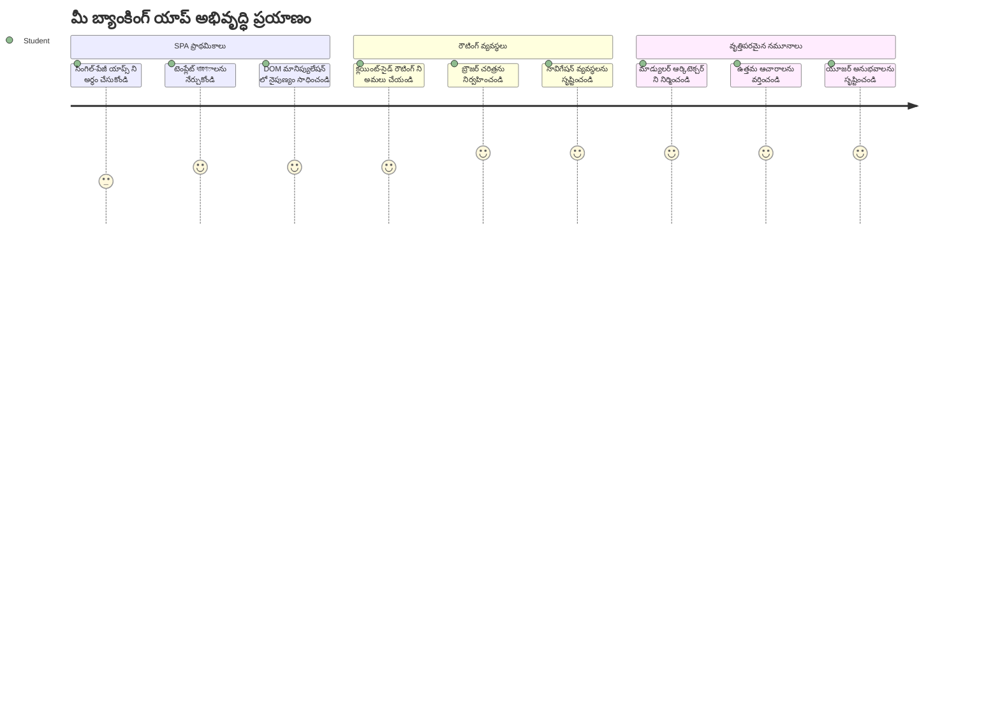
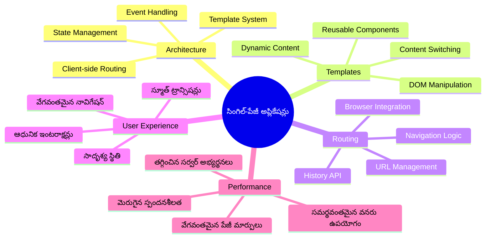
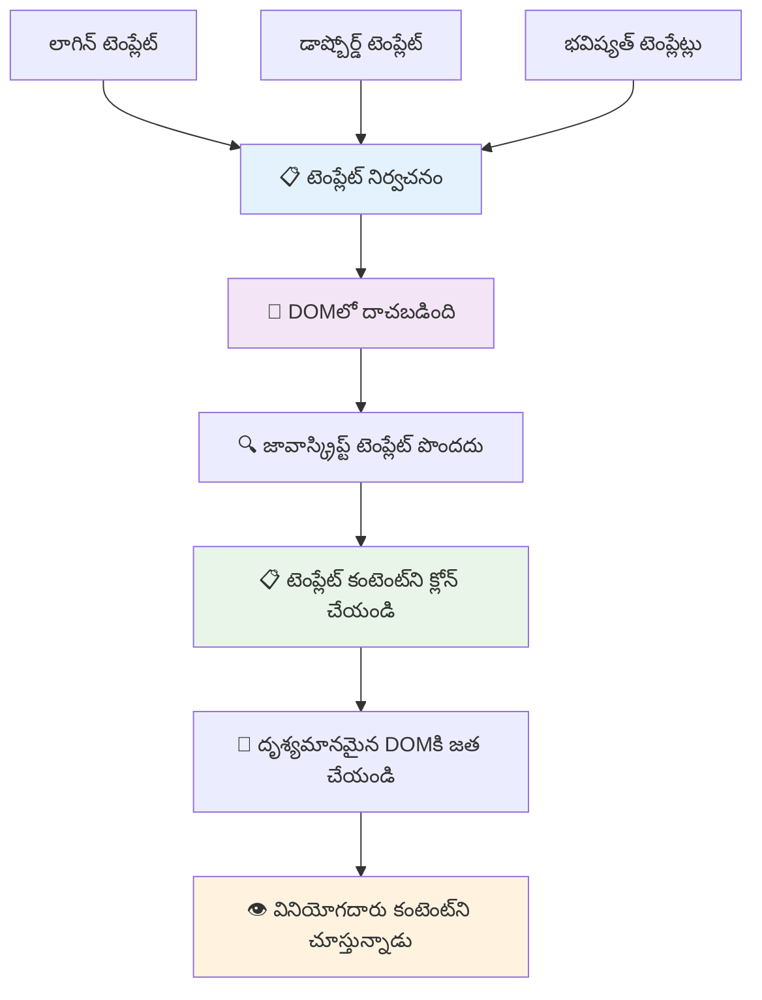
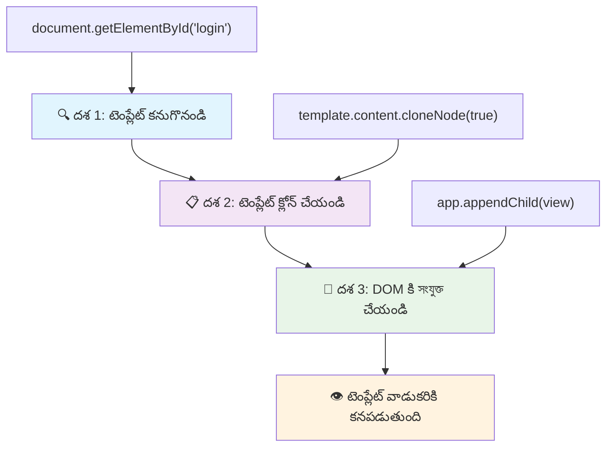
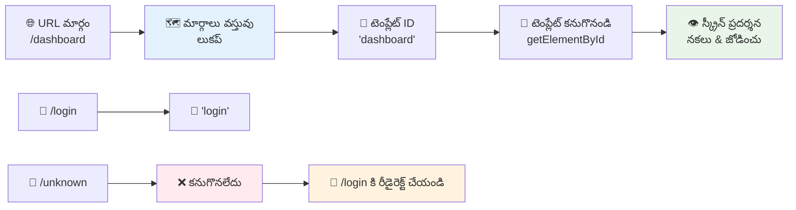
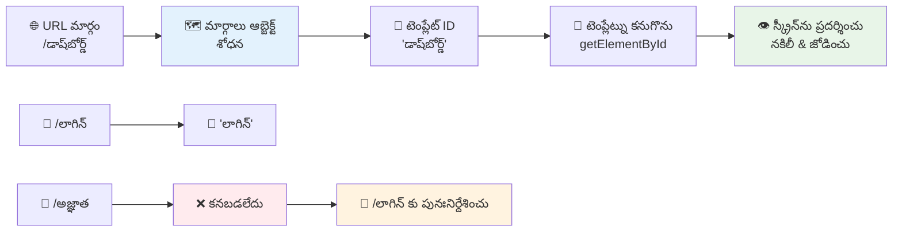
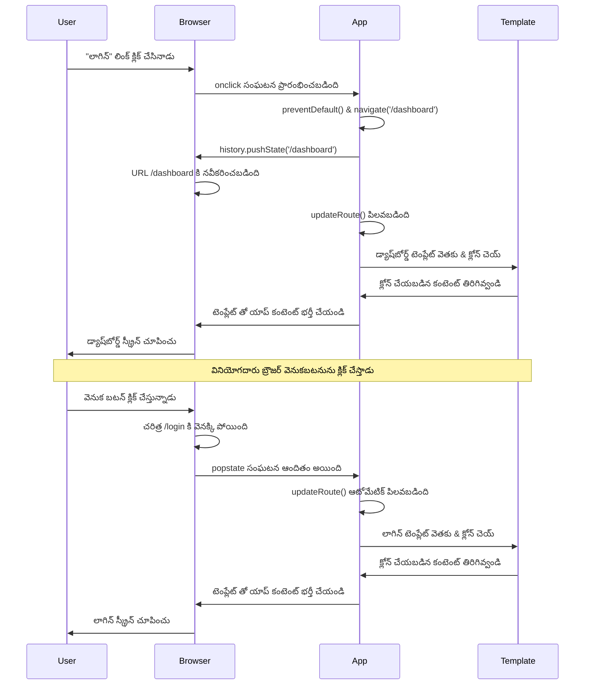
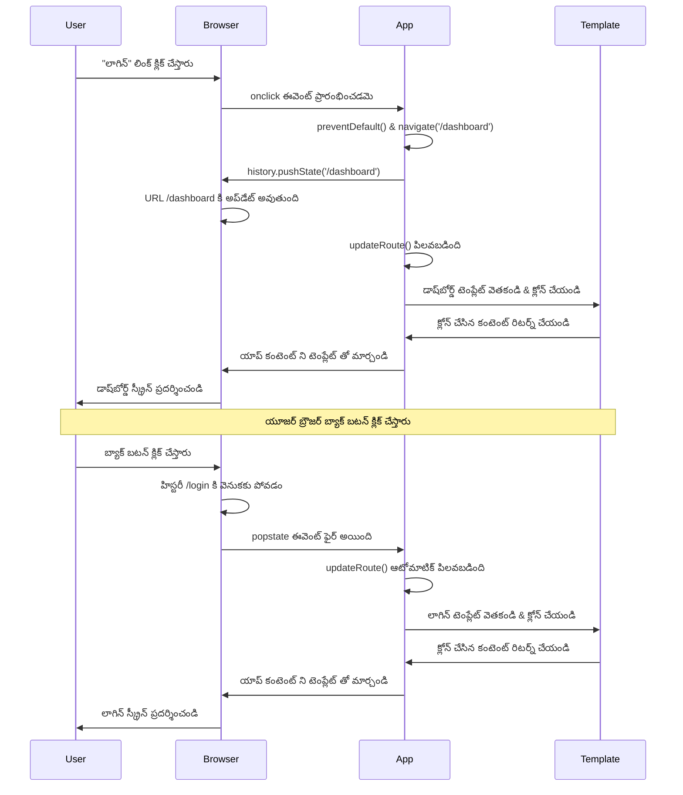
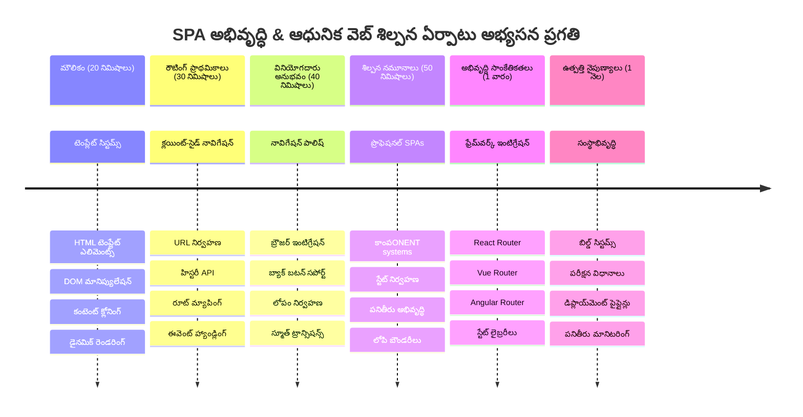

<!--
CO_OP_TRANSLATOR_METADATA:
{
  "original_hash": "351678bece18f07d9daa987a881fb062",
  "translation_date": "2026-01-08T16:42:24+00:00",
  "source_file": "7-bank-project/1-template-route/README.md",
  "language_code": "te"
}
-->
# బ్యాంకింగ్ యాప్‌ భాగం 1: వెబ్ యాప్‌లో HTML టెంప్లేట్లు మరియు రూట్లు


1969లో అపోలో 11 యొక్క గైడెన్స్ కంప్యూటర్ చంద్రుడి వైపు నావిగేట్ అయినప్పుడు, అది మొత్తం సిస్టమ్‌ను రీస్టార్ట్ చేయకుండా వివిధ ప్రోగ్రామ్‌ల మధ్య మార్పులు చేయాల్సి వచ్చింది. ఆధునిక వెబ్ అప్లికేషన్లు కూడా సమానంగా పనిచేస్తాయి – అవి మీరు చూసే విషయాన్ని పూర్తిగా రీలోడ్ చేయకుండా మార్చుతాయి. ఇది నేడు వినియోగదారులు ఆశించే సున్నితమైన, స్పందనक्षम అనుభవాన్ని సృష్టిస్తుంది.

ప్రస్తుత కాలపు వెబ్ యాప్‌లు ప్రతి ఇంటరాక్షన్‌కు పూర్తయిన పేజీలను రీలోడ్ చేయకుండా, మార్పు అవసరమైన భాగాలనే నవీకరిస్తాయి. ఇది మిషన్ కంట్రోల్ వివిధ డిస్ప్లేలను మారుస్తూ నిరంతర సంభాషణను కొనసాగించే విధానంలా, ఆ సున్నితమైన అనుభవాన్ని సృష్టిస్తుంది.

క్రింద ఉన్నది విపరీతమైన తేడాను సృష్టించే అంశాలు:

| సాంప్రదాయ బహుపేజీ యాప్‌లు | ఆధునిక ఏకపేజీ యాప్‌లు |
|----------------------------|-------------------------|
| **నావిగేషన్** | ప్రతి స్క్రీన్ కోసం పూర్తి పేజీ రీలోడ్ | తక్షణ కంటెంట్ మార్పు |
| **ప్రదర్శన** | పూర్తి HTML డౌన్‌లోడ్స్ కారణంగా మందగింపు | భాగస్వామ్య నవీకరణలతో వేగవంతం |
| **వినియోగదారు అనుభవం** | అనూహ్యంగా పేజీ చిమ్ములు | సున్నితమైన, యాప్‌లా మార్పులు |
| **డేటా భాగస్వామ్యం** | పేజీల మధ్య కఠినమైనది | సులభమైన స్థితి నిర్వహణ |
| **వికాసం** | బహుళ HTML ఫైళ్ళు నిర్వహణకు | డైనమిక్ టెంప్లేట్లతో ఏక HTML |

**వికాసాన్ని అర్థం చేసుకోండి:**
- **సాంప్రదాయ యాప్‌లు** ప్రతి నావిగేషన్ చర్యకు సర్వర్ అభ్యర్థనలు అవసరం
- **ఆధునిక SPAలు** ఒకసారి లోడ్ చేసి, జావాస్క్రిప్ట్ ఉపయోగించి డైనమిక్ కంటెంట్ నవీకరణ
- **వినియోగదారుల ఆశలలో** తక్షణ, సజల ఇంటరాక్షన్లు ప్రాధాన్యం
- **ప్రదర్శన లాభాలు** సమస్తమైన బ్యాండ్‌విడ్త్ తగ్గింపు మరియు వేగవంతమైన స్పందనలు

ఈ పాఠంలో, అనేక స్క్రీన్లు సజావుగా కలిసిన బ్యాంకింగ్ యాప్‌ని నిర్మించబోతున్నాం. శాస్త్రవేత్తలు వివిధ ప్రయోగాలకు మాడ్యూలర్ సర్దుబాటు సాధనాలు ఉపయోగించే విధంగా, మనం HTML టెంప్లేట్లను మళ్లీ ఉపయోగించదగిన భాగాలుగా ఉపయోగించి అవసరమైనప్పుడు ప్రదర్శిస్తాం.

మీరు HTML టెంప్లేట్లతో (విభిన్న స్క్రీన్‌ల కోసం మళ్లీ ఉపయోగించదగిన ప్రణాళికలు), జావాస్క్రిప్ట్ రౌటింగ్ (స్క్రీన్‌ల మధ్య మార్పిదించే వ్యవస్థ), మరియు బ్రౌజర్ యొక్క హిస్టరీ API (బ్యాక్ బటన్ సరిగ్గా పనిచేయడానికి) తో పని చేస్తారు. ఇవే React, Vue, మరియు Angular వంటి ఫ్రేమ్‌వర్క్‌లలో ఉపయోగించే ప్రాథమిక సాంకేతికతలు.

చివరికి, మీరు ఒక ప్రొఫెషనల్ ఏకపేజీ అప్లికేషన్ ప్రిన్సిపల్స్‌ను చూపించే పనిచేసే బ్యాంకింగ్ యాప్‌ను పొందుతారు.


## పాఠం ముందు క్విజ్

[పాఠం ముందు క్విజ్](https://ff-quizzes.netlify.app/web/quiz/41)

### మీరు కావలసింది

మన బ్యాంకింగ్ యాప్‌ను పరీక్షించడానికి స్థానిక వెబ్ సర్వర్ కావాలి – ఇది మీ ఊహించినంత కష్టం కాదు! మీరు ఇప్పటికే సెట్ చేయకపోతే, కేవలం [Node.js](https://nodejs.org)ని ఇనిస్టాల్ చేసి `npx lite-server` ను మీ ప్రాజెక్ట్ ఫోల్డర్ నుండి రన్ చేయండి. ఇది స్థానిక సర్వర్‌ను స్పిన్ చేస్తుంది మరియు ఆటోమేటిగ్గా బ్రౌజర్లో మీ యాప్‌ను ఓపెన్ చేస్తుంది.

### తయారీ

మీ కంప్యూటర్‌లో `bank` అనే ఫోల్డర్‌ని సృష్టించి, అందులో `index.html` అనే ఫైల్‌ని ఉంచండి. మనం ఈ HTML [బాయిలర్ప్లేట్](https://en.wikipedia.org/wiki/Boilerplate_code) నుండి మొదలుపెడతాం:

```html
<!DOCTYPE html>
<html lang="en">
  <head>
    <meta charset="UTF-8">
    <meta name="viewport" content="width=device-width, initial-scale=1.0">
    <title>Bank App</title>
  </head>
  <body>
    <!-- This is where you'll work -->
  </body>
</html>
```

**ఈ బాయిలర్ప్లేట్ అందించే అంశాలు:**
- **HTML5 డాక్యుమెంట్ నిర్మాణాన్ని** సరైన DOCTYPE ప్రకటనతో స్థాపిస్తుంది
- **అంతర్జాతీయ పాఠ్య మద్దతుకు** UTF-8 క్యారెక్టర్ ఎంకోడింగ్‌ను అమర్చుతుంది
- **పోర్టబుల్ కనుగొనికకు** viewport మెటా ట్యాగ్ తో స్పందనకరమైన డిజైన్‌ను ఏర్పాటు చేస్తుంది
- **బ్రౌజర్ టాబ్‌లో కనిపించే** వివరాత్మక శీర్షికను సెట్ చేస్తుంది
- **మనం అంజలి చేయబోయే అప్లికేషన్ కోసం** శుభ్రమైన బాడీ సెక్షన్‌ను సృష్టిస్తుంది

> 📁 **ప్రాజెక్ట్ నిర్మాణం అవలోకనం**
> 
> **ఈ పాఠం ముగిసే వరకు, మీ ప్రాజెక్ట్‌లో ఈ ఫైళ్లు ఉంటాయి:**
> ```
> bank/
> ├── index.html      <!-- Main HTML with templates -->
> ├── app.js          <!-- Routing and navigation logic -->
> └── style.css       <!-- (Optional for future lessons) -->
> ```
> 
> **ఫైల్ బాధ్యతలు:**
> - **index.html**: అన్ని టెంప్లేట్లను కలిగి ఉండి యాప్ నిర్మాణాన్ని అందిస్తుంది
> - **app.js**: రౌటింగ్, నావిగేషన్, మరియు టెంప్లేట్ల నిర్వహణను చేపడుతుంది
> - **టెంప్లేట్లు**: లాగిన్, డాష్‌బోర్డ్ మరియు ఇతర స్క్రీన్‌ల UIని నిర్వచిస్తాయి

---

## HTML టెంప్లేట్లు

టెంప్లేట్లు వెబ్ డెవలప్‌మెంట్‌లో ఒక ప్రాథమిక సమస్యను పరిష్కరిస్తాయి. గుటెన్‌బర్గ్ 1440లలో మొవబుల్ టైప్ ప్రింటింగ్‌ను ఆవిష్కరించినప్పుడు, పూర్తి పేజీలను చెక్కేసే బదులు ఉపయోగించదగిన లెటర్ బ్లాక్స్‌ను తయారు చేసి వాటిని అవసరమనుకుని అమరిక చేయొచ్చని తెలుసుకున్నాడు. HTML టెంప్లేట్లు అదే సిద్ధాంతంపై పనిచేస్తాయి – ప్రతి స్క్రీన్ కోసం వేర్వేరు HTML ఫైల్‌లు సృష్టించకుండా, అవసరానికి తగిన reusable నిర్మాణాలను నిర్వచిస్తారు.


మీ యాప్ అనేక భాగాలకు టెంప్లేట్లను బ్లూ ప్రింట్‌లాగా ఆలోచించండి. ఒక ఆర్కిటెక్ట్ ఒక బ్లూ ప్రింట్ సృష్టించి అటు ఇటు పునరావృతంగా ఉపయోగిస్తే, మేము టెంప్లేట్లను ఒకసారి సృష్టించి అవసరానికి అనుగుణంగా ఉపయోగిస్తాం. బ్రౌజర్ ఈ టెంప్లేట్లను దాచివుంచి, జావాస్క్రిప్ట్ వాటిని యాక్టివేట్ చేసే వరకు చూపించదు.

మీరు ఒక వెబ్ పేజీకి అనేక స్క్రీన్‌లు సృష్టించదలిచినట్లయితే, ఒక పరిష్కారం ప్రతి స్క్రీన్ కోసం ఒక HTML ఫైల్ సృష్టించడం. అయినప్పటికీ, ఈ పరిష్కారానికి కొన్ని అసౌకర్యాలు ఉన్నాయి:

- స్క్రీన్ మార్చేటప్పుడు మొత్తం HTMLని రీలోడ్ చేయాల్సి ఉంటుంది, ఇది మందగింపును కలిగిస్తుంది.
- వివిధ స్క్రీన్‌ల మధ్య డేటా పంచుకోవడం కష్టమే.

మరొక విధానం ఒకే HTML ఫైల్ ఉండటం మరియు `<template>` ఎలిమెంట్ ఉపయోగించి బహుళ [HTML టెంప్లేట్లు](https://developer.mozilla.org/docs/Web/HTML/Element/template) నిర్వచించడం. టెంప్లేట్ అనేది బ్రౌజర్ ద్వారా ప్రదర్శించని, జావాస్క్రిప్ట్ ద్వారా রান్టైంలో instantiate చెయ్యవలసిన మళ్లీ ఉపయోగించదగిన HTML బ్లాక్.

### మనం తయారుచేద్దాం

మనకు బ్యాంక్ యాప్ కోసం రెండు ప్రధాన స్క్రీన్‌లు ఉంటాయి: లాగిన్ పేజీ మరియు డాష్‌బోర్డ్. మొదట, మనం HTML బాడీలో ఒక ప్లేస్‌హోల్డర్ ఎలిమెంట్‌ను చేర్చుదాం – ఇక్కడ మన అంతా విభిన్న స్క్రీన్‌లు కనిపిస్తాయి:

```html
<div id="app">Loading...</div>
```

**ఈ ప్లేస్‌హోల్డర్ అర్థం:**
- అన్ని స్క్రీన్‌లు ప్రదర్శించబడే "app" ఐడీతో కంటైనర్ సృష్టిస్తుంది
- జావాస్క్రిప్ట్ మొదటి స్క్రీన్ యాక్టివేట్ అయ్యేవరకు లోడ్ అవుతున్న సందేశాన్ని చూపిస్తుంది
- మన డైనమిక్ కంటెంట్ కోసం ఒక్క మౌంటింగ్ పాయింట్ అందిస్తుంది
- `document.getElementById()` ద్వారా సులభంగా లక్ష్యం చేయబడుతుంది

> 💡 **ప్రొ టిప్**: ఈ ఎలిమెంట్ యొక్క కంటెంట్ మార్చబడే కాబట్టి, యాప్ లోడ్ అవుతున్నప్పుడు చూపించే లోడింగ్ సందేశం లేదా సూచికను ఇక్కడ ఉంచవచ్చు.

తర్వాత, HTML టెంప్లేట్ క్రింద లాగిన్ పేజీ కోసం చేర్చుదాం. ఇప్పటికీ ఇక్కడ కేవలం శీర్షిక మరియు నావిగేషన్ కోసం లింక్ ఉన్న సెక్షన్ ఉంచుతాం.

```html
<template id="login">
  <h1>Bank App</h1>
  <section>
    <a href="/dashboard">Login</a>
  </section>
</template>
```

**ఈ లాగిన్ టెంప్లేట్ విశ్లేషణ:**
- జావాస్క్రిప్ట్ లక్ష్యంగా "login" అనే ప్రత్యేక గుర్తింపుతో టెంప్లేట్ నిర్వచిస్తుంది
- అప్లికేషన్ బ్రాండింగ్ గుర్తించడానికి ప్రధాన శీర్షికను కలిగి ఉంది
- సంబంధిత కంటెంట్‌ను సమూహీకరించడానికి సెమాంటిక్ `<section>` ఉపయోగిస్తుంది
- వినియోగదారులను డాష్‌బోర్డ్‌కి నావిగేట్ చేసే లింక్‌ను అందిస్తుంది

తర్వాత, డాష్‌బోర్డ్ పేజీకి మరో HTML టెంప్లేట్ చేర్చుదాం. ఈ పేజీ వివిధ సెక్షన్లు కలిగి ఉంటుంది:

- శీర్షికలో ఒక శీర్షిక మరియు లాగ్ ఔట్ లింక్
- బ్యాంక్ ఖాతా ప్రస్తుత బ్యాలెన్స్
- లావాదేవీల జాబితా, టేబుల్ రూపంలో ప్రదర్శించబడుతుంది

```html
<template id="dashboard">
  <header>
    <h1>Bank App</h1>
    <a href="/login">Logout</a>
  </header>
  <section>
    Balance: 100$
  </section>
  <section>
    <h2>Transactions</h2>
    <table>
      <thead>
        <tr>
          <th>Date</th>
          <th>Object</th>
          <th>Amount</th>
        </tr>
      </thead>
      <tbody></tbody>
    </table>
  </section>
</template>
```

**ఈ డాష్‌బోర్డ్ యొక్క భాగాల విశ్లేషణ:**
- నావిగేషన్ కలిగిన సెమాంటిక్ `<header>` ఉపయోగించి పేజీ నిర్మాణం
- స్క్రీన్‌లలో యాప్ శీర్షికను స్థిరంగా ప్రదర్శిస్తుంది
- లాగ్ ఔట్ లింక్, ఇది లాగిన్ స్క్రీన్‌కు తిరిగి నావిగేట్ చేస్తుంది
- ప్రత్యేక సెక్షన్‌లో ప్రస్తుత అకౌంట్ బ్యాలెన్స్ చూపిస్తుంది
- సరైన HTML టేబుల్ ఉపయోగించి లావాదేవీల డేటాను ఏర్పాటు చేస్తుంది
- తేదీ, ఆబ్జెక్ట్, మరియు రుసుముల కోసం వడపోత టేబుల్ హెడ్డర్లను నిర్వచిస్తుంది
- డైనమిక్ కంటెంట్ ఇంజెక్షన్ కోసం టేబుల్ శరీర భాగాన్ని ఖాళీగా ఉంచుతుంది

> 💡 **ప్రొ టిప్**: HTML టెంప్లేట్లు సృష్టిస్తుంటే, మీరు వాటి ఎలాగుని చూడాలని ఉంటే, `<template>` మరియు `</template>` లైన్లను `<!-- -->`లో ప్యాక్ చేసి కామెంట్ అవ్వవచ్చు.

### 🔄 **పాఠ్య ధార్మిక తనిఖీ**
**టెంప్లేట్ వ్యవస్థ అర్థం చేసుకోండి**: జావాస్క్రిప్ట్ అమలు చేసేముందు కలిగాలి:
- ✅ టెంప్లేట్లు సాధారణ HTML ఎలిమెంట్లతో ఎలా వేరుగా ఉంటాయో
- ✅ టెంప్లేట్లు జావాస్క్రిప్ట్ యాక్టివేషన్ వరకు దాచివున్నాయి ఎందుకు
- ✅ టెంప్లేట్లలో సెమాంటిక్ HTML నిర్మాణం ప్రాముఖ్యం
- ✅ టెంప్లేట్లు మళ్లీ ఉపయోగించదగిన UI భాగాలు ఎలా సృష్టిస్తాయి

**తీవ్ర స్వీయ-పరీక్ష**: మీ HTML చుట్టూ `<template>` ట్యాగ్స్ తీసేసినప్పుడు ఏం జరుగుతుంది?
*సమాధానం: కంటెంట్ తక్షణమే కనిపిస్తుంది మరియు దానికి టెంప్లేట్ ఫంక్షనాలిటీ ఉంటది కాదు*

**పనితనం లాభాలు**: టెంప్లేట్లు అందించేవి:
- **మళ్లీ ఉపయోగ్యత**: ఒక నిర్వచనం, బహుళ ఘటనలు
- **ప్రదర్శన**: డూప్లికేట్ HTML పార్సింగ్ చేయబడదు
- **నిర్వాహకత**: కేంద్రీకృత UI నిర్మాణం
- **అనువర్తనం**: డైనమిక్ కంటెంట్ మార్పులు

✅ మనం టెంప్లేట్లపై `id` లక్షణాలు ఎందుకు ఉపయోగిస్తాం? వేరే ఏదైనా తరగతులు లాగా ఉపయోగించవచ్చా?

## జావాస్క్రిప్ట్‌తో టెంప్లేట్లను జీవం పోసడం

ఇప్పుడు మన టెంప్లేట్లను కార్యాచరణ చేయాలి. 3D ప్రింటర్ డిజిటల్ బ్లూప్రింట్‌ని తీసుకుని భౌతిక వస్తువుగా మార్చినట్లే, జావాస్క్రిప్ట్ మన దాచిపెట్టిన టెంప్లేట్లను ఆవిష్కరిస్తుంది, వినియోగదారులు వీటిని చూడగలిగే, పరస్పర చర్యల సాధనంగా మార్చుతుంది.

ఈ ప్రక్రియ మూడు స్థిరమైన దశల్లో జరుగుతుంది, ఇవి ఆధునిక వెబ్ డెవలప్‌మెంట్ స్థంభాలు. మీరు ఈ నమూనా అర్థం చేసుకున్నా తరువాత, మీరు దీన్ని అనేక ఫ్రేమ్‌వర్క్‌లు మరియు లైబ్రరీలలో గుర్తిస్తారు.

మీ ప్రస్తుత HTML ఫైల్‌ను బ్రౌజర్‌లో ప్రయత్నిస్తే, అది `Loading...` చూపిస్తూ నిలిచిపోతుంది. ఎందుకంటే మనం టెంప్లేట్లను instantiate చేసి ప్రదర్శించేందుకు కొన్ని జావాస్క్రిప్ట్ కోడును జత చేయాలి.

ఒక టెంప్లేట్ instantiate చెయ్యడం సాధారణంగా 3 దశల్లో జరుగుతుంది:

1. DOMలో టెంప్లేట్ ఎలిమెంట్‌ను పొందడం, ఉదాహరణకు [`document.getElementById`](https://developer.mozilla.org/docs/Web/API/Document/getElementById) ఉపయోగించి.
2. టెంప్లేట్ ఎలిమెంట్‌ను క్లోన్ చేసుకోవడం, [`cloneNode`](https://developer.mozilla.org/docs/Web/API/Node/cloneNode) ఉపయోగించి.
3. దాన్ని DOMలో కనిపించే ఎలిమెంట్ కింద జత చేయడం, ఉదాహరణకు [`appendChild`](https://developer.mozilla.org/docs/Web/API/Node/appendChild) ఉపయోగించి.


**ఈ ప్రక్రియ దృశ్య వివరణ:**
- **దశ 1** దాచిన టెంప్లేట్‌ను DOM నిర్మాణంలో వెతుకుతుంది
- **దశ 2** సురక్షితంగా మార్పులు చేయదగిన పని కాపీని సృష్టిస్తుంది
- **దశ 3** కాపీని కనిపించే పేజీ ప్రాంతంలో చేర్చుతుంది
- **ఫలితం** ఉపయోగకర్తలు పరస్పర చర్యలు చేయగలిగే ప్రాచుర్యమైన స్క్రీన్

✅ మనం టెంప్లేట్ ను DOMకి జత చేసే ముందు క్లోన్ చెయ్యాలంటే ఎందుకు? ఈ దశను తప్పిస్తే ఏం జరుగుతుందంటారు?

### పనితనం

మీ ప్రాజెక్ట్ ఫోల్డర్‌లో `app.js` అనే కొత్త ఫైల్ సృష్టించి, దాన్ని మీ HTML `<head>` సెక్షన్‌లో దిగుమతి చేసుకోండి:

```html
<script src="app.js" defer></script>
```

**ఈ స్క్రిప్ట్ దిగుమతి అర్థం:**
- జావాస్క్రిప్ట్ ఫైల్‌ను మన HTML డాక్యుమెంట్‌తో లింక్ చేస్తుంది
- `defer` లక్షణం ఉపయోగించి స్క్రిప్ట్ HTML పార్సింగ్ పూర్తైన తర్వాత నడుస్తుంది
- DOM ఎలిమెంట్లకు యాక్సెస్ స్క్రిప్ట్ ఎగ్జిక్యూషన్ ముందే అందుబాటులో ఉంటుందని నిర్ధారిస్తుంది
- స్క్రిప్ట్ లోడింగ్ మరియు ప్రదర్శనకు ఆధునిక ఉత్తమ పద్ధతులను అనుసరిస్తుంది

ఇప్పుడు `app.js` లో కొత్త ఫంక్షన్ `updateRoute` సృష్టిద్దాం:

```js
function updateRoute(templateId) {
  const template = document.getElementById(templateId);
  const view = template.content.cloneNode(true);
  const app = document.getElementById('app');
  app.innerHTML = '';
  app.appendChild(view);
}
```

**దశా దశా వివరణ:**
- ప్రత్యేక ID ఉపయోగించి టెంప్లేట్ ఎలిమెంట్‌ను కనుగొంటుంది
- `cloneNode(true)` ఉపయోగించి టెంప్లేట్ కంటెంట్ గాఢ కాపీని సృష్టిస్తుంది
- కంటెంట్ ప్రదర్శించబడే యాప్ కంటైనర్‌ను వెతుకుతుంది
- యాప్ కంటైనర్ నుండి ఉన్న కంటెంట్ ను మాయం చేస్తుంది
- క్లోన్ చేసిన టెంప్లేట్ కంటెంట్‌ను కనిపించే DOMలో చేర్పిస్తుంది

ఇప్పుడు ఈ ఫంక్షన్‌ను ఒక టెంప్లేట్ IDతో పిలవండి మరియు ఫలితాన్ని చూడండి.

```js
updateRoute('login');
```

**ఈ ఫంక్షన్ కాల్ ఆధిగమనాలు:**
- తన యొక్క IDని పారామీటర్‌గా పంపడం ద్వారా లాగిన్ టెంప్లేట్ యాక్టివేట్ అవుతుంది
- వేర్వేరు యాప్ స్క్రీన్‌ల మధ్య ప్రోగ్రామాటిక్ మార్పును చూపిస్తుంది
- "Loading..." సందేశం బదులుగా లాగిన్ స్క్రీన్ చూపిస్తుంది

✅ ఈ కోడ్ `app.innerHTML = '';` ఉద్దేశ్యం ఏమిటి? దీని లేకుండా ఏం జరుగుతుంది?

## రూట్‌లను సృష్టించడం

రౌటింగ్ అనేది URLs ను సరైన కంటెంట్‌కు కనెక్ట్ చేయడం. తొలుత టెలిఫోన్ ఆపరేటర్లు కాల్‌లను కనెక్ట్ చేయడానికి స్విచ్‌బోర్డ్స్ ఉపయోగించిన విధంగా, వారు వచ్చే అభ్యర్థనను సరైన గమ్యస్థానానికి నావిగేట్ చేసిన విధంగా, వెబ్ రౌటింగ్ కూడా URL అభ్యర్థన తీసుకుని ఏ కంటెంట్ చూపించాలో నిర్ణయిస్తుంది.


సాంప్రదాయంగా వెబ్ సర్వర్లు వివిధ URLలకు విభిన్న HTML ఫైళ్ళను అందిస్తూ దీన్ని నిర్వహించేవి. మనం ఏకపేజీ యాప్ నిర్మించే కనుక, రౌటింగ్‌ని మనమే జావాస్క్రిప్ట్‌తో నిర్వహించాల్సి ఉంటుంది. ఇది వినియోగదారుడి అనుభవం మరియు ప్రదర్శనపై మనకు మరింత నియంత్రణ ఇస్తుంది.


**రౌటింగ్ నిర్వహణ ప్రవాహం:**
- URL మార్పులు మన రూట్‌ల కాన్ఫిగరేషన్ లోకి వెతుకుతున్నాయి
- చెల్లును రూట్‌లు నిర్దిష్ట టెంప్లేట్ IDలకు మ్యాపింగ్ చేస్తాయి
- చెల్లని రూట్‌లు సరికొత్త స్థితులు రాకుండా బ్యాకప్ చర్యలు తీసుకుంటూ ఉంటాయి
- టెంప్లేట్ ప్రదర్శన మనం ముందుగా నేర్చుకున్న మూడు దశల ప్రక్రియని అనుసరిస్తుంది

వెబ్ యాప్ గురించి చెప్పేటప్పుడు, మనం **URLs** ని ప్రదర్శించవలసిన స్క్రీన్లతో మ్యాప్ చేయాలనే ఉద్దేశాన్ని *Routing* అంటాము. బహుళ HTML ఫైళ్ళు ఉన్న వెబ్‌సైట్ల సమస్య కాదు, ఎందుకంటే ఫైల్ పాథ్లు URLలో ప్రతిబింబిస్తాయి.

ఉదాహరణకు, మీ ప్రాజెక్ట్ ఫోల్డర్‌లో ఈ ఫైళ్ళు ఉంటే:

```
mywebsite/index.html
mywebsite/login.html
mywebsite/admin/index.html
```

`mywebsite` అనే రూట్‌తో వెబ్ సర్వర్ సృష్టిస్తే, URL మ్యాపింగ్ ఇలా ఉంటుంది:

```
https://site.com            --> mywebsite/index.html
https://site.com/login.html --> mywebsite/login.html
https://site.com/admin/     --> mywebsite/admin/index.html
```

కానీ మన వెబ్ యాప్‌కు అన్ని స్క్రీన్‌లను కలిగి ఉన్న ఏక HTML ఫైల్ ఉన్నందున, ఈ డిఫాల్ట్ ప్రవర్తన మనకు ఉపయోగపడదు. మనం ఈ మ్యాప్‌ను చేతితో సృష్టించి జావాస్క్రిప్ట్ ఉపయోగించి ప్రదర్శించబడే టెంప్లేట్‌ను అప్డేట్ చేయాల్సి ఉంటుంది.

### పనితనం

URL మార్గాలను మన టెంప్లేట్లతో మ్యాపింగ్ చేయడానికి సరళమైన ఆబ్జెక్ట్ ఉపయోగిస్తాం. దీన్ని `app.js` ఫైల్ టాప్‌లో చేర్చండి.

```js
const routes = {
  '/login': { templateId: 'login' },
  '/dashboard': { templateId: 'dashboard' },
};
```

**ఈ రూట్స్ కాన్ఫిగరేషన్ అర్థం:**
- URL పాథ్లు మరియు టెంప్లేట్ గుర్తింపుల మధ్య మ్యాపింగ్ నిర్వచిస్తుంది
- కీస్ URL మార్గాలుగా ఉండి, విలువలు టెంప్లేట్ సమాచారం కలిగి ఉండతాయి
- ఏ URLకి ఏ టెంప్లేట్ చూపించాలో సులభంగా వెతుక్కోవడానికి సహకరిస్తుంది
- భవిష్యత్‌లో కొత్త రూట్‌లను జోడించడానికి కంపత్\u200cఎస్\u200cరకం నిర్మాణాన్ని అందిస్తుంది
ఇప్పుడు మనము `updateRoute` ఫంక్షన్‌ను కొంచెం మారుస్తాము. నేరుగా `templateId`ని ఆర్గ్యుమెంటుగా పంపించకుండా, మనము మొదట ప్రస్తుత URLను చూస్తాము మరియు ఆ తర్వాత మన మ్యాప్ ద్వారా తగిన template ID విలువను పొందుతాము. URL లోని పాత్ సెక్షన్ మాత్రమే పొందటానికి మనము [`window.location.pathname`](https://developer.mozilla.org/docs/Web/API/Location/pathname) ఉపయోగించవచ్చు.

```js
function updateRoute() {
  const path = window.location.pathname;
  const route = routes[path];

  const template = document.getElementById(route.templateId);
  const view = template.content.cloneNode(true);
  const app = document.getElementById('app');
  app.innerHTML = '';
  app.appendChild(view);
}
```

**ఇక్కడ జరిగేది విడదీసి చూసితే:**
- **ప్రస్తుతం ఉన్న పాత్‌ను** బ్రౌజర్ యొక్క URL నుండి `window.location.pathname` ఉపయోగించి తీసుకుంటుంది
- మన routes ఆబ్జెక్టులోని తగిన route కాన్ఫిగరేషన్‌ను **తీసుకుని** చూస్తుంది
- ఆ route కాన్ఫిగరేషన్ నుండి template ID ని **పొందుతుంది**
- ముందు ఉన్నట్లే templateని **రెండర్ చేయడం** చేస్తుంది
- URL మార్పులకు స్పందించే ఒక డైనమిక్ సిస్టమ్‌ను **సృష్టిస్తుంది**

ఇక్కడ మనం ప్రకటించిన routes ని సంబంధిత template తో మ్యాప్ చేసాము. మీరు మీ బ్రౌజర్ లో URLని మాన్యువల్గా మార్చి అది సరిగా పనిచేస్తుందా అని పరీక్షించవచ్చు.

✅ మీరు URLలో తెలియని పాత్ ఎంటర్ చేస్తే ఏమ అవుతుంది? మనం దీన్ని ఎలా పరిష్కరించగలము?

## నావిగేషన్ జోడించడం

రూటింగ్ ఏర్పాటు అయిన తరువాత, యూజర్లు యాప్ ద్వారా నావిగేట్ చేసేందుకు మార్గం కావాలి. సంప్రదాయ వెబ్‌సైట్లు లింకులు క్లిక్ చేస్తే మొత్తం పేజీలను రీలోడ్ చేస్తాయి, కానీ మనం URL మరియు కంటెంట్ రెండింటినీ పేజీ రీఫ్రెష్ లేకుండా అప్డేట్ చేయాలనుకుంటున్నాము. ఇది డెస్క్‌టాప్ అప్లికేషన్లు వివిధ వీక్షణల మధ్య ఎలా మారుతాయో అలా సాఫీగా అనుభవం కలిగిస్తుంది.

మనము రెండు విషయాలను సమన్వయపర్చాలి: యూజర్లు పేజీలను బుక్‌మార్క్ చేయగలిగేలా బ్రౌజర్ URLని అప్డేట్ చేయడం, మరియు సరైన కంటెంట్‌ని చూపించడం. ఇది సరిగా అమలు అయితే, ఆధునిక అప్లికేషన్ల నుండి యూజర్లు ఆశించే సాఫీ నావిగేషన్ ఉత్పత్తి అవుతుంది.


### 🔄 **పాఠ్యపరమైన తనిఖీలు**
**సింగిల్-పేజీ అప్లికేషన్ ఆర్కిటెక్చర్**: మీరు ఈ సమగ్ర వ్యవస్థపై అవగాహన కలిగారా?
- ✅ క్లయింట్-సైడ్ రూటింగ్ ఎలా సంప్రదాయ సర్వర్-సైడ్ రూటింగ్ నుండి వేరుగా ఉందో?
- ✅ సరిగ్గా SPA నావిగేషన్ కోసం హిస్టరీ API ఎందుకు అవసరం?
- ✅ టెంప్లేట్లు రీలోడ్లెల్లా డైనమిక్ కంటెంట్‌ను ఎలా అందిస్తాయి?
- ✅ నావిగేషన్‌ను ఇన్‌టెర్సెప్టు చేయడంలో ఈవెంట్ హ్యాండ్లింగ్ పాత్ర ఏమిటి?

**సిస్టమ్ ఇంటిగ్రేషన్**: మీ SPA ఈ అంశాలు చూపుతుంది:
- **టెంప్లేట్ యాజమాన్యం**: డైనమిక్ కంటెంట్‌తో తిరిగి ఉపయోగించే UI భాగాలు
- **క్లయింట్-సైడ్ రూటింగ్**: సర్వర్ అభ్యర్థన లేకుండా URL నిర్వహణ
- **ఈవెంట్-ఆధారిత ఆర్కిటెక్చర్**: స్పందించే నావిగేషన్ మరియు యూజర్ ఇంటరాక్షన్స్
- **బ్రౌజర్ ఇంటిగ్రేషన్**: సరైన హిస్టరీ మరియు బ్యాక్/ఫార్వర్డ్ బటన్ సపోర్ట్
- **పర్ఫార్మెన్స్ ఆప్టిమైజేషన్**: వేగవంతమైన మార్పులు మరియు సర్వర్ లోడ్ తగ్గింపు

**ప్రొఫెషనల్ ప్యాటర్న్స్**: మీరు ఇవి అమలు చేసారు:
- **మోడల్-వ్యూకి విడదీయడం**: అప్లికేషన్ లాజిక్ నుండి టెంప్లేట్లు వేరు చేయడం
- **స్టేట్ మేనేజ్‌మెంట్**: URL స్టేట్ మరియు ప్రదర్శిత కంటెంట్ సమన్వయం
- **ప్రోగ్రెసివ్ ఎన్హాన్స్మెంట్**: జావాస్క్రిప్ట్ సాధారణ HTML ఫంక్షనాలిటీని మెరుగుపరుస్తుంది
- **యూజర్ అనుభవం**: పేజీ రీఫ్రెష్ లేకుండా సాఫీ, యాప్‌లా నావిగేషన్

> � **ఆర్కిటెక్చర్ అవగాహన**: నావిగేషన్ సిస్టమ్ భాగాలు
>
> **మీరు తయారు చేస్తున్నది:**
> - **🔄 URL నిర్వహణ**: పేజీ రీలోడ్లేకుండా బ్రౌజర్ అడ్రస్ బార్‌ను అప్‌డేట్ చేస్తుంది
> - **📋 టెంప్లేట్ సిస్టమ్**: ప్రస్తుత రూటు ఆధారంగా కంటెంట్ దింపుతుంది  
> - **📚 హిస్టరీ ఇంటిగ్రేషన్**: బ్రౌజర్ బ్యాక్/ఫార్వర్డ్ బటన్స్ పనిచేసేలా ఉంచుతుంది
> - **🛡️ లోపాల నిర్వహణ**: తప్పు లేదా లేని రూటులకు గౌరవనీయFallbacks
>
> **భాగాలు ఎలా కలిసి పనిచేస్తాయని:**
> - **నావిగేషన్ ఈవెంట్లకు శ్రద్ధ వహిస్తుంది** (క్లిక్‌లు, హిస్టరీ మార్పులు)
> - హిస్టరీ API ఉపయోగించి URLను **అప్‌డేట్ చేస్తుంది**
> - కొత్త రూటుకు సరైన టెంప్లెట్‌ను **ప్రదర్శిస్తుంది**
> - సాఫీ యూజర్ అనుభవాన్ని **నిరంతరం ఉంచుతుంది**

మన యాప్ కోసం తదుపరి దశ URLను మాన్యువల్లీ మార్చకుండా పేజీలు మధ్య నావిగేట్ చేయగలగడం. దీన్ని చేయాలంటే రెండు పనులు:

  1. ప్రస్తుత URLని అప్డేట్ చేయడం
  2. ఒప్పిన URL ఆధారంగా ప్రదర్శిత టెంప్లెట్‌ను మార్చడం

రెండవ భాగాన్ని `updateRoute` ఫంక్షన్ తో పూర్తిచేశాము, కాబట్టి ఇప్పుడు ప్రస్తుత URL ని ఎలా అప్డేట్ చేయాలో చూద్దాం.

జావాస్క్రిప్ట్ మరియు ముఖ్యంగా [`history.pushState`](https://developer.mozilla.org/docs/Web/API/History/pushState) ఉపయోగించాలి, ఇది URLని అప్డేట్ చేసి బ్రౌజింగ్ హిస్టరీలో కొత్త ఎంట్రీ సృష్టిస్తుంది, HTMLని రీలోడ్ చేయకుండా.

> ⚠️ **ముఖ్యమైన గమనిక**: HTML యాంకర్ ఎలిమెంట్ [`<a href>`](https://developer.mozilla.org/docs/Web/HTML/Element/a)ని స్వతంత్రంగా వాడితే బ్రౌజర్ డిఫాల్ట్ గా HTMLని రీలోడ్ చేస్తుంది. కస్టమ్ జావాస్క్రిప్ట్ తో రూటింగ్ నిర్వహించేటప్పుడు ఈ ప్రవర్తనని `preventDefault()` ఫంక్షన్ ద్వారా ఆపాలి.

### టాస్క్

మన యాప్‌లో నావిగేట్ చేయడానికి కొత్త ఫంక్షన్ సృష్టించుకుందాం:

```js
function navigate(path) {
  window.history.pushState({}, path, path);
  updateRoute();
}
```

**ఈ నావిగేషన్ ఫంక్షన్ అవగాహన:**
- బ్రౌజర్ URLని `history.pushState` ఉపయోగించి కొత్త పాత్ కు **అప్‌డేట్ చేస్తుంది**
- బ్రౌజర్ హిస్టరీ స్టాక్ లోకు కొత్త ఎంట్రీ **జోడిస్తుంది** తద్వారా బ్యాక్/ఫార్వర్డ్ బటన్లు సరిగ్గా పనిచేస్తాయి
- సరైన టెంప్లెట్ చూపించే `updateRoute()` ఫంక్షన్ను **ట్రిగ్గర్ చేస్తుంది**
- పేజీ రీలోడ్ లేకుండా ఒక సింగిల్-పేజీ యాప్ అనుభవాన్ని **నిరంతరం ఉంచుతుంది**

ఈ విధానం మొదట ఇచ్చిన పాత్ ఆధారంగా ప్రస్తుత URLను అప్‌డేట్ చేసి ఆ తర్వాత టెంప్లెట్ ను మారుస్తుంది. `window.location.origin` ప్రాపర్టీ URL మూలాన్ని ఇస్తుంది, దీని సహాయంతో ఒక పాత్ నుండి పూర్తి URLను తిరిగి నిర్మించవచ్చు.

ఇప్పుడు మనకు ఈ ఫంక్షన్ ఉందనుకొని, ఒక పాత్ ని ఎటువంటి డిఫైండ్ రూట్‌కు సరిపోనప్పుడు ఎలా వ్యవహరించాలో చూస్కోవాలి. మనం `updateRoute` ఫంక్షన్‌ను అప్‌డేట్ చేసి సరిపోని రూట్ కోసం fallback ను యాడ్ చేస్తాము.

```js
function updateRoute() {
  const path = window.location.pathname;
  const route = routes[path];

  if (!route) {
    return navigate('/login');
  }

  const template = document.getElementById(route.templateId);
  const view = template.content.cloneNode(true);
  const app = document.getElementById('app');
  app.innerHTML = '';
  app.appendChild(view);
}
```

**ముఖ్యమైన విషయాలు గుర్తుంచుకోండి:**
- ప్రస్తుత పాత్ కు ఒక రూట్ ఉందా అని **తశీల్దారీ చేస్తుంది**
- తప్పు రూట్ ఎక్కినప్పుడు login పేజీకి **రీడైరెక్ట్ చేస్తుంది**
- బ్రోకెన్ నావిగేషన్‌ను నివారించే fallback మెకానిజమ్ **ఇస్తుంది**
- తప్పు URL ఉన్నా కూడా యూజర్లు సరైన స్క్రీన్ చూడలేకపోవడాన్ని **నిరోధిస్తుంది**

రూట్ కనబడనప్పుడు ఇప్పుడు `login` పేజీకి రీడైరెక్ట్ చేస్తాం.

ఇప్పుడు లింకు క్లిక్ అయినపుడు URL తీసుకునే మరియు బ్రౌజర్ డిఫాల్ట్ లింకు ప్రవర్తన ఆపే ఫంక్షన్ సృష్టిద్దాం:

```js
function onLinkClick(event) {
  event.preventDefault();
  navigate(event.target.href);
}
```

**ఈ క్లిక్ హ్యాండ్లర్ ను విడదీసి చూద్దాం:**
- `preventDefault()` ఉపయోగించి బ్రౌజర్ డిఫాల్ట్ లింకు ప్రవర్తన **నివారిస్తుంది**
- క్లిక్ చేసిన లింక్ ఎలిమెంట్ నుండి గమ్యస్థానం URLని **తీసుకుంటుంది**
- పేజీ రీలోడ్ లేకుండా మన కస్టమ్ navigate ఫంక్షన్‌ను **పిలుస్తుంది**
- సాఫీ సింగిల్-పేజీ యాప్ అనుభవం **జారకుండా ఉంచుతుంది**

```html
<a href="/dashboard" onclick="onLinkClick(event)">Login</a>
...
<a href="/login" onclick="onLinkClick(event)">Logout</a>
```

**onclick బైండింగ్ వల్ల కలిగే లాభాలు:**
- ప్రతి లింకుని మన కస్టమ్ నావిగేషన్ సిస్టమ్ కి **కనెక్ట్ చేస్తుంది**
- క్లిక్ ఈవెంట్ ని ప్రాసెస్ కోసం `onLinkClick`కి **పాస్ చేస్తుంది**
- పేజీ రీలోడ్ లేకుండా సాఫీ నావిగేషన్ **అనుమతిస్తుంది**
- యూజర్లు బుక్‌మార్క్ చేసుకునే లేదా పంచుకునే సరైన URL స్ట్రక్చర్ ఉంచుతుంది

[`onclick`](https://developer.mozilla.org/docs/Web/API/GlobalEventHandlers/onclick) అట్రిబ్యూట్ `click` ఈవెంట్‌ను జావాస్క్రిప్ట్ కోడ్ (ఇక్కడ `navigate()` ఫంక్షన్ కాల్) కి బైండ్ చేస్తుంది.

ఈ లింకులు మీద క్లిక్ చేసి చూడండి, మీరు ఇప్పుడు మీ యాప్ యొక్క వివిధ స్క్రీన్స్ మధ్య నావిగేట్ చేయగలుగుతారు.

✅ `history.pushState` మెథడ్ HTML5 స్టాండర్డ్ లో భాగం మరియు [సకల ఆధునిక బ్రౌజర్లలో](https://caniuse.com/?search=pushState) అమలైనది. మీరు పాత బ్రౌజర్ల కోసం వెబ్ యాప్ నిర్మిస్తున్నట్లైతే, ఈ API స్థానంలో మీరు ఉపయోగించగల ట్రిక్ ఉంది: పాత్ ముందు [హ్యాష్ (`#`)](https://en.wikipedia.org/wiki/URI_fragment) ఉపయోగించి సాధారణ యాంకర్ నావిగేషన్ తో పని చేసే, పేజీను రీలోడ్ చేయని రూటింగ్ ను అమలు చేయవచ్చు.

## బ్యాక్ మరియు ఫార్వర్డ్ బటన్లు పనిచేయడం

వెబ్ బ్రౌజింగ్‌కు బ్యాక్ మరియు ఫార్వర్డ్ బటన్లు అనివార్యంగా ఉంటాయి, నాసా మిషన్ కంట్రోలు మునుపటి సిస్టమ్ స్థితులు పరిశీలించే విధంగా. యూజర్లు ఈ బటన్లు పనిచేయాలని ఆశిస్తారు; అవి పనికిరాలనప్పుడు బ్రౌజింగ్ అనుభవం చెడిపోతుంది.

మన సింగిల్-పేజీ యాప్ దీనికి మించిన కాన్ఫిగరేషన్ అవసరం. బ్రౌజర్ హిస్టరీ స్టాక్ ను నిర్వహిస్తుంది (దాన్ని మనం `history.pushState` తో జతచేస్తున్నాము), కానీ యూజర్లు ఈ హిస్టరీలో నావిగేట్ చేసే సమయంలో, మన యాప్ ప్రదర్శించబడుతున్న కంటెంట్ ను అప్డేట్ చేయాలి.


**ముఖ్యమైన ఇంటరాక్షన్ పాయింట్స్:**
- యూజర్ చర్యలు క్లిక్‌లు లేదా బ్రౌజర్ బటన్ల ద్వారా నావిగేషన్‌ని **ట్రిగ్గర్ చేస్తాయి**
- అప్లికేషన్ పేజీ రీలోడ్లను నివారించడానికి లింక్ క్లిక్‌లను **ఇన్టెర్సెప్టు చేస్తుంది**
- హిస్టరీ API URL మార్పులు మరియు బ్రౌజర్ హిస్టరీ స్టాక్ ను **నిర్వహిస్తుంది**
- టెంప్లెట్లు ప్రతి స్క్రీన్ కు కంటెంట్ నిర్మాణాన్ని **ప్రదానం చేస్తాయి**
- ఈవెంట్ లిస్నర్లు అన్ని రకాల నావిగేషన్స్ కి యాప్ స్పందించేటంటి **నిర్ధారిస్తాయి**

`history.pushState`ను ఉపయోగించడం బ్రౌజర్ నావిగేషన్ హిస్టరీలో కొత్త ఎంట్రీలను సృష్టిస్తుంది. మీరు బ్రౌజర్ *బ్యాక్ బటన్* పట్టు ఉండడాన్ని చూస్తే ఇది ఇలా కనిపిస్తుంది:


మీరు బ్యాక్ బటన్ కొన్నిసార్లు క్లిక్ చేస్తే, ప్రస్తుత URL మారిపోతుంది మరియు హిస్టరీ అప్డేట్ అవ్వుతుంది, కానీ అదే టెంప్లెట్ కనబడుతూనే ఉంటుంది.

అందుకే యాప్ హిస్టరీ మారిన ప్రతి సారి `updateRoute()`ను పిలవవలసిన అవసరం ఉందని తెలియదు. [`history.pushState`](https://developer.mozilla.org/docs/Web/API/History/pushState) డాక్యుమెంటేషన్ చూస్తే, స్టేట్ మారినపుడు - అంటే మనం వేరే URLకు వచ్చిందని - [`popstate`](https://developer.mozilla.org/docs/Web/API/Window/popstate_event) ఈవెంట్ ట్రిగ్గర్ అవుతుందని తెలుస్తుంది. మనం దీన్ని ఉపయోగించి సరి చేస్తాము.

### టాస్క్

యూజర్ బ్రౌజర్ హిస్టరీ మార్పుల సమయంలో ప్రదర్శిత టెంప్లెట్ ని అప్‌డేట్ చేయాలంటే, మనం కొత్త ఫంక్షన్ అటాచ్చి `updateRoute()`ని పిలవాలి. దీన్ని మన `app.js` ఫైల్ చివరలో చేస్తాము:

```js
window.onpopstate = () => updateRoute();
updateRoute();
```

**ఈ హిస్టరీ ఇంటిగ్రేషన్ అవగాహన:**
- యూజర్లు బ్రౌజర్ బటన్లు ద్వారా నావిగేట్ చేసినప్పుడు వచ్చే `popstate` ఈవెంట్లను **శ్రవణం చేస్తుంది**
- కాంసైస్ ఈవెంట్ హ్యాండ్లర్ సింటాక్స్ కోసం ఆర్రో ఫంక్షన్ **వాడుతున్నది**
- హిస్టరీ స్టేట్ మారినప్పుడు ఆటోమేటిక్‌గా `updateRoute()` **పిలవబడుతుంది**
- పేజీ మొదట్లో లోడ్ అయ్యేటప్పుడు యాప్‌ను ప్రారంభించడం కోసం కూడా `updateRoute()` **పిలుస్తుంది**
- యూజర్లు ఎట్లా నావిగేట్ చేసినా సరైన టెంప్లెట్ ప్రదర్శన **ఖచ్చితంగా ఉంటుందనడాన్ని నిర్ధారిస్తుంది**

> 💡 **ప్రో టిప్**: ఇక్కడ conciseness కోసం [ఆర్రో ఫంక్షన్](https://developer.mozilla.org/docs/Web/JavaScript/Reference/Functions/Arrow_functions) వాడాము, కానీ సాదారణ ఫంక్షన్ కూడా సరే.

ఆర్రో ఫంక్షన్ పై రిఫ్రెషర్ వీడియో:

[](https://youtube.com/watch?v=OP6eEbOj2sc "ఆర్రో ఫంక్షన్స్")

> 🎥 పై చిత్రాన్ని క్లిక్ చేస్తే ఆర్రో ఫంక్షన్ గురించి వీడియో మొదలవుతుంది.

ఇప్పుడు మీ బ్రౌజర్ బ్యాక్, ఫార్వర్డ్ బటన్లు ఉపయోగించి చూడండి, ఈ సారీ ప్రదర్శిత రూట్ సరిగా అప్డేట్ అవ్వబోతుంది.

### ⚡ **తదుపరి 5 నిమిషాల్లో మీరు చేయగలిగింది**
- [ ] మీ బ్యాంకింగ్ యాప్ నావిగేషన్‌ను బ్రౌజర్ బ్యాక్/ఫార్వర్డ్ బటన్లు ఉపయోగించి పరీక్షించండి
- [ ] అడ్రస్ బార్‌లో వేరు వేరు URLs ను మాన్యువాగా టైప్ చేసి రూటింగ్‌ని పరీక్షించండి
- [ ] బ్రౌజర్ డెవ్‌టూల్స్ ఓపెన్ చేసి టెంప్లేట్‌లు DOMలో ఎలా క్లోన్ అవుతున్నాయో పరిశీలించండి
- [ ] రూటింగ్ ఫ్లో గమనించడానికి 콘솔.లాగ్ స్టేట్మెంట్లు జోడించి ప్రయోగించండి

### 🎯 **ఈ గంటలో మీరు సాధించగలదు**
- [ ] పోస్ట్-పాఠ్య క్విజ్ పూర్తి చేసి SPA ఆర్కిటెక్చర్ కాన్సెప్ట్‌లు అర్థం చేసుకోండి
- [ ] మీ బ్యాంకింగ్ యాప్ టెంప్లేట్లను ప్రొఫెషనల్‌గా చూడడానికి CSS స్టైలింగ్ జోడించండి
- [ ] సరైన లోప నిర్వహణతో 404 లోప పేజీ ఛాలెంజ్ అమలు చేయండి
- [ ] అదనపు రూటింగ్ ఫంక్షನాలిటీతో క్రెడిట్స్ పేజీ ఛాలెంజ్ క్రియేట్ చేయండి
- [ ] టెంప్లేట్ మార్పుల మధ్య లోడింగ్ స్టేట్స్ మరియు ట్రాన్సిషన్స్ జోడించండి

### 📅 **మీ వారంత SPA అభివృద్ధి ప్రయాణం**
- [ ] ఫారమ్‌లు, డేటా నిర్వహణ, నిల్వతో పూర్తి బ్యాంకింగ్ యాప్ తయారు చేయండి
- [ ] రూట్ పరామితులు మరియు నెస్టెడ్ రూట్స్ వంటి అధునాతన రూటింగ్ ఒకటే చేసి జోడించండి
- [ ] నావిగేషన్ గార్డులు మరియు ప్రామాణికత ఆధారిత రూటింగ్ అమలు చేయండి
- [ ] తిరిగి ఉపయోగించగల టెంప్లేట్ భాగాలు మరియు కంపొనెంట్ లైబ్రరీ సృష్టించండి
- [ ] మెమరీ యూజర్ అనుభవం కోసం యానిమేషన్లు మరియు ట్రాన్సిషన్స్ జోడించండి
- [ ] SPAని హోస్టింగ్ ప్లాట్ఫారమ్ పై డిప్లాయ్ చేసి రూటింగ్ సరిచేయండి

### 🌟 **మీ నెల పాటు ఫ్రంటెండ్ ఆర్కిటెక్చర్ మాస్టరీ**
- [ ] React, Vue, Angular వంటి ఆధునిక ఫ్రేమ్‌వర్క్‌లతో కాంప్లెక్స్ SPAలు అభివృద్ధి చేయండి
- [ ] అధునాతన స్టేట్ మేనేజ్‌మెంట్ ప్యాటర్న్స్ మరియు లైబ్రరీలను నేర్చుకోండి
- [ ] SPA అభివృద్ధి కోసం బిల్డ్ టూల్స్ మరియు డెవలప్‌మెంట్ వర్క్‌ఫ్లో బాగా క掌ించండి
- [ ] ప్రోగ్రెసివ్ వెబ్ యాప్ ఫీచర్లను మరియు ఆఫ్‌లైన్ ఫంక్షనాలిటీని అమలు చేయండి
- [ ] పెద్ద ఎత్తున SPA పర్ఫార్మెన్స్ ఆప్టిమైజేషన్ సాంకేతికతలను అధ్యయనం చేయండి
- [ ] ఓపెన్ సోర్స్ SPA ప్రాజెక్టులకు సహాయం చేయండి మరియు మీ జ్ఞానం పంచుకోండి

## 🎯 మీ సింగిల్-పేజీ అప్లికేషన్ మాస్టరీ టైమ్‌లైన్


### 🛠️ మీ SPA అభివృద్ధి టూల్‌కిట్ సంగ్రహం

ఈ పాఠం పూర్తి చేసిన తర్వాత, మీరు ఈ విషయాల్లో మాస్టర్ అయ్యారు:
- **టెంప్లేట్ ఆర్కిటెక్చర్**: డైనమిక్ కంటెంట్ రెండరింగ్‌తో తిరిగి ఉపయోగించగల HTML భాగాలు
- **క్లయింట్-సైడ్ రూటింగ్**: పేజీ రీలోడ్లకు లేకుండా URL నిర్వహణ మరియు నావిగేషన్
- **బ్రౌజర్ ఇంటిగ్రేషన్**: హిస్టరీ API ఉపయోగం మరియు బ్యాక్/ఫార్వర్డ్ బటన్ల మద్దతు
- **ఈవెంట్-ఆధారిత సిస్టమ్స్**: నావిగేషన్ నిర్వహణ మరియు యూజర్ ఇంటరాక్షన్ మేనేజ్‌మెంట్
- **DOM మేనేజ్‌మెంట్**: టెంప్లేట్ క్లోనింగ్, కంటెంట్ మార్పిడి మరియు ఎలిమెంట్ నిర్వహణ
- **లోప నిర్వహణ**: తప్పు రూటులు మరియు లేని కంటెంట్ కోసం గౌరవనీయ fallbackలు
- **పర్ఫార్మెన్స్ ప్యాటర్న్స్**: సమర్ధవంతమైన కంటెంట్ లోడింగ్ మరియు రెండరింగ్ వ్యూహాలు

**వాస్తవ ప్రపంచ అనువర్తనాలు**: మీ SPA అభివృద్ధి నైపుణ్యాలు ప్రత్యక్షంగా వర్తిస్తాయి:
- **ఆధునిక వెబ్ అప్లికేషన్స్**: React, Vue, Angular, మరియు ఇతర ఫ్రేమ్‌వర్క్‌ల అభివృద్ధి
- **ప్రోగ్రెసివ్ వెబ్ అప్స్**: ఆఫ్‌లైన్ సామర్థ్యాలతో యాప్‌లాగా అనుభవాలు కలిగించే అప్లికేషన్స్
- **ఎంటర్ప్రైజ్ డ్యాష్‌బోర్డ్స్**: బహుముఖ వ్యవహారాపరమైన అనువర్తనాలు
- **ఈ-కామర్స్ ప్లాట్‌ఫారమ్స్**: ఉత్పత్తి కాటలాగ్లు, షాపింగ్ కార్ట్‌లు మరియు చెక్ అవుట్ ఫ్లోస్
- **కంటెంట్ నిర్వహణ**: డైనమిక్ కంటెంట్ సృష్టి మరియు ఎడిటింగ్ ఇంటర్వేసులు
- **మొబైల్ అభివృద్ధి**: వెబ్ టెక్నాలజీలతో హైబ్రిడ్అప్‌లు

**ప్రొఫెషనల్ నైపుణ్యాలు పొందారు**: ఇప్పుడు మీరు చేయగలరు:
- **సINGLE-పేజీ యాప్‌లను ఆర్కిటెక్చర్ చేయండి** సరైన బాధ్యత విభజనతో  
- **క్లయింట్-సైడ్ రూటింగ్ సిస్టమ్లను అమలు చేయండి** యాప్ సంక్లిష్టత పెరిగిన కొద్దీ స్కేల్ అయ్యే విధంగా  
- **బ్రౌజర్ డెవలపర్ టూల్స్ సహాయంతో** క్లిష్ట నావిగేషన్ ప్రవాహాలను డీబగ్ చేయండి  
- **టెంప్లేట్ నిర్వహణను సమర్ధవంతంగా చేయడం ద్వారా** యాప్ పనితీరు ఆప్టిమైజ్ చేయండి  
- **ప్రొవైన native మరియు ప్రతిస్పందనాత్మక అనుభవాలను** రూపొందించండి  

**ఫ్రంట్‌ఎండ్ అభివృద్ధి కాన్సెప్ట్‌లలో నైపుణ్యం**:  
- **కంపోనెంట్ ఆర్కిటెక్చర్**: పునర్వినియోగపరచదగిన UI నమూనాలు మరియు టెంప్లేట్ సిస్టమ్స్  
- **స్టేట్ సమకాలీకరణ**: URL స్టేట్ నిర్వహణ మరియు బ్రౌజర్ హిస్టరీ  
- **ఈవెంట్-చలన ప్రోగ్రామింగ్**: వినియోగదారుల ఇంటరాక్షన్ హ్యాండ్లింగ్ మరియు నావిగేషన్  
- **పర్ఫార్మెన్స్ ఆప్టిమైజేషన్**: సమర్ధవంతమైన DOM మానిప్యులేషన్ మరియు కంటెంట్ లోడింగ్  
- **యూజర్ అనుభవ డిజైన్**: సాఫీ ట్రాంజిషన్లు మరియు సులభమైన నావిగేషన్  

**తరువాతి స్థాయి**: మీరు ఆధునిక ఫ్రంట్‌ఎండ్ ఫ్రేమ్‌వర్క్‌లు, అడ్వాన్స్‌డ్ స్టేట్ మేనేజ్‌మెంట్ లేదా క్లిష్ట ఎంటర్‌ప్రైజ్ యాప్‌లను ఎక్ప్లోర్ చేసే ప్రత్యేకంగా సిద్దంగా ఉన్నారు!

🌟 **సాధన సాఫల్యం**: మీరు ఆధునిక వెబ్ ఆర్కిటెక్చర్ నమూనాలతో ఒక ప్రొఫెషనల్ సింగిల్-పేజీ యాప్ బేస్‌ను నిర్మించారు!

---

## GitHub Copilot ఏజెంట్ ఛాలెంజ్ 🚀

ఏజెంట్ మోడ్ ఉపయోగించి క్రింది ఛాలెంజ్‌ను పూర్తి చేయండి:

**వివరణ:** బ్యాంకింగ్ యాప్‌ను మెరుగుపరచండి ఎర్రర్ హ్యాండ్లింగ్ మరియు 404 పేజీ టెంప్లేట్‌ను అమలు చేసి చెల్లని రూట్స్‌కు యూజర్ అనుభవాన్ని మెరుగుపరచండి.

**ప్రాంప్ట్:** id "not-found" తో ఒక కొత్త HTML టెంప్లేట్ రాబట్టండి, ఇది యూజర్-ఫ్రెండ్లీ 404 ఎర్రర్ పేజీగా స్టైలింగ్‌తో కనిపించాలి. ఆ తరువాత జావాస్క్రిప్ట్ రూటింగ్ లాజిక్‌ను మార్చండి ఇది చెల్లని URLs కు వెళ్ళినప్పుడు ఈ టెంప్లేట్ చూపిస్తుంది, మరియు "Go Home" బటన్‌ను జోడించండి ఇది లాగిన్ పేజీకి తిరిగి నావిగేట్ అవుతుంది.

మరింత తెలుసుకోండి [agent మోడ్](https://code.visualstudio.com/blogs/2025/02/24/introducing-copilot-agent-mode) గురించి ఇక్కడ.

## 🚀 ఛాలెంజ్

ఈ యాప్ క్రెడిట్స్ చూపించే మూడవ పేజీ కోసం కొత్త టెంప్లేట్ మరియు రూట్ జోడించండి.

**చాలెంజ్ లక్ష్యాలు:**  
- **సృష్టించండి** సరైన కంటెంట్ నిర్మాణంతో కొత్త HTML టెంప్లేట్  
- **జోడించండి** కొత్త రూట్‌ను మీ రూట్స్ కాన్ఫిగరేషన్ ఆబ్జెక్ట్‌కు  
- **సంవంధించండి** క్రెడిట్స్ పేజీకి సంబంధించిన నావిగేషన్ లింకులను  
- **పరీక్షించండి** బ్రౌజర్ హిస్టరీతో అన్ని నావిగేషన్ సక్రమంగా పనిచేస్తున్నాయా  

## పోస్ట్-లెక్చర్ క్విజ్

[పోస్ట్-లెక్చర్ క్విజ్](https://ff-quizzes.netlify.app/web/quiz/42)

## సమీక్ష & స్వయంపాఠము

రూటింగ్ వెబ్ అభివృద్ధి లో ఆశ్చర్యకరంగా క్లిష్టమైన భాగాలలో ఒకటి, ప్రత్యేకంగా వెబ్ పేజీ రిఫ్రెష్ ప్రవర్తనలనుండి సింగిల్ పేజీ అప్లికేషన్ పేజీ రిఫ్రెష్‌లకు మారుతుండగా. [Azure Static Web App సేవ](https://docs.microsoft.com/azure/static-web-apps/routes/?WT.mc_id=academic-77807-sagibbon) ఎలా రూటింగ్ నిర్వహిస్తుందో కొంత చదవండి. ఆ డాక్యుమెంట్ లో వివరించబడిన కొన్ని నిర్ణయాలు ఎందుకు అవసరమో మీరు వివరించగలరా?

**అదనపు నేర్చుకునే వనరులు:**  
- **అన్వేషించండి** React Router మరియు Vue Router వంటి ప్రాచుర్యం పొందిన ఫ్రేమ్‌వర్క్‌లు క్లయింట్-సైడ్ రూటింగ్‌ను ఎలా అమలు చేస్తున్నాయో  
- **ఆశీలించండి** హాష్-ఆధారిత రూటింగ్ మరియు హిస్టరీ API రూటింగ్ మధ్య తేడాలు ఏం ఉన్నాయి  
- **అవగాహన పొందండి** సర్వర్-సైడ్ రెండరింగ్ (SSR) మరియు అది రూటింగ్ వ్యూహాలపై ఎఫెక్ట్ ఎలా చూపుతుందో  
- **తెలుసుకోండి** ప్రోగ్రెసివ్ వెబ్ యాప్స్ (PWAs) రూటింగ్ మరియు నావిగేషన్‌ను ఎలా నిర్వహిస్తాయో  

## అసైన్‌మెంట్

[Routingని మెరుగుపరచండి](assignment.md)

---

<!-- CO-OP TRANSLATOR DISCLAIMER START -->
**అస్పష్టం**:  
ఈ దస్త్రాన్ని AI అనువాద సేవ [Co-op Translator](https://github.com/Azure/co-op-translator) ఉపయోగించి అనువదించారు. మనము ఖచ్చితత్వం కోసం ప్రయత్నిస్తున్నప్పటికీ, ఆటోమేటెడ్ అనువాదాల్లో పొరపాట్లు లేదా తప్పుడు వివరాలు ఉండొచ్చు. మూల భాషలో ఉన్న అచ్ఛుతమైన డాక్యుమెంట్‌ను నమ్మకమైన మూలంగా పరిగణించాలి. కీలక సమాచారం కోసం, ప్రొఫెషనల్ మానవ అనువాదం చేయించుకోవడం మంచిది. ఈ అనువాదం వాడకం వల్ల వచ్చే ఏమైనా తప్పుగా అర్థం చేసుకోవడం లేదా పొరపాట్ల కోసం మేము బాధ్యులేమీ కాదు.
<!-- CO-OP TRANSLATOR DISCLAIMER END -->