<!--
CO_OP_TRANSLATOR_METADATA:
{
  "original_hash": "7cbdbd132d39a2bb493e85bc2a9387cc",
  "translation_date": "2026-01-08T16:20:41+00:00",
  "source_file": "7-bank-project/2-forms/README.md",
  "language_code": "te"
}
-->
# బ్యాంకింగ్ యాప్ నిర్మించండి భాగం 2: లాగిన్ మరియు రిజిస్ట్రేషన్ ఫారమ్ నిర్మించండి

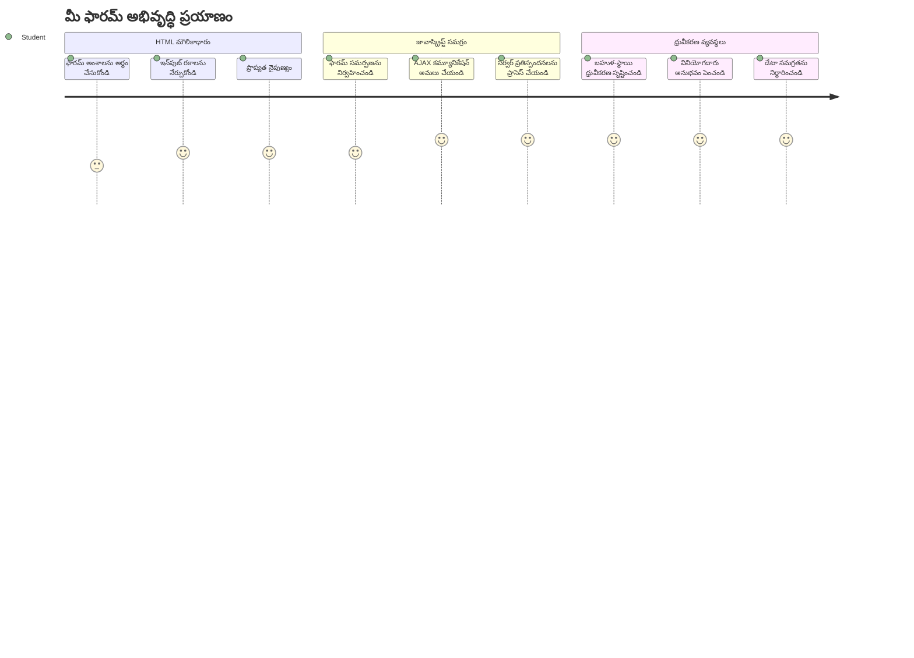
## పాఠం ముందరి క్విజ్

[పాఠం ముందరి క్విజ్](https://ff-quizzes.netlify.app/web/quiz/43)

మీరు ఎప్పుడైనా ఆన్‌లైన్ ఫారమ్‌లో ఇన్పుట్ చేసి, మీ ఇమెయిల్ ఫార్మాట్ తిరస్కరించబడిందని చూసారా? లేదా సబ్మిట్ చేసేటప్పుడు మీ సమాచారమంతా పోయిందా? మనందరం ఇటువంటి నిరుత్సాహకర అనుభవాలను ఎదుర్కొన్నాం.

ఫారమ్‌లు మీ వినియోగదారులు మరియు మీ అప్లికేషన్ పనితీరుకు మధ్య వంతెన. జాగ్రత్తగా విమాన నియంత్రకులు విమానాలను సురక్షితంగా గమ్యస్థానాలకు చేర్చేందుకు అనుసరించే ప్రొటోకాల్స్‌లాగా, బాగా రూపకల్పన చేసిన ఫారమ్‌లు స్పష్టమైన స్పందనను అందించి ఖర్చుతో కూడిన తప్పులను నివారిస్తాయి. నొప్పితక్కువ ఫారమ్‌లు వినియోగదారులను ఆగకుండా పారిపోవడానికి కారణమవుతాయి.

ఈ పాఠంలో, మీ స్థిరమైన బ్యాంకింగ్ యాప్‌ను ఇంటరాక్టివ్ అప్లికేషన్‌గా మార్చుతాం. వినియోగదారుల ఇన్పుట్‌ను ధృవీకరించే, సర్వర్లతో కమ్యూనికేట్ చేసే, సహాయక స్పందనలను అందించే ఫారమ్‌లు రూపొందించటం నేర్పుతాం. దీన్ని మీ అప్లికేషన్ ఫీచర్స్‌ను వినియోగదారులు నావిగేట్ చేయగలుగుతున్న నియంత్రణ ఇంటర్ఫేస్ నిర్మాణంగా భావించండి.

చివరిలో, మీరు పూర్తి లాగిన్ మరియు రిజిస్ట్రేషన్ సిస్టమ్ కలిగి ఉంటారు, ఇది వినియోగదారులను నిరుత్సాహం కాకుండా విజయవంతంగా గైడ్ చేస్తుంది.

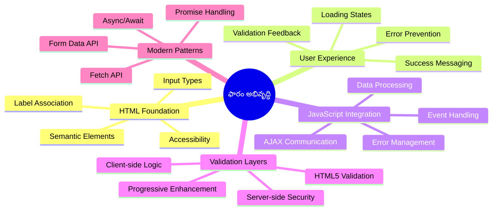
## ముందస్తు అవసరాలు

మనం ఫారమ్‌లు నిర్మించడం మొదలెట్టేముందు, మీరు సక్రమంగా సర్వ్ చేసుకున్నారని నిర్ధారిద్దాం. ఈ పాఠం గత పాఠంలో మిగళిన చోట నుండే మొదలవుతుంది, కాబట్టి మీరు ముందుకు జారిపోయితే మునుపటి పాఠాలను తిరిగి చూసి ప్రాథమికాలు సెట్ చేసుకోవడం మంచిది.

### అవసరమైన సెటప్

| భాగం | స్థితి | వివరణ |
|-----------|--------|-------------|
| [HTML టెంప్లేట్లు](../1-template-route/README.md) | ✅ అవసరం ఉంది | మీ ప్రాథమిక బ్యాంకింగ్ యాప్ నిర్మాణం |
| [Node.js](https://nodejs.org) | ✅ అవసరం ఉంది | సర్వర్ కోసం జావాస్క్రిప్ట్ రన్‌టైమ్ |
| [బ్యాంక్ API సర్వర్](../api/README.md) | ✅ అవసరం ఉంది | డేటా నిల్వ కోసం బ్యాక్-ఎండ్ సర్వీస్ |

> 💡 **డెవలప్‌మెంట్ సూచన**: మీరు రెండు ప్రత్యేక సర్వర్లను ఒకేసారి నడపాల్సి ఉంటుంది – ఒకటిసార్వత్రిక ఫ్రంట్-ఎండ్ బ్యాంకింగ్ యాప్ కోసం, మరోటి బ్యాక్‌ఎండ్ API కోసం. ఇది నిజ జీవిత అభివృద్ధి విధానాన్ని అనుకరిస్తుంది, ఇందులో ఫ్రంట్-ఎండ్, బ్యాక్-ఎండ్ సేవలు స్వతంత్రంగా పని చేస్తాయి.

### సర్వర్ కాన్ఫిగరేషన్

**మీ అభివృద్ధి వాతావరణంలో ఉంటాయి:**
- **ఫ్రంట్-ఎండ్ సర్వర్**: మీ బ్యాంకింగ్ యాప్‌ను సర్వ్ చేస్తుంది (సాధారణంగా పోర్ట్ `3000`)
- **బ్యాక్‌ఎండ్ API సర్వర్**: డేటా నిల్వ మరియు పొందిక నిర్వహణ (పోర్ట్ `5000`)
- **రెండు సర్వర్లు** స‌మకాలీనంగా లేకుండా సంభవంగా నడవగలవు

**మీ API కనెక్షన్‌ను పరీక్షించడం:**
```bash
curl http://localhost:5000/api
# ఆశించిన ప్రతిస్పందన: "బ్యాంక్ API v1.0.0"
```

**మీకు API వెర్షన్ సమాధానం కనిపిస్తే, మీరు ముందుకు సాగేందుకు సిద్దంగా ఉన్నారు!**

---

## HTML ఫారమ్‌లు మరియు నియంత్రణల అవగాహన

HTML ఫారమ్‌లు వినియోగదారులు మీ వెబ్ అప్లికేషన్‌తో కమ్యూనికేట్ చేయడానికి ఉపయోగిస్తారు. ఇవి 19వ శతాబ్దంలో దూర దూరాలనూ కలిపే టెలిగ్రాఫ్ వ్యవస్థలా భావించండి – వినియోగదారుల ఉద్దేశం మరియు అప్లికేషన్ స్పందన మధ్య కమ్యూనికేషన్ ప్రోటోకాల్. జాగ్రత్తగా రూపకల్పన చేయబడినప్పుడు, అవి తప్పులను పట్టుకునే, ఇన్పుట్ ఫార్మాట్‌ను మార్గనిర్దేశం చేసే, మరియు సహాయక సూచనలను అందించే విధంగా పనిచేస్తాయి.

ఆధునిక ఫార్మ్‌లు సాధారణ టెక్స్ట్ ఇన్పుట్‌ల కంటే చాలా సాంకేతికంగా ఉన్నాయి. HTML5 ప్రత్యేక ఇన్పుట్ రకాల్ని ప్రవేశపెట్టింది, ఇవి స్వయంచాలకంగా ఇమెయిల్ ధృవీకరణ, సంఖ్య ఫార్మాటింగ్, తేదీ ఎంపికను నిర్వహిస్తాయి. ఈ మెరుగుదలలు ప్రాప్తి సహకారమైనదిగా మరియు మొబైల్ వినియోగదారుల అనుభవం కొరకు లాభదాయకంగా ఉంటాయి.

### ఆవశ్యక ఫారమ్ మూలకాలు

**ప్రతి ఫార్మ్‌కు కావలసిన నిర్మాణ భాగాలు:**

```html
<!-- Basic form structure -->
<form id="userForm" method="POST">
  <label for="username">Username</label>
  <input id="username" name="username" type="text" required>
  
  <button type="submit">Submit</button>
</form>
```

**ఈ కోడ్ ఇక్కడ ఏమి చేస్తుంది:**
- **సృష్టిస్తుంది** ఒక ప్రత్యేక గుర్తింపు కలిగిన ఫారమ్ కంటైనర్‌ను
- **సూచిస్తుంది** డేటా సమర్పణ కోసం HTTP పద్ధతిని
- **కలిపిస్తుంది** లేబుల్స్ ఇన్పుట్‌లతో ప్రాప్తి సౌలభ్యం కొరకు
- **నిర్థారిస్తుంది** ఫారమ్‌ను ప్రాసెస్ చేసే సబ్మిట్ బటన్

### ఆధునిక ఇన్పుట్ రకాలు మరియు లక్షణాలు

| ఇన్పుట్ రకం | ఉపయోగం | ఉదాహరణ |
|------------|---------|---------|
| `text` | సాధారణ టెక్స్ట్ ఇన్పుట్ | `<input type="text" name="username">` |
| `email` | ఇమెయిల్ ధృవీకరణ | `<input type="email" name="email">` |
| `password` | దాచిన పాఠ్యం | `<input type="password" name="password">` |
| `number` | సంఖ్యాత్మక ఇన్పుట్ | `<input type="number" name="balance" min="0">` |
| `tel` | ఫోన్ నంబర్లు | `<input type="tel" name="phone">` |

> 💡 **ఆధునిక HTML5 ప్రయోజనం**: ప్రత్యేక ఇన్పుట్ రకాలను ఉపయోగించడం వల్ల స్వయంచాలక ధృవీకరణ, సరైన మొబైల్ కీబోర్డ్లు, మరింత ప్రాప్తిసౌలభ్యం అదనపు జావాస్క్రిప్ట్ అవసరకుండా వస్తుంది!

### బటన్ రకాలు మరియు ప్రవర్తన

```html
<!-- Different button behaviors -->
<button type="submit">Save Data</button>     <!-- Submits the form -->
<button type="reset">Clear Form</button>    <!-- Resets all fields -->
<button type="button">Custom Action</button> <!-- No default behavior -->
```

**ప్రతి బటన్ రకం ఇది చేస్తుంది:**
- **సబ్మిట్ బటన్స్**: ఫారమ్ సమర్పణను ప్రారంభించి డేటాను పేర్కొన్న ఎండ్పాయింట్‌కు పంపుతాయి
- **రీసెట్ బటన్స్**: అన్ని ఫారమ్ ఫీల్డ్స్‌ను వారి ప్రారంభ స్థితికి తిరిగి తీసుకొస్తాయి
- **సాధారణ బటన్స్**: ఎలాంటి డిఫాల్ట్ ప్రవర్తనలేని, ఫంక్షనాలిటీ కోసం కస్టమ్ జావాస్క్రిప్ట్ అవసరం

> ⚠️ **ముఖ్య గమనిక**: `<input>` ఎలిమెంట్ స్వయంగా ముగిసే ట్యాగ్, క్లోజింగ్ ట్యాగ్ అవసరం లేదు. ఆధునిక ఉత్తమ ప్రాక్టీస్ `<input>`ను స్లాష్ లేకుండా వ్రాయటం.

### మీ లాగిన్ ఫారమ్‌ని నిర్మించడం

ఇప్పుడు ఆధునిక HTML ఫారమ్ పద్ధతులను ప్రదర్శించే ప్రాక్టికల్ లాగిన్ ఫారమ్ రూపొందిద్దాం. మేం ప్రాథమిక నిర్మాణంతో మొదలెయ్యి, దానిని సమర్థ ప్రాప్తి లక్షణాలు మరియు ధృవీకరణలతో మెరుగుపరచుతాం.

```html
<template id="login">
  <h1>Bank App</h1>
  <section>
    <h2>Login</h2>
    <form id="loginForm" novalidate>
      <div class="form-group">
        <label for="username">Username</label>
        <input id="username" name="user" type="text" required 
               autocomplete="username" placeholder="Enter your username">
      </div>
      <button type="submit">Login</button>
    </form>
  </section>
</template>
```

**ఇక్కడ ఏమి జరుగుతుందో విడదీస్తే:**
- **రూపకల్పన చేస్తుంది** ఫారమ్‌ను పార్శ్వ HTML5 మూలకాలతో
- **సమూహీకరించబడి ఉంటుంది** సంబంధిత అంశాలను చక్కటి తరగతుల `div` కంటైనర్లలో
- **కలిపిస్తుంది** లేబుల్స్‌ను ఇన్‌పుట్స్ తో `for` మరియు `id` లక్షణాలతో
- **ఉందటానికి సహాయం చేస్తుంది** ఆధునిక లక్షణాలుగా `autocomplete` మరియు `placeholder` వల్ల మెరుగైన వినియోగదారుల అనుభవం
- **జోడిస్తుంది** `novalidate` ఫారమ్ బ్రౌజర్ డిఫాల్ట్ ధృవీకరణను అడ్డుకోవడానికి, జావాస్క్రిప్ట్ ద్వారా నిర్వహించేందుకు

### సరైన లేబుల్స్ శక్తి

**ఆధునిక వెబ్ అభివృద్ధి కోసం లేబుల్స్ ఎందుకు ముఖ్యం:**

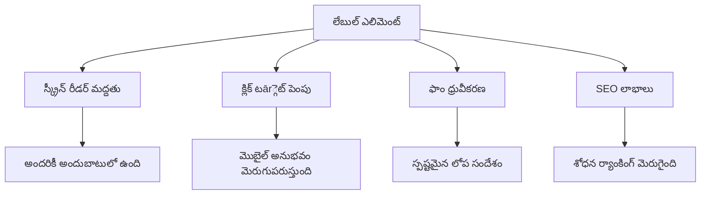
**సరైన లేబుల్స్ ఇస్తాయిన గుణాలు:**
- **స్క్రీన్ రీడర్లు ఈ ఫారమ్ ఫీల్డ్‌లను స్పష్టంగా ప్రకటించడానికి సహాయం చేస్తాయి**
- **క్లిక్ చేయదగిన ప్రాంతాన్ని పెంచుతాయి (లేబుల్ పై క్లిక్ చేస్తే ఇన్‌పుట్ ఫోకస్ అవుతుంది)**
- **మొబైల్ వాడకం మెరుగుపరుస్తాయి పెద్ద టచ్ టార్గెట్లతో**
- **ఫారమ్ ధృవీకరణకు అర్ధవంతమైన లోపాల సందేశాలు అందిస్తాయి**
- **SEOని మెరుగుపరుస్తాయి ఫారమ్ అంశాలకు సాంకేతిక అర్థదట్టత అందించడం ద్వారా**

> 🎯 **ప్రాప్తి లక్ష్యం**: ప్రతి ఫారమ్ ఇన్‌పుట్‌కు అనుబంధ లేబుల్ తప్పనిసరి. ఈ సాధారణ పద్ధతి మీ ఫారమ్‌లను అందరికీ, వీ handicap కలిగిన వినియోగదారులు సహా, ఉపయోగించదగినదిగా మార్చుతుంది మరియు అన్ని వినియోగదారుల అనుభవాన్ని మెరుగుపరుస్తుంది.

### రిజిస్ట్రేషన్ ఫారమ్ సృష్టించడం

రిజిస్ట్రేషన్ ఫారమ్ పూర్తయిన యూజర్ ఖాతా సృష్టించడానికి మరింత వಿಸ್ತృత సమాచారాన్ని కోరుతుంది. దీన్ని ఆధునిక HTML5 లక్షణాలతో మరియు పెరిగిన ప్రాప్తిసౌలభ్యంతో నిర్మిద్దాం.

```html
<hr/>
<h2>Register</h2>
<form id="registerForm" novalidate>
  <div class="form-group">
    <label for="user">Username</label>
    <input id="user" name="user" type="text" required 
           autocomplete="username" placeholder="Choose a username">
  </div>
  
  <div class="form-group">
    <label for="currency">Currency</label>
    <input id="currency" name="currency" type="text" value="$" 
           required maxlength="3" placeholder="USD, EUR, etc.">
  </div>
  
  <div class="form-group">
    <label for="description">Account Description</label>
    <input id="description" name="description" type="text" 
           maxlength="100" placeholder="Personal savings, checking, etc.">
  </div>
  
  <div class="form-group">
    <label for="balance">Starting Balance</label>
    <input id="balance" name="balance" type="number" value="0" 
           min="0" step="0.01" placeholder="0.00">
  </div>
  
  <button type="submit">Create Account</button>
</form>
```

**పై కోడ్‌లో మనం:**
- **ప్రతీ ఫీల్డ్‌ను కంటైనర్ divల్లో సక్రమంగా అమర్చాం, శైలీకరణకు మరియు లేఅవుట్‌కు సహాయం చేస్తుంది**
- **బ్రౌజర్ ఆటోఫిల్ మద్దతు కొరకు సరిఅయిన `autocomplete` లక్షణాలను జోడించాం**
- **వినియోగదారుల ఇన్పుట్ కోసం సహాయక ప్లేస్‌హోల్డర్ టెక్స్ట్ అందించాం**
- **`value` లక్షణంతో సరిఅయిన డిఫాల్టులను సెట్ చేసాం**
- **`required`, `maxlength`, `min` వంటి ధృవీకరణ లక్షణాలను వర్తింపజేశాం**
- **`type="number"` నిలువు ఖాతా ఫీల్డ్ కోసం, డెసిమల్ మద్దతుతో**

### ఇన్పుట్ రకాలు మరియు ప్రవర్తన అన్వేషణ

**ఆధునిక ఇన్పుట్ రకాలు మెరుగైన ఫంక్షనాలిటీని అందిస్తాయి:**

| లక్షణం | ప్రయోజనం | ఉదాహరణ |
|---------|---------|---------|
| `type="number"` | మొబైల్ పై సంఖ్యాక ప్యాడ్ | సులభమైన బ్యాలెన్స్ ఎంట్రీ |
| `step="0.01"` | దశాంశ ఖచ్చితత్వ నియంత్రణ | కరెన్సీలో సెంట్ల అనుమతి |
| `autocomplete` | బ్రౌజర్ ఆటోఫిల్ | వేగంగా ఫారమ్ పూర్తి |
| `placeholder` | సందర్భానుసార సూచనలు | వినియోగదారుల అంచనాలను గైడ్ చేస్తుంది |

> 🎯 **ప్రాప్తి సవాలు**: మీ ఫారమ్‌లను కేవలం కీబోర్డ్తో నావిగేట్ చేసి చూడండి! ఫీల్డ్‌ల మధ్య వెళ్లడానికి `Tab` ఉపయోగించండి, చెక్ బాక్సులు సెట్ చేయడానికి `Space` మరియు సమర్పించడానికి `Enter` వాడండి. ఈ అనుభవం స్క్రీన్ రీడర్ వినియోగదారులు మీ ఫారమ్‌లను ఎలా వాడతారో అర్థం చేసుకోవడానికి సహాయపడుతుంది.

### 🔄 **పాఠశాల తనిఖీ**
**ఫారమ్ ఆధారమై అవగాహన:** జావాస్క్రిప్ట్ అమలు చేసే ముందు తెలుసుకోవలసినవి:
- ✅ సేమాంటిక్ HTML ద్వారా ప్రాప్తిసౌలభ్య ఫారమ్ నిర్మాణం ఎలా జరుగుతుంది
- ✅ మొబైల్ కీబోర్డ్లు మరియు ధృవీకరణకు ఇన్పుట్ రకాల ప్రాధాన్యత
- ✅ లేబుల్స్ మరియు ఫారమ్ నియంత్రణల సంబంధం
- ✅ ఫారమ్ లక్షణాలు బ్రౌజర్ డిఫాల్ట్ ప్రవర్తనపై ఎలా ప్రభావం చూపుతాయో

**త్వరిత స్వీయ పరీక్ష**: జావాస్క్రిప్ట్ లేకుండా ఫారమ్ సమర్పిస్తే ఏం జరుగుతుంది?
*జవాబు: బ్రౌజర్ డిఫాల్ట్ సమర్పణ చేస్తుంది, సాధారణంగా చర్య URLకి రీడైరెక్ట్ అవుతుంది*

**HTML5 ఫారమ్ లాభాలు**: ఆధునిక ఫార్ములు అందిస్తాయి:
- **బిల్ట్-ఇన్ ధృవీకరణ**: స్వయంచాలక ఇమెయిల్, సంఖ్య ఫార్మాట్ తనిఖీలు
- **మొబైల్ ఆప్టిమైజేషన్**: వివిధ ఇన్పుట్ రకాలకు సరిపోయే కీబోర్డ్‌లు
- **ప్రాప్తిసౌలభ్యం**: స్క్రీన్ రీడర్ మద్దతు మరియు కీబోర్డ్ నావిగేషన్
- **ప్రోగ్రెసివ్ ఎన్హాన్స్‌మెంట్**: జావాస్క్రిప్ట్ ఆఫ్ ఉన్నప్పటికీ పనిచేస్తుంది

## ఫారమ్ సమర్పణ పద్ధతుల అవగాహన

ఎవరైనా మీ ఫారమ్ నింపి సబ్మిట్ చేస్తే, ఆ డేటా ఎక్కడో పంపించాలి – సాధారణంగా సమర్పణను స్వీకరించి నిల్వ చేసే సర్వర్ వద్ద. ఇది ఎలా జరుగుతుందో తెలుసుకోవడం తరువాత టెన్షన్స్ నుంచి రక్షిస్తుంది.

సబ్మిట్ బటన్ క్లిక్ చేసినప్పుడు ఏమి జరుగుతుందో చూద్దాం.

### డిఫాల్ట్ ఫారమ్ ప్రవర్తన

మొదట, ప్రాథమిక ఫారమ్ సమర్పణతో ఏమి జరుగుతుందో గమనిద్దాం:

**మీ ప్రస్తుత ఫార్ములను పరీక్షించండి:**
1. ఫారమ్‌లోని *రిజిస్టర్* బటన్‌ను క్లిక్ చేయండి
2. బ్రౌజర్ అడ్రస్ బార్ మార్పులను గమనించండి
3. పేజీ రీలోడ్ అవ్వడం మరియు URL లో డేటా కనిపించడం చూసి స్టేట్ గుర్తించండి


### HTTP పద్ధతుల సరిపోలిక

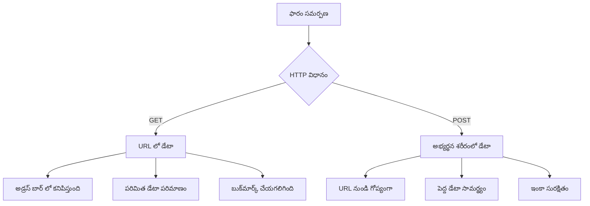
**వేడుకల తేడాలు:**

| పద్ధతి | ఉపయోగం | డేటా స్థానం | భద్రత స్థాయి | పరిమితి పరిమాణం |
|--------|----------|---------------|----------------|------------------|
| `GET` | శోధన క్వెరీలు, ఫిల్టర్లు | URL పరామితులు | తక్కువ (ప్రత్యక్షంగా ఉండటం) | సుమారు 2000 అక్షరాలు |
| `POST` | వినియోగదారు ఖాతాలు, సున్నితమైన సమాచారం | అభ్యర్థన శరీరం | ఎక్కువ (దాచిన) | ఆలోచనీయ పరిమితి లేదు |

**మూల తేడాలు:**
- **GET**: ఫారమ్ డేటాను URL వద్ద ప్రశ్నా పారామితులుగా జతచేస్తుంది (శోధనల కోసం అనువైనది)
- **POST**: డేటాను అభ్యర్థన శరీరంలో చేర్చుతుంది (సున్నితమైన సమాచారానికి అవసరం)
- **GET పరిమితులు**: పరిమాణ పరిమితులు, ప్రత్యక్ష డేటా, బ్రౌజర్ చరిత్రలో నిల్వ
- **POST ప్రయోజనాలు**: పెద్ద డేటా, గోప్యత, ఫైల్ అప్ప్లోడ్ మద్దతు

> 💡 **ఉత్తమ ఆచరణ**: శోధన ఫారమ్‌లు, ఫిల్టర్లకు `GET` వాడండి (డేటా పొందిక), వినియోగదారు నమోదు, లాగిన్, డేటా సృష్టికి `POST` వాడండి.

### ఫారమ్ సమర్పణ కాన్ఫిగరేషన్

మీ రిజిస్ట్రేషన్ ఫారమ్ బ్యాక్‌ఎండ్ APIతో POST పద్ధతిలో సక్రమంగా కమ్యూనికేట్ చేయడానికి కాన్ఫిగర్ చేద్దాం:

```html
<form id="registerForm" action="//localhost:5000/api/accounts" 
      method="POST" novalidate>
```

**ఈ కాన్ఫిగరేషన్ ఏమి చేస్తుందో:**
- **ఫారమ్ సమర్పణను** మీ API ఎండ్పాయింట్‌కి నేరుగా పంపుతుంది
- **POST పద్ధతిని** భద్రతతో కూడిన డేటా ట్రాన్స్మిషన్‌కు వాడుతుంది
- **`novalidate`** జావాస్క్రిప్ట్ ద్వారా ధృవీకరణ నిర్వహణకు ఉపయోగిస్తుంది

### ఫారమ్ సమర్పణ పరీక్ష

**మీ ఫారమ్‌ను పరీక్షించడానికి ఈ దశలను అనుసరించండి:**
1. రిజిస్టర్ ఫారమ్‌లో మీ వివరాలు నింపండి
2. "ఖాతా సృష్టించు" బటన్‌ను నొక్కండి
3. బ్రౌజర్‌లో సర్వర్ స్పందనను గమనించండి

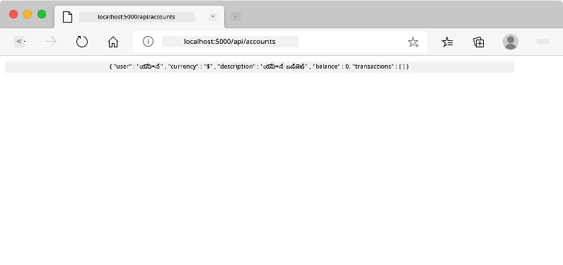

**మీకు కనిపించే విషయాలు:**
- **బ్రౌజర్ API ఎండ్పాయింట్ URLకి రీడైరెక్ట్ అవుతుంది**
- **మీ సృష్టించిన ఖాతా డేటాతో JSON స్పందన వస్తుంది**
- **సర్వర్ ఖాతా విజయవంతంగా సృష్టించబడిందని ధృవీకరిస్తుంది**

> 🧪 **ప్రయోగం సమయం**: అదే వాడుకరి పేరుతో మళ్ళీ రిజిస్టర్ అవుద్దాం. ఏ స్పందన వస్తుంది? ఇది సర్వర్ డూప్లికేట్ డేటా, లోప పరిస్థితులను ఎలా నిర్వహిస్తుందో అర్థం చేసుకోవడానికి సహాయపడుతుంది.

### JSON స్పందనల అవగాహన

**సర్వర్ ఫారమ్ విజయవంతంగా ప్రాసెస్ చేస్తే:**
```json
{
  "user": "john_doe",
  "currency": "$",
  "description": "Personal savings",
  "balance": 100,
  "id": "unique_account_id"
}
```

**ఈ స్పందన సూచిస్తుంది:**
- **మీ సూచించిన డేటాతో కొత్త ఖాతాను సృష్టిస్తుంది**
- **భవిష్యత్తు సూచన కోసం ప్రత్యేక గుర్తింపుని కేటాయిస్తుంది**
- **పరీక్ష కోసం అన్ని ఖాతా సమాచారం తిరిగి ఇస్తుంది**
- **డేటాబేస్ నిల్వ విజయవంతమైందని సూచిస్తుంది**

## ఆధునిక జావాస్క్రిప్ట్ తో ఫారమ్ నిర్వహణ

పారంపర్య ఫార్మ్ సమర్పణతో పేజీ పూర్తి రీలోడ్ అవుతుంది, ఇది తొలి అంతరిక్ష మిషన్లలో పూర్ణ సిస్టమ్ రీసెట్ చేయాల్సిన అవసరాన్ని పోలి ఉంటుంది. ఇది వినియోగదారుల అనుభవాన్ని అంతరాయం చేస్తుంది మరియు అప్లికేషన్ స్థితిని కోల్పోతుంది.

జావాస్క్రిప్ట్ ఫారమ్ నిర్వహణ ప్రయాణ నియంత్రణ వ్యవస్థల మాదిరిగా – రియల్ టైంలో మార్పులు చెయ్యడమే కాక, స్థానాన్ని కోల్పోకుండా దారితప్పకుండా మార్గనిర్దేశం చేస్తుంది. ఫారమ్ సమర్పణలను జాప్యం లేకుండా అరికడమే, లోపాలను సురక్షితంగా నిర్వహించడం, మరియు సర్వర్ స్పందనల ఆధారంగా ఇంటర్ఫేస్ నవీకరణ చేయడం వీల్లాభాలు.

### పేజీ రీలోడ్‌లను నివారించటం ఎందుకు?

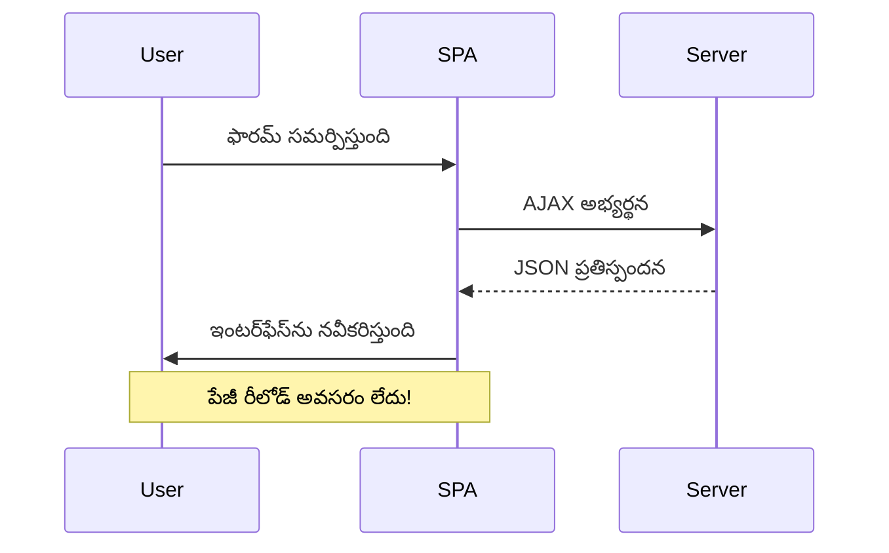
**జావాస్క్రిప్ట్ ఫారమ్ నిర్వహణ లాభాలు:**
- **అప్లికేషన్ స్థితిని మరియు వినియోగదారుల సందర్భాన్నీ కలిగి ఉంచుతుంది**
- **తక్షణ స్పందన మరియు లోడింగ్ సూచికలు అందిస్తుంది**
- **డైనమిక్ లోప నిర్వహణ మరియు ధృవీకరణను సాధ్యం చేస్తుంది**
- **స్మూత్, యాప్-లాగా యూజర్ అనుభవాలు సృష్టిస్తుంది**
- **సర్వర్ స్పందనల ఆధారంగా షరతు నిబద్ధతలు అమలు చేయగలదు**

### సంప్రదాయ ఫారమ్ నుంచి ఆధునికల వైపు మార్పు

**సంప్రదాయ విధాన సమస్యలు:**
- **యూజర్లను అప్లికేషన్ బాహ్యంగా తిరిగిపారేస్తుంది**
- **ప్రస్తుత అప్లికేషన్ స్థితిని మాయం చేస్తుంది**
- **సాధారణ ఆపరేషన్ల కోసం పేజీను పూర్తిగా రీలోడ్ చేయాల్సి ఉంటుంది**
- **యూజర్ స్పందనపై పరిమిత నియంత్రణ**

**ఆధునిక జావాస్క్రిప్ట్ విధాన లాభాలు:**
- **యూజర్లు అప్లికేషన్ లోనే ఉంటారు**
- **అన్ని అప్లికేషన్ స్థితులు మరియు డేటా నిల్వ**
- **తక్షణ ధృవీకరణ మరియు ప్రతిస్పందన**
- **ప్రోగ్రెసివ్ ఎన్హాన్స్‌మెంట్ మరియు ప్రాప్తిసౌలభ్య మద్దతు**

### జావాస్క్రిప్ట్ ఫారమ్ నిర్వహణ అమలు

పారంపర్య ఫారమ్ సమర్పణను ఆధునిక జావాస్క్రిప్ట్ ఈవెంట్ హ్యాండ్లింగ్‌తో మార్చుదాం:

```html
<!-- Remove the action attribute and add event handling -->
<form id="registerForm" method="POST" novalidate>
```

**మీ `app.js` ఫైల్‌లో రిజిస్ట్రేషన్ లాజిక్ జోడించండి:**

```javascript
// ఆధునిక ఈవెంట్-ఆధారిత ఫారమ్ హ్యాండ్లింగ్
function register() {
  const registerForm = document.getElementById('registerForm');
  const formData = new FormData(registerForm);
  const data = Object.fromEntries(formData);
  const jsonData = JSON.stringify(data);
  
  console.log('Form data prepared:', data);
}

// పేజీ లోడ్ అయినప్పుడు ఈవెంట్ లిసనర్‌ను జతచేయండి
document.addEventListener('DOMContentLoaded', () => {
  const registerForm = document.getElementById('registerForm');
  registerForm.addEventListener('submit', (event) => {
    event.preventDefault(); // డిఫాల్ట్ ఫారమ్ సబ్మిషన్‌ను అరికట్టండి
    register();
  });
});
```

**ఇక్కడ ఏమి జరుగుతుందో విడదీస్తే:**
- **`event.preventDefault()` తో డిఫాల్ట్ ఫారమ్ సమర్పణ అడ్డుకుంటుంది**
- **ఆధునిక DOM సెలక్షన్ ఉపయోగించి ఫారమ్ ఎలిమెంట్‌ని పొందుతుంది**
- **శక్తివంతమైన `FormData` APIతో ఫారమ్ డేటాను పొందుతుంది**
- **`Object.fromEntries()`తో FormDataని సాధారణ ఆబ్జెక్టుగా మార్చుతుంది**
- **డేటాను సర్వర్ కమ్యూనికేషన్ కొరకు JSON ఫార్మేట్ చేస్తుంది**
- **డీబగ్గింగ్ మరియు ధృవీకరణ కోసం డేటాను లాగ్ చేస్తుంది**

### FormData API అవగాహన

**FormData API శక్తివంతమైన ఫారమ్ నిర్వహణను అందిస్తుంది:**
```javascript
// FormData ఏమి పట్టుకుంటుంది అన్న దానికి ఉదాహరణ
const formData = new FormData(registerForm);

// FormData స్వయంచాలకంగా పట్టుకుంటుంది:
// {
//   "user": "john_doe",
//   "currency": "$",
//   "description": "వ్యక్తిగత ఖాతా",
//   "balance": "100"
// }
```

**FormData API లాభాలు:**
- **సమగ్ర సేకరణ**: పాఠ్యం, ఫైల్స్ మరియు సారూప్య ఇన్‌పుట్‌ల సహా అన్ని ఫారం అంశాలను క్యాప్చర్ చేస్తుంది
- **రకం అవగాహన**: ప్రత్యేక కోడింగ్ లేకుండా విభిన్న ఇన్‌పుట్ ర‌కాల‌ను ఆటోమాటిక్‌గా నిర్వహిస్తుంది
- **సమర్ధత**: ఒకే API కాల్‌తో మాన్యువల్ ఫీల్డ్ సేకరణను తొలగిస్తుంది
- **అనుసంధానం**: ఫారమ్ నిర్మాణం మారినప్పటికీ పనితీరును నిలుపుకుంటుంది

### సర్వర్ కమ్యూనికేషన్ ఫంక్షన్ తయారీ

ఇప్పుడు ఆధునిక JavaScript ప్యాటర్న్‌లను ఉపయోగించి మీ API సర్వర్‌తో కమ్యూనికేట్ చేసే బలమైన ఫంక్షన్‌ను తయారుచుకుందాము:

```javascript
async function createAccount(account) {
  try {
    const response = await fetch('//localhost:5000/api/accounts', {
      method: 'POST',
      headers: { 
        'Content-Type': 'application/json',
        'Accept': 'application/json'
      },
      body: account
    });
    
    // ప్రతిస్పందన విజయవంతమైందా చెక్ చేయండి
    if (!response.ok) {
      throw new Error(`HTTP error! status: ${response.status}`);
    }
    
    return await response.json();
  } catch (error) {
    console.error('Account creation failed:', error);
    return { error: error.message || 'Network error occurred' };
  }
}
```

**అసింక్రోనస్ JavaScript అవగాహన:**

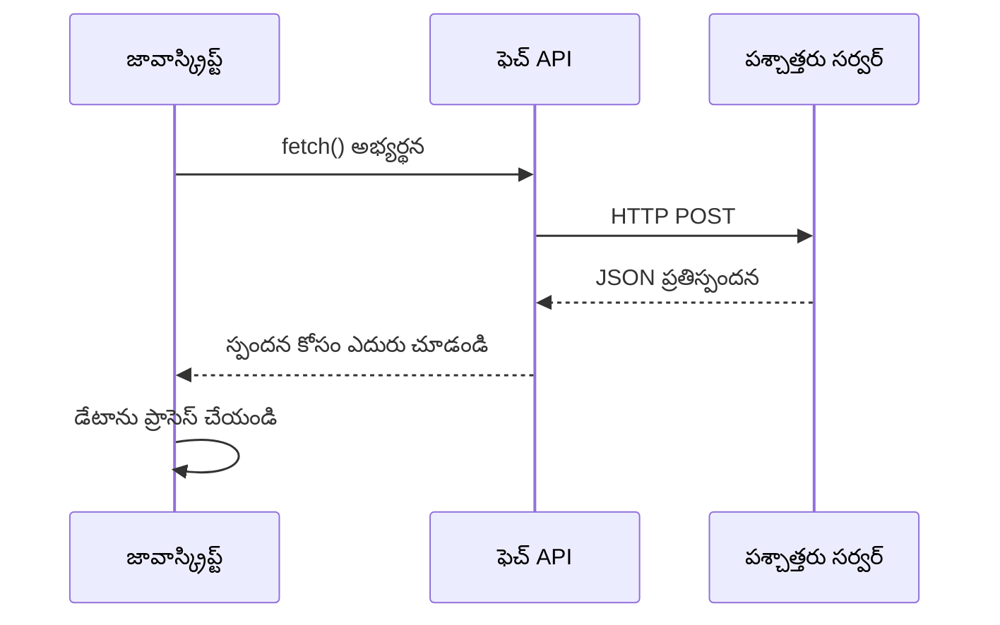
**ఈ ఆధునిక అమలు సాధించేది:**
- చదవదగిన అసింక్రోనస్ కోడ్ కోసం `async/await` ఉపయోగిస్తుంది
- సరైన లోపాల హ్యాండ్లింగ్ కోసం try/catch బ్లాక్‌లను కలిగి ఉంటుంది
- డేటా ప్రాసెస్ చేసే ముందు ప్రతిస్పందన స్థితిని తనిఖీ చేస్తుంది
- JSON కమ్యూనికేషన్ కి తగిన హెచ్చరికలను సెట్ చేస్తుంది 
- డీబగ్గింగ్ కోసం విపులమైన లోపాల సందేశాలను అందిస్తుంది
- విజయవంతమయిన మరియు లోపాల సందర్భాల్లో సంతులితమైన డేటా నిర్మాణాన్ని తిరిగి ఇస్తుంది

### ఆధునిక Fetch API శక్తి

**పాత పద్ధతులపై Fetch API లాభాలు:**

| లక్షణం | లాభం | అమలు |
|---------|---------|----------------|
| Promise-ఆధారిత | శుభ్రమైన అసింక్రోనస్ కోడ్ | `await fetch()` |
| అభ్యర్థన కస్టమైజేషన్ | పూర్తి HTTP నియంత్రణ | హెడ్డర్లు, విధానాలు, బాడీ |
| ప్రతిస్పందన హ్యాండ్లింగ్ | అనువైన డేటా పార్సింగ్ | `.json()`, `.text()`, `.blob()` |
| లోపాల హ్యాండ్లింగ్ | సమగ్ర లోపాల పట్టుకోవడం | Try/catch బ్లాక్‌లు |

> 🎥 **మరింత తెలుసుకోండి**: [Async/Await Tutorial](https://youtube.com/watch?v=YwmlRkrxvkk) - ఆధునిక వెబ్ అభివృద్ధి కోసం అసింక్రోనస్ జావాస్క్రిప్ట్ ప్యాటర్న్‌లు అర్థం చేసుకోండి.

**సర్వర్ కమ్యూనికేషన్ కీలక భావనలు:**
- **Async ఫంక్షన్‌లు** సర్వర్ ప్రతిస్పందన కోసం ఎగ్జిక్యూషన్ ఆగిపోవడానికి అనుమతిస్తాయి
- **Await కీవర్డ్** అసింక్రోనస్ కోడ్‌ను సింక్రోనస్‌లా చదవగలుగుతుంది 
- **Fetch API** ఆధునిక, ప్రామిస్-ఆధారిత HTTP అభ్యర్థనలను అందిస్తుంది
- **లోపాల హ్యాండ్లింగ్** నెట్‌వర్క్ సమస్యలకు మీ యాప్ ఎలా స్పందించాలో ఖచ్చితంగా చూసుకోండి

### నమోదు ఫంక్షన్ పూర్తి చేయడం

మొత్తం విషయాలను కలిసి, ప్రొడక్షన్-సిద్ధమైన నమోదు ఫంక్షన్‌ను తయారుచేద్దాం:

```javascript
async function register() {
  const registerForm = document.getElementById('registerForm');
  const submitButton = registerForm.querySelector('button[type="submit"]');
  
  try {
    // లోడింగ్ స్థితిని ప్రదర్శించండి
    submitButton.disabled = true;
    submitButton.textContent = 'Creating Account...';
    
    // ఫారమ్ డేటాను ప్రాసెస్ చేయండి
    const formData = new FormData(registerForm);
    const jsonData = JSON.stringify(Object.fromEntries(formData));
    
    // సర్వర్‌కు పంపండి
    const result = await createAccount(jsonData);
    
    if (result.error) {
      console.error('Registration failed:', result.error);
      alert(`Registration failed: ${result.error}`);
      return;
    }
    
    console.log('Account created successfully!', result);
    alert(`Welcome, ${result.user}! Your account has been created.`);
    
    // విజయవంతమైన నమోదు తర్వాత ఫారమ్‌ను రీసెట్ చేయండి
    registerForm.reset();
    
  } catch (error) {
    console.error('Unexpected error:', error);
    alert('An unexpected error occurred. Please try again.');
  } finally {
    // బటన్ స్థితిని పునఃస్థాపించండి
    submitButton.disabled = false;
    submitButton.textContent = 'Create Account';
  }
}
```

**ఈ మెరుగుదల అమలు చేస్తుంది:**
- ఫారమ్ సమర్పణ సమయంలో దృశ్య ఫీడ్బ్యాక్ అందిస్తుంది
- ఇరట సబ్మిషన్లను నివారించడానికి సబ్మిట్ బటన్‌ను డిసేబుల్ చేస్తుంది
- ఎదురుచూసిన మరియు అనుకోని లోపాలను సాలవగానే నిర్వహిస్తుంది
- వినియోగదారుని స్నేహపూర్వక విజయ, లోప సందేశాలు చూపిస్తుంది
- విజయవంతమైన నమోదు తర్వాత ఫారంను రీసెట్ చేస్తుంది
- ఫలితం ఏమైనా UI స్థితిని పునరుద్ధరిస్తుంది

### మీ అమలును పరీక్షించడం

**మీ బ్రౌజర్ డెవలపర్ టూల్స్ తెరవండి మరియు నమోదు పని చేయండి:**

1. **బ్రౌజర్ కన్సోల్ ఓపెన్ చేయండి (F12 → Console tab)**
2. **నమోదు ఫారమ్ భర్తీ చేయండి**
3. **"Create Account"పై నొక్కండి**
4. **కన్సోల్ సందేశాలు మరియు వినియోగదారుని ఫీడ్బ్యాక్‌ని గమనించండి**

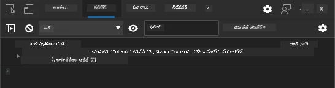

**మీరు చూడాల్సింది:**
- సబ్మిట్ బటన్ పై లోడింగ్ స్థితి కనిపిస్తుంది
- కన్సోల్ లో ప్రాసెస్ యొక్క వివరణాత్మక సమాచారాన్ని చూపిస్తుంది
- ఖాతా సృష్టి విజయవంతమైతే విజయ సందేశం వస్తుంది
- విజయవంతమైన సమర్పణ తర్వాత ఫారమ్ ఆటోమేటిక్‌గా రీసెట్ అవుతుంది

> 🔒 **సెక్యూరిటీ జాగ్రత్త**: ప్రస్తుతం, డేటా HTTP పై ప్రయాణిస్తుంది, ఇది ప్రొడక్షన్ కోసం సురక్షితం కాదు. నిజమైన అనువర్తనాలలో, డేటా సంకేతీకరణ కోసం ఎల్లప్పుడూ HTTPS వాడాలి. [HTTPS సెక్యూరిటీ](https://en.wikipedia.org/wiki/HTTPS) గురించి మరియు ఇది వినియోగదారుల డేటా రక్షణకు ఎందుకు అవసరమో తెలుసుకోండి.

### 🔄 **షిక్షణాత్మక తనిఖీ**
**ఆధునిక JavaScript ఇంటిగ్రేషన్**: అసింక్రోనస్ ఫార్మ్ హ్యాండ్లింగ్ మీ అవగాహనను నిర్ధారించుకోండి:
- ✅ `event.preventDefault()` ఎలా పూర్వనిర్దేశිත ఫార్మ్ ప్రవర్తనను మార్చుతుంది?
- ✅ మాన్యువల్ ఫీల్డ్ సేకరణ కంటే FormData API ఎంత సమర్ధవంతం ఎందుకు?
- ✅ async/await ప్యాటర్న్‌లు కోడ్ చదువుదల ఎలా మెరుగుపరుస్తాయి?
- ✅ వినియోగదారుల అనుభవంలో లోపాల హ్యాండ్లింగ్ యొక్క పాత్ర ఏమిటి?

**సిస్టమ్ వాస్తవీకరణ**: మీ ఫారమ్ హ్యాండ్లింగ్ ఈ క్రింది లక్షణాలను ప్రదర్శిస్తోంది:
- **ఈవెంట్-డ్రైవన్ ప్రోగ్రామ్మింగ్**: వినియోగదారుల చర్యలకు పేజీ రీలోడ్ లేకుండా స్పందిస్తాయి
- **అసింక్రోనస్ కమ్యూనికేషన్**: సర్వర్ అభ్యర్థనలు UIను బ్లాక్ చేయవు
- **లోపాల హ్యాండ్లింగ్**: నెట్‌వర్క్ సమస్యలు వచ్చినప్పుడు మెల్లగంచు శ్రేయస్సు అందిస్తుంది
- **స్థితి నిర్వహణ**: సర్వర్ ప్రతిస్పందనలకు UI నవీకరణలతో సరైన ప్రతిబింబం
- **ప్రోగ్రెసివ్ ఎन्हాన్స్‌మెంట్**: బేసిక్ ఫంక్షనాలిటీ పని చేస్తుంది, JavaScript మరింత మెరుగుపరుస్తుంది

**ప్రొఫెషనల్ ప్యాటర్న్‌లు**: మీరు అమలుచేశారు:
- **సింగిల్ రెస్పాన్సిబిలిటీ**: ఫంక్షన్లు స్పష్టమైన, కేంద్రీకృత గమ్యాలు కలిగి ఉంటాయి
- **లోపాల సరిహద్దులు**: Try/catch బ్లాక్‌ల ద్వారా అప్లికేషన్ క్రాష్ నివారణ
- **వినియోగదారుల ఫీడ్బ్యాక్**: లోడింగ్ స్టేట్స్ మరియు విజయ/లోప సందేశాలు
- **డేటా ట్రాన్స్ఫర్మేషన్**: FormData నుండి JSON కి సర్వర్ కమ్యూనికేషన్

## సమగ్ర ఫార్మ్ వెరిఫికేషన్

ఫారమ్ వెరిఫికేషన్ సమర్పణ తర్వాత లోపాలు కనుగొనడాన్ని నిరోధిస్తుంది. ఇంటర్నేషనల్ స్పేస్ స్టేషన్‌లోని అనేక పునరావృత సిస్టమ్‌లలా, సమర్ధవంతమైన వెరిఫికేషన్ అనేక భద్రతా తనిఖీలను నిర్వర్తిస్తుంది.

ఉత్తమ విధానం తక్షణ ఫీడ్బ్యాక్ కోసం బ్రౌజర్ స్థాయి వెరిఫికేషన్, వినియోగదారుభాగానికి మెరుగుదల కోసం JavaScript వెరిఫికేషన్, భద్రత మరియు డేటా సమగ్రత కోసం సర్వర్-వైపు వెరిఫికేషన్‌ను కలుపుతుంది. ఈ పునరావృతత వినియోగదారుల సంతృప్తి మరియు సిస్టమ్ రక్షణను నిర్ధారిస్తుంది.

### వెరిఫికేషన్ స్థరాలు అవగాహన

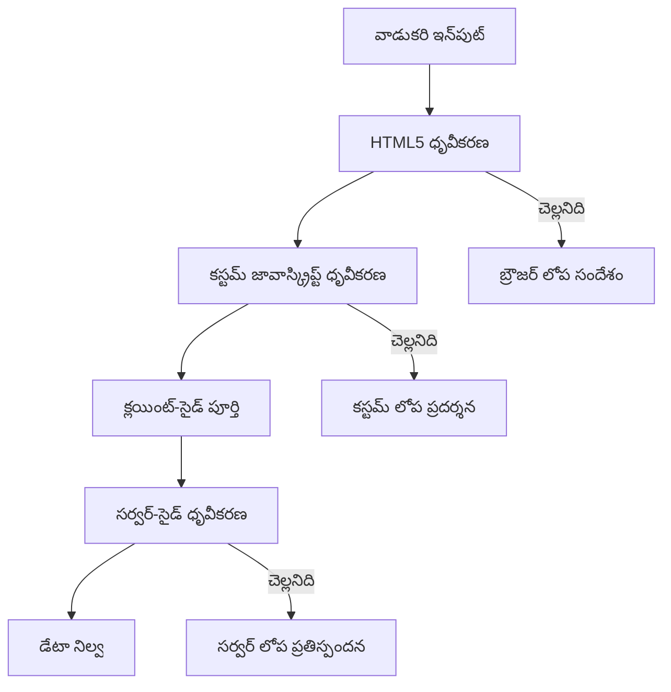
**బహుళ-స్థర వెరిఫికేషన్ వ్యూహం:**
- **HTML5 వెరిఫికేషన్**: తక్షణ బ్రౌజర్ ఆధారిత తనిఖీలు
- **JavaScript వెరిఫికేషన్**: అనుకూల లాజిక్ మరియు వినియోగదారు అనుభవం
- **సర్వర్ వెరిఫికేషన్**: తుద భద్రత మరియు డేటా సమగ్రత తనిఖీలు
- **ప్రోగ్రెసివ్ ఎन्हాన్స్‌మెంట్**: JavaScript డిసేబుల్ అయినా పనిచేస్తుంది

### HTML5 వెరిఫికేషన్ లక్షణాలు

**మీకు అందుబాటులో ఉన్న ఆధునిక వెరిఫికేషన్ సాధనాలు:**

| లక్షణం | ఉద్దేశ్యం | ఉదాహరణ వాడకం | బ్రౌజర్ ప్రవర్తన |
|-----------|---------|---------------|------------------|
| `required` | తప్పనిసరి ఫీల్డ్‌లు | `<input required>` | ఖాళీ సమర్పణను నిరోధిస్తుంది |
| `minlength`/`maxlength` | పాఠ్య పొడవు పరిమితులు | `<input maxlength="20">` | అక్షర పరిమితులను అమలు చేస్తుంది |
| `min`/`max` | సంఖ్య రేంజ్‌లు | `<input min="0" max="1000">` | సంఖ్య పరిమితులను సరిచూసుతుంది |
| `pattern` | అనుకూల regex నియమాలు | `<input pattern="[A-Za-z]+">` | నిర్దిష్ట ఫార్మాట్లకు సరిపోతుంది |
| `type` | డేటా రకం వెరిఫికేషన్ | `<input type="email">` | ఫార్మాట్-స్పెసిఫిక్ వెరిఫికేషన్ |

### CSS వెరిఫికేషన్ స్టైలింగ్

**వెరిఫికేషన్ స్థితుల కోసం దృశ్య ఫీడ్బ్యాక్ సృష్టించండి:**

```css
/* Valid input styling */
input:valid {
  border-color: #28a745;
  background-color: #f8fff9;
}

/* Invalid input styling */
input:invalid {
  border-color: #dc3545;
  background-color: #fff5f5;
}

/* Focus states for better accessibility */
input:focus:valid {
  box-shadow: 0 0 0 0.2rem rgba(40, 167, 69, 0.25);
}

input:focus:invalid {
  box-shadow: 0 0 0 0.2rem rgba(220, 53, 69, 0.25);
}
```

**ఈ దృశ్య సూచనలు అందించే దాని గురించి:**
- **పచ్చటి సరిహద్దులు**: విజయవంతమైన వెరిఫికేషన్ సూచిస్తాయి, మిషన్ కంట్రోల్ లో గ్రీన్ లైట్ల లాగే
- **ఎరుపు సరిహద్దులు**: జాగ్రత్త అవసరమైన వెరిఫికేషన్ లోపాలను సూచిస్తాయి
- **ఫోకస్ హైలైట్స్**: ప్రస్తుత ఇన్‌పుట్ స్థానం స్పష్టమైన దృశ్య సూత్రాలు అందిస్తాయి
- **మొదలు స్టైలింగ్**: వినియోగదారులు నేర్చుకునే ఒకసారిగా ఉండే ఇంటర్‌ఫేస్ నమూనాలు

> 💡 **ప్రొ టిప్**: వినియోగదారులు టైప్ చేస్తున్న వెంటనే తక్షణ దృశ్య ఫీడ్బ్యాక్ ఇవ్వడానికి `:valid` మరియు `:invalid` CSS పseudo-classes వాడండి, ప్రతిస్పందనీయ మరియు సహాయక ఇంటర్‌ఫేస్ సృష్టించండి.

### సమగ్ర వెరిఫికేషన్ అమలు

మీ నమోదు ఫారాన్ని బలమైన వెరిఫికేషన్‌తో మెరుగుపరుచుకుందాం, యూజర్ అనుభవం మరియు డేటా నాణ్యతలో అద్భుతమైన ఫలితాలు అందించే:

```html
<form id="registerForm" method="POST" novalidate>
  <div class="form-group">
    <label for="user">Username <span class="required">*</span></label>
    <input id="user" name="user" type="text" required 
           minlength="3" maxlength="20" 
           pattern="[a-zA-Z0-9_]+" 
           autocomplete="username"
           title="Username must be 3-20 characters, letters, numbers, and underscores only">
    <small class="form-text">Choose a unique username (3-20 characters)</small>
  </div>
  
  <div class="form-group">
    <label for="currency">Currency <span class="required">*</span></label>
    <input id="currency" name="currency" type="text" required 
           value="$" maxlength="3" 
           pattern="[A-Z$€£¥₹]+" 
           title="Enter a valid currency symbol or code">
    <small class="form-text">Currency symbol (e.g., $, €, £)</small>
  </div>
  
  <div class="form-group">
    <label for="description">Account Description</label>
    <input id="description" name="description" type="text" 
           maxlength="100" 
           placeholder="Personal savings, checking, etc.">
    <small class="form-text">Optional description (up to 100 characters)</small>
  </div>
  
  <div class="form-group">
    <label for="balance">Starting Balance</label>
    <input id="balance" name="balance" type="number" 
           value="0" min="0" step="0.01" 
           title="Enter a positive number for your starting balance">
    <small class="form-text">Initial account balance (minimum $0.00)</small>
  </div>
  
  <button type="submit">Create Account</button>
</form>
```

**மேம்பட்ட వెరిఫికేషన్ అవగాహన:**
- తప్పనిసరి ఫీల్డ్ సూచికలతో సహా కలిపి
- ఫార్మాట్ వెరిఫికేషన్ కోసం `pattern` లక్షణాలు కలిగి ఉంటుంది
- యాక్సెసిబిలిటీ మరియు టూల్‌టిప్స్ కోసం `title` లక్షణాలు అందిస్తుంది
- యూజర్ ఇన్‌పుట్‌కు మార్గదర్శకం చేసే సహాయక పాఠ్యాలను జోడిస్తుంది
- మెరుగైన యాక్సెసిబిలిటీ కోసం సీమాంటిక్ HTML నిర్మాణం వాడుతుంది

### అధునాతన వెరిఫికేషన్ నియమాలు

**ప్రతి వెరిఫికేషన్ నియమం సాధించేది:**

| ఫీల్డ్ | వెరిఫికేషన్ నియమాలు | వినియోగదారుని లాభం |
|-------|------------------|--------------|
| యూజర్నేమ్ | `required`, `minlength="3"`, `maxlength="20"`, `pattern="[a-zA-Z0-9_]+"` | సరైన, ప్రత్యేక గుర్తింపులు నిర్ధారిస్తుంది |
| కరెన్సీ | `required`, `maxlength="3"`, `pattern="[A-Z$€£¥₹]+"` | సాధారణ కరెన్సీ చిహ్నాలను అంగీకరిస్తుంది |
| బ్యాలెన్స్ | `min="0"`, `step="0.01"`, `type="number"` | హెచ్చుతగ్గులేని బ్యాలెన్స్‌లను నివారిస్తుంది |
| వివరణ | `maxlength="100"` | తగిన పొడవు పరిమితులు |

### వెరిఫికేషన్ ప్రవర్తనను పరీక్షించండి

**ఈ వెరిఫికేషన్ పరిస్థితులను ప్రయత్నించండి:**
1. తప్పనిసరి ఖాళీ ఫీల్డ్‌లతో ఫారమ్ సబ్మిట్ చేయండి
2. 3 అక్షరాలకు తక్కువ లేనేమ్ ఎంటర్ చేయండి
3. యూజర్నేమ్ ఫీల్డ్‌లో ప్రత్యేక అక్షరాలు ప్రయత్నించండి
4. నెగటివ్ బ్యాలెన్స్ విలువ ఎంటర్ చేయండి

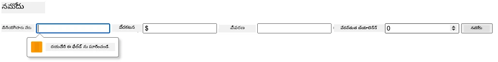

**మీరు గమనించేది:**
- బ్రౌజర్ ఒక లోకల్ వెరిఫికేషన్ సందేశాలను చూపిస్తుంది
- `:valid` మరియు `:invalid` స్థితుల ఆధారంగా స్టైలింగ్ మారుతుంది
- అన్ని వెరిఫికేషన్లు పూర్తి కాకపోతే ఫారమ్ సమర్పణ నిరోధించబడుతుంది
- ఆటోమేటిక్‌గా మొదటి చెడు ఫీల్డ్‌కి ఫోకస్ వెళుతుంది

### క్లయింట్-సైడ్ vs సర్వర్-సైడ్ వెరిఫికేషన్

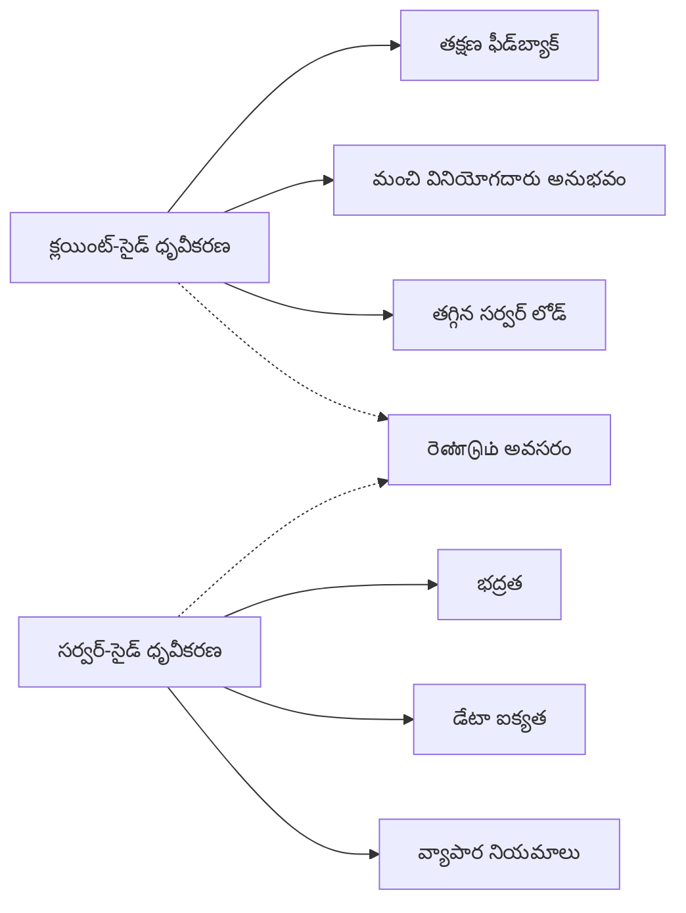
**రెండు స్థరాలు ఎందుకు అవసరం:**
- **క్లయింట్-సైడ్ వెరిఫికేషన్**: తక్షణ ఫీడ్బ్యాక్ ఇస్తుంది మరియు వినియోగదారుల అనుభవాన్ని మెరుగుపరుస్తుంది
- **సర్వర్-సైడ్ వెరిఫికేషన్**: భద్రతను నిర్ధారిస్తుంది మరియు క్లిష్టమైన వ్యాపార నియమాలను నిర్వహిస్తుంది
- **కలిపిన విధానం**: బలమైన, వినియోగదారుల అనుకూల మరియు సురక్షిత అనువర్తనాలను సృష్టిస్తుంది
- **ప్రోగ్రెసివ్ ఎन्हాన్స్‌మెంట్**: JavaScript డిసేబుల్ అయినా పని చేస్తుంది

> 🛡️ **సెక్యూరిటీ జ్ఞాపకం**: ఎప్పుడూ క్లయింట్-సైడ్ వెరిఫికేషన్ మాత్రమే నమ్మకాదరు! దురుద్దేశ్యులైనా వినియోగదారులు ఈ తనిఖీలను దాటవేయగలరు కనుక, సర్వర్-వైపు వెరిఫికేషన్ భద్రత మరియు డేటా సమగ్రతకు అవసరం.

### ⚡ **తర్వాతి 5 నిమిషాల్లో మీరు చేయగలది**
- [ ] తప్పు డేటాతో మీ ఫారంను పరీక్షించి వెరిఫికేషన్ సందేశాలు చూడండి
- [ ] JavaScript ఆపివేయబడినప్పుడు ఫారమ్ ను సబ్మిట్ చేసి HTML5 వెరిఫికేషన్ ను గమనించండి
- [ ] బ్రౌజర్ DevTools ఓపెన్ చేసి సర్వర్‌కు పంపబడుతున్న ఫారమ్ డేటా చూడండి
- [ ] మొబైల్ కీబోర్డ్ మార్పుల కోసం వేరే ఇన్‌పుట్ రకాలను ప్రయోగించండి

### 🎯 **ఈ గంటలో సాధించగలిగేది**
- [ ] పాఠం అనంతరం క్విజ్ పూర్తి చేసి ఫారమ్ హ్యాండ్లింగ్ భావనలను అర్థం చేసుకోండి
- [ ] సమగ్ర వెరిఫికేషన్ చాలెంజ్‌ను రియల్-టైమ్ ఫీడ్బ్యాక్‌తో అమలు చేయండి
- [ ] ప్రొఫెషనల్ లుక్ కలిగిన ఫారమ్‌ల కోసం CSS స్టైలింగ్ జోడించండి
- [ ] పునరావృత యూజర్నేమ్‌లు మరియు సర్వర్ లోపాల కోసం లోపాల నిర్వహణ సృష్టించండి
- [ ] సరిపోలే వేరుసార్వత్రిక పాస్వర్డ్ నిర్ధారణ ఫీల్డ్‌లు జత చేయండి

### 📅 **మీ వారాంత ఫారమ్ నైపుణ్య యాత్ర**
- [ ] అధునాతన ఫార్మ్ లక్షణాలతో పూర్తి బ్యాంకింగ్ యాప్ ను పూర్తి చేయండి
- [ ] ప్రొఫైల్ ఫోటోలు లేదా డాక్యుమెంట్ల కొరకు ఫైల్ అప్‌లోడ్ సామర్థ్యాలు కలపండి
- [ ] ప్రగతిశీల సూచికలు మరియు స్థితి నిర్వహణతో బహుళ దశల ఫారమ్‌లను అమలు చేయండి
- [ ] వినియోగదారుల ఎంపికల ఆధారంగా అనుకూలించే డైనమిక్ ఫారమ్‌లను సృష్టించండి
- [ ] మెరుగైన వినియోగదారు అనుభవం కోసం ఫార్మ్ ఆటోసేవ్ మరియు రికవరీ అమలు చేయండి
- [ ] ఇమెయిల్ ధృవీకరణ, ఫోన్ నంబర్ ఫార్మాటింగ్ వంటి అధునాతన వెరిఫికేషన్ జోడించండి

### 🌟 **మీ నెల పొడవైన ఫ్రంట్‌ఎండ్ అభివృద్ధి నైపుణ్యం**
- [ ] షరతులు మరియు వర్క్‌ఫ్లోలతో కాంప్లెక్స్ ఫారమ్ అప్లికేషన్లను నిర్మించండి
- [ ] వేగవంతమైన అభివృద్ధికి ఫారమ్ లైబ్రరీలు మరియు ఫ్రేమ్‌వర్క్‌లు నేర్చుకోండి
- [ ] యాక్సెసిబిలిటీ మార్గదర్శకాలు మరియు పరస్పర డిజైన్ సూత్రాలలో నైపుణ్యం పొందండి
- [ ] అంతర్జాతీయీకరణ మరియు స్థానికీకరణ ఆధారమైన ప్రపంచవ్యాప్తంగా ఫారమ్‌లను అమలు చేయండి
- [ ] పునర్వినియోగం అవకాశం ఉన్న ఫారమ్ కంపోనెంట్ లైబ్రరీలు మరియు డిజైన్ సిస్టమ్‌లను సృష్టించండి
- [ ] ఓపెన్ సోర్స్ ఫారమ్ ప్రాజెక్టులకు విరాళం ఇవ్వండి మరియు ఉత్తమ పద్ధతులను పంచుకోండి

## 🎯 మీ ఫారమ్ అభివృద్ధి నైపుణ్య టైమ్‌లైన్

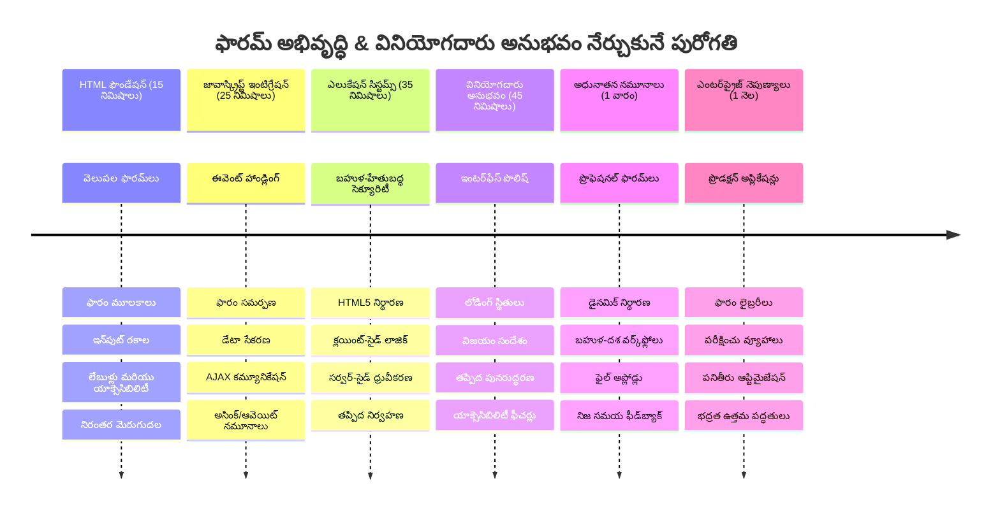
### 🛠️ మీ ఫారమ్ అభివృద్ధి పనిముట్ల సారాంశం

ఈ పాఠం పూర్తయిన తర్వాత, మీరు ఇప్పుడు నైపుణ్యం సంపాదించుకున్నారు:
- **HTML5 Forms**: సీమాంటిక్ నిర్మాణం, ఇన్‌పుట్ రకాలు, యాక్సెసిబిలిటీ ఫీచర్లు
- **JavaScript Form Handling**: ఈవెంట్ నిర్వహణ, డేటా సేకరణ, AJAX కమ్యూనికేషన్
- **వెరిఫికేషన్ ఆర్కిటెక్చర్**: భద్రత మరియు వినియోగదారు అనుభవం కోసం బహుళ-స్థర వెరిఫికేషన్
- **అసింక్రోనస్ ప్రోగ్రామ్మింగ్**: ఆధునిక fetch API మరియు async/await ప్యాటర్న్లు
- **లోపాల నిర్వహణ**: సమగ్ర లోపాల హ్యాండ్లింగ్ మరియు వినియోగదారుల ఫీడ్బ్యాక్ వ్యవస్థలు
- **వినియోగదారు అనుభవం డిజైన్**: లోడింగ్ స్థితులు, విజయ సందేశాలు, లోపాల పునరుద్ధరణ
- **ప్రోగ్రెసివ్ ఎంహాన్స్‌మెంట్**: అన్ని బ్రౌజర్‌లు మరియు సామర్థ్యాలలో పని చేసే ఫారమ్‌లు

**వాస్తవ ప్రపంచ అనువర్తనాలు**: మీ ఫారమ్ అభివృద్ధి నైపుణ్యాలు నేరుగా వర్తిస్తాయి:
- **ఈ-కామర్స్ అనువర్తనాలు**: చెకౌట్ ప్రక్రియలు, ఖాతా నమోదు, చెల్లింపు ఫారమ్‌లు
- **ఎంటర్ప్రైజ్ సాఫ్ట్‌వేర్**: డేటా ఎంట్రీ సిస్టమ్‌లు, రిపోర్టింగ్ ఇంటర్‌ఫేస్‌లు, వర్క్‌ఫ్లో అనువర్తనాలు
- **కంటెంట్ మేనేజ్‌మెంట్**: ప్రచురణ వేదికలు, వినియోగదారుల రూపొందించిన కంటెంట్, প্রশাসన ఇంటర్‌ఫేస్‌లు
- **ఆర్థిక అనువర్తనాలు**: బ్యాంకింగ్ ఇంటర్‌ఫేస్‌లు, పెట్టుబడి వేదికలు, లావాదేవీ సిస్టమ్‌లు
- **ఆరోగ్య సంరక్షణ వ్యవస్థలు**: రోగి పోర్టల్స్, అపాయింట్మెంట్ షెడ్యూలింగ్, వైద్యం రికార్డ్ ఫారమ్‌లు
- **అధ్యయన వేదికలు**: కోర్సు నమోదు, మూల్యాంకన టూల్స్, విద్య నిర్వహణ

**మీకు లభించిన ప్రొఫెషనల్ నైపుణ్యాలు**: మీరు ఇప్పుడు:
- అందరికీ (విగ్రహ సమస్యలు ఉన్నవారును సహా) పనిచేసే యాక్సెసిబుల్ ఫారమ్‌లను డిజైన్ చేయగలరు
- డేటా ధ్వంసం మరియు భద్రతా లోపాలను నివారించే సురక్షిత ఫారమ్ వెరిఫికేషన్ అమలు చేయగలరు
- స్పష్టమైన ఫీడ్బ్యాక్ మరియు మార్గదర్శకం అందించే ప్రతిస్పందన UIని సృష్టించగలరు
- బ్రౌజర్ డెవలపర్ టూల్స్ మరియు నెట్‌వర్క్ విశ్లేషణతో క్లిష్టమైన ఫారమ్ పరస్పర చర్యలను డీబగ్ చేయగలరు
- సమర్ధవంతమైన డేటా నిర్వహణ మరియు వెరిఫికేషన్ వ్యూహాల ద్వారా ఫారమ్ పనితీరును మెరుగుపరచగలరు

**ఫ్రంట్‌ఎండ్ అభివృద్ధి భావనల్లో ప్రావీణ్యం**:
- **ఈవెంట్-డ్రైవన్ ఆర్కిటెక్చర్**: వినియోగదారు అంతర్యోగ నిర్వహణ మరియు స్పందన వ్యవస్థలు
- **అసింక్రోనస్ ప్రోగ్రామ్మింగ్**: నిర్ధిక్షిప్త సర్వర్ కమ్యూనికేషన్ మరియు లోపాల నిర్వహణ
- **డేటా వెరిఫికేషన్**: క్లయింట్-సైడ్ మరియు సర్వర్-సైడ్ భద్రత మరియు సమగ్రత తనిఖీలు
- **వినియోగదారు అనుభవ డిజైన్**: విజయం వై-directed సులభమైన ఇంటర్‌ఫేస్లు
- **అక్సెసిబిలిటీ ఇంజనీరింగ్**: విభిన్న వినియోగదారుల అవసరాలకు పనిచేసే సమగ్ర డిజైన్

**తరువాతి దశ**: మీరు ఆధునిక ఫారమ్ లైబ్రరీలను అన్వేషించడానికి, క్లిష్ట వెరిఫికేషన్ నియమాలను అమలు చేయడానికి లేదా ఎంటర్ప్రైజ్-గ్రేడ్ డేటా సేకరణ సిస్టమ్‌లను నిర్మించడానికి సిద్ధంగా ఉన్నారు!

🌟 **అభివృద్ధి పూర్తి**: మీరు ప్రొఫెషనల్ వెరిఫికేషన్, లోపాల నిర్వహణ మరియు వినియోగదారుని అనుభవ నమూనాలతో పూర్తి ఫారమ్ హ్యాండ్లింగ్ సిస్టమ్‌ను నిర్మించారు!

---


---

## GitHub Copilot Agent Challenge 🚀

Use the Agent mode to complete the following challenge:

**Description:** Enhance the registration form with comprehensive client-side validation and user feedback. This challenge will help you practice form validation, error handling, and improving user experience with interactive feedback.
**ప్రాంప్ట్:** నమోదు ఫారమ్ కోసం సర్వసంపూర్ణ ఫారమ్ ధ్రువీకరణ వ్యవస్థను సృష్టించండి, ఇందులో ఉంటాయి: 1) యూజర్ టైప్ చేస్తున్నప్పుడు ప్రతి ఫీల్డ్ కోసం రియల్-టైమ్ ధ్రువీకరణ ఫీడ్‌బ్యాక్, 2) ప్రతి ఇన్పుట్ ఫీల్డ్ క్రింద కనిపించే కస్టమ్ ధ్రువీకరణ సందేశాలు, 3) సక్స్మతి ధృవీకరణ ఫీల్డ్‌తో కూడిన పాస్‌వర్డ్ ధ్రువీకరణ, 4) దృఢంగా ఉన్న ఫీల్డ్స్ కోసం ఆకుపచ్చ చెక్మార్కులు మరియు సరియైనవ olmayanవలపై ఎరుపు హెచ్చరికల వంటి దృష్టిగల సూచికలు, 5) అన్ని ధ్రువీకరణలు పూర్తి అయినప్పుడు మాత్రమే ఎనేబుల్ అయ్యే సమర్పణ బటన్. HTML5 ధ్రువీకరణ లక్షణాలు, ధ్రువీకరణ अवस्थలకు CSS శైలీకరణ, మరియు ఇంటరాక్టివ్ ప్రవర్తన కోసం JavaScript ఉపయోగించండి.

ఇక్కడ [agent mode](https://code.visualstudio.com/blogs/2025/02/24/introducing-copilot-agent-mode) గురించి మరింత తెలుసుకోండి.

## 🚀 సవాలు

వాడుకరి ఇప్పటికే ఉందని HTML లో ఒక లోపం సందేశాన్ని చూపించండి.

CSS శైలీకరణ తరువాత తుది లాగిన్ పేజీ ఇలా కనిపించవచ్చు:

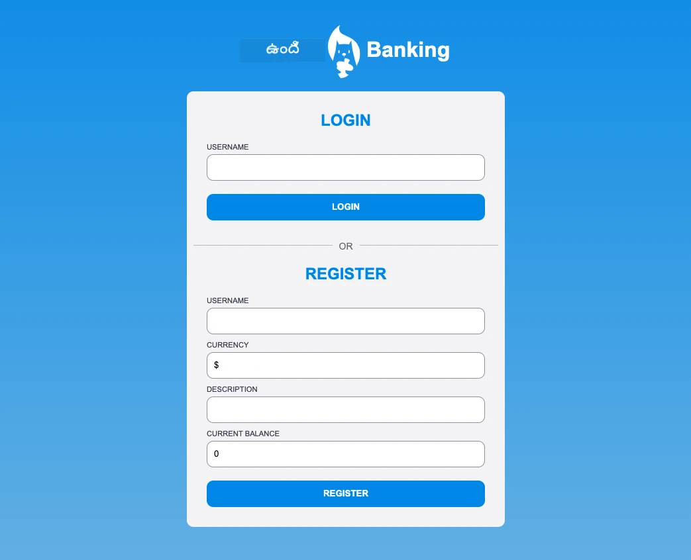

## పాఠం తర్వాత క్విజ్

[పాఠం తర్వాత క్విజ్](https://ff-quizzes.netlify.app/web/quiz/44)

## సమీక్ష & స్వీయ అధ్యయనం

డెవలపర్లు వారి ఫారమ్ నిర్మాణ ప్రయత్నాలలో చాలా సృజనాత్మకులు అయ్యారు, ముఖ్యంగా ధ్రువీకరణ వ్యూహాల విషయంలో. వివిధ ఫారమ్ ప్రవాహాలను తెలుసుకోవడానికి [CodePen](https://codepen.com) ను పరిశీలించి, ఆసక్తికరమైన మరియు ప్రేరణాత్మక ఫారమ్‌లను కనుగొనగలరా?

## అసైన్‌మెంట్

[మీ బ్యాంక్ యాప్‌ను శైలీకరించండి](assignment.md)

---

<!-- CO-OP TRANSLATOR DISCLAIMER START -->
**అస్పష్టం**:
ఈ డాక్యుమెంట్ AI అనువాద సేవ అయిన [Co-op Translator](https://github.com/Azure/co-op-translator) ఉపయోగించి అనువదించబడింది. మేము ఖచ్చితత్వం కోసం ప్రయత్నిస్తున్నప్పటికీ, ఆటోమేటెడ్ అనువాదాల్లో తప్పులు లేదా పొరపాట్లు ఉండవచ్చని దయచేసి గమనించండి. అసలు డాక్యుమెంట్ దాని స్థానిక భాషలో అధికారిక మూలంగా పరిగణించాలి. ముఖ్యమైన సమాచారం కోసం, ప్రొఫెషనల్ మానవ అనువాదం సిఫారసు చేయబడుతుంది. ఈ అనువాదం వలన ఏర్పడిన ఏవైనా అవగాహన లోపాలు లేదా తప్పుగా అర్థం చేసుకోవడంతో మేము బాధ్యులేమి కాదు.
<!-- CO-OP TRANSLATOR DISCLAIMER END -->