<!--
CO_OP_TRANSLATOR_METADATA:
{
  "original_hash": "86ee5069f27ea3151389d8687c95fac9",
  "translation_date": "2026-01-08T17:14:25+00:00",
  "source_file": "7-bank-project/3-data/README.md",
  "language_code": "te"
}
-->
# బ్యాంకింగ్ యాప్ భాగం 3: డేటా తీసుకునే మరియు ఉపయోగించే విధానాలు

స్టార్ ట్రెక్‌లో ఎంటర్‌ప్రైజ్ కంప్యూటర్ గురించి ఆలోచించండి - కెప్టెన్ పికార్డ్ నౌక స్థితిని అడిగినపుడు, మొత్తం ఇంటర్‌ఫేస్ ఆగిపోదు, మళ్లీ తిరిగి నిర్మించబడకుండా సమాచారం వెంటనే కనిపిస్తుంది. సమాచార సమర్థవంతమైన ప్రవాహం మనం ఇక్కడ డైనమిక్ డేటా ఫెచింగ్‌తో నిర్మిస్తున్నదే.

ప్రస్తుతం, మీ బ్యాంకింగ్ యాప్ ఒక ముద్రిత వార్తాపత్రిక లాంటిది - సమాచారంతో కూడుకున్నది కానీ స్థిరమైనది. మనం దీన్ని NASA మిషన్ కంట్రోల్ లాంటి దానిగా మార్చబోతున్నాము, అక్కడ డేటా నిరంతరం ప్రవహిస్తూ నేటివేళికిలో యూజర్ వర్క్‌ఫ్లోను విరామించకుండా నవీకరించబడుతుంది.

మీరు ఎలా సర్వర్లతో అసంక్రోనస్‌గా కమ్యూనికేట్ చేయాలో, వివిధ సమయాల్లో వచ్చే డేటాను ఎలా హ్యాండిల్ చేయాలో, మరియు నడుము సమాచారాన్ని మీ యూజర్ల కోసం అర్ధవంతంగా ఎలా మార్చాలో నేర్చుకుంటారు. ఇది డెమో మరియు ప్రొడక్షన్-రెడీ సాఫ్ట్‌వేర్ మధ్య తేడా.

## ⚡ వచ్చే 5 నిమిషాల్లో మీరు చేయగలిగేది

**బిజీ డెవలపర్ల కోసం క్విక్ స్టార్ట్ మార్గం**

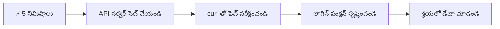
- **నిమిషం 1-2**: మీ API సర్వర్ ప్రారంభించండి (`cd api && npm start`) మరియు కనెక్షన్‌ను పరీక్షించండి
- **నిమిషం 3**: fetch ఉపయోగించి ఒక ప్రాథమిక `getAccount()` ఫంక్షన్ రూపొందించండి
- **నిమిషం 4**: `action="javascript:login()"` తో లాగిన్ ఫారం వైర్ చేయండి
- **నిమిషం 5**: లాగిన్‌ను పరీక్షించి కన్సోల్‌లో ఖాతా డేటాను చూడండి

**త్వరిత పరీక్ష ఆదేశాలు**:
```bash
# API నడుస్తోందని నిర్ధారించండి
curl http://localhost:5000/api

# ఖాతా డేటా తీసుకోవడం పరీక్షించండి
curl http://localhost:5000/api/accounts/test
```

**ఇది ఎందుకు ముఖ్యమైనది**: 5 నిమిషాల్లో మీరు ప్రతి ఆధునిక వెబ్ యాప్‌ను శక్తివంతం చేసే అసంక్రోనస్ డేటా ఫెчింగ్ మాయాజాలాన్ని చూడగలుగుతారు. ఇది యాప్స్ ప్రతిస్పందనશీలంగా, జీవंतంగా అనిపించే ప్రాతిపదిక.

## 🗺️ డేటా ఆధారిత వెబ్ అప్లికేషన్లలో మీ అభ్యాస ప్రయాణం

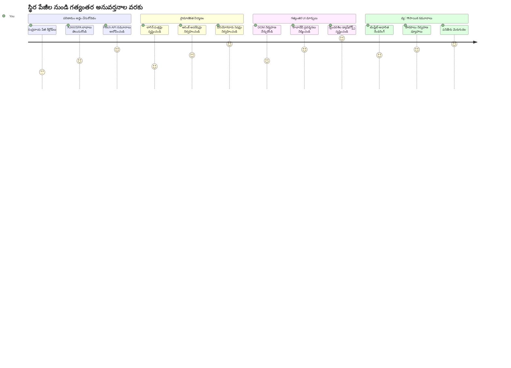
**మీ ప్రయాణ గమ్యం**: ఈ పాఠం చివరికి, ఆధునిక వెబ్ అప్లికేషన్లు ఎలా డేటాను తీసుకుని, ప్రాసెస్ చేసి, డైనమిక్‌గా ప్రదర్శిస్తాయో మీరు అర్థం చేసుకుంటారు. ఇది ప్రొఫెషనల్ అప్లికేషన్ల నుండి ఆశించే నిరంతర వినియోగదారునికి అనుభవాలను సృష్టిస్తుంది.

## పాఠం ముందు క్విజ్

[పాఠం ముందు క్విజ్](https://ff-quizzes.netlify.app/web/quiz/45)

### ముందు అవసరాలు

డేటా తీసుకోవడం మొదలుపెట్టేముందు, ఈ భాగాలు సిద్ధంగా ఉన్నాయని ధృవీకరించండి:

- **మునుపటి పాఠం**: [లాగిన్ మరియు రిజిస్ట్రేషన్ ఫారం](../2-forms/README.md) పూర్తి చేయండి – దీనిపై మనం నిర్మించబోతున్నాము
- **లోకల్ సర్వర్**: [Node.js](https://nodejs.org) ని ఇంస్టాల్ చేసి API సర్వర్‌ను నడిపించండి ([run the server API](../api/README.md))
- **API కనెక్షన్**: ఈ ఆదేశంతో మీ సర్వర్ కనెక్షన్‌ను పరీక్షించండి:

```bash
curl http://localhost:5000/api
# అనుమానిత ప్రతిస్పందన: "బ్యాంక్ API v1.0.0"
```

ఈ త్వరిత పరీక్ష అన్ని భాగాలు సక్రమంగా కమ్యూనికేట్ అవుతుందో లేదో నిర్ధారిస్తుంది:
- Node.js మీ సిస్టమ్‌లో సక్రమంగా నడుస్తోందని ధృవీకరించడం
- మీ API సర్వర్ సജീവంగా ఉందని నిర్ధారణ
- మీ యాప్ సర్వర్‌తో చేరగలుగుతున్నదని ధృవీకరించడం (దేనియొక్కకు మిషన్ ముందు రేడియో సంభాషణను తనిఖీ చేయడం లాంటిది)

## 🧠 డేటా నిర్వహణ ఈకోసిస్టమ్ సమీక్ష

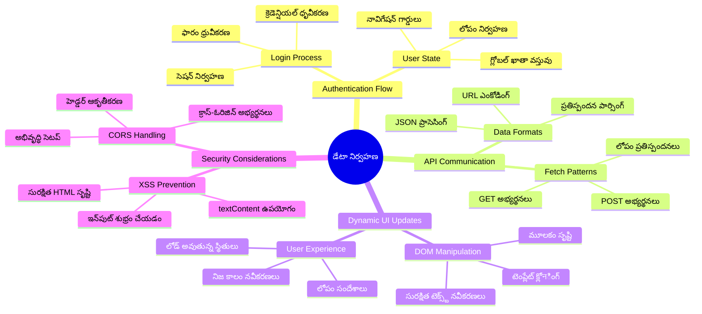
**మూల సూత్రం**: ఆధునిక వెబ్ అప్లికేషన్లు డేటా ఆర్కెస్ట్రేషన్ సిస్టమ్స్ - అవి యూజర్ ఇంటర్‌ఫేస్లు, సర్వర్ APIలు, బ్రౌజర్ సెక్యూరిటీ మోడల్స్ మధ్య సమన్వయం చేస్తూ నిరంతర, ప్రతిస్పందనశీల అనుభవాలను సృష్టిస్తాయి.

---

## ఆధునిక వెబ్ యాప్స్‌లో డేటా తీసుకోవడం అర్థం చేసుకోవడం

వెబ్ అప్లికేషన్లు డేటాను ఉపయోగించే విధానం గత 20 సంవత్సరాల్లో ఘనంగా మారింది. ఈ పరిణామాన్ని అర్థం చేసుకోవడం ద్వారా, AJAX మరియు Fetch APIల వంటి ఆధునిక సాంకేతికతలు ఎంత శక్తివంతమైనవో, మరియు ఎందుకు అవి వెబ్ డెవలపర్లకు అవసరమైయ్యాయో మీరు తెలుసుకుంటారు.

పారంపరిక వెబ్‌సైట్లు ఎలా పనిచేశాయో, మనం ఇప్పుడు ఎలా డైనమిక్, ప్రతిస్పందించే అప్లికేషన్లు తయారుచేస్తున్నామో పరిశీలిద్దాం.

### సాంప్రదాయక బహుళ పేజీ అప్లికేషన్లు (MPA)

వెబ్ ప్రారంభ దశల్లో, ప్రతి క్లిక్ ఒక పాత టెలివిజన్ ఛానల్ మార్చినట్లుండేది – స్క్రీన్ ఖాళీ అయి, కొత్త కంటెంట్ నెమ్మదిగా లోడ్ అవుతుండేది. ఇది ప్రారంభ వెబ్ అప్లికేషన్ల వాస్తవం, అక్కడ ప్రతి ఇంటరాక్షన్ అనగా మొత్తం పేజీని మొదలుకుని మళ్లీ నిర్మించాలి.

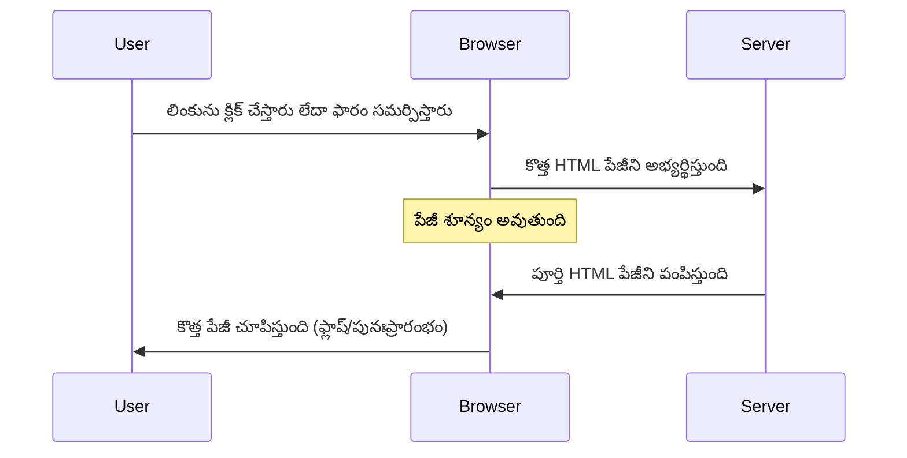
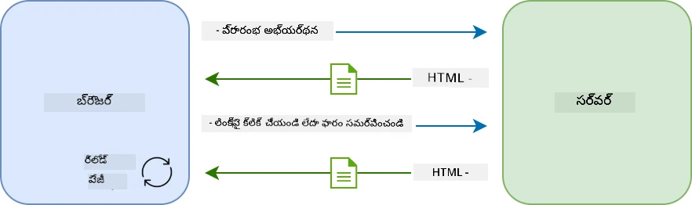

**ఈ విధానం ఎందుకు స్తంభించేంది:**
- ప్రతి క్లిక్ అంటే పూర్తిగా పేజీని తిరిగి నిర్మించటం
- యూజర్లు ఆలోచన మధ్యలో ఆపివేయబడటంతో ఉండటపు సమస్యలు
- ఒకే హెడ్డర్, ఫుటర్ మళ్లీ మళ్లీ డౌన్లోడ్ చేయడం వల్ల ఇంటర్నెట్ కనెక్షన్ పై భారము
- యాప్స్ సాఫ్ట్‌వేర్ కాకుండా ఫైలింగ్ కేబినెట్‌లో క్లిక్ చేస్తున్నట్లు అనిపించడం

### ఆధునిక సింగిల్ పేజ్ అప్లికేషన్లు (SPA)

AJAX (Asynchronous JavaScript and XML) ఈ పద్ధతిని పూర్తిగా మార్చింది. అంతర్జాతీయ అంతరిక్ష స్టేషన్ యొక్క మాడ్యులర్ డిజైన్ లాంటి, ఇక్కడ వ్యోమగాములు ప్రత్యేక భాగాలను మార్చగలరు, పూర్తీ నిర్మాణాన్ని క్లీన్ చేయకుండా, AJAX ఈ విధంగా పేజీని reload చేయకుండా కొన్ని భాగాలను మాత్రమే నవీకరించ permits చేస్తుంది. XML అని పేరు ఉన్నప్పటికీ, నేడు JSON ఎక్కువగా వాడుతుంటాం, కాని మూల సూత్రం ఇదే: అవసరమయ్యే భాగాలు మాత్రమే నవీకరించండి.

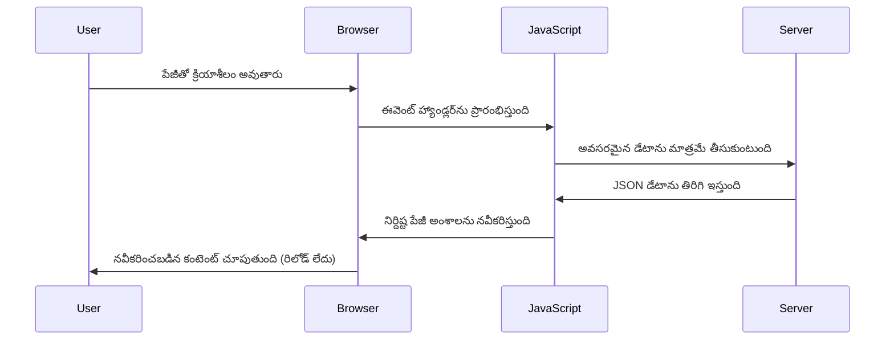
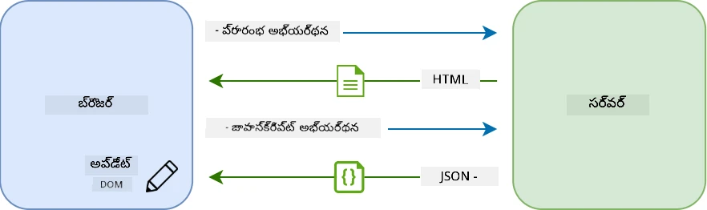

**SPAs ఎందుకు చాలా మెరుగ్గా అనిపిస్తాయో:**
- మార్చిన భాగాలే నవీకరించబడతాయి (సంSMARTగా!)
- యూజర్లు వారి ప్రవాహంలో విఫలమవరు
- తక్కువ డేటా ప్రయాణించే కారణంగా వేగంగా లోడ్ అవుతాయి
- ఫోన్లలో ఉన్న యాప్స్ లాంటి నిమిషాల అనుభూతి

### ఆధునిక Fetch API కు పరిణామం

ఆధునిక బ్రౌజర్లు [`Fetch` API](https://developer.mozilla.org/docs/Web/API/Fetch_API) అందిస్తాయి, ఇది పురాతన [`XMLHttpRequest`](https://developer.mozilla.org/docs/Web/API/XMLHttpRequest/Using_XMLHttpRequest) ను మార్చింది. టెలిగ్రాఫ్ నడిపించడం మరియు ఇమెయిల్ వాడడం మధ్య తేడాగా, Fetch API promises ఉపయోగించి శుభ్రంగా అసంక్రోనస్ కోడ్ రాయటం సులభం చేస్తుంది మరియు JSON సహజంగా హ్యాండిల్ చేస్తుంది.

| లక్షణం | XMLHttpRequest | Fetch API |
|---------|----------------|----------|
| **సింటాక్స్** | క్లిష్టమైన కాల్‌బ్యాక్ ఆధారిత | శుభ్రమైన promise-ఆధారిత |
| **JSON నిర్వహణ** | మాన్యువల్ పార్సింగ్ అవసరం | అంతర్నిర్మిత `.json()` మెథడ్ |
| **పరువు నిర్వహణ** | పరిమిత తప్పు సమాచారం | విపులమైన తప్పుల వివరాలు |
| **ఆధునిక మద్దతు** | లెగసీ కంపాటిబిలిటీ | ES6+ promises మరియు async/await |

> 💡 **బ్రౌజర్ కంపాటిబిలిటీ**: మంచి వార్త - Fetch API అన్ని ఆధునిక బ్రౌజర్లలో పని చేస్తుంది! ప్రత్యేక వెర్షన్ల గురించి ఆసక్తి ఉంటే, [caniuse.com](https://caniuse.com/fetch) లో పూర్తి సమాచారం ఉంది.
> 
**ముఖ్యాంశం:**
- Chrome, Firefox, Safari, మరియు Edge లో చక్కగా పనిచేస్తుంది (మీ యూజర్లు ఉన్న ప్రదాన బ్రౌజర్లు)
- కేవలం Internet Explorerకు అదనపు సహాయం అవసరం (ఇప్పుడే IEను మోసివేయబోతున్నాం)
- మనం తరువాత ఉపయోగించే async/await శైలులకు ఇది సరైన ప్రాథమికం

### యూజర్ లాగిన్ మరియు డేటా రిట్రీవల్ అమలుచేసుకోవడం

ఇప్పుడు మీ బ్యాంకింగ్ యాప్‌ను స్థిర డిస్ప్లేకి కాకుండా ఒక కార్య తాత్విక యాప్‌గా మార్చే లాగిన్ వ్యవస్థను అమలు చేద్దాం. సురక్షిత సైనిక సౌకర్యాలలో ఉపయోగించే ధృవీకరణ విధానాల లాగా, మనం యూజర్ వివరాలను ధృవీకరిస్తాము మరియు వారి ప్రత్యేక డేటాకు ప్రాప్యత ఇస్తాము.

ఇది ప్రాథమిక ధృవీకరణతో ప్రారంభించి, ఆపై డేటా తీసుకునే సామర్ధ్యంతో దశలవారీగా నిర్మించబోతున్నాము.

#### దశ 1: లాగిన్ ఫంక్షన్ పునాదులు సృష్టించడం

మీ `app.js` ఫైల్ తెరచి కొత్త `login` ఫంక్షన్ చేర్చండి. ఇది యూజర్ ధృవీకరణ ప్రక్రియను నిర్వహిస్తుంది:

```javascript
async function login() {
  const loginForm = document.getElementById('loginForm');
  const user = loginForm.user.value;
}
```

**ఇది ఎలా పనిచేస్తుంది:**
- ఆ `async` పదం JavaScriptకు "ఈ ఫంక్షన్ దేవ్ వేటింగ్ అవసరమవచ్చు" అని చెపుతుంది
- పేజీ నుండి ఫారమ్‌ను పొందుతాము (ఇది ID ద్వారా సులభంగా)
- యూజర్ టైప్ చేసిన యూజర్నేమ్‌ను తీసుకుంటాము
- ఒక చక్కటి ట్రిక్: మీరు ఫారం ఇన్‌పుట్‌ని దాని `name` అట్రిబ్యూట్ ద్వారా యాక్సెస్ చేయవచ్చు - getElementById లాంటిది కాకుండా!

> 💡 **ఫారం యాక్సెస్ పద్ధతి**: ప్రతి ఫారం నియంత్రణాని దాని HTMLలోని `name` అట్రిబ్యూట్ ఉపయోగించి ఫాంపై ద్వారా ప్రాపర్టీగా యాక్సెస్ చేయవచ్చు. ఇది శుభ్రమైన మరియు చదవగలిగిన పద్ధతి.

#### దశ 2: ఖాతా డేటా ఫెచింగ్ ఫంక్షన్ సృష్టించడం

తర్వాత, సర్వర్ నుండి ఖాతా డేటాను తీసుకునే ప్రత్యేక ఫంక్షన్‌ని సృష్టిద్దాం. ఇది మీ రిజిస్ట్రేషన్ ఫంక్షన్‌తో సమానంగా డేటా తీసుకోవడం పై దృష్టి పెట్టింది:

```javascript
async function getAccount(user) {
  try {
    const response = await fetch('//localhost:5000/api/accounts/' + encodeURIComponent(user));
    return await response.json();
  } catch (error) {
    return { error: error.message || 'Unknown error' };
  }
}
```

**ఈ కోడ్ ఇది చేస్తుంది:**
- ఆధునిక `fetch` APIతో డేటాను అసంక్రోనస్ గా అభ్యర్థిస్తుంది
- `username` పారామీటర్‌తో GET రిక్వెస్ట్ URL ను రూపొందిస్తుంది
- URLలలో ప్రత్యేక అక్షరాలను సురక్షితంగా నిర్వహించడానికి `encodeURIComponent()` ఉపయోగిస్తుంది
- ప్రతిస్పందనను JSON గా మార్చుతుంది, డేటా పద్ధతి సులభం చెయ్యడానికి
- పొరపాట్లను మనోహరంగా (crash కాకుండా) error objectతో హ్యాండిల్ చేస్తుంది

> ⚠️ **భద్రతా సూత్రం**: `encodeURIComponent()` ఫంక్షన్ URL ప్రత్యేక అక్షరాలను సురక్షితంగా నిర్వహిస్తుంది. నావల్ కమ్యూనికేషన్‌లో ఉండే కోడింగ్ విధానాల లాగానే, ఇది మీ సందేశం సరిగ్గా సరిపోయేలా చూసుకుంటుంది, "#" లేదా "&" లాంటి అక్షరాలు తప్పుగా అర్థం కాకుండా అరికడుతుంది.
> 
**ఇది ఎందుకు ముఖ్యం:**
- ప్రత్యేక అక్షరాల వల్ల URL బ్రేక్ కాకుండా
- URL మాన్‌ల్యుపులేషన్ దాడుల నుండి రక్షణ
- సర్వర్‌కి అవసరమైన డేటా అందడం
- భద్రతా విధానాల ఆచరణ

#### HTTP GET అభ్యర్థనలను అర్థం చేసుకోవడం

`fetch`ని అదనపు ఆప్షన్లు లేకుండా వాడితే, ఇది ఆటోమేటిక్ గా ఒక [`GET`](https://developer.mozilla.org/docs/Web/HTTP/Methods/GET) అభ్యర్థనను సృష్టిస్తుంది. ఇది మనం చేస్తున్నది కోసం సరైనది – సర్వర్‌కి "దయచేసి ఈ యూజర్ ఖాతా డేటాను చూపించండి" అని అడగటం.

GET అభ్యర్థనలను లైబ్రరీ నుండి పుస్తకం తీసుకువచ్చే విధానం లాగా భావించండి – మీరు ఇప్పటికే ఉన్న ప్రాపర్టీని చూడమని అడుగుతున్నట్లే. POST అభ్యర్థనలు (మనం రిజిస్ట్రేషన్ కోసం వాడినవి) కొత్త పుస్తకాన్ని లైబ్రరీకి జతచేయడానికి సమానంగా ఉంటాయి.

| GET అభ్యర్థన | POST అభ్యర్థన |
|-------------|-------------|
| **హోదా** | ఉన్న డేటాను రీట్రీవ్ చేయడం | కొత్త డేటాను సర్వర్‌కు పంపడం |
| **పారామీటర్లు** | URL పాథ్/క్వెరీ స్ట్రింగ్ లో | అభ్యర్థన శరీరంలో |
| **క్యాచింగ్** | బ్రౌజర్లు క్యాచే చేయవచ్చు | సాధారణంగా క్యాచే అవ్వదు |
| **సెక్యూరిటీ** | URL/లాగ్స్ లో కనిపిస్తుంది | అభ్యర్థన శరీరంలో దాగు ఉంటుంది |

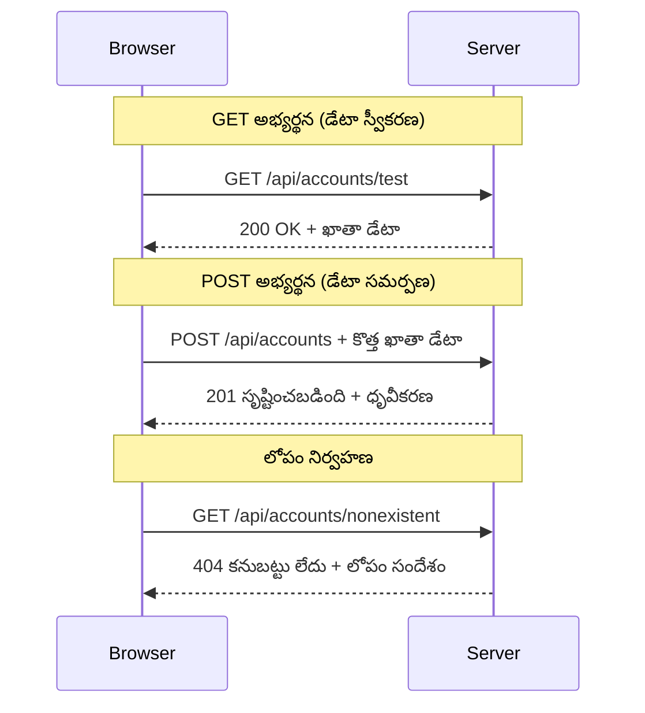
#### దశ 3: మొత్తం కలిపి అమలు చేయడం

ఇప్పుడు ఆనందకరమైన ప్రదేశం - మీ ఖాతా తీసుకునే ఫంక్షన్‌ను లాగిన్ ప్రక్రియతో లింక్ చేద్దాం. ఇక్కడ ప్రతిదీ సరిగ్గా సరిపోతుంది:

```javascript
async function login() {
  const loginForm = document.getElementById('loginForm');
  const user = loginForm.user.value;
  const data = await getAccount(user);

  if (data.error) {
    return console.log('loginError', data.error);
  }

  account = data;
  navigate('/dashboard');
}
```

ఈ ఫంక్షన్ సులభమైన క్రమాన్ని అనుసరిస్తుంది:
- ఫారం ఇన్‌పుట్ నుంచి యూజర్నేమ్ తీసుకోవడం
- సర్వర్ నుంచి యూజర్ ఖాతా డేటాను అభ్యర్థించడం
- దశలో వస్తే పొరపాట్లను నిర్వహించడం
- సక్సెస్ అయితే ఖాతా డేటాను నిల్వ చేసి డాష్‌బోర్డ్‌కు మారడం

> 🎯 **Async/Await శైలి**: `getAccount` ఒక అసంక్రోనస్ ఫంక్షన్ కావడం వల్ల, మనం `await` పదాన్ని వాడి సర్వర్ స్పందన కోసం వేచుచూస్తాం. ఇది తప్పనిసరిగా నిర్వచించని డేటాతో కోడ్ కొనసాగకుండా చేస్తుంది.

#### దశ 4: డేటా నిల్వలో స్థలం సృష్టించడం

మీ యాప్ ఒకసారి డేటాను తీసుకున్న తర్వాత దీనిని జ్ఞాపకంగా ఉంచాలి. ఇది యాప్ యొక్క క్షుణ్ణ స్మృతి లాంటిది – ప్రస్తుత యూజర్ డేటాను యాప్ ఎక్కడైన సులభంగా యాక్సెస్ చేయ గలగడం. `app.js` ఫైల్ యొక్క ప్రారంభంలో ఈ లైన్ జోడించండి:

```javascript
// ఇది ప్రస్తుత వినియోగదారుని ఖాతా సమాచారం నిల్వ చేస్తుంది
let account = null;
```

**దీని అవసరం:**
- ఖాతా డేటాను యాప్ ఏ భాగం నుండైనా యాక్సెస్ చేయడానికీ ఉంచుతుంది
- `null`తో మొదలవడం అంటే "ఎవరూ లాగిన్ కాలేదు"
- ఎవరు విజయం సంపాదిస్తే వారి డేటాను అప్డేట్ చేస్తుంది
- ఒక ఏకైక నిజసూచన వనరుగా ఉంటుంది – ఎవరు లాగిన్ అయ్యారో స్పష్టంగా అర్థం కావడం

#### దశ 5: మీ ఫారమ్ లింక్ చేయడం

ఇప్పుడు మీ కొత్త లాగిన్ ఫంక్షన్‌ను HTML ఫారమ్‌తో కనెక్ట్ చేద్దాం. ఫారమ్ ట్యాగ్ ఈ విధంగా నవీకరించండి:

```html
<form id="loginForm" action="javascript:login()">
  <!-- Your existing form inputs -->
</form>
```

**ఈ చిన్న మార్పు ఏమి చేస్తుందో:**
- ఫారం తన డిఫాల్ట్ మొత్తం పేజీ రీలోడ్ అవ్వుటను ఆపుతుంది
- మీ కస్టమ్ JavaScript ఫంక్షన్‌ను పిలుస్తుంది
- జీవంతమైన సింగిల్ పేజ్ యాప్ అనుభవాన్ని కలిగిస్తుంది
- యూజర్లు "లాగిన్" నొక్కినప్పుడు పూర్తి నియంత్రణ మీ చేతుల్లో ఉంటుంది

#### దశ 6: రిజిస్ట్రేషన్ ఫంక్షన్ మెరుగు పరచటం

సమగ్రత కోసం, మీరు `register` ఫంక్షన్‌ను కూడా అప్డేట్ చేసి ఖాతా డేటాను నిల్వ చేసేలా, డాష్‌బోర్డ్‌కు మారేలా చేయండి:

```javascript
// మీ register ఫంక్షన్ చివరకి ఈ లైన్స్ జతచేయండి
account = result;
navigate('/dashboard');
```

**ఈ మెరుగుదల అందించే విలువ:**
- రిజిస్ట్రేషన్ తర్వాత డాష్‌బోర్డ్‌కు సజావుగా మారడం
- లాగిన్ మరియు రిజిస్ట్రేషన్ మధ్య అనుసంధానం కలిగి ఉండటం
- విజయవంతమైన రిజిస్ట్రేషన్ వెంటనే ఖాతా డేటా యాక్సెస్

#### మీ అమలును పరీక్షించడం

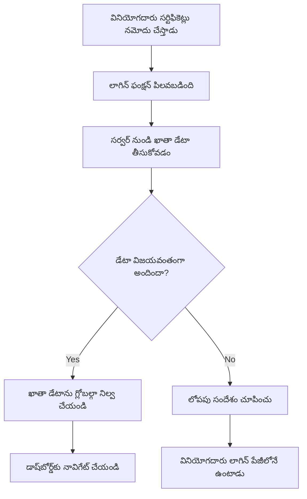
**పరీక్షించుకోవడానికి:**
1. కొత్త ఖాతా క్రియేట్ చేసి అంతా పనిచేస్తుందా చూడండి
2. ఆ క్రెడెన్షియల్స్ తో లాగిన్ ప్రయత్నించండి
3. బ్రౌజర్ కన్సోల్ (F12)లో ఏదైనా సమస్య ఉందా తనిఖీ చేయండి
4. విజయవంతం అయితే డాష్‌బోర్డ్‌కి వెళ్లడం నిర్ధారించండి

ఏదైనా పని చేయకపోతే, ఆందోళన చెందకండి! ఎక్కువ సమస్యలు టైపోస్ లేదా API సర్వర్ ప్రారంభించకపోవడం వంటి సులభమైనవి.

#### క్రాస్-ఓరిజిన్ మంత్రం గురించి చిన్న మాట

మీరు ఆశ్చర్యపోవచ్చు: "ఇది ఎలా నా వెబ్ యాప్ మరియు API సర్వర్ వేరువేరు పోర్టుల్లో ఉండి కూడా మాట్లాడుతాయనిపించింది?" బాగా ప్రశ్న! ఇది ప్రతి వెబ్ డెవలపర్ ఎదుర్కొనే అంశం.

> 🔒 **క్రాస్-ఓరిజిన్ భద్రత**: బ్రౌజర్లు "అనే-ఓరిజిన్ పాలసీ"ని అమలు చేస్తాయి, అది అనధికారిక కమ్యూనికేషన్‌ని అరికడుతుంది. పెంటగాన్ వైపు చెక్‌పాయింట్ లాంటిది, కమ్యూనికేషన్‌కు అనుమతి ఉండాలి అని నిర్ధారిస్తాయి.
> 
**మన సెటప్‌లో:**
- మీ వెబ్ యాప్ `localhost:3000` (డెవలప్మెంట్ సర్వర్)లో నడుస్తుంది
- API సర్వర్ `localhost:5000` (బ్యాక్‌ఎండ్ సర్వర్) లో ఉంటుంది
- API సర్వర్ [CORS హెడర్ల](https://developer.mozilla.org/docs/Web/HTTP/CORS)తో మీ వెబ్ యాప్ నుండి కమ్యూనికేషన్‌కు స్పష్టంగా అనుమతి ఇస్తుంది

ఇది వాస్తవ ప్రపంచ అభివృద్ధిలో సాధారణం – ఫ్రంట్‌ఎండ్ మరియు బ్యాక్‌ఎండ్ అప్లికేషన్లు సాధారణంగా వేరే సర్వర్‌లపై నడుస్తాయి.

> 📚 **ఇంకా తెలుసుకోండి**: APIs మరియు డేటా ఫెచింగ్ పై మరింత లోతుగా తెలుసుకోవడానికి ఈ పూర్తి [Microsoft Learn మాడ్యూల్](https://docs.microsoft.com/learn/modules/use-apis-discover-museum-art/?WT.mc_id=academic-77807-sagibbon) చూడండి.

## మీ డేటాను HTMLలో జీవంతంగా చూపించడం

ఇప్పుడు మనం తీసుకున్న డేటాను వినియోగదారులకు DOM మానిప్యులేషన్ ద్వారా కనిపించేలా చేస్తాము. డార్క్‌రూమ్‌లో ఫోటోల అభివృద్ధి లాగానే, కనిపించని డేటాను చూసేలా, ఇంటర్‌ఫేస్ తో వినియోగదారులను అనుసంధానం చేసేలా తీర్చిదిద్దుతున్నాము.
DOM మానిప్యులేషన్ అనేది స్థిరమైన వెబ్ పేజీలను డైనమిక్ అప్లికేషన్లుగా మార్చే సాంకేతికత, ఇది వినియోగదారుల పరస్పర చర్యలు మరియు సర్వర్ స్పందనల ఆధారంగా వారి కంటెంట్‌ను నవీకరిస్తుంది.

### పని కోసం సరైన సాధనాన్ని ఎంచుకోవడం

మీ HTML ను JavaScript తో నవీకరించడంలో, మీ వద్ద అనేక ఎంపికలున్నాయి. ఇవి టూల్ బాక్స్‌లోని విభిన్న ఉపకరణాలంటి భావించండి - ప్రతి ఒకటి నిర్దిష్ట పనులకు పరిపూర్ణంగా ఉంటుంది:

| విధానం | ఇది ఏమి బాగుంటుంది | ఎప్పుడు ఉపయోగించాలి | భద్రత స్థాయి |
|--------|---------------------|----------------|--------------|
| `textContent` | వినియోగదారు డేటాని సురక్షితంగా ప్రదర్శించడం | మీరు ఎప్పుడైనా టెక్స్ట్ చూపించేటప్పుడు | ✅ బలమైన భద్రత |
| `createElement()` + `append()` | సంక్లిష్ట ఆలౌట్లు నిర్మించడం | కొత్త విభాగాలు/జాబితాలు సృష్టించేటప్పుడు | ✅ ఘనమైన భద్రత |
| `innerHTML` | HTML కంటెంట్ సెట్ చేయటం | ⚠️ దీనిని సాధ్యమైన మేరకు ఉపయోగించవద్దు | ❌ ప్రమాదకరమైన వ్యాపారం |

#### టెక్స్ట్ సురక్షితంగా చూపించడానికి textContent

[`textContent`](https://developer.mozilla.org/docs/Web/API/Node/textContent) ప్రాపర్టీ వినియోగదారు డేటాను ప్రదర్శించే సమయంలో మీ మంచి స్నేహితుడిలా ఉంటుంది. ఇది మీ వెబ్ పేజీకి బౌన్సర్ లాగా ఉంటుంది - ఏ హానికరమైనది వేయజేయదు:

```javascript
// టెక్స్ట్‌ను నవీకరించడానికి రక్షితమైన, నమ్మకమైన విధానం
const balanceElement = document.getElementById('balance');
balanceElement.textContent = account.balance;
```

**textContent వాడకం లాభాలు:**
- అన్నింటినీ సాధారణ టెక్స్ట్‌గా పరిగణిస్తుంది (స్క్రిప్ట్ అమలు ఉండదు)
- ఇప్పటికే ఉన్న కంటెంట్‌ను ఆటోమేటిగ్గా క్లియర్ చేస్తుంది
- సరళమైన టెక్స్ట్ నవీకరణలకు సమర్థవంతం
- దుష్టమైన కంటెంట్ నుండి సహజ భద్రతని అందిస్తుంది

#### డైనమిక్ HTML ఎలిమెంట్లు సృష్టించడం

మరింత సంక్లిష్టమైన కంటెంట్ కోసం [`document.createElement()`](https://developer.mozilla.org/docs/Web/API/Document/createElement) మరియు [`append()`](https://developer.mozilla.org/docs/Web/API/ParentNode/append) పద్ధతులను కలపండి:

```javascript
// కొత్త మూలకాలను సురక్షితంగా సృష్టించడానికి మార్గం
const transactionItem = document.createElement('div');
transactionItem.className = 'transaction-item';
transactionItem.textContent = `${transaction.date}: ${transaction.description}`;
container.append(transactionItem);
```

**ఈ పద్ధతిని అర్థం చేసుకోవడం:**
- **కొత్త** DOM ఎలిమెంట్లను ప్రోగ్రామేటిగ్గా సృష్టిస్తుంది
- ఎలిమెంట్ల గుణాలు మరియు కంటెంట్ మీద పూర్తి నియంత్రణను **పరిరక్షిస్తుంది**
- సంక్లిష్టమైన, ఇనుపుటిన ఎలిమెంట్ నిర్మాణాలను **అనుమతిస్తుంది**
- నిర్మాణం మరియు కంటెంట్‌ను వేరుచేసి **భద్రతను రক্ষা చేస్తుంది**

> ⚠️ **భద్రత పక్కా గమనిక**: అనేక ట్యుటోరియల్స్ లో [`innerHTML`](https://developer.mozilla.org/docs/Web/API/Element/innerHTML) కనిపిస్తుంది, ఇది లోపల ఉన్న స్క్రిప్టులను అమలు చేయగలదు. CERN లోని భద్రతా ప్రోటోకాల్స్ తిరుగులాంటి, అనధికార కోడ్ అమలును నిరోధించే విధంగా, `textContent` మరియు `createElement` సురక్షిత ఎంపికలను అందిస్తాయి.
> 
**innerHTML ప్రమాదాలు:**
- వినియోగదారు డేటాలో `<script>` ట్యాగ్లను అమలు చేస్తుంది
- కోడ్ ఇంజెక్షన్ దాడులకు సామర్థ్యం ఉంది
- భద్రతా దోపిడీలకు దారి తీస్తుంది
- మనం వాడుతున్న సురక్షిత ప్రత్యామ్నాయాలు సమాన కార్యాచరణ ఇవ్వగలవు

### పొరపాట్లను వినియోగదారులకు సులభంగా చేయడం

ప్రస్తుతానికి, లాగిన్ పొరపాట్లు బ్రౌజర్ కాన్సోల్ లో మాత్రమే కనిపిస్తాయి, ఇది వినియోగదారులకు కనబడదు. ఇది ఒక పైలెట్ అంతర్గత డయాగ్నొస్టిక్స్ మరియు ప్రయాణికులు సమాచార వ్యవస్థ మధ్య తేడా లాంటిది, మేము ముఖ్య సమాచారం సరైన ఛానెల్ ద్వారా తెలియచేయాలి.

ప్రదర్శనీయమైన పొరపాటు సందేశాలు అమలు చేయడం ద్వారా వినియోగదారులకు ఏమి తప్పు జరిగిందో మరియు ఎలా ముందుకు పోవాలని వెంటనే తెలియజేయడం సాధ్యం అవుతుంది.

#### దశ 1: పొరపాటు సందేశాల కోసం స్థానం జోడించడం

మొదట, మీ HTML లో పొరపాటు సందేశాలకి స్థలాన్ని ఇవ్వండి. మీ లాగిన్ బటన్ ముందు ఇది జోడించండి ఇలాంటి విధంగా:

```html
<!-- This is where error messages will appear -->
<div id="loginError" role="alert"></div>
<button>Login</button>
```

**ఇక్కడ ఏమి జరుగుతుంది:**
- అవసరమైనప్పటి వరకు కనిపించని ఖాళీ కంటెయినర్ సృష్టిస్తున్నాం
- ఇది వినియోగదారులు "Login" క్లిక్ చేసిన తర్వాత సహజంగా చూడగల స్థలంలో ఉంచబడింది
- `role="alert"` స్క్రీన్ రీడర్‌లకు ఒక మంచి సంకేతం - ఇది సహాయ సాంకేతికతలకు "ఇది ముఖ్యమైనది" అంటుంది!
- యुनिक్కు `id` మన JavaScript కి సులభంగా లక్ష్యంగా ఉంటుంది

#### దశ 2: సాయపడే ఒక చిన్న ఫంక్షన్ సృష్టించడం

ఏ ఎలిమెంట్ యొక్క టెక్స్ట్‌ను నవీకరించే చిన్న సాధనం రూపొందించుకుందాం. ఇది "ఒకసారి వ్రాసి, ఎక్కడైనా ఉపయోగించు" విధానం:

```javascript
function updateElement(id, text) {
  const element = document.getElementById(id);
  element.textContent = text;
}
```

**ఫంక్షన్ ప్రయోజనాలు:**
- ఎలిమెంట్ ID మరియు టెక్స్ట్ కంటెంట్ మాత్రమే అవసరం
- DOM ఎలిమెంట్లను సురక్షితంగా కనుగొని నవీకరిస్తుంది
- కోడ్ డూప్లికేషన్ తగ్గించే పునర్వినియోగ నమూనా
- అప్లికేషన్ అంతటా సुसंगతగా నవీకరణ ప్రవర్తనను నిలిపిస్తుంది

#### దశ 3: వినియోగదారులు చూడగలిగే చోట పొరపాట్లను చూపించడం

ఇప్పుడు ఆ దాచిన కాన్సోల్ సందేశం స్థానంలో వినియోగదారులు సూటిగా చూడగలిగే విధంగా దాన్ని మార్చండి. మీ లాగిన్ ఫంక్షన్ ని నవీకరించండి:

```javascript
// కన్సోల్ లో మాత్రమే లాగ్ చేయడం కాకుండా, వినియోగదారుడికి ఏమి తప్పు ఉందో చూపించండి
if (data.error) {
  return updateElement('loginError', data.error);
}
```

**ఈ చిన్న చేంజ్ గొప్ప మార్పు చేస్తుంది:**
- పొరపాటు సందేశాలు వినియోగదారులు చూస్తున్న చోటే కనపడతాయి
- మరిన్ని రహస్యమైన మౌన వైఫల్యాలు ఉండవు
- వినియోగదారులు వెంటనే, కార్యాచరణ చేయదగిన ఫీడ్‌బ్యాక్ పొందుతారు
- మీ యాప్ ప్రొఫెషనల్ మరియు ఆలోచనాత్మకంగా అనిపిస్తుంది

ఇప్పుడు చెల్లని ఖాతాతో పరీక్షిస్తే, మీరు పేజీ మీద సహాయకరమైన పొరపాటు సందేశం చూస్తారు!


#### దశ 4: ఆక్సెస్‌బిలిటీలో సాకారాత్మకంగా ఉండటం

ముందులాగా జోడిద్దాం `role="alert"` గురించి కొన్ని మంచి విషయాలు - ఇది కేవలం అలంకారం మాత్రమే కాదు! ఈ చిన్న గుణం [లైవ్ రీజియన్](https://developer.mozilla.org/docs/Web/Accessibility/ARIA/ARIA_Live_Regions) ను సృష్టిస్తుంది, ఇది స్క్రీన్ రీడర్‌లకు మార్పులను వెంటనే ప్రకటిస్తుంది:

```html
<div id="loginError" role="alert"></div>
```

**ఇది ఎందుకు ముఖ్యమో:**
- స్క్రీన్ రీడర్ వినియోగదారులు పొరపాటు సందేశాన్ని వెంటనే వినిపిస్తారు
- ఎవరిలోనైనా సరే, వారు ఎలా నావిగేట్ అయినా, ముఖ్య సమాచారం అందుతుంది
- మీ యాప్ మరిన్ని మందికి రీచ్ అవాలనే సరళమైన మార్గం
- మీరు సమగ్ర అనుభవాలు సృష్టించడంలో శ్రద్ధ వహిస్తున్నారా అన్న సందేశం ఇస్తుంది

ఇలాంటి చిన్న బిందువ్లు మంచి డెవలపర్లను అద్భుత డెవలపర్ల నుండి వేరు చేస్తాయి!

### 🎯 బోధనాత్మక పరిశీలన: ధృవీకరణ నమూనాలు

**ఆగండి మరియు ఆలోచించండి**: మీరు ఈ నెలలా పూర్తీ ధృవీకరణ ప్రవాహాన్ని అమలు చేసారు. ఇది వెబ్ డెవలప్‌మెంట్‌లో ప్రాథమిక నమూనా.

**తక్షణ స్వీయ-అంటోమవి:**
- API కాల్స్ కోసం async/await ఎందుకు వాడుతున్నామో వివరిస్తారా?
- `encodeURIComponent()` ఫంక్షన్ మర్చిపోయినట్లైతే ఏమవుతుంది?
- మన పొరపాటు నిర్వహణ వినియోగదారుల అనుభవాన్ని ఎలా మెరుగుపరుస్తుంది?

**వాస్తవ ప్రపంచ అనుసంధానం**: మీరు ఇక్కడ నేర్చుకున్న నమూనాలు (అసింక్ డేటా ఫెచింగ్, పొరపాటు నిర్వహణ, వినియోగదారుల ఫీడ్బ్యాక్) ప్రతి ప్రధాన వెబ్ అప్లికేషన్‌లో ఉపయోగిస్తారు - సోషల్ మీడియా నుంచి ఈ-కామర్స్ వరకు. మీరు ప్రొడక్షన్ స్థాయి నైపుణ్యాలు కాంపైల్ చేస్తున్నట్లే!

**సవాలు ప్రశ్న**: మీరు ఈ ధృవీకరణ వ్యవస్థను ఎలా మార్చి వేర్వేరు వినియోగదారు పాత్రలను (కస్టమర్, అడ్మిన్, టెల్లర్) నిర్వహించగలుగుతారు? డేటా నిర్మాణం మరియు UI మార్పులను ఆలోచించండి.

#### దశ 5: నమోదు లో కూడా అదే నమూనా వర్తింపజేయండి

సరళత కోసం, మీ నమోదు ఫారమ్‌లో ఇదే పొరపాటు నిర్వహణను అమలు చేయండి:

1. **జోడించండి** ఒక పొరపాటు ప్రదర్శన ఎలిమెంట్ నమోదు HTML కి:
```html
<div id="registerError" role="alert"></div>
```

2. **నవీకరించండి** మీ register ఫంక్షన్ లో అదే పొరపాటు ప్రదర్శన నమూనాను ఉపయోగిస్తూ:
```javascript
if (data.error) {
  return updateElement('registerError', data.error);
}
```

**స్థిరమైన పొరపాటు నిర్వహణ లాభాలు:**
- అన్ని ఫారమ్‌లలో సారూప్య వినియోగదారు అనుభవాన్ని అందిస్తుంది
- పరిచయమైన నమూనాలు వాడడం వల్ల మానసిక భారాన్ని తగ్గిస్తుంది
- పునర్వినియోగక్రమంతో నిర్వహణ సులభం
- యాప్ అంతటా ఆక్సెస్‌బిలిటీ ప్రమాణాలు కలిగి ఉండటం నిర్ధారిస్తుంది

## మీ డైనమిక్ డ్యాష్‌బోర్డ్ని సృష్టించడం

ఇప్పుడు మీ స్థిర డ్యాష్‌బోర్డ్ని నిజమైన ఖాతా డేటాతో ఆటోమేటిగ్గా నవీకరించే డైనమిక్ ఇంటర్‌ఫేస్‌గా మారుస్తాం. ప్రింట్ చేసిన విమాన షెడ్యూల్ మరియు ఎయిర్‌పోర్టులు వద్ద లైవ్ డిపెర్చర్ బోర్డుల మధ్య తేడా లాంటిది, మేము నిలకడైన సమాచారానుంచి రియల్-టైమ్, సెన్సిటివ్ ప్రదర్శన వైపు కదలనుండాం.

ఈ DOM మానిప్యులేషన్ సాంకేతికత ఉపయోగించి, నేటి ఖాతా సమాచారం తో ఆటోమేటిగ్గా నవీకరించే డ్యాష్‌బోర్డ్ని సృష్టిస్తాము.

### మీ డేటాను పరిచయం చేసుకోండి

సృష్టించడానికి ముందుగా, సర్వర్ మీకు పంపే డేటా ఎలా ఉండొచ్చో చూద్దాం. ఎవరైనా విజయవంతంగా లాగిన్ అయినప్పుడు, అందించే సమాచారం వల వెంట:

```json
{
  "user": "test",
  "currency": "$",
  "description": "Test account",
  "balance": 75,
  "transactions": [
    { "id": "1", "date": "2020-10-01", "object": "Pocket money", "amount": 50 },
    { "id": "2", "date": "2020-10-03", "object": "Book", "amount": -10 },
    { "id": "3", "date": "2020-10-04", "object": "Sandwich", "amount": -5 }
  ]
}
```

**ఈ డాటా నిర్మాణం అందిస్తుంది:**
- **`user`**: అనుభవాన్ని వ్యక్తిగతీకరించడానికి ("సహర్షంగా తిరిగి స్వాగతం, సారా!")
- **`currency`**: జమాకు సరైన పొద్దు రూపంలో డబ్బు చూపుతుందని నిర్ధారిస్తుంది
- **`description`**: ఖాతాపై స్నేహపూర్వక పేరు
- **`balance`**: అత్యంత ముఖ్యమైన ప్రస్తుత బ్యాలెన్స్
- **`transactions`**: అన్ని వివరాలతో పూర్తి లావాదేవీ చరిత్ర

మీరు ప్రొఫెషనల్ లెక్కల డ్యాష్‌బోర్డు సృష్టించడానికి అవసరమైన అన్నీ!

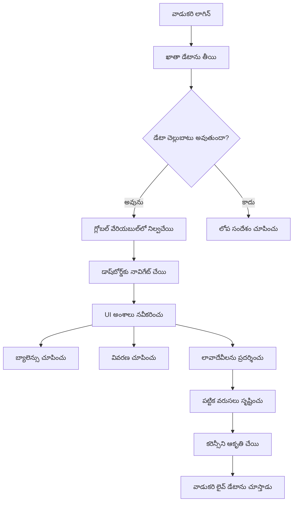
> 💡 **ప్రొ టిప్**: మీ డ్యాష్‌బోర్డు వెంటనే చూడాలనుకుంటే? లాగిన్ చేయడానికి `test` అనే యూజర్‌నేమ్ వాడండి - ఇది నమూనా డేటాతో ముందుగానే నింపబడింది కాబట్టి మీరు లావాదేవీలు మొదలు పెట్టకుండానే ప్రతిపాదన చూడగలుగుతారు.
> 
**కానుక, ఈ టెస్ట్ ఖాతా ఎందుకు సులభతరం:**
- వాస్తవిక నమూనా డేటా ఇప్పటికే లభిస్తుంది
- లావాదేవీలు ఎలా ప్రదర్శించబడుతాయో చూడటానికి అనుకూలం
- మీ డ్యాష్‌బోర్డు ఫీచర్లను పరీక్షించడానికి ఉత్తమం
- డ్రమ్మీ డేటాను స్వయంచాలకంగా సృష్టించాల్సిన కష్టాన్ని తగ్గిస్తుంది

### డ్యాష్‌బోర్డు ప్రదర్శన ఎలిమెంట్లను సృష్టించడం

మీ డ్యాష్‌బోర్డు ఇంటర్‌ఫేస్‌ని దశల వారీగా నిర్మిద్దాం, మొదట ఖాతా సారాంశ సమాచారంతో మొదలై, తరువాత లావాదేవీ జాబితాల వంటి సంక్లిష్ట ఫీచర్ల వైపు కదిలి:

#### దశ 1: మీ HTML నిర్మాణం నవీకరించండి

మొదట, స్థిరమైన "బ్యాలెన్స్" విభాగాన్ని డైనమిక్ ప్లేస్‌హోల్డర్ ఎలిమెంట్లతో మార్చండి, వాటిని మీ JavaScript నింపగలుతుంది:

```html
<section>
  Balance: <span id="balance"></span><span id="currency"></span>
</section>
```

తర్వాత, ఖాతా వివరణ కోసం ఒక సెక్షన్ జోడించండి. ఇది డ్యాష్‌బోర్డు కంటెంట్ కు శీర్షికగా పనిచేస్తోంది కాబట్టి, సెమాంటిక్ HTML వాడండి:

```html
<h2 id="description"></h2>
```

**HTML నిర్మాణం అర్థం చేసుకోవడం:**
- బ్యాలెన్స్ మరియు కరెన్సీ కోసం వేరువేరుగా `<span>` ఎలిమెంట్లు ఉపయోగించి వ్యక్తిగత నియంత్రణ
- ప్రతి ఎలిమెంట్ కి విభిన్న IDs అప్లై చేసి, JavaScript టార్గెటింగ్ సులభం చేసింది
- ఖాతా వివరణకు `<h2>` వాడి సెమాంటిక్ HTML పాటించడం
- స్క్రీన్ రీడర్‌లు మరియు SEO కోసం తార్కిక హైరార్కీ సృష్టించడం

> ✅ **ఆక్సెస్‌బిలిటీ అవగాహన**: ఖాతా వివరణ డ్యాష్‌బోర్డు కంటెంట్ శీర్షికగా పని చేస్తుంది, కాబట్టి హెడ్డింగ్‌గా సెమాంటిక్ గా చూపించబడింది. [heading structure](https://www.nomensa.com/blog/2017/how-structure-headings-web-accessibility) ఆక్సెస్‌బిలిటీలో ఎలా ప్రభావవంతమో తెలుసుకోండి. మీ పేజీలో ఇంకేమె గుర్తువైన ఎలిమెంట్లు హెడ్డింగ్ ట్యాగ్లతో మెరుగుపరచవచ్చు అనేదానిపై ఆలోచించండి.

#### దశ 2: డ్యాష్‌బోర్డు నవీకరణ ఫంక్షన్ సృష్టించడం

ఇప్పుడు, మీ డ్యాష్‌బోర్డును నిజమైన ఖాతా డేటాతో నింపుటకు ఫంక్షన్ సృష్టించండి:

```javascript
function updateDashboard() {
  if (!account) {
    return navigate('/login');
  }

  updateElement('description', account.description);
  updateElement('balance', account.balance.toFixed(2));
  updateElement('currency', account.currency);
}
```

**దశల వారీగా, ఈ ఫంక్షన్ చేస్తున్నది:**
- ఖాతా డేటా ఉంది అని ధృవీకరిస్తుంది
- ధృవీకరణ లేని వినియోగదారులను లాగిన్ పేజీకి తిరిగి షిఫ్ట్ చేస్తుంది
- పునర్వినియోగమైన `updateElement` ఫంక్షన్ ఉపయోగించి ఖాతా వివరణను నవీకరిస్తుంది
- బ్యాలెన్స్‌ ను ఎప్పుడూ రెండు దశాంశ స్థానాలతో చూపిస్తుంది
- సరైన కరెన్సీ చిహ్నాన్ని ప్రదర్శిస్తుంది

> 💰 **డబ్బు ఫార్మాటింగ్**: ఆ [`toFixed(2)`](https://developer.mozilla.org/docs/Web/JavaScript/Reference/Global_Objects/Number/toFixed) పద్ధతీ నిజమైన డబ్బుల ప్రకారం బ్యాలెన్స్ చూడమంటుంది - "75" కాకుండా "75.00" గా! వినియోగదారులకు చర్చిత కరెన్సీ ఫార్మాట్ కనిపిస్తే వారు సంతోషిస్తారు.

#### దశ 3: మీ డ్యాష్‌బోర్డు నవీకరించడం నిర్ధారించు

ప్రతి సారి ఎవరు వచ్చేశారో డ్యాష్‌బోర్డు తాజా డేటాతో నవీకరిస్తాయని నిర్ధారించేందుకు, మీ నావిగేషన్ వ్యవస్థలో హుక్ చేయాలి. మీరు [పాఠం 1 అసైన్మెంట్](../1-template-route/assignment.md) పూర్తి చేస్తే ఇది పరిచితం. లేకపోయినా, మీకు అవసరం:

మీ `updateRoute()` ఫంక్షన్ చివర ఈ కోడ్ జోడించండి:

```javascript
if (typeof route.init === 'function') {
  route.init();
}
```

అంతేకాకుండా, డ్యాష్‌బోర్డు ప్రారంభాన్ని పాఠ్య రూట్లలో చేర్చండి:

```javascript
const routes = {
  '/login': { templateId: 'login' },
  '/dashboard': { templateId: 'dashboard', init: updateDashboard }
};
```

**ఈ చక్కటి సెటప్ చేస్తున్నది:**
- రూట్‌లో ప్రత్యేక ప్రారంభ కోడ్ ఉన్నదాన్ని తనిఖీ చేస్తుంది
- ఆ కోడ్ ఆ రూట్ లోడ్ అవుతుండగానే ఆటోమేటిగ్గా నడిపిస్తుంది
- మీ డ్యాష్‌బోర్డు ఎప్పుడూ తాజా, ప్రస్తుత డేటా ప్రదర్శిస్తుందని నిర్ధారిస్తుంది
- రూటింగ్ లాజిక్‌ను శుభ్రముగా మరియు క్రమబద్ధంగా ఉంచుతుంది

#### మీ డ్యాష్‌బోర్డు పరీక్షించండి

ఈ మార్పులు అమలు చేసిన తర్వాత, డ్యాష్‌బోర్డు ఈ విధంగా పరీక్షించండి:

1. **లాగిన్ అవ్వండి** టెస్ట్ ఖాతాతో
2. **తిరిగి వచ్చి** మీరు డ్యాష్‌బోర్డుకు వెళ్లిపోయారో ధృవీకరించండి
3. **ఖాతా వివరణ, బ్యాలెన్స్, కరెన్సీ** సరిగ్గా ప్రదర్శించబడుతున్నాయనే తనిఖీ చేయండి
4. **లాగ్ అవుట్ కావడం మరియు మళ్లీ లాగిన్ కావడం** ద్వారా డేటా సరిగా రిఫ్రెష్ అవుతుందా అనేదాన్ని పరీక్షించండి

మీ డ్యాష్‌బోర్డు ఇప్పుడు లాగిన్ అయి ఉన్న వినియోగదారుల డేటా ఆధారంగా డైనమిక్ ఖాతా సమాచారాన్ని ప్రదర్శిస్తుంది!

## టెంప్లేట్లతో స్మార్ట్ ట్రాన్సాక్షన్ లిస్టులు నిర్మించడం

ప్రతి ట్రాన్సాక్షన్ కోసం మాన్యువల్ గా HTML సృష్టించడం బదులు, సర్వసాధారణ ఆకృతీకరణ కోసం టెంప్లేట్లను ఉపయోగిస్తాము. అంతరిక్ష నౌకల తయారీకి వాడే ప్రమాణీకృత భాగల లాంటి టెంప్లేట్లు ప్రతి ట్రాన్సాక్షన్ పంక్తి ఒకే నిర్మాణం, కనిపింపు పాటించడంలో సహాయపడతాయి.

ఈ సాంకేతికత కొన్ని ట్రాన్సాక్షన్‌ల నుండి వేలల‌కు స్కేల్ అవుతుంది, నిరంతర ప్రదర్శన మరియు పనితీరును నిలుపుకునేలా చేయుతుంది.

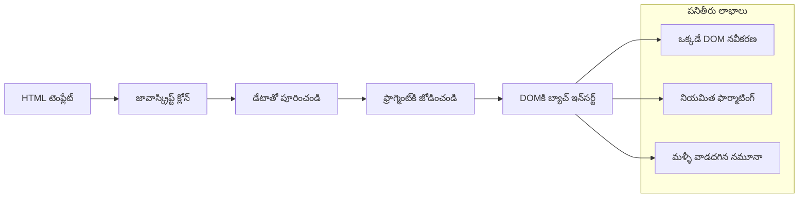
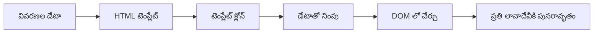
### దశ 1: ట్రాన్సాక్షన్ టెంప్లెట్ సృష్టించడం

మొదట, మీ HTML `<body>` లో ట్రాన్సాక్షన్ పంక్తుల కోసం పునర్వినియోగ టెంప్లెట్ జోడించండి:

```html
<template id="transaction">
  <tr>
    <td></td>
    <td></td>
    <td></td>
  </tr>
</template>
```

**HTML టెంప్లేట్లు అర్థం చేసుకోవడం:**
- ఒకే టేబుల్ పంక్తి నిర్మాణాన్ని నిర్వచిస్తాయి
- JavaScript ద్వారా క్లోన్ చేసి నింపబడ్డప్పుడల్లా కనపడతాయి
- తారీఖు, వివరణ, మొత్తం కోసం మూడు సెల్స్ ఉన్నాయి
- నిరంతర ఆకృతీకరణకు పునర్వినియోగ నమూనాగా ఉంది

### దశ 2: డైనమిక్ కంటెంట్ కోసం మీ టేబుల్ తయారుచేయండి

తర్వాత, టేబుల్ బాడీకి ఒక `id` జతచేయండి, ఇది JavaScript సులభంగా లభ్యమౌతుంది:

```html
<tbody id="transactions"></tbody>
```

**ఇది సాధించేది:**
- ట్రాన్సాక్షన్ పంక్తులు చేర్చడానికి స్పష్టమైన లక్ష్యం సృష్టిస్తుంది
- టేబుల్ నిర్మాణాన్ని డైనమిక్ కంటెంట్ నుండి వేరుచేస్తుంది
- డేటాను సులభంగా క్లియర్ చేసి మళ్ళీ నింపడం సాధ్యం

### దశ 3: ట్రాన్సాక్షన్ పంక్తి ఫ్యాక్టరీ ఫంక్షన్ తయారుచేయండి

ఇప్పుడు లావాదేవీ డేటాను HTML ఎలిమెంట్లుగా మార్చే ఫంక్షన్ సృష్టించండి:

```javascript
function createTransactionRow(transaction) {
  const template = document.getElementById('transaction');
  const transactionRow = template.content.cloneNode(true);
  const tr = transactionRow.querySelector('tr');
  tr.children[0].textContent = transaction.date;
  tr.children[1].textContent = transaction.object;
  tr.children[2].textContent = transaction.amount.toFixed(2);
  return transactionRow;
}
```

**ఈ ఫ్యాక్టరీ ఫంక్షన్ పునఃవిభజన:**
- ID ద్వారా టెంప్లెట్ ఎలిమెంట్ తెచ్చుకుంటుంది
- సురక్షితంగా ముడిచేర్పు కోసం టెంప్లెట్ కంటెంట్‌ను క్లోన్ చేస్తుంది
- క్లోన్ చేసిన కంటెంట్‌లో టేబుల్ పంక్తిని ఎంపిక చేస్తుంది
- ప్రతి సెల్ ను లావాదేవీ డేటాతో నింపుతుంది
- మొత్తాన్ని సరైన దశాంశ స్థానాలతో ఫార్మాట్ చేస్తుంది
- చొప్పించడానికి సిద్ధంగా ఉన్న పూర్తి పంక్తిని తిరిగిస్తుంది

### దశ 4: బహుళ లావాదేవీ పంక్తులని సమర్థవంతంగా సృష్టించండి

ఇది మీ `updateDashboard()` ఫంక్షన్‌లో జోడించండి, అన్ని లావాదేవీలను ప్రదర్శించడానికి:

```javascript
const transactionsRows = document.createDocumentFragment();
for (const transaction of account.transactions) {
  const transactionRow = createTransactionRow(transaction);
  transactionsRows.appendChild(transactionRow);
}
updateElement('transactions', transactionsRows);
```

**ఈ సమర్థవంతమైన విధానం అర్థం చేసుకోవడం:**
- DOM ఆపరేషన్లను బ్యాచ్ చేయడానికి డాక్యుమెంట్ ఫ్రాగ్మెంట్ సృష్టిస్తుంది
- ఖాతా డేటాలోని ప్రతి లావాదేవీని పునర్వృష్టి చేస్తుంది
- ఫ్యాక్టరీ ఫంక్షన్ ద్వారా ప్రతి లావాదేవీకి పంక్తి సృష్టిస్తుంది
- అన్ని పంక్తులను ఫ్రాగ్మెంట్‌లో కూడదీసి DOM లో జతచేస్తుంది
- మూలకాల మిళిత చేర్చద్దాం బదులు ఒకేసారి DOM నవీకరణ చేస్తుంది
> ⚡ **సమర్థత ఆప్టిమైజేషన్**: [`document.createDocumentFragment()`](https://developer.mozilla.org/docs/Web/API/Document/createDocumentFragment) బోయింగ్‌లో అసెంబ్లీ ప్రక్రియలా పనిచేస్తుంది - భాగాలను ప్రధాన లైన్ వెలుపల సిద్ధం చేస్తారు, ఆ తర్వాత పూర్తి యూనిట్‌గా ఇన్స్టాల్ చేస్తారు. ఈ బ్యాచింగ్ విధానం అనేక వ్యక్తిగత ఆపరేషన్ల స్థానంలో ఒకే సారి ఇన్‌సెర్షన్ చేస్తూ DOM రీఫ్లోలను కనిష్టం చేస్తుంది.

### దశ 5: మిక్స్ కంటెంట్ కోసం అప్డేట్ ఫంక్షన్‌ను మెరుగుపర్చండి

మీ `updateElement()` ఫంక్షన్ ప్రస్తుతం కేవలం టెక్స్ట్ కంటెంట్‌ను మాత్రమే నిర్వహిస్తుంది. దాన్ని టెక్స్ట్ మరియు DOM నోడ్లు రెండింటితో పని చేయడానికి నవీకరించండి:

```javascript
function updateElement(id, textOrNode) {
  const element = document.getElementById(id);
  element.textContent = ''; // అన్ని పిల్లలను తీసివేస్తుంది
  element.append(textOrNode);
}
```

**ఈ అప్డేట్‌లో ముఖ్యమైన మెరుగుదలలు:**
- కొత్త కాంటెంట్‌ను జోడించే ముందు ఉన్న కంటెంట్ **తొలగిస్తుంది**
- పారామితులుగా టెక్స్ట్ స్ట్రింగ్స్ లేదా DOM నోడ్ల ఏదైనా **అంగీకరిస్తుంది**
- **నమ్రత కోసం** [`append()`](https://developer.mozilla.org/docs/Web/API/ParentNode/append) విధానాన్ని ఉపయోగిస్తుంది
- ఇప్పటికే ఉన్న టెక్స్ట్ ఆధారిత వినియోగంతో సంబంధం కలిగించే **పూర్వ అనుకూలతను** ఉంచుతుంది

### మీ డాష్‌బోర్డు‌ను టెస్ట్ డ్రైవ్ చేయడం

నిజం తెలిపే సమయం వచ్చింది! మీ డైనమిక్ డాష్‌బోర్డును కార్యాచరణలో చూద్దాం:

1. `test` అకౌంట్‌తో లాగిన్ అవ్వండి (ఇందులో నమూనా డేటా సిద్ధంగా ఉంది)
2. మీ డాష్‌బోర్డుకు వెళ్లండి
3. లావాదేవీ వరుసలు సరైన ఫార్మాటింగ్ తో కనబడుతున్నాయో చూసుకోండి
4. తేదీలు, వివరణలు, మరియు మొత్తం సక్రమంగా ఉన్నాయో ధృవీకరించుకోండి

అన్నీ సరిగ్గా ఉంటే, మీ డాష్‌బోర్డు మీద పూర్తిగా పనిచేసే లావాదేవీ జాబితా కనిపిస్తుందని చూడగలరు! 🎉

**మీరు సాధించినవి:**
- ఏ కొలతలోనైనా డేటాతో పెరిగే డాష్‌బోర్డు నిర్మించారు
- నిరంతర ఫార్మాటింగ్ కోసం పునరుపయోగించదగిన టెంప్లేట్లు సృష్టించారు
- సమర్థవంతమైన DOM మానిప్యులేషన్ సాంకేతికతలను అమలు చేయించారు
- ఉత్పాదక బ్యాంకింగ్ అప్లికేషన్‌లకు తగిన కార్యాచరణను అభివృద్ధి చేశారు

మీరు ఒక స్థిరమైన వెబ్ పేజీని డైనమిక్ వెబ్ అప్లికేషన్‌గా విజయవంతంగా మార్చారు.

### 🎯 పాఠ్యసంబంధమైన తనిఖీ: డైనమిక్ కంటెంట్ రూపొందింపు

**ఆర్కిటెక్చర్ అవగాహన**: మీరు React, Vue, మరియు Angular వంటి ఫ్రేమ్‌వర్క్‌లలో ఉపయోగించే నమూనాలను అనుకరించే సTITLE sophisticated డేటా-టు-UI పైప్లైన్‌ను అమలు చేశారు.

**ముఖ్యమైన భావాలు అందుకున్నారు:**
- **టెంప్లేట్ ఆధారిత రენდరింగ్**: పునరుపయోగించే UI భాగాలు రూపొందించడం
- **డాక్యుమెంట్ ఫ్రాగ్మెంట్లు**: DOM సమర్థతను పెంచడం
- **సురక్షిత DOM మానిప్యులేషన్**: భద్రతా కలతలు నివారించడం
- **డేటా అనువాదం**: సర్వర్ డేటాను వినియోగదారు ఇంటర్ఫేస్‌కి మార్చడం

**ఇండస్ట్రీ సంబంధం**: ఈ సాంకేతికతలు ఆధునిక ఫ్రంట్‌ఎండ్ ఫ్రేమ్‌వర్క్‌లకు ఆదారం. React యొక్క వర్చువల్ DOM, Vue టెంప్లేట్ వ్యవస్థ, మరియు Angular భాగాల నిర్మాణం ఈ ప్రాథమిక సూత్రాలపై ఆధారపడినవి.

**ఛింతన ప్రశ్న**: కొత్త లావాదేవీలు ఆటోమేటిక్‌గా కనపడేవలె రియల్-టైమ్ అప్డేట్లను ఈ సిస్టమ్ ఎలా నిర్వహిస్తుంది? WebSockets లేదా Server-Sent Events ఉపయోగించాలా?

---

## 📈 మీ డేటా నిర్వహణ నైపుణ్యం సమయరేఖ

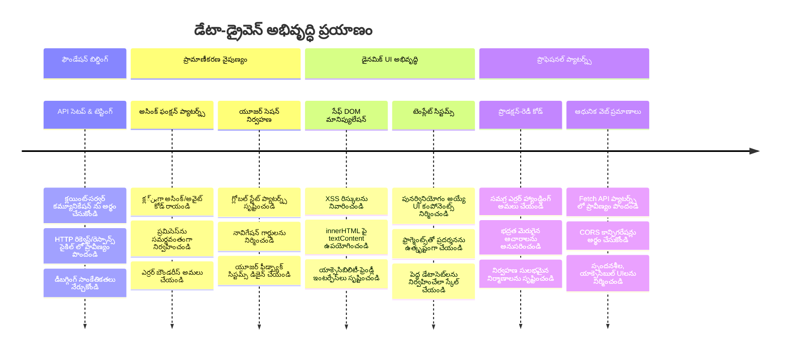
**🎓 పట్టాభిషేక మైలురాయి**: మీరు ఆధునిక JavaScript నమూనాలను ఉపయోగిస్తూ పూర్తి డేటా-ఆధారిత వెబ్ అప్లికేషన్‌ను విజయవంతంగా నిర్మించారు. ఈ నైపుణ్యాలు React, Vue లేదా Angular వంటి ఫ్రేమ్‌వర్క్‌లతో పని చేయడాన్ని నేరుగా అనువదిస్తాయి.

**🔄 తదుపరి స్థాయి సామర్థ్యాలు:**
- ఈ భావాలపై నిర్మింపబడిన ఫ్రంట్‌ఎండ్ ఫ్రేమ్‌వర్క్‌లను కన్వీ మరింత తెలుసుకోవడానికి సన్నద్ధం
- WebSockets తో రియల్-టైమ్ ఫీచర్లను అమలు చేయడానికి సిద్ధంగా ఉంది
- ఆఫ్లైన్ సామర్థ్యాలతో ప్రోగ్రెస్‌వ్ వెబ్ యాప్స్ నిర్మించేందుకు సన్నద్ధం
- ఆధునిక స్థితి నిర్వహణ నమూనాలు నేర్చుకోవడానికి మౌలికమైన పునాదులు

## GitHub Copilot ఏజెంట్ ఛాలెంజ్ 🚀

ఈ క్రింది ఛాలెంజ్‌ను పూర్తి చేయడానికి ఏజెంట్ మోడ్‌ని ఉపయోగించండి:

**వివరణ:** బ్యాంకింగ్ యాప్‌ను అభివృద్ధి చేసి, యూజర్లు ప్రత్యేకమైన లావాదేవీలను తేదీ పరిధి, మొత్తం లేదా వివరణ ద్వారా వెతికి ఫిల్టర్ చేయగలిగే లావాదేవీ శోధన మరియు ఫిల్టర్ ఫీచర్‌ను అమలు చేయండి.

**ప్రాంప్ట్:** బ్యాంకింగ్ యాప్ కోసం శోధన ఫంక్షనాలిటీని సృష్టించండి, ఇందులో: 1) తేదీ పరిధి(మొదటి/చివరి), కనిష్ట/గరిష్ట మొత్తం, మరియు లావాదేవీ వివరణ కీవర్డ్‌లు కోసం ఇన్పుట్ ఫీల్డ్స్ గల శోధన ఫారమ్ 2) search criteria ఆధారంగా account.transactions శ్రేణిని ఫిల్టర్ చేసే `filterTransactions()` ఫంక్షన్ 3) ఫిల్టర్ చేసిన ఫలితాలను చూపేందుకు `updateDashboard()` ఫంక్షన్ నవీకరించడం 4) వీక్షణను రీసెట్ చేసే "క్లియర్ ఫిల్టర్స్" బటన్ జోడించడం. `filter()` వంటి ఆధునిక JavaScript శ్రేణి పద్ధతులను ఉపయోగించి ఖాళీ శోధన ప్రమాణాలకు హ్యాండిల్ చేయండి.

ఇంకా తెలుసుకోండి [agent mode](https://code.visualstudio.com/blogs/2025/02/24/introducing-copilot-agent-mode) గురించి.

## 🚀 ఛాలెంజ్

మీ బ్యాంకింగ్ యాప్‌ను తదుపరి స్థాయికి తీసుకెళ్లడానికి సిద్ధమా? దీన్ని మీరు నిజంగా ఉపయోగించదలచినట్లుగా చూడమని మరియు అనుభూతి చెందడానికి కొన్ని ఆలోచనలు:

**అందంగా చేయండి**: మీ కార్యాచరణాత్మక డాష్బోర్డును దృశ్యముగా ఆకర్షణీయంగా మార్చేందుకు CSS స్టైలింగ్ జోడించండి. పరిశుభ్రమైన లైన్లు, మంచి ఖాళీలు, మరియు కొన్ని సున్నితమైన యానిమేషన్లు కూడా ఆలోచించండి.

**ప్రతిస్పందనీయంగా చేయండి**: [మీడియా క్వేరీల](https://developer.mozilla.org/docs/Web/CSS/Media_Queries)ను ఉపయోగించి ఫోన్లు, టాబ్లెట్లు, మరియు డెస్క్టాప్‌లపై బాగా పనిచేసే [ప్రతిస్పందనీయ డిజైన్](https://developer.mozilla.org/docs/Web/Progressive_web_apps/Responsive/responsive_design_building_blocks)ను సృష్టించండి. మీ వినియోగదారులు ఖచ్చితంగా ధన్యవాదాలు తెలుపుతారు!

**కొంచెం ప్రత్యేకత జోడించండి**: లావాదేవీలను రంగుతో గుర్తించండి (ఆదాయానికి ఆకుపచ్చ, ఖర్చులకు ఎరుపు), ఐకాన్లను జోడించండి, లేదా ఇంటర్ఫేస్‌ను ఇంటరాక్టివ్‌గా మార్చే హోవర్ ఎఫెక్ట్స్ సృష్టించండి.

అందుబాటులో ఒక మెరుగైన డాష్‌బోర్డు ఎలా కనిపించొచ్చో ఇక్కడ చూడండి:

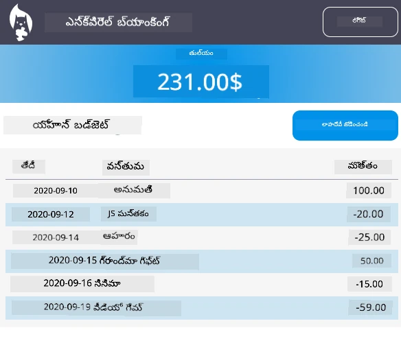

దీనిని ఖచ్చితంగా అనుకరించాల్సిన అవసరం లేదు - ఇది ప్రేరణగా ఉపయోగించుకుని మీది మార్చుకోండి!

## పాఠ్యోత్సవం క్విజ్

[పాఠ్యోత్సవం క్విజ్](https://ff-quizzes.netlify.app/web/quiz/46)

## అసైన్‌మెంట్

[మీ కోడ్‌ను రిఫ్యాక్టర్ చేసి వ్యాఖ్యానించండి](assignment.md)

---

<!-- CO-OP TRANSLATOR DISCLAIMER START -->
**మార్గదర్శక సూచన**:  
ఈ డాక్యుమెంట్ [Co-op Translator](https://github.com/Azure/co-op-translator) అనే AI అనువాద సేవను ఉపయోగించి అనువదించబడింది. మేము ఖచ్చితత్వానికి ప్రయత్నిస్తున్నప్పటికీ, సొంతంగా చేసిన అనువాదాల్లో తప్పులు లేదా అసత్యతలు ఉండొచ్చు. ఈ డాక్యుమెంట్ యొక్క అసలు భాషలో ఉన్న పాఠ్యాన్ని అధికారిక మూలంగా పరిగణించాలి. ముఖ్యమైన సమాచారం కోసం, వృత్తిపరమైన మానవ అనువాద సేవలను ఉపయోగించడం మంచిది. ఈ అనువాదాన్ని ఉపయోగించడంవలన కలిగే ఏవైనా భావాల పొరపాట్లకైనా మేము బాధ్యత వహించము.
<!-- CO-OP TRANSLATOR DISCLAIMER END -->