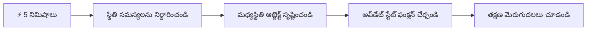
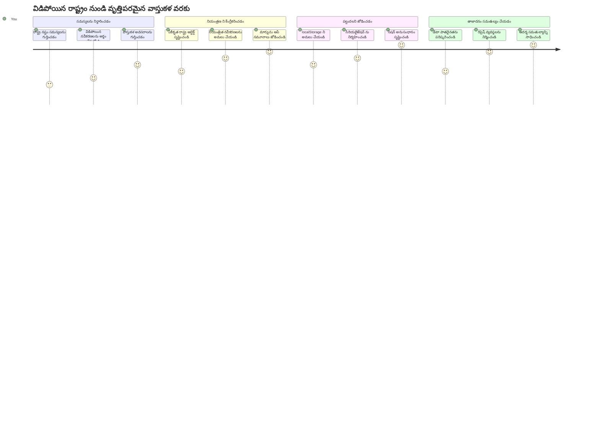
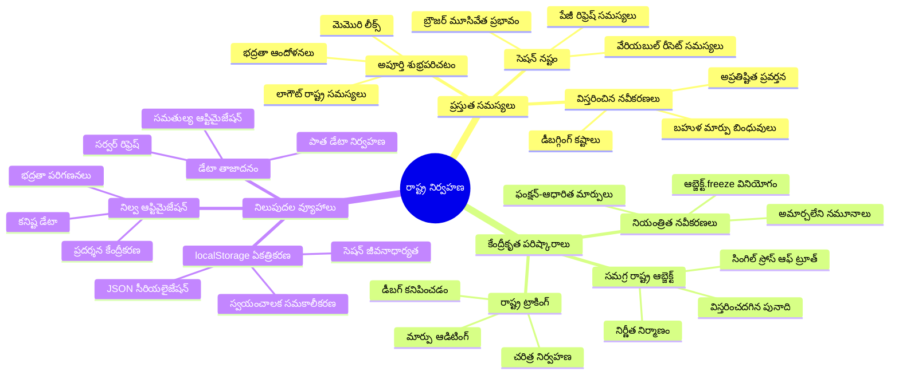
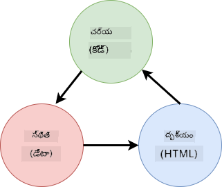
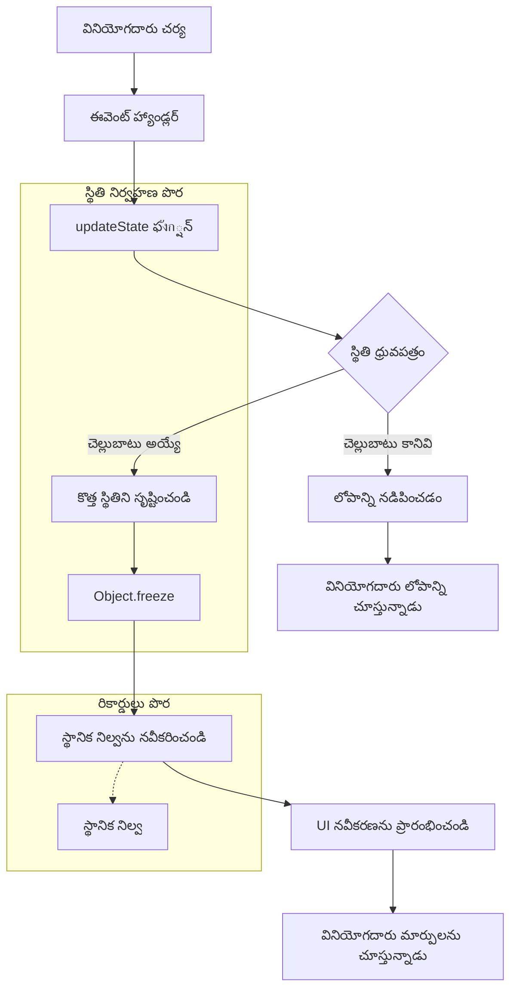
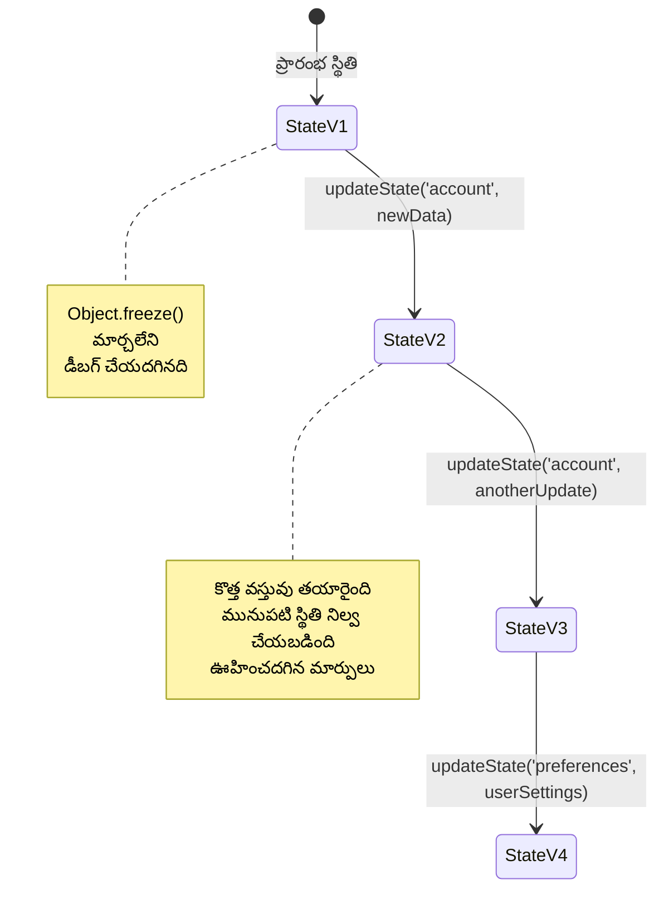
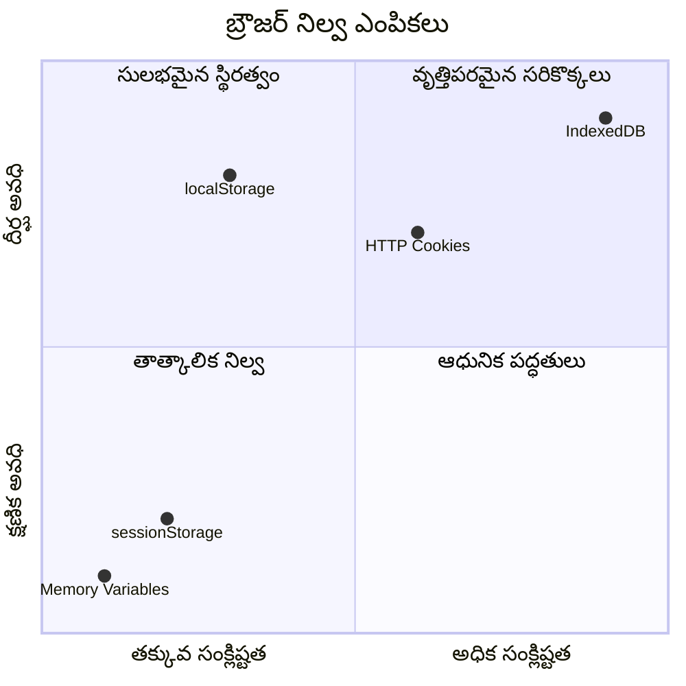
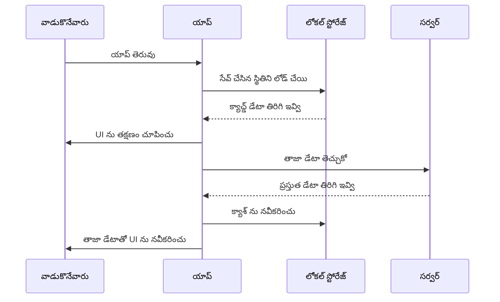
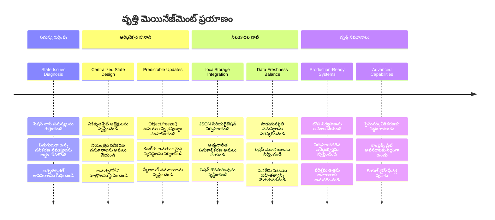
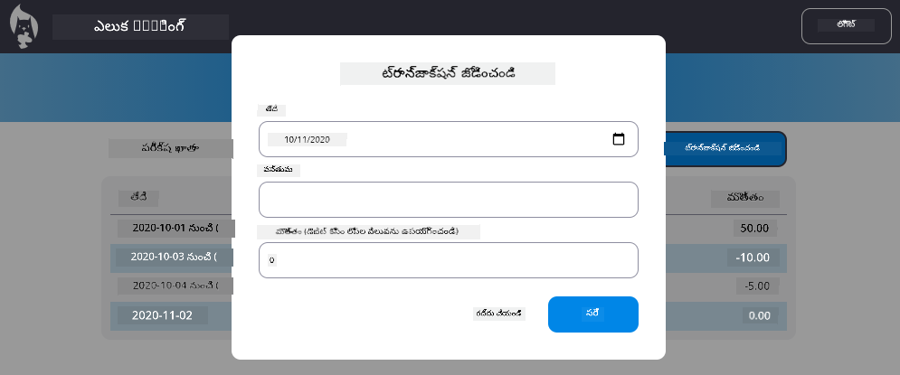

<!--
CO_OP_TRANSLATOR_METADATA:
{
  "original_hash": "b807b09df716dc48a2b750835bf8e933",
  "translation_date": "2026-01-08T17:35:55+00:00",
  "source_file": "7-bank-project/4-state-management/README.md",
  "language_code": "te"
}
-->
# బ్యాంకింగ్ యాప్ భాగం 4: స్టేట్ నిర్వహణ సిద్ధాంతాలు

## ⚡ తర్వాత 5 నిమిషాల్లో మీరు ఏమి చేయగలరో

**బిజీ డెవలపర్ల కోసం త్వరిత ప్రారంభ మార్గం**


- **1వ నిమిషం**: ప్రస్తుత స్టేట్ సమస్యను పరీక్షించండి - లాగిన్ అవ్వండి, పేజీ రిఫ్రెష్ చేయండి, లాగ్అవుట్ అయ్యేలా గమనించండి
- **2వ నిమిషం**: `let account = null` ని `let state = { account: null }` తో మార్చండి
- **3వ నిమిషం**: నియంత్రిత అప్డేట్ల కోసం ఒక సాధారణ `updateState()` ఫంక్షన్ సృష్టించండి
- **4వ నిమిషం**: ఒక ఫంక్షన్ ని కొత్త నమూనా ఉపయోగించి అప్డేట్ చేయండి
- **5వ నిమిషం**: మెరుగైన అంచనా సామర్థ్యం మరియు డీబగ్గింగ్ సామర్థ్యాన్ని పరీక్షించండి

**తక్షణ పరీక్ష**:
```javascript
// ముందు: విస్తరించిన స్థితి
let account = null; // రీఫ్రెష్ చేసినప్పుడు పోతుంది!

// తర్వాత: కేంద్రీకృత స్థితి
let state = Object.freeze({ account: null }); // నియంత్రించబడినది మరియు ట్రాకింగ్ చేయగలిగేది!
```

**ఇది ఎందుకు ముఖ్యం**: 5 నిమిషాల్లో, మీరు గందరగోళమైన స్టేట్ నిర్వహణ నుండి అంచనా వేసుకోవచ్చునని, డీబగ్గింగ్ చేయగలిగే నమూనాల్లోకి మార్పును అనుభవించబోతున్నారు. ఇది సంక్లిష్ట అనువర్తనాలను నిర్వహించగల ఒక ప్రాథమికమైన మౌలిక సూత్రం.

## 🗺️ స్టేట్ నిర్వహణ నైపుణ్యంలో మీ విద్యా ప్రయాణం


**మీ ప్రయాణ గమ్యం**: ఈ పాఠం చివరికి, మీరు పునఃప్రాప్తి, డేటా తాజీకరణ, అంచనా వేసుకునే అప్డేట్లను నిర్వహించే ప్రొఫెషనల్-గ్రేడ్ స్టేట్ నిర్వహణ వ్యవస్థను నిర్మించబోతున్నారు - ఇది ఉత్పత్తి అనువర్తనాల్లో ఉపయోగించే అదే నమూనాలు.

## పాఠానికి ముందు క్విజ్

[Pre-lecture quiz](https://ff-quizzes.netlify.app/web/quiz/47)

## పరిచయం

స్టేట్ నిర్వహణ అనేది వోయేజర్ జహాజు నావిగేషన్ వ్యవస్థ లాగానే ఉంటుంది – ప్రతిదీ సాఫీగా పని చేస్తే, మీరు దాని గురించి గమనించరు. కానీ సమస్యలు సంభవిస్తే, ఇది అంతరిక్ష ప్రయాణాన్ని సాధించడంలో వేరుబడిపోవడాన్ని మరియు ఖాళీ అంతరిక్షంలో తుమ్మడం మధ్య తేడాను సృష్టిస్తుంది. వెబ్ డెవలప్మెంట్ లో, స్టేట్ అనేది మీ అనువర్తనం గుర్తుంచుకోవాల్సిన ప్రతి విషయం: వినియోగదారు లాగిన్ స్థితి, ఫారం డేటా, నావిగేషన్ చరిత్ర, తాత్కాళిక ఇంటర్ఫేస్ స్టేట్స్.

మీ బ్యాంకింగ్ యాప్ సాదారణ లాగిన్ ఫారమ్ నుండి అధునాతన అనువర్తనంగా అభివృద్ధి చెందడంలో, మీరు సాధారణ సమస్యలను ఎదుర్కొంటూనే ఉంటారు. పేజీని రిఫ్రెష్ చేసినప్పుడు యూజర్లు అనుకున్నట్టు కాకుండా లాగ్ అవుట్ కావడం. బ్రౌజర్ ను మూసేసిన తర్వాత అన్ని పురోగతులు మాయం కావడం. ఒక సమస్యను డీబగ్ చేయాలంటే, మీరు అనేక ఫంక్షన్స్ ను త్రవ్వి చూడవలసి రావడం, అవి ఒకే డేటాను వివిధ విధాలుగా మార్చడం.

ఇవి చెడు కోడింగ్ సంకేతాలు కాదని గుర్తుంచుకోండి – ఇవి అప్లికేషన్లు ఒక నిర్దిష్ట సంక్లిష్టత స్థాయికి చేరుకున్నప్పుడు సహజంగా తలెత్తే పెరుగుదల పీడలే. ప్రతి డెవలపర్, వారి యాప్స్ "ప్రూవ్ ఆఫ్ కాన్సెప్ట్" నుండి "ఉత్పత్తి సిద్ధం" దశకి మారిపోతున్నప్పుడు ఈ సవాళ్ళను ఎదుర్కుంటారు.

ఈ పాఠంలో, మీ బ్యాంకింగ్ యాప్‌ను ఒక విశ్వసనీయం, ప్రొఫెషనల్ అనువర్తనంగా మారుస్తున్న కేంద్రిత స్టేట్ నిర్వహణ వ్యవస్థను అమలు చేస్తాము. మీరు డేటా ప్రవాహాలను అంచనా వేసుకునే విధంగా నిర్వహించడం, వినియోగదారి సెషన్లను తగిన విధంగా నిలుపుకోవడం మరియు ఆధునిక వెబ్ అనువర్తనాలకు కావలసిన సాఫీ వినియోగదార అనుభవాన్ని సృష్టించడం నేర్చుకుంటారు.

## ముందస్తు అవసరాలు

స్టేట్ నిర్వహణ సిద్ధాంతాలకు ముందుగా, మీరు మీ డెవలప్‌మెంట్ వాతావరణాన్ని సరిగ్గా అమర్చుకున్నారని మరియు మీ బ్యాంకింగ్ యాప్ ప్రాతిపదిక సిద్ధమైనదిగా నిర్ధారించుకోవాలి. ఈ పాఠం ఈ సిరీస్ గత భాగాలలోని భావనలకు మరియు కోడ్‌కు నేరుగా ఆధారపడి ఉంటుంది.

తదుపరి చర్యలకు ముందు మీ వద్ద ఈ క్రింది భాగాలు సిద్ధంగా ఉన్నాయని నిర్ధారించుకోండి:

**అవసరమైన సెటప్:**
- [డేటా ఫెచింగ్ పాఠం](../3-data/README.md) పూర్తిచేయండి - మీ యాప్ ఖాతా డేటాను విజయవంతంగా లోడ్ చేసి ప్రదర్శించగలగాలి
- సర్వర్ API నడిపించేందుకు మీ సిస్టమ్‌లో [Node.js](https://nodejs.org) ను ఇన్‌స్టాల్ చేయండి
- ఖాతా డేటా కార్యకలాపాలను నిర్వహించేందుకు స్థానికంగా [సర్వర్ API](../api/README.md) ను ప్రారంభించండి

**మీ వాతావరణాన్ని పరీక్షించండి:**

ఈ కింది కమాండ్ ను టెర్మినల్లో అమలు చేయడం ద్వారా మీ API సర్వర్ సరిగా నడుస్తుందో లేదో సరిచూడండి:

```sh
curl http://localhost:5000/api
# -> ఫలితంగా "Bank API v1.0.0" ను తిరిగి ఇవ్వాలి
```

**ఈ కమాండ్ చేయేది:**
- మీ స్థానిక API సర్వర్ కు GET అభ్యర్థన పంపుతుంది
- కనెక్షన్ ను పరీక్షించి సర్వర్ స్పందిస్తున్నదని నిర్ధారిస్తుంది
- అన్ని సరిగా ఉండితే API వెర్షన్ సమాచారాన్ని తిరిగి అందిస్తుంది

## 🧠 స్టేట్ నిర్వహణ వాస్తవ రూపకల్పన సమీక్ష


**ప్రధాన సూత్రం**: ప్రొఫెషనల్ స్టేట్ నిర్వహణ అంచనా, నిలుపుదల మరియు పనితీరు మధ్య సమతౌల్యం సాధించి భరోసాయుత వినియోగదార అనుభవాలను తయారుచేస్తుంది, ఇవి సాపేక్ష చర్యల నుండి సంక్లిష్ట అనువర్తన పని ప్రవాహాలకి వర్తిస్తాయి.

---

## ప్రస్తుత స్టేట్ సమస్యల నిర్ధారణ

షెర్లాక్ హోమ్స్ ఇటువంటి అనుమాన స్థలాన్ని పరిశీలిస్తూనే ఉన్నట్టుగా, మేము ప్రస్తుత అమలులో ఏమి జరుగుతోందో పూర్తిగా అర్థం చేసుకోవాలి, అప్పుడే వినియోగదార సెషన్లు పోవడంవంటి రహస్యం పరిష్కరించగలము.

బేసి పరీక్ష ఒక సరళ ప్రయోగం చేస్తాము, ఇది ప్రాథమిక స్టేట్ నిర్వహణ సవాళ్ళను వెలుగులోకి తేవడం:

**🧪 ఈ పరీక్షను ప్రయత్నించండి:**
1. మీ బ్యాంకింగ్ యాప్‌లో లాగిన్ అవ్వండి మరియు డ్యాష్‌బోర్డు కి వెళ్లండి
2. బ్రౌజర్ పేజీని రిఫ్రెష్ చేయండి
3. మీరు లాగిన్ స్థితి పై ఏమి జరుగుతుందో గమనించండి

మీరు తిరిగి లాగిన్ స్క్రీన్ కి రీడైరెక్ట్ చేయబడితే, మీరు క్లాసిక్ స్టేట్ నిలుపుదల సమస్యను కనుగొన్నారు. ఈ ప్రవర్తన ప్రస్తుత అమలు యూజర్ డేటాను జావాస్క్రిప్ట్ వేరియబుల్స్‌లో నిల్వ చేశేతీ, అవి ప్రతి పేజీ లోడ్ లో రీసెట్ అవుతుంది.

**ప్రస్తుత అమలు సమస్యలు:**

మునుపటి పాఠంలో (../3-data/README.md) ఉన్న సరళ `account` వేరియబుల్ మూడు ప్రధాన సమస్యలను సృష్టిస్తుంది, అవి వినియోగదార అనుభవం మరియు కోడ్ నిర్వహణ రెండింటినిస్థూలంగా ప్రభావితం చేస్తాయి:

| సమస్య | సాంకేతిక కారణం | వినియోగదార ప్రభావం |
|---------|---------------|-------------------|
| **ಸೆషన్ ನష్టం** | పేజీ రిఫ్రెష్ తనతో పాటు జావాస్క్రిప్ట్ వేరియబుల్స్ తొలగిస్తుంది | వినియోగదారులు తరచూ మళ్లీ లాగిన్ కావాలి |
| **ఆపసంలో అప్డేట్లు** | అనేక ఫంక్షన్లు ప్రత్యక్షంగా స్టేట్ ని మార్చతాయి | డీబగ్గింగ్ కష్టం అవుతుంది |
| **పూర్తిగా క్లియర్ కాదు** | లాగ్అవుట్ అన్నింటినీ క్లియర్ చేయదు | భద్రత మరియు గోప్యత సమస్యలు ఉంటాయి |

**వాస్తవ రూపకల్పన సవాలు:**

టైటానిక్ అనేక కంపార్ట్మెంట్లు నీటిలోకి చేర్యాకన పెడిన మూలక రూపకల్పన లాగా, ఈ సమస్యలను విడివిడిగా పరిష్కరించడం వాస్తవ రూపకల్పన సమస్యను పరిష్కరించదు. మాకు సమగ్ర స్టేట్ నిర్వహణ పరిష్కారం అవసరం.

> 💡 **మేము నిజానికి ఏమి సాధించాలనుకుంటున్నాం?**

[స్టేట్ నిర్వహణ](https://en.wikipedia.org/wiki/State_management) నిజానికి రెండు మూల సమస్యలను పరిష్కరిస్తుంది:

1. **నా డేటా ఎక్కడ ఉంది?**: ఏ సమాచారం మనకు ఉంది, అది ఎక్కడ నుండో ట్రాక్ చేయడం
2. **అందరూ అక్కడే ఉన్నారా?**: వినియోగదారులు చూస్తున్నదే నిజంగా జరుగుతుందా అని నిర్ధారించడం

**మా ప్రణాళిక:**

మేము తకృణాల్ని వెంటాడకుండా, ఒక **కేంద్రిత స్టేట్ నిర్వహణ** వ్యవస్థను సృష్టించబోతున్నాం. ఇది ఒక అన్ని ముఖ్యమైన విషయాలను జాగ్రత్తగా చూసుకునే వ్యక్తి లాంటి వ్యవస్థ:




**ఈ డేటా ప్రవాహాన్ని అర్థం చేసుకోవటం:**
- అన్ని అనువర్తన స్టేట్ ఒకే చోట కేంద్రితం చేయబడతాయి
- అన్ని స్టేట్ మార్పులు నియంత్రిత ఫంక్షన్ల ద్వారా నడిచుతాయి
- UI ప్రస్తుత స్టేట్ తో సమకాలీనంగా ఉంటుంది
- డేటా నిర్వహణకి స్పష్టమైన, అంచనా వేయగల నమూనాను అందిస్తుంది

> 💡 **ప్రొఫెషనల్ అవగాహన**: ఈ పాఠం ప్రాథమిక భావాలపై దృష్టి సారిస్తుంది. సంక్లిష్ట అనువర్తనాలకు, [Redux](https://redux.js.org) వంటి లైబ్రరీలు మరింత అభివృద్ధి చెందిన స్టేట్ నిర్వహణ లక్షణాలను అందిస్తాయి. ఈ మౌలిక సూత్రాలను అర్థం చేసుకోవడం ఏదైనా స్టేట్ లైబ్రరీను సమర్థంగా ఉపయోగించడంలో మీరు నైపుణ్యం గలిగేందుకు సహాయపడుతుంది.

> ⚠️ **అధునాతన అంశం**: స్టేట్ మార్పుల వల్ల ఆటోమేటిక్ UI అప్డేట్స్ అవసరం అయినా, అది [రిఐక్టివ్ ప్రోగ్రామింగ్](https://en.wikipedia.org/wiki/Reactive_programming) సిద్ధాంతాలు ఉండడం వల్ల ఇక్కడ చర్చించబడదు. ఇది మీ తదుపరి మంచి అభ్యాసంలొక అద్భుతమైన దశ!

### టాస్క్: స్టేట్ నిర్మాణం కేంద్రీకరించడం

పక్షపాతమైన స్టేట్ నిర్వహణని ఒక కేంద్రిత వ్యవస్థగా మార్చడం ప్రారంభిద్దాం. మొదటి దశ అన్ని మెరుగుదలలకు బేస్‌ను ఏర్పరుస్తుంది.

**దశ 1: ఒక కేంద్ర స్టేట్ ఆబ్జెక్ట్ సృష్టించండి**

సాదారణ `account` విధానాన్ని బదులు:

```js
let account = null;
```

కింద సుధారించబడిన మోసముతో:

```js
let state = {
  account: null
};
```

**ఈ మార్పు ఎందుకు ముఖ్యం:**
- అన్ని అప్లికేషన్ డేటా ఒకే చోట కేంద్రీకృతమవుతుంది
- ఎక్కువ స్టేట్ ప్రాపర్టీలను జోడించడానికి నిర్మాణాన్ని సిద్ధం చేస్తుంది
- స్టేట్ మరియు ఇతర వేరియబుల్స్ మధ్య స్పష్టమైన సరిహద్దు సృష్టిస్తుంది
- యాప్ పెరిగేకొద్దీ పెద్ద తరహా పద్ధతులను ఏర్పరుస్తుంది

**దశ 2: స్టేట్ యాక్సెస్ నమూనాను అప్డేట్ చేయండి**

మీ ఫంక్షన్లను కొత్త స్టేట్ నిర్మాణం ఉపయోగించి అప్డేట్ చేయండి:

**`register()` మరియు `login()` ఫంక్షన్లలో**, ఇది:

```js
account = ...
```

దీని స్థలంలో:
```js
state.account = ...
```

**`updateDashboard()` ఫంక్షన్ లో**, ఎక్కడైనా మొదటి లైన్లో ఈ లైన్ జోడించండి:

```js
const account = state.account;
```

**ఈ అప్డేట్ల ఫలితాలు:**
- ఉండే విధానాన్ని ఉంచుతూ నిర్మాణాన్ని మెరుగుపరుస్తుంది
- మీ కోడ్ ని మరింత స్పష్టమైన స్టేట్ నిర్వహణకి సిద్ధం చేస్తుంది
- స్టేట్ డేటాను యాక్సెస్ చేసుకునే అందరికీ అనుకూల నమూనాలు సృష్టిస్తుంది
- కేంద్ర స్టేట్ అప్డేట్ల মৌలిక నిర్మాణాన్ని నెలకొల్పుతుంది

> 💡 **గమనిక**: ఈ మార్పు మా సమస్యలను తక్షణమే పరిష్కరించదు, కానీ శక్తివంతమైన మెరుగుదలలకు అవసరమైన పునాది ఇది!

### 🎯 పాఠశాల తనిఖీ: కేంద్రీకరణ సూత్రాలు

**ఆయా ఆలోచనకు విరామం ఇవ్వండి**: మీరు ఇప్పుడు కేంద్రిత స్టేట్ నిర్వహణ పునాది పెట్టారు. ఇది కీలకమైన ఆర్కిటెక్చరల్ నిర్ణయము.

**తక్షణ ఆత్మ-పరీక్ష:**
- ఒకే ఆబ్జెక్టులో స్టేట్ కేంద్రీకరించడం వేరే వేరయిన వేరియబుల్స్ కంటే ఎందుకు మంచిది?
- మీరు ఒక ఫంక్షన్ లో `state.account` ఉపయోగించడం మరవులేదా? అది ఎలాంటి ప్రభావం చూపుతుంది?
- ఈ నమూనా మీ కోడ్‌ను అధునాతన లక్షణాలకు ఎలా సిద్ధం చేస్తుంది?

**వాస్తవ ప్రపంచ సంబంధం**: మీరు నేర్చుకున్న కేంద్రీకరణ నమూనా ఆధునిక ఫ్రేమ్‌వర్క్స్ Redux, Vuex, React Context లోని మూల ఆర్కిటెక్చర్. మీరు ప్రధాన అప్లికేషన్లలోనే ఉపయోగించే ఆలోచనను నిర్మిస్తున్నారు.

**సవాలు ప్రశ్న**: మీరు యూజర్ అభిరుచులు (థీమ్, భాష) యాప్ లో జోడించాలనుకుంటే, మీరు స్టేట్ నిర్మాణంలో ఎక్కడ వాటిని చేర్చతారు? మరియు ఇది ఎలా పెరుగుతుందో వివరించండి.

## నియంత్రిత స్టేట్ అప్డేట్లు అమలు చేయడం

మా స్టేట్ కేంద్రీకృతంగా ఉన్నప్పుడు, తదుపరి దశ డేటా మార్పుల కోసం నియంత్రిత విధానాలను నెలకొల్పడమే. ఇది అంచనా వేయగలిగే స్టేట్ మార్పులను మరియు సులభమైన డీబగ్గింగ్‌ను నిర్ధారిస్తుంది.

ఈ ప్రాథమిక సూత్రం విమాన ట్రాఫిక్ కంట్రోల్ లాగా – అనేక ఫంక్షన్లు స్వతంత్రంగా స్టేట్ ను మార్చకుండా, అన్ని మార్పులు ఒకే నియంత్రిత ఫంక్షన్ ద్వారా ఉంటాయి. ఈ నమూనా ఎప్పుడు మరియు ఎలా డేటా మారుతున్నదో స్పష్టమైన అన్వయం కలిగి ఉంటుంది.

**అమాయకరహిత స్టేట్ నిర్వహణ:**

మేము `state` ఆబ్జెక్టును [*అమాయకరహిత*](https://en.wikipedia.org/wiki/Immutable_object)గా తీసుకుంటాము, అంటే దీని మీద ప్రత్యక్ష మార్పులు చేయం. ప్రతీ మార్పు కొత్త స్టేట్ ఆబ్జెక్టుని సృష్టిస్తుంది.

ఈ విధానం ప్రత్యక్ష మార్పులతో పోల్చితే మొదట్లో కాస్త అప్రమేయంగా అనిపించవచ్చు, కానీ డీబగ్గింగ్, పరీక్ష మరియు అప్లికేషన్ అంచనా సామర్థ్యాన్ని కాపాడటానికి ఇది చాలా ఉపయోగకరం.

**అమాయకరహిత స్టేట్ నిర్వహణ ప్రయోజనాలు:**

| ప్రయోజనం | వివరణ | పరిణామం |
|---------|-------|---------|
| **అంచనా సామర్థ్యం** | మార్పులు నియంత్రిత ఫంక్షన్ల ద్వారా మాత్రమే జరుగును | డీబగ్గింగ్ మరియు పరీక్ష సులభం |
| **చరిత్ర ట్రాకింగ్** | ప్రతి స్టేట్ మార్పు కొత్త ఆబ్జెక్టును సృష్టిస్తుంది | అన్‌డూ/రెడూ ఫీచర్లను సామర్థ్యం కలదు |
| **పైప్రభావాలు నివారణ** | ఎలాంటి అనుకోని మార్పులు లేవు | రహస్య బగ్స్ నివారిస్తాయి |
| **నిర్వహణ వేగవంతం** | స్టేట్ నిజంగా మారిన సమయంలో ఇది సులభంగా గుర్తించబడుతుంది | UI ను సమర్థవంతంగా అప్డేట్ చేయగలుగుతుంది |

**`Object.freeze()` తో జావాస్క్రిప్ట్ అమాయకత:**

జావాస్క్రిప్ట్ [`Object.freeze()`](https://developer.mozilla.org/docs/Web/JavaScript/Reference/Global_Objects/Object/freeze) ని ఆబ్జెక్టుల మార్పులను నివారించడానికి అందిస్తుంది:

```js
const immutableState = Object.freeze({ account: userData });
// immutableState ని మార్చడానికి ఏ ప్రయత్నం చేసినా పొరపాటు వస్తుంది
```

**ఇక్కడ ఏమి జరుగుతుందో విశ్లేషణ:**
- ప్రత్యక్ష స్థితి మార్చే ప్రయత్నాలు అడ్డుకుంటుంది
- మార్పు ప్రయత్నాలపై తప్పిదాలను ప్రదర్శిస్తుంది
- స్టేట్ మార్పులు అనవసరంగా నియంత్రిత ఫంక్షన్ల ద్వారా మాత్రమే జరగాలని నిర్ధారిస్తుంది
- స్టేట్ అప్డేట్లకు స్పష్టమైన ఒప్పందాన్ని సృష్టిస్తుంది

> 💡 **గొప్ప అవగాహన**: [MDN డాక్యుమెంటేషన్](https://developer.mozilla.org/docs/Web/JavaScript/Reference/Global_Objects/Object/freeze#What_is_shallow_freeze)లో *తక్కువ* మరియు *డీప్* అమాయకకత (immutable) ఆబ్జెక్టుల మధ్య తేడా గురించి తెలుసుకోండి. సంక్లిష్ట స్టేట్ నిర్మాణాలకు ఇది చాలా కీలకం.


### టాస్క్

కొత్త `updateState()` ఫంక్షన్ సృష్టిద్దాం:

```js
function updateState(property, newData) {
  state = Object.freeze({
    ...state,
    [property]: newData
  });
}
```

ఈ ఫంక్షన్ లో మేము కొత్త స్టేట్ ఆబ్జెక్టును సృష్టించి, గత స్టేట్ నుండి పంపిణీ ఆపరేటర్ ([*spread (`...`) operator*](https://developer.mozilla.org/docs/Web/JavaScript/Reference/Operators/Spread_syntax#Spread_in_object_literals)) గాను డేటాను కాపీ చేస్తాము. తరువాత, ఒక నిర్దిష్ట స్టేట్ ప్రాపర్టీని [బ్రాకెట్ నోటేషన్](https://developer.mozilla.org/docs/Web/JavaScript/Guide/Working_with_Objects#Objects_and_properties) `[property]` గాను అప్‌డేట్ చేస్తాము. చివరగా, ఆ ఆబ్జెక్టును దుర్బుద్ధి మార్పుల నుండి రక్షించడానికి `Object.freeze()` ను అమలుపరుస్తాము. ప్రస్తుతానికి స్టేట్ లో `account` మాత్రమే ఉంది, కానీ మీరు అవసరమైనంత ప్రాపర్టీలను జోడించవచ్చు.

మేము కూడా ప్రారంభ స్టేట్ నిలిపివేత (ఫ్రీజ్) కోసం `state` ప్రారంభakaranను అప్డేట్ చేస్తాము:

```js
let state = Object.freeze({
  account: null
});
```

తరువాత, `register` ఫంక్షన్ లో `state.account = result;` ని ఈ క్రింది విధంగా మార్చండి:

```js
updateState('account', result);
```

అలాగే, `login` ఫంక్షన్ లో `state.account = data;` ని:

```js
updateState('account', data);
```

ఇప్పుడు వినియోగదారులు *లాగ్ అవుట్* పై క్లిక్ చేసినప్పుడు ఖాతా డేటా తీసివేయకపోవడం సమస్యను సరి చేయాలని సమయం.

కొత్త `logout()` ఫంక్షన్ సృష్టించండి:

```js
function logout() {
  updateState('account', null);
  navigate('/login');
}
```

`updateDashboard()` లో మునుపటి రీడైరెక్షన్ `return navigate('/login');` ని `return logout();` తో మార్చండి;

కొత్త ఖాతా రిజిస్టర్డ్ చేసి, లాగ్ అవుట్ అయి, మళ్ళీ లాగిన్ అయ్యి సర్వం సరిగా పనిచేస్తుందో పరీక్షించండి.

> సూచన: మీరు స్టేట్ మార్పులన్నిటినీ చూసేందుకు `updateState()` దిగువ భాగంలో `console.log(state)` ను జోడించి బ్రౌజర్ డెవలపర్ టూల్స్ లో కన్సోల్ తెరవండి.

## డేటా నిలుపుదల అమలు

ముందుగా గుర్తించిన సెషన్ పోయే సమస్యకు యూజర్ స్టేట్‌ను బ్రౌజర్ సెషన్లలో నిలుపుకునే నిలుపుదల పరిష్కారం అవసరం. ఇది మా అనువర్తనాన్ని తాత్కాలిక అనుభవంలా కాకుండా విశ్వసనీయం, ప్రొఫెషనల్ టూల్ గా చేస్తుంది.

అటామిక్ గడియారాలు విద్యుత్ తుడిచిపోగానే కూడా ఖచ్చితమైన సమయాన్ని నిలుపుకోవడం కోసం వాటి అవసరమైన స్టేట్ ను నిలువజేస్తాయి. అదే విధంగా, వెబ్ అనువర్తనాలకు బ్రౌజర్ సెషన్లకు మరియు పేజీ రిఫ్రెష్ లకు యూజర్ ముఖ్యమైన డేటాను నిలుపుకునే నిలుపుదల గమనాహారాలు కావాలి.

**డేటా నిలుపుదలకి వ్యూహాత్మక ప్రశ్నలు:**

నిలుపుదల అమలు చేయకముందు ఈ కీలక విషయాలను పరిగణించండి:

| ప్రశ్న | బ్యాంకింగ్ యాప్ సందర్భం | నిర్ణయ ప్రభావం |
|----------|----------------|----------------|
| **డేటా సున్నితమా?** | ఖాతా బ్యాలెన్స్, లావాదేవీ చరిత్ర | భద్రత కలిగిన నిల్వ పద్ధతులను ఎంచుకోండి |
| **ఎంతకాలం నిలబడాలి?** | లాగిన్ స్టేట్ vs. తాత్కాలిక UI ప్రాధాన్యతలు | సరిపోయే నిల్వ వ్యవధిని ఎంచుకోండి |
| **సర్వర్‌కు ఇది అవసరమా?** | ప్రామాణీకరణ టోకెన్లు vs. UI సెట్టింగులు | షేరింగ్ అవసరాలను నిర్ణయించండి |

**బ్రౌజర్ స్టోరేజ్ ఎంపికలు:**

ఆధునిక బ్రౌజర్లు వివిధ ఉపయోగాల కోసం రూపొందించిన పలు నిల్వ విధానాలను అందిస్తాయి:

**ప్రాధమిక నిల్వ APIs:**

1. **[`localStorage`](https://developer.mozilla.org/docs/Web/API/Window/localStorage)**: శాశ్వతమైన [కీ/విలువు నిల్వ](https://en.wikipedia.org/wiki/Key%E2%80%93value_database)
   - బ్రౌజర్ సెషన్ల మధ్య **డేటా నిలిచిపోతుంది**  
   - బ్రౌజర్ రీస్టార్ట్‌లు మరియు కంప్యూటర్ రీబూట్‌లు కూడా **బుజ్జలాకుండా నిలుస్తాయి**
   - నిర్దిష్ట వెబ్‌సైట్ డొమైన్‌కు **సీమితం**
   - యూజర్ ప్రాధాన్యతలు మరియు లాగిన్ స్థితుల కోసం **సరైనది**

2. **[`sessionStorage`](https://developer.mozilla.org/docs/Web/API/Window/sessionStorage)**: తాత్కాలిక సెషన్ నిల్వ
   - సక్రియ సెషన్‌లలో localStorage లాగా **పని చేస్తుంది**
   - బ్రౌజర్ ట్యాబ్ మూసేటప్పుడు **ఆటోమేటిక్ గా తొలగించబడుతుంది**
   - నిలవకూడని తాత్కాలిక డేటాకు **సరైనది**

3. **[HTTP కుకీస్](https://developer.mozilla.org/docs/Web/HTTP/Cookies)**: సర్వర్-షేర్ చేయబడే నిల్వ
   - ప్రతి సర్వర్ అభ్యర్థనతో **ఆటోమేటిగానే పంపబడతాయి**
   - [ప్రామాణీకరణ](https://en.wikipedia.org/wiki/Authentication) టోకెన్లకు **సరైనది**
   - పరిమిత పరిమాణం కలిగి, పనితీరుపై ప్రభావం చూపవచ్చు

**డేటా సీరియలైజేషన్ అవసరం:**

`localStorage` మరియు `sessionStorage` రెండూ కేవలం [స్ట్రింగ్స్](https://developer.mozilla.org/docs/Web/JavaScript/Reference/Global_Objects/String)తోనే నిల్వ చేస్తాయి:

```js
// నిల్వ కోసం ఆబ్జెక్టులను JSON స్ట్రింగులుగా మార్చండి
const accountData = { user: 'john', balance: 150 };
localStorage.setItem('account', JSON.stringify(accountData));

// తిరిగి పొందుతున్నప్పుడు JSON స్ట్రింగులను ఆబ్జెక్టులుగా_PARSE_ చేయండి
const savedAccount = JSON.parse(localStorage.getItem('account'));
```
  
**సీరియలైజేషన్ అర్థం చేసుకోవడం:**  
- జావాస్క్రిప్ట్ ఆబ్జెక్ట్లను JSON స్ట్రింగ్స్ గా మార్చడానికి [`JSON.stringify()`](https://developer.mozilla.org/docs/Web/JavaScript/Reference/Global_Objects/JSON/stringify) ఉపయోగించబడుతుంది  
- JSON నుండి తిరిగి ఆబ్జెక్టులను పునఃసృష్టించడానికి [`JSON.parse()`](https://developer.mozilla.org/docs/Web/JavaScript/Reference/Global_Objects/JSON/parse) ఉపయోగించబడుతుంది  
- క్లిష్టమైన ముడిగిన ఆబ్జెక్టులు మరియు అరేలను ఆటోమేటిగానే నిర్వహిస్తుంది  
- ఫంక్షన్లు, నిర్వచించని విలువలు మరియు సర్క్యులర్ రిఫరెన్సులపై విఫలమవుతుంది  

> 💡 **అత్యున్నత ఎంపిక**: భారీ డేటాసెట్ ఉన్న క్లిష్ట ఆఫ్‌లైన్ అనువర్తనాలకు [`IndexedDB` API](https://developer.mozilla.org/docs/Web/API/IndexedDB_API) ను పరిగణించండి. ఇది పూర్తి క్లయింట్-సైడ్ డేటాబేస్ను అందిస్తుంది కానీ మరింత క్లిష్ట అమలు అవసరం.


### టాస్క్: localStorage నిల్వను అమలు చేయండి

వినియోగదారులు స్పష్టంగా లాగ్ అవుట్ అయ్యేదాకా లాగిన్‌గా ఉండేందుకు శాశ్వత నిల్వను అమలు చేద్దాం. బ్రౌజర్ సెషన్లలో అకౌంట్ డేటాను నిల్వ చేయడానికి `localStorage` ఉపయోగిస్తాము.

**దశ 1: నిల్వ కాన్ఫిగరేషన్ నిర్వచించండి**

```js
const storageKey = 'savedAccount';
```
  
**ఈ స్థిరాంకం అందించేది:**
- నిల్వ డేటాకు ఒక సుస్థిర గుర్తింపు సృష్టిస్తుంది  
- నిల్వ కీ యాడ్రెస్‌లలో టైపోలను నివారిస్తుంది  
- అవసరమైతే నిల్వ కీని సులభంగా మార్చగలుగుతుంది  
- నిర్వహించే కోడ్‌కు ఉత్తమ పద్ధతులను అనుసరిస్తుంది  

**దశ 2: ఆటోమేటిక్ నిల్వ జోడించండి**

`updateState()` ఫంక్షన్ చివర ఈ లైన్‌ను జోడించండి:

```js
localStorage.setItem(storageKey, JSON.stringify(state.account));
```
  
**ఇక్కడ ఏమి జరుగుతుందో విభజించి చూడండి:**
- అకౌంట్ ఆబ్జెక్టును నిల్వ కోసం JSON స్ట్రింగుగా మార్చడం  
- మా సుసంగత నిల్వ కీతో డేటాను సేవ్ చేయడం  
- స్టేట్ మారినపుడల్లా ఆటోమేటిగానే అమలు కావడం  
- నిల్వ డేటా ఎప్పుడూ ప్రస్తుత స్థితితో సమకాలికంగా ఉండేలా చూడడం  

> 💡 **ఆర్కిటెక్చర్ ప్రయోజనం**: అన్ని స్టేట్ అప్‌డేట్లను మధ్యవర్తిగా `updateState()` ద్వారా నిర్వహించడం వల్ల, నిల్వ జోడించడం కోడ్‌లో ఒక్క లైన్ మాత్రమే అవసరం. ఇది మంచి ఆర్కిటెక్చర్ నిర్ణయాల శక్తిని సూచిస్తుంది!

**దశ 3: యాప్ లోడ్ అయినప్పుడు స్టేట్‌ను పునఃస్థాపించండి**

సేవ్ చేసిన డేటాను పునఃప్రాప్తి చేసేందుకు ఇనిషియలైజేషన్ ఫంక్షన్ తయారుచేయండి:

```js
function init() {
  const savedAccount = localStorage.getItem(storageKey);
  if (savedAccount) {
    updateState('account', JSON.parse(savedAccount));
  }

  // మా ముందు ఆరంభీకరణ కోడ్
  window.onpopstate = () => updateRoute();
  updateRoute();
}

init();
```
  
**ఇనిషియలైజేషన్ ప్రక్రియ అర్థం చేసుకోవడం:**
- ముందుగా `localStorage` నుండి ఏదైనా సేవ్ అయిన అకౌంట్ డేటాను తీసుకోవడం  
- JSON స్ట్రింగును తిరిగి జావాస్క్రిప్ట్ ఆబ్జెక్టుగా పాస్ చేయడం  
- మా నియంత్రిత అప్‌డేట్ ఫంక్షన్ ఉపయోగించి స్టేట్‌ను అప్‌డేట్ చేయడం  
- పేజీ లోడ్ సమయంలో యూజర్ సెషన్ ఆటోమేటిగానే పునఃస్థాపించబడుతుంది  
- రూట్ అప్‌డేట్లకు ముందే అమలు అవుతుంది  

**దశ 4: డీఫాల్ట్ రూట్‌ను ఆప్టిమైజ్ చేయండి**

నిల్వ వ్యవస్థ వాడుక కోసం డీఫాల్ట్ రూట్‌ను మార్చండి:

`updateRoute()` లోని తాత్కాలిక కోడ్ ను ఇలా మార్చండి:  
```js
// మార్చండి: return navigate('/login');
return navigate('/dashboard');
```
  
**ఈ మార్పు ఎందుకు సరైనది:**
- మా కొత్త నిల్వ వ్యవస్థను సద్వినియోగం చేసుకోవడం  
- డాష్‌బోర్డు ప్రామాణీకరణను తనిఖీ చేయగలదు  
- సేవ్ అయిన సెషన్ లేకపోతే ఆటోమేటిగానే లాగిన్ కి దారి తీస్తుంది  
- యూజర్ అనుభవం మరింత స్నిగ్ధంగా ఉంటుంది  

**మీ అమలును పరీక్షించండి:**

1. మీ బ్యాంకింగ్ యాప్‌లో లాగిన్ అవ్వండి  
2. బ్రౌజర్ పేజీని రిఫ్రెష్ చేయండి  
3. మీరు ఇంకా డాష్‌బోర్డు పై ఉన్నారని ధృవీకరించండి  
4. బ్రౌజర్‌ను మూసి మళ్లీ ఓపెన్ చేయండి  
5. మీ యాప్‌లోకి తిరిగి వెళ్ళి మీరు ఇంకా లాగిన్‌గా ఉన్నారా చూడండి  

🎉 **అదృష్టవశాత్తూ సాధించారు**: మీరు శాశ్వత స్థితి నిర్వహణను విజయవంతంగా అమలు చేశారు! మీ యాప్ ఇప్పుడు ప్రొఫెషనల్ వెబ్ అనువర్తనం లాంటిది.

### 🎯 పాఠ్యశాల ని పరిశీలన: నిల్వ ఆర్కిటెక్చర్

**ఆర్కిటెక్చర్ అవగాహన**: మీరు వినియోగదారు అనుభవం మరియు డేటా నిర్వహణ క్లిష్టతను సరిజేయగల ఒక సాంకేతిక నిల్వ లేయర్‌ను అమలు చేశారు.

**ప్రధాన సూత్రాలు:**
- **JSON సీరియలైజేషన్**: క్లిష్టమైన ఆబ్జెక్టులను నిల్వ అవగాహనకరమైన స్ట్రింగ్స్ గా మార్చడం  
- **ఆటోమేటిక్ సమకాలీకరణ**: స్టేట్ మార్పులు నిల్వను ట్రిగ్గర్ చేస్తాయి  
- **సెషన్ పునరుద్ధరణ**: విరామాల తర్వాత యాప్‌లు వినియోగదారుల పరిస్థితిని పునఃస్థాపిస్తాయి  
- **కేంద్రికృత నిల్వ**: ఒకే అప్‌డేట్ ఫంక్షన్ అన్ని నిల్వల్ని నిర్వహిస్తుంది  

**సెక్టార్ అనుసంధానం**: ఈ నిల్వ నమూనా ప్రముఖ ప్రోగ్రెసివ్ వెబ్ అప్లికేషన్‌లు, ఆఫ్‌లైన్-ఫస్ట్ అనువర్తనాలు, ఆధునిక మొబైల్ వెబ్ అనుభవాలకు మూలధనం. మీరు ప్రొడక్షన్-స్థాయి సామర్థ్యాలను నిర్మిస్తున్నారు.

**పరీక్ష ప్రశ్న**: ఒకే పరికరం పై బహుళ యూజర్ ఖాతాలను ఎలా నిర్వహించేది? గోప్యత మరియు భద్రతా ప్రభావాలను పరిగణించండి.

## నిల్వ స్థితి మరియు డేటా తాజా మధ్య సమతౌల్యం

మన నిల్వ వ్యవస్థ యూజర్ సెషన్లను విజయవంతంగా నిర్వహిస్తుంది, కానీ ఒక కొత్త సవాలును సృష్టిస్తుంది: డేటా పాతడికపడుట. ఒకే సర్వర్ డేటాను బహుళ యూజర్లు లేదా అనువర్తనాలు సవరించినప్పుడు స్థానిక క్యాచ్ చేసిన సమాచారం పాతబడి ఉంటుంది.

ఈ పరిస్థితి వికింగ్ నావిగేటర్లను పోలిస్తోంది, వారు నిల్వ చేసిన నక్షత్ర పట్టికలు మరియు ప్రస్తుత ఖగోళ గమనాల రెండింటినీ ఆధారంగా చేసుకున్నారు. పట్టికలు స్థిరత్వాన్ని ఇచ్చాయి, కానీ మార్పులు జరిగే వాతావరణాల కోసం తాజాగా పరిశీలనలు అవసరమయ్యాయి. ఇలాగే, మన అనువర్తనం శాశ్వత వినియోగదారు స్థితిని మరియు ప్రస్తుత సర్వర్ డేటాను రెండింటినీ అవసరం పడుతుంది.

**🧪 డేటా తాజా సమస్యను కనుగొనడం:**

1. `test` అకౌంట్ తో డాష్‌బోర్డుకు లాగిన్ అవ్వండి  
2. మరొక మూలం నుండి ట్రాన్సాక్షన్‌ను అనుకరించేందుకు ఈ కమాండ్‌ను టెర్మినల్లో నడపండి:  

```sh
curl --request POST \
     --header "Content-Type: application/json" \
     --data "{ \"date\": \"2020-07-24\", \"object\": \"Bought book\", \"amount\": -20 }" \
     http://localhost:5000/api/accounts/test/transactions
```
  
3. బ్రౌజర్‌లో మీ డాష్‌బోర్డు పేజీని రిఫ్రెష్ చేయండి  
4. మీరు కొత్త ట్రాన్సాక్షన్ చూస్తున్నారా గమనించండి  

**ఈ పరీక్ష ఏమి చూపిస్తుంది:**
- స్థానిక నిల్వ పాతబడిపోవచ్చనిపిస్తుంది  
- మన యాప్ వెలుపల డేటా మార్పుల వాస్తవ పరిస్థితులను సిమ్యులేట్ చేస్తుంది  
- నిల్వ స్థితి మరియు డేటా తాజా మధ్య ఉద్వేగాన్ని చూపిస్తుంది  

**డేటా పాతడికపడటంతో సంబంధించిన సవాలులు:**

| సమస్య | కారణం | యూజర్ ప్రభావం |
|---------|-------|-------------|
| **పాత డేటా** | localStorage ఆటోమేటిగ కాకుండా ఎప్పటికీ గడువు లేదు | యూజర్లు పాత సమాచారం చూస్తారు |
| **సర్వర్ మార్పులు** | ఇతర యాప్‌లు/యూజర్లు అదే డేటాను మార్చటం | వివిధ ప్లాట్‌ఫారమ్‌లలో అసంయమనమైన దృశ్యాలు |
| **క్యాచ్ vs. వాస్తవం** | స్థానిక క్యాచ్ సర్వర్ స్థితితో సరిపోలడం లేదు | చెడు యూజర్ అనుభవం మరియు గందరగోళం |

**పరిష్కారం విధానం:**

"లోడ్ సమయంలో తాజా/రిఫ్రెష్" ప్యాటర్న్ అమలు చేస్తాము, ఇది నిల్వ ప్రయోజనాలతో పాటు తాజా డేటా అవసరాన్ని సమతౌల్యం చేస్తుంది. ఈ విధానం సునిశితమైన యూజర్ అనుభవాన్ని మరియు డేటా ఖచ్చితత్వాన్ని కాపాడుతుంది.


### టాస్క్: డేటా రిఫ్రెష్ సిస్టమ్ అమలు

వ్యవస్థాత్మకంగా సర్వర్ నుండి తాజా డేటాను తీసుకునే, అలాగే శాశ్వత స్థితి నిర్వహణ ప్రయోజనాలను ఉంచుకునే సిస్టమ్‌ను సృష్టిద్దాం.

**దశ 1: అకౌంట్ డేటా అప్‌డేటర్ సృష్టించండి**

```js
async function updateAccountData() {
  const account = state.account;
  if (!account) {
    return logout();
  }

  const data = await getAccount(account.user);
  if (data.error) {
    return logout();
  }

  updateState('account', data);
}
```
  
**ఈ ఫంక్షన్ లాజిక్ అర్థం చేసుకోండి:**
- ఒక యూజర్ ప్రస్తుతం లాగిన్ అయినాడో లేదో (state.account ఉన్నదో లేదో) చక్రవ njëci
- సరైన సెషన్ లేనప్పుడు లాగ్ అవుట్‌కు రీడైరెక్ట్ చేయబడుతుంది  
- ఉన్న `getAccount()` ఫంక్షన్ ద్వారా సర్వర్ నుండి తాజా అకౌంట్ డేటాను పొందుతుంది  
- సర్వర్ లోపాలను శాంతిగా నిర్వహించి చెడైన సెషన్‌లపై లాగ్ అవుట్ చేస్తుంది  
- నియంత్రిత అప్‌డేట్ సిస్టమ్ ద్వారా స్టేట్ అప్‌డేట్ చేస్తుంది  
- `updateState()` ద్వారా ఆటోమేటిక్ localStorage నిల్వ ప్రయోగాన్ని ట్రిగ్గర్ చేస్తుంది  

**దశ 2: డాష్‌బోర్డు రిఫ్రెష్ హ్యాండ్లర్ సృష్టించండి**

```js
async function refresh() {
  await updateAccountData();
  updateDashboard();
}
```
  
**ఈ రిఫ్రెష్ ఫంక్షన్ చేసిన పని:**
- డేటా రిఫ్రెష్ మరియు UI అప్‌డేట్ ప్రక్రియను సమన్వయ చేస్తుంది  
- తాజా డేటా లోడ్ అయ్యే వరకు ప్రదర్శన అప్‌డేట్ చేయడంలో వేచి ఉంటుంది  
- డాష్‌బోర్డు గరిష్ట తాజా సమాచారాన్ని చూపిస్తుంది  
- డేటా నిర్వహణ మరియు UI అప్‌డేట్ల మధ్య కొందరు స్పష్టమైన విభజన కలిగి ఉంటుంది  

**దశ 3: రూట్ సిస్టమ్‌తో అనుసంధానం**

రూట్ కాన్ఫిగరేషన్‌లో మార్పులు చేసి రిఫ్రెష్‌ను ఆటోమేటిగ ట్రిగ్గర్ చేయండి:

```js
const routes = {
  '/login': { templateId: 'login' },
  '/dashboard': { templateId: 'dashboard', init: refresh }
};
```
  
**ఈ అనుసంధానం ఎలా పనిచేస్తుంది:**
- ప్రతి సారి డాష్‌బోర్డు రూట్ లోడ్ అయినపుడు రిఫ్రెష్ ఫంక్షన్ అమలవుతుంది  
- యూజర్లు డాష్‌బోర్డుకు వెళ్లినప్పుడు ఎప్పుడూ తాజా డేటా ప్రదర్శించబడుతుంది  
- ముందే ఉన్న రూట్ నిర్మాణాన్ని కాపాడుకుంటూ డేటా తాజాకరణను జోడిస్తుంది  
- రూట్-ప్రత్యేక ప్రారంభీకరణ కోసం సुसంపన్నమైన నమూనాను అందిస్తుంది  

**మీ డేటా రిఫ్రెష్ సిస్టమ్‌ను పరీక్షించండి:**

1. మీ బ్యాంకింగ్ యాప్‌లో లాగిన్ అవ్వండి  
2. ముందు పేర్కొన్న curl కమాండ్‌ను నడపండి కొత్త ట్రాన్సాక్షన్ సృష్టించడానికి  
3. డాష్‌బోర్డు పేజీని రిఫ్రెష్ చేయండి లేదా వెళ్ళి తిరిగి వచ్చేటప్పుడు  
4. కొత్త ట్రాన్సాక్షన్ వెంటనే కనిపిస్తుందా అని ధృవీకరించండి  

🎉 **సరైన సమతౌల్యం సాధించబడింది**: మీ యాప్ ఇప్పుడు శాశ్వత స్థితి సున్నితత్వాన్ని ప్రొఫెషనల్ సర్వర్ డేటా ఖచ్చితత్వంతో సమన్వయపరుస్తుంది!

## 📈 మీ స్టేట్ మేనేజ్మెంట్ నైపుణ్యాల కాలరేఖ


**🎓 గ్రాడ్యుయేషన్ మైలురాయి**: మీరు Redux, Vuex ఇతర ప్రొఫెషనల్ స్టేట్ లైబ్రరీల వంటి సిద్ధాంతాలను ఉపయోగించి సంపూర్ణ స్టేట్ మేనేజ్మెంట్ సిస్టమ్‌ను విజయవంతంగా నిర్మించారు. ఈ నమూనాలు సులభమైన యాప్‌ల నుండి ఎంటర్ప్రైజ్ అప్లికేషన్స్ వరకు విస్తరించవచ్చు.

**🔄 తదుపరి స్థాయి సామర్థ్యాలు:**
- స్టేట్ మేనేజ్మెంట్ ఫ్రేమ్‌వర్క్లను (Redux, Zustand, Pinia) నేర్చుకోవడానికి సిద్ధంగా ఉన్నారు  
- WebSockets తో రియల్-టైమ్ ఫీచర్ల అమలుకు సిద్ధంగా ఉన్నారు  
- ఆఫ్‌లైన్-ఫస్ట్ ప్రోగ్రెసివ్ వెబ్ అప్లికేషన్‌లు నిర్మించడానికి సామర్థ్యవంతులు  
- స్టేట్ మెషీన్లు మరియు ఆబ్జర్వర్స్ లాంటి పరిణత నమూనాల కోసం పునాది ఏర్పాట్లు చేశారు  

## GitHub Copilot ఏజెంట్ ఛాలెంజ్ 🚀

ఏజెంట్ మోడ్ ను ఉపయోగించి ఈ కింద ఉన్న ఛాలెంజ్‌ను పూర్తిచేయండి:

**వివరణ:** బ్యాంకింగ్ యాప్ కోసం అంతంగా Undo/Redo ఫంక్షనాలిటీతో కూడిన పూర్తి స్టేట్ మేనేజ్మెంట్ సిస్టమ్‌ను రూపొందించండి. ఈ ఛాలెంజ్‌లో స్టేట్ హిస్టరీ ట్రాకింగ్, ఇమ్యూటబుల్ అప్‌డేట్లు, యూజర్ ఇంటర్‌ఫేస్ సమకాలీకరణ వంటి అధునాతన స్టేట్ మేనేజ్మెంట్ సిద్ధాంతాలు సాధించడం సాయపడుతుంది.

**ప్రాంప్ట్:** ఈ క్రింది అంశాలతో అభివృద్ధి చేసిన స్టేట్ మేనేజ్మెంట్ సిస్టమ్‌ను సృష్టించండి: 1) గత అన్ని స్టేట్లను ట్రాక్ చేసే స్టేట్ హిస్టరీ అర్రే, 2) Undo మరియు redo ఫంక్షన్లు గత స్థితులకు తిరిగి వెళ్ళగలిగే విధంగా, 3) డాష్‌బోర్డు పై undo/redo ఆపరేషన్లకు UI బటన్లు, 4) మెమంది సమస్యలు తలెత్తకుండా గరిష్టంగా 10 స్టేట్ల హిస్టరీ పరిమితి, 5) యూజర్ లాగ్ అవుట్ అయ్యే సమయంలో అభిజ్ఞడ్డంగా హిస్టరీ క్లీనప్. Undo/redo ఫంక్షనాలిటీ అకౌంట్ బ్యాలన్స్ మార్పులతో పని చేయాలి మరియు బ్రౌజర్ రిఫ్రెష్‌లపై నిలువుగా ఉండాలి.

[agent mode గురించి మరిన్ని వివరాలు](https://code.visualstudio.com/blogs/2025/02/24/introducing-copilot-agent-mode) ఇక్కడ తెలుసుకోండి.

## 🚀 ఛాలెంజ్: నిల్వ ఆప్టిమైజేషన్

మీ అమలు ఇప్పుడు యూజర్ సెషన్లు, డేటా రిఫ్రెష్ మరియు స్టేట్ మేనేజ్మెంట్‌ను సమర్థవంతంగా నిర్వహిస్తుంది. అయితే, మన ప్రస్తుత పద్ధతి నిల్వ సామర్ధ్యం మరియు కార్యాచరణ మధ్య సరైన సమతౌల్యం ఉన్నదా అనేదానిపై దృష్టి పెట్టండి.

చతురాయిన వజ్రాల మాస్టర్లు ముఖ్యమైన తుకములను మరియు వృథా పావన‌ల‌ను వేరుచేసినట్లే, సమర్థవంతమైన స్టేట్ మేనేజ్మెంట్ స్థిరంగా నిలవాల్సిన డేటా మరియు ఎప్పటికప్పుడు సర్వర్ నుంచి తాజా కావలసిన డేటాను గుర్తించాలి.

**ఆప్టిమైజేషన్ విశ్లేషణ:**

మీ ప్రస్తుత `localStorage` అమలును పరిశీలించి ఈ వ్యూహాత్మక ప్రశ్నలను పరిగణనలోకి తీసుకోండి:  
- యూజర్ ఆథెంటికేషన్ నిర్వహించడానికి కనీసం ఏ సమాచారం అవసరమవుతుంది?  
- ఏ డేటా తరచుగా మారుతుంది, కాబట్టి స్థానిక క్యాషింగ్ తక్కువగా ప్రయోజనం అందిస్తుంది?  
- నిల్వ ఆప్టిమైజేషన్ ప్రార్థనలు పెరిగిన పనితీరును ఎలా మెరుగుపరుస్తుంది, కానీ యూజర్ అనుభవం తగ్గకుండా?

ఈ రకమైన ఆర్కిటెక్చర్ విశ్లేషణ ఫంక్షన్ మరియు సామర్థ్యాలపై దృష్టి పెట్టి పరిష్కారాలను ప్రేక్షకించిన అనుభవజ్ఞుల్ని వేరు చేస్తుంది.

**అమలు వ్యూహం:**  
- నిలవవలసిన అత్యవసర డేటాను గుర్తించడం (బహుశా యూజర్ గుర్తింపు మాత్రమే)  
- మీరు చేసిన `localStorage` అమలును విమర్శించి ఆ కేవలం కీలక సెషన్ డేటాను నిల్వ చేయడం  
- డాష్‌బోర్డు సందర్శనల సమయంలో ఎల్లప్పుడూ తాజా డేటాను సర్వర్ నుండి లోడ్ చేయడం  
- అనుకూలీకరించిన పద్ధతి అదే యూజర్ అనుభవాన్ని కాపాడుతున్నదన్నది పరీక్షించడం  

**అత్యున్నత పరిశీలన:**  
- పూర్తి అకౌంట్ డేటా నిల్వ చేయడం మరియు కేవలం ఆథెంటికేషన్ టోకెన్లు నిల్వ చేయడం మధ్య వ్యత్యాసాలకు సమీక్ష  
- మీ నిర్ణయాలు మరియు కారణాలను მომავალ టీమ్ సభ్యులకు డాక్యుమెంటేషన్ చేయడం  

ఈ ఛాలెంజ్ ద్వారా మీరు యూజర్ అనుభవం మరియు అప్లికేషన్ సామర్ధ్యం రెండింటినీ పరిగణించే ప్రొఫెషనల్ డెవలపర్‌ల మాదిరిగా ఆలోచించడం నేర్చుకుంటారు. వివిధ పద్ధతులతో ప్రయోగించడానికి సమయం తీసుకోండి!

## పోస్ట్-లెక్చర్ క్విజ్

[పోస్ట్-లెక్చర్ క్విజ్](https://ff-quizzes.netlify.app/web/quiz/48)

## అసైన్‌మెంట్

[“Add transaction” డైలాగ్ అమలు చేయండి](assignment.md)

అసైన్‌మెంట్ పూర్తి చేసిన తర్వాత ఉదాహరణ ఫలితం ఇలా ఉంటుంది:



---

<!-- CO-OP TRANSLATOR DISCLAIMER START -->
**అస్పష్టం**:  
ఈ పత్రం AI అనువాద సేవ [Co-op Translator](https://github.com/Azure/co-op-translator) ద్వారా అనువదించబడింది. మేము ఖచ్చితత్వానికి ప్రయత్నిస్తమే అయినప్పటికీ, స్వయంచాలక అనువాదాలలో లోపాలు లేదా తప్పులున్న ఉండవచ్చు. మూల పత్రాన్ని దాని స్థానిక భాషలో అధికారం ఉన్న మూలంగా పరిగణించాలి. ముఖ్యమైన సమాచారం కోసం, వృత్తి నిపుణుల చేత అనువాదాన్ని సంప్రదించటం మేలు. ఈ అనువాదం వాడకంతో సంభవించే ఏ వైముఖ్యం లేదా తప్పుతరగతులకు మేము బాధ్యులు కాదు.
<!-- CO-OP TRANSLATOR DISCLAIMER END -->