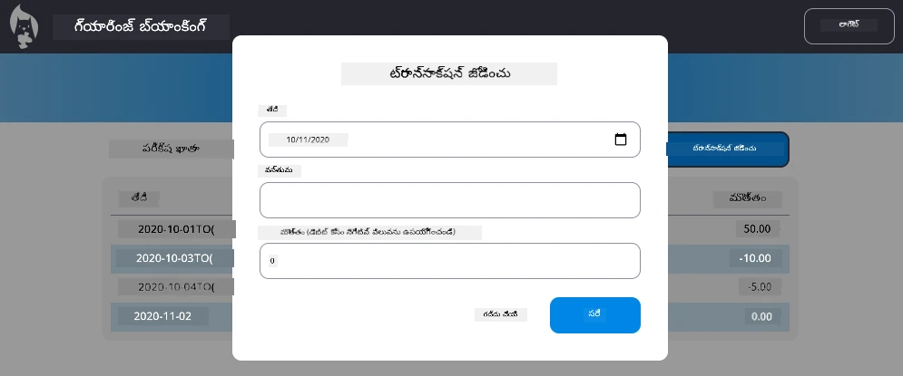

# "ట్రాన్సాక్షన్ చేర్పు" డైలాగ్ అమలు చేయండి

## అవలోకనం

మీ బ్యాంకింగ్ యాప్ ఇప్పుడు స్థిరమైన స్టేట్ మేనేజ్‌మెంట్ మరియు డేటా నిల్వను కలిగి ఉంది, కానీ ఇది నిజమైన బ్యాంకింగ్ యాప్స్‌కు అవసరమైన ఒక ముఖ్యమైన ఫీచర్ లేకుండా ఉంది: ఉపయోగదారులు తమ స్వంత ట్రాన్సాక్షన్లు చేర్చగల సామర్ధ్యం. ఈ అసైన్‌మెంట్‌లో, మీరు ఇప్పటికే ఉన్న స్టేట్ మేనేజ్‌మెంట్ సిస్టంలో సజావుగా ఏర్పడే పూర్తి "ట్రాన్సాక్షన్ చేర్పు" డైలాగ్‌ను అమలు చేస్తారు.

ఈ అసైన్‌మెంట్ మీరు నాలుగు బ్యాంకింగ్ పాఠాల్లో నేను విషయాలను సామరస్యంగా తీసుకొస్తుంది: HTML టెంప్లేటింగ్, ఫారం హ్యాండ్లింగ్, API ఇంటిగ్రేషన్, మరియు స్టేట్ మేనేజ్‌మెంట్.

## అభ్యాస లక్ష్యాలు

ఈ అసైన్‌మెంట్ పూర్తి చేసిన తర్వాత మీరు:
- **సృష్టించండి** డేటా ఎంట్రీ కోసం వినియోగదారుకు అనుకూలమైన డైలాగ్ ఇంటర్‌ఫేస్
- **అమలు చేయండి** కీబోర్డ్ మరియు స్క్రీన్ రీడర్ మద్దతుతో సులభంగా ప్రాప్తించగల ఫారం డిజైన్
- **ఇన్టిగ్రేట్ చేయండి** మీ ఇప్పటికే ఉన్న స్టేట్ మేనేజ్‌మెంట్ సిస్టంలో కొత్త ఫీచర్లను
- **ప్రాక్టీస్ చేయండి** API కమ్యూనికేషన్ మరియు ఎర్రర్ హ్యాండ్లింగ్‌లో
- **వినియోగించండి** ఆధునిక వెబ్ డెవలప్‌మెంట్ నమూనాలను వాస్తవ ప్రపంచ ఫీచర్‌కు

## సూచనలు

### దశ 1: ట్రాన్సాక్షన్ చేర్పు బటన్

మీ డాష్‌బోర్డ్ పేజీలో ఒక "ట్రాన్సాక్షన్ చేర్పు" బటన్ **సృష్టించండి**, ఇది వినియోగదారులు సులభంగా కనుగొని ప్రాప్తించగలగాలి.

**అవసరాలు:**
- బటన్‌ను డాష్‌బోర్డ్లో తగిన లాజికల్ ప్రాంతంలో **స్థాపించండి**
- స్పష్టమైన, చర్య-ఆధారిత బటన్ టెక్స్ట్ **ఉపయోగించండి**
- మీ ఇప్పటికే ఉన్న UI డిజైన్‌తో బటన్ **స్టైల్ చేయండి**
- బటన్ కీబోర్డ్ ద్వారా సులభంగా ప్రాప్తించదగినదిగా ఉండాలని **ఖచ్చితంగా చూసుకోండి**

### దశ 2: డైలాగ్ అమలు

మీ డైలాగ్ అమలుకు ఈ రెండు మార్గాల్లో ఏదైనా ఒకదాన్ని ఎంచుకోండి:

**ఎంపిక A: విడిగా పేజీ**
- ట్రాన్సాక్షన్ ఫారం కోసం ఒక కొత్త HTML టెంప్లేట్ **సృష్టించండి**
- మీ రూటింగ్ సిస్టంలో ఒక కొత్త రూట్ **చేర్చండి**
- ఫారం పేజీకి మరియు బయటకు **నావిగేషన్ అమలు చేయండి**

**ఎంపిక B: మోడల్ డైలాగ్ (సిఫార్సు చేయబడింది)**
- డాష్‌బోర్డ్ నుండి తప్పకుండా వెళ్లకుండా జావాస్క్రిప్ట్ ద్వారా డైలాగ్‌ను చూపించి/దాచండి
- [`hidden` ప్రాపర్టీ](https://developer.mozilla.org/docs/Web/HTML/Global_attributes/hidden) లేదా CSS తరగతులను ఉపయోగించి అమలు చేయండి
- సరైన ఫోకస్ మేనేజ్‌మెంట్‌తో సాఫీగా వినియోగదారుని అనుభవం సృష్టించండి

### దశ 3: సులభత్వ అమలు

మీ డైలాగ్ [మోడల్ డైలాగ్ సులభత్వ ప్రమాణాలు](https://developer.paciellogroup.com/blog/2018/06/the-current-state-of-modal-dialog-accessibility/)ను తీరుగా అందించినదిగా ఉండాలని **ఖచ్చితంగా జాగ్రత్త వహించండి**:

**కీబోర్డ్ నావిగేషన్:**
- డైలాగ్‌ను మూసేయడానికి ఎస్కేప్ కీ మద్దతు ఇవ్వండి
- డైలాగ్ తెరిచినపుడు ఫోకస్‌ను అంతర్కొనబెట్టండి
- డైలాగ్ మూసినపుడు ట్రిగ్గర్ బటన్‌కు ఫోకస్ తిరిగి ఇవ్వండి

**స్క్రీన్ రీడ‌ర్ మద్ద‌తు:**
- తగిన ARIA లేబుల్స్ మరియు పాత్రలు జోడించండి
- డైలాగ్ తెరుచు/మూసే సంఘటనలను స్క్రీన్ రీడ‌ర్‌లకు ప్రకటించండి
- క్లియర్ ఫామ్ ఫీల్డ్ లేబుల్స్ మరియు ఎర్రర్ సందేశాలు అందించండి

### దశ 4: ఫారం సృష్టి

ట్రాన్సాక్షన్ డేటాను సేకరించే HTML ఫారం **డిజైన్ చేయండి**:

**అవసరమైన ఫీల్డ్స్:**
- **తేదీ**: ట్రాన్సాక్షన్ జరిగిన తేదీ
- **వివరణ**: ట్రాన్సాక్షన్ ఏ కోసం ఉంది
- **మొత్తం**: ట్రాన్సాక్షన్ విలువ (ఆదాయం కోసం ধనాత్మక, ఖర్చుల కోసం ঋణాత్మక)

**ఫారమ్ ఫీచర్లు:**
- సమర్పించే ముందు వినియోగదారుని ఇన్‌పుట్‌ని **సరిచూసుకోండి**
- తప్పు డేటాకి స్పష్టమైన ఎర్రర్ సందేశాలు **అందించండి**
- సహాయక ప్లేస్‌హోల్డర్ టెక్స్ట్ మరియు లేబుల్స్ **జోడించండి**
- మీ ఇప్పటికే ఉన్న డిజైన్‌తో సమంజసం **ఉండేలా స్టైల్ చేయండి**

### దశ 5: API ఇంటిగ్రేషన్

మీ ఫారమ్‌ను బ్యాక్‌ఎండ్ API తో **కనెక్ట్ చేయండి**:

**అమలు దశలు:**
- [సర్వర్ API స్పెసిఫికేషన్లు](../api/README.md) పరిశీలించండి సరైన ఎండ్పాయింట్ మరియు డేటా ఫార్మాట్ కోసం
- మీ ఫారమ్ ఇన్‌పుట్‌ల నుండి JSON డేటా **సృష్టించండి**
- ఉచిత ఎర్రర్ హ్యాండ్లింగ్‌తో API కు డేటా పంపండి
- విజయవంతమవడం / విఫలమవడం సందేశాలను వినియోగదారుకు **ప్రదర్శించండి**
- నెట్‌వర్క్ సమస్యలను సరైన పద్ధతిలో **నిర్వహించండి**

### దశ 6: స్టేట్ మేనేజ్‌మెంట్ ఇంటిగ్రేషన్

కొత్త ట్రాన్సాక్షన్‌తో మీ డాష్‌బోర్డ్‌ను **అప్డేట్ చేయండి**:

**ఇంటిగ్రేషన్ అవసరాలు:**
- విజయవంతమైన ట్రాన్సాక్షన్ చేర్పు తర్వాత ఖాతా డేటాను **రీఫ్రెష్ చేయండి**
- పేజీ రీలోడ్ అవసరం లేకుండా డాష్‌బోర్డ్ ప్రదర్శనను **అప్డేట్ చేయండి**
- కొత్త ట్రాన్సాక్షన్ వెంటనే కనిపించేందుకు **ఖచ్చితత్వం వహించండి**
- మొత్తం ప్రాసెస్‌లో సరైన స్టేట్ అనుసరణ **కాలం నడవండి**

## సాంకేతిక స్పెసిఫికేషన్లు

**API ఎండ్పాయింట్ వివరాలు:**
[సర్వర్ API డాక్యుమెంటేషన్](../api/README.md) లో దొరుకుతుంది:
- ట్రాన్సాక్షన్ డేటా కోసం అవసరమైన JSON ఫార్మాట్
- HTTP పద్ధతి మరియు ఎండ్పాయింట్ URL
- సమాధానం సూచించబడిన ఫార్మాట్
- లోపం స్పందన నిర్వహణ

**అంచనా ఫలితం:**
ఈ అసైన్‌మెంట్ పూర్తి చేసిన తరువాత, మీ బ్యాంకింగ్ యాప్ పూర్తి ఉపయోగకరమైన "ట్రాన్సాక్షన్ చేర్పు" ఫీచర్‌ను కలిగి ఉండాలి, ఇది ప్రొఫెషనల్ రూపం మరియు ప్రవర్తన కలిగి ఉంటుంది:

## మీ అమలు పరీక్షించడం

**ప్రాయోగిక పరీక్ష:**
1. "ట్రాన్సాక్షన్ చేర్పు" బటన్ స్పష్టంగా కనపడుతుందా మరియు సులభంగా ప్రాప్తించగలదా **నిర్ధారించండి**
2. డైలాగ్ సరిగ్గా తెరవబడుతుందా మరియు మూసబడుతుందా **పరీక్షించండి**
3. అన్ని అవసరమైన ఫీల్డ్స్ కోసం ఫారమ్ వాలిడేషన్ పని చేస్తున్నదా **ధృవీకరించండి**
4. విజయవంతమైన ట్రాన్సాక్షన్లు వెంటనే డాష్‌బోర్డ్‌లో కనిపిస్తున్నాయా **పరిశీలించండి**
5. తప్పు డేటా మరియు నెట్‌వర్క్ సమస్యల కోసం ఎర్రర్ హ్యాండ్లింగ్ పనిచేస్తుందా **ఖాళీ చేయండి**

**సులభత్వ పరీక్ష:**
1. మొత్తం ఫ్లోలో కేవలం కీబోర్డ్ ఉపయోగిస్తూ నావిగేట్ చేయండి
2. స్క్రీన్ రీడర్‌తో పరీక్షించి సరైన ప్రకటనలు వస్తున్నాయని చూడు
3. ఫోకస్ మేనేజ్‌మెంట్ సరిగ్గా పని చేస్తుందా తనిఖీ చేయండి
4. అన్ని ఫారమ్ వస్తువులకు తగిన లేబుల్స్ ఉన్నాయా నిర్ధారించండి

## అంచనా ప్రమాణాలు

| ప్రమాణం | ఉదాత్తమైనది | సరిపోతుంది | మెరుగుదల అవసరం |
| -------- | --------- | -------- | ----------------- |
| **ఫంక్షనాలిటీ** | ట్రాన్సాక్షన్ చేర్పు ఫీచర్ అద్భుతమైన వినియోగదార అనుభవంతో సజావుగా పని చేస్తుంది మరియు పాఠాల నుండి ఉత్తమ ఆచారాలని పాటిస్తుంది | ట్రాన్సాక్షన్ చేర్పు ఫీచర్ సరిగ్గా పని చేస్తుంది కానీ కొన్ని ఉత్తమ ఆచారాలను పాటించకపోవచ్చు లేదా చిన్న వినియోగ సౌలభ్య సమస్యలు ఉండవచ్చు | ట్రాన్సాక్షన్ చేర్పు ఫీచర్ భాగస్వామ్యంగా పనిచేస్తుంది లేదా గణనీయమైన వినియోగ సమస్యలు కలిగి ఉంటుంది |
| **కోడ్ నాణ్యత** | కోడ్ బాగా వాడుకలో ఉన్న నమూనాలను అనుసరిస్తుంది, సరైన ఎర్రర్ హ్యాండ్లింగ్ కలిగి ఉంది, మరియు ఇప్పటికే ఉన్న స్టేట్ మేనేజ్‌మెంట్‌తో సజావుగా ఇంటిగ్రేట్ అవుతుంది | కోడ్ పనిచేస్తుంది కానీ संगठनలో కొన్ని సమస్యలు ఉండవచ్చు లేదా ఇప్పటికే ఉన్న కోడ్‌బేస్‌తో అసంపూర్ణ ప్యాటర్న్లు ఉండవచ్చు | కోడ్‌లో ప్రధాన నిర్మాణ సమస్యలు ఉన్నాయి లేదా ఇప్పటికే ఉన్న నమూనాలతో బాగు అనుసంధానం లేదు |
| **సులభత్వం** | పూర్తి కీబోర్డ్ నావిగేషన్ మద్దతు, స్క్రీన్ రీడర్ మాతృకత, మరియు WCAG మార్గదర్శకాలు పాటించి చాలా మంచి ఫోకస్ నిర్వహణతో | ప్రాథమిక సులభత్వ లక్షణాలు అమలు అయి ఉండవచ్చు కానీ కొంత కీబోర్డ్ నావిగేషన్ లేదా స్క్రీన్ రీడర్ మద్దతు లేకపోవచ్చు | ఎలాంటి లేదా చాలా తక్కువ సులభత్వ పరిగణనలు అమలులో ఉన్నాయి |
| **వినియోగదార అనుభవం** | సహజమైన, శ్రుష్టించబడిన ఇంటర్‌ఫేస్ స్పష్టమైన ఫీడ్‌బ్యాక్, సాఫీ ఇంటరాక్షన్లు మరియు ప్రొఫెషనల్ రూపాన్ని కలిగి ఉంది | మంచి వినియోగ అనుభవం కానీ ఫీడ్‌బ్యాక్ లేదా విజువల్ డిజైన్‌లో కొన్ని మెరుగుదలకు స్థలాలు ఉన్నాయి | అర్ధం వచ్చే విధంగా కాని ఇంటర్‌ఫేస్ లేదా వినియోగదారుని ఫీడ్‌బ్యాక్ లేకుండా ప్రారంబమైన అనుభవం |

## అదనపు సవాళ్లు (ఐచ్ఛికం)

మూలभૂત అవసరాలను పూర్తి చేసిన తర్వాత, ఈ మెరుగుదలలను పరిగణించండి:

**మెరుగైన ఫీచర్లు:**
- ట్రాన్సాక్షన్ విభాగాలను (భోజనం, రవాణా, వినోదం, మరియు այլն) **జోడించండి**
- రియల్‌టైం ఫీడ్‌బ్యాక్‌తో ఇన్‌పుట్ ధృవీకరణ **అమలు చేయండి**
- పవర్ యూజర్ల కోసం కీబోర్డ్ షార్ట్‌కట్స్ **సృష్టించండి**
- ట్రాన్సాక్షన్ సవరించడం మరియు తీసివేత సామర్ధ్యాలు **చేర్చండి**

**అధునాతన ఇంటిగ్రేషన్:**
- ఇటీవల చేర్చిన ట్రాన్సాక్షన్లు కోసం undo కార్యాచరణను **అమలు చేయండి**
- CSV ఫైళ్ల నుండి బల్క్ ట్రాన్సాక్షన్ దిగుమతిని **చేర్చండి**
- ట్రాన్సాక్షన్ శోధన మరియు వడపోత సామర్ధ్యాలను **సృష్టించండి**
- డేటా ఎగుమతి కార్యాచరణను **అమలు చేయండి**

ఇవే ఐచ్ఛిక ఫీచర్లు మీకు అధిక స్థాయి వెబ్ డెవలప్‌మెంట్ కాన్సెప్ట్‌లలో ప్రాక్టీస్ చేయడానికీ, మరింత పూర్తి బ్యాంకింగ్ అప్లికేషన్ సృష్టించడానికి సహాయపడతాయి!

---

<!-- CO-OP TRANSLATOR DISCLAIMER START -->
**నిరాకరణ**:  
ఈ డాక్యుమెంట్ AI అనువాద సేవ [Co-op Translator](https://github.com/Azure/co-op-translator) ఉపయోగించి అనువదించబడింది. మేము ఖచ్చితత్వానికి ఉపయోగపడేందుకు ప్రయత్నించినప్పటికీ, స్వయంచాలక అనువాదాల్లో తప్పులు లేదా లోపాలు ఉండవచ్చు. మూల డాక్యుమెంట్ దాని స్థానిక భాషలో అధికారికమైన మూలంగా భావించబడాలి. కీలక సమాచారం కోసం, నిపుణుల మానవ అనువాదాన్ని సూచిస్తాము. ఈ అనువాదం వలన ఏర్పడే ఏవైనా అపార్థాలు లేదా తప్పుదిద్దుబాట్లకు మేము బాధ్యులేము.
<!-- CO-OP TRANSLATOR DISCLAIMER END -->