<!--
CO_OP_TRANSLATOR_METADATA:
{
  "original_hash": "a9a3bcc037a447e2d8994d99e871cd9f",
  "translation_date": "2026-01-08T13:13:15+00:00",
  "source_file": "8-code-editor/1-using-a-code-editor/README.md",
  "language_code": "te"
}
-->
# కోడ్ ఎడిటర్ ఉపయోగించడం: VSCode.dev లో నైపుణ్యం పొందడం

*ది మ్యాట్రిక్స్* లో నీఓ డిజిటల్ ప్రపంచాన్ని యాక్సెస్ చేసేందుకు భారీ కంప్యూటర్ టర్మినల్ లోకి చేరాల్సి వచ్చినప్పుడు గుర్తుందా? ఈరోజు వెబ్ డెవలప్మెంట్ టూల్స్ విరుచుకొన్న కథాజల్లకే – ఎప్పుడైనా ఎక్కడైనా పొందగల శక్తివంతమైన సామర్థ్యాలు. VSCode.dev అనేది బ్రౌజర్-ఆధారిత కోడ్ ఎడిటర్, ఇది ఇంటర్నెట్ కనెక్షన్ ఉన్న ఏ డివైస్ కి అయినా ప్రొఫెషనల్ డెవలప్మెంట్ టూల్స్ తెస్తుంది.

ప్రింటింగ్ ప్రెస్ పుస్తకాలను ప్రతి ఒక్కరి వద్దకు చేరువ చేస్తుందని మठాలు లో ఉండేవారికే కాదు, అలా VSCode.dev కోడింగ్ ను ప్రజాస్వామ్యంగా చేస్తుంది. మీరు లైబ్రరీ కంప్యూటర్, పాఠశాల ప్రయోగశాల లేదా మీరు బ్రౌజర్ యాక్సెస్ ఉన్న ఎక్కడైనా ప్రాజెక్టులపై పని చేయవచ్చు. ఇన్‌స్టాలేషన్లు అవసరం లేదు, "నా ప్రత్యేక సెటప్ కావాలి" అనే పరిమితులు లేవు.

ఈ పాఠం చివరికి, మీరు VSCode.dev ను ఎలా నావిగేట్ చేయాలో, GitHub రిపోజిటరీలను మీ బ్రౌజర్ లోనే నేరుగా తెరవడం ఎలా చేయాలో, మరియు వెర్షన్ కంట్రోల్ కోసం Git ను ఉపయోగించడం ఎలా చేయాలో అర్ధం చేసుకుంటారు – ఇవి ప్రతిరోజూ ప్రొఫెషనల్ డెవలపర్ల యాదృచ్ఛిక నైపుణ్యాలు.

## ⚡ మీకు వచ్చే 5 నిమిషాల్లో చేయగల పని

**వ్యస్త డెవలపర్ల కోసం క్విక్ స్టార్ట్ మార్గం**


- **మినట్ 1**: [vscode.dev](https://vscode.dev) కి వెళ్లండి - ఇన్‌స్టాలేషన్ అవసరం లేదు
- **మినట్ 2**: GitHub తో సైన్ ఇన్ అయి మీ రిపోజిటరీలను కనెక్ట్ చేసుకోండి
- **మినట్ 3**: URL ట్రిక్కు ప్రయత్నించండి: ఏ రిపో URL లోనైనా `github.com` ని `vscode.dev/github` గా మార్చండి
- **మినట్ 4**: కొత్త ఫైల్ సృష్టించండి మరియు సింటాక్స్ హైలైటింగ్ ఆటోమేటిగ్గా ఎలా పని చేస్తుందో చూడండి
- **మినట్ 5**: ఒక మార్పు చేసి దాన్ని సోర్స్ కంట్రోల్ ప్యానెల్ ద్వారా కమిట్ చేయండి

**క్విక్ టెస్ట్ URL**:
```
# Transform this:
github.com/microsoft/Web-Dev-For-Beginners

# Into this:
vscode.dev/github/microsoft/Web-Dev-For-Beginners
```

**ఇది ఎందుకు ముఖ్యమో**: 5 నిమిషాల్లో, మీరు ఎక్కడైనా ప్రొఫెషనల్ టూల్స్ తో కోడింగ్ స్వేచ్ఛను అనుభవిస్తారు. ఇది డెవలప్మెంట్ భవిష్యత్తు – అందుబాటులో ఉన్నది, శక్తివంతమైనది మరియు తక్షణమే ప్రారంభించగలిగేది.

## 🗺️ క్లౌడ్-ఆధారిత డెవలప్మెంట్ ద్వారా మీ అభ్యాస ప్రయాణం

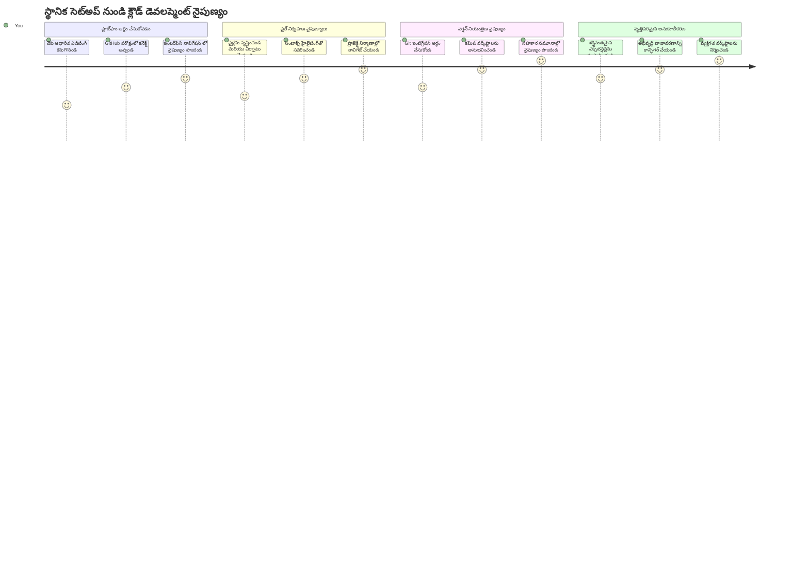
**మీ ప్రయాణ గమ్యం**: ఈ పాఠం చివరికి, మీరు ఏ డివైస్ నుండైనా పని చేసే ప్రొఫెషనల్ క్లౌడ్ డెవలప్మెంట్ ఎన్‌విరాన్‌మెంట్ లో నైపుణ్యం పొందుతారు, ఇది ప్రముఖ టెక్ కంపెనీల డెవలపర్లు ఉపయోగించే అదే టూల్స్‌తో కోడింగ్ చేయడానికి అనుమతిస్తుంది.

## మీరు నేర్చుకునే అంశాలు

మనము కలసి ఈ మార్గాన్ని వెళ్తే, మీరు చేయగలిగేది:

- VSCode.dev ని మీ రెండవ ఇంటిలా నావిగేట్ చేయడం – ఎటూ తప్పకుండా కోరుకున్నారు క్షేత్రాలన్నింటిని కనుగొనడం
- ఏ GitHub రిపాజిటరిని మీ బ్రౌజర్ లో తెరవడం మరియు వెంటనే ఎడిట్ చేయడం (ఇది మాయాజాలంలా ఉంటుంది!)
- Git ను ఉపయోగించి మీ మార్పులను ట్రాక్ చేయడం మరియు ఒక ప్రొఫెషనల్ లాగా ప్రగతిని సురక్షితం చేయడం
- కోడింగ్ వేగంగా మరియు మజాగా మారుస్తున్న ఎక్స్టెన్షన్లతో మీ ఎడిటర్ ని శక్తివంతం చేయడం
- ప్రాజెక్ట్ ఫైళ్ళను సృష్టించి, ఆర్గనైజ్ చేయడం

## మీకు అవసరమయ్యేది

అవసరాలు సూటిగా ఉన్నాయి:

- ఒక ఉచిత [GitHub ఖాతా](https://github.com) (తయారు లేకపోతే మేము సాయపడతాము)
- వెబ్ బ్రౌజర్లపై ప్రాథమిక పరిజ్ఞానం
- GitHub బేసిక్స్ పాఠం ఉపయోగకరమైన నేపథ్యం ఇస్తుంది, కానీ తప్పనిసరి కాదు

> 💡 **GitHub కొత్తవారా?** ఖాతా సృష్టించడం ఉచితం మరియు కొన్ని నిమిషాల్లో పూర్తి అవుతుంది. ఎలా లైబ్రరీ కార్డు ప్రపంచవ్యాప్తంగా పుస్తకాల యాక్సెస్ ఇస్తుందో, GitHub ఖాతా ఇంటర్నెట్ లోని కోడ్ రిపాజిటరీలకు దారులు తెరుస్తుంది.

## 🧠 క్లౌడ్ డెవలప్మెంట్ ఈకోసిస్టమ్ సమీక్ష

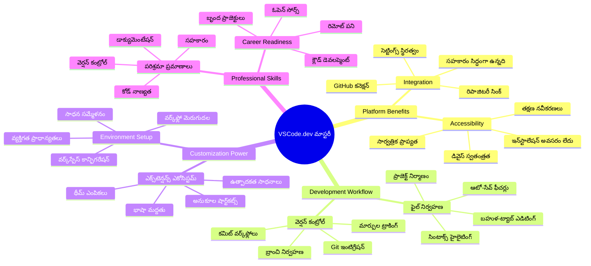
**ముఖ్య సూత్రం**: క్లౌడ్-ఆధారిత డెవలప్మెంట్ ఎన్‌విరాన్‌మెంట్‌లు కోడింగ్ యొక్క భవిష్యత్తును సూచిస్తాయి – ప్రొఫెషనల్ గ్రేడ్ టూల్స్ అందుబాటులో ఉండటం, సహకారాత్మకంగా ఉండటం, మరియు ప్లాట్‌ఫారమ్-స్వతంత్రంగా ఉండటం.

## వెబ్-ఆధారిత కోడ్ ఎడిటర్ల ప్రాముఖ్యత

ఇంటర్నెట్ ముందు, వివిధ విశ్వవిద్యాలయాలలో శాస్త్రవేత్తలు సులభంగా పరిశోధన పత్రాలను పంచుకునేందుకు వీలు ఉండేది కాదు. ఆ తరువాత 1960లలో ARPANET వచ్చింది, ఇది కొంప్యూటర్లను దూరాలుగా కనెక్ట్ చేసింది. వెబ్-ఆధారిత కోడ్ ఎడిటర్లు అదే సూత్రం అనుసరిస్తాయి – మీ భౌతిక స్థలమేమీ, ఏ డివైస్ వాడుతున్నా శక్తివంతమైన టూల్స్ అందుబాటులో చేయడం.

కోడ్ ఎడిటర్ మీ అభివృద్ధి వర్క్‌స్పేస్ గా పనిచేస్తుంది, అక్కడ మీరు కోడ్ ఫైళ్లను రాయడం, సరిచూడడం మరియు ఆర్గనైజ్ చేయడం చేస్తారు. సాదా టెక్స్ట్ ఎడిటర్ల కన్నా వేరుగా, ప్రొఫెషనల్ కోడ్ ఎడిటర్లు సింటాక్స్ హైలైటింగ్, దోష గుర్తింపు మరియు ప్రాజెక్ట్ నిర్వహణ ఫీచర్‌లు అందిస్తాయి.

VSCode.dev ఈ సామర్థ్యాలను మీ బ్రౌజర్ కి వస్తుంది:

**వెబ్-ఆధారిత ఎడిటింగ్ లాభాలు:**

| ఫీచర్ | వివరణ | ఆచరణాత్మక లాభం |
|---------|-------------|----------|
| **ప్లాట్‌ఫారమ్ స్వతంత్రత** | ఏ బ్రౌజర్ ఉన్న ఏ డివైస్ పై వాడవచ్చు | విభిన్న కంప్యూటర్లతో సజావుగా పనిచేయచ్చు |
| **ఇన్‌స్టాలేషన్ అవసరం లేదు** | వెబ్ URL ద్వారా యాక్సెస్ | సాఫ్ట్‌వేర్ ఇన్‌స్టాలేషన్ పరిమితులను అధిగమించండి |
| **ఆటోమేటిక్ అప్‌డేట్లు** | ఎప్పుడూ తాజా వెర్షన్ పని చేస్తుంది | కొత్త ఫీచర్లను మాన్యువల్ అప్‌డేట్ లేని పొందండి |
| **రిపాజిటరి ఇంటిగ్రేషన్** | GitHub కి నేరుగా కనెక్షన్ | స్థానిక ఫైల్ నిర్వహణ లేకుండా కోడ్ ఎడిట్ చేయండి |

**ప్రాక్టికల్ ప్రభావాలు:**
- వేరువేరు యావత్తు వాతావరణాలలో పని కొనసాగింపు
- ఆపరేటింగ్ సిస్టమ్ పై సంబంధం లేకుండా సరికొత్త ఇంటర్ఫేస్
- తక్షణ సహకారం
- స్థానిక నిల్వ అవసరాలు తగ్గాయి

## VSCode.dev ని అన్వేషించడం

మేరీ క్యూనీ యొక్క ప్రయోగశాల సరళమైన స్థలంలో అధిక శక్తివంతమైన పరికరాలు ఉన్నట్టు, VSCode.dev కూడా ప్రొఫెషనల్ డెవలప్మెంట్ టూల్స్ ని బ్రౌజర్ ఇంటర్ఫేస్‌లో సంక్రమిస్తుంది. ఈ వెబ్ అప్లికేషన్ డెస్క్‌టాప్ కోడ్ ఎడిటర్లు లాంటి ముఖ్యమైన ఫంక్షనాలిటీ ఇస్తుంది.

ప్రారంభించే ముందు, మీ బ్రౌజర్‌లో [vscode.dev](https://vscode.dev) ని తెరవండి. ఈ ఇంటర్ఫేస్ డౌన్‌లోడ్లు లేదా సిస్టమ్ ఇన్‌స్టాలేషన్లు అవసరం లేకుండా లోడ్ అవుతుంది – క్లౌడ్ కంప్యూటింగ్ సూత్రాల ప్రత్యక్ష అన్వయము.

### మీ GitHub ఖాతాను కనెక్ట్ చేసుకోవడం

అలెగ్జాండర్ గ్రాహం బెల్ టెలిఫోన్ దూర ప్రాంతాలను కనెక్ట్ చేసినట్టు, మీ GitHub ఖాతాను లింక్ చేయడం VSCode.dev మరియు మీ కోడ్ రిపాజిటరీల మధ్య సంధి స్థాపిస్తుంది. GitHub తో సైన్ ఇన్ చేయమని అడిగినప్పుడు ఈ కనెక్షన్ ని అంగీకరించడం మంచిది.

**GitHub ఇంటిగ్రేషన్ ఇస్తుంది:**
- ఎడిటర్‌లోని మీ రిపాజిటరీలకు నేరుగా యాక్సెస్
- పరికరాల మధ్య సమకాలీకృత సెట్టింగ్లు మరియు ఎక్స్టెన్షన్లు
- GitHub కి సులభతర సేవ్ వర్క్‌ఫ్లో
- వ్యక్తిగత అభివృద్ధి వాతావరణం

### మీ కొత్త వర్క్‌స్పేస్ ను తెలుసుకోవడం

అన్ని లోడ్ అయ్యాక, మీరు ఒక అందమైన, శుభ్రంగా ఉన్న వర్క్‌స్పేస్ ను చూడగలుగుతారు, ఇది మీ కోడ్ మీదే దృష్టి పెట్టే రీతిలో రూపొందించబడింది!

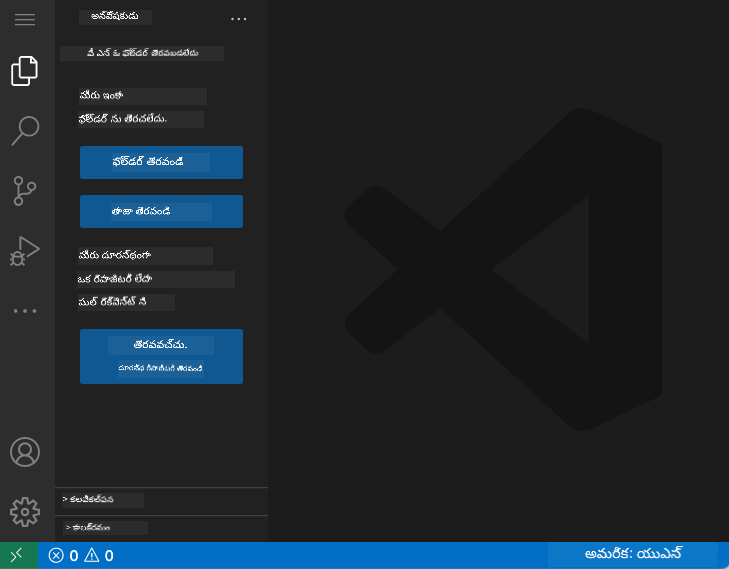

**ఇది మీ పరిసరాల టూర్:**
- **యాక్టివిటీ బార్** (ఎడమవైపు అక్కడ గల స్ట్రిప్): మీ ప్రధాన నావిగేషన్, ఇందులో Explorer 📁, Search 🔍, Source Control 🌿, Extensions 🧩, Settings ⚙️ ఉన్నాయి
- **సైడ్బార్** (దాని పక్కన ఉన్న ప్యానెల్): మీరు ఎంచుకున్న అంశాల ఆధారంగా సంబంధిత సమాచారాన్ని చూపిస్తుంది
- **ఎడిటర్ ఏరియా** (మధ్యలో ఉన్న పెద్ద స్థలం): ఇదే మీ ప్రధాన కోడింగ్ ఏరియా, ఇక్కడ మ్యాజిక్ జరుగుతుంది

**కొద్దిగా సమయం తీసుకుని అన్వేషించండి:**
- ఆ యాక్టివిటీ బార్ ఐకాన్లను క్లిక్ చేసి వాటి పనితీరును చూడండి
- సైడ్బార్ ఎలా వివిధ సమాచారం చూపుతుందో గమనించండి – చాలా బాగుంది కదా?
- Explorer దృష్టి (📁) మీ ఎక్కువ సమయం గడుపే ప్రదేశం కావచ్చు, అలాగైతే ఇందులో సర్దుబాటు అవ్వండి

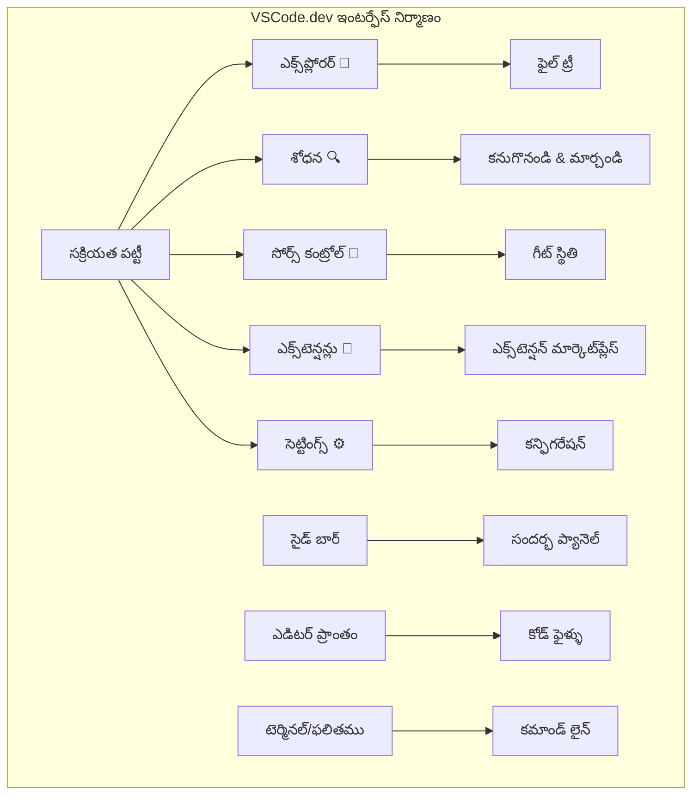
## GitHub రిపాజిటరీలను తెరవడం

ఇంటర్నెట్ ముందు, పరిశోధకులు పుస్తకాలయాలకు దస్త్రాలు పొందేందుకు ప్రయాణం చేయాల్సి వచ్చేది. GitHub రిపాజిటరీలు ఇలాంటి కోడ్ సమాహారాలు, అవి దూరంగా నిల్వ ఉంటాయి. VSCode.dev స్థానిక మెషీన్ లో డౌన్‌లోడ్ చేసుకోకుండా డైరెక్ట్ గా ఏ పబ్లిక్ రిపాజిటరీ ను వీక్షించడానికి, ఎడిట్ చేయడానికి లేదా సహకరించడానికి వీలు కలిపిస్తుంది.

రిపాజిటరీలను తెరవడానికి రెండు విధానాలు ఉన్నాయి:

### పద్ధతి 1: పాయింట్-అండ్-క్లిక్ విధానం

మీరు VSCode.dev లో కొత్తగా మొదలవుతున్నప్పుడు నిర్దిష్ట రిపాజిటరీ ను తెరవడానికి ఇది సరిగ్గా సరిపోతుంది. ఇది సింపుల్ మరియు మొదటి సారి వాడగలిగేది:

**ఇహా ఎలా చేయాలి:**

1. మీరు ఇప్పటికే అక్కడ లేరని అయితే [vscode.dev](https://vscode.dev) కి వెళ్లండి
2. వేదిలు స్క్రీన్ పై "Open Remote Repository" బటన్ కోసం చూడండి, దాన్ని క్లిక్ చేయండి

   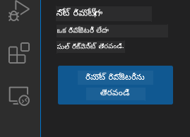

3. ఏ GitHub రిపాజిటరీ URL ను పేస్ట్ చేయండి (ఈ URL ప్రయత్నించండి: `https://github.com/microsoft/Web-Dev-For-Beginners`)
4. ఎంటర్ నొక్కండి మరియు మ్యాజిక్ జరుగుతున్నది చూడండి!

**ప్రొ టిప్ - కమాండ్ ప్యాలెట్ షార్ట్‌కట్:**

మీరు కోడింగ్ విజార్డ్ లాంటి అనుభూతి కోరుకుంటే, Ctrl+Shift+P (లేదా Mac మీద Cmd+Shift+P) ని ఉపయోగించి కమాండ్ ప్యాలెట్ తెరవండి:

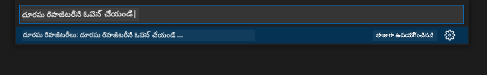

**కమాండ్ ప్యాలెట్ అనేది మీరు చేయగల సినిమాల కోసం ఒక సెర్చ్ ఇంజిన్ లాంటిది:**
- "open remote" టైప్ చేయండి, అది మీకు రిపాజిటరీ ఓపెనర్ కనుగొంటుంది
- ఇది మీరు ఇటీవల తెరిచిన రిపాజిటరీలను గుర్తుంచుకుంటుంది (చాలా ఉపయోగకరం!)
- మీరు దీనికి అలవాటు అవ్వగానే, మీరు అలాంటి వేగంతో కోడింగ్ చేస్తున్నట్టు అనిపిస్తుంది
- ఇది వాస్తవానికి VSCode.dev లో "హే సిరి, కానీ కోడింగ్ కొరకు"

### పద్ధతి 2: URL మార్పు సాంకేతికత

HTTP మరియు HTTPS వేర్వేరు ప్రోటోకాల్స్ వాడండి మరియు అదే డొమైన్ స్ట్రక్చర్ నిలిపి ఉంచడం లాంటిది, VSCode.dev కూడా GitHub అడ్రెసింగ్ సిస్ట్‌మ్ ని అనుసరించే URL నమూనాను వాడుతుంది. ఏ GitHub రిపాజిటరీ URL ను కూడా VSCode.dev లో నేరుగా తెరవడానికి మార్చవచ్చు.

**URL మార్పిడినిః**

| రిపాజిటరీ రకం | GitHub URL | VSCode.dev URL |
|----------------|---------------------|----------------|
| **పబ్లిక్ రిపాజిటరీ** | `github.com/microsoft/Web-Dev-For-Beginners` | `vscode.dev/github/microsoft/Web-Dev-For-Beginners` |
| **వ్యక్తిగత ప్రాజెక్ట్** | `github.com/your-username/my-project` | `vscode.dev/github/your-username/my-project` |
| **ఏ యాక్సెసిబుల్ రిపో** | `github.com/their-username/awesome-repo` | `vscode.dev/github/their-username/awesome-repo` |

**అమలు:**
- `github.com` ని `vscode.dev/github` తో మార్చండి
- ఇతర అన్ని URL భాగాలను మార్చకండి
- ఏ పబ్లిక్‌గా యాక్సెసబుల్ రిపాజిటరీకి వర్క్సులు
- తక్షణ ఎడిటింగ్ యాక్సెస్ ఇస్తుంది

> 💡 **జీవితం మార్చే చిట్కా**: మీ ఇష్టమైన రిపాజిటరీల యొక్క VSCode.dev సంస్కరణలకు బుక్‌మార్క్ చేయండి. నాకు "Edit My Portfolio" మరియు "Fix Documentation" వంటి బుక్‌మార్కులు ఉన్నాయి, ఇవి నేరుగా ఎడిటింగ్ మోడ్ కి తీసుకెళతాయి!

**ఏ పద్ధతిని ఉపయోగించాలి?**
- **ఇంటర్ఫేస్ విధానం**: మీరు అన్వేషిస్తుంటే లేదా ఖచ్చితమైన రిపాజిటరీ పేర్లు గుర్తు లేకపోతే బాగా సరిపోతుంది
- **URL ట్రిక్**: మీరు ఎక్కడికి వెళ్తున్నారో తెలియనివ్వగా వేగంగా యాక్సెస్ కావడానికి పరిపూర్ణం

### 🎯 పాఠ్య ప్రమాణం: క్లౌడ్ డెవలప్మెంట్ యాక్సెస్

**ఒక్కడిగా ఆలోచించండి**: మీరు వెబ్ బ్రౌజర్ ద్వారా కోడ్ రిపాజిటరీలను యాక్సెస్ చేసేందుకు రెండు పద్ధతులు నేర్చుకున్నారు. ఇది డెవలప్మెంట్ విధానంలో ఒక ప్రాథమిక మార్పును సూచిస్తుంది.

**త్వరిత స్వయం-అంచనా:**
- వెబ్-ఆధారిత ఎడిటింగ్ సాధారణ "డెవలప్మెంట్ వాతావరణ సెటప్"లను తొలగించడంలో ఎట్లాంటి కీలక పాత్ర వహిస్తుంది?
- URL మార్పు సాంకేతికత స్థానిక git క్లోనింగ్ కంటే ఎలాంటి ప్రయోజనాలు కలిగి ఉంది?
- ఈ విధానం మీరు ఓపెన్ సోర్స్ ప్రాజెక్టులకు సహకరించే విధానాన్ని ఎలా మార్చుతుంది?

**ప్రాక్టికల్ అనుసంధానం**: GitHub, GitLab, మరియు Replit వంటి ప్రధాన కంపెనీలు తమ అభివృద్ధి వేదికలను ఈ క్లౌడ్-ఫస్ట్ సూత్రాల చుట్టూ నిర్మించాయి. మీరు ప్రొఫెషనల్ అభివృద్ధి బృందాలు ఉపయోగించే అదే వర్క్‌ఫ్లోలను నేర్చుకుంటున్నారు.

**సవాలు ప్రశ్న**: క్లౌడ్-ఆధారిత డెవలప్మెంట్ స్కూల్‌ల్లో కోడింగ్ నేర్పించే విధానాన్ని ఎలా మార్చగలదు? డివైస్ అవసరాలు, సాఫ్ట్‌వేర్ నిర్వహణ, మరియు సహకార అవకాశాలను పరిగణించండి.

## ఫైళ్ళతో మరియు ప్రాజెక్టుల‌తో పని చేయడం

ఇప్పుడు మీరు రిపాజిటరీ ఓపెన్ చేసుకున్నారని, ఇప్పుడీ నిర్మాణం ప్రారంభిద్దాం! VSCode.dev మీకు కోడ్ ఫైళ్ళను సృష్టించడానికి, సవరించడానికి మరియు క్రమపద్దతిలో పెట్టడానికి కావాల్సిన ప్రతిదీ ఇస్తుంది. దీన్ని మీ డిజిటల్ వర్క్‌షాప్ లాగా ఆలోచించండి – ప్రతి టూల్ మీరు కావాల్సిన చోటే ఉంటుంది.

మనం రోజువారీ పనులలోకి జారుద్దాం, ఇవి మీ కోడింగ్ వర్క్‌ఫ్లోలో ఎక్కువ భాగాన్ని కదుల్తాయి.

### కొత్త ఫైళ్ళను సృష్టించడం

ఒక అర్కిటెక్ట్ స్థలంలో బ్లూప్రింట్లను క్రమంలో పెట్టడం లాగా, VSCode.dev లో ఫైల్ సృష్టి ఒక నిర్మాణపూర్వక ప్రక్రియను అనుసరిస్తుంది. సిస్టమ్ అన్ని ప్రామాణిక వెబ్ డెవలప్మెంట్ ఫైల్ రకాల్ని సరైనంత మద్దతు ఇస్తుంది.

**ఫైల్ సృష్టి ప్రాసెస్:**

1. ఎక్స్‌ప్లోరర్ సైడ్బార్ లో లక్ష్య ఫోల్డర్ కి వెళ్లండి
2. ఫోల్డర్ పేరుపై హోవర్ చేసి "న్యూ ఫైల్" ఐకాన్ (📄+) కనిపెడండి
3. ఫైల్ పేరు, సరైన ఎక్స్‌టెన్షన్ తో నమోదు చేయండి (`style.css`, `script.js`, `index.html`)
4. ఫైల్ సృష్టించేందుకు Enter నొక్కండి


**పేర్కొన్న నియమాలు:**
- ఫైల్ ఉద్దేశ్యాన్ని తెలియజేసే వివరణాత్మక పేర్లను ఉపయోగించండి
- సరైన సింటాక్స్ హైలైటింగ్ కోసం ఫైల్ ఎక్స్‌టెన్షన్లు ఇవ్వండి
- ప్రాజెక్టుల నిడివిలో నిరంతరమైన పేరు పద్ధతులను అనుసరించండి
- ఖాళీల స్థానంలో చిన్న అక్షరాలు మరియు హైఫెన్లు ఉపయోగించండి

### ఫైళ్లను ఎడిట్ చేసి సేవ్ చేయడం

ఇది అసలు మజా మొదలయ్యే స్థలం! VSCode.dev ఎడిటర్ చాలా ఉపయోగకరమైన ఫీచర్లతో నిండి ఉంటుంది, ఇవి కోడింగ్ సాఫిగా మరియు సహజంగా అనిపించేలా చేస్తాయి. ఇదే ఒక తెలివైన రచనా సహాయకుడు వంటిదే, కోడ్ కొరకు.

**మీ ఎడిట్ వర్క్‌ఫ్లో:**

1. ఎక్స్‌ప్లోరర్ లో ఏ ఫైల్ ఉన్నా క్లిక్ చేయండి, అది ప్రధాన భాగంలో తెరుస్తుంది
2. టైప్ చేయడం ప్రారంభించారు కాబట్టి, VSCode.dev రంగులు, సూచనలు, దోషాల గుర్తింపు తో సహాయపడుతుంది
3. Ctrl+S (Windows/Linux) లేదా Cmd+S (Mac) తో సేవ్ చేయండి – అయినా ఇది ఆటోమేటిగ్గా సేవ్ వర్క్ చేస్తుంది!

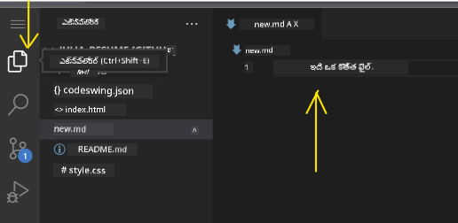

**మీరు కోడ్ చేస్తున్నప్పుడు జరిగే చల్లగా ఫీచర్లు:**
- మీ కోడ్ అందంగా రంగుల కోడ్ తో చూపబడుతుంది, చదవడమనే సులభం అవుతుంది
- VSCode.dev టైప్ చేస్తున్నపుడు పూర్తి సూచనలు ఇస్తుంది (ఆటోకరెక్ట్ లాగా, కాని చాలా తెలివిగా)
- మీరు సేవ్ చేయక ముందే తప్పుల్ని పట్టుకుంటుంది
- బ్రౌజర్ లాగా, పలు ఫైళ్ళను టాబ్స్ లో ఓపెన్ చేయవచ్చు
- అన్ని పనులు బ్యాక్గ్రౌండ్ లో ఆటోమేటిగ్గా సేవ్ అవుతాయి

> ⚠️ **త్వరిత చిట్కా**: ఆటో-సేవ్ ఉన్నప్పటికీ, Ctrl+S లేదా Cmd+S నొక్కడం మంచిది. ఇది వెంటనే సేవ్ చేస్తుంది మరియు దోష నిర్ధారణ వంటి అదనపు ఫీచర్లను సక్రియం చేస్తుంది.

### Git తో వెర్షన్ కంట్రోల్

ప్రాచీనత శాస్త్రవేత్తలు తవ్వక పొరల వివరమైన రికార్డులు సృష్టించడం లాగా, Git మీ కోడ్ లో మార్పులను గడచిన కాలంలో ట్రాక్ చేస్తుంది. ఈ సిస్టమ్ ప్రాజెక్టు చరిత్రను కాపాడుతుంది, అవసరం అయితే మీరు పూర్వపు వెర్షన్లకు తిరిగి వెళ్ళవచ్చు. VSCode.dev అంతర్గత Git ఫంక్షనాలిటీని కలిగి ఉంది.

**సోర్స్ కంట్రోల్ ఇంటర్ఫేస్:**

1. యాక్టివిటీ బార్ లోని 🌿 ఐకాన్ ద్వారా సోర్స్ కంట్రోల్ ప్యానెల్ ని యాక్సెస్ చేయండి
2. మారిన ఫైళ్ళు "Changes" విభాగంలో కనిపిస్తాయి
3. మార్పులను సూచించడానికి రంగు కోడింగ్ ఉంటుంది: చేనీయుని గ్రీన్, తొలగింపులకి రెడ్

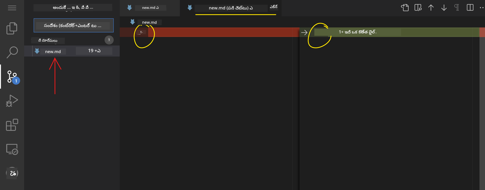

**మీ పని సేవ్ చేయడం (కమిట్ వర్క్‌ఫ్లో):**

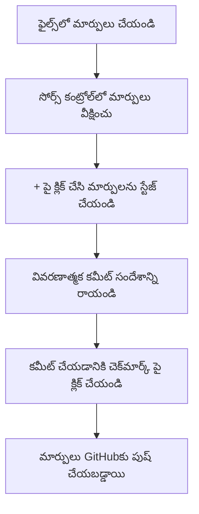
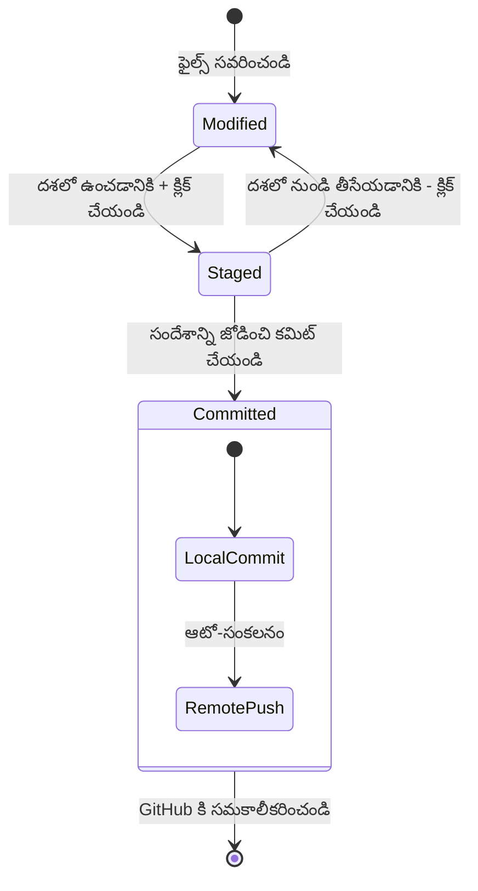
**మీ స్టెప్-బై-స్టెప్ ప్రక్రియ ఇలా ఉంటుంది:**
- సేవ్ చేయదలచిన ఫైళ్ళ పక్కన ఉన్న "+" ఐకాన్ క్లిక్ చేయండి (ఇది వాటిని "స్టేజ్" చేస్తుంది)
- మీరు స్టేజ్డ్ చేసిన అన్ని మార్పులతో సంతృప్తిగా ఉన్నారని ద్విగుణంగా తనిఖీ చేయండి
- మీరు చేసినది ఏమిటి అనే విషయంలో చిన్న గమనిక రాయండి (ఇది మీ "కమిట్ సందేశం")
- అన్ని సంగతులను GitHub కు సేవ్ చేయడానికి చెక్మార్క్ బటన్ క్లిక్ చేయండి
- మీరు ఏదైనా విషయంలో ఆలోచన మార్చుకుంటే, అన్‌డూ చిహ్నం మార్పులను వదిలి వేయడానికి సహాయపడుతుంది

**మంచి కమిట్ సందేశాలు రాయడం (ఇది మీరు భావించేదానికంటే సులభం!):**
- మీరు చేసినది సాదా మాటల్లో వర్ణించండి, ఉదా: "కాంటాక్ట్ ఫారమ్ జోడించు" లేదా "తొగిన నావిగేషన్ సరి చెయ్యి"
- దీన్ని చిన్నది మరియు సరళంగా ఉంచండి – ట్వీట్ పొలిమితి లాగా, వ్యాసం కాదు
- "Add", "Fix", "Update", లేదా "Remove" వంటి క్రియాపదాలతో మొదలుపెట్టండి
- **మంచి ఉదాహరణలు**: "Add responsive navigation menu", "Fix mobile layout issues", "Update colors for better accessibility"

> 💡 **త్వరిత నావిగేషన్ సూచన**: మీ GitHub రిపాజిటరీ దగ్గరకు తిరిగి వెళ్లడానికి మరియు మీ కమిట్ చేసిన మార్పులను ఆన్‌లైన్‌లో చూడడానికి ఎడమ పైన ఉన్న హాంబర్గర్ మెను (☰) ఉపయోగించండి. ఇది మీ ఎడిటింగ్ వాతావరణం మరియు GitHub లో మీ ప్రాజెక్ట్ హోమ్ మధ్యలోని ద్వారంలా ఉంటుంది!

## విస్తరణలతో ఫంక్షనాలిటీ పెంపు

ఒక కార్మికుడి కార్యాలయం వివిధ పనులకు ప్రత్యేకమైన పరికరాలు కలిగి ఉండేలా, VSCode.dev ప్రత్యేక సామర్థ్యాలు జోడించే విస్తరణలతో అనుకూలీకరించవచ్చు. ఈ సామాజికంగా అభివృద్ధి అయిన ప్లగిన్లు కోడ్ ఫార్మాటింగ్, ప్రత్యక్ష ప్రివ్యూ మరియు మెరుగైన Git అనుసంధానం వంటి సాధారణ అభివృద్ధి అవసరాలను పరిష్కరిస్తాయి.

విస్తరణ మార్కెట్‌ప్లేస్ ప్రపంచవ్యాప్తంగా డెవలపర్స్ తయారుచేసిన వేలల ఆఫర్‌ల ఉచిత పరికరాలను కలిగిఉంటుంది. ప్రతీ విస్తరణ workflow లోని ప్రత్యేక సమస్యలను పరిష్కరిస్తూ మీ వ్యక్తిగత అభిరుచి మరియు అవసరాలకు తగిన అభివృద్ధి వాతావరణాన్ని నిర్మించడానికి అవకాశం ఇస్తుంది.

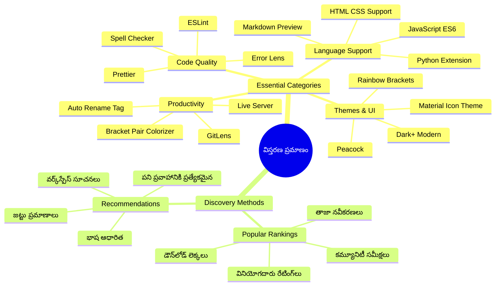
### మీకు సరిపోయే విస్తరణలను కనుగొనడం

విస్తరణ మార్కెట్‌ప్లేస్ చాలా బాగా అమర్చబడి ఉంటుంది, కావలసినదాన్ని కనుగొనటంలో మీరు తప్పిపోవట్లేదు. ఇది మీరు కాదు తెలుసుకున్న భిన్నమైన సాధనాలు మరియు చల్లగా ఉన్న వాటిని కనుగొనడంలో సహాయపడటానికి రూపుదిద్దబడింది!

**మార్కెట్‌ప్లేస్‌కు చేరుకోవడం:**

1. Activity Bar లో గల విస్తరణలు చిహ్నం (🧩) నొక్కండి
2. చుట్టూ వీక్షించండి లేదా ఏదైనా ప్రత్యేకమైనది కోసం శోధించండి
3. ఆసక్తికరంగా కనిపించే దానిపై క్లిక్ చేసి మరిన్ని వివరాలు తెలుసుకోండి

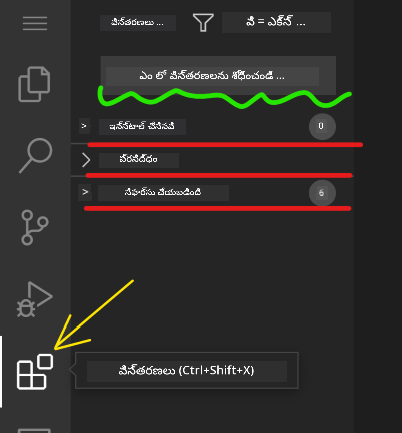

**అక్కడ మీరు చూచేది:**

| విభాగం | లో ఉన్నది | ఎందుకు ఉపయోగకరం |
|----------|---------|----------|
| **ఇన్‌స్టాల్ చేసుకున్నవి** | మీరు ఇప్పటికే జోడించిన విస్తరణలు | మీ వ్యక్తిగత కోడింగ్ కిట్ |
| **ప్రాచుర్యం** | ఎక్కువ మందికి ఇష్టమైనవి | అత్యధిక డెవలపర్లు నమ్మే వాటి |
| **సిఫార్సులు** | మీ ప్రాజెక్టుకు స్మార్ట్ సలహాలు | VSCode.dev యొక్క సహాయ సూచనలు |

**బ్రౌజింగ్ సులభతరం చేసే అంశాలు:**
- ప్రతి విస్తరణ రేటింగ్లు, డౌన్‌లోడ్ సంఖ్యలు, నిజమైన వినియోగదారు సమీక్షలతో చూపబడుతుంది
- అవి ఎప్పుడూ స్క్రీన్షాట్లు మరియు స్పష్టమైన వివరణలను అందిస్తాయి
- అన్ని స్పష్టంగా అనుకూలత సమాచారంతో గుర్తింపు పొందుతాయి
- సమానమైన విస్తరణలు సూచిస్తారు కాబట్టి మీరు ఎంపికలు సరిపోల్చుకోవచ్చు

### విస్తరణలను ఇన్‌స్టాల్ చేయడం (ఇది చాలా సులభం!)

మీ ఎడిటర్‌కు కొత్త శక్తులను జోడించడం ఒక బటన్ నొక్కడమే. విస్తరణలు సెకన్లలో ఇన్‌స్టాల్ అవుతాయి మరియు వెంటనే పని ప్రారంభిస్తాయి – రీస్టార్ట్ అవసరం లేదు, వేచి ఉండాల్సిన అవసరం లేదు.

**మీకు కావలసినది ఇక్కడ ఉంది:**

1. మీరు కావలసినది కోసం శోధించండి (ఉదా: "live server" లేదా "prettier" అని శోధించండి)
2. మంచి అనిపించే దానిపై క్లిక్ చేసి మరిన్ని వివరాలు తెలుసుకోండి
3. అది ఏమి చేస్తుందో చదివి రేటింగ్లను చూడండి
4. ఆ నీలం "Install" బటన్‌ను నొక్కండి, అంతే!


**వెనకన జరుగేది:**
- విస్తరణ స్వయంచాలకంగా డౌన్‌లోడ్ చేసుకుని సెటప్ అవుతుంది
- మీ ఇంటర్ఫేస్‌లో కొత్త ఫీచర్లు వెంటనే కనిపిస్తాయి
- అన్నీ వెంటనే పని ప్రారంభిస్తాయి (గేగించకుండా, నిజంగానే ఇది అంత వేగంగా!)
- మీరు సైన్ ఇన్ అయితే, విస్తరణ మీ అన్ని పరికరాలు మధ్య సమకాలీకరించబడుతుంది

**కొన్ని నేను సిఫారసు చేసే విస్తరణలు:**
- **Live Server**: కోడ్ చేసే సమయానికే మీ వెబ్‌సైట్ అప్‌డేట్ అయ్యి చూపిస్తుంది (ఇది చక్రవ్యూహం!)
- **Prettier**: మీ కోడ్‌ను స్వయంచాలకంగా శుభ్రంగా మరియు ప్రొఫెషనల్‌గా మార్చుతుంది
- **Auto Rename Tag**: ఒక HTML ట్యాగ్ మార్చగానే దాని భాగస్వామి కూడా మార్చబడుతుంది
- **Bracket Pair Colorizer**: మీ బ్రాకెట్లకు వేరు రంగులు ఇస్తుంది కాబట్టి మీరు ఎటిది ఎటిదో తప్పకుండా అర్థం చేసుకుంటారు
- **GitLens**: Git లక్షణాలను మీకు చాలా సహాయపడే సమాచారంతో మెరపెడుతుంది

### మీ విస్తరణలను అనుకూలీకరించడం

చాలా విస్తరణలకు సొంత సెట్టింగ్స్ ఉంటాయి, మీరు వాటిని సర్దుబాటు చేసి మీకు కావలసిన విధంగా చేసుకోవచ్చు. ఇది కారు సీటు మరియు దర్పణాలను సర్దుకునేలా – ప్రతీ వ్యక్తికి తనంగానే ప్రాధాన్యతలు ఉంటాయి!

**విస్తరణ సెట్టింగ్స్ సర్దుబాటు చేయడం:**

1. విస్తరణలు ప్యానెల్లో మీ ఇన్‌స్టాల్ చేసిన విస్తరణను కనుగొనండి
2. దాని పేరుకు పట్టం విరిగిన చిన్న గేర్ చిహ్నం (⚙️) కనిపిస్తే నొక్కండి
3. డ్రాప్‌డౌన్ నుంచి "Extension Settings" ఎంచుకోండి
4. మీ workflow కి సరిగ్గా సరిపడేలా అన్ని విషయాలు సరిచూడండి

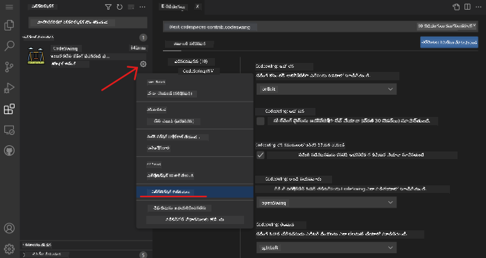

**మీరు సర్దుకోవచ్చు అనుకుంటే ఉన్న సాధారణ విషయాలు:**
- మీ కోడ్ ఎలా ఫార్మాట్ అవుతుందో (టాబ్‌లు లేదా స్పేసులు, లైన్ పొడవు, మొదలయినవి)
- వివిధ చర్యలకు ఏ కీబోర్డ్ షార్ట్‌కట్‌లు పనిచేస్తాయో
- ఏ ఫైల్ టైప్‌లతో విస్తరణ పని చేయాలో
- కొన్ని ఫీచర్లను ఆన్ లేదా ఆఫ్ చేయడం, క్లోన్ స్ధితిని ఉంచేందుకు

### మీ విస్తరణలను సంస్థాపితం చేయడం

మీకు కొత్త చల్లని విస్తరణలు కనపడుతున్నప్పుడు, వాటిని శ్రేణిగా మరియు సజావుగా నిర్వహించుకునేందుకు ఇష్టం ఉంటుంది. VSCode.dev దీన్ని చాలా సులభతరంగా చేస్తుంది.

**మీ విస్తరణ నిర్వహణ ఎంపికలు:**

| మీరు ఏమి చేయవచ్చు | ఎప్పుడు ఉపయోగపడుతుంది | ఉపయోగకరమైన సూచన |
|--------|---------|----------|
| **డిసేబుల్ చేయండి** | ఒక విస్తరణ సమస్యలు సృష్టిస్తున్నా లేదో పరీక్షించడానికీ | అవసరం అయితే తిరిగి దిగి వచ్చేందుకు అన్‌ఇన్‌స్టాల్ కంటే మెరుగైనది |
| **అన్‌ఇన్‌స్టాల్ చేయండి** | మీరు అవసరం లేని విస్తరణలను పూర్తిగా తీసివేయడం | మీ వాతావరణాన్ని శుభ్రంగా మరియు వేగంగా ఉంచుతుంది |
| **అప్‌డేట్ చేయండి** | తాజా ఫీచర్లు మరియు బగ్ పరిష్కారాల కోసం | సాధారణంగా ఆటోమేటిక్‌గా జరుగుతుంది కానీ პერიოდికంగా తనిఖీ చేయండి |

**నేను విస్తరణలను ఎలా నిర్వహిస్తాను:**
- ప్రతి కొన్ని నెలలకొక మూడు-నాలుగు సార్లు నేను డౌన్‌లోడ్ చేసినవి చూసి ఉపయోగం లేని వాటిని తొలగిస్తాను
- నేను విస్తరణలను ఎప్పుడూ అప్‌డేట్ చేస్తాను అందువల్ల తాజా మెరుగుదలలు మరియు భద్రతా పరిష్కారాలు పొందుతాను
- ఏదైనా నెమ్మదిగా ఉంటే, కొంతకాలం కొన్నింటిని డిసేబుల్ చేసి కారణాన్ని వేరు చేసుకుంటాను
- విస్తరణలకు పెద్ద అప్‌డేట్ వచ్చినప్పుడు వాటి నోట్లను చదువుతాను – కొన్నిసార్లు అద్భుతమైన కొత్త ఫీచర్లు ఉంటాయి!

> ⚠️ **పనితీరు సూచన**: విస్తరణలు అద్భుతమైనవి, కాని ఎక్కువ గలిగితే పనితనం నెమ్మదవుతుంది. నిజంగా మీ జీవితాన్ని సులభతరం చేసే వాటిపై దృష్టి పెట్టండి మరియు ఉపయోగం లేని వాటిని తొలగించడాన్ని భయపడకండి.

### 🎯 విద్యా పరిశీలన: అభివృద్ధి వాతావరణ అనుకూలీకరణ

**సాంకేతిక నిర్మాణం అర్థం చేసుకోవడం**: మీరు సామాజికంగా రూపొందించిన విస్తరణలను ఉపయోగించి ప్రొఫెషనల్ అభివృద్ధి వాతావరణాన్ని అనుకూలీకరించడాన్ని నేర్చుకున్నారు. ఇది సంస్థ అభివృద్ధి బృందాలు సాంద్రత కలిగిన టూల్‌చెయిన్‌లను ఎలా నిర్మిస్తాయో ప్రతిబింబిస్తుంది.

**ప్రధాన భావనలను మాస్టరింగ్:**
- **విస్తరణ కనుగొనడం**: ప్రత్యేక అభివృద్ధి సవాళ్లను పరిష్కరించే సాధనాలను కనుగొనడం
- **వాతావరణాన్ని రూపకల్పన చేయటం**: వ్యక్తిగత లేదా బృంద ఆరాధనలకు సరిపోయేలా సాధనాలను అనుకూలీకరించడం
- **పనితీరు మెరుగుదల**: కార్యాచరణను మరియు వ్యవస్థ పనితీరును సమతుల్యం చేయడం
- **సామాజిక సహకారం**: గ్లోబల్ డెవలపర్ కమ్యూనిటీ తయారుచేసిన సాధనాలను ఉపయోగించడం

**గొప్ప పరిశ్రమ సంబంధం**: విస్తరణ వ్యవస్థలు VS Code, Chrome DevTools, ఆధునిక IDEల వంటి ప్రధాన అభివృద్ధి వేదికలకు శక్తి ఇస్తాయి. విస్తరణలను ఎలా మోడలింగ్ చేయాలో, ఇన్‌స్టాల్ చేసుకోవాలో మరియు కన్ఫిగర్ చేసుకోవాలో అర్థం చేసుకోవడం ప్రొఫెషనల్ అభివృద్ధి వర్క్‌ఫ్లోలకు అత్యవసరం.

**పైగా ఆలోచించదగ్గ ప్రశ్న**: మీరు 10 డెవలపర్ల బృందానికి ఒక సాంద్రత కలిగిన అభివృద్ధి వాతావరణాన్ని ఎలా ఏర్పాటు చేస్తారు? సాంటరుక్యం, పనితీరు, మరియు వ్యక్తిగత అభిరుచులను పరిగణనలోకి తీసుకోండి.

## 📈 మీ క్లౌడ్ అభివృద్ధి నైపుణ్యం కాలక్రమం

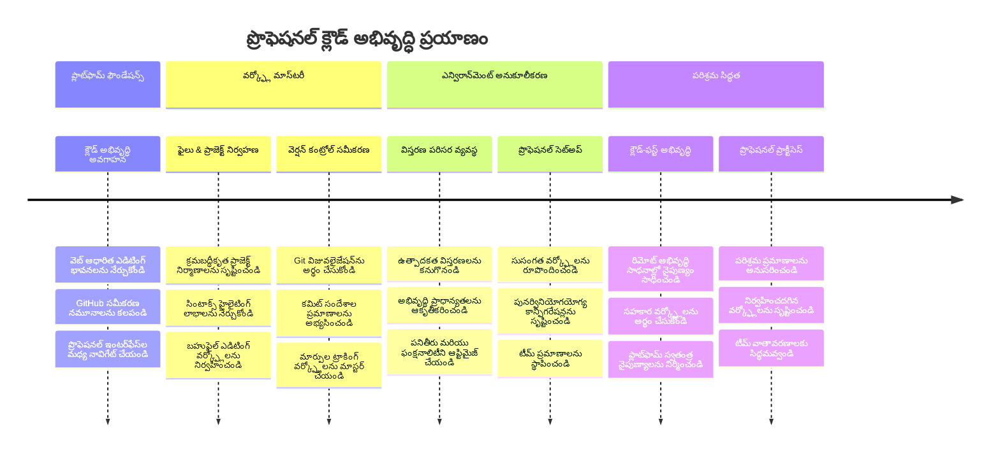
**🎓 పట్టభద్రుల ఆరంభం**: మీరు ప్రముఖ సాంకేతిక కంపెనీలలో వృత్తిపరులైన డెవలపర్లు ఉపయోగించే అదే సాధనాలు మరియు workflow ని ఉపయోగించి క్లౌడ్ ఆధారిత అభివృద్ధిని విజయవంతంగా నేర్చుకున్నారు. ఈ నైపుణ్యాలు సాఫ్ట్‌వేర్ అభివృద్ధి భవిష్యత్తును సూచిస్తాయి.

**🔄 తదుపరి స్థాయి సామర్థ్యాలు**:
- ఆధునిక క్లౌడ్ అభివృద్ధి వేదికలు (Codespaces, GitPod) ను కసరత్తు చేయడానికి సిద్ధంగా
- విస్తృత అభివృద్ధి బృందాల్లో పని చేయడానికి సన్నద్ధం
- ప్రపంచవ్యాప్తంగా ఓపెన్ సోర్స్ ప్రాజెక్టులకు సహకరించడానికి సామర్థ్యం
- ఆధునిక DevOps మరియు నిరంతర ఏకీకరణ పద్ధతులకు పునాది

## GitHub Copilot ఏజెంట్ ఛాలెంజ్ 🚀

NASA అంతరిక్ష మిషన్లకు ఉపయోగించే క్రమబద్ధీకరించిన విధానంలా, ఈ ఛాలెంజ్ VSCode.dev నైపుణ్యాలను పూర్తిపరిణామ వర్క్‌ఫ్లో సన్నివేశంలో అన్వయించడాన్ని కోరి ఉంటుంది.

**లక్ష్యం:** VSCode.dev ఉపయోగం ద్వారా సమగ్ర వెబ్ అభివృద్ధి వర్క్‌ఫ్లోని స్థాపించడంలో నైపుణ్యం ప్రదర్శించండి.

**ప్రాజెక్ట్ అవసరాలు:** ఏజెంట్ మోడ్ సహాయంతో ఈ పనులను పూర్తి చేయండి:
1. ఒక ఉన్న రిపాజిటరీని ఫోర్క్ చేయండి లేదా కొత్తది సృష్టించండి
2. HTML, CSS, మరియు జావాస్క్రిప్ట్ ఫైళ్ళతో పని చేసే ప్రాజెక్టు నిర్మాణాన్ని ఏర్పాటు చేయండి
3. అభివృద్ధిని మెరుగుపరచే మూడు విస్తరణలను ఇన్‌స్టాల్ చేసి కాన్ఫిగర్ చేయండి
4. వివరణాత్మక కమిట్ సందేశాలతో వర్షన్ కంట్రోల్ ప్రాక్టీస్ చేయండి
5. ప్రత్యేక ఫీచర్ బ్రాంచ్ సృష్టి మరియు మార్చుట వ్యాయామం చేయండి
6. README.md ఫైల్లో ప్రక్రియ మరియు నేర్చుకున్న విషయాలను డాక్యుమెంట్ చేయండి

ఈ వ్యాయామం VSCode.dev భావనలన్నిటిని భవిష్యత్తు అభివృద్ధి ప్రాజెక్టులకు వర్తించదగిన ప్రాయోగిక workflow గా సంకలనం చేస్తుంది.

[Agent mode గురించి తెలుసుకోండి](https://code.visualstudio.com/blogs/2025/02/24/introducing-copilot-agent-mode).

## అసైన్‌మెంట్

ఈ నైపుణ్యాలను నిజమైన పరీక్ష కోసం సమయం వచ్చేసింది! నేను మీకు ఒక హ్యాండ్స్-ఆన్ ప్రాజెక్ట్ ఇచ్చాను ఇది మీరు నేర్చుకున్న ప్రతీదాన్ని ప్రాక్టీస్ చేసుకోవడానికి అవకాశం ఇస్తుంది: [VSCode.dev ఉపయోగించి రిజ్యూమ్ వెబ్‌సైట్ సృష్టించండి](./assignment.md)

ఈ అసైన్మెంట్ మీకు బ్రౌజర్‌లోనే పూర్తిగా ప్రొఫెషనల్ రిజ్యూమ్ వెబ్‌సైట్ తయారు చేయడం నేర్పుతుంది. మీరు VSCode.dev యొక్క అన్ని ఫీచర్లను ఉపయోగిస్తారు, చివరికి మీరు మంచి లుక్ ఉన్న వెబ్‌సైట్ తో పాటు మీ కొత్త workflow పై బలం ఉన్న ఆత్మవిశ్వాసాన్ని పొందుతారు.

## ఇంకా అన్వేషించండి మరియు మీ నైపుణ్యాలను పెంచుకోండి

మీకు మంచి పట్టు ఏర్పడింది, కానీ ఇంకా చాలా అద్భుతమైన విషయాలు ఉన్నాయి! మీ VSCode.dev నైపుణ్యాలను తదుపరి స్థాయికి తీసుకెళ్లడానికి కొన్ని వనరులు మరియు ఆలోచనలు ఇక్కడ ఉన్నాయి:

**అధికారిక డాక్యుమెంట్లు జాబితా:**
- [VSCode Web Documentation](https://code.visualstudio.com/docs/editor/vscode-web?WT.mc_id=academic-0000-alfredodeza) – బ్రౌజర్-ఆధారిత ఎడిటింగ్ పూర్తి గైడ్
- [GitHub Codespaces](https://docs.github.com/en/codespaces) – క్లౌడ్లో మరింత శక్తి కావాలంటే

**తరువాత ప్రయోగించవలసిన చల్లని ఫీచర్లు:**
- **కీబోర్డ్ షార్ట్‌కట్‌లు**: మీకు కోడింగ్ నింజలా అనిపించే కీస్ మిశ్రమాలను నేర్చుకోండి
- **వర్క్‌స్పేస్ సెట్టింగ్స్**: వివిధ రకాల ప్రాజెక్టులకు వేర్వేరు వాతావరణాలను సెట్ చేయండి
- **మల్టీ-రూట్ వర్క్‌స్పేస్‌లు**: ఒకేసారి అనేక రిపాజిటరీలపై పని చేయండి (అత్యంత ఉపయోగకరం!)
- **టెర్మినల్ ఇంటిగ్రేషన్**: మీ బ్రౌజర్‌లోనే కమాండ్-లైన్ టూల్స్‌కి యాక్సెస్ పొందండి

**అభ్యాసానికి ఆలోచనలు:**
- కొన్ని ఓపెన్ సోర్స్ ప్రాజెక్టుల్లో ప్రవేశించి VSCode.dev తో సహకరించండి – ఇది తిరిగి ఇచ్చే గొప్ప మార్గం!
- వివిధ విస్తరణలను ప్రయత్నించి మీకు సరిపోయేటటువంటి సెటప్ కనుగొనండి
- మీరు తరచుగా నిర్మించే సైట్ల కోసం ప్రాజెక్ట్ టెంప్లేట్స్ సృష్టించండి
- బ్రాంచింగ్ మరియు మర్జింగ్ వంటి Git workflowలను ప్రాక్టీస్ చేయండి – ఇవి బృంద ప్రాజెక్టుల్లో విలువైన నైపుణ్యాలు

---

**మీరు బ్రౌజర్ ఆధారిత అభివృద్ధిలో నైపుణ్యం సాధించారు!** 🎉 పోర్టబుల్ పరికరాల ఆవిష్కరణవలన శాస్త్రవేత్తలు సుదూర ప్రాంతాల్లో పరిశోధనలు చేయగలిగినట్టుగా, VSCode.dev తో మీరు ఏదైనా ఇంటర్నెట్ కనెక్ట్ అయిన పరికరంతో ప్రొఫెషనల్ కోడింగ్ చేయగలుగుతారు.

ఈ నైపుణ్యాలు ఆధునిక పరిశ్రమ ఆచార్యాలను ప్రతిబింబిస్తాయి – చాలా వృత్తిపరులైన డెవలపర్లు తమ సౌలభ్యం మరియు ప్రాప్యత కోసం క్లౌడ్ ఆధారిత అభివృద్ధి వాతావరణాలను ఉపయోగిస్తారు. మీరు ఒక వ్యక్తిగత ప్రాజెక్టు నుంచి పెద్ద బృంద సహకారాల వరకు విస్తరించే workflow నేర్చుకున్నారు.

ఈ పద్ధతులను మీ తదుపరి అభివృద్ధి ప్రాజెక్టుకు వర్తింపజేయండి! 🚀

---

<!-- CO-OP TRANSLATOR DISCLAIMER START -->
**ముఖాముఖి**:
ఈ డాక్యుమెంట్‌ను AI అనువాద సేవ అయిన [Co-op Translator](https://github.com/Azure/co-op-translator) ఉపయోగించి అనువదించబడింది. మేము ఖచ్చితత్వానికి ప్రయత్నిస్తున్నప్పటికీ, ఆటోమేటెడ్ అనువాదాల్లో తప్పులు లేదా లోపాలు ఉండవచ్చు. మౌలిక భాషలో ఉన్న అసలు డాక్యుమెంట్‌ను అధికారిక మూలంగా పరిగణించాలి. ముఖ్యమైన సమాచారానికి, ప్రొఫెషనల్ మానవ అనువాదం సూచించబడుతుంది. ఈ అనువాదం వలన కలిగే ఏమీ అయోమయాలు లేదా తప్పు అర్థం చేసుకున్నందులకు మేము బాధ్యులు కాదు.
<!-- CO-OP TRANSLATOR DISCLAIMER END -->