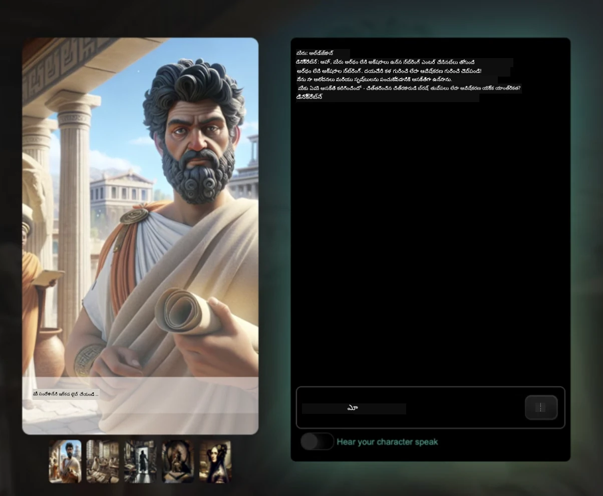
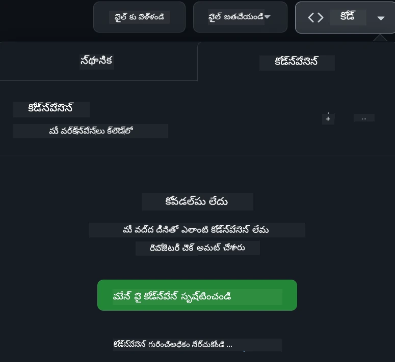

<!--
CO_OP_TRANSLATOR_METADATA:
{
  "original_hash": "fea3a0fceb8ad86fd640c09cf63a2aac",
  "translation_date": "2026-01-08T10:37:44+00:00",
  "source_file": "README.md",
  "language_code": "te"
}
-->
[](https://github.com/microsoft/Web-Dev-For-Beginners/blob/master/LICENSE)
[](https://GitHub.com/microsoft/Web-Dev-For-Beginners/graphs/contributors/)
[](https://GitHub.com/microsoft/Web-Dev-For-Beginners/issues/)
[](https://GitHub.com/microsoft/Web-Dev-For-Beginners/pulls/)
[](http://makeapullrequest.com)

[](https://GitHub.com/microsoft/Web-Dev-For-Beginners/watchers/)
[](https://GitHub.com/microsoft/Web-Dev-For-Beginners/network/)
[](https://GitHub.com/microsoft/Web-Dev-For-Beginners/stargazers/)

[](https://discord.gg/nTYy5BXMWG)

# మొదటిసారిగా వెబ్ డెవలప్‌మెంట్ - ఒక పాఠ్యక్రమం

మైక్రోసాఫ్ట్ క్లౌడ్ అడ్వొకేట్స్ ద్వారా మా 12 వారాల సమగ్ర కోర్సుతో వెబ్ డెవలప్‌మెంట్ మూలాలను నేర్చుకోండి. 24 పాఠాలలో ప్రతి ఒక్కటి టెరేరియంలు, బ్రౌజర్ పొడగింపులు, అంతరిక్ష గేమ్స్ వంటి ప్రాక్టికల్ ప్రాజెక్టుల ద్వారా జావాస్క్రిప్ట్, CSS, మరియు HTML ను లోతుగా అధ్యయనం చేస్తుంది. క్విజ్‌లు, చర్చలు, మరియు ఆచరణాత్మక అసైన్మెంట్లతో పాల్గొనండి. మా ప్రభావవంతమైన ప్రాజెక్ట్-ఆధారిత పాఠ్య విధానంతో మీ నైపుణ్యాలను మెరుగుపరచుకోండి మరియు మీ జ్ఞాన నిల్వను మెరుగుపరచండి. మీ కోడింగ్ ప్రయాణాన్ని ఈ రోజు ప్రారంభించండి!

ఆజ్యూర్ AI ఫౌండ్రరీ డిస్కార్డ్ కమ్యూనిటీకి చేరండి

[](https://discord.gg/nTYy5BXMWG)

ఈ వనరులను ఉపయోగించి ప్రారంభించేందుకు కింది దశలను అనుసరించండి:
1. **రిపాజిటరీని ఫోర్క్ చేయండి**: క్లిక్ చేయండి [](https://GitHub.com/microsoft/Web-Dev-For-Beginners/fork)
2. **రిపాజిటరీని క్లోన్ చేయండి**:   `git clone https://github.com/microsoft/Web-Dev-For-Beginners.git`
3. [**ఆజ్యూర్ AI ఫౌండ్రరీ డిస్కార్డ్‌లో చేరి నిపుణులు మరియు మిత్ర డెవలపర్లను కలవండి**](https://discord.com/invite/ByRwuEEgH4)

### 🌐 బహుభాషా మద్దతు

#### GitHub యాక్షన్ ద్వారా మద్దతు (స్వయంచాలిత & ఎప్పుడూ నవీకరణ)

<!-- CO-OP TRANSLATOR LANGUAGES TABLE START -->
[Arabic](../ar/README.md) | [Bengali](../bn/README.md) | [Bulgarian](../bg/README.md) | [Burmese (Myanmar)](../my/README.md) | [Chinese (Simplified)](../zh/README.md) | [Chinese (Traditional, Hong Kong)](../hk/README.md) | [Chinese (Traditional, Macau)](../mo/README.md) | [Chinese (Traditional, Taiwan)](../tw/README.md) | [Croatian](../hr/README.md) | [Czech](../cs/README.md) | [Danish](../da/README.md) | [Dutch](../nl/README.md) | [Estonian](../et/README.md) | [Finnish](../fi/README.md) | [French](../fr/README.md) | [German](../de/README.md) | [Greek](../el/README.md) | [Hebrew](../he/README.md) | [Hindi](../hi/README.md) | [Hungarian](../hu/README.md) | [Indonesian](../id/README.md) | [Italian](../it/README.md) | [Japanese](../ja/README.md) | [Kannada](../kn/README.md) | [Korean](../ko/README.md) | [Lithuanian](../lt/README.md) | [Malay](../ms/README.md) | [Malayalam](../ml/README.md) | [Marathi](../mr/README.md) | [Nepali](../ne/README.md) | [Nigerian Pidgin](../pcm/README.md) | [Norwegian](../no/README.md) | [Persian (Farsi)](../fa/README.md) | [Polish](../pl/README.md) | [Portuguese (Brazil)](../br/README.md) | [Portuguese (Portugal)](../pt/README.md) | [Punjabi (Gurmukhi)](../pa/README.md) | [Romanian](../ro/README.md) | [Russian](../ru/README.md) | [Serbian (Cyrillic)](../sr/README.md) | [Slovak](../sk/README.md) | [Slovenian](../sl/README.md) | [Spanish](../es/README.md) | [Swahili](../sw/README.md) | [Swedish](../sv/README.md) | [Tagalog (Filipino)](../tl/README.md) | [Tamil](../ta/README.md) | [Telugu](./README.md) | [Thai](../th/README.md) | [Turkish](../tr/README.md) | [Ukrainian](../uk/README.md) | [Urdu](../ur/README.md) | [Vietnamese](../vi/README.md)

> **స్థానికంగా క్లోన్ చేయడానికి ఇష్టపడుతున్నారా?**

> ఈ రిపాజిటరీలో 50+ భాషా అనువాదాలు ఉన్నాయి, అవి డౌన్లోడ్ పరిమాణాన్ని గణనీయంగా పెంచుతాయి. అనువాదాల లేకుండా క్లోన్ చేయడానికి sparse checkout ఉపయోగించండి:
> ```bash
> git clone --filter=blob:none --sparse https://github.com/microsoft/Web-Dev-For-Beginners.git
> cd Web-Dev-For-Beginners
> git sparse-checkout set --no-cone '/*' '!translations' '!translated_images'
> ```
> ఇది మీరు కోర్సు పూర్తిచెయ్యడానికి అవసరమైన అన్ని విషయాలనూ చాలా వేగంగా డౌన్లోడ్ చేయడానికి ఇస్తుంది.
<!-- CO-OP TRANSLATOR LANGUAGES TABLE END -->

**మరిన్ని అనువాద భాషలకు మద్దతు కావాలనుకుంటే వాటిని ఇక్కడ [కూడా](https://github.com/Azure/co-op-translator/blob/main/getting_started/supported-languages.md) చూడండి**

[](https://open.vscode.dev/microsoft/Web-Dev-For-Beginners)

#### 🧑‍🎓 _మీరు విద్యార్థి అయితే?_

[**స్టూడెంట్ హబ్ పేజీ**](https://docs.microsoft.com/learn/student-hub/?WT.mc_id=academic-77807-sagibbon)ను సందర్శించండి, అక్కడ మీరు ప్రారంభ వనరులు, స్టూడెంట్ ప్యాక్స్ మరియు ఉచిత సర్టిఫికెట్ వోచర్ పొందే మార్గాలనూ కనుగొంటారు. ఈ పేజీని మీ బుక్‌మార్క్‌లో ఉంచండి మరియు మేము ప్రతి నెలలో కంటెంట్ మార్చుతూనే ఉంటాము కనుక తరచూ తనిఖీ చేయండి.

### 📣 ప్రకటన - కొత్త GitHub Copilot Agent మోడ్ ఛాలెంజ్‌లను పూర్తి చేయండి!

కొత్త ఛాలెంజ్ జత చేయబడింది, ఎక్కువ భాగ విభాగాల్లో "GitHub Copilot Agent Challenge 🚀" చూడండి. ఇది GitHub Copilot మరియు Agent మోడ్‌ను ఉపయోగించి మీరు పూర్తి చేయాల్సిన కొత్త ఛాలెంజ్. మీరు ఇప్ప‌టివరకు Agent మోడ్ ఉపయోగించుకోకపోతే, ఇది కేవలం టెక్స్ట్‌ను ఉత్పత్తి చేయడమే కాకుండా ఫైళ్లను సృష్టించడం, సవరించడం, ఆదేశాలను నడిపించడం మరియు మరిన్ని చేయగలదు.

### 📣 ప్రకటన - _సృజనాత్మక AI సృష్టించి ప్రాజెక్ట్_ 

కొత్త AI అసిస్టెంట్ ప్రాజెక్ట్ చేరింది, దీన్ని చూడండి [project](./9-chat-project/README.md)

### 📣 ప్రకటన - _జావాస్క్రిప్ట్ కోసం సృజనాత్మక AIపై కొత్త పాఠ్యాంశం_ ఇటీవల విడుదల

మన కొత్త సృజనాత్మక AI పాఠ్యాంశాన్ని కోల్పోకండి!

ప్రారంభించేందుకు సందర్శించండి [https://aka.ms/genai-js-course](https://aka.ms/genai-js-course)!


- ప్రాథమికాలు నుంచి RAG వరకు అన్ని అంశాలను కవర్ చేసే పాఠాలు.
- GenAI మరియు మా సహచర యాప్ ద్వారా చరిత్రాత్మక పాత్రలతో పరస్పర చర్యలు.
- సరదా మరియు ఆకర్షణీయమైన కథనం, మీరు కాల ప్రయాణంలో ఉన్నట్లవుతుంది!




ప్రతి పాఠం పూర్తి చేసుకోవడానికి ఒక అసైన్మెంట్, ఒక జ్ఞాన తనిఖీ మరియు ఓ ఛాలెంజ్ కలిగివుంటుంది, ఇవి మీకు వీలుగా నేర్పుతాయి:
- ప్రాంప్టింగ్ మరియు ప్రాంప్ట్ ఇంజనీరింగ్
- టెక్స్ట్ మరియు ఇమేజ్ యాప్ జనరేషన్
- శోధన యాప్స్

ప్రారంభించేందుకు సందర్శించండి [https://aka.ms/genai-js-course](../../[https:/aka.ms/genai-js-course)


## 🌱 ప్రారంభించటం

> **ఉపాధ్యాయులారా**, ఈ పాఠ్యాంశాన్ని ఎలా ఉపయోగించాలో [కొన్ని సూచనలు](for-teachers.md) మేము ఇచ్చాము. మీ అభిప్రాయాలను [మా చర్చా వేదికలో](https://github.com/microsoft/Web-Dev-For-Beginners/discussions/categories/teacher-corner) పంచుకోండి!

**[అభ్యర్థులు](https://aka.ms/student-page/?WT.mc_id=academic-77807-sagibbon)**, ప్రతి పాఠానికి ముందు ఒక ప్రీ-లెక్చర్ క్విజ్‌తో ప్రారంభించి, లెక్చర్ మటీరియల్ చదవడం, వివిధ కార్యకలాపాలను పూర్తి చేయడం మరియు ఆ తర్వాత ఓ పోస్ట్-లెక్చర్ క్విజ్‌తో మీ అవగాహనని తనిఖీ చేయండి.

మీ అభ్యాస అనుభవాన్ని మెరుగుపరచేందుకు, మీ పీఅర్లతో కలిసి ప్రాజెక్టులపై పనిచేయండి! మా [చర్చా వేదికలో](https://github.com/microsoft/Web-Dev-For-Beginners/discussions) చర్చలను ప్రోత్సహిస్తారు, అక్కడ మన మోడరేటర్లు మీ ప్రశ్నలకు సమాధానం ఇవ్వడానికి అందుబాటులో ఉంటారు.

మీ విద్యాభ్యాసాన్ని పెంపొందించుకోవడానికై, అదనపు అధ్యయన సామగ్రి కొరకు మేము [Microsoft Learn](https://learn.microsoft.com/users/wirelesslife/collections/p1ddcy5jwy0jkm?WT.mc_id=academic-77807-sagibbon)ను అన్వేషించమని పునఃప్రతిపాదిస్తున్నాము.

### 📋 మీ పరిసరాలను సెట్ చేయండి

ఈ పాఠ్యాంశానికి అభివృద్ధి పరిసరాలు సిద్ధంగా ఉన్నాయి! మీరు ప్రారంభిస్తున్నప్పుడు మీరు కోర్సును [Codespace](https://github.com/features/codespaces/) (_బ్రౌజర్-ఆధారిత, ఇన్‌స్టాలేషన్లు అవసరం లేని పరిసర_)లో లేదా [Visual Studio Code](https://code.visualstudio.com/?WT.mc_id=academic-77807-sagibbon) వంటి టెక్స్ట్ ఎడిటర్‌తో మీ కంప్యూటర్‌లో స్థానికంగా లవ్వవచ్చు.

#### మీ రిపాజిటరీ సృష్టించండి
మీ పని సులభంగా భద్రపరచుకునేందుకు, ఈ రిపాజిటరీ యొక్క మీ సొంత కాపీని సృష్టించడం సిఫార్సు చేస్తాము. దీని కోసం పేజీ పైభాగంలో ఉన్న **Use this template** బటన్‌ను క్లిక్ చేయండి. ఇది మీ GitHub ఖాతాలో ఈ పాఠ్యాంశం యొక్క కాపీతో కొత్త రిపాజిటరీని సృష్టిస్తుంది.

ఈ దశలను అనుసరించండి:
1. **రిపాజిటరీని ఫోర్క్ చేయండి**: ఈ పేజీ యొక్క పై-కుడివైపు ఉన్న "Fork" బటన్‌ను క్లిక్ చేయండి.
2. **రిపాజిటరీని క్లోన్ చేయండి**:   `git clone https://github.com/microsoft/Web-Dev-For-Beginners.git`

#### Codespace లో పాఠ్యాంశం నడపడం

మీ సృష్టించిన ఈ రిపాజిటరీ కాపీ లో **Code** బటన్‌ను క్లిక్ చేసి **Open with Codespaces** ఎంపికను ఎంపిక చేసుకోండి. ఇది మీరు పనిచేయడానికి కొత్త Codespaceను సృష్టిస్తుంది.



#### మీ కంప్యూటర్‌లో స్థానికంగా పాఠ్యాంశం నడపడం

ఈ పాఠ్యాంశాన్ని మీ కంప్యూటర్‌లో నడపడానికి మీకు ఒక టెక్స్ట్ ఎడిటర్, ఒక బ్రౌజర్ మరియు ఒక కమాండ్ లైన్ టూల్ అవసరం. మా మొదటి పాఠం, [Introduction to Programming Languages and Tools of the Trade](../../1-getting-started-lessons/1-intro-to-programming-languages), ఈ పరికరాల ఎంపికలకు వివిధ ఆప్షన్లను మీకు చూపుతుంది.

మా సిఫార్సు [Visual Studio Code](https://code.visualstudio.com/?WT.mc_id=academic-77807-sagibbon)ను ఎడిటర్‌గా ఉపయోగించడం, దీంట్లో అంతర్గతంగా ఉన్న [Terminal](https://code.visualstudio.com/docs/terminal/basics/?WT.mc_id=academic-77807-sagibbon) కూడా ఉంటుంది. Visual Studio Codeని మీరు ఇక్కడ నుండి డౌన్లోడ్ చేసుకోగలరు [ఇక్కడ](https://code.visualstudio.com/?WT.mc_id=academic-77807-sagibbon).


1. మీ రిపాజిటరీని మీ కంప్యూటర్‌కి క్లోన్ చేయండి. ఇది చేయడానికి మీరు **Code** బటన్‌ను క్లిక్ చేసి URLని కాపీ చేసుకోవాలి:

    [CodeSpace](./images/createcodespace.png)
ఆ తర్వాత, [Visual Studio Code](https://code.visualstudio.com/?WT.mc_id=academic-77807-sagibbon)లో [Terminal](https://code.visualstudio.com/docs/terminal/basics/?WT.mc_id=academic-77807-sagibbon)ను తెరిచి, మీరు కాపీ చేసిన URLని `<your-repository-url>`తో మార్చి క్రింది కమాండ్‌ను నడపండి:

    ```bash 
    git clone <your-repository-url>
    ```
  
2. Visual Studio Codeలో ఫోల్డర్‌ను తెరవండి. మీరు దీన్ని **File** > **Open Folder**పై క్లిక్ చేసి క్లోన్ చేసిన ఫోల్డర్‌ను ఎంచుకునేటప్పుడు చేయవచ్చు.

>  సిఫార్సు చేయబడిన Visual Studio Code ఎక్స్‌టెన్షన్లు:  
>  
> * [Live Server](https://marketplace.visualstudio.com/items?itemName=ritwickdey.LiveServer&WT.mc_id=academic-77807-sagibbon) - Visual Studio Codeలో HTML పేజీలను ప్రివ్యూ చేయడానికి  
> * [Copilot](https://marketplace.visualstudio.com/items?itemName=GitHub.copilot&WT.mc_id=academic-77807-sagibbon) - మీ కోడ్ వేగంగా రాయడంలో సహాయపడుతుంది

## 📂 ప్రతి పాఠంలో ఇవి ఉంటాయి:

- ఐచ్ఛిక స్కెచ్‌నోట్  
- ఐచ్ఛిక అనుబంధ వీడియో  
- పాఠానికి ముందు వార్మప్ క్విజ్  
- వ్రాసిన పాఠం  
- ప్రాజెక్ట్-ఆధారిత పాఠాల కోసం, ప్రాజెక్టును ఎలా నిర్మించాలి అనే దశల వారీ మార్గదర్శకాలు  
- జ్ఞాన పరీక్షలు  
- ఒక సవాలు  
- అనుబంధ పఠనం  
- అసైన్‌మెంట్  
- [పాఠం తరువాత క్విజ్](https://ff-quizzes.netlify.app/web/)

> **క్విజ్‌ల గురించిన ఒక గమనిక**: అన్ని క్విజ్‌లు Quiz-app ఫోల్డర్‌లో ఉంటాయి, మూడు ప్రశ్నలతో మొత్తం 48 క్విజ్‌లు ఉన్నాయి. అవి [ఇక్కడ](https://ff-quizzes.netlify.app/web/) అందుబాటులో ఉంటాయి; క్విజ్ యాప్‌ను స్థానికంగా నడపవచ్చు లేదా Azureలో ఉంచవచ్చు; `quiz-app` ఫోల్డర్‌లో ఉన్న సూచనలను అనుసరించండి.

## 🗃️ పాఠాలు

|     |                       ప్రాజెక్ట్ పేరు                        |                            పాఠ్యాంశాలు                             | అభ్యసన లక్ష్యాలు                                                                                                                 |                                                         లింక్ చేసిన పాఠం                                                          |         రచయిత          |
| :-: | :------------------------------------------------------: | :--------------------------------------------------------------------: | ----------------------------------------------------------------------------------------------------------------------------------- | :----------------------------------------------------------------------------------------------------------------------------: | :---------------------: |
| 01  |                     Getting Started                      |           ప్రోగ్రామింగ్ పరిచయం మరియు పనిముట్లు           | ఎక్కువ భాగం ప్రోగ్రామింగ్ భాషలపై ప్రాథమిక అవగాహన మరియు ప్రొఫెషనల్ డెవలపర్‌లు తమ పనులు చేయటానికి ఉపయోగించే సాఫ్ట్వేర్ గురించి తెలుసుకోండి | [Intro to Programming Languages and Tools of the Trade](./1-getting-started-lessons/1-intro-to-programming-languages/README.md) |         జాస్మిన్         |
| 02  |                     Getting Started                      |             GitHub ప్రాథమికాలు, ఒక జట్టుతో పనిచేయడం             | మీ ప్రాజెక్టులో GitHubను ఎలా ఉపయోగించాలో, ఇతరులతో కోడ్ బేస్‌పై ఎలా సహకరించాలో తెలుసుకోండి                                                    |                            [Intro to GitHub](./1-getting-started-lessons/2-github-basics/README.md)                             |          ఫ్లోర్          |
| 03  |                     Getting Started                      |                             యాక్సెస్‌బిలిటీ                              | వెబ్ యాక్సెస్‌బిలిటీ ప్రాథమికాలు నేర్చుకోండి                                                                                               |                       [Accessibility Fundamentals](./1-getting-started-lessons/3-accessibility/README.md)                       |       క్రిస్టోఫర్       |
| 04  |                        JS Basics                         |                         JavaScript డేటా రకాల గురించి                          | JavaScript డేటా రకాల ప్రాథమికాలు                                                                                                 |                                       [Data Types](./2-js-basics/1-data-types/README.md)                                        |         జాస్మిన్         |
| 05  |                        JS Basics                         |                         ఫంక్షన్స్ మరియు మెథడ్స్                          | అనువర్తనం లాజిక్ ఫ్లోను నిర్వహించటానికి ఫంక్షన్స్ మరియు మెథడ్స్ గురించి తెలుసుకోండి                                                             |                              [Functions and Methods](./2-js-basics/2-functions-methods/README.md)                               | జాస్మిన్ మరియు క్రిస్టోఫర్ |
| 06  |                        JS Basics                         |                        JSతో నిర్ణయాలు తీసుకోవడం                        | డిసిజన్-మేకింగ్ మెథడ్స్ ఉపయోగించి మీ కోడ్‌లో నిబంధనలు సృష్టించడం ఎలా చేయాలో తెలుసుకోండి                                                           |                                 [Making Decisions](./2-js-basics/3-making-decisions/README.md)                                  |         జాస్మిన్         |
| 07  |                        JS Basics                         |                            అర్రేజి మరియు లూపులు                            | JavaScriptలో అర్రేజి మరియు లూపులతో డేటాతో పని చేయండి                                                                                 |                                   [Arrays and Loops](./2-js-basics/4-arrays-loops/README.md)                                    |         జాస్మిన్         |
| 08  |       [Terrarium](./3-terrarium/solution/README.md)       |                            HTML అన్వయాలు                            | ఆన్‌లైన్ టెరేరియం సృష్టించడానికి HTML నిర్మించండి, లేఅవుట్ ను నిర్మించడంపై దృష్టి పెట్టి                                                         |                                 [Introduction to HTML](./3-terrarium/1-intro-to-html/README.md)                                 |           జెన్           |
| 09  |       [Terrarium](./3-terrarium/solution/README.md)       |                            CSS అన్వయాలు                             | ఆన్‌లైన్ టెరేరియం స్టైల్ చేయడానికి CSS నిర్మించండి, పేజీ ప్రతిస్పందనను అందించడం సహా CSS ప్రాథమిక విషయాలపై దృష్టి పెట్టి                     |                                  [Introduction to CSS](./3-terrarium/2-intro-to-css/README.md)                                  |           జెన్           |
| 10  |            [Terrarium](./3-terrarium/solution/README.md)            |                 JavaScript క్లోజర్స్, DOM మానిప్యులేషన్                  | టెరేరియం డ్రాగ్/డ్రాప్ ఇంటర్‌ఫేస్‌గా పని చేయడానికి JavaScript నిర్మించండి, క్లోజర్‌లు మరియు DOM మానిప్యులేషన్ పై దృష్టి పెట్టి             |                  [JavaScript Closures, DOM manipulation](./3-terrarium/3-intro-to-DOM-and-closures/README.md)                   |           జెన్           |
| 11  |          [Typing Game](./4-typing-game/solution/README.md)          |                          టైపింగ్ గేమ్ తయారు చేయడం                           | క్లavier ఈవెంట్లను ఉపయోగించి మీ JavaScript యాప్ యొక్క లాజిక్‌ను డ్రైవ్ చేయడం ఎలా తెలుసుకోండి                                                          |                                [Event-Driven Programming](./4-typing-game/typing-game/README.md)                                |       క్రిస్టోఫర్       |
| 12  | [Green Browser Extension](./5-browser-extension/solution/README.md) |                         బ్రౌజర్లు ఎలా పనిచేస్తాయో తెలుసుకోవడం                          | బ్రౌజర్ల చరిత్ర, పని విధానం, బ్రౌజర్ ఎక్స్‌టెన్షన్ మొదటి అంశాలను ఎలా రూపొందించాలో తెలుసుకోండి                               |                               [About Browsers](./5-browser-extension/1-about-browsers/README.md)                                |           జెన్           |
| 13  | [Green Browser Extension](./5-browser-extension/solution/README.md) | ఫారం నిర్మాణం, API పిలుపు, లోకల్ స్టోరేజ్‌లో వేరియబుల్స్ నిల్వ చేయడం | లోకల్ స్టోరేజీలో నిల్వ చేసిన వేరియబుల్స్ ఉపయోగించి API పిలవడానికి మీ బ్రౌజర్ ఎక్స్‌టెన్షన్ యొక్క JavaScript అంశాలను నిర్మించండి                      |                [APIs, Forms, and Local Storage](./5-browser-extension/2-forms-browsers-local-storage/README.md)                 |           జెన్           |
| 14  | [Green Browser Extension](./5-browser-extension/solution/README.md) |          బ్రౌజర్‌లో బ్యాక్‌గ్రౌండ్ ప్రాసెస్‌లు, వెబ్ పనితీరు          | ఎక్స్‌టెన్షన్ ఐకాన్‌ను నిర్వహించడానికి బ్రౌజర్ బ్యాక్‌గ్రౌండ్ ప్రాసెస్‌లను ఉపయోగించండి; వెబ్ పనితీరు, కొన్ని ఆప్టిమైజేషన్‌ల గురించి తెలుసుకోండి   |             [Background Tasks and Performance](./5-browser-extension/3-background-tasks-and-performance/README.md)              |           జెన్           |
| 15  |           [Space Game](./6-space-game/solution/README.md)           |             JavaScriptతో మరింత అధునాతన గేమ్ డెవలప్‌మెంట్             | క్లాసులు మరియు కంపోజిషన్ ఉపయోగించి ఇన్హెరిటెన్స్, పబ్/సబ్ ప్యాటర్న్ గురించి తెలుసుకోండి, గేమ్ నిర్మాణానికి సిద్ధమవ్వండి              |                      [Introduction to Advanced Game Development](./6-space-game/1-introduction/README.md)                       |          క్రిస్          |
| 16  |           [Space Game](./6-space-game/solution/README.md)           |                           క్యాన్వాస్‌కి డ్రాయింగ్                            | స్క్రీన్‌కి అంశాలను డ్రా చేయడానికి ఉపయోగించే Canvas API గురించి తెలుసుకోండి                                                                       |                                [Drawing to Canvas](./6-space-game/2-drawing-to-canvas/README.md)                                |          క్రిస్          |
| 17  |           [Space Game](./6-space-game/solution/README.md)           |                   స్క్రీన్ చుట్టూ అంశాలను చలనం చేయడం                    | కార్టిసియన్ కోఆర్డినేట్లు మరియు Canvas API ఉపయోగించి అంశాలకు మోషన్ ఎలా వస్తుందో తెలుసుకోండి                                            |                           [Moving Elements Around](./6-space-game/3-moving-elements-around/README.md)                           |          క్రిస్          |
| 18  |           [Space Game](./6-space-game/solution/README.md)           |                          టक्कर గుర్తింపు                           | కీలపై ప్రెస్‌లతో అంశాలు తగిలించేలా చేయండి మరియు గేమ్ పనితీరు కోసం కోల్డౌన్ ఫంక్షన్ ఇవ్వండి    |                              [Collision Detection](./6-space-game/4-collision-detection/README.md)                              |          క్రిస్          |
| 19  |           [Space Game](./6-space-game/solution/README.md)           |                             స్కోరు పరిశీలించడం                              | గేమ్ యొక్క స్థితి మరియు పనితీరుపై ఆధారం కాబట్టి గణిత లెక్కింపులు చేయండి                                                                |                                    [Keeping Score](./6-space-game/5-keeping-score/README.md)                                    |          క్రిస్          |
| 20  |           [Space Game](./6-space-game/solution/README.md)           |                     గేమ్ ముగింపు మరియు మళ్ళీ ప్రారంభం                     | గేమ్‌ను ముగించడం మరియు మళ్లీ ప్రారంభించడం గురించి తెలుసుకోండి, ఆస్తులను శుభ్రపరచడం మరియు వేరియబుల్ విలువలను రీసెట్ చేయడం                              |                                [The Ending Condition](./6-space-game/6-end-condition/README.md)                                 |          క్రిస్          |
| 21  |         [Banking App](./7-bank-project/solution/README.md)          |                 వెబ్ యాప్‌లో HTML టెంప్లేట్లు మరియు రూట్లు                 | బహుళపేజీ వెబ్‌సైట్ ఆర్కిటెక్చర్ రూటింగ్ మరియు HTML టెంప్లేట్లను ఎలా సృష్టించాలో తెలుసుకోండి                             |                            [HTML Templates and Routes](./7-bank-project/1-template-route/README.md)                             |          యోహాన్          |
| 22  |         [Banking App](./7-bank-project/solution/README.md)          |                  లాగిన్ మరియు రిజిస్ట్రేషన్ ఫారం నిర్మించండి                   | ఫారమ్‌ల నిర్మాణం మరియు వాలిడేషన్ రొటీన్‌ల గురించి తెలుసుకోండి                                                                          |                                           [Forms](./7-bank-project/2-forms/README.md)                                           |          యోహాన్          |
| 23  |         [Banking App](./7-bank-project/solution/README.md)          |                   డేటాను పొందడం మరియు ఉపయోగించడం                   | మీ యాప్‌లో డేటా ఎలా ప్రవహిస్తుందో, దాన్ని ఎలా పొందాలో, నిల్వ చేయాలో, తీసేయాలో తెలుసుకోండి                                                 |                                            [Data](./7-bank-project/3-data/README.md)                                            |          యోహాన్          |
| 24  |         [Banking App](./7-bank-project/solution/README.md)          |                      స్టేట్ మేనేజ్‌మెంట్ పాఠాలు                      | మీ యాప్ స్టేట్‌ను ఎలా నిలుపుకోగలదు మరియు ప్రోగ్రామింగ్ ద్వారా దీనిని ఎలా నిర్వహించాలో తెలుసుకోండి                                                              |                                [State Management](./7-bank-project/4-state-management/README.md)                                |          యోహాన్          |
| 25 | [Browser/VScode Code](../../8-code-editor) | VScodeతో పని చేయడం | కోడ్ ఎడిటర్ ఉపయోగించడం నేర్చుకోండి | [Use VScode Code Editor](./8-code-editor/1-using-a-code-editor/README.md) | క్రిస్ |
| 26 | [AI Assistants](./9-chat-project/README.md) | AIతో పని చేయడం | మీ స్వంత AI అసిస్టెంట్‌ను ఎలా నిర్మించాలో నేర్చుకోండి | [AI Assistant project](./9-chat-project/README.md) | క్రిస్ |

## 🏫 పాఠ్య విధానం

మా పాఠ్యক্রমం రెండు ముఖ్యమైన విద్యా సూత్రాలతో రూపొందించబడి ఉంది:  
* ప్రాజెక్ట్-ఆధారిత అభ్యాసం  
* తరచూ క్విజ్‌లు

ఈ ప్రోగ్రామ్ JavaScript, HTML, CSS ప్రాథమిక అంశాలను మరియు ఈ రోజుకి ఉన్న వెబ్ డెవలపర్ల ఉపయోగించే తాజా టూల్స్ మరియు సాంకేతికతలను పాఠ్యాంశాలుగా అందిస్తుంది. విద్యార్థులు ఒక టైపింగ్ గేమ్, వర్చువల్ టెరేరియం, పర్యావరణ సంబంధ బ్రౌజర్ ఎక్స్‌టెన్షన్, స్పేస్-ఇన్వేడర్ శైలిలో గేమ్, మరియు వ్యాపారాల కోసం బ్యాంకింగ్ యాప్ వంటి ప్రాజెక్టులు ద్వారా ప్రత్యక్ష అనుభవాన్ని పొందగలుగుతారు. సిరీస్ ముగింపు వరకు, విద్యార్థులు వెబ్ డెవలప్‌మెంట్‌పై బలమైన అవగాహన పొందుతారు.

> 🎓 మీరు ఈ కారిక్యులమ్‌లో మొదటి కొన్ని పాఠాలను Microsoft Learnలో [Learn Path](https://docs.microsoft.com/learn/paths/web-development-101/?WT.mc_id=academic-77807-sagibbon)గా తీసుకోవచ్చు!

అంశాలు ప్రాజెక్టులతో సరిపోల్చడం ద్వారా, విద్యార్థులకు ఆ ట్రాక్ మరింత ఆకర్షణీయంగా మారుతుంది మరియు ఆచరణలో నిలుపుకునే సామర్థ్యం పెరుగుతుంది. మేము JavaScript ప్రాథమికాలు పరిచయం చేసే పలు స్టార్టర్ పాఠాలు కూడా రాశాము, అవి "[Beginners Series to: JavaScript](https://channel9.msdn.com/Series/Beginners-Series-to-JavaScript/?WT.mc_id=academic-77807-sagibbon)" వీడియో ట్యుటోరియల్స్ సేకరణ నుంచి ఒక వీడియోతో జతపరచబడ్డాయి, వీరి రచయితలలో కొందరు ఈ కారిక్యులమ్‌లో భాగస్వామ్యం చేసారు.

దీనిలో ఒక తరగతికి ముందు తక్కువ-ప్రమాద క్విజ్ చేస్తే, విద్యార్థి ఆ విషయంలో నేర్చుకునేందుకు మైండ్ సెట్ ఏర్పడుతుంది, తరగతి తర్వాత రెండో క్విజ్ మరింత పట్టు పెరుగుదలని నిర్ధారిస్తుంది. ఈ కారిక్యులమ్ ఫ్లెక్సిబుల్ మరియు సరదాగా ఉండేలా రూపొందించబడింది, పూర్తిగా లేదా భాగమైనా తీసుకోవచ్చు. ప్రాజెక్టులు చిన్నదిగా ప్రారంభించి 12 వారాల చక్రం చివరికి క్రమంగా క్లిష్టంగా మారతాయి.

JavaScript ఫ్రేమ్‌వర్క్‌లను ప్రవేశపెట్టకుండా, ప్రాథమిక నైపుణ్యాలపై దృష్టి సారించి, ఫ్రేమ్‌వర్క్‌ను అంగీకరించేప్పుడు అవసరమైన స్కిల్స్‌పై దృష్టి కల్పించాము; ఈ కారిక్యులమ్ పూర్తి చేయడానికి తదుపరి మంచి దశ Node.js గురించి "[Beginner Series to: Node.js](https://channel9.msdn.com/Series/Beginners-Series-to-Nodejs/?WT.mc_id=academic-77807-sagibbon)" ఏక సంపుటి వీడియోలు నేర్చుకోవడమే.

> మా [Code of Conduct](CODE_OF_CONDUCT.md) మరియు [Contributing](CONTRIBUTING.md) మార్గదర్శకాలను సందర్శించండి. మీ నిర్మాణాత్మక ప్రతిస్పందనను మేము స్వాగతిస్తాము!

## 🧭 ఆఫ్‌లైన్ యాక్సెస్

[Docsify](https://docsify.js.org/#/)ను ఉపయోగించి మీరు ఈ డాక్యుమెంటేషన్‌ను ఆఫ్‌లైన్‌లో నడుపుకోవచ్చు. ఈ రెపోను ఫోర్క్ చేసి, మీ లోకల్ మెషీన్‌లో [Docsify ఇనిస్టాల్](https://docsify.js.org/#/quickstart) చేసుకోండి, ఆపై ఈ రెపో యొక్క రూట్ ఫోల్డర్‌లో `docsify serve` టైప్ చేయండి. ఈ వెబ్‌సైట్ మీ స్థానిక మెషీన్‌లో పోర్ట్ 3000పై అందుబాటులో ఉంటుంది: `localhost:3000`.

## 📘 PDF

అన్ని పాఠాల PDF దీనిలో [ఇక్కడ](https://microsoft.github.io/Web-Dev-For-Beginners/pdf/readme.pdf) పొందుపరచబడి ఉంది.

## 🎒 ఇతర కోర్సులు
మా బృందం ఇతర కోర్సులు కూడా రూపొందిస్తోంది! చూడండి:

<!-- CO-OP TRANSLATOR OTHER COURSES START -->
### LangChain
[](https://aka.ms/langchain4j-for-beginners)
[](https://aka.ms/langchainjs-for-beginners?WT.mc_id=m365-94501-dwahlin)

---

### Azure / Edge / MCP / Agents
[](https://github.com/microsoft/AZD-for-beginners?WT.mc_id=academic-105485-koreyst)
[](https://github.com/microsoft/edgeai-for-beginners?WT.mc_id=academic-105485-koreyst)
[](https://github.com/microsoft/mcp-for-beginners?WT.mc_id=academic-105485-koreyst)
[](https://github.com/microsoft/ai-agents-for-beginners?WT.mc_id=academic-105485-koreyst)

---
 
### Generative AI Series
[](https://github.com/microsoft/generative-ai-for-beginners?WT.mc_id=academic-105485-koreyst)
[-9333EA?style=for-the-badge&labelColor=E5E7EB&color=9333EA)](https://github.com/microsoft/Generative-AI-for-beginners-dotnet?WT.mc_id=academic-105485-koreyst)
[-C084FC?style=for-the-badge&labelColor=E5E7EB&color=C084FC)](https://github.com/microsoft/generative-ai-for-beginners-java?WT.mc_id=academic-105485-koreyst)
[-E879F9?style=for-the-badge&labelColor=E5E7EB&color=E879F9)](https://github.com/microsoft/generative-ai-with-javascript?WT.mc_id=academic-105485-koreyst)

---
 
### Core Learning
[](https://aka.ms/ml-beginners?WT.mc_id=academic-105485-koreyst)
[](https://aka.ms/datascience-beginners?WT.mc_id=academic-105485-koreyst)
[](https://aka.ms/ai-beginners?WT.mc_id=academic-105485-koreyst)
[](https://github.com/microsoft/Security-101?WT.mc_id=academic-96948-sayoung)
[](https://aka.ms/webdev-beginners?WT.mc_id=academic-105485-koreyst)
[](https://aka.ms/iot-beginners?WT.mc_id=academic-105485-koreyst)
[](https://github.com/microsoft/xr-development-for-beginners?WT.mc_id=academic-105485-koreyst)

---
 
### Copilot Series
[](https://aka.ms/GitHubCopilotAI?WT.mc_id=academic-105485-koreyst)
[](https://github.com/microsoft/mastering-github-copilot-for-dotnet-csharp-developers?WT.mc_id=academic-105485-koreyst)
[](https://github.com/microsoft/CopilotAdventures?WT.mc_id=academic-105485-koreyst)
<!-- CO-OP TRANSLATOR OTHER COURSES END -->

## సహాయం పొందడం

మీరు ఇబ్బందిలో పడితే లేదా AI యాప్స్‌ను బిల్డ్ చేయడంపై ఏవైనా ప్రశ్నలు ఉంటే. MCP గురించి చర్చల్లో పార్టిసిపేట్ చేయడానికి తోటి అధ్యయనకర్తలు మరియు అనుభవజ్ఞులు ఉన్నారు. ప్రశ్నలు స్వాగతం మరియు జ్ఞానం స్వేచ్ఛగా పంచుకునే సహాయక సముదాయం ఇది.

[](https://discord.gg/nTYy5BXMWG)

మీకు ప్రోడక్ట్ ఫీడ్‌బ్యాక్ లేదా బిల్డ్ చేస్తున్నప్పుడు ఎర్రర్లు ఉంటే సందర్శించండి:

[](https://aka.ms/foundry/forum)

## లైసెన్స్

ఈ రిపోజిటరీ MIT లైసెన్స్ కింద లైసెన్స్ చేయబడింది. మరిన్ని వివరాలకు [LICENSE](../../LICENSE) ఫైలు చూడండి.

---

<!-- CO-OP TRANSLATOR DISCLAIMER START -->
**తప్పిదృశ్యం**:
ఈ పత్రం AI అనువాద సేవ [Co-op Translator](https://github.com/Azure/co-op-translator) ఉపయోగించి అనువదించబడింది. మేము సాదని అక్షర్యత కోసం ప్రయత్నించినప్పటికీ, ఆటోమేటెడ్ అనువాదాల్లో తప్పులు లేదా అసమర్ధతలు ఉండవచ్చు. అసలు పత్రాన్ని దాని మూలభాషలోనే అధికారిక మూలంగా పరిగణించాలి. కీలక సమాచారం కోసం, నిపుణులైన మానవ అనువాదం సిఫార్సు చేయబడుతుంది. ఈ అనువాదం వలన కలిగే అవగాహనా తప్పులు లేదా దోషాల కోసం మేము బాధ్యత వహించమేము.
<!-- CO-OP TRANSLATOR DISCLAIMER END -->